# Environment Variables

> [!quote]
> "Explicit is better than implicit."
>
> — **Tim Peters**, The Zen of Python

> [!abstract]- Summary
>
> How environment variables propagate through process hierarchies in bash and PowerShell, covering every stage from in-memory assignment through session persistence, template substitution, and secure credential injection.
>
> **Propagation model**
> - Fork + exec snapshot: a child receives a one-time copy of the parent's exported environment at launch — no live sync, no back-propagation
> - Shell-local variables (no `export`) are invisible to child processes; only exported variables reach them
> - Environment is strings-only; total size capped at ~32 KiB on Linux (`ARG_MAX`) and 32,767 chars per variable on Windows
>
> **Linux tools**
> - View: `env` (all exported vars), `printenv` (specific vars), `env -i` (empty environment), `env -u` (exclude a var)
> - Set and propagate: `export VAR=value`; inline `VAR=value command` for single-command scope; `export -n` to revoke; `export -p` to dump all
> - Remove: `unset VAR` (removes from both shell and export list); `unset -f` for functions
> - Persist (user): append `export` lines to `~/.bashrc` (interactive shells) or `~/.profile` / `~/.bash_profile` (login shells); `source` to reload
> - Persist (system): write `KEY=value` to `/etc/environment`; no `export` keyword; requires root; applies to all users and systemd services
> - Load from file: `source .env` (exports into current shell); `env $(grep -v '^#' .env | xargs) command` (scoped to command only)
> - Template substitution: `envsubst < template > output`; restrict to specific variables with `envsubst '$A,$B'`
>
> **PowerShell tools**
> - View: `Get-ChildItem Env:` (all); `$env:NAME` (specific); `Where-Object` for pattern filtering; `[bool]$env:NAME` to check existence
> - Set (session): `$env:VAR = "value"` — equivalent to `export`; children inherit it; disappears when session ends
> - Remove (session): `Remove-Item Env:VAR`; wrap in `try/finally` to guarantee cleanup around a command
> - Persist (user): `[Environment]::SetEnvironmentVariable("VAR", "value", "User")` → writes to `HKCU:\Environment`
> - Persist (system): `[Environment]::SetEnvironmentVariable("VAR", "value", "Machine")` → registry, requires Administrator
> - Persist via profile: add `$env:VAR = "value"` to `$PROFILE`; `. $PROFILE` to reload in current session
> - Load from `.env`: manual `ForEach-Object` parser or `Set-PsEnv` module from PSGallery
>
> **Secure credential handling**
> - Linux pattern: resolve at runtime from GCP Secret Manager or a file → `export` → use → `unset` immediately
> - PowerShell pattern: same sequence with `Remove-Item Env:` cleanup; use `try/finally` to guarantee removal on error
> - Process environment is safer than CLI arguments (`ps aux` exposes args to all users) but not safe at rest; use a secret manager for long-lived secrets
>
> **Operations and safety**
> - When to use: runtime configuration varying by environment, credentials as a transient handoff from a secret manager, 12-factor apps, CI/CD pipelines
> - When not to use: structured/large config (use config files + file-path pointer), multi-line or binary data, long-lived secrets, cross-process sharing, anything that must survive a reboot without explicit setup
> - Warnings: secrets in CLI args visible to all users; exported vars inherited by all children; `.env` files must never be committed; cron/systemd/Task Scheduler have minimal environments; common name collisions (`PATH`, `HOME`, `USER`)
> - Recommendations table: 9 scenarios covering setting, scoping, persisting (user + system), loading `.env`, secret injection, `envsubst` templating, debugging, and naming conventions
> - Troubleshooting: 7 failure modes covering missing vars in scripts/cron/containers, stale child values, unexpected persistence from startup files, CI environment mismatches, `envsubst` literal placeholders, `ARG_MAX` exhaustion, and PowerShell registry/session mismatch

> [!note]- Glossary
>
> **`Environment variable`**
> - A named string value stored in a process's memory, readable by any program running inside that process.
> - Every tool in this note — `export`, `$env:`, `.env` files, `envsubst` — creates, reads, or removes environment variables; understanding what they are and where they live is the prerequisite for all other sections.
>
> > [!warning] Not the same as a shell-local variable
> >
> > A variable assigned without `export` (bash) exists only in the current shell and is invisible to any child process. The distinction between "in the environment" and "in the shell" is the root cause of the most common class of bugs this note addresses.
>
> ---
>
> **`Shell-local variable`**
> - A variable that exists only inside the current shell session and is never copied into the environment of child processes unless explicitly exported.
> - Explains why `MY_VAR="value"` without `export` silently fails when a Python script, Docker command, or cron job tries to read it.
>
> > [!warning] No automatic inheritance
> >
> > There is no setting that makes all shell variables automatically propagate. Inheritance requires an explicit `export` (bash) or an `$env:` assignment (PowerShell). Assuming propagation without export is the single most common environment variable mistake.
>
> ---
>
> **`export`**
> - The bash built-in that marks a shell variable for inclusion in the environment copied to every child process the shell spawns.
> - On Linux, `export VAR=value` is the primary mechanism for making variables visible to subprocesses; PowerShell does this implicitly when you assign to `$env:VAR`.
>
> > [!info] `export` is not required on reassignment
> >
> > Once a variable name has been exported in a session (`export DB_HOST=...`), subsequent reassignments (`DB_HOST=new_value`) are automatically reflected in future children. You only need to call `export` again after `export -n` has removed the export attribute.
>
> ---
>
> **`Child process`**
> - Any program launched from the current shell — a Python script, a Docker command, a cron job, a subshell.
> - Environment variables propagate from parent to child at launch time; they do not propagate from child to parent, nor between siblings.
>
> > [!info] One-way, point-in-time propagation
> >
> > A child receives a snapshot of the parent's exported environment at the moment of `fork`. Changes the parent makes after that point — and all changes the child makes — are invisible to the other. There is no shared live state.
>
> ---
>
> **`fork + exec`**
> - The two-step Unix mechanism for launching a process: `fork` duplicates the parent process (including its exported environment), then `exec` replaces that copy with the target program.
> - Explains the snapshot behavior: the child's environment is fixed at `fork` time; subsequent changes in the parent do not reach the already-running child.
>
> > [!warning] Environment changes don't backfill running children
> >
> > If you `export DB_HOST=new_value` after a child has already started, that child still sees the old value. You must restart the child to pick up the change. This is frequently surprising in long-running pipelines or daemonized processes.
>
> ---
>
> **`env` / `printenv`**
> - GNU utilities for inspecting the exported process environment: `env` lists all variables; `printenv` accepts names as arguments to print specific values.
> - The authoritative way to check what a child process will actually see — unlike `echo $VAR`, which also resolves shell-local variables, `env` shows only what is in the exported environment.
>
> > [!info] `env -i` for clean-slate testing
> >
> > `env -i command` runs a command with a completely empty environment. This is invaluable for reproducing CI or cron failures locally, where the process starts without your shell startup files.
>
> ---
>
> **`unset`**
> - A bash built-in that removes a variable from both the shell's local variable table and the export list; after `unset`, the variable does not exist in the current shell or in any new child processes.
> - The correct cleanup tool after injecting a credential into the environment — `unset SA_PASSWORD` ensures the secret is not inherited by subsequent commands in the same session.
>
> > [!warning] `unset` is session-only
> >
> > `unset` does not modify startup files. If the variable is defined in `~/.bashrc`, `/etc/environment`, or the Windows registry, it will reappear in every new terminal. Remove the definition from the startup file to make the deletion permanent.
>
> ---
>
> **`source` / `.`**
> - A shell built-in that executes a file in the current shell context rather than in a child process, making all variable assignments and `export` calls take effect immediately in the calling shell.
> - Required to reload `~/.bashrc` or load a `.env` file into the current session; running `bash .env` would load the file in a child shell and the variables would not be visible in the parent.
>
> > [!danger] Sourcing executes arbitrary shell code
> >
> > `source .env` does not just read key-value pairs — it executes every line as a shell command. A malicious or malformed `.env` file can delete files, exfiltrate data, or escalate privileges. Only source files you control.
>
> ---
>
> **`.bashrc`**
> - A shell startup file sourced by bash for every new interactive non-login session — every new terminal window or tab opened in a desktop environment.
> - The standard location for user-scoped environment variable persistence on Linux interactive workstations.
>
> > [!warning] Not sourced by cron, SSH, or non-interactive scripts
> >
> > Cron jobs, SSH sessions (which use `.profile`), and scripts run with `bash script.sh` do not source `.bashrc`. Variables defined only here will be silently absent in those contexts — define them in the job itself or in `.profile` instead.
>
> ---
>
> **`.profile` / `.bash_profile`**
> - Shell startup files sourced only for login shells: SSH sessions, console logins, and shells started with `--login`.
> - The correct place for environment variables that must also be present in SSH sessions and systemd user services, which do not source `.bashrc`.
>
> > [!info] Standard cross-shell pattern
> >
> > Put all `export` lines in `~/.bashrc` and add `[ -f ~/.bashrc ] && source ~/.bashrc` to `~/.profile`. This single pattern covers both login and non-login shells without duplicating variable definitions.
>
> ---
>
> **`/etc/environment`**
> - A system-wide plain-text file (`KEY=value` syntax, no `export` keyword) read by PAM at login time, before any shell startup files.
> - Affects every user, every shell (bash, zsh, fish), and every PAM-authenticated systemd service on the machine; the correct place for machine-wide proxy settings, default locale, or shared API endpoints.
>
> > [!info] Not shell syntax — no `export`, no expansion
> >
> > `/etc/environment` is parsed by PAM, not by bash. Shell features like `$HOME`, command substitution, and quoting rules do not apply. Write literal values only: `HTTP_PROXY=http://proxy.corp:3128`.
>
> ---
>
> **`.env` file**
> - A plain-text file listing `KEY=value` pairs, one per line, used to store application configuration outside source code and outside shell startup files. Popularized by the 12-factor app methodology.
> - Standard pattern for keeping credentials and connection strings out of scripts; not auto-loaded by any tool — must be explicitly sourced (bash) or parsed (PowerShell).
>
> > [!danger] Never commit to version control
> >
> > `.env` files contain credentials and secrets. Even one accidental commit exposes them permanently — git history preserves file contents after deletion. Add `.env` to `.gitignore` before the first commit. If already committed, rotate every credential it contained.
>
> ---
>
> **`envsubst`**
> - A GNU `gettext` utility that replaces `$VAR` and `${VAR}` placeholders in a template file with the current values of those exported environment variables, writing the result to stdout.
> - Standard tool in CI/CD pipelines and Docker entrypoints for generating environment-specific config files (YAML, JSON, NGINX configs) from a single template at deploy time.
>
> > [!warning] Only sees exported variables
> >
> > `envsubst` reads the process environment, not shell-local variables. An un-exported variable leaves its `$PLACEHOLDER` unchanged in the output with no error. Always export variables before piping to `envsubst`.
>
> ---
>
> **Process environment limit / `ARG_MAX`**
> - The kernel-enforced ceiling on the combined size of all environment variables plus command-line arguments passed to `exec()`: approximately 32 KiB for the environment portion on most Linux kernels, and 32,767 characters per individual variable on Windows.
> - If variables accumulate (e.g., a pipeline stage appending to PATH repeatedly), or a large JSON blob is stuffed into an env var, process creation fails — often with a cryptic `Argument list too long` or silent failure.
>
> > [!warning] Large values silently break process launches
> >
> > There is no warning at the point of assignment — the error surfaces only when a new process is spawned and the combined size exceeds the limit. Store large payloads in a file and point an env var at the path; never embed certificates, JSON configs, or base64 blobs directly in variables.
>
> ---
>
> **`Env:` PSDrive / `$env:`**
> - A PowerShell virtual filesystem (`Env:`) where each environment variable is a provider item; `$env:NAME` is the shorthand syntax for reading or writing individual variables. Both access the current process environment.
> - The PowerShell equivalent of bash's `export` + `$VAR` pattern; assigning `$env:VAR = "value"` exports the variable into the process environment so child processes inherit it.
>
> > [!warning] Session-scoped — not persisted to registry
> >
> > `$env:VAR = "value"` lasts only for the current terminal session. It writes to the process memory, not to the Windows registry. New PowerShell windows will not see the change. Use `[System.Environment]::SetEnvironmentVariable` for persistence.
>
> ---
>
> **`[System.Environment]::SetEnvironmentVariable`**
> - A .NET class method that writes environment variables to the Windows registry: `"User"` scope → `HKCU:\Environment`; `"Machine"` scope → `HKLM:\SYSTEM\CurrentControlSet\Control\Session Manager\Environment`.
> - The PowerShell equivalent of appending to `~/.bashrc` or writing to `/etc/environment` — the change survives terminal restarts and applies to all new processes in the specified scope.
>
> > [!warning] Running sessions don't pick up registry changes
> >
> > `SetEnvironmentVariable` modifies the registry, but the current session's process environment is already loaded in memory. The new value is not visible via `$env:VAR` until you open a new terminal. Read it directly with `[Environment]::GetEnvironmentVariable("VAR", "User")` in the current session.
>
> ---
>
> **`$PROFILE`**
> - An automatic PowerShell variable that holds the path to the current user's profile script (`Microsoft.PowerShell_profile.ps1`), sourced on every new PowerShell session — the PowerShell equivalent of `~/.bashrc`.
> - The simplest way to persist `$env:` assignments across PowerShell sessions without touching the registry; reload in the current session with `. $PROFILE`.
>
> > [!warning] The file may not exist by default
> >
> > `$PROFILE` contains the path where the file should live, but PowerShell does not create it automatically. Writing to it with `Add-Content` before creating it will fail. Run `New-Item -Path $PROFILE -ItemType File -Force` first.
>
> ---
>
> **`Set-PsEnv`**
> - A community PowerShell module (PSGallery) that parses a `.env` file and loads its `KEY=value` pairs into the current session's `$env:` namespace, providing the same ergonomics as `source .env` in bash.
> - Eliminates the need to write a manual `ForEach-Object` parser; install once per machine with `Install-Module -Name Set-PsEnv -Scope CurrentUser`, then call `Set-PsEnv` in any session or add it to `$PROFILE`.
>
> > [!info] Equivalent to `source .env` for PowerShell
> >
> > `Set-PsEnv` reads the `.env` file in the current directory by default. It sets variables in `"Process"` scope — visible to the current session and its children, but not persisted to the registry. Exactly the PowerShell analogue of bash `source .env`.
>
> ---
>
> **Secret / credential**
> - A sensitive value — password, API key, token, or connection string — that must never appear in logs, command-line arguments, version control, or terminal scrollback.
> - The "Secure Credential Handling" section exists entirely to address this term: every injection pattern (GCP Secret Manager, file descriptor, `try/finally` cleanup) is a mechanism to keep credentials out of visible surfaces.
>
> > [!danger] CLI arguments expose secrets to all users
> >
> > On Linux, `ps aux` lists full argument strings of every running process, visible to all logged-in users. On Windows, `Get-WmiObject Win32_Process` does the same. Passing `-P 'MyPassword'` to any command exposes that secret system-wide for the duration of the process. Use environment variables or file descriptors instead.

Environment variables are the standard mechanism for passing configuration to processes without hardcoding values in source code. Every production system you operate — databases, orchestrators, cloud CLIs, Docker containers — reads environment variables for credentials, connection strings, feature flags, and runtime parameters.

## The Propagation Model

Understanding how environment variables propagate through process hierarchies is critical: a variable set in your shell is NOT automatically visible to a child process unless you explicitly export it. This is the source of countless "it works in my terminal but not in my cron job" bugs.

When you launch a process, it receives a copy of the parent's exported environment at that instant. Changes in the child do not propagate back to the parent. Changes made in the parent after the child starts do not reach the child. This is a one-way, point-in-time snapshot.

Environment variables are always strings — there are no arrays, no nested objects, no structured data. The total size of a process's environment is also limited: approximately 32 KiB on most Linux kernels (governed by `ARG_MAX`), and 32,767 characters per individual variable on Windows. If you need to pass structured configuration or large payloads, point the environment variable at a file path or a secret manager URI — do not try to cram the data itself into the variable.

```mermaid
%%{init: {'theme': 'dark', 'themeVariables': {'primaryColor': '#292e42','primaryTextColor': '#c0caf5','primaryBorderColor': '#565f89','lineColor': '#565f89','secondaryColor': '#1a1b26','tertiaryColor': '#24283b','noteTextColor': '#c0caf5','noteBkgColor': '#292e42','textColor': '#c0caf5','fontSize': '14px'}}}%%
flowchart TD
    A["Shell (parent)<br/>export DB_HOST=10.132.0.2"] -->|"fork + exec<br/>snapshot of env"| B["Child Process A<br/>DB_HOST=10.132.0.2"]
    A -->|"parent changes DB_HOST=10.132.0.3"| C["Shell (parent)<br/>export DB_HOST=10.132.0.3"]
    C -->|"fork + exec<br/>snapshot of new env"| D["Child Process B<br/>DB_HOST=10.132.0.3"]
    B -.-|"child still sees<br/>10.132.0.2"| B
    style A fill:#292e42,stroke:#565f89
    style B fill:#1a1b26,stroke:#565f89
    style C fill:#292e42,stroke:#565f89
    style D fill:#1a1b26,stroke:#565f89
```



## Linux environment variable tools

Linux environment variables are managed through shell built-ins (`export`, `unset`) and the process environment utilities (`env`, `printenv`). Variables can be session-scoped, command-scoped, or persisted to shell startup files.

### Linux | env, printenv | view environment variables

`env` prints the full set of exported environment variables for the current process. `printenv` is similar but accepts variable names as arguments to print specific values. Both show only exported variables — shell-local variables are not included.

#### List all exported environment variables

```bash
env
```

```text
SHELL=/bin/bash
HOME=/home/user
PATH=/usr/local/sbin:/usr/local/bin:/usr/sbin:/usr/bin
DB_HOST=10.132.0.2
GOOGLE_CLOUD_PROJECT=data-platform-prod
...
```

#### Filter environment variables by pattern

```bash
env | grep -i proxy
```

#### Print the value of a specific variable

```bash
printenv DB_HOST
```

```text
10.132.0.2
```

#### Print multiple variables in one call

```bash
printenv HOME PATH SHELL
```

| Flag | Syntax | Description |
|---|---|---|
| `-0` | `env -0` | Separate output with null bytes instead of newlines (safe for filenames with spaces) |
| `-i` | `env -i command` | Run command with a completely empty environment |
| `-u` | `env -u VAR command` | Run command with VAR removed from the environment |

### Linux | export | set and propagate variables

`export` marks a shell variable for inclusion in the environment of child processes. Without `export`, a variable assignment is a shell-local variable — invisible to any child process.

#### Set and export a variable to child processes

```bash
export MY_VAR="value"
```

> [!warning] Without `export`, the variable is not in the environment
>
> `MY_VAR="value"` creates a shell-local variable. Child processes — Python scripts, Docker commands, cron jobs — will NOT see it. This is the most common cause of "it works in my terminal but not in my script."

> [!success] Always use `export` for variables that must be visible to subprocesses
>
> ```bash
> export DB_HOST="10.132.0.2"
> python3 pipeline/run.py  # os.environ["DB_HOST"] returns "10.132.0.2"
> ```

#### Export an existing shell variable

The two-step pattern (`VAR="value"` then `export VAR`) is more portable than `export VAR="value"` — older shells and some non-bash POSIX shells do not support the combined syntax.

```bash
MY_VAR="value"
export MY_VAR
```

#### Set a variable only for a single command

Prefixing `KEY=value` before a command sets the variable in that command's environment only. It is not added to the current shell's environment at all — the cleanest way to pass one-off configuration.

```bash
DB_HOST=10.132.0.2 DB_PORT=1433 python3 pipeline/run.py
```

#### Export and set in one step (inline assignment)

```bash
export DB_HOST=10.132.0.2 DB_PORT=1433
```

| Flag | Syntax | Description |
|---|---|---|
| `-n` | `export -n VAR` | Remove the export attribute from a variable (keeps the value in the shell, stops exporting to children) |
| `-f` | `export -f func` | Export a shell function so subshells inherit it |
| `-p` | `export -p` | Print all exported variables and functions in a format that can be re-sourced |

### Linux | unset | remove variables

`unset` removes a variable from both the shell environment and the export list. After `unset`, the variable no longer exists in the current shell or in any new child processes.

#### Remove a variable from the environment

```bash
unset MY_VAR
```

#### Unset a shell function

```bash
unset -f my_function
```

| Flag | Syntax | Description |
|---|---|---|
| `-v` | `unset -v VAR` | Unset a variable (default behavior) |
| `-f` | `unset -f func` | Unset a function |

### Linux | .bashrc, .profile | persist variables across sessions

Shell startup files are the standard mechanism for persisting environment variables. The right file depends on whether the shell is a login shell or an interactive non-login shell.

`~/.bashrc` is sourced for every new interactive non-login bash shell (i.e., every new terminal window or tab). `~/.profile` (or `~/.bash_profile`) is sourced for login shells only — SSH sessions, console logins, and shells started with `--login`. To cover both cases, the common pattern is to put exports in `~/.bashrc` and source `~/.bashrc` from `~/.profile`. `source` (or its alias `.`) re-reads the file in the current shell without opening a new process.

#### Persist a variable by appending to .bashrc

```bash
echo 'export GOOGLE_CLOUD_PROJECT="data-platform-prod"' >> ~/.bashrc
```

#### Reload .bashrc in the current session

```bash
source ~/.bashrc
```

> [!tip] System-wide variables via `/etc/environment`
>
> For variables that every user and every service on the machine must see (e.g., proxy settings, default locale), add them to `/etc/environment`. This file is read by PAM at login time and is not shell-specific — it works for bash, zsh, systemd services, and GUI sessions. Syntax is `KEY=value` (no `export` keyword). Requires root access.

> [!warning] `.bashrc` is not sourced in cron jobs
>
> Cron runs each command in a minimal environment — it does NOT source `.bashrc`, `.profile`, or any startup file. Variables defined only in those files will be missing.

> [!success] Define variables directly in crontab or source the profile explicitly
>
> ```bash
> # In crontab (crontab -e):
> DB_HOST=10.132.0.2
> 0 3 * * * /home/user/scripts/backup.sh
>
> # Or source the profile at the start of the cron command:
> 0 3 * * * . ~/.profile && /home/user/scripts/backup.sh
> ```

### Linux | .env files, source | load variables from a file

`.env` files are plain-text files listing `KEY=value` pairs, one per line. They are a de-facto standard (popularized by [12-factor apps](https://12factor.net/config)) for keeping configuration out of source code and out of startup files. They are not processed automatically — you must explicitly load them.

#### Create a .env file

```bash
cat > .env << 'EOF'
DB_HOST=10.132.0.2
DB_PORT=5432
DB_NAME=warehouse
EOF
```

#### Source a .env file into the current shell

`source` (or `.`) executes the file in the current shell context, making all exported variables available immediately.

```bash
source .env
```

> [!danger] Never commit .env files to version control
>
> `.env` files typically contain credentials and secrets. Committing them to git exposes those secrets permanently — even after deletion, git history preserves them.

> [!success] Add `.env` to `.gitignore` and commit only the template
>
> ```bash
> echo ".env" >> .gitignore
> cp .env .env.example  # strip actual values, commit .env.example as the template
> ```

#### Export variables from a .env file without polluting the current shell

`env` with `-a` reads from a file; alternatively, use a subshell so the variables are scoped only to the command.

```bash
env $(grep -v '^#' .env | xargs) python3 pipeline/run.py
```

### Linux | envsubst | substitute variables into templates

`envsubst` replaces `$VAR` or `${VAR}` placeholders in a template file with the current values of those environment variables. It is part of the GNU `gettext` package and is widely used in CI/CD pipelines and Docker entrypoints to generate config files from templates.

#### Substitute all variables in a template

```bash
envsubst < config.template.yaml > config.yaml
```

#### Substitute only specific variables

Passing a comma-separated list of variable names in `$'...'` quoting restricts substitution to only those variables, leaving all others literal.

```bash
envsubst '$DB_HOST,$DB_PORT' < config.template.yaml > config.yaml
```

| Flag | Syntax | Description |
|---|---|---|
| (none) | `envsubst < template` | Substitute all `$VAR` / `${VAR}` occurrences in stdin |
| `'$LIST'` | `envsubst '$A,$B' < template` | Restrict substitution to the named variables only |
| `-v` | `envsubst -v < template` | List all variables found in the template (dry run, no substitution) |

## PowerShell environment variable tools

PowerShell exposes the process environment through the `Env:` PSDrive — a virtual filesystem where each environment variable is a "file" you navigate with the standard provider cmdlets (`Get-ChildItem`, `Set-Item`, `Remove-Item`). For persistent changes across sessions, use the `[System.Environment]` .NET class which writes directly to the Windows registry.

### PowerShell | Get-ChildItem Env:, $env: | view environment variables

The `Env:` drive lists all variables in the current process environment. Individual variables are read with the `$env:NAME` syntax, which is the PowerShell equivalent of `$NAME` in bash.

#### List all environment variables

```powershell
Get-ChildItem Env:
```

```text
Name                           Value
----                           -----
COMPUTERNAME                   WORKSTATION01
Path                           C:\Windows\system32;C:\Windows;...
USERNAME                       aperi
DB_HOST                        10.132.0.2
...
```

#### Read a specific variable

```powershell
$env:PATH
```

#### Filter environment variables by pattern

```powershell
Get-ChildItem Env: | Where-Object { $_.Name -like "*PROXY*" }
```

#### Check whether a variable is set

```powershell
[bool]$env:DB_HOST
```

### PowerShell | $env:VAR | set variables for the current session

Assigning to `$env:VAR` sets the variable in the current process environment. This is equivalent to `export VAR=value` in bash — child processes spawned from this session will inherit the variable, but it does not persist after the session ends.

#### Set a variable for the current session

```powershell
$env:MY_VAR = "value"
```

#### Set a variable for a single command only

In PowerShell, there is no inline `KEY=value command` syntax. The idiomatic equivalent is to set the variable, run the command, then unset it — or use a temporary subshell via `Start-Process`.

```powershell
$env:DB_HOST = "10.132.0.2"
python pipeline/run.py
Remove-Item Env:DB_HOST
```

> [!tip] Use a try/finally block to guarantee cleanup even on error
>
> ```powershell
> $env:DB_HOST = "10.132.0.2"
> try { python pipeline/run.py }
> finally { Remove-Item Env:DB_HOST -ErrorAction SilentlyContinue }
> ```

### PowerShell | [System.Environment]::SetEnvironmentVariable | persist across sessions

`[System.Environment]::SetEnvironmentVariable` writes to the Windows registry, making variables available to all new processes after the current session restarts. The `"User"` scope writes to `HKCU:\Environment`; `"Machine"` scope writes to `HKLM:\SYSTEM\CurrentControlSet\Control\Session Manager\Environment` and requires Administrator rights. Existing running sessions do NOT pick up the change until they are restarted.

#### Persist a variable for the current user

```powershell
[Environment]::SetEnvironmentVariable("MY_VAR", "value", "User")
```

#### Persist a variable system-wide (requires Administrator)

```powershell
[Environment]::SetEnvironmentVariable("MY_VAR", "value", "Machine")
```

#### Read a persisted variable from the registry

```powershell
[Environment]::GetEnvironmentVariable("MY_VAR", "User")
```

#### Persist a variable in $PROFILE (PowerShell equivalent of .bashrc)

`$PROFILE` is the path to the current user's PowerShell profile script, sourced on every new session — equivalent to `~/.bashrc` in bash. This approach is simpler than the registry for user-scoped variables.

```powershell
Add-Content -Path $PROFILE -Value '$env:GOOGLE_CLOUD_PROJECT = "data-platform-prod"'
```

#### Reload the profile in the current session

```powershell
. $PROFILE
```

### PowerShell | Remove-Item Env:, SetEnvironmentVariable $null | unset variables

Session-scoped variables are removed with `Remove-Item Env:VAR`. To remove a persisted (registry) variable, pass `$null` as the value to `SetEnvironmentVariable`.

#### Remove a variable from the current session

```powershell
Remove-Item Env:MY_VAR
```

#### Remove a persisted user variable (registry)

```powershell
[Environment]::SetEnvironmentVariable("MY_VAR", $null, "User")
```

> [!warning] Session PATH and system PATH are independent
>
> Modifying `$env:PATH` in a PowerShell session only affects that session and its children. The system PATH stored in the registry is not changed, and new terminal windows will not see the modification.

> [!success] Update the registry PATH to make changes permanent
>
> ```powershell
> $current = [Environment]::GetEnvironmentVariable("PATH", "User")
> [Environment]::SetEnvironmentVariable("PATH", "$current;C:\tools\bin", "User")
> ```
> Restart the terminal for the change to take effect in all new sessions.

| Flag/Method | Syntax | Description |
|---|---|---|
| `Remove-Item Env:` | `Remove-Item Env:VAR` | Remove variable from current session only |
| `SetEnvironmentVariable $null` | `[Environment]::SetEnvironmentVariable("VAR", $null, "User")` | Delete persisted user variable from registry |
| `SetEnvironmentVariable $null` | `[Environment]::SetEnvironmentVariable("VAR", $null, "Machine")` | Delete persisted machine variable (requires Administrator) |

### PowerShell | .env files | load variables from a file

PowerShell has no native `.env` file loader. The standard approach is to parse the file manually or use a community module such as `Set-PsEnv` (from the `Set-PsEnv` module on PSGallery).

#### Load a .env file manually

This function reads each non-comment, non-blank line, splits on the first `=`, and sets `$env:KEY = value`.

```powershell
Get-Content .env | Where-Object { $_ -notmatch '^\s*#' -and $_ -match '=' } | ForEach-Object {
    $key, $val = $_ -split '=', 2
    [System.Environment]::SetEnvironmentVariable($key.Trim(), $val.Trim(), "Process")
}
```

#### Install and use the Set-PsEnv module

```powershell
Install-Module -Name Set-PsEnv -Scope CurrentUser
Set-PsEnv
```

> [!danger] Never commit .env files to version control
>
> `.env` files typically contain credentials and secrets. Committing them exposes secrets permanently in git history, even after deletion.

> [!success] Add `.env` to `.gitignore` and commit only the sanitized template
>
> ```powershell
> Add-Content -Path .gitignore -Value ".env"
> Copy-Item .env .env.example  # manually strip actual values before committing
> ```

## Secure Credential Handling

Credentials must never appear as command-line arguments or hardcoded in scripts. Any user on the system can run `ps aux` (Linux) or `Get-Process` (PowerShell) and see full argument lists of running processes — including passwords passed with flags like `-P 'MyPassword'`.

### Linux | credential injection patterns

#### Read a secret from a file or secret manager at runtime

Rather than storing the credential in the environment permanently, resolve it at the point of use.

```bash
export SA_PASSWORD=$(cat /run/secrets/sa_password)
sqlcmd -S 10.132.0.2 -U sa -P "$SA_PASSWORD"
```

#### Inject a secret from GCP Secret Manager

```bash
export SA_PASSWORD=$(gcloud secrets versions access latest --secret="sql-sa-password")
sqlcmd -S 10.132.0.2 -U sa -P "$SA_PASSWORD"
```

#### Unset credentials immediately after use

```bash
unset SA_PASSWORD
```

> [!info] Process environment visibility on Linux
>
> Environment variables are visible to the process owner and root via `/proc/<pid>/environ`. They are significantly safer than command-line arguments (visible to all users via `ps aux`), but the gold standard is reading credentials from a file descriptor or a secret manager. Docker secrets mount to `/run/secrets/` inside the [container](https://alp78.github.io/elysium/09-Docker/container-lifecycle) — always use this for containerised workloads.

> [!danger] Never pass credentials as command-line arguments
>
> ```bash
> sqlcmd -S 10.132.0.2 -U sa -P 'MyPassword123'  # visible in ps aux to all users
> ```

> [!success] Pass credentials through environment variables or file descriptors
>
> ```bash
> export SA_PASSWORD=$(gcloud secrets versions access latest --secret="sql-sa-password")
> sqlcmd -S 10.132.0.2 -U sa -P "$SA_PASSWORD"
> unset SA_PASSWORD
> ```
> See [secrets-management](https://alp78.github.io/elysium/06-GCP/Security/secrets-management) for the full GCP pattern.

### PowerShell | credential injection patterns

#### Read a secret from a file at runtime

```powershell
$env:SA_PASSWORD = Get-Content "C:\secrets\sa_password.txt" -Raw
sqlcmd -S 10.132.0.2 -U sa -P $env:SA_PASSWORD
```

#### Inject a secret from Azure Key Vault or GCP Secret Manager

```powershell
$env:SA_PASSWORD = (gcloud secrets versions access latest --secret="sql-sa-password")
sqlcmd -S 10.132.0.2 -U sa -P $env:SA_PASSWORD
```

#### Unset credentials immediately after use

```powershell
Remove-Item Env:SA_PASSWORD
```

> [!danger] Never pass credentials as command-line arguments in PowerShell
>
> ```powershell
> sqlcmd -S 10.132.0.2 -U sa -P "MyPassword123"  # visible in Get-WmiObject Win32_Process
> ```

> [!success] Use SecureString or environment variables loaded from a secret manager
>
> ```powershell
> $env:SA_PASSWORD = (gcloud secrets versions access latest --secret="sql-sa-password")
> sqlcmd -S 10.132.0.2 -U sa -P $env:SA_PASSWORD
> Remove-Item Env:SA_PASSWORD
> ```

For a declarative approach to managing variables and configuration across environments, see [variables-and-outputs](https://alp78.github.io/elysium/07-Terraform/Fundamentals/variables-and-outputs) which covers Terraform input variables, locals, and output values.

## When to use environment variables

- **Runtime configuration that varies by environment** — database hosts, API endpoints, feature flags, log levels. The same container image or script should work in dev, staging, and production by changing only the environment.
- **Credentials and secrets** — as an intermediate handoff from a secret manager to the process. The environment variable holds the credential for the duration of execution, not permanently.
- **12-factor app patterns** — any application following the [12-factor methodology](https://12factor.net/config) expects configuration from the environment, not from config files baked into the image.
- **CI/CD pipelines** — GitHub Actions, Cloud Build, Jenkins, and Airflow all inject variables through the environment. This is the standard interface between the orchestrator and the task.
- **Quick prototyping and ad-hoc scripts** — when a formal config file would be overkill, a few exported variables get the job done.

## When not to use environment variables

- **Structured or large configuration** — if you need arrays, nested objects, or payloads larger than a few hundred bytes, use a config file (YAML, JSON, TOML) and point an environment variable at its path.
- **Multi-line values or binary data** — environment variables do not handle newlines reliably across all tools. Base64-encoding a certificate into an env var is fragile; mount the file instead.
- **Long-lived secret storage** — environment variables remain in process memory and are readable via `/proc/<pid>/environ` on Linux. For secrets at rest, use a dedicated secret manager (GCP Secret Manager, Azure Key Vault, HashiCorp Vault) and resolve at runtime.
- **Configuration shared across unrelated processes** — if two services on the same machine need the same variable, persisting it in `/etc/environment`, the registry, or a config management tool is cleaner than expecting every shell to source the same `.env` file.
- **Anything that must survive a reboot without explicit setup** — session-scoped environment variables disappear when the terminal closes. If you need persistence, write to `.bashrc`, `$PROFILE`, the registry, or `/etc/environment`.

## Warnings

> [!danger] Secrets in command-line arguments are visible to all users
>
> `ps aux` (Linux) and `Get-WmiObject Win32_Process` (Windows) expose the full argument list of every running process. Never pass passwords, tokens, or API keys as command-line flags. Use environment variables, file descriptors, or secret manager SDKs instead.

> [!warning] Exported variables are inherited by ALL child processes
>
> If you `export DB_PASSWORD` in a shell and then run an unrelated command, that command also inherits `DB_PASSWORD`. Unset credentials immediately after use (`unset` / `Remove-Item Env:`) to limit exposure.

> [!warning] `.env` files must never be committed to version control
>
> Even after deletion, git history preserves file contents. Add `.env` to `.gitignore` before the first commit. If a `.env` file was already committed, rotate every credential it contained — deleting the file from history is not enough, the secrets are already exposed.

> [!warning] Cron, systemd, and scheduled tasks have minimal environments
>
> Cron does not source `.bashrc` or `.profile`. Systemd services start with a near-empty environment. Windows Task Scheduler uses the system environment at the time the task was created. Always define required variables explicitly in the job definition or source them at the start of the script.

> [!warning] Variable name collisions
>
> Common names like `USER`, `HOME`, `PATH`, `LANG`, and `TERM` are used by the operating system. Overwriting them can break shell behavior, locale handling, or command resolution. Prefix application-specific variables with a namespace (e.g., `MYAPP_DB_HOST` instead of `DB_HOST`).

## Recommendations

| Scenario | Recommendation |
|---|---|
| Setting variables for a child process | Use `export` on Linux; `$env:VAR` on PowerShell. Verify with `env | grep VAR` or `Get-ChildItem Env:VAR`. |
| One-off variable for a single command | Use inline syntax on Linux: `VAR=value command`. On PowerShell, use `try/finally` with `Remove-Item Env:`. |
| Persisting across sessions (user) | Append `export` lines to `~/.bashrc` (Linux) or add to `$PROFILE` (PowerShell). |
| Persisting across sessions (system) | Use `/etc/environment` (Linux) or `[Environment]::SetEnvironmentVariable("VAR", "val", "Machine")` (Windows, requires admin). |
| Loading configuration from a file | Use `.env` files with explicit `source .env` (Linux) or a `.env` parser (PowerShell). Never auto-source untrusted files. |
| Passing secrets to a process | Resolve from a secret manager at runtime → inject into env var → run command → unset immediately. Never hardcode in scripts or pass as CLI arguments. |
| Generating config files from templates | Use `envsubst` on Linux. Restrict substitution to specific variables (`envsubst '$A,$B'`) to avoid unintended replacements. |
| Debugging missing variables | On Linux: `env | grep VAR` to check exported vars; `echo $VAR` to check shell-local. On PowerShell: `$env:VAR` for process env; `[Environment]::GetEnvironmentVariable("VAR", "User")` for registry. |
| Variable naming | Use UPPER_SNAKE_CASE. Prefix with an application namespace to avoid collisions with system variables. Avoid spaces, special characters, and lowercase names (which are conventionally reserved for shell internals). |

## Troubleshooting

| Symptom | Likely cause | Fix |
|---|---|---|
| "Variable is set in my terminal but my Python script / Docker container / cron job doesn't see it" | Variable was assigned but not exported. Cron jobs and containers start fresh processes that only see exported variables. | Add `export` before the assignment. For cron, define the variable directly in the crontab or source the profile at the start of the command. |
| "Variable is set but child processes see the old value" | The child was started before the variable was changed. Children receive a point-in-time snapshot at fork. | Restart the child process after changing the variable. There is no live synchronization. |
| "Variable persists after I unset it — it comes back in new terminals" | The variable is defined in a startup file (`.bashrc`, `$PROFILE`, `/etc/environment`, or the Windows registry). `unset` only affects the current session. | Remove the line from the startup file and open a new terminal, or use `[Environment]::SetEnvironmentVariable("VAR", $null, "User")` on Windows. |
| "Script works locally but fails in CI" | The CI environment does not source your local shell config. CI runners start with a minimal environment. | Define all required variables in the CI pipeline configuration (GitHub Actions `env:`, Cloud Build `substitutions`, etc.). |
| "`envsubst` leaves `$VAR` placeholders unchanged" | The variable was not exported, or `envsubst` was restricted to a specific variable list that didn't include it. | Export the variable before running `envsubst`. Check the variable list if you used the restricted syntax. |
| "`Argument list too long` error when starting a process" | The combined size of all environment variables plus command-line arguments exceeds `ARG_MAX` (~2 MB on modern Linux, but the env portion is limited to ~32 KiB on some kernels). | Move large values out of the environment into config files. Point an env var at the file path instead. |
| "PowerShell `$env:VAR` returns empty but the variable is in the registry" | Registry changes are not picked up by running sessions. `$env:VAR` reads the process environment, not the registry. | Open a new PowerShell window, or read directly with `[Environment]::GetEnvironmentVariable("VAR", "User")`. |

## Cross-references

- [defensive-scripting](https://alp78.github.io/elysium/01-Shell/01-Scripting/07-defensive-scripting) — Using `set -u` to catch unset variable references
- [command-history](https://alp78.github.io/elysium/01-Shell/01-Scripting/02-command-history) — Preventing secrets from being saved to history
- [command-chaining](https://alp78.github.io/elysium/01-Shell/01-Scripting/04-command-chaining) — Operators that control execution flow
- [secrets-management](https://alp78.github.io/elysium/06-GCP/Security/secrets-management) — GCP Secret Manager patterns for credential resolution
- [variables-and-outputs](https://alp78.github.io/elysium/07-Terraform/Fundamentals/variables-and-outputs) — Declarative variable management with Terraform
- [container-lifecycle](https://alp78.github.io/elysium/09-Docker/container-lifecycle) — Docker environment variables and secrets injection

## References

- [GNU Bash Reference — Shell Variables](https://www.gnu.org/software/bash/manual/html_node/Shell-Variables.html)
- [PowerShell Environment Provider](https://learn.microsoft.com/en-us/powershell/module/microsoft.powershell.core/about/about_environment_provider)
