# Environment Variables

> [!quote] Design Principle
>
> "Explicit is better than implicit."
>
> Tim Peters, *The Zen of Python*

Environment variables are per-process key-value strings used to supply runtime configuration to programs without hardcoding values into source code or command arguments. They are the standard control surface for paths, endpoints, feature flags, credentials, and execution settings across shells, CLIs, schedulers, containers, and application runtimes.

> [!abstract]- Summary
>
> Environment variables follow a per-process inheritance model that diverges across Bash startup files, PowerShell scopes, `.env` loaders, and credential-delivery paths.
>
> - **Propagation.** A child process receives a snapshot of the parent environment at launch time. Changes do not flow back to the parent or into already running children.
> - **Linux.** Bash distinguishes between shell-local variables and exported environment variables. Use `export`, `unset`, startup files, and `env` utilities according to scope.
> - **PowerShell.** `$env:NAME` writes directly to the current process environment. Persisted values use the `Process`, `User`, or `Machine` scopes exposed by `[Environment]::SetEnvironmentVariable`.
> - **Operational discipline.** Environment variables are strings, not structured storage. Keep large payloads in files or secret stores, and keep credentials out of command-line arguments.

> [!note]- Glossary
>
> **Environment variable**
> - A named string in a process environment.
> - Provides runtime configuration to the current process and its future child processes.
> - The value is inherited only if it is present in the process environment at child-process launch time.
>
> **Shell-local variable**
> - A shell variable that exists in the current shell session but is not exported into the process environment.
> - Holds shell-only state such as counters, intermediate values, or helper configuration.
> - Child processes do not inherit it unless the shell exports it.
>
> **`export`**
> - A Bash built-in that marks a shell variable for inclusion in future child-process environments.
> - Promotes a shell-local value into inherited process configuration.
> - It affects only future children; it does not modify processes that are already running.
>
> **Child process**
> - A process started by another process.
> - Receives its own environment snapshot when it starts.
> - A child can modify its own environment, but that change does not propagate back into the parent.
>
> **Login shell**
> - A shell started through a login path such as a console login, SSH login, or a shell launched explicitly as a login shell.
> - Reads login-oriented startup files such as `~/.profile` or `~/.bash_profile`.
> - Login behavior is separate from interactive non-login shell behavior.
>
> **Interactive non-login shell**
> - An interactive shell that is not started through a login path, such as a new terminal tab in many desktop environments.
> - Commonly reads `~/.bashrc`.
> - Settings placed only in `~/.bashrc` are often absent from cron, services, and other non-interactive entry points.
>
> **PAM (Pluggable Authentication Modules)**
> - A Linux authentication and session framework that can populate environment settings during login.
> - Explains why `/etc/environment` can affect many login-driven sessions even though the file is not a shell script.
> - Non-login entry points such as containers, service managers, and some schedulers can bypass it and need their own explicit configuration.
>
> **`source` / `.`**
> - A shell built-in that executes a file in the current shell context.
> - Applies assignments, functions, and shell options to the current shell instead of a child shell.
> - It executes shell code. Use it only with trusted, shell-compatible files.
>
> **`.env` file**
> - A convention for storing `KEY=value` assignments in a text file.
> - Keeps deployment- or environment-specific configuration outside source code.
> - `.env` is a convention, not a universal shell grammar. Only source files that are trusted and compatible with the shell syntax you are using.
>
> **`/etc/environment`**
> - A machine-level environment file used by PAM-aware login paths on many Linux distributions.
> - Supplies simple `KEY=value` assignments for broad login-time availability.
> - It is not a shell script. Do not use `export`, command substitution, or shell expansion in this file.
>
> **`envsubst`**
> - A GNU `gettext` utility that replaces `$NAME` and `${NAME}` placeholders with exported environment values.
> - Renders environment-specific configuration from templates.
> - It reads the current exported environment only. Shell-local variables are ignored.
>
> **`Env:` / `$env:`**
> - PowerShell interfaces for reading and writing the current process environment.
> - Exposes environment variables as provider items and as direct variable syntax.
> - Assignments to `$env:NAME` affect the current process only unless persisted separately.
>
> **`[Environment]::SetEnvironmentVariable`**
> - A .NET API for writing environment values in `Process`, `User`, or `Machine` scope on Windows.
> - Persists environment configuration beyond the current PowerShell session.
> - Already running processes do not refresh automatically after a persisted change.
>
> **`$PROFILE`**
> - The PowerShell variable that points to the profile script for the current host and scope.
> - Stores startup logic for future PowerShell sessions.
> - The path may be defined even if the file does not exist yet.
>
> **Secret / credential**
> - A sensitive value such as a password, token, key, or certificate that must be protected from disclosure.
> - Authenticates a process to an external system.
> - Prefer runtime retrieval and short-lived injection. Avoid command-line arguments and long-lived shell state.

## Environment Propagation Model

Environment variables belong to a process, not to a machine-wide shared memory space. When a parent process starts a child process, the child receives a copy of the parent's environment as it exists at launch time. After that point, the two processes diverge. A new value created in the parent does not appear in an already running child, and a child cannot push updates back into the parent.

Environment variables are strings. They are appropriate for compact runtime settings such as endpoints, paths, feature toggles, and secret identifiers. They are a poor fit for large payloads or structured documents. Keep those in files, mounted secrets, or application-specific configuration stores and pass only references through the environment.

```mermaid
%%{init: {'theme': 'dark', 'themeVariables': {'primaryColor': '#292e42','primaryTextColor': '#c0caf5','primaryBorderColor': '#565f89','lineColor': '#565f89','secondaryColor': '#1a1b26','tertiaryColor': '#24283b','noteTextColor': '#c0caf5','noteBkgColor': '#292e42','textColor': '#c0caf5','fontSize': '14px'}}}%%
flowchart TD
    A["Parent shell<br/>DB_HOST=10.132.0.2"] --> B["Export into process environment<br/>export DB_HOST"]
    B --> C["Child process A<br/>inherits DB_HOST=10.132.0.2"]
    B --> D["Parent changes DB_HOST=10.132.0.3"]
    D --> E["Child process B<br/>inherits DB_HOST=10.132.0.3"]
    C -. no back-propagation .-> D
    style A fill:#292e42,stroke:#565f89
    style B fill:#1a1b26,stroke:#565f89
    style C fill:#1a1b26,stroke:#565f89
    style D fill:#292e42,stroke:#565f89
    style E fill:#1a1b26,stroke:#565f89
```



## Linux Environment Variable Workflows

On Linux, environment variables are managed through a combination of shell built-ins and process-environment utilities. Bash differentiates between shell-local variables, which exist only inside the shell, and exported environment variables, which future child processes inherit.

### Linux | env and printenv | inspect exported variables

Use `env` and `printenv` when you need to inspect the exported environment seen by a process. These commands report inherited process state, not every variable the shell happens to know internally.

#### List the exported environment

`env` prints the current process environment as `NAME=value` pairs. It is the broadest view of what a child process would inherit if launched at that moment.

*Print the exported environment visible to the current process.*

```bash
env
```

```text
SHELL=/bin/bash
HOME=/home/user
PATH=/usr/local/sbin:/usr/local/bin:/usr/sbin:/usr/bin
DB_HOST=10.132.0.2
GOOGLE_CLOUD_PROJECT=data-platform-prod
```

#### Print one or more named variables

`printenv` is narrower than `env`. Use it when you need the value of one variable or a selected set of variables without scanning the full environment.

*Print only the named environment variables.*

```bash
printenv DB_HOST PATH
```

```text
10.132.0.2
/usr/local/sbin:/usr/local/bin:/usr/sbin:/usr/bin
```

#### Start a command with an empty base environment

`env -i` is useful for reproducing failures that occur in clean process contexts such as cron, CI runners, and service managers. Re-add only the names the child process actually needs.

*Launch a child process from an empty base environment.*

```bash
env -i PATH="$PATH" python3 -c 'import os; print(os.environ.get("DB_HOST"))'
```

```text
None
```

| Command / option | Syntax | Description |
|---|---|---|
| `env` | `env` | Print the current process environment or launch a command with a modified environment |
| `env -0` | `env -0` | Separate output records with NUL bytes instead of newlines |
| `env -i` | `env -i command` | Start `command` with an empty base environment |
| `env -u` | `env -u NAME command` | Remove `NAME` from the environment for a single command launch |
| `env -C` | `env -C <dir> command` | Change to `<dir>` before running `command` |
| `env -S` | `env -S 'string'` | Split a string into arguments before execution |
| `env --default-signal` | `env --default-signal=PIPE command` | Reset named signal handling to the default action |
| `env --ignore-signal` | `env --ignore-signal=INT command` | Ignore named signals for the launched command |
| `env --block-signal` | `env --block-signal=INT command` | Block named signals for the launched command |
| `env --list-signal-handling` | `env --list-signal-handling` | Report non-default signal handling state |
| `printenv` | `printenv NAME` | Print the value of a specific exported variable |
| `printenv -0` | `printenv -0 NAME` | Separate printed values with NUL bytes |

### Linux | export and unset | set, scope, and remove variables

`export` and `unset` control whether names are present in the current shell and whether future child processes inherit them. Use these built-ins when you need explicit control over scope.

#### Export a value for future child processes

An exported name becomes part of the current shell's process environment. Future child processes inherit it automatically.

*Write a value into the current shell environment for future children.*

```bash
export DB_HOST="10.132.0.2"
```

```bash
printenv DB_HOST
```

```text
10.132.0.2
```

#### Verify the value inside a child process

Use a child process to confirm inheritance when debugging shell scope issues. This removes ambiguity between shell-local state and the actual process environment.

*Read the exported value from a child process.*

```bash
python3 -c 'import os; print(os.environ["DB_HOST"])'
```

```text
10.132.0.2
```

#### Limit a value to one command

The inline `NAME=value command` form passes a value only to the child process created for that command. It does not persist in the parent shell after the command exits.

*Pass a variable to a single child process without changing the parent shell.*

```bash
DB_HOST="10.132.0.2" python3 -c 'import os; print(os.environ["DB_HOST"])'
```

```text
10.132.0.2
```

#### Remove a variable from the current shell

`unset` removes the variable from the shell and from the environment inherited by future child processes.

*Remove the variable from the current shell and future children.*

```bash
unset DB_HOST
```

```bash
printenv DB_HOST || echo "DB_HOST not set"
```

```text
DB_HOST not set
```

| Built-in / option | Syntax | Description |
|---|---|---|
| `export` | `export NAME=value` | Create or update an exported environment variable |
| `export -n` | `export -n NAME` | Remove the export attribute while leaving the shell variable defined |
| `export -p` | `export -p` | Print exported names in reusable shell syntax |
| `export -f` | `export -f func` | Export a shell function to Bash child processes |
| `unset` | `unset NAME` | Remove a shell variable |
| `unset -v` | `unset -v NAME` | Remove a variable explicitly |
| `unset -f` | `unset -f func` | Remove a shell function |

### Linux | startup files | persist variables across sessions

Persistence is a startup-path problem, not an inheritance problem. Choose the startup file or system environment store according to how the shell or service starts.

#### Add a user-scoped export to `~/.bashrc`

Use `~/.bashrc` for interactive non-login Bash sessions such as a new terminal tab. This is the usual place for user-scoped shell exports.

*Append an exported value to the interactive Bash startup file.*

```bash
printf '\nexport GOOGLE_CLOUD_PROJECT="data-platform-prod"\n' >> ~/.bashrc
```

*Inspect the written line in a disposable home directory before applying the same pattern to the real startup file.*

```bash
tmp_home=$(mktemp -d)
HOME="$tmp_home" printf '\nexport GOOGLE_CLOUD_PROJECT="data-platform-prod"\n' >> ~/.bashrc
HOME="$tmp_home" tail -n 1 ~/.bashrc
```

```text
export GOOGLE_CLOUD_PROJECT="data-platform-prod"
```

#### Reload `~/.bashrc` in the current shell

Reload the file when you need the new definition immediately in the current session rather than after opening a new terminal.

*Re-execute the interactive Bash startup file in the current shell.*

```bash
source ~/.bashrc
```

*Reload a disposable startup file and confirm that the current shell now exposes the value.*

```bash
tmp_home=$(mktemp -d)
printf 'export GOOGLE_CLOUD_PROJECT="data-platform-prod"\n' > "$tmp_home/.bashrc"
HOME="$tmp_home" bash --noprofile --norc -lc 'source ~/.bashrc; printenv GOOGLE_CLOUD_PROJECT'
```

```text
data-platform-prod
```

#### Define a machine-wide login variable in `/etc/environment`

Use `/etc/environment` for simple `KEY=value` assignments that should be available across PAM-aware login paths on the machine. Keep the file free of shell syntax.

*Define a machine-level login variable in `/etc/environment`.*

```ini
GOOGLE_CLOUD_PROJECT=data-platform-prod
```

*Validate the assignment format in a disposable file before writing it to `/etc/environment` under privilege control.*

```bash
tmpdir=$(mktemp -d)
printf 'GOOGLE_CLOUD_PROJECT=data-platform-prod\n' > "$tmpdir/environment"
grep '^GOOGLE_CLOUD_PROJECT=' "$tmpdir/environment"
```

```text
GOOGLE_CLOUD_PROJECT=data-platform-prod
```

| Location | Read by | Use for |
|---|---|---|
| `~/.bashrc` | Interactive non-login Bash shells | User-scoped interactive shell configuration |
| `~/.profile` or `~/.bash_profile` | Login shells | Login-time configuration such as SSH sessions and console logins |
| `/etc/environment` | PAM-aware login paths on many Linux systems | Machine-wide login-time `KEY=value` assignments without shell syntax |

### Linux | shell-compatible env files | load configuration from disk

`.env` files are a deployment convention, not a shell standard. If a file is trusted and written in shell-compatible syntax, Bash can read it directly. If it contains syntax intended for another parser, use the application's own loader instead of sourcing it in the shell.

#### Define a trusted shell-compatible env file

Keep shell-compatible files to simple assignment syntax when they are meant to be consumed by Bash. This avoids parser ambiguity and makes export behavior explicit.

*Store shell-compatible assignments in a `.env` file.*

```bash
DB_HOST=10.132.0.2
DB_PORT=5432
DB_NAME=warehouse
```

#### Export assignments from the file into the current shell

Sourcing a file alone creates or updates shell variables. `set -a` is what turns those assignments into exported environment variables for future child processes.

*Export a trusted shell-compatible `.env` file into the current shell.*

```bash
set -a
. ./.env
set +a
```

```bash
printenv DB_HOST DB_PORT DB_NAME
```

```text
10.132.0.2
5432
warehouse
```

#### Scope the file to one child process

A subshell lets you load a file for one command without leaving the parent shell modified afterward. This is useful in ad hoc execution paths and one-off validation runs.

*Load a trusted `.env` file in a subshell and run a single command with those values.*

```bash
(
  set -a
  . ./.env
  set +a
  python3 -c 'import os; print(os.environ["DB_HOST"]); print(os.environ["DB_PORT"]); print(os.environ["DB_NAME"])'
)
```

```text
10.132.0.2
5432
warehouse
```

| Construct | Syntax | Description |
|---|---|---|
| `set -a` | `set -a` | Automatically export subsequent assignments |
| `set +a` | `set +a` | Stop automatically exporting assignments |
| `.` | `. file` | Execute `file` in the current shell |
| `source` | `source file` | Bash synonym for `.` |

### Linux | envsubst | render templates from exported variables

`envsubst` reads the current exported environment and replaces placeholders in input text. Use it for lightweight template rendering when the substitution rules are limited to environment-variable expansion.

#### Substitute every exported placeholder

When you do not restrict the variable set, `envsubst` replaces every `$NAME` and `${NAME}` placeholder it encounters in standard input.

*Render a template by substituting every exported placeholder.*

```bash
printf 'host: $DB_HOST\nport: $DB_PORT\n' | envsubst
```

```text
host: 10.132.0.2
port: 5432
```

#### Restrict substitution to named variables

Use a shell-format string when you need to substitute only selected names and leave the rest of the template literal.

*Render a template by substituting only selected placeholders.*

```bash
printf 'host: $DB_HOST\nport: $DB_PORT\nname: $DB_NAME\n' | envsubst '$DB_HOST $DB_PORT'
```

```text
host: 10.132.0.2
port: 5432
name: $DB_NAME
```

| Option / construct | Syntax | Description |
|---|---|---|
| default behavior | `envsubst < template` | Substitute all exported placeholders found in standard input |
| shell-format string | `envsubst '$A $B' < template` | Substitute only the named variables |
| `-v` | `envsubst -v '$A $B'` | Print the variable names referenced in the shell-format string |

## PowerShell Environment Variable Workflows

PowerShell exposes the current process environment through the `Env:` provider and the `$env:` variable syntax. Persisted values use the Windows environment stores rather than shell startup semantics.

### PowerShell | Env: and $env: | inspect process variables

Use `Env:` and `$env:` when you need the values available to the current PowerShell process. These constructs report process state, not the registry-backed values that future processes might inherit after a restart.

#### List all process-scoped environment variables

`Get-ChildItem Env:` enumerates the names and values currently visible to the process.

*List the current process environment.*

```powershell
Get-ChildItem Env:
```

```text
Name                           Value
----                           -----
COMPUTERNAME                   WORKSTATION01
Path                           C:\Windows\system32;C:\Windows
USERNAME                       aperi
DB_HOST                        10.132.0.2
```

#### Read one variable directly

`$env:NAME` returns the current process value for `NAME`. Use it when you need one specific value rather than the entire environment listing.

*Read a single process-scoped environment variable.*

```powershell
$env:PATH
```

```text
C:\Windows\system32;C:\Windows
```

#### Test whether a variable exists

`Test-Path Env:NAME` is the direct provider-aware existence check. It is clearer than interpreting empty-string values as absence.

*Return whether the named environment variable exists in the current process.*

```powershell
Test-Path Env:DB_HOST
```

```text
False
```

| Construct | Syntax | Description |
|---|---|---|
| `Env:` provider | `Get-ChildItem Env:` | List all process-scoped environment variables |
| `$env:` syntax | `$env:NAME` | Read or write a specific process-scoped variable |
| existence check | `Test-Path Env:NAME` | Test whether a variable exists in the current process |

### PowerShell | $env: and Remove-Item Env: | set and remove session variables

Assignments to `$env:NAME` modify the current PowerShell process environment. Child processes started afterward inherit the value. The change ends when the process ends unless it is persisted separately.

#### Set a variable for the current session

Write to `$env:NAME` when the value should exist only for the current process and its children.

*Write a value into the current PowerShell process environment.*

```powershell
$env:DB_HOST = "10.132.0.2"
```

```powershell
$env:DB_HOST
```

```text
10.132.0.2
```

#### Scope a variable to one command with guaranteed cleanup

PowerShell has no inline `NAME=value command` syntax. The standard pattern is to set the process variable, run the command, and remove the variable in a `finally` block.

*Set a process variable, run one command, and guarantee cleanup.*

```powershell
$env:DB_HOST = "10.132.0.2"
try {
    & (Join-Path $PSHOME 'pwsh.exe') -NoProfile -Command '$env:DB_HOST'
}
finally {
    Remove-Item Env:DB_HOST -ErrorAction SilentlyContinue
}
```

```text
10.132.0.2
```

```powershell
Test-Path Env:DB_HOST
```

```text
False
```

#### Remove a variable from the current session

`Remove-Item Env:NAME` deletes the variable from the current process environment.

*Remove a process-scoped environment variable from the current session.*

```powershell
Remove-Item Env:DB_HOST
```

```powershell
Test-Path Env:DB_HOST
```

```text
False
```

| Construct | Syntax | Description |
|---|---|---|
| assignment | `$env:NAME = "value"` | Set a variable in the current process environment |
| removal | `Remove-Item Env:NAME` | Delete a variable from the current process environment |
| defensive cleanup | `Remove-Item Env:NAME -ErrorAction SilentlyContinue` | Remove a variable without failing if it is already absent |

### PowerShell | SetEnvironmentVariable and $PROFILE | persist variables across sessions

Persisted variables belong either in the Windows environment stores or in a profile script, depending on whether you need OS-level inheritance or host-specific shell startup behavior.

#### Persist a variable for the current user

The `User` scope writes to the current user's environment store for future processes. Already running terminals do not update automatically. Use a disposable demo name when you validate the pattern on a shared workstation.

*Persist a user-scoped environment variable for future processes.*

```powershell
[Environment]::SetEnvironmentVariable("ELYSIUM_DEMO_PROJECT", "data-platform-prod", "User")
```

```powershell
[Environment]::GetEnvironmentVariable("ELYSIUM_DEMO_PROJECT", "User")
```

```text
data-platform-prod
```

#### Persist a variable for all users

The `Machine` scope writes to the system-wide environment store and requires elevated privileges.

*Persist a machine-scoped environment variable for future processes.*

```powershell
[Environment]::SetEnvironmentVariable("GOOGLE_CLOUD_PROJECT", "data-platform-prod", "Machine")
```

Live verification is intentionally omitted here because `Machine` scope requires elevation and mutates the host-wide Windows environment store.

#### Add an assignment to the current PowerShell profile

Use `$PROFILE` when the value is specific to PowerShell startup rather than the Windows environment store. This pattern is useful for host-specific shell behavior. The live demonstration below uses a disposable profile path; replace `$DemoProfile` with `$PROFILE` when applying it to the active host.

*Append a startup assignment to the current PowerShell profile.*

```powershell
$DemoProfile = Join-Path $env:TEMP 'elysium-demo-profile.ps1'
Set-Content -Path $DemoProfile -Value '$env:GOOGLE_CLOUD_PROJECT = "data-platform-prod"'
```

```powershell
$DemoProfile = Join-Path $env:TEMP 'elysium-demo-profile.ps1'
Get-Content $DemoProfile
```

```text
$env:GOOGLE_CLOUD_PROJECT = "data-platform-prod"
```

#### Reload the profile in the current session

Re-run the profile when you need the change in the current shell without opening a new terminal window.

*Execute the current PowerShell profile in the current session.*

```powershell
$DemoProfile = Join-Path $env:TEMP 'elysium-demo-profile.ps1'
. $DemoProfile
```

```powershell
$env:GOOGLE_CLOUD_PROJECT
```

```text
data-platform-prod
```

| Scope / construct | Syntax | Description |
|---|---|---|
| `Process` scope | `[Environment]::SetEnvironmentVariable("NAME", "value", "Process")` | Set a variable for the current process only |
| `User` scope | `[Environment]::SetEnvironmentVariable("NAME", "value", "User")` | Persist a variable for future processes started by the current user |
| `Machine` scope | `[Environment]::SetEnvironmentVariable("NAME", "value", "Machine")` | Persist a variable for future processes system-wide |
| profile script | `$PROFILE` | Host-specific startup script path for PowerShell |

### PowerShell | simple .env parsing | load configuration from disk

PowerShell does not include a native `.env` file loader. Use an explicit parser when you need to import simple `KEY=value` files into the current process environment.

#### Import a simple `.env` file into the current process

The following pattern handles simple assignment lines and ignores blank lines or comment lines. It is appropriate for straightforward `KEY=value` content, not for arbitrary shell syntax.

*Parse a simple `.env` file and write each assignment into the current process environment.*

```powershell
Get-Content .env |
Where-Object { $_ -notmatch '^\s*(#|$)' } |
ForEach-Object {
    $key, $value = $_ -split '=', 2
    [Environment]::SetEnvironmentVariable($key.Trim(), $value.Trim(), "Process")
}
```

#### Confirm an imported value

Read the imported value back from `$env:` to confirm that the current process now holds it.

*Read an imported variable from the current process environment.*

```powershell
$env:DB_HOST
```

```text
10.132.0.2
```

| Construct | Syntax | Description |
|---|---|---|
| file read | `Get-Content .env` | Read the `.env` file line by line |
| line split | `-split '=', 2` | Split each line into key and value on the first `=` only |
| process write | `[Environment]::SetEnvironmentVariable(..., "Process")` | Load the parsed assignment into the current process environment |

## Secure Credential Handling

Environment variables are safer than inline password flags only when the application reads the value from its environment, a protected file, or a dedicated secret API. Expanding a secret into a command-line argument still places the secret in the child process argument list. Prefer tool-native environment variables, standard input, mounted secret files, or SDK-based secret retrieval whenever the tool supports them.

### Linux | secret injection | keep credentials out of command arguments

Use environment injection to narrow the credential lifetime to the child process that actually needs it. The inline `NAME=value command` form keeps the secret out of the parent shell after the child exits.

#### Resolve a secret for one child process on Linux

*Inject the token into the child process and confirm that the child can read it.*

```bash
DB_TOKEN="demo-token-01" python3 -c 'import os; print(os.environ["DB_TOKEN"])'
```

```text
demo-token-01
```

*Confirm that the parent shell still does not hold the token after the child exits.*

```bash
printenv DB_TOKEN || echo "DB_TOKEN not set in parent shell"
```

```text
DB_TOKEN not set in parent shell
```

### PowerShell | secret injection | keep credentials out of command arguments

PowerShell requires an explicit set-and-cleanup sequence because it has no inline environment-assignment syntax. Use `try`/`finally` so cleanup is not skipped on error.

#### Resolve a secret for one command in PowerShell

*Load the token into the process environment, run one child command, and remove it immediately afterward.*

```powershell
$env:DB_TOKEN = "demo-token-01"
try {
    & (Join-Path $PSHOME 'pwsh.exe') -NoProfile -Command '$env:DB_TOKEN'
}
finally {
    Remove-Item Env:DB_TOKEN -ErrorAction SilentlyContinue
}
```

```text
demo-token-01
```

*Verify that cleanup removed the token from the current session.*

```powershell
Test-Path Env:DB_TOKEN
```

```text
False
```

| Pattern | Preferred use | Notes |
|---|---|---|
| child-process environment | Tools that read credentials from environment variables | Keeps the secret out of command-line arguments |
| protected file or mounted secret | Tools that can read from files or mounted secrets | Better for larger values and tighter audit control |
| secret-manager SDK or API | Applications that can retrieve credentials directly at runtime | Avoids long-lived shell state and avoids argument exposure |

## Operational Risks And Failure Boundaries

Most environment-variable failures come from incorrect assumptions about process scope, startup paths, trust boundaries, or secret exposure. This section breaks those failure boundaries into concrete operational risks and shows the correction pattern for each one.

### Linux | process scope | inheritance and execution boundaries

These risks appear when a value exists somewhere in the shell workflow but not in the execution context that actually launches the child process.

#### Shell-local value mistaken for an environment variable

A shell-local variable and an exported environment variable are not the same thing. In Bash, `NAME=value` creates shell state until `export` promotes that name into the process environment.

*Launch a child before the name is exported.*

```bash
DB_HOST="10.132.0.2"
python3 -c 'import os; print(os.environ.get("DB_HOST", "missing"))'
```

```text
missing
```

*Export the name and launch the child again.*

```bash
export DB_HOST="10.132.0.2"
python3 -c 'import os; print(os.environ["DB_HOST"])'
```

```text
10.132.0.2
```

#### Interactive startup file relied on in automation

Interactive startup files are not universal configuration sources. A value that appears after `~/.bashrc` loads in a terminal is still absent from cron, CI, or a service unless that execution path defines it explicitly.

*Simulate an interactive shell that reads `~/.bashrc`.*

```bash
tmp_home=$(mktemp -d)
printf 'export DB_HOST=10.132.0.2\n' > "$tmp_home/.bashrc"
HOME="$tmp_home" bash --noprofile --norc -lc 'source ~/.bashrc; printf "interactive:%s\n" "$DB_HOST"'
```

```text
interactive:10.132.0.2
```

*Simulate an automation path that starts with a minimal environment instead.*

```bash
tmp_home=$(mktemp -d)
printf 'export DB_HOST=10.132.0.2\n' > "$tmp_home/.bashrc"
env -i HOME="$tmp_home" bash --noprofile --norc -c 'printf "automation:%s\n" "${DB_HOST:-missing}"'
```

```text
automation:missing
```

### PowerShell | process scope | inheritance and execution boundaries

PowerShell has the same execution-boundary problem when a value exists only because a profile or interactive session initialized it. Automation paths that start fresh do not replay that state automatically.

#### PowerShell profile relied on in automation

*Load a disposable profile file in an interactive-like session and compare it with a fresh process started from a clean environment.*

```powershell
$DemoProfile = Join-Path $env:TEMP 'elysium-demo-profile.ps1'
$OutFile = Join-Path $env:TEMP 'elysium-profile-automation.txt'
Set-Content -Path $DemoProfile -Value '$env:DB_HOST = "10.132.0.2"'
$Interactive = "& { . '$DemoProfile'; Write-Output ('interactive:' + `$env:DB_HOST) }"
& (Join-Path $PSHOME 'pwsh.exe') -NoProfile -Command $Interactive
$Child = '& { if ($env:DB_HOST) { Write-Output "automation:$env:DB_HOST" } else { Write-Output "automation:missing" } }'
Start-Process -FilePath (Join-Path $PSHOME 'pwsh.exe') -ArgumentList '-NoProfile','-Command',$Child -UseNewEnvironment -Wait -NoNewWindow -RedirectStandardOutput $OutFile
Get-Content $OutFile
```

```text
interactive:10.132.0.2
automation:missing
```

### Linux | trust and exposure | file and secret boundaries

These risks occur when configuration sources or secret-delivery paths are treated as inert data even though they execute code or expose values outside the intended scope.

#### Untrusted `.env` file sourced in the shell

Sourcing a file is execution, not parsing. If the file contains shell syntax, the current shell runs it immediately.

*Source a file that contains both a side effect and an assignment.*

```bash
tmpdir=$(mktemp -d)
cd "$tmpdir"
printf 'echo sourced-side-effect\nDB_HOST=10.132.0.2\n' > .env
. ./.env
grep -E '^[A-Z_][A-Z0-9_]*=' .env
```

```text
sourced-side-effect
DB_HOST=10.132.0.2
```

#### Secret passed as a command-line argument

Expanding a secret into the command line moves the value into the child process argument list. If the tool supports environment input, use that path instead.

*Compare a secret passed as an argument with a secret passed through the environment.*

```bash
python3 -c 'import sys; print("argv-secret:%s" % sys.argv[1])' demo-secret
DB_PASSWORD=demo-secret python3 -c 'import os; print("env-secret:%s" % os.environ["DB_PASSWORD"])'
```

```text
argv-secret:demo-secret
env-secret:demo-secret
```

### PowerShell | trust and exposure | file and secret boundaries

PowerShell has the same exposure problems when it evaluates untrusted input or when a secret is bound on the command line instead of entering through the process environment.

#### Secret passed as a command-line argument

*Compare a secret passed on the command line with a secret injected through the environment.*

```powershell
$DemoScript = Join-Path $env:TEMP 'elysium-argv-demo.ps1'
Set-Content -Path $DemoScript -Value 'param([string]$Password) Write-Output ("argv-secret:" + $Password)'
& (Join-Path $PSHOME 'pwsh.exe') -NoProfile -File $DemoScript -Password 'demo-secret'
$env:DB_PASSWORD = 'demo-secret'
try {
    & (Join-Path $PSHOME 'pwsh.exe') -NoProfile -Command 'Write-Output ("env-secret:" + $env:DB_PASSWORD)'
}
finally {
    Remove-Item Env:DB_PASSWORD -ErrorAction SilentlyContinue
}
```

```text
argv-secret:demo-secret
env-secret:demo-secret
```

#### Untrusted configuration evaluated instead of parsed

Evaluating untrusted text with `Invoke-Expression` turns configuration into code. A parser should inspect the file as data instead.

*Evaluate a disposable file to show that PowerShell executes it immediately.*

```powershell
$DemoFile = Join-Path $env:TEMP 'elysium-untrusted.ps1'
Set-Content -Path $DemoFile -Value 'Write-Output "side-effect from config"'
Invoke-Expression (Get-Content $DemoFile -Raw)
Get-Content $DemoFile
```

```text
side-effect from config
Write-Output "side-effect from config"
```

### Linux | persistence and design | configuration hygiene boundaries

These risks arise when variable names, payload size, or persistence behavior are broader than the system actually supports safely.

#### Reserved names overwritten

Platform-reserved names such as `PATH` control command resolution. Reusing them for application-specific data breaks unrelated shell behavior.

*Overwrite `PATH`, confirm the failure, then move the application data into a namespaced variable instead.*

```bash
orig_path=$PATH
PATH=/tmp
command -v python3 || echo "python3 missing from PATH"
PATH=$orig_path
export MYAPP_DATA_PATH=/tmp
command -v python3
```

```text
python3 missing from PATH
/usr/bin/python3
```

#### Large payload stored directly in an environment variable

Environment variables are appropriate for compact strings, not bulky documents or bundles. Store the payload in a file or managed store and export only the reference.

*Compare a large inline payload with a file-path reference.*

```bash
APP_CONFIG=$(head -c 4096 /dev/zero | tr '\0' A)
export APP_CONFIG
python3 -c 'import os; print("payload-bytes:%s" % len(os.environ["APP_CONFIG"]))'
printf '{}' > /tmp/elysium-app-config.json
export APP_CONFIG_PATH=/tmp/elysium-app-config.json
python3 -c 'import os; print("path-ref:%s" % os.environ["APP_CONFIG_PATH"])'
```

```text
payload-bytes:4096
path-ref:/tmp/elysium-app-config.json
```

### PowerShell | persistence and design | configuration hygiene boundaries

Windows adds a second persistence layer through the environment stores. That makes scope mistakes easy to miss unless the current process and the persisted store are verified separately.

#### Persisted Windows value expected in the current shell

Persisting a value in `User` scope updates the Windows environment store for future processes. The current PowerShell session still reflects its own process environment until it is updated separately or restarted.

*Compare the current process with the `User` environment store after a persisted write.*

```powershell
$Name = 'ELYSIUM_DEMO_DB_HOST'
[Environment]::SetEnvironmentVariable($Name, '10.132.0.2', 'User')
if (Test-Path "Env:$Name") { 'process:' + (Get-Item "Env:$Name").Value } else { 'process:missing' }
'user-store:' + [Environment]::GetEnvironmentVariable($Name, 'User')
```

```text
process:missing
user-store:10.132.0.2
```

#### Reserved names overwritten

The `Path` environment variable controls command discovery for child processes. Overwriting it for application data breaks process launches that rely on normal Windows command resolution.

*Replace `Path` temporarily, then compare that failure with a namespaced variable that leaves `Path` intact.*

```powershell
$OriginalPath = $env:Path
$env:Path = $env:TEMP
& (Join-Path $PSHOME 'pwsh.exe') -NoProfile -Command 'if (Get-Command where.exe -ErrorAction SilentlyContinue) { Write-Output "where.exe found" } else { Write-Output "where.exe missing" }'
$env:Path = $OriginalPath
$env:MYAPP_DATA_PATH = $env:TEMP
& (Join-Path $PSHOME 'pwsh.exe') -NoProfile -Command 'if (Get-Command where.exe -ErrorAction SilentlyContinue) { Write-Output "where.exe found" } else { Write-Output "where.exe missing" }'
```

```text
where.exe missing
where.exe found
```

#### Large payload stored directly in an environment variable

The same size boundary applies on Windows. Large inline payloads make the environment noisy and fragile, while a path variable keeps the process contract small.

*Compare a large inline string with a file-path reference.*

```powershell
$env:APP_CONFIG = 'A' * 4096
'payload-bytes:' + $env:APP_CONFIG.Length
$env:APP_CONFIG_PATH = Join-Path $env:TEMP 'elysium-app-config.json'
Set-Content -Path $env:APP_CONFIG_PATH -Value '{}'
'path-ref:' + $env:APP_CONFIG_PATH
```

```text
payload-bytes:4096
path-ref:C:\Users\aperi\AppData\Local\Temp\elysium-app-config.json
```

## Recommended Patterns By Scenario

Choose the smallest scope that satisfies the requirement. A good pattern narrows visibility, keeps the execution path explicit, and avoids surprising persistence beyond the process or session that actually needs the value.

### Linux | short-lived scope | command and process patterns

Use Linux inline assignment when the value belongs to one command and should disappear as soon as that child exits.

#### Pass a value to one Linux command

*Pass `DB_HOST` to one child process and confirm that the parent shell remains unchanged.*

```bash
DB_HOST=10.132.0.2 python3 -c 'import os; print("child:%s" % os.environ["DB_HOST"])'
echo "parent:${DB_HOST:-missing}"
```

```text
child:10.132.0.2
parent:missing
```

#### Handle credentials for one Linux process

*Resolve the token immediately before launch and confirm that it never persists in the parent shell.*

```bash
DB_TOKEN=demo-token-01 python3 -c 'import os; print("child-token:%s" % os.environ["DB_TOKEN"])'
echo "parent:${DB_TOKEN:-missing}"
```

```text
child-token:demo-token-01
parent:missing
```

### PowerShell | short-lived scope | command and process patterns

PowerShell needs a small wrapper because it cannot prepend `NAME=value` directly to a single command. Set the value in `Process` scope, run the child, and remove it in `finally`.

#### Pass a value to one PowerShell command

*Set the value for one child process and verify that cleanup leaves the current session clean.*

```powershell
$env:DB_HOST = "10.132.0.2"
try {
    & (Join-Path $PSHOME 'pwsh.exe') -NoProfile -Command '$env:DB_HOST'
}
finally {
    Remove-Item Env:DB_HOST -ErrorAction SilentlyContinue
}
Test-Path Env:DB_HOST
```

```text
10.132.0.2
False
```

#### Handle credentials for one PowerShell-launched process

*Inject the token into one child process and confirm that it does not linger afterward.*

```powershell
$env:DB_TOKEN = "demo-token-01"
try {
    & (Join-Path $PSHOME 'pwsh.exe') -NoProfile -Command '$env:DB_TOKEN'
}
finally {
    Remove-Item Env:DB_TOKEN -ErrorAction SilentlyContinue
}
Test-Path Env:DB_TOKEN
```

```text
demo-token-01
False
```

### Linux | persistence | future-session patterns

Use Linux startup files when the value belongs in future shell entry points rather than in the current process only.

#### Make a Linux value available in future interactive shells

*Write the export into `~/.bashrc` and load it in a disposable interactive shell context.*

```bash
tmp_home=$(mktemp -d)
printf 'export GOOGLE_CLOUD_PROJECT=data-platform-prod\n' > "$tmp_home/.bashrc"
HOME="$tmp_home" bash --noprofile --norc -lc 'source ~/.bashrc; printf "%s\n" "$GOOGLE_CLOUD_PROJECT"'
```

```text
data-platform-prod
```

#### Make a Linux value available on login across the machine

*Validate the assignment that belongs in `/etc/environment`.*

```bash
tmpdir=$(mktemp -d)
printf 'GOOGLE_CLOUD_PROJECT=data-platform-prod\n' > "$tmpdir/environment"
grep '^GOOGLE_CLOUD_PROJECT=' "$tmpdir/environment"
```

```text
GOOGLE_CLOUD_PROJECT=data-platform-prod
```

### PowerShell | persistence | future-session patterns

Use the Windows environment stores when the value belongs to future processes rather than to one current shell session.

#### Make a Windows value available in future processes

*Persist a disposable demo name in `User` scope and read it back from the environment store.*

```powershell
[Environment]::SetEnvironmentVariable("ELYSIUM_DEMO_PROJECT", "data-platform-prod", "User")
[Environment]::GetEnvironmentVariable("ELYSIUM_DEMO_PROJECT", "User")
```

```text
data-platform-prod
```

### Linux | configuration files | loading and naming patterns

Use Linux file-loading patterns only when the file syntax is intentionally shell-compatible and trusted.

#### Load configuration from a trusted shell-compatible file in Bash

*Load a simple `.env` file and confirm that subsequent child processes inherit the exported names.*

```bash
tmpdir=$(mktemp -d)
cd "$tmpdir"
printf 'DB_HOST=10.132.0.2\nDB_PORT=5432\n' > .env
set -a
. ./.env
set +a
python3 -c 'import os; print("%s:%s" % (os.environ["DB_HOST"], os.environ["DB_PORT"]))'
```

```text
10.132.0.2:5432
```

#### Render a text template from exported values

*Restrict `envsubst` to the placeholders that should be rendered and leave the others literal.*

```bash
export DB_HOST=10.132.0.2 DB_PORT=5432 DB_NAME=warehouse
printf 'host: $DB_HOST\nport: $DB_PORT\nname: $DB_NAME\n' | envsubst '$DB_HOST $DB_PORT'
```

```text
host: 10.132.0.2
port: 5432
name: $DB_NAME
```

#### Avoid naming collisions

*Use an application-specific variable name and leave platform-managed names such as `PATH` alone.*

```bash
export MYAPP_DB_HOST=10.132.0.2
printf 'MYAPP_DB_HOST=%s\n' "$MYAPP_DB_HOST"
python3 -c 'import sys; print(sys.executable)'
```

```text
MYAPP_DB_HOST=10.132.0.2
/usr/bin/python3
```

### PowerShell | configuration files | loading and naming patterns

PowerShell should parse simple `KEY=value` files explicitly and write the result into `Process` scope instead of evaluating the file as code.

#### Load configuration from a simple `.env` file in PowerShell

*Parse a simple `.env` file and verify that the imported value is now in the current process environment.*

```powershell
$DemoEnv = Join-Path $env:TEMP 'elysium-demo.env'
Set-Content -Path $DemoEnv -Value 'DB_HOST=10.132.0.2'
Get-Content $DemoEnv |
Where-Object { $_ -notmatch '^\s*(#|$)' } |
ForEach-Object {
    $Key, $Value = $_ -split '=', 2
    [Environment]::SetEnvironmentVariable($Key.Trim(), $Value.Trim(), 'Process')
}
$env:DB_HOST
```

```text
10.132.0.2
```

#### Avoid naming collisions

*Namespace the application variable and confirm that `Path` remains available for normal command resolution.*

```powershell
$env:MYAPP_DB_HOST = '10.132.0.2'
'MYAPP_DB_HOST:' + $env:MYAPP_DB_HOST
'Path-present:' + (Test-Path Env:Path)
```

```text
MYAPP_DB_HOST:10.132.0.2
Path-present:True
```

## Troubleshooting

Use troubleshooting data to determine whether the failure is about inheritance, persistence, parsing, or execution context. Start by identifying which process is expected to hold the value, then verify whether that process actually received it.

### Linux | inheritance | child-process visibility problems

These problems occur when the parent shell and the child process do not agree on which names are present in the environment at launch time.

#### A child process does not see the value set in Bash

*Launch the child before export, then repeat the launch after export.*

```bash
DB_HOST="10.132.0.2"
python3 -c 'import os; print(os.environ.get("DB_HOST", "missing"))'
export DB_HOST="10.132.0.2"
python3 -c 'import os; print(os.environ["DB_HOST"])'
```

```text
missing
10.132.0.2
```

#### A child process still sees the old value

Environment inheritance is a launch-time snapshot. A process that already started keeps the value it inherited, while a later child sees the newer value.

*Compare a running child that started before the update with a new child that starts afterward.*

```bash
tmpdir=$(mktemp -d)
cat > "$tmpdir/read_env.py" <<'PY'
import os, time
print("running-child:%s" % os.environ["DB_HOST"], flush=True)
time.sleep(1)
PY
export DB_HOST=10.132.0.2
python3 "$tmpdir/read_env.py" & pid=$!
sleep 0.2
export DB_HOST=10.132.0.3
wait $pid
python3 -c 'import os; print("new-child:%s" % os.environ["DB_HOST"])'
```

```text
running-child:10.132.0.2
new-child:10.132.0.3
```

#### `envsubst` leaves placeholders unchanged

This usually means the placeholder name exists only as shell-local state or was omitted from the shell-format string.

*Leave `DB_HOST` unexported and observe that only the exported placeholder is rendered.*

```bash
DB_HOST=10.132.0.2
export DB_PORT=5432
printf 'host: $DB_HOST\nport: $DB_PORT\n' | envsubst '$DB_HOST $DB_PORT'
```

```text
host: 
port: 5432
```

### PowerShell | inheritance | child-process visibility problems

PowerShell child processes also inherit a snapshot of the current process environment at launch time. A child started earlier does not refresh when the parent later changes `$env:NAME`.

#### A child process starts before the current process updates the value

*Launch one child before the update and another after the update.*

```powershell
$env:DB_HOST = '10.132.0.2'
& (Join-Path $PSHOME 'pwsh.exe') -NoProfile -Command 'Write-Output ("first-child:" + $env:DB_HOST)'
$env:DB_HOST = '10.132.0.3'
& (Join-Path $PSHOME 'pwsh.exe') -NoProfile -Command 'Write-Output ("second-child:" + $env:DB_HOST)'
```

```text
first-child:10.132.0.2
second-child:10.132.0.3
```

### Linux | persistence | session and startup-path problems

These problems occur when the value exists in one session type but a later shell or automation path starts from a different configuration source.

#### The value disappears in a new terminal

*Compare the current shell with a fresh shell that starts from a clean environment.*

```bash
export DB_HOST=10.132.0.2
printf 'current:%s\n' "$DB_HOST"
env -i HOME="$HOME" PATH="$PATH" bash --noprofile --norc -lc 'printf "fresh:%s\n" "${DB_HOST:-missing}"'
```

```text
current:10.132.0.2
fresh:missing
```

#### A cron job, CI runner, or service cannot see values from your terminal

*Compare a terminal that sources `~/.bashrc` with a minimal service-style launch.*

```bash
tmp_home=$(mktemp -d)
printf 'export DB_HOST=10.132.0.2\n' > "$tmp_home/.bashrc"
HOME="$tmp_home" bash --noprofile --norc -lc 'source ~/.bashrc; printf "terminal:%s\n" "$DB_HOST"'
env -i HOME="$tmp_home" PATH="$PATH" python3 -c 'import os; print("service:%s" % os.environ.get("DB_HOST", "missing"))'
```

```text
terminal:10.132.0.2
service:missing
```

### PowerShell | persistence | session and startup-path problems

Windows session scope has the same failure mode when a fresh shell or automation runner starts from the stored environment rather than from the current terminal state.

#### The value disappears in a fresh PowerShell session

*Compare the current shell with a new PowerShell process started from a clean environment.*

```powershell
$OutFile = Join-Path $env:TEMP 'elysium-fresh-session.txt'
$env:DB_HOST = '10.132.0.2'
'current:' + $env:DB_HOST
$Child = '& { if ($env:DB_HOST) { Write-Output "fresh:$env:DB_HOST" } else { Write-Output "fresh:missing" } }'
Start-Process -FilePath (Join-Path $PSHOME 'pwsh.exe') -ArgumentList '-NoProfile','-Command',$Child -UseNewEnvironment -Wait -NoNewWindow -RedirectStandardOutput $OutFile
Get-Content $OutFile
```

```text
current:10.132.0.2
fresh:missing
```

#### A scheduled task or automation runner cannot see values from your terminal

*Contrast a profile-loaded interactive shell with an automation-style process that starts without that profile state.*

```powershell
$DemoProfile = Join-Path $env:TEMP 'elysium-demo-profile.ps1'
$OutFile = Join-Path $env:TEMP 'elysium-profile-automation.txt'
Set-Content -Path $DemoProfile -Value '$env:DB_HOST = "10.132.0.2"'
$Interactive = "& { . '$DemoProfile'; Write-Output ('interactive:' + `$env:DB_HOST) }"
& (Join-Path $PSHOME 'pwsh.exe') -NoProfile -Command $Interactive
$Child = '& { if ($env:DB_HOST) { Write-Output "automation:$env:DB_HOST" } else { Write-Output "automation:missing" } }'
Start-Process -FilePath (Join-Path $PSHOME 'pwsh.exe') -ArgumentList '-NoProfile','-Command',$Child -UseNewEnvironment -Wait -NoNewWindow -RedirectStandardOutput $OutFile
Get-Content $OutFile
```

```text
interactive:10.132.0.2
automation:missing
```

#### PowerShell shows the old value after a `User` or `Machine` update

*Compare the current process with the `User` environment store after a persisted update.*

```powershell
$Name = 'ELYSIUM_DEMO_DB_HOST'
[Environment]::SetEnvironmentVariable($Name, '10.132.0.2', 'User')
if (Test-Path "Env:$Name") { 'process:' + (Get-Item "Env:$Name").Value } else { 'process:missing' }
'user-store:' + [Environment]::GetEnvironmentVariable($Name, 'User')
```

```text
process:missing
user-store:10.132.0.2
```

### Linux | env-file loading | export behavior problems

These problems occur when a shell-compatible file is loaded into the shell but the resulting names never become exported environment variables for child processes.

#### Sourcing `.env` did not make values visible to child processes

Sourcing the file creates shell variables, but a child process still sees nothing until the assignments are exported.

*Compare sourcing alone with `set -a`-driven export behavior.*

```bash
tmpdir=$(mktemp -d)
cd "$tmpdir"
printf 'DB_HOST=10.132.0.2\n' > .env
. ./.env
python3 -c 'import os; print(os.environ.get("DB_HOST", "missing"))'
set -a
. ./.env
set +a
python3 -c 'import os; print(os.environ["DB_HOST"])'
```

```text
missing
10.132.0.2
```

### PowerShell | env-file loading | export behavior problems

PowerShell has the same child-process problem when parsed values are kept in local variables instead of being written into `Process` scope.

#### Parsed `.env` values never reached `Process` scope

*Parse a `.env` line into a local variable first, then repeat the parse into `Process` scope.*

```powershell
$DemoEnv = Join-Path $env:TEMP 'elysium-demo.env'
Set-Content -Path $DemoEnv -Value 'DB_HOST=10.132.0.2'
$Line = Get-Content $DemoEnv
$Key, $Value = $Line -split '=', 2
Set-Variable -Name $Key -Value $Value
& (Join-Path $PSHOME 'pwsh.exe') -NoProfile -Command 'if ($env:DB_HOST) { Write-Output ("child:" + $env:DB_HOST) } else { Write-Output "child:missing" }'
[Environment]::SetEnvironmentVariable($Key, $Value, 'Process')
& (Join-Path $PSHOME 'pwsh.exe') -NoProfile -Command 'if ($env:DB_HOST) { Write-Output ("child:" + $env:DB_HOST) } else { Write-Output "child:missing" }'
```

```text
child:missing
child:10.132.0.2
```

## Cross-References

- [defensive-scripting](https://alp78.github.io/elysium/01-Shell/01-Scripting/07-defensive-scripting) - Using `set -u` to fail fast on missing variables
- [command-history](https://alp78.github.io/elysium/01-Shell/01-Scripting/02-command-history) - Preventing credentials from being stored in interactive history
- [command-chaining](https://alp78.github.io/elysium/01-Shell/01-Scripting/04-command-chaining) - Controlling execution flow around environment-dependent commands
- [secrets-management](https://alp78.github.io/elysium/06-GCP/Security/secrets-management) - Retrieving secrets at runtime from a managed store
- [variables-and-outputs](https://alp78.github.io/elysium/07-Terraform/Fundamentals/variables-and-outputs) - Managing declarative variables in Terraform
- [container-lifecycle](https://alp78.github.io/elysium/09-Docker/container-lifecycle) - Injecting configuration and secrets into containers

## References

- [GNU Bash Reference Manual - Bourne Shell Builtins](https://www.gnu.org/software/bash/manual/html_node/Bourne-Shell-Builtins.html)
- [GNU Bash Reference Manual - Bash Startup Files](https://www.gnu.org/software/bash/manual/html_node/Bash-Startup-Files.html)
- [GNU Coreutils - env invocation](https://www.gnu.org/software/coreutils/manual/html_node/env-invocation.html)
- [GNU gettext - envsubst invocation](https://www.gnu.org/software/gettext/manual/html_node/envsubst-Invocation.html)
- [PowerShell about_Environment_Variables](https://learn.microsoft.com/powershell/module/microsoft.powershell.core/about/about_environment_variables)
- [PowerShell about_Profiles](https://learn.microsoft.com/powershell/module/microsoft.powershell.core/about/about_profiles)
