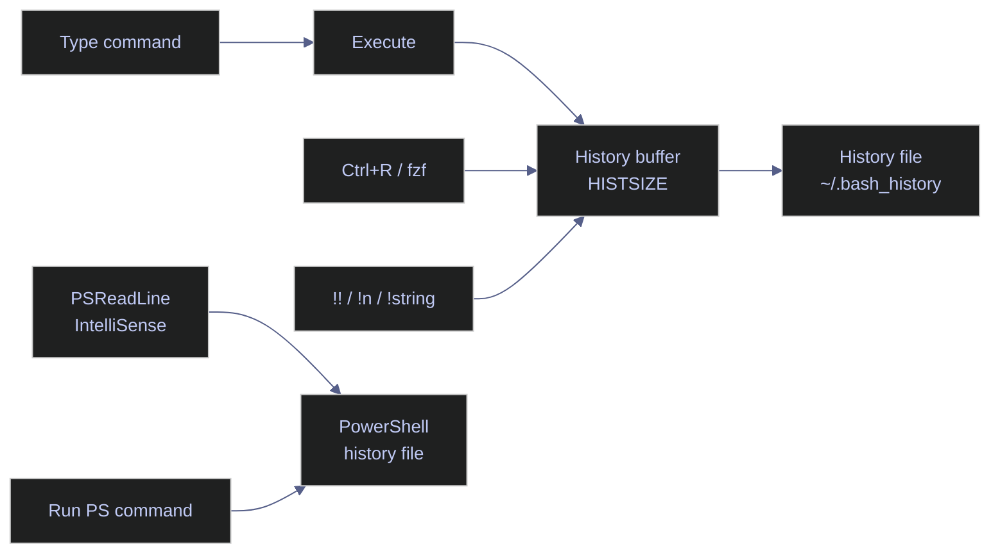

# Command History and Recall

> [!quote]
> "Those who cannot remember the past are condemned to repeat it."
>
> — **George Santayana**, *The Life of Reason* (1905)

> [!abstract]- Summary
>
> Covers bash and PowerShell command history end to end — from recall mechanics and expansion operators to full retention configuration and operational safety.
>
> **Recall and search**
> - View, search, and replay commands from the bash history buffer and file using `history`, `grep`, and numbered entry replay
> - History expansion operators: `!!`, `!n`, `!-n`, `!string`, `!?string?`, `^old^new`, `$_`, `Alt+.`, and the `:p` preview modifier
> - Interactive reverse search with `Ctrl+R`, including cancel (`Ctrl+G`) and edit-before-execute (`→`) patterns
> - Iterative command-building workflows: recalling complex commands and modifying a single argument without retyping
>
> **Bash configuration**
> - Retention: `HISTSIZE` (in-memory), `HISTFILESIZE` (on-disk), `HISTFILE` (path), `HISTIGNORE` (pattern exclusion)
> - Deduplication and secret hygiene: `HISTCONTROL` values (`ignorespace`, `ignoredups`, `ignoreboth`, `erasedups`) and leading-space suppression
> - Timestamps for incident reconstruction: `HISTTIMEFORMAT` with `strftime` format strings
> - Crash resilience and multi-session safety: `histappend` and `PROMPT_COMMAND="history -a"` to flush after every command
> - Productivity binding: arrow keys remapped to `history-search-backward` / `history-search-forward`
>
> **PowerShell**
> - Session history: `Get-History` (object pipeline), `Invoke-History` / `r` alias, cross-session search via `HistorySavePath`
> - PSReadLine: persistent history, `MaximumHistoryCount`, `HistorySaveStyle` (incremental vs exit), predictive IntelliSense, `AddToHistoryHandler` for credential filtering
>
> **Operations and safety**
> - When to use: incident response, iterative command development, post-session documentation
> - When not to use: inline credentials, repeatable multi-step automation, shared accounts or jump boxes
> - Warnings: credential leakage into history files, `!string` executing without confirmation, concurrent session clobbering, PSReadLine saving everything by default
> - Recommendations table: production server settings, secret hygiene, deduplication strategy, crash resilience, fast recall, cross-session search
> - Troubleshooting: 6 failure modes covering lost history, session conflicts, disabled expansion, and PSReadLine session scope

> [!note]- Glossary
>
> **History buffer**
> - An in-memory list of commands run during the current shell session. Bounded by `HISTSIZE` in bash and `MaximumHistoryCount` in PSReadLine.
> - Every recall and search operation (`Ctrl+R`, `!!`, `!n`) reads from this buffer.
>
> > [!warning] Session-scoped only
> >
> > The in-memory buffer is not the same as the persistent history file. If the session crashes before writing, buffered commands are lost.
>
> ---
>
> **History file**
> - A plain-text file on disk that stores commands across sessions. `~/.bash_history` on Linux, `ConsoleHost_history.txt` on PowerShell.
> - Allows you to recall commands from previous sessions — days or weeks later.
>
> > [!warning] Bash writes on exit, not on execution
> >
> > By default, bash flushes to `~/.bash_history` only when the session exits cleanly. A crash or SSH disconnect loses all unwritten commands from that session.
>
> ---
>
> **`HISTSIZE`**
> - An environment variable controlling how many commands the bash history buffer holds in memory.
> - If set too low (default is often 500), old commands fall off the list before you can recall them during incident investigation.
>
> > [!warning] `HISTSIZE` ≠ `HISTFILESIZE`
> >
> > `HISTSIZE` caps the in-memory list; `HISTFILESIZE` caps the on-disk file. Both must be set for effective long-term history retention.
>
> ---
>
> **`HISTCONTROL`**
> - An environment variable controlling which commands bash saves. Values: `ignorespace` (skip space-prefixed), `ignoredups` (skip consecutive duplicates), `ignoreboth`, `erasedups` (remove all prior duplicates).
> - `ignorespace` is the standard mechanism for keeping secrets out of history. `erasedups` aggressively deduplicates but loses command ordering.
>
> > [!danger] Credentials leak without `HISTCONTROL`
> >
> > Without `ignorespace`, any command containing a password or token typed inline is saved to `~/.bash_history` in plain text. Always set `HISTCONTROL=ignoreboth` and prefix sensitive commands with a space.
>
> ---
>
> **`HISTTIMEFORMAT`**
> - A `strftime` format string that timestamps each history entry when set.
> - Essential for incident reconstruction — answers "what commands were run between 14:00 and 14:30?" with exact timing.
>
> > [!warning] Without timestamps, ordering is all you have
> >
> > If `HISTTIMEFORMAT` is not set, history shows command sequence but no timing. Post-incident analysis is severely limited without this variable.
>
> ---
>
> **`HISTFILESIZE`**
> - An environment variable that caps the number of lines kept in `~/.bash_history` on disk. Bash truncates the file to this limit on session exit.
> - Controls long-term retention independently of `HISTSIZE`. If smaller than `HISTSIZE`, the on-disk file discards entries that were present in memory during the session.
>
> > [!warning] Set both `HISTSIZE` and `HISTFILESIZE`
> >
> > Setting only `HISTSIZE` grows the in-memory list but the file is still capped at the default (often 500). Set `HISTFILESIZE` to at least twice `HISTSIZE` to avoid silent truncation on exit.
>
> ---
>
> **`HISTFILE`**
> - An environment variable specifying the path to the bash history file. Defaults to `~/.bash_history`.
> - Lets you redirect history to a custom location — useful for per-project separation or storing history on a shared volume accessible across machines.
>
> > [!info] Changing the path
> >
> > Set `export HISTFILE=~/.bash_history_work` in `.bashrc`. The new path takes effect for sessions started after the change. The old file is not deleted or merged automatically.
>
> ---
>
> **`HISTIGNORE`**
> - An environment variable containing a colon-separated list of glob patterns. Any command matching a pattern is silently excluded from history without requiring a leading space.
> - A surgical alternative to `HISTCONTROL=ignorespace` — permanently excludes specific command forms such as `ls:cd:exit:history` without workflow discipline around leading spaces.
>
> > [!warning] Glob matching is exact by default
> >
> > `ls` suppresses only the bare `ls` command. Use `ls*` to suppress all `ls` variants including `ls -la`. Patterns are matched against the full command line.
>
> ---
>
> **`histappend`**
> - A bash shell option (`shopt -s histappend`) that appends the session's history to `HISTFILE` on exit rather than overwriting it.
> - Prevents concurrent sessions from clobbering each other's history. Without it, the last session to close wins and all other sessions' entries are permanently lost.
>
> > [!danger] Off by default
> >
> > Without `histappend`, opening two terminals and closing them in sequence silently discards the first session's history. Always set `shopt -s histappend` in `.bashrc`.
>
> ---
>
> **`PROMPT_COMMAND`**
> - A bash variable whose value is executed as a shell command before each primary prompt is displayed. Commonly set to `history -a` to flush the in-memory history to disk after every command.
> - Combined with `histappend`, provides crash resilience: commands are persisted immediately rather than buffered until clean session exit.
>
> > [!info] Extending an existing value
> >
> > Use `PROMPT_COMMAND="history -a; $PROMPT_COMMAND"` to prepend history flushing while preserving any existing prompt hook already set by the distro or shell framework.
>
> ---
>
> **`histexpand`**
> - A bash shell option that enables the `!`-based history expansion operators (`!!`, `!n`, `!string`, etc.). Enabled by default in interactive shells. Disabled by `set +H` or `set +o histexpand`.
> - Must be active for all history expansion to function. When disabled, `!` characters are treated as literals and no expansion occurs.
>
> > [!warning] Silent no-op when disabled
> >
> > If history expansion operators appear to do nothing, run `set -o | grep histexpand` to check the current state. Re-enable with `set -o histexpand`.
>
> ---
>
> **History expansion**
> - A bash feature that uses `!`-prefixed operators to recall and transform previous commands. Examples: `!!` (last command), `!n` (entry n), `!string` (last command starting with string).
> - The fastest way to replay or modify commands without full retyping.
>
> > [!danger] `!string` executes immediately with no confirmation
> >
> > `!rm` replays your most recent `rm` command on the spot. Use `!rm:p` to print the expansion first, then `!!` to execute if correct.
>
> ---
>
> **`!?string?`**
> - A history expansion operator that matches the most recent command containing `string` anywhere in the line, not just at the start.
> - More flexible than `!string` (which requires a prefix match) — use it when you remember a distinctive substring from the middle of a long command.
>
> > [!warning] Also executes immediately
> >
> > Like `!string`, `!?string?` runs the matched command with no review step. Append `:p` to preview: `!?analytics?:p`.
>
> ---
>
> **`:p` modifier**
> - A history expansion modifier appended to any `!` operator that prints the expanded command without executing it. Example: `!rm:p`.
> - Safe inspection step before committing to a potentially destructive expansion. After reviewing, run `!!` to execute the printed command.
>
> > [!info] Works with all expansion forms
> >
> > `!!:p`, `!42:p`, `!string:p`, `!?string?:p` — the `:p` modifier is universally applicable across every history expansion operator.
>
> ---
>
> **`Alt+.` / `$_`**
> - `Alt+.` is a readline key binding that inserts the last argument of the previous command at the cursor, interactively. `$_` is the equivalent non-interactive shell variable, expanded at command time.
> - Avoids retyping long paths or filenames when chaining commands — `mkdir /data/pipeline && cd $_` reuses the path without repetition.
>
> > [!info] `Alt+.` cycles through history
> >
> > Pressing `Alt+.` repeatedly moves backward through the last argument of successive history entries, not just the immediately previous command.
>
> ---
>
> **`Ctrl+R`**
> - Reverse incremental search — an interactive mode that searches backward through history as you type a fragment. Available in bash (readline) and PowerShell (PSReadLine).
> - The fastest interactive recall method for complex commands you ran recently.
>
> > [!warning] `Enter` executes immediately
> >
> > Pressing `Enter` in reverse-i-search runs the matched command without editing. Use the right arrow key to move the match to the prompt and edit it first. Press `Ctrl+G` to cancel without executing.
>
> ---
>
> **PSReadLine**
> - The readline library for PowerShell. Provides `Ctrl+R` search, predictive IntelliSense, and history persistence across sessions. Built into PowerShell 5.1+ and enabled by default in PowerShell 7+.
> - All PowerShell history configuration — prediction source, save behavior, credential filtering — is managed through PSReadLine options.
>
> > [!warning] `Get-History` vs PSReadLine history file
> >
> > `Get-History` returns only the current session's commands. The PSReadLine history file (`ConsoleHost_history.txt`) holds all sessions. Use `Get-Content (Get-PSReadLineOption).HistorySavePath` for cross-session search.
>
> ---
>
> **Predictive IntelliSense**
> - A PSReadLine feature that shows greyed-out inline suggestions as you type, drawn from history or plugins. Accept with right arrow or `Alt+→` (word-by-word).
> - Dramatically speeds up command entry for repetitive operations like database queries or deployment commands.
>
> > [!info] No plugin required
> >
> > `Set-PSReadLineOption -PredictionSource History` works out of the box on PowerShell 7+. No external module or configuration beyond your profile is needed.
>
> ---
>
> **`AddToHistoryHandler`**
> - A PSReadLine option that accepts a scriptblock to filter which commands are saved to the persistent history file. Returns `$true` to save, `$false` to drop.
> - The PowerShell equivalent of `HISTCONTROL=ignorespace` — use it to suppress commands matching credential patterns before they reach disk.
>
> > [!danger] PSReadLine saves everything by default
> >
> > Without an `AddToHistoryHandler`, every command — including those with passwords, tokens, and API keys — is written to `ConsoleHost_history.txt` in plain text. Configure the handler in your PowerShell profile.
>
> ---
>
> **`Get-History`**
> - A PowerShell cmdlet that returns the current session's command history as objects with `Id`, `CommandLine`, `StartExecutionTime`, and `EndExecutionTime` properties.
> - Enables filtering, sorting, and pipeline processing of in-session history — e.g., `Get-History | Where-Object CommandLine -like "*sqlcmd*"` to find specific commands.
>
> > [!warning] Current session only
> >
> > `Get-History` does not read PSReadLine's persistent file. Commands from previous sessions are invisible. Use `Get-Content (Get-PSReadLineOption).HistorySavePath` for cross-session search.
>
> ---
>
> **`Invoke-History`**
> - A PowerShell cmdlet that re-executes a command from the in-session history list by its `Id`. Aliased as `r`. Without an ID, replays the most recent command.
> - The PowerShell equivalent of bash's `!n` operator — replays a specific past command by number without retyping it.
>
> > [!info] Built-in alias `r`
> >
> > `r 42` is equivalent to `Invoke-History -Id 42`. The alias is available in all PowerShell sessions without additional setup.
>
> ---
>
> **`MaximumHistoryCount`**
> - A PSReadLine option that sets the maximum number of commands saved to the persistent history file, controlled via `Set-PSReadLineOption -MaximumHistoryCount`.
> - The PowerShell equivalent of bash's `HISTFILESIZE` — governs long-term retention in `ConsoleHost_history.txt` across all sessions.
>
> > [!info] Default is 4096
> >
> > The PSReadLine 2.x default is 4096 commands. Raise it to 50000 or more in operational environments where incident reconstruction requires weeks of history.
>
> ---
>
> **`HistorySavePath`**
> - A PSReadLine property (read via `(Get-PSReadLineOption).HistorySavePath`) that specifies the file path where PSReadLine writes the persistent cross-session history log.
> - Points to `ConsoleHost_history.txt` by default. Read this file directly with `Get-Content` to search across all past sessions without session-scope limitations.
>
> > [!info] Path is configurable
> >
> > Override with `Set-PSReadLineOption -HistorySavePath "C:\custom\history.txt"` in your PowerShell profile to redirect history to a shared or project-specific location.
>
> ---
>
> **`HistorySaveStyle`**
> - A PSReadLine option controlling when commands are written to the history file. Values: `SaveIncrementally` (after each command), `SaveAtExit` (on session close), `SaveNothing` (disable persistence).
> - `SaveIncrementally` (the PSReadLine 2.x default) provides crash resilience equivalent to bash's `PROMPT_COMMAND="history -a"` — commands reach disk immediately rather than being buffered until exit.
>
> > [!warning] `SaveAtExit` loses history on crash
> >
> > If set to `SaveAtExit`, a force-closed or crashed PowerShell session loses all commands from that session — the same risk as bash without `PROMPT_COMMAND`.

Your shell history is a searchable log of every command you have run. In an incident at 2 AM, you do not have time to retype a complex pipeline command from memory — the speed at which you can recall and modify previous commands directly affects your response time.



## Linux history tools

Bash maintains a numbered in-memory list of commands (bounded by `HISTSIZE`) and periodically flushes it to `~/.bash_history` (bounded by `HISTFILESIZE`). Every interactive session reads this file on startup. Understanding how to search, replay, and configure the history list is one of the highest-leverage skills for operational work.

### Linux | history | search and display commands

The `history` built-in prints the numbered command list. Each entry can be replayed by its number, making it a fast log of all past operations.

#### Display the full history list

Running `history` with no arguments prints all entries currently in memory.

```bash
history
```

```text
  497  sqlcmd -S 10.132.0.2 -U sa -P "$SA_PASSWORD" -d analytics_db -Q "SELECT COUNT(*) FROM dbo.market_data"
  498  docker ps -a
  499  history
```

#### Search history by keyword

Pipe `history` into `grep` to filter entries by a substring. Useful when you remember part of a command but not its number.

```bash
history | grep "sqlcmd"
```

```text
  497  sqlcmd -S 10.132.0.2 -U sa -P "$SA_PASSWORD" -d analytics_db -Q "SELECT COUNT(*) FROM dbo.market_data"
```

#### Re-execute a command by number

Prefix the history number with `!` to replay it exactly as recorded.

```bash
!497
```

#### Reverse incremental search with Ctrl+R

`Ctrl+R` opens an interactive reverse search through the history buffer. It is the fastest way to recall a complex command you ran recently.

1. Press `Ctrl+R`, then type a fragment (e.g., `sqlcmd`)
2. Bash shows the most recent match: `(reverse-i-search)'sqlcmd': sqlcmd -S 10.132.0.2 -U sa -P "$SA_PASSWORD" -d analytics_db`
3. Press `Ctrl+R` again to cycle through older matches
4. Press `Enter` to execute, or `→` (right arrow) to edit before executing
5. Press `Ctrl+G` or `Ctrl+C` to cancel

#### Clear the history list for the current session

```bash
history -c
```

| Flag | Syntax | Description |
|---|---|---|
| (none) | `history` | Print all entries in the history list with their numbers |
| `-c` | `history -c` | Clear the in-memory history list for the current session |
| `-d` | `history -d <n>` | Delete the entry at position `n` |
| `-a` | `history -a` | Append the current session's new entries to `~/.bash_history` |
| `-r` | `history -r` | Read `~/.bash_history` and append its contents to the in-memory list |
| `-w` | `history -w` | Write the current in-memory list to `~/.bash_history`, overwriting it |
| `-p` | `history -p <string>` | Perform history expansion on `<string>` and print the result without executing |

### Linux | history expansion | recall and modify past commands

History expansion uses `!` prefixes and modifiers to recall and transform recorded commands. These operators are evaluated by the shell before execution.

#### Re-run the last command

`!!` expands to the entire previous command line. Its most common use is prepending `sudo` after a permission denied error.

```bash
!!
```

```bash
sudo !!
```

> [!tip] sudo !!
>
> After "permission denied", type `sudo !!` to re-run the last command with elevated privileges without retyping the full command.

#### Re-run the most recent command starting with a string

`!string` replays the most recent history entry whose text begins with `string`.

```bash
!git
```

```bash
!docker
```

> [!warning] !string executes without confirmation
>
> `!rm` re-runs your most recent `rm` command immediately with no review step. On a production server this can be destructive.

> [!success] Print before executing with :p modifier
>
> Use `!rm:p` to **print** the expanded command without executing it. Review it, then run `!!` to execute if correct.

#### Re-run the most recent command containing a string

`!?string?` matches any command that contains `string` anywhere in the line, not just at the start.

```bash
!?analytics_db?
```

#### Recall the last argument of the previous command

`$_` holds the last word of the previous command. `Alt+.` is the interactive equivalent — it inserts the last argument of the previous line at the cursor.

```bash
mkdir /data/pipeline/new_output
cd $_
```

#### Quick substitution in the last command

`^old^new` replaces the first occurrence of `old` in the previous command with `new` and re-executes it. This is the fastest way to fix a typo in a long command.

```bash
^typo^fix
```

#### Prevent a command from being saved to history

A command prefixed with a leading space is excluded from the history list. This requires `HISTCONTROL=ignorespace` (or `ignoreboth`) to be set in `.bashrc`.

```bash
 export DB_PASSWORD="secret123"
```

> [!tip] Use leading space for sensitive commands
>
> Credentials passed as environment exports or command arguments should always be prefixed with a space. Combined with `HISTCONTROL=ignoreboth`, neither the command nor any duplicate will appear in `~/.bash_history`.

| Operator | Syntax | Description |
|---|---|---|
| `!!` | `!!` | Expand to the entire previous command |
| `!n` | `!42` | Expand to history entry number `n` |
| `!-n` | `!-2` | Expand to the command `n` entries back from the current position |
| `!string` | `!git` | Expand to the most recent command starting with `string` |
| `!?string?` | `!?analytics?` | Expand to the most recent command containing `string` |
| `:p` | `!rm:p` | Print the expansion without executing |
| `$_` | `cd $_` | Expand to the last argument of the previous command |
| `Alt+.` | (interactive) | Insert the last argument of the previous command at the cursor |
| `^old^new` | `^typo^fix` | Substitute first occurrence of `old` with `new` in the previous command and re-execute |

### Linux | HISTSIZE, HISTCONTROL | history configuration

These environment variables control how much history Bash retains and which commands are eligible for recording. They are typically set in `~/.bashrc` and apply to every new interactive session.

#### Configure history size, deduplication, and timestamps

Add the following block to `~/.bashrc` to maximize the operational value of your history. The settings below are tuned for data engineering work where incident reconstruction is common.

```bash
export HISTSIZE=50000
export HISTFILESIZE=100000
export HISTCONTROL=ignoreboth
export HISTTIMEFORMAT="%Y-%m-%d %H:%M:%S  "
shopt -s histappend
PROMPT_COMMAND="history -a"
```

`HISTSIZE=50000` keeps 50,000 commands in memory per session. `HISTFILESIZE=100000` keeps 100,000 lines in the persistent file. `HISTCONTROL=ignoreboth` combines `ignoredups` (skip consecutive duplicates) and `ignorespace` (skip space-prefixed commands). `HISTTIMEFORMAT` timestamps each entry, which is invaluable during post-incident reviews: "What commands were run on the database server between 14:00 and 14:30 yesterday?" `shopt -s histappend` appends new entries rather than overwriting the file when the session exits, so concurrent sessions do not clobber each other. `PROMPT_COMMAND="history -a"` flushes to file after every command, so the history survives a crash.


> [!tip] Bind up/down arrows to history-search
>
> By default, up/down arrows cycle through the entire history. Binding them to `history-search-backward` and `history-search-forward` makes them search for entries matching what you have already typed — far more useful. Add to `~/.bashrc`:
> ```bash
> bind '"\e[A": history-search-backward'
> bind '"\e[B": history-search-forward'
> ```
> Now type `sqlcmd` then press `↑` to cycle through only commands that started with `sqlcmd`.

#### Apply changes to the current session

After editing `.bashrc`, reload it without opening a new terminal.

```bash
source ~/.bashrc
```

#### Inspect the current value of a HIST variable

```bash
echo $HISTSIZE
echo $HISTCONTROL
```

```text
50000
ignoreboth
```

| Variable | Default | Description |
|---|---|---|
| `HISTSIZE` | 500 (distro-dependent) | Number of commands kept in the in-memory list |
| `HISTFILESIZE` | 500 (distro-dependent) | Maximum lines retained in `~/.bash_history` on disk |
| `HISTCONTROL` | (unset) | Comma-separated list of `ignorespace`, `ignoredups`, `ignoreboth`, `erasedups` |
| `HISTTIMEFORMAT` | (unset) | `strftime` format string prepended to each history entry as a timestamp |
| `HISTFILE` | `~/.bash_history` | Path to the persistent history file |
| `HISTIGNORE` | (unset) | Colon-separated list of patterns (glob syntax) for commands to never save |

### Linux | history workflow | building commands incrementally

Rather than retyping long commands, use history recall to iterate: run a base version, search it back with `Ctrl+R`, modify a single parameter, and re-execute. This pattern is central to productive terminal work.

#### Iterate on a database query without retyping connection parameters

Each step modifies only the query while reusing the full connection string from history.

```bash
sqlcmd -S 10.132.0.2 -U sa -P "$SA_PASSWORD" -d analytics_db -Q "SELECT COUNT(*) FROM dbo.market_data"
```

```bash
sqlcmd -S 10.132.0.2 -U sa -P "$SA_PASSWORD" -d analytics_db -Q "SELECT TOP 10 * FROM dbo.market_data ORDER BY date DESC"
```

After running the first command, press `Ctrl+R` and type `sqlcmd` to bring it back. Use `→` to edit only the `-Q` argument, then press `Enter` to run the refined version.

## PowerShell history tools

PowerShell maintains a separate history list per session via `Get-History` and persists all history across sessions through the PSReadLine module. PSReadLine writes to `(Get-PSReadLineOption).HistorySavePath` (typically `~\AppData\Roaming\Microsoft\Windows\PowerShell\PSReadLine\ConsoleHost_history.txt`) after every command, giving you a unified cross-session log without additional configuration.

### PowerShell | Get-History | search and display commands

`Get-History` returns the in-session command list as objects. Each object has an `Id`, `CommandLine`, and timing properties. Because it returns objects, you can filter, sort, and select with the standard pipeline cmdlets.

#### Display the full in-session history

```powershell
Get-History
```

```text
  Id     Duration CommandLine
  --     -------- -----------
   1        0.162 Get-ChildItem C:\data
   2        1.204 sqlcmd -S .\SQLEXPRESS -Q "SELECT @@VERSION"
   3        0.001 Get-History
```

#### Search history by keyword

Filter the `CommandLine` property with `-like` to find all matching entries across the current session.

```powershell
Get-History | Where-Object CommandLine -like "*sqlcmd*"
```

```text
  Id     Duration CommandLine
  --     -------- -----------
   2        1.204 sqlcmd -S .\SQLEXPRESS -Q "SELECT @@VERSION"
```

#### Search across all sessions (PSReadLine persistent log)

`Get-History` only covers the current session. To search the full cross-session log, read PSReadLine's history file directly.

```powershell
Get-Content (Get-PSReadLineOption).HistorySavePath | Select-String "sqlcmd"
```

```text
sqlcmd -S .\SQLEXPRESS -Q "SELECT @@VERSION"
sqlcmd -S 10.132.0.2 -U sa -P $env:SA_PASSWORD -d analytics_db -Q "SELECT COUNT(*) FROM dbo.market_data"
```

| Parameter | Syntax | Description |
|---|---|---|
| `-Count` | `Get-History -Count 20` | Return only the last `n` entries |
| `-Id` | `Get-History -Id 5` | Return the single entry with the specified ID |

### PowerShell | Invoke-History | replay past commands

`Invoke-History` re-executes a command from the in-session history list by its ID. Without an ID it replays the most recent entry.

#### Re-run the last command

```powershell
Invoke-History
```

#### Re-run a specific command by ID

```powershell
Invoke-History -Id 42
```

> [!tip] Use the r alias
>
> `r` is the built-in alias for `Invoke-History`. `r 42` is equivalent to `Invoke-History -Id 42`.

| Parameter | Syntax | Description |
|---|---|---|
| `-Id` | `Invoke-History -Id <n>` | Re-execute the command at position `n` in the session history |
| (none) | `Invoke-History` | Re-execute the most recent command in the session |

### PowerShell | PSReadLine | predictive IntelliSense and history options

PSReadLine is the readline library for PowerShell. It provides interactive history search (`Ctrl+R`, mirroring bash), predictive IntelliSense (inline or list-view completion from history), and fine-grained control over which commands are saved. Available in PowerShell 5.1+ and enabled by default in PowerShell 7+.

#### Enable predictive IntelliSense from history

`PredictionSource History` makes PSReadLine show a greyed-out inline suggestion as you type, drawn from the most recent matching history entry. Press `→` to accept the full suggestion or `Alt+→` to accept one word at a time.

```powershell
Set-PSReadLineOption -PredictionSource History
```

#### Switch to list view for predictions

`ListView` displays multiple history candidates as a dropdown list below the cursor rather than a single inline suggestion. Navigate with `↑`/`↓` and press `Enter` to select.

```powershell
Set-PSReadLineOption -PredictionViewStyle ListView
```

#### Persist these options across sessions

Add both lines to your PowerShell profile so the settings apply to every session.

```powershell
$PROFILE
```

```text
C:\Users\aperi\Documents\PowerShell\Microsoft.PowerShell_profile.ps1
```

Open the profile file and append:

```powershell
Set-PSReadLineOption -PredictionSource History
Set-PSReadLineOption -PredictionViewStyle ListView
```

#### Exclude sensitive commands from history

PSReadLine's `AddToHistoryHandler` accepts a scriptblock that returns `$true` to save or `$false` to drop a command. Use it to block commands containing credential-like patterns.

```powershell
Set-PSReadLineOption -AddToHistoryHandler {
    param([string]$line)
    $line -notmatch 'password|secret|token|key' 
}
```

> [!warning] -AddToHistoryHandler is case-insensitive by default only if you use -imatch
>
> The `-notmatch` operator is case-insensitive by default in PowerShell, but the pattern `password` will not catch `PASSWORD` if you use `-cmatch`. Stick with `-notmatch` or `-inotmatch` for broad credential filtering.

> [!success] Use -notmatch for case-insensitive credential filtering
>
> `-notmatch` performs case-insensitive regex matching by default. The pattern above will suppress `Export-Password`, `Set-Token`, `Invoke-WithSecretKey`, and similar variants regardless of casing.

#### Check the current PSReadLine history save path

```powershell
(Get-PSReadLineOption).HistorySavePath
```

```text
C:\Users\aperi\AppData\Roaming\Microsoft\Windows\PowerShell\PSReadLine\ConsoleHost_history.txt
```

| Option | Syntax | Description |
|---|---|---|
| `-PredictionSource` | `History` \| `Plugin` \| `HistoryAndPlugin` \| `None` | Source for predictive suggestions |
| `-PredictionViewStyle` | `InlineView` \| `ListView` | How predictions are displayed: inline or dropdown list |
| `-MaximumHistoryCount` | `-MaximumHistoryCount 10000` | Maximum commands saved to the PSReadLine history file |
| `-HistorySaveStyle` | `SaveIncrementally` \| `SaveAtExit` \| `SaveNothing` | When to write commands to the history file |
| `-AddToHistoryHandler` | `{ param($l) $l -notmatch 'secret' }` | Scriptblock returning `$true` to save or `$false` to drop a command |
| `-HistorySearchCaseSensitive` | `$true` \| `$false` | Whether `Ctrl+R` search is case-sensitive (default `$false`) |

### PowerShell | history workflow | building commands incrementally

The same iterative pattern used in bash applies in PowerShell. Use `Ctrl+R` (PSReadLine's reverse-i-search) or the IntelliSense list to surface a prior command, then edit it before re-running.

#### Iterate on a database query without retyping connection parameters

```powershell
sqlcmd -S 10.132.0.2 -U sa -P $env:SA_PASSWORD -d analytics_db -Q "SELECT COUNT(*) FROM dbo.market_data"
```

```powershell
sqlcmd -S 10.132.0.2 -U sa -P $env:SA_PASSWORD -d analytics_db -Q "SELECT TOP 10 * FROM dbo.market_data ORDER BY date DESC"
```

After running the first command, press `Ctrl+R` and type `sqlcmd`. PSReadLine brings up the most recent match. Press `→` to move the cursor into the line and edit the `-Q` argument, then press `Enter`.


## When to use command history

- **Incident response** — reconstructing what happened on a server during a window of time. With `HISTTIMEFORMAT` set, history becomes an audit trail.
- **Iterative command development** — refining a complex `sqlcmd`, `gcloud`, or pipeline command by recalling and modifying the previous version rather than retyping it.
- **Learning and documentation** — reviewing history after a session to extract the exact commands that resolved an issue, for runbooks or postmortems.
- **Productivity** — `Ctrl+R`, `!!`, `sudo !!`, and `$_` are some of the highest-leverage shell shortcuts. Mastering them removes significant friction from daily operations.

## When not to use command history

- **Sensitive commands with inline credentials** — if `HISTCONTROL` is not set to `ignorespace` and you forget the leading space, credentials are recorded in plain text. Use environment variables or secret managers instead of inline secrets.
- **Complex multi-step automation** — if you find yourself recalling and chaining the same 5 commands repeatedly, write a script instead. History recall is for ad-hoc work, not repeatable workflows.
- **Shared accounts or jump boxes** — on shared-user environments, history is shared. Any user can see commands (and possibly credentials) from other sessions under the same account.

## Warnings

> [!danger] History files store credentials in plain text
>
> If you run `export DB_PASSWORD="secret123"` without a leading space and without `HISTCONTROL=ignorespace`, the password is saved to `~/.bash_history` (or PSReadLine's history file) in plain text. Anyone with read access to the file — or anyone who compromises the account — can extract it.

> [!warning] `!string` executes without confirmation
>
> `!rm` replays your most recent `rm` command immediately. On a production server, this can delete critical files. Always use `!string:p` to preview the expansion first, then `!!` to execute.

> [!warning] Concurrent sessions can clobber history
>
> By default, bash overwrites `~/.bash_history` on session exit. If two terminals are open, the last one to close wins and the other session's history is lost. Fix this with `shopt -s histappend` and `PROMPT_COMMAND="history -a"` to append after every command.

> [!warning] PSReadLine saves everything by default
>
> Without an `AddToHistoryHandler` filter, every command — including those with passwords, tokens, and API keys — is saved to the persistent PSReadLine history file. Configure a handler to suppress sensitive patterns.

## Recommendations

| Scenario | Recommendation |
|---|---|
| Production servers | Set `HISTSIZE=50000`, `HISTFILESIZE=100000`, `HISTTIMEFORMAT`, `histappend`, and `PROMPT_COMMAND="history -a"` in `/etc/profile.d/` so all users get audit-grade history. |
| Secret hygiene | Set `HISTCONTROL=ignoreboth` (bash) or `AddToHistoryHandler` (PowerShell) to suppress credential-containing commands. Always prefix sensitive commands with a space. |
| Deduplication | Use `erasedups` for aggressive deduplication (removes all prior instances of the same command). Use `ignoredups` if you want to preserve command ordering and only skip consecutive duplicates. |
| Crash resilience | Add `PROMPT_COMMAND="history -a"` to flush history to disk after every command. Without this, a terminal crash or SSH disconnect loses all unwritten history. |
| Fast recall | Bind up/down arrows to `history-search-backward` / `history-search-forward` in `~/.inputrc` or `~/.bashrc`. In PowerShell, enable `PredictionSource History` with `ListView` for the fastest recall experience. |
| Cross-session search (bash) | Use `grep "pattern" ~/.bash_history` or install `fzf` for fuzzy interactive search across the entire history file. |
| Cross-session search (PowerShell) | Search PSReadLine's persistent file: `Get-Content (Get-PSReadLineOption).HistorySavePath \| Select-String "pattern"`. |

## Troubleshooting

| Symptom | Likely cause | Fix |
|---|---|---|
| History is lost when the terminal closes or crashes | bash writes history to file only on clean session exit. If the session is killed or SSH drops, buffered history is lost. | Add `PROMPT_COMMAND="history -a"` to `.bashrc` to flush after every command. |
| Two terminals show different histories | Each session has its own in-memory buffer. Session B does not see commands from Session A until A exits and B reloads. | Add `shopt -s histappend` and `PROMPT_COMMAND="history -a; history -c; history -r"` to synchronize across sessions (with some overhead). |
| `Ctrl+R` does not find a command I just ran | The command may match `HISTCONTROL` or `HISTIGNORE` filters and was not saved. | Check `echo $HISTCONTROL` and `echo $HISTIGNORE`. Remove overly aggressive filters. |
| History expansion (`!!`, `!n`) is disabled | `set +H` or `set +o histexpand` was run, or `histexpand` is off in the shell options. | Run `set -o histexpand` or add it to `.bashrc`. |
| PowerShell `Get-History` shows nothing from previous sessions | `Get-History` only returns the current session. PSReadLine's file stores cross-session history separately. | Search the PSReadLine file directly: `Get-Content (Get-PSReadLineOption).HistorySavePath \| Select-String "pattern"`. |
| Sensitive commands appear in history despite `HISTCONTROL=ignorespace` | The command was not prefixed with a space. `HISTCONTROL` only filters commands that match its rules — it cannot retroactively remove already-saved entries. | Delete the entry with `history -d <n>` (bash) or manually edit the PSReadLine history file. Then fix the workflow to always prefix with a space. |

## Cross-references

- [environment-variables](https://alp78.github.io/elysium/01-Shell/01-Scripting/01-environment-variables) — Preventing secrets from being stored in history
- [defensive-scripting](https://alp78.github.io/elysium/01-Shell/01-Scripting/07-defensive-scripting) — Writing scripts that don't need manual recall
- [command-chaining](https://alp78.github.io/elysium/01-Shell/01-Scripting/04-command-chaining) — Building complex command pipelines

## References

- [GNU Bash Reference — History](https://www.gnu.org/software/bash/manual/html_node/Bash-History-Facilities.html)
- [PSReadLine Module](https://learn.microsoft.com/en-us/powershell/module/psreadline/)
