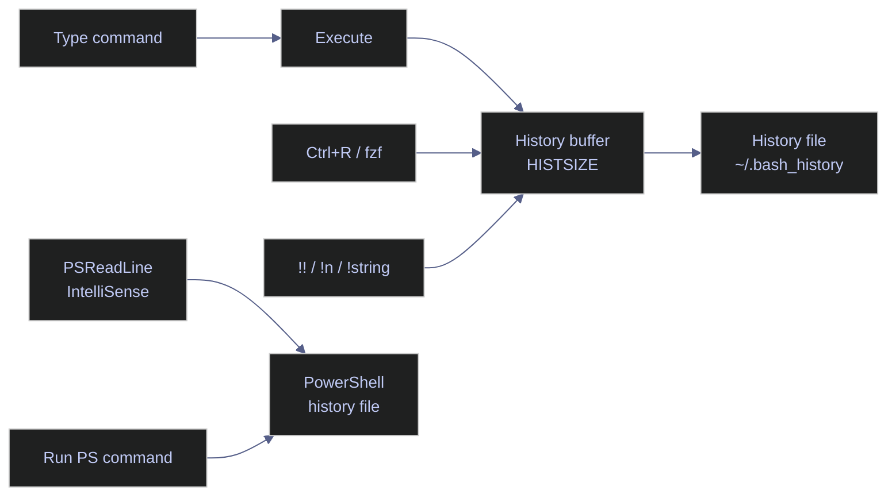

# Command History and Recall

> [!quote] Operational memory
>
> "Those who cannot remember the past are condemned to repeat it."
>
> George Santayana, *The Life of Reason* (1905)

Command history is both a recall surface and a persistence surface. That distinction matters operationally: Bash and PowerShell both let you recover prior commands quickly, but they do not store, flush, or filter those commands the same way.

> [!abstract]- Summary
>
> - Bash keeps an in-memory list plus a persistent history file, so reliable recall depends on both the current buffer and the write policy behind `HISTFILE`.
> - Safe Bash replay starts with inspection or preview: use `history`, `Ctrl+R`, and `history -p` before relying on immediate `!` expansion.
> - PowerShell separates current-session history from PSReadLine's persistent file. `Get-History` is session-scoped; `HistorySavePath` is the cross-session search target.
> - Durable and safe history requires explicit retention, flush behavior, and secret filtering through `HISTSIZE`, `HISTFILESIZE`, `histappend`, `PROMPT_COMMAND`, `MaximumHistoryCount`, and `AddToHistoryHandler`.

> [!note]- Glossary
>
> **History buffer**
>
> - The in-memory command list owned by the current shell process.
> - In Bash it is bounded by `HISTSIZE`; in PowerShell it is the session history surfaced by `Get-History`.
> - It is distinct from PSReadLine's persistent file. Raising `MaximumHistoryCount` does not enlarge the current `Get-History` scope.
>
> ---
>
> **History file**
>
> - The persistent text file used for cross-session recall.
> - Bash defaults to `~/.bash_history`; PowerShell's authoritative path is `(Get-PSReadLineOption).HistorySavePath`.
> - On Windows console hosts that path often resolves to `ConsoleHost_history.txt`, but the host-specific option value is the safe source of truth.
>
> ---
>
> **History expansion**
>
> - Bash's `!`-based replay syntax, such as `!!`, `!n`, `!string`, and `!?string?`.
> - Expansion happens before command execution, which makes it fast but also removes the review step unless you add one explicitly.
> - `history -p` or the `:p` modifier prints the expanded command without running it.
>
> ---
>
> **`HISTCONTROL`**
>
> - The Bash variable that controls selective suppression and duplicate handling, including `ignorespace`, `ignoredups`, `ignoreboth`, and `erasedups`.
> - It affects whether accepted command lines reach the history list and file.
> - It does not retroactively scrub commands that were already recorded.
>
> ---
>
> **`HISTIGNORE`**
>
> - A colon-separated Bash list of glob patterns for commands that should never be recorded.
> - It complements `HISTCONTROL` when leading-space discipline alone is too fragile.
> - Overly broad patterns can hide operationally useful commands, so the pattern set needs review.
>
> ---
>
> **`histappend`**
>
> - The Bash shell option that appends session history to `HISTFILE` instead of overwriting the file on exit.
> - It prevents the last terminal to exit from discarding commands written by earlier terminals.
> - It does not, by itself, flush new commands after each prompt.
>
> ---
>
> **`PROMPT_COMMAND`**
>
> - The Bash hook executed before each primary prompt is displayed.
> - It is commonly used with `history -a` to flush accepted commands to disk incrementally.
> - If another framework already owns `PROMPT_COMMAND`, the history hook must be merged instead of replacing the existing value blindly.
>
> ---
>
> **PSReadLine**
>
> - The PowerShell line editor and persistent-history subsystem used by modern hosts.
> - It owns interactive search, key bindings, prediction settings, history storage options, and file-backed recall.
> - `Get-History` and `Invoke-History` operate on the current session list; PSReadLine owns the persistent file.
>
> ---
>
> **Predictive IntelliSense**
>
> - The PSReadLine feature that proposes inline or list-based command completions from prior history or plugins.
> - It speeds repetitive command entry by surfacing the most likely continuation as you type.
> - History-backed prediction and file-backed recall share the same PSReadLine option surface but solve different problems.
>
> ---
>
> **`HistorySavePath`**
>
> - The PSReadLine option that identifies the file used for persistent history storage.
> - It is the correct target for cross-session searches and host-specific validation.
> - Automation should read this value instead of assuming a fixed filename.
>
> ---
>
> **`HistorySaveStyle`**
>
> - The PSReadLine option that determines whether commands are written incrementally, only at exit, or not at all.
> - It controls durability and crash behavior for the PowerShell history file.
> - `SaveAtExit` recreates the same failure mode as Bash without prompt-time flushing: a terminated session loses commands that were never written.
>
> ---
>
> **`MaximumHistoryCount`**
>
> - The PSReadLine option that caps how many commands are saved in persistent PSReadLine history.
> - It governs file-backed retention, not the size of the current `Get-History` list.
> - A fresh PowerShell session can still report an empty `Get-History` result even when the PSReadLine file is large.
>
> ---
>
> **`AddToHistoryHandler`**
>
> - A PSReadLine scriptblock hook that decides how a line is recorded.
> - It can return booleans or `AddToHistoryOption` values such as `MemoryOnly` or `SkipAdding`.
> - It is the correct control surface for suppressing passwords, tokens, and other sensitive command lines before they reach persistent history.



The note is split by platform because the recall surface and the persistence surface are not equivalent across Bash and PowerShell. Bash history revolves around shell built-ins and `HIST*` variables, while PowerShell splits responsibility between session history cmdlets and PSReadLine.

## Bash history

Bash history is easiest to reason about when you treat current-session recall and persistent retention as separate problems. The in-memory list powers `history`, `Ctrl+R`, and expansion operators, while the file on disk determines what survives a terminal restart.

### Linux | history | inspect and replay commands

The `history` built-in and readline bindings cover most current-session recall work. Use numbered listings for deterministic replay, use filtering when you remember only a fragment, and use preview before any `!` expansion that could execute something stale.

#### Display the full history list

Running `history` with no arguments prints all entries currently in memory.

*Print the current session's numbered history list.*
```bash
history
```
```text
  497  sqlcmd -S 10.132.0.2 -U sa -P "$SA_PASSWORD" -d analytics_db -Q "SELECT COUNT(*) FROM dbo.market_data"
  498  docker ps -a
  499  history
```

#### Search history by keyword

Pipe `history` into `grep` to filter entries by a substring. Use it when you remember part of a command but not its history number.

*Filter the current session history for commands containing `sqlcmd`.*
```bash
history | grep "sqlcmd"
```
```text
  497  sqlcmd -S 10.132.0.2 -U sa -P "$SA_PASSWORD" -d analytics_db -Q "SELECT COUNT(*) FROM dbo.market_data"
```

#### Verify that reverse search is bound to `Ctrl+R`

Interactive reverse search is a readline feature, not a separate Bash command. Querying the binding directly confirms that `Ctrl+R` still invokes `reverse-search-history` in the current shell environment.

*Query the active binding for reverse search.*
```bash
bind -q reverse-search-history
```
```text
reverse-search-history can be invoked via "\C-r".
```

#### Clear the history list for the current session

Use `history -c` when you need to discard the current shell's in-memory list without touching the persisted file directly.

*Clear the in-memory history list for the current shell process.*
```bash
history -c
```

*Verify that the current shell now reports an empty history list.*

```bash
history | wc -l
```

```text
0
```

The table below summarizes the `history` options most relevant to inspection, replay, and file synchronization.

| Flag | Syntax | Description |
|---|---|---|
| (none) | `history` | Print all entries in the history list with their numbers |
| `-c` | `history -c` | Clear the in-memory history list for the current session |
| `-d` | `history -d <n>` | Delete the entry at position `n` |
| `-a` | `history -a` | Append the current session's new entries to `~/.bash_history` |
| `-r` | `history -r` | Read `~/.bash_history` and append its contents to the in-memory list |
| `-w` | `history -w` | Write the current in-memory list to `~/.bash_history`, overwriting it |
| `-p` | `history -p <string>` | Perform history expansion on `<string>` and print the result without executing |

#### Preview an expansion before replaying it

History expansion is efficient because it skips a confirmation step. Use a short isolated history list so each preview is unambiguous before you rely on `!!`, `!string`, or `!?string?` interactively.

*Seed two history entries for the preview examples.*
```bash
history -c
history -s 'ls /var/log'
history -s 'grep db01 /etc/hosts'
```

*Preview the previous command with `!!`.*
```bash
history -p '!!'
```
```text
grep db01 /etc/hosts
```

*Preview the most recent command whose prefix is `ls`.*
```bash
history -p '!ls'
```
```text
ls /var/log
```

*Preview the most recent command containing `db01`.*
```bash
history -p '!?db01?'
```
```text
grep db01 /etc/hosts
```

In interactive use, `!!`, `!string`, and `!?string?` execute immediately unless you append `:p` or use `history -p` first.

The table below summarizes the common history expansion forms used for replay, substitution, and safe preview.

| Operator | Syntax | Description |
|---|---|---|
| `!!` | `!!` | Expand to the entire previous command |
| `!n` | `!42` | Expand to history entry number `n` |
| `!-n` | `!-2` | Expand to the command `n` entries back from the current position |
| `!string` | `!git` | Expand to the most recent command starting with `string` |
| `!?string?` | `!?analytics?` | Expand to the most recent command containing `string` |
| `:p` | `!rm:p` | Print the expansion without executing |
| `$_` | `cd $_` | Expand to the last argument of the previous command |
| `Alt+.` | (interactive) | Insert the last argument of the previous command at the cursor |
| `^old^new` | `^typo^fix` | Substitute first occurrence of `old` with `new` in the previous command and re-execute |

### Linux | persistence | keep history durable across sessions

Persistent Bash history is a write-policy problem. Retention limits, append behavior, and direct file inspection determine what survives a terminal restart or a dropped session.

#### Set explicit retention limits for memory and disk

`HISTSIZE` controls the in-memory list and `HISTFILESIZE` controls file-backed retention. Set them together so current-session recall and durable retention do not drift apart operationally.

*Set large Bash retention limits in the current shell.*
```bash
export HISTSIZE=50000
export HISTFILESIZE=100000
```

*Print the active retention values.*
```bash
printf 'HISTSIZE=%s\nHISTFILESIZE=%s\n' "$HISTSIZE" "$HISTFILESIZE"
```
```text
HISTSIZE=50000
HISTFILESIZE=100000
```

#### Append and flush instead of waiting for shell exit

`histappend` prevents one shell from overwriting another shell's history file. `PROMPT_COMMAND='history -a'` reduces crash loss by flushing accepted commands before the next prompt instead of waiting for a clean exit.

*Enable append-on-exit plus prompt-time flushing.*
```bash
shopt -s histappend
PROMPT_COMMAND='history -a'
```

*Verify that `histappend` is enabled.*
```bash
shopt -p histappend
```
```text
shopt -s histappend
```

*Print the active `PROMPT_COMMAND` value.*
```bash
printf 'PROMPT_COMMAND=%s\n' "$PROMPT_COMMAND"
```
```text
PROMPT_COMMAND=history -a
```

#### Inspect the current value of a history variable

After editing `.bashrc` or setting values interactively, confirm the current shell actually sees the expected history configuration.

*Print the current values of `HISTSIZE` and `HISTCONTROL`.*
```bash
echo $HISTSIZE
echo $HISTCONTROL
```
```text
50000
ignoreboth
```

#### Search the persisted history file directly

`history` sees only the in-memory list. When the command you need was run in another shell, search `HISTFILE` itself instead of assuming the entry disappeared.

*Create an isolated history file with a prior `sqlcmd` entry.*
```bash
export HOME=/tmp/codex-hist-search
mkdir -p "$HOME"
export HISTFILE="$HOME/.bash_history"
cat > "$HISTFILE" <<'EOF'
echo hello
sqlcmd -S db01 -Q "SELECT @@VERSION"
docker ps
EOF
```

*Search the isolated history file for `sqlcmd`.*
```bash
grep 'sqlcmd' "$HISTFILE"
```
```text
sqlcmd -S db01 -Q "SELECT @@VERSION"
```

The table below summarizes the primary Bash variables used to control history retention and filtering.

| Variable | Default | Description |
|---|---|---|
| `HISTSIZE` | 500 (distro-dependent) | Number of commands kept in the in-memory list |
| `HISTFILESIZE` | 500 (distro-dependent) | Maximum lines retained in `~/.bash_history` on disk |
| `HISTCONTROL` | (unset) | Colon-separated list of `ignorespace`, `ignoredups`, `ignoreboth`, `erasedups` |
| `HISTTIMEFORMAT` | (unset) | `strftime` format string prepended to each history entry as a timestamp |
| `HISTFILE` | `~/.bash_history` | Path to the persistent history file |
| `HISTIGNORE` | (unset) | Colon-separated list of patterns (glob syntax) for commands to never save |

### Linux | secret suppression | keep credentials out of `~/.bash_history`

Inline secrets become plain text in the history file unless you block them before persistence. Bash provides both convention-based suppression and pattern-based suppression, and using both is more reliable than depending on operator memory alone.

> [!warning] History filters are not secret storage
>
> `HISTCONTROL` and `HISTIGNORE` only decide whether a line reaches `~/.bash_history`. They do not remove secrets already exposed in terminal scrollback, shell transcripts, or process arguments. Prefer environment-based injection, secret-aware prompts, or a vault-backed retrieval path when the tool supports it.

#### Combine leading-space suppression with pattern filters

`HISTCONTROL=ignoreboth` suppresses leading-space commands and consecutive duplicates. `HISTIGNORE` adds explicit pattern-based exclusions. Together they reduce the chance that a password export or token-bearing command survives to disk.

*Prepare an isolated Bash history file with `ignoreboth` and `HISTIGNORE`.*
```bash
export HOME=/tmp/codex-hist-secret
mkdir -p "$HOME"
export HISTFILE="$HOME/.bash_history"
rm -f "$HISTFILE"
export HISTCONTROL=ignoreboth
export HISTIGNORE='*PASSWORD*:*TOKEN*'
set -o history
history -c
```

*Record a visible command that should persist.*
```bash
echo visible-entry
```
```text
visible-entry
```

*Enter a secret-bearing command with a leading space so `ignorespace` can suppress it.*
```bash
 export DB_PASSWORD=secret123
```

*Flush the current session history to disk.*
```bash
history -a
```

*Print the active suppression settings.*
```bash
printf 'HISTCONTROL=%s\nHISTIGNORE=%s\n' "$HISTCONTROL" "$HISTIGNORE"
```
```text
HISTCONTROL=ignoreboth
HISTIGNORE=*PASSWORD*:*TOKEN*
```

*Inspect the resulting history file.*
```bash
nl -ba "$HISTFILE"
```
```text
     1	echo visible-entry
     2	history -a
```

The file output proves that the visible command persisted while the secret-bearing `export DB_PASSWORD=secret123` line did not.

### Linux | diagnostics | explain missing matches or missing replay

Most Bash history failures come down to disabled expansion or overly weak synchronization between terminals. Diagnose state first, then change the write or reload policy deliberately.

#### Check whether history expansion is disabled

If `!!`, `!n`, or `!string` appear inert, inspect the `histexpand` shell option before assuming the history list is broken. The option state is the direct diagnostic surface for expansion.

*Disable `histexpand` in the current shell.*
```bash
set +H
```

*Print the `histexpand` option state.*
```bash
set -o | grep histexpand
```
```text
histexpand     	off
```

If the diagnostic returns `off`, re-enable expansion with `set -H` or the corresponding startup-file change before relying on `!` replay.

#### Use a reload hook when concurrent terminals must converge

Incremental flush writes new commands out, but it does not pull commands written by other terminals back into the current shell. When near-real-time convergence matters more than prompt latency, use a heavier reload hook.

*Set a prompt hook that writes, clears, and reloads history.*
```bash
PROMPT_COMMAND='history -a; history -c; history -r'
```

*Print the active `PROMPT_COMMAND` value.*
```bash
printf 'PROMPT_COMMAND=%s\n' "$PROMPT_COMMAND"
```
```text
PROMPT_COMMAND=history -a; history -c; history -r
```

## PowerShell history

PowerShell exposes two distinct history surfaces. `Get-History` and `Invoke-History` operate on the current session list, while PSReadLine owns the file-backed history, prediction settings, and the interactive key bindings that survive across sessions.

### PowerShell | current-session recall | inspect and replay session history

These commands operate only on the current PowerShell process. That is useful for deterministic replay, but it also means a fresh session starts with a fresh history list.

#### Display the full in-session history

`Get-History` returns the current session history as objects. Because the result is object-based, you can filter or sort it before choosing what to replay.

*Return the current session history as PowerShell objects.*
```powershell
Get-History
```
```text
  Id     Duration CommandLine
  --     -------- -----------
   1        0.162 Get-ChildItem C:\data
   2        1.204 sqlcmd -S .\SQLEXPRESS -Q "SELECT @@VERSION"
   3        0.001 Get-History
```

#### Search history by keyword

Filter the `CommandLine` property with `-like` to find all matching entries across the current session.

*Filter the session history for commands whose text contains `sqlcmd`.*
```powershell
Get-History | Where-Object CommandLine -like "*sqlcmd*"
```
```text
  Id     Duration CommandLine
  --     -------- -----------
   2        1.204 sqlcmd -S .\SQLEXPRESS -Q "SELECT @@VERSION"
```

The table below summarizes the most useful `Get-History` parameters for narrowing the in-session history list.

| Parameter | Syntax | Description |
|---|---|---|
| `-Count` | `Get-History -Count 20` | Return only the last `n` entries |
| `-Id` | `Get-History -Id 5` | Return the single entry with the specified ID |

#### Re-execute a command by history ID

`Invoke-History -Id` replays the chosen entry from the current session history. Inspect the list first, then replay the exact identifier you intend to run.

*Create a stable first entry in the session history.*
```powershell
Get-Date | Out-Null
```

*Create a visible entry that is safe to replay.*
```powershell
Write-Output "history-demo"
```
```text
history-demo
```

*Inspect the session history before replaying entry `2`.*
```powershell
Get-History | Select-Object Id, CommandLine | Format-Table -HideTableHeaders
```
```text
 1 Get-Date | Out-Null
 2 Write-Output "history-demo"
```

*Replay entry `2`.*
```powershell
Invoke-History -Id 2
```
```text
Write-Output "history-demo"
history-demo
```

The table below summarizes the `Invoke-History` parameters used for replay.

| Parameter | Syntax | Description |
|---|---|---|
| `-Id` | `Invoke-History -Id <n>` | Re-execute the command at position `n` in the session history |
| (none) | `Invoke-History` | Re-execute the most recent command in the session |

### PowerShell | persistence | inspect PSReadLine storage and retention

PSReadLine owns the persistent file, its write policy, and its retention ceiling. That makes `Get-PSReadLineOption` the authoritative surface for cross-session history diagnostics.

#### Print the current PSReadLine history save path

`HistorySavePath` tells you which file to inspect when the command you need was run in another PowerShell session.

*Print the file path used for persistent PSReadLine history.*
```powershell
(Get-PSReadLineOption).HistorySavePath
```
```text
C:\Users\aperi\AppData\Roaming\Microsoft\Windows\PowerShell\PSReadLine\ConsoleHost_history.txt
```

#### Inspect the current history save style

`HistorySaveStyle` determines whether accepted commands are written incrementally, only at exit, or not at all. Use it to distinguish durable history from exit-time-only history.

*Print the current PSReadLine history save style.*
```powershell
Get-PSReadLineOption | Select-Object HistorySaveStyle | Format-List
```
```text
HistorySaveStyle : SaveIncrementally
```

#### Raise the persistent history ceiling separately from session history

`MaximumHistoryCount` limits the PSReadLine file, not the current `Get-History` session list. That separation matters because increasing the file ceiling does not make a new shell inherit a larger live session buffer automatically.

*Set a larger PSReadLine retention ceiling.*
```powershell
Set-PSReadLineOption -MaximumHistoryCount 50000
```

*Print the active `MaximumHistoryCount` value.*
```powershell
Get-PSReadLineOption | Select-Object MaximumHistoryCount | Format-List
```
```text
MaximumHistoryCount : 50000
```

#### Search the persisted history file directly

When `Get-History` cannot see a command because it was run in an older session, search the PSReadLine file itself. This is the PowerShell equivalent of grepping `~/.bash_history`.

*Search the persistent PSReadLine history file for commands containing `sqlcmd`.*
```powershell
Get-Content (Get-PSReadLineOption).HistorySavePath | Select-String "sqlcmd"
```
```text
sqlcmd -S .\SQLEXPRESS -Q "SELECT @@VERSION"
sqlcmd -S 10.132.0.2 -U sa -P $env:SA_PASSWORD -d analytics_db -Q "SELECT COUNT(*) FROM dbo.market_data"
```

PSReadLine exposes prediction, persistence, and filtering through the same option surface. The table below preserves the most relevant switches for history-oriented work.

| Option | Syntax | Description |
|---|---|---|
| `-PredictionSource` | `History` \| `Plugin` \| `HistoryAndPlugin` \| `None` | Source for predictive suggestions |
| `-PredictionViewStyle` | `InlineView` \| `ListView` | How predictions are displayed: inline or dropdown list |
| `-MaximumHistoryCount` | `-MaximumHistoryCount 10000` | Maximum commands saved to the PSReadLine history file |
| `-HistorySaveStyle` | `SaveIncrementally` \| `SaveAtExit` \| `SaveNothing` | When to write commands to the history file |
| `-AddToHistoryHandler` | `{ param($l) $l -notmatch 'secret' }` | Scriptblock returning `$true` to save or `$false` to drop a command |
| `-HistorySearchCaseSensitive` | `$true` \| `$false` | Whether `Ctrl+R` search is case-sensitive (default `$false`) |

### PowerShell | secret suppression | filter commands before persistence

PowerShell needs the filter before the write. Once a password-bearing line reaches the PSReadLine file, cleanup is reactive and incomplete. `AddToHistoryHandler` is the intended control surface for that decision.

> [!tip] Keep sensitive recalls in memory only
>
> When operators still need same-session recall but the line must not reach the PSReadLine file, return `MemoryOnly` from `AddToHistoryHandler` instead of a Boolean reject. Use a full reject only when the command should disappear from both memory and disk.

#### Use `AddToHistoryHandler` to reject credential-bearing lines

The handler can return booleans or explicit `AddToHistoryOption` values. This example uses boolean returns for clarity and relies on PowerShell's default case-insensitive `-notmatch` behavior so common casing variants are still caught.

*Install a handler that rejects password-, token-, secret-, and key-bearing lines.*
```powershell
$handler = { param([string]$line) $line -notmatch 'password|secret|token|key' }
Set-PSReadLineOption -AddToHistoryHandler $handler
```

*Evaluate a safe line against the handler.*
```powershell
"Get-ChildItem -> $(& $handler 'Get-ChildItem')"
```
```text
Get-ChildItem -> True
```

*Evaluate a secret-bearing line against the handler.*
```powershell
"Invoke-Sqlcmd -Password ""secret123"" -> $(& $handler 'Invoke-Sqlcmd -Password ""secret123""')"
```
```text
Invoke-Sqlcmd -Password "secret123" -> False
```

### PowerShell | recall ergonomics | make repeated command families easier to scan

The fastest interactive retrieval pattern is usually prefix search rather than linear history traversal. PSReadLine exposes that behavior through explicit key handlers.

#### Bind the arrow keys to history-prefix search

Binding `UpArrow` and `DownArrow` to `HistorySearchBackward` and `HistorySearchForward` turns the current typed prefix into the search key. That is more precise than generic previous/next navigation when command families repeat.

*Bind the arrow keys to PSReadLine history search.*
```powershell
Set-PSReadLineKeyHandler -Key UpArrow -Function HistorySearchBackward
Set-PSReadLineKeyHandler -Key DownArrow -Function HistorySearchForward
```

*Print the active history-search key bindings.*
```powershell
Get-PSReadLineKeyHandler -Bound |
    Where-Object Function -match 'HistorySearch(Backward|Forward)' |
    Select-Object Function, Key |
    Format-Table -AutoSize
```
```text
Function              Key
--------              ---
HistorySearchBackward UpArrow
HistorySearchBackward F8
HistorySearchForward  DownArrow
HistorySearchForward  Shift+F8
```

### PowerShell | diagnostics | separate session history from file-backed history

The most common PowerShell history mistake is assuming that `Get-History` is a cross-session search tool. It is not. The session list starts fresh with each new process, even if the PSReadLine file already contains thousands of commands.

#### Confirm that `Get-History` is session-scoped

A fresh PowerShell process proves the point immediately. If the count is zero in a new shell, that does not mean history is gone; it means you need to search the PSReadLine file instead.

*Count the entries returned by `Get-History` in a fresh session.*
```powershell
Get-History | Measure-Object | Select-Object -ExpandProperty Count
```
```text
0
```

## Cross-references

These related pages cover adjacent shell practices that affect recall safety, parameter reuse, and defensive command construction.

- [environment-variables](https://alp78.github.io/elysium/01-Shell/01-Scripting/01-environment-variables) - Keeping secrets out of command lines and shell state
- [command-chaining](https://alp78.github.io/elysium/01-Shell/01-Scripting/04-command-chaining) - Building repeatable one-liners instead of reconstructing them from memory
- [defensive-scripting](https://alp78.github.io/elysium/01-Shell/01-Scripting/07-defensive-scripting) - Turning fragile interactive sequences into auditable scripts

## References

- [GNU Bash Manual - Bash History Facilities](https://www.gnu.org/software/bash/manual/html_node/Bash-History-Facilities.html)
- [GNU Bash Manual - Bash Builtins (`history`, `bind`)](https://www.gnu.org/software/bash/manual/html_node/Bash-Builtins.html)
- [Microsoft Learn - about_History](https://learn.microsoft.com/en-us/powershell/module/microsoft.powershell.core/about/about_history)
- [Microsoft Learn - Set-PSReadLineOption](https://learn.microsoft.com/en-us/powershell/module/psreadline/set-psreadlineoption)
- [Microsoft Learn - about_PSReadLine_Functions](https://learn.microsoft.com/en-us/powershell/module/psreadline/about/about_psreadline_functions)
