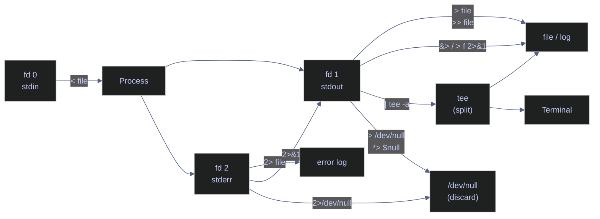

# I/O Redirection

> [!quote]
> "Expect the output of every program to become the input to another, as yet unknown, program."
>
> — **Doug McIlroy**, *Bell System Technical Journal* (1978)
>
> "Rule of Silence: When a program has nothing surprising to say, it should say nothing."
>
> — **Eric S. Raymond**, *The Art of Unix Programming* (2003)

> [!abstract]- Summary
>
> Covers stdin, stdout, and stderr redirection in bash and PowerShell — operators, here-documents, stream splitting with `tee`, and safe-use patterns for production pipeline logging.
>
> **File descriptors and stream model**
> - The three standard file descriptors: fd 0 (stdin), fd 1 (stdout), fd 2 (stderr) and their role as the target of all redirection operators
> - PowerShell's six-stream model: stream 1 (Success), 2 (Error), 3 (Warning), 4 (Verbose), 5 (Debug), 6 (Information) and the `*>` wildcard operator
>
> **Output redirection (bash)**
> - Overwrite with `>`, append with `>>`, stderr with `2>`, combined with `2>&1` and `&>` / `&>>` (bash 4+)
> - Discard with `> /dev/null 2>&1` or `&> /dev/null`
> - `noclobber` / `set -C` safety option and the `>|` force-overwrite bypass
>
> **Input redirection (bash)**
> - File input with `<`; inline multi-line stdin with here-documents (`<<DELIM`, `<<'DELIM'` for literal); single-string stdin with here-strings (`<<<`)
>
> **Output redirection (PowerShell)**
> - Stream-specific operators `>`, `>>`, `2>`, `3>`–`6>`, `*>`, `*>>`; `Out-File` with `-Encoding` and `-Append`; discard with `*> $null` or `Out-Null`
> - PowerShell here-strings: expandable `@"..."@` and literal `@'...'@`
>
> **Stream splitting and production logging**
> - `tee` (bash: `-a`, `-i` flags) and `Tee-Object` (PowerShell: `-FilePath`, `-Append`, `-Variable`) for simultaneous terminal display and persistent log file
> - Pattern for separating stdout and stderr into timestamped log files using process substitution
>
> **Operations and safety**
> - Warnings: 5 — redirect-before-write silent data loss, wrong `2>&1` ordering loses stderr, `>` overwrites without confirmation, pipe does not capture stderr by default, PowerShell 5.1 UTF-16LE default encoding
> - Recommendations table: 7 scenarios covering production logging, error separation, tool-availability checks, noclobber, here-doc quoting, PowerShell encoding, discarding all output
> - Troubleshooting: 7 failure modes covering empty output file, stderr on terminal despite redirect, garbled characters, unexpected here-doc expansion, noclobber false positive, pipe missing warnings (PowerShell), tee showing nothing

> [!note]- Glossary
>
> **File descriptor (fd)**
> - A small integer the operating system assigns to each open file, socket, or stream within a process; every process starts with three: fd 0 (stdin), fd 1 (stdout), fd 2 (stderr).
> - All redirection operators work by reassigning file descriptor numbers — understanding the numbered model is required for correct combined redirections such as `> file 2>&1`.
>
> > [!warning] Descriptors are not special objects
> >
> > stdin, stdout, and stderr are not privileged constructs — they are fd 0, 1, and 2. Any file descriptor can be redirected, duplicated (`2>&1`), or closed (`2>&-`); the three standard ones are simply the ones the shell opens by default.
>
> ---
>
> **`stdin` (fd 0)**
> - Standard input — the default source of data for a process; for an interactive shell, stdin is the keyboard.
> - Input redirection operators (`<`, `<<`, `<<<`) replace the keyboard with a file or inline text, enabling non-interactive execution of tools that normally expect a terminal prompt.
>
> > [!info] Pipes feed stdin, not files
> >
> > The pipe operator `|` connects the previous command's stdout to the next command's stdin. It does not create a file. If you need a named reference to piped output, use process substitution (`<()`) instead.
>
> ---
>
> **`stdout` (fd 1)**
> - Standard output — the default destination for a process's normal (non-error) output; for an interactive shell, stdout is the terminal screen.
> - Output redirection operators (`>`, `>>`) reroute fd 1 to a file instead of the terminal; `tee` and `Tee-Object` split fd 1 to both simultaneously.
>
> > [!danger] `>` truncates before the command starts
> >
> > The shell opens and truncates the output file to zero bytes before launching the target command. If the input and output file are the same path (e.g., `sort file.txt > file.txt`), the file is destroyed before the command reads a single byte. No error is reported.
>
> ---
>
> **`stderr` (fd 2)**
> - Standard error — a separate output stream reserved for error messages, warnings, and diagnostics; written independently of stdout so structured data on fd 1 is not contaminated.
> - Separating stderr from stdout lets you log errors independently and prevents error messages from corrupting CSV or JSON output on stdout.
>
> > [!warning] Stderr bypasses pipes and stdout redirects
> >
> > `command > file` redirects only fd 1. Stderr still flows to the terminal. Similarly, `command | grep pattern` filters only stdout — stderr bypasses the pipe entirely. Use `2>&1` before the pipe (`command 2>&1 | grep pattern`) or `|&` (bash 4+) to include stderr.
>
> ---
>
> **`/dev/null` / `$null`**
> - A special file on Unix/Linux (`/dev/null`) and a built-in automatic variable in PowerShell (`$null`) that discards all data written to it and returns EOF on read.
> - Used to silence noisy commands when only the exit code matters (e.g., connectivity checks, tool-existence tests).
>
> > [!warning] Platform-specific sink names
> >
> > `> /dev/null` does not work in PowerShell — use `> $null`, `*> $null`, or `Out-Null`. Conversely, `> $null` is not meaningful in bash (it creates a file literally named `$null`).
>
> ---
>
> **`2>&1`**
> - A redirection expression that duplicates fd 2 (stderr) into fd 1 (stdout), merging both streams to the same destination.
> - Required for capturing both normal output and errors in the same file or pipe; must appear after the output redirect so fd 1 already points to the target file at evaluation time.
>
> > [!danger] Order is strict and non-obvious
> >
> > `command 2>&1 > file` sends stderr to the terminal (where fd 1 was pointing at evaluation time of `2>&1`) and only stdout to the file. The correct form is `command > file 2>&1`. The shell evaluates redirections left-to-right.
>
> ---
>
> **`&>` / `&>>`**
> - Bash 4+ shorthand operators equivalent to `> file 2>&1` (overwrite) and `>> file 2>&1` (append); redirect both stdout and stderr in a single token.
> - Cleaner syntax for the common pattern of capturing all output from a command; not available in POSIX sh or bash versions below 4.0.
>
> > [!info] Not available in POSIX sh
> >
> > Scripts using `#!/bin/sh` or deployed to minimal Unix environments (BusyBox, Alpine `sh`) cannot use `&>` or `&>>`. Use the explicit `> file 2>&1` form for maximum portability.
>
> ---
>
> **`tee` / `Tee-Object`**
> - A command (`tee` on Linux, `Tee-Object` on PowerShell) that splits its stdin: one copy goes to a file, the other continues to stdout — named after a T-shaped plumbing fitting.
> - The standard pattern for real-time monitoring of long-running pipeline jobs while simultaneously capturing a persistent log file.
>
> > [!warning] Default mode overwrites the log file
> >
> > Without `-a` (bash) or `-Append` (PowerShell), `tee` overwrites the destination file on each run. In production logging, always use the append flag to preserve the history of previous runs.
>
> ---
>
> **Here-document (`<<`)**
> - A shell construct that feeds multi-line inline text to a command's stdin without creating a temporary file; delimited by a user-chosen word (e.g., `EOF`).
> - Used to embed SQL scripts, configuration blocks, or multi-line strings directly in shell scripts without managing separate template files.
>
> > [!danger] Unquoted delimiter expands variables
> >
> > `<<EOF` expands `$variables`, backticks, and `$(...)` inside the block. `<<'EOF'` (quoted delimiter) disables all expansion and treats content as literal text. SQL scripts that use `$1`-style placeholders or dollar-quoting must use the quoted form to avoid injecting shell variable values.
>
> ---
>
> **Here-string (`<<<`)**
> - A bash construct that feeds a single string directly to a command's stdin; more efficient than `echo "text" | command` because it avoids spawning a subshell.
> - Quick way to feed short values to tools like `base64`, `bc`, `jq`, or `read` without a pipe.
>
> > [!warning] Bash-only — not POSIX sh
> >
> > Here-strings are a bash extension and are not available in POSIX sh, dash, or BusyBox sh. Scripts starting with `#!/bin/sh` cannot use `<<<` and will fail silently or with a syntax error on non-bash systems.
>
> ---
>
> **`noclobber` / `set -C`**
> - A bash shell option (`set -C` or `set -o noclobber`) that prevents `>` from overwriting existing files; requires `>|` to explicitly force an overwrite.
> - A safety net for automated scripts that should never silently clobber output from a previous run; combined with `set -euo pipefail` it closes a common class of data-loss bugs.
>
> > [!info] `>|` is the bypass — not `>!`
> >
> > To force an overwrite when `noclobber` is active, use `>|` (the `noclobber bypass` operator). The `>!` form is csh syntax and does not work in bash.
>
> ---
>
> **PowerShell streams**
> - PowerShell defines six numbered output streams: 1 (Success), 2 (Error), 3 (Warning), 4 (Verbose), 5 (Debug), 6 (Information); the `*>` wildcard operator targets all six simultaneously.
> - More granular than Unix's two-stream model — allows selectively capturing warnings, verbose traces, or debug output that bash has no direct equivalent for.
>
> > [!warning] `2>` does not capture warnings in PowerShell
> >
> > Warnings are stream 3, not stream 2. `2>` only captures terminating and non-terminating errors (stream 2). To capture warnings, use `3>` or `*>`. This is a common source of missed diagnostic output in PowerShell scripts.
>
> ---
>
> **PowerShell here-string (`@"..."@` / `@'...'@`)**
> - Multi-line string literals in PowerShell delimited by `@"` / `"@` (expandable, interpolates `$variables` and `$(expressions)`) or `@'` / `'@` (literal, no expansion).
> - Used to define SQL queries, JSON templates, regex patterns, or any multi-line content without escape sequences; the closing delimiter must appear at column zero with no leading whitespace.
>
> > [!danger] Closing delimiter indentation breaks parsing
> >
> > If the closing `"@` or `'@` has any leading whitespace (tabs or spaces), PowerShell throws a parse error or includes the whitespace in the string. This is a frequent source of subtle bugs in indented script blocks or functions.
>
> ---
>
> **`Out-File`**
> - A PowerShell cmdlet that writes pipeline output to a file; the underlying implementation of the `>` and `>>` operators, exposing `-Encoding` and `-Width` parameters not available through the operators alone.
> - Use `Out-File -Encoding utf8` in cross-platform scripts targeting both Windows PowerShell 5.1 (which defaults to UTF-16LE) and PowerShell 7+ (which defaults to UTF-8 with no BOM).
>
> > [!warning] PowerShell 5.1 defaults to UTF-16LE
> >
> > In Windows PowerShell 5.1, `>` and `Out-File` write UTF-16LE, which breaks Unix tools and pipelines expecting UTF-8. Always specify `-Encoding utf8` in scripts that may run on 5.1, or migrate to PowerShell 7+ where the default is UTF-8.

Every process has three standard file descriptors: fd 0 (stdin) for input, fd 1 (stdout) for normal output, and fd 2 (stderr) for error messages. Redirection lets you reroute these streams to files, other streams, or `/dev/null` (the void). Mastering redirection is essential for logging pipeline runs, suppressing noise, and separating errors from normal output.

The diagram below shows how the three standard file descriptors relate to a running process and where each redirection operator reroutes them.




## Linux I/O redirection tools

Bash uses file-descriptor numbers (0, 1, 2) and symbolic operators (`>`, `>>`, `<`, `2>`, `&>`) to redirect streams. All operators act on the shell level before the target command starts, which is critical for understanding ordering rules and the redirect-before-write gotcha documented below.

### Linux | redirection | output operators

The output redirection operators control where fd 1 (stdout) and fd 2 (stderr) are written. Understanding their evaluation order is required for correct combined redirections.

#### Redirect stdout to a file (overwrite)

The `>` operator opens the target file and truncates it to zero bytes before the command starts, then connects fd 1 to that file. If the file does not exist it is created. If it already exists all previous content is lost.

```bash
command > output.txt
```

#### Redirect stdout to a file (append)

The `>>` operator opens the target file in append mode so existing content is preserved. New output is written after the last byte. This is safe for log aggregation across multiple runs.

```bash
command >> output.txt
```

#### Redirect stderr to a file

The `2>` operator connects fd 2 (stderr) to the target file. Normal output (fd 1) still flows to the terminal. Use this when you want to capture error messages separately for later analysis while keeping live output visible.

```bash
command 2> errors.txt
```

#### Redirect both stdout and stderr to the same file

The `2>&1` expression redirects fd 2 to wherever fd 1 currently points. The ordering is strict: `> all.txt` must appear first to redirect fd 1 to the file, then `2>&1` redirects fd 2 to that same destination. Reversing the order (`2>&1 > all.txt`) redirects fd 2 to the terminal (the original location of fd 1) and only fd 1 ends up in the file.

```bash
command > all.txt 2>&1
```

#### Redirect both stdout and stderr — bash 4+ shorthand

The `&>` operator is syntactic sugar for `> file 2>&1`. It is available in bash 4.0 and later and produces identical results with cleaner syntax. It always overwrites; use `&>>` to append both streams.

```bash
command &> all.txt
```

```bash
command &>> all.txt
```

#### Discard all output

Writing to `/dev/null` discards output silently. Reads from `/dev/null` return EOF immediately. The combined pattern `> /dev/null 2>&1` (or `&> /dev/null`) is used when a command is run purely for its exit code, such as testing connectivity or checking if a file exists.

```bash
command > /dev/null 2>&1
```

| Operator | Syntax | Effect |
|---|---|---|
| `>` | `cmd > file` | Redirect stdout to file (overwrite) |
| `>>` | `cmd >> file` | Redirect stdout to file (append) |
| `2>` | `cmd 2> file` | Redirect stderr to file (overwrite) |
| `2>>` | `cmd 2>> file` | Redirect stderr to file (append) |
| `2>&1` | `cmd > file 2>&1` | Merge stderr into stdout, both to file |
| `&>` | `cmd &> file` | Redirect stdout and stderr to file (bash 4+, overwrite) |
| `&>>` | `cmd &>> file` | Redirect stdout and stderr to file (bash 4+, append) |
| `> /dev/null` | `cmd > /dev/null` | Discard stdout |
| `&> /dev/null` | `cmd &> /dev/null` | Discard stdout and stderr |

### Linux | redirection | input operators

Input redirection feeds file content or inline text directly into a command's stdin, replacing interactive keyboard input. This enables non-interactive execution of tools that normally expect a terminal prompt.

#### Redirect stdin from a file

The `<` operator opens the specified file and feeds its contents as the standard input of the command. The command sees the file data exactly as if the user had typed it. This is commonly used to feed SQL scripts to database clients without interactive prompts.

```bash
sqlcmd -S server -U sa -P "$PASS" -d data-pipeline < query.sql
```

#### Here-document — embed multi-line stdin inline

A here-doc (`<<`) lets you embed multi-line text directly in the script without creating a temporary file. The shell feeds everything between the two delimiters to the command's stdin. Quoting the delimiter (`<<'EOF'`) disables variable expansion and command substitution inside the block, which is important when the content contains `$` or backticks.

```bash
cat <<EOF
Line one
Line two with variable: $HOME
EOF
```

Use the quoted form when the block must be treated literally:

```bash
cat <<'EOF'
This $variable will NOT be expanded.
EOF
```

#### Here-string — feed a single string to stdin

A here-string (`<<<`) passes a single string directly to a command's stdin. It avoids a subshell compared to `echo "text" | command` and is useful for feeding short values to tools like `read`, `bc`, or `base64`.

```bash
base64 <<< "encode this string"
```

```text
ZW5jb2RlIHRoaXMgc3RyaW5nCg==
```

| Operator | Syntax | Effect |
|---|---|---|
| `<` | `cmd < file` | Feed file contents as stdin |
| `<<DELIM` | `cmd <<EOF ... EOF` | Here-document: inline multi-line stdin |
| `<<'DELIM'` | `cmd <<'EOF' ... EOF` | Here-document with literal (no expansion) |
| `<<<` | `cmd <<< "string"` | Here-string: feed single string as stdin |

### Linux | redirection | tee and production logging

The `tee` command reads from stdin and writes simultaneously to a file and to stdout, allowing a pipeline to both save and display output. This is the standard pattern for real-time monitoring of long-running jobs while also capturing a persistent log.

#### Write to terminal and file simultaneously

`tee` without flags overwrites the destination file. It splits the stream so the downstream terminal sees the same data that is written to disk.

```bash
python3 pipeline/run.py | tee /var/log/pipeline/run.log
```

#### Append to log file while displaying live output

The `-a` flag puts `tee` in append mode, preserving previous log content. Prepending `2>&1` merges stderr into stdout before the pipe so both streams are captured and displayed.

```bash
python3 pipeline/run.py 2>&1 | tee -a /var/log/pipeline/run.log
```

#### Separate stdout and stderr into distinct log files

This pattern uses process substitution to simultaneously redirect stdout to one file and stderr to another, both with timestamps derived from the same `date` call. Useful for post-mortem analysis where distinguishing error lines from normal output is required.

```bash
python3 pipeline/run.py \
  > /var/log/pipeline/run_$(date +%Y%m%d_%H%M%S).log \
  2> /var/log/pipeline/run_$(date +%Y%m%d_%H%M%S).err
```

| Flag | Syntax | Description |
|---|---|---|
| *(none)* | `cmd \| tee file` | Overwrite file, pass through to stdout |
| `-a` | `cmd \| tee -a file` | Append to file, pass through to stdout |
| `-i` | `cmd \| tee -i file` | Ignore SIGINT (keep writing even if Ctrl-C is pressed) |

### Linux | redirection | common gotchas

Understanding the shell's evaluation order prevents data-loss bugs that are difficult to diagnose because no error is reported.

#### Redirect-before-write — sort overwrites itself to empty

The shell opens and truncates the output file before launching the command. When the input and output file are the same path, the file is emptied before the command reads a single byte.

```bash
sort output.txt > output.txt
```

> [!warning] This command silently destroys the contents of `output.txt`. The shell truncates the file to zero bytes before `sort` reads a single line. No error is reported.

> [!success] Use a temporary file and rename it, or use `sponge` from the `moreutils` package. `sponge` buffers all input in memory before opening the output file, making in-place rewrites safe.
>
> ```bash
> sort output.txt > tmp.txt && mv tmp.txt output.txt
> ```
>
> ```bash
> sort output.txt | sponge output.txt
> ```

#### Wrong order for 2>&1 combined redirect

Placing `2>&1` before `>` redirects stderr to the terminal (the original fd 1 location) and sends only stdout to the file.

```bash
command 2>&1 > all.txt
```

> [!warning] This does NOT capture stderr in the file. At the moment `2>&1` is evaluated, fd 1 still points to the terminal, so stderr is sent to the terminal. The subsequent `> all.txt` then redirects only fd 1 to the file.

> [!success] Always place `2>&1` after the output redirect so fd 1 is already pointing to the file when stderr is merged into it.
>
> ```bash
> command > all.txt 2>&1
> ```


#### Prevent accidental overwrites with noclobber

`set -C` (or `set -o noclobber`) makes the shell refuse to overwrite existing files with `>`. You must use `>|` to explicitly force an overwrite. This is a safety net for automated scripts that should never clobber previous output.

```bash
set -C
echo "data" > existing_file.txt
```

```text
bash: existing_file.txt: cannot overwrite existing file
```

```bash
echo "data" >| existing_file.txt
```

> [!tip] Add `set -C` to production scripts
>
> Combined with `set -euo pipefail` (see [defensive-scripting](https://alp78.github.io/elysium/01-Shell/01-Scripting/07-defensive-scripting)), `set -C` prevents a class of data-loss bugs where a redirect silently destroys an output file from a previous run.

## PowerShell I/O redirection tools

PowerShell extends the two-stream Unix model to six numbered streams: 1 (Success/stdout), 2 (Error), 3 (Warning), 4 (Verbose), 5 (Debug), 6 (Information). The `*>` wildcard operator targets all six at once. PowerShell also replaces `/dev/null` with `$null`, a built-in variable that discards all data written to it.

### PowerShell | redirection | output operators

The PowerShell redirection operators mirror their bash counterparts for streams 1 and 2 but extend to streams 3–6 and the `*` wildcard. `Out-File` is the cmdlet equivalent and offers additional parameters for encoding and width.

#### Redirect stdout (Success stream) to a file — overwrite

The `>` operator is an alias for `Out-File`. It writes the Success stream (stream 1) to a file, overwriting it if it exists. PowerShell serializes objects as formatted strings using the default formatter before writing.

```powershell
Get-Process > processes.txt
```

An explicit `Out-File` call gives access to encoding and line-width parameters:

```powershell
Get-Process | Out-File processes.txt -Encoding utf8 -Width 200
```

#### Redirect stdout to a file — append

The `>>` operator and `Out-File -Append` both open the file in append mode. The `-Append` flag on `Out-File` is preferred in scripts because it makes intent explicit.

```powershell
Get-Process >> processes.txt
```

```powershell
Get-Process | Out-File processes.txt -Append
```

#### Redirect stderr (Error stream) to a file

Stream 2 carries terminating and non-terminating errors. Redirecting `2>` captures error records to a file while the Success stream continues to the default output.

```powershell
Get-ChildItem C:<br>onExistent 2> errors.txt
```

#### Redirect all streams to a file

The `*>` operator redirects all six streams simultaneously. This is the PowerShell equivalent of `&> all.txt` in bash but also captures Warning, Verbose, Debug, and Information streams that bash has no direct equivalent for.

```powershell
command *> all.txt
```

#### Discard all output

`$null` is a built-in automatic variable. Assigning to it or redirecting to it discards data without writing to disk. Using `*> $null` silences all six streams simultaneously.

```powershell
command *> $null
```

Alternatively, pipe to `Out-Null`:

```powershell
command | Out-Null
```

| Operator | Syntax | Effect |
|---|---|---|
| `>` | `cmd > file` | Redirect Success stream to file (overwrite) |
| `>>` | `cmd >> file` | Redirect Success stream to file (append) |
| `2>` | `cmd 2> file` | Redirect Error stream to file (overwrite) |
| `2>>` | `cmd 2>> file` | Redirect Error stream to file (append) |
| `3>` | `cmd 3> file` | Redirect Warning stream to file |
| `4>` | `cmd 4> file` | Redirect Verbose stream to file |
| `5>` | `cmd 5> file` | Redirect Debug stream to file |
| `6>` | `cmd 6> file` | Redirect Information stream to file |
| `*>` | `cmd *> file` | Redirect all streams to file |
| `*>>` | `cmd *>> file` | Redirect all streams to file (append) |
| `*> $null` | `cmd *> $null` | Discard all streams (equivalent to `> /dev/null 2>&1`) |

### PowerShell | redirection | Tee-Object

`Tee-Object` is the PowerShell equivalent of the Unix `tee` command. It splits the pipeline so output is written to a file (or variable) while simultaneously passing the objects through to the next pipeline stage or the console.

#### Write to terminal and file simultaneously

`Tee-Object -FilePath` writes the string representation of each pipeline object to a file while letting the objects continue down the pipeline to the console.

```powershell
Get-Process | Tee-Object -FilePath processes.txt
```

#### Append to log file while displaying live output

The `-Append` switch preserves previous file content, mirroring `tee -a` in bash.

```powershell
python3 pipeline/run.py 2>&1 | Tee-Object -FilePath C:\Logs\run.log -Append
```

#### Capture output in a variable and continue the pipeline

`Tee-Object -Variable` stores objects in a PowerShell variable for later inspection while still sending them to the next command. This is useful in interactive debugging sessions.

```powershell
Get-Service | Tee-Object -Variable services | Where-Object Status -eq Running
```

| Parameter | Syntax | Description |
|---|---|---|
| `-FilePath` | `Tee-Object -FilePath file` | Write to file (overwrite) and pass through |
| `-Append` | `Tee-Object -FilePath file -Append` | Write to file (append) and pass through |
| `-Variable` | `Tee-Object -Variable varName` | Store in variable and pass through |

### PowerShell | redirection | here-string

PowerShell here-strings use `@"..."@` (expandable) and `@'...'@` (literal) delimiters. The closing delimiter must appear at the start of a line with no leading whitespace. They are used to define multi-line string literals without escape sequences, and to feed multi-line content to commands.

#### Expandable here-string — variable interpolation active

Inside `@"..."@`, PowerShell expands `$variables` and `$(expressions)` normally. Use this form when the string content must reference runtime values.

```powershell
$name = "World"
$text = @"
Hello, $name
Today is $(Get-Date -Format 'yyyy-MM-dd')
"@
Write-Output $text
```

```text
Hello, World
Today is 2026-04-03
```

#### Literal here-string — no expansion

Inside `@'...'@`, all content is treated as literal text. Dollar signs, backticks, and parentheses have no special meaning. Use this form for content that must not be processed (e.g., JSON templates, SQL scripts, regex patterns).

```powershell
$sql = @'
SELECT *
FROM dbo.Positions
WHERE ticker = '$AAPL'
  AND date >= '2026-01-01'
'@
Invoke-Sqlcmd -Query $sql -ServerInstance "srv01"
```

| Form | Delimiters | Variable expansion | Use case |
|---|---|---|---|
| Expandable | `@"..."@` | Yes | Strings with dynamic values |
| Literal | `@'...'@` | No | SQL, JSON, regex, raw templates |


> [!example] Stream Redirection Fit
>
> > [!success] Appropriate
> >
> > - **Logging pipeline runs** — redirect stdout and stderr to timestamped log files for post-mortem analysis. Use `tee -a` for simultaneous live monitoring and persistent logging.
> > - **Silencing noisy commands** — discard output with `> /dev/null 2>&1` when you only care about the exit code (e.g., `command -v tool > /dev/null 2>&1` to test if a tool is installed).
> > - **Separating errors from data** — redirect stderr to a separate file when stdout carries structured data (CSV, JSON) that must not be contaminated with error messages.
> > - **Non-interactive database operations** — feed SQL scripts to `sqlcmd` or `psql` via `< query.sql` instead of typing queries interactively.
> > - **Embedding configuration in scripts** — use here-documents to include multi-line SQL, JSON, or YAML directly in a bash script without managing separate template files.
>
> > [!failure] Inappropriate
> >
> > - **Complex output processing** — if you need to transform, filter, or conditionally route output, use a proper scripting language (Python, PowerShell) rather than chaining increasingly complex redirections.
> > - **Structured logging** — for production services, use a logging framework that writes structured JSON logs. Shell redirection does not add timestamps, log levels, or correlation IDs.
> > - **Large binary data** — redirecting binary output (images, compressed files) through text-processing pipelines can corrupt data due to locale-dependent encoding conversions. Use direct file operations instead.

## Warnings

> [!danger] Redirect-before-write destroys data silently
>
> `sort file.txt > file.txt` empties the file because the shell truncates it to zero bytes before `sort` reads a single line. No error is reported. Always use a temporary file and rename, or pipe through `sponge` from `moreutils`.

> [!warning] Wrong order for `2>&1` loses stderr
>
> `command 2>&1 > file` sends stderr to the terminal and only stdout to the file. The correct order is `command > file 2>&1` (redirect fd 1 first, then merge fd 2 into it).

> [!warning] `>` overwrites without confirmation
>
> Unlike `cp -i` or `mv -i`, the `>` operator silently overwrites existing files with no prompt. Use `set -C` (`noclobber`) in scripts to prevent this, or use `>>` (append) when previous content must be preserved.

> [!warning] Piping only captures stdout by default
>
> `command | grep pattern` filters only stdout. Stderr bypasses the pipe entirely and goes to the terminal. To include stderr in the pipe, use `command 2>&1 | grep pattern` or `command |& grep pattern` (bash 4+).

> [!warning] PowerShell `>` uses UTF-16LE encoding by default (PS 5.1)
>
> In Windows PowerShell 5.1, `>` and `Out-File` default to UTF-16LE encoding, which can break Unix tools and pipelines. Use `Out-File -Encoding utf8` or upgrade to PowerShell 7+ where the default is UTF-8 (no BOM).

## Recommendations

| Scenario | Recommendation |
|---|---|
| Production pipeline logging | Use `command 2>&1 \| tee -a /var/log/pipeline/run_$(date +%Y%m%d).log` to capture both streams with live monitoring. |
| Separating errors from data | Redirect stdout to a data file and stderr to an error log: `command > data.csv 2> errors.log`. |
| Checking tool availability | Use `command -v tool > /dev/null 2>&1` for a clean existence check with no output. |
| Preventing overwrites in scripts | Add `set -C` at the top of the script. Use `>\|` for intentional overwrites. |
| Embedding SQL in bash scripts | Use quoted here-documents (`<<'EOF'`) to prevent `$` expansion inside SQL that uses dollar-quoting or variable-like syntax. |
| PowerShell encoding | Always specify `-Encoding utf8` with `Out-File` in cross-platform scripts. In PS 7+, the default is already UTF-8. |
| Discarding all output | Use `&> /dev/null` (bash 4+) or `*> $null` (PowerShell). These are the cleanest forms and capture all streams. |

## Troubleshooting

| Symptom | Likely cause | Fix |
|---|---|---|
| "Output file is empty after redirect" | Redirect-before-write: the input and output file are the same path. | Use a temp file and rename, or pipe through `sponge`. |
| "Error messages appear on screen despite redirecting to file" | Only stdout (`>`) was redirected. Stderr (fd 2) still goes to the terminal. | Add `2>&1` after the stdout redirect, or use `&>` (bash 4+). |
| "File contains garbled characters after redirect (PowerShell)" | PowerShell 5.1 defaults to UTF-16LE encoding. | Use `Out-File -Encoding utf8` or switch to PowerShell 7+. |
| "Here-document variables are expanded when they shouldn't be" | The delimiter was not quoted: `<<EOF` expands `$variables`, `<<'EOF'` does not. | Quote the delimiter: `<<'EOF'`. |
| "`noclobber` prevents writing to a file that doesn't exist" | This should not happen — `noclobber` only blocks overwrites of existing files. If you see this error, check file permissions or disk space. | Verify with `ls -la` and `df -h`. |
| "Pipe captures stdout but misses warnings (PowerShell)" | Warnings are stream 3, not stream 2. The `\|` pipe only passes stream 1. | Use `3>&1` before the pipe to merge warnings into stdout, or use `*>&1 \|` to merge all streams. |
| "`tee` writes to file but shows nothing on terminal" | The preceding command in the pipeline produced no output, or stderr was not merged before the pipe. | Add `2>&1` before `\| tee` to include error output. |

## Cross-references

- [command-chaining](https://alp78.github.io/elysium/01-Shell/01-Scripting/04-command-chaining) — Using pipes and operators to connect commands
- [defensive-scripting](https://alp78.github.io/elysium/01-Shell/01-Scripting/07-defensive-scripting) — The `set` flags that prevent scripting disasters
- [process-substitution](https://alp78.github.io/elysium/01-Shell/01-Scripting/06-process-substitution) — Using `<()` and `>()` to treat output as files

## References

- [GNU Bash Reference — Redirections](https://www.gnu.org/software/bash/manual/html_node/Redirections.html)
- [PowerShell — About Redirection](https://learn.microsoft.com/en-us/powershell/module/microsoft.powershell.core/about/about_redirection)
- [PowerShell — Tee-Object](https://learn.microsoft.com/en-us/powershell/module/microsoft.powershell.utility/tee-object)
