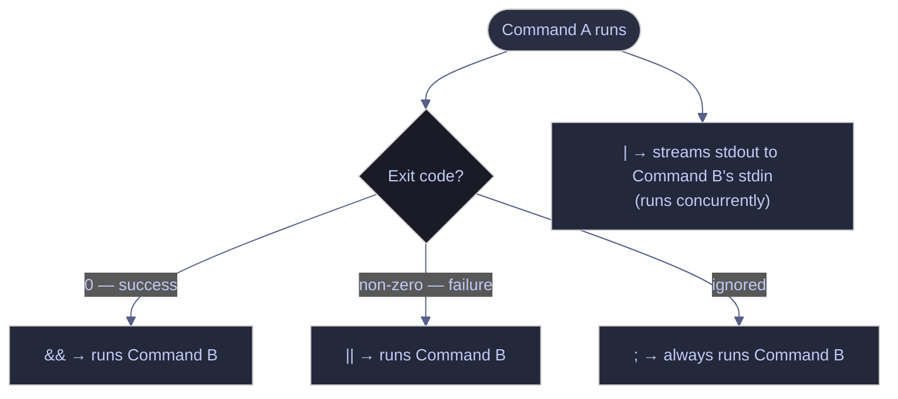

# Command Chaining

> [!quote] Unix philosophy
>
> "This is the Unix philosophy: Write programs that do one thing and do it well. Write programs to work together. Write programs to handle text streams, because that is a universal interface."
>
> — **Doug McIlroy**, *Bell System Technical Journal* (1978)

> [!abstract]- Summary
>
> Shows how Bash and PowerShell decide whether the next command runs, skips, or branches after a success or failure.
>
> - Bash coverage: `&&`, `||`, `;`, `|`, `set -o pipefail`, `${PIPESTATUS[@]}`, and `trap ... EXIT`
> - PowerShell coverage: `&&` and `||` in PowerShell 7+, `;`, the object pipeline, `*>`, `$?`, and `$LASTEXITCODE`
> - Recommended patterns: fail-fast chains, explicit fallbacks, cleanup handlers, and verification for silent settings
> - Troubleshooting: semicolon fallthrough, masked pipeline failures, fragile `cmd && ok || fail` patterns, PowerShell 5.1 parser errors, and `$?` versus `$LASTEXITCODE`

> [!note]- Glossary
>
> **Exit code**
>
> - A numeric status that a process returns when it exits; `0` means success and any non-zero value means failure.
> - Chaining operators read that status to decide whether to continue, skip the next step, or take a fallback path.
> - Visible output does not guarantee success; a command can print text and still exit non-zero.
>
> ---
>
> **`$?`**
>
> - In Bash, `$?` expands to the numeric exit status of the most recent foreground command or pipeline.
> - In PowerShell, `$?` is a Boolean success flag for the last command in the pipeline: `$true` for success, `$false` for failure.
> - Capture it immediately in the shell you are using because the next command overwrites it.
>
> ---
>
> **`$LASTEXITCODE`**
>
> - A PowerShell automatic variable that stores the exit code of the last native executable such as `git`, `cmd`, `python`, or `curl`.
> - Use it when the command you care about is not a cmdlet, because `$?` and `$LASTEXITCODE` can diverge.
> - A cmdlet can fail while `$LASTEXITCODE` still shows the previous native process result.
>
> ---
>
> **`&&` operator**
>
> - Runs the command on the right only when the command on the left succeeds.
> - It is the standard fail-fast operator for dependent steps such as build, test, and deploy chains.
> - The combined `cmd && ok || fail` idiom is fragile because a failure in the `ok` branch can still trigger the `fail` branch.
>
> ---
>
> **`||` operator**
>
> - Runs the command on the right only when the command on the left fails.
> - Use it for simple fallback actions and default values when the recovery logic is short and local.
> - If the fallback succeeds, the whole expression succeeds and the original failure is absorbed.
>
> ---
>
> **`;` semicolon**
>
> - Separates statements without inspecting success or failure.
> - The next command runs even when the previous one failed.
> - Use it only when later steps are genuinely independent, such as collecting multiple diagnostics.
>
> ---
>
> **`|` pipe (Bash)**
>
> - Connects stdout from one process to stdin of the next process.
> - Pipelines let commands stream data without intermediate files.
> - Without `pipefail`, the pipeline status comes from the last stage only, which can hide an earlier failure.
>
> ---
>
> **`pipefail`**
>
> - A Bash option enabled with `set -o pipefail`.
> - It makes a pipeline return a non-zero status when any stage fails instead of trusting the last command alone.
> - Keep it in scripts, but avoid enabling it casually in interactive shells where a harmless `grep` miss can look like a failure.
>
> ---
>
> **`set -e`**
>
> - A Bash option that exits the shell when a simple command fails.
> - It is commonly paired with `set -u` and `pipefail` in `set -euo pipefail`.
> - It does not fire in every context, so explicit `&&` chains and careful conditionals still matter.
>
> ---
>
> **Fail-fast**
>
> - A scripting style that stops at the first failed dependency instead of continuing into a broken state.
> - `&&`, `set -e`, and `pipefail` are the usual Bash building blocks for it.
> - Fail-fast stops damage; cleanup still needs `trap` in Bash or `try/finally` in PowerShell.
>
> ---
>
> **Pipeline chain operators (PowerShell 7+)**
>
> - PowerShell 7 introduced `&&` and `||` to mirror Bash-style chaining.
> - These operators evaluate whether the preceding command succeeded before deciding to continue or branch.
> - Windows PowerShell 5.1 does not parse them at all.
>
> ---
>
> **Object pipeline (PowerShell)**
>
> - PowerShell pipes .NET objects between cmdlets instead of raw text lines.
> - This preserves types such as integers, dates, and Booleans across the pipeline.
> - External executables still emit text, so object semantics apply only when PowerShell commands are producing the data.
>
> ---
>
> **`${PIPESTATUS[@]}`**
>
> - A Bash array that stores the exit code from every stage of the most recent pipeline.
> - Use it when a long pipeline failed and you need to identify which stage returned non-zero.
> - Capture it immediately because the next command replaces it.
>
> ---
>
> **`trap` (Bash)**
>
> - A Bash built-in that runs cleanup code when the shell exits or receives a signal.
> - `trap ... EXIT` is the reliable way to remove temp files or release resources after a fail-fast stop.
> - It runs on both success and failure, which `|| cleanup` does not guarantee.
>
> ---
>
> **`*>` redirect (PowerShell)**
>
> - A PowerShell redirection operator that writes every output stream to one file.
> - It captures standard output, errors, warnings, verbose output, debug output, and information output together.
> - Because `*>` is silent by itself, verify it by reading the target file after the command runs.

Command chaining is exit-status routing. Bash and PowerShell both let the previous command decide what happens next, but they expose that decision differently: Bash uses numeric exit codes everywhere, while PowerShell mixes `$?`, `$LASTEXITCODE`, and object-aware pipelines. The examples below use safe toy commands and captured output so the control flow is visible instead of implied.



## Linux command chaining operators

### Linux | `&&` | fail-fast chaining

Bash uses `&&` for dependent steps that must not continue after a failure. This is the operator that keeps later work from running on missing files, half-built artifacts, or bad input.

#### Stop after the first failed step

This chain prints two successful stages, fails deliberately at `false`, and never reaches `deploy`. The final `printf` captures the numeric exit code that the chain returned.

```bash
printf 'build\n' && printf 'test\n' && false && printf 'deploy\n'
printf 'exit=%s\n' "$?"
```

```text
build
test
exit=1
```

### Linux | `||` | fallback branching

Use `||` when the fallback is short, local, and safe to run only after a failure. It is a good fit for default values, alternate data sources, and small recovery actions.

#### Run a fallback command after a failure

The left-hand `false` simulates a failed primary command. Because it fails, Bash runs the fallback `printf`, and the overall expression finishes successfully.

```bash
false || printf 'fallback\n'
printf 'exit=%s\n' "$?"
```

```text
fallback
exit=0
```

### Linux | `;` | unconditional sequencing

The semicolon is just a separator. Bash executes the next statement whether the previous one succeeded or failed, so it is dangerous in dependent workflows and useful only for independent work.

#### Show why a semicolon masks failures

The failed command does not stop execution. `still-ran` proves the second statement executed anyway, and the final exit code is `0` because the last command succeeded.

```bash
false; printf 'still-ran\n'
printf 'exit=%s\n' "$?"
```

```text
still-ran
exit=0
```

### Linux | `|` and `pipefail` | streaming pipelines

Bash pipelines connect text streams. They are powerful, but their exit semantics need extra care because the default pipeline status only reflects the last command.

#### Stream stdout into the next command

This pipeline sends two lines into `grep`, keeps only the line that begins with `b`, and counts the result. The pipeline succeeds because every stage completed successfully.

```bash
printf 'alpha\nbeta\n' | grep '^b' | wc -l
printf 'exit=%s\n' "$?"
```

```text
1
exit=0
```

#### Enable and verify `pipefail`

`set -o pipefail` produces no output, so you have to verify the setting explicitly. The `sed` filter confirms that `pipefail` is on before you rely on it in a script.

```bash
set -o pipefail
set -o | sed -n '/pipefail/p'
```

```text
pipefail       	on
```

#### Inspect `${PIPESTATUS[@]}` after a failed pipeline stage

This pipeline prints no matches from `grep`, so the middle stage exits with `1` even though `wc -l` still prints `0`. Capturing `${PIPESTATUS[@]}` immediately shows which stage failed.

```bash
set -o pipefail
printf 'alpha\n' | grep z | wc -l
statuses=("${PIPESTATUS[@]}")
printf 'grep-exit=%s\n' "${statuses[1]}"
printf 'stages=%s\n' "${statuses[*]}"
```

```text
0
grep-exit=1
stages=0 1 0
```

## PowerShell command chaining operators

### PowerShell | `&&` | fail-fast chaining

PowerShell 7 added Bash-style chain operators. They are useful for native tools and short pipelines, but they do not exist in Windows PowerShell 5.1.

#### Stop after the first failed native command

This chain prints `build` and `test`, then calls `cmd /c exit 1`. Because that native command fails, `deploy` never runs, `$?` becomes `$false`, and `$LASTEXITCODE` records the native exit code.

```powershell
Write-Output 'build' &&
Write-Output 'test' &&
cmd /c exit 1 &&
Write-Output 'deploy'
"success=$?"
"exit=$LASTEXITCODE"
```

```text
build
test
success=False
exit=1
```

### PowerShell | `||` | fallback branching

In PowerShell 7+, `||` runs the right-hand command only when the left-hand command failed. It is a direct analogue of Bash `||`.

#### Run a fallback after a non-zero exit

The first native command exits with code `1`, so the fallback `echo` runs. After the fallback succeeds, the overall chain reports success and `$LASTEXITCODE` reflects the last native command that ran.

```powershell
cmd /c exit 1 || cmd /c echo fallback
"success=$?"
"exit=$LASTEXITCODE"
```

```text
fallback
success=True
exit=0
```

### PowerShell | `;` | unconditional sequencing

The semicolon keeps going regardless of failure, just as it does in Bash. That makes it appropriate for independent diagnostics and unsafe for dependent steps.

#### Show why a semicolon keeps going

`cmd /c exit 1` fails, but `Write-Output` still runs because the semicolon does not inspect the previous status. `$LASTEXITCODE` still remembers the native failure even though the last cmdlet succeeded.

```powershell
cmd /c exit 1; Write-Output 'still-ran'
"success=$?"
"exit=$LASTEXITCODE"
```

```text
still-ran
success=True
exit=1
```

### PowerShell | `|` and `*>` | object pipeline and stream capture

PowerShell pipelines move structured objects between cmdlets. When you need to persist every output stream, `*>` captures them into one file for later inspection.

#### Pass objects through the pipeline

This pipeline starts with integers, filters them as integers, and formats the surviving values. The output proves that PowerShell is piping objects, not text columns.

```powershell
1..5 | Where-Object { $_ -gt 3 } | ForEach-Object { "item=$_" }
```

```text
item=4
item=5
```

#### Capture every stream with `*>` and verify the file

`*>` itself is silent, so the proof comes from reading the file after the block runs. The resulting file contains standard output, a warning, and information output in one place.

```powershell
$temp = Join-Path $env:TEMP 'chain-streams-demo.txt'
Remove-Item $temp -ErrorAction SilentlyContinue
& {
  Write-Output 'stdout'
  Write-Warning 'warning'
  Write-Information 'info' -InformationAction Continue
} *> $temp
Get-Content $temp
Remove-Item $temp
```

```text
stdout
warning
info
```

## Recommended patterns

### Linux | recommended patterns

These Bash patterns cover the scenarios that show up most often in scripts: safe defaults, dependent steps, cleanup, and long pipelines.

#### Start script entrypoints with `set -euo pipefail`

This is the standard Bash safety header: `-e` stops on failures, `-u` catches unset variables, and `pipefail` exposes failed pipeline stages. The verification command confirms that all three settings are enabled.

```bash
set -euo pipefail
set -o | sed -n '/errexit/p;/nounset/p;/pipefail/p'
```

```text
errexit        	on
nounset        	on
pipefail       	on
```

#### Use `&&` between causally dependent steps

When step 3 depends on step 2, and step 2 depends on step 1, chain them with `&&`. The missing `deploy` line proves that the failure stopped the chain before the unsafe step.

```bash
printf 'build\n' && printf 'test\n' && false && printf 'deploy\n'
printf 'exit=%s\n' "$?"
```

```text
build
test
exit=1
```

#### Use `primary || fallback` for short default paths

This pattern is appropriate when the fallback is simple and local. The failed file read falls through to a safe default value, and the chain exits successfully.

```bash
db_host=$(cat /tmp/chain-missing 2>/dev/null) || db_host='localhost'
printf 'db_host=%s\n' "$db_host"
printf 'exit=%s\n' "$?"
```

```text
db_host=localhost
exit=0
```

#### Use `trap ... EXIT` for cleanup that must always run

Cleanup belongs in `trap`, not in `||`, because cleanup must run on every shell exit path. This script fails deliberately after creating a temp directory, and the trap still prints `cleanup`.

```bash
rm -rf /tmp/chain-trap-demo
mkdir /tmp/chain-trap-demo
trap "rm -rf /tmp/chain-trap-demo; printf 'cleanup\n'" EXIT
set -e
touch /tmp/chain-trap-demo/demo
false
```

```text
cleanup
```

#### Inspect `${PIPESTATUS[@]}` after long pipelines

`pipefail` tells you that the pipeline failed; `${PIPESTATUS[@]}` tells you which stage failed. That is the fastest way to isolate a bad stage in a long text-processing chain.

```bash
set -o pipefail
printf 'alpha\n' | grep z | wc -l
statuses=("${PIPESTATUS[@]}")
printf 'grep-exit=%s\n' "${statuses[1]}"
printf 'stages=%s\n' "${statuses[*]}"
```

```text
0
grep-exit=1
stages=0 1 0
```

#### Keep `pipefail` in scripts, not in ad hoc interactive searches

With `pipefail` enabled, a normal `grep` miss becomes a failed pipeline. That is usually what you want in automation and usually not what you want when you are exploring interactively.

```bash
set -o pipefail
printf 'alpha\n' | grep z | wc -l
printf 'pipeline=%s\n' "$?"
```

```text
0
pipeline=1
```

### PowerShell | recommended patterns

PowerShell recommendations depend on the version you are targeting. PowerShell 7 can use Bash-like chain operators; Windows PowerShell 5.1 needs explicit control flow.

#### Use `&&` and `||` in PowerShell 7+ when you want Bash-like chaining

This is the shortest readable form for dependent steps and simple fallbacks in modern PowerShell. The fallback runs only after the deliberate failure, and the chain finishes successfully.

```powershell
cmd /c exit 1 || cmd /c echo fallback
"success=$?"
"exit=$LASTEXITCODE"
```

```text
fallback
success=True
exit=0
```

#### Use `try/catch/finally` with `$LASTEXITCODE` when you must support Windows PowerShell 5.1

Windows PowerShell 5.1 has no `&&` or `||`, so you have to inspect native exit codes yourself. This example throws when the native command fails, reports the reason in `catch`, and still runs cleanup in `finally`.

```powershell
try {
  cmd /c exit 1
  if ($LASTEXITCODE -ne 0) { throw 'step failed' }
} catch {
  $_.Exception.Message
} finally {
  'cleanup-ran'
}
```

```text
step failed
cleanup-ran
```

## Troubleshooting

### Linux | troubleshooting

These Bash failure modes are common because they look harmless in code review while changing runtime behavior in important ways.

#### A script keeps going after a failed step

If the line uses `;`, Bash treats the next command as unconditional. The first line prints because the semicolon does not care about failure; the second line never prints because `&&` does.

```bash
false; printf 'ran-with-semicolon\n'
false && printf 'ran-with-and\n'
```

```text
ran-with-semicolon
```

#### A pipeline returns success but the result is empty

Without `pipefail`, the pipeline status comes from `wc -l`, not from `grep`. `0` lines were counted, but the pipeline still reports success because the last stage succeeded.

```bash
printf 'alpha\n' | grep z | wc -l
printf 'exit=%s\n' "$?"
```

```text
0
exit=0
```

#### `cmd && ok || fail` triggers the `fail` branch even though the primary command succeeded

The left-hand `true` succeeds, but the grouped `ok` branch returns failure because it ends with `false`. That failure is enough to trigger the `||` branch, which is why this idiom is unsafe for critical logic.

```bash
true && { printf 'primary-succeeded\n'; false; } || printf 'fallback-ran\n'
printf 'exit=%s\n' "$?"
```

```text
primary-succeeded
fallback-ran
exit=0
```

### PowerShell | troubleshooting

PowerShell adds a second axis of complexity: version support and the difference between cmdlet failures and native exit codes.

#### `&&` is a syntax error in Windows PowerShell 5.1

Windows PowerShell 5.1 never learned the chain operators, so the parser fails before execution starts. If you need 5.1 compatibility, replace this syntax with explicit `if`, `try/catch`, and `$LASTEXITCODE` checks.

```powershell
Write-Output 'ok' && Write-Output 'later'
```

```text
At line:1 char:19
+ Write-Output 'ok' && Write-Output 'later'
+                   ~~
The token '&&' is not a valid statement separator in this version.
    + CategoryInfo          : ParserError: (:) [], ParentContainsErrorRecordException
    + FullyQualifiedErrorId : InvalidEndOfLine
```

#### `$?` is `$false` even though the last native command exited `0`

This happens when a cmdlet fails after a native executable succeeded. The output shows the cmdlet error first, then proves that `$?` tracks the cmdlet failure while `$LASTEXITCODE` still holds the native process result.

```powershell
cmd /c exit 0
Write-Error 'cmdlet failure' -ErrorAction Continue
"success=$?"
"lastnative=$LASTEXITCODE"
```

```text
cmdlet failure
success=False
lastnative=0
```

## Cross-references

- [io-redirection](https://alp78.github.io/elysium/01-Shell/01-Scripting/03-io-redirection) — Controlling where command output goes
- [defensive-scripting](https://alp78.github.io/elysium/01-Shell/01-Scripting/07-defensive-scripting) — Using `set -euo pipefail` to make scripts safe
- [process-substitution](https://alp78.github.io/elysium/01-Shell/01-Scripting/06-process-substitution) — Treating command output as files

## References

- [GNU Bash Reference — Pipelines](https://www.gnu.org/software/bash/manual/html_node/Pipelines.html)
- [GNU Bash Reference — Lists of Commands](https://www.gnu.org/software/bash/manual/html_node/Lists.html)
- [PowerShell 7 Pipeline Chain Operators](https://learn.microsoft.com/en-us/powershell/module/microsoft.powershell.core/about/about_pipeline_chain_operators)
- [PowerShell Automatic Variables](https://learn.microsoft.com/en-us/powershell/module/microsoft.powershell.core/about/about_automatic_variables)
- [PowerShell Redirection Operators](https://learn.microsoft.com/en-us/powershell/module/microsoft.powershell.core/about/about_redirection)
