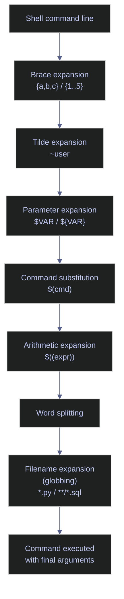

# Brace Expansion and Globbing

> [!quote]+
>
> "The order of expansions is: brace expansion, tilde expansion, parameter and variable expansion, command substitution, arithmetic expansion, word splitting, and filename expansion."
>
> - **Bash Reference Manual**, GNU

> [!abstract]- Summary
>
> Covers Bash brace expansion, Bash globbing, and PowerShell file-matching equivalents.
>
> - Brace expansion is textual, runs before globbing, and is useful for deterministic trees, numeric sequences, and shared suffixes.
> - Standard wildcards work without `shopt`; `extglob`, `globstar`, `failglob`, `dotglob`, and `nocaseglob` change matching behavior and must be enabled explicitly.
> - PowerShell does not expand braces in the shell. Arrays, loops, and string formatting replace that role, while `Get-ChildItem` applies filtering inside the cmdlet.
> - Silent operations need explicit verification, recursive deletes need previews, and no-match cases should fail loudly in scripts instead of passing literal patterns downstream.

> [!note]- Glossary
>
> **Brace expansion**
>
> - A textual Bash expansion that turns forms such as `{a,b,c}` and `{1..5}` into multiple words before tilde expansion, parameter expansion, word splitting, and filename expansion.
> - Useful when the target names are already known, such as directory trees, backup suffixes, or numeric batch identifiers.
> - Because it runs before globbing, `{*.csv,*.parquet}` produces two literal words that are globbed later rather than one combined filesystem query.
>
> ---
>
> **Globbing**
>
> - Bash filename expansion that replaces wildcard patterns such as `*`, `?`, `[set]`, and `**` with matching pathnames from the filesystem.
> - Happens after word splitting, so quoted variables do not glob unless you deliberately re-evaluate them.
> - Standard globs do not match dotfiles unless `dotglob` is enabled or the pattern itself starts with `.`.
>
> ---
>
> **`dotglob`**
>
> - A `shopt` option that lets wildcard patterns such as `*` and `*.csv` match filenames that begin with `.`.
> - Useful for backups and cleanup tasks that must include hidden files.
> - It does not make `.` or `..` match, and it changes every glob in the current shell until you unset it.
>
> ---
>
> **`extglob`**
>
> - A `shopt` option that enables the five extended glob operators `?(pat)`, `*(pat)`, `+(pat)`, `@(pat)`, and `!(pat)`.
> - Required for quantified and negated pattern matching that standard globs cannot express.
> - Without it, `!(pattern)` is not parsed as an extglob. In interactive shells, `!` can also participate in history expansion, so the failure mode can look different from non-interactive scripts.
>
> ---
>
> **History expansion**
>
> - The interactive Bash feature that treats `!` as a history reference prefix, such as `!!` for the previous command.
> - Controlled by the `histexpand` shell option (`set -H` / `set +H`).
> - It is separate from globbing, but it matters because `!(pattern)` collides syntactically with history expansion when `extglob` is missing in an interactive shell.
>
> ---
>
> **`globstar`**
>
> - A `shopt` option that makes `**` match zero or more directory levels.
> - Useful when a simple recursive wildcard such as `**/*.sql` is enough and you do not need `find`.
> - Without it, `**` behaves like ordinary `*` path components, so `**/*.py` stops at a much shallower depth than most people expect.
>
> ---
>
> **`failglob`**
>
> - A `shopt` option that turns an unmatched glob into a shell error instead of passing the literal pattern to the command.
> - Useful in scripts where silent no-match behavior is dangerous.
> - Pair it with `set -euo pipefail` so bad matches stop the script before a destructive command sees the wrong argument list.
>
> ---
>
> **`nocaseglob`**
>
> - A `shopt` option that makes Bash glob matching case-insensitive.
> - Useful for interactive work against mixed-case files copied from Windows or object stores.
> - Because it changes every glob in the shell, keep it scoped or interactive unless you explicitly want that behavior in a script.
>
> ---
>
> **`cdspell`**
>
> - A `shopt` option that lets interactive `cd` correct minor spelling mistakes in directory names.
> - It affects `cd`, not general wildcard expansion and not arbitrary command arguments.
> - Treat it as an interactive convenience, not as part of a script's matching semantics.
>
> ---
>
> **`shopt`**
>
> - The Bash built-in for enabling (`-s`), disabling (`-u`), printing (`-p`), and querying (`-q`) optional Bash behaviors.
> - Most advanced globbing behaviors live here rather than under `set`.
> - `shopt` controls Bash-specific features, while `set` controls shell options such as `-e`, `-u`, and `-o pipefail`.
>
> ---
>
> **`Get-ChildItem`**
>
> - The PowerShell cmdlet that enumerates files and directories and can filter them with provider/native filtering (`-Filter`) or PowerShell wildcard filtering (`-Include`, `-Exclude`).
> - Unlike Bash globbing, the shell does not expand the pattern before the cmdlet runs; the cmdlet decides what to enumerate and return.
> - `-Filter` accepts one provider pattern and is usually the fastest option. `-Include` and `-Exclude` accept wildcard lists, but matching depends on the child paths that the cmdlet actually enumerates.
>
> ---
>
> **`ARG_MAX`**
>
> - The operating system limit on the total size of arguments passed to a process.
> - Large recursive globs can hit this limit even when the pattern itself is simple.
> - When a tree is large or you need multiple predicates, prefer `find`, `fd`, or cmdlet-side filtering instead of expanding every path in the shell.

Brace expansion and globbing solve different problems. Brace expansion manufactures words before the shell looks at the filesystem. Globbing resolves wildcard patterns against the filesystem after earlier expansions have already finished. PowerShell reaches similar outcomes, but it does so with explicit iteration and cmdlet-side filtering instead of shell-level brace and filename expansion.



## Linux brace expansion tools

Brace expansion is pure text generation. The shell never checks whether a file already exists while it expands the braces, so these patterns are best when the names are known ahead of time.

### Linux | brace expansion | commands

Use these forms when you need compact, deterministic argument generation rather than filesystem discovery. Treat each H4 as a standalone snippet in a disposable working directory.

#### Create a nested directory tree in one command

`mkdir -p` is silent on success, so the second command verifies the exact tree that brace expansion generated.

*Run the commands in this section to create a nested directory tree in one command.*
```bash
mkdir -p data/{bronze,silver,gold}/{raw,staging,final}
```

*Run the commands in this section to create a nested directory tree in one command.*
```bash
find data -type d | sort
```

```text
data
data/bronze
data/bronze/final
data/bronze/raw
data/bronze/staging
data/gold
data/gold/final
data/gold/raw
data/gold/staging
data/silver
data/silver/final
data/silver/raw
data/silver/staging
```

#### Generate a numeric sequence of filenames

Zero padding is preserved when the range starts with a zero-padded value. `echo` receives the already-expanded filenames as separate arguments.

*Run the commands in this section to generate a numeric sequence of filenames.*
```bash
echo file{001..012}.parquet
```

```text
file001.parquet file002.parquet file003.parquet file004.parquet file005.parquet file006.parquet file007.parquet file008.parquet file009.parquet file010.parquet file011.parquet file012.parquet
```

#### Back up a file before editing

`cp` is also silent on success, so create the source file first, then verify that the backup exists after the copy.

*Run the commands in this section to back up a file before editing.*
```bash
printf 'key: value\n' > config.yaml
```

*Run the commands in this section to back up a file before editing.*
```bash
cp config.yaml{,.bak}
```

*Run the commands in this section to back up a file before editing.*
```bash
find . -maxdepth 1 -type f -printf '%P\n' | sort
```

```text
config.yaml
config.yaml.bak
```

#### Generate a stepped numeric range

The optional third term is the step. This is useful for partitions, checkpoints, or fixed-size batches.

*Run the commands in this section to generate a stepped numeric range.*
```bash
echo partition_{0..100..10}
```

```text
partition_0 partition_10 partition_20 partition_30 partition_40 partition_50 partition_60 partition_70 partition_80 partition_90 partition_100
```

#### Create versioned copies from one source file

Brace expansion can generate the destination names, but a single `cp model.pkl{,.v1,.v2,.backup}` call is not valid because `cp` accepts only one non-directory destination. A loop keeps the source fixed while using brace expansion to enumerate the targets.

*Run the commands in this section to create versioned copies from one source file.*
```bash
: > model.pkl
```

*Run the commands in this section to create versioned copies from one source file.*
```bash
for target in model.pkl{.v1,.v2,.backup}; do cp model.pkl "$target"; done
```

*Run the commands in this section to create versioned copies from one source file.*
```bash
find . -maxdepth 1 -type f -name 'model.pkl*' -printf '%P\n' | sort
```

```text
model.pkl
model.pkl.backup
model.pkl.v1
model.pkl.v2
```

Use this lookup table as a quick reference after the verified examples.

| Syntax | Example | Meaning |
|---|---|---|
| `{a,b,c}` | `echo {foo,bar,baz}` | Comma-separated list of words |
| `{n..m}` | `echo {1..5}` | Inclusive integer range |
| `{n..m..s}` | `echo {0..20..5}` | Inclusive stepped range |
| `{001..010}` | `echo {001..010}` | Zero-padded range |
| `{a..z}` | `echo {a..z}` | Alphabetic range |
| `prefix{a,b}suffix` | `echo file{A,B}.csv` | Shared prefix and suffix |
| `{a,{b,c}}` | `echo {x,{y,z}}` | Nested brace expansion |

## Linux globbing tools

Standard wildcards work without any `shopt` option. `extglob`, `globstar`, `failglob`, `dotglob`, and `nocaseglob` change how matching works, so they need deliberate enablement.

### Linux | shopt | globbing options

These options change shell behavior. When the enabling command is silent, verify it explicitly before relying on the option. Treat each H4 as a standalone snippet in a disposable working directory.

> [!warning] No-match behavior must be chosen deliberately
>
> Default Bash leaves an unmatched pattern literal, `nullglob` removes it, and `failglob` turns it into an error. Pick one before using wildcards in `rm`, `mv`, or loops, because an empty match set changes the blast radius of the command.

#### Enable extended globbing patterns

`extglob` turns on the quantified and negated operators that standard globbing does not have.

*Run the commands in this section to enable extended globbing patterns.*
```bash
shopt -s extglob
```

*Run the commands in this section to enable extended globbing patterns.*
```bash
shopt extglob
```

```text
extglob        	on
```

These operators are now available:

| Operator | Meaning |
|---|---|
| `?(pattern)` | Zero or one match |
| `*(pattern)` | Zero or more matches |
| `+(pattern)` | One or more matches |
| `@(pattern)` | Exactly one match |
| `!(pattern)` | Anything that does not match |

#### List all files excluding specific extensions

This example stages a disposable directory, enables `extglob`, and prints the expansion so you can inspect the match set before sending it to another command.

*Run the commands in this section to list all files excluding specific extensions.*
```bash
mkdir extglob-demo && cd extglob-demo
: > config.yaml
: > main.py
: > requirements.txt
: > schema.sql
: > debug.log
: > cache.tmp
shopt -s extglob
```

*Run the commands in this section to list all files excluding specific extensions.*
```bash
printf '%s\n' !(*.log|*.tmp) | sort
```

```text
config.yaml
main.py
requirements.txt
schema.sql
```

#### Delete all files except one

For destructive patterns, preview the expansion first in a disposable directory. Once the preview looks correct, run the delete and verify the result explicitly.

*Run the commands in this section to delete all files except one.*
```bash
mkdir delete-demo && cd delete-demo
: > important.txt
: > draft.txt
: > notes.md
: > scratch.tmp
shopt -s extglob
```

*Run the commands in this section to delete all files except one.*
```bash
printf '%s\n' !(important.txt) | sort
```

```text
draft.txt
notes.md
scratch.tmp
```

*Run the commands in this section to delete all files except one.*
```bash
rm !(important.txt)
```

*Run the commands in this section to delete all files except one.*
```bash
find . -maxdepth 1 -type f -printf '%P\n' | sort
```

```text
important.txt
```

#### Enable recursive double-star globbing

`globstar` changes `**` from an ordinary path wildcard into a recursive directory traversal operator.

*Run the commands in this section to enable recursive double-star globbing.*
```bash
shopt -s globstar
```

*Run the commands in this section to enable recursive double-star globbing.*
```bash
shopt globstar
```

```text
globstar       	on
```

#### Recursively match files by extension

This example uses `printf` instead of `ls` so the expansion result is exact and not reformatted into columns.

*Run the commands in this section to recursively match files by extension.*
```bash
mkdir -p tree/etl/utils tree/models tree/tests
: > tree/etl/pipeline.py
: > tree/etl/utils/helpers.py
: > tree/models/train.py
: > tree/tests/test_pipeline.py
: > tree/models/train.sql
cd tree
shopt -s globstar
```

*Run the commands in this section to recursively match files by extension.*
```bash
printf '%s\n' **/*.py
```

```text
etl/pipeline.py
etl/utils/helpers.py
models/train.py
tests/test_pipeline.py
```

#### Count lines across all SQL files recursively

`wc -l` is a good fit when a recursive glob already yields the exact files you want. If the tree is huge or you need extra predicates, move to `find` instead of expanding everything in the shell.

*Run the commands in this section to count lines across all SQL files recursively.*
```bash
mkdir -p sql-demo/queries sql-demo/schema
printf 'select 1;\nselect 2;\n' > sql-demo/queries/daily_agg.sql
printf 'create table t1;\ncreate table t2;\ncreate table t3;\n' > sql-demo/queries/index_weights.sql
printf 'begin;\n' > sql-demo/schema/init.sql
cd sql-demo
shopt -s globstar
```

*Run the commands in this section to count lines across all SQL files recursively.*
```bash
wc -l **/*.sql
```

```text
 2 queries/daily_agg.sql
 3 queries/index_weights.sql
 1 schema/init.sql
 6 total
```

#### Enable failglob to stop no-match pass-through

`failglob` is silent when enabled, so verify the state before depending on it in a script header.

*Run the commands in this section to enable failglob to stop no-match pass-through.*
```bash
shopt -s failglob
```

*Run the commands in this section to enable failglob to stop no-match pass-through.*
```bash
shopt failglob
```

```text
failglob       	on
```

Use this lookup table as a reference for `shopt` itself.

| Flag | Syntax | Meaning |
|---|---|---|
| `-s` | `shopt -s <option>` | Enable an option |
| `-u` | `shopt -u <option>` | Disable an option |
| `-p` | `shopt -p` | Print shell options as reusable commands |
| `-q` | `shopt -q <option>` | Return success if enabled, failure if disabled |

### Linux | globbing | standard wildcard patterns

The table at the end is a compact reminder. The H4 entries here show what the wildcard actually expands to.

#### Match any string with `*`

`*` matches zero or more characters inside one path component.

*Run the commands in this section to match any string with `*`.*
```bash
mkdir wildcard-star && cd wildcard-star
: > data.csv
: > sales_2025.csv
: > report.txt
```

*Run the commands in this section to match any string with `*`.*
```bash
printf '%s\n' *.csv | sort
```

```text
data.csv
sales_2025.csv
```

#### Match exactly one character with `?`

`?` matches one character, so `file10.txt` is excluded because it needs two characters after `file`.

*Run the commands in this section to match exactly one character with `?`.*
```bash
mkdir wildcard-question && cd wildcard-question
: > file1.txt
: > file2.txt
: > fileA.txt
: > file10.txt
```

*Run the commands in this section to match exactly one character with `?`.*
```bash
printf '%s\n' file?.txt | sort
```

```text
file1.txt
file2.txt
fileA.txt
```

#### Match sets and ranges with `[]`

Character classes can name explicit sets such as `[abc]` or ranges such as `[0-9]`. This example uses a numeric range.

*Run the commands in this section to match sets and ranges with `[]`.*
```bash
mkdir wildcard-range && cd wildcard-range
: > log1.txt
: > log2.txt
: > logA.txt
```

*Run the commands in this section to match sets and ranges with `[]`.*
```bash
printf '%s\n' log[0-9].txt | sort
```

```text
log1.txt
log2.txt
```

#### Exclude starting characters with `[!...]`

`[!set]` negates a single character position. Here it excludes files whose first character is a digit.

*Run the commands in this section to exclude starting characters with `[!...]`.*
```bash
mkdir wildcard-negated && cd wildcard-negated
: > alpha.csv
: > beta.csv
: > 1-summary.csv
```

*Run the commands in this section to exclude starting characters with `[!...]`.*
```bash
printf '%s\n' [!0-9]*.csv | sort
```

```text
alpha.csv
beta.csv
```

#### Include dotfiles with `dotglob`

By default, `*` skips hidden files. Enabling `dotglob` changes that behavior for the current shell.

*Run the commands in this section to include dotfiles with `dotglob`.*
```bash
mkdir dotglob-demo && cd dotglob-demo
: > .env
: > .gitignore
: > report.csv
printf 'default\n'
printf '%s\n' * | sort
shopt -s dotglob
printf 'enabled\n'
printf '%s\n' * | sort
printf 'state\n'
shopt dotglob
```

```text
default
report.csv
enabled
.env
.gitignore
report.csv
state
dotglob        	on
```

Use this lookup table as a quick reminder after the runnable examples.

| Pattern | Meaning | Example |
|---|---|---|
| `*` | Zero or more characters in one path component | `*.csv` |
| `?` | Exactly one character | `file?.txt` |
| `[abc]` | One character from an explicit set | `[abc].sh` |
| `[a-z]` | One character from a range | `log[0-9].txt` |
| `[!abc]` | One character not in a set | `[!0-9]*.csv` |
| `**` | Zero or more directories when `globstar` is on | `**/*.py` |

## PowerShell brace expansion tools

PowerShell does not perform brace expansion in the shell. The equivalent result is explicit iteration with arrays, ranges, loops, and string formatting.

### PowerShell | arrays and loops | argument generation

These examples generate the same kinds of path sets as Bash brace expansion, but the shell is not rewriting the command line beforehand. Treat each H4 as a standalone snippet in a disposable working directory.

#### Create a nested directory tree using nested loops

`New-Item` is silent only because the pipeline sends its objects to `Out-Null`, so verify the resulting tree explicitly.

*Run the commands in this section to create a nested directory tree using nested loops.*
```powershell
$tiers = 'bronze','silver','gold'
$zones = 'raw','staging','final'
foreach ($tier in $tiers) {
    foreach ($zone in $zones) {
        New-Item -ItemType Directory -Path "data/$tier/$zone" -Force | Out-Null
    }
}
```

*Run the commands in this section to create a nested directory tree using nested loops.*
```powershell
Get-ChildItem -Path data -Directory -Recurse |
    Sort-Object FullName |
    ForEach-Object { $_.FullName.Substring($PWD.Path.Length + 1) }
```

```text
data\bronze
data\bronze\final
data\bronze\raw
data\bronze\staging
data\gold
data\gold\final
data\gold\raw
data\gold\staging
data\silver
data\silver\final
data\silver\raw
data\silver\staging
```

#### Generate zero-padded filenames

Use the range operator for the integers, then format them into fixed-width strings.

*Run the commands in this section to generate zero-padded filenames.*
```powershell
1..12 | ForEach-Object { 'file{0:D3}.parquet' -f $_ }
```

```text
file001.parquet
file002.parquet
file003.parquet
file004.parquet
file005.parquet
file006.parquet
file007.parquet
file008.parquet
file009.parquet
file010.parquet
file011.parquet
file012.parquet
```

#### Back up a file before editing

There is no brace shorthand here. Create or select the source, copy it, and then verify the result directly.

*Run the commands in this section to back up a file before editing.*
```powershell
Set-Content -Path config.yaml -Value 'key: value'
```

*Run the commands in this section to back up a file before editing.*
```powershell
Copy-Item config.yaml config.yaml.bak
```

*Run the commands in this section to back up a file before editing.*
```powershell
Get-ChildItem -Path config.yaml* |
    Sort-Object Name |
    Select-Object -ExpandProperty Name
```

```text
config.yaml
config.yaml.bak
```

Use this lookup table as a translation aid between Bash intent and PowerShell syntax.

| Bash form | PowerShell equivalent | Meaning |
|---|---|---|
| `{a,b,c}` | `'a','b','c' \| ForEach-Object { ... }` | Enumerate a literal set |
| `{n..m}` | `n..m \| ForEach-Object { ... }` | Enumerate a numeric range |
| `{n..m..s}` | `for ($i=n; $i -le m; $i+=s) { ... }` | Enumerate a stepped range |
| `{001..010}` | `1..10 \| ForEach-Object { '{0:D3}' -f $_ }` | Zero-pad during formatting |
| `prefix{a,b}suffix` | `'a','b' \| ForEach-Object { "file$_.csv" }` | Add a shared prefix and suffix |

## PowerShell globbing tools

`Get-ChildItem` performs enumeration and filtering inside the cmdlet. `-Filter` is the provider/native filter and accepts one pattern. `-Include` and `-Exclude` use PowerShell wildcard semantics and work against the child items that the cmdlet actually enumerates.

### PowerShell | Get-ChildItem | recursive file matching

When the cmdlet is silent or returns objects you suppress, add an explicit verification command so the note proves what happened. Treat each H4 as a standalone snippet in a disposable working directory.

> [!info] Use `-LiteralPath` when the name is data, not a pattern
>
> `-Path`, `-Filter`, `-Include`, and `-Exclude` all treat wildcard characters as patterns. Reach for `-LiteralPath` when a real filename contains `[`, `]`, `*`, or `?`, and prefer `-Filter` over pipeline-side filtering when the provider supports it because it narrows enumeration earlier.

#### Recursively list all files of a given type

For a single wildcard, `-Filter` is the cleanest and usually fastest choice.

*Run the commands in this section to recursively list all files of a given type.*
```powershell
New-Item -ItemType Directory -Path 'tree/etl','tree/models' -Force | Out-Null
Set-Content -Path 'tree/etl/pipeline.py' -Value 'print(1)'
Set-Content -Path 'tree/etl/utils.py' -Value 'print(2)'
Set-Content -Path 'tree/models/train.py' -Value 'print(3)'
Set-Content -Path 'tree/models/train.sql' -Value 'select 1;'
Set-Location tree
```

*Run the commands in this section to recursively list all files of a given type.*
```powershell
Get-ChildItem -Path . -Filter *.py -Recurse -File |
    Sort-Object FullName |
    ForEach-Object { $_.FullName.Substring($PWD.Path.Length + 1) }
```

```text
etl\pipeline.py
etl\utils.py
models\train.py
```

#### Recursively list files matching multiple extensions

For multiple patterns, switch to `-Include` and make sure the path points at children by using `.\*` or `-Recurse`.

*Run the commands in this section to recursively list files matching multiple extensions.*
```powershell
New-Item -ItemType Directory -Path 'tree/etl','tree/models' -Force | Out-Null
Set-Content -Path 'tree/etl/pipeline.py' -Value 'print(1)'
Set-Content -Path 'tree/etl/utils.py' -Value 'print(2)'
Set-Content -Path 'tree/models/train.py' -Value 'print(3)'
Set-Content -Path 'tree/models/train.sql' -Value 'select 1;'
Set-Location tree
```

*Run the commands in this section to recursively list files matching multiple extensions.*
```powershell
Get-ChildItem -Path .\* -Include *.py,*.sql -Recurse -File |
    Sort-Object FullName |
    ForEach-Object { $_.FullName.Substring($PWD.Path.Length + 1) }
```

```text
etl\pipeline.py
etl\utils.py
models\train.py
models\train.sql
```

#### Exclude specific extensions from a directory listing

`-Exclude` uses the same wildcard engine as `-Include`. Point the path at the child items you want filtered.

*Run the commands in this section to exclude specific extensions from a directory listing.*
```powershell
Set-Content -Path config.yaml -Value 'key: value'
Set-Content -Path pipeline.py -Value 'print(1)'
Set-Content -Path requirements.txt -Value 'requests'
Set-Content -Path debug.log -Value 'log'
Set-Content -Path cache.tmp -Value 'tmp'
```

*Run the commands in this section to exclude specific extensions from a directory listing.*
```powershell
Get-ChildItem -Path .\* -File -Exclude *.log,*.tmp |
    Sort-Object Name |
    Select-Object -ExpandProperty Name
```

```text
config.yaml
pipeline.py
requirements.txt
```

#### Preview and then delete all files except one

PowerShell has no `!(pattern)` operator. Build the keep rule with `Where-Object`, preview the delete with `-WhatIf`, and only then run the real removal. The captured preview output includes the temporary root used during execution.

*Run the commands in this section to preview and then delete all files except one.*
```powershell
New-Item -ItemType Directory -Path delete-demo -Force | Out-Null
Set-Content -Path 'delete-demo/important.txt' -Value 'keep'
Set-Content -Path 'delete-demo/draft.txt' -Value 'remove'
Set-Content -Path 'delete-demo/notes.md' -Value 'remove'
Set-Location delete-demo
```

*Run the commands in this section to preview and then delete all files except one.*
```powershell
Get-ChildItem -Path . -File |
    Where-Object { $_.Name -ne 'important.txt' } |
    Remove-Item -WhatIf
```

```text
What if: Performing the operation "Remove File" on target "C:\Users\aperi\AppData\Local\Temp\brace-glob-ps-02fe4964-c038-4f67-a6dd-f028a7f9e750\delete-demo\draft.txt".
What if: Performing the operation "Remove File" on target "C:\Users\aperi\AppData\Local\Temp\brace-glob-ps-02fe4964-c038-4f67-a6dd-f028a7f9e750\delete-demo\notes.md".
```

*Run the commands in this section to preview and then delete all files except one.*
```powershell
Get-ChildItem -Path . -File |
    Where-Object { $_.Name -ne 'important.txt' } |
    Remove-Item
```

*Run the commands in this section to preview and then delete all files except one.*
```powershell
Get-ChildItem -Path . -File |
    Sort-Object Name |
    Select-Object -ExpandProperty Name
```

```text
important.txt
```

#### Count lines across all SQL files recursively

PowerShell returns objects rather than a `wc`-style total, so build the output you want explicitly.

*Run the commands in this section to count lines across all SQL files recursively.*
```powershell
New-Item -ItemType Directory -Path 'sql/queries','sql/schema' -Force | Out-Null
Set-Content -Path 'sql/queries/daily_agg.sql' -Value @('select 1;','select 2;')
Set-Content -Path 'sql/queries/index_weights.sql' -Value @('create table t1;','create table t2;','create table t3;')
Set-Content -Path 'sql/schema/init.sql' -Value @('begin;')
```

*Run the commands in this section to count lines across all SQL files recursively.*
```powershell
$total = 0
Get-ChildItem -Path sql -Filter *.sql -Recurse -File |
    Sort-Object FullName |
    ForEach-Object {
        $count = (Get-Content $_.FullName).Count
        $total += $count
        "{0}`t{1}" -f $count, $_.FullName.Substring($PWD.Path.Length + 1)
    }
"total`t$total"
```

```text
2	sql\queries\daily_agg.sql
3	sql\queries\index_weights.sql
1	sql\schema\init.sql
total	6
```

Use this table as a quick reference for the cmdlet parameters after the runnable examples.

| Parameter | Meaning | Notes |
|---|---|---|
| `-Path` | Root item or wildcard path to enumerate | Use `.\*` when `-Include` or `-Exclude` should match child names |
| `-Filter` | Provider/native single-pattern filter | Usually the fastest option for one wildcard |
| `-Include` | PowerShell wildcard include list | Often paired with `-Recurse` or `.\*` |
| `-Exclude` | PowerShell wildcard exclude list | Applies to enumerated child items |
| `-Recurse` | Descend into subdirectories | Combine with `-File` or `-Directory` when you need only one type |
| `-File` | Return only files | Avoids directory objects in later pipeline stages |
| `-Directory` | Return only directories | Useful for tree verification |
| `-Depth` | Limit recursion depth | Available in Windows PowerShell 5+ and PowerShell 7+ |
| `-Name` | Return names instead of full objects | Useful for quick verification |

## Recommended patterns

The original recommendation matrix is more useful as executable platform-specific guidance. The Linux items that are already demonstrated above stay in their feature sections; the entries here cover the defaults and distinctions that benefit from explicit verification.

### Linux | recommended patterns | safer defaults

#### Enable `extglob`, `globstar`, and `failglob` in scripts that depend on them

These three options change script behavior materially. Enable them immediately after `set -euo pipefail` in Bash scripts that use negated patterns, recursive `**`, or strict no-match handling.

*Run the commands in this section to enable `extglob`, `globstar`, and `failglob` in scripts that depend on them.*
```bash
shopt -s extglob globstar failglob
```

*Run the commands in this section to enable `extglob`, `globstar`, and `failglob` in scripts that depend on them.*
```bash
shopt extglob globstar failglob
```

```text
extglob        	on
globstar       	on
failglob       	on
```

#### Keep `nocaseglob` and `cdspell` in interactive startup files

These are interactive conveniences, not core script defaults. `nocaseglob` widens every match in the shell, and `cdspell` only affects interactive `cd` corrections.

*Run the commands in this section to keep `nocaseglob` and `cdspell` in interactive startup files.*
```bash
cat > /tmp/bashrc.demo <<'EOF'
shopt -s nocaseglob
shopt -s cdspell
EOF
bash --noprofile --norc -lc 'source /tmp/bashrc.demo; shopt nocaseglob cdspell'
```

```text
nocaseglob     	on
cdspell        	on
```

### PowerShell | recommended patterns | file matching

#### Prefer `-Filter` for one wildcard and `-Include` for multiple wildcards

`-Filter` is the provider/native filter and is the default choice when one pattern is enough. Use `-Include` when you truly need a wildcard list, and make sure the path enumerates children instead of the directory object itself.

*Run the commands in this section to prefer `-Filter` for one wildcard and `-Include` for multiple wildcards.*
```powershell
New-Item -ItemType Directory -Path 'tree/etl','tree/models' -Force | Out-Null
Set-Content -Path 'tree/etl/pipeline.py' -Value 'print(1)'
Set-Content -Path 'tree/etl/utils.py' -Value 'print(2)'
Set-Content -Path 'tree/models/train.py' -Value 'print(3)'
Set-Content -Path 'tree/models/train.sql' -Value 'select 1;'
Set-Location tree
```

*Run the commands in this section to prefer `-Filter` for one wildcard and `-Include` for multiple wildcards.*
```powershell
Get-ChildItem -Path . -Filter *.py -Recurse -File |
    Sort-Object FullName |
    ForEach-Object { $_.FullName.Substring($PWD.Path.Length + 1) }
```

```text
etl\pipeline.py
etl\utils.py
models\train.py
```

*Run the commands in this section to prefer `-Filter` for one wildcard and `-Include` for multiple wildcards.*
```powershell
Get-ChildItem -Path .\* -Include *.py,*.sql -Recurse -File |
    Sort-Object FullName |
    ForEach-Object { $_.FullName.Substring($PWD.Path.Length + 1) }
```

```text
etl\pipeline.py
etl\utils.py
models\train.py
models\train.sql
```

#### Preview recursive deletes with `-WhatIf`

`Remove-Item` is silent on success and destructive on failure. A preview is the only safe way to confirm the target set before the delete runs. The captured preview output includes the temporary root used during execution.

*Run the commands in this section to preview recursive deletes with `-WhatIf`.*
```powershell
New-Item -ItemType Directory -Path delete-demo -Force | Out-Null
Set-Content -Path 'delete-demo/important.txt' -Value 'keep'
Set-Content -Path 'delete-demo/draft.txt' -Value 'remove'
Set-Content -Path 'delete-demo/notes.md' -Value 'remove'
Set-Location delete-demo
Get-ChildItem -Path . -File |
    Where-Object { $_.Name -ne 'important.txt' } |
    Remove-Item -WhatIf
```

```text
What if: Performing the operation "Remove File" on target "C:\Users\aperi\AppData\Local\Temp\brace-glob-ps-02fe4964-c038-4f67-a6dd-f028a7f9e750\delete-demo\draft.txt".
What if: Performing the operation "Remove File" on target "C:\Users\aperi\AppData\Local\Temp\brace-glob-ps-02fe4964-c038-4f67-a6dd-f028a7f9e750\delete-demo\notes.md".
```

## Troubleshooting

Each troubleshooting item below replaces the old matrix with a concrete symptom, a runnable proof, and the correction.

### Linux | troubleshooting | common failures

#### Unmatched globs should fail early in scripts

If a script must stop when a pattern matches nothing, enable `failglob` before the command runs. The output below is the explicit error you want to see instead of a literal `*.csv` argument flowing downstream.

*Run the commands in this section to unmatched globs should fail early in scripts.*
```bash
mkdir failglob-demo && cd failglob-demo
bash --noprofile --norc -c 'shopt -s failglob; printf "%s\n" *.csv' 2>&1
```

```text
bash: line 1: no match: *.csv
```

#### `**/*.py` stops short until `globstar` is enabled

Without `globstar`, `**` is parsed as ordinary wildcard path components. The pattern below reaches only one nested level instead of the full tree.

*Run the commands in this section to `**/*.py` stops short until `globstar` is enabled.*
```bash
mkdir -p noglobstar-demo/a noglobstar-demo/b/c
cd noglobstar-demo
: > root.py
: > a/one.py
: > b/c/two.py
bash --noprofile --norc -c 'printf "%s\n" **/*.py'
```

```text
a/one.py
```

#### `!(pattern)` is a syntax error until `extglob` is enabled

In non-interactive Bash, missing `extglob` produces a parse error. In interactive Bash, `!` can also collide with history expansion when `histexpand` is on, which is why the exact message can differ.

*Run the commands in this section to `!(pattern)` is a syntax error until `extglob` is enabled.*
```bash
rm -rf /tmp/extglob-demo && mkdir /tmp/extglob-demo
cd /tmp/extglob-demo
touch important.txt scratch.tmp
bash --noprofile --norc -c 'printf "%s\n" !(important.txt)' 2>&1
```

```text
bash: -c: line 1: syntax error near unexpected token `('
bash: -c: line 1: `printf "%s\n" !(important.txt)'
```

#### Brace expansion stays literal under `/bin/sh`

Brace expansion is a Bash extension, not a POSIX shell feature. If the shebang is `#!/bin/sh`, the text stays untouched.

*Run the commands in this section to brace expansion stays literal under `/bin/sh`.*
```bash
sh -c 'echo file{1..3}.txt'
```

```text
file{1..3}.txt
```

### PowerShell | troubleshooting | common failures

#### `Get-ChildItem -Include` returns nothing without `-Recurse` or `.\*`

`-Include` filters the child items that `Get-ChildItem` enumerates. A bare `-Path .` targets the directory object itself, so the first command returns nothing. Point the path at children with `.\*` or recurse through the tree.

*Run the commands in this section to `Get-ChildItem -Include` returns nothing without `-Recurse` or `.\*`.*
```powershell
New-Item -ItemType Directory -Path include-demo -Force | Out-Null
Set-Content -Path 'include-demo/app.py' -Value 'print(1)'
Set-Location include-demo
```

*Run the commands in this section to `Get-ChildItem -Include` returns nothing without `-Recurse` or `.\*`.*
```powershell
$plain = Get-ChildItem -Path . -Include *.py | Select-Object -ExpandProperty Name
if (-not $plain) { '(no results)' }
```

```text
(no results)
```

*Run the commands in this section to `Get-ChildItem -Include` returns nothing without `-Recurse` or `.\*`.*
```powershell
Get-ChildItem -Path .\* -Include *.py | Select-Object -ExpandProperty Name
```

```text
app.py
```

## Cross-references

- [defensive-scripting](https://alp78.github.io/elysium/01-Shell/01-Scripting/07-defensive-scripting) - `set -euo pipefail` pairs with `failglob` for safer Bash scripts
- [file-manipulation](https://alp78.github.io/elysium/01-Shell/02-File-Operations/02-file-manipulation) - `mkdir -p` and copy patterns that pair well with brace expansion
- [finding-files](https://alp78.github.io/elysium/01-Shell/02-File-Operations/03-finding-files) - `find` and `fd` when glob expansion is too broad or too large
- [io-redirection](https://alp78.github.io/elysium/01-Shell/01-Scripting/03-io-redirection) - redirecting generated filenames and glob matches safely
