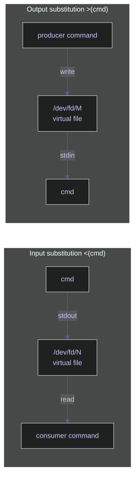

# Process Substitution and Here Documents — Advanced Input/Output

> [!quote]+
> "Expect the output of every program to become the input to another, as yet unknown, program. Don't clutter output with extraneous information. Don't insist on interactive input."
>
> — **Doug McIlroy**, *Bell System Technical Journal* (1978)

> [!abstract]- Summary
>
> Covers Bash process substitution (`<()`, `>()`), here documents (`<<EOF`, `<<'EOF'`, `<<-`), and here strings (`<<<`) for generated-file and stdin workflows, plus the closest PowerShell equivalents.
>
> - `<(cmd)` exposes stdout as a readable pseudo-file that tools such as `diff`, `paste`, and `comm` can open as if it were a real path.
> - `>(cmd)` turns a writable pseudo-file into another command's stdin, which is useful with `tee` for fan-out pipelines.
> - `<<'EOF'` preserves text literally, `<<EOF` expands variables and command substitutions, and `<<-` strips leading tabs.
> - `<<<` feeds one short value to stdin without a temporary file or a separate `printf |` pipeline.
> - PowerShell reaches the same goals with temp files, `Tee-Object -Variable`, `ForEach-Object`, and literal or expanding here-strings.
> - Use `#!/usr/bin/env bash` for `<()`, `>()`, and `<<<`; quote here-doc delimiters when the body contains `$...`; keep PowerShell here-string closing delimiters at column 0.

> [!note]- Glossary
>
> **`<(cmd)`** — input process substitution
>
> 1. Bash operator that runs `cmd` and exposes its stdout as a readable pseudo-file path such as `/dev/fd/N`.
> 2. Use it anywhere a command expects a filename, especially with `diff`, `comm`, and `paste`.
> 3. Bash-only: scripts launched as `sh` or `dash` fail with a syntax error, so use `#!/usr/bin/env bash`.
>
> ---
>
> **`>(cmd)`** — output process substitution
>
> 1. Bash operator that creates a writable pseudo-file path.
> 2. Anything written to that path is sent to `cmd` on stdin, which is why it pairs well with `tee`.
> 3. Data flows into `>(cmd)`, not out of it; the outer command is the producer and the named `cmd` is the consumer.
>
> ---
>
> **`/dev/fd/N`** — file descriptor pseudo-path
>
> 1. Special path that refers to an already-open file descriptor, where `N` is assigned at runtime.
> 2. Process substitution often expands to a path such as `/dev/fd/63`, which is how the shell satisfies commands that only accept filenames.
> 3. The path is valid only while the descriptor remains open; storing it and reusing it later usually fails.
>
> ---
>
> **`<<EOF`** — here-document with unquoted delimiter
>
> 1. Shell redirection that feeds a multi-line block to stdin until a line containing only the delimiter is reached.
> 2. Because the delimiter is unquoted, the body expands `$var`, `$(cmd)`, and arithmetic expressions before the target command reads it.
> 3. Use a quoted delimiter instead when the body contains literal dollar signs, backticks, or SQL placeholders.
>
> ---
>
> **`<<'EOF'`** — here-document with quoted delimiter
>
> 1. Same redirection form as `<<EOF`, but quoting the delimiter disables shell expansion inside the body.
> 2. This is the safe default for SQL, JSON, templates, and any block that must reach the consumer verbatim.
> 3. The `<<-EOF` variant strips leading tabs, not spaces, so it is useful only when the body is indented with tabs.
>
> ---
>
> **`<<<`** — here-string
>
> 1. Bash redirection that passes one string to stdin without building a multi-line here-document.
> 2. It works well for one-off values with commands such as `read`, `grep`, `jq`, `base64`, or `bc`.
> 3. Bash-only: use `printf '%s\n' "$val" | cmd` as the portable fallback for POSIX `sh`.
>
> ---
>
> **`Tee-Object`** — PowerShell pipeline splitter
>
> 1. PowerShell cmdlet that duplicates pipeline output while letting the original stream continue downstream.
> 2. It writes one copy to a file (`-FilePath`) or a variable (`-Variable`) and leaves the main pipeline intact.
> 3. Each call supports one capture target, so multiple destinations require extra pipeline logic.
>
> ---
>
> **`@'...'@` / `@"..."@`** — PowerShell here-strings
>
> 1. PowerShell multi-line string literals where `@'...'@` is literal and `@"..."@` expands variables and subexpressions.
> 2. They are useful for inline SQL, JSON, scripts, templates, and config text that would be awkward as ordinary quoted strings.
> 3. The closing `'@` or `"@` must start at column 0 or PowerShell raises a parser error.

These features let you route generated data through file-oriented tools and stdin-driven commands without dropping intermediate files into your working directory.

## Linux process substitution tools

Process substitution creates a virtual file descriptor that wraps a command's output so other commands can read from it as if it were a file. No temporary files are created or cleaned up. The kernel provides the file descriptor transparently via `/dev/fd/N` (or a named pipe on systems that lack `/dev/fd`).

Two forms exist: `<(cmd)` produces a readable file descriptor (input substitution), and `>(cmd)` produces a writable file descriptor (output substitution). Both can appear on the same command line.



### Linux | process substitution | input `<()`

Input substitution replaces a filename argument with a live file descriptor backed by the output of the given command. The outer command reads from that descriptor exactly as it would read from a real file.

#### Linux | `<()` | compare two command outputs with diff

`diff` requires two file paths. Using `<()` lets you feed it two in-memory streams without creating any disk files. Each `<(sort ...)` expression becomes a separate `/dev/fd/N` descriptor that `diff` reads sequentially.

```bash
diff <(sort file1.txt) <(sort file2.txt)
```

```text
2c2
< banana
---
> cherry
```

#### Linux | `<()` | compare row counts without temp files

Use the same pattern when two generated counts need to be compared by a file-oriented tool. This safe local example feeds `diff` two synthetic counts; the same structure works with database clients once you have a real query runner.

```bash
diff <(printf '%s\n' 2451) <(printf '%s\n' 2449)
```

```text
1c1
< 2451
---
> 2449
```

#### Linux | `<()` | merge selected columns with paste

`paste` joins lines from multiple files side by side. Wrapping each `cut` call in `<()` extracts two non-adjacent columns from the same CSV and merges them into a new stream without writing an intermediate file.

```bash
paste <(cut -d, -f1 stocks.csv) <(cut -d, -f3 stocks.csv)
```

```text
AAPL    145.32
MSFT    310.05
ASML    720.00
```

### Linux | process substitution | output `>()`

Output substitution creates a writable file descriptor backed by the given command's stdin. The producer writes to the substitution as if writing to a file, and the backing command receives that data on its own stdin.

#### Linux | `>()` | tee output to multiple simultaneous consumers

`tee` copies its stdin to each destination listed. Using `>()` lets each destination be a live process rather than a file, so compression and line-counting happen concurrently from one read of the input stream. The follow-up reads back both generated artifacts.

```bash
tmpdir=$(mktemp -d)
printf '%s\n' alpha beta gamma | tee >(gzip > "$tmpdir/data.gz") >(wc -l > "$tmpdir/count.txt") > /dev/null
printf 'count=%s\n' "$(cat "$tmpdir/count.txt")"
gzip -cd "$tmpdir/data.gz"
rm -rf "$tmpdir"
```

```text
count=3
alpha
beta
gamma
```

The redirect `> /dev/null` suppresses the copy that `tee` would normally write to stdout, since both useful outputs are handled by the two substitutions.

#### Linux | `>()` | log and process in parallel

Writing to two independent `>(...)` sinks lets you archive raw data to a log file while simultaneously processing it through a filter, all in one pipeline pass. The verification commands read both outputs back so the split is visible.

```bash
tmpdir=$(mktemp -d)
printf '%s\n' 'INFO started' 'ERROR disk full' 'INFO retry' | tee >(cat > "$tmpdir/audit.log") >(grep ERROR > "$tmpdir/errors.txt") > /dev/null
printf 'audit.log:\n'
cat "$tmpdir/audit.log"
printf 'errors.txt:\n'
cat "$tmpdir/errors.txt"
rm -rf "$tmpdir"
```

```text
audit.log:
INFO started
ERROR disk full
INFO retry
errors.txt:
ERROR disk full
```

### Linux | process substitution | flag reference

Use the table as a quick syntax lookup after the examples above establish the data flow.

| Syntax | Description |
|---|---|
| `<(cmd)` | Run `cmd` and expose its stdout as a readable file descriptor |
| `>(cmd)` | Expose a writable file descriptor; data written to it reaches `cmd`'s stdin |
| `/dev/fd/N` | The actual path the shell provides for the substitution |

---

## Linux here document tools

A here document embeds multi-line text directly in a script, feeding it as stdin to a command. The shell reads lines until it encounters the closing delimiter on its own line. Here documents are useful for inline SQL, config generation, and any command that reads a block of input.

### Linux | here document | literal `<< 'EOF'`

Enclosing the opening delimiter in single quotes (`<< 'EOF'`) disables all expansion inside the block: variables, command substitutions, and backslash escapes are passed through literally. Use this form when you want the exact text without any interpretation.

#### Linux | `<< 'EOF'` | preserve literal text with dollar signs

Use a quoted delimiter when the consumer must receive the text unchanged. This local example prints SQL-like text verbatim; the same form is what you want before piping into `sqlcmd` or another client that interprets `$...` itself.

```bash
cat <<'EOF'
SELECT '$USER' AS literal_user;
EOF
```

```text
SELECT '$USER' AS literal_user;
```

### Linux | here document | expanding `<< EOF`

When the opening delimiter is unquoted (`<< EOF`), the shell expands `$variables`, `$(command)` substitutions, and backslash sequences inside the block before passing it to the command. Use this form for dynamic content generation.

#### Linux | `<< EOF` | generate a config file with variable expansion

Variables and command substitutions in the block are resolved at the time the script runs. The final output is redirected into `config.env`, creating or overwriting the file. The verification step reads the generated file back so the expansion is visible.

```bash
tmpdir=$(mktemp -d)
DB_HOST=db.internal
DB_PORT=5432
cat << EOF > "$tmpdir/config.env"
DB_HOST=${DB_HOST}
DB_PORT=${DB_PORT}
PIPELINE_NAME=pipeline_daily
GENERATED_BY=$(printf 'bash-demo')
EOF
cat "$tmpdir/config.env"
rm -rf "$tmpdir"
```

```text
DB_HOST=db.internal
DB_PORT=5432
PIPELINE_NAME=pipeline_daily
GENERATED_BY=bash-demo
```

#### Linux | `<< EOF` | feed multiple commands to another shell

A here document can drive any stdin-reading program, not just `cat`. This local example sends two commands to a nested Bash process; the same pattern is how multi-line `ssh user@host <<EOF` sessions work once a remote host is available.

```bash
bash <<'EOF'
cd /tmp
pwd
printf '%s\n' ready
EOF
```

```text
/tmp
ready
```

### Linux | here document | flag reference

Keep the table for the small syntax differences; the earlier examples carry the behavior.

| Syntax | Description |
|---|---|
| `<< 'EOF'` | Literal here document — no variable or command expansion |
| `<< EOF` | Expanding here document — `$var` and `$(cmd)` are substituted |
| `<<- EOF` | Expanding here document; leading tabs (not spaces) are stripped from each line |
| `<< 'EOF' > file` | Redirect here document output to a file |

---

## Linux here string tools

A here string feeds one short string to stdin without a temporary file or a separate `printf |` pipeline. It is the cleanest way to pass a literal value on stdin.

### Linux | here string | `<<<`

#### Linux | `<<<` | grep a literal string

The string `"ASML SAP SIE"` is fed directly to `grep`'s stdin. This avoids a pipe and an `echo` subprocess, and the intent is immediately clear from the `<<<` syntax.

```bash
grep "ASML" <<< "ASML SAP SIE"
```

```text
ASML SAP SIE
```

#### Linux | `<<<` | parse a variable with read

`read` normally reads from the terminal. Redirecting a here string into it assigns substrings to named variables without a pipe or subshell.

```bash
read first rest <<< "AAPL 145.32 2026-01-15"
echo "$first"
echo "$rest"
```

```text
AAPL
145.32 2026-01-15
```

#### Linux | `<<<` | feed a JSON string to jq

Here strings work with any command that reads from stdin. Passing a JSON literal directly via `<<<` is cleaner than wrapping it in `echo` or writing a file.

```bash
jq '.price' <<< '{"symbol":"AAPL","price":145.32}'
```

```text
145.32
```

### Linux | here string | flag reference

Use the table as a syntax reminder once you know that `<<<` is for short stdin payloads, not large multi-line blocks.

| Syntax | Description |
|---|---|
| `<<< "string"` | Feed a literal string as stdin; variables are expanded |
| `<<< '$literal'` | Single-quoted string; no expansion |
| `<<< "$(cmd)"` | Feed command output as a single-line stdin |

---

## PowerShell process substitution tools

PowerShell has no direct equivalent to Bash process substitution (`<()`, `>()`). Instead, use temporary files when a command needs a path, `Tee-Object -Variable` when one in-memory capture is enough, and `ForEach-Object` when you need custom branching logic.

### PowerShell | process substitution workaround | temporary files

The most direct translation of `<(cmd)` is to write command output to a temporary file, use the file, then delete it. This is verbose but always works and is easy to audit.

#### PowerShell | temp file | compare two command outputs with diff

Write each command's output to a temporary file, run `Compare-Object` (PowerShell's diff equivalent), then clean up. `[System.IO.Path]::GetTempFileName()` returns a unique path in the system temp directory.

```powershell
$f1 = [System.IO.Path]::GetTempFileName()
$f2 = [System.IO.Path]::GetTempFileName()
(Get-Content file1.txt | Sort-Object) | Set-Content $f1
(Get-Content file2.txt | Sort-Object) | Set-Content $f2
Compare-Object (Get-Content $f1) (Get-Content $f2)
Remove-Item $f1, $f2
```

```text
InputObject SideIndicator
----------- -------------
cherry      =>
banana      <=
```

### PowerShell | process substitution workaround | pipeline variables

`Tee-Object -Variable` captures pipeline output into a named variable while still passing it downstream. This is the closest equivalent to `tee >(cmd)` for in-memory branching.

#### PowerShell | `Tee-Object` | capture and pass through simultaneously

The pipeline output is both stored in `$lines` and forwarded to `Measure-Object`. No file is written; both operations happen in a single pipeline.

```powershell
Get-Content data.csv |
    Tee-Object -Variable lines |
    Measure-Object -Line
```

```text
Lines Words Characters Property
----- ----- ---------- --------
  500
```

### PowerShell | process substitution workaround | ForEach-Object branching

For multiple simultaneous consumers, `ForEach-Object` with a `Begin`/`Process`/`End` script block or parallel calls can approximate `tee >() >()` by dispatching each item to multiple operations inline.

#### PowerShell | `ForEach-Object` | send output to two destinations

Each line from the pipeline is appended to `audit.log` and simultaneously tested for the string `ERROR`. Matches are collected in `$errors`, and the verification step reads both outputs back from a temp directory.

```powershell
$tmp = Join-Path $env:TEMP ('ps-sub-' + [guid]::NewGuid())
New-Item -ItemType Directory -Path $tmp | Out-Null
@('INFO started','ERROR disk full','INFO retry') | Set-Content (Join-Path $tmp 'pipeline.log')
$errors = [System.Collections.Generic.List[string]]::new()
Get-Content (Join-Path $tmp 'pipeline.log') | ForEach-Object {
    Add-Content -Path (Join-Path $tmp 'audit.log') -Value $_
    if ($_ -match 'ERROR') { $errors.Add($_) }
}
$errors | Set-Content (Join-Path $tmp 'errors.txt')
'audit.log:'
Get-Content (Join-Path $tmp 'audit.log')
'errors.txt:'
Get-Content (Join-Path $tmp 'errors.txt')
Remove-Item -LiteralPath $tmp -Recurse -Force
```

```text
audit.log:
INFO started
ERROR disk full
INFO retry
errors.txt:
ERROR disk full
```

---

## PowerShell here document tools

PowerShell's equivalent of a here document is the **here-string**, written with `@'...'@` (literal) or `@"..."@` (expanding). Unlike Bash, the opening `@'` or `@"` must sit at the end of the line, and the closing `'@` or `"@` must appear at the start of a line with no leading whitespace.

### PowerShell | here-string | literal `@'...'@`

#### PowerShell | `@'...'@` | preserve a literal SQL block

Everything between `@'` and `'@` is treated as a literal string. No variable or expression expansion occurs. This local example keeps `$releaseTag` literal inside a SQL-like block; the same pattern is what you want before passing the text to `Invoke-Sqlcmd`.

```powershell
$releaseTag = 'v2.0'
$query = @'
SELECT '$releaseTag' AS literal_tag;
'@
$query
```

```text
SELECT '$releaseTag' AS literal_tag;
```

### PowerShell | here-string | expanding `@"..."@`

#### PowerShell | `@"..."@` | generate a config block with variable expansion

Variables and subexpressions inside `@"..."@` are expanded before the string is used. The result is written to `config.env`, and the verification step reads the generated file back.

```powershell
$tmp = Join-Path $env:TEMP ('ps-here-' + [guid]::NewGuid() + '.env')
$env:DB_HOST = 'db.internal'
$env:DB_PORT = '5432'
$content = @"
DB_HOST=$env:DB_HOST
DB_PORT=$env:DB_PORT
PIPELINE_NAME=pipeline_daily
GENERATED_BY=$( '2026-04-14T00:00:00Z' )
"@
Set-Content -Path $tmp -Value $content
Get-Content $tmp
Remove-Item -LiteralPath $tmp -Force
```

```text
DB_HOST=db.internal
DB_PORT=5432
PIPELINE_NAME=pipeline_daily
GENERATED_BY=2026-04-14T00:00:00Z
```

### PowerShell | here-string | flag reference

Keep the table as a compact syntax check; the examples above show when each form is appropriate.

| Syntax | Description |
|---|---|
| `@'...'@` | Literal here-string — no variable or expression expansion |
| `@"..."@` | Expanding here-string — `$var` and `$(expr)` are substituted |
| `@'...'@ \| cmd` | Pipe a literal here-string to any command reading from stdin |

---


## Operational constraints

- `<()`, `>()`, and `<<<` require Bash. If a script starts with `#!/bin/sh` on a system where `/bin/sh` is `dash`, process substitution and here-strings fail with a syntax error.
- `<<EOF` expands variables and command substitutions, while `<<'EOF'` passes the body literally. Pick the delimiter style deliberately before embedding SQL, templates, or config text.
- PowerShell here-string closing delimiters must start at column 0. Any leading whitespace turns the closing line into a parser error instead of a terminator.

## Recommendations

### Bash/Linux | recommendations

#### Compare generated outputs with `diff <()`

Use process substitution when a comparison tool expects filenames but both inputs are generated on the fly. The pattern stays readable and avoids temporary cleanup.

```bash
diff <(printf '%s\n' alpha beta) <(printf '%s\n' alpha gamma)
```

```text
2c2
< beta
---
> gamma
```

#### Keep SQL or templates literal with `<<'EOF'`

Quote the delimiter when the body contains dollar signs, backticks, or placeholder syntax that the shell must not expand. This is the safer default for inline SQL and templates.

```bash
cat <<'EOF'
SELECT '$USER' AS literal_user;
EOF
```

```text
SELECT '$USER' AS literal_user;
```

#### Generate config text with expanding here-docs

Use an unquoted delimiter when the block is supposed to interpolate shell variables or command substitutions before it is written. Read the file back immediately if you need to verify the generated values.

```bash
tmpdir=$(mktemp -d)
DB_HOST=db.internal
DB_PORT=5432
cat << EOF > "$tmpdir/config.env"
DB_HOST=${DB_HOST}
DB_PORT=${DB_PORT}
PIPELINE_NAME=pipeline_daily
GENERATED_BY=$(printf 'bash-demo')
EOF
cat "$tmpdir/config.env"
rm -rf "$tmpdir"
```

```text
DB_HOST=db.internal
DB_PORT=5432
PIPELINE_NAME=pipeline_daily
GENERATED_BY=bash-demo
```

#### Fan out one stream with `tee >() >()`

Use output substitution when one producer should feed multiple consumers in a single pass. The verification reads both generated artifacts so the split is explicit.

```bash
tmpdir=$(mktemp -d)
printf '%s\n' alpha beta gamma | tee >(gzip > "$tmpdir/data.gz") >(wc -l > "$tmpdir/count.txt") > /dev/null
printf 'count=%s\n' "$(cat "$tmpdir/count.txt")"
gzip -cd "$tmpdir/data.gz"
rm -rf "$tmpdir"
```

```text
count=3
alpha
beta
gamma
```

#### Feed one short stdin value with `<<<`

Use a here-string for one-off stdin payloads that would otherwise need a trivial pipe. It keeps parsing examples compact and avoids a separate producer command.

```bash
read symbol price <<< 'AAPL 145.32'
printf '%s=%s\n' "$symbol" "$price"
```

```text
AAPL=145.32
```

### PowerShell | recommendations

#### Write transient content to a temp file when a command needs a path

PowerShell does not expose process-substitution paths, so a temp file is the direct replacement when a downstream command insists on a filesystem path. Keep creation, use, and cleanup in the same scope.

```powershell
$tmp = [System.IO.Path]::GetTempFileName()
'alpha','beta' | Set-Content $tmp
Get-Content $tmp
Remove-Item -LiteralPath $tmp -Force
```

```text
alpha
beta
```

## Troubleshooting

### Bash/Linux | troubleshooting

#### Syntax error near unexpected token `(`

That message usually means the script is running under `sh` or `dash` instead of Bash. Process substitution is Bash syntax, so the fix is to rerun the command under Bash or change the shebang to `#!/usr/bin/env bash`.

```bash
sh -c 'diff <(printf ready) <(printf ready)'
```

```text
sh: 1: Syntax error: "(" unexpected
```

#### Variables expanded inside a here document unexpectedly

If a here-document body expands when it should have stayed literal, the delimiter is unquoted. Quote the delimiter to stop the outer shell from touching the body before it reaches the consumer.

```bash
name=prod
cat <<EOF
$name
EOF
```

```text
prod
```

#### Variables stayed literal inside a here document

If a here-document body stays literal when it should have expanded, the delimiter is quoted. Switch back to an unquoted delimiter when the body is meant to interpolate shell variables or command substitutions.

```bash
name=prod
cat <<'EOF'
$name
EOF
```

```text
$name
```

#### `diff <(cmd1) <(cmd2)` produced no output

`diff` is silent when both generated inputs are identical. Check the exit status before assuming the command failed; `0` means the two streams matched.

```bash
diff <(printf '%s\n' ready) <(printf '%s\n' ready)
status=$?
echo "exit=$status"
```

```text
exit=0
```

### PowerShell | troubleshooting

#### White space is not allowed before the string terminator

That parser error means the closing `'@` or `"@` of a here-string is indented. Move the terminator back to column 0 so PowerShell can recognize it as the end of the string.

```powershell
$bad = @"
$text = @'
hello
  '@
"@
try { Invoke-Expression $bad } catch { $_.Exception.Message }
```

```text
At line:3 char:3
+   '@
+   ~~
White space is not allowed before the string terminator.
```

## Cross-references

- [io-redirection](https://alp78.github.io/elysium/01-Shell/01-Scripting/03-io-redirection) — Basic redirection operators
- [command-chaining](https://alp78.github.io/elysium/01-Shell/01-Scripting/04-command-chaining) — Connecting commands with pipes
- [brace-expansion-and-globbing](https://alp78.github.io/elysium/01-Shell/01-Scripting/05-brace-expansion-and-globbing) — Another argument generation technique
- [defensive-scripting](https://alp78.github.io/elysium/01-Shell/01-Scripting/07-defensive-scripting) — Using these patterns in production scripts

## References

- [GNU Bash Reference — Process Substitution](https://www.gnu.org/software/bash/manual/html_node/Process-Substitution.html)
- [GNU Bash Reference — Here Documents](https://www.gnu.org/software/bash/manual/html_node/Redirections.html#Here-Documents)
- [PowerShell About Here-Strings](https://learn.microsoft.com/en-us/powershell/module/microsoft.powershell.core/about/about_quoting_rules#here-strings)
- [PowerShell Tee-Object](https://learn.microsoft.com/en-us/powershell/module/microsoft.powershell.utility/tee-object)
