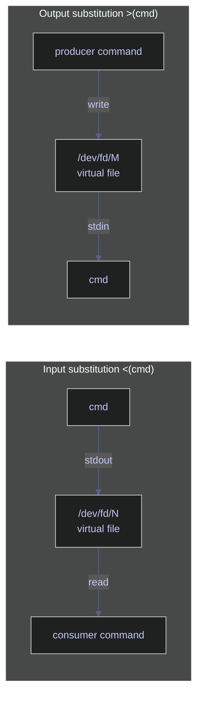

# Process Substitution and Here Documents — Advanced Input/Output

> [!quote]
> "Expect the output of every program to become the input to another, as yet unknown, program. Don't clutter output with extraneous information. Don't insist on interactive input."
>
> — **Doug McIlroy**, *Bell System Technical Journal* (1978)

> [!abstract]- Summary
>
> Covers bash process substitution (`<()`, `>()`), here documents (`<<EOF`, `<<'EOF'`), and here strings (`<<<`) for treating command output as files and embedding multi-line input — with PowerShell parity for each pattern.
>
> **Input process substitution `<()`**
> - Runs a command and exposes its stdout as a readable `/dev/fd/N` path accepted anywhere a filename is expected
> - Eliminates temporary files when diffing two command outputs: `diff <(sort a) <(sort b)`
> - Used to compare SQL row counts between prod and staging with a single `diff` call
> - Bash-only: not available in POSIX `sh`
>
> **Output process substitution `>()`**
> - Creates a writable file descriptor whose data is piped into a backing command's stdin
> - Enables fan-out pipelines: `tee >(gzip > data.gz) >(wc -l) < data.csv > /dev/null`
> - Both `<()` and `>()` can appear on the same command line
>
> **Here documents (`<<`, `<<'EOF'`, `<<-`)**
> - `<<'EOF'` (quoted): literal block — no `$var` or `$(cmd)` expansion; safe for SQL with dollar signs
> - `<<EOF` (unquoted): expanding block — shell resolves variables and command substitutions before passing to the command
> - `<<-`: expanding, strips leading tabs (not spaces) from each line
> - Useful for inline SQL to `sqlcmd`, multi-command SSH sessions, and config file generation
>
> **Here strings (`<<<`)**
> - Feeds a single string as stdin without spawning an `echo` subshell
> - Works with `jq`, `base64`, `bc`, `grep`, and `read`; bash-only
>
> **PowerShell equivalents**
> - No native process substitution; alternatives: temp files via `[System.IO.Path]::GetTempFileName()`, `Tee-Object -Variable`, `ForEach-Object` inline branching
> - `@'...'@` (literal here-string) and `@"..."@` (expanding here-string); closing delimiter must be at column 0
>
> **Operations and safety**
> - Use `#!/usr/bin/env bash` — process substitution and `<<<` fail silently or error under `sh`/`dash`
> - Quote here-doc delimiters (`<<'EOF'`) when the body contains SQL dollar signs or backticks
> - Avoid embedding here-docs longer than ~50 lines; extract to a `.sql` or config file instead
> - Route 3+ consumers with different transforms to a Python/PowerShell script rather than nesting `>()` expressions
> - PowerShell `Tee-Object` supports only one simultaneous destination; use `ForEach-Object` for multiple
> - 3 warnings, 6 recommendations, 5 troubleshooting entries

> [!note]- Glossary
>
> **`<(cmd)`** — input process substitution
> - Bash operator that runs `cmd` and exposes its stdout as a readable pseudo-file path such as `/dev/fd/N`; use it anywhere a command expects a filename argument.
> - Commonly used with tools like `diff`, `comm`, and `paste` so they can read live command output without first writing a temporary file.
>
> > [!warning] Bash-only, not POSIX sh
> >
> > Scripts starting with `#!/bin/sh` fail with a syntax error on systems where `/bin/sh` is `dash` (Debian, Ubuntu). Always use `#!/usr/bin/env bash`.
>
> ---
>
> **`>(cmd)`** — output process substitution
> - Bash operator that creates a writable pseudo-file path; anything written to that path is sent to `cmd` on stdin.
> - Commonly used with `tee` to split one stream to multiple consumers in a single pass.
>
> > [!info] Data flows into `>(cmd)`, not out
> >
> > The direction is opposite to `<()`. The producer writes to the substitution; the named `cmd` is the consumer. Newcomers often reverse this mental model.
>
> ---
>
> **`/dev/fd/N`** — file descriptor pseudo-path
> - Special path that refers to an already-open file descriptor, where `N` is the descriptor number assigned at runtime.
> - Process substitution often expands to a path like `/dev/fd/63`, which is why the shell can pass it to commands that accept filenames.
>
> > [!warning] Descriptor exists only during command execution
> >
> > The path is valid only while the underlying file descriptor remains open. Storing `/dev/fd/63` in a variable and using it later often fails because the descriptor has already been closed.
>
> ---
>
> **`<<EOF`** — here-document with unquoted delimiter
> - Shell redirection that feeds a multi-line block to a command's stdin until a line containing only the delimiter is reached. `EOF` is only a conventional delimiter name; it is not special by itself.
> - Because the delimiter is unquoted, the body is subject to shell expansion such as `$var`, `$(cmd)`, and arithmetic expansion before being passed to the command.
>
> > [!warning] Unintended expansion in SQL
> >
> > Dollar signs in SQL parameter syntax (for example `$1` in PostgreSQL) are expanded by the shell unless the delimiter is quoted. Use `<<'EOF'` for any SQL body that must be passed literally.
>
> ---
>
> **`<<'EOF'`** — here-document with quoted delimiter
> - Same redirection form as `<<EOF`, but quoting the delimiter disables shell expansion inside the body, so the text is passed verbatim.
> - The safe default for embedding SQL, JSON, or any text containing dollar signs, backticks, or backslashes that must not be interpreted by the shell.
>
> > [!info] `<<-` strips leading tabs
> >
> > The `<<-EOF` variant (dash after `<<`) removes leading tab characters from each line, allowing the body to be indented for readability. It strips tabs only — spaces are preserved.
>
> ---
>
> **`<<<`** — here-string
> - Bash redirection that passes a single string to a command's stdin without writing a multi-line here-document.
> - Commonly used for one-off stdin values with commands like `read`, `grep`, `jq`, `base64`, or `bc`.
>
> > [!warning] Bash-only
> >
> > `<<<` is not available in POSIX `sh`. Use `printf '%s\n' "$val" | cmd` as the portable fallback.
>
> ---
>
> **`Tee-Object`** — PowerShell pipeline splitter
> - PowerShell cmdlet that duplicates pipeline output: one copy is written to a file (`-FilePath`) or stored in a variable (`-Variable`), while the original stream continues downstream.
> - The closest PowerShell equivalent to `tee` when you need to capture output and still keep the pipeline flowing.
>
> > [!warning] Single destination only
> >
> > `Tee-Object` supports one capture target per call. To branch to multiple independent consumers, you need additional pipeline logic.
>
> ---
>
> **`@'...'@` / `@"..."@`** — PowerShell here-strings
> - PowerShell multi-line string literals. `@'...'@` is a literal here-string with no variable or subexpression expansion; `@"..."@` is an expandable here-string where `$var` and `$(expr)` are resolved.
> - Used for inline SQL, JSON, scripts, templates, and config text that would be awkward to express as ordinary quoted strings.
>
> > [!danger] Closing delimiter must be at column 0
> >
> > PowerShell raises a syntax error if the closing `'@` or `"@` has any leading whitespace — even a single space or tab. This applies even inside indented `if` blocks or functions.


These features let you treat command output as files and embed multi-line strings directly in your scripts. They eliminate temporary files and make complex data pipeline scripts significantly cleaner.

## Linux process substitution tools

Process substitution creates a virtual file descriptor that wraps a command's output so other commands can read from it as if it were a file. No temporary files are created or cleaned up. The kernel provides the file descriptor transparently via `/dev/fd/N` (or a named pipe on systems that lack `/dev/fd`).

Two forms exist: `<(cmd)` produces a readable file descriptor (input substitution), and `>(cmd)` produces a writable file descriptor (output substitution). Both can appear on the same command line.



### Linux | process substitution | input `<()`

Input substitution replaces a filename argument with a live file descriptor backed by the output of the given command. The outer command reads from that descriptor exactly as it would read from a real file.

#### Linux | `<()` | compare two command outputs with diff

`diff` requires two file paths. Using `<()` lets you feed it two in-memory streams without creating any disk files. Each `<(sort ...)` expression becomes a separate `/dev/fd/N` descriptor that `diff` reads sequentially.

```bash
diff <(sort file1.txt) <(sort file2.txt)
```

```text
2c2
< banana
---
> cherry
```

#### Linux | `<()` | compare SQL row counts across environments

Running `diff` on two `sqlcmd` calls confirms whether staging and production carry the same data volume. The `-h -1` flag suppresses the column header row; `-W` trims trailing whitespace so the comparison is clean.

```bash
diff <(sqlcmd -S prod-server -U sa -P "$PASS" -d analytics_db \
        -Q "SELECT COUNT(*) FROM dbo.market_data" -h -1 -W) \
     <(sqlcmd -S staging-server -U sa -P "$PASS" -d analytics_db \
        -Q "SELECT COUNT(*) FROM dbo.market_data" -h -1 -W)
```

```text
(no output = counts match; any line printed = mismatch)
```

#### Linux | `<()` | merge selected columns with paste

`paste` joins lines from multiple files side by side. Wrapping each `cut` call in `<()` extracts two non-adjacent columns from the same CSV and merges them into a new stream without writing an intermediate file.

```bash
paste <(cut -d, -f1 stocks.csv) <(cut -d, -f3 stocks.csv)
```

```text
AAPL    145.32
MSFT    310.05
ASML    720.00
```

### Linux | process substitution | output `>()`

Output substitution creates a writable file descriptor backed by the given command's stdin. The producer writes to the substitution as if writing to a file, and the backing command receives that data on its own stdin.

#### Linux | `>()` | tee output to multiple simultaneous consumers

`tee` copies its stdin to each destination listed. Using `>()` lets each destination be a live process rather than a file, so compression and line-counting happen concurrently from the same read of `data.csv`.

```bash
tee >(gzip > data.gz) >(wc -l > count.txt) < data.csv > /dev/null
```

The redirect `> /dev/null` suppresses the copy that `tee` would normally write to stdout, since both useful outputs are handled by the two substitutions.

#### Linux | `>()` | log and process in parallel

Writing to two independent `>(...)` sinks lets you archive raw data to a log file while simultaneously processing it through a filter, all in one pipeline pass.

```bash
command | tee >(cat >> audit.log) >(grep ERROR > errors.txt)
```

### Linux | process substitution | flag reference

| Syntax | Description |
|---|---|
| `<(cmd)` | Run `cmd` and expose its stdout as a readable file descriptor |
| `>(cmd)` | Expose a writable file descriptor; data written to it reaches `cmd`'s stdin |
| `/dev/fd/N` | The actual path the shell provides for the substitution |

---

## Linux here document tools

A here document embeds multi-line text directly in a script, feeding it as stdin to a command. The shell reads lines until it encounters the closing delimiter on its own line. Here documents are useful for inline SQL, config generation, and any command that reads a block of input.

### Linux | here document | literal `<< 'EOF'`

Enclosing the opening delimiter in single quotes (`<< 'EOF'`) disables all expansion inside the block: variables, command substitutions, and backslash escapes are passed through literally. Use this form when you want the exact text without any interpretation.

#### Linux | `<< 'EOF'` | send literal SQL to sqlcmd

The entire SQL block is passed verbatim to `sqlcmd` as stdin. Because the delimiter is quoted, `$variables` inside the SQL are not expanded by the shell — important when the SQL contains dollar signs for parameters or internal logic.

```bash
sqlcmd -S 10.132.0.2 -U sa -P "$SA_PASSWORD" -d analytics_db << 'EOF'
SELECT symbol, date, close
FROM dbo.market_data
WHERE _index = 'market_index'
  AND date >= DATEADD(DAY, -30, GETDATE())
ORDER BY date DESC;
EOF
```

### Linux | here document | expanding `<< EOF`

When the opening delimiter is unquoted (`<< EOF`), the shell expands `$variables`, `$(command)` substitutions, and backslash sequences inside the block before passing it to the command. Use this form for dynamic content generation.

#### Linux | `<< EOF` | generate a config file with variable expansion

Variables and command substitutions in the block are resolved at the time the script runs. The final output is redirected into `config.env`, creating or overwriting the file. `$(date ...)` inside the unquoted block is evaluated by the shell before writing.

```bash
cat << EOF > config.env
DB_HOST=${DB_HOST}
DB_PORT=${DB_PORT}
PIPELINE_NAME=pipeline_daily
GENERATED_AT=$(date -u +%Y-%m-%dT%H:%M:%SZ)
EOF
```

#### Linux | `<< EOF` | multiline ssh commands

Feeding a here document to `ssh` runs multiple commands on the remote host in a single connection without needing a separate script file on the remote side.

```bash
ssh user@host << EOF
cd /opt/pipeline
./run_etl.sh --env prod
echo "ETL exit code: $?"
EOF
```

### Linux | here document | flag reference

| Syntax | Description |
|---|---|
| `<< 'EOF'` | Literal here document — no variable or command expansion |
| `<< EOF` | Expanding here document — `$var` and `$(cmd)` are substituted |
| `<<- EOF` | Expanding here document; leading tabs (not spaces) are stripped from each line |
| `<< 'EOF' > file` | Redirect here document output to a file |

---

## Linux here string tools

A here string feeds a single-line string as stdin to a command, equivalent to `echo "..." | cmd` but without spawning a subshell for `echo`. It is the cleanest way to pass a literal value on stdin.

### Linux | here string | `<<<`

#### Linux | `<<<` | grep a literal string

The string `"ASML SAP SIE"` is fed directly to `grep`'s stdin. This avoids a pipe and an `echo` subprocess, and the intent is immediately clear from the `<<<` syntax.

```bash
grep "ASML" <<< "ASML SAP SIE"
```

```text
ASML SAP SIE
```

#### Linux | `<<<` | parse a variable with read

`read` normally reads from the terminal. Redirecting a here string into it assigns substrings to named variables without a pipe or subshell.

```bash
read first rest <<< "AAPL 145.32 2026-01-15"
echo "$first"
echo "$rest"
```

```text
AAPL
145.32 2026-01-15
```

#### Linux | `<<<` | feed a JSON string to jq

Here strings work with any command that reads from stdin. Passing a JSON literal directly via `<<<` is cleaner than wrapping it in `echo` or writing a file.

```bash
jq '.price' <<< '{"symbol":"AAPL","price":145.32}'
```

```text
145.32
```

### Linux | here string | flag reference

| Syntax | Description |
|---|---|
| `<<< "string"` | Feed a literal string as stdin; variables are expanded |
| `<<< '$literal'` | Single-quoted string; no expansion |
| `<<< "$(cmd)"` | Feed command output as a single-line stdin |

---

## PowerShell process substitution tools

> [!info]
> PowerShell has no direct equivalent to Bash process substitution (`<()`, `>()`). The Bash feature relies on Linux kernel file descriptors (`/dev/fd/N`) that do not exist on Windows. PowerShell provides three practical alternatives depending on the use case: **temporary files**, **pipeline variables** (`Tee-Object -Variable`), and **`ForEach-Object` inline branching**.

### PowerShell | process substitution workaround | temporary files

The most direct translation of `<(cmd)` is to write command output to a temporary file, use the file, then delete it. This is verbose but always works and is easy to audit.

#### PowerShell | temp file | compare two command outputs with diff

Write each command's output to a temporary file, run `Compare-Object` (PowerShell's diff equivalent), then clean up. `[System.IO.Path]::GetTempFileName()` returns a unique path in the system temp directory.

```powershell
$f1 = [System.IO.Path]::GetTempFileName()
$f2 = [System.IO.Path]::GetTempFileName()
(Get-Content file1.txt | Sort-Object) | Set-Content $f1
(Get-Content file2.txt | Sort-Object) | Set-Content $f2
Compare-Object (Get-Content $f1) (Get-Content $f2)
Remove-Item $f1, $f2
```

```text
InputObject SideIndicator
----------- -------------
cherry      =>
banana      <=
```

### PowerShell | process substitution workaround | pipeline variables

`Tee-Object -Variable` captures pipeline output into a named variable while still passing it downstream. This is the closest equivalent to `tee >(cmd)` for in-memory branching.

#### PowerShell | `Tee-Object` | capture and pass through simultaneously

The pipeline output is both stored in `$lines` and forwarded to `Measure-Object`. No file is written; both operations happen in a single pipeline.

```powershell
Get-Content data.csv |
    Tee-Object -Variable lines |
    Measure-Object -Line
```

```text
Lines Words Characters Property
----- ----- ---------- --------
  500
```

### PowerShell | process substitution workaround | ForEach-Object branching

For multiple simultaneous consumers, `ForEach-Object` with a `Begin`/`Process`/`End` script block or parallel calls can approximate `tee >() >()` by dispatching each item to multiple operations inline.

#### PowerShell | `ForEach-Object` | send output to two destinations

Each line from the pipeline is appended to `audit.log` and simultaneously tested for the string `ERROR`. Matches are collected in `$errors`.

```powershell
$errors = [System.Collections.Generic.List[string]]::new()
Get-Content pipeline.log | ForEach-Object {
    Add-Content -Path audit.log -Value $_
    if ($_ -match 'ERROR') { $errors.Add($_) }
}
$errors | Set-Content errors.txt
```

---

## PowerShell here document tools

PowerShell's equivalent of a here document is the **here-string**, written with `@'...'@` (literal) or `@"..."@` (expanding). Unlike Bash, the opening `@'` or `@"` must sit at the end of the line, and the closing `'@` or `"@` must appear at the start of a line with no leading whitespace.

### PowerShell | here-string | literal `@'...'@`

#### PowerShell | `@'...'@` | embed a literal SQL block

Everything between `@'` and `'@` is treated as a literal string. No variable or expression expansion occurs. The result is assigned to `$query` and passed to `Invoke-Sqlcmd`.

```powershell
$query = @'
SELECT symbol, date, close
FROM dbo.market_data
WHERE _index = 'market_index'
  AND date >= DATEADD(DAY, -30, GETDATE())
ORDER BY date DESC;
'@
Invoke-Sqlcmd -ServerInstance "10.132.0.2" -Database "analytics_db" -Query $query
```

### PowerShell | here-string | expanding `@"..."@`

#### PowerShell | `@"..."@` | generate a config block with variable expansion

Variables and subexpressions inside `@"..."@` are expanded before the string is used. The result is written to `config.env`.

```powershell
$content = @"
DB_HOST=$env:DB_HOST
DB_PORT=$env:DB_PORT
PIPELINE_NAME=pipeline_daily
GENERATED_AT=$(Get-Date -Format 'yyyy-MM-ddTHH:mm:ssZ')
"@
Set-Content -Path config.env -Value $content
```

### PowerShell | here-string | flag reference

| Syntax | Description |
|---|---|
| `@'...'@` | Literal here-string — no variable or expression expansion |
| `@"..."@` | Expanding here-string — `$var` and `$(expr)` are substituted |
| `@'...'@ \| cmd` | Pipe a literal here-string to any command reading from stdin |

---


> [!example] Bash Composition Fit
>
> > [!success] Appropriate
> >
> > - **Comparing command outputs** -- `diff <(sort a) <(sort b)` compares two sorted streams without temp files. Essential for reconciling data between environments.
> > - **Multi-consumer pipelines** -- `tee >(gzip > data.gz) >(wc -l)` compresses and counts in one pass, saving I/O when the source data is large.
> > - **Inline SQL and config blocks** -- here documents embed SQL scripts directly in bash, avoiding separate `.sql` files for simple queries.
> > - **Dynamic config generation** -- expanding here documents (`<<EOF`) with `$VAR` interpolation generate environment-specific config files at deploy time.
> > - **Feeding values to parsers** -- `jq '.key' <<< '{"key":"value"}'` is cleaner than `echo '...' | jq` for quick JSON extraction.
>
> > [!failure] Inappropriate
> >
> > - **POSIX portability required** -- process substitution (`<()`, `>()`) and here strings (`<<<`) are bash extensions. Scripts targeting `#!/bin/sh` cannot use them.
> > - **Seekable file required** -- some commands need to seek in their input file. Process substitution provides a pipe, not a seekable file.
> > - **Very large inline blocks** -- a 500-line here document embedded in a script harms readability. Extract it to a separate file and use `< file.sql` instead.
> > - **Complex multi-branch output routing** -- if you need to route output to 3+ consumers with different transformations, write a Python or PowerShell script instead of nesting `>()` expressions.

## Warnings

> [!warning] Process substitution is not POSIX
>
> `<()` and `>()` require bash. Scripts starting with `#!/bin/sh` on systems where `/bin/sh` is dash (Debian, Ubuntu) will fail with a syntax error. Always use `#!/usr/bin/env bash` when using process substitution.

> [!warning] Here document delimiter quoting changes expansion behavior
>
> `<<EOF` expands `$variables` and `$(commands)` inside the block. `<<'EOF'` (quoted) treats everything as literal text. Mixing them up can inject unintended values into SQL queries or config files.

> [!warning] PowerShell here-string closing delimiter must be at column 0
>
> In PowerShell, the closing delimiter must appear at the very start of its line with zero leading whitespace. Indenting it -- even inside a function or `if` block -- causes a syntax error.

## Recommendations

| Scenario | Recommendation |
|---|---|
| Comparing data between environments | Use `diff <(sqlcmd -S prod ...) <(sqlcmd -S staging ...)` for quick row-count or schema-diff reconciliation. |
| Embedding SQL in scripts | Use quoted here documents (`<<'EOF'`) when the SQL contains dollar signs or backticks that must not be expanded. |
| Generating config files | Use expanding here documents (`<<EOF`) with variable interpolation. Redirect output to the config file: `cat <<EOF > config.yaml`. |
| Multi-consumer streaming | Use `tee >(consumer1) >(consumer2) < input > /dev/null` to fan out data without temp files. |
| PowerShell equivalent of `<()` | Write to a temp file with `[System.IO.Path]::GetTempFileName()`, use it, then clean up in a `finally` block. |
| Quick JSON/string parsing | Use `<<<` for one-off values to `jq`, `base64`, or `read`. |

## Troubleshooting

| Symptom | Likely cause | Fix |
|---|---|---|
| Syntax error near unexpected token `(` | Using `<()` in a non-bash shell (dash, sh). | Change shebang to `#!/usr/bin/env bash`. |
| Here document variables are expanded when they should not be | Delimiter is unquoted (`<<EOF` instead of `<<'EOF'`). | Quote the delimiter: `<<'EOF'`. |
| Here document variables are NOT expanded when they should be | Delimiter is quoted (`<<'EOF'`). | Use the unquoted form: `<<EOF`. |
| PowerShell here-string fails with unrecognized token | The closing delimiter is indented. | Move the closing delimiter to column 0. |
| `diff <(cmd1) <(cmd2)` shows no output | The two commands produce identical output -- diff is silent when there are no differences. | This is correct behavior. Check `$?` (0 = identical, 1 = different). |
## Cross-references

- [io-redirection](https://alp78.github.io/elysium/01-Shell/01-Scripting/03-io-redirection) — Basic redirection operators
- [command-chaining](https://alp78.github.io/elysium/01-Shell/01-Scripting/04-command-chaining) — Connecting commands with pipes
- [brace-expansion-and-globbing](https://alp78.github.io/elysium/01-Shell/01-Scripting/05-brace-expansion-and-globbing) — Another argument generation technique
- [defensive-scripting](https://alp78.github.io/elysium/01-Shell/01-Scripting/07-defensive-scripting) — Using these patterns in production scripts

## References

- [GNU Bash Reference — Process Substitution](https://www.gnu.org/software/bash/manual/html_node/Process-Substitution.html)
- [GNU Bash Reference — Here Documents](https://www.gnu.org/software/bash/manual/html_node/Redirections.html#Here-Documents)
- [PowerShell About Here-Strings](https://learn.microsoft.com/en-us/powershell/module/microsoft.powershell.core/about/about_quoting_rules#here-strings)
- [PowerShell Tee-Object](https://learn.microsoft.com/en-us/powershell/module/microsoft.powershell.utility/tee-object)
