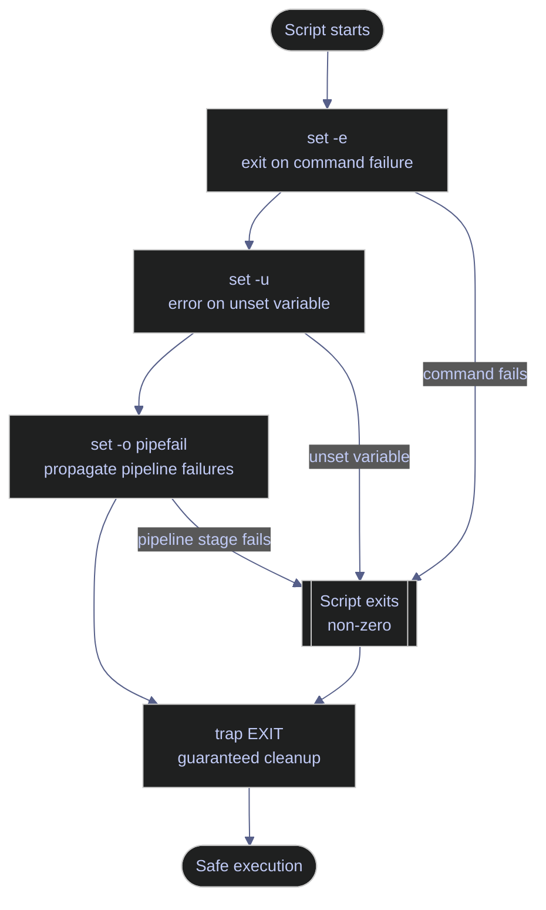

# Defensive Scripting with Bash Strict Mode and PowerShell Error Handling

> [!quote] Safety requires change
>
> "The most dangerous phrase in the language is, 'We've always done it this way.'"
>
> — **Grace Hopper**, attributed remark (c. 1980s)
>
> "Bash without `set -euo pipefail` is a loaded gun pointed at your data."
>
> — Shell scripting proverb

> [!abstract]- Summary
>
> Shows how Bash strict mode and PowerShell strict error handling prevent silent failures in production automation.
>
> - Bash: `set -e`, `set -u`, `set -o pipefail`, `${VAR:-default}`, `${VAR:?error}`, and `trap ... EXIT`
> - PowerShell: `$ErrorActionPreference = 'Stop'`, `Set-StrictMode -Version Latest`, `try/catch/finally`, and explicit `$LASTEXITCODE` checks for native tools
> - Use these defaults in CI/CD, cron, Airflow, and other unattended runs; avoid enabling Bash strict mode globally in interactive shells or sourced library files

> [!note]- Glossary
>
> **`set -e`**
> - Exit immediately when a command returns non-zero.
> - Stops downstream steps from running on invalid or missing input.
> - Does not fire inside `if` tests, before `||`, or in other intentional control-flow escape hatches.
>
> ---
>
> **`set -u`**
> - Treat references to unset variables as errors.
> - Prevents empty expansions from slipping into destructive commands.
> - Use `${VAR:-default}` or `${VAR:?message}` when variables are optional or required.
>
> ---
>
> **`set -o pipefail`**
> - Makes a pipeline return non-zero when any stage fails.
> - Preserves the real failure instead of letting the last command hide it.
> - Keep it in scripts, not interactive shell startup files, because expected SIGPIPE behavior can otherwise be surprising.
>
> ---
>
> **`set -euo pipefail`**
> - Combined Bash strict-mode header.
> - Makes failure, missing variables, and pipeline errors explicit from the top of the script.
> - Put it immediately after the shebang so no earlier command runs unprotected.
>
> ---
>
> **`trap`**
> - Bash builtin for registering a handler on shell exit or a signal.
> - Use `trap cleanup EXIT` for temp-file removal, lock cleanup, and error logging.
> - `trap ERR` is narrower and is not inherited by functions or subshells unless `set -E` is also enabled.
>
> ---
>
> **Exit code**
> - Numeric status returned by a process; `0` means success and any other value means failure or a distinct outcome.
> - Drives `set -e`, `&&`, `||`, and orchestration retry logic.
> - Some non-zero values are expected, such as `grep` returning `1` for "no matches".
>
> ---
>
> **`${VAR:-default}`**
> - Parameter expansion that substitutes a default when `VAR` is unset or empty.
> - Safe pattern for optional configuration under `set -u`.
> - `:-` differs from `-` and `:?`; choose the operator that matches whether empty values are allowed.
>
> ---
>
> **`${VAR:?error message}`**
> - Parameter expansion that exits immediately with a custom message when a required variable is unset or empty.
> - Use it near the top of the script for required environment variables.
> - Failing fast here is safer than discovering a missing variable inside `rm`, `psql`, or deployment commands later.
>
> ---
>
> **`$ErrorActionPreference`**
> - PowerShell preference variable that controls how non-terminating errors behave.
> - Set it to `Stop` so cmdlet and provider errors become terminating errors.
> - It does not inspect exit codes from native executables such as `python.exe`, `git.exe`, or `cmd.exe`.
>
> ---
>
> **`Set-StrictMode`**
> - Enables structural checks such as uninitialized variable access and invalid property use.
> - PowerShell equivalent of making latent script bugs fail early.
> - It complements `$ErrorActionPreference`; it does not replace it.
>
> ---
>
> **`try/catch/finally`**
> - PowerShell structured error handling.
> - `catch` handles terminating errors and `finally` always runs cleanup.
> - Non-terminating errors bypass `catch` unless `$ErrorActionPreference` is already `Stop`.
>
> ---
>
> **`$LASTEXITCODE`**
> - Exit code from the most recent native executable.
> - Required for native tools because PowerShell preference variables do not turn those exit codes into exceptions.
> - Throw on non-zero inside `try` so the failure enters normal error handling.
>
> ---
>
> **SIGPIPE**
> - Unix signal sent when a process writes to a pipe whose reader has already closed.
> - Relevant because `pipefail` can surface expected early-termination patterns such as `grep ... | head`.
> - Allow intentional cases with `|| true` or by scoping `set +o pipefail` around that pipeline.
>
> ---
>
> **`$PSScriptRoot`**
> - Directory containing the running `.ps1` file.
> - Use it to resolve paths relative to the script instead of the caller's working directory.
> - It is empty in interactive sessions; only rely on it inside actual script files.

Production automation fails safely only when the shell is told how to treat errors, missing input, and cleanup. Bash strict mode and PowerShell strict error handling make those rules explicit instead of leaving them to defaults designed for interactive use.

Related reading: [08_py_errorhandling](https://alp78.github.io/elysium/02-Programming-Languages/Python/08_py_errorhandling) covers Python exception handling, [08_cs_errorhandling](https://alp78.github.io/elysium/02-Programming-Languages/CSharp/08_cs_errorhandling) covers C# `try/catch/finally`, and [airflow-dag-patterns](https://alp78.github.io/elysium/12-Orchestration/Airflow/airflow-dag-patterns) applies the same failure-propagation logic to orchestrated jobs.

The diagram below shows how the three Bash flags and `trap` interact as a layered defense. PowerShell equivalents map to the same layers.



## Linux | bash | defensive scripting tools

Bash strict mode is a set of shell behaviors that converts silent failure into explicit failure. Use it in production scripts, not as a blanket default for interactive sessions.

### Linux | set | configure shell safety flags

The `set` builtin changes the behavior of the current shell. The strict-mode flags below are normally enabled together, but each one protects a different failure mode.

#### Enable the full strict mode header

Every production script should put the shebang first and the strict-mode header immediately after it. The header itself has no output, so the verification command below inspects the shell option state after enabling the flags.

```bash
#!/usr/bin/env bash
set -euo pipefail
```

```bash
set -euo pipefail
set -o | grep -E "errexit|nounset|pipefail"
```
```text
errexit        	on
nounset        	on
pipefail       	on
```

#### set -e — stop on the first failing command

Without `set -e`, a command can fail and the script still keeps running. The first example shows the failure being observed but ignored. The second example enables `set -e`; the command after `false` never runs, and the caller receives a non-zero exit status.

```bash
printf "before\n"
if false; then
    result=0
else
    result=1
fi
printf "after\n"
printf "failed_command=%s\n" "$result"
```
```text
before
after
failed_command=1
```

```bash
bash -c 'set -e; printf "before\n"; false; printf "after\n"'
printf "script_exit=%s\n" "$?"
```
```text
before
script_exit=1
```

Use the escape hatches deliberately. `if cmd ...`, `cmd || true`, and subshell boundaries are explicit ways to handle expected non-zero statuses without disabling strict mode for the whole script.

#### set -u — stop on unset variables

`set -u` turns a missing variable into an immediate failure. That matters most when the variable is about to influence a path, connection string, or destructive command.

The classic destructive pattern looks like this. The existing captured output is preserved because it already demonstrates the failure being caught before `rm` expands the path.

```bash
rm -rf "$STAGING_DIR"/*
```

```text
bash: STAGING_DIR: unbound variable
```

For a safe console check, probe the missing variable directly.

```bash
set -u
printf '%s\n' "$STAGING_DIR"
```
```text
bash: line 3: STAGING_DIR: unbound variable
```

#### Supply defaults for optional variables with `${VAR:-default}`

`${VAR:-default}` keeps `set -u` enabled while still allowing optional configuration. It is the right tool for settings that have a safe operational fallback.

```bash
DB_PORT="${DB_PORT:-1433}"
LOG_LEVEL="${LOG_LEVEL:-INFO}"
CACHE_MODE="${CACHE_MODE:-read-only}"
printf "DB_PORT=%s\nLOG_LEVEL=%s\nCACHE_MODE=%s\n" "$DB_PORT" "$LOG_LEVEL" "$CACHE_MODE"
```
```text
DB_PORT=1433
LOG_LEVEL=INFO
CACHE_MODE=read-only
```

#### Require startup configuration with `${VAR:?error}`

`${VAR:?message}` is the hard-stop version of parameter expansion. Use it near the top of the script so required configuration fails before the script touches data or infrastructure.

```bash
: "${DB_HOST:?ERROR: DB_HOST must be set}"
```
```text
/bin/bash: line 1: DB_HOST: ERROR: DB_HOST must be set
```

#### set -o pipefail — surface upstream pipeline failures

Without `pipefail`, a pipeline is treated as successful if its last command succeeds. The first run shows a failed first stage still producing `pipeline_exit=0`. The second run enables `pipefail`, so the same upstream failure becomes visible to the caller.

```bash
if false | cat >/dev/null; then
    echo "pipeline_exit=0"
else
    echo "pipeline_exit=1"
fi
```
```text
pipeline_exit=0
```

```bash
set -o pipefail
if false | cat >/dev/null; then
    echo "pipeline_exit=0"
else
    echo "pipeline_exit=1"
fi
```
```text
pipeline_exit=1
```

The related `set` switches below are still useful as a compact lookup table.

| Flag | Syntax | Description |
|---|---|---|
| `-e` | `set -e` | Exit immediately when any command exits with a non-zero status |
| `-u` | `set -u` | Treat unset variables as errors and exit immediately |
| `-o pipefail` | `set -o pipefail` | Pipeline exit code is the exit code of the first failed command |
| `-x` | `set -x` | Print each command and its arguments before executing |
| `-n` | `set -n` | Read commands but do not execute them |
| `-f` | `set -f` | Disable filename expansion (globbing) |
| `-C` | `set -C` | Prevent redirection from overwriting existing files |
| `+e` | `set +e` | Disable exit-on-error temporarily |
| `+u` | `set +u` | Disable unset-variable errors temporarily |

#### Use `set -x` only for temporary debugging

`set -x` is useful because it prints each command before execution, but it will also print arguments and can leak secrets. Turn it on only around the block you are diagnosing and remove it before committing the script.

```bash
set -x
printf 'safe_demo\n'
```
```text
safe_demo
+ printf 'safe_demo\n'
```

#### Disable strict mode only around an intentional failure

When a command is allowed to fail, scope that exception narrowly with `set +e` and then restore `set -e` immediately. That preserves the default fail-fast behavior everywhere else.

```bash
set -e
set +e
false
allowed=$?
set -e
printf 'allowed_failure=%s\n' "$allowed"
echo 'still_running'
```
```text
allowed_failure=1
still_running
```

### Linux | trap | guarantee cleanup on exit

`trap` is the shell equivalent of a `finally` block. Register cleanup before the risky part of the script so temporary files and other resources are released even when `set -e` stops execution.

#### Register cleanup with `trap ... EXIT`

`EXIT` fires on normal completion, explicit `exit`, or shell termination caused by `set -e`. The demo below fails on purpose, but the cleanup handler still runs and preserves the original exit code.

```bash
bash -c 'set -euo pipefail
TEMP_FILE=$(mktemp)
cleanup() {
    exit_code=$?
    rm -f "$TEMP_FILE"
    printf "cleanup_ran exit=%s\n" "$exit_code"
}
trap cleanup EXIT
false'
printf "script_exit=%s\n" "$?"
```
```text
cleanup_ran exit=1
script_exit=1
```

#### Handle specific signals when the script must react

Trap `INT` when you need to respond to Ctrl+C and `TERM` when you need to react to orchestrator-initiated shutdown. `HUP` can be ignored if the script must outlive a disconnected terminal, but `SIGKILL` can never be trapped.

```bash
trap 'echo Interrupted' INT
trap 'echo Terminated' TERM
kill -INT $$
kill -TERM $$
echo 'handlers_complete'
```
```text
Interrupted
Terminated
handlers_complete
```

### Linux | bash | production script template

The next example writes a short script to `/tmp` and runs it so `BASH_SOURCE[0]` behaves the same way it would in production. It combines strict mode, required-variable checks, a temp file, and an `EXIT` trap.

```bash
script=/tmp/defensive-template-demo.sh
cat > "$script" <<'EOF'
#!/usr/bin/env bash
set -euo pipefail

cleanup() {
    local exit_code=$?
    rm -f "$TEMP_FILE" 2>/dev/null
    printf '[LOG] cleanup exit=%s\n' "$exit_code"
}
trap cleanup EXIT

readonly SCRIPT_DIR="$(cd "$(dirname "${BASH_SOURCE[0]}")" && pwd)"
readonly TEMP_FILE="$(mktemp)"
readonly DB_HOST="${DB_HOST:-db.internal}"
readonly DB_PORT="${DB_PORT:-1433}"

log() { printf '[LOG] %s\n' "$*"; }

log "SCRIPT_DIR=$SCRIPT_DIR"
log "Connecting to $DB_HOST:$DB_PORT"
log 'Pipeline complete'
EOF
bash "$script"
rm -f "$script"
```
```text
[LOG] SCRIPT_DIR=/tmp
[LOG] Connecting to db.internal:1433
[LOG] Pipeline complete
[LOG] cleanup exit=0
```

## PowerShell | defensive scripting tools

PowerShell has equivalents for every Bash mechanism above, but the defaults are different. Cmdlet errors are often non-terminating by default, and native executable exit codes require explicit inspection.

### PowerShell | $ErrorActionPreference | set global error behavior

`$ErrorActionPreference` is the PowerShell control for whether non-terminating errors keep execution moving. Set it to `Stop` at the top of every script so cmdlet and provider failures enter normal exception handling.

#### Set `$ErrorActionPreference = 'Stop'` at the top of every script

The demo below forces a missing-path error. With `Stop` enabled, the error becomes terminating and flows into `catch` instead of allowing the script to continue.

```powershell
& {
    $ErrorActionPreference = 'Stop'
    try {
        Get-Item -LiteralPath '.\definitely-missing-file' | Out-Null
        'after'
    }
    catch {
        "caught=$($_.Exception.GetType().Name)"
    }
}
```
```text
caught=ItemNotFoundException
```

The common preference values below remain a useful compact lookup.

| Value | Behavior |
|---|---|
| `Continue` | Print error message and continue executing (default) |
| `Stop` | Treat every error as terminating |
| `SilentlyContinue` | Suppress error output and continue |
| `Inquire` | Prompt the user on each error |

### PowerShell | Set-StrictMode | detect uninitialized variables and bad expressions

`Set-StrictMode -Version Latest` is the PowerShell equivalent of refusing to let missing state slide by as `$null`. It catches uninitialized variables, bad property access, and related structural mistakes early.

#### Enable `Set-StrictMode -Version Latest`

The preserved example below shows the kind of failure strict mode prevents in destructive code.

```powershell
Remove-Item "$StagingDir\*" -Recurse -Force
```

```text
The variable '$StagingDir' cannot be retrieved because it has not been set.
At line:1 char:13
```

For a safe verification run, read the missing variable directly inside a `try/catch`.

```powershell
& {
    Set-StrictMode -Version Latest
    try {
        $null = $StagingDir
        'after'
    }
    catch {
        $_.Exception.Message
    }
}
```
```text
The variable '$StagingDir' cannot be retrieved because it has not been set.
```

The version table below is still useful as a factual lookup.

| Version | Additional checks enabled |
|---|---|
| `1.0` | Prohibits references to uninitialized variables |
| `2.0` | Adds uninitialized properties and calls to non-existent functions |
| `Latest` | Enables all checks available in the current PowerShell version |

### PowerShell | try/catch/finally | structured error handling and cleanup

`try/catch/finally` is the PowerShell equivalent of Bash `set -e` plus `trap EXIT`. Use `catch` for terminating failures and `finally` for cleanup that must always happen.

#### Wrap the script body in `try/catch/finally`

This run creates a temp file, triggers a terminating error, and then proves that the `finally` block still executed cleanup.

```powershell
& {
    $ErrorActionPreference = 'Stop'
    Set-StrictMode -Version Latest
    $TempFile = New-TemporaryFile
    try {
        'starting'
        Get-Item -LiteralPath '.\definitely-missing-file' | Out-Null
        'after'
    }
    catch {
        "caught=$($_.Exception.GetType().Name)"
    }
    finally {
        $CleanupRan = Test-Path -LiteralPath $TempFile
        Remove-Item -LiteralPath $TempFile -ErrorAction SilentlyContinue
        "cleanup_ran=$CleanupRan"
    }
}
```
```text
starting
caught=ItemNotFoundException
cleanup_ran=True
```

#### Throw on non-zero `$LASTEXITCODE` after native tools

Native executables do not honor `$ErrorActionPreference`. The native command below fails with exit code `7`; the explicit `throw` converts that exit code into a terminating PowerShell error that `catch` can handle.

```powershell
& {
    $ErrorActionPreference = 'Stop'
    try {
        cmd /c exit 7
        if ($LASTEXITCODE -ne 0) {
            throw "native_exit=$LASTEXITCODE"
        }
        'after'
    }
    catch {
        $_.Exception.Message
    }
}
```
```text
native_exit=7
```

### PowerShell | production script template

This example writes a short `.ps1` file to the temp directory and runs it so `$PSScriptRoot` is populated the same way it would be in production.

```powershell
$ScriptPath = Join-Path $env:TEMP 'defensive-template-demo.ps1'
@'
#Requires -Version 5.1
$ErrorActionPreference = 'Stop'
Set-StrictMode -Version Latest
$TempFile = New-TemporaryFile
$ScriptDir = $PSScriptRoot
$env:DB_HOST = 'db.internal'
$DbHost = $env:DB_HOST
if (-not $DbHost) { throw 'ERROR: DB_HOST environment variable must be set' }
$DbPort = if ($env:DB_PORT) { $env:DB_PORT } else { '1433' }
function Write-Log {
    param([string]$Message)
    "[LOG] $Message"
}
try {
    Write-Log "ScriptDir=$ScriptDir"
    Write-Log "Connecting to ${DbHost}:${DbPort}"
    Write-Log 'Pipeline complete'
}
finally {
    Remove-Item -LiteralPath $TempFile -ErrorAction SilentlyContinue
    Write-Log 'Cleanup complete'
    Remove-Item Env:DB_HOST -ErrorAction SilentlyContinue
    Remove-Item Env:DB_PORT -ErrorAction SilentlyContinue
}
'@ | Set-Content -LiteralPath $ScriptPath
& $ScriptPath
Remove-Item -LiteralPath $ScriptPath
```
```text
[LOG] ScriptDir=C:\Users\aperi\AppData\Local\Temp
[LOG] Connecting to db.internal:1433
[LOG] Pipeline complete
[LOG] Cleanup complete
```

## Troubleshooting

The symptoms below are the most common reasons strict scripts feel "too aggressive" at first. In each case, the fix is to keep the safety mechanism and make the expected edge case explicit.

### Linux | troubleshooting

#### A command that is allowed to return 1 now stops the script

`grep` returns `1` when it finds no match. Under `set -e`, that is still a non-zero exit code, so the script stops unless you mark the case as expected.

```bash
if bash -lc 'set -e; grep -q needle /dev/null; echo after'; then
    echo 'script_exit=0'
else
    echo 'script_exit=1'
fi
```
```text
script_exit=1
```

```bash
bash -lc 'set -e; grep -q needle /dev/null || true; echo after'
```
```text
after
```

Use `if grep ...; then ... fi` when the result controls branching, and use `|| true` only when you are explicitly absorbing a benign non-zero status.

#### An optional variable is unbound under `set -u`

If a variable is genuinely optional, do not disable `set -u`; give that variable an explicit fallback.

```bash
printf 'OPTIONAL_VAR=%s\n' "${OPTIONAL_VAR:-fallback}"
```
```text
OPTIONAL_VAR=fallback
```

#### A pipeline looks successful even though the first stage failed

`pipefail` makes the pipeline fail, and `PIPESTATUS` tells you which stage returned which exit code. Use both when diagnosing a multi-stage pipeline.

```bash
set -o pipefail
false | cat >/dev/null
printf 'PIPESTATUS=%s %s\n' "${PIPESTATUS[0]}" "${PIPESTATUS[1]}"
```
```text
PIPESTATUS=1 0
```

#### Cleanup never runs

The most common cause is that the trap was registered too late. If the script fails before `trap cleanup EXIT`, there is nothing to run. Even when the trap is registered correctly, `SIGKILL` remains uncatchable.

```bash
if bash -lc 'set -e; false; trap '\''echo cleanup'\'' EXIT'; then
    echo 'script_exit=0'
else
    echo 'script_exit=1'
fi
```
```text
script_exit=1
```

```bash
if bash -lc 'set -e; trap '\''echo cleanup'\'' EXIT; false'; then
    echo 'script_exit=0'
else
    echo 'script_exit=1'
fi
```
```text
cleanup
script_exit=1
```

### PowerShell | troubleshooting

#### `catch` never runs because the error is still non-terminating

With the default `Continue` behavior, non-terminating errors stay non-terminating. The script below captures the emitted error record and still reaches the line after it, which is the symptom to look for.

```powershell
& {
    $ErrorActionPreference = 'Continue'
    try {
        $Records = Write-Error 'boom' 2>&1
        "error_records=$($Records.Count)"
        'after'
    }
    catch {
        'caught'
    }
}
```
```text
error_records=1
after
```

```powershell
& {
    $ErrorActionPreference = 'Stop'
    try {
        Write-Error 'boom'
        'after'
    }
    catch {
        'caught'
    }
}
```
```text
caught
```

#### A native executable fails but the script keeps going

Native tools report failure through `$LASTEXITCODE`, not through PowerShell's error preference system. The first example shows the script continuing after `cmd /c exit 7`; the second turns that exit code into a terminating error.

```powershell
& {
    $ErrorActionPreference = 'Stop'
    try {
        cmd /c exit 7
        "LASTEXITCODE=$LASTEXITCODE"
        'after_native_tool'
    }
    catch {
        'caught'
    }
}
```
```text
LASTEXITCODE=7
after_native_tool
```

```powershell
& {
    $ErrorActionPreference = 'Stop'
    try {
        cmd /c exit 7
        if ($LASTEXITCODE -ne 0) {
            throw "native_exit=$LASTEXITCODE"
        }
    }
    catch {
        $_.Exception.Message
    }
}
```
```text
native_exit=7
```

## Cross-references

- [error-handling-and-retry-patterns](https://alp78.github.io/elysium/14-Data-Architecture/Pipeline-Patterns/error-handling-and-retry-patterns) — Cross-cutting error classification, retry strategies, and failure propagation theory
- [command-chaining](https://alp78.github.io/elysium/01-Shell/01-Scripting/04-command-chaining) — How `&&`, `||`, and `;` use exit codes
- [io-redirection](https://alp78.github.io/elysium/01-Shell/01-Scripting/03-io-redirection) — Redirecting errors for logging
- [environment-variables](https://alp78.github.io/elysium/01-Shell/01-Scripting/01-environment-variables) — Handling required vs optional configuration
- [process-substitution](https://alp78.github.io/elysium/01-Shell/01-Scripting/06-process-substitution) — Advanced I/O patterns for scripts

## References

- [GNU Bash Reference — The Set Builtin](https://www.gnu.org/software/bash/manual/html_node/The-Set-Builtin.html)
- [Unofficial Bash Strict Mode](http://redsymbol.net/articles/unofficial-bash-strict-mode/)
- [PowerShell — about_Preference_Variables](https://learn.microsoft.com/en-us/powershell/module/microsoft.powershell.core/about/about_preference_variables)
- [PowerShell — Set-StrictMode](https://learn.microsoft.com/en-us/powershell/module/microsoft.powershell.core/set-strictmode)
- [PowerShell — about_Try_Catch_Finally](https://learn.microsoft.com/en-us/powershell/module/microsoft.powershell.core/about/about_try_catch_finally)
