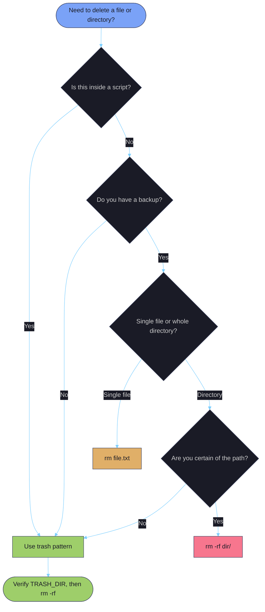

# File Manipulation

> [!quote]
> "Unix was not designed to stop you from doing stupid things, because that would also stop you from doing clever things."
>
> — **Douglas Gwyn**
>
> "Only wimps use tape backup. Real men just upload their important stuff on ftp and let the rest of the world mirror it."
>
> — **Linus Torvalds**, Usenet post (1996)

> [!abstract]- Summary
>
> Safe patterns for copying, moving, deleting, and permissioning files in Linux and PowerShell production environments — covering the tools, their failure modes, and when to use each.
>
> **Linux file manipulation tools**
> - `cp -a` preserves timestamps, permissions, and symlinks; plain `cp -r` resets `mtime` and breaks downstream change detection
> - `rsync` supports resumable transfers, checksum verification, and `--delete` sync; trailing slash on source controls whether contents or the directory itself is copied
> - `mv` is atomic on the same filesystem (single `rename()` syscall); cross-filesystem `mv` is copy + delete — prefer `rsync -a src dst && rm src` for critical cross-filesystem moves
> - `rm -rf` is immediate and unrecoverable; the trash pattern (move to timestamped staging dir, verify, then delete) is mandatory in scripts
> - `rename` (Perl) applies regex substitutions to filenames in bulk; Debian and RHEL ship incompatible versions — check `rename --version`
> - `mkdir -p` creates nested paths idempotently; `chmod` sets permissions in octal (755, 644, 600) or symbolic (`u+x`) notation; `chown -R uid:0` fixes Docker/Airflow bind-mount ownership
> - `du -sh` reports directory size; `df -h` reports filesystem free space — check both bytes and inodes (`df -i`) before large writes
>
> **PowerShell file manipulation tools**
> - `Copy-Item -Recurse` does not preserve timestamps by default; no direct equivalent of `cp -a`
> - `Move-Item` is atomic on the same drive; cross-drive moves are copy + delete
> - `Rename-Item` renames in place; pipe `Get-ChildItem` into it for batch renames with `-NewName { $_.Name -replace ... }`
> - `Remove-Item -Recurse -Force` has no recycle bin and no confirmation; use `-WhatIf` to preview; use `[System.IO.Directory]::Delete($path, $true)` when `-Recurse` fails with "directory is not empty"
> - `icacls` manages NTFS ACLs: `/grant "user:(OI)(CI)F"` for recursive full control, `/reset /T` to restore inheritance; `takeown` is required when locked out before `icacls` can act
> - `Get-PSDrive -PSProvider FileSystem` shows used/free per drive; `Get-ChildItem -Recurse | Measure-Object -Sum Length` calculates directory size
>
> **Operations and safety**
> - Use `cp -a` for data directories, `rsync` for large/network transfers, and the trash pattern for any script-driven deletion
> - Never `rm -rf $VAR/*` without `set -u`; an unset variable expands to `rm -rf /*`
> - Always dry-run `rsync --delete` with `-n` before the real run; a wrong trailing slash with `--delete` wipes the destination
> - Do not move or delete live database files (`.mdf`, `.ldf`) directly — use database backup/restore tools
> - Cross-server transfers require `rsync -e ssh`, `scp`, or `gsutil` — `cp` and `mv` are local-only
> - 6 troubleshooting scenarios covered: Docker permission denied, rsync --delete over-deletion, cp -r timestamp reset, slow cross-filesystem mv, Remove-Item -Recurse failure, chmod no-op on FAT32/exFAT

> [!note]- Glossary
>
> **`cp`**
> - The Linux command for copying files and directories; without flags copies a single file, `-r` copies recursively, `-a` (archive) preserves timestamps, permissions, ownership, and symlinks.
> - Central to staging pipeline data: always use `cp -a` for data directories so downstream change-detection logic based on `mtime` is not broken.
>
> > [!warning] `-r` silently resets modification times
> >
> > `cp -r` copies all files but sets every `mtime` to the current time. Tools using `find -newer` or `stat` will treat every file as "new." Use `cp -a` whenever timestamps matter.
>
> ---
>
> **`rsync`**
> - A file-transfer tool that copies only the delta between source and destination, supports checksum verification, and resumes after interruption by re-running the same command.
> - The standard choice for large, networked, or unreliable transfers; `-ah --progress` gives human-readable output with per-file speed; `--delete` keeps source and destination in exact sync.
>
> > [!danger] Trailing slash controls scope with `--delete`
> >
> > `rsync -a src/ dst/` copies contents into `dst/`; `rsync -a src dst/` creates `dst/src/`. Combined with `--delete`, a wrong slash wipes the destination. Always dry-run with `rsync -avn --delete` first.
>
> ---
>
> **`mv`**
> - The Linux command for moving and renaming files; same-filesystem moves are a single `rename()` syscall (instant, atomic); cross-filesystem moves are copy + delete (not atomic).
> - Used for atomic output commits in pipelines: write to a temp file, then `mv` it to the final destination — same-filesystem `mv` prevents downstream readers from seeing a partial file.
>
> > [!warning] Cross-filesystem `mv` can leave partial files
> >
> > If a cross-filesystem `mv` fails mid-copy (disk full, permission error), the partial copy remains at the destination and the original is still at the source. Use `rsync -a src dst && rm src` for verifiable cross-filesystem moves.
>
> ---
>
> **`rm`**
> - The Linux command for permanently deleting files and directories; there is no system trash — deletion is immediate and unrecoverable without a backup.
> - The most operationally dangerous standard command: `rm -rf` with a wrong path or unset variable can destroy entire directory trees instantly.
>
> > [!danger] Unset variable expands to `rm -rf /*`
> >
> > `rm -rf "$STAGING_DIR"/*` with an unset `STAGING_DIR` expands to `rm -rf /*`. Always enable `set -u` and verify paths before deletion. Use the trash pattern in all scripts.
>
> ---
>
> **Trash pattern**
> - A safe deletion strategy: move the target to a timestamped staging directory (`/tmp/trash_$(date +%Y%m%d_%H%M%S)`) instead of deleting immediately, verify, then delete the staging directory.
> - Provides a recovery window at the cost of a 30-second verification step — the only safe approach for `rm`-equivalent operations in automated scripts.
>
> > [!warning] Skipping verification defeats the pattern
> >
> > The trash pattern only helps if you inspect the staging directory before final deletion. An unverified trash-then-delete is functionally equivalent to `rm -rf` — just slower.
>
> ---
>
> **`chmod`**
> - The Linux command for setting file permissions using octal notation (e.g., `755`) or symbolic notation (e.g., `u+x`); each octal digit encodes read (4) + write (2) + execute (1) for owner, group, and others.
> - Common production values: `755` for scripts and executables, `644` for data files and configs, `600` for secrets and key files, `700` for private directories.
>
> > [!info] `chmod` modifies the target, not the symlink
> >
> > `chmod 600 my_link` changes permissions on the target file the symlink points to, not the symlink itself. On most Linux filesystems, symlink permissions are ignored entirely — the target's permissions govern access.
>
> ---
>
> **`chown`**
> - The Linux command for changing file ownership; `chown user:group file` sets both owner and group in a single operation; `-R` applies recursively.
> - Required in Docker/Airflow environments where containers run as a specific UID (Airflow default: `50000`) and need write access to host-mounted directories.
>
> > [!warning] Mismatched container UID causes silent write failures
> >
> > Setting `chown root:root` on a bind mount that an Airflow container (UID 50000) must write to causes "Permission denied" at runtime. Always match the container's UID — verify with `docker inspect`.
>
> ---
>
> **`rename` (Perl)**
> - A Debian/Ubuntu utility that applies a Perl regex substitution (`s/old/new/`) to filenames for bulk renaming; not installed by default on RHEL/CentOS.
> - Used for batch extension changes, prefix/suffix operations, and pattern-based renames; `-n` dry-runs the operation before committing.
>
> > [!danger] Two incompatible `rename` utilities exist
> >
> > Debian/Ubuntu ship Perl `rename` (`rename 's/old/new/' files`); RHEL/CentOS ship util-linux `rename` (`rename old new files`) — completely different syntax. Running the wrong version silently corrupts filenames. Check with `rename --version`.
>
> ---
>
> **`du` / `df`**
> - `du` (disk usage) reports how much space a file or directory occupies on disk; `df` (disk free) reports filesystem-level used/available space for all mounted filesystems.
> - Always check `df -h` before large copies or data imports to avoid mid-transfer failures; check `df -i` for inode exhaustion — a filesystem can have 0% byte usage but 100% inode usage, blocking all new file creation.
>
> > [!warning] Inode exhaustion looks identical to disk-full errors
> >
> > Millions of small files (log entries, cache shards) can exhaust inodes while leaving gigabytes free. `df -i` reveals this; `df -h` does not. The fix is deleting many small files, not freeing large ones.
>
> ---
>
> **`icacls`**
> - The Windows command-line tool for viewing and modifying NTFS access control lists (ACLs); the functional equivalent of `chmod` on Linux; inheritance flags `(OI)(CI)` are required for permissions to cascade to children.
> - Used to grant (`/grant`), deny (`/deny`), remove (`/remove`), or reset (`/reset /T`) NTFS permissions on files and directories; `takeown` must precede `icacls` when ownership is lost.
>
> > [!warning] Missing inheritance flags limit scope to the directory only
> >
> > `/grant "user:F"` grants Full Control on the directory itself but not on its files or subdirectories. Use `/grant "user:(OI)(CI)F"` for permissions that cascade to all children.
>
> ---
>
> **`Remove-Item`**
> - The PowerShell cmdlet for deleting files and directories; `-Recurse -Force` is the equivalent of `rm -rf` — no confirmation, no recycle bin, no recovery.
> - Use `-WhatIf` to preview every file that would be deleted before committing; use `[System.IO.Directory]::Delete($path, $true)` when `-Recurse` fails with "directory is not empty" due to open file handles.
>
> > [!danger] `-Recurse` has no confirmation and no undo
> >
> > `Remove-Item -Recurse -Force` deletes immediately and permanently. There is no `-WhatIf` safety net once the command runs. Always inspect with `Get-ChildItem` and run with `-WhatIf` first.

## Linux file manipulation tools

Linux provides dedicated single-purpose tools for each file operation: `cp` for copying, `mv` for moving and renaming, `rm` for deletion, `rsync` for resumable transfers, `rename` for batch renames, `mkdir` for directory creation, `chmod` for permissions, `chown` for ownership, `du` for directory size, and `df` for disk space. Each tool has a narrow contract — composing them correctly is where safe file handling begins.



### Linux | cp | copy files and directories

`cp` copies files and directories. Without flags it copies a single file. With `-r` it copies directories recursively. With `-a` it preserves all metadata (timestamps, permissions, symlinks).

#### Copy a single file

Copies `source.txt` to `dest.txt`. If `dest.txt` already exists it is silently overwritten — use `-i` to prompt before overwrite or `-n` to skip.

```bash
cp source.txt dest.txt
```

#### Copy a directory recursively

`-r` enables recursive copy. All subdirectories and files are copied, but metadata (timestamps, permissions) is not preserved — use `-a` for that.

```bash
cp -r source_dir/ dest_dir/
```

#### Archive copy preserving all metadata

`-a` (archive) combines `-r` with full metadata preservation: timestamps, permissions, ownership, and symlinks. Use this when copying pipeline data directories — downstream processes often rely on modification times for change detection.

```bash
cp -a source_dir/ dest_dir/
```

> [!warning] cp -r does not preserve timestamps
>
> Plain `cp -r` copies files but resets `mtime` to the current time. If a downstream
> process uses `find -newer` or `stat` to detect changes, every file appears "new" after
> a `cp -r` copy. Always use `cp -a` for data directories.

> [!success] Use cp -a for data directories
>
> `cp -a source_dir/ dest_dir/` preserves timestamps and permissions, keeping downstream change-detection logic intact.

#### Skip existing files (no-clobber)

`-n` prevents overwriting an existing destination file. The copy is silently skipped if the target already exists.

```bash
cp -n source.txt dest.txt
```

#### Copy only when source is newer

`-u` copies only if the source modification time is newer than the destination, or if the destination does not exist. Useful for incremental updates.

```bash
cp -u source.txt dest.txt
```

| Flag | Syntax | Description |
|------|--------|-------------|
| `-r` | `cp -r src/ dst/` | Recursive copy (required for directories) |
| `-a` | `cp -a src/ dst/` | Archive mode: recursive + preserve all metadata |
| `-n` | `cp -n src dst` | No-clobber: skip if destination exists |
| `-u` | `cp -u src dst` | Update: copy only when source is newer |
| `-v` | `cp -v src dst` | Verbose: print each copied file |
| `-i` | `cp -i src dst` | Interactive: prompt before overwrite |
| `-l` | `cp -l src dst` | Hard link instead of copy |
| `-s` | `cp -s src dst` | Symbolic link instead of copy |
| `-p` | `cp -p src dst` | Preserve mode, ownership, timestamps |
| `--backup` | `cp --backup src dst` | Make a backup of destination if it exists |

### Linux | rsync | resumable copy with checksum verification

`rsync` is the standard tool for large or resumable file copies. If interrupted, re-run the same command — it picks up where it left off by comparing checksums. The `-a` flag enables archive mode (recursive + preserve all attributes).

#### Copy a file with progress display

`-ah` enables archive mode and human-readable output. `--progress` prints per-file transfer speed and a running byte count.

```bash
rsync -ah --progress source.tar.gz dest/
```

#### Sync a directory, deleting removed files from destination

`--delete` removes destination files no longer present in the source. Always dry-run before using `--delete` to confirm the source path is correct.

```bash
rsync -ah --delete src/ dest/
```

> [!danger] rsync trailing slash behavior
>
> A trailing `/` on the source means "copy the **contents** of this directory." No
> trailing `/` means "copy the **directory itself**."
>
> | Command | Result |
> |---|---|
> | `rsync -a src/ dest/` | Files land directly in `dest/` |
> | `rsync -a src dest/` | Creates `dest/src/` containing the files |
>
> Combined with `--delete`, a wrong trailing slash can **wipe the destination directory**.

> [!success] Always dry-run before --delete
>
> `rsync -avn --delete src/ dest/` shows exactly what would be transferred and deleted
> without touching any files. Make this a habit before any `rsync --delete` operation.

#### Dry-run preview

`-n` simulates the transfer and prints every file that would be sent or deleted without making any changes to either side.

```bash
rsync -avn --delete src/ dest/
```

| Flag | Syntax | Description |
|------|--------|-------------|
| `-a` | `rsync -a src/ dst/` | Archive mode: recursive + preserve all attributes |
| `-h` | `rsync -h` | Human-readable sizes |
| `-v` | `rsync -v` | Verbose output |
| `-n` / `--dry-run` | `rsync -n` | Simulate without making changes |
| `--progress` | `rsync --progress` | Show per-file transfer progress |
| `--delete` | `rsync --delete src/ dst/` | Delete destination files not in source |
| `-z` | `rsync -z` | Compress data during transfer |
| `-e` | `rsync -e ssh` | Specify remote shell |
| `--exclude` | `rsync --exclude='*.log'` | Exclude files matching pattern |
| `--checksum` | `rsync --checksum` | Skip based on checksum, not mod-time + size |
| `--partial` | `rsync --partial` | Keep partially transferred files on interruption |
| `--bwlimit` | `rsync --bwlimit=1000` | Limit bandwidth (KB/s) |

### Linux | mv | move and rename files

`mv` renames files on the same filesystem using a single `rename()` syscall — instantaneous regardless of file size. When source and destination are on different filesystems, `mv` falls back to copy + delete.

#### Rename a file

On the same filesystem, `mv` is a single `rename()` syscall — instantaneous regardless of file size.

```bash
mv old.txt new.txt
```

#### Move a file to another directory

If the destination directory does not exist, `mv` renames the file to that name rather than moving it inside. Verify the destination path exists first.

```bash
mv file.txt /other/dir/
```

> [!warning] mv across filesystems is not atomic
>
> Same-filesystem `mv` is a single syscall — it either succeeds or fails, nothing in
> between. Cross-filesystem `mv` is copy-then-delete. If the copy fails (disk full,
> permission error), you end up with a partial file at the destination and the original
> still at the source.

> [!success] Use rsync for critical cross-filesystem moves
>
> `rsync -a src dst && rm src` gives you a verified copy before deletion. Interruption leaves the source intact.

| Flag | Syntax | Description |
|------|--------|-------------|
| `-i` | `mv -i src dst` | Interactive: prompt before overwrite |
| `-n` | `mv -n src dst` | No-clobber: refuse to overwrite existing |
| `-u` | `mv -u src dst` | Move only when source is newer |
| `-v` | `mv -v src dst` | Verbose: print each moved file |
| `-f` | `mv -f src dst` | Force: never prompt |

### Linux | rename | batch rename with Perl regex

The Perl-based `rename` utility applies a regex substitution to every matching filename. Install with `apt install rename` (Debian/Ubuntu). Not installed by default.

#### Batch rename file extensions

The Perl `s/old/new/` regex is applied to each matching filename. Only the filename is modified — the directory path is unchanged. The `.csv$` anchor prevents matching `.csv` embedded in the middle of a name.

```bash
rename 's/\.csv$/.csv.bak/' *.csv
```

> [!warning] Two different rename utilities
>
> Debian/Ubuntu ship the **Perl rename** (`rename 's/old/new/' files`). RHEL/CentOS ship
> the **util-linux rename** (`rename old new files`) — completely different syntax. Check
> which you have with `rename --version`. If you need portability, use a `for` loop with
> `mv` instead.

> [!success] Portable alternative using a for loop
>
> ```bash
> for f in *.csv; do mv "$f" "${f%.csv}.csv.bak"; done
> ```
> Works on any system without the `rename` utility.

| Flag | Syntax | Description |
|------|--------|-------------|
| `-n` | `rename -n 's/old/new/' *` | Dry-run: show what would be renamed |
| `-v` | `rename -v 's/old/new/' *` | Verbose: print each rename |
| `-f` | `rename -f 's/old/new/' *` | Force: overwrite existing targets |

### Linux | rm | delete files and directories safely

`rm` permanently deletes files and directories. There is no system trash for `rm` — deletion is immediate and unrecoverable without a backup. Safe delete patterns replace direct `rm -rf` with a move-to-staging approach that preserves a recovery window.

#### Delete a single file

`rm` permanently deletes the file with no trash or undo. The space is reclaimed immediately on most filesystems.

```bash
rm file.txt
```

#### Delete a directory recursively

`-r` traverses the directory tree and removes all files and subdirectories. No confirmation is requested.

```bash
rm -r directory/
```

#### Force delete without confirmation

`-f` suppresses all prompts and ignores non-existent files. Combined with `-r`, this is the most dangerous shell command — verify the path before running.

```bash
rm -rf directory/
```

#### Safe delete — move to staging area instead

Move the target to a timestamped trash directory rather than deleting immediately. Verify the staging area, then delete.

```bash
mv directory/ /tmp/delete_me_$(date +%Y%m%d)/
```

> [!warning] Never rm -rf directly in scripts
>
> Use the trash pattern instead:
> ```bash
> TRASH_DIR="/tmp/trash_$(date +%Y%m%d_%H%M%S)"
> mkdir -p "$TRASH_DIR"
> mv "$TARGET_DIR" "$TRASH_DIR/"
> echo "Moved to $TRASH_DIR — delete manually after verification"
> ```
> This gives you a recovery window. In production, the cost of a 30-second delay to verify is infinitely less than the cost of accidentally deleting a database backup directory.

> [!success] Enable set -euo pipefail before any delete logic
>
> `set -u` prevents the catastrophic `rm -rf $UNDEFINED/` expansion. `trap EXIT` ensures cleanup runs even on error. See [defensive-scripting](https://alp78.github.io/elysium/01-Shell/01-Scripting/07-defensive-scripting).

> [!info] trash-cli — freedesktop-compatible trash on Linux
>
> `trash-put file.txt` moves files to the XDG trash (`~/.local/share/Trash`) instead of permanent deletion. Install with `apt install trash-cli`. Use `trash-restore` to recover. Not a substitute for backup, but prevents accidental single-file deletions in interactive use.

| Flag | Syntax | Description |
|------|--------|-------------|
| `-r` | `rm -r dir/` | Recursive: delete directory and contents |
| `-f` | `rm -f file` | Force: no error if absent, no prompt |
| `-rf` | `rm -rf dir/` | Force recursive deletion (use with extreme caution) |
| `-i` | `rm -i file` | Interactive: prompt before each deletion |
| `-v` | `rm -v file` | Verbose: print each deleted file |
| `--` | `rm -- -file` | End of options: allows deleting files starting with `-` |

### Linux | mkdir | create directory trees

`mkdir` creates directories. Without flags it fails if the directory already exists or if parent directories are missing. The `-p` flag makes it idempotent and handles nested paths.

#### Create a directory

Creates `mydir` in the current directory. Fails if `mydir` already exists or if parent directories are missing — use `-p` to handle both.

```bash
mkdir mydir
```

#### Create nested directories with parents

`-p` creates parent directories as needed and suppresses "already exists" errors — making it safe to run repeatedly. Combined with [brace expansion](https://alp78.github.io/elysium/01-Shell/01-Scripting/05-brace-expansion-and-globbing), a single command creates an entire [medallion-architecture](https://alp78.github.io/elysium/14-Data-Architecture/Pipeline-Patterns/medallion-architecture) directory tree.

```bash
mkdir -p /data/pipeline/{bronze,silver,gold}/staging
```

| Flag | Syntax | Description |
|------|--------|-------------|
| `-p` | `mkdir -p path/to/dir` | Create parents as needed; no error if exists |
| `-m` | `mkdir -m 750 dir` | Set permissions at creation time |
| `-v` | `mkdir -v dir` | Verbose: print each created directory |

### Linux | chmod | set file permissions

`chmod` sets read/write/execute permissions. Octal notation (e.g., `755`) sets all three permission groups at once. Symbolic notation (e.g., `u+x`) modifies specific bits without affecting the rest.

#### Set permissions with octal notation

Octal notation sets all three permission groups (owner, group, others) simultaneously. `755` gives the owner read/write/execute and gives group and others read/execute.

```bash
chmod 755 script.sh
```

#### Add execute bit with symbolic notation

`+x` adds the execute bit for all three permission groups without changing any other bits. Use this to make a script runnable without touching read/write permissions.

```bash
chmod +x script.sh
```

#### Modify specific permission bits

Comma-separated symbolic expressions are applied atomically. `u+w` adds write for the owner; `g-w` removes write for the group.

```bash
chmod u+w,g-w file
```

> [!warning] chmod follows symlinks
>
> `chmod 600 my_link` changes permissions on the **target file**, not the symlink itself.
> On most Linux filesystems, symlink permissions are ignored entirely — the target's
> permissions govern access. This surprises people who expect the symlink to act as a
> permission barrier.

> [!success] Use -h to change the symlink itself
>
> `chmod -h` (where supported) changes the symlink's own permissions, not the target. Availability varies by OS — check `man chmod` on your system.

> [!info] Octal permission patterns
>
> - `755` — scripts and executables (owner can write, everyone can read/execute)
> - `644` — data files and configs (owner can write, everyone can read)
> - `600` — secrets and key files (only owner can read/write)
> - `700` — private directories (only owner can enter)
> - Each digit = read (4) + write (2) + execute (1)

| Flag | Syntax | Description |
|------|--------|-------------|
| `-R` | `chmod -R 755 dir/` | Recursive: apply to all files in directory |
| `-v` | `chmod -v 644 file` | Verbose: show permission change for each file |
| `-c` | `chmod -c 644 file` | Report only files whose permissions actually changed |
| `--reference` | `chmod --reference=ref file` | Copy permissions from reference file |

### Linux | chown | change file ownership

`chown` changes the owner and group of a file. The `user:group` syntax sets both at once. `-R` applies recursively to all files in a directory tree.

#### Change owner and group of a file

Sets the owner to `user` and the group to `group` in a single operation. Both `user` and `group` must exist on the system.

```bash
chown user:group file.txt
```

#### Fix Airflow container permissions on a bind mount

The UID `50000` is Airflow's default container user. Verify with `docker inspect` if using a custom image. For the full [container-lifecycle](https://alp78.github.io/elysium/09-Docker/container-lifecycle) including bind mounts and volume management, see the Docker section.

```bash
chown -R 50000:0 /opt/airflow/dags/
```

> [!tip] Docker bind mount permission fix
>
> The most common Docker permission error in data engineering is an Airflow or pipeline container unable to write to a host-mounted directory. Fix it with `chown -R <uid>:0 /path/`. The UID 50000 is Airflow's default — verify for custom images.

| Flag | Syntax | Description |
|------|--------|-------------|
| `-R` | `chown -R user:group dir/` | Recursive: apply to all files in directory |
| `-v` | `chown -v user file` | Verbose: show change for each file |
| `-c` | `chown -c user file` | Report only files that actually changed |
| `--reference` | `chown --reference=ref file` | Copy ownership from reference file |
| `-h` | `chown -h user symlink` | Change ownership of the symlink itself, not the target |

### Linux | du | check directory size

`du` (disk usage) reports how much disk space a file or directory occupies. `-s` gives a summary total, `-h` makes it human-readable. For a full disk investigation workflow including `du` vs `df` discrepancies and inode exhaustion, see [navigation-and-listing](https://alp78.github.io/elysium/01-Shell/02-File-Operations/01-navigation-and-listing).

#### Get total size of a directory

`-s` prints only the summary total (not per-file sizes). `-h` formats the result as human-readable K/M/G.

```bash
du -sh /var/opt/mssql/data/
```

#### List subdirectory sizes, sorted largest first

`--max-depth=1` prints sizes for immediate subdirectories only, avoiding per-file recursion. Piped to `sort -rh` to rank by descending human-readable size.

```bash
du -h --max-depth=1 /var/opt/mssql/ | sort -rh
```

| Flag | Syntax | Description |
|------|--------|-------------|
| `-s` | `du -s dir/` | Summary: print total only, not per-file |
| `-h` | `du -h dir/` | Human-readable sizes (K, M, G) |
| `--max-depth` | `du --max-depth=1 dir/` | Limit recursion depth |
| `-c` | `du -c dir/` | Print grand total at end |
| `-a` | `du -a dir/` | Include all files, not just directories |
| `--exclude` | `du --exclude='*.log' dir/` | Skip files matching pattern |

### Linux | df | check available disk space

`df` (disk free) shows mounted filesystem usage. Always check free space before large copies or data imports — full disks cause silent data corruption or application failure.

#### Show disk usage for all mounted filesystems

`-h` formats sizes in human-readable units (K, M, G). Reports used, available, and percent-used for every mounted filesystem.

```bash
df -h
```

> [!warning] Check free space before writing
>
> SQL Server **stops** when the disk is full. Always verify free space before large copies or data imports. For the full disk-full runbook, see [sql-server-problems](https://alp78.github.io/elysium/04-SQL-Server/01-Server-Operations/sql-server-problems#data-disk-full).

> [!success] Monitor inodes as well as bytes
>
> `df -i` shows inode usage. A filesystem can be 0% full by bytes but 100% full by inodes if millions of tiny files exist, which causes "no space left on device" despite apparent free space.

#### Check inode usage

A filesystem can exhaust inodes before exhausting disk space if millions of small files (logs, cache entries) accumulate. `df -i` reveals this condition — a near-100% `IUse%` with plenty of free bytes means you cannot create new files until inodes are freed.

```bash
df -i
```

| Flag | Syntax | Description |
|------|--------|-------------|
| `-h` | `df -h` | Human-readable sizes |
| `-i` | `df -i` | Show inode usage instead of block usage |
| `-T` | `df -T` | Show filesystem type |
| `-t` | `df -t ext4` | Filter by filesystem type |
| `--total` | `df --total` | Print grand total row |

## PowerShell file manipulation tools

PowerShell provides `Copy-Item`, `Move-Item`, `Rename-Item`, `Remove-Item`, and `New-Item` as the core file manipulation cmdlets. For permissions, use `icacls` (the Windows ACL tool). For disk space, use `Get-PSDrive`. For directory size, use `Get-ChildItem` piped to `Measure-Object`.

### PowerShell | Copy-Item | copy files and directories

`Copy-Item` copies files and directories. Unlike `cp -a`, it does NOT preserve timestamps by default — the copy gets the current timestamp.

#### Copy a file

Copies `source.txt` to `dest.txt`. Overwrites without prompt by default. Unlike `cp -a`, timestamps are reset to the current time.

```powershell
Copy-Item source.txt dest.txt
```

#### Copy a directory recursively

`-Recurse` is required for directories. Without it, `Copy-Item` copies only the directory container and none of its contents.

```powershell
Copy-Item -Path source_dir -Destination dest_dir -Recurse
```

| Parameter | Syntax | Description |
|-----------|--------|-------------|
| `-Path` | `-Path src` | Source path(s) |
| `-Destination` | `-Destination dst` | Target path |
| `-Recurse` | `-Recurse` | Copy directories recursively |
| `-Force` | `-Force` | Overwrite read-only files |
| `-Filter` | `-Filter *.csv` | Filter by pattern |
| `-Exclude` | `-Exclude *.tmp` | Exclude matching files |
| `-PassThru` | `-PassThru` | Return copied item objects |

### PowerShell | Move-Item | move files between paths

`Move-Item` moves files between paths. Like Linux `mv`, same-drive moves are instant renames; cross-drive moves are copy + delete.

#### Move a file

Renames or moves `old.txt` to `new.txt`. Same-drive moves are instant renames; cross-drive moves are copy + delete.

```powershell
Move-Item old.txt new.txt
```

| Parameter | Syntax | Description |
|-----------|--------|-------------|
| `-Path` | `-Path src` | Source path |
| `-Destination` | `-Destination dst` | Target path |
| `-Force` | `-Force` | Overwrite existing destination |
| `-PassThru` | `-PassThru` | Return moved item object |

### PowerShell | Rename-Item | rename files in place

`Rename-Item` renames a file or directory within the same location without moving it.

#### Rename a file

Renames within the same directory. `-NewName` takes a name only, not a full path — use `Move-Item` to relocate a file.

```powershell
Rename-Item old.txt new.txt
```

#### Batch rename with regex

`Get-ChildItem` pipelines into `Rename-Item` for bulk renames. The scriptblock form of `-NewName` receives the current item as `$_` and returns the new name string.

```powershell
Get-ChildItem *.csv | Rename-Item -NewName { $_.Name -replace '\.csv$', '.csv.bak' }
```

| Parameter | Syntax | Description |
|-----------|--------|-------------|
| `-Path` | `-Path file` | File to rename |
| `-NewName` | `-NewName name` | New name (not a full path) |
| `-Force` | `-Force` | Overwrite if target exists |
| `-PassThru` | `-PassThru` | Return renamed item object |

### PowerShell | Remove-Item | delete files and directories

`Remove-Item -Recurse -Force` is the PowerShell equivalent of `rm -rf` — no confirmation, no recovery.

#### List contents before deleting

Inspect the directory before removal. Reviewing this output is the last manual check before an irreversible delete operation.

```powershell
Get-ChildItem directory | Format-Table Name
```

#### Delete a directory recursively

`-Recurse` deletes the directory and all its contents. `-Force` suppresses confirmation prompts and removes read-only files.

```powershell
Remove-Item directory -Recurse -Force
```

> [!warning] Verify before Remove-Item
>
> Always verify contents before removing. `Remove-Item -Recurse -Force` has no confirmation prompt and no recycle bin.

> [!success] Use -WhatIf to preview before deleting
>
> `Remove-Item directory -Recurse -Force -WhatIf` lists every file and directory that would be deleted without removing anything. Run this first on any path you are not 100% certain about.

> [!danger] Remove-Item -Recurse intermittent bug
>
> On Windows, `Remove-Item -Recurse` occasionally fails with "directory is not empty"
> when files are still being released by antivirus or indexing processes.

> [!success] Reliable recursive deletion workaround
>
> ```powershell
> [System.IO.Directory]::Delete($path, $true)
> ```
> This .NET call is synchronous and reliable — it waits for file handles to release before completing.

| Parameter | Syntax | Description |
|-----------|--------|-------------|
| `-Recurse` | `-Recurse` | Delete directory and all contents |
| `-Force` | `-Force` | Delete read-only files, no prompt |
| `-ErrorAction` | `-ErrorAction SilentlyContinue` | Suppress errors (use cautiously) |
| `-WhatIf` | `-WhatIf` | Simulate without deleting |
| `-Filter` | `-Filter *.tmp` | Delete only matching files |

### PowerShell | New-Item | create directories with parent creation

`-Force` creates parent directories as needed (like `mkdir -p`) and returns the created item object.

#### Create a directory

`-Force` creates all missing parent directories and suppresses the error if the directory already exists — equivalent to `mkdir -p` on Linux.

```powershell
New-Item -ItemType Directory -Path "C:\data\pipeline\bronze" -Force
```

| Parameter | Syntax | Description |
|-----------|--------|-------------|
| `-ItemType` | `-ItemType Directory` | Type to create: Directory or File |
| `-Path` | `-Path "C:\path"` | Target path |
| `-Force` | `-Force` | Create parents as needed; no error if exists |
| `-Value` | `-Value "content"` | Initial content when creating a file |

### PowerShell | icacls | manage file and directory permissions

`icacls` is the Windows command-line tool for viewing and editing NTFS access control lists. It is the functional equivalent of `chmod` on Windows.

#### View permissions on a file or directory

Prints the DACL (Discretionary Access Control List) for the path, showing each principal and their assigned access rights.

```powershell
icacls "C:\data\pipeline"
```

#### Grant a user full control

`(OI)(CI)F` grants Full Control with object inheritance (applies to files) and container inheritance (applies to subdirectories), so the permission cascades to all children.

```powershell
icacls "C:\data\pipeline" /grant "DOMAIN\user:(OI)(CI)F"
```

#### Remove all permissions for a user

Removes all ACEs (access control entries) for the specified user. The user will have no access unless they inherit permissions through a group membership.

```powershell
icacls "C:\data\pipeline" /remove "DOMAIN\user"
```

#### Reset permissions to inherited defaults

Removes all explicit ACEs and restores inheritance from the parent directory. `/T` applies the reset recursively to all subdirectories and files.

```powershell
icacls "C:\data\pipeline" /reset /T
```

#### Take ownership of a file or directory

`takeown` reassigns ownership of a file to the current user or a specified account. Required before `icacls` can grant access when you are locked out of your own files (e.g., after restoring from a different machine).

```powershell
takeown /F "C:\data\pipeline" /R /D Y
```

> [!info] icacls permission syntax
>
> - `F` — Full control
> - `M` — Modify
> - `RX` — Read and execute
> - `R` — Read only
> - `W` — Write only
> - `(OI)` — Object inherit: applies to files in the directory
> - `(CI)` — Container inherit: applies to subdirectories
> - `(NP)` — No propagate: does not cascade to children

| Flag | Syntax | Description |
|------|--------|-------------|
| `/grant` | `/grant user:perm` | Add permissions (cumulative) |
| `/grant:r` | `/grant:r user:perm` | Replace existing permissions for user |
| `/deny` | `/deny user:perm` | Explicitly deny permissions |
| `/remove` | `/remove user` | Remove all entries for user |
| `/reset` | `/reset` | Reset to inherited permissions |
| `/T` | `/T` | Apply recursively to subdirectories |
| `/C` | `/C` | Continue on errors |
| `/L` | `/L` | Operate on symbolic link itself |
| `/save` | `/save acl.txt` | Save ACL to file for later restore |
| `/restore` | `/restore acl.txt` | Restore ACL from saved file |

`takeown` flags:

| Flag | Syntax | Description |
|------|--------|-------------|
| `/F` | `/F path` | File or directory to take ownership of |
| `/R` | `/R` | Recursive: apply to all files in directory |
| `/D` | `/D Y` | Default answer for confirmation prompts (`Y` = yes) |
| `/A` | `/A` | Give ownership to the Administrators group instead of current user |

### PowerShell | Get-PSDrive | check available disk space

`Get-PSDrive` lists all PowerShell drives including filesystem drives with used/free space. It is the functional equivalent of `df -h` on Linux.

#### Show disk space for all drives

`-PSProvider FileSystem` filters to filesystem drives only, excluding registry and certificate drives. `Used` and `Free` values are in bytes.

```powershell
Get-PSDrive -PSProvider FileSystem | Select-Object Name, Used, Free
```

#### Show disk space in human-readable GB

Computed properties with `@{N=...; E=...}` convert raw byte values to GB rounded to two decimal places — equivalent to `df -h` output.

```powershell
Get-PSDrive -PSProvider FileSystem | Select-Object Name,
  @{N='UsedGB';E={[math]::Round($_.Used/1GB,2)}},
  @{N='FreeGB';E={[math]::Round($_.Free/1GB,2)}}
```

### PowerShell | Get-ChildItem + Measure-Object | check directory size

`Get-ChildItem -Recurse` combined with `Measure-Object -Sum Length` calculates total directory size. It is the functional equivalent of `du -sh` on Linux.

#### Get total size of a directory in MB

`Get-ChildItem -Recurse` enumerates every file. `Measure-Object -Sum Length` totals the byte sizes. The computed property converts the result from bytes to MB.

```powershell
Get-ChildItem -Recurse "C:\data\pipeline" |
  Measure-Object -Property Length -Sum |
  Select-Object @{N='TotalMB';E={[math]::Round($_.Sum/1MB,2)}}
```


## Warnings

> [!danger] `rm -rf` with an unset variable deletes everything
>
> `rm -rf "$STAGING_DIR"/*` with an unset `STAGING_DIR` expands to `rm -rf /*`. Always use `set -u` and verify the path before deletion. Use the trash pattern in scripts.

> [!danger] rsync trailing slash determines what gets copied
>
> `rsync -a src/ dst/` copies contents into `dst/`. `rsync -a src dst/` creates `dst/src/`. Combined with `--delete`, a wrong slash can wipe the destination directory. Always dry-run first with `rsync -avn --delete`.

> [!warning] `cp -r` resets modification timestamps
>
> Plain `cp -r` copies files but resets `mtime` to the current time. If downstream processes use modification time for change detection, every file appears "new." Use `cp -a` for data directories.

> [!warning] Cross-filesystem `mv` is not atomic
>
> Same-filesystem `mv` is a single syscall. Cross-filesystem `mv` is copy-then-delete. If the copy fails mid-transfer, you end up with a partial file at the destination and the original still at the source.

> [!warning] Two different `rename` utilities exist
>
> Debian/Ubuntu ship the Perl-based `rename` (`rename 's/old/new/' files`). RHEL/CentOS ship the util-linux `rename` (`rename old new files`). Check `rename --version` to determine which you have.

## Recommendations

| Scenario | Recommendation |
|---|---|
| Copying data directories | Use `cp -a` (archive mode) to preserve timestamps, permissions, and symlinks. |
| Large or network transfers | Use `rsync -ah --progress` for resumable, verifiable transfers. |
| Safe deletion in scripts | Move to `TRASH_DIR="/tmp/trash_$(date +%Y%m%d_%H%M%S)"`, verify, then delete the trash. |
| Atomic file output | Write to a temp file in the same directory, then `mv` to the final name. Same-filesystem `mv` is atomic. |
| Docker bind mount permissions | `chown -R <container_uid>:0 /path`. Verify UID with `docker inspect`. |
| Secret file permissions | `chmod 600` for key files and credentials. `chmod 700` for private directories. |
| Batch renames (portable) | `for f in *.csv; do mv "$f" "${f%.csv}.parquet"; done` works on any system. |
| Pre-delete verification | Always run `ls -la` or `Get-ChildItem` on the target path before `rm -rf` or `Remove-Item -Recurse`. |

## Troubleshooting

| Symptom | Likely cause | Fix |
|---|---|---|
| "Permission denied" when copying files in Docker | Container runs as a non-root UID that does not own the bind-mounted directory. | `chown -R <uid>:0 /path` on the host. For Airflow, UID is 50000 by default. |
| `rsync --delete` removed files it should not have | Trailing slash mismatch on the source path. | Always dry-run first: `rsync -avn --delete src/ dst/`. |
| `cp -r` broke downstream change detection | `cp -r` reset all modification timestamps to the current time. | Use `cp -a` to preserve timestamps. |
| `mv` is slow for a large directory | Source and destination are on different filesystems. `mv` is performing a full copy + delete. | Use `rsync -ah --remove-source-files` for cross-filesystem moves with progress and resume support. |
| `Remove-Item -Recurse` fails with "directory is not empty" | Antivirus or Windows Search indexer still holds file handles. | Use `[System.IO.Directory]::Delete($path, $true)` which waits for handles to release. |
| `chmod 755 script.sh` has no effect on a mounted Windows filesystem | FAT32 and exFAT do not support Unix permissions. NTFS via WSL has limited support. | Use a native Linux filesystem, or manage permissions with `icacls` on Windows. |
## Cross-references
- [navigation-and-listing](https://alp78.github.io/elysium/01-Shell/02-File-Operations/01-navigation-and-listing) — check what's there before moving it
- [brace-expansion-and-globbing](https://alp78.github.io/elysium/01-Shell/01-Scripting/05-brace-expansion-and-globbing) — create directory trees with brace expansion
- [compression](https://alp78.github.io/elysium/01-Shell/02-File-Operations/04-compression) — compress before transferring large directories
- [data-transfer](https://alp78.github.io/elysium/01-Shell/02-File-Operations/05-data-transfer) — rsync for remote file transfers with resume support
- [defensive-scripting](https://alp78.github.io/elysium/01-Shell/01-Scripting/07-defensive-scripting) — `set -euo pipefail` prevents silent failures in delete scripts
