# Finding Files

> [!quote]
> "UNIX has a couple of hundred system calls, and the `find` command is probably the single most complicated command in the whole system."
>
> — **Brian Kernighan**, *Unix: A History and a Memoir* (2019)

> [!abstract]- Summary
>
> Covers targeted file search on Linux and PowerShell — finding files by name, size, modification time, ownership, and type — and executing bulk operations on results safely and in parallel.
>
> **Linux file finding tools**
> - `find`: full metadata predicate support (`-name`, `-size`, `-mtime`, `-user`, `-perm`); traverses the tree in real time; no index
> - `fd`: 5–10x faster than `find` due to parallel traversal; respects `.gitignore`; regex syntax by default; preferred for interactive investigation
> - `locate`: instant results from a pre-built index; stale by up to 24 hours; use `sudo updatedb` to refresh before relying on it
>
> **Parallel processing**
> - `find -print0 | xargs -0 -P N`: safe null-delimited pipeline for parallel bulk operations (compression, checksum, deletion)
> - `-exec cmd {} +`: batches matched files into fewer process invocations; dramatically faster than `\;` on large result sets
> - GNU `parallel`: richer substitution (`{.}`, `{/}`, `{//}`), per-job output grouping, `--halt` semantics; requires pre-acknowledging citation prompt before automation use
>
> **PowerShell file finding tools**
> - `Get-ChildItem -Recurse -Filter`: provider-level glob filtering (fast); pipe to `Where-Object` for size/time predicates
> - `ForEach-Object -Parallel`: concurrent runspace processing; tune `-ThrottleLimit` to core count for CPU-bound tasks
> - `Select-String`: .NET regex content search across file trees; equivalent to `grep -rn`
>
> **Operations and safety**
> - Always preview destructive operations with `-print` before adding `-delete` or piping to `xargs rm`
> - Use `-print0` / `xargs -0` whenever filenames may contain spaces or special characters
> - `find -delete` is permanent with no confirmation — add `-type f` to avoid removing directories
> - `locate` results may exclude files created since the last `updatedb` run — verify with `-e` flag
> - `parallel` blocks on first run without citation acknowledgement; run `echo 'will cite' | parallel --citation` on each new machine before scheduling in cron

> [!note]- Glossary
>
> **`find`**
> - Standard Unix command that traverses a directory tree in real time, evaluating predicates against each file's metadata: name, type, size, modification time, ownership, and permissions.
> - The universal scripted search tool — available on every Linux system; used when complex multi-predicate filters, `-exec` chaining, or `-delete` are required.
>
> > [!warning] No index — full traversal every time
> >
> > `find` performs a complete recursive scan with no caching. On trees with millions of files this can take minutes. Limit scope with `-maxdepth` or switch to `locate` for name-only lookups.
>
> ---
>
> **`fd`**
> - Modern, Rust-based alternative to `find`; searches recursively from the current directory by default, uses regex syntax, and parallelises traversal for 5–10x faster results.
> - Preferred for interactive investigation; respects `.gitignore` / `.fdignore` automatically; use `find` when you need `-exec`, `-delete`, or permission-based predicates.
>
> > [!info] Binary name varies by distribution
> >
> > On Debian/Ubuntu, `apt install fd-find` installs the binary as `fdfind`. Add `alias fd=fdfind` to your shell profile. On other distros and macOS the binary is `fd`.
>
> ---
>
> **`locate`** / **`updatedb`**
> - `locate` queries a pre-built filename index and returns results in milliseconds regardless of tree size. `updatedb` rebuilds that index by traversing the filesystem; it runs as a nightly cron job by default.
> - Use for instant "where did this file go?" lookups; always run `sudo updatedb` first if you expect recently created or deleted files to appear.
>
> > [!warning] Results may be up to 24 hours stale
> >
> > Files created or deleted since the last `updatedb` run will be missing or still present in results. Use `locate -e pattern` to verify each match still exists on disk before acting on it.
>
> ---
>
> **`xargs`**
> - Reads items from stdin and passes them as batched arguments to a command. Combined with `find -print0`, it converts a stream of filenames into safe, parallel command invocations.
> - Converts `find` output into arguments for `rm`, `gzip`, `grep`, or any other command; `-P N` runs N worker processes in parallel for CPU-bound tasks.
>
> > [!danger] Always pair with `-print0` / `-0`
> >
> > Without null-delimited input, `xargs` splits on spaces and newlines. A filename like `file with spaces.csv` becomes three separate arguments, potentially targeting wrong or nonexistent files — including in destructive operations.
>
> ---
>
> **`-exec`**
> - A `find` action that runs a command on matched files. `{}` is replaced with the filename. Terminated with `\;` (one process per file) or `+` (files batched into one invocation).
> - Executes operations directly on search results without piping; use `+` terminator whenever the command accepts multiple arguments to avoid spawning thousands of processes.
>
> > [!warning] `\;` forks one process per file
> >
> > On 10,000 matched files, `-exec rm {} \;` launches 10,000 `rm` processes. Use `-exec rm {} +` to batch all files into ~5 invocations. The `+` form is always preferable unless the command cannot handle multiple arguments.
>
> ---
>
> **`-print0`**
> - A `find` action that outputs matched paths separated by null bytes (`\0`) instead of newlines. Consumed by `xargs -0` on the receiving end.
> - The only safe way to pass `find` results through a pipe when filenames may contain spaces, tabs, newlines, or shell special characters.
>
> > [!info] The standard safe idiom
> >
> > `find /data/ -name "*.csv" -print0 | xargs -0 -P 4 gzip` handles any legal filename unconditionally. Treat this pair as the default for all `find | xargs` pipelines.
>
> ---
>
> **`-delete`**
> - A `find` action that removes matched files directly without spawning `rm`. Implies `-depth` (processes children before parents). Eliminates quoting bugs that affect `-exec rm`.
> - Use for scripted cleanup of log files, empty stubs, or stale staging outputs; always preview the same `find` command with `-print` before substituting `-delete`.
>
> > [!danger] Permanent, no confirmation, no undo
> >
> > `-delete` removes files immediately with no trash, recycle bin, or prompt. Combine with `-type f` to prevent accidental directory removal, and always run the preview pass first.
>
> ---
>
> **`Get-ChildItem`**
> - PowerShell cmdlet that traverses a directory tree and returns typed `FileInfo` / `DirectoryInfo` objects. Supports `-Filter` (provider-level, fast), `-Recurse`, `-Depth`, `-File`, `-Directory`, and `-Force`.
> - The PowerShell equivalent of `find`; object output pipelines safely into `Where-Object` for size/time predicates without filename-parsing issues that affect text-based tools.
>
> > [!info] `-Filter` is faster than `-Include`
> >
> > `-Filter` is applied at the filesystem provider level before results enter the pipeline — roughly 10x faster than piping to `Where-Object`. Use `-Filter` for single-pattern searches; use `-Include` only when multiple patterns are required (and always combine with `-Recurse`).
>
> ---
>
> **`Select-String`**
> - PowerShell cmdlet that searches file contents using .NET regex and returns `MatchInfo` objects with `Filename`, `LineNumber`, `Line`, and `Matches` properties.
> - The PowerShell equivalent of `grep -rn`; use for content search after `Get-ChildItem` narrows the file set by metadata.
>
> > [!info] Default matching is case-insensitive
> >
> > Unlike `grep`, `Select-String` is case-insensitive by default. Add `-CaseSensitive` when the pattern must be exact. Use `-SimpleMatch` to treat the pattern as a literal string rather than a .NET regex.
>
> ---
>
> **GNU `parallel`**
> - A shell tool that executes commands in parallel, reading one argument per line from stdin. Provides richer substitution tokens (`{.}`, `{/}`, `{//}`, `{/.}`), per-job output grouping, and `--halt` failure semantics compared to `xargs -P`.
> - Preferred over `xargs -P` for complex per-file transformations (format conversion, multi-step processing) where output ordering, progress reporting, or structured failure handling matters.
>
> > [!warning] Blocks on first run without citation acknowledgement
> >
> > On any machine where `parallel` has not been pre-acknowledged, the first invocation prints a citation prompt and hangs — silently blocking cron jobs and pipeline runs. Run `echo 'will cite' | parallel --citation` interactively on every new machine before scheduling.

## Linux file finding tools

Linux provides three complementary file search tools: `find` for precise metadata-based searching with action chaining, `fd` for fast interactive use with simpler syntax, and `locate` for instant name-based lookup against a pre-built database. `find` is the backbone of pipeline maintenance scripts; `fd` suits interactive investigation; `locate` is best when you simply need to know where a file was placed.

### Linux | find | searching by metadata

`find` traverses a directory tree in real time and evaluates predicates — name pattern, type, size, modification time — against each file. It can chain multiple predicates in a single command and pass matching files to arbitrary actions via `-exec`. Results reflect the filesystem as it exists right now, with no caching lag.

#### Find files by name and type

`-name` matches the filename only (not the full path). `-type f` restricts to regular files; `d` matches directories, `l` matches symlinks. Patterns are shell globs, not regex — quote them to prevent the shell from expanding `*` before `find` sees it.

```bash
find /data/ -name "*.parquet" -type f
```

```text
/data/raw/2024/01/trades.parquet
/data/raw/2024/01/quotes.parquet
/data/processed/2024/01/esg_scores.parquet
```

> [!tip] -iname and -path variants
>
> `-name "*.CSV"` misses `.csv` files. Use `-iname "*.csv"` to match regardless of case.
> To match a directory structure pattern like `/data/*/staging/*.csv`, use `-path` instead
> of `-name`.

#### Find files by modification time

`-mtime` measures in complete 24-hour periods from the current moment. `-mtime -7` returns files last modified within the past 168 hours. `-mmin -60` narrows to the past 60 minutes. Adding `-daystart` shifts the reference point from "now" to midnight of the current calendar day.

```bash
find /var/log/ -name "*.log" -mtime -7
```

```text
/var/log/pipeline/ingest_2026-03-28.log
/var/log/pipeline/transform_2026-03-29.log
/var/log/pipeline/ingest_2026-03-31.log
```

> [!warning] -mtime -1 is not "today"
>
> `-mtime -1` means "modified less than 24 hours ago from this instant." If you run it at
> 3pm, files modified at 2pm yesterday are included. For "modified today" semantics, use
> `-daystart -mtime 0`. This distinction matters for log rotation and audit scripts.

> [!success] Use -daystart for calendar-day boundaries
>
> `find /var/log/ -name "*.log" -daystart -mtime 0` matches files modified since midnight
> today, regardless of what time the command runs.

#### Find files larger than a threshold

Size suffixes: `c` = bytes, `k` = KiB, `M` = MiB, `G` = GiB. `+` means "greater than." Use this to identify unexpectedly large files from runaway pipeline outputs or unrotated logs.

```bash
find /data/ -type f -size +100M
```

```text
/data/raw/2024/01/full_snapshot.parquet
/data/archive/2023/bonds_universe.parquet
```

#### Find files smaller than a threshold

`-` means "less than." Files smaller than 1 KiB are often empty stubs or corrupt outputs from failed pipeline runs where the process exited before writing any data.

```bash
find /data/ -type f -size -1k
```

```text
/data/staging/failed_run_2026-03-30.csv
/data/staging/empty_output.parquet
```

#### Execute a command on found files

`-exec` runs an arbitrary command on each matched file. `{}` is replaced with the filename. `\;` terminates the command and spawns one process per file. Schedule recurring cleanup jobs via cron — see [linux-scheduling](https://alp78.github.io/elysium/12-Orchestration/Scheduling/linux-scheduling).

```bash
find /var/log/pipeline/ -name "*.log" -mtime +30 -exec rm {} \;
```

> [!tip] Batch with -exec {} + for speed
>
> `\;` spawns one process per file. `+` batches files as arguments to a single process
> (like `xargs`). For 10,000 files: `\;` = 10,000 `rm` invocations. `+` = ~5 `rm`
> invocations. Use `+` unless the command can't handle multiple arguments.

#### Delete found files safely

`-delete` removes matched files directly without spawning `rm`. There is no argument expansion or shell interpretation, which eliminates an entire class of whitespace and quoting bugs. Always preview with `-print` first, then replace `-print` with `-delete`.

> [!todo] Safe delete workflow
>
> 1. Preview what will be deleted:
> 2. Execute once confirmed:

```bash
find /var/log/pipeline/ -name "*.log" -mtime +30 -print
```

```text
/var/log/pipeline/ingest_2026-02-01.log
/var/log/pipeline/transform_2026-02-03.log
/var/log/pipeline/ingest_2026-02-15.log
```

```bash
find /var/log/pipeline/ -name "*.log" -mtime +30 -delete
```

> [!warning] -delete implies -depth
>
> `find` with `-delete` processes children before parents (depth-first). This means
> directories are deleted after their contents — which is correct. But combining `-delete`
> with `-prune` doesn't work as expected because `-depth` and `-prune` are incompatible.

> [!success] Use -type f to restrict deletion to files only
>
> Add `-type f` before `-delete` to avoid removing directories even if the predicate
> matches a directory name: `find /var/log/pipeline/ -name "*.log" -mtime +30 -type f -delete`.

#### Find empty directories

Empty directories accumulate after pipeline processing moves files out of staging areas. Periodic cleanup with `-empty` prevents directory clutter from interfering with `find` traversals.

```bash
find /data/staging/ -type d -empty
```

```text
/data/staging/2026-03-01
/data/staging/2026-03-15
/data/staging/tmp
```

#### Find files modified today

`-daystart` shifts the time reference from "right now" to midnight of the current day. Combined with `-mtime 0`, this returns files modified since midnight — useful for verifying what a pipeline touched during today's run.

```bash
find /data/ -type f -daystart -mtime 0
```

```text
/data/raw/2026-04-03/trades.parquet
/data/processed/2026-04-03/esg_scores.parquet
```

#### Locate large files to free disk space

Starting from the filesystem root with `2>/dev/null` suppresses permission-denied errors from directories the current user cannot read. Piping through `head -20` prevents overwhelming output on systems with many large files. This is a key diagnostic step in the SQL Server disk-full runbook.

```bash
find / -type f -size +1G 2>/dev/null | head -20
```

```text
/var/lib/docker/overlay2/abc123/diff/large_layer.tar
/data/archive/2023/full_snapshot.parquet
/home/aperi/downloads/ubuntu-22.04.iso
```

#### Find files by owner or group

`-user` and `-group` restrict results to files owned by a specific user or group. Useful for auditing which service account wrote files to a shared directory, or tracking down files created by a runaway process under the wrong owner.

```bash
find /data/ -type f -user pipeline_svc
find /data/ -type f -group data_team
```

#### Find files newer than a reference file

`-newer <ref>` returns files whose modification time is later than the reference file's modification time. This is more reliable than `-mtime` for comparing against a specific event such as the last successful pipeline output.

```bash
find /data/ -type f -newer /data/processed/last_run_marker.txt
```

#### Limit traversal depth

`-maxdepth` prevents `find` from descending below a specified number of directory levels. `-mindepth` skips files at or above a specified level. Both are evaluated before other predicates, making them an efficient way to constrain the search space on deep trees.

```bash
find /data/ -maxdepth 2 -name "*.csv"
find /data/ -mindepth 3 -type f -empty
```

| Flag | Syntax | Description |
|---|---|---|
| `-name` | `find <path> -name "*.csv"` | Match by filename glob (case-sensitive) |
| `-iname` | `find <path> -iname "*.CSV"` | Match by filename glob (case-insensitive) |
| `-path` | `find <path> -path "*/staging/*"` | Match against full path pattern |
| `-type` | `find <path> -type f` | Filter by type: `f` file, `d` directory, `l` symlink |
| `-size` | `find <path> -size +100M` | Filter by size; suffixes: `c` bytes, `k` KiB, `M` MiB, `G` GiB. `+` = greater than, `-` = less than |
| `-mtime` | `find <path> -mtime -7` | Modified within N×24h periods. `+N` = older than, `-N` = newer than |
| `-mmin` | `find <path> -mmin -60` | Modified within N minutes |
| `-daystart` | `find <path> -daystart -mtime 0` | Shift time reference to start of today (midnight) |
| `-newer` | `find <path> -newer ref.txt` | Modified more recently than `ref.txt` |
| `-user` | `find <path> -user svc` | Owned by specified user |
| `-group` | `find <path> -group team` | Owned by specified group |
| `-perm` | `find <path> -perm /660` | Match by permission bits (`/` = any bit set, `-` = all bits set) |
| `-maxdepth` | `find <path> -maxdepth 2` | Limit traversal to N levels deep |
| `-mindepth` | `find <path> -mindepth 3` | Skip files fewer than N levels deep |
| `-empty` | `find <path> -type d -empty` | Match empty files or directories |
| `-exec` | `find <path> -exec cmd {} \;` | Run command on each result (`\;` = per file, `+` = batched) |
| `-delete` | `find <path> -type f -delete` | Delete matched files (implies `-depth`) |
| `-print` | `find <path> -print` | Print matched paths (default behavior) |
| `-print0` | `find <path> -print0` | Print paths separated by null bytes (safe for xargs) |
| `-not` / `!` | `find <path> -not -name "*.csv"` | Negate a predicate |
| `-o` | `find <path> -name "*.csv" -o -name "*.parquet"` | OR operator between predicates |
| `-prune` | `find <path> -path "*/tmp" -prune -o -print` | Skip matching directory subtrees |

### Linux | find | parallel processing with xargs

`xargs` reads a list of arguments from standard input and passes them in batches to a command. Combined with `find -print0`, it becomes a robust parallel execution engine for file operations — compression, checksum calculation, format conversion, or any CPU-bound per-file task.

#### Run parallel operations on found files

`-print0` outputs filenames separated by null bytes instead of newlines, making it safe for any filename including those with spaces, quotes, or special characters. `xargs -0` reads null-delimited input. `-P 4` runs 4 worker processes in parallel — tune this to the number of available cores for CPU-bound tasks.

```bash
find /data/ -name "*.csv" -print0 | xargs -0 -P 4 gzip
```

> [!danger] Always pair -print0 with xargs -0
>
> Without `-print0`, filenames containing spaces or quotes cause `xargs` to split them
> into multiple arguments. `file with spaces.csv` becomes three arguments: `file`, `with`,
> `spaces.csv`. This can target wrong files — or worse, delete unintended files.
> See [defensive-scripting](https://alp78.github.io/elysium/01-Shell/Scripting/defensive-scripting) for more null-delimiter patterns.

> [!success] The -print0 | xargs -0 pair is always safe
>
> `find /data/ -name "*.csv" -print0 | xargs -0 -P 4 gzip` handles any filename
> regardless of whitespace or special characters. This pair is the standard safe idiom.

| Flag | Syntax | Description |
|---|---|---|
| `-0` | `xargs -0` | Read null-delimited input (pair with `find -print0`) |
| `-P` | `xargs -P 4` | Run up to N processes in parallel |
| `-n` | `xargs -n 1` | Pass N arguments per command invocation |
| `-I` | `xargs -I {} cmd {}` | Replace `{}` with each argument (like `-exec`) |
| `-a` | `xargs -a file.txt` | Read arguments from a file instead of stdin |
| `--no-run-if-empty` | `xargs --no-run-if-empty cmd` | Do not run command if stdin is empty |
| `-t` | `xargs -t cmd` | Print each command before executing (dry-run visibility) |

### Linux | parallel | batch parallel execution

GNU `parallel` executes shell commands in parallel, reading one argument per line from stdin or from a file list. Compared to `xargs -P`, it provides richer argument substitution (`{.}`, `{/}`, `{//}`), per-job output grouping to prevent line interleaving, structured progress reporting, and controlled failure semantics for pipeline automation. Install with `sudo apt install parallel` (Debian/Ubuntu) or `brew install parallel` (macOS).

#### Compress found files in parallel

`{}` is replaced with each input line. `-j+0` uses all available CPU cores, making the degree of parallelism self-tuning across different hardware.

```bash
find /data/ -name "*.csv" | parallel -j+0 gzip {}
```

#### Convert formats with extension substitution

`{.}` strips the last file extension from the argument. Use it when the output filename differs only in extension, eliminating a separate rename step.

```bash
find /data/ -name "*.json" | parallel -j 4 "python convert.py {} {.}.parquet"
```

`{}` expands to `/data/events/2026-04-01.json`; `{.}` expands to `/data/events/2026-04-01`, so the output path becomes `/data/events/2026-04-01.parquet`.

#### Preview commands before executing

`--dry-run` prints each command that would be executed without running it. Always preview before committing to a long-running batch operation.

```bash
find /data/ -name "*.csv" | parallel --dry-run gzip {}
```

```text
gzip /data/raw/2024/01/trades.csv
gzip /data/raw/2024/01/quotes.csv
gzip /data/staging/2026-03-30.csv
```

> [!warning] --citation prompt blocks automation on first run
>
> On any machine where `parallel` has not been previously acknowledged, its first invocation prints a citation prompt and hangs waiting for user input. This silently blocks unattended cron jobs and pipeline runs.

> [!success] Pre-acknowledge citation before using in automation
>
> Run once interactively: `echo 'will cite' | parallel --citation`. This writes the acknowledgement to `~/.parallel/will-cite` and suppresses all future prompts on that machine. Alternatively, pass `--will-cite` per invocation: `find /data/ -name "*.csv" | parallel --will-cite -j+0 gzip {}`.

| Flag | Syntax | Description |
|---|---|---|
| `-j N` | `parallel -j 4 cmd {}` | Run N jobs concurrently |
| `-j+0` | `parallel -j+0 cmd {}` | Use all available CPU cores |
| `-j N%` | `parallel -j 200% cmd {}` | Use N% of logical cores (200% = 2× core count) |
| `{}` | `parallel cmd {}` | Full input argument |
| `{.}` | `parallel cmd {.}` | Input without last file extension |
| `{/}` | `parallel cmd {/}` | Basename of input |
| `{//}` | `parallel cmd {//}` | Directory of input |
| `{/.}` | `parallel cmd {/.}` | Basename without file extension |
| `--dry-run` | `parallel --dry-run cmd {}` | Print commands without executing |
| `--progress` | `parallel --progress cmd {}` | Show live job progress counter |
| `--eta` | `parallel --eta cmd {}` | Show estimated time to completion |
| `--keep-order` | `parallel --keep-order cmd {}` | Print output in input argument order |
| `--halt` | `parallel --halt now,fail=1 cmd {}` | Abort all jobs on first failure |
| `--will-cite` | `parallel --will-cite cmd {}` | Suppress citation prompt (for automation) |

### Linux | fd | interactive search

`fd` is a modern alternative to `find`, written in Rust. It searches recursively from the current directory by default, respects `.gitignore` and `.fdignore` files, and uses a simpler syntax without requiring quoted globs. It is 5–10x faster than `find` on large directory trees due to parallel traversal. Install with `apt install fd-find` (Debian/Ubuntu) or `brew install fd` (macOS) — the binary may be named `fdfind` on some distributions; use `alias fd=fdfind` if needed.

#### Find files by name pattern

`fd` treats the first argument as a regex, not a shell glob. To match a file extension, use `\.parquet$` (anchored to the end of the filename) or simply `parquet` as a substring match. The search path is an optional second argument; omit it to search the current directory.

```bash
fd "\.parquet$" /data/
```

```text
/data/raw/2024/01/trades.parquet
/data/processed/2024/01/esg_scores.parquet
```

#### Find files modified recently

`--changed-within` accepts human-readable durations: `7d`, `2h`, `30min`. This is equivalent to `find -mtime` but with a more readable syntax and no 24-hour period rounding.

```bash
fd --changed-within 7d . /var/log/
```

```text
/var/log/pipeline/ingest_2026-03-28.log
/var/log/pipeline/transform_2026-03-31.log
```

#### Find files by type

`-t f` restricts to files, `-t d` to directories, `-t l` to symlinks, `-t x` to executables. Combine with a pattern for precise filtering.

```bash
fd -t f "\.csv$" /data/staging/
```

| Flag | Syntax | Description |
|---|---|---|
| `-t` | `fd -t f "pattern"` | Filter by type: `f` file, `d` directory, `l` symlink, `x` executable |
| `-e` | `fd -e csv` | Filter by file extension (shorthand for `\.csv$`) |
| `-H` | `fd -H "pattern"` | Include hidden files (dotfiles) |
| `-I` | `fd -I "pattern"` | Ignore `.gitignore` and `.fdignore` rules |
| `--changed-within` | `fd --changed-within 7d` | Files modified within a duration (`1h`, `7d`, `2weeks`) |
| `--changed-before` | `fd --changed-before 30d` | Files not modified within a duration |
| `-s` | `fd -s "Pattern"` | Case-sensitive search (default is smart-case) |
| `-x` | `fd -e csv -x gzip` | Execute a command on each result (like `find -exec {} \;`) |
| `-X` | `fd -e csv -X gzip` | Execute a command with all results batched (like `-exec {} +`) |
| `--max-depth` | `fd --max-depth 2` | Limit traversal depth |
| `-l` | `fd -l "pattern"` | Long listing format (like `ls -l`) |

### Linux | locate | database search

`locate` queries a pre-built file index rather than traversing the filesystem in real time. Searches that would take seconds with `find` complete in milliseconds. The database is maintained by `updatedb`, which typically runs as a daily cron job. Results may be up to 24 hours stale — files created or deleted since the last `updatedb` run will not be reflected.

#### Search for files by name pattern

`locate` matches the pattern as a substring of the full path by default. Use `--basename` to restrict matching to the filename only, equivalent to `find -name`.

```bash
locate "*.parquet"
locate --basename "trades.parquet"
```

```text
/data/raw/2024/01/trades.parquet
/data/raw/2024/02/trades.parquet
```

#### Update the file index

`updatedb` rebuilds the index by traversing the filesystem. It reads `/etc/updatedb.conf` to determine which directories to exclude (typically network mounts and `/proc`). Run it manually after large file operations if `locate` results are stale.

```bash
sudo updatedb
```

| Flag | Syntax | Description |
|---|---|---|
| `--basename` | `locate --basename "pattern"` | Match against filename only, not full path |
| `-c` | `locate -c "pattern"` | Print count of matching entries only |
| `-i` | `locate -i "pattern"` | Case-insensitive search |
| `-l` | `locate -l 20 "pattern"` | Limit output to N results |
| `-r` | `locate -r "regex"` | Use a POSIX regex pattern |
| `-e` | `locate -e "pattern"` | Verify each result still exists on disk before printing |
| `--statistics` | `locate --statistics` | Print database statistics (last update time, entry count) |

### Linux | find vs fd vs locate | choosing the right tool

All three tools find files but differ in speed, result freshness, and predicate power. The right choice depends on whether you need real-time results, complex predicates, or just interactive speed.

```mermaid
%%{init: {'theme': 'dark', 'themeVariables': {
  'primaryColor': '#292e42',
  'primaryTextColor': '#c0caf5',
  'primaryBorderColor': '#565f89',
  'lineColor': '#565f89',
  'secondaryColor': '#1a1b26',
  'tertiaryColor': '#24283b',
  'noteTextColor': '#c0caf5',
  'noteBkgColor': '#292e42',
  'textColor': '#c0caf5',
  'fontSize': '14px'
}}}%%
flowchart TD
    A([Need to find a file]) --> B{Results must be<br>current / real-time?}
    B -- Yes --> C{Complex predicates?<br>size, mtime, exec...}
    B -- No --> D[locate<br>Instant from index<br>May be up to 24h stale]
    C -- Yes --> E[find<br>Full predicate support<br>Chain -exec, -delete]
    C -- No --> F{Respecting .gitignore<br>or need speed?}
    F -- Yes --> G[fd<br>5–10x faster than find<br>Simpler regex syntax]
    F -- No --> E

    style D fill:#292e42,stroke:#565f89
    style E fill:#292e42,stroke:#565f89
    style G fill:#292e42,stroke:#565f89
```



> [!tip] find vs fd vs locate
>
> - `find` is universal but single-threaded and slow on large trees. Best for: `-exec`, `-delete`, complex multi-predicate scripts.
> - `fd` (install: `apt install fd-find`) is 5–10x faster, respects `.gitignore`, has simpler syntax. Best for: interactive searching during investigation.
> - `locate` uses a pre-built database updated by `updatedb` cron — instant results but stale by up to 24 hours. Best for: "where did I put that file last week?"

## PowerShell file finding tools

PowerShell's `Get-ChildItem` is the primary recursive search cmdlet, returning rich `FileInfo` and `DirectoryInfo` objects that pipe into `Where-Object` for predicate filtering. `Select-String` handles content search. For parallel file processing, `ForEach-Object -Parallel` is the equivalent of `find | xargs -P`.

### PowerShell | Get-ChildItem | searching by metadata

`Get-ChildItem` traverses a directory tree and returns filesystem objects. `-Filter` is applied at the provider level (fast, before PowerShell processes results). `-Recurse` enables recursive traversal. Pipe the output to `Where-Object` for predicates that `-Filter` cannot express — size ranges, time comparisons, and custom conditions.

#### Find files by name pattern

`-Filter` accepts a single glob pattern applied at the filesystem provider level before results enter the pipeline — this is faster than piping to `Where-Object`. `-File` restricts output to files only (`-Directory` for directories).

```powershell
Get-ChildItem -Path "C:\data\" -Filter "*.parquet" -Recurse -File
```

```text
    Directory: C:\data\raw\2024\01

Mode                 LastWriteTime         Length Name
----                 -------------         ------      ----
-a---          2024-01-15  09:32        1048576 trades.parquet
-a---          2024-01-15  09:33         524288 quotes.parquet
```

#### Find files by size

Pipe into `Where-Object` for predicate filtering. PowerShell understands `KB`, `MB`, `GB` literals natively. `Length` is the file size in bytes; comparison operators `-gt`, `-lt`, `-ge`, `-le` work directly against these literals.

```powershell
Get-ChildItem -Path "C:\data\" -Recurse -File |
    Where-Object Length -gt 100MB
```

```text
Mode                 LastWriteTime         Length Name
----                 -------------         ------      ----
-a---          2024-01-15  10:00     157286400 full_snapshot.parquet
```

#### Find files by modification time

`(Get-Date).AddDays(-7)` creates a `DateTime` object for 7 days ago. Compare against `LastWriteTime` for modification time, `CreationTime` for creation date, or `LastAccessTime` for last access. Script block syntax is required when the comparison is not a simple binary operator.

```powershell
Get-ChildItem -Path "C:\data\" -Recurse -File |
    Where-Object { $_.LastWriteTime -gt (Get-Date).AddDays(-7) }
```

```text
Mode                 LastWriteTime         Length Name
----                 -------------         ------      ----
-a---          2026-03-28  14:22         131072 ingest_2026-03-28.log
-a---          2026-03-31  09:15         204800 transform_2026-03-31.log
```

#### Find empty directories

PowerShell has no built-in "empty directory" filter. Check each directory's child count with a nested `Get-ChildItem`. Include `-Force` to count hidden files — otherwise a directory containing only hidden files appears empty and is incorrectly flagged.

```powershell
Get-ChildItem -Path "C:\data\" -Recurse -Directory |
    Where-Object { (Get-ChildItem $_.FullName -Force).Count -eq 0 }
```

```text
    Directory: C:\data\staging

Mode                 LastWriteTime         Length Name
----                 -------------         ------      ----
d----          2026-03-01  00:00              - 2026-03-01
d----          2026-03-15  00:00              - 2026-03-15
```

#### Run parallel operations on found files

`ForEach-Object -Parallel` runs a script block concurrently across multiple runspaces — the PowerShell equivalent of `find | xargs -P`. `-ThrottleLimit` sets the maximum number of concurrent threads (default is 5). Use `$_` inside the block to reference each piped object.

```powershell
Get-ChildItem -Path "C:\data\" -Filter "*.csv" -Recurse -File |
    ForEach-Object -Parallel {
        Compress-Archive -Path $_.FullName -DestinationPath "$($_.FullName).zip"
    } -ThrottleLimit 4
```

> [!tip] -ThrottleLimit tuning
>
> For CPU-bound tasks (compression, hashing), match `-ThrottleLimit` to logical core count:
> `$ThrottleLimit = (Get-CimInstance Win32_ComputerSystem).NumberOfLogicalProcessors`.
> For I/O-bound tasks, higher values (8–16) are often more effective.

| Parameter | Syntax | Description |
|---|---|---|
| `-Path` | `-Path "C:\data\"` | Root directory for the search |
| `-Filter` | `-Filter "*.csv"` | Glob pattern applied at provider level (fast) |
| `-Recurse` | `-Recurse` | Traverse subdirectories |
| `-File` | `-File` | Return only files (equivalent to `find -type f`) |
| `-Directory` | `-Directory` | Return only directories (equivalent to `find -type d`) |
| `-Depth` | `-Depth 2` | Limit recursion to N levels (equivalent to `find -maxdepth`) |
| `-Force` | `-Force` | Include hidden and system files |
| `-Include` | `-Include "*.csv","*.parquet"` | Include multiple patterns (requires `-Recurse`) |
| `-Exclude` | `-Exclude "*.tmp"` | Exclude matching files from results |
| `Length` | `Where-Object Length -gt 100MB` | File size in bytes (filter with `Where-Object`) |
| `LastWriteTime` | `Where-Object { $_.LastWriteTime -gt ... }` | Modification timestamp |
| `CreationTime` | `Where-Object { $_.CreationTime -gt ... }` | Creation timestamp |

### PowerShell | Select-String | content search

`Select-String` searches file contents using .NET regex and returns `MatchInfo` objects containing `Filename`, `LineNumber`, `Line`, and `Matches` properties. It is the PowerShell equivalent of `grep -rn`. For the Linux equivalent, see [grep-and-pattern-matching](https://alp78.github.io/elysium/01-Shell/03-Text-Processing/02-grep-and-pattern-matching).

#### Search file contents by pattern

`-Path` accepts glob patterns including `**\*` for recursive matching. `-Pattern` is a .NET regex. The returned objects can be piped to `Select-Object` or `Format-Table` to display specific properties.

```powershell
Select-String -Path "C:\pipeline\**\*.py" -Pattern "deadlock" -Recurse
```

```text
C:\pipeline\jobs\ingest.py:142:    raise RuntimeError("deadlock detected in queue consumer")
C:\pipeline\jobs\transform.py:87:    # TODO: investigate deadlock under high concurrency
```

| Parameter | Syntax | Description |
|---|---|---|
| `-Path` | `-Path "C:\dir\**\*.py"` | File path with optional glob |
| `-Pattern` | `-Pattern "regex"` | .NET regex to search for |
| `-Recurse` | `-Recurse` | Search subdirectories |
| `-CaseSensitive` | `-CaseSensitive` | Enable case-sensitive matching (default: insensitive) |
| `-SimpleMatch` | `-SimpleMatch` | Treat pattern as a literal string, not regex |
| `-List` | `-List` | Return only the first match per file (like `grep -l`) |
| `-NotMatch` | `-NotMatch` | Return lines that do NOT match the pattern |
| `-Context` | `-Context 2,3` | Include N lines before and M lines after each match |
| `-Encoding` | `-Encoding UTF8` | Specify file encoding |


> [!example] Metadata Search Fit
>
> > [!success] Appropriate
> >
> > - **Incident investigation** -- find all files modified in the last hour during a pipeline failure: `find /data -mmin -60 -type f`.
> > - **Disk cleanup** -- find files larger than 1 GB that have not been accessed in 30 days: `find /data -size +1G -atime +30`.
> > - **Bulk operations on matching files** -- compress all CSV files older than 7 days: `find /data -name "*.csv" -mtime +7 -exec gzip {} +`.
> > - **Verifying pipeline output** -- confirm that expected output files exist and have non-zero size: `find /output -name "*.parquet" -size +0`.
> > - **Quick interactive lookups** -- use `fd` or `locate` when you know the filename but not the path.
>
> > [!failure] Inappropriate
> >
> > - **Simple directory listing** -- if you just want to see what files are in a directory, use `ls` or `Get-ChildItem`. `find` is overkill for flat listings.
> > - **Content search** -- `find` locates files by metadata. To search inside files for patterns, use `grep -r` or `ripgrep`. The two tools complement each other.
> > - **Real-time file monitoring** -- `find` is a snapshot tool. For real-time file change detection, use `inotifywait` (Linux) or `FileSystemWatcher` (PowerShell/.NET).
> > - **Indexed search on very large filesystems** -- `find` traverses the entire tree every time. For filesystems with millions of files where you search frequently, maintain a `locate` database.

## Warnings

> [!danger] `find -delete` removes files permanently with no confirmation
>
> `find /data -name "*.tmp" -delete` removes every matching file immediately. There is no trash, no undo. Always preview with `find ... -print` before adding `-delete`.

> [!warning] `-exec \;` is slow on large result sets
>
> `find . -name "*.csv" -exec gzip {} \;` forks a new `gzip` process for each file. On 10,000 files, this means 10,000 process launches. Use `-exec gzip {} +` to batch files into fewer invocations, or pipe to `xargs -P` for parallel execution.

> [!warning] `locate` database may be stale
>
> `locate` queries a pre-built index updated by a cron job (usually nightly). Files created since the last `updatedb` run will not appear. Run `sudo updatedb` to refresh manually.

> [!warning] Filenames with spaces break `xargs` without `-0`
>
> `find . -name "*.csv" | xargs rm` breaks on filenames containing spaces. Always use `find . -print0 | xargs -0` for null-delimited, safe filename passing.

## Recommendations

| Scenario | Recommendation |
|---|---|
| Interactive file search | Use `fd` for speed and clean output. Fall back to `find` for complex filters. |
| Scripted file search | Use `find -print0 \| xargs -0` for safe, portable filename handling. |
| Bulk operations | Use `find ... -exec cmd {} +` for batched execution. Use `xargs -P <n>` for parallel processing. |
| Cleanup old files | `find /data -mtime +30 -name "*.log" -print` first to preview, then add `-delete`. |
| Instant filename lookup | Use `locate pattern` for instant results. Run `sudo updatedb` if the database is stale. |
| PowerShell file search | Use `Get-ChildItem -Recurse -Filter "*.csv"` for single-pattern matches (fastest). |

## Troubleshooting

| Symptom | Likely cause | Fix |
|---|---|---|
| `find` is slow on a large directory tree | `find` does a full recursive traversal with no index. On trees with millions of files, this takes minutes. | Limit depth with `-maxdepth`. Use `locate` for filename-only searches. Use `fd` for faster interactive searches. |
| `locate` does not find a recently created file | The `locate` database is stale. | Run `sudo updatedb` to refresh the index. |
| `xargs` breaks on filenames with spaces | Not using null-delimited output. | Use `find -print0 \| xargs -0` for safe filename handling. |
| `find -exec` hangs | The executed command is waiting for interactive input (e.g., confirmation prompt). | Add flags to suppress prompts (e.g., `-f` for `rm`, `-y` for other tools), or use `-exec cmd {} +` to batch. |
| `fd` command not found | `fd` is not installed by default. On Debian/Ubuntu, the binary is named `fdfind`. | Install with `apt install fd-find`. Use `fdfind` or alias `fd=fdfind`. |

## Cross-references
- [navigation-and-listing](https://alp78.github.io/elysium/01-Shell/02-File-Operations/01-navigation-and-listing) — listing directories before searching
- [reading-file-contents](https://alp78.github.io/elysium/01-Shell/03-Text-Processing/01-reading-file-contents) — reading the files you find
- [file-manipulation](https://alp78.github.io/elysium/01-Shell/02-File-Operations/02-file-manipulation) — deleting or moving files found by `find`
- [brace-expansion-and-globbing](https://alp78.github.io/elysium/01-Shell/01-Scripting/05-brace-expansion-and-globbing) — globbing patterns complement `find`
