# Finding Files

> [!quote]
> "UNIX has a couple of hundred system calls, and the `find` command is probably the single most complicated command in the whole system."
>
> — **Brian Kernighan**, *Unix: A History and a Memoir* (2019)

> [!abstract]- Summary
>
> Covers Linux `find`, `fd`, `locate`, GNU `parallel`, and PowerShell `Get-ChildItem` / `Select-String` for metadata search, indexed lookup, and bulk file processing.
>
> Use `find` for precise predicates and destructive actions, `fd` for fast interactive discovery, `locate` for indexed name lookups, and `Get-ChildItem` for object-based recursion.
>
> Safe workflows hinge on preview-first deletion, null-delimited pipelines, and explicit verification after no-output operations such as compression and index rebuilds.

> [!note]- Glossary
>
> **`find`**
> - Standard Unix command that traverses a directory tree in real time and evaluates predicates against each path's metadata.
> - Preferred when you need combinations of name, type, size, time, ownership, permission, `-exec`, or `-delete`.
> - It has no index, so large trees require a full scan unless you constrain the search with flags such as `-maxdepth`.
>
> ---
>
> **`fd`**
> - Modern Rust-based search tool that recurses by default, respects `.gitignore` / `.fdignore`, and uses regex matching.
> - Best for interactive file discovery when you want terse syntax and fast traversal.
> - On Debian/Ubuntu the package is `fd-find`, and the binary is often `fdfind`.
>
> ---
>
> **`locate`** / **`updatedb`**
> - `locate` queries a pre-built path index; `updatedb` rebuilds that index.
> - Use `locate` for low-latency "where is this file?" lookups and `updatedb` when the index is stale.
> - Results are only as fresh as the last rebuild, so newly created or deleted files may not appear immediately.
>
> ---
>
> **`xargs`**
> - Reads items from stdin and passes them as batched arguments to another command.
> - Combined with `find -print0`, it turns a path stream into a safe parallel execution pipeline.
> - Without null-delimited input, filenames containing spaces or newlines can be split incorrectly.
>
> ---
>
> **`-exec`**
> - `find` action that runs a command on each match, substituting `{}` with the current path.
> - Use `\;` for one process per match or `+` to batch many matches into one invocation.
> - The `+` form is usually faster because it avoids launching a new process for every file.
>
> ---
>
> **`-print0`**
> - `find` action that emits paths separated by null bytes (`\0`) instead of newlines.
> - Intended for downstream tools such as `xargs -0`.
> - It is the safe default when filenames may contain whitespace or shell metacharacters.
>
> ---
>
> **`-delete`**
> - `find` action that removes matches directly without spawning `rm`.
> - Useful for scripted cleanup of stale or disposable files.
> - It is permanent, implies depth-first traversal, and should always be preceded by a preview pass.
>
> ---
>
> **`Get-ChildItem`**
> - PowerShell cmdlet that returns `FileInfo` and `DirectoryInfo` objects while traversing a directory tree.
> - The PowerShell equivalent of `find` for recursive metadata search.
> - `-Filter` runs at the provider level and is usually faster than filtering after enumeration.
>
> ---
>
> **`Select-String`**
> - PowerShell cmdlet that searches file content with .NET regular expressions and returns `MatchInfo` objects.
> - Use it after `Get-ChildItem` narrows the file set by path or metadata.
> - Matching is case-insensitive by default unless you add `-CaseSensitive`.
>
> ---
>
> **GNU `parallel`**
> - Shell tool that runs commands concurrently with richer substitution tokens and output control than `xargs -P`.
> - Best for multi-step per-file transformations where order, grouping, or failure policy matters.
> - On a new machine it may block on a citation prompt until you acknowledge it or add `--will-cite`.

## Linux file finding tools

Linux provides three complementary file search tools: `find` for precise metadata-based searching with action chaining, `fd` for fast interactive use with simpler syntax, and `locate` for instant name-based lookup against a pre-built database. `find` is the backbone of maintenance scripts; `fd` suits interactive investigation; `locate` is best when you simply need to know where a file was placed.

Where safe live verification was required, the repaired Linux examples use a disposable tree rooted at `/tmp/finding-files-demo` instead of a real application path.

### Linux | find | metadata search

`find` traverses a directory tree in real time and evaluates predicates such as name pattern, type, size, and modification time against each file. It can chain multiple predicates in a single command and pass matching files to actions such as `-exec` or `-delete`.

#### Find files by name and type

`-name` matches the filename only, not the full path. `-type f` restricts to regular files; `d` matches directories, and `l` matches symlinks. Patterns are shell globs, not regex, so quote them to prevent the shell from expanding `*` before `find` sees it.

```bash
find /data/ -name "*.parquet" -type f
```

```text
/data/raw/2024/01/trades.parquet
/data/raw/2024/01/quotes.parquet
/data/processed/2024/01/esg_scores.parquet
```

Use `-iname` when case should not matter. When the pattern depends on directory structure rather than the basename, switch from `-name` to `-path`.

#### Find files by modification time

`-mtime` measures in complete 24-hour periods from the current moment. `-mtime -7` returns files modified within the past 168 hours. `-mmin -60` narrows the window to the past 60 minutes.

```bash
find /var/log/ -name "*.log" -mtime -7
```

```text
/var/log/pipeline/ingest_2026-03-28.log
/var/log/pipeline/transform_2026-03-29.log
/var/log/pipeline/ingest_2026-03-31.log
```

`-mtime -1` means "modified less than 24 hours ago," not "modified today." For calendar-day boundaries, add `-daystart -mtime 0`.

#### Find files larger than a threshold

Size suffixes: `c` = bytes, `k` = KiB, `M` = MiB, `G` = GiB. `+` means "greater than." Use this to identify unexpectedly large files from runaway outputs or unrotated logs.

```bash
find /data/ -type f -size +100M
```

```text
/data/raw/2024/01/full_snapshot.parquet
/data/archive/2023/bonds_universe.parquet
```

#### Find files smaller than a threshold

`-` means "less than." Files smaller than 1 KiB are often empty stubs or corrupt outputs from failed pipeline runs where the process exited before writing any data.

```bash
find /data/ -type f -size -1k
```

```text
/data/staging/failed_run_2026-03-30.csv
/data/staging/empty_output.parquet
```

#### Execute a command on found files

`-exec` runs an arbitrary command on each match. For a safe live demonstration, print the matched paths instead of removing them.

```bash
find /tmp/finding-files-demo/var/log/pipeline -name "*.log" -mtime +30 -exec printf '%s\n' {} \; | sort
```

```text
/tmp/finding-files-demo/var/log/pipeline/ingest_2026-02-01.log
/tmp/finding-files-demo/var/log/pipeline/ingest_2026-02-15.log
/tmp/finding-files-demo/var/log/pipeline/transform_2026-02-03.log
```

`\;` launches one process per match. When the target command accepts multiple path arguments, prefer `-exec cmd {} +` to batch the work into fewer invocations.

#### Delete found files safely

`-delete` removes matched files directly without spawning `rm`. The safe workflow is to preview the candidate set, run the deletion, and then verify what remains.

```bash
find /tmp/finding-files-demo/var/log/pipeline -name "*.log" -mtime +30 -print | sort
```

```text
/tmp/finding-files-demo/var/log/pipeline/ingest_2026-02-01.log
/tmp/finding-files-demo/var/log/pipeline/ingest_2026-02-15.log
/tmp/finding-files-demo/var/log/pipeline/transform_2026-02-03.log
```

```bash
find /tmp/finding-files-demo/var/log/pipeline -name "*.log" -mtime +30 -delete
```

```bash
find /tmp/finding-files-demo/var/log/pipeline -maxdepth 1 -type f -printf "%f\n" | sort
```

```text
ingest_2026-04-12.log
```

`-delete` implies `-depth`, so it does not combine cleanly with `-prune`. Add `-type f` when the match expression could also select directories.

#### Find empty directories

Empty directories accumulate after pipeline processing moves files out of staging areas. Periodic cleanup with `-empty` prevents directory clutter from interfering with later traversals.

```bash
find /data/staging/ -type d -empty
```

```text
/data/staging/2026-03-01
/data/staging/2026-03-15
/data/staging/tmp
```

#### Find files modified today

`-daystart` shifts the time reference from "right now" to midnight of the current day. Combined with `-mtime 0`, this returns files modified since midnight.

```bash
find /data/ -type f -daystart -mtime 0
```

```text
/data/raw/2026-04-03/trades.parquet
/data/processed/2026-04-03/esg_scores.parquet
```

#### Locate large files to free disk space

Starting from the filesystem root with `2>/dev/null` suppresses permission-denied errors from directories the current user cannot read. Piping through `head -20` prevents overwhelming output on systems with many large files.

```bash
find / -type f -size +1G 2>/dev/null | head -20
```

```text
/var/lib/docker/overlay2/abc123/diff/large_layer.tar
/data/archive/2023/full_snapshot.parquet
/home/aperi/downloads/ubuntu-22.04.iso
```

#### Find files by owner

`-user` restricts results to files owned by a specific account. Replace `alex` with the service account or operator you are auditing.

```bash
find /tmp/finding-files-demo/data/raw -type f -user alex | sort
```

```text
/tmp/finding-files-demo/data/raw/2024/01/quotes.parquet
/tmp/finding-files-demo/data/raw/2024/01/trades.parquet
/tmp/finding-files-demo/data/raw/2024/02/trades.parquet
```

#### Find files by group

`-group` is the group-ownership equivalent of `-user`. Use it when shared directories are written by multiple service accounts but inherit a common group.

```bash
find /tmp/finding-files-demo/data/raw -type f -group alex | sort
```

```text
/tmp/finding-files-demo/data/raw/2024/01/quotes.parquet
/tmp/finding-files-demo/data/raw/2024/01/trades.parquet
/tmp/finding-files-demo/data/raw/2024/02/trades.parquet
```

#### Find files newer than a reference file

`-newer <ref>` returns files whose modification time is later than the reference file's modification time. This is more reliable than `-mtime` when you need to compare against a specific marker file.

```bash
find /tmp/finding-files-demo/data/raw /tmp/finding-files-demo/data/processed -type f -newer /tmp/finding-files-demo/data/processed/last_run_marker.txt | sort
```

```text
/tmp/finding-files-demo/data/processed/2026-04-03/esg_scores.parquet
/tmp/finding-files-demo/data/processed/2026-04-03/trades.parquet
```

#### Limit maximum depth

`-maxdepth` prevents `find` from descending below a specified number of directory levels. It is the fastest way to keep a search scoped to the branch you actually care about.

```bash
find /tmp/finding-files-demo/data/reports -maxdepth 1 -name "*.csv" | sort
```

```text
/tmp/finding-files-demo/data/reports/q1.csv
```

#### Skip top levels with `-mindepth`

`-mindepth` does the inverse: it suppresses matches until `find` has descended far enough into the tree.

```bash
find /tmp/finding-files-demo/data/reports -mindepth 2 -name "*.csv" | sort
```

```text
/tmp/finding-files-demo/data/reports/archive/q2.csv
```

The following predicates cover the `find` options used most often in file-search and cleanup workflows.

| Flag | Syntax | Description |
|---|---|---|
| `-name` | `find <path> -name "*.csv"` | Match by filename glob (case-sensitive) |
| `-iname` | `find <path> -iname "*.CSV"` | Match by filename glob (case-insensitive) |
| `-path` | `find <path> -path "*/staging/*"` | Match against full path pattern |
| `-type` | `find <path> -type f` | Filter by type: `f` file, `d` directory, `l` symlink |
| `-size` | `find <path> -size +100M` | Filter by size; suffixes: `c` bytes, `k` KiB, `M` MiB, `G` GiB. `+` = greater than, `-` = less than |
| `-mtime` | `find <path> -mtime -7` | Modified within N×24h periods. `+N` = older than, `-N` = newer than |
| `-mmin` | `find <path> -mmin -60` | Modified within N minutes |
| `-daystart` | `find <path> -daystart -mtime 0` | Shift time reference to start of today (midnight) |
| `-newer` | `find <path> -newer ref.txt` | Modified more recently than `ref.txt` |
| `-user` | `find <path> -user svc` | Owned by specified user |
| `-group` | `find <path> -group team` | Owned by specified group |
| `-perm` | `find <path> -perm /660` | Match by permission bits (`/` = any bit set, `-` = all bits set) |
| `-maxdepth` | `find <path> -maxdepth 2` | Limit traversal to N levels deep |
| `-mindepth` | `find <path> -mindepth 3` | Skip files fewer than N levels deep |
| `-empty` | `find <path> -type d -empty` | Match empty files or directories |
| `-exec` | `find <path> -exec cmd {} \;` | Run command on each result (`\;` = per file, `+` = batched) |
| `-delete` | `find <path> -type f -delete` | Delete matched files (implies `-depth`) |
| `-print` | `find <path> -print` | Print matched paths (default behavior) |
| `-print0` | `find <path> -print0` | Print paths separated by null bytes (safe for xargs) |
| `-not` / `!` | `find <path> -not -name "*.csv"` | Negate a predicate |
| `-o` | `find <path> -name "*.csv" -o -name "*.parquet"` | OR operator between predicates |
| `-prune` | `find <path> -path "*/tmp" -prune -o -print` | Skip matching directory subtrees |

### Linux | find | parallel execution with xargs

`xargs` reads a list of arguments from standard input and passes them in batches to a command. Combined with `find -print0`, it becomes a robust parallel execution pattern for compression, checksumming, and other per-file work.

#### Run parallel operations on found files

`-print0` emits filenames separated by null bytes instead of newlines, making the pipeline safe even when names contain spaces or quotes. The live verification below uses a filename with spaces to prove the point.

```bash
find /tmp/finding-files-demo/data/xargs -name "*.csv" -print0 | xargs -0 -P 4 gzip
```

```bash
find /tmp/finding-files-demo/data/xargs -name "*.gz" -printf "%f\n" | sort
```

```text
file with spaces.csv.gz
trades.csv.gz
```

Without `-print0` on the producer side and `-0` on the consumer side, `xargs` splits on whitespace and can target the wrong files.

The following flags are the ones you use most often when pairing `find` with `xargs`.

| Flag | Syntax | Description |
|---|---|---|
| `-0` | `xargs -0` | Read null-delimited input (pair with `find -print0`) |
| `-P` | `xargs -P 4` | Run up to N processes in parallel |
| `-n` | `xargs -n 1` | Pass N arguments per command invocation |
| `-I` | `xargs -I {} cmd {}` | Replace `{}` with each argument (like `-exec`) |
| `-a` | `xargs -a file.txt` | Read arguments from a file instead of stdin |
| `--no-run-if-empty` | `xargs --no-run-if-empty cmd` | Do not run command if stdin is empty |
| `-t` | `xargs -t cmd` | Print each command before executing (dry-run visibility) |

### Linux | parallel | batch execution

GNU `parallel` executes shell commands concurrently and provides richer substitution tokens, output grouping, and failure controls than `xargs -P`. It is the better choice when each match needs a multi-step transformation or when job control matters.

#### Compress found files in parallel

`{}` is replaced with each input path. `-j+0` tells `parallel` to use all available CPU cores.

```bash
find /tmp/finding-files-demo/data/parallel -name "*.csv" | parallel -j+0 gzip {}
```

```bash
find /tmp/finding-files-demo/data/parallel -name "*.gz" -printf "%f\n" | sort
```

```text
metrics.csv.gz
quotes.csv.gz
```

#### Derive output paths with extension substitution

`{.}` strips the last file extension from the argument. The live example below uses `cp` to isolate the substitution behavior; in a real pipeline, replace `cp` with the converter you actually need.

```bash
find /tmp/finding-files-demo/data/events -name "*.json" | parallel -j 4 cp {} {.}.parquet
```

```bash
find /tmp/finding-files-demo/data/events -name "*.parquet" -printf "%f\n" | sort
```

```text
2026-04-01.parquet
2026-04-02.parquet
```

#### Preview commands before executing

`--dry-run` prints each command that would be executed without running it. Always preview before committing to a long-running batch operation.

```bash
find /data/ -name "*.csv" | parallel --dry-run gzip {}
```

```text
gzip /data/raw/2024/01/trades.csv
gzip /data/raw/2024/01/quotes.csv
gzip /data/staging/2026-03-30.csv
```

On a machine where `parallel` has not been acknowledged yet, the first invocation may stop at a citation prompt. Either run `echo 'will cite' | parallel --citation` once or add `--will-cite` to unattended invocations.

The following options are the ones most commonly used when you need to control how `parallel` expands arguments and schedules jobs.

| Flag | Syntax | Description |
|---|---|---|
| `-j N` | `parallel -j 4 cmd {}` | Run N jobs concurrently |
| `-j+0` | `parallel -j+0 cmd {}` | Use all available CPU cores |
| `-j N%` | `parallel -j 200% cmd {}` | Use N% of logical cores (200% = 2× core count) |
| `{}` | `parallel cmd {}` | Full input argument |
| `{.}` | `parallel cmd {.}` | Input without last file extension |
| `{/}` | `parallel cmd {/}` | Basename of input |
| `{//}` | `parallel cmd {//}` | Directory of input |
| `{/.}` | `parallel cmd {/.}` | Basename without file extension |
| `--dry-run` | `parallel --dry-run cmd {}` | Print commands without executing |
| `--progress` | `parallel --progress cmd {}` | Show live job progress counter |
| `--eta` | `parallel --eta cmd {}` | Show estimated time to completion |
| `--keep-order` | `parallel --keep-order cmd {}` | Print output in input argument order |
| `--halt` | `parallel --halt now,fail=1 cmd {}` | Abort all jobs on first failure |
| `--will-cite` | `parallel --will-cite cmd {}` | Suppress citation prompt (for automation) |

### Linux | fd | interactive search

`fd` is a modern alternative to `find`, written in Rust. It searches recursively from the current directory by default, respects `.gitignore` and `.fdignore`, and uses a simpler syntax for interactive work. Install it with `apt install fd-find` on Debian/Ubuntu or `brew install fd` on macOS.

#### Find files by name pattern

`fd` treats the first argument as a regex, not a shell glob. To match a file extension, use `\.parquet$` or `-e parquet`. The search path is an optional second argument; omit it to search the current directory.

```bash
fd "\.parquet$" /data/
```

```text
/data/raw/2024/01/trades.parquet
/data/processed/2024/01/esg_scores.parquet
```

#### Find files modified recently

`--changed-within` accepts human-readable durations such as `7d`, `2h`, or `30min`. It is more direct than translating the same idea into 24-hour buckets with `find -mtime`.

```bash
fd --changed-within 7d . /var/log/
```

```text
/var/log/pipeline/ingest_2026-03-28.log
/var/log/pipeline/transform_2026-03-31.log
```

#### Find files by type

`-t f` restricts matches to files, `-t d` to directories, `-t l` to symlinks, and `-t x` to executables.

```bash
fd -t f -e csv . /tmp/finding-files-demo/data/staging
```

```text
/tmp/finding-files-demo/data/staging/archive/older.csv
/tmp/finding-files-demo/data/staging/recent.csv
```

The following flags cover the `fd` switches used most often in day-to-day investigation.

| Flag | Syntax | Description |
|---|---|---|
| `-t` | `fd -t f "pattern"` | Filter by type: `f` file, `d` directory, `l` symlink, `x` executable |
| `-e` | `fd -e csv` | Filter by file extension |
| `-H` | `fd -H "pattern"` | Include hidden files (dotfiles) |
| `-I` | `fd -I "pattern"` | Ignore `.gitignore` and `.fdignore` rules |
| `--changed-within` | `fd --changed-within 7d` | Files modified within a duration (`1h`, `7d`, `2weeks`) |
| `--changed-before` | `fd --changed-before 30d` | Files not modified within a duration |
| `-s` | `fd -s "Pattern"` | Case-sensitive search (default is smart-case) |
| `-x` | `fd -e csv -x gzip` | Execute a command on each result (like `find -exec {} \;`) |
| `-X` | `fd -e csv -X gzip` | Execute a command with all results batched (like `-exec {} +`) |
| `--max-depth` | `fd --max-depth 2` | Limit traversal depth |
| `-l` | `fd -l "pattern"` | Long listing format (like `ls -l`) |

### Linux | locate | indexed search

`locate` queries a pre-built file index instead of traversing the filesystem in real time. Searches that would take seconds with `find` complete in milliseconds, but the result set is only as fresh as the last database rebuild. The repaired live examples below query a local database file with `-d` so the verification stays disposable.

#### Search the full path index

By default, `locate` matches the pattern as a substring of the full stored path.

```bash
locate -d /tmp/finding-files-demo/index.db parquet | sort
```

```text
/tmp/finding-files-demo/data/index/raw/2024/01/quotes.parquet
/tmp/finding-files-demo/data/index/raw/2024/01/trades.parquet
/tmp/finding-files-demo/data/index/raw/2024/02/trades.parquet
```

#### Restrict matches to the basename

Use `--basename` when you want filename-only semantics instead of matching against the entire path.

```bash
locate -d /tmp/finding-files-demo/index.db --basename trades.parquet | sort
```

```text
/tmp/finding-files-demo/data/index/raw/2024/01/trades.parquet
/tmp/finding-files-demo/data/index/raw/2024/02/trades.parquet
```

#### Update the file index

`updatedb` rebuilds the index by traversing the target tree. On a production system it usually writes the default database; for a disposable demonstration, target a specific subtree with `-U` and write the rebuilt database to a local file with `-o`.

```bash
updatedb -U /tmp/finding-files-demo/data/index -o /tmp/finding-files-demo/index.db
```

```bash
locate -d /tmp/finding-files-demo/index.db --basename quotes.parquet | sort
```

```text
/tmp/finding-files-demo/data/index/raw/2024/01/quotes.parquet
```

The following options cover both the query flags used by `locate` and the rebuild flags used by `updatedb`.

| Flag | Syntax | Description |
|---|---|---|
| `-d` / `--database` | `locate -d demo.db pattern` | Query an alternate database file |
| `--basename` | `locate --basename "pattern"` | Match against filename only, not full path |
| `-c` | `locate -c "pattern"` | Print count of matching entries only |
| `-i` | `locate -i "pattern"` | Case-insensitive search |
| `-l` | `locate -l 20 "pattern"` | Limit output to N results |
| `-r` | `locate -r "regex"` | Use a POSIX regex pattern |
| `-e` | `locate -e "pattern"` | Verify each result still exists on disk before printing |
| `--statistics` | `locate --statistics` | Print database statistics (last update time, entry count) |
| `-U` | `updatedb -U /path` | Rebuild the index from a specific subtree |
| `-o` | `updatedb -o demo.db` | Write the rebuilt database to a specific file |

### Linux | find vs fd vs locate | tool selection

All three tools find files, but they differ in freshness, predicate power, and how much setup they assume.

```mermaid
%%{init: {'theme': 'dark', 'themeVariables': {
  'primaryColor': '#292e42',
  'primaryTextColor': '#c0caf5',
  'primaryBorderColor': '#565f89',
  'lineColor': '#565f89',
  'secondaryColor': '#1a1b26',
  'tertiaryColor': '#24283b',
  'noteTextColor': '#c0caf5',
  'noteBkgColor': '#292e42',
  'textColor': '#c0caf5',
  'fontSize': '14px'
}}}%%
flowchart TD
    A([Need to find a file]) --> B{Results must be<br>current / real-time?}
    B -- Yes --> C{Need complex predicates<br>or actions?}
    B -- No --> D[locate<br>Instant from index<br>Depends on database freshness]
    C -- Yes --> E[find<br>Real-time scan<br>Full predicate support]
    C -- No --> F{Need ignore-file awareness<br>or terse syntax?}
    F -- Yes --> G[fd<br>Parallel traversal<br>Simple regex syntax]
    F -- No --> E

    style D fill:#292e42,stroke:#565f89
    style E fill:#292e42,stroke:#565f89
    style G fill:#292e42,stroke:#565f89
```



- `find` is universal and script-friendly. Use it for complex predicates, `-exec`, and `-delete`.
- `fd` is usually the best interactive search tool when you want terse syntax and ignore-file awareness.
- `locate` is instant, but only as fresh as the last database rebuild.

## PowerShell file finding tools

PowerShell's `Get-ChildItem` is the primary recursive search cmdlet, returning rich `FileInfo` and `DirectoryInfo` objects that pipe into `Where-Object` for predicate filtering. `Select-String` handles content search.

Where safe live verification was required, the repaired PowerShell examples use `$env:TEMP\finding-files-demo`.

### PowerShell | Get-ChildItem | metadata search

`Get-ChildItem` traverses a directory tree and returns filesystem objects. `-Filter` is applied at the provider level before PowerShell processes results. Pipe the output to `Where-Object` for predicates that `-Filter` cannot express directly.

#### Find files by name pattern

`-Filter` accepts a single glob pattern applied at the filesystem provider level before results enter the pipeline. `-File` restricts output to files only; use `-Directory` for directories.

```powershell
Get-ChildItem -Path "C:\data\" -Filter "*.parquet" -Recurse -File
```

```text
    Directory: C:\data\raw\2024\01

Mode                 LastWriteTime         Length Name
----                 -------------         ------      ----
-a---          2024-01-15  09:32        1048576 trades.parquet
-a---          2024-01-15  09:33         524288 quotes.parquet
```

#### Find files by size

Pipe into `Where-Object` for predicate filtering. PowerShell understands `KB`, `MB`, and `GB` literals natively. `Length` is the file size in bytes.

```powershell
Get-ChildItem -Path "C:\data\" -Recurse -File |
    Where-Object Length -gt 100MB
```

```text
Mode                 LastWriteTime         Length Name
----                 -------------         ------      ----
-a---          2024-01-15  10:00     157286400 full_snapshot.parquet
```

#### Find files by modification time

`(Get-Date).AddDays(-7)` creates a `DateTime` object for 7 days ago. Compare it against `LastWriteTime` for modification time, `CreationTime` for creation date, or `LastAccessTime` for last access.

```powershell
Get-ChildItem -Path "C:\data\" -Recurse -File |
    Where-Object { $_.LastWriteTime -gt (Get-Date).AddDays(-7) }
```

```text
Mode                 LastWriteTime         Length Name
----                 -------------         ------      ----
-a---          2026-03-28  14:22         131072 ingest_2026-03-28.log
-a---          2026-03-31  09:15         204800 transform_2026-03-31.log
```

#### Find empty directories

PowerShell has no built-in "empty directory" filter. Check each directory's child count with a nested `Get-ChildItem`. Include `-Force` to count hidden files; otherwise a directory containing only hidden files appears empty.

```powershell
Get-ChildItem -Path "C:\data\" -Recurse -Directory |
    Where-Object { (Get-ChildItem $_.FullName -Force).Count -eq 0 }
```

```text
    Directory: C:\data\staging

Mode                 LastWriteTime         Length Name
----                 -------------         ------      ----
d----          2026-03-01  00:00              - 2026-03-01
d----          2026-03-15  00:00              - 2026-03-15
```

#### Run parallel operations on found files

`ForEach-Object -Parallel` runs a script block concurrently across multiple runspaces. Use it when each file can be processed independently.

```powershell
Get-ChildItem -Path "$env:TEMP\finding-files-demo\data" -Filter "*.csv" -Recurse -File |
    ForEach-Object -Parallel {
        Compress-Archive -Path $_.FullName -DestinationPath "$($_.FullName).zip"
    } -ThrottleLimit 4
```

```powershell
Get-ChildItem -Path "$env:TEMP\finding-files-demo\data" -Filter "*.zip" -Recurse -File |
    Select-Object -ExpandProperty Name |
    Sort-Object
```

```text
quotes.csv.zip
trades.csv.zip
```

For CPU-bound tasks such as compression or hashing, match `-ThrottleLimit` to the machine's logical core count. For I/O-bound work, a slightly higher throttle can be reasonable.

The following parameters are the ones you reach for most often when building recursive PowerShell search pipelines.

| Parameter | Syntax | Description |
|---|---|---|
| `-Path` | `-Path "C:\data\"` | Root directory for the search |
| `-Filter` | `-Filter "*.csv"` | Glob pattern applied at provider level (fast) |
| `-Recurse` | `-Recurse` | Traverse subdirectories |
| `-File` | `-File` | Return only files (equivalent to `find -type f`) |
| `-Directory` | `-Directory` | Return only directories (equivalent to `find -type d`) |
| `-Depth` | `-Depth 2` | Limit recursion to N levels (equivalent to `find -maxdepth`) |
| `-Force` | `-Force` | Include hidden and system files |
| `-Include` | `-Include "*.csv","*.parquet"` | Include multiple patterns (requires `-Recurse`) |
| `-Exclude` | `-Exclude "*.tmp"` | Exclude matching files from results |
| `Length` | `Where-Object Length -gt 100MB` | File size in bytes (filter with `Where-Object`) |
| `LastWriteTime` | `Where-Object { $_.LastWriteTime -gt ... }` | Modification timestamp |
| `CreationTime` | `Where-Object { $_.CreationTime -gt ... }` | Creation timestamp |

### PowerShell | Select-String | content search

`Select-String` searches file contents using .NET regex and returns `MatchInfo` objects containing `Filename`, `LineNumber`, `Line`, and `Matches`. It is the PowerShell equivalent of `grep -rn`.

#### Search file contents by pattern

`-Path` accepts glob patterns including `**\*` for recursive matching. `-Pattern` is a .NET regex. The returned objects can be piped to `Select-Object` or `Format-Table` to display specific properties.

```powershell
Select-String -Path "C:\pipeline\**\*.py" -Pattern "deadlock" -Recurse
```

```text
C:\pipeline\jobs\ingest.py:142:    raise RuntimeError("deadlock detected in queue consumer")
C:\pipeline\jobs\transform.py:87:    # TODO: investigate deadlock under high concurrency
```

The following parameters are the ones you use most often when `Select-String` becomes part of a recursive search workflow.

| Parameter | Syntax | Description |
|---|---|---|
| `-Path` | `-Path "C:\dir\**\*.py"` | File path with optional glob |
| `-Pattern` | `-Pattern "regex"` | .NET regex to search for |
| `-Recurse` | `-Recurse` | Search subdirectories |
| `-CaseSensitive` | `-CaseSensitive` | Enable case-sensitive matching (default: insensitive) |
| `-SimpleMatch` | `-SimpleMatch` | Treat pattern as a literal string, not regex |
| `-List` | `-List` | Return only the first match per file (like `grep -l`) |
| `-NotMatch` | `-NotMatch` | Return lines that do NOT match the pattern |
| `-Context` | `-Context 2,3` | Include N lines before and M lines after each match |
| `-Encoding` | `-Encoding UTF8` | Specify file encoding |


## Operational cautions

- `find -delete` is permanent. Preview with `-print` first and add `-type f` when directory matches are possible.
- `-exec ... \;` launches one process per file. Prefer `-exec ... +` or a null-delimited pipeline when the command accepts multiple paths.
- `locate` is only as accurate as its last index rebuild. Refresh the database before relying on recently created or deleted paths.
- `xargs` must consume `find -print0` output with `-0` whenever filenames may contain whitespace or shell metacharacters.

## Tool selection

### Linux

#### Interactive search

Use `fd` when you want fast filename or extension lookups and you want `.gitignore` handling by default. Fall back to `find` when you also need metadata predicates, `-exec`, or `-delete`.

#### Scripted search

Use `find` in scripts when portability and predicate depth matter. It is available on every Linux system and composes cleanly with `-print0`, `xargs -0`, and `-exec ... +`.

#### Bulk operations

Use `-exec ... +` when the target command can accept many paths in one invocation. Use `xargs -P` or GNU `parallel` when the work can be split safely across multiple processes.

#### Indexed lookup

Use `locate` when you need immediate path discovery and can tolerate the fact that the result set depends on database freshness.

### PowerShell

#### Recursive file search

Use `Get-ChildItem -Recurse -Filter` for single-pattern enumeration, then add `Where-Object` or `Select-String` for metadata and content filters that the provider cannot handle directly.

## Troubleshooting

### Linux

#### `find` is slow on a large directory tree

`find` has no index, so it must traverse the tree every time. Constrain the search with `-maxdepth` when you can, switch to `fd` for interactive name-based search, or use `locate` when an indexed answer is acceptable.

#### `locate` misses a recently created file

The index is stale. Rebuild it with `updatedb` before trusting the result set, or query a known alternate database file with `locate -d` when you are working in an isolated demo or sandbox.

#### `xargs` breaks on filenames with spaces

The pipeline is splitting on whitespace. Emit null-delimited paths with `find -print0` and consume them with `xargs -0`; the repaired `xargs` demonstration above verifies that pattern against a filename containing spaces.

#### `find -exec` waits for interactive input

The command you launched under `-exec` is prompting. Add the command's non-interactive flags or switch to a batched `-exec ... +` form when the tool can safely handle multiple arguments.

#### `fd` command is not available

On Debian and Ubuntu the package name is `fd-find`, and the binary is often installed as `fdfind`. Install the package and add an alias if you want the shorter `fd` command name.

## Cross-references
- [navigation-and-listing](https://alp78.github.io/elysium/01-Shell/02-File-Operations/01-navigation-and-listing) — listing directories before searching
- [reading-file-contents](https://alp78.github.io/elysium/01-Shell/03-Text-Processing/01-reading-file-contents) — reading the files you find
- [file-manipulation](https://alp78.github.io/elysium/01-Shell/02-File-Operations/02-file-manipulation) — deleting or moving files found by `find`
- [brace-expansion-and-globbing](https://alp78.github.io/elysium/01-Shell/01-Scripting/05-brace-expansion-and-globbing) — globbing patterns complement `find`
