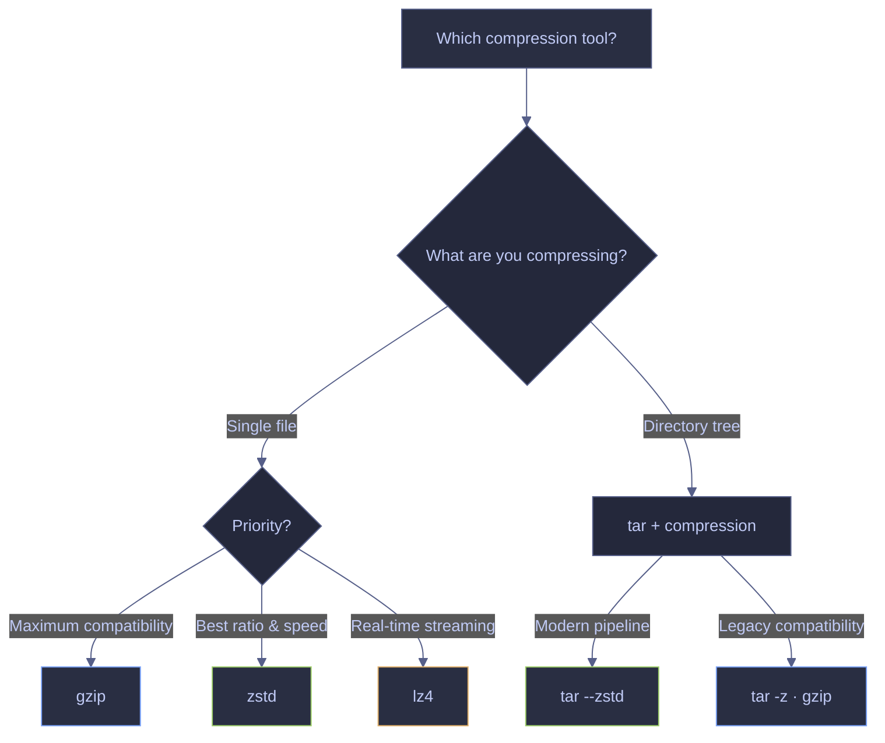

# Compression

> [!quote]
> "There is no compression algorithm for experience."
>
> — **Andy Jassy**, AWS re:Invent keynote (2012)

> [!abstract]- Summary
>
> Covers Linux and PowerShell compression tools — gzip, zstd, tar, lz4, Compress-Archive, 7-Zip, GZipStream — and a decision matrix for selecting the right algorithm by pipeline scenario.
>
> **Linux file compression tools**
> - `gzip`: single-file DEFLATE compression; universal compatibility on every Linux distro, macOS, and CI runner; single-threaded (use `pigz` for multi-core)
> - `zstd`: compresses better than gzip at every speed tier; default level 3 beats gzip -6 in both ratio and decompression speed; levels 1–22; keeps original by default
> - `tar`: bundles directory trees into a single tarball; combine with `-z` (gzip) or `--zstd` for compressed archives; auto-detects format on extract
>
> **Compression strategy matrix**
> - Pipeline intermediate files: zstd -3 (best speed/ratio balance)
> - Long-term GCS archive: zstd -19 (maximum compression)
> - Log shipping: gzip -6 (universal compatibility)
> - Database backup transfer: gzip -1 (fast compression on large structured data)
> - Real-time streaming: lz4 (fastest decompression, ~4 GB/s)
>
> **PowerShell compression tools**
> - `Compress-Archive`: built-in zip cmdlet; 2 GB per-file hard limit; no external dependencies required
> - 7-Zip (`7z`): multi-format (gzip, zstd, tar, zip, 7z); no size limits; multi-threaded; install via `scoop install 7zip`
> - `GZipStream`: .NET programmatic gzip; reads entire file into memory; not suitable for files larger than available RAM
>
> **Operations and safety**
> - Use `gzip -k` — gzip removes the original file by default with no confirmation prompt
> - Always run `tar tf` before extracting unknown archives to detect tar bombs
> - `Compress-Archive` silently produces a corrupt archive when any file entry exceeds 2 GB; use 7-Zip instead
> - Over-compressing pipeline intermediates: gzip -1 vs gzip -9 is only 5–15% size difference but 5–8x slower

> [!note]- Glossary
>
> **Compression algorithm**
> - A method for encoding data more efficiently to reduce file size. Lossless algorithms (gzip, zstd, lz4) reconstruct the original data exactly; lossy algorithms (JPEG, MP3) do not.
> - Linux: `gzip`, `zstd`, `lz4`, `bzip2`, `xz` are all lossless. PowerShell: `Compress-Archive` uses zip (DEFLATE, lossless); 7-Zip supports all of the above plus its native 7z format.
>
> > [!info] Lossless vs lossy
> > All algorithms covered in this note are lossless. Data engineering pipelines require exact reconstruction — never use lossy compression on structured data.
>
> ---
>
> **`gzip`**
> - The most widely supported Linux compression tool. Uses the DEFLATE algorithm (RFC 1952). Produces `.gz` files. Single-threaded. Removes the original file after compression by default.
> - Linux: `gzip -k data.csv` keeps the original; `gzip -d data.csv.gz` decompresses; `gzip -t` tests integrity; levels `-1` (fastest) to `-9` (smallest), default `-6`. PowerShell/Windows: available as `gzip` if 7-Zip or Git for Windows is installed; otherwise use `7z a -tgzip`.
>
> > [!warning] Original file removal
> > `gzip data.csv` deletes `data.csv` immediately after compression. Use `-k` for any file you cannot recreate.
>
> ---
>
> **`zstd` (Zstandard)**
> - A modern compression algorithm (Facebook, 2016) that compresses better than gzip and decompresses faster at every speed tier. Produces `.zst` files. Keeps the original by default. Supports multi-threading with `-T`.
> - Linux: `zstd data.csv` (compress, levels 1–19); `zstd --ultra -22 data.csv` (extreme, high memory); `zstd --adapt` (dynamic level based on I/O speed); `zstd -T0` (auto-detect CPU count). PowerShell: `7z a -tzstd archive.zst data.csv` (requires 7-Zip 21.01+).
>
> > [!tip] Default level
> > zstd default level 3 beats gzip default level 6 in both compression ratio and decompression speed. It is the recommended default for all modern data pipelines.
>
> ---
>
> **`tar`**
> - A tool that bundles a directory tree into a single archive file (tarball). Does not compress by itself — combined with `-z` (gzip), `--zstd`, `-j` (bzip2), or `-J` (xz) for compressed archives. Produces `.tar.gz`, `.tar.zst`, `.tar.bz2`, or `.tar.xz` files.
> - Linux: `tar czf archive.tar.gz dir/` (create gzip); `tar --zstd -cf archive.tar.zst dir/` (create zstd); `tar xf archive.tar.gz -C /out/` (extract, auto-detects format); `tar tf archive.tar.gz` (list without extracting). PowerShell: `tar.exe` is available natively on Windows 10 build 17063+ and PowerShell 7+.
>
> > [!danger] Tar bombs
> > Archives created with `tar cf bomb.tar.gz *` (no parent directory) extract files directly into the current working directory, potentially overwriting existing files. Always run `tar tf` first on archives you did not create.
>
> ---
>
> **`lz4`**
> - An extremely fast compression algorithm optimized for decompression speed (~4 GB/s). Trades compression ratio for minimal CPU overhead. Produces `.lz4` files.
> - Linux: `lz4 data.csv` (compress); `lz4 -d data.csv.lz4` (decompress). Not natively supported by `tar` without helper tools. PowerShell: available via 7-Zip. Best used for real-time streaming and latency-sensitive pipelines, not for long-term archival.
>
> > [!info] When not to use lz4
> > lz4 compression ratio is significantly worse than zstd or gzip. Do not use it for long-term archives or cloud storage where storage cost matters.
>
> ---
>
> **Compression level**
> - A numeric parameter controlling the trade-off between compression speed and output file size. Higher levels produce smaller files but take longer and use more CPU and memory.
> - gzip: levels 1–9 (default 6). zstd: levels 1–19 standard, 20–22 with `--ultra` (default 3). 7-Zip: levels 0–9 via `-mx`. Practical guidance: for pipeline intermediates use fast levels (gzip -1, zstd -3); for long-term archives use high levels (zstd -19).
>
> > [!warning] Over-compression
> > For pipeline intermediate files, gzip -1 vs gzip -9 is only 5–15% size difference but 5–8x slower. Always use fast levels for data that will be decompressed within minutes.
>
> ---
>
> **`pigz`**
> - Parallel gzip — a drop-in replacement for `gzip` that uses multiple CPU cores. Produces identical `.gz` files compatible with all standard gzip tools.
> - Linux only: `pigz -p 4 data.csv` (use 4 threads); `pigz -d data.csv.gz` or `unpigz data.csv.gz` to decompress. Install with `apt install pigz`. Not available natively on Windows. PowerShell equivalent: `7z a -tgzip -mmt4 archive.gz data.csv`.
>
> > [!tip] When to use pigz
> > On a 4-core VM compressing a 10 GB CSV, gzip uses one core while three sit idle. pigz provides 3–4x faster compression with identical output format.
>
> ---
>
> **`Compress-Archive`** (PowerShell)
> - The built-in PowerShell cmdlet for creating and extracting `.zip` files. Uses .NET `System.IO.Compression.ZipArchive`. No external dependencies.
> - PowerShell only: `Compress-Archive -Path "C:\data\*" -DestinationPath out.zip`; compression levels: `Optimal` (default), `Fastest`, `NoCompression`; `Expand-Archive` for extraction. Linux equivalent: `zip` (not always installed) or `7z a -tzip`.
>
> > [!warning] 2 GB file size limit
> > `Compress-Archive` silently produces a corrupt archive when any file entry exceeds 2 GB. This limit applies to all current stable versions including PowerShell 7.x. Use 7-Zip for large files.
>
> ---
>
> **`7z`** (7-Zip)
> - A multi-format compression tool supporting gzip, zstd, bzip2, xz, tar, zip, and its native 7z format. No file size limits. Multi-threaded. Open source.
> - PowerShell/Windows: `7z a -tgzip archive.gz data.csv`; `7z a -tzstd archive.zst data.csv`; `7z x archive.gz` (extract, auto-detects format); `7z l archive.tar.gz` (list contents). Install via `scoop install 7zip` or `winget install 7zip`. Linux: available via `apt install p7zip-full`.
>
> > [!info] Installation required
> > 7-Zip is not installed by default on Windows or Linux. It must be explicitly installed before use in pipelines or automation scripts.

## Linux file compression tools

Linux provides three core compression tools for data engineering workflows: **gzip** for universal compatibility (every system, every CI runner), **zstd** for superior compression ratio and speed (the modern default), and **tar** for bundling directory trees into single compressed archives. Each tool serves a distinct role — understanding when to use which prevents wasted time and storage cost.



### Linux | gzip | compress and decompress files

gzip compresses a single file in place using the DEFLATE algorithm (RFC 1952). It is installed on every Linux distribution, every macOS system, and every CI runner. When compatibility is your only requirement, gzip is the safe default. For better compression ratio and speed, see zstd below.

#### Compress a single file

Compresses the file in place, replacing it with a `.gz` version. The original file is deleted after successful compression.

```bash
gzip data.csv
```

> [!warning] gzip removes the original file
>
> Running `gzip data.csv` deletes `data.csv` after compression — there is no confirmation prompt. If compression fails mid-write (disk full, interrupted), you lose both the original and the compressed file.

> [!success] Keep the original with -k
>
> Always use `-k` (keep) when compressing files you cannot re-create, or compress a copy instead.

#### Keep the original file after compression

The `-k` flag preserves the source file, producing both `data.csv` and `data.csv.gz`.

```bash
gzip -k data.csv
```

#### Decompress a gzip file

Restores the original file from a `.gz` archive. The compressed file is deleted after decompression. `gunzip` is an alias for `gzip -d`.

```bash
gzip -d data.csv.gz
```

#### Test file integrity without decompressing

Verifies that a `.gz` file is not corrupted without extracting it. Returns exit code 0 on success, 1 on failure. Useful in pipeline pre-checks before processing compressed input.

```bash
gzip -t data.csv.gz
```

#### Show compression ratio

Displays compression statistics (compressed size, uncompressed size, ratio, original name) without decompressing the file.

```bash
gzip -l data.csv.gz
```

> [!todo] Output pending
>
> User-provided terminal output for `gzip -l data.csv.gz` is needed to add a `text` result cell and interpretation.

#### Set compression level (speed vs size)

gzip supports compression levels 1 (fastest, largest output) through 9 (slowest, smallest output). The default is **6**. On typical CSV/JSON pipeline data, the practical difference between `-1` and `-9` is only 5–15% in file size — but `-9` takes 5–8x longer. For pipeline intermediate files where you compress and immediately transfer, `-1` is almost always the right choice.

```bash
gzip -1 data.csv
```

```bash
gzip -9 data.csv
```

> [!tip] pigz — parallel gzip
>
> gzip is **single-threaded**. On a 4-core VM compressing a 10 GB CSV, gzip uses one core while three sit idle. `pigz` (parallel gzip) is a drop-in replacement that produces identical `.gz` files using multiple threads:
> ```bash
> pigz -p 4 data.csv
> ```
> Same flags, same output format, 3–4x faster on multi-core machines. Install with `apt install pigz`. Decompress with `pigz -d` or `unpigz`.

| Flag | Syntax | Description |
|---|---|---|
| `-1` to `-9` | `gzip -1 <file>` | Set compression level (1 = fastest, 9 = smallest, default 6) |
| `-c` | `gzip -c <file> > out.gz` | Write to stdout, keep original file |
| `-d` | `gzip -d <file.gz>` | Decompress a `.gz` file |
| `-f` | `gzip -f <file>` | Force compression even if output exists or input is a link |
| `-k` | `gzip -k <file>` | Keep the original file after compression |
| `-l` | `gzip -l <file.gz>` | Show compression ratio and file sizes |
| `-n` | `gzip -n <file>` | Do not save the original filename and timestamp |
| `-N` | `gzip -N <file>` | Save the original filename and timestamp (default) |
| `-q` | `gzip -q <file>` | Suppress all warnings |
| `-r` | `gzip -r <dir>` | Compress all files in a directory recursively |
| `-t` | `gzip -t <file.gz>` | Test file integrity without decompressing |
| `-v` | `gzip -v <file>` | Display compression ratio during operation |

### Linux | zstd | modern compression with better ratio and speed

`zstd` (Zstandard) compresses better than gzip **and** decompresses faster. Default level 3 beats gzip level 6 in both ratio and speed. The compression scale goes from 1 to 19, with `--ultra` unlocking levels 20–22 for maximum compression at the cost of significantly more memory and CPU time. Use zstd for all modern pipelines — fall back to gzip only when downstream tools require it.

#### Compress a single file

Compresses the file to `data.csv.zst`. Unlike gzip, zstd **keeps the original file** by default.

```bash
zstd data.csv
```

#### Decompress a zstd file

Restores the original file from a `.zst` archive.

```bash
zstd -d data.csv.zst
```

#### Set compression level

Higher levels produce smaller files at the cost of more CPU time and memory. Level 19 is the maximum standard level. For levels 20–22, add the `--ultra` flag.

```bash
zstd -19 data.csv
```

#### Remove the original file after compression

By default zstd keeps the source file. Use `--rm` to delete the original after compression, matching gzip's default behavior.

```bash
zstd --rm data.csv
```

> [!tip] zstd --adapt — auto-adjusting compression level
>
> `zstd --adapt` dynamically adjusts the compression level based on I/O speed. If the output pipe is slow (network transfer), it compresses harder to reduce bytes in flight. If the pipe is fast (local disk), it compresses lighter to maximize throughput. Ideal for streaming pipelines where transfer speed varies.

| Flag | Syntax | Description |
|---|---|---|
| `-1` to `-19` | `zstd -3 <file>` | Set compression level (1 = fastest, 19 = smallest, default 3) |
| `--ultra` | `zstd --ultra -22 <file>` | Enable levels 20–22 (extreme compression, high memory) |
| `--adapt` | `zstd --adapt <file>` | Dynamically adjust level based on I/O speed |
| `-c` | `zstd -c <file> > out.zst` | Write to stdout, keep original file |
| `--check` | `zstd --check <file>` | Add integrity checksum (xxhash64, enabled by default) |
| `-d` | `zstd -d <file.zst>` | Decompress a `.zst` file |
| `-f` | `zstd -f <file>` | Force compression even if output exists |
| `-k` | `zstd -k <file>` | Keep the original file (default behavior) |
| `--long` | `zstd --long <file>` | Enable long-range matching for better ratio on large files |
| `-q` | `zstd -q <file>` | Suppress all warnings |
| `--rm` | `zstd --rm <file>` | Delete original file after compression |
| `-T` | `zstd -T4 <file>` | Set number of threads (0 = auto-detect CPU count) |
| `-v` | `zstd -v <file>` | Display compression ratio during operation |

### Linux | tar | archive and compress directories

`tar` bundles a directory tree into a single file (a tarball), optionally compressed with gzip, zstd, bzip2, or xz. gzip cannot compress directories on its own — `tar` combined with a compression algorithm is the standard pattern for archiving directory structures in Linux.

#### Create a gzip-compressed archive

The flags: `c` = create, `z` = gzip compression, `f` = output filename. The resulting `.tar.gz` file contains every file and subdirectory under the specified path.

```bash
tar czf archive.tar.gz /path/to/dir/
```

#### Extract a gzip-compressed archive

The flags: `x` = extract, `z` = gzip, `f` = input filename, `-C` = target directory. If `-C` is omitted, files extract into the current working directory.

```bash
tar xzf archive.tar.gz -C /output/dir/
```

#### Create a zstd-compressed archive

Use `--zstd` instead of `-z` (gzip). The resulting `.tar.zst` file is typically smaller and faster to decompress than `.tar.gz`.

```bash
tar --zstd -cf archive.tar.zst /path/to/dir/
```

#### Extract a zstd-compressed archive

When extracting, tar auto-detects the compression format — you do not need `--zstd` or `-z`.

```bash
tar xf archive.tar.zst
```

> [!tip] tar auto-detects compression on extract
>
> You only need the compression flag (`-z`, `--zstd`, `-j`) when **creating** archives. When extracting, `tar xf` detects the format automatically — `tar xf archive.tar.gz`, `tar xf archive.tar.zst`, and `tar xf archive.tar.bz2` all work without specifying the algorithm.

#### List archive contents before extracting

Displays the file listing inside an archive without extracting it. The `t` flag replaces `x` (extract) — everything else stays the same. Pipe through `head` to preview large archives.

```bash
tar tzf archive.tar.gz | head -20
```

> [!todo] Output pending
>
> User-provided terminal output for `tar tzf archive.tar.gz | head -20` is needed to add a `text` result cell and interpretation.

#### Stream a compressed archive to cloud storage

Piping tar output directly to a cloud storage upload avoids writing the archive to local disk. This is the standard pattern for backing up directories to GCS when local disk space is limited.

```bash
tar czf - /path/to/dir/ | gsutil cp - gs://bucket/archive.tar.gz
```

> [!danger] Tar bombs — archives without a top-level directory
>
> An archive created from `tar cf bomb.tar.gz *` (note: no parent directory) extracts files directly into your current directory, potentially overwriting existing files with no warning.

> [!success] Always inspect before extracting
>
> List contents with `tar tf` before extracting any archive you did not create yourself. Extract into an empty directory or use `--strip-components` to normalize the structure:
> ```bash
> tar tf archive.tar.gz | head -20
> mkdir extracted && tar xzf archive.tar.gz -C extracted/
> ```

| Flag | Syntax | Description |
|---|---|---|
| `-c` | `tar -cf archive.tar <dir>` | Create a new archive |
| `-C` | `tar -xf archive.tar -C <dir>` | Change to directory before extracting |
| `--exclude` | `tar --exclude='*.log' -cf a.tar <dir>` | Exclude files matching the pattern |
| `-f` | `tar -cf <file> <dir>` | Specify archive filename |
| `-j` | `tar -cjf archive.tar.bz2 <dir>` | Compress with bzip2 |
| `-J` | `tar -cJf archive.tar.xz <dir>` | Compress with xz |
| `-p` | `tar -xpf archive.tar` | Preserve file permissions on extract |
| `--strip-components` | `tar --strip-components=1 -xf a.tar` | Remove leading path components on extract |
| `-t` | `tar -tf archive.tar` | List archive contents without extracting |
| `-v` | `tar -cvf archive.tar <dir>` | Verbose — list files as they are processed |
| `-x` | `tar -xf archive.tar` | Extract files from an archive |
| `-z` | `tar -czf archive.tar.gz <dir>` | Compress with gzip |
| `--zstd` | `tar --zstd -cf archive.tar.zst <dir>` | Compress with zstd |

### Compression strategy matrix — choosing the right algorithm

> [!tip] Related pattern
>
> For a broader comparison of serialization codecs (Snappy, gzip, zstd, LZ4) alongside file formats like Parquet and Avro, see [serialization-formats](https://alp78.github.io/elysium/14-Data-Architecture/Pipeline-Patterns/serialization-formats). For writing Parquet with specific compression options in code, see [10_py_serialization_formats](https://alp78.github.io/elysium/02-Programming-Languages/Python/10_py_serialization_formats) (Python) and [10_cs_serialization_formats](https://alp78.github.io/elysium/02-Programming-Languages/CSharp/10_cs_serialization_formats) (C#).

| Scenario | Algorithm | Level | Why |
|---|---|---|---|
| Pipeline intermediate files | zstd | 3 (default) | Best speed/ratio balance, fast decompress |
| Long-term archive to GCS | zstd | 19 | Maximum compression, storage cost matters |
| Parquet files | snappy (internal) | default | Parquet uses snappy by default, fastest decompress |
| Log shipping | gzip | 6 | Universal compatibility, all tools support it |
| Database backup transfer | gzip | 1 | Fast compression, backup is already large |
| Real-time streaming | lz4 | default | Fastest decompression (~4 GB/s), minimal CPU overhead |

**The 90% rule:** For almost all data engineering work, `zstd` at default settings is the right answer. It compresses better than gzip, decompresses faster than gzip, and supports streaming. The only reason to use gzip is backward compatibility with tools that do not yet support zstd. For real-time or latency-sensitive streaming where decompression speed is critical (message queues, live log tailing), `lz4` trades a slightly worse compression ratio for the fastest decompression available.

## PowerShell compression tools

PowerShell provides built-in zip compression through `Compress-Archive`, multi-format support through **7-Zip** (gzip, zstd, tar, 7z), and programmatic .NET-based compression through `GZipStream`. For most data engineering tasks on Windows, 7-Zip covers the widest range of formats and avoids the limitations of the built-in cmdlet.

> [!info] Native tar in PowerShell 7+ and Windows 10+
>
> Windows 10 (build 17063+) and PowerShell 7+ include a native `tar.exe` that works identically to GNU tar. For `.tar.gz` and `.tar.zst` operations, you can use the same `tar` commands documented in the Linux section above without installing additional tools.

### PowerShell | Compress-Archive | create and extract zip files

`Compress-Archive` creates zip files using .NET's `System.IO.Compression`. It is built into PowerShell and requires no external dependencies. Suitable for quick zip operations on small-to-medium files; for large files or advanced formats, use 7-Zip instead.

#### Create a zip archive

Compresses all files in the specified path into a single `.zip` file.

```powershell
Compress-Archive -Path "C:\data\output\*" -DestinationPath "C:\data\output.zip"
```

#### Set compression level

The `-CompressionLevel` parameter controls the trade-off between speed and file size. `Optimal` (default) balances compression effectiveness against processing time. `Fastest` prioritizes speed at the cost of larger output. `NoCompression` stores files without compression (useful for pre-compressed content like Parquet or already-gzipped files).

```powershell
Compress-Archive -Path "C:\data\*" -DestinationPath "C:\data\output.zip" -CompressionLevel Fastest
```

#### Add files to an existing archive

The `-Update` parameter appends files to an existing zip without recreating it. If a file with the same name exists in the archive, it is replaced.

```powershell
Compress-Archive -Path file.txt -DestinationPath archive.zip -Update
```

#### Extract a zip archive

`Expand-Archive` extracts all files from a zip archive. The `-Force` flag overwrites existing files in the destination.

```powershell
Expand-Archive -Path archive.zip -DestinationPath "C:\data\restored\" -Force
```

> [!warning] 2 GB file size limit
>
> `Compress-Archive` uses `System.IO.Compression.ZipArchive` which caps individual file entries at 2 GB. This limit applies to **all current stable versions** including PowerShell 7.x. Attempting to compress a file larger than 2 GB silently produces a corrupt archive.

> [!success] Use 7-Zip or .NET directly for large files
>
> Use 7-Zip (`7z a -tzip archive.zip largefile.dat`) which has no size restrictions. Alternatively, use `System.IO.Compression` .NET classes directly in PowerShell for zip64 support. The upcoming `Microsoft.PowerShell.Archive` v2.0 module (currently in preview) adds native zip64 support.

| Parameter | Syntax | Description |
|---|---|---|
| `-CompressionLevel` | `-CompressionLevel Optimal` | Set compression level: `Optimal` (default), `Fastest`, `NoCompression` |
| `-DestinationPath` | `-DestinationPath "out.zip"` | Path for the output zip file |
| `-Force` | `-Force` | Overwrite an existing archive file |
| `-LiteralPath` | `-LiteralPath "file[1].txt"` | Path that does not interpret wildcard characters |
| `-PassThru` | `-PassThru` | Return a `FileInfo` object for the created archive |
| `-Path` | `-Path "C:\data\*"` | Source file(s) or directory to compress (supports wildcards) |
| `-Update` | `-Update` | Add or replace files in an existing archive |

### PowerShell | 7-Zip | multi-format compression

7-Zip (`7z`) supports every major compression format including gzip, zstd, bzip2, xz, tar, and its native 7z format. It has no file size limits and supports multi-threaded compression. Install via `scoop install 7zip` or `winget install 7zip`.

#### Compress a file with gzip

Creates a gzip-compressed file. The `-tgzip` switch specifies the output format.

```powershell
7z a -tgzip archive.gz data.csv
```

#### Compress a file with zstd

Creates a zstd-compressed file. Requires 7-Zip 21.01 or later for zstd support.

```powershell
7z a -tzstd archive.zst data.csv
```

#### Extract an archive

The `x` command extracts with full directory structure. Works with any supported format — 7-Zip auto-detects the archive type.

```powershell
7z x archive.gz
```

#### List archive contents

Displays the file listing inside an archive without extracting. Use this as a safety check before extracting unknown archives (same habit as `tar tf` on Linux).

```powershell
7z l archive.tar.gz
```

> [!todo] Output pending
>
> User-provided terminal output for `7z l archive.tar.gz` is needed to add a `text` result cell and interpretation.

| Command/Flag | Syntax | Description |
|---|---|---|
| `a` | `7z a archive.7z <files>` | Add files to an archive (create if new) |
| `x` | `7z x archive.7z` | Extract with full directory structure |
| `e` | `7z e archive.7z` | Extract without directory structure (flat) |
| `l` | `7z l archive.7z` | List archive contents |
| `t` | `7z t archive.7z` | Test archive integrity |
| `-t<type>` | `7z a -tgzip archive.gz <file>` | Set archive type (`7z`, `zip`, `gzip`, `zstd`, `tar`, `bzip2`, `xz`) |
| `-o<dir>` | `7z x archive.7z -oC:\out` | Set output directory (no space after `-o`) |
| `-p<pass>` | `7z a -pMyPass archive.7z <files>` | Set password for encryption |
| `-mx<N>` | `7z a -mx9 archive.7z <files>` | Set compression level (0 = store, 9 = ultra) |
| `-mmt<N>` | `7z a -mmt4 archive.7z <files>` | Set number of threads (default: auto) |
| `-r` | `7z a -r archive.7z dir\*` | Recurse into subdirectories |
| `-y` | `7z x -y archive.7z` | Assume yes to all prompts |
| `-aoa` | `7z x -aoa archive.7z` | Overwrite all existing files without prompt |
| `-so` | `7z x archive.7z -so > file` | Write to stdout |
| `-si` | `7z a archive.7z -si < file` | Read from stdin |

### PowerShell | GZipStream | programmatic gzip compression

Use .NET's `GZipStream` when you need gzip compression inside a PowerShell script without installing external tools. This approach reads the entire file into memory — it is not suitable for files larger than available RAM. For large files, use 7-Zip's streaming capabilities instead.

#### Compress a file using GZipStream

Reads the source file as a byte array, compresses it through a `GZipStream`, and writes the result to a `.gz` file.

```powershell
$input = [System.IO.File]::ReadAllBytes("data.csv")
$ms = [System.IO.MemoryStream]::new()
$gz = [System.IO.Compression.GZipStream]::new(
    $ms, [System.IO.Compression.CompressionLevel]::Optimal)
$gz.Write($input, 0, $input.Length); $gz.Close()
[System.IO.File]::WriteAllBytes("data.csv.gz", $ms.ToArray())
```

When exporting data from BigQuery, the `bq extract --compression` flag accepts gzip and snappy for CSV/JSON exports — see [data-loading-and-export](https://alp78.github.io/elysium/06-GCP/BigQuery/data-loading-and-export) for the full syntax. If you are archiving compressed files to GCS cold storage tiers, compressing before upload saves significant storage cost — see [gcs-buckets-and-lifecycle](https://alp78.github.io/elysium/06-GCP/Storage/gcs-buckets-and-lifecycle) for lifecycle policies that transition objects between storage classes.


## Warnings

> [!danger] gzip removes the original file by default
>
> Running `gzip data.csv` deletes `data.csv` after compression. If compression fails mid-write (disk full, interrupted), you lose both the original and the compressed file. Always use `-k` (keep) for files you cannot recreate.

> [!warning] Tar bombs extract into the current directory
>
> Archives created from `tar cf bomb.tar.gz *` (no parent directory) extract files directly into your working directory, potentially overwriting existing files. Always inspect with `tar tf` before extracting unknown archives.

> [!warning] `Compress-Archive` has a 2 GB per-file limit
>
> PowerShell `Compress-Archive` silently produces a corrupt archive when a file exceeds 2 GB. Use 7-Zip or .NET `System.IO.Compression` directly for large files.

> [!warning] Over-compressing pipeline intermediates wastes time
>
> The difference between gzip -1 and gzip -9 is only 5-15% in file size but 5-8x in compression time. For files that will be decompressed within minutes (pipeline intermediates), always use fast levels.

## Recommendations

| Scenario | Recommendation |
|---|---|
| Pipeline intermediate files | zstd at default level 3. Best speed/ratio balance, fast decompression. |
| Long-term GCS archive | zstd -19. Maximum compression for storage cost savings. |
| Log compression | gzip -6. Universal tool support across all platforms. |
| Database backup transfer | gzip -1. Fast compression on large, structured data. |
| Real-time streaming | lz4. Fastest decompression (~4 GB/s), minimal CPU overhead. |
| Multi-core machines | Use `pigz` (parallel gzip) or `zstd -T0` (auto-detect CPU count) for multi-threaded compression. |
| Directory archiving | `tar --zstd -cf archive.tar.zst dir/` for modern pipelines. `tar czf archive.tar.gz dir/` for legacy compatibility. |
| Windows compression | Use 7-Zip for all formats. Reserve `Compress-Archive` for quick zip operations under 2 GB. |

## Troubleshooting

| Symptom | Likely cause | Fix |
|---|---|---|
| Original file disappeared after compression | gzip default behavior removes the source file. | Use `gzip -k` to keep the original. Or use zstd which keeps the original by default. |
| Compressed file is larger than the original | The input is already compressed (Parquet with Snappy, JPEG, etc.) or very small (under 1 KB). | Skip compression for already-compressed formats. Check `gzip -l` for ratio statistics. |
| `tar xf` extracts files into the wrong directory | Archive was created without a top-level directory (tar bomb). | Always inspect with `tar tf archive.tar.gz \| head -20` before extracting. Use `mkdir safe && tar xf archive.tar.gz -C safe/`. |
| `Compress-Archive` produces a corrupt zip | A file in the archive exceeds the 2 GB per-entry limit. | Use 7-Zip: `7z a -tzip archive.zip largefile.dat`. |
| gzip is very slow on a multi-core machine | gzip is single-threaded. | Install and use `pigz -p <cores>` as a drop-in replacement. |
| `zstd` not recognized on the remote server | zstd is not installed by default on older distributions. | Install with `apt install zstd`. For maximum compatibility, fall back to gzip. |

## Cross-references
- [data-flow-architecture](https://alp78.github.io/elysium/14-Data-Architecture/Pipeline-Patterns/data-flow-architecture) — format and compression selection by pipeline scenario
- [file-manipulation](https://alp78.github.io/elysium/01-Shell/02-File-Operations/02-file-manipulation) — moving and copying the resulting archives
- [data-transfer](https://alp78.github.io/elysium/01-Shell/02-File-Operations/05-data-transfer) — compression during rsync transfers (`-z` flag)
- [navigation-and-listing](https://alp78.github.io/elysium/01-Shell/02-File-Operations/01-navigation-and-listing) — checking disk usage before and after compression
- [finding-files](https://alp78.github.io/elysium/01-Shell/02-File-Operations/03-finding-files) — finding old archives to clean up
