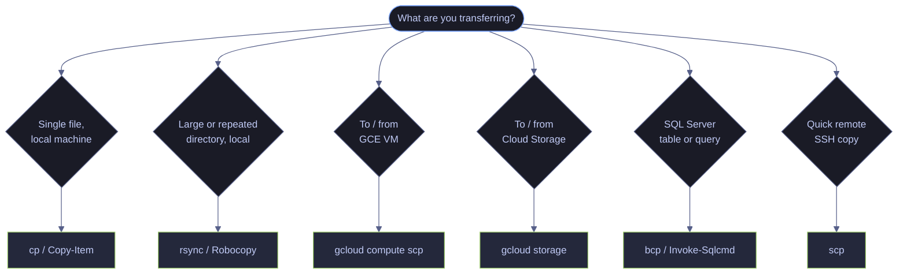

# Data Transfer — Moving and Copying Data Across Machines

> [!quote]
> "Never underestimate the bandwidth of a station wagon full of tapes hurtling down the highway."
>
> — **Andrew S. Tanenbaum**, *Computer Networks* (1981)

Copying a file on a single machine is trivial. Copying 50 GB of pipeline output from a Compute Engine VM to your workstation, synchronizing a directory tree between two servers, or uploading a database backup to Cloud Storage — that is where the tool choice and flags determine whether the transfer takes 5 minutes or 5 hours, and whether a network interruption means starting over or resuming cleanly.




## Key terms used in this note

| Term | Plain-English definition | Why it matters here | Common mistake / confusion |
|---|---|---|---|
| `rsync` | A file transfer tool that copies only the differences between source and destination. Supports resumable transfers, checksum verification, bandwidth limiting, and remote copying via SSH. | The standard tool for large, reliable file transfers. Re-run after interruption and it picks up where it left off. | Trailing slash behavior: `rsync src/ dst/` copies contents; `rsync src dst/` creates `dst/src/`. Combined with `--delete`, a wrong slash can wipe the destination. |
| `scp` | Secure copy -- transfers files between hosts over SSH. Simple syntax but no resume support, no delta transfer, and no directory sync. | Quick one-off file transfers between machines. For anything larger or repeatable, use rsync instead. | `scp` does not support resume. An interrupted 50 GB transfer must restart from zero. |
| `gcloud compute scp` | A GCP CLI command that wraps `scp` with automatic SSH key management and IAP tunnel support for GCE VMs. | Transfers files to/from GCE VMs without manual SSH key setup. Required for VMs behind IAP firewalls. | Forgetting `--zone` when the VM is in a non-default zone. The command fails silently or connects to the wrong VM. |
| `gsutil` / `gcloud storage` | GCP CLI tools for transferring files to and from Google Cloud Storage (GCS) buckets. `gsutil` is the legacy tool; `gcloud storage` is the modern replacement with parallel uploads by default. | The primary interface for moving data between local filesystems and GCS. Used for pipeline output, backups, and data lake operations. | `gsutil rsync` with `--delete-unmatched-destination-objects` permanently removes destination-only objects. Always dry-run first. |
| `bcp` (Bulk Copy Program) | A SQL Server command-line tool for bulk importing and exporting data. Reads/writes native, character, or CSV format. | The fastest way to move large datasets into or out of SQL Server tables. Bypasses the query engine for raw data transfer. | Not specifying `-c` (character mode) or `-t` (field terminator) -- default format is native binary, which is not human-readable and not portable across SQL Server versions. |
| `sqlcmd` / `Invoke-Sqlcmd` | Command-line tools for executing SQL queries against SQL Server. Output can be redirected to files for CSV or tab-delimited export. | Used for query-based data export when `bcp` is too rigid (e.g., joining tables, filtering, computed columns). | `sqlcmd` output includes column headers, separator lines, and row count footers by default. Use `-h -1 -W -s ","` flags to produce clean CSV output. |
| `Robocopy` | Robust File Copy -- a Windows command-line tool for reliable file replication. Supports mirroring, resume, multi-threaded transfer, retry on failure, and logging. | The Windows equivalent of rsync. Handles large directory trees, network interruptions, and NTFS permissions. | `/MIR` (mirror) deletes destination files not present in the source. Always preview with `/L` (list-only) before using `/MIR`. |
| Delta transfer | A transfer method that sends only the bytes that changed between source and destination, rather than re-sending entire files. `rsync` and `Robocopy` support this. | Dramatically reduces transfer time for incremental updates to large files or datasets. | Not all tools support delta transfer. `scp` and `gsutil cp` always transfer the full file. |
| Bandwidth limiting | A transfer option that caps the network throughput to prevent saturating a shared connection. `rsync --bwlimit`, `Robocopy /IPG`. | Prevents data transfers from overwhelming network links used by production services. | Not applying bandwidth limits during business hours on shared networks -- a large transfer can starve production traffic. |

## What this note covers

- `rsync` for local and remote file transfers with resume, delta, and bandwidth control
- `scp` and `gcloud compute scp` for quick SSH-based file copies
- `gsutil` and `gcloud storage` for GCS bucket operations (upload, download, sync)
- `bcp` for SQL Server bulk data import/export
- `sqlcmd` and `Invoke-Sqlcmd` for query-based data export
- `Robocopy` as the Windows equivalent of rsync
- Transfer strategy matrix: which tool for which scenario

## Linux file transfer tools

`rsync` is the primary file transfer tool in data engineering for Linux. It transfers only the differences between source and destination (delta transfer), supports compression, preserves all metadata, and resumes interrupted transfers automatically.

### Linux | rsync | delta transfer and directory synchronization

`rsync` is the most important file transfer tool in data engineering. It transfers only the changed bytes within files (delta algorithm), supports compression, preserves all metadata, and resumes interrupted transfers automatically. If you learn one transfer tool, learn rsync.

#### Local copies with archive mode

> [!info] rsync -a archive mode
>
> Equivalent to `-rlptgoD`:
> - `-r` — recursive (descend into directories)
> - `-l` — copy symlinks as symlinks
> - `-p` — preserve permissions
> - `-t` — preserve modification times (critical for change detection pipelines)
> - `-g` / `-o` — preserve group/owner
> - `-D` — preserve device and special files
>
> Add `-v` for verbose output, `-z` for compression during transfer (skip for local copies or already-compressed files), `--progress` for per-file progress.

> [!warning] Trailing slash matters
>
> - `rsync source_dir/ dest_dir/` → copies **contents** of `source_dir` into `dest_dir`
> - `rsync source_dir dest_dir/` → copies `source_dir` **itself** into `dest_dir` (creates `dest_dir/source_dir/`)

> [!success] Use trailing slash on source, dry-run if unsure
>
> Always put a trailing slash on the source path to copy contents. Run with `-n` first if you are unsure.

```bash
rsync -avzh --progress source_dir/ dest_dir/
```

#### Show aggregated transfer progress

`--progress` prints per-file progress, which is noisy with thousands of small files. `--info=progress2` shows one aggregated progress bar with total bytes, percentage, speed, and ETA — cleaner for large directory syncs.

```bash
rsync -avzh --info=progress2 source_dir/ dest_dir/
```

#### Resume interrupted transfers

`-P` combines `--partial` and `--progress`. Without `--partial`, a partially transferred file is deleted on interruption — you start over. With `--partial`, the incomplete file is kept and rsync resumes from where it stopped. Essential for files over 1 GB on unreliable connections.

```bash
rsync -avzP source_dir/ dest_dir/
```

#### Preview changes with dry-run

`-n` (or `--dry-run`) shows every file that would be transferred or deleted without actually doing anything. Always dry-run before `--delete` operations.

```bash
rsync -avzn source_dir/ dest_dir/
```

#### Mirror mode — dry-run first

`--delete` removes files from the destination that no longer exist in the source. Always preview the mirror before executing to confirm the source path is correct.

> [!danger] --delete is destructive
>
> If your source path is wrong (e.g., an empty directory), `--delete` wipes **everything** in the destination. Always dry-run first.

> [!success] Always dry-run with -n before running --delete
>
> Confirm the file list looks correct before executing the live mirror.

```bash
rsync -avzn --delete source_dir/ dest_dir/
```

#### Mirror mode — execute

After confirming the dry-run output, run the live mirror without `-n`.

```bash
rsync -avz --delete source_dir/ dest_dir/
```

#### Exclude files by pattern

`--exclude` accepts glob patterns evaluated against relative file paths. Multiple `--exclude` flags can be chained. For many exclusions, use `--exclude-from` with a file listing one pattern per line. Includes are evaluated before excludes — order matters.

```bash
rsync -avz --exclude='*.log' --exclude='__pycache__/' source_dir/ dest_dir/
```

#### Exclude files using an exclude list

Pass a plain text file with one exclusion pattern per line. This keeps the command clean and the exclusion list version-controlled.

```bash
rsync -avz --exclude-from='rsync-excludes.txt' source_dir/ dest_dir/
```

#### Include only matching file types

To transfer only files matching a pattern, combine `--include` for the target pattern and directories (required for recursion) with a final `--exclude='*'` to block everything else. Include rules must appear before the exclude catch-all.

```bash
rsync -avz --include='*.parquet' --include='*/' --exclude='*' source_dir/ dest_dir/
```

#### Throttle bandwidth during business hours

`--bwlimit` caps transfer speed in KB/s. Prevents saturating a shared network link during working hours. Set it in your cron job or pipeline step when running during business hours.

```bash
rsync -avz --bwlimit=50000 source_dir/ dest_dir/
```

#### Checksum comparison for detecting bit-rot

By default rsync compares mtime and file size to decide what to transfer. `-c` forces full checksum comparison — slower but catches silent corruption where the file size did not change. Use for critical data like database backups.

```bash
rsync -avc source_dir/ dest_dir/
```

#### Trailing slash behavior

The trailing slash on the source path changes what gets copied. This is the single most common rsync mistake. Always use a trailing slash on the source to copy contents into the destination directory.

```bash
rsync -avz /data/bronze/ /backup/bronze/
```

```bash
rsync -avz /data/bronze /backup/bronze/
```

> [!warning] rsync trailing slash gotcha
>
> `rsync -avz /data/bronze/ /backup/bronze/` copies the **contents** of `bronze/` into `/backup/bronze/`. `rsync -avz /data/bronze /backup/bronze/` copies the **directory itself** — creating `/backup/bronze/bronze/`. If you are ever unsure, use `-n` (dry run) first.

> [!success] Use trailing slash on source, dry-run if unsure
>
> The first form (trailing slash on source) is almost always what you want. Dry-run with `-n` to confirm before a live run.

#### Transfer files over SSH — push

rsync uses SSH by default for remote transfers. The remote path syntax is `user@host:/path`. Use `-e` to customize the SSH command for specific keys or non-standard ports.

```bash
rsync -avzP /data/exports/ user@remote-server:/data/imports/
```

#### Transfer files over SSH — pull

Pull transfers from a remote source to local destination using the same SSH syntax in reverse.

```bash
rsync -avzP user@remote-server:/data/exports/ /local/data/
```

#### Custom SSH key or non-standard port

`-e` specifies the remote shell command. Wrap SSH options in quotes to pass them through to the SSH client.

Use a custom identity file when authenticating to a GCE VM or a server where your default key is not provisioned:

```bash
rsync -avzP -e "ssh -i ~/.ssh/gcp_key" /data/exports/ user@10.132.0.2:/data/imports/
```

Use a non-standard port when the remote SSH daemon is not on port 22:

```bash
rsync -avzP -e "ssh -p 2222" /data/ user@server:/data/
```

#### Transfer through IAP tunnel

Open an IAP tunnel to port 22 on the VM, then point rsync at the local tunnel endpoint. The tunnel runs in the background. For simpler one-off transfers, use `gcloud compute scp` instead. For IAP tunnel details, see [iap-tunneling](https://alp78.github.io/elysium/01-Shell/05-Networking/05-iap-tunneling).

Start the tunnel in the background:

```bash
gcloud compute start-iap-tunnel data-pipeline-sql 22 \
    --local-host-port=127.0.0.1:2222 --zone=europe-west1-b &
```

Then rsync through the local tunnel port:

```bash
rsync -avzP -e "ssh -p 2222" /data/exports/ user@127.0.0.1:/data/imports/
```

| Flag | Syntax | Description |
|---|---|---|
| `-a` | `rsync -a <src> <dest>` | Archive mode: equivalent to `-rlptgoD` (recursive, symlinks, permissions, timestamps, group, owner, devices) |
| `--bwlimit` | `rsync --bwlimit=50000 <src> <dest>` | Cap transfer speed in KB/s |
| `-c` | `rsync -c <src> <dest>` | Force checksum comparison instead of mtime+size |
| `-C` | `rsync -C <src> <dest>` | Auto-ignore CVS-style files (`.git`, `*.pyc`, etc.) |
| `--checksum-choice` | `rsync --checksum-choice=sha256 <src> <dest>` | Choose checksum algorithm (rsync 3.2+: md4, md5, sha1, sha256) |
| `--delete` | `rsync --delete <src> <dest>` | Delete files in destination not present in source |
| `-e` | `rsync -e "ssh -i key" <src> <dest>` | Specify remote shell command (custom SSH options) |
| `--exclude` | `rsync --exclude='*.log' <src> <dest>` | Exclude files matching glob pattern |
| `--exclude-from` | `rsync --exclude-from=file <src> <dest>` | Read exclusion patterns from a file (one per line) |
| `-h` | `rsync -h <src> <dest>` | Human-readable output (sizes in KB/MB/GB) |
| `--include` | `rsync --include='*.parquet' <src> <dest>` | Include files matching pattern (evaluated before exclude) |
| `--info=progress2` | `rsync --info=progress2 <src> <dest>` | Show single aggregated progress bar instead of per-file output |
| `-n` | `rsync -n <src> <dest>` | Dry run — show what would be transferred without doing it |
| `-P` | `rsync -P <src> <dest>` | Combines `--partial` (keep incomplete files) + `--progress` |
| `--partial` | `rsync --partial <src> <dest>` | Keep partially transferred files on interruption |
| `--progress` | `rsync --progress <src> <dest>` | Show per-file progress during transfer |
| `-r` | `rsync -r <src> <dest>` | Recursive (descend into directories) |
| `-v` | `rsync -v <src> <dest>` | Verbose — list files as they are transferred |
| `-z` | `rsync -z <src> <dest>` | Compress data during transfer (SSH-level compression) |
| `--zstd` | `rsync --zstd <src> <dest>` | Use zstd compression during transfer (rsync 3.2+, faster than -z) |

### rsync vs cp — when to use which

Use `cp` for single small files where simplicity matters. Use rsync when you need metadata preservation, progress tracking, resume on failure, or directory synchronization.

> [!tip] rsync vs cp decision matrix
>
> | Scenario | Use | Why |
> |----------|-----|-----|
> | Copy a single small file | `cp` | Simpler, faster startup |
> | Copy a directory locally | `rsync -av` | Preserves metadata, shows progress, resumable |
> | Copy large files (>1 GB) | `rsync -avP` | Resume on failure, progress tracking |
> | Sync directories (keep in sync) | `rsync -av --delete` | Delta transfer, only copies changes |
> | Copy to/from remote servers | `rsync -avzP` | Compression, resume, SSH built-in |
> | Copy inside Docker build | `COPY` directive | Docker layer caching |

## PowerShell file transfer tools

`Robocopy` (Robust File Copy) is Windows' built-in directory replication tool and the closest equivalent to rsync. It supports mirroring, restartable copies, logging, multi-threaded transfers, and detailed exit codes.

### PowerShell | Robocopy | robust directory replication

`Robocopy` supports mirroring, restartable copies, logging, multi-threaded transfers, and detailed exit codes. Unlike rsync, Robocopy does not perform delta transfers within files — it copies entire changed files — but it does detect which files have changed and only transfers those.

> [!warning] Robocopy has no delta transfer
>
> rsync transfers only the changed **bytes** within a file (delta algorithm). Robocopy transfers the **entire file** if any change is detected. For a 10 GB database backup where 100 MB changed, rsync sends ~100 MB while Robocopy sends 10 GB. For large files that change incrementally, rsync is significantly more efficient.

> [!success] Use rsync via WSL for byte-level delta transfer on Windows
>
> Install rsync on Windows via WSL or MSYS2 if delta transfer is critical for large incrementally-changing files.

#### Recursive copy

`/E` copies all subdirectories, including empty ones — equivalent to `rsync -a`. `/S` copies subdirectories but skips empty ones. Always prefer `/E` for full directory replication.

```powershell
Robocopy C:\data\exports D:\backup\exports /E
```

#### Mirror mode — preview first

Preview the mirror operation with `/L` before executing. This is the Robocopy equivalent of `rsync -n`.

> [!danger] /MIR is destructive
>
> `/MIR` (mirror) combines `/E` + `/PURGE` — it copies all files recursively **and deletes** files in the destination that don't exist in the source. Same risk as `rsync --delete`: a wrong source path wipes the destination.

> [!success] Always preview with /L first
>
> Run with `/L` to verify the file list before executing the live mirror.

```powershell
Robocopy C:\data\exports D:\backup\exports /MIR /L
```

#### Mirror mode — execute

After confirming the `/L` preview output, run the live mirror without the list flag.

```powershell
Robocopy C:\data\exports D:\backup\exports /MIR
```

#### Restartable mode

`/Z` enables restartable mode — if a copy is interrupted, Robocopy resumes from where it stopped on the next run. `/ZB` falls back to backup mode if restartable mode fails (useful for files locked by other processes). Add `/ETA` for estimated time of arrival per file.

```powershell
Robocopy C:\data\exports D:\backup\exports /E /Z /ETA
```

#### Exclude directories and files

`/XD` excludes directories by name or path. `/XF` excludes files by name or wildcard. Unlike rsync's unified `--exclude`, Robocopy separates directory and file exclusions.

Exclude directories:

```powershell
Robocopy C:\data\exports D:\backup\exports /E /XD __pycache__ .git node_modules
```

Exclude file patterns:

```powershell
Robocopy C:\data\exports D:\backup\exports /E /XF *.log *.tmp
```

Combined directory and file exclusions:

```powershell
Robocopy C:\data\exports D:\backup\exports /E /XD __pycache__ /XF *.log
```

#### Log output to file

`/LOG:file` overwrites the log file each run. `/LOG+:file` appends. Add `/NP` to suppress per-file progress percentages in the log — cleaner for automated parsing.

```powershell
Robocopy C:\data\exports D:\backup\exports /E /LOG:C:\logs\robocopy.log /NP
```

#### Throttle bandwidth with inter-packet gap

`/IPG:n` inserts a gap of `n` milliseconds between each 64 KB packet. This is cruder than rsync's `--bwlimit` (which specifies KB/s directly), but it does reduce network saturation. `/IPG:20` roughly limits throughput to ~3 MB/s.

```powershell
Robocopy C:\data\exports D:\backup\exports /E /IPG:20
```

#### Multi-threaded copy

`/MT:n` uses `n` threads for parallel file copies (default 8, max 128). This has no rsync equivalent — rsync is single-threaded. For thousands of small files, `/MT:16` can be 5-10x faster than single-threaded copy. Cannot be combined with `/IPG`.

```powershell
Robocopy C:\data\exports D:\backup\exports /E /MT:16
```

| Flag/Switch | Syntax | Description |
|---|---|---|
| `/COPY:<flags>` | `/COPY:DAT` | Specify copy attributes: D=Data, A=Attributes, T=Timestamps, S=Security, O=Owner, U=Auditing |
| `/DCOPY:T` | `/DCOPY:T` | Copy directory timestamps |
| `/E` | `Robocopy src dest /E` | Copy all subdirectories including empty ones |
| `/ETA` | `Robocopy src dest /ETA` | Show estimated time of arrival for copied files |
| `/IPG:<n>` | `Robocopy src dest /IPG:20` | Inter-packet gap in milliseconds (crude bandwidth throttle) |
| `/L` | `Robocopy src dest /L` | List only — dry run without copying |
| `/LOG:<file>` | `Robocopy src dest /LOG:file.log` | Output log to file (overwrites) |
| `/LOG+:<file>` | `Robocopy src dest /LOG+:file.log` | Append to log file |
| `/MIR` | `Robocopy src dest /MIR` | Mirror: equivalent to `/E /PURGE` (copies all, deletes extras) |
| `/MOV` | `Robocopy src dest /MOV` | Move files (delete from source after copy) |
| `/MOVE` | `Robocopy src dest /MOVE` | Move files and directories |
| `/MT:<n>` | `Robocopy src dest /MT:16` | Multi-threaded copy using n threads (default 8, max 128) |
| `/NP` | `Robocopy src dest /NP` | No progress — suppress percentage in output |
| `/PURGE` | `Robocopy src dest /PURGE` | Delete destination files not in source |
| `/R:<n>` | `Robocopy src dest /R:3` | Number of retries on failed copies (default 1000000) |
| `/S` | `Robocopy src dest /S` | Copy subdirectories (skip empty ones) |
| `/W:<n>` | `Robocopy src dest /W:30` | Wait time in seconds between retries |
| `/XD` | `Robocopy src dest /XD dir1 dir2` | Exclude directories by name or path |
| `/XF` | `Robocopy src dest /XF *.log *.tmp` | Exclude files by name or wildcard |
| `/Z` | `Robocopy src dest /Z` | Restartable mode — resume interrupted copies |
| `/ZB` | `Robocopy src dest /ZB` | Try restartable mode; fall back to backup mode if access denied |

### Robocopy trailing slash — no equivalent gotcha

Robocopy does not have the rsync trailing-slash problem. Understanding this difference prevents confusion when switching between platforms.

> [!tip] Robocopy does not have the rsync trailing-slash gotcha
>
> Robocopy always copies the **contents** of the source directory into the destination directory. There is no trailing-slash behavior difference:
>
> ```powershell
> Robocopy C:\data\bronze D:\backup\bronze /E    # copies CONTENTS of bronze into D:\backup\bronze
> Robocopy C:\data\bronze\ D:\backup\bronze\ /E  # identical result
> ```
>
> This eliminates the most common rsync mistake. However, if you want to copy the source directory **itself** (creating `D:\backup\bronze\bronze\`), you must include the directory name in the destination path explicitly.

### Robocopy exit codes — unlike Unix, 0 is not the only success code

Robocopy uses a bitmask exit code scheme that differs from Unix conventions. Scripts that check for exit code 0 alone will incorrectly treat successful copies as failures.

> [!warning] Robocopy exit codes differ from Unix conventions
>
> Unix tools return 0 for success and non-zero for failure. Robocopy uses a **bitmask** where codes 0-7 indicate success/information and 8+ indicate errors:
>
> | Code | Meaning |
> |------|---------|
> | 0 | No files copied, no errors, source and dest are in sync |
> | 1 | Files copied successfully |
> | 2 | Extra files or directories detected in destination |
> | 3 | Files copied + extra files detected |
> | 4 | Mismatched files or directories detected |
> | 5 | Files copied + mismatches detected |
> | 6 | Extra files + mismatches |
> | 7 | Files copied + extras + mismatches |
> | 8+ | **Errors occurred** — copy failures, insufficient permissions, etc. |
>
> Scripts that check `$LASTEXITCODE -ne 0` will incorrectly treat successful copies as failures. Always check `$LASTEXITCODE -ge 8`:

```powershell
Robocopy C:\data\exports D:\backup\exports /E /MIR
if ($LASTEXITCODE -ge 8) {
    Write-Error "Robocopy failed with exit code $LASTEXITCODE"
    exit 1
}
Write-Host "Robocopy completed (exit code $LASTEXITCODE)"
```

### Robocopy vs rsync — feature comparison

The two tools cover the same use cases on their respective platforms but differ significantly in delta transfer capability and multi-threading support.

> [!abstract] Robocopy vs rsync comparison
>
> | Feature | rsync | Robocopy |
> |---------|-------|----------|
> | Delta transfer (byte-level) | Yes — only changed bytes | No — copies entire changed files |
> | Mirror mode | `--delete` | `/MIR` |
> | Resume interrupted transfers | `-P` (partial + progress) | `/Z` (restartable mode) |
> | Exclude patterns | `--exclude` (unified glob) | `/XD` + `/XF` (separate dir/file) |
> | Bandwidth limit | `--bwlimit=KB/s` (precise) | `/IPG:ms` (crude inter-packet gap) |
> | Multi-threaded | No (single-threaded) | `/MT:n` (up to 128 threads) |
> | Dry-run | `-n` | `/L` |
> | Compression during transfer | `-z` (built-in) | No — compress files beforehand |
> | Trailing-slash gotcha | Yes — source path behavior changes | No — always copies contents |
> | Checksum comparison | `-c` | No built-in equivalent |
> | Exit codes | 0 = success | 0-7 = success, 8+ = error |
> | Remote transfers over SSH | Built-in | No — use scp or mapped drives |
> | Platform | Linux, macOS, WSL | Windows only |

### PowerShell | scp | remote file copy via OpenSSH

Windows 10 and later ships with OpenSSH built-in — `scp` works natively from PowerShell with identical syntax to Linux. The same flags, the same remote path format, and the same SSH authentication all apply.

#### Push and pull files over SSH

`scp` is included with Windows 10+ OpenSSH. Same syntax as Linux — use forward slashes or `.\` relative paths. All flags (`-P`, `-p`, `-i`, `-r`, `-l`) work identically.

```powershell
scp .\local_file.py user@remote-server:/tmp/
```

```powershell
scp user@remote-server:/tmp/output.csv .\local\
```

```powershell
scp -r -i ~/.ssh/gcp_key .\local_dir\ user@10.132.0.2:/tmp/
```

#### Port, preserve, and identity key

The uppercase/lowercase port vs preserve gotcha is identical on Windows. `-P 2222` sets the port, `-p` preserves timestamps.

> [!warning] Same -P vs -p confusion applies on Windows
>
> The uppercase/lowercase port vs preserve gotcha is identical on Windows. `-P 2222` sets the port, `-p` preserves timestamps.

> [!success] Rule: uppercase -P for Port on both Linux and Windows
>
> Uppercase `-P` is always port number. Lowercase `-p` is always preserve timestamps. This is the same on both platforms.

```powershell
scp -P 2222 .\file.txt user@server:/tmp/
```

```powershell
scp -rp .\local_dir\ user@server:/tmp/
```

```powershell
scp -i $env:USERPROFILE\.ssh\gcp_key .\file.txt user@10.132.0.2:/tmp/
```

## Linux / PowerShell — scp remote copy

`scp` (secure copy) is simpler than rsync but lacks delta transfer, resume, and progress for directories. Use it for quick one-off file transfers. For anything repeated or large, use rsync.

### Linux | scp | quick remote file copy

`scp` copies files through SSH. Same authentication as `ssh` (keys, agent, passwords). Use for quick one-off file transfers. For anything large or repeated, prefer `rsync`.

#### Push and pull files over SSH

`scp` copies files through SSH. The same authentication applies as the `ssh` command itself — keys, agent forwarding, and passwords all work.

```bash
scp local_file.py user@remote-server:/tmp/
```

```bash
scp user@remote-server:/tmp/output.csv ./local/
```

> [!warning] scp -r limitations
>
> `scp -r` does NOT preserve symlinks, hardlinks, or special files. It also does NOT resume on interruption — starts from byte 0. For directories, always prefer `rsync -avzP`.

> [!success] Use rsync -avzP for directories instead
>
> For any directory transfer where you need resume, symlink preservation, or metadata fidelity, use rsync.

```bash
scp -r local_dir/ user@remote-server:/tmp/
```

#### Port, preserve, and identity key

`-P` (uppercase) sets the port number. `-p` (lowercase) preserves modification times and permissions. This is the opposite of `ssh` which uses lowercase `-p` for port — a common source of mistakes.

> [!warning] scp -P vs -p confusion
>
> `-P` (uppercase) = port number. `-p` (lowercase) = preserve timestamps. This is the opposite of `ssh` which uses lowercase `-p` for port. Mixing them up is one of the most common scp mistakes.

> [!success] Rule: uppercase -P for Port (mirrors scp flag, opposite of ssh)
>
> On `scp`: uppercase `-P` = port. On `ssh`: lowercase `-p` = port. When in doubt, check with `scp --help`.

```bash
scp -P 2222 file.txt user@server:/tmp/
```

```bash
scp -rp local_dir/ user@server:/tmp/
```

```bash
scp -i ~/.ssh/gcp_key file.txt user@10.132.0.2:/tmp/
```

#### Bandwidth limit

`scp -l` uses **Kbit/s**, not KB/s. 50000 Kbit/s is approximately 6.1 MB/s. `rsync --bwlimit` uses KB/s. Confusing the units produces transfers 8x faster or slower than intended.

> [!warning] scp -l uses Kbit/s not KB/s
>
> `scp -l` uses **Kbit/s**, not KB/s. 50000 Kbit/s = ~6.1 MB/s. `rsync --bwlimit` uses KB/s. Confusing the units produces transfers 8x faster or slower than intended.

> [!success] Use rsync --bwlimit in KB/s for precise bandwidth control
>
> `rsync --bwlimit=6000` limits to ~6 MB/s and uses KB/s units — no unit conversion needed.

```bash
scp -l 50000 large_file.tar.gz user@server:/tmp/
```

#### Remote-to-remote relay

Copying between two remote hosts relays data through your local machine (server1 → you → server2). For direct server-to-server transfer, SSH into server1 and run `scp` from there.

```bash
scp user@server1:/data/file.csv user@server2:/data/file.csv
```

| Flag | Syntax | Description |
|---|---|---|
| `-C` | `scp -C <src> <dest>` | Enable SSH-level compression during transfer |
| `-F` | `scp -F ~/.ssh/config <src> <dest>` | Use specified SSH config file |
| `-i` | `scp -i ~/.ssh/key <src> <dest>` | Identity file (private key) for authentication |
| `-l` | `scp -l 50000 <src> <dest>` | Bandwidth limit in **Kbit/s** (not KB/s) |
| `-o` | `scp -o StrictHostKeyChecking=no <src> <dest>` | Pass SSH option directly |
| `-P` | `scp -P 2222 <src> <dest>` | Remote host port (uppercase; opposite of ssh's `-p`) |
| `-p` | `scp -p <src> <dest>` | Preserve modification times and permissions |
| `-q` | `scp -q <src> <dest>` | Quiet mode — suppress progress and warnings |
| `-r` | `scp -r <src> <dest>` | Recursive copy (does NOT preserve symlinks or resume) |
| `-v` | `scp -v <src> <dest>` | Verbose — print SSH debug messages |

## Linux / PowerShell — GCP transfer tools

GCP provides several purpose-built tools for moving data to and from Compute Engine VMs and Cloud Storage. These commands work identically on both bash and PowerShell — the only difference is line continuation (`\` in bash, backtick `` ` `` in PowerShell).

### Linux / PowerShell | gcloud compute scp | file transfer to GCE VMs

`gcloud compute scp` wraps scp with automatic IAP tunneling, OS Login authentication, and zone resolution. It is the simplest way to move files to and from GCE VMs. For additional SSH and file transfer patterns on GCE, including OS Login and metadata SSH keys, see [vm-ssh-and-file-transfer](https://alp78.github.io/elysium/06-GCP/Compute/vm-ssh-and-file-transfer).

#### Push files to a GCE VM (bash)

`gcloud compute scp` uses the VM instance name rather than an IP address. `--tunnel-through-iap` routes through Identity-Aware Proxy — no public IP required. gcloud handles SSH key management automatically.

```bash
gcloud compute scp local_file.py data-pipeline-sql:/tmp/ \
    --zone=europe-west1-b --tunnel-through-iap
```

#### Pull files from a GCE VM (bash)

Pull a file from the VM by placing the remote path first and the local destination second.

```bash
gcloud compute scp data-pipeline-sql:/var/opt/mssql/backups/data-pipeline.bak ./backups/ \
    --zone=europe-west1-b --tunnel-through-iap
```

#### Copy directories recursively (bash)

`--recurse` copies directories recursively. Add `--compress` for text or CSV files — SSH-level compression helps on slow connections but wastes CPU on already-compressed formats such as Parquet or gzip.

```bash
gcloud compute scp --recurse ./dags/ data-pipeline-airflow:/tmp/dags/ \
    --zone=europe-west1-b --tunnel-through-iap
```

> [!warning] Permission errors on gcloud scp
>
> `gcloud compute scp` logs in as your OS Login username, which may not have write access to the target directory:
> ```bash
> # Fails: /opt/airflow/dags/ is owned by UID 50000
> gcloud compute scp dag.py data-pipeline-airflow:/opt/airflow/dags/ --zone=europe-west1-b --tunnel-through-iap
> # ERROR: Permission denied
>
> # Fix: scp to /tmp/, then SSH in and sudo mv
> gcloud compute scp dag.py data-pipeline-airflow:/tmp/ --zone=europe-west1-b --tunnel-through-iap
> gcloud compute ssh data-pipeline-airflow --zone=europe-west1-b --tunnel-through-iap \
>     --command="sudo cp /tmp/dag.py /opt/airflow/dags/ && sudo chown 50000:0 /opt/airflow/dags/dag.py"
> ```

#### Push and pull files (PowerShell)

Same as the bash version. gcloud handles IAP tunneling and SSH key management automatically. Use backtick for line continuation instead of backslash.

```powershell
gcloud compute scp .\file.py data-pipeline-sql:/tmp/ `
    --zone=europe-west1-b --tunnel-through-iap
```

```powershell
gcloud compute scp data-pipeline-sql:/var/opt/mssql/backups/data-pipeline.bak .\backups\ `
    --zone=europe-west1-b --tunnel-through-iap
```

#### Copy directories recursively (PowerShell)

Same `--recurse` flag. Use `.\` prefix for local paths (PowerShell convention).

```powershell
gcloud compute scp --recurse .\local_dir\ data-pipeline-sql:/tmp/ `
    --zone=europe-west1-b --tunnel-through-iap
```

| Flag | Syntax | Description |
|---|---|---|
| `--compress` | `--compress` | Enable SSH-level compression (helps for text/CSV, skip for pre-compressed files) |
| `--internal-ip` | `--internal-ip` | Connect to VM's internal IP (for VMs on the same VPC, no IAP needed) |
| `--project` | `--project=my-project` | Override the active gcloud project |
| `--recurse` | `--recurse` | Recursively copy directories |
| `--ssh-key-file` | `--ssh-key-file=~/.ssh/key` | Path to SSH private key file |
| `--strict-host-key-checking` | `--strict-host-key-checking=no` | Disable host key verification (useful for ephemeral VMs) |
| `--tunnel-through-iap` | `--tunnel-through-iap` | Route through Identity-Aware Proxy — no public IP required |
| `--zone` | `--zone=europe-west1-b` | VM zone (required if not set in gcloud config) |

### Linux / PowerShell | gsutil | Cloud Storage CLI

Google Cloud Storage is the backbone for data lake storage, pipeline staging, and database backups. `gsutil` is the legacy Python-based CLI for moving data in and out of GCS. For the full range of GCS object operations including parallel composite uploads and signed URLs, see [gcs-object-operations](https://alp78.github.io/elysium/06-GCP/Storage/gcs-object-operations).

#### Upload a single file

`gsutil cp` follows Unix `cp` semantics. `gs://bucket/path` is the GCS URI. Add `-m` for multithreaded parallel transfers — significantly faster for many small files.

```bash
gsutil cp local_file.csv gs://data-pipeline-data-lake/bronze/
```

#### Download a file from GCS

Download a file from GCS to a local path by reversing the source and destination.

```bash
gsutil cp gs://data-pipeline-data-lake/gold/scores.parquet ./local/
```

#### Parallel recursive directory upload

`-m` enables multithreaded transfers. `-r` recurses into subdirectories. Use this for uploading a full output directory after a pipeline run.

```bash
gsutil -m cp -r ./output/ gs://data-pipeline-data-lake/bronze/pipeline_run/
```

#### Parallel composite upload for large files

For files over 150 MB, parallel composite upload splits the file into chunks and uploads them simultaneously — 5-10x faster on high-bandwidth connections.

```bash
gsutil -o GSUtil:parallel_composite_upload_threshold=150M \
    cp large_file.parquet gs://data-pipeline-data-lake/silver/
```

#### Delta sync to Cloud Storage

`gsutil rsync` transfers only new or changed files — the cloud equivalent of `rsync`. Without `-d`, it never deletes remote files and is safe by default.

```bash
gsutil -m rsync -r ./local_data/ gs://data-pipeline-data-lake/bronze/
```

> [!danger] gsutil rsync -d is destructive
>
> `gsutil rsync -d` deletes remote files not present locally. Same risk as `rsync --delete` — a wrong source path or empty directory wipes the destination. Always dry-run first with `-n`.

> [!success] Dry-run before using -d
>
> Always confirm what would be deleted with a dry-run before executing a destructive sync.

```bash
gsutil -m rsync -r -d -n ./local_data/ gs://data-pipeline-data-lake/bronze/
```

#### Server-side copy between GCS buckets

Copying between GCS buckets happens entirely inside Google's network — no data flows through your machine. No egress charges for same-region copies. Speed is independent of file size.

```bash
gsutil -m cp -r gs://source-bucket/data/ gs://dest-bucket/data/
```

Server-side move (copy and delete source):

```bash
gsutil mv gs://bucket/old_path/ gs://bucket/new_path/
```

| Command/Flag | Syntax | Description |
|---|---|---|
| `cp` | `gsutil cp <src> <dest>` | Copy files to/from GCS |
| `-d` | `gsutil rsync -d <src> <dest>` | Delete destination files not in source (destructive) |
| `-m` | `gsutil -m cp -r <src> <dest>` | Multithreaded parallel transfer |
| `-n` | `gsutil rsync -n <src> <dest>` | Dry run — show what would be changed |
| `-o` | `gsutil -o GSUtil:key=val cp ...` | Set configuration option inline |
| `-r` | `gsutil cp -r <src> <dest>` | Recursive copy |
| `rsync` | `gsutil rsync -r <src> <dest>` | Sync: transfer only new or changed files |
| `-z` | `gsutil cp -z html,csv <src> <dest>` | Gzip-encode files with specified extensions on upload |
| `-Z` | `gsutil cp -Z <src> <dest>` | Gzip-encode all uploaded files |

### Linux / PowerShell | gcloud storage | modern Cloud Storage CLI

`gcloud storage` is the Go-based replacement for Python-based `gsutil`. It offers the same semantics with 20-94% faster execution and resumable uploads enabled by default. Prefer it for new scripts.

#### Upload and download files

Upload a single file to GCS or download a file to local:

```bash
gcloud storage cp local_file.csv gs://data-pipeline-data-lake/bronze/
```

```bash
gcloud storage cp gs://data-pipeline-data-lake/gold/scores.parquet ./local/
```

Recursive upload of a directory:

```bash
gcloud storage cp -r ./output/ gs://data-pipeline-data-lake/bronze/
```

PowerShell — use backtick for line continuation and `.\` for local paths:

```powershell
gcloud storage cp .\local_file.csv gs://data-pipeline-data-lake/bronze/
```

```powershell
gcloud storage cp -r .\output\ gs://data-pipeline-data-lake/bronze/
```

Parallel composite upload for large files (PowerShell):

```powershell
gsutil -o GSUtil:parallel_composite_upload_threshold=150M `
    cp .\large_file.parquet gs://data-pipeline-data-lake/silver/
```

gsutil upload and recursive upload (PowerShell):

```powershell
gsutil cp .\local_file.csv gs://data-pipeline-data-lake/bronze/
```

```powershell
gsutil -m cp -r .\output\ gs://data-pipeline-data-lake/bronze/pipeline_run/
```

#### Sync a directory to Cloud Storage

`gcloud storage rsync` transfers only new or changed files with the same semantics as `gsutil rsync`.

```bash
gcloud storage rsync ./local_data/ gs://data-pipeline-data-lake/bronze/ --recursive
```

PowerShell:

```powershell
gcloud storage rsync .\local_data\ gs://data-pipeline-data-lake/bronze/ --recursive
```

### gsutil vs gcloud storage — choosing between legacy and modern CLI

For new scripts and pipelines, prefer `gcloud storage`. For existing scripts, `gsutil` continues to work and there is no urgency to migrate.

> [!tip] gsutil vs gcloud storage
>
> `gsutil` is the legacy tool (Python-based, slower). `gcloud storage` is the modern replacement (Go-based, faster, same flags). Both work, but prefer `gcloud storage` for new scripts:
>
> | Feature | gsutil | gcloud storage |
> |---------|--------|----------------|
> | Speed | Baseline | 20-94% faster |
> | Resumable uploads | Manual config | Default |
> | Parallel transfers | `-m` flag | Built-in |
> | Syntax | `gsutil cp` | `gcloud storage cp` |
> | Status | Maintenance | Active development |

## Linux / PowerShell — SQL Server data transfer

`bcp` (bulk copy program) transfers data between SQL Server and flat files at maximum throughput. It bypasses the query engine and writes directly to and from the storage layer. For loading millions of rows, bcp is 10-50x faster than INSERT statements. In a medallion architecture, bcp imports typically feed the [bronze layer](https://alp78.github.io/elysium/04-SQL-Server/04-Applied-SQL-Server-for-Data-Pipelines/bronze-layer-loading) before transformation begins.

### Linux / PowerShell | bcp | SQL Server bulk copy

`bcp` (bulk copy program) is the highest-throughput path between SQL Server and flat files. It bypasses the query engine and writes directly to or from the storage layer. The three core directions are `queryout` (export query result), `out` (export full table — faster than queryout), and `in` (import from file).

Key flags: `-S` server,port | `-U` username | `-P` password | `-d` database | `-c` character mode (text) | `-n` native mode (binary, fastest for SQL→SQL) | `-t ","` field terminator | `-r "\n"` row terminator | `-F 2` skip header row | `-b 10000` batch size | `-e errors.log` rejected row log.

#### Export a query result to CSV

`queryout` exports the result of a SQL query to a flat file. Use `-c` for character (text) mode with comma delimiter and newline row terminator.

```bash
bcp "SELECT * FROM gold.scores_daily" queryout scores.csv \
    -S 127.0.0.1,1435 -U sa -P "$SA_PASSWORD" -d data-pipeline \
    -c -t "," -r "\n"
```

#### Export a full table

`out` exports the entire table without query parsing — faster than `queryout` for full-table exports. Use TSV (`-t "\t"`) when data contains commas to avoid quoting issues.

> [!tip] TSV for comma-containing data
>
> Use TSV (`-t "\t"`) instead of CSV when data contains commas. `out` exports the entire table without query parsing — faster than `queryout` for full-table exports.

```bash
bcp data-pipeline.gold.scores_daily out scores.tsv \
    -S 127.0.0.1,1435 -U sa -P "$SA_PASSWORD" \
    -c -t "\t" -r "\n"
```

#### Import CSV into a SQL Server table

`-F 2` skips the header row (starts from row 2). `-b 10000` sets the batch size — smaller batches use less transaction log space but require more commits. `-e errors.log` captures rejected rows with their line numbers and error details.

```bash
bcp data-pipeline.bronze.staging_data in data.csv \
    -S 127.0.0.1,1435 -U sa -P "$SA_PASSWORD" \
    -c -t "," -r "\n" -F 2 -b 10000 -e errors.log
```

> [!danger] bcp silently truncates data
>
> If a CSV field contains 500 characters but the target column is `VARCHAR(255)`, bcp **truncates the data without error or warning**. The import reports success, row counts match, but data is silently damaged. Always verify max field lengths before import:
> ```sql
> SELECT MAX(LEN(column_name)) FROM staging_table
> ```

> [!success] Pre-check max field lengths before import
>
> Run `SELECT MAX(LEN(column_name))` on the staging data before bcp import to catch truncation before it damages production tables.

> [!warning] bcp exit code 0 is misleading
>
> bcp returns exit code 0 even when rows are rejected. Always check the `-e` error log file AND compare row counts: `wc -l data.csv` vs `SELECT COUNT(*) FROM table`.

> [!success] Check error log and compare row counts
>
> Never trust the bcp exit code alone. Always inspect the `-e` error log and compare source and destination row counts after every import.

#### Native binary format for SQL-to-SQL transfers

`-n` uses binary format — preserves exact data types with no text conversion. 2-5x faster than character mode. Cannot be opened in text editors. Use for SQL Server to SQL Server transfers only.

```bash
bcp data-pipeline.gold.scores_daily out scores.bcp \
    -S 127.0.0.1,1435 -U sa -P "$SA_PASSWORD" -n
```

#### Generate column mapping files

`format nul` generates a format file without transferring data. Edit the `.fmt` file to skip columns, reorder mappings, or handle schema differences. Then use `-f staging_format.fmt` on the actual import.

```bash
bcp data-pipeline.bronze.staging_data format nul \
    -S 127.0.0.1,1435 -U sa -P "$SA_PASSWORD" \
    -c -t "," -f staging_format.fmt
```

#### Parallel split and load

Split the source by a partition key and run multiple `bcp` processes in background. Each process loads independently — 3x throughput on multi-core systems. Use `wait` to block until all complete.

```bash
bcp "SELECT * FROM gold.scores_daily WHERE index_key = 'index_europe'" queryout chunk1.csv \
    -S 127.0.0.1,1435 -U sa -P "$SA_PASSWORD" -d data-pipeline -c -t "," -r "\n" &
bcp "SELECT * FROM gold.scores_daily WHERE index_key = 'index_usa'" queryout chunk2.csv \
    -S 127.0.0.1,1435 -U sa -P "$SA_PASSWORD" -d data-pipeline -c -t "," -r "\n" &
wait
```

#### Verify row counts after import

Always verify row count after bcp import — never trust the exit code alone.

```powershell
Invoke-Sqlcmd -ServerInstance "127.0.0.1,1435" -Database "data-pipeline" `
    -Username "sa" -Password $env:SA_PASSWORD -TrustServerCertificate `
    -Query "SELECT COUNT(*) AS loaded_rows FROM bronze.staging_data"
```

| Flag | Syntax | Description |
|---|---|---|
| `in` | `bcp table in file.csv ...` | Import data from file into SQL Server table |
| `out` | `bcp table out file.csv ...` | Export full table to file (faster than queryout) |
| `queryout` | `bcp "SELECT ..." queryout file.csv ...` | Export query result to file |
| `format nul` | `bcp table format nul ...` | Generate format file without transferring data |
| `-b <n>` | `-b 10000` | Batch size — number of rows per transaction |
| `-c` | `-c` | Character mode — text format (UTF-8 compatible) |
| `-d <db>` | `-d data-pipeline` | Database name |
| `-e <file>` | `-e errors.log` | Error log file for rejected rows |
| `-F <n>` | `-F 2` | First row to import (2 = skip header row) |
| `-f <file>` | `-f format.fmt` | Use column mapping format file |
| `-n` | `-n` | Native binary format — fastest, SQL Server to SQL Server only |
| `-P <pass>` | `-P $SA_PASSWORD` | Password |
| `-q` | `-q` | Quoted identifiers — required for table names with special characters |
| `-r <term>` | `-r "\n"` | Row terminator |
| `-S <server>` | `-S 127.0.0.1,1435` | Server and port |
| `-t <term>` | `-t ","` | Field terminator |
| `-T` | `-T` | Trusted connection (Windows Authentication) |
| `-U <user>` | `-U sa` | Username |

### Linux | sqlcmd | query-based export

For smaller exports or custom query results, `sqlcmd` outputs directly to file. It is simpler than bcp for ad hoc queries but produces a dashes separator line on row 2 that must be stripped before parsing the CSV.

#### Query-based CSV export

`-Q` executes the query and exits. `SET NOCOUNT ON` suppresses the `(N rows affected)` message that pollutes CSV output. `-s ","` sets the column separator. `-W` removes trailing spaces from columns. `-o` writes to file.

```bash
sqlcmd -S 127.0.0.1,1435 -U sa -P "$SA_PASSWORD" -d data-pipeline \
    -Q "SET NOCOUNT ON; SELECT * FROM gold.scores_daily" \
    -s "," -W -o scores.csv
```

> [!warning] sqlcmd dashes separator line
>
> Every sqlcmd CSV export contains a line of `---` dashes on row 2. This breaks CSV parsers. Remove it with `sed -i '2d' scores.csv` after export. Adding `-k1` removes control characters but does NOT remove the dashes line.

```bash
sed -i '2d' scores.csv
```

| Flag | Syntax | Description |
|---|---|---|
| `-d <db>` | `-d data-pipeline` | Database to connect to |
| `-h <n>` | `-h -1` | Header row interval (-1 = print once, 0 = no headers) |
| `-k` | `-k1` | Remove control characters from output |
| `-o <file>` | `-o output.csv` | Write output to file |
| `-P <pass>` | `-P $SA_PASSWORD` | Password |
| `-q <query>` | `-q "SELECT ..."` | Execute query and remain in interactive mode |
| `-Q <query>` | `-Q "SELECT ..."` | Execute query and exit |
| `-s <sep>` | `-s ","` | Column separator character |
| `-S <server>` | `-S 127.0.0.1,1435` | Server and port |
| `-U <user>` | `-U sa` | Username |
| `-W` | `-W` | Remove trailing spaces from columns |
| `-w <n>` | `-w 999` | Set column width to avoid line wrapping |

### PowerShell | Invoke-Sqlcmd | query-based CSV export

`Invoke-Sqlcmd` is the PowerShell-native alternative to `sqlcmd`. It returns PowerShell objects that pipe cleanly into `Export-Csv` — no post-processing needed and no dashes separator line.

#### Export query results with Export-Csv

`Invoke-Sqlcmd` returns PowerShell objects. Piping to `Export-Csv` produces a clean CSV file with proper quoting, escaping, and headers — unlike `sqlcmd` which embeds a `---` dashes line on row 2.

```powershell
Invoke-Sqlcmd -ServerInstance "127.0.0.1,1435" -Database "data-pipeline" `
    -Username "sa" -Password $env:SA_PASSWORD -TrustServerCertificate `
    -Query "SELECT * FROM gold.scores_daily" |
    Export-Csv -Path .\scores.csv -NoTypeInformation
```

`Export-Csv` handles quoting, escaping, and headers properly. `-NoTypeInformation` suppresses the `#TYPE` line that PowerShell adds by default.

> [!warning] sqlcmd dashes line — use Invoke-Sqlcmd to avoid it
>
> On Linux, you must `sed -i '2d' scores.csv` to remove the dashes separator. On PowerShell, skip `sqlcmd` entirely and use `Invoke-Sqlcmd | Export-Csv` instead — it produces a clean CSV file with proper quoting and no dashes line.

## Transfer strategy and best practices

Choosing the right tool prevents both wasted bandwidth and hours of debugging failed or incomplete transfers. The matrix below maps common scenarios to the appropriate tool.

### Transfer decision matrix — choosing the right tool by scenario

Match the scenario to the tool before writing the transfer command. The wrong tool for large files or repeated transfers can add significant latency to pipelines.

| Scenario | Linux Tool | PowerShell Tool | Command Pattern |
|----------|-----------|----------------|-----------------|
| Single file, local → local | `cp` | `Copy-Item` | `cp file dest/` / `Copy-Item file dest\` |
| Directory, local → local | `rsync -avh` | `Robocopy /E` | `rsync -avh src/ dest/` / `Robocopy src dest /E` |
| Large files, local → local | `rsync -avhP` | `Robocopy /E /Z` | Resume on failure |
| Mirror directory (destructive) | `rsync --delete` | `Robocopy /MIR` | Delete extras in destination |
| Any file, local → GCE VM | `gcloud scp` | `gcloud scp` | `gcloud compute scp file vm:/path --tunnel-through-iap` |
| Directory, local → GCE VM | `gcloud scp` | `gcloud scp` | `gcloud compute scp --recurse dir/ vm:/path` |
| Large directory, local ↔ VM | `rsync` + IAP | `gcloud scp --recurse` | rsync via IAP tunnel / gcloud recurse |
| Any file, local → GCS | `gcloud storage` | `gcloud storage` | `gcloud storage cp file gs://bucket/path` |
| Directory, local → GCS | `gcloud storage` | `gcloud storage` | `gcloud storage cp -r dir/ gs://bucket/path` |
| Sync directory → GCS | `gsutil rsync` | `gsutil rsync` | `gsutil -m rsync -r dir/ gs://bucket/path` |
| GCS → GCS (same region) | `gsutil cp` | `gsutil cp` | `gsutil -m cp -r gs://src/ gs://dest/` (server-side, free) |
| SQL table → CSV file | `bcp` | `bcp` | `bcp table out file.csv -c -t ","` |
| CSV file → SQL table | `bcp` | `bcp` | `bcp table in file.csv -c -t "," -F 2 -b 10000` |
| SQL query → CSV file | `sqlcmd` | `Invoke-Sqlcmd` | `sqlcmd -Q "..." -o file.csv` / `Invoke-Sqlcmd \| Export-Csv` |
| VM → VM (no local relay) | SSH + rsync | SSH + scp | SSH into source, transfer directly to dest |
| Database backup → GCS | `bcp` + `gsutil` | `bcp` + `gsutil` | Export with bcp, then `gsutil cp backup.bak gs://bucket/` |

Once data lands in GCS, you can load it directly into BigQuery with `bq load` — see [data-loading-and-export](https://alp78.github.io/elysium/06-GCP/BigQuery/data-loading-and-export) for format options and schema autodetection. For recurring transfers, schedule rsync or gsutil jobs with cron — see [linux-scheduling](https://alp78.github.io/elysium/12-Orchestration/Scheduling/linux-scheduling) for crontab patterns.

### Compression trade-offs — when to use -z during transfers

Whether to compress during transfer depends on the data type. Compressing already-compressed files wastes CPU with no bandwidth gain.

> [!tip] Compression trade-offs
>
> Not all data benefits from transfer compression:
>
> | Data Type | Compress? | Why |
> |-----------|-----------|-----|
> | CSV, JSON, XML | Yes (`-z`) | Text compresses 5-10x — massive bandwidth savings |
> | Parquet, ORC | No | Already compressed internally — double compression wastes CPU |
> | .tar.gz, .zip | No | Already compressed — rsync -z adds CPU overhead with zero benefit |
> | SQL backups (.bak) | Depends | Use `WITH COMPRESSION` in the BACKUP command instead — done server-side |
> | Docker images (.tar) | Yes | Layers contain uncompressed filesystem data |
>
> When in doubt, test: `rsync -avz` vs `rsync -av` on a representative sample. If the compressed transfer isn't significantly faster, drop the `-z`.

### Resumability — why resume support matters more than raw speed

For transfers over 1 GB, the ability to resume after failure is more valuable than raw speed. A fast tool that must restart from zero is slower than a moderate tool that resumes.

> [!tip] Resume support over raw speed
>
> For transfers over 1 GB, the ability to resume after failure is more valuable than raw speed. Here's why:
>
> A 50 GB file at 100 MB/s takes ~8 minutes. If the network drops at 90% completion:
> - **scp**: starts over from byte 0. Another 8 minutes.
> - **rsync -P**: resumes from byte 45 GB. About 50 seconds to finish.
> - **Robocopy /Z**: resumes from last completed chunk. Similar to rsync for whole-file restarts.
> - **gcloud storage cp**: resumable by default. Re-run the same command.
> - **bcp**: no resume. Must re-export from scratch.
>
> Rule: for any transfer over 1 GB, use a tool with resume support (rsync, Robocopy /Z, gcloud storage, or gsutil).


## When to use data transfer tools

- **Moving pipeline output to cloud storage** -- `gsutil cp` or `gcloud storage cp` for uploading to GCS. Use `-m` for parallel multi-file uploads.
- **Syncing directories between VMs** -- `rsync -az --delete` for incremental, resumable directory synchronization over SSH.
- **Quick one-off file copies** -- `scp` for single files between machines when rsync is overkill.
- **Bulk data loading into SQL Server** -- `bcp` for large CSV imports that bypass the query engine.
- **Query-based data export** -- `sqlcmd -Q "SELECT ..." -o output.csv -s "," -W` for exporting query results to files.
- **Windows directory replication** -- `Robocopy /MIR /MT:8` for mirroring directories with multi-threaded transfer and automatic retry.

## When not to use data transfer tools

- **Structured API-to-API data movement** -- use pipeline orchestration (Airflow, Cloud Run) and SDKs instead of shell-based file transfers for production data pipelines.
- **Database-to-database replication** -- use database replication features (Always On, Change Data Capture) instead of `bcp` export/import cycles.
- **Real-time streaming data** -- file transfer tools are batch-oriented. Use Pub/Sub, Kafka, or streaming APIs for real-time data movement.
- **Files smaller than 1 MB** -- the overhead of `rsync` connection setup exceeds the benefit for tiny files. Use `scp` or direct copy.

## Warnings

> [!danger] `rsync --delete` removes destination-only files permanently
>
> `rsync --delete src/ dst/` removes any file in `dst/` that does not exist in `src/`. Combined with a wrong trailing slash, this can wipe an entire destination directory. Always dry-run first: `rsync -avn --delete src/ dst/`.

> [!danger] `Robocopy /MIR` deletes files not in the source
>
> `/MIR` (mirror) is the Robocopy equivalent of `rsync --delete`. It removes destination files not present in the source. Always preview with `/L` before using `/MIR`.

> [!warning] `gsutil rsync` with delete flag removes cloud objects permanently
>
> `gsutil rsync -d` deletes destination-only objects in GCS. There is no GCS trash or recycle bin. Always preview with `gsutil rsync -n` (dry-run) first.

> [!warning] `bcp` default format is native binary, not CSV
>
> Without `-c` (character mode) and `-t` (field terminator), bcp produces a binary format that is not human-readable and not portable across SQL Server versions. Always specify `-c -t "," -r "\n"` for CSV output.

> [!warning] Large transfers can starve production network traffic
>
> Use `rsync --bwlimit=10000` (KB/s) or `Robocopy /IPG:10` (inter-packet gap in ms) to cap bandwidth during business hours on shared networks.

## Recommendations

| Scenario | Recommendation |
|---|---|
| Large file transfer (local/remote) | `rsync -ahz --progress` for resumable, compressed transfer with progress display. |
| Directory sync with deletion | `rsync -avn --delete src/ dst/` to preview, then remove `-n` to execute. |
| GCS upload (single file) | `gcloud storage cp file.csv gs://bucket/path/`. |
| GCS upload (many files) | `gcloud storage cp -m *.csv gs://bucket/path/` for parallel upload. |
| GCS sync (incremental) | `gsutil rsync -r local/ gs://bucket/path/` for delta-only transfer. Dry-run with `-n` first. |
| SQL Server bulk export | `bcp "SELECT * FROM table" queryout data.csv -c -t "," -S server -U user -P pass`. |
| SQL Server query export | `sqlcmd -S server -Q "SELECT ..." -o output.csv -s "," -W -h -1`. |
| Windows directory mirror | `Robocopy src dst /MIR /MT:8 /R:3 /W:5 /LOG:robocopy.log`. Preview with `/L` first. |
| Bandwidth-limited transfer | `rsync --bwlimit=10000` (10 MB/s) for shared network links. |

## Troubleshooting

| Symptom | Likely cause | Fix |
|---|---|---|
| rsync transferred the entire file instead of just the delta | Source or destination is on a different filesystem type, or `--whole-file` was specified. Over SSH, rsync uses delta by default. | Verify both sides support rsync protocol. Use `--checksum` to force content-based comparison. |
| rsync created a nested directory (`dst/src/` instead of `dst/`) | Missing trailing slash on the source path. `rsync src dst/` copies the directory itself; `rsync src/ dst/` copies its contents. | Add trailing slash to source: `rsync -a src/ dst/`. |
| `bcp` output contains binary characters | Default format is native binary. | Add `-c` flag for character mode. Specify `-t ","` for CSV field delimiter. |
| `sqlcmd` output has extra header lines and dashes | Default output includes column headers and separator lines. | Use `-h -1` to suppress headers. Use `-W` to trim trailing spaces. Use `-s ","` for CSV delimiter. |
| `gcloud compute scp` fails with "Could not fetch resource" | Wrong zone specified, or the VM name is incorrect. | Verify VM name and zone with `gcloud compute instances list`. Add `--zone=<zone>`. |
| Transfer saturates the network during business hours | No bandwidth limit was applied. | Add `rsync --bwlimit=10000` or `Robocopy /IPG:10` to cap throughput. |
| `Robocopy /MIR` deleted files it should not have | `/MIR` deletes destination-only files. The source path may have been wrong. | Always preview with `Robocopy src dst /MIR /L` before executing. |

## Cross-references
- [data-flow-architecture](https://alp78.github.io/elysium/14-Data-Architecture/Pipeline-Patterns/data-flow-architecture) — complete data movement topology and tool selection framework
- [iap-tunneling](https://alp78.github.io/elysium/01-Shell/05-Networking/05-iap-tunneling) — opening IAP tunnels for rsync and scp to GCE VMs
- [compression](https://alp78.github.io/elysium/01-Shell/02-File-Operations/04-compression) — compress data before or during transfer
- [connecting-to-gcp-resources](https://alp78.github.io/elysium/01-Shell/05-Networking/06-connecting-to-gcp-resources) — complete GCP connection guide including GCS
- [file-manipulation](https://alp78.github.io/elysium/01-Shell/02-File-Operations/02-file-manipulation) — local file operations before transfer

