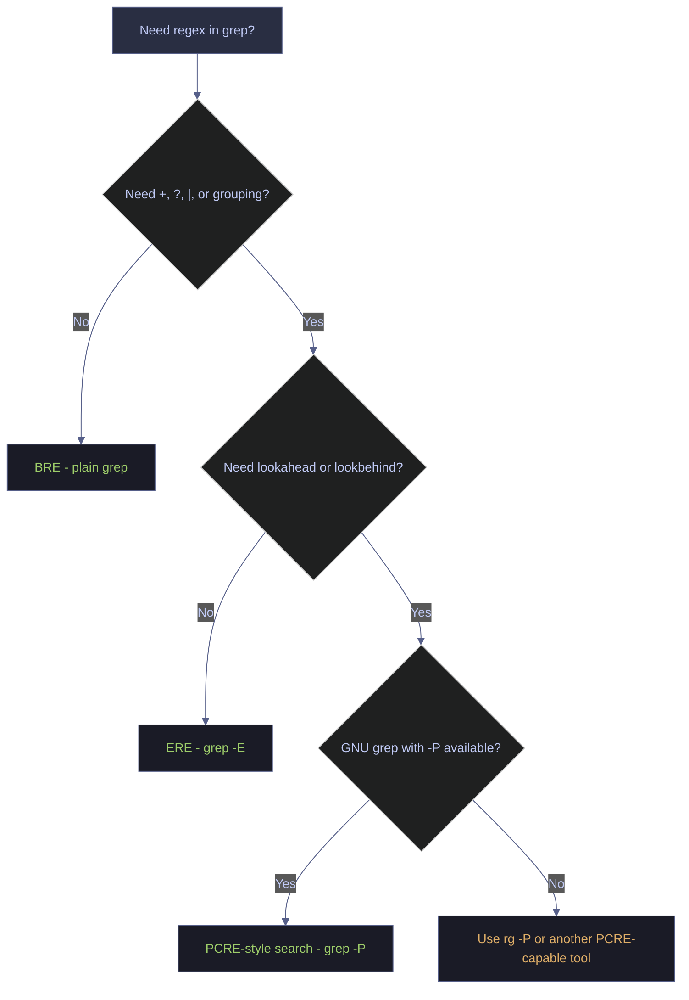
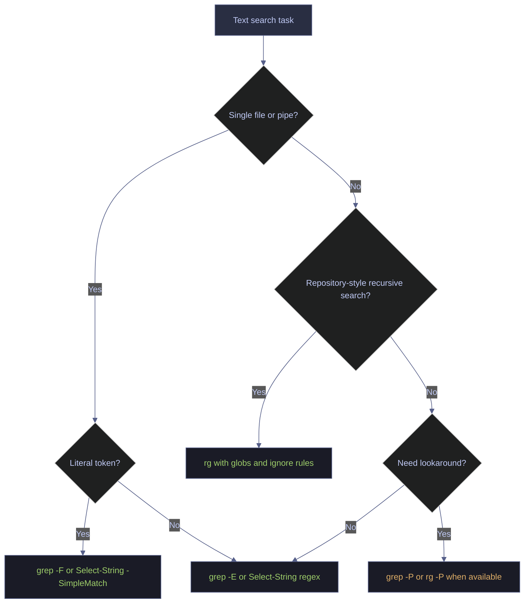

# grep and pattern matching

> [!quote]+
>
> "Some people, when confronted with a problem, think 'I know, I'll use regular expressions.' Now they have two problems."
>
> - **Jamie Zawinski**, alt.religion.emacs post (1997)

> [!abstract]- Summary
>
> Reference guide for line-oriented search in Bash/Linux and PowerShell.
>
> - Use `grep` for direct file and pipeline filtering on Unix-like systems.
> - Use `grep -E` or escaped BRE operators for alternation; plain `grep 'a|b'` searches for a literal pipe.
> - Use `grep -F` and `Select-String -SimpleMatch` for literal tokens such as IP addresses, paths, and version strings.
> - Use `grep -r`, `grep -C`, `grep -q`, `zgrep`, and `rg` for recursive search, context capture, quiet checks, compressed logs, and repository-scale search.
> - Use `Select-String`, `-Context`, `-Quiet`, `-AllMatches`, and `findstr` for the equivalent Windows and PowerShell workflows.
> - Keep the lookup tables for flags and tool selection nearby; they summarize breadth that does not need full prose every time.

> [!note]- Glossary
>
> **`grep`**
>
> - Line-oriented search tool that prints lines matching a pattern.
> - Best for direct filtering in shell pipelines, log inspection, and small-to-medium file searches.
> - Plain `grep` uses POSIX Basic Regular Expressions (BRE), not ERE or PCRE.
>
> ---
>
> **Regular expression**
>
> - Pattern language for matching sets of strings rather than one exact literal.
> - Used to capture flexible search conditions such as anchors, classes, alternation, and repetition.
> - Regex syntax varies by engine; the patterns in `grep`, `rg`, and `Select-String` overlap, but they are not identical.
>
> ---
>
> **`grep -E`**
>
> - `grep` mode for POSIX Extended Regular Expressions (ERE).
> - Used when operators such as `+`, `?`, `|`, and `()` should work without backslash escaping.
> - Prefer it whenever alternation or grouping would be unreadable in BRE.
>
> ---
>
> **`grep -F`**
>
> - Fixed-string mode that disables regex interpretation.
> - Used for exact tokens such as IP addresses, file paths, URLs, and version strings.
> - Safer than regex mode when dots, brackets, or other metacharacters should be treated literally.
>
> ---
>
> **Context flags**
>
> - `grep -A`, `-B`, and `-C` add surrounding lines before or after each match.
> - Used during failure analysis so the matching line is not read in isolation.
> - The PowerShell equivalent is `Select-String -Context`.
>
> ---
>
> **`ripgrep` (`rg`)**
>
> - Recursive search tool optimized for large text trees and developer workflows.
> - Used when recursive search, glob filtering, and ignore-file awareness matter more than strict POSIX grep behavior.
> - Its default regex engine is Rust regex, not POSIX grep.
>
> ---
>
> **`Select-String`**
>
> - PowerShell cmdlet for text search that returns `MatchInfo` objects instead of plain lines.
> - Used when downstream logic needs path, line number, capture groups, or Boolean checks.
> - Matching is case-insensitive by default unless `-CaseSensitive` is added.

`grep` remains the default text filter in Unix-like shells because it is cheap to compose with pipes, predictable on plain text, and already present on almost every Linux system. `Select-String` serves the same operational role in PowerShell, but it uses the .NET regex engine and returns objects rather than plain text lines.

Some regex ideas transfer to [Python's re module](https://alp78.github.io/elysium/02-Programming-Languages/Python/02_py_strings) and [C#'s Regex class](https://alp78.github.io/elysium/02-Programming-Languages/CSharp/02_cs_strings), but the engines in this note are not interchangeable. Plain `grep` uses POSIX BRE, `grep -E` uses ERE, GNU `grep -P` adds Perl-style features, `rg` uses Rust regex by default, and `Select-String` uses .NET regex. While grep finds matches, [sed-stream-editing](https://alp78.github.io/elysium/01-Shell/Text-Processing/sed-stream-editing) complements it by editing matching streams.

## Demo fixtures

Run the fixture block for your platform once before reusing the later commands. The outputs in this note were captured live from these disposable trees.

### Bash/Linux | demo fixtures

Use a temporary directory so the examples stay isolated from real logs and source trees.

#### Build a disposable grep demo tree

*Run the commands in this section to build a disposable grep demo tree.*
```bash
tmp=/tmp/elysium-grep-demo
rm -rf "$tmp"
mkdir -p "$tmp/project/src" "$tmp/project/logs" "$tmp/secrets"

cat > "$tmp/app.log" <<'EOF'
2026-04-14 09:00:00 INFO bootstrap complete
2026-04-14 09:01:00 WARN cache warming
2026-04-14 09:02:00 ERROR payment timeout
2026-04-14 09:03:00 ERROR disk full
2026-04-14 09:04:00 INFO retry scheduled
EOF

cp "$tmp/app.log" "$tmp/project/logs/app.log"

cat > "$tmp/notes.txt" <<'EOF'
log
logfile
catalog
blog
EOF

cat > "$tmp/config.ini" <<'EOF'
# sample config
mode=prod
log_level=DEBUG
EOF

cat > "$tmp/ip.txt" <<'EOF'
client=10.132.0.2
client=10X132Y0Z2
EOF

cat > "$tmp/users.txt" <<'EOF'
user=alice user=bob
EOF

cat > "$tmp/project/src/app.py" <<'EOF'
# TODO: remove fallback
print("ok")
EOF

cat > "$tmp/project/src/test_app.py" <<'EOF'
# TODO: keep in tests
print("test")
EOF

cat > "$tmp/project/src/query.sql" <<'EOF'
SELECT * FROM raw.events JOIN mart.sales ON 1=1;
EOF

cat > "$tmp/secrets/app.env" <<'EOF'
password=topsecret
EOF

cat > "$tmp/secrets/readme.txt" <<'EOF'
no secret here
EOF

gzip -c "$tmp/app.log" > "$tmp/app.log.gz"

find "$tmp" -maxdepth 3 -type f | sort
```

```text
/tmp/elysium-grep-demo/app.log
/tmp/elysium-grep-demo/app.log.gz
/tmp/elysium-grep-demo/config.ini
/tmp/elysium-grep-demo/ip.txt
/tmp/elysium-grep-demo/notes.txt
/tmp/elysium-grep-demo/project/logs/app.log
/tmp/elysium-grep-demo/project/src/app.py
/tmp/elysium-grep-demo/project/src/query.sql
/tmp/elysium-grep-demo/project/src/test_app.py
/tmp/elysium-grep-demo/secrets/app.env
/tmp/elysium-grep-demo/secrets/readme.txt
/tmp/elysium-grep-demo/users.txt
```

### PowerShell | demo fixtures

Mirror the same tree under `$env:TEMP` so the PowerShell and `findstr` examples use disposable data instead of real files.

#### Build a disposable `Select-String` demo tree

*Run the commands in this section to build a disposable `Select-String` demo tree.*
```powershell
$tmp = Join-Path $env:TEMP 'elysium-grep-demo'
Remove-Item -LiteralPath $tmp -Recurse -Force -ErrorAction SilentlyContinue

New-Item -ItemType Directory -Path (Join-Path $tmp 'project\src') -Force | Out-Null
New-Item -ItemType Directory -Path (Join-Path $tmp 'project\logs') -Force | Out-Null
New-Item -ItemType Directory -Path (Join-Path $tmp 'secrets') -Force | Out-Null

@(
    '2026-04-14 09:00:00 INFO bootstrap complete',
    '2026-04-14 09:01:00 WARN cache warming',
    '2026-04-14 09:02:00 ERROR payment timeout',
    '2026-04-14 09:03:00 ERROR disk full',
    '2026-04-14 09:04:00 INFO retry scheduled'
) | Set-Content -LiteralPath (Join-Path $tmp 'app.log')

Copy-Item -LiteralPath (Join-Path $tmp 'app.log') -Destination (Join-Path $tmp 'project\logs\app.log')

@('log', 'logfile', 'catalog', 'blog') |
    Set-Content -LiteralPath (Join-Path $tmp 'notes.txt')

@('# sample config', 'mode=prod', 'log_level=DEBUG') |
    Set-Content -LiteralPath (Join-Path $tmp 'config.ini')

@('client=10.132.0.2', 'client=10X132Y0Z2') |
    Set-Content -LiteralPath (Join-Path $tmp 'ip.txt')

@('user=alice user=bob') |
    Set-Content -LiteralPath (Join-Path $tmp 'users.txt')

@('# TODO: remove fallback', 'print("ok")') |
    Set-Content -LiteralPath (Join-Path $tmp 'project\src\app.py')

@('# TODO: keep in tests', 'print("test")') |
    Set-Content -LiteralPath (Join-Path $tmp 'project\src\test_app.py')

@('SELECT * FROM raw.events JOIN mart.sales ON 1=1;') |
    Set-Content -LiteralPath (Join-Path $tmp 'project\src\query.sql')

@('password=topsecret') |
    Set-Content -LiteralPath (Join-Path $tmp 'secrets\app.env')

@('no secret here') |
    Set-Content -LiteralPath (Join-Path $tmp 'secrets\readme.txt')

$gzip = Join-Path $tmp 'app.log.gz'
$fs = [System.IO.File]::Create($gzip)
$gzipStream = New-Object System.IO.Compression.GzipStream(
    $fs,
    [System.IO.Compression.CompressionMode]::Compress
)
$writer = New-Object System.IO.StreamWriter($gzipStream)
Get-Content -LiteralPath (Join-Path $tmp 'app.log') | ForEach-Object {
    $writer.WriteLine($_)
}
$writer.Dispose()

Get-ChildItem -LiteralPath $tmp -Recurse -File |
    Sort-Object FullName |
    Select-Object -ExpandProperty FullName
```

```text
C:\Users\aperi\AppData\Local\Temp\elysium-grep-demo\app.log
C:\Users\aperi\AppData\Local\Temp\elysium-grep-demo\app.log.gz
C:\Users\aperi\AppData\Local\Temp\elysium-grep-demo\config.ini
C:\Users\aperi\AppData\Local\Temp\elysium-grep-demo\ip.txt
C:\Users\aperi\AppData\Local\Temp\elysium-grep-demo\notes.txt
C:\Users\aperi\AppData\Local\Temp\elysium-grep-demo\project\logs\app.log
C:\Users\aperi\AppData\Local\Temp\elysium-grep-demo\project\src\app.py
C:\Users\aperi\AppData\Local\Temp\elysium-grep-demo\project\src\query.sql
C:\Users\aperi\AppData\Local\Temp\elysium-grep-demo\project\src\test_app.py
C:\Users\aperi\AppData\Local\Temp\elysium-grep-demo\secrets\app.env
C:\Users\aperi\AppData\Local\Temp\elysium-grep-demo\secrets\readme.txt
C:\Users\aperi\AppData\Local\Temp\elysium-grep-demo\users.txt
```

## Basic matching

These are the day-one search operations: exact line filtering, case handling, whole-word matching, counting, filename-only output, and inverted matches.

### Bash/Linux | basic matching

Use plain `grep` first, then add flags only when the behavior needs to change.

#### Find `ERROR` lines in one file

Use plain `grep` when the pattern is already case-correct and the file set is explicit.

*Run the commands in this section to find `ERROR` lines in one file.*
```bash
tmp=/tmp/elysium-grep-demo
grep 'ERROR' "$tmp/app.log"
```

```text
2026-04-14 09:02:00 ERROR payment timeout
2026-04-14 09:03:00 ERROR disk full
```

#### Ignore case when the log level changes

`-i` keeps the search stable when the source mixes uppercase and lowercase log tokens. `-n` is added here because case-insensitive searches are usually followed by navigation.

*Run the commands in this section to ignore case when the log level changes.*
```bash
grep -in 'error' '/tmp/elysium-grep-demo/app.log'
```

```text
3:2026-04-14 09:02:00 ERROR payment timeout
4:2026-04-14 09:03:00 ERROR disk full
```

#### Match `log` but not `logfile`

`-w` forces a whole-word match, which matters when the token can appear as a substring inside longer identifiers.

*Run the commands in this section to match `log` but not `logfile`.*
```bash
tmp=/tmp/elysium-grep-demo
grep -w 'log' "$tmp/notes.txt"
```

```text
log
```

#### Count matching lines

`-c` reports the number of matching lines, not the number of individual match occurrences on each line.

*Run the commands in this section to count matching lines.*
```bash
tmp=/tmp/elysium-grep-demo
grep -c 'ERROR' "$tmp/app.log"
```

```text
2
```

#### List only the files that contain a match

`-l` is safer than printing the matching lines when the content itself may be noisy or sensitive.

*Run the commands in this section to list only the files that contain a match.*
```bash
tmp=/tmp/elysium-grep-demo
grep -l 'ERROR' "$tmp/app.log" "$tmp/project/logs/app.log"
```

```text
/tmp/elysium-grep-demo/app.log
/tmp/elysium-grep-demo/project/logs/app.log
```

#### Remove noisy `DEBUG` lines

`-v` inverts the match and leaves only the lines that do not contain the pattern.

*Run the commands in this section to remove noisy `DEBUG` lines.*
```bash
tmp=/tmp/elysium-grep-demo
grep -v 'DEBUG' "$tmp/config.ini"
```

```text
# sample config
mode=prod
```

### PowerShell | basic matching

`Select-String` covers the same operational surface, but it emits `MatchInfo` objects and is case-insensitive by default.

#### Find `ERROR` lines in one file

Project the `MatchInfo` object into predictable text when you want line numbers and the matched line without the default console emphasis.

*Run the commands in this section to find `ERROR` lines in one file.*
```powershell
$tmp = Join-Path $env:TEMP 'elysium-grep-demo'
Select-String -Pattern 'ERROR' -Path (Join-Path $tmp 'app.log') |
    ForEach-Object { '{0}:{1}: {2}' -f $_.Filename, $_.LineNumber, $_.Line.Trim() }
```

```text
app.log:3: 2026-04-14 09:02:00 ERROR payment timeout
app.log:4: 2026-04-14 09:03:00 ERROR disk full
```

#### Find `ERROR` regardless of case

This is the default behavior in PowerShell, which is the opposite of plain `grep`.

*Run the commands in this section to find `ERROR` regardless of case.*
```powershell
$tmp = Join-Path $env:TEMP 'elysium-grep-demo'
Select-String -Pattern 'error' -Path (Join-Path $tmp 'app.log') |
    ForEach-Object { '{0}:{1}: {2}' -f $_.Filename, $_.LineNumber, $_.Line.Trim() }
```

```text
app.log:3: 2026-04-14 09:02:00 ERROR payment timeout
app.log:4: 2026-04-14 09:03:00 ERROR disk full
```

#### Search pipeline input instead of a path

`Select-String` reads strings from the pipeline without losing regex support.

*Run the commands in this section to search pipeline input instead of a path.*
```powershell
$tmp = Join-Path $env:TEMP 'elysium-grep-demo'
Get-Content -LiteralPath (Join-Path $tmp 'app.log') |
    Select-String 'WARN' |
    ForEach-Object { $_.Line.Trim() }
```

```text
2026-04-14 09:01:00 WARN cache warming
```

#### Match `log` but not `logfile`

PowerShell has no `-w` switch, so the equivalent is an explicit word-boundary regex.

*Run the commands in this section to match `log` but not `logfile`.*
```powershell
$tmp = Join-Path $env:TEMP 'elysium-grep-demo'
Select-String -Pattern '\blog\b' -Path (Join-Path $tmp 'notes.txt') |
    ForEach-Object { $_.Line }
```

```text
log
```

#### Count matching lines

The direct count is the number of matching lines in the returned result set.

*Run the commands in this section to count matching lines.*
```powershell
$tmp = Join-Path $env:TEMP 'elysium-grep-demo'
(Select-String -Pattern 'ERROR' -Path (Join-Path $tmp 'app.log')).Count
```

```text
2
```

#### List only the files that contain a match

Expand `Path` and deduplicate it when multiple matches may come from the same file.

*Run the commands in this section to list only the files that contain a match.*
```powershell
$tmp = Join-Path $env:TEMP 'elysium-grep-demo'
Select-String -Pattern 'ERROR' -Path (Join-Path $tmp 'app.log'), (Join-Path $tmp 'project\logs\app.log') |
    Select-Object -ExpandProperty Path -Unique
```

```text
C:\Users\aperi\AppData\Local\Temp\elysium-grep-demo\app.log
C:\Users\aperi\AppData\Local\Temp\elysium-grep-demo\project\logs\app.log
```

#### Remove noisy `DEBUG` lines

`-NotMatch` is the direct inverse filter for lines that should be excluded from the stream.

*Run the commands in this section to remove noisy `DEBUG` lines.*
```powershell
$tmp = Join-Path $env:TEMP 'elysium-grep-demo'
Get-Content -LiteralPath (Join-Path $tmp 'config.ini') |
    Select-String -Pattern 'DEBUG' -NotMatch |
    ForEach-Object { $_.Line }
```

```text
# sample config
mode=prod
```

## Regex modes

The important split is not "regex or no regex." The real split is which engine and which operator set you are using.



### Bash/Linux | regex modes

On Linux, the critical distinction is between BRE, ERE, and GNU `-P`.

#### Alternate between `ERROR` and `WARN`

Plain `grep 'ERROR|WARN'` searches for the literal character `|`. Use `grep -E 'ERROR|WARN'` or the BRE form `grep 'ERROR\|WARN'` when alternation is required.

*Run the commands in this section to alternate between `ERROR` and `WARN`.*
```bash
grep -n 'ERROR|WARN' '/tmp/elysium-grep-demo/app.log' || echo 'no match'
```

```text
no match
```

*Run the commands in this section to alternate between `ERROR` and `WARN`.*
```bash
grep -nE 'ERROR|WARN' '/tmp/elysium-grep-demo/app.log'
```

```text
2:2026-04-14 09:01:00 WARN cache warming
3:2026-04-14 09:02:00 ERROR payment timeout
4:2026-04-14 09:03:00 ERROR disk full
```

#### Print only the matching level tokens

`-o` is useful when downstream commands should work on the captured token instead of the full line.

*Run the commands in this section to print only the matching level tokens.*
```bash
tmp=/tmp/elysium-grep-demo
grep -oE 'ERROR|WARN' "$tmp/app.log"
```

```text
WARN
ERROR
ERROR
```

#### Extract `user=` values with GNU grep PCRE

GNU `grep -P` supports lookbehind and other Perl-style constructs, but do not assume that option exists on every non-GNU build.

*Run the commands in this section to extract `user=` values with GNU grep PCRE.*
```bash
tmp=/tmp/elysium-grep-demo
grep -Po '(?<=user=)\w+' "$tmp/users.txt"
```

```text
alice
bob
```

The following POSIX classes remain useful for portable `grep` and `grep -E` patterns.

### POSIX character classes

| Class | Meaning | Example |
|---|---|---|
| `[[:digit:]]` | Decimal digits | `^[[:digit:]]+$` |
| `[[:alpha:]]` | Letters in the current locale | `^[[:alpha:]]+$` |
| `[[:alnum:]]` | Letters or digits | `^[[:alnum:]_]+$` |
| `[[:space:]]` | Whitespace | `^[[:space:]]+` |
| `[[:upper:]]` | Uppercase letters | `^[[:upper:]]` |

### PowerShell | regex modes

PowerShell uses the .NET regex engine. Grouping, alternation, lookahead, and lookbehind are available, but that does not make it identical to POSIX grep or PCRE.

#### Match both `ERROR` and `WARN` with multiple patterns

Passing a string array to `-Pattern` is the closest `Select-String` equivalent to repeated `grep -e`.

*Run the commands in this section to match both `ERROR` and `WARN` with multiple patterns.*
```powershell
$tmp = Join-Path $env:TEMP 'elysium-grep-demo'
Select-String -Pattern 'ERROR', 'WARN' -Path (Join-Path $tmp 'app.log') |
    ForEach-Object { '{0}:{1}: {2}' -f $_.Filename, $_.LineNumber, $_.Line.Trim() }
```

```text
app.log:2: 2026-04-14 09:01:00 WARN cache warming
app.log:3: 2026-04-14 09:02:00 ERROR payment timeout
app.log:4: 2026-04-14 09:03:00 ERROR disk full
```

#### Return every `user=` value from one line

`-AllMatches` matters whenever multiple values can appear on the same input line.

*Run the commands in this section to return every `user=` value from one line.*
```powershell
'user=alice user=bob' |
    Select-String -Pattern '(?<=user=)\w+' -AllMatches |
    ForEach-Object { $_.Matches.Value }
```

```text
alice
bob
```

## Recursive search and context

Once the search moves beyond a single file, the important controls are scope, context, and scriptability.

### Bash/Linux | recursive search and context

Recursive grep is useful, but it should be narrowed deliberately so you do not read every file on disk by accident.

#### Search only Python files and skip test files

Combine `-r` with `--include` and `--exclude` when the directory tree contains mixed content.

*Run the commands in this section to search only Python files and skip test files.*
```bash
tmp=/tmp/elysium-grep-demo
grep -r --include='*.py' --exclude='test_*' 'TODO' "$tmp/project"
```

```text
/tmp/elysium-grep-demo/project/src/app.py:# TODO: remove fallback
```

#### Show one line of context around a failure

`-C 1` keeps the matching line together with its immediate neighbors.

*Run the commands in this section to show one line of context around a failure.*
```bash
tmp=/tmp/elysium-grep-demo
grep -C 1 'ERROR payment timeout' "$tmp/app.log"
```

```text
2026-04-14 09:01:00 WARN cache warming
2026-04-14 09:02:00 ERROR payment timeout
2026-04-14 09:03:00 ERROR disk full
```

#### Verify a quiet check with its exit status

`grep -q` intentionally prints nothing, so the follow-up verification here is the exit code itself.

*Run the commands in this section to verify a quiet check with its exit status.*
```bash
tmp=/tmp/elysium-grep-demo
grep -q 'ERROR' "$tmp/app.log"
printf 'exit=%s\n' "$?"
```

```text
exit=0
```

### PowerShell | recursive search and context

PowerShell reaches the same outcome by composing `Get-ChildItem` and `Select-String`.

#### Search only Python files and skip test files

Filter the file list before `Select-String` so the match set stays clean.

*Run the commands in this section to search only Python files and skip test files.*
```powershell
$tmp = Join-Path $env:TEMP 'elysium-grep-demo'
Get-ChildItem (Join-Path $tmp 'project') -Recurse -Filter *.py |
    Where-Object { $_.Name -notlike 'test_*' } |
    Select-String -Pattern 'TODO' |
    ForEach-Object { '{0}:{1}: {2}' -f $_.Path, $_.LineNumber, $_.Line.Trim() }
```

```text
C:\Users\aperi\AppData\Local\Temp\elysium-grep-demo\project\src\app.py:1: # TODO: remove fallback
```

#### Show one line of context around a failure

`-Context 1,1` returns one line before and after each match.

*Run the commands in this section to show one line of context around a failure.*
```powershell
$tmp = Join-Path $env:TEMP 'elysium-grep-demo'
Select-String -Pattern 'ERROR payment timeout' -Path (Join-Path $tmp 'app.log') -Context 1,1 |
    ForEach-Object { $_.Context.PreContext + $_.Line + $_.Context.PostContext }
```

```text
2026-04-14 09:01:00 WARN cache warming
2026-04-14 09:02:00 ERROR payment timeout
2026-04-14 09:03:00 ERROR disk full
```

#### Return a Boolean instead of `MatchInfo` objects

Use `-Quiet` when the calling code only needs a true-or-false answer.

*Run the commands in this section to return a Boolean instead of `MatchInfo` objects.*
```powershell
$tmp = Join-Path $env:TEMP 'elysium-grep-demo'
Select-String -Pattern 'ERROR' -Path (Join-Path $tmp 'app.log') -Quiet
```

```text
True
```

## Data engineering scenarios

These are the search patterns that show up in daily operations work: compressed logs, secret scans, report extraction, and minimal-tool fallbacks.

### Bash/Linux | data engineering scenarios

The Linux side is usually strongest at stream processing and compressed-log search.

#### Search compressed logs without unpacking them

`zgrep` preserves the same search behavior while reading from a gzip-compressed file.

*Run the commands in this section to search compressed logs without unpacking them.*
```bash
tmp=/tmp/elysium-grep-demo
zgrep 'ERROR' "$tmp/app.log.gz"
```

```text
2026-04-14 09:02:00 ERROR payment timeout
2026-04-14 09:03:00 ERROR disk full
```

#### Scan for candidate secret files without printing the secret

`-l` is the safer first pass because it reports only the filenames that need review.

*Run the commands in this section to scan for candidate secret files without printing the secret.*
```bash
tmp=/tmp/elysium-grep-demo
grep -rlE 'password|api_key' "$tmp/secrets"
```

```text
/tmp/elysium-grep-demo/secrets/app.env
```

### PowerShell | data engineering scenarios

The PowerShell side is strongest when the search result needs to feed a report or another cmdlet.

#### Project match objects into a report row set

Extract only the fields that are operationally useful and discard the rest of the object shape.

*Run the commands in this section to project match objects into a report row set.*
```powershell
$tmp = Join-Path $env:TEMP 'elysium-grep-demo'
Select-String -Pattern '(ERROR|WARN)' -Path (Join-Path $tmp 'app.log') |
    Select-Object LineNumber,
        @{Name='Level'; Expression={ $_.Matches[0].Value }},
        @{Name='Message'; Expression={ $_.Line.Trim() }} |
    Format-Table -HideTableHeaders
```

```text

         2 WARN  2026-04-14 09:01:00 WARN cache warming
         3 ERROR 2026-04-14 09:02:00 ERROR payment timeout
         4 ERROR 2026-04-14 09:03:00 ERROR disk full
```

#### Fall back to `findstr` when only cmd.exe tooling is available

`findstr` is far less capable than `Select-String`, but it remains useful in constrained Windows environments.

*Run the commands in this section to fall back to `findstr` when only cmd.exe tooling is available.*
```powershell
$tmp = Join-Path $env:TEMP 'elysium-grep-demo'
findstr /N /I "error" (Join-Path $tmp 'app.log')
```

```text
3:2026-04-14 09:02:00 ERROR payment timeout
4:2026-04-14 09:03:00 ERROR disk full
```

## Performance and alternatives

Literal search and recursive tree search are the two places where tool choice matters most. Use fixed-string mode when the token is literal, and switch to `rg` when the scope is an entire repository.



### Bash/Linux | performance and alternatives

Literal tokens and recursive trees are where `grep` and `rg` diverge most clearly.

#### Search for a literal IP address

In regex mode, `.` means "any character." Fixed-string mode avoids that overmatch.

*Run the commands in this section to search for a literal IP address.*
```bash
tmp=/tmp/elysium-grep-demo
grep '10.132.0.2' "$tmp/ip.txt"
```

```text
client=10.132.0.2
client=10X132Y0Z2
```

*Run the commands in this section to search for a literal IP address.*
```bash
tmp=/tmp/elysium-grep-demo
grep -F '10.132.0.2' "$tmp/ip.txt"
```

```text
client=10.132.0.2
```

#### Search Python files with ripgrep globs

`rg` is a better default for repository search because recursion is built in and glob filtering is concise.

*Run the commands in this section to search Python files with ripgrep globs.*
```bash
tmp=/tmp/elysium-grep-demo
rg --glob '*.py' --glob '!**/test_*' 'TODO' "$tmp/project"
```

```text
/tmp/elysium-grep-demo/project/src/app.py:# TODO: remove fallback
```

### PowerShell | performance and alternatives

The same distinction exists on Windows: use literal matching for literal tokens and `rg` for repository-style text search.

#### Search for a literal IP address

Regex mode and literal mode are different operations in `Select-String`, even when the pattern looks simple.

*Run the commands in this section to search for a literal IP address.*
```powershell
$tmp = Join-Path $env:TEMP 'elysium-grep-demo'
Get-Content -LiteralPath (Join-Path $tmp 'ip.txt') |
    Select-String -Pattern '10.132.0.2' |
    ForEach-Object { $_.Line }
```

```text
client=10.132.0.2
client=10X132Y0Z2
```

*Run the commands in this section to search for a literal IP address.*
```powershell
$tmp = Join-Path $env:TEMP 'elysium-grep-demo'
Get-Content -LiteralPath (Join-Path $tmp 'ip.txt') |
    Select-String -Pattern '10.132.0.2' -SimpleMatch |
    ForEach-Object { $_.Line }
```

```text
client=10.132.0.2
```

#### Search Python files with ripgrep globs

`rg` behaves the same way on Windows, so it is often the cleanest cross-platform recursive search tool.

*Run the commands in this section to search Python files with ripgrep globs.*
```powershell
$tmp = Join-Path $env:TEMP 'elysium-grep-demo'
rg --glob '*.py' --glob '!**/test_*' 'TODO' (Join-Path $tmp 'project')
```

```text
C:\Users\aperi\AppData\Local\Temp\elysium-grep-demo\project\src\app.py:# TODO: remove fallback
```

## Recommended patterns

These are the defaults worth carrying into scripts and incident-response sessions.

### Bash/Linux | recommended patterns

Keep the default choices simple and predictable.

#### Prefer fixed-string mode for literal tokens

If the token is an IP address, path, URL, or version string, the safest default is `grep -F`.

> [!info] Literal mode disables regex parsing
>
> GNU `grep` treats patterns as regular expressions unless you ask for fixed strings. `-F` makes punctuation such as `.`, `?`, `+`, and `|` literal, which is the safer default for copied error text, IP addresses, paths, and version identifiers.

*Run the commands in this section to prefer fixed-string mode for literal tokens.*
```bash
tmp=/tmp/elysium-grep-demo
grep -F '10.132.0.2' "$tmp/ip.txt"
```

```text
client=10.132.0.2
```

#### Prefer filename-only scans for secret hunting

Start with `-l` so the terminal does not become an accidental secret sink.

*Run the commands in this section to prefer filename-only scans for secret hunting.*
```bash
tmp=/tmp/elysium-grep-demo
grep -rlE 'password|api_key' "$tmp/secrets"
```

```text
/tmp/elysium-grep-demo/secrets/app.env
```

### PowerShell | recommended patterns

On the PowerShell side, the most useful defaults are the literal mode and the Boolean mode.

#### Prefer `-SimpleMatch` for literal tokens

Use regex mode only when the wildcard behavior is intentional.

> [!info] Regex is still the default
>
> `Select-String` interprets `-Pattern` as regex unless `-SimpleMatch` is added. Use `-SimpleMatch` for exact text searches, and pair it with `-Quiet` when the calling code only needs a true-or-false result instead of `MatchInfo` objects.

*Run the commands in this section to prefer `-SimpleMatch` for literal tokens.*
```powershell
$tmp = Join-Path $env:TEMP 'elysium-grep-demo'
Get-Content -LiteralPath (Join-Path $tmp 'ip.txt') |
    Select-String -Pattern '10.132.0.2' -SimpleMatch |
    ForEach-Object { $_.Line }
```

```text
client=10.132.0.2
```

#### Prefer `-Quiet` when a script needs a Boolean

This keeps the branch condition explicit and avoids carrying full `MatchInfo` objects through a control-flow check.

*Run the commands in this section to prefer `-Quiet` when a script needs a Boolean.*
```powershell
$tmp = Join-Path $env:TEMP 'elysium-grep-demo'
Select-String -Pattern 'ERROR' -Path (Join-Path $tmp 'app.log') -Quiet
```

```text
True
```

## Troubleshooting

Most grep failures come from using the wrong regex mode, the wrong case behavior, or regex when a literal search was intended.

### Bash/Linux | troubleshooting

On Linux, the main failure mode is assuming ERE behavior while still using plain BRE `grep`.

#### `grep 'ERROR|WARN'` returns no matches

If the pattern contains `|`, `+`, `?`, or grouping, plain `grep` is the first thing to inspect.

*Run the commands in this section to `grep 'ERROR|WARN'` returns no matches.*
```bash
grep -n 'ERROR|WARN' '/tmp/elysium-grep-demo/app.log' || echo 'no match'
```

```text
no match
```

*Run the commands in this section to `grep 'ERROR|WARN'` returns no matches.*
```bash
grep -nE 'ERROR|WARN' '/tmp/elysium-grep-demo/app.log'
```

```text
2:2026-04-14 09:01:00 WARN cache warming
3:2026-04-14 09:02:00 ERROR payment timeout
4:2026-04-14 09:03:00 ERROR disk full
```

#### A dotted pattern matches more lines than expected

Dots are regex wildcards. Switch to `-F` when the dots are literal punctuation.

*Run the commands in this section to a dotted pattern matches more lines than expected.*
```bash
tmp=/tmp/elysium-grep-demo
grep '10.132.0.2' "$tmp/ip.txt"
```

```text
client=10.132.0.2
client=10X132Y0Z2
```

*Run the commands in this section to a dotted pattern matches more lines than expected.*
```bash
tmp=/tmp/elysium-grep-demo
grep -F '10.132.0.2' "$tmp/ip.txt"
```

```text
client=10.132.0.2
```

### PowerShell | troubleshooting

On Windows, the main surprises are the default case-insensitive behavior and the difference between regex mode and `-SimpleMatch`.

#### A ported grep check starts matching regardless of case

PowerShell is case-insensitive by default. Add `-CaseSensitive` when porting a plain `grep` check that should remain case-sensitive.

*Run the commands in this section to a ported grep check starts matching regardless of case.*
```powershell
$tmp = Join-Path $env:TEMP 'elysium-grep-demo'
Select-String -Pattern 'error' -Path (Join-Path $tmp 'app.log') -Quiet
```

```text
True
```

*Run the commands in this section to a ported grep check starts matching regardless of case.*
```powershell
$tmp = Join-Path $env:TEMP 'elysium-grep-demo'
Select-String -Pattern 'error' -Path (Join-Path $tmp 'app.log') -CaseSensitive -Quiet
```

```text
False
```

#### A literal search is still being parsed as regex

`Select-String` treats the pattern as regex unless `-SimpleMatch` is added.

*Run the commands in this section to a literal search is still being parsed as regex.*
```powershell
$tmp = Join-Path $env:TEMP 'elysium-grep-demo'
Get-Content -LiteralPath (Join-Path $tmp 'ip.txt') |
    Select-String -Pattern '10.132.0.2' |
    ForEach-Object { $_.Line }
```

```text
client=10.132.0.2
client=10X132Y0Z2
```

*Run the commands in this section to a literal search is still being parsed as regex.*
```powershell
$tmp = Join-Path $env:TEMP 'elysium-grep-demo'
Get-Content -LiteralPath (Join-Path $tmp 'ip.txt') |
    Select-String -Pattern '10.132.0.2' -SimpleMatch |
    ForEach-Object { $_.Line }
```

```text
client=10.132.0.2
```

## Operational cautions

- Plain `grep` is BRE. Use `grep -E` or escaped BRE operators when you need alternation or grouping.
- `grep -P` is a GNU-specific feature and should not be assumed on every Unix-like system.
- `Select-String` is case-insensitive by default. Add `-CaseSensitive` when you need grep-like default behavior.
- Recursive `grep` can traverse binaries and unexpected subtrees. Use `--include`, `--exclude`, `--exclude-dir`, or `--binary-files=without-match` when the scope must stay tight.
- `rg` is not "faster grep syntax." Its default regex engine and ignore-file behavior differ from both POSIX grep and PowerShell.

## Reference tables

Keep these tables for fast lookup. They summarize flags and equivalences that do not need full narrative treatment every time.

### `grep` and PowerShell flag mapping

| `grep` | Meaning | PowerShell equivalent |
|---|---|---|
| `(none)` | Case-sensitive search | `Select-String -CaseSensitive` |
| `-i` | Case-insensitive search | Default `Select-String` behavior |
| `-F` | Fixed-string search | `-SimpleMatch` |
| `-n` | Show line numbers | `.LineNumber` in `MatchInfo` |
| `-c` | Count matching lines | `(Select-String ...).Count` |
| `-l` | Files with matches | `Select-Object -ExpandProperty Path -Unique` |
| `-L` | Files without matches | Subtract matching paths from the full path set |
| `-v` | Invert the match | `-NotMatch` |
| `-o` | Print only the matching text | `ForEach-Object { $_.Matches.Value }` |
| `-r` / `-R` | Recursive search | `Get-ChildItem -Recurse | Select-String` |
| `-C N` | N lines of context before and after | `-Context N,N` |
| `-A N` | N lines after | `-Context 0,N` |
| `-B N` | N lines before | `-Context N,0` |
| `-q` | Quiet Boolean check | `-Quiet` |
| `-e pat` | Multiple explicit patterns | `-Pattern 'pat1', 'pat2'` |
| `-f file` | Read patterns from a file | `-Pattern (Get-Content file)` |
| `-m N` | Stop after N matches | `Select-Object -First N` |
| `-x` | Match entire lines | Anchor the pattern: `'^pattern$'` |
| `--include='*.py'` | Include file glob | `Get-ChildItem -Filter *.py` |
| `--exclude-dir=dir` | Exclude a directory | Filter the path before `Select-String` |

### `rg` quick lookup

| Flag | Syntax | Use |
|---|---|---|
| `-F` | `rg -F 'literal'` | Fixed-string search |
| `-n` | `rg -n 'pattern'` | Show line numbers |
| `-l` | `rg -l 'pattern'` | Print matching files only |
| `-c` | `rg -c 'pattern'` | Count matching lines per file |
| `-g` / `--glob` | `rg --glob '*.py' 'pattern'` | Include or exclude files by glob |
| `-P` | `rg -P 'pattern'` | Use PCRE-style regex when the build supports it |
| `-U` / `--multiline` | `rg -U 'pattern'` | Enable multiline search |
| `--hidden` | `rg --hidden 'pattern'` | Include hidden files |
| `--no-ignore` | `rg --no-ignore 'pattern'` | Ignore `.gitignore` and related ignore files |
| `--json` | `rg --json 'pattern'` | Emit machine-readable JSON events |

### Tool selection: `grep` vs `rg`

| Concern | `grep` | `rg` |
|---|---|---|
| Default recursion | No | Yes |
| Ignore-file awareness | No | Yes |
| Fixed-string mode | `-F` | `-F` |
| POSIX-style regex behavior | Yes | No |
| PCRE-style features | `-P` on GNU builds that support it | `-P` when PCRE support is available |
| Multiline search | Line-oriented | `-U` / `--multiline` |
| Best fit | Single files, pipes, and small explicit path sets | Repository trees and developer search workflows |

### `findstr` quick lookup

| Flag | Syntax | Use |
|---|---|---|
| `/I` | `findstr /I "pat" file` | Case-insensitive search |
| `/N` | `findstr /N "pat" file` | Prefix each match with its line number |
| `/S` | `findstr /S "pat" *.ext` | Recurse through subdirectories |
| `/R` | `findstr /R "pat" file` | Regex search with `findstr`'s limited engine |
| `/W` | `findstr /W "pat" file` | Match whole words |
| `/V` | `findstr /V "pat" file` | Invert the match |
| `/G:file` | `findstr /G:patterns.txt file` | Read patterns from a file |
| `/C:"text"` | `findstr /C:"literal text" file` | Treat the full string as one literal pattern |
| `/M` | `findstr /M "pat" *.ext` | Print matching filenames only |

## Cross-references

- [reading-file-contents](https://alp78.github.io/elysium/01-Shell/Text-Processing/reading-file-contents) - `cat`, `head`, `tail`, `less`, and `Get-Content` before searching
- [io-redirection](https://alp78.github.io/elysium/01-Shell/Scripting/io-redirection) - redirect search results and suppress stderr when needed
- [finding-files](https://alp78.github.io/elysium/01-Shell/File-Operations/finding-files) - `find` and `Get-ChildItem` before recursive search
- [command-chaining](https://alp78.github.io/elysium/01-Shell/Scripting/command-chaining) - pipe search results into `sort`, `uniq`, `wc`, `awk`, `cut`, and `ForEach-Object`
- [process-substitution](https://alp78.github.io/elysium/01-Shell/Scripting/process-substitution) - feed search output back into commands that expect files
- [brace-expansion-and-globbing](https://alp78.github.io/elysium/01-Shell/Scripting/brace-expansion-and-globbing) - target the right files before invoking `grep` or `rg`
- [viewing-processes](https://alp78.github.io/elysium/01-Shell/Process-Management/viewing-processes) - search process listings and logs together
- [defensive-scripting](https://alp78.github.io/elysium/01-Shell/Scripting/defensive-scripting) - branch on `grep` exit codes and keep failure handling explicit
