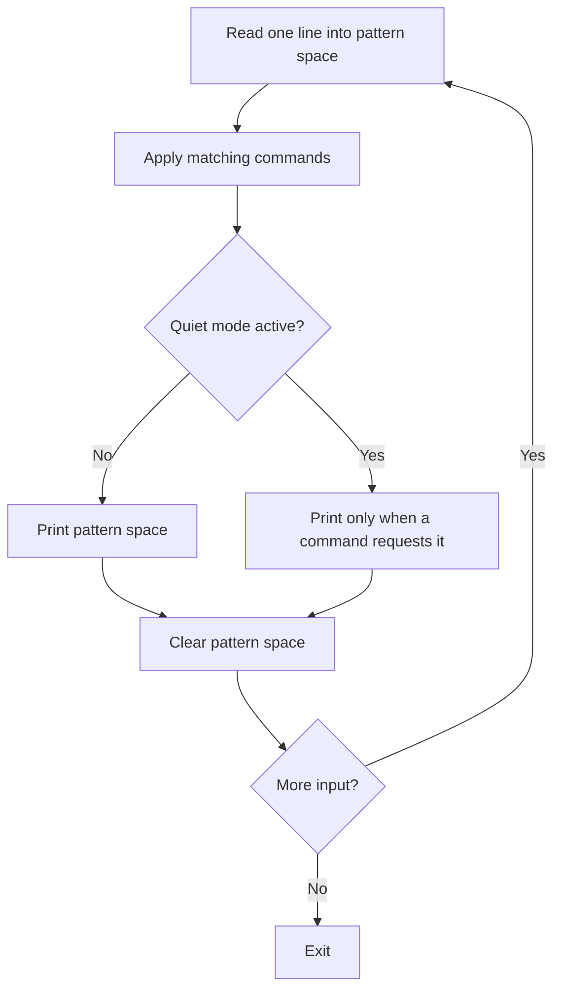

# sed — Stream Editor Reference

> [!quote]+
>
> "Easy things should be easy, and hard things should be possible."
>
> — **Larry Wall**, *Programming Perl* (1991)

> [!abstract]- Summary
>
> `sed` is a line-oriented stream editor for targeted text transformations.
>
> - Use it to substitute, delete, print, or rewrite lines without loading the whole file into memory.
> - Prefer `sed -E` for non-trivial regex and `sed -i.bak` when you must edit files in place.
> - Treat GNU-only features such as `-z`, `1~2`, and `--follow-symlinks` as portability boundaries.
> - PowerShell covers the same core patterns with `-replace`, `Where-Object`, and `Set-Content`.
> - Live Bash examples in this note were verified with GNU sed 4.9 in WSL Ubuntu. Live PowerShell examples were verified with PowerShell 7.5.5.

> [!note]- Glossary
>
> **`sed`**
> - Stream editor that reads input a line at a time and applies commands in order.
> - Writes to stdout unless `-i` is used.
> - Best for line-oriented edits, not full parsers such as quoted CSV.
>
> ---
>
> **Pattern space**
> - Working buffer for the current line or multiline chunk.
> - Commands such as `s`, `d`, `p`, and `N` operate here.
> - Cleared at the end of the cycle unless a command restarts the cycle early.
>
> ---
>
> **Hold space**
> - Secondary buffer that survives across cycles.
> - Used by `h`, `H`, `g`, `G`, and `x`.
> - Useful for multiline joins and accumulation, but usually a sign to switch to `awk` or Python if the script keeps growing.
>
> ---
>
> **Address**
> - Selector that limits a command to specific lines.
> - Can be a line number, regex, range, or negated match.
> - Keeps one-liners focused without extra filtering commands.
>
> ---
>
> **Delimiter**
> - Character after `s` that separates pattern, replacement, and flags.
> - `/` is conventional, but `|`, `#`, or `@` often make path and URL edits clearer.
> - Pick a delimiter that does not appear in the pattern or replacement.
>
> ---
>
> **Back-reference**
> - Placeholder that reuses captured text from the pattern.
> - `sed` uses `\1` through `\9`; PowerShell uses `$1` through `$9`.
> - Works only when the pattern defines capture groups.
>
> ---
>
> **BRE**
> - Basic regular expressions are sed's default dialect.
> - Portable grouping uses `\(...\)`.
> - Prefer `-E` instead of leaning on GNU or BSD BRE extensions such as `\+` or `\|`.
>
> ---
>
> **ERE**
> - Extended regular expressions enabled with `-E`.
> - `()`, `|`, `+`, and `?` work without backslashes.
> - Usually the clearest choice for non-trivial patterns.
>
> ---
>
> **In-place edit**
> - File rewrite performed with `-i` on GNU sed or `-i ''` on BSD or macOS sed.
> - `-i.bak` is the safest cross-platform form.
> - GNU `sed` implements `-i` by writing a temporary file and renaming it over the original path.
>
> ---
>
> **PowerShell `-replace`**
> - Regex substitution operator backed by .NET regex.
> - Case-insensitive by default; `-creplace` is case-sensitive.
> - Replaces all matches on the string, unlike sed's default first-match behavior.

`sed` is most useful when the unit of work is a line, a bounded range, or a regex-addressed slice of a file. This note keeps the high-value command patterns, documents GNU vs BSD/macOS differences, and pairs retained Bash/Linux and PowerShell demos with live output.

## How sed works

sed reads one line into pattern space, applies every matching command, prints the result unless output is suppressed, and then starts the next cycle. That execution model explains most sed behavior, including why `-n` matters and why multiline commands such as `N` change the shape of the current pattern space.



The two working buffers are below.

| Buffer | Purpose |
|---|---|
| Pattern space | The current line or multiline chunk being edited |
| Hold space | A persistent scratch buffer used across cycles |

These invocation forms cover most day-to-day work.

| Form | Meaning |
|---|---|
| `sed 's/old/new/' file` | Replace the first match per line and print to stdout |
| `sed -n '5,10p' file` | Print only selected lines |
| `sed -e 'cmd1' -e 'cmd2' file` | Chain multiple commands |
| `sed -f script.sed file` | Read commands from a script file |
| `sed -i.bak 's/old/new/' file` | Edit in place and keep a backup |
| `sed -E 's/(a|b)/c/' file` | Use extended regular expressions |
| `sed -z 's/\n/,/g' file` | GNU null-delimited mode for NUL-separated input |

These address forms decide which lines a command sees.

| Address | Meaning |
|---|---|
| `5` | Line 5 only |
| `$` | Last line |
| `/pattern/` | Lines that match the regex |
| `5,10` | Lines 5 through 10 |
| `/start/,/end/` | Range from the first `start` match through the next `end` match |
| `addr!` | Every line not matched by the address |
| `1~2` | Every odd line on GNU sed |

## Substitution and regex

Substitution is sed's core feature. The examples below show how default replacement scope, delimiters, and regex dialect change the result.

### Bash/Linux

#### Replace the first match on each line

Without `g`, `s///` changes only the first match in the current pattern space. Keep that default only when first-match behavior is deliberate.

*Run the commands in this section to replace the first match on each line.*
```bash
printf 'ERROR ERROR\nWARN ERROR\n' | sed 's/ERROR/INFO/'
```

```text
INFO ERROR
WARN INFO
```

#### Replace every match on each line

Add `g` when the intent is a full line-wide replacement.

*Run the commands in this section to replace every match on each line.*
```bash
printf 'ERROR ERROR\nWARN ERROR\n' | sed 's/ERROR/INFO/g'
```

```text
INFO INFO
WARN INFO
```

#### Switch delimiters for path-heavy patterns

Alternative delimiters keep path and URL substitutions readable.

*Run the commands in this section to switch delimiters for path-heavy patterns.*
```bash
printf '/var/log/app\n' | sed 's|/var/log|/srv/log|g'
```

```text
/srv/log/app
```

#### Use capture groups with `-E`

`-E` removes most of the backslash noise from non-trivial patterns.

*Run the commands in this section to use capture groups with `-E`.*
```bash
printf '2026-04-14\n' | sed -E 's#([0-9]{4})-([0-9]{2})-([0-9]{2})#\3/\2/\1#'
```

```text
14/04/2026
```

### PowerShell

#### Replace every match with `-replace`

PowerShell's `-replace` is regex-based and replaces all matches on each string.

*Run the commands in this section to replace every match with `-replace`.*
```powershell
@('ERROR ERROR','WARN ERROR') | ForEach-Object { $_ -replace 'ERROR','INFO' }
```

```text
INFO INFO
WARN INFO
```

#### Make the match case-sensitive with `-creplace`

Use `-creplace` when case-sensitive behavior matters.

*Run the commands in this section to make the match case-sensitive with `-creplace`.*
```powershell
@('Error error','ERROR error') | ForEach-Object { $_ -creplace 'Error','WARN' }
```

```text
WARN error
ERROR error
```

#### Reorder fields with capture groups

PowerShell uses `$1`, `$2`, and so on in the replacement string.

*Run the commands in this section to reorder fields with capture groups.*
```powershell
@('name=alice','role=admin') | ForEach-Object { $_ -replace '^(.*)=(.*)$','$2=$1' }
```

```text
alice=name
admin=role
```

These substitution flags are the ones you will use most often.

| Flag | Meaning |
|---|---|
| `g` | Replace every match in the current pattern space |
| `2`, `3`, ... | Replace only the Nth match on the line |
| `p` | Print the line if a substitution happened |
| `w file` | Write changed lines to another file |

Use this comparison when a pattern behaves differently than expected.

| Concern | BRE default | ERE with `-E` |
|---|---|---|
| Grouping | `\(...\)` | `(...)` |
| Alternation | Not portable; prefer `-E` instead of `\|` | `foo|bar` |
| One-or-more | Not portable; prefer `-E` instead of `\+` | `+` |
| Back-references in replacement | `\1`, `\2`, ... | `\1`, `\2`, ... |

## Addressing, line selection, and structural edits

Addresses restrict a command to the lines you care about. That keeps transformations precise and avoids awkward `head` or `tail` pipelines.

### Bash/Linux

#### Print a line range with `-n` and `p`

Suppress default output with `-n` when you want sed to act as a line extractor.

*Run the commands in this section to print a line range with `-n` and `p`.*
```bash
printf 'one\ntwo\nthree\nfour\n' | sed -n '2,3p'
```

```text
two
three
```

#### Restrict a substitution to matching lines

An address in front of `s///` limits the replacement to lines that match the address.

*Run the commands in this section to restrict a substitution to matching lines.*
```bash
printf 'INFO start\nERROR connect\nERROR retry\n' | sed '/ERROR/s/ERROR/WARN/'
```

```text
INFO start
WARN connect
WARN retry
```

#### Delete blank lines

Deletion is one of sed's most common cleanup tasks.

*Run the commands in this section to delete blank lines.*
```bash
printf 'alpha\n\nbeta\n' | sed '/^$/d'
```

```text
alpha
beta
```

#### Replace matching lines with `c\`

Use `c\` when the whole line should be replaced, not just one matched fragment.

*Run the commands in this section to replace matching lines with `c\`.*
```bash
printf 'INFO\nERROR\nDONE\n' | sed '/ERROR/c\WARN'
```

```text
INFO
WARN
DONE
```

### PowerShell

#### Select a line range

When the data is already in memory, array slicing is the closest equivalent to `sed -n 'start,endp'`.

*Run the commands in this section to select a line range.*
```powershell
('one','two','three','four')[1..2]
```

```text
two
three
```

#### Delete blank lines with `Where-Object`

Filtering with `Where-Object` covers the same case as `sed '/^$/d'`.

*Run the commands in this section to delete blank lines with `Where-Object`.*
```powershell
@('alpha','','beta') | Where-Object { $_ -ne '' }
```

```text
alpha
beta
```

#### Replace matching lines conditionally

Use a conditional pipeline when the whole line should change based on a match.

*Run the commands in this section to replace matching lines conditionally.*
```powershell
@('INFO','ERROR','DONE') | ForEach-Object { if($_ -match '^ERROR$'){'WARN'} else {$_} }
```

```text
INFO
WARN
DONE
```

These structural commands cover most line-oriented edits.

| Command | Meaning |
|---|---|
| `d` | Delete the current pattern space and start the next cycle |
| `p` | Print the current pattern space |
| `i\` | Insert text before the current line |
| `a\` | Append text after the current line |
| `c\` | Replace the addressed line or range with new text |
| `q` | Quit immediately |

## In-place editing and portability

By default, sed writes to stdout and leaves the source file untouched. That is the safest default. Reach for in-place editing only after a dry run, and prefer a backup suffix when the file matters.

### Bash/Linux

#### Preview the change before writing

A dry run is the fastest way to confirm the substitution scope before you touch a file.

*Run the commands in this section to preview the change before writing.*
```bash
printf 'host=localhost\n' | sed 's/localhost/db.internal/'
```

```text
host=db.internal
```

#### Edit a file with `-i.bak`

`-i.bak` keeps a backup and works across GNU sed and BSD or macOS sed.

*Run the commands in this section to edit a file with `-i.bak`.*
```bash
f=$(mktemp)
printf 'host=localhost\n' > "$f"
sed -i.bak 's/localhost/db.internal/' "$f"
printf 'file:%s\n' "$(cat "$f")"
printf 'backup:%s\n' "$(cat "$f.bak")"
rm -f "$f" "$f.bak"
```

```text
file:host=db.internal
backup:host=localhost
```

### PowerShell

#### Rewrite the file after transforming the content

PowerShell has no `-i` flag. The standard pattern is read, transform, write, and optionally create a backup first.

*Run the commands in this section to rewrite the file after transforming the content.*
```powershell
$temp = Join-Path $env:TEMP ([System.IO.Path]::GetRandomFileName())
$backup = "$temp.bak"
Set-Content -LiteralPath $temp -Value 'host=localhost' -NoNewline
Copy-Item -LiteralPath $temp -Destination $backup
(Get-Content -LiteralPath $temp) -replace 'localhost','db.internal' | Set-Content -LiteralPath $temp -NoNewline
"file:$(Get-Content -LiteralPath $temp -Raw)"
"backup:$(Get-Content -LiteralPath $backup -Raw)"
Remove-Item -LiteralPath $temp,$backup
```

```text
file:host=db.internal
backup:host=localhost
```

Keep these portability differences in mind before you automate.

| Feature | GNU sed | BSD or macOS sed |
|---|---|---|
| In-place edit with no backup | `sed -i 's/a/b/' file` | `sed -i '' 's/a/b/' file` |
| In-place edit with backup | `sed -i.bak 's/a/b/' file` | `sed -i.bak 's/a/b/' file` |
| Extended regex | `-E` | `-E` |
| Step addresses | `1~2` | Not available |
| Null-delimited mode | `-z` | Not available |
| Follow symlink target during `-i` | `--follow-symlinks` | Not available |

GNU sed implements `-i` by writing a temporary file and renaming it over the original path. That is why `-i` can break symlink behavior by default and why `--follow-symlinks` matters on GNU sed. If link identity matters, stage the output explicitly instead of assuming `-i` preserves path semantics.

Do not combine `-n` and `-i` unless the script also prints explicitly. `sed -ni 's/foo/bar/' file` can truncate the file because output is suppressed and nothing writes the transformed lines back.

## Multi-command and multiline workflows

Once a transformation needs more than one step, combine expressions with `-e` or use multiline commands such as `N`. If the script starts to look like a state machine, switch to `awk` or Python instead of forcing sed to carry the whole job.

### Bash/Linux

#### Chain cleanup steps with multiple `-e` expressions

Multiple expressions are often enough for text normalization tasks.

*Run the commands in this section to chain cleanup steps with multiple `-e` expressions.*
```bash
printf '  alpha  \n\nbeta  \n' | sed -e 's/[[:space:]]*$//' -e '/^$/d'
```

```text
  alpha
beta
```

#### Join line pairs with `N`

`N` appends the next input line to the current pattern space, which lets one substitution see both lines at once.

*Run the commands in this section to join line pairs with `N`.*
```bash
printf 'alpha\nbeta\ngamma\ndelta\n' | sed 'N;s/\n/ | /'
```

```text
alpha | beta
gamma | delta
```

### PowerShell

#### Chain trims and filters in one pipeline

The pipeline below mirrors the two-step cleanup from the Bash example.

*Run the commands in this section to chain trims and filters in one pipeline.*
```powershell
@('  alpha  ','','beta  ') | ForEach-Object { $_ -replace '\s+$','' } | Where-Object { $_ -ne '' }
```

```text
  alpha
beta
```

#### Collapse a wrapped value with a multiline regex

Use `[regex]::Replace()` when the input should be treated as one multiline string instead of a line stream.

*Run the commands in this section to collapse a wrapped value with a multiline regex.*
```powershell
$text = "Subject: Hello`n World"
[regex]::Replace($text,"`n ",' ')
```

```text
Subject: Hello World
```

#### Join records into one value

When the goal is a single combined value, array joining is usually simpler than emulating hold-space logic.

*Run the commands in this section to join records into one value.*
```powershell
@('east','west','south') -join ', '
```

```text
east, west, south
```

These commands are the ones to remember for multiline sed work.

| Command | Meaning |
|---|---|
| `N` | Append the next input line to pattern space |
| `P` | Print pattern space only up to the first newline |
| `D` | Delete up to the first newline and restart the cycle |
| `h` / `H` | Copy or append pattern space into hold space |
| `g` / `G` | Copy or append hold space into pattern space |
| `x` | Swap pattern space and hold space |

## Data engineering patterns

sed is common in log cleanup, export normalization, and one-off redaction. The examples below stay in that operational zone rather than turning sed into a general parser.

### Bash/Linux

#### Redact email-like tokens

For local inspection or quick sanitization, a regex replacement is often enough.

*Run the commands in this section to redact email-like tokens.*
```bash
printf 'user=ana@example.com\n' | sed -E 's/[[:alnum:]._%+-]+@[[:alnum:].-]+\.[[:alpha:]]{2,}/EMAIL_REDACTED/g'
```

```text
user=EMAIL_REDACTED
```

#### Normalize a BOM, CRLF endings, trailing space, and blank lines

Chaining cleanup expressions keeps a small normalization pass readable.

*Run the commands in this section to normalize a BOM, CRLF endings, trailing space, and blank lines.*
```bash
printf '\xEF\xBB\xBFid,name\r\n1,Ada \r\n\r\n' | sed -e '1s/^\xEF\xBB\xBF//' -e 's/\r$//' -e 's/[[:space:]]*$//' -e '/^$/d'
```

```text
id,name
1,Ada
```

### PowerShell

#### Redact bearer tokens

For Windows-native pipelines, chained `-replace` operations cover the same kind of targeted redaction.

*Run the commands in this section to redact bearer tokens.*
```powershell
@('Authorization: Bearer abc123.def') | ForEach-Object { $_ -replace 'Bearer [A-Za-z0-9._-]+','Bearer TOKEN_REDACTED' }
```

```text
Authorization: Bearer TOKEN_REDACTED
```

Regex redaction is still only a local cleanup technique. If the job is compliance-sensitive or the patterns are diverse, use a real data-loss-prevention workflow instead of betting everything on one regex.

## sed and PowerShell mapping

This table maps the most common sed patterns to the nearest PowerShell equivalent.

| sed pattern | PowerShell equivalent | Notes |
|---|---|---|
| `sed 's/old/new/g' file` | `(Get-Content file) -replace 'old','new'` | PowerShell replaces all matches by default |
| `sed -n '5,10p' file` | `(Get-Content file)[4..9]` | Array indexes are zero-based |
| `sed '/pattern/d' file` | `(Get-Content file) | Where-Object { $_ -notmatch 'pattern' }` | Filter out matches |
| `sed -n '/pattern/p' file` | `Select-String -Pattern 'pattern' -Path file | Select-Object -ExpandProperty Line` | Keep matching lines |
| `sed '/pattern/c\text' file` | `(Get-Content file) | ForEach-Object { if($_ -match 'pattern'){'text'} else {$_} }` | Replace entire matching lines |
| `sed -i.bak 's/old/new/g' file` | `Copy-Item file file.bak; (Get-Content file) -replace 'old','new' | Set-Content file` | Explicit backup step in PowerShell |
| `sed -E 's/(a|b)/c/' file` | `(Get-Content file) -replace 'a|b','c'` | .NET regex already supports alternation |
| `sed 's/[[:space:]]*$//' file` | `(Get-Content file) -replace '\s+$',''` | Trim trailing whitespace |

## POSIX character classes

POSIX character classes are the safest way to keep sed regex portable across GNU sed and BSD or macOS sed.

| Class | Meaning | Example |
|---|---|---|
| `[[:alpha:]]` | Letters | `sed 's/[[:alpha:]]//g'` |
| `[[:digit:]]` | Digits | `sed 's/[[:digit:]]//g'` |
| `[[:alnum:]]` | Letters and digits | `sed 's/[[:alnum:]]//g'` |
| `[[:space:]]` | Whitespace, including tabs | `sed 's/[[:space:]]*$//'` |
| `[[:blank:]]` | Space and tab only | `sed -E 's/[[:blank:]]+/ /g'` |
| `[[:upper:]]` / `[[:lower:]]` | Uppercase or lowercase letters | `sed 's/[[:upper:]]/X/g'` |

## Choose sed, awk, or Python

- Use `sed` when the unit of work is a line, a line range, or a regex-targeted rewrite.
- Use `awk` when fields, numeric aggregation, or formatted reports matter more than raw substitution.
- Use Python or Perl when the data has quoted CSV, nested structure, multiline records, or external integrations.
- If the sed script needs several hold-space operations, branching, and special-case state, the extra language is usually the cleaner choice.

## Troubleshooting

These failure modes are common because sed defaults are terse and easy to forget after a few weeks away from the tool.

### Replacement scope

#### Only the first match changed

The default `s///` behavior is first-match only. Add `g` when the line should be rewritten everywhere.

*Run the commands in this section to only the first match changed.*
```bash
printf 'foo foo\n' | sed 's/foo/bar/'
```

```text
bar foo
```

*Run the commands in this section to only the first match changed.*
```bash
printf 'foo foo\n' | sed 's/foo/bar/g'
```

```text
bar bar
```

### Printing behavior

#### `sed '2p'` printed the selected line twice

Without `-n`, sed still performs its normal end-of-cycle print. Add `-n` when `p` is meant to be selective output rather than an extra print.

*Run the commands in this section to `sed '2p'` printed the selected line twice.*
```bash
printf 'one\ntwo\nthree\n' | sed '2p'
```

```text
one
two
two
three
```

*Run the commands in this section to `sed '2p'` printed the selected line twice.*
```bash
printf 'one\ntwo\nthree\n' | sed -n '2p'
```

```text
two
```

### Regex dialect

#### `+` or `|` matched literally

Portable sed does not treat alternation or one-or-more as BRE features. Use `-E` when that syntax is part of the pattern.

*Run the commands in this section to `+` or `|` matched literally.*
```bash
printf 'foo\nbar\n' | sed 's/foo|bar/baz/'
```

```text
foo
bar
```

*Run the commands in this section to `+` or `|` matched literally.*
```bash
printf 'foo\nbar\n' | sed -E 's/foo|bar/baz/'
```

```text
baz
baz
```
