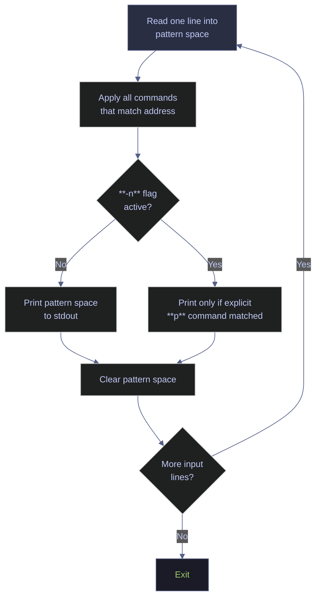

# sed — Stream Editor Reference

> [!quote]
> "Easy things should be easy, and hard things should be possible."
>
> — **Larry Wall**, *Programming Perl* (1991)

`sed` (stream editor) is a non-interactive, line-oriented text transformation tool. It processes input one line at a time, applies a sequence of editing commands, and writes results to standard output. Used by data engineers daily for log cleaning, SQL migration file edits, CSV header fixes, config file patching, and bulk in-place file edits across entire codebases.

> [!info] Scope of this note
>
> This note covers GNU sed (Linux default) and BSD sed (macOS default), with explicit callouts where behaviour differs. PowerShell equivalents are provided for every major command pattern so Windows-native pipelines are fully covered.

---


## Key terms used in this note

| Term | Plain-English definition | Why it matters here | Common mistake / confusion |
|---|---|---|---|
| `sed` (stream editor) | A command-line tool that reads input line by line, applies transformation rules (most commonly substitution), and writes the result to stdout. It does not load the entire file into memory. | The standard tool for automated text transformation in shell scripts: config edits, log cleanup, CSV header manipulation, and template processing. | Thinking sed modifies files by default -- it writes to stdout. Use `-i` for in-place editing, but always back up first (`-i.bak`). |
| Substitution (`s///`) | The most common sed command. `s/pattern/replacement/` replaces the first occurrence of `pattern` on each line. Add `g` flag for all occurrences. | The core operation for text transformation: renaming, reformatting, cleaning, and templating. | Forgetting the `g` flag -- `s/old/new/` only replaces the first match per line. |
| In-place editing (`-i`) | The `-i` flag modifies the file directly instead of writing to stdout. On macOS/BSD, `-i ''` requires an empty extension argument. | Enables automated config and data file modifications without temp files. | GNU sed `-i` and BSD/macOS sed `-i` have different syntax. GNU: `sed -i 's/.../.../'`. BSD: `sed -i '' 's/.../.../'`. Scripts must handle both. |
| Line addressing | sed can restrict commands to specific lines or line ranges: `5s/.../.../` (line 5 only), `10,20s/.../.../` (lines 10-20), `/pattern/s/.../.../` (lines matching pattern). | Target transformations to specific parts of a file without affecting the rest. | Off-by-one errors in line ranges, or forgetting that `/pattern/` matching is case-sensitive by default. |
| Hold space | An auxiliary buffer in sed. The pattern space holds the current line; the hold space is a secondary buffer for storing lines across cycles. Commands: `h` (copy to hold), `H` (append to hold), `g` (get from hold), `G` (append from hold), `x` (exchange). | Enables multi-line operations like joining lines, reversing order, and accumulating patterns. | The hold space is an advanced feature. Most sed tasks only need the pattern space. Over-using hold space makes scripts unreadable -- consider awk or Python instead. |
| Regex groups and backreferences | Parentheses `\(...\)` in BRE or `(...)` in ERE capture matched text. `\1`, `\2` reference captured groups in the replacement. | Essential for reformatting: extract parts of a line and rearrange them. | BRE (default sed) requires escaped parentheses `\(...\)`. ERE (`sed -E`) uses unescaped `(...)`. |
| `-E` (extended regex) | Enables Extended Regular Expression syntax in sed, matching `grep -E` behavior. `+`, `?`, `\|`, `()` work without backslash escaping. | Cleaner syntax for complex patterns. Available in GNU sed 4.2+ and BSD sed. | Not available in very old sed versions. Check `sed --version` for compatibility. |
| PowerShell `-replace` | The PowerShell operator for regex-based string substitution. Syntax: `$string -replace 'pattern', 'replacement'`. Uses .NET regex. | The PowerShell equivalent of sed substitution. Works on strings and pipeline objects. | `-replace` is case-insensitive by default. Use `-creplace` for case-sensitive matching. |

## What this note covers

- Basic substitution with `s///`, global flag, case-insensitive flag
- In-place file editing with `-i` and portability between GNU and BSD sed
- Line selection and addressing: by number, range, and pattern
- Deletion, insertion, and append commands
- Advanced regex with groups and backreferences
- Hold space for multi-line operations
- Data engineering scenarios: config transformation, CSV manipulation, log cleanup
- PowerShell equivalents: `-replace`, `ForEach-Object`, `Set-Content`
## How sed Works

sed reads input line by line into a working buffer called the pattern space, applies all matching commands, then prints the result. Understanding this cycle — along with addresses, flags, and the hold space — is the key to writing correct sed scripts.

### sed | stream processing model

sed operates on a cycle: for each line of input, it reads the line into the pattern space, applies all matching commands, prints the result (unless `-n` suppresses it), clears the pattern space, and repeats.



#### sed | pattern space vs hold space

| Space | Purpose |
|---|---|
| Pattern space | The current line being processed — this is where substitutions happen |
| Hold space | A persistent scratch buffer that survives across lines (advanced use) |

#### sed | invocation forms

sed can receive commands inline (`-e`), from a script file (`-f`), or as a single expression. Input comes from a file argument or from standard input via pipe.

```bash
sed 'command' file
```

```bash
sed -e 'command1' -e 'command2' file
```

```bash
sed -f script.sed file
```

Suppress default output with `-n` so only explicitly printed lines appear.

```bash
sed -n 'command' file
```

Edit the file in place with `-i` (GNU sed). Add a suffix like `.bak` to create a backup automatically.

```bash
sed -i 'command' file
```

```bash
sed -i.bak 'command' file
```

| Flag | Syntax | Description |
|---|---|---|
| `-e 'cmd'` | `sed -e 's/a/b/' -e 's/c/d/' file` | Add a command expression (multiple allowed) |
| `-f file` | `sed -f script.sed file` | Read commands from a script file |
| `-n` | `sed -n '/pat/p' file` | Suppress default output — print only with explicit `p` |
| `-i` | `sed -i 's/a/b/' file` | Edit file in place (GNU: no suffix needed; BSD: requires `''`) |
| `-i.bak` | `sed -i.bak 's/a/b/' file` | Edit in place with backup (works on both GNU and BSD) |
| `-E` / `-r` | `sed -E 's/(a|b)/c/' file` | Enable Extended Regular Expressions (ERE) |
| `--posix` | `sed --posix 's/a/b/' file` | Disable all GNU extensions (portability testing) |
| `-z` | `sed -z 's/\n/,/g' file` | Null-delimited mode — treat NUL as line separator (GNU sed) |

### sed | address types

Every sed command can be preceded by an address that controls which lines it applies to. Without an address, the command applies to every line.

| Address form | Meaning |
|---|---|
| `5` | Line 5 only |
| `$` | Last line |
| `1~2` | Every odd line (GNU sed only) |
| `0~2` | Every even line (GNU sed only) |
| `/pattern/` | Every line matching the regex |
| `5,10` | Lines 5 through 10 inclusive |
| `/start/,/end/` | From first match of `start` to next match of `end` |
| `5,/pattern/` | From line 5 to the first line matching pattern |
| `addr!` | Negate — every line NOT matching addr |

> [!tip] Zero address
>
> GNU sed supports address `0` in range `0,/pattern/` so the range can match from the very first line, even if it matches the opening pattern.

---

## Basic Substitution

The substitution command `s` is the most used sed command:

```
s/pattern/replacement/flags
```

**Pattern** is a POSIX Basic Regular Expression (BRE) by default; `sed -E` enables Extended Regular Expression (ERE).
**Replacement** is literal text plus special sequences: `&` (entire match), `\1`–`\9` (capture groups), `\n` (newline in GNU sed).
**Flags** modify behaviour.

### sed s | substitution flags

Flags follow the closing delimiter of the `s` command and modify how the substitution is applied.

| Flag | Meaning |
|---|---|
| `g` | Global — replace all occurrences on the line (default: first only) |
| `i` or `I` | Case-insensitive match (GNU sed only) |
| `N` (integer) | Replace only the Nth occurrence |
| `p` | Print the line if a substitution was made |
| `w file` | Write the line to file if a substitution was made |

### sed s | first occurrence per line (default)

Without the `g` flag, sed replaces only the first match on each line. This is the default behaviour.

```bash
sed 's/ERROR/WARN/' application.log
```

Replace only the first comma — useful for splitting a CSV at a specific column boundary.

```bash
sed 's/,/|/' data.csv
```

### sed s/g | global replacement

The `g` flag replaces all occurrences on each line. This is the flag you almost always want for bulk find-and-replace.

```bash
sed 's/old_schema/new_schema/g' migration.sql
```

Replace all tabs with four spaces.

```bash
sed 's/\t/    /g' messy.py
```

Remove all double quotes.

```bash
sed 's/"//g' quoted.csv
```

### sed s/gi | case-insensitive global replacement

The `i` (or `I`) flag enables case-insensitive matching. GNU sed only — BSD sed does not support it.

```bash
sed 's/error/WARN/gi' application.log
```

```bash
sed 's/db_host/DB_HOST/gi' legacy.conf
```

### sed s/N | replace the Nth occurrence only

An integer flag replaces only the Nth match on each line. Useful for splitting at a specific delimiter position.

Replace only the second comma on each line.

```bash
sed 's/,/|/2' three-col.csv
```

Replace only the third occurrence.

```bash
sed 's/foo/bar/3' input.txt
```

### sed s | alternative delimiters

When the pattern or replacement contains forward slashes (common in file paths, URLs, schema names), swap the `/` delimiter for any other character to avoid escaping.

Escaping every forward slash creates noise. Use `|` as the delimiter instead.

```bash
sed 's/\/var\/log\/old/\/var\/log\/new/g' paths.conf
```

```bash
sed 's|/var/log/old|/var/log/new|g' paths.conf
```

Use `#` for URLs and SQL paths, or `@` when `|` conflicts with shell pipes.

```bash
sed 's#https://old.example.com#https://new.example.com#g' bookmarks.sql
```

```bash
sed 's@/data/raw@/data/processed@g' pipeline.sh
```

> [!tip] Any byte can be a delimiter
>
> sed accepts any byte after `s` as the delimiter. Conventionally `|`, `#`, `@`, `,`, and `!` are used when the pattern contains `/`. Pick one that never appears in your pattern or replacement.

---

## In-Place Editing

By default sed writes to stdout and leaves the source file untouched. The `-i` flag edits the file in place.

> [!warning] GNU sed vs BSD sed difference
>
> **GNU sed (Linux):** `sed -i 's/old/new/g' file` — the suffix for the backup is optional. Omitting it means no backup is made.
> **BSD sed (macOS):** `sed -i '' 's/old/new/g' file` — the suffix argument is mandatory; pass an empty string `''` for no backup. Omitting the `''` causes a syntax error.
> Use `sed -i.bak` when you need behaviour identical on both platforms.

> [!success] Use sed -i.bak for cross-platform safety
> `sed -i.bak 's/old/new/g' file` creates `file.bak` as a backup and works identically on GNU sed (Linux) and BSD sed (macOS). Delete the backup with `rm file.bak` once you've verified the result.

> [!warning] sed -i replaces the file — it does not edit in place
>
> Despite the name, `sed -i` does not modify the file directly. It creates a temporary file, writes the output there, then renames it over the original. The result is a **new inode**. This silently breaks hard links (they still point to the old inode with unmodified data) and destroys symlinks (replaced with a regular file). File ownership and permissions may also change if the process runs as a different user.

> [!success] Preserve hard links by writing back into the existing inode
> Use `cat` redirection instead of `mv` to preserve the original inode:
> ```bash
> tmp=$(mktemp)
> sed 's/old/new/g' file > "$tmp" && cat "$tmp" > file && rm "$tmp"
> ```
> For symlinks on GNU sed, pass `--follow-symlinks` to edit the link target instead of replacing the link. There is no equivalent flag for hard links.

### sed -i | edit file directly (Linux / GNU sed)

On GNU sed, `-i` without a suffix edits the file in place with no backup.

```bash
sed -i 's/localhost/prod-db-host/g' application.properties
```

Multiple expressions in one in-place pass.

```bash
sed -i -e 's/old_schema/new_schema/g' -e 's/old_owner/new_owner/g' schema.sql
```

### sed -i '' | edit file directly (macOS / BSD sed)

On BSD sed, the suffix argument after `-i` is mandatory. Pass an empty string `''` for no backup.

```bash
sed -i '' 's/localhost/prod-db-host/g' application.properties
```

```bash
sed -i '' -e 's/old_schema/new_schema/g' -e 's/old_owner/new_owner/g' schema.sql
```

### sed -i.bak | create backup before editing

Adding a suffix like `.bak` creates a backup copy before modifying the file. This syntax works identically on both GNU and BSD sed.

```bash
sed -i.bak 's/old/new/g' config.yaml
```

```bash
sed -i.bak 's/localhost/10.0.0.1/g' database.conf
```

Remove backups after verifying results.

```bash
rm *.bak
```

### sed -i | edit multiple files in a single pass

sed accepts multiple file arguments and edits each one in place. For recursive directory trees, combine `find` with `xargs`.

```bash
sed -i 's/import old_module/import new_module/g' *.py
```

```bash
find . -name '*.sql' -print0 | xargs -0 sed -i 's/dbo\./schema_name\./g'
```

```bash
find ./config -name '*.yaml' -print0 | xargs -0 sed -i 's/v1\.0/v2\.0/g'
```

GNU sed accepts multiple file arguments directly.

```bash
sed -i 's/DEBUG/INFO/g' service-a.log service-b.log service-c.log
```

> [!warning] No undo for in-place edits
>
> `sed -i` modifies files immediately. Always test with `sed 's/old/new/g' file | head` before committing to `-i`. Use `-i.bak` for safety on large or critical files.

> [!success] Dry-run before using -i, use -i.bak on critical files
> Test with `sed 's/old/new/g' file | diff - file` to preview all changes before applying. Add `-i.bak` to automatically create a backup; remove it with `rm file.bak` only after confirming the result is correct.

---

## Line Selection and Addressing

Every sed command can be prefixed with an address to restrict which lines it acts on. Addresses can be line numbers, patterns, ranges, or negations. Without an address, the command applies to every line.

### sed | select by specific line number

Substitute only on line 1 — safe for fixing a CSV header without touching data rows.

```bash
sed '1s/timestamp/event_time/' events.csv
```

Substitute only on the last line.

```bash
sed '$s/old/new/' file.txt
```

Substitute on a range of lines.

```bash
sed '10,20s/old/new/g' large_file.txt
```

### sed /pattern/ | select by pattern match

A regex address applies the command only to lines matching the pattern.

```bash
sed '/ERROR/s/localhost/prod-host/g' app.log
```

```bash
sed '/^SELECT/s/dbo\./reporting\./g' queries.sql
```

#### Delete all lines matching a pattern

```bash
sed '/^#/d' config.conf
```

```bash
sed '/^$/d' data.csv
```

```bash
sed '/^[[:space:]]*$/d' data.txt
```

### sed /start/,/end/ | select by pattern range

A range address applies the command from the first line matching `start` through the next line matching `end` (inclusive).

```bash
sed '/BEGIN TRANSACTION/,/COMMIT/s/old_table/new_table/g' migration.sql
```

Delete everything between (and including) marker lines.

```bash
sed '/<!-- START REMOVE -->/,/<!-- END REMOVE -->/d' template.html
```

Strip the header block — lines 1 through the first blank line.

```bash
sed '1,/^$/d' report.txt
```

### sed addr! | negation (operate on non-matching lines)

The `!` suffix inverts the address — the command applies to every line that does NOT match.

Delete all lines that do NOT contain `ERROR` or `WARN` (keep only those two).

```bash
sed '/ERROR\|WARN/!d' app.log
```

Apply substitution to every line except the header (line 1).

```bash
sed '1!s/,/|/g' data.csv
```

Apply substitution to every line that does not start with `#`.

```bash
sed '/^#/!s/old/new/g' config.file
```

### sed 1~N | step addressing (GNU sed only)

The `first~step` syntax selects lines at regular intervals. `1~2` selects every odd line, `2~2` every even line.

```bash
sed -n '1~2p' file.txt
```

```bash
sed -n '2~2p' file.txt
```

Every 5th line.

```bash
sed -n '0~5p' file.txt
```

Keep the CSV header (line 1) plus all even-numbered data rows.

```bash
sed -n '1p; 0~2p' data.csv
```

---

## Deletion, Insertion, and Append

Beyond substitution, sed provides commands for removing lines (`d`), inserting text before a line (`i`), appending text after a line (`a`), and replacing an entire line (`c`). These commands use the same addressing as substitution.

### sed d | delete lines

The `d` command removes lines from the output. Combine with addresses to target specific lines, patterns, or ranges.

```bash
sed '/^DEBUG/d' verbose.log
```

Delete the first 5 lines (skip a header block).

```bash
sed '1,5d' file.txt
```

Delete the last line.

```bash
sed '$d' file.txt
```

Delete all blank lines.

```bash
sed '/^$/d' file.txt
```

Delete trailing whitespace from every line (the line itself stays).

```bash
sed 's/[[:space:]]*$//' file.txt
```

Delete lines that contain only whitespace.

```bash
sed '/^[[:space:]]*$/d' file.txt
```

Delete lines between two patterns (inclusive).

```bash
sed '/^---BEGIN---/,/^---END---/d' report.md
```

### sed i | insert before a line

The `i` command inserts text before the addressed line.

```bash
sed '3i\This is inserted before line 3' file.txt
```

Insert a comment before every CREATE TABLE statement.

```bash
sed '/^CREATE TABLE/i\-- Migration: run as data_owner' schema.sql
```

Insert a blank line before every section header.

```bash
sed '/^## /i\\' document.md
```

### sed a | append after a line

The `a` command appends text after the addressed line.

```bash
sed '3a\This is appended after line 3' file.txt
```

Append after the last line.

```bash
sed '$a\-- End of migration script' migration.sql
```

Append after every line matching a pattern.

```bash
sed '/^COMMIT/a\-- Transaction complete' script.sql
```

### sed c | replace an entire line

The `c` command replaces the entire matching line with the provided text.

```bash
sed '/^DB_HOST=.*/c\DB_HOST=prod-db.internal' .env
```

Replace line 1 entirely (e.g., rewrite a shebang).

```bash
sed '1c\#!/usr/bin/env python3' old_script.py
```

Replace the last line.

```bash
sed '$c\-- generated by migration tool' migration.sql
```

---

## Advanced Substitution with Regex

sed's substitution command gains precision through capture groups, back-references, and the `&` token. BRE (default) requires `\(` and `\)` for grouping; ERE via `sed -E` uses unescaped `(` and `)` and adds `+`, `?`, and `|`.

### sed | BRE vs ERE quick comparison

| Feature | BRE (default) | ERE (`sed -E`) |
|---|---|---|
| Grouping | `\(` and `\)` | `(` and `)` |
| Back-references | `\1` – `\9` | `\1` – `\9` |
| One or more | `\+` (GNU only) or `\{1,\}` | `+` |
| Zero or one | `\?` (GNU only) | `?` |
| Alternation | `\|` (GNU only) | `\|` |
| Repetition | `\{n,m\}` | `{n,m}` |
| Named groups | Not supported | Not supported |

> [!tip] Prefer ERE for readability
>
> Unless you need strict POSIX BRE portability, use `sed -E` for all regex work. ERE avoids the backslash noise of BRE grouping and quantifiers, making patterns significantly easier to read and maintain.

### sed | capture groups and back-references (BRE)

In basic regex mode (default, no `-E`), group with `\(` and `\)` and back-reference with `\1`, `\2`.

#### Swap key and value around an equals sign

Input: `name=Alice` → Output: `Alice=name`

```bash
sed 's/\(.*\)=\(.*\)/\2=\1/' keyvalue.txt
```

#### Reformat a date from YYYY-MM-DD to DD/MM/YYYY

Input: `2024-03-15` → Output: `15/03/2024`

```bash
sed 's/\([0-9]\{4\}\)-\([0-9]\{2\}\)-\([0-9]\{2\}\)/\3\/\2\/\1/' dates.txt
```

#### Wrap a captured value in quotes

Input: `DB_NAME=analytics` → Output: `DB_NAME="analytics"`

```bash
sed 's/\(DB_NAME=\)\(.*\)/\1"\2"/' config.env
```

#### Prefix captured table names with a schema

Input: `FROM orders WHERE` → Output: `FROM dw.orders WHERE`

```bash
sed 's/FROM \([a-z_]*\)/FROM dw.\1/g' query.sql
```

### sed -E | extended regex (ERE)

With `sed -E`, use `(` and `)` without backslashes, and gain `+`, `?`, `|`, `{n,m}`. Named groups are NOT supported by sed — use positional `\1`, `\2`.

#### Alternation — replace either pattern

```bash
sed -E 's/(foo|bar)/baz/g' input.txt
```

#### Match one or more digits

```bash
sed -E 's/[0-9]+/NUM/g' log.txt
```

#### Optional character

Matches both `colour` and `color`.

```bash
sed -E 's/colou?r/color/g' british.txt
```

#### Capture and repeat the first word

```bash
sed -E 's/^([a-z]+).*/\1 \1/' file.txt
```

#### Reformat log lines — extract level and message

Input: `[2024-03-15 12:00:00] [ERROR] Something failed` → Output: `ERROR: Something failed`

```bash
sed -E 's/^\[[^]]+\] \[([A-Z]+)\] (.*)/\1: \2/' app.log
```

### sed & | the entire-match replacement token

`&` in the replacement string stands for the entire matched text. Use it to wrap matches without restating the pattern.

#### Wrap every number in square brackets

```bash
sed 's/[0-9]\+/[&]/g' numbers.txt
```

#### Quote every capitalised word

```bash
sed 's/[A-Z][a-z]*/\"&\"/g' proper_nouns.txt
```

#### Surround each CSV value with single quotes

```bash
sed "s/[^,]*/'&'/g" flat.csv
```

#### Add parentheses around matched IP addresses

```bash
sed -E 's/([0-9]{1,3}\.){3}[0-9]{1,3}/(&)/g' access.log
```

> [!warning] `\n` in replacement string — GNU sed only
>
> Using `\n` to insert a newline in the replacement side of `s///` works in GNU sed but **not in BSD sed** (macOS). BSD sed treats `\n` on the replacement side as a literal backslash followed by `n`. This is one of the most common portability traps when writing sed substitutions.

> [!success] Portable newline insertion in replacement strings
> Use a literal newline escaped with a backslash (the newline must appear on the next physical line of the script):
> ```bash
> sed 's/pattern/replacement\
> /' file.txt
> ```
> Or in bash, use ANSI-C quoting to embed a newline:
> ```bash
> sed 's/pattern/replacement'"$'\n'"'/' file.txt
> ```

---

## Print, Quiet Mode, and Line Extraction

The `-n` flag suppresses sed's default "print every line" behaviour. Combined with the `p` command, this lets sed act as a selective extractor — printing only lines that match an address or were modified by a substitution.

### sed -n p | print matching lines

Print only lines matching a pattern (equivalent to `grep`).

```bash
sed -n '/ERROR/p' app.log
```

#### Print a specific line or range

```bash
sed -n '5p' file.txt
```

```bash
sed -n '5,10p' file.txt
```

#### Print from a pattern to the end of the file

```bash
sed -n '/START SECTION/,$p' report.txt
```

#### Print lines between two patterns (inclusive)

```bash
sed -n '/BEGIN/,/END/p' script.sql
```

#### Extract a value from key=value

Combine `-n` with `s///p` to match, transform, and print in one pass. Input: `DB_HOST=prod-db.internal` → Output: `prod-db.internal`.

```bash
sed -n 's/^DB_HOST=//p' .env
```

#### Print line numbers alongside matching lines

The `=` command prints the current line number. Use braces to combine `=` and `p` under one address.

```bash
sed -n '/ERROR/{=; p}' app.log
```

> [!tip] sed as a grep replacement
>
> `sed -n '/pattern/p'` is equivalent to `grep 'pattern'`. The advantage is that you can chain it with substitutions in the same pass — e.g., find lines matching a pattern AND transform them simultaneously.

---

## Multi-Command and Script Files

sed can apply multiple commands in a single pass through the file using `-e` flags, semicolons, or external script files. Braces `{}` group multiple commands under a single address.

### sed -e | multiple expressions

Each `-e` flag adds a command. All commands are applied in order during a single pass through the file.

```bash
sed -e 's/\r$//' -e 's/[[:space:]]*$//' windows_file.txt
```

Three operations in one pass: fix schema, fix owner, add a comment header.

```bash
sed -e 's/dbo\./reporting\./g' \
    -e 's/sa/data_owner/g' \
    -e '1i\-- Patched by migration script' \
    schema.sql
```

Remove comments and blank lines from a config.

```bash
sed -e '/^#/d' -e '/^$/d' application.conf
```

### sed -f | script files

For complex or reusable transformations, write commands in a `.sed` file.

```sed
# normalize-log.sed
# Remove ANSI escape codes
s/\x1b\[[0-9;]*m//g
# Convert CRLF to LF
s/\r$//
# Normalise log level labels
s/\[INFORMATION\]/[INFO]/g
s/\[WARNING\]/[WARN]/g
# Strip trailing whitespace
s/[[:space:]]*$//
# Delete debug lines
/\[DEBUG\]/d
```

```bash
# Apply the script file
sed -f normalize-log.sed raw.log > clean.log

# Apply in-place
sed -i -f normalize-log.sed raw.log
```

### sed {} | combining addresses and commands with braces

Braces group multiple commands under a single address. All commands inside the braces apply only to lines matching the outer address.

Apply multiple substitutions only to lines containing `ERROR`.

```bash
sed '/ERROR/ {
  s/old_host/new_host/g
  s/port 5432/port 5433/g
}' app.log
```

Within a line range, delete comments and perform a substitution.

```bash
sed '/BEGIN_BLOCK/,/END_BLOCK/ {
  /^#/d
  s/old/new/g
}' mixed.conf
```

---

## Hold Space — Advanced Multi-Line Operations

The hold space lets sed carry information across line boundaries.

| Command | Action |
|---|---|
| `h` | Copy pattern space to hold space (overwrite) |
| `H` | Append pattern space to hold space |
| `g` | Copy hold space to pattern space (overwrite) |
| `G` | Append hold space to pattern space |
| `x` | Exchange pattern space and hold space |

#### Reverse the order of two consecutive lines

Hold line N, read line N+1, print N+1 first, then print N.

```bash
sed -n 'h; n; p; g; p' pairs.txt
```

#### Delete duplicate consecutive lines

Keep the first occurrence of each duplicated pair.

```bash
sed '$!N; /^\(.*\)\n\1$/!P; D' file.txt
```

#### Join every pair of lines with a comma

`N` appends the next line into the pattern space, separated by `\n`.

```bash
sed 'N; s/\n/,/' pairs.txt
```

#### Append a blank line after every 5th line

`G` appends the (empty) hold space to the pattern space, adding a blank line. GNU sed only.

```bash
sed '5~5G' long_file.txt
```

#### Print the line before a pattern match

Store every non-matching line in the hold space with `h`. When a match is found, exchange (`x`) to retrieve the previous line, print it, exchange back, and print the match. This is useful for seeing context — for example, a function name or section header that precedes an error.

```bash
sed -n '/ERROR/!{h;d}; /ERROR/{x;p;x;p}' app.log
```

For an employee file where titles follow names, print the name line preceding every `Manager` title.

```bash
sed -n '/Manager/!h; /Manager/{x;p;x;p}' employees.txt
```

> [!info] Hold space is advanced
>
> Most day-to-day sed work never touches the hold space. It becomes useful for multi-line context operations where awk or Python would be cleaner. If a hold-space solution is hard to read, prefer `awk` or a short Python script.

---

## Additional sed Commands

sed has several commands beyond `s`, `d`, `i`, `a`, and `c` that handle transliteration, early exit, file I/O, and multi-line operations.

### sed q | quit after first match

The `q` command stops processing immediately after the current line. Useful for extracting the first match from a large file without reading the rest.

```bash
sed -n '/ERROR/{p; q}' huge_app.log
```

Print only the first 10 lines (equivalent to `head -10`).

```bash
sed '10q' file.txt
```

### sed y | transliterate characters

The `y` command performs character-by-character replacement (like `tr`). Every character in the first set is replaced by the corresponding character in the second set.

```bash
sed 'y/abc/ABC/' file.txt
```

Convert all lowercase letters to uppercase (GNU sed also supports `\U` in substitution).

```bash
sed 'y/abcdefghijklmnopqrstuvwxyz/ABCDEFGHIJKLMNOPQRSTUVWXYZ/' file.txt
```

### sed r, w | read and write files

The `r` command reads a file and inserts its contents after the addressed line. The `w` command writes the pattern space to a file.

#### Insert a file's contents after a marker line

```bash
sed '/INSERT_HEADER_HERE/r header.sql' template.sql
```

#### Write matching lines to a separate file

```bash
sed -n '/ERROR/w errors.log' app.log
```

### sed N, P, D | multi-line operations

These commands extend sed beyond single-line processing by manipulating the pattern space across line boundaries.

| Command | Action |
|---|---|
| `N` | Append next input line to pattern space (separated by `\n`) |
| `P` | Print up to the first `\n` in the pattern space |
| `D` | Delete up to the first `\n` in the pattern space, then restart cycle |

#### Join a continuation line to the previous line

If a line ends with `\`, append the next line and remove the backslash-newline.

```bash
sed -e :a -e '/\\$/N; s/\\\n//; ta' continuation.txt
```

#### Delete blank lines that follow other blank lines (squeeze)

```bash
sed '/^$/N; /^\n$/d' file.txt
```

### sed Commands Reference

| Command | Syntax | Description |
|---|---|---|
| `s` | `s/pat/rep/flags` | Substitute — replace pattern with replacement |
| `d` | `[addr]d` | Delete the pattern space; start next cycle |
| `p` | `[addr]p` | Print the pattern space |
| `i` | `[addr]i\text` | Insert text before the addressed line |
| `a` | `[addr]a\text` | Append text after the addressed line |
| `c` | `[addr]c\text` | Replace the addressed line with text |
| `q` | `[addr]q` | Quit — exit sed after printing the current line |
| `Q` | `[addr]Q` | Quit — exit sed without printing (GNU sed) |
| `y` | `y/src/dst/` | Transliterate characters (like `tr`) |
| `r` | `[addr]r file` | Read file and append its contents after the addressed line |
| `w` | `[addr]w file` | Write the pattern space to file |
| `=` | `[addr]=` | Print the current line number |
| `l` | `[addr]l` | Print the pattern space unambiguously (show non-printable chars) |
| `n` | `[addr]n` | Read next line into pattern space (replacing current) |
| `N` | `[addr]N` | Append next line to pattern space (separated by `\n`) |
| `P` | `[addr]P` | Print up to first `\n` in pattern space |
| `D` | `[addr]D` | Delete up to first `\n`, restart cycle |
| `h` | `[addr]h` | Copy pattern space to hold space (overwrite) |
| `H` | `[addr]H` | Append pattern space to hold space |
| `g` | `[addr]g` | Copy hold space to pattern space (overwrite) |
| `G` | `[addr]G` | Append hold space to pattern space |
| `x` | `[addr]x` | Exchange pattern space and hold space |
| `b label` | `[addr]b label` | Branch (jump) to label |
| `t label` | `[addr]t label` | Branch to label if a substitution was made |
| `: label` | `: label` | Define a label for `b` and `t` branching |

---

## Data Engineering Scenarios

This section covers the patterns data engineers reach for most often. Every command is production-ready.

### sed | fix CSV headers

All edits target line 1 only (`1s/`) to leave data rows untouched.

#### Rename a single column header

```bash
sed '1s/timestamp/event_time/' events.csv
```

#### Rename multiple headers in one pass

```bash
sed '1s/ts/timestamp/; 1s/uid/user_id/; 1s/val/value/' raw.csv
```

#### Lowercase all header names

`\L` lowercases the entire match (GNU sed only).

```bash
sed '1s/.*/\L&/' data.csv
```

#### Add a new column header at the end

```bash
sed '1s/$/,loaded_at/' incremental.csv
```

#### Remove a trailing comma from the header

A common export artifact.

```bash
sed '1s/,$//' exported.csv
```

> [!warning] CSV with quoted fields
>
> sed operates on raw text and does not understand CSV quoting rules. If your CSV has quoted fields that may contain commas or newlines, use Python's `csv` module or `awk` with FPAT instead.

> [!success] Use Python csv module or awk FPAT for quoted CSV fields
> For CSV files with quoted fields: Python `csv.reader()` handles RFC 4180 quoting correctly. In awk, `FPAT='([^,]*)|("[^"]+")` splits fields respecting double-quoted values containing commas. Use sed only for simple unquoted CSV transformations.

### Remove BOM from UTF-8 Files

Many Windows tools add a Byte Order Mark (BOM: `EF BB BF`) to UTF-8 files. This breaks `head` comparisons, SQL loaders, and Python readers.

```bash
sed -i '1s/^\xEF\xBB\xBF//' file_with_bom.csv
```

Verify the BOM is gone (should show no output if clean).

```bash
head -c 3 file_with_bom.csv | xxd
```

Remove BOM from all CSV files in a directory.

```bash
find . -name '*.csv' -print0 | xargs -0 sed -i '1s/^\xEF\xBB\xBF//'
```

### sed | strip trailing whitespace

Remove trailing spaces and tabs from every line. Common as a pre-commit cleanup step.

```bash
sed 's/[[:space:]]*$//' file.py
```

In-place across multiple file types.

```bash
sed -i 's/[[:space:]]*$//' *.py *.sql *.yaml
```

POSIX portable alternative (avoids `[[:space:]]` where not supported).

```bash
sed 's/[ \t]*$//' file.txt
```

### sed | convert Windows line endings (CRLF → LF)

Remove the carriage return (`\r`) from the end of each line. Windows editors and tools write CRLF; Linux and macOS expect LF.

```bash
sed 's/\r$//' windows_export.csv
```

In-place conversion.

```bash
sed -i 's/\r$//' windows_export.csv
```

Process all SQL files recursively.

```bash
find . -name '*.sql' -print0 | xargs -0 sed -i 's/\r$//'
```

> [!tip] dos2unix shortcut
>
> If `dos2unix` is installed, `dos2unix file.txt` is shorter. Use sed when `dos2unix` is unavailable (containers, minimal images) or when you need to combine CRLF conversion with other transforms in one pass.

### sed | add prefix or suffix to every line

Use `^` to anchor a prefix at the start and `$` to anchor a suffix at the end.

#### Wrap each line as a SQL INSERT values row

```bash
sed "s/^/INSERT INTO events (data) VALUES ('/; s/$/');" raw_values.txt
```

#### Indent every line with a tab

```bash
sed 's/^/\t/' subquery.sql
```

#### Add a suffix comment

```bash
sed 's/$/ -- auto-generated/' generated.sql
```

#### Build a SQL IN list from filenames

```bash
sed "s/^/'/; s/$/',/" filenames.txt
```

### sed | comment and uncomment lines in config files

Comment out lines by prefixing `# `. Uncomment by removing the leading `#` and optional space.

```bash
sed -i '/debug/s/^/# /' airflow.cfg
```

```bash
sed -i 's/^# *//' commented_block.conf
```

Uncomment only lines matching a specific pattern.

```bash
sed -i '/^#.*MAX_CONNECTIONS/s/^#[[:space:]]*//' postgresql.conf
```

Comment out a specific named key.

```bash
sed -i 's/^\(LOG_LEVEL=\)/#\1/' .env
```

### sed | extract values from key=value config files

Combine `-n` with `s///p` to strip the key prefix and print only the value.

```bash
sed -n 's/^DB_HOST=//p' .env
```

Extract multiple keys in one pass.

```bash
sed -n -e 's/^DB_HOST=//p' -e 's/^DB_PORT=//p' .env
```

Extract and export as a shell variable.

```bash
eval "$(sed -n 's/^DB_HOST=\(.*\)/DB_HOST=\1/p' .env)"
```

Handle keys with surrounding whitespace.

```bash
sed -n 's/^[[:space:]]*DB_HOST[[:space:]]*=[[:space:]]*//p' .env
```

### sed | modify SQL migration files

Common transforms for database migrations: schema renames, function replacements, and identifier format conversion.

```bash
sed -i 's/\bdbo\b/reporting/g' migration_v2.sql
```

Add a schema prefix to table names in FROM and JOIN clauses.

```bash
sed -i -E 's/(FROM|JOIN)[[:space:]]+([a-z_]+)/\1 staging.\2/gi' etl.sql
```

Replace a deprecated function name.

```bash
sed -i 's/GETDATE()/CURRENT_TIMESTAMP/g' stored_procs.sql
```

Update a database name reference.

```bash
sed -i 's/USE \[OldDatabase\]/USE [NewDatabase]/g' *.sql
```

Strip SQL Server square brackets and replace with BigQuery backticks.

```bash
sed -i 's/\[\([^]]*\)\]/`\1`/g' mssql_to_bq.sql
```

Add schema qualification to bare table names.

```bash
sed -E -i 's/\bFROM ([a-z_]+)\b/FROM myschema.\1/g' query.sql
```

### sed | fix YAML frontmatter

Repair Obsidian and Hugo frontmatter — tag formatting, date updates, and field manipulation.

Remove accidental `#` prefixes from tags within the `tags:` block.

```bash
sed -i '/^tags:/,/^[^[:space:]]/ s/#//g' note.md
```

Remove spaces after commas in a tags list.

```bash
sed -i 's/tags: \[/tags: [/; s/, /,/g' note.md
```

Update the `updated` date to today.

```bash
sed -i "s/^updated: .*/updated: $(date +%Y-%m-%d)/" note.md
```

Remove a frontmatter field entirely.

```bash
sed -i '/^draft: /d' published_note.md
```

Add a `status` field after the `type` field.

```bash
sed -i '/^type: /a\status: complete' note.md
```

### Clean Log Files — Strip ANSI Colour Codes

ANSI escape sequences appear as `\e[31m` (red), `\e[0m` (reset), etc. They corrupt log parsing and grep output.

```bash
sed 's/\x1b\[[0-9;]*[mGKHF]//g' coloured.log
```

In-place strip.

```bash
sed -i 's/\x1b\[[0-9;]*[mGKHF]//g' app.log
```

More aggressive variant — strip any ESC sequence.

```bash
sed 's/\x1b\[[0-9;]*[a-zA-Z]//g; s/\x1b[^[]*\[[0-9;]*[a-zA-Z]//g' log.txt
```

### sed | transform date formats in data files

Use capture groups to rearrange date components between formats.

#### US date MM/DD/YYYY → ISO 8601 YYYY-MM-DD

```bash
sed -E 's|([0-9]{2})/([0-9]{2})/([0-9]{4})|\3-\1-\2|g' us_dates.csv
```

#### ISO date → BigQuery DATETIME literal

```bash
sed -E "s/([0-9]{4}-[0-9]{2}-[0-9]{2})/DATETIME '\1'/g" bq_query.sql
```

#### Remove time component from datetime

```bash
sed -E 's/([0-9]{4}-[0-9]{2}-[0-9]{2})T[0-9:]+Z?/\1/g' events.jsonl
```

#### Replace epoch timestamps with a placeholder

```bash
sed -E 's/[0-9]{10}/EPOCH_TS/g' raw.json
```

### sed | bulk rename patterns in Terraform files

Recursive find-and-replace across `.tf` files using `find | xargs sed -i`.

```bash
find . -name '*.tf' -print0 | xargs -0 sed -i 's/google_bigquery_dataset_access/google_bigquery_dataset_iam_binding/g'
```

```bash
find . -name '*.tf' -print0 | xargs -0 sed -i 's/var\.project_id/var.gcp_project_id/g'
```

```bash
sed -i 's|source = "./modules/old-name"|source = "./modules/new-name"|g' main.tf
```

```bash
sed -i 's/required_version = ">= 1\.3"/required_version = ">= 1.6"/' versions.tf
```

Replace a hardcoded region with a variable reference.

```bash
find . -name '*.tf' -print0 | xargs -0 sed -i 's/"europe-west1"/var.region/g'
```

### sed | sanitise PII from log output

Regex-based redaction for local log inspection. Replace identifiable patterns with placeholders before sharing or uploading log files.

#### Redact email addresses

```bash
sed -E 's/[a-zA-Z0-9._%+-]+@[a-zA-Z0-9.-]+\.[a-zA-Z]{2,}/EMAIL_REDACTED/g' app.log
```

#### Redact key=value pairs for sensitive keys

```bash
sed 's/password=[^ &]*/password=REDACTED/g' access.log
```

```bash
sed 's/api_key=[^ &]*/api_key=REDACTED/g' api.log
```

#### Redact credit card numbers (16-digit groups)

```bash
sed -E 's/\b[0-9]{4}[[:space:]-]?[0-9]{4}[[:space:]-]?[0-9]{4}[[:space:]-]?[0-9]{4}\b/CARD_REDACTED/g' transactions.log
```

#### Redact IPv4 addresses

```bash
sed -E 's/\b([0-9]{1,3}\.){3}[0-9]{1,3}\b/IP_REDACTED/g' access.log
```

#### Redact bearer tokens

```bash
sed -E 's/Bearer [A-Za-z0-9._-]+/Bearer TOKEN_REDACTED/g' api.log
```

#### Multi-pattern PII scrub in one pass

```bash
sed -E \
  -e 's/[a-zA-Z0-9._%+-]+@[a-zA-Z0-9.-]+\.[a-zA-Z]{2,}/EMAIL_REDACTED/g' \
  -e 's/password=[^ &]*/password=REDACTED/g' \
  -e 's/Bearer [A-Za-z0-9._-]+/Bearer TOKEN_REDACTED/g' \
  raw_api.log > sanitised_api.log
```

> [!warning] PII regex is not data governance
>
> Regex-based redaction handles common patterns but will miss obfuscated or unusual formats. Use a dedicated PII detection library (e.g., Google Cloud DLP, Microsoft Presidio) for compliance-critical use cases. sed redaction is appropriate for quick local log inspection, not production pipelines.

> [!success] Use Cloud DLP or Presidio for compliance-critical redaction
> For production pipelines, Google Cloud DLP and Microsoft Presidio use ML-based detection that handles obfuscated formats, context-aware identification, and audit trails. Reserve sed redaction for local development log inspection only — never use it to gate a production data flow that must be compliant.

### sed | idempotent normalisation pipeline

Chain all cleanup operations into a single sed pass. Each transform is idempotent — running the pipeline twice produces the same output as running it once.

```bash
sed \
  -e 's/\r$//' \
  -e 's/[[:space:]]*$//' \
  -e '/^$/d' \
  -e '1s/^\xEF\xBB\xBF//' \
  raw_export.csv > normalised.csv
```

This strips CRLF line endings, trailing whitespace, blank lines, and the UTF-8 BOM in a single pass.

---

## PowerShell Equivalents

PowerShell uses the `-replace` operator, which accepts .NET regular expressions (a superset of POSIX ERE). All substitutions are regex-based by default.

> [!info] PowerShell regex is .NET regex
>
> .NET regex is more powerful than POSIX: named groups `(?<name>...)`, lookaheads, lookbehinds, and non-greedy quantifiers are all supported. The `-replace` operator is case-insensitive by default; use `-creplace` for case-sensitive matching.

### -replace | basic substitution

PowerShell's `-replace` operator replaces ALL occurrences by default (equivalent to sed's `g` flag) and is case-insensitive. Use `-creplace` for case-sensitive matching.

```powershell
(Get-Content file.txt) -replace 'old','new' | Set-Content file.txt
```

```powershell
(Get-Content file.txt) -creplace 'Old','NEW' | Set-Content file.txt
```

### -replace | in-place editing

PowerShell has no `-i` flag. Read the file, transform in memory, then write back.

```powershell
(Get-Content '.\app.properties') -replace 'DEBUG','INFO' | Set-Content '.\app.properties'
```

Create a backup before editing by copying the file first.

```powershell
Copy-Item 'schema.sql' 'schema.sql.bak'
(Get-Content 'schema.sql') -replace 'dbo\.','reporting.' | Set-Content 'schema.sql'
```

### -replace | multiple files

Iterate with `ForEach-Object` to apply the same replacement across all matching files.

```powershell
Get-ChildItem -Filter '*.py' | ForEach-Object {
    (Get-Content $_.FullName) -replace 'import old_module','import new_module' |
    Set-Content $_.FullName
}
```

Recursive across all subdirectories.

```powershell
Get-ChildItem -Recurse -Filter '*.sql' | ForEach-Object {
    (Get-Content $_.FullName) -replace 'dbo\.','schema_name.' |
    Set-Content $_.FullName
}
```

### Where-Object | line filtering (deletion)

`Where-Object` with `-notmatch` is the PowerShell equivalent of `sed '/pattern/d'`.

```powershell
(Get-Content file.log) | Where-Object { $_ -notmatch '^DEBUG' } | Set-Content clean.log
```

```powershell
(Get-Content file.txt) | Where-Object { $_ -ne '' } | Set-Content file.txt
```

Keep only matching lines (equivalent to `sed -n '/pattern/p'`).

```powershell
(Get-Content app.log) | Where-Object { $_ -match 'ERROR|WARN' } | Set-Content filtered.log
```

### Select-String | line selection and extraction

Print only lines matching a pattern.

```powershell
Select-String -Pattern 'ERROR' -Path app.log | Select-Object -ExpandProperty Line
```

Print lines 5 through 10 (PowerShell arrays are 0-indexed).

```powershell
(Get-Content file.txt)[4..9]
```

Extract a value from key=value.

```powershell
$val = (Get-Content .env | Select-String '^DB_HOST=') -replace '^DB_HOST=',''
```

### Capture Groups and Back-References

PowerShell uses `$1`, `$2` (not `\1`, `\2`) in the replacement string for capture groups.

```powershell
# Swap key and value around = sign
# Input: name=Alice  →  Output: Alice=name
(Get-Content file.txt) -replace '^(.*)=(.*)','$2=$1' | Set-Content file.txt

# Reformat date YYYY-MM-DD → DD/MM/YYYY
(Get-Content dates.txt) -replace '(\d{4})-(\d{2})-(\d{2})','$3/$2/$1' | Set-Content dates.txt

# Add schema prefix to table names after FROM
(Get-Content query.sql) -replace '(?i)\bFROM\s+(\w+)','FROM reporting.$1' | Set-Content query.sql

# Wrap matched numbers in brackets
(Get-Content numbers.txt) -replace '\d+','[$0]' | Set-Content numbers.txt
# $0 = entire match (equivalent to sed's &)
```

### [regex]::Replace() | complex patterns

For named capture groups, non-greedy matching, multiline mode, and callback replacements, use the .NET `[regex]::Replace()` method.

```powershell
$pattern = '(?<year>\d{4})-(?<month>\d{2})-(?<day>\d{2})'
$replacement = '${day}/${month}/${year}'
(Get-Content dates.txt) | ForEach-Object {
    [regex]::Replace($_, $pattern, $replacement)
} | Set-Content reformatted.txt

# Non-greedy match — use *? instead of *
(Get-Content html.txt) -replace '<.*?>','' | Set-Content stripped.txt

# Multiline mode — ^ and $ match start/end of each line
$content = Get-Content -Raw file.txt
[regex]::Replace($content, '(?m)^#.*$', '') | Set-Content cleaned.txt

# Callback replacement — run a scriptblock for each match
$content = Get-Content -Raw file.txt
$result = [regex]::Replace($content, '\d+', { param($m) [int]$m.Value * 2 })
$result | Set-Content doubled.txt
```

### -replace | CRLF to LF conversion

PowerShell is Windows-native and writes CRLF by default. Use `-Raw` to read the file as a single string and replace `\r\n` with `\n`. The `-NoNewline` switch prevents `Set-Content` from appending its own trailing newline.

```powershell
(Get-Content file.txt -Raw) -replace "`r`n","`n" | Set-Content -NoNewline file_lf.txt

# Alternative using StreamReader/StreamWriter for large files
$reader = [System.IO.StreamReader]::new('big_file.txt')
$writer = [System.IO.StreamWriter]::new('big_file_lf.txt', $false, [System.Text.Encoding]::UTF8, 65536)
$writer.NewLine = "`n"
while (-not $reader.EndOfStream) { $writer.WriteLine($reader.ReadLine()) }
$reader.Close(); $writer.Close()
```

### -replace | strip ANSI colour codes

Remove ANSI escape sequences from log output captured on Windows.

```powershell
(Get-Content coloured.log) -replace '\x1b\[[0-9;]*[mGKHF]','' | Set-Content clean.log
```

Using `[regex]` for a more flexible pattern.

```powershell
$ansi = [regex]'\x1b\[[0-9;]*[a-zA-Z]'
(Get-Content coloured.log) | ForEach-Object { $ansi.Replace($_,'') } | Set-Content clean.log
```

### -replace | PII redaction

Chain multiple `-replace` operators to scrub different PII patterns in a single pipeline pass.

```powershell
(Get-Content api.log) -replace '[a-zA-Z0-9._%+-]+@[a-zA-Z0-9.-]+\.[a-zA-Z]{2,}','EMAIL_REDACTED' |
  Set-Content sanitised.log
```

```powershell
(Get-Content app.log) |
  ForEach-Object {
    $_ -replace '[a-zA-Z0-9._%+-]+@[a-zA-Z0-9.-]+\.[a-zA-Z]{2,}','EMAIL_REDACTED' `
       -replace 'Bearer [A-Za-z0-9._-]+','Bearer TOKEN_REDACTED' `
       -replace 'password=[^ &]*','password=REDACTED'
  } | Set-Content sanitised.log
```

---

## sed vs PowerShell Comparison Table

Every sed command mapped to its closest PowerShell equivalent. Abbreviations: `GC` = `Get-Content`, `SC` = `Set-Content`, `SS` = `Select-String`, `GCI` = `Get-ChildItem`, `?{` = `Where-Object {`, `%{` = `ForEach-Object {`.

| sed command | PowerShell equivalent | Notes |
|---|---|---|
| `sed 's/old/new/g' file` | `(GC file) -replace 'old','new'` | Both replace all occurrences |
| `sed -i 's/old/new/g' file` | `(GC file) -replace 'old','new' | SC file` | PowerShell: read then write |
| `sed -i.bak 's/old/new/g' file` | `Copy-Item file file.bak; (GC file) -replace 'old','new' | SC file` | Manual backup in PS |
| `sed 's/old/new/gi' file` | `(GC file) -replace 'old','new'` | PS -replace is case-insensitive by default |
| `sed 's/old/new/' file` | `(GC file) | %{ $_ -replace 'old','new' }` | Both replace first on line (PS replaces all) |
| `sed '/pattern/d' file` | `(GC file) | ?{ $_ -notmatch 'pattern' }` | Where-Object filter |
| `sed -n '/pattern/p' file` | `(GC file) | ?{ $_ -match 'pattern' }` | Keep matching lines |
| `sed -n '5,10p' file` | `(GC file)[4..9]` | PS 0-indexed arrays |
| `sed '1d' file` | `(GC file) | Select-Object -Skip 1` | Skip first line |
| `sed '$d' file` | `(GC file) | Select-Object -SkipLast 1` | Skip last line |
| `sed 's/\(a\)\(b\)/\2\1/' file` | `(GC file) -replace '(a)(b)','$2$1'` | PS uses $1,$2; sed uses \1,\2 |
| `sed 's/.*/[&]/' file` | `(GC file) -replace '.*','[$0]'` | & in sed = $0 in PS |
| `sed -E 's/(foo|bar)/baz/' file` | `(GC file) -replace 'foo|bar','baz'` | PS regex always ERE-equivalent |
| `sed '/^$/d' file` | `(GC file) | ?{ $_ -ne '' }` | Remove blank lines |
| `sed 's/[[:space:]]*$//' file` | `(GC file) -replace '\s+$',''` | Trailing whitespace |
| `sed 's/\r$//' file` | `(GC file -Raw) -replace "\r\n","\n"` | CRLF → LF |
| `sed -n 's/^KEY=//p' file` | `(GC file | SS '^KEY=').Line -replace '^KEY=',''` | Extract config value |
| `sed '3i\new line' file` | Requires `[System.Collections.Generic.List[string]]` loop | No direct equivalent |
| `sed '3a\new line' file` | Requires list insertion loop | No direct equivalent |
| `sed '/pattern/c\replacement' file` | `(GC file) | %{ if($_ -match 'pattern'){'replacement'}else{$_} }` | Line replacement |
| `sed -n '=; p' file` | `(GC file) | %{ $n++; "$n"; $_ }` | Print line numbers |
| `sed -f script.sed file` | Script file with `ForEach-Object` blocks | No direct -f equivalent |
| `find . -name '*.sql' | xargs sed -i 's/a/b/g'` | `GCI -R -Filter '*.sql' | %{ (GC $_.FullName) -replace 'a','b' | SC $_.FullName }` | Recursive multi-file edit |

---

## Portability Notes

GNU sed (Linux default) and BSD sed (macOS default) share the same core syntax but diverge on extensions. Scripts that must run on both platforms need to avoid GNU-only features or use conditional detection.

### GNU sed vs BSD sed (macOS) Key Differences

| Feature | GNU sed (Linux) | BSD sed (macOS) |
|---|---|---|
| `-i` in-place | `sed -i 's/a/b/' file` | `sed -i '' 's/a/b/' file` (empty suffix required) |
| `\+` one-or-more | Supported | Not supported (use `\{1,\}` or `-E`) |
| `|` alternation in BRE | Supported | Not supported (use `-E`) |
| `\w`, `\d` shorthand | Supported | Not supported (use `[[:alnum:]_]`, `[0-9]`) |
| `\n` in replacement | Supported | Not supported (use `$'\n'` workaround) |
| `\L`, `\U` case conversion | Supported | Not supported |
| `0` address | Supported | Not supported |
| `1~2` step address | Supported | Not supported |

> [!tip] Cross-platform sed scripts
>
> For scripts that must run on both Linux and macOS:
> 1. Always use `-i.bak` (or handle the suffix in a conditional)
> 2. Prefer `-E` for extended regex instead of BRE `\+`, `|`
> 3. Avoid `\w`, `\d` — use POSIX classes `[[:alpha:]]`, `[0-9]`
> 4. Test on both platforms before automating

### Minimal portable one-liners

Three approaches for cross-platform in-place editing that works on both GNU and BSD sed.

#### Method 1: use .bak suffix and then delete it

```bash
sed -i.bak 's/old/new/g' file && rm file.bak
```

#### Method 2: detect OS at runtime

```bash
if [[ "$(uname)" == "Darwin" ]]; then
    sed -i '' 's/old/new/g' file
else
    sed -i 's/old/new/g' file
fi
```

#### Method 3: use a temp file (most portable)

```bash
sed 's/old/new/g' file > file.tmp && mv file.tmp file
```

---

## Character Classes Reference

POSIX character classes work in both GNU and BSD sed, unlike `\w`, `\d` shorthand.

| Class | Matches | Example |
|---|---|---|
| `[[:alpha:]]` | Letters a-z A-Z | `sed 's/[[:alpha:]]//g'` |
| `[[:digit:]]` | Digits 0-9 | `sed 's/[[:digit:]]//g'` |
| `[[:alnum:]]` | Letters and digits | `sed 's/[[:alnum:]]//g'` |
| `[[:space:]]` | Space, tab, newline, etc. | `sed 's/[[:space:]]//g'` |
| `[[:blank:]]` | Space and tab only | `sed 's/[[:blank:]]//g'` |
| `[[:upper:]]` | Uppercase letters | `sed 's/[[:upper:]]/X/g'` |
| `[[:lower:]]` | Lowercase letters | `sed 's/[[:lower:]]/x/g'` |
| `[[:punct:]]` | Punctuation characters | `sed 's/[[:punct:]]//g'` |
| `[[:print:]]` | Printable characters | `sed '/[^[:print:]]/d'` |
| `[[:graph:]]` | Printable non-space characters | — |

---

## Quick Reference Card

A condensed cheat sheet of the most common sed commands, addresses, and flags. See the sections above for full explanations and examples.

```text
SUBSTITUTION
  s/pat/rep/       Replace first match per line
  s/pat/rep/g      Replace all matches per line
  s/pat/rep/2      Replace 2nd match per line
  s/pat/rep/gi     Case-insensitive, all matches
  s/pat/rep/p      Replace and print if changed

DELETION
  /pat/d           Delete lines matching pat
  1,5d             Delete lines 1-5
  /a/,/b/d         Delete from line matching a to line matching b
  /^$/d            Delete blank lines

INSERTION
  3i\text          Insert text before line 3
  3a\text          Append text after line 3
  /pat/c\text      Replace entire matching line with text

ADDRESSING
  5                Line 5 only
  $                Last line
  /pat/            Lines matching pat
  5,10             Lines 5 through 10
  /a/,/b/          Lines from match of a to match of b
  addr!            Negate address

PRINT / EXTRACT
  -n '/pat/p'      Print only matching lines (like grep)
  -n '5,10p'       Print lines 5-10
  -n 's/^KEY=//p'  Extract value from key=value

FLAGS
  -n               Suppress default output
  -i               In-place edit (GNU: no suffix; BSD: requires '')
  -i.bak           In-place with backup
  -e 'cmd'         Add expression (multiple allowed)
  -E               Extended regex (ERE)
  -f file          Read commands from file

SPECIAL REPLACEMENT TOKENS
  &                Entire matched text
  \1 ... \9        Capture group back-references (BRE)
  $1 ... $9        Capture group back-references (PowerShell -replace)
```

---

## When to Use sed vs awk

Both sed and awk are stream-processing tools from the Unix text-processing tradition, but they solve different problems. sed is a line-oriented editor — it excels at find-and-replace, deletion, and insertion. awk is a field-oriented record processor — it excels at columnar data extraction, arithmetic, and formatted reports. Knowing which tool to reach for avoids writing brittle, over-complex scripts.

> [!question] sed or awk?
>
> **Choose sed when:**
> - Substituting, deleting, or inserting text by line or pattern
> - In-place file editing across one or many files (`-i`)
> - Simple regex transformations (rename, reformat, redact)
> - Single-pass text cleanup (CRLF, BOM, whitespace, ANSI codes)
>
> **Choose awk when:**
> - Splitting lines into fields by a delimiter (`-F`)
> - Performing arithmetic on column values (sums, averages, counts)
> - Producing formatted reports or aggregations
> - Conditional logic more complex than address matching
>
> **Choose Python or Perl when:**
> - Multi-line context makes hold-space scripts unreadable
> - CSV files have quoted fields containing commas or newlines
> - Complex state machines, data structures, or external API calls are needed
>
> — *Sed & awk*, Dale Dougherty & Arnold Robbins (O'Reilly)

---


## When to use sed

- **Automated config file edits** -- `sed -i 's/DB_HOST=.*/DB_HOST=10.132.0.2/' config.env` updates a setting in place without opening an editor.
- **CSV header manipulation** -- `sed '1s/old_header/new_header/' data.csv` renames a column header without touching the data rows.
- **Log cleanup** -- `sed '/^$/d' app.log` removes blank lines. `sed 's/\x1b\[[0-9;]*m//g'` strips ANSI color codes.
- **Template processing** -- `sed "s/{{DB_HOST}}/$DB_HOST/g" template.conf > config.conf` generates config files from templates.
- **Quick one-liner transformations** -- sed is the fastest tool for simple find-and-replace operations on the command line.

## When not to use sed

- **Field-based data processing** -- if you need to work with specific CSV columns (split by delimiter, reorder, aggregate), use `awk` or a dataframe tool. sed works on patterns within lines, not on structured fields.
- **Complex multi-line transformations** -- the hold space enables multi-line operations but makes scripts difficult to read and debug. Use `awk` or Python for complex multi-line logic.
- **JSON, XML, or structured data** -- sed treats everything as text. Use `jq` for JSON, `xmlstarlet` for XML, and language-specific parsers for structured formats.
- **Large-scale data transformation** -- sed is a stream processor designed for text manipulation, not a data processing engine. For transformations on millions of rows, use SQL, Polars, or Spark.

## Warnings

> [!danger] `sed -i` without a backup extension is irreversible
>
> `sed -i 's/old/new/g' file.txt` modifies the file in place with no backup. If the substitution is wrong, the original content is lost. Always use `sed -i.bak` to create a backup, or pipe to a new file first: `sed 's/old/new/g' file.txt > file_new.txt`.

> [!warning] GNU sed and BSD/macOS sed have different `-i` syntax
>
> GNU sed: `sed -i 's/.../.../' file`. BSD sed: `sed -i '' 's/.../.../' file` (requires an empty extension argument). Portable scripts must detect the sed variant or avoid `-i` entirely.

> [!warning] `s/old/new/` only replaces the first match per line
>
> Without the `g` flag, sed substitutes only the first occurrence of the pattern on each line. This is a common source of incomplete transformations. Always add `g` unless you specifically want first-match-only behavior.

> [!warning] sed regex is BRE by default
>
> In Basic Regular Expressions, `+`, `?`, `|`, and `()` must be escaped: `\+`, `\?`, `\|`, `\(...\)`. Use `sed -E` for Extended Regular Expressions where these work without escaping.

## Recommendations

| Scenario | Recommendation |
|---|---|
| Simple find-and-replace | `sed 's/old/new/g' file` for stdout; `sed -i.bak 's/old/new/g' file` for in-place with backup. |
| Delete lines matching a pattern | `sed '/pattern/d' file`. |
| Delete blank lines | `sed '/^$/d' file`. |
| Replace only on specific lines | `sed '10,20s/old/new/g' file` for a line range. `sed '/^#/s/old/new/g' file` for pattern-matched lines. |
| Extract a range of lines | `sed -n '10,20p' file` -- quiet mode + print. |
| Strip ANSI color codes | `sed 's/\x1b\[[0-9;]*m//g' file`. |
| Portable in-place editing | Pipe to a temp file and rename: `sed 's/.../.../' file > tmp && mv tmp file`. |
| PowerShell equivalent | `(Get-Content file) -replace 'old', 'new' \| Set-Content file`. |

## Troubleshooting

| Symptom | Likely cause | Fix |
|---|---|---|
| Substitution only replaces the first match per line | Missing `g` flag. | Use `s/old/new/g` to replace all occurrences on each line. |
| `sed -i` fails on macOS with "invalid command code" | BSD sed requires an extension argument after `-i`. | Use `sed -i '' 's/.../.../' file` on macOS, or `sed -i.bak` for portability. |
| Regex `+` or `\|` does not work | sed defaults to BRE where these must be escaped. | Use `sed -E` for extended regex, or escape: `\+`, `\|`. |
| sed command modifies more lines than expected | Pattern matches more broadly than intended. Missing anchors or too-broad regex. | Add `^` and `$` anchors. Use line addressing to restrict the scope. |
| In-place edit corrupted the file | Wrong substitution with no backup. | Restore from `file.bak` if `-i.bak` was used. Otherwise, use `git checkout -- file` if version-controlled. |
| sed is slow on a very large file | sed processes line-by-line but the file may have millions of lines. | For simple fixed-string replacements, use `sed` with `-F` (GNU sed 4.9+) or `perl -pi -e` which is often faster on very large files. |
## Cross-references

- [reading-file-contents](https://alp78.github.io/elysium/01-Shell/Text-Processing/reading-file-contents) — Reading files with cat, head, tail, less
- [awk-data-processing](https://alp78.github.io/elysium/01-Shell/Text-Processing/awk-data-processing) — awk for column-based processing and multi-line operations
- [grep-and-pattern-matching](https://alp78.github.io/elysium/01-Shell/Text-Processing/grep-and-pattern-matching) — grep for pattern searching and filtering
