# awk — Data Processing

> [!quote]+
>
> "The goal was to see how much of programming we could stuff into one line."
>
> — **Brian Kernighan** (co-creator of awk)

> [!abstract]- Summary
> awk is a record-and-field language for turning line-oriented text into structured output without writing a full general-purpose program.
>
> - Use `-F` or `FS` to define field boundaries, `$1` through `$NF` to address fields, and `BEGIN` or `END` for setup and final summaries.
> - Reach for awk when the job needs field extraction, arithmetic, grouping, deduplication, or lightweight state across records.
> - Prefer `sed` for pure line substitutions and in-place edits, and escalate to CSV-aware tools or Python for quoted or nested data.
> - The Linux examples below were verified in WSL Ubuntu with GNU Awk 5.2.1, and the Windows equivalents were verified in PowerShell 7.5.5.
> - The retained tables are compact lookup aids for variables, flags, character classes, arithmetic helpers, and awk-versus-PowerShell task mapping.

> [!note]- Glossary
>
> **`awk`**
> - A pattern-action language for reading input record by record, splitting records into fields, and running code when a pattern matches.
> - It is strongest at one-pass text processing, column extraction, aggregation, and report generation in shell pipelines.
> - GNU awk (`gawk`) is standard on most Linux systems; macOS ships a BSD-derived awk, so GNU-only features such as `gensub()` need `gawk`.
>
> ---
>
> **Field (`$1`, `$2`, ... , `$NF`)**
> - A field is one token in the current record after `awk` splits `$0` using `FS`.
> - `$1` is the first field, `$NF` is the last, and `$0` is the full unsplit record.
> - In PowerShell, the comparable access pattern is usually a named property such as `$row.amount` after `Import-Csv` or `ConvertFrom-Csv`.
>
> ---
>
> **Field separator (`-F` / `FS`)**
> - `FS` controls how awk splits each input record into fields.
> - By default awk collapses runs of whitespace into one separator, but `-F','`, `-F'\t'`, or a regex such as `-F'[,;|]'` can override that behavior.
> - Plain field splitting does not implement full CSV quoting rules, so quoted commas or embedded newlines need a CSV-aware parser.
>
> ---
>
> **`BEGIN` / `END` blocks**
> - `BEGIN` runs once before the first record and `END` runs once after the last record.
> - They are used for setup, headers, totals, and final summaries.
> - Record-specific values such as `$1`, `$0`, and `NF` are not meaningful inside `BEGIN` because no input record exists yet.
>
> ---
>
> **`NR` and `FNR`**
> - `NR` is the global record counter across all inputs in the current invocation.
> - `FNR` is the per-file record counter and resets to `1` for each new file.
> - When a script reads more than one input stream, `FNR==NR` is the standard pattern for loading the first stream into an array before processing the second.
>
> ---
>
> **`NF`**
> - `NF` is the number of fields in the current record after splitting.
> - It is useful for validation, malformed-row detection, and last-field access through `$NF`.
> - Blank lines usually yield `NF == 0`, which makes `NF` a convenient blank-line filter.
>
> ---
>
> **`OFS`**
> - `OFS` is the output field separator inserted between arguments passed to `print`.
> - It affects generated output, not input parsing.
> - To rebuild `$0` with a new separator, assign a field such as `$1=$1` before printing.
>
> ---
>
> **`printf`**
> - `printf` gives C-style formatted output for widths, precision, and controlled layouts.
> - It is the right tool for aligned reports, fixed decimal formatting, and literal layout control.
> - Unlike `print`, it does not add a newline automatically, so `\n` must be explicit.

awk is the fastest useful tool when the input is line-oriented, the field boundaries are stable, and the output can be emitted in a single pass. This version of the page keeps the original reference density where lookup tables add value, but it cuts away unsupported example volume and replaces it with a smaller set of verified Linux and PowerShell demonstrations.

## Linux awk | how it works

These are the mechanics behind every awk program: records, fields, pattern-action rules, and lifecycle blocks.

### Linux | awk | record and field model

awk reads one input record at a time. By default a record is one line, and the record is split into fields before the action runs.

These built-ins are the ones you touch most often:

| Variable   | Meaning                                      |
|------------|----------------------------------------------|
| `$0`       | The entire current record                    |
| `$1`       | First field                                  |
| `$2`       | Second field                                 |
| `$NF`      | Last field                                   |
| `$(NF-1)`  | Second-to-last field                         |
| `NR`       | Current record number across all inputs      |
| `NF`       | Number of fields in the current record       |
| `FNR`      | Record number within the current input file  |
| `FS`       | Input field separator                        |
| `OFS`      | Output field separator                       |
| `RS`       | Input record separator                       |
| `ORS`      | Output record separator                      |
| `FILENAME` | Name of the current input                    |
| `OFMT`     | Numeric format used by `print`               |
| `CONVFMT`  | Number-to-string conversion format           |

#### Print the whole line and specific fields

This is the core read model. `$0` returns the entire record, while `$1` and `$2` address individual fields after splitting on whitespace.

```bash
echo "alice 42 engineer" | awk '{print $0}'
```

```text
alice 42 engineer
```

```bash
echo "alice 42 engineer" | awk '{print $1}'
```

```text
alice
```

```bash
echo "alice 42 engineer" | awk '{print $1,$2}'
```

```text
alice 42
```

#### Access the last field regardless of column count

`$NF` always resolves to the last field in the current record. That makes it reliable even when earlier columns vary in count.

```bash
echo "a b c d e" | awk '{print $NF}'
```

```text
e
```

```bash
echo "a b c d e" | awk '{print $(NF-1)}'
```

```text
d
```

### Linux | awk | field separators

The default separator is runs of whitespace. `-F` or `FS` lets you switch to explicit delimiters or a regular expression.

#### Count whitespace-delimited fields

This shows the default split behavior: leading and trailing spaces are ignored, and repeated spaces collapse into one separator.

```bash
echo "  a   b   c  " | awk '{print NF}'
```

```text
3
```

#### Set a literal or regex field separator

Use a literal separator when the file format is fixed, and a regex when the same stream can contain more than one delimiter style.

```bash
printf 'id,name,amount\n1,alice,42\n' | awk -F',' 'NR==2 {print $2}'
```

```text
alice
```

```bash
printf 'a,b|c;d\n' | awk -F'[,;|]' '{print $3}'
```

```text
c
```

### Linux | awk | pattern-action execution

Every awk program is a list of rules. A pattern decides whether the action should run for the current record.

```awk
pattern1 { action1 }
pattern2 { action2 }
END      { action3 }
```

#### Print matching lines with record numbers

The pattern `/ERROR/` runs only for records containing `ERROR`. Adding `NR` makes the output immediately actionable when you need to locate the record in a file.

```bash
printf 'INFO boot\nERROR disk\nWARN retry\n' | awk '/ERROR/ {print NR, $0}'
```

```text
2 ERROR disk
```

#### Count multiple patterns in one pass

Multiple rules can match the same input stream, so one pass can accumulate several counters before `END` prints the totals.

```bash
printf 'INFO boot\nERROR disk\nWARN retry\nERROR timeout\n' | awk '/ERROR/ {errors++} /WARN/ {warns++} END {print errors, warns}'
```

```text
2 1
```

### Linux | awk | BEGIN and END blocks

`BEGIN` is for initialization and headers. `END` is for summaries and final reporting after all input has been consumed.

#### Emit a header and a summary

This demonstration prints a CSV header before any rows are processed, accumulates a total from the data rows, and prints the summary in `END`.

```bash
printf 'name,total\nalpha,10\nbeta,15\n' | awk -F',' 'BEGIN {OFS=","; print "name","total"} NR > 1 {total += $2} END {print "grand_total", total}'
```

```text
name,total
grand_total,25
```

## Linux awk | field extraction and formatting

This section covers the most common data-engineering tasks: choosing columns, reordering them, and controlling output layout.

### Linux | awk | selecting and reordering columns

These patterns keep input parsing simple while making the output shape explicit.

#### Print selected columns

Field addresses work the same whether the input is whitespace-delimited or separated by an explicit delimiter.

```bash
printf 'alice 42 engineer\nbob 37 analyst\n' | awk '{print $1, $3}'
```

```text
alice engineer
bob analyst
```

```bash
printf 'id,name,amount\n1,alice,42\n2,bob,55\n' | awk -F',' 'NR>1 {print $2}'
```

```text
alice
bob
```

#### Reorder CSV columns

Awk does not care about original column order once the record is split. Reordering is just a different `print` list.

```bash
printf 'name,date,amount\nalice,2026-03-22,42\n' | awk -F',' -v OFS=',' 'NR>1 {print $2,$3,$1}'
```

```text
2026-03-22,42,alice
```

#### Extract a field range

Field ranges are built with a loop. This pattern is useful when you need a suffix of wide records without enumerating every field manually.

```bash
printf 'a b c d e f\n' | awk '{for(i=2;i<=5;i++) printf "%s%s",$i,(i<5?OFS:ORS)}'
```

```text
b c d e
```

### Linux | awk | output formatting

Formatting is a separate decision from input parsing. `OFS` controls joined output, while `printf` controls exact layout.

#### Rebuild `$0` with a new output separator

Setting `OFS` alone does not change `$0`. Assigning a field forces awk to reconstruct the record using the new separator.

```bash
printf 'id,name,amount\n1,alice,42\n' | awk -F',' -v OFS='|' 'NR>1 {$1=$1; print}'
```

```text
1|alice|42
```

#### Format aligned reports with `printf`

Use `printf` when alignment and numeric precision matter more than raw delimiter conversion.

```bash
printf 'alice 42.135\nbob 7.5\n' | awk '{printf "%-10s %8.2f\n", $1, $2}'
```

```text
alice         42.13
bob            7.50
```

#### Quote fields in generated CSV-like output

This pattern is useful when awk is generating rows for a downstream tool and you need exact punctuation rather than `OFS`-joined fields.

```bash
printf 'alice,42,engineer\n' | awk -F',' '{printf "\"%s\",%s,\"%s\"\n", $1, $2, $3}'
```

```text
"alice",42,"engineer"
```

### Linux | awk | printf format specifiers

These are the format codes you will use most often in reporting-style output.

| Specifier | Meaning                     |
|-----------|-----------------------------|
| `%s`      | String                      |
| `%d`      | Integer                     |
| `%f`      | Floating-point number       |
| `%e`      | Scientific notation         |
| `%g`      | Shorter of `%f` or `%e`     |
| `%-20s`   | Left-aligned, width 20      |
| `%10.2f`  | Width 10, 2 decimal places  |
| `%08d`    | Zero-padded integer         |
| `%%`      | Literal percent sign        |

### Linux | awk | flag reference

These flags and variables control most everyday awk invocations.

| Flag / Variable | Syntax | Description |
|---|---|---|
| `-F sep` | `awk -F',' ...` | Set input field separator |
| `-v var=val` | `awk -v OFS='\t' ...` | Assign a variable before execution |
| `-f file` | `awk -f prog.awk data` | Read the awk program from a file |
| `--` | `awk -- '{print}' file` | End option processing |
| `NR` | `NR>1` | Global record counter |
| `NF` | `NF>=3` | Field count in current record |
| `FNR` | `FNR==1` | Per-file record counter |
| `FS` | `BEGIN{FS=","}` | Input field separator |
| `OFS` | `BEGIN{OFS="\t"}` | Output field separator |
| `RS` | `BEGIN{RS=""}` | Input record separator |
| `ORS` | `BEGIN{ORS="\n\n"}` | Output record separator |
| `FILENAME` | `{print FILENAME}` | Current input name |
| `OFMT` | `BEGIN{OFMT="%.4f"}` | Numeric format for `print` |

## Linux awk | filtering and conditions

Filtering is where awk stops feeling like a field printer and starts behaving like a compact query language.

### Linux | awk | regex and character-class filters

Regex patterns can be attached to the full record or to a specific field expression.

#### Match literal or case-insensitive patterns

Literal pattern matching is the fastest readable filter for logs. For portable case-insensitive matching, normalize the record with `tolower()`.

```bash
printf 'INFO boot\nERROR disk\nWARN retry\n' | awk '/ERROR/'
```

```text
ERROR disk
```

```bash
printf 'info boot\nError disk\nWARN retry\n' | awk 'tolower($0) ~ /error/'
```

```text
Error disk
```

#### Match digit-only records with POSIX character classes

POSIX character classes are clearer than raw ASCII ranges when you want category matching instead of literal character lists.

```bash
printf '42\nabc\n007\n' | awk '/^[[:digit:]]+$/'
```

```text
42
007
```

### Linux | awk | POSIX character classes in patterns

These classes are the most useful when filtering line-oriented data.

| Class | Meaning |
|---|---|
| `[[:digit:]]` | Decimal digits |
| `[[:alpha:]]` | Letters |
| `[[:alnum:]]` | Letters and digits |
| `[[:space:]]` | Whitespace |
| `[[:lower:]]` | Lowercase letters |
| `[[:upper:]]` | Uppercase letters |
| `[[:punct:]]` | Punctuation |

### Linux | awk | field-based filters

Once the input is split, you can express filters in terms of numeric thresholds, string equality, or combined conditions.

#### Filter numeric thresholds

Adding `+0` forces numeric comparison. This avoids subtle string-comparison behavior on numeric-looking text.

```bash
printf 'name,amount,status\nalice,42,OK\nbob,105,FAIL\ncara,70,OK\n' | awk -F',' 'NR>1 && $2+0 > 50 {print $1, $2}'
```

```text
bob 105
cara 70
```

#### Combine multiple field conditions

This is the awk equivalent of a `WHERE amount > 50 AND status = 'FAIL'` clause.

```bash
printf 'name,amount,status\nalice,42,OK\nbob,105,FAIL\ncara,70,OK\n' | awk -F',' 'NR>1 && $2+0 > 50 && $3=="FAIL" {print $1}'
```

```text
bob
```

### Linux | awk | record-range filters

Range patterns are useful when logs or reports use clear start and end markers.

#### Print a marker-delimited block

The range `/START/,/END/` stays active from the first matching `START` record through the first matching `END` record.

```bash
printf 'noise\nSTART\nalpha\nbeta\nEND\ntrailer\n' | awk '/START/,/END/'
```

```text
START
alpha
beta
END
```

#### Use `NR` and `NF` to skip or diagnose rows

`NR` makes position-based sampling easy, while `NF` is the quickest way to flag malformed records.

```bash
printf 'row1\nrow2\nrow3\nrow4\n' | awk 'NR%2==1'
```

```text
row1
row3
```

```bash
printf '1,alice,42\n2,bob\n3,cara,70\n' | awk -F',' 'NF<3 {print "BAD", NR, $0}'
```

```text
BAD 2 2,bob
```

### Linux | awk | combined log filters

The most useful production filters usually combine a header skip, one or two field tests, and a targeted output projection.

#### Filter failed jobs by duration

This keeps only data rows where both the status and the numeric threshold match.

```bash
printf 'ts,status,duration\n00:00,OK,120\n00:01,FAILED,250\n00:02,FAILED,180\n' | awk -F',' 'NR>1 && $2=="FAILED" && $3+0 > 200 {print $1, $3}'
```

```text
00:01 250
```

## Linux awk | control flow

Awk becomes genuinely powerful when you combine record filtering with branching, loops, and associative arrays.

### Linux | awk | control flow

These are the small control structures that let one-pass text processing stay readable.

#### Route records with `if` / `else if`

This is the pattern to use when a field value determines a category label or downstream handling rule.

```bash
printf 'a,retail\nb,finance\nc,ops\n' | awk -F',' '{if($2=="retail") print $1, "shop"; else if($2=="finance") print $1, "ledger"; else print $1, "other"}'
```

```text
a shop
b ledger
c other
```

#### Accumulate selected fields with a `for` loop

Loops are how you address dynamic field ranges without writing a separate rule for each column.

```bash
printf 'job1 3 4 5\njob2 1 1 1\n' | awk '{sum=0; for(i=2;i<=4;i++) sum += $i; print $1, sum}'
```

```text
job1 12
job2 3
```

#### Skip records early with `next`

`next` is the cleanest way to discard comments, blank lines, or headers before the main action runs.

```bash
printf '# header\n\nalpha\nbeta\n' | awk '/^#/ {next} NF==0 {next} {print}'
```

```text
alpha
beta
```

## Linux awk | advanced patterns

These patterns matter when the data spans multiple streams or when the program logic should outlive a one-liner.

### Linux | awk | multi-input lookups

Awk's classic two-stream pattern turns the first input into a lookup table and enriches the second input with it.

#### Load one stream into an associative array and enrich another

`FNR==NR` means "still reading the first input stream." After that phase finishes, later records can use the populated array.

```bash
awk -F',' 'FNR==NR {name[$1]=$2; next} {print $1, name[$1], $2}' <(printf '1,alice\n2,bob\n') <(printf '1,42\n2,55\n')
```

```text
1 alice 42
2 bob 55
```

### Linux | awk | getline and record separators

These features let awk consume data from non-default sources or change what counts as a record.

#### Read a value from a shell command with `getline`

`getline` can pull data from a command pipeline into a variable before the main input loop even starts.

```bash
awk 'BEGIN {"printf 2026" | getline year; close("printf 2026"); print year}'
```

```text
2026
```

#### Parse blank-line-delimited records with `RS`

Setting `RS=""` turns each paragraph into one record, which is useful for grouped key-value blocks.

```bash
printf 'name=alpha\namount=42\n\nname=beta\namount=55\n' | awk 'BEGIN{RS=""; ORS="\n---\n"} {gsub(/\n/, "; "); print}'
```

```text
name=alpha; amount=42
---
name=beta; amount=55
---
```

### Linux | awk | formatting controls

`OFMT` affects `print`, while `printf` bypasses that setting with an explicit format string.

#### Compare `OFMT` with explicit `printf`

Use `OFMT` for coarse defaults and `printf` when exact precision must be obvious in the source.

```bash
echo '3.14159' | awk 'BEGIN{OFMT="%.2f"} {print $1 + 0; printf "%.4f\n", $1}'
```

```text
3.14
3.1416
```

### Linux | awk | store programs and functions

Longer awk logic is easier to review and reuse when the program is factored into a file and supported by small functions.

#### `program.awk` for reusable group-by logic

For reusable scripts, keep the awk source in a file and run it with `-f`. The following is the program body:

```awk
BEGIN { FS=","; OFS="," }
NR > 1 { sum[$1] += $2 }
END { for (k in sum) print k, sum[k] }
```

The demonstration runs the same logic with `-f` and sorts the result for stable output.

```bash
printf 'category,amount\nretail,10\nfinance,20\nretail,5\n' | awk -f <(cat <<'AWK'
BEGIN { FS=","; OFS="," }
NR > 1 { sum[$1] += $2 }
END { for (k in sum) print k, sum[k] }
AWK
) | sort
```

```text
finance,20
retail,15
```

#### Define local variables in the function signature

Awk has no `local` keyword, so the conventional way to document local variables is to place them after the parameter list spacing break.

```awk
function name(param1, param2,    local1, local2) {
    body
    return value
}
```

This runnable example uses a `max()` helper to normalize per-key totals before printing them.

```bash
printf 'retail 3\nfinance 1\nretail 2\n' | awk '
function max(arr,    big, i) {
    big = 0
    for (i in arr)
        if (arr[i] > big) big = arr[i]
    return big
}
{count[$1] += $2}
END {
    m = max(count)
    for (k in count)
        printf "%s %d/%d\n", k, count[k], m
}' | sort
```

```text
finance 1/5
retail 5/5
```

## Linux awk | processing model diagram

The diagram below shows the lifecycle of an awk program from startup through final output.

```mermaid
%%{init: {'theme': 'dark', 'themeVariables': {'primaryColor': '#292e42','primaryTextColor': '#c0caf5','primaryBorderColor': '#565f89','lineColor': '#565f89','secondaryColor': '#1a1b26','tertiaryColor': '#24283b','noteTextColor': '#c0caf5','noteBkgColor': '#292e42','textColor': '#c0caf5','fontSize': '14px'}}}%%
flowchart TD
    A([awk invoked]) --> B[Execute BEGIN block]
    B --> C{More input records?}
    C -- yes --> D[Read next record into $0]
    D --> E[Split $0 into fields<br>$1 $2 ... $NF]
    E --> F{Evaluate each<br>pattern-action rule}
    F -- pattern matches --> G[Execute action]
    F -- no match / default --> H[Next rule]
    G --> H
    H --> F
    F -- all rules evaluated --> C
    C -- no --> I[Execute END block]
    I --> J([Output complete])

    style A fill:#292e42,stroke:#565f89
    style J fill:#292e42,stroke:#565f89
    style B fill:#1a1b26,stroke:#565f89
    style I fill:#1a1b26,stroke:#565f89
    style D fill:#24283b,stroke:#565f89
    style E fill:#24283b,stroke:#565f89
    style G fill:#24283b,stroke:#565f89
```



## PowerShell awk equivalents

PowerShell passes structured objects instead of text records, so the direct awk translation is often "parse once, then address named properties." For inline demonstrations below, `ConvertFrom-Csv` stands in for file-backed `Import-Csv`.

### PowerShell | column selection

These are the closest equivalents to awk field projection when the input is already CSV-shaped.

#### Select named columns from CSV objects

This is the Windows-native equivalent of "split the row once, then print only the fields you care about."

```powershell
@"
id,name,amount
1,alice,42
2,bob,55
"@ | ConvertFrom-Csv | ForEach-Object { "$($_.id),$($_.amount)" }
```

```text
1,42
2,55
```

#### Add headers when raw rows have no header line

This mirrors positional field extraction when the source data lacks names.

```powershell
@"
1,alice,42
2,bob,55
"@ | ConvertFrom-Csv -Header id,name,amount | ForEach-Object { "$($_.id):$($_.amount)" }
```

```text
1:42
2:55
```

### PowerShell | filtering and aggregation

`Where-Object` and `Measure-Object` cover most of the filtering and summary work that awk handles with record tests and accumulators.

#### Filter rows by numeric threshold

PowerShell makes the numeric conversion explicit, which is the same discipline awk needs with `+0`.

```powershell
@"
name,amount,status
alice,42,OK
bob,105,FAIL
cara,70,OK
"@ | ConvertFrom-Csv | Where-Object { [int]$_.amount -gt 50 } | ForEach-Object { "$($_.name) $($_.amount)" }
```

```text
bob 105
cara 70
```

#### Count matching rows and summarize numeric columns

The first pipeline counts records meeting a predicate. The second computes summary statistics across a numeric property.

```powershell
@"
name,amount,status
alice,42,ACTIVE
bob,105,FAIL
cara,70,ACTIVE
"@ | ConvertFrom-Csv | Where-Object { $_.status -eq 'ACTIVE' } | Measure-Object | Select-Object -ExpandProperty Count
```

```text
2
```

```powershell
@"
name,amount
alice,42
bob,58
"@ | ConvertFrom-Csv | Measure-Object -Property amount -Sum -Average | ForEach-Object { "sum=$([int]$_.Sum) avg=$([math]::Round($_.Average, 2))" }
```

```text
sum=100 avg=50
```

### PowerShell | grouping and shaping

Grouping, calculated properties, and projection are where the PowerShell object pipeline becomes clearer than manual text splitting.

#### Group by category and sum amount

This is the PowerShell equivalent of `sum[$1]+=$2` followed by an `END` block.

```powershell
@"
category,amount
retail,10
finance,20
retail,5
"@ | ConvertFrom-Csv | Group-Object category | Sort-Object Name | ForEach-Object { "$($_.Name) $(($_.Group | Measure-Object amount -Sum).Sum)" }
```

```text
finance 20
retail 15
```

#### Add uppercase or calculated properties

Calculated properties are the object-pipeline replacement for awk expressions embedded in `print` or `printf`.

```powershell
@"
id,name
1,alice
2,bob
"@ | ConvertFrom-Csv | Select-Object id, @{Name='name';Expression={$_.name.ToUpper()}} | ForEach-Object { "$($_.id) $($_.name)" }
```

```text
1 ALICE
2 BOB
```

```powershell
@"
name,revenue,cost
alpha,100,70
beta,80,20
"@ | ConvertFrom-Csv | Select-Object name, @{Name='margin_pct';Expression={ [math]::Round((([double]$_.revenue - [double]$_.cost) / [double]$_.revenue) * 100, 2) }} | ForEach-Object { '{0} {1:N2}' -f $_.name, $_.margin_pct }
```

```text
alpha 30.00
beta 75.00
```

### PowerShell | text-oriented fallbacks

When the input is raw text rather than structured objects, PowerShell can still handle the job without delegating back to awk.

#### Remove duplicate lines from raw text

This is the closest equivalent to `!seen[$0]++` on a plain text stream.

```powershell
@"
alpha
beta
alpha
"@ -split "`n" | Where-Object { $_ } | Select-Object -Unique
```

```text
alpha
beta
```

#### Emit tab-delimited text without reparsing in awk

For inline transforms, a formatted string is often simpler than writing an intermediate file and re-importing it.

```powershell
@"
id,name,amount
1,alice,42
2,bob,55
"@ | ConvertFrom-Csv | ForEach-Object { "$($_.id)`t$($_.name)`t$($_.amount)" }
```

```text
1	alice	42
2	bob	55
```

### PowerShell | quick pattern equivalents

These examples map a few common awk one-liners onto idiomatic PowerShell.

#### Print every fifth row

This is the object-pipeline version of `NR % 5 == 0`.

```powershell
1..10 | ForEach-Object { if($_ % 5 -eq 0) { $_ } }
```

```text
5
10
```

#### Print the last whitespace-delimited field

When the input is still plain text, split the line and read the last element of the resulting array.

```powershell
(@"
alpha beta gamma
one two three
"@ -split "`n") | Where-Object { $_ } | ForEach-Object { ($_ -split '\s+')[-1] }
```

```text
gamma
three
```

### PowerShell | comparison table: awk vs PowerShell

Use this table as a quick translator between the awk mindset and the PowerShell object pipeline.

| Task | awk | PowerShell |
|------|-----|------------|
| Parse CSV | `awk -F','` | `Import-Csv` / `ConvertFrom-Csv` |
| Filter rows | `$3 > 100 {print}` | `Where-Object { [int]$_.col -gt 100 }` |
| Select columns | `{print $1,$3}` | `Select-Object col1, col3` |
| Count rows | `END {print NR}` | `.Count` / `Measure-Object` |
| Sum a column | `{sum+=$3} END{print sum}` | `Measure-Object -Sum` |
| Group-by | Associative array | `Group-Object` |
| Add a calculated column | `{print $1, $2*$3}` | `Select-Object @{Name=...; Expression={...}}` |
| Deduplicate rows | `!seen[$0]++` | `Select-Object -Unique` |
| Replace text | `gsub(/x/,"y")` | `-replace 'x','y'` |
| Uppercase | `toupper($1)` | `$_.col.ToUpper()` |
| Convert delimiters | `awk -F',' -v OFS='\t' '{$1=$1; print}'` | `ForEach-Object { "...`t..." }` / `Export-Csv -Delimiter` |
| Every Nth row | `NR%100==0 {print}` | `ForEach-Object { if(...) { ... } }` |
| Join two files | `FNR==NR` lookup trick | `Group-Object`, hash table, or custom lookup |
| Write to a file | `print > "out.txt"` | `Set-Content` / `Out-File` |

## Linux awk | quick reference card

This section keeps a compact set of self-contained one-liners, but each item is still demonstrated and verified.

### Linux | awk | verified one-liners

Each item below is safe to paste into a shell when you need a quick reminder.

#### Number every line

Prefixing output with `NR` is the fastest debugging move when you need positional context.

```bash
printf 'alpha\nbeta\n' | awk '{print NR": "$0}'
```

```text
1: alpha
2: beta
```

#### Remove blank lines

`NF > 0` is the simplest predicate for keeping only non-empty records.

```bash
printf 'alpha\n\nbeta\n' | awk 'NF > 0'
```

```text
alpha
beta
```

#### Print duplicate lines only

This is the "show me second and later sightings" pattern from the duplicates section, kept here because it is worth memorizing.

```bash
printf 'alpha\nbeta\nalpha\nalpha\n' | awk 'seen[$0]++ > 0'
```

```text
alpha
alpha
```

#### Sum a single-column file

For one numeric column, the accumulator can be expressed in one short rule and one summary block.

```bash
printf '10\n15\n5\n' | awk '{s+=$1} END{print s}'
```

```text
30
```

#### Validate a fixed field count

This pattern is useful in ETL checks where malformed rows must be surfaced before a load runs.

```bash
printf 'a,b,c,d,e\n1,2,3\n' | awk -F',' 'NF != 5 {print "BAD ROW:", NR, NF, $0}'
```

```text
BAD ROW: 2 3 1,2,3
```

#### Print unique values from column 2

Tracking the seen key instead of the whole row is the right pattern when uniqueness depends on one column only.

```bash
printf '1,alice\n2,bob\n3,alice\n' | awk -F',' '!seen[$2]++ {print $2}'
```

```text
alice
bob
```

## When to use awk vs sed

`sed` and `awk` overlap on regex matching, but they are optimized for different jobs. `sed` is a stream editor. `awk` is a field-aware programming language.

### Linux | tool choice | prefer sed

Choose `sed` when the job is fundamentally line editing rather than field-aware transformation.

#### Line-oriented substitutions

For pure substitution, `sed` is shorter and clearer. Awk can do the same job, but the extra machinery is unnecessary unless you also need fields or state.

```bash
printf 'alpha beta\n' | sed 's/a/A/g'
```

```text
AlphA betA
```

```bash
printf 'alpha beta\n' | awk '{gsub(/a/, "A"); print}'
```

```text
AlphA betA
```

#### In-place file edits

In-place editing is a core `sed` use case. Awk can rewrite files, but it does not have a native equivalent to `sed -i`.

```bash
tmpfile=$(mktemp)
printf 'alpha\n' > "$tmpfile"
sed -i 's/alpha/ALPHA/' "$tmpfile"
cat "$tmpfile"
rm -f "$tmpfile"
```

```text
ALPHA
```

### Linux | tool choice | prefer awk

Choose awk when the record must be split into fields or when the result depends on arithmetic or state across records.

#### Field-aware extraction

This is the category of work `sed` does not model well at all.

```bash
printf '1,alice,42\n' | awk -F',' '{print $2, $3}'
```

```text
alice 42
```

#### Arithmetic and aggregation

Once the job needs numeric accumulation or grouping, awk is the right shell-native tool.

```bash
printf 'retail,10\nfinance,20\nretail,5\n' | awk -F',' '{sum[$1]+=$2} END {for (k in sum) print k, sum[k]}' | sort
```

```text
finance 20
retail 15
```

#### Multi-file lookups

Associative arrays plus `FNR==NR` make cross-file enrichment practical without leaving the shell.

```bash
awk -F',' 'FNR==NR {name[$1]=$2; next} {print $1, name[$1], $2}' <(printf '1,alice\n2,bob\n') <(printf '1,42\n2,55\n')
```

```text
1 alice 42
2 bob 55
```

#### Formatted reports

`printf` is where awk starts looking like a compact reporting language rather than a simple filter.

```bash
printf 'alice 42.135\nbob 7.5\n' | awk '{printf "%-10s %8.2f\n", $1, $2}'
```

```text
alice         42.13
bob            7.50
```

### Linux | tool choice | escalate beyond both

Some text-processing tasks are not good fits for either `sed` or plain awk.

#### Quoted CSV or nested structures

This broken parse is the signal to switch tools. Plain `-F','` has no notion of quoted commas inside a field.

```bash
printf '"Smith, John",42\n' | awk -F',' '{print $1 "|" $2}'
```

```text
"Smith| John"
```

For real CSV, use a CSV-aware parser such as `mlr`, Python's `csv` module, or PowerShell's CSV cmdlets.

## awk Data Processing Recommendations

These are the safest default patterns for common awk tasks. The H4 titles mirror the original table entries so the decision logic stays visible.

### Linux | recommendations by scenario

Use these as starting templates, then specialize the predicate or printed fields.

#### Extract specific columns

Set `-F` to the actual delimiter and print only the fields you need.

```bash
printf '1,alice,42\n2,bob,55\n' | awk -F',' '{print $1, $3}'
```

```text
1 42
2 55
```

#### Skip the header row

`NR > 1` is the standard guard when the first line contains column names rather than data.

```bash
printf 'id,name,amount\n1,alice,42\n2,bob,55\n' | awk -F',' 'NR>1 {print $2}'
```

```text
alice
bob
```

#### Sum a numeric column

Convert implicitly numeric fields with arithmetic and emit the total in `END`.

```bash
printf 'name,amount\nalpha,10\nbeta,15\n' | awk -F',' 'NR>1 {sum += $2} END {print sum}'
```

```text
25
```

#### Count unique values

Track first sightings with an associative array and count the distinct keys.

```bash
printf 'retail\nfinance\nretail\n' | awk '!seen[$0]++ {count++} END {print count}'
```

```text
2
```

#### Filter by field value

Make the comparison type explicit when the field is numeric.

```bash
printf 'name,amount,status\nalice,42,OK\nbob,105,FAIL\ncara,70,OK\n' | awk -F',' 'NR>1 && $2+0 > 50 {print $1, $2}'
```

```text
bob 105
cara 70
```

#### Validate record structure

`NF` is the first integrity check to run against delimiter-separated data before a load or downstream transformation.

```bash
printf 'a,b,c,d,e\n1,2,3\n' | awk -F',' 'NF != 5 {print "BAD ROW:", NR, NF, $0}'
```

```text
BAD ROW: 2 3 1,2,3
```

#### Produce CSV output

Set `OFS=","` and let `print` rebuild the row with explicit comma separators.

```bash
printf 'alice 42 engineer\n' | awk 'BEGIN{OFS=","} {print $1,$2,$3}'
```

```text
alice,42,engineer
```

### PowerShell | recommendations by scenario

On Windows, prefer object-aware CSV parsing over manual string splitting whenever the data already has headers.

#### Use `ConvertFrom-Csv` or `Import-Csv` for named columns

This is the direct replacement for positional CSV extraction when column names are available.

```powershell
@"
id,name,amount
1,alice,42
2,bob,55
"@ | ConvertFrom-Csv | ForEach-Object { "$($_.id),$($_.amount)" }
```

```text
1,42
2,55
```

## awk Data Processing Troubleshooting

These are the failure modes that show up most often when awk scripts are moved from toy data to production-like input.

### Linux | awk troubleshooting | parsing and field boundaries

Start by proving what awk thinks the fields are. Most failures in this category come from an incorrect parse model.

#### Fields are split incorrectly

If you forget `-F','`, awk treats the entire CSV row as one whitespace-delimited field. Adding the correct separator fixes the field count immediately.

```bash
printf '1,alice,42\n' | awk '{print NF, $1}'
```

```text
1 1,alice,42
```

```bash
printf '1,alice,42\n' | awk -F',' '{print NF, $1, $2, $3}'
```

```text
3 1 alice 42
```

#### Quoted CSV fields are corrupted

Plain field splitting breaks as soon as a quoted field contains the delimiter.

```bash
printf '"Smith, John",42\n' | awk -F',' '{print $1 "|" $2}'
```

```text
"Smith| John"
```

When this happens, switch to a CSV-aware parser instead of trying to patch plain awk field splitting.

#### Numeric comparisons behave like strings

If the input field is still a string, string comparison rules apply. Force numeric coercion with `+0` before comparing.

```bash
printf '9\n10\n' | awk '{print $1, ($1 > "9" ? "string-gt-9" : "string-not-gt-9")}'
```

```text
9 string-not-gt-9
10 string-not-gt-9
```

```bash
printf '9\n10\n' | awk '{print $1, ($1+0 > 9 ? "number-gt-9" : "number-not-gt-9")}'
```

```text
9 number-not-gt-9
10 number-gt-9
```

### Linux | awk troubleshooting | output and control-flow surprises

Once parsing is correct, the next failures are usually formatting and empty-input edge cases.

#### `printf` output appears on one line

`printf` writes exactly what the format string says. Without `\n`, separate records concatenate together.

```bash
printf 'alpha 1\nbeta 2\n' | awk '{printf "%s:%s", $1, $2}'
```

```text
alpha:1beta:2
```

```bash
printf 'alpha 1\nbeta 2\n' | awk '{printf "%s:%s\n", $1, $2}'
```

```text
alpha:1
beta:2
```

#### `END` logic runs with no data

`END` always runs, even if the input is empty, so guard your summary logic when zero-row input is possible.

```bash
printf '' | awk 'END {print (NR==0 ? "no input" : NR)}'
```

```text
no input
```

#### The workflow no longer fits a one-pass awk script

If the script now needs full CSV quoting, deep nesting, multi-pass joins, or nontrivial data structures, stop forcing awk to be a general-purpose language. Rewrite the workflow in Python, SQL, or a structured ETL tool before the script becomes impossible to reason about.

## Linux awk | arithmetic and aggregation

This section covers the numeric helpers, string transforms, and accumulator patterns that turn awk into a compact data-processing language.

### Linux | awk | built-in arithmetic functions

These helpers cover most lightweight numeric work in awk.

| Function | Description |
|---|---|
| `int(x)` | Truncate `x` toward zero |
| `sqrt(x)` | Square root |
| `exp(x)` | Natural exponential |
| `log(x)` | Natural logarithm |
| `sin(x)` | Sine in radians |
| `cos(x)` | Cosine in radians |
| `atan2(y, x)` | Arctangent of `y/x` |
| `rand()` | Random float between 0 and 1 |
| `srand(seed)` | Seed the random generator |

### Linux | awk | arithmetic and string transformation

These patterns cover the most common numeric and string reshaping tasks in data pipelines.

#### Compute a derived metric

Derived fields are often the point where awk replaces a throwaway spreadsheet step.

```bash
printf 'name,revenue,cost\nalpha,100,70\nbeta,80,20\n' | awk -F',' 'NR>1 {margin=($2-$3)/$2*100; printf "%s %.2f\n", $1, margin}'
```

```text
alpha 30.00
beta 75.00
```

#### Truncate floating-point values with `int()`

`int()` truncates toward zero, which is often what you want for bucket calculations and whole-number summaries.

```bash
echo "3.7" | awk '{print int($1)}'
```

```text
3
```

#### Replace the first or all matching substrings

`sub()` changes only the first match, while `gsub()` replaces every match in the target string.

```bash
printf 'ERROR disk,ERROR retry\n' | awk '{sub(/ERROR/, "WARN", $0); print}'
```

```text
WARN disk,ERROR retry
```

```bash
printf 'data engineer\n' | awk '{gsub(/ /, "_", $0); print}'
```

```text
data_engineer
```

#### Use GNU-only `gensub()` when backreferences matter

`gensub()` is a `gawk` extension. Use it when the replacement needs captured groups or when you need to target a specific occurrence.

```bash
echo "2026-03-22" | gawk '{print gensub(/([0-9]{4})-([0-9]{2})-([0-9]{2})/, "\\3/\\2/\\1", "g")}'
```

```text
22/03/2026
```

```bash
echo "foo_bar_baz" | gawk '{print gensub(/_/, "-", 2)}'
```

```text
foo_bar-baz
```

#### Capture values with `match()`

Use the GNU array form when you need captured groups, and the POSIX form when you only need the matching slice.

```bash
echo "error code=42 msg=timeout" | gawk '{
    match($0, /code=([0-9]+) msg=([a-z]+)/, arr)
    print "Code:", arr[1], "Message:", arr[2]
}'
```

```text
Code: 42 Message: timeout
```

```bash
echo "error code=42" | awk '{
    if (match($0, /code=[0-9]+/))
        print substr($0, RSTART, RLENGTH)
}'
```

```text
code=42
```

### Linux | awk | aggregation patterns

Associative arrays and running totals are the features that make awk useful far beyond simple field projection.

#### Sum a column

This is the standard one-pass accumulator pattern for numeric totals.

```bash
printf 'name,amount\nalpha,10\nbeta,15\n' | awk -F',' 'NR>1 {sum += $2} END {print sum}'
```

```text
25
```

#### Compute multiple statistics in one pass

You can collect count, sum, average, minimum, and maximum in one scan without leaving awk.

```bash
printf '10\n15\n5\n' | awk 'NR==1{min=max=$1} {sum+=$1; count++; if($1<min) min=$1; if($1>max) max=$1} END {printf "count=%d sum=%d avg=%.2f min=%d max=%d\n", count, sum, sum/count, min, max}'
```

```text
count=3 sum=30 avg=10.00 min=5 max=15
```

#### Group and total by key

This is the awk equivalent of `GROUP BY category SUM(amount)`.

```bash
printf 'retail,10\nfinance,20\nretail,5\n' | awk -F',' '{sum[$1]+=$2} END {for (k in sum) print k, sum[k]}' | sort
```

```text
finance 20
retail 15
```

#### Carry a running total through the stream

Running totals are useful when you need cumulative output instead of a single summary line at the end.

```bash
printf '10\n15\n5\n' | awk '{sum+=$1; print NR, sum}'
```

```text
1 10
2 25
3 30
```

## Linux awk | data engineering scenarios

These are representative tasks where awk is still a good fit in production-oriented shell workflows.

### Linux | awk | simple CSV cleanup

These examples assume uncomplicated delimiter-separated data without quoted commas.

#### Trim surrounding whitespace from every field

This pattern normalizes a messy CSV export before a downstream load step.

```bash
printf 'id,name,amount\n1, alice ,42\n2, bob ,55\n' | awk 'BEGIN{FS=","; OFS=","} NR==1{print; next} {for(i=1;i<=NF;i++) gsub(/^[[:space:]]+|[[:space:]]+$/, "", $i); print}'
```

```text
id,name,amount
1,alice,42
2,bob,55
```

#### Replace empty fields with a placeholder

This keeps record width stable when downstream consumers need an explicit null marker.

```bash
printf 'id,name,amount\n1,alice,\n2,,55\n' | awk 'BEGIN{FS=","; OFS=","} {for(i=1;i<=NF;i++) if($i=="") $i="NULL"; print}'
```

```text
id,name,amount
1,alice,NULL
2,NULL,55
```

### Linux | awk | pipeline-log summaries

Timestamped logs are a good fit for one-pass aggregation when the date is already present in each record.

#### Count rows per day

This extracts the date prefix from the timestamp and increments an associative-array counter per day.

```bash
printf '2026-03-22T10:00:00Z pipeline=ingest status=OK\n2026-03-22T11:00:00Z pipeline=ingest status=FAIL\n2026-03-23T09:30:00Z pipeline=sync status=OK\n' | awk '{day=substr($1,1,10); count[day]++} END {for (d in count) print d, count[d]}' | sort
```

```text
2026-03-22 2
2026-03-23 1
```

#### Count failures per day

Adding a status filter turns the same pattern into a daily failure summary.

```bash
printf '2026-03-22T10:00:00Z pipeline=ingest status=OK\n2026-03-22T11:00:00Z pipeline=ingest status=FAIL\n2026-03-23T09:30:00Z pipeline=sync status=FAIL\n' | awk '/status=FAIL/ {day=substr($1,1,10); fail[day]++} END {for (d in fail) print d, fail[d]}' | sort
```

```text
2026-03-22 1
2026-03-23 1
```

### Linux | awk | key=value logs

Key-value records are common in application logs and batch status output.

#### Extract one key from each record

This loops over fields and selects only the `user=` token.

```bash
printf 'ts=2026-03-22 level=INFO user=alice\nts=2026-03-22 level=ERROR user=bob\n' | awk '{for(i=1;i<=NF;i++) if($i ~ /^user=/) {split($i,a,"="); print a[2]}}'
```

```text
alice
bob
```

#### Build a map for later field access

Once the line is normalized into an associative array, you can access the keys by name rather than by original position.

```bash
printf 'ts=2026-03-22 level=ERROR user=bob retries=3\n' | awk '{for(i=1;i<=NF;i++){split($i,a,"="); kv[a[1]]=a[2]} print kv["level"], kv["user"], kv["retries"]}'
```

```text
ERROR bob 3
```

### Linux | awk | duplicate detection

Associative arrays make deduplication and frequency counts straightforward.

#### Print duplicate lines only

This prints the second and later occurrences while suppressing the first sighting of each record.

```bash
printf 'alpha\nbeta\nalpha\nalpha\n' | awk 'seen[$0]++ > 0'
```

```text
alpha
alpha
```

#### Count occurrences per unique line

This is the simplest frequency-table pattern in awk.

```bash
printf 'alpha\nbeta\nalpha\nalpha\n' | awk '{count[$0]++} END {for (k in count) print k, count[k]}' | sort
```

```text
alpha 3
beta 1
```

#### Deduplicate by key column

When the whole row can change but the key column is authoritative, track the first-seen key instead of the whole line.

```bash
printf '1,alice\n2,bob\n1,alice-new\n' | awk -F',' '!seen[$1]++ {print $0}'
```

```text
1,alice
2,bob
```

### Linux | awk | line-ending cleanup

CRLF cleanup is a small but frequent interoperability task when Windows-generated text lands in Unix pipelines.

#### Strip carriage returns from CRLF input

Removing `\r` normalizes the stream so later field handling behaves predictably.

```bash
printf 'alpha\r\nbeta\r\n' | awk '{gsub(/\r/, ""); print}'
```

```text
alpha
beta
```

## awk Data Processing Cross-References

- [reading-file-contents](https://alp78.github.io/elysium/01-Shell/Text-Processing/reading-file-contents) — Reading files in shell with `cat`, `head`, `tail`, and `less`
- [moc-shell](https://alp78.github.io/elysium/01-Shell/moc-shell) — Shell scripting section index
