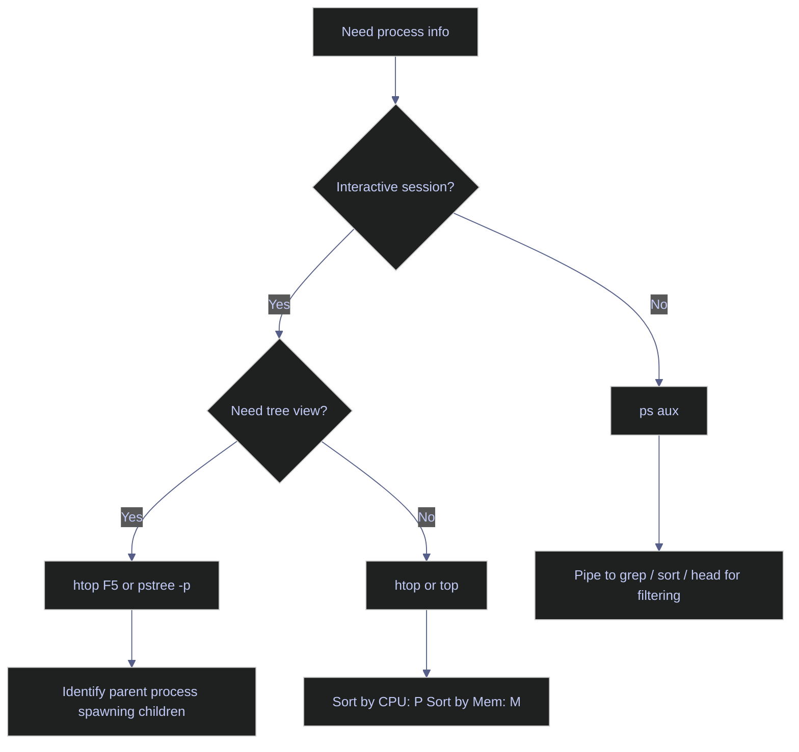

# Viewing Processes

> [!quote]+
>
> "You can have a second computer once you've shown you know how to use the first one."
>
> — **Paul Barham**

> [!abstract]- Summary
>
> Linux and PowerShell follow the same investigation pattern: capture a point-in-time snapshot, switch to a live view if the snapshot is ambiguous, then decide whether CPU, memory, or storage is the bottleneck.
>
> Use `ps`, `pgrep`, `pstree`, `top`, `htop`, `iostat`, and `docker stats` on Linux; use `Get-Process`, `Win32_Process`, `Win32_OperatingSystem`, and `Get-Counter` on Windows.
>
> Prefer RSS or `WorkingSet64` for memory, verify PID identity immediately before sending a signal, and treat D-state tasks or high load with low CPU as I/O symptoms rather than proof of CPU saturation.
>
> The code/output pairs below were captured live from this Windows host and its Ubuntu WSL guest, so service names, owners, and container names reflect the current environment instead of illustrative placeholders.

> [!note]- Glossary
>
> **Process**
>
> - An executing instance of a program, with its own PID, memory mappings, open files, and scheduler state.
> - Use the process as the basic unit for inspection, signaling, accounting, and triage.
> - A program on disk can have many simultaneous processes in memory.
>
> ---
>
> **PID (Process ID)**
>
> - The integer identifier the operating system assigns to a process for the lifetime of that process.
> - Use the PID when you need to target one exact process with tools such as `kill`, `strace`, `ps -p`, or debuggers.
> - PIDs are reused after exit, so confirm the command line immediately before sending a signal.
>
> ---
>
> **`ps aux`**
>
> - A Unix snapshot command that prints user, PID, CPU, memory, state, and command information for running processes.
> - Use it for quick inventory, ad hoc filtering, and pre-kill verification before switching to more specialized tools.
> - The bracket trick in `grep "[n]ame"` avoids matching the `grep` process itself.
>
> ---
>
> **`htop` / `top`**
>
> - Interactive process viewers that refresh continuously and show CPU, memory, load, and per-process activity.
> - Use `top` when you need a batch-mode snapshot or a tool that is almost always installed; use `htop` when you want color, filtering, and tree view in the terminal.
> - In both tools, `P` sorts by CPU and `M` sorts by memory; `top` also uses `1` for per-core CPU detail.
>
> ---
>
> **RSS (Resident Set Size)**
>
> - The portion of a process's address space that is currently resident in physical RAM.
> - Use RSS as the practical memory metric when comparing live processes under memory pressure.
> - VSZ is larger because it includes reserved address space, mapped files, and other pages that are not necessarily resident.
>
> ---
>
> **D state (uninterruptible sleep)**
>
> - A Linux task state in which the kernel is waiting for an uninterruptible operation, usually storage or network-backed I/O.
> - Use it diagnostically to explain why a process appears hung and ignores normal signals.
> - Even `SIGKILL` cannot complete process termination until the task returns from the blocked kernel operation.
>
> ---
>
> **Load average**
>
> - Three exponentially weighted moving averages over 1, 5, and 15 minutes representing runnable tasks plus tasks in uninterruptible sleep on Linux.
> - Use it as a pressure indicator only alongside CPU and I/O metrics.
> - High load with low CPU often points to storage or network I/O, not compute saturation.
>
> ---
>
> **`pstree`**
>
> - A Unix command that renders parent-child relationships as a process tree, optionally with PIDs and arguments.
> - Use it to identify ancestry, service boundaries, and who spawned a runaway child process.
> - If `pstree` is unavailable, `ps aux --forest` is the common fallback.

When a VM is slow, a query is hanging, or a service looks stuck, the first question is not what to restart. It is what is running, who owns it, and whether the bottleneck is CPU, memory, or I/O.

## Linux process viewing tools

Linux gives you both static and live process views. `ps` and `pgrep` are best for scriptable snapshots, `pstree` explains ancestry, `top` and `htop` help with live triage, and `iostat` answers the question that process tables cannot: whether storage is the actual bottleneck.



### Linux | ps | list and filter processes

`ps` reads the `/proc` pseudo-filesystem and prints a point-in-time view of running tasks. The classic `aux` combination means all users, user-oriented columns, and processes without controlling terminals.

#### Capture a point-in-time snapshot

Use `ps aux` when you need a broad inventory before you decide how to filter. In documentation and scripts, piping to `head` keeps the capture readable without changing what `ps` itself reports.

*Run the commands in this section to capture a point-in-time snapshot.*
```bash
ps aux | head -5
```

```text
USER         PID %CPU %MEM    VSZ   RSS TTY      STAT START   TIME COMMAND
root           1  0.0  0.0  22328 12356 ?        Ss   Apr13   0:05 /sbin/init
root           2  0.0  0.0   3120  1920 ?        Sl   Apr13   0:00 /init
root           6  0.0  0.0   3120  1792 ?        Sl   Apr13   0:00 plan9 --control-socket 7 --log-level 4 --server-fd 8 --pipe-fd 10 --log-truncate
root          42  0.0  0.0  66888 14764 ?        S<s  Apr13   0:30 /usr/lib/systemd/systemd-journald
```

The columns that matter most during triage are `PID`, `STAT`, `RSS`, `%CPU`, `%MEM`, and `COMMAND`. Prefer `RSS` to `VSZ` when you are judging real RAM pressure.

#### Filter by name without matching `grep` itself

`ps aux | grep name` always risks self-contamination because the `grep` command line is briefly visible in the process table. The bracket trick keeps the match but prevents `grep` from matching its own literal command string.

*Run the commands in this section to filter by name without matching `grep` itself.*
```bash
ps aux | grep "[s]ystemd"
```

```text
root          42  0.0  0.0  66888 14764 ?        S<s  Apr13   0:30 /usr/lib/systemd/systemd-journald
root          89  0.0  0.0  24884  6016 ?        Ss   Apr13   0:05 /usr/lib/systemd/systemd-udevd
systemd+     139  0.0  0.0  21460 12800 ?        Ss   Apr13   0:00 /usr/lib/systemd/systemd-resolved
systemd+     146  0.0  0.0  91028  7680 ?        Ssl  Apr13   0:01 /usr/lib/systemd/systemd-timesyncd
message+     156  0.0  0.0   9708  4992 ?        Ss   Apr13   0:03 @dbus-daemon --system --address=systemd: --nofork --nopidfile --systemd-activation --syslog-only
root         163  0.0  0.0  18156  8320 ?        Ss   Apr13   0:01 /usr/lib/systemd/systemd-logind
alex         332  0.0  0.0  20652 11264 ?        Ss   Apr13   0:02 /usr/lib/systemd/systemd --user
root         480  0.0  0.0  20412 11264 ?        Ss   Apr13   0:00 /usr/lib/systemd/systemd --user
```

For exact command names, `ps -C name` is usually cleaner. The `grep` pattern remains useful when you need to search the full command line.

#### Sort the snapshot by memory or CPU usage

Sorting inside `ps` is cheaper and cleaner than piping to a second `sort` process. The memory-sorted capture below surfaces the heaviest resident sets first, while the CPU-sorted capture shows that this guest is mostly idle at the time of capture.

*Run the commands in this section to sort the snapshot by memory or CPU usage.*
```bash
ps aux --sort=-%mem | head -5
```

```text
USER         PID %CPU %MEM    VSZ   RSS TTY      STAT START   TIME COMMAND
root         623  0.0  0.0 1253472 27432 pts/2   Ssl+ Apr13   0:01 /mnt/wsl/docker-desktop/docker-desktop-user-distro proxy --distro-name Ubuntu --docker-desktop-root /mnt/wsl/docker-desktop C:\Program Files\Docker\Docker\resources
root         193  0.0  0.0 107012 22656 ?        Ssl  Apr13   0:00 /usr/bin/python3 /usr/share/unattended-upgrades/unattended-upgrade-shutdown --wait-for-signal
root       28971  0.0  0.0 370096 20224 ?        Ssl  15:09   0:00 /usr/libexec/packagekitd
root          42  0.0  0.0  66888 14764 ?        S<s  Apr13   0:30 /usr/lib/systemd/systemd-journald
```

*Run the commands in this section to sort the snapshot by memory or CPU usage.*
```bash
ps aux --sort=-%cpu | head -5
```

```text
USER         PID %CPU %MEM    VSZ   RSS TTY      STAT START   TIME COMMAND
root          42  0.0  0.0  66888 14764 ?        S<s  Apr13   0:30 /usr/lib/systemd/systemd-journald
root       28971  0.0  0.0 370096 20224 ?        Ssl  15:09   0:00 /usr/libexec/packagekitd
root       27963  0.0  0.0 1756108 12928 ?       Ssl  15:01   0:00 /usr/libexec/wsl-pro-service
root          89  0.0  0.0  24884  6016 ?        Ss   Apr13   0:05 /usr/lib/systemd/systemd-udevd
```

On a quiet host the top rows can all show `0.0` percent. That does not make the command useless; it means you need a live view such as `top` or `htop` if the workload is bursty.

| Flag | Syntax | Description |
|---|---|---|
| `a` | `ps aux` | Show processes from all users |
| `u` | `ps aux` | User-oriented format with CPU, MEM, RSS, VSZ columns |
| `x` | `ps aux` | Include processes without a controlling terminal (daemons) |
| `--sort` | `ps aux --sort=-%cpu` | Sort output by column; prefix `-` for descending |
| `-p` | `ps -p 1234` | Show details for a specific PID |
| `-C` | `ps -C nginx` | Filter by command name (exact match) |
| `-o` | `ps -o pid,comm,%cpu` | Custom output columns |
| `--forest` | `ps aux --forest` | ASCII tree view of parent-child relationships |
| `-e` | `ps -ef` | Show all processes in standard format |
| `-f` | `ps -ef` | Full format listing |

### Linux | pgrep | search processes by name or attribute

`pgrep` is the scriptable alternative to `ps | grep`. It returns only PIDs by default, which makes it safer in shell conditionals and handoffs to commands such as `kill`, `renice`, or `strace`.

#### Return matching PIDs only

This is the cleanest way to answer the question "does anything matching this name exist?" without parsing wide process-table output.

*Run the commands in this section to return matching PIDs only.*
```bash
pgrep systemd | head -5
```

```text
1
2
42
89
139
```

Each line is a PID. In this guest, the first matches are the init process and several systemd-managed daemons.

#### Include the process name or match the full command line

`-l` and `-a` add context when raw PIDs are not enough, while `-f` switches matching from the executable name to the full command line.

*Run the commands in this section to include the process name or match the full command line.*
```bash
pgrep -la systemd | head -5
```

```text
1 /sbin/init
2 /init
42 /usr/lib/systemd/systemd-journald
89 /usr/lib/systemd/systemd-udevd
139 /usr/lib/systemd/systemd-resolved
```

*Run the commands in this section to include the process name or match the full command line.*
```bash
pgrep -f "/usr/lib/systemd/systemd --user"
```

```text
332
480
```

That last query matches the two user-level systemd instances by their full command lines rather than by a short executable name alone.

| Flag | Syntax | Description |
|---|---|---|
| `-l` | `pgrep -l nginx` | Print process name alongside PID |
| `-a` | `pgrep -a python` | Print full command line alongside PID |
| `-f` | `pgrep -f "scheduler.py"` | Match against full command line, not just process name |
| `-u` | `pgrep -u airflow` | Match processes owned by a specific user |
| `-n` | `pgrep -n python` | Return only the most recently started match |
| `-o` | `pgrep -o python` | Return only the oldest (earliest started) match |
| `-x` | `pgrep -x nginx` | Exact match on process name |
| `-c` | `pgrep -c python` | Print count of matching processes only |
| `-d` | `pgrep -d, python` | Use a custom delimiter between PIDs |

### Linux | pstree | visualize process hierarchy

When the problem is ancestry rather than raw resource use, `pstree` is the fastest way to see who launched what. This matters when a workload could have come from a shell, a service manager, a scheduler, or a container runtime.

#### Render the top of the process tree with PIDs

`pstree -p` gives you the broad relationship map first. Truncating the output keeps the first branches readable in documentation.

*Run the commands in this section to render the top of the process tree with PIDs.*
```bash
pstree -p | sed -n '1,8p'
```

```text
systemd(1)-+-agetty(171)
           |-agetty(186)
           |-cron(155)
           |-dbus-daemon(156)
           |-init-systemd(Ub(2)-+-SessionLeader(281)-+-Relay(283)(282)---sh(283)
           |                    |                    `-Relay(623)(622)---docker-desktop-(623)-+-{docker-desktop-}(624)
           |                    |                                                             |-{docker-desktop-}(625)
           |                    |                                                             |-{docker-desktop-}(626)
```

The live capture makes the service boundaries visible immediately: `systemd` owns the host tree, while Docker Desktop introduces its own branch under the WSL init layer.

#### Trace the ancestor chain for a specific PID

`-s` is the focused view. It is the quickest way to answer which service or shell spawned the process you are inspecting.

*Run the commands in this section to trace the ancestor chain for a specific PID.*
```bash
pstree -sp $$
```

```text
systemd(1)---init-systemd(Ub(2)---SessionLeader(28523)---Relay(29497)(29495)---pstree(29497)
```

For a long-running worker, replace `$$` with the real PID and walk upward until you reach the parent you care about.

| Flag | Syntax | Description |
|---|---|---|
| `-p` | `pstree -p` | Show PID for each process node |
| `-u` | `pstree -pu airflow` | Filter to a specific user; show username when ownership changes |
| `-a` | `pstree -pa` | Show command line arguments |
| `-n` | `pstree -n` | Sort by PID rather than name |
| `-h` | `pstree -h` | Highlight the current process and its ancestors |
| `-g` | `pstree -g` | Show process group IDs |
| `-s` | `pstree -s 1234` | Show only the ancestors of a specific PID |

### Linux | top | real-time process monitoring

`top` is the default live monitor on almost every Linux system. It combines process rows with system-wide load, CPU breakdown, and memory counters, which makes it the right second step when a static snapshot does not explain the slowdown.

#### Capture one batch-mode snapshot

`-b -n 1` turns an interactive display into a one-shot text capture. That is the mode you want for automation, logs, and repeatable documentation.

*Run the commands in this section to capture one batch-mode snapshot.*
```bash
top -b -n 1 | sed -n '1,12p'
```

```text
top - 15:06:08 up 1 day,  6:38,  2 users,  load average: 0.06, 0.01, 0.00
Tasks:  48 total,   2 running,  46 sleeping,   0 stopped,   0 zombie
%Cpu(s):  0.0 us,  0.0 sy,  0.0 ni,100.0 id,  0.0 wa,  0.0 hi,  0.0 si,  0.0 st 
MiB Mem :  30914.2 total,  27144.0 free,   3084.8 used,   1051.5 buff/cache     
MiB Swap:   8192.0 total,   8192.0 free,      0.0 used.  27829.4 avail Mem 

    PID USER      PR  NI    VIRT    RES    SHR S  %CPU  %MEM     TIME+ COMMAND
      1 root      20   0   22328  12356   9156 S   0.0   0.0   0:05.19 systemd
      2 root      20   0    3120   1920   1920 S   0.0   0.0   0:00.29 init-systemd(Ub
      6 root      20   0    3120   1792   1792 S   0.0   0.0   0:00.00 init
     42 root      19  -1   66888  14724  13956 S   0.0   0.0   0:30.82 systemd-journal
     89 root      20   0   24884   6016   4992 S   0.0   0.0   0:05.44 systemd-udevd
```

Interpret the header before you interpret the rows. `load average` tells you whether work is queueing, while `%wa` tells you how much CPU time is being spent waiting on I/O rather than doing useful work.

#### Narrow the view to one user

`top -u user` is the fast way to isolate one operator, service account, or application owner without losing the live header metrics.

*Run the commands in this section to narrow the view to one user.*
```bash
top -b -n 1 -u "$(whoami)" | sed -n '1,12p'
```

```text
top - 15:06:08 up 1 day,  6:38,  2 users,  load average: 0.06, 0.01, 0.00
Tasks:  51 total,   1 running,  50 sleeping,   0 stopped,   0 zombie
%Cpu(s):  0.6 us,  0.0 sy,  0.0 ni, 99.4 id,  0.0 wa,  0.0 hi,  0.0 si,  0.0 st 
MiB Mem :  30914.2 total,  27145.5 free,   3083.3 used,   1051.5 buff/cache     
MiB Swap:   8192.0 total,   8192.0 free,      0.0 used.  27830.9 avail Mem 

    PID USER      PR  NI    VIRT    RES    SHR S  %CPU  %MEM     TIME+ COMMAND
    283 alex      20   0    2800   1664   1664 S   0.0   0.0   0:00.00 sh
    332 alex      20   0   20688  11264   9216 S   0.0   0.0   0:02.08 systemd
    333 alex      20   0   21156   3520   1792 S   0.0   0.0   0:00.00 (sd-pam)
    355 alex      20   0    6072   4864   3456 S   0.0   0.0   0:00.02 bash
   8515 alex      20   0    6072   5248   3584 S   0.0   0.0   0:00.02 bash
```

This is useful when you are separating your own interactive noise from system services or another tenant's workload.

| Flag | Syntax | Description |
|---|---|---|
| `-u` | `top -u airflow` | Show only processes owned by a specific user |
| `-p` | `top -p 1234,5678` | Monitor specific PIDs only |
| `-d` | `top -d 1` | Set refresh interval in seconds |
| `-n` | `top -n 3` | Run for N iterations then exit (useful in scripts) |
| `-b` | `top -b -n 1` | Batch mode: non-interactive, suitable for scripting or logging |
| `-H` | `top -H` | Show individual threads instead of processes |
| `-i` | `top -i` | Hide idle processes |

### Linux | htop | enhanced interactive process viewer

`htop` adds color, search, filtering, and tree view on top of the same basic process model as `top`. Because its normal interface is ncurses-based, pasting a screen capture into Markdown would be terminal-control noise rather than useful output.

#### Confirm that `htop` is installed before switching to the interactive view

The help surface is the cleanest verification output for a static note. It proves the installed build and shows the switches you can use before entering the full-screen UI.

*Run the commands in this section to confirm that `htop` is installed before switching to the interactive view.*
```bash
htop --help | sed -n '1,12p'
```

```text
htop 3.3.0
(C) 2004-2019 Hisham Muhammad. (C) 2020-2024 htop dev team.
Released under the GNU GPLv2+.

-C --no-color                   Use a monochrome color scheme
-d --delay=DELAY                Set the delay between updates, in tenths of seconds
-F --filter=FILTER              Show only the commands matching the given filter
-h --help                       Print this help screen
-H --highlight-changes[=DELAY]  Highlight new and old processes
-M --no-mouse                   Disable the mouse
-n --max-iterations=NUMBER      Exit htop after NUMBER iterations/frame updates
-p --pid=PID[,PID,PID...]       Show only the given PIDs
```

Once you launch the UI, `F5` toggles tree view and `F6` changes sort order. On minimal images where `htop` is absent, fall back to `top` or install the package from the distro repository.

### Linux | iostat | disk I/O and CPU statistics

Process tables tell you who is waiting. `iostat` tells you whether the storage layer is why they are waiting. Use `iostat -xz` when load is high but CPU is mostly idle, or when D-state tasks suggest a backing-device problem.

#### Sample extended disk statistics

The `-x` view exposes latency and utilization columns, while `-z` suppresses completely idle devices.

*Run the commands in this section to sample extended disk statistics.*
```bash
iostat -xz 1 1 | sed -n '1,12p'
```

```text
Linux 6.6.87.2-microsoft-standard-WSL2 (Elysium) 	04/14/26 	_x86_64_	(16 CPU)

avg-cpu:  %user   %nice %system %iowait  %steal   %idle
           0.09    0.00    0.10    0.00    0.00   99.80

Device            r/s     rkB/s   rrqm/s  %rrqm r_await rareq-sz     w/s     wkB/s   wrqm/s  %wrqm w_await wareq-sz     d/s     dkB/s   drqm/s  %drqm d_await dareq-sz     f/s f_await  aqu-sz  %util
loop0            0.01      0.61     0.00   0.00    0.31    75.46    0.00      0.00     0.00   0.00    0.00     0.00    0.00      0.00     0.00   0.00    0.00     0.00    0.00    0.00    0.00   0.00
loop1            0.05      3.54     0.00   0.00    0.55    77.88    0.00      0.00     0.00   0.00    0.00     0.00    0.00      0.00     0.00   0.00    0.00     0.00    0.00    0.00    0.00   0.00
sda              0.01      0.70     0.00  26.00    0.18    61.97    0.00      0.00     0.00   0.00    0.00     0.00    0.00      0.00     0.00   0.00    0.00     0.00    0.00    0.00    0.00   0.00
sdb              0.00      0.10     0.00  24.56    0.20    50.33    0.00      0.00     0.00   0.00    0.00     0.00    0.00      0.00     0.00   0.00    0.00     0.00    0.00    0.00    0.00   0.00
sdc              0.00      0.02     0.00   0.00    0.06    22.73    0.00      0.00     0.00   0.00    0.50     2.00    0.00      0.00     0.00   0.00    0.00     0.00    0.00    1.00    0.00   0.00
sdd              0.01      0.51     0.00  19.54    0.18    61.82    0.00      0.00     0.00  13.17    0.39     1.12    0.00      0.00     0.00   0.00    0.00     3.50    0.00    0.25    0.00   0.00
```

Treat `r_await` and `w_await` as the decisive latency signals. `%util` matters, but on SSD- and NVMe-backed systems it is not enough by itself to prove distress if latency is still low.

| Flag | Syntax | Description |
|---|---|---|
| `-x` | `iostat -x` | Extended statistics including await, svctm, %util |
| `-z` | `iostat -xz` | Suppress devices with zero activity in the interval |
| `-d` | `iostat -d` | Show device utilisation only (no CPU stats) |
| `-c` | `iostat -c` | Show CPU stats only (no device stats) |
| `-k` | `iostat -xk` | Display sizes in kilobytes instead of 512-byte blocks |
| `-m` | `iostat -xm` | Display sizes in megabytes |
| `-p` | `iostat -p sda` | Report only on a specific device or partition |
| `-h` | `iostat -xh` | Human-readable output |
| `interval` | `iostat -x 2` | Sampling interval in seconds |
| `count` | `iostat -x 2 5` | Number of samples to collect then exit |

### Linux | docker stats | container resource usage

When the host is healthy but one container is noisy, `docker stats` is the right boundary-specific view. It gives you per-container CPU, memory, network, and block-I/O counters without forcing you to enter the container first.

#### Capture a one-shot container snapshot

Use `--no-stream` when you want one sample instead of a continuously refreshing display.

*Run the commands in this section to capture a one-shot container snapshot.*
```bash
docker stats --no-stream
```

```text
CONTAINER ID   NAME       CPU %     MEM USAGE / LIMIT     MEM %     NET I/O           BLOCK I/O         PIDS
8482aae8ad0a   stoxx-db   1.01%     1.904GiB / 30.19GiB   6.31%     5.89MB / 17.1MB   2.03GB / 1.45GB   292
```

This live capture reflects the `stoxx-db` container that is currently running on the host. Remember that Docker's memory column includes page cache; if you need precise application RSS, inspect the container's cgroup files instead of relying on the aggregate number alone.

| Flag | Syntax | Description |
|---|---|---|
| `--no-stream` | `docker stats --no-stream` | Print one snapshot and exit instead of streaming |
| `--format` | `docker stats --format "table {{.Name}}\t{{.CPUPerc}}"` | Custom Go template output |
| `--all` / `-a` | `docker stats -a` | Include stopped containers (shows `0%` for inactive ones) |

### Linux | D state — uninterruptible sleep processes

A process in state `D` is blocked inside the kernel waiting on an uninterruptible operation, usually disk or network-backed I/O. This is the process state that defeats repeated `kill -9` attempts, because the signal cannot complete until the task returns from the blocked kernel path.

#### Check whether any tasks are currently blocked in `D`

The quickest scan is to filter the process table by the `STAT` column. This version prints an explicit message when the system is currently clean.

*Run the commands in this section to check whether any tasks are currently blocked in `D`.*
```bash
ps -eo user,pid,stat,comm | awk 'BEGIN { print "USER PID STAT COMMAND" } $3 ~ /^D/ { print; found=1 } END { if (!found) print "(no processes currently in D state)" }'
```

```text
USER PID STAT COMMAND
(no processes currently in D state)
```

No D-state tasks are visible in this capture. On a sick host, any row whose state begins with `D` means the problem is the blocked kernel operation, not signal delivery.

#### Inspect recent kernel messages after a blocked-task check

Once you suspect I/O trouble, the next question is what the kernel is reporting. `dmesg` is where you confirm storage, filesystem, or NFS faults.

*Run the commands in this section to inspect recent kernel messages after a blocked-task check.*
```bash
dmesg | tail -5
```

```text
[103375.461024] systemd-journald[42]: Time jumped backwards, rotating.
[103404.718409] systemd-journald[42]: Time jumped backwards, rotating.
[103433.988653] systemd-journald[42]: Time jumped backwards, rotating.
[103463.167147] systemd-journald[42]: Time jumped backwards, rotating.
[103492.431920] systemd-journald[42]: Time jumped backwards, rotating.
```

This guest is not reporting storage failures in the live sample above. On a real I/O incident, look for messages such as `I/O error`, `EXT4-fs error`, or `nfs: server not responding`.

## PowerShell process management tools

PowerShell exposes the same operational questions as Linux, but the interface is object-based rather than text-based. `Get-Process` is the fast local inventory, `Get-CimInstance` fills in OS and ownership context, and `Get-Counter` gives you the closest thing Windows has to a load proxy.

### PowerShell | Get-Process | list and filter processes

`Get-Process` returns typed `System.Diagnostics.Process` objects. That changes how you work: you sort and filter properties directly instead of parsing text columns, and you can compute derived values such as memory in megabytes without a second text-processing step.

#### Sort running processes by cumulative CPU time

The `CPU` property is total processor seconds consumed since the process started, not instantaneous percent usage. It is still the right first sort when you want to find long-running CPU consumers quickly.

> [!info] Cumulative CPU is not a live percentage
>
> `Get-Process` exposes cumulative processor time, so a long-lived service can rank high even when it is currently idle. When you need current utilization instead of lifetime burn, switch to a sampled performance counter such as `\\Process(*)\\% Processor Time` or the per-core CPU counters.

*Run the commands in this section to sort running processes by cumulative CPU time.*
```powershell
Get-Process | Sort-Object CPU -Descending | Select-Object -First 5 Name, Id, CPU,
    @{N='Mem(MB)';E={[math]::Round($_.WorkingSet64/1MB)}} | Format-Table -AutoSize
```

```text
Name         Id       CPU Mem(MB)
----         --       --- -------
Code      14688 111501.17 1405.00
Code      36416  40716.06  644.00
Code       2004  39605.53  213.00
XPG-Prime  9244  29219.95  101.00
Code      12972  16070.06  318.00
```

The live host has several long-lived `Code` processes, which is why cumulative CPU dominates the table. `WorkingSet64` converted to megabytes is the Windows analogue of Linux RSS.

#### Query a process by name

Filtering by name is the direct equivalent of `ps -C` or `pgrep -a`. Add `-ErrorAction SilentlyContinue` when the lookup is part of a script and a missing process should not raise noise.

*Run the commands in this section to query a process by name.*
```powershell
Get-Process -Name 'powershell' -ErrorAction SilentlyContinue |
    Select-Object -First 3 Name, Id, CPU,
        @{N='Mem(MB)';E={[math]::Round($_.WorkingSet64/1MB)}} |
    Format-Table -AutoSize
```

```text
Name          Id   CPU Mem(MB)
----          --   --- -------
powershell 14084 10.88   92.00
powershell 24304  0.39   54.00
powershell 39976 10.34  140.00
```

This shows three live Windows PowerShell processes on the host. When you need one exact instance, switch to `-Id` after you identify the PID you want.

#### Filter processes above a working-set threshold

Threshold filtering is the PowerShell equivalent of sorting on RSS and keeping only the heavy hitters. The built-in `MB` suffix keeps the predicate readable.

*Run the commands in this section to filter processes above a working-set threshold.*
```powershell
Get-Process | Where-Object { $_.WorkingSet64 -gt 100MB } |
    Sort-Object WorkingSet64 -Descending |
    Select-Object -First 5 Name, Id,
        @{N='Mem(MB)';E={[math]::Round($_.WorkingSet64/1MB)}} |
    Format-Table -AutoSize
```

```text
Name                  Id Mem(MB)
----                  -- -------
vmmemWSL           13912 2721.00
node               31148 1412.00
Code               14688 1405.00
Memory Compression  3784 1084.00
claude              2264  679.00
```

`WorkingSet64` is live resident memory, so it is the number to prefer when the machine feels memory-bound.

| Flag | Syntax | Description |
|---|---|---|
| `-Name` | `Get-Process -Name "nginx"` | Filter by process name (supports wildcards: `"sql*"`) |
| `-Id` | `Get-Process -Id 1234` | Filter by PID |
| `-IncludeUserName` | `Get-Process -IncludeUserName` | Add UserName property (requires Administrator) |
| `-ComputerName` | `Get-Process -ComputerName srv01` | Query processes on a remote machine (legacy; use CIM for modern) |
| `-Module` | `Get-Process -Name chrome -Module` | List loaded DLL modules for the process |
| `-FileVersionInfo` | `Get-Process -Name svchost -FileVersionInfo` | Include version info from the process executable |

### PowerShell | Get-CimInstance | CPU, memory, and ownership context

`Get-CimInstance` reads operating system and management classes that `Get-Process` does not expose directly. Use it when you need system totals, CPU topology, boot time, or ownership resolution.

#### Read CPU topology

`Win32_Processor` tells you how many physical and logical execution contexts the host has, which is the baseline for interpreting queue length and per-process CPU behavior.

*Run the commands in this section to read CPU topology.*
```powershell
Get-CimInstance -ClassName Win32_Processor |
    Select-Object Name, NumberOfCores, NumberOfLogicalProcessors |
    Format-Table -AutoSize
```

```text
Name                                            NumberOfCores NumberOfLogicalProcessors
----                                            ------------- -------------------------
AMD Ryzen 7 9800X3D 8-Core Processor                        8                        16
```

The distinction matters: scheduler pressure should be judged against logical processors, not just physical cores.

#### Calculate memory utilization from `Win32_OperatingSystem`

This gives you the same host-level view that `/proc/meminfo` gives on Linux, but through typed WMI properties.

*Run the commands in this section to calculate memory utilization from `Win32_OperatingSystem`.*
```powershell
$os = Get-CimInstance Win32_OperatingSystem
"Total: {0:N1} GB | Free: {1:N1} GB | Used: {2:N0}%" -f
    ($os.TotalVisibleMemorySize/1MB),
    ($os.FreePhysicalMemory/1MB),
    ((1 - $os.FreePhysicalMemory/$os.TotalVisibleMemorySize) * 100)
```

```text
Total: 61.7 GB | Free: 36.1 GB | Used: 41%
```

`TotalVisibleMemorySize` and `FreePhysicalMemory` are returned in kibibytes, so the `1MB` divisor converts them to gigabyte-scale values.

#### Resolve the owner for a specific PID

Ownership resolution is cleaner through `Win32_Process` than through `Get-Process -IncludeUserName` when you need a reliable, typed result for one process.

*Run the commands in this section to resolve the owner for a specific PID.*
```powershell
$proc = Get-CimInstance Win32_Process -Filter "ProcessId = $PID"
$owner = Invoke-CimMethod -InputObject $proc -MethodName GetOwner
[pscustomobject]@{
    Name = $proc.Name
    ProcessId = $proc.ProcessId
    'Mem(MB)' = [math]::Round($proc.WorkingSetSize / 1MB)
    Owner = "$($owner.Domain)\$($owner.User)"
} | Format-Table -AutoSize
```

```text
Name     ProcessId Mem(MB) Owner
----     --------- ------- -----
pwsh.exe     44448   82.00 ELYSIUM\Alex
```

This pattern is useful when you can see a PID but need to confirm who owns it before you intervene.

| Flag / Parameter | Syntax | Description |
|---|---|---|
| `-ClassName` | `Get-CimInstance -ClassName Win32_Processor` | Specify the WMI class to query |
| `-Filter` | `Get-CimInstance Win32_Process -Filter "Name='python.exe'"` | WQL WHERE clause for server-side filtering |
| `-ComputerName` | `Get-CimInstance Win32_OperatingSystem -ComputerName srv01` | Query a remote machine |
| `-Property` | `Get-CimInstance Win32_Process -Property Name,ProcessId` | Retrieve only specified properties (reduces data transfer) |

### PowerShell | uptime and load equivalent

Windows does not have a direct 1/5/15-minute load average. You build the equivalent picture from boot time plus performance counters.

#### Calculate uptime from `LastBootUpTime`

Subtracting the last boot timestamp from the current time gives you a `TimeSpan`, which is the PowerShell equivalent of `uptime`.

*Run the commands in this section to calculate uptime from `LastBootUpTime`.*
```powershell
(Get-Date) - (Get-CimInstance Win32_OperatingSystem).LastBootUpTime |
    Select-Object Days, Hours, Minutes
```

```text
Days Hours Minutes
---- ----- -------
   3     2      13
```

Use this to judge whether the process table reflects a fresh boot, a host that has been running for weeks, or a system that has recently recycled services.

#### Read the processor queue length as a load proxy

`Processor Queue Length` is not the same metric as Linux load average, but it is the quickest counter-based approximation of CPU scheduling pressure on Windows.

*Run the commands in this section to read the processor queue length as a load proxy.*
```powershell
(Get-Counter '\System\Processor Queue Length').CounterSamples.CookedValue
```

```text
0
```

A value near zero means threads are not currently waiting for CPU service. Persistent values above roughly 2 per logical processor indicate saturation or a scheduling bottleneck.

## Warnings

- D-state tasks ignore signals until the blocked kernel I/O operation completes, so repeated `kill -9` attempts do not solve the underlying problem.
- PIDs are reusable. Verify identity with `ps -p <pid> -o pid,cmd` or `Get-Process -Id <pid>` immediately before you signal or terminate anything.
- Linux load average includes tasks waiting in uninterruptible sleep, so high load with low CPU is often a storage or filesystem problem.
- VSZ is not resident memory. Use RSS on Linux and `WorkingSet64` or `WorkingSetSize` on Windows when you care about actual RAM pressure.

## Recommendations

### Linux recommendations

#### Take a sorted snapshot before you reach for `kill`

The fastest safe workflow is to identify the process, confirm its command line, and only then decide whether intervention is warranted.

*Run the commands in this section to take a sorted snapshot before you reach for `kill`.*
```bash
ps aux --sort=-%cpu | head -5
```

```text
USER         PID %CPU %MEM    VSZ   RSS TTY      STAT START   TIME COMMAND
root          42  0.0  0.0  66888 14764 ?        S<s  Apr13   0:30 /usr/lib/systemd/systemd-journald
root       28971  0.0  0.0 370096 20224 ?        Ssl  15:09   0:00 /usr/libexec/packagekitd
root       27963  0.0  0.0 1756108 12928 ?       Ssl  15:01   0:00 /usr/libexec/wsl-pro-service
root          89  0.0  0.0  24884  6016 ?        Ss   Apr13   0:05 /usr/lib/systemd/systemd-udevd
```

On a busy host, this immediately tells you whether one process dominates the system or whether the problem is more diffuse.

#### Escalate to storage metrics when load and CPU disagree

If users report slowness but the process table shows little CPU burn, move directly to `iostat` rather than assuming a scheduler problem.

*Run the commands in this section to escalate to storage metrics when load and CPU disagree.*
```bash
iostat -xz 1 1 | sed -n '1,12p'
```

```text
Linux 6.6.87.2-microsoft-standard-WSL2 (Elysium) 	04/14/26 	_x86_64_	(16 CPU)

avg-cpu:  %user   %nice %system %iowait  %steal   %idle
           0.09    0.00    0.10    0.00    0.00   99.80

Device            r/s     rkB/s   rrqm/s  %rrqm r_await rareq-sz     w/s     wkB/s   wrqm/s  %wrqm w_await wareq-sz     d/s     dkB/s   drqm/s  %drqm d_await dareq-sz     f/s f_await  aqu-sz  %util
loop0            0.01      0.61     0.00   0.00    0.31    75.46    0.00      0.00     0.00   0.00    0.00     0.00    0.00      0.00     0.00   0.00    0.00     0.00    0.00    0.00    0.00   0.00
loop1            0.05      3.54     0.00   0.00    0.55    77.88    0.00      0.00     0.00   0.00    0.00     0.00    0.00      0.00     0.00   0.00    0.00     0.00    0.00    0.00    0.00   0.00
sda              0.01      0.70     0.00  26.00    0.18    61.97    0.00      0.00     0.00   0.00    0.00     0.00    0.00      0.00     0.00   0.00    0.00     0.00    0.00    0.00    0.00   0.00
sdb              0.00      0.10     0.00  24.56    0.20    50.33    0.00      0.00     0.00   0.00    0.00     0.00    0.00      0.00     0.00   0.00    0.00     0.00    0.00    0.00    0.00   0.00
sdc              0.00      0.02     0.00   0.00    0.06    22.73    0.00      0.00     0.00   0.00    0.50     2.00    0.00      0.00     0.00   0.00    0.00     0.00    0.00    1.00    0.00   0.00
sdd              0.01      0.51     0.00  19.54    0.18    61.82    0.00      0.00     0.00  13.17    0.39     1.12    0.00      0.00     0.00   0.00    0.00     3.50    0.00    0.25    0.00   0.00
```

The same capture tells you whether the queue is really at the disk layer or whether you need to look elsewhere.

#### Check container boundaries separately from host processes

If the noisy workload is containerized, host-wide process listings are only the first half of the picture.

*Run the commands in this section to check container boundaries separately from host processes.*
```bash
docker stats --no-stream
```

```text
CONTAINER ID   NAME       CPU %     MEM USAGE / LIMIT     MEM %     NET I/O           BLOCK I/O         PIDS
8482aae8ad0a   stoxx-db   1.01%     1.904GiB / 30.19GiB   6.31%     5.89MB / 17.1MB   2.03GB / 1.45GB   292
```

This lets you separate container pressure from host pressure before you go inside the container.

### PowerShell recommendations

#### Start with cumulative CPU and working set

The PowerShell analogue of `ps aux --sort=-%cpu` is to sort process objects by `CPU` and then inspect `WorkingSet64`.

*Run the commands in this section to start with cumulative CPU and working set.*
```powershell
Get-Process | Sort-Object CPU -Descending | Select-Object -First 5 Name, Id, CPU,
    @{N='Mem(MB)';E={[math]::Round($_.WorkingSet64/1MB)}} | Format-Table -AutoSize
```

```text
Name         Id       CPU Mem(MB)
----         --       --- -------
Code      14688 111501.17 1405.00
Code      36416  40716.06  644.00
Code       2004  39605.53  213.00
XPG-Prime  9244  29219.95  101.00
Code      12972  16070.06  318.00
```

This is the fastest way to decide whether the problem is one obvious offender or broad host pressure.

#### Use queue length when Windows feels slow but CPU percentages look ordinary

Windows does not provide a Linux-style load average, so queue length is the first counter to consult when the machine feels busy but `Get-Process` does not explain it.

*Run the commands in this section to use queue length when Windows feels slow but CPU percentages look ordinary.*
```powershell
(Get-Counter '\System\Processor Queue Length').CounterSamples.CookedValue
```

```text
0
```

A low queue length tells you CPU scheduling is not the problem at the moment of capture.

## Troubleshooting

### Linux troubleshooting

#### High load with low CPU usually means blocked I/O, not a CPU emergency

The `top` header is the quickest place to confirm whether the host is spending time in `%wa` or simply waiting for work.

*Run the commands in this section to high load with low CPU usually means blocked I/O, not a CPU emergency.*
```bash
top -b -n 1 | sed -n '1,12p'
```

```text
top - 15:06:08 up 1 day,  6:38,  2 users,  load average: 0.06, 0.01, 0.00
Tasks:  48 total,   2 running,  46 sleeping,   0 stopped,   0 zombie
%Cpu(s):  0.0 us,  0.0 sy,  0.0 ni,100.0 id,  0.0 wa,  0.0 hi,  0.0 si,  0.0 st 
MiB Mem :  30914.2 total,  27144.0 free,   3084.8 used,   1051.5 buff/cache     
MiB Swap:   8192.0 total,   8192.0 free,      0.0 used.  27829.4 avail Mem 

    PID USER      PR  NI    VIRT    RES    SHR S  %CPU  %MEM     TIME+ COMMAND
      1 root      20   0   22328  12356   9156 S   0.0   0.0   0:05.19 systemd
      2 root      20   0    3120   1920   1920 S   0.0   0.0   0:00.29 init-systemd(Ub
      6 root      20   0    3120   1792   1792 S   0.0   0.0   0:00.00 init
     42 root      19  -1   66888  14724  13956 S   0.0   0.0   0:30.82 systemd-journal
     89 root      20   0   24884   6016   4992 S   0.0   0.0   0:05.44 systemd-udevd
```

In this capture, `%wa` is `0.0`, so storage wait is not the current issue. On a distressed host, a high `%wa` plus large `await` in `iostat` is the signature to look for.

#### A process stuck in `D` will not die until the kernel returns from the blocked call

Start by checking whether any tasks are actually in uninterruptible sleep before you assume signals are being ignored.

*Run the commands in this section to a process stuck in `D` will not die until the kernel returns from the blocked call.*
```bash
ps -eo user,pid,stat,comm | awk 'BEGIN { print "USER PID STAT COMMAND" } $3 ~ /^D/ { print; found=1 } END { if (!found) print "(no processes currently in D state)" }'
```

```text
USER PID STAT COMMAND
(no processes currently in D state)
```

If you do see `D`, inspect the kernel log next.

*Run the commands in this section to a process stuck in `D` will not die until the kernel returns from the blocked call.*
```bash
dmesg | tail -5
```

```text
[103375.461024] systemd-journald[42]: Time jumped backwards, rotating.
[103404.718409] systemd-journald[42]: Time jumped backwards, rotating.
[103433.988653] systemd-journald[42]: Time jumped backwards, rotating.
[103463.167147] systemd-journald[42]: Time jumped backwards, rotating.
[103492.431920] systemd-journald[42]: Time jumped backwards, rotating.
```

The remediation is at the storage or network layer, not in repeated signal delivery.

#### Zombie processes require parent cleanup

Zombie tasks have already exited. What remains is the unreaped process table entry, which means the parent still needs to call `wait()`.

*Run the commands in this section to zombie processes require parent cleanup.*
```bash
ps -eo pid,ppid,stat,comm | awk 'BEGIN { print "PID PPID STAT COMMAND" } $3 ~ /^Z/ { print; found=1 } END { if (!found) print "(no zombie processes currently visible)" }'
```

```text
PID PPID STAT COMMAND
(no zombie processes currently visible)
```

If you do find a zombie, investigate or restart the parent process rather than trying to kill the zombie itself.

#### Verify whether `htop` is installed before assuming the host lacks process tooling

Minimal images often omit `htop`, but that is a packaging issue rather than an observability dead end.

*Run the commands in this section to verify whether `htop` is installed before assuming the host lacks process tooling.*
```bash
command -v htop
```

```text
/usr/bin/htop
```

If `command -v htop` returns nothing, install the package from the distro repository or fall back to `top`.

## Cross-references

- [killing-processes](https://alp78.github.io/elysium/01-Shell/Process-Management/killing-processes) — what to do once you find the problematic process
- [system-resources](https://alp78.github.io/elysium/01-Shell/Process-Management/system-resources) — deeper memory, CPU, and disk I/O analysis
- [managing-services](https://alp78.github.io/elysium/01-Shell/Process-Management/managing-services) — checking systemd service status and logs
- [reading-file-contents](https://alp78.github.io/elysium/01-Shell/Text-Processing/reading-file-contents) — reading service logs after identifying the issue
