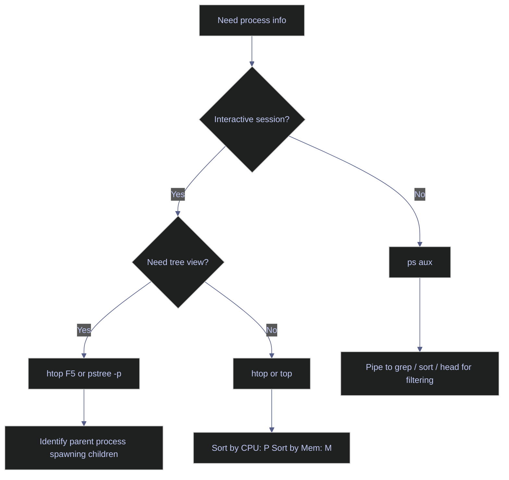

# Viewing Processes

> [!quote]
> "You can have a second computer once you've shown you know how to use the first one."
>
> — **Paul Barham**

> [!abstract]- Summary
>
> Linux and PowerShell tools for inspecting running processes, diagnosing resource saturation, and identifying I/O bottlenecks — from point-in-time snapshots to real-time monitoring and container stats.
>
> **Linux process viewing tools**
> - `ps aux` produces a point-in-time snapshot of all processes with PID, user, CPU%, RSS, and state columns; pipe through `grep`, `sort`, or `head` for targeted output.
> - `pgrep` returns PIDs by name or attribute; `-f` matches the full command line, making it more scriptable than `ps | grep`.
> - `pstree -p` renders the parent-child hierarchy with PIDs; critical for identifying whether a runaway Python process was spawned by Airflow, a shell, or a system service.
> - `top` refreshes every 3 seconds with system-wide load, CPU breakdown, and per-process stats; interactive keys `P`/`M` sort by CPU/memory, `1` expands per-core view.
> - `htop` adds colour, mouse support, and a built-in tree view (`F5`) to `top`; requires `apt install htop` on minimal images.
> - `iostat -xz` samples per-device disk latency (`await`) and throughput; `await` above 20 ms with `%util` above 80% confirms disk saturation, not CPU.
> - `docker stats --no-stream` gives a one-shot snapshot of CPU, RSS, network, and block I/O per container; true RSS requires reading `memory.stat` inside the cgroup.
> - D-state processes (`STAT` column starting with `D`) cannot be killed with any signal, including SIGKILL; diagnose the storage layer with `dmesg` rather than retrying kills.
>
> **PowerShell process management tools**
> - `Get-Process` returns typed `System.Diagnostics.Process` objects; `WorkingSet64` is the Windows RSS equivalent; `CPU` is cumulative seconds, not an instantaneous percentage.
> - `Get-CimInstance Win32_Process` provides cross-user process visibility without elevation; `GetOwner()` resolves the owning account for each process.
> - `Get-CimInstance Win32_OperatingSystem` exposes total RAM, free RAM, and `LastBootUpTime`; subtract from `Get-Date` for a `TimeSpan` uptime equivalent.
> - Windows has no direct load-average equivalent; `\System\Processor Queue Length` from `Get-Counter` serves as a proxy — values above 2 per logical core indicate CPU saturation.
>
> **When to use process viewing tools**
> - Use for diagnosing slow systems, identifying stuck or D-state processes, pre-kill PID verification, capacity planning, and container resource accounting.
>
> **When not to use process viewing tools**
> - Avoid for historical analysis, automated alerting, and application-level profiling; use monitoring agents (Datadog, Prometheus) and language profilers instead.
>
> **Warnings**
> - D-state processes ignore SIGKILL; investigate storage rather than looping kill attempts.
> - PIDs are reused — always verify identity with `ps -p <pid> -o pid,cmd` before signalling.
> - Load average includes I/O-waiting processes; high load with low CPU% points to disk, not compute.
> - VSZ is not actual memory consumption; use RSS for real memory pressure assessment.
>
> **Recommendations**
> - Quick snapshot: `ps aux --sort=-%cpu | head -20`; real-time: `htop`; process tree: `pstree -p`; disk saturation: `iostat -xz 1`.
>
> **Troubleshooting**
> - High load with low CPU%: check `%wa` in `top` and confirm disk saturation with `iostat -x 1`.
> - D-state processes: inspect `dmesg` for disk or NFS errors; force-unmount with `umount -lf` for NFS hangs.
> - Zombie processes: kill the parent; if parent is PID 1, reboot.

> [!note]- Glossary
>
> **Process**
> - An executing instance of a program, created and managed by the operating system, with its own PID, memory mappings, CPU scheduling state, and open resources.
> - Used as the basic unit of execution and resource accounting when monitoring, debugging, or signalling running workloads.
>
> > [!info] Program vs. process
> >
> > A program is the executable code or script on disk. A process is one running instance of that program in memory. One program can have many simultaneous processes.
>
> ---
>
> **PID (Process ID)**
> - Integer identifier assigned by the operating system to a process for the lifetime of that process.
> - Used to target a specific running process in tools such as `kill`, `strace`, `lsof -p`, `ps -p`, and debuggers.
>
> > [!warning] PIDs are reused after exit
> >
> > A PID is unique only among currently running processes. After a process exits, the same PID may later be assigned to a different process, so always verify the command immediately before signalling.
>
> ---
>
> **`ps aux`**
> - Unix command that prints a point-in-time snapshot of running processes, including user, PID, CPU, memory, and command information.
> - Used for quick process inspection, ad hoc filtering, and confirming whether a process exists before switching to deeper tools.
>
> > [!tip] Self-contamination bracket trick
> >
> > `ps aux | grep "[m]ssql"` matches target command lines containing `mssql` but avoids matching the `grep` command itself.
>
> ---
>
> **`htop` / `top`**
> - Interactive process monitors that refresh continuously and display CPU, memory, load, and per-process activity in near real time.
> - Used for live triage when the operator needs to see which processes are consuming CPU or memory right now and how that changes over time.
>
> > [!tip] Key interactive commands
> >
> > In both tools, `P` sorts by CPU and `M` sorts by memory. In `top`, `1` expands the display to per-core CPU view, which helps reveal single-threaded bottlenecks.
>
> ---
>
> **RSS (Resident Set Size)**
> - Amount of a process's memory that is currently resident in physical RAM rather than merely reserved in its virtual address space.
> - Used as the most practical single process-memory metric when comparing active memory footprint across processes.
>
> > [!info] RSS vs. VSZ
> >
> > VSZ includes the full virtual address space, which can include mapped files, shared libraries, and reserved regions that are not all resident in RAM. RSS is usually the more actionable number for memory-pressure analysis.
>
> ---
>
> **D state (uninterruptible sleep)**
> - Linux process state in which a task is blocked in the kernel waiting for an uninterruptible operation, most commonly storage or network-backed I/O.
> - Used diagnostically to explain why a process appears stuck and does not respond to normal signalling.
>
> > [!danger] D-state processes cannot be removed immediately with signals
> >
> > Even `SIGKILL` cannot complete process termination while the task remains blocked in uninterruptible sleep. Focus on the underlying I/O problem with tools such as `dmesg`, storage diagnostics, or NFS health checks.
>
> ---
>
> **Load average**
> - Three exponentially weighted moving averages over 1, 5, and 15 minutes representing the number of runnable tasks and tasks in uninterruptible sleep on Linux.
> - Used as a high-level pressure indicator to show whether work is queueing, but only becomes meaningful when interpreted alongside CPU and I/O metrics.
>
> > [!warning] Load average includes I/O waiters, not just CPU-bound work
> >
> > A high load value does not automatically mean CPU saturation. If CPU usage is modest and I/O wait is elevated, the real bottleneck is likely storage or some other blocking I/O path.
>
> ---
>
> **`pstree`**
> - Unix command that renders processes as a parent-child hierarchy, optionally including PIDs and user transitions.
> - Used to understand process ancestry, identify which parent launched a workload, and detect orphaned or unexpectedly spawned child processes.
>
> > [!tip] Portable fallback
> >
> > `pstree` may be absent on minimal systems. `ps aux --forest` is a common fallback for visualizing the same hierarchy using standard `ps` output.

When an Airflow VM is slow, a query is hanging, or a runaway process is pinning the CPU — your first move is always to understand what is running. `ps aux` gives you the snapshot; `htop` gives you the real-time picture; `iostat` tells you if the disk is the bottleneck.

## Linux process viewing tools

Linux offers several tools for inspecting running processes. `ps` produces a static snapshot, `top` and `htop` provide real-time views updated on a timer, and `pstree` visualises the parent-child hierarchy. Choosing the right tool depends on whether you need a point-in-time record (scripts, logs) or an interactive diagnostic session.



### Linux | ps | list and filter processes

`ps` (process status) reads the `/proc` pseudo-filesystem to produce a point-in-time snapshot of all running processes. It does not refresh — run it again to get an updated view.

The `aux` flag combination is the most common invocation:
- `a` — show processes from **all users**, not just your own
- `u` — user-oriented format, which adds the USER, %CPU, %MEM, VSZ, RSS, TTY, STAT, START, TIME, and COMMAND columns
- `x` — include processes **without a controlling terminal** (daemons and background jobs that persist after logout)

The most important output columns are:
- **PID** — process ID, required for `kill` and `strace`
- **%CPU** — CPU usage percentage; can exceed 100% on multi-core systems when a process uses multiple cores simultaneously
- **%MEM** — percentage of total physical RAM consumed
- **RSS** — Resident Set Size in KB: the actual RAM pages currently held in physical memory; this is the number that matters for memory pressure diagnostics
- **VSZ** — Virtual Size in KB: includes shared libraries and memory-mapped files; typically much larger than RSS and not a reliable indicator of real memory use
- **STAT** — process state: `R`=running, `S`=sleeping (interruptible), `D`=uninterruptible sleep (I/O wait), `Z`=zombie, `T`=stopped
- **TIME** — cumulative CPU time consumed since the process started
- **COMMAND** — full command line including arguments; most useful for identifying what exactly is running

#### List all running processes

```bash
ps aux
```

```text
USER         PID %CPU %MEM    VSZ   RSS TTY      STAT START   TIME COMMAND
root           1  0.0  0.1 168936 11432 ?        Ss   Mar21   0:07 /sbin/init
airflow     1234  2.3  4.1 987654 84320 ?        Sl   09:12   1:23 python scheduler.py
postgres    5678  0.4  2.2 456789 45210 ?        Ss   Mar21   0:41 postgres: checkpointer
```

RSS is in KB. A process with RSS 84320 is using approximately 82 MB of physical RAM. VSZ 987654 looks alarming but includes shared libraries — compare RSS values across processes to assess actual memory pressure.

#### Find a specific process by name

`grep` on `ps aux` output has a well-known self-contamination problem: `ps aux | grep mssql` always includes a line for the `grep mssql` process itself, because `grep mssql` appears in the process table at the moment `ps` captures it.

The bracket trick exploits regex character class matching. `[m]ssql` matches the string `mssql` but does not match `[m]ssql` literally — so grep's own command line entry is excluded.

> [!warning] grep on ps output always self-matches
>
> Running `ps aux | grep mssql` will always include `grep mssql` as a false positive in the output, which can cause confusion when scripting or counting matches.

> [!success] Use the bracket trick to exclude the grep process
>
> Wrap the first character in square brackets: `ps aux | grep "[m]ssql"`. The regex matches `mssql` in the target process's command line but does not match the grep command itself, which contains `[m]ssql` literally.

```bash
ps aux | grep "[m]ssql"
```

```text
mssql     1891  0.8  6.3 1456789 129304 ?  Ssl  Mar21  12:34 /opt/mssql/bin/sqlservr
```

#### Sort by CPU or memory consumption

Sorting at the `ps` level is more efficient than piping through `sort` for large process tables. `--sort=-%mem` sorts by the `%MEM` column descending (the `-` prefix inverts order). Pipe through `head` to limit the output.

```bash
ps aux --sort=-%mem | head -10
```

```text
USER         PID %CPU %MEM    VSZ    RSS TTY      STAT START   TIME COMMAND
airflow     1234  2.3  4.1 987654  84320 ?        Sl   09:12   1:23 python scheduler.py
postgres    5678  0.4  2.2 456789  45210 ?        Ss   Mar21   0:41 postgres
java        8901  0.1  1.8 234567  36810 ?        Sl   Mar21   0:12 java -jar app.jar
```

```bash
ps aux --sort=-%cpu | head -10
```

```text
USER         PID %CPU %MEM    VSZ    RSS TTY      STAT START   TIME COMMAND
worker      2345 18.7  1.1 123456  22450 ?        R    10:45   3:21 python etl_job.py
airflow     1234  2.3  4.1 987654  84320 ?        Sl   09:12   1:23 python scheduler.py
```

| Flag | Syntax | Description |
|---|---|---|
| `a` | `ps aux` | Show processes from all users |
| `u` | `ps aux` | User-oriented format with CPU, MEM, RSS, VSZ columns |
| `x` | `ps aux` | Include processes without a controlling terminal (daemons) |
| `--sort` | `ps aux --sort=-%cpu` | Sort output by column; prefix `-` for descending |
| `-p` | `ps -p 1234` | Show details for a specific PID |
| `-C` | `ps -C nginx` | Filter by command name (exact match) |
| `-o` | `ps -o pid,comm,%cpu` | Custom output columns |
| `--forest` | `ps aux --forest` | ASCII tree view of parent-child relationships |
| `-e` | `ps -ef` | Show all processes in standard format |
| `-f` | `ps -ef` | Full format listing |

### Linux | pgrep | search processes by name or attribute

`pgrep` searches the process table by name or attribute and returns matching PIDs. It is more scriptable than `ps | grep` because it outputs only PIDs (or formatted lines with `-l`/`-a`), making it suitable for use in conditionals and kill scripts.

#### Find PID by process name

```bash
pgrep python
```

```text
1234
2345
3456
```

Each line is a PID of a running `python` process. Pipe to `xargs kill` or pass to `kill` directly.

#### Find PID with full command display

```bash
pgrep -la python
```

```text
1234 python scheduler.py
2345 python etl_job.py
3456 python -u worker.py
```

The `-l` flag adds the process name; `-a` adds the full command line including arguments.

#### Match against the full command line

By default `pgrep` matches against the process name only. The `-f` flag matches against the full command string including arguments — useful when multiple Python scripts are running and you need to target one specifically.

```bash
pgrep -f "python scheduler"
```

```text
1234
```

| Flag | Syntax | Description |
|---|---|---|
| `-l` | `pgrep -l nginx` | Print process name alongside PID |
| `-a` | `pgrep -a python` | Print full command line alongside PID |
| `-f` | `pgrep -f "scheduler.py"` | Match against full command line, not just process name |
| `-u` | `pgrep -u airflow` | Match processes owned by a specific user |
| `-n` | `pgrep -n python` | Return only the most recently started match |
| `-o` | `pgrep -o python` | Return only the oldest (earliest started) match |
| `-x` | `pgrep -x nginx` | Exact match on process name |
| `-c` | `pgrep -c python` | Print count of matching processes only |
| `-d` | `pgrep -d, python` | Use a custom delimiter between PIDs |

### Linux | pstree | visualise process hierarchy

`pstree` reads `/proc` and displays the parent-child process hierarchy as an ASCII tree. It is critical for understanding whether a Python process was spawned by Airflow (part of a scheduled DAG), by a shell (interactive run), or by a system service.

#### Display full process tree with PIDs

```bash
pstree -p
```

```text
systemd(1)─┬─airflow(1100)─┬─python(1234)─┬─{python}(1240)
            │               │              └─{python}(1241)
            │               └─python(2345)
            ├─sshd(812)───sshd(4200)───bash(4201)───pstree(9999)
            ├─postgres(500)─┬─postgres(501)
            │               ├─postgres(502)
            │               └─postgres(503)
            └─dockerd(720)───containerd(730)
```

Each number in parentheses is the PID. `{python}` entries are threads, not child processes.

#### Show tree for a specific user

```bash
pstree -pu airflow
```

```text
airflow(1100)─┬─python(1234)─┬─{python}(1240)
              │              └─{python}(1241)
              └─python(2345)
```

The `-u` flag filters to processes owned by the named user. Combined with `-p` it shows PIDs for every node.

| Flag | Syntax | Description |
|---|---|---|
| `-p` | `pstree -p` | Show PID for each process node |
| `-u` | `pstree -pu airflow` | Filter to a specific user; show username when ownership changes |
| `-a` | `pstree -pa` | Show command line arguments |
| `-n` | `pstree -n` | Sort by PID rather than name |
| `-h` | `pstree -h` | Highlight the current process and its ancestors |
| `-g` | `pstree -g` | Show process group IDs |
| `-s` | `pstree -s 1234` | Show only the ancestors of a specific PID |

### Linux | top | real-time process monitoring

`top` reads `/proc` on a configurable interval (default 3 seconds) and displays a live table of processes sorted by CPU usage. The header section shows system-wide statistics: uptime, load averages, total tasks, CPU breakdown, and memory usage.

#### Launch interactive top session

```bash
top
```

```text
top - 10:45:01 up 12 days,  2:14,  2 users,  load average: 1.23, 0.87, 0.72
Tasks: 214 total,   2 running, 212 sleeping,   0 stopped,   0 zombie
%Cpu(s): 18.3 us,  2.1 sy,  0.0 ni, 78.9 id,  0.5 wa,  0.0 hi,  0.2 si,  0.0 st
MiB Mem :  15821.4 total,   1204.8 free,   9832.1 used,   4784.5 buff/cache
MiB Swap:   2048.0 total,   1923.4 free,    124.6 used.   5421.7 avail Mem

  PID USER      PR  NI    VIRT    RES    SHR S  %CPU  %MEM     TIME+ COMMAND
 2345 worker    20   0  123456  22450   8120 R  18.7   0.1   3:21.44 python
 1234 airflow   20   0  987654  84320  12340 S   2.3   0.5   1:23.12 python
 5678 postgres  20   0  456789  45210   9870 S   0.4   0.3   0:41.07 postgres
```

The `load average` values represent CPU demand over 1, 5, and 15 minutes. A load average equal to the number of CPU cores means the cores are fully utilised. Values persistently above the core count mean processes are queuing for CPU time.

`%Cpu(s): 0.5 wa` is I/O wait: the percentage of time the CPU was idle but waiting for I/O. Values above 10–15% indicate the disk or network is the bottleneck, not the CPU.

> [!tip] Interactive keyboard commands in top
>
> - `P` — sort by CPU usage (default)
> - `M` — sort by memory usage (RES column)
> - `k` — kill a process: top prompts for PID, then signal number
> - `c` — toggle between short command name and full command line with arguments
> - `1` — expand the CPU summary to show per-core usage; a single core at 100% while others are idle identifies a single-threaded bottleneck
> - `d` — change the refresh interval in seconds
> - `q` — quit

#### Filter top to a single user

```bash
top -u airflow
```

```text
top - 10:45:01 up 12 days,  2:14,  2 users,  load average: 1.23, 0.87, 0.72
Tasks:   8 total,   1 running,   7 sleeping,   0 stopped,   0 zombie
  PID USER      PR  NI    VIRT    RES    SHR S  %CPU  %MEM     TIME+ COMMAND
 1234 airflow   20   0  987654  84320  12340 S   2.3   0.5   1:23.12 python
 2345 airflow   20   0  123456  22450   8120 R  18.7   0.1   3:21.44 python
```

| Flag | Syntax | Description |
|---|---|---|
| `-u` | `top -u airflow` | Show only processes owned by a specific user |
| `-p` | `top -p 1234,5678` | Monitor specific PIDs only |
| `-d` | `top -d 1` | Set refresh interval in seconds |
| `-n` | `top -n 3` | Run for N iterations then exit (useful in scripts) |
| `-b` | `top -b -n 1` | Batch mode: non-interactive, suitable for scripting or logging |
| `-H` | `top -H` | Show individual threads instead of processes |
| `-i` | `top -i` | Hide idle processes |

### Linux | htop | enhanced interactive process viewer

`htop` is a more capable alternative to `top` with colour-coded output, mouse support, horizontal scrolling for long command lines, and a built-in process tree view. It displays per-CPU bar graphs and memory/swap meters in the header. Install with `apt install htop` or `yum install htop` if not present.

#### Launch htop

```bash
htop
```

```text
    0[|||||||||||||                        23.4%]  Tasks: 48, 214 thr; 2 running
    1[|||                                   5.2%]  Load average: 1.23 0.87 0.72
    2[|||||||||||                          18.1%]  Uptime: 12 days, 02:14:33
    3[||                                    3.0%]
  Mem[|||||||||||||||||||||||||||||||||  9.6G/15.5G]
  Swap[||                               124M/2.0G]

  PID USER      PRI  NI  VIRT   RES   SHR S  CPU% MEM%   TIME+  Command
 2345 worker     20   0  120M  21.9M  7.9M R  18.7  0.1  3:21.44 python etl_job.py
 1234 airflow    20   0  964M  82.3M 12.1M S   2.3  0.5  1:23.12 python scheduler.py
```

> [!tip] htop keyboard shortcuts
>
> - `F5` — toggle tree view (shows parent-child relationships inline)
> - `F6` — select sort column interactively
> - `F9` — open kill signal selection menu (choose signal by name)
> - `F3` — search for a process by name
> - `F4` — filter: show only processes matching a string
> - `u` — filter by user
> - `t` — toggle tree/flat view
> - `Mouse click` — select a process; click column headers to sort

### Linux | iostat | disk I/O and CPU statistics

`iostat` from the `sysstat` package samples disk device statistics at a set interval. It is the primary tool for diagnosing whether a slow pipeline or hanging process is blocked on disk I/O rather than CPU or memory.

#### Sample extended disk statistics

The `-x` flag adds extended per-device columns including await and utilisation. The `-z` flag suppresses devices with zero activity, keeping the output focused. The `2 3` arguments mean: sample every 2 seconds, print 3 samples.

```bash
iostat -xz 2 3
```

```text
Device            r/s     w/s    rMB/s    wMB/s  await  r_await  w_await  svctm  %util
sda              12.5    45.2     0.45     3.21   18.2     8.4     21.1    0.9   52.3
nvme0n1           0.0     0.0      0.0      0.0    0.0     0.0      0.0    0.0    0.0
```

Key columns for I/O diagnosis:
- **await** — average time in milliseconds from I/O request submission to completion, including queue wait time. Values below 10 ms are healthy for SSDs. Values above 20 ms indicate a slow or saturated disk.
- **r_await / w_await** — separate read and write latency; large read-write asymmetry can indicate write caching issues.
- **%util** — percentage of wall-clock time the device was servicing requests. Values above 80% indicate the device is nearing saturation. At 100%, new I/O requests are queuing and all I/O-bound processes will stall.
- **rMB/s / wMB/s** — throughput in megabytes per second; compare against device specification to gauge how close to maximum the device is running.

> [!warning] %util alone does not prove saturation on SSDs and NVMe
>
> On traditional spinning disks, `%util` approaching 100% reliably indicates saturation because they are sequential devices. On SSDs and NVMe drives, `%util` can hit 100% while `await` remains low, because the device handles parallel queues internally. Use `await` as the primary saturation indicator for modern storage.

> [!success] Use await as the definitive latency indicator
>
> Check `await` first. If `await` is below 5 ms, the disk is healthy regardless of `%util`. If `await` is above 20 ms and `%util` is above 80%, the disk is genuinely saturated and I/O-bound processes will not improve until the disk bottleneck is resolved.

| Flag | Syntax | Description |
|---|---|---|
| `-x` | `iostat -x` | Extended statistics including await, svctm, %util |
| `-z` | `iostat -xz` | Suppress devices with zero activity in the interval |
| `-d` | `iostat -d` | Show device utilisation only (no CPU stats) |
| `-c` | `iostat -c` | Show CPU stats only (no device stats) |
| `-k` | `iostat -xk` | Display sizes in kilobytes instead of 512-byte blocks |
| `-m` | `iostat -xm` | Display sizes in megabytes |
| `-p` | `iostat -p sda` | Report only on a specific device or partition |
| `-h` | `iostat -xh` | Human-readable output |
| `interval` | `iostat -x 2` | Sampling interval in seconds |
| `count` | `iostat -x 2 5` | Number of samples to collect then exit |

### Linux | docker stats | container resource usage

`docker stats` streams live resource metrics for all running containers. It is the container equivalent of `top`. Use `--no-stream` when you need a one-shot snapshot for scripts or when you do not want a blocking process.

#### One-shot container resource snapshot

```bash
sudo docker stats --no-stream
```

```text
CONTAINER ID   NAME            CPU %     MEM USAGE / LIMIT    MEM %     NET I/O          BLOCK I/O
a1b2c3d4e5f6   airflow_web     2.34%     312MiB / 15.5GiB     1.97%     1.2GB / 450MB    8.4GB / 2.1GB
b2c3d4e5f6a1   postgres_db     0.41%     892MiB / 15.5GiB     5.62%     320MB / 180MB    120GB / 45GB
c3d4e5f6a1b2   redis_cache     0.02%     45MiB / 15.5GiB      0.28%     890MB / 2.1GB    0B / 0B
```

Column interpretation:
- **CPU %** — percentage of the host's total CPU capacity consumed. Can exceed 100% if the container uses multiple cores.
- **MEM USAGE / LIMIT** — current RSS of the container versus the configured memory limit. If no limit is set, the limit shown is the host's total RAM.
- **MEM %** — MEM USAGE expressed as a percentage of LIMIT. Values above 85–90% indicate the container is at risk of triggering the OOM killer.
- **NET I/O** — cumulative network bytes received / sent since container start.
- **BLOCK I/O** — cumulative block device bytes read / written since container start; a proxy for disk I/O generated by the container.

> [!warning] MEM USAGE in docker stats includes page cache
>
> The reported MEM USAGE includes Linux page cache held by the container, which the kernel can reclaim under memory pressure. The actual non-reclaimable RSS is lower. For precise container RSS, read `/sys/fs/cgroup/memory/memory.usage_in_bytes` minus `cache` from `/sys/fs/cgroup/memory/memory.stat`.

> [!success] Use memory.stat for accurate container memory accounting
>
> Run `docker exec <container> cat /sys/fs/cgroup/memory/memory.stat | grep -E "^(cache|rss) "` to retrieve the breakdown. Subtract `cache` from `usage_in_bytes` for true application RSS.

| Flag | Syntax | Description |
|---|---|---|
| `--no-stream` | `docker stats --no-stream` | Print one snapshot and exit instead of streaming |
| `--format` | `docker stats --format "table {{.Name}}\t{{.CPUPerc}}"` | Custom Go template output |
| `--all` / `-a` | `docker stats -a` | Include stopped containers (shows `0%` for inactive ones) |

### Linux | D state — uninterruptible sleep processes

A process in state `D` (uninterruptible sleep) is blocked waiting for an I/O operation to complete. The kernel places processes in D state for the duration of certain low-level I/O calls that must not be interrupted — primarily disk reads and NFS operations. Unlike `S` (interruptible sleep), D state ignores signals entirely.

> [!warning] D state processes cannot be killed with any signal, including -9
>
> `kill -9` delivers SIGKILL, which the kernel normally forces on any process. However, processes in D state are executing inside the kernel with interrupts disabled — the signal is queued but never delivered until the process returns to user space, which cannot happen while the I/O is blocked. Common causes:
> 1. NFS mount hung — the network storage server is unreachable or unresponsive
> 2. Disk hardware failure — the drive is not responding to I/O commands
> 3. Kernel bug — rare but real in older kernel versions or exotic drivers
>
> If many processes pile up in D state, the system load average will spike even though no CPU work is being done.

> [!success] Diagnose D state with dmesg and check for NFS/disk errors
>
> Run `dmesg | tail -50` and look for `I/O error`, `EXT4-fs error`, `nfs: server not responding`, or `hung_task_timeout_secs`. These kernel messages identify the root cause. For NFS hangs, force-unmounting with `umount -lf /mnt/point` (lazy force) may unblock the processes. For disk failure, check SMART status with `smartctl -a /dev/sda`.

#### Check for D state processes

```bash
ps aux | awk '$8 ~ /^D/ { print $0 }'
```

```text
www-data  4512  0.0  0.1  23456  2340 ?  D  08:31  0:00 php-fpm: pool www
root      4891  0.0  0.0  12345   890 ?  D  08:31  0:00 kworker/0:2+flush-8:0
```

Any PID in STAT column starting with `D` is in uninterruptible sleep. More than 2–3 D state processes simultaneously indicates a systemic I/O stall rather than an isolated event.

#### Read kernel error messages after D state detected

```bash
dmesg | tail -50
```

```text
[123456.789] EXT4-fs error (device sda1): ext4_find_entry:1455: inode #12345: comm php-fpm: reading directory lblock 0
[123457.012] blk_update_request: I/O error, dev sda, sector 2048576
[123457.015] sd 0:0:0:0: [sda] tag#12 FAILED Result: hostbyte=DID_ERROR driverbyte=DRIVER_OK
```

Errors referencing a specific device (`sda`, `sda1`) confirm hardware failure. `nfs: server not responding` confirms a hung NFS mount. `EXT4-fs error` can indicate filesystem corruption or underlying disk issues.

## PowerShell process management tools

PowerShell provides structured object-based alternatives to Linux's text-based process tools. `Get-Process` returns `System.Diagnostics.Process` objects with typed properties; `Get-CimInstance` queries WMI for system-wide CPU, memory, and uptime data. Because all output is structured, sorting, filtering, and formatting require no text parsing.

### PowerShell | Get-Process | list and filter processes

`Get-Process` retrieves process objects from the local (or remote) machine. Each object exposes typed properties including `WorkingSet64` (physical RAM in bytes), `CPU` (cumulative CPU seconds), `Id` (PID), and `Name`. The cmdlet mirrors `ps aux` in scope: all processes, all users.

#### List top processes by CPU usage

```powershell
Get-Process | Sort-Object CPU -Descending | Select-Object -First 20 Name, Id, CPU,
    @{N='Mem(MB)';E={[math]::Round($_.WorkingSet64/1MB)}}
```

```text
Name         Id    CPU Mem(MB)
----         --    --- -------
sqlservr   1891 1823.4    1842
python     2345  312.7      82
svchost     912   45.2     124
```

`CPU` is cumulative seconds of CPU time since the process started, not an instantaneous percentage. A process with `CPU` 1823 has consumed 1823 seconds of CPU across all cores since it launched. Divide by the process uptime in seconds to derive average utilisation.

`Mem(MB)` is derived from `WorkingSet64`, which is the Windows equivalent of Linux RSS: actual physical RAM pages currently allocated to the process.

#### Find a specific process by name

```powershell
Get-Process -Name "sqlservr" -ErrorAction SilentlyContinue
```

```text
Handles  NPM(K)    PM(K)      WS(K)     CPU(s)     Id  SI ProcessName
-------  ------    -----      -----     ------     --  -- -----------
   4821     892  2045312    1886210   1823.41   1891   0 sqlservr
```

`-ErrorAction SilentlyContinue` suppresses the non-terminating error that `Get-Process` throws when no match is found, making the command safe to use in scripts.

#### Filter processes exceeding a memory threshold

```powershell
Get-Process | Where-Object { $_.WorkingSet64 -gt 500MB } |
    Format-Table Name, Id, @{N='Mem(MB)';E={[math]::Round($_.WorkingSet64/1MB)}} -AutoSize
```

```text
Name        Id Mem(MB)
----        -- -------
sqlservr  1891    1842
java      3412     912
chrome    5678     724
```

The `500MB` literal is automatically interpreted as 524288000 bytes by PowerShell's multiplier suffixes (`KB`, `MB`, `GB`, `TB`). Adjust the threshold to match your alerting requirements.

#### List processes owned by a specific user

```powershell
Get-Process -IncludeUserName | Where-Object { $_.UserName -like "*airflow*" } |
    Select-Object Name, Id, UserName, CPU, @{N='Mem(MB)';E={[math]::Round($_.WorkingSet64/1MB)}}
```

```text
Name   Id   UserName            CPU Mem(MB)
----   --   --------            --- -------
python 2345 DOMAIN\airflow     312.7      82
python 3456 DOMAIN\airflow      14.2      45
```

> [!warning] Get-Process -IncludeUserName requires elevation
>
> The `-IncludeUserName` parameter requires running as Administrator. Without elevation, the cmdlet throws an `Access is denied` error for processes owned by other users.

> [!success] Elevate the shell or use Get-CimInstance for cross-user queries
>
> Launch PowerShell as Administrator and retry, or use `Get-CimInstance Win32_Process` which returns `GetOwner()` method results accessible without elevation for most system processes.

| Flag | Syntax | Description |
|---|---|---|
| `-Name` | `Get-Process -Name "nginx"` | Filter by process name (supports wildcards: `"sql*"`) |
| `-Id` | `Get-Process -Id 1234` | Filter by PID |
| `-IncludeUserName` | `Get-Process -IncludeUserName` | Add UserName property (requires Administrator) |
| `-ComputerName` | `Get-Process -ComputerName srv01` | Query processes on a remote machine (legacy; use CIM for modern) |
| `-Module` | `Get-Process -Name chrome -Module` | List loaded DLL modules for the process |
| `-FileVersionInfo` | `Get-Process -Name svchost -FileVersionInfo` | Include version info from the process executable |

### PowerShell | Get-CimInstance | CPU, memory, and uptime overview

`Get-CimInstance` queries the CIM (Common Information Model) repository via WMI, returning typed objects for hardware and OS-level data that `Get-Process` does not expose: total RAM, CPU topology, OS version, and system uptime. It is the PowerShell equivalent of reading `/proc/meminfo`, `/proc/cpuinfo`, and `uptime` on Linux.

#### Query CPU topology

```powershell
Get-CimInstance -ClassName Win32_Processor |
    Select-Object Name, NumberOfCores, NumberOfLogicalProcessors
```

```text
Name                                    NumberOfCores NumberOfLogicalProcessors
----                                    ------------- -------------------------
Intel(R) Core(TM) i7-9750H CPU @ 2.60GHz             6                        12
```

`NumberOfCores` is the physical core count. `NumberOfLogicalProcessors` includes hyperthreading threads. Use `NumberOfLogicalProcessors` as the denominator when interpreting `Get-Process` CPU values as percentages.

#### Query memory usage and calculate utilisation percentage

```powershell
$os = Get-CimInstance Win32_OperatingSystem
"Total: {0:N1} GB | Free: {1:N1} GB | Used: {2:N0}%" -f
    ($os.TotalVisibleMemorySize/1MB),
    ($os.FreePhysicalMemory/1MB),
    ((1 - $os.FreePhysicalMemory/$os.TotalVisibleMemorySize) * 100)
```

```text
Total: 15.5 GB | Free: 4.2 GB | Used: 73%
```

`TotalVisibleMemorySize` and `FreePhysicalMemory` are in KB. Dividing by `1MB` (= 1024) converts to GB. Used percentage above 90% indicates the system is under memory pressure; the kernel will begin paging to the pagefile, which will dramatically increase disk I/O and degrade all process performance.

#### Query system uptime

```powershell
(Get-Date) - (Get-CimInstance Win32_OperatingSystem).LastBootUpTime
```

```text
Days              : 12
Hours             : 2
Minutes           : 14
Seconds           : 33
TotalSeconds      : 1045273.4
```

`LastBootUpTime` is a `DateTime` object. Subtracting it from `Get-Date` produces a `TimeSpan`. This is the PowerShell equivalent of `uptime`.

#### Query all running processes via WMI for cross-user visibility

```powershell
Get-CimInstance Win32_Process |
    Select-Object Name, ProcessId, @{N='Mem(MB)';E={[math]::Round($_.WorkingSetSize/1MB)}},
        @{N='Owner';E={(Invoke-CimMethod -InputObject $_ -MethodName GetOwner).User}} |
    Sort-Object 'Mem(MB)' -Descending | Select-Object -First 15
```

```text
Name         ProcessId Mem(MB) Owner
----         --------- ------- -----
sqlservr.exe      1891    1842 MSSQLSERVER
java.exe          3412     912 svcuser
chrome.exe        5678     724 alice
```

`Win32_Process` provides `WorkingSetSize` in bytes. The `GetOwner()` method resolves the owning account without requiring the `-IncludeUserName` elevation requirement of `Get-Process`.

| Flag / Parameter | Syntax | Description |
|---|---|---|
| `-ClassName` | `Get-CimInstance -ClassName Win32_Processor` | Specify the WMI class to query |
| `-Filter` | `Get-CimInstance Win32_Process -Filter "Name='python.exe'"` | WQL WHERE clause for server-side filtering |
| `-ComputerName` | `Get-CimInstance Win32_OperatingSystem -ComputerName srv01` | Query a remote machine |
| `-Property` | `Get-CimInstance Win32_Process -Property Name,ProcessId` | Retrieve only specified properties (reduces data transfer) |

### PowerShell | uptime and load equivalent

PowerShell does not have a single `uptime` command equivalent to Linux. System uptime and load information is assembled from CIM/WMI and performance counters.

#### Calculate system uptime

```powershell
(Get-Date) - (Get-CimInstance Win32_OperatingSystem).LastBootUpTime | Select-Object Days, Hours, Minutes
```

```text
Days Hours Minutes
---- ----- -------
  12     2      14
```

#### Read CPU queue length as a load average proxy

On Windows there is no direct equivalent to the Linux 1/5/15-minute load average. The closest metric is `\System\Processor Queue Length` from the performance counter subsystem: the number of threads waiting for CPU time. A value of 0–2 per logical core is healthy; values consistently above 2 per core indicate CPU saturation.

```powershell
(Get-Counter '\System\Processor Queue Length').CounterSamples.CookedValue
```

```text
3
```

A value of 3 means 3 threads are currently queued waiting for a CPU core. On a 4-core machine this is mildly elevated. On a single-core machine this would indicate significant CPU saturation.


## When to use process viewing tools

- **Diagnosing slow systems** -- `htop` or `top` shows which process is consuming CPU or memory in real time.
- **Identifying stuck processes** -- `ps aux | grep D` finds processes in uninterruptible sleep (D state) that indicate I/O problems.
- **Pre-kill verification** -- always `ps aux | grep <pattern>` before killing to confirm you have the right PID and process.
- **Capacity planning** -- monitoring load average over time reveals whether a VM needs more CPU cores or faster storage.
- **Container troubleshooting** -- `docker stats` or `ps aux` inside the container identifies resource consumption per container process.

## When not to use process viewing tools

- **Historical analysis** -- `ps` and `htop` show current state only. For historical CPU/memory trends, use monitoring tools (Datadog, Cloud Monitoring, Prometheus).
- **Automated alerting** -- manual process viewing does not scale. Configure monitoring agents to alert on high CPU, memory, or load average thresholds.
- **Application-level profiling** -- process-level CPU% tells you which process is busy, not which function or query inside it. Use application profilers (Python cProfile, .NET dotTrace, SQL Server DMVs) for deeper analysis.

## Warnings

> [!danger] D-state processes cannot be killed -- not even with SIGKILL
>
> A process in uninterruptible sleep (D state) is waiting for kernel I/O to complete. `kill -9` has no effect. The process exits only when the I/O finishes, the storage device responds, or the kernel times out. Investigate the storage layer (NFS mount, disk health, RAID status) rather than repeatedly trying to kill the process.

> [!warning] PIDs are reused after process exit
>
> A PID you noted during investigation may now belong to a different process. Always verify the PID immediately before sending a signal: `ps -p <pid> -o pid,cmd` confirms the process identity.

> [!warning] Load average includes I/O-waiting processes
>
> A load average of 8.0 on a 4-core machine does not necessarily mean CPU saturation. If most processes are in D state (I/O wait), the bottleneck is disk, not CPU. Check `%wa` in `top` or `iostat` to distinguish.

> [!warning] VSZ is not actual memory consumption
>
> VSZ (Virtual Size) includes shared libraries, memory-mapped files, and reserved-but-unused pages. RSS (Resident Set Size) is the practical measure of physical RAM used by a process.

## Recommendations

| Scenario | Recommendation |
|---|---|
| Quick process snapshot | `ps aux --sort=-%cpu \| head -20` -- top 20 processes by CPU usage. |
| Real-time monitoring | `htop` for interactive use with color, sorting, and filtering. `top -bn1` for non-interactive scripted snapshots. |
| Find a specific process | `ps aux \| grep -i <name>` or `pgrep -a <name>` for cleaner output. |
| Process tree | `pstree -p` to see parent-child relationships with PIDs. `ps --forest` as a fallback. |
| Load average interpretation | Compare to CPU count: `nproc` returns core count. Load > nproc = saturation. Check `%wa` for I/O vs CPU distinction. |
| Container processes | `docker stats` for per-container resource usage. `docker exec <id> ps aux` for process listing inside a container. |
| PowerShell equivalent | `Get-Process \| Sort-Object CPU -Descending \| Select-Object -First 20` for top processes by CPU. |

## Troubleshooting

| Symptom | Likely cause | Fix |
|---|---|---|
| System is slow but no single process shows high CPU | Many processes each using a small amount, or I/O bottleneck (high load average with low CPU%). | Check `%wa` (I/O wait) in `top`. Run `iostat -x 1` to confirm disk saturation. |
| Process in D state cannot be killed | Waiting for kernel I/O (disk, NFS, network filesystem). | Investigate storage: check `dmesg` for disk errors, verify NFS mount health, check RAID status. The process exits when I/O completes. |
| `ps aux` shows a zombie process (Z state) | Child process exited but parent has not called `wait()` to collect its exit status. | Zombies consume no resources (only a PID table entry). Kill the parent process to clean up zombies. If the parent is PID 1 (init/systemd), reboot. |
| Load average is high but CPU usage is low | Processes are waiting for I/O (D state), not CPU. | The bottleneck is disk, network filesystem, or storage. Run `iostat -x 1` and check `%util` column. |
| `htop` is not installed | Minimal Docker images and cloud VMs often omit `htop`. | `apt install htop` (Debian/Ubuntu) or `yum install htop` (RHEL). Use `top` as a fallback. |
## Cross-references
- [killing-processes](https://alp78.github.io/elysium/01-Shell/Process-Management/killing-processes) — what to do once you find the problematic process
- [system-resources](https://alp78.github.io/elysium/01-Shell/Process-Management/system-resources) — deeper memory, CPU, and disk I/O analysis
- [managing-services](https://alp78.github.io/elysium/01-Shell/Process-Management/managing-services) — checking systemd service status and logs
- [reading-file-contents](https://alp78.github.io/elysium/01-Shell/Text-Processing/reading-file-contents) — reading service logs after identifying the issue
