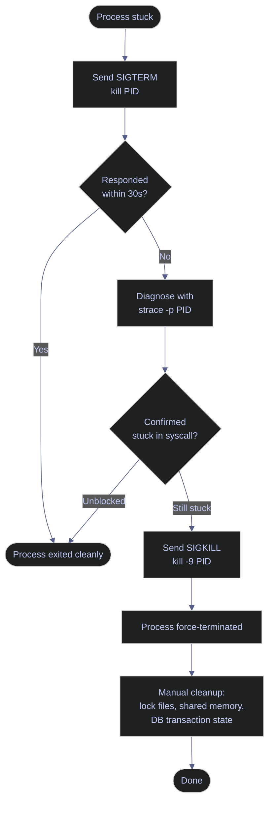

# Killing Processes — Graceful, Then Forceful

> [!quote]
> "If SIGTERM is asking a process to leave the building, SIGKILL is the operating system dropping a concrete block on it."
>
> — Unix sysadmin proverb

> [!abstract]- Summary
>
> Process termination in Linux and PowerShell follows a fixed escalation hierarchy: SIGTERM first, SIGKILL only as a last resort. Skipping graceful shutdown causes data corruption, orphaned locks, and database recovery overhead.
>
> - **Unix signal hierarchy** — SIGTERM (graceful, signal 15), SIGKILL (forced, signal 9), SIGHUP (reload config, signal 1), and their behavioral differences
> - **Linux kill, pkill, killall tools** — kill by PID with `kill`, by name or pattern with `pkill -f`, by name with `killall`; process group termination with negative PGID
> - **SIGTERM → strace → SIGKILL escalation sequence** — the three-stage procedure: request gracefully, diagnose with `strace -p`, force only after confirming stuck; post-kill lock file and shared memory cleanup
> - **PowerShell Stop-Process tools** — `Stop-Process -Id`/`-Name`/`-Force`, filtering by `CommandLine` with `Get-Process | Where-Object` to avoid collateral kills
> - **Operations and safety** — when not to use kill (database processes, D-state, automated kill loops), post-SIGKILL cleanup checklist, PID reuse verification

> [!note]- Glossary
>
> **Signal** — a software notification sent by the kernel or another process to instruct a target process to terminate, pause, resume, or perform a defined action.
>
> - Every `kill`, `pkill`, and `Stop-Process` invocation works by delivering a numbered signal to the target.
> - The process may catch, block, or ignore most signals; only SIGKILL (9) and SIGSTOP (19) cannot be intercepted.
>
> > [!info] Signal delivery
> >
> > The kernel queues the signal in the process's `task_struct`. The process handles it at the next safe preemption point — which means delivery is not instantaneous and a short wait after `kill <PID>` is always correct.
>
> > ---
>
> **SIGTERM (15)** — the default signal sent by `kill <PID>` with no flag; asks the process to terminate gracefully.
>
> - The process receives the signal, can run registered cleanup handlers (flush buffers, close connections, commit or rollback transactions), and exits with a clean status code.
> - Always use SIGTERM first and wait 10–30 seconds before escalating; jumping straight to SIGKILL is the most common operator error.
>
> > [!info] SIGTERM is a request, not a guarantee
> >
> > A process can catch SIGTERM and ignore it, or take arbitrarily long to finish cleanup. If the process does not exit within the timeout, diagnose with `strace -p <PID>` before sending SIGKILL.
>
> > ---
>
> **SIGKILL (9)** — a forceful termination signal that the process cannot catch, block, or ignore; the kernel removes the process immediately with no cleanup.
>
> - Required as a last resort when a process does not respond to SIGTERM — stuck in an infinite loop, blocked on a syscall, or explicitly ignoring signals.
> - SIGKILL leaves open files potentially half-written, lock files unreleased, shared memory segments orphaned, and database transactions uncommitted — manual cleanup is always required afterward.
>
> > [!danger] Never use SIGKILL on database engine processes
> >
> > Sending `kill -9` to a running SQL Server, PostgreSQL, or MySQL process bypasses the engine's shutdown sequence. The database must perform crash recovery on next start, which can take minutes and may lose uncommitted transactions. Use the engine's native shutdown command instead.
>
> > ---
>
> **SIGHUP (1)** — historically "hang up" (terminal disconnected); reinterpreted by most Unix daemons as an instruction to reload configuration without restarting.
>
> - `kill -1 <PID>` or `kill -HUP <PID>` triggers a live config reload in `nginx`, `sshd`, `rsyslog`, and similar long-running services.
> - SIGHUP does not mean terminate for daemons — confusing it with a kill signal is a common mistake that causes unexpected service restarts.
>
> > [!tip] Prefer systemctl reload over kill -HUP
> >
> > On systemd systems, `systemctl reload <service>` is safer than `kill -HUP <PID>` — it validates the new config before applying it and logs the reload event to the journal.
>
> > ---
>
> **`kill`** — a shell built-in and standalone binary that sends a signal to a process identified by its PID.
>
> - Default signal is SIGTERM (15); `kill -9 <PID>` sends SIGKILL; `kill -l` lists all signal names and numbers.
> - `kill` does not mean "force terminate" — without `-9` the process can catch and ignore the signal.
>
> > [!info] kill requires a PID — use pgrep or ps to find it first
> >
> > Run `pgrep -af "<pattern>"` or `ps -p <PID> -o pid,cmd` to confirm PID identity immediately before killing; PIDs are reused and a stale PID may now belong to a different process.
>
> > ---
>
> **`pkill`** — sends a signal to all processes whose name or full command line matches a given pattern, without requiring a PID lookup.
>
> - `-f` matches against the full command-line string (e.g., `pkill -f "python run_pipeline"`), not just the first 15 characters of the process name; always prefer `-f` for precision.
> - Without `-f`, `pkill python` kills every Python process on the system — the most common collateral-kill mistake.
>
> > [!warning] Preview before killing with pkill
> >
> > Run `pgrep -af "<pattern>"` first to list all processes that would match. Only proceed with `pkill -f` after confirming the list is exactly the intended targets.
>
> > ---
>
> **`killall`** — sends a signal to all processes sharing an exact command name; behavior differs across Unix variants.
>
> - On Linux, `killall python3` kills every process named `python3`. On Solaris/BSD, `killall` with no arguments kills all processes owned by the current user.
> - Prefer `pkill -f` over `killall` in any script that may run on both Linux and macOS/BSD to avoid platform-specific mass-kill behavior.
>
> > [!warning] killall is not portable — prefer pkill -f in scripts
> >
> > The safest cross-platform replacement is `pkill -f "<exact-name>"`, which behaves consistently on Linux, macOS, and most BSD variants.
>
> > ---
>
> **`Stop-Process`** — the PowerShell cmdlet for terminating processes; accepts `-Id` (PID), `-Name`, or pipeline input from `Get-Process`.
>
> - Without `-Force` it sends a WM_CLOSE message (a polite close request, roughly equivalent to SIGTERM for Windows GUI processes). With `-Force` it calls `TerminateProcess`, equivalent to SIGKILL — no cleanup occurs.
> - `Stop-Process` does not send Unix-style POSIX signals; it uses the Windows process termination API, so there is no concept of SIGHUP or SIGINT on this path.
>
> > [!info] Use Stop-Service for Windows services, not Stop-Process
> >
> > `Stop-Process` on a Windows service process bypasses the Service Control Manager, preventing clean shutdown. Use `Stop-Service -Name "<service>"` so the SCM can issue a SERVICE_CONTROL_STOP and wait for the service to drain.
>
> > ---
>
> **Graceful shutdown** — a termination sequence where the process receives advance notice (SIGTERM or WM_CLOSE), completes in-flight work, flushes write buffers, closes connections, releases locks, and exits with a clean status code.
>
> - The preferred method for database workers, pipeline executors, and web servers; avoids data corruption, stale lock files, and forced DB recovery.
> - Allow at least 10–30 seconds after SIGTERM before concluding the process has not responded; many applications need time to drain open connections and flush pending writes.
>
> > [!tip] Set an explicit timeout when scripting SIGTERM escalation
> >
> > Use `kill <PID>; sleep 30; kill -0 <PID> 2>/dev/null && kill -9 <PID>` to send SIGTERM, wait 30 seconds, check if the process is still alive, and only then send SIGKILL.
>
> > ---
>
> **Process group (PGID)** — a collection of related processes that share a common process group ID; a bash script and all the subprocesses it spawns typically share one PGID.
>
> - Sending a signal to `-<PGID>` (negative PID syntax) delivers it to every member of the group simultaneously, avoiding orphaned child processes after the parent is killed.
> - Find the PGID with `ps -o pid,pgid,cmd -p <PID>`; the parent and all children should show the same PGID value.
>
> > [!info] Killing a process without its group leaves orphan children
> >
> > If you kill only the parent bash script, its child processes (`python ingest.py`, `python transform.py`) keep running. Use `kill -- -<PGID>` to terminate the entire group in one command.
>
> > ---
>
> **D-state (uninterruptible sleep)** — a kernel process state where the process is blocked waiting for an I/O operation (disk, NFS, network block device) to complete and cannot be interrupted by any signal, including SIGKILL.
>
> - A process in D state cannot be killed; it will exit the state and become killable only when the underlying I/O resolves or the kernel detects a timeout.
> - Investigate the I/O subsystem with `dmesg`, check NFS mount health, or inspect disk health with `smartctl` rather than repeatedly sending `kill -9`.
>
> > [!danger] kill -9 has no effect on D-state processes
> >
> > The kernel queues the SIGKILL but cannot deliver it while the process is in uninterruptible sleep. The process will only die after the blocking I/O operation resolves. Repeated kill attempts are harmless but useless — focus on diagnosing and resolving the I/O issue.

When a pipeline process is stuck — an infinite loop, a hanging database connection, a deadlocked worker — you need to terminate it. The order of escalation matters: graceful first (let the process clean up), forceful only as a last resort. `kill -9` without trying SIGTERM first causes data corruption, orphaned lock files, and unrolled transactions.

## Linux kill, pkill, killall tools

Linux provides three main tools for process termination: `kill` sends signals by PID, `pkill` matches by name or full command-line pattern, and `killall` targets all processes sharing a given name. The section below covers each tool, the correct escalation sequence, and post-kill cleanup.



### Linux | kill | send signals by PID

`kill` sends a signal to a process identified by its PID. Without a signal number, it defaults to SIGTERM (signal 15), asking the process to shut down gracefully. The process can catch this signal and run cleanup logic before exiting. SIGKILL (signal 9) cannot be caught or ignored — the kernel terminates the process immediately.

SIGTERM gives the process time to flush buffers, close file handles, commit or rollback database transactions, release locks, and write a clean shutdown message to logs. Docker uses the same SIGTERM→SIGKILL escalation — see [container-lifecycle](https://alp78.github.io/elysium/09-Docker/container-lifecycle). Always try SIGTERM first and wait 10–30 seconds for the process to respond.

#### Send SIGTERM — request graceful shutdown

```bash
kill <PID>
```

#### Send explicit SIGTERM — retry with signal number

Sometimes re-sending with the explicit signal number `-15` unblocks a process that missed the first signal.

```bash
kill -15 <PID>
```

#### Send SIGKILL — force terminate immediately

The kernel terminates the process with no opportunity to clean up. Only use this after SIGTERM has failed.

> [!danger] SIGKILL leaves resources in an inconsistent state
>
> The kernel terminates the process immediately — no chance to clean up:
> - Open files may be corrupted (half-written)
> - Database transactions are NOT rolled back (the DB server handles recovery later)
> - Lock files are NOT removed (manual cleanup needed)
> - Shared memory segments are NOT freed
>
> Only use `-9` when SIGTERM does not work after waiting 10–30 seconds.

> [!success] Always exhaust SIGTERM and strace before forcing
>
> Run `kill <PID>` first. If no response, use `strace -p <PID>` to inspect what syscall the process is waiting on — if it is blocked on a network read, the issue may be a remote server, not the local process. Only then escalate to `kill -9 <PID>`.

```bash
kill -9 <PID>
```

| Flag | Syntax | Description |
|---|---|---|
| (none) | `kill <PID>` | Send SIGTERM (signal 15) — graceful shutdown request |
| `-15` | `kill -15 <PID>` | Explicit SIGTERM — same as default |
| `-9` | `kill -9 <PID>` | Send SIGKILL — force terminate immediately |
| `-1` | `kill -1 <PID>` | Send SIGHUP — reload config (daemons) without stopping |
| `-2` | `kill -2 <PID>` | Send SIGINT — equivalent to pressing Ctrl+C |
| `-19` | `kill -19 <PID>` | Send SIGSTOP — pause process execution |
| `-18` | `kill -18 <PID>` | Send SIGCONT — resume a stopped process |
| `-l` | `kill -l` | List all available signal names and numbers |

### Linux | pkill | kill by name or pattern

`pkill` finds processes by name or command-line pattern and sends them a signal without requiring you to look up a PID first.

#### Kill by full command-line pattern

Using `-f` matches against the full command line string, not just the process name. This is the safest way to target a specific script or invocation.

> [!danger] pkill without -f is dangerously broad
>
> `pkill` without `-f` matches only the first 15 characters of the process name. `pkill python` kills every Python process on the system.

> [!success] Use -f to match the full command line
>
> `pkill -f "python run_pipeline"` matches only the exact script invocation, leaving other Python processes untouched.

```bash
pkill -f "python run_pipeline"
```

#### Send SIGKILL with pkill

Pass `-9` to send SIGKILL instead of the default SIGTERM.

```bash
pkill -9 -f "python run_pipeline"
```

#### Kill by process name (simple match)

Matches the process name (first 15 characters). Use only when you are certain no other processes share the same name.

```bash
pkill python3
```

| Flag | Syntax | Description |
|---|---|---|
| `-f` | `pkill -f "<pattern>"` | Match against full command line, not just process name |
| `-9` | `pkill -9 -f "<pattern>"` | Send SIGKILL instead of SIGTERM |
| `-15` | `pkill -15 -f "<pattern>"` | Explicit SIGTERM |
| `-u` | `pkill -u <user> <name>` | Kill processes owned by a specific user |
| `-g` | `pkill -g <PGID> <name>` | Kill processes in a specific process group |
| `-n` | `pkill -n <name>` | Kill only the newest (most recently started) matching process |
| `-o` | `pkill -o <name>` | Kill only the oldest matching process |
| `-x` | `pkill -x <name>` | Exact match: process name must match pattern exactly |
| `-l` | `pkill -l -f "<pattern>"` | List matching processes without killing (dry run) |
| `-e` | `pkill -e -f "<pattern>"` | Print the name and PID of the killed process |

### Linux | killall | kill all processes by name

`killall` sends a signal to all processes sharing a given name. Use it when you deliberately want to stop every instance of a program.

#### Kill all processes with a given name

```bash
killall python3
```

> [!warning] killall differs on macOS / BSD
>
> On Linux, `killall python3` kills all processes named `python3`. On macOS/BSD, `killall` with no arguments kills **every process you own**. Prefer `pkill -f` for portability across platforms.

> [!success] Use pkill -f for portable cross-platform scripting
>
> Replace `killall <name>` with `pkill -f "<name>"` in scripts that may run on both Linux and macOS. The behavior is consistent and the pattern match is more precise.

#### Kill all instances with SIGKILL

```bash
killall -9 python3
```

| Flag | Syntax | Description |
|---|---|---|
| (none) | `killall <name>` | Send SIGTERM to all processes named `<name>` |
| `-9` | `killall -9 <name>` | Send SIGKILL to all matching processes |
| `-15` | `killall -15 <name>` | Explicit SIGTERM |
| `-u` | `killall -u <user> <name>` | Limit to processes owned by a specific user |
| `-i` | `killall -i <name>` | Interactive mode — prompt before each kill |
| `-e` | `killall -e <name>` | Exact match on process name |
| `-r` | `killall -r <pattern>` | Match process names by regex |
| `-w` | `killall -w <name>` | Wait for all killed processes to die before returning |

### Linux | kill — -PGID | kill a process group

A negative PID in `kill` signals the entire process group — the parent process and all its children. Use this to stop a bash script that spawned multiple subprocesses in one command. Find the PGID with `ps -o pid,pgid,cmd -p <PID>`.

#### Find the PGID of a process

```bash
ps -o pid,pgid,cmd -p <PID>
```

```text
  PID  PGID CMD
 4812  4812 bash run_etl.sh
 4813  4812 python ingest.py
 4814  4812 python transform.py
```

#### Kill the entire process group

```bash
kill -- -<PGID>
```

| Flag | Syntax | Description |
|---|---|---|
| (none) | `kill -- -<PGID>` | Send SIGTERM to every process in the group |
| `-9` | `kill -9 -- -<PGID>` | Send SIGKILL to every process in the group |

### Linux | SIGTERM → strace → SIGKILL | kill escalation sequence

The correct procedure for killing a stuck process follows three stages: ask gracefully, diagnose if unresponsive, then force. Skipping the diagnosis step means using `kill -9` blindly — which can mask the root cause (network timeout, deadlock, disk full) and leave corrupted state behind.

#### Step 1 — Send SIGTERM and wait

```bash
kill <PID>
```

#### Step 2 — Diagnose with strace if no response

`strace -p <PID>` attaches to the running process and streams every system call it makes. If it is blocked in `read()` on a socket, the cause is network or a remote server. If it is looping in `futex()`, a mutex is contended.

```bash
strace -p <PID>
```

```text
strace: Process 4812 attached
read(5, 0x7f3b2c001230, 4096)           = ? ERESTARTSYS (To be restarted if SA_RESTART is set)
```

#### Step 3 — Send SIGKILL after confirming stuck

```bash
kill -9 <PID>
```

#### Step 4 — Clean up after force kill

> [!warning] Manual cleanup required after kill -9
>
> After `kill -9`, the following artifacts may remain:
> - Lock files left in `/var/run/`, `/tmp/`, or the application's data directory
> - Shared memory segments: list with `ipcs -m`, remove with `ipcrm -m <shmid>`
> - Incomplete file writes: check file sizes and checksums
> - Database transaction state: look for open transactions in `sys.dm_exec_sessions` — see [deadlock-detection-and-prevention](https://alp78.github.io/elysium/04-SQL-Server/03-Query-Writing-and-Optimization/deadlock-detection-and-prevention) for SQL Server KILL session handling

> [!success] Post-kill cleanup checklist
>
> 1. `ls /var/run/<appname>/` — remove any `.pid` or `.lock` files
> 2. `ipcs -m` — identify shared memory segments by the dead process's UID
> 3. `ipcrm -m <shmid>` — remove each orphaned segment
> 4. Verify the resource is released: `lsof | grep <filename>` should return empty

## PowerShell Stop-Process tools

PowerShell provides `Stop-Process` as the primary mechanism for terminating processes. Without `-Force` it sends a close request (equivalent to SIGTERM), giving the process a chance to handle shutdown. With `-Force` it terminates immediately (equivalent to SIGKILL). Use `Get-Process` with `Where-Object` to filter by command line when targeting a specific script instance.

### PowerShell | Stop-Process | graceful and forced termination

`Stop-Process` targets processes by PID (`-Id`) or name (`-Name`). The `-Force` flag bypasses the graceful close request and terminates immediately.

#### Terminate by PID — graceful

```powershell
Stop-Process -Id <PID>
```

#### Terminate by PID — forced

```powershell
Stop-Process -Id <PID> -Force
```

#### Terminate with confirmation prompt

`-Confirm` pauses before each kill and prompts the operator to confirm.

```powershell
Get-Process -Name "python" | Stop-Process -Confirm
```

| Flag | Syntax | Description |
|---|---|---|
| `-Id` | `Stop-Process -Id <PID>` | Target a specific process by PID |
| `-Name` | `Stop-Process -Name "<name>"` | Target all processes matching the given name |
| `-Force` | `Stop-Process -Id <PID> -Force` | Terminate immediately without a graceful close request |
| `-Confirm` | `Stop-Process -Name "<name>" -Confirm` | Prompt for confirmation before each termination |
| `-WhatIf` | `Stop-Process -Name "<name>" -WhatIf` | Dry run — show what would be stopped without acting |
| `-PassThru` | `Stop-Process -Id <PID> -PassThru` | Return the process object after stopping it |
| `-ErrorAction` | `Stop-Process -Id <PID> -ErrorAction SilentlyContinue` | Suppress errors when the process does not exist |

### PowerShell | Get-Process | filter and kill by command line

`Stop-Process -Name` kills every process matching the name, which is equivalent to `killall` — it does not distinguish between multiple instances of the same program. Use `Get-Process` with `Where-Object` to filter by `CommandLine` before piping to `Stop-Process`.

#### Kill a specific script by command-line pattern

> [!warning] Stop-Process -Name kills all matching processes
>
> `Stop-Process -Name "python"` terminates every Python process on the system, regardless of which script it is running.

> [!success] Filter by CommandLine to target a specific instance
>
> Pipe `Get-Process` through `Where-Object { $_.CommandLine -like "*run_pipeline*" }` to restrict the kill to the exact script invocation.

```powershell
Get-Process | Where-Object { $_.CommandLine -like "*run_pipeline*" } |
    Stop-Process -Force
```

#### List processes matching a pattern before killing (dry run)

```powershell
Get-Process | Where-Object { $_.CommandLine -like "*run_pipeline*" } |
    Select-Object Id, ProcessName, CommandLine
```

```text
  Id ProcessName CommandLine
---- ----------- -----------
4812 python      python run_pipeline.py --env prod
```

> [!info] CommandLine property requires elevated privileges on Windows
>
> `$_.CommandLine` is populated only when the PowerShell session is running as Administrator. In non-elevated sessions the property is `$null` and the `Where-Object` filter will match nothing.

| Flag / Property | Syntax | Description |
|---|---|---|
| `CommandLine` | `$_.CommandLine -like "*pattern*"` | Filter by full command-line string (requires elevation) |
| `Id` | `$_.Id` | Process PID — pipe to `Stop-Process -Id` |
| `CPU` | `$_.CPU` | CPU seconds consumed — useful for identifying runaway processes |
| `WorkingSet` | `$_.WorkingSet` | Physical memory in bytes |


## When to use process killing tools

- **Runaway processes consuming all CPU or memory** -- a stuck Python script or a query gone rogue needs to be terminated before it destabilizes the VM.
- **Stuck pipeline workers** -- an Airflow task or Cloud Run job that hangs past its timeout must be killed and retried.
- **Port conflicts** -- a process holding a port you need (e.g., port 8080 for a new deployment) must be stopped before the new service can bind.
- **Configuration reload** -- `kill -HUP <pid>` reloads nginx, sshd, and other daemons without downtime.
- **Batch cleanup** -- `pkill -f "python.*old_pipeline"` terminates all instances of a deprecated pipeline script.

## When not to use process killing tools

- **Database processes** -- never `kill -9` a SQL Server, PostgreSQL, or MySQL process. Use the database shutdown command (`SHUTDOWN` in T-SQL, `pg_ctl stop`, `mysqladmin shutdown`) for clean termination with transaction recovery.
- **Processes you do not own** -- killing another user process requires `sudo`. Verify ownership and purpose before killing anything you did not start.
- **D-state processes** -- processes in uninterruptible sleep (D state) cannot be killed even with SIGKILL. Investigate the I/O subsystem instead.
- **Automated kill loops** -- scripts that repeatedly `kill -9` a process without understanding why it keeps restarting mask the root cause. Fix the underlying issue.

## Warnings

> [!danger] SIGKILL (kill -9) prevents graceful shutdown
>
> A process killed with SIGKILL cannot flush write buffers, close database connections, release file locks, or complete in-flight transactions. This can corrupt data files, leave stale locks that block subsequent runs, and force database recovery on restart. Always try SIGTERM first and wait 10-30 seconds before escalating.

> [!danger] `killall` behaves differently across Unix variants
>
> On Linux, `killall python` kills all processes named `python`. On Solaris, `killall` with no arguments kills ALL processes on the system. Prefer `pkill` for cross-platform safety.

> [!warning] Always verify the PID before killing
>
> PIDs are reused. A PID you noted 5 minutes ago may now belong to a different process. Run `ps -p <pid> -o pid,cmd` immediately before `kill` to confirm identity.

> [!warning] PowerShell `Stop-Process` has no graceful shutdown mode
>
> `Stop-Process` calls `TerminateProcess`, which is the Windows equivalent of SIGKILL. There is no built-in way to send a graceful shutdown signal. For services, use `Stop-Service` which requests a clean stop.

## Recommendations

| Scenario | Recommendation |
|---|---|
| Standard process termination | `kill <pid>` (SIGTERM). Wait 10-30 seconds. Check `ps -p <pid>`. If still running, `kill -9 <pid>`. |
| Kill by name | `pkill -f "pattern"` to match against the full command line. Preview with `pgrep -af "pattern"` first. |
| Reload daemon config | `kill -HUP <pid>` or `systemctl reload <service>`. |
| Kill all instances of a command | `pkill -f "python.*old_script"`. Verify targets first with `pgrep -af`. |
| Free a port | `fuser -k 8080/tcp` kills whatever is listening on port 8080. Verify with `ss -tlnp \| grep 8080` first. |
| PowerShell process termination | `Stop-Process -Id <pid>` or `Get-Process -Name "python" \| Stop-Process`. For services, use `Stop-Service`. |
| Database shutdown | Never use `kill`. Use the database native shutdown: `SHUTDOWN` (SQL Server), `pg_ctl stop` (PostgreSQL). |

## Troubleshooting

| Symptom | Likely cause | Fix |
|---|---|---|
| Process does not die after `kill <pid>` | Process caught SIGTERM and is performing cleanup, or it is ignoring SIGTERM. | Wait 10-30 seconds. If still running, escalate: `kill -9 <pid>`. |
| `kill -9` has no effect | Process is in D state (uninterruptible sleep) waiting for kernel I/O. | Cannot be killed. Investigate storage: check `dmesg`, NFS mounts, disk health. Process exits when I/O completes. |
| Zombie process (Z state) remains after kill | Parent process has not collected the exit status with `wait()`. | Kill the parent process. If parent is PID 1, reboot is the only option. Zombies consume no resources (only a PID entry). |
| `pkill` killed the wrong processes | Pattern was too broad. `pkill python` kills ALL Python processes, not just the target. | Use `pkill -f "python specific_script.py"` for precise matching. Always preview with `pgrep -af` first. |
| Port still in use after killing the process | Socket is in TIME_WAIT state (TCP connection draining). Lasts 60 seconds by default. | Wait for TIME_WAIT to expire, or use `SO_REUSEADDR` in the application. `ss -tlnp \| grep <port>` shows the state. |
| PowerShell `Stop-Process` fails with access denied | Process is running as a different user or as SYSTEM. | Run PowerShell as Administrator, or use `Stop-Service` for Windows services. |
## Cross-references
- [viewing-processes](https://alp78.github.io/elysium/01-Shell/Process-Management/viewing-processes) — find the PID before killing
- [managing-services](https://alp78.github.io/elysium/01-Shell/Process-Management/managing-services) — use `systemctl stop` for services (cleaner than `kill`)
- [system-resources](https://alp78.github.io/elysium/01-Shell/Process-Management/system-resources) — confirm resource is released after killing

