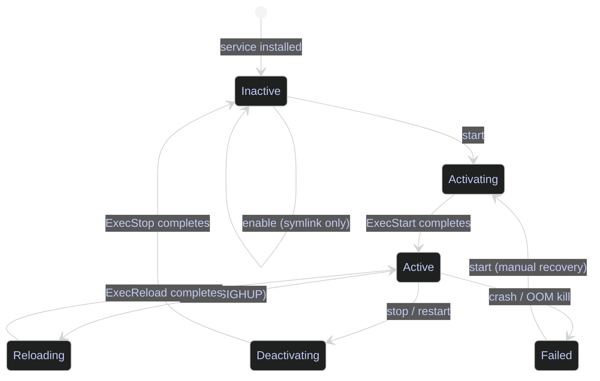

# Managing Services

> [!quote]
> "systemd is never finished, never complete, but tracking progress of technology."
>
> — **Lennart Poettering** (creator of systemd)

> [!abstract]- Summary
>
> Linux and Windows infrastructure services are long-running background processes managed by init systems — systemd on Linux, Service Control Manager on Windows. This note covers the full operational lifecycle of both platforms.
>
> - **Linux systemctl and journalctl tools** — start, stop, restart, enable, disable, mask, and inspect services; read and filter the structured journal; diagnose OOM kills with `dmesg` and `journalctl -k`
> - **PowerShell Windows Services tools** — `Get-Service`, `Start-Service`, `Stop-Service`, `Restart-Service`, `Set-Service`, `sc.exe`; query event logs with `Get-WinEvent`
> - **When to use service management tools** — restarting after config changes, diagnosing failures, enabling boot persistence, blocking dangerous services
> - **When not to use service management tools** — application-level reloads, container orchestration, one-shot scheduled scripts
> - **Warnings** — connection interruption on database restarts, `start` vs `enable` independence, `sc` alias trap in PowerShell, `daemon-reload` requirement after unit file edits
> - **Recommendations** — scenario-based command guide for Linux and Windows service operations
> - **Troubleshooting** — symptom-based diagnostic guidance for the most common service failures

> [!note]- Glossary
>
> **Service / Daemon**
> - A long-running background process managed by the operating system's service manager rather than launched manually for one interactive session.
> - Used to run infrastructure components continuously, such as databases, web servers, schedulers, and agents, typically across reboots and user logouts.
> - A service is registered with a service manager and can be started, stopped, restarted, and monitored as a managed unit; a one-shot command runs once and exits.
>
> ---
>
> **`systemctl`**
> - Primary command-line tool for managing `systemd` units on modern Linux systems, including starting, stopping, restarting, reloading, enabling, disabling, masking, and inspecting services.
> - Used as the operational interface for controlling service lifecycle and checking whether a service is running now and configured to start at boot.
> - `start` affects the current runtime state, while `enable` affects boot-time behavior; use `systemctl enable --now <service>` when you need both.
>
> ---
>
> **`journalctl`**
> - Command-line viewer for the `systemd` journal, which stores structured logs for services, the kernel, and other system components.
> - Used to inspect service startup failures, crash loops, restart events, and recent logs without needing separate flat log files.
> - Filter by unit whenever possible; `journalctl -u <service> -f` is the usual way to watch one service without the rest of the journal obscuring the signal.
>
> ---
>
> **Unit file**
> - A `systemd` configuration file that defines how a unit such as a service, timer, or socket should be started, ordered, stopped, and supervised.
> - Used to declare service behavior, including the executable, restart policy, dependencies, environment, and startup conditions.
> - Prefer overrides under `/etc/systemd/system/` or `systemctl edit <service>` rather than editing vendor unit files under `/usr/lib/systemd/system/` or `/lib/systemd/system/`; run `systemctl daemon-reload` after changes.
>
> ---
>
> **Service state**
> - Runtime or management status reported by the service manager, such as `active`, `inactive`, `failed`, `activating`, `deactivating`, or `masked`.
> - Used to distinguish whether a service is currently running, stopped cleanly, failed during startup or runtime, or deliberately blocked from being started.
> - `inactive` does not necessarily mean broken; it can reflect an intentional stop or a one-shot unit that completed successfully. `masked` specifically means startup is administratively blocked.
>
> ---
>
> **OOM killer**
> - Linux kernel mechanism that terminates one or more processes when memory pressure becomes severe enough that the system cannot satisfy allocation safely.
> - Used by the kernel as a last-resort protection mechanism to keep the whole machine alive when memory exhaustion would otherwise cause wider failure.
> - Decisive evidence usually appears in kernel logs rather than only in `journalctl -u <service>`; cross-check with `journalctl -k` or `dmesg` when a service dies under memory pressure.
>
> ---
>
> **`Get-Service` / `Set-Service`**
> - PowerShell cmdlets for interacting with the Windows Service Control Manager: `Get-Service` reads service status, while `Set-Service` changes properties such as startup type.
> - Used for Windows service administration from scripts and shells, alongside `Start-Service`, `Stop-Service`, and `Restart-Service` for runtime control.
> - Runtime state and startup type are separate facts; a service can be configured for automatic startup and still be stopped, or configured as manual and currently running.
>
> ---
>
> **`sc.exe`**
> - Native Windows Service Control command-line utility for querying, creating, deleting, and configuring services.
> - Used when low-level service operations are needed that are awkward or unavailable through standard PowerShell service cmdlets.
> - In PowerShell, use `sc.exe` explicitly because `sc` is an alias for `Set-Content`, not the Service Control utility.
>
> ---
>
> **`Get-WinEvent`**
> - PowerShell cmdlet for querying Windows Event Log records from the System log and provider-specific logs.
> - Used as the main Windows equivalent of `journalctl` for diagnosing service starts, stops, crashes, recovery actions, and related OS events.
> - Service-relevant IDs include `7036` for state changes, `7034` for unexpected termination, `7031` for recovery actions after failure, and `2004` for severe resource exhaustion.

Every long-running process in your infrastructure — SQL Server, Airflow, Datadog agent, Docker daemon — runs as a systemd service on Linux or a Windows Service on Windows. Understanding service management is how you restart a crashed database, check why a monitoring agent stopped collecting metrics, or enable a new service to survive reboots. For Airflow-specific service management (scheduler, worker, webserver), see [airflow-core-concepts](https://alp78.github.io/elysium/12-Orchestration/Airflow/airflow-core-concepts).

The diagram below shows the full service lifecycle and the commands that drive each transition.




## Linux systemctl and journalctl tools

systemd is the init system and service manager for most modern Linux distributions. Every service is described by a unit file stored in `/etc/systemd/system/` or `/lib/systemd/system/`. The `systemctl` command controls service state; `journalctl` reads the structured log journal that systemd writes for every unit.

### Linux | systemctl | control service lifecycle

The `start`, `stop`, and `restart` subcommands are the primary controls for a service's runtime state. They operate immediately, without waiting for a reboot.

The live demonstrations in this section use a disposable user-scoped unit, `vault-style-demo.service`, so the outputs can be captured without mutating a production service. When you target a system service, drop `--user` and add `sudo` as needed.

#### Start a service

`systemctl start` sends a start request to the unit and returns after systemd has handed control to the service manager. Because `start` itself is quiet on success, verify the result with `is-active` or `status`.

```bash
systemctl --user start vault-style-demo.service
systemctl --user is-active vault-style-demo.service
```

```text
active
```

#### Stop a service

`systemctl stop` sends the service's configured stop signal, which is `SIGTERM` by default. If the process does not exit before the unit timeout, systemd can escalate to `SIGKILL`.

```bash
systemctl --user stop vault-style-demo.service
systemctl --user is-active vault-style-demo.service || true
```

```text
inactive
```

#### Restart a service

`systemctl restart` stops then starts the service in one transaction. For stateful services, treat it as a disruptive operation that drops sessions and forces new process startup.

```bash
systemctl --user restart vault-style-demo.service
journalctl --user -u vault-style-demo.service -n 4 --no-pager
```

```text
Apr 14 15:10:39 Elysium vault-style-demo.sh[29306]: stop signal received
Apr 14 15:10:39 Elysium systemd[332]: Stopped vault-style-demo.service - Vault style demo service.
Apr 14 15:10:39 Elysium systemd[332]: Started vault-style-demo.service - Vault style demo service.
Apr 14 15:10:39 Elysium vault-style-demo.sh[29401]: service started
```

> [!warning] Restart drops all connections
>
> `systemctl restart mssql-server` stops then starts the service — all database connections are terminated. In-flight queries are killed, uncommitted transactions are rolled back.

> [!success] Use reload when the service supports it
>
> `sudo systemctl reload mssql-server` sends SIGHUP to re-read configuration without stopping the process. Check whether the service supports reload with `systemctl cat <service>` and look for an `ExecReload` directive.

#### Reload configuration without restarting

`systemctl reload` asks a running service to re-read its configuration without a full stop/start cycle. The unit must define `ExecReload`; otherwise systemd cannot perform the reload.

```bash
systemctl --user reload vault-style-demo.service
journalctl --user -u vault-style-demo.service -n 4 --no-pager
```

```text
Apr 14 15:10:39 Elysium systemd[332]: Started vault-style-demo.service - Vault style demo service.
Apr 14 15:10:39 Elysium vault-style-demo.sh[29401]: service started
Apr 14 15:10:48 Elysium systemd[332]: Reloading vault-style-demo.service - Vault style demo service...
Apr 14 15:10:48 Elysium systemd[332]: Reloaded vault-style-demo.service - Vault style demo service.
```

#### Reload unit file changes from disk

After editing a unit file directly on disk, the manager must re-parse its definitions. The pre-check below intentionally touches the demo unit so `NeedDaemonReload` flips to `yes`; the reload should clear that flag without restarting the service.

```bash
printf '\n# demo touch\n' >> ~/.config/systemd/user/vault-style-demo.service
systemctl --user show -p NeedDaemonReload vault-style-demo.service
systemctl --user daemon-reload
systemctl --user show -p NeedDaemonReload vault-style-demo.service
```

```text
NeedDaemonReload=yes
NeedDaemonReload=no
```

| Flag / Subcommand | Syntax | Description |
|---|---|---|
| `start` | `systemctl start <unit>` | Start a stopped service |
| `stop` | `systemctl stop <unit>` | Stop a running service |
| `restart` | `systemctl restart <unit>` | Stop then start the service |
| `reload` | `systemctl reload <unit>` | Re-read config via SIGHUP (requires ExecReload) |
| `daemon-reload` | `systemctl daemon-reload` | Re-parse unit files after editing them on disk |

### Linux | systemctl | check service status

`systemctl status` displays the current state of a service, its main PID, recent log lines from the journal, and the cgroup resource group it belongs to. This is always the first command to run when a service is behaving unexpectedly.

#### Check if a service is running or failed

The output includes the active state (`active (running)`, `inactive (dead)`, `failed`), the start time, and the last few journal lines. A non-zero exit code on the last run is reported in the `Main PID` line.

```bash
sudo systemctl status mssql-server
```

```text
● mssql-server.service - Microsoft SQL Server Database Engine
     Loaded: loaded (/lib/systemd/system/mssql-server.service; enabled; vendor preset: enabled)
     Active: active (running) since Thu 2026-04-03 08:12:44 UTC; 2h 15min ago
   Main PID: 1234 (sqlservr)
      Tasks: 141 (limit: 4915)
     Memory: 3.2G
        CPU: 4min 12.551s
     CGroup: /system.slice/mssql-server.service
             └─1234 /opt/mssql/bin/sqlservr

Apr 03 08:12:44 prod-db01 systemd[1]: Starting Microsoft SQL Server Database Engine...
Apr 03 08:12:46 prod-db01 systemd[1]: Started Microsoft SQL Server Database Engine.
```

The `Active` field reflects the current state. `active (running)` means the main process is alive. `failed` means it exited with a non-zero code. `inactive (dead)` means it was stopped cleanly.

#### Inspect the raw unit file

`systemctl cat` prints the unit file exactly as systemd loaded it, including all directives: `ExecStart`, `ExecReload`, `Restart`, `RestartSec`, `Environment`. Use this to verify what command runs on start and whether reload is supported.

```bash
systemctl cat mssql-server
```

```text
# /lib/systemd/system/mssql-server.service
[Unit]
Description=Microsoft SQL Server Database Engine
After=network-online.target
Wants=network-online.target

[Service]
Type=notify
ExecStart=/opt/mssql/bin/sqlservr
Restart=on-failure
RestartSec=5

[Install]
WantedBy=multi-user.target
```

#### List all running services

Shows every service currently in the `active (running)` state. Add `--all` to include inactive and failed units as well.

```bash
systemctl list-units --type=service --state=running
```

```text
  UNIT                        LOAD   ACTIVE SUB     DESCRIPTION
  datadog-agent.service       loaded active running  Datadog Agent
  docker.service              loaded active running  Docker Application Container Engine
  mssql-server.service        loaded active running  Microsoft SQL Server Database Engine
  ssh.service                 loaded active running  OpenBSD Secure Shell server

LOAD   = Reflects whether the unit definition was properly loaded.
ACTIVE = The high-level unit activation state.
SUB    = The low-level unit activation substate.

4 loaded units listed.
```

| Flag / Subcommand | Syntax | Description |
|---|---|---|
| `status` | `systemctl status <unit>` | Show runtime state, PID, recent logs |
| `cat` | `systemctl cat <unit>` | Print the loaded unit file |
| `list-units` | `systemctl list-units --type=service` | List all service units |
| `--state=` | `--state=running\|failed\|inactive` | Filter list by activation state |
| `--all` | `systemctl list-units --all` | Include inactive and failed units |

### Linux | systemctl | manage boot persistence

Enabling a service creates a symlink in the appropriate `wants` directory so that systemd starts the service during the next boot sequence. It does not start the service immediately.

#### Enable a service to start on boot

`systemctl enable` creates the symlink that binds a unit into a boot target. The live demo below uses the user manager, so the symlink lands under `~/.config/systemd/user/default.target.wants/`.

```bash
systemctl --user enable vault-style-demo.service
```

```text
Created symlink /home/alex/.config/systemd/user/default.target.wants/vault-style-demo.service → /home/alex/.config/systemd/user/vault-style-demo.service.
```

#### Enable and start immediately

The `--now` flag combines enable and start into a single command. This is the standard production pattern when adding a new service.

```bash
systemctl --user enable --now vault-style-demo.service
systemctl --user is-enabled vault-style-demo.service
systemctl --user is-active vault-style-demo.service
```

```text
enabled
active
```

> [!warning] enable does not start the service
>
> `systemctl enable` only creates the boot symlink. The service remains stopped until the next reboot or until you explicitly `start` it.

> [!success] Combine enable and start with --now
>
> `sudo systemctl enable --now mssql-server` both creates the boot symlink and starts the service immediately. This is the safe, complete command for adding a new service to production.

#### Disable a service from starting on boot

`systemctl disable` removes the boot-time symlink but leaves the running process alone. Pair it with `stop` only when you also need the current instance offline.

```bash
systemctl --user disable vault-style-demo.service
```

```text
Removed "/home/alex/.config/systemd/user/default.target.wants/vault-style-demo.service".
```

#### Check whether a service is enabled

`is-enabled` returns `enabled`, `disabled`, or `static` (starts only as a dependency). Use it in automation to assert the desired boot state before and after configuration changes.

```bash
systemctl --user is-enabled vault-style-demo.service || true
```

```text
disabled
```

| Flag / Subcommand | Syntax | Description |
|---|---|---|
| `enable` | `systemctl enable <unit>` | Create boot symlink |
| `enable --now` | `systemctl enable --now <unit>` | Create boot symlink and start immediately |
| `disable` | `systemctl disable <unit>` | Remove boot symlink (service keeps running) |
| `is-enabled` | `systemctl is-enabled <unit>` | Print enabled/disabled/static state |

### Linux | journalctl | read service logs

`journalctl` queries the systemd journal, which aggregates logs from all services into a single binary store. Unlike traditional log files in `/var/log/`, the journal is indexed and queryable by unit, time range, priority level, and boot session.

#### Read recent logs for a service

`-u` filters by unit name. `--no-pager` prints directly to stdout instead of opening `less`, which is required for scripting and piping. `--since` accepts absolute timestamps (`"2026-04-03 08:00:00"`) or relative expressions (`"1 hour ago"`).

```bash
sudo journalctl -u mssql-server --since "1 hour ago" --no-pager
```

```text
Apr 03 08:12:44 prod-db01 sqlservr[1234]: SQL Server is now ready for client connections.
Apr 03 08:45:01 prod-db01 sqlservr[1234]: I/O error on file '/var/opt/mssql/data/model.mdf': 0(The operation completed successfully.)
Apr 03 09:15:22 prod-db01 sqlservr[1234]: Login failed for user 'sa'. Reason: Password did not match.
```

#### Follow logs in real time

`-f` tails the journal live, equivalent to `tail -f` on a traditional log file. Use this while reproducing an issue or watching a service start up.

```bash
rm -f /tmp/vault-style-follow.log
journalctl --user -u vault-style-demo.service -n 0 -f --no-pager > /tmp/vault-style-follow.log &
pid=$!
sleep 1
systemctl --user restart vault-style-demo.service
wait $pid || true
cat /tmp/vault-style-follow.log
rm -f /tmp/vault-style-follow.log
```

```text
Apr 14 15:20:12 Elysium systemd[332]: Stopping vault-style-demo.service - Vault style demo service...
Apr 14 15:20:12 Elysium vault-style-demo.sh[30183]: Terminated
Apr 14 15:20:12 Elysium vault-style-demo.sh[30183]: stop signal received
Apr 14 15:20:12 Elysium systemd[332]: Stopped vault-style-demo.service - Vault style demo service.
Apr 14 15:20:12 Elysium systemd[332]: Started vault-style-demo.service - Vault style demo service.
Apr 14 15:20:12 Elysium vault-style-demo.sh[30215]: service started
```

#### Read the last N lines

`-n` limits output to the most recent N log entries. Combine with `--no-pager` for scripting.

```bash
journalctl --user -u vault-style-demo.service -n 5 --no-pager
```

```text
Apr 14 15:20:12 Elysium vault-style-demo.sh[30183]: Terminated
Apr 14 15:20:12 Elysium vault-style-demo.sh[30183]: stop signal received
Apr 14 15:20:12 Elysium systemd[332]: Stopped vault-style-demo.service - Vault style demo service.
Apr 14 15:20:12 Elysium systemd[332]: Started vault-style-demo.service - Vault style demo service.
Apr 14 15:20:12 Elysium vault-style-demo.sh[30215]: service started
```

#### Filter by log priority level

`-p` filters by syslog priority. `warning` and above are often enough to isolate a failing unit without the surrounding info-level chatter; tighten to `err` when the service or logger actually emits error-priority records.

```bash
journalctl --user -u vault-style-bad.service -p warning --since "5 minutes ago" --no-pager
```

```text
Apr 14 15:14:11 Elysium systemd[332]: vault-style-bad.service: Failed with result 'exit-code'.
```

| Flag | Syntax | Description |
|---|---|---|
| `-u` | `journalctl -u <unit>` | Filter by systemd unit name |
| `-f` | `journalctl -f` | Follow journal in real time |
| `-n` | `journalctl -n <N>` | Show last N entries |
| `--since` | `--since "1 hour ago"` | Filter by start time (relative or absolute) |
| `--until` | `--until "2026-04-03 10:00:00"` | Filter by end time |
| `--no-pager` | `journalctl --no-pager` | Print to stdout, no interactive pager |
| `-p` | `journalctl -p err` | Filter by priority (emerg, alert, crit, err, warning, notice, info, debug) |
| `-k` | `journalctl -k` | Show kernel messages only (equivalent to dmesg) |
| `-b` | `journalctl -b` | Show logs from current boot; `-b -1` for previous boot |

### Linux | dmesg and journalctl | diagnose OOM kills

When a service keeps crashing with no error in its own logs, it was likely killed by the Linux OOM (Out of Memory) killer. The OOM killer is a kernel mechanism that terminates the process with the highest memory score (`oom_score`) when the system runs out of physical memory and swap. It writes a record to the kernel ring buffer, not to the service's own journal.

#### Check the kernel ring buffer for OOM events

`dmesg` reads the kernel ring buffer. The OOM killer always writes a `Killed process` line with the process name, PID, and amount of memory freed.

```bash
sudo dmesg | grep -i "oom\|killed process" | tail -10
```

```text
[1234567.890123] Out of memory: Kill process 9876 (sqlservr) score 742 or sacrifice child
[1234567.891456] Killed process 9876 (sqlservr) total-vm:6291456kB, anon-rss:5242880kB, file-rss:0kB, shmem-rss:0kB
```

#### Check the journal for kernel OOM events

`journalctl -k` queries the same kernel messages through the journal API, which supports richer filtering by time range.

```bash
sudo journalctl -k --since "1 hour ago" | grep -i "oom\|killed"
```

```text
Apr 03 09:47:12 prod-db01 kernel: Out of memory: Kill process 9876 (sqlservr) score 742 or sacrifice child
Apr 03 09:47:12 prod-db01 kernel: Killed process 9876 (sqlservr) total-vm:6291456kB, anon-rss:5242880kB
```

> [!warning] OOM kills leave no trace in the service's own logs
>
> The service is terminated by the kernel before it can write any shutdown message. `journalctl -u <service>` will show the service stopped cleanly, which is misleading. Always cross-check with `dmesg` or `journalctl -k` when a service restarts unexpectedly.

> [!success] Resolution paths for OOM kills
>
> 1. Increase VM memory allocation.
> 2. For SQL Server: reduce `max server memory (MB)` in `sp_configure` to cap RSS below total RAM.
> 3. Add swap space as a pressure buffer: `fallocate -l 4G /swapfile && mkswap /swapfile && swapon /swapfile`.
> 4. Use `systemd-oomd` or `earlyoom` to trigger controlled termination of lower-priority processes before the kernel OOM killer acts.

> [!tip] Service debugging workflow
>
> 1. `systemctl status <service>` — is it running or failed?
> 2. `journalctl -u <service> -n 50 --no-pager` — last 50 log lines
> 3. `dmesg | grep -i oom` — was it OOM killed?
> 4. `systemctl cat <service>` — what is the service definition (ExecStart, environment vars)?
> 5. `journalctl -u <service> --since "30 min ago"` — extended log window

## PowerShell Windows Services tools

Windows Services are long-running background processes managed by the Service Control Manager (SCM). Each service has a display name, a short name used in commands, a startup type (Automatic, Manual, Disabled), and a set of dependencies. The PowerShell `*-Service` cmdlets wrap the SCM API and provide equivalent control to `systemctl` on Linux. The event log (via `Get-WinEvent`) is the equivalent of `journalctl`.

### PowerShell | Get-Service | check service status

`Get-Service` queries the Service Control Manager for the current state of one or more services. It is always the first command to run when investigating a service issue on Windows.

#### Check the status of a single service

Returns the service object with its `Status` (`Running`, `Stopped`, `Paused`), `StartType`, and display name. The short name `MSSQLSERVER` is the default instance; named instances use `MSSQL$<InstanceName>`.

```powershell
Get-Service -Name "MSSQLSERVER"
```

```text
Status   Name               DisplayName
------   ----               -----------
Running  MSSQLSERVER        SQL Server (MSSQLSERVER)
```

#### List all running services

Pipes all services through `Where-Object` to filter by `Running` status. Equivalent to `systemctl list-units --type=service --state=running`.

```powershell
Get-Service | Where-Object { $_.Status -eq "Running" }
```

```text
Status   Name                 DisplayName
------   ----                 -----------
Running  datadog-agent        Datadog Agent
Running  Docker Desktop       Docker Desktop
Running  MSSQLSERVER          SQL Server (MSSQLSERVER)
Running  WinRM                Windows Remote Management (WS-Management)
```

#### Check dependent services

Shows services that depend on the target service. Stopping SQL Server will also stop SQL Server Agent (`SQLSERVERAGENT`), SQL Server Browser, and any other registered dependents.

```powershell
Get-Service -Name "MSSQLSERVER" -DependentServices
```

```text
Status   Name             DisplayName
------   ----             -----------
Running  SQLSERVERAGENT   SQL Server Agent (MSSQLSERVER)
Stopped  SQLBrowser       SQL Server Browser
```

| Flag / Parameter | Syntax | Description |
|---|---|---|
| `-Name` | `Get-Service -Name "MSSQLSERVER"` | Query a specific service by short name |
| `-DisplayName` | `Get-Service -DisplayName "SQL*"` | Query by display name (supports wildcards) |
| `-DependentServices` | `Get-Service -Name "X" -DependentServices` | Show services that depend on this one |
| `-RequiredServices` | `Get-Service -Name "X" -RequiredServices` | Show services this one depends on |

### PowerShell | Start-Service, Stop-Service, Restart-Service | control service lifecycle

These cmdlets send control requests to the SCM and wait for the service to reach the target state before returning. They are the PowerShell equivalents of `systemctl start/stop/restart`.

The live demonstrations below use `-WhatIf` against built-in Windows services so the cmdlets emit real confirmation output without mutating the host.

#### Start a service

```powershell
Start-Service -Name "BITS" -WhatIf
```

```text
What if: Performing the operation "Start-Service" on target "Background Intelligent Transfer Service (BITS)".
```

#### Stop a service

```powershell
Stop-Service -Name "Spooler" -WhatIf
```

```text
What if: Performing the operation "Stop-Service" on target "Print Spooler (Spooler)".
```

> [!warning] Stop-Service blocks on dependent services
>
> If dependent services are running, `Stop-Service` fails with an error unless you pass `-Force`. Stopping SQL Server while SQL Server Agent is running will fail by default.

> [!success] Force-stop including dependents
>
> `Stop-Service -Name "MSSQLSERVER" -Force` stops the service and all its dependents in the correct order. Review dependents first with `Get-Service -Name "MSSQLSERVER" -DependentServices`.

#### Restart a service

```powershell
Restart-Service -Name "EventLog" -WhatIf
```

```text
What if: Performing the operation "Restart-Service" on target "Windows Event Log (EventLog)".
```

#### Restart including dependent services

`-Force` propagates the restart to dependent services so they do not remain in a stopped state after the primary service comes back up.

```powershell
Restart-Service -Name "Spooler" -Force -WhatIf
```

```text
What if: Performing the operation "Restart-Service" on target "Print Spooler (Spooler)".
```

| Flag / Parameter | Syntax | Description |
|---|---|---|
| `-Name` | `Start-Service -Name "X"` | Target service by short name |
| `-Force` | `Stop-Service -Name "X" -Force` | Stop service and all its dependents |
| `-WhatIf` | `Restart-Service -Name "X" -WhatIf` | Preview the change without mutating the service |
| `-PassThru` | `Restart-Service -Name "X" -PassThru` | Return the service object after the operation |

### PowerShell | Set-Service | manage startup type

`Set-Service` modifies the service configuration in the SCM registry, including startup type and description. Changes take effect on the next service start; the currently running service is not affected.

These examples keep `-WhatIf` for the same reason as the runtime-control examples: the output is real, but the service configuration is left untouched.

#### Configure a service to start automatically on boot

`Automatic` is equivalent to `systemctl enable`. The service starts during the Windows boot sequence without requiring manual intervention.

```powershell
Set-Service -Name "BITS" -StartupType Automatic -WhatIf
```

```text
What if: Performing the operation "Set-Service" on target "Background Intelligent Transfer Service (BITS)".
```

#### Disable a service from starting on boot

`Disabled` prevents the service from being started manually or automatically. Use this to lock down services that must not run in a given environment.

```powershell
Set-Service -Name "Spooler" -StartupType Disabled -WhatIf
```

```text
What if: Performing the operation "Set-Service" on target "Print Spooler (Spooler)".
```

#### Set a service to manual start

`Manual` means the service does not start on boot but can be started on demand. Equivalent to a service with no `[Install]` section in its systemd unit file.

```powershell
Set-Service -Name "Spooler" -StartupType Manual -WhatIf
```

```text
What if: Performing the operation "Set-Service" on target "Print Spooler (Spooler)".
```

| Flag / Parameter | Syntax | Description |
|---|---|---|
| `-StartupType Automatic` | `Set-Service -Name "X" -StartupType Automatic` | Start on boot (equivalent to systemctl enable) |
| `-StartupType Manual` | `Set-Service -Name "X" -StartupType Manual` | Start on demand only |
| `-StartupType Disabled` | `Set-Service -Name "X" -StartupType Disabled` | Prevent start entirely |
| `-StartupType AutomaticDelayedStart` | `Set-Service -Name "X" -StartupType AutomaticDelayedStart` | Start after other Automatic services (reduces boot contention) |
| `-WhatIf` | `Set-Service -Name "X" -StartupType Manual -WhatIf` | Preview a startup-type change without applying it |
| `-Description` | `Set-Service -Name "X" -Description "text"` | Update the service description |

### PowerShell | Get-WinEvent | read service event logs

`Get-WinEvent` queries Windows Event Log, which is the Windows equivalent of `journalctl`. Service lifecycle events (start, stop, crash, SCM errors) are recorded in the `System` log. Application-specific events are in `Application` or a dedicated provider log.

#### Read recent events for a specific service

Filters the System event log for entries from the `Service Control Manager` provider that mention the target service. `-MaxEvents` limits the number of returned entries.

```powershell
Get-WinEvent -LogName System -MaxEvents 50 |
    Where-Object { $_.Message -like "*MSSQLSERVER*" }
```

```text
TimeCreated          Id  LevelDisplayName Message
-----------          --  ---------------- -------
4/3/2026 8:12:44 AM  7036 Information      The SQL Server (MSSQLSERVER) service entered the running state.
4/3/2026 7:58:01 AM  7034 Error            The SQL Server (MSSQLSERVER) service terminated unexpectedly.
```

Event ID 7036 is a state-change event (service started or stopped). Event ID 7034 indicates an unexpected termination (crash). Event ID 7031 indicates a service failed and SCM attempted recovery.

#### Query a service's dedicated event log provider

Many Windows services and management stacks publish provider-specific logs in addition to the `System` log. WinRM is one example: querying its provider isolates WS-Management failures without the surrounding SCM noise.

```powershell
Get-WinEvent -ProviderName "Microsoft-Windows-WinRM" -MaxEvents 2 |
    Select-Object TimeCreated, Id, LevelDisplayName, ProviderName, Message |
    Format-Table -Wrap -AutoSize
```

```text
TimeCreated         Id  LevelDisplayName ProviderName            Message
-----------         --  ---------------- ------------            -------
14-Apr-26 15:12:22 142 Error            Microsoft-Windows-WinRM WSMan operation Enumeration failed, error code 2150858770
14-Apr-26 15:12:22 161 Error            Microsoft-Windows-WinRM The client cannot connect to the destination specified in the request. Verify that the service on the destination is running and is accepting requests.
```

#### Poll for newly written events

`Get-WinEvent` does not provide a `-Wait` parameter. In PowerShell, the usual pattern is to record a checkpoint time, trigger the activity you care about, and then query again with `StartTime` in `-FilterHashtable`.

```powershell
$start = Get-Date
$job = Start-Job -ScriptBlock { Start-Sleep -Seconds 1; cmd /c "winrm enumerate winrm/config/listener >NUL 2>&1" }
Start-Sleep -Seconds 3
Get-WinEvent -FilterHashtable @{ ProviderName = 'Microsoft-Windows-WinRM'; StartTime = $start } -MaxEvents 5 |
    Select-Object TimeCreated, Id, LevelDisplayName, ProviderName |
    Format-Table -AutoSize
Receive-Job -Job $job -Wait -AutoRemoveJob | Out-Null
```

```text
TimeCreated         Id LevelDisplayName ProviderName
-----------         -- ---------------- ------------
14-Apr-26 15:13:41 145 Information      Microsoft-Windows-WinRM
```

> [!info] No direct equivalent for dmesg on Windows
>
> Windows does not expose a kernel ring buffer equivalent to `dmesg`. OOM-related terminations are recorded in the System event log under Event ID 2004 (from the `Microsoft-Windows-Resource-Exhaustion-Detector` provider) or may appear as Event ID 7034 (unexpected service termination). Query with `Get-WinEvent -ProviderName "Microsoft-Windows-Resource-Exhaustion-Detector"`.

| Flag / Parameter | Syntax | Description |
|---|---|---|
| `-LogName` | `-LogName System` | Query a named event log |
| `-ProviderName` | `-ProviderName "Microsoft-Windows-WinRM"` | Query by event provider name |
| `-MaxEvents` | `-MaxEvents 50` | Limit number of returned events |
| `StartTime` | `@{ ProviderName='X'; StartTime=(Get-Date).AddMinutes(-5) }` | Filter to events newer than a checkpoint when polling for fresh records |
| `-FilterHashtable` | `-FilterHashtable @{LogName='System'; Id=7036}` | Fast server-side filtering by log, ID, level, time |

When running multiple services as containers, [docker-compose](https://alp78.github.io/elysium/09-Docker/docker-compose) provides declarative service orchestration with `docker compose up/down/restart` and automatic dependency ordering.


## Warnings

> [!danger] `systemctl stop` on a database service interrupts all active connections
>
> Stopping SQL Server, PostgreSQL, or MySQL terminates all active queries and connections immediately. Verify no critical jobs are running before stopping. Use `SHUTDOWN WITH NOWAIT` (SQL Server) only in emergencies.

> [!warning] `start` vs `enable` are independent operations
>
> `systemctl start` runs the service now but does not survive reboot. `systemctl enable` configures boot startup but does not start the service now. To do both: `systemctl enable --now <service>`.

> [!warning] `sc` in PowerShell is an alias for `Set-Content`
>
> Running `sc query <service>` in PowerShell calls `Set-Content`, not the Windows service control tool. Always use `sc.exe query <service>` or `Get-Service <service>` in PowerShell.

> [!warning] Editing unit files requires `daemon-reload`
>
> After modifying a systemd unit file, run `systemctl daemon-reload` before restarting the service. Without it, systemd uses the cached version of the unit file and your changes have no effect.

## Recommendations

### Linux | recommendations | scenario guide

#### Check service status

Start with `systemctl status <service>` when you need the current state, main PID, and recent journal lines in one place. If the service is failing during boot, narrow the log window with `journalctl -u <service> -b --no-pager` and add `-p err` or `-p warning` when the journal volume is noisy.

#### Start and persist a service

Use `systemctl enable --now <service>` when onboarding a service that must survive reboots. Reserve plain `start` for transient runtime changes or for recovery steps when you do not want to alter boot-time configuration.

#### Read recent or live logs

Use `journalctl -u <service> --since "1 hour ago" --no-pager` for retrospective analysis and `journalctl -u <service> -f` when you need to watch a restart or rollout in motion. The two commands answer different questions: one reconstructs what happened, and the other shows whether the current action is progressing.

#### Prevent accidental activation

`systemctl mask <service>` is stronger than `disable`: it blocks manual starts, dependency starts, and boot-time activation. Use it when a unit is dangerous or unsupported in the current environment, and reverse it with `systemctl unmask <service>` before you attempt recovery.

#### Create and activate a new unit

Place custom unit files under `/etc/systemd/system/`, not in vendor-managed directories. After writing or editing the unit, run `systemctl daemon-reload` and then `systemctl enable --now <service>` so the new definition is both loaded and activated.

### PowerShell | recommendations | scenario guide

#### Inspect and control runtime state

Use `Get-Service` to read the current state first, then use `Start-Service`, `Stop-Service`, or `Restart-Service` for the actual runtime change. Reach for `sc.exe` only when you need create/delete operations or low-level configuration that the standard cmdlets do not expose cleanly.

#### Diagnose Windows service events

Query the `System` log with `Get-WinEvent` when you need Service Control Manager events such as starts, stops, crashes, and recovery actions. If the product publishes its own provider, switch to `-ProviderName` so you can isolate product-specific failures without unrelated system noise.

## Troubleshooting

### Linux | troubleshooting | failure patterns

#### Unit is masked

If `systemctl start` reports that the unit is masked, startup has been administratively blocked with `systemctl mask`. Remove the block with `systemctl unmask <service>` before retrying `start` or `enable`; until you do, both manual and dependency-driven activation attempts will fail.

#### Service exits immediately

An immediate exit usually means the service process failed inside `ExecStart`, hit a missing dependency, or lacks the right environment or file permissions. Start with `journalctl -u <service> -b --no-pager`, then verify file paths, environment variables, and the account under which the service runs.

#### Restart hangs

A hanging restart usually means the stop phase is waiting for processes or client connections to drain. Let systemd reach its configured timeout unless you have clear evidence that the process is wedged; if you must escalate, use `systemctl kill <service>` deliberately rather than assuming the service manager is broken.

#### Config changes are ignored

If a unit file changed on disk but behavior did not, systemd is still using the cached definition. Run `systemctl daemon-reload`, confirm the loaded unit with `systemctl cat <service>`, and then retry the restart so the new definition actually takes effect.

#### Service is reachable only from localhost

A healthy service can still look down if it binds only to `127.0.0.1` or a host firewall blocks the listener. Confirm the bind address with `ss -tlnp`, then inspect `ufw`, `iptables`, or the platform firewall layer before concluding that the service itself failed.

### PowerShell | troubleshooting | boot and startup issues

#### Service does not start after reboot

If a service runs when started manually but stays down after boot, verify its startup type before debugging anything else. `Set-Service -Name <service> -StartupType Automatic` corrects a service left in `Manual`, while `AutomaticDelayedStart` is useful when boot-time contention is the real problem rather than the service definition itself.

## Cross-references
- [viewing-processes](https://alp78.github.io/elysium/01-Shell/Process-Management/viewing-processes) — monitor resource usage of a running service
- [system-resources](https://alp78.github.io/elysium/01-Shell/Process-Management/system-resources) — detect OOM conditions before they kill services
- [killing-processes](https://alp78.github.io/elysium/01-Shell/Process-Management/killing-processes) — `kill` as last resort when `systemctl stop` doesn't work
- [reading-file-contents](https://alp78.github.io/elysium/01-Shell/Text-Processing/reading-file-contents) — read log files when `journalctl` isn't enough
