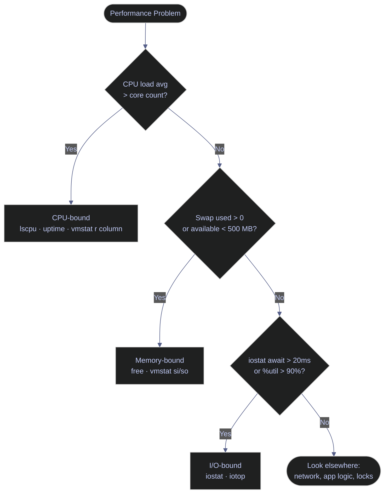

# System Resources — Memory, CPU, and Disk I/O

> [!quote]+
>
> "Anyone can build a fast CPU. The trick is to build a fast system."
>
> — **Seymour Cray**, attributed remark (c. 1980s)

> [!abstract]- Summary
>
> Use these Linux and PowerShell commands to decide whether a slowdown comes from CPU saturation, memory pressure, or disk latency. The note emphasizes the signals that matter in practice: `available` memory instead of raw `free`, load average relative to core count, swap and paging counters, and per-device I/O latency.

> [!note]- Glossary
>
> **RSS (Resident Set Size)**
>
> 1. The portion of a process's virtual memory that is currently resident in physical RAM rather than swapped out.
> 2. Used as the most practical per-process memory footprint metric when estimating how much real memory a workload is consuming right now.
> 3. VSZ (Virtual Size) includes the full virtual address space: mapped files, shared libraries, reserved regions, and memory that may not be resident in RAM. RSS is usually the more actionable number for capacity analysis.
>
> ---
>
> **Swap**
>
> 1. Disk-backed virtual memory used when the kernel moves less-active memory pages out of RAM to free physical memory for active workloads.
> 2. Used to extend survivability under memory pressure, but sustained swap activity usually indicates the system does not have enough RAM for its active working set.
> 3. Accessing swapped pages is far slower than accessing RAM and can cause severe latency spikes. The real warning sign is ongoing swap-in or swap-out activity, not merely non-zero swap usage.
>
> ---
>
> **Load average**
>
> 1. Three exponentially weighted moving averages over 1, 5, and 15 minutes showing how many tasks are runnable or waiting in uninterruptible sleep on Linux.
> 2. Used as a high-level pressure indicator for CPU scheduling and blocked work, especially when combined with CPU and disk metrics to determine the real bottleneck.
> 3. Load average is not a pure CPU metric. Processes stuck in uninterruptible I/O wait also contribute, so a high load value with modest CPU utilization often points to storage or network-backed I/O problems rather than CPU saturation.
>
> ---
>
> **`free`**
>
> 1. Linux command that summarizes system memory usage, including total, used, free, shared, buffer/cache, and available memory.
> 2. Used for a quick view of whether the system still has practical headroom for new allocations without reclaiming aggressively or swapping.
> 3. The `free` column alone is misleading because Linux uses idle RAM for page cache. The `available` column is the more useful estimate of memory that can be allocated without heavy pressure.
>
> ---
>
> **`vmstat`**
>
> 1. Linux monitoring tool that reports process scheduling, virtual memory activity, swap I/O, block I/O, interrupts, context switches, and CPU time in a compact tabular view.
> 2. Used for fast diagnosis of whether a slowdown is primarily CPU pressure, memory pressure, or I/O blocking.
> 3. The first `vmstat` line is a since-boot average, not a current sample. Use repeated samples such as `vmstat 1` and interpret the later rows for real-time behavior.
>
> ---
>
> **`iostat`**
>
> 1. Linux I/O statistics tool from the `sysstat` package that reports per-device throughput, queueing, utilization, and latency metrics.
> 2. Used to confirm whether storage devices are saturated and whether latency or queue depth is the main storage-side problem.
> 3. `await` shows average service-plus-queue time, `aqu-sz` shows average queue depth, and `%util` shows how busy the device was during the sample interval. Interpret all three together rather than treating any one field as sufficient on its own.
>
> ---
>
> **`%wa` (I/O wait)**
>
> 1. The percentage of CPU time spent idle while the system had at least one pending disk or block-I/O request waiting to complete.
> 2. Used as a signal that the CPUs are stalled behind storage latency rather than fully occupied doing compute work.
> 3. High `%wa` strongly suggests an I/O bottleneck, but it does not identify which device or process is responsible. Confirm with `iostat -x`, `iotop`, or platform-specific storage counters.
>
> ---
>
> **`Get-Counter`**
>
> 1. PowerShell cmdlet that reads Windows Performance Monitor counters and returns typed samples for memory, CPU, disk, network, and many application-specific metrics.
> 2. Used as the Windows equivalent of pulling structured operational metrics from tools such as `vmstat`, `iostat`, and `free`.
> 3. `\Processor(_Total)\% Processor Time` shows overall CPU usage, `\Memory\Available MBytes` shows immediately available memory, and `\PhysicalDisk(*)\Avg. Disk sec/Read` plus `\PhysicalDisk(*)\Avg. Disk Queue Length` help identify storage latency and backlog.
>
> ---
>
> **PLE (Page Life Expectancy)**
>
> 1. SQL Server buffer-cache metric estimating how long, in seconds, a data page remains in the buffer pool before being evicted.
> 2. Used as a trend indicator for buffer-pool churn and memory pressure inside SQL Server, especially when correlated with workload changes and physical I/O metrics.
> 3. A universal threshold such as 300 seconds is outdated and often misleading. Evaluate PLE against the server's normal baseline, NUMA topology, workload pattern, and concurrent evidence such as read I/O, page reads, and memory configuration.
>
> ---
>
> **OOM killer**
>
> 1. Linux kernel mechanism that selects and terminates one or more processes when memory pressure becomes severe enough that the system cannot satisfy further allocations safely.
> 2. Used by the kernel as a last-resort survival mechanism to keep the system running when memory exhaustion would otherwise cause a wider failure.
> 3. The kernel chooses a target based on its scoring rules at the time of exhaustion. The killed process may be the largest or least protected victim, not necessarily the original source of the pressure.

Resource monitoring tells you whether performance problems are CPU-bound, memory-constrained, or I/O-limited. Those are different failure modes, and each one needs a different command path.

The diagram below shows how CPU, memory, and disk I/O relate as diagnostic layers. Each bottleneck type requires a different set of commands to isolate.



## Linux memory tools

Linux provides several commands for inspecting memory consumption, swap usage, and buffer cache behavior. The most important concept is the distinction between `free` and `available` memory: Linux aggressively uses free RAM as a disk cache (`buff/cache`), which accelerates reads but makes raw `free` figures misleading.

### Linux | free | memory usage and available RAM

`free` reports total, used, free, shared, buffer/cache, and available memory. The `available` column is the authoritative figure because it represents free memory plus reclaimable cache that new allocations can usually consume without triggering swap.

#### Display memory in human-readable units

The `-h` flag converts bytes to GB and MB automatically. Without it, output is in kibibytes.

```bash
free -h
```

```text
               total        used        free      shared  buff/cache   available
Mem:            31Gi        18Gi       1.2Gi       512Mi        12Gi        12Gi
Swap:          2.0Gi          0B       2.0Gi
```

The `available` column, 12 GB here, is the practical headroom figure. The `free` column looks small because Linux is using idle RAM as cache and will reclaim that cache under pressure.

If `available` falls below roughly 500 MB on a database host, reclaim becomes aggressive and the risk of an OOM kill rises. Swap use by itself is not automatically a failure, but sustained growth or active swap I/O means the working set no longer fits in RAM.

#### Display memory in megabytes

The `-m` flag outputs values in mebibytes (MiB), which is useful when you want integer thresholds in scripts or dashboards.

```bash
free -m
```

```text
               total        used        free      shared  buff/cache   available
Mem:           31874       18432        1228         512       12214       12934
Swap:           2047           0        2047
```

#### Show running total updated every N seconds

The `-s` flag repeats the output at a fixed interval, which is useful while a workload or maintenance task is in progress.

```bash
free -h -s 2
```

```text
               total        used        free      shared  buff/cache   available
Mem:            31Gi        18Gi       1.2Gi       512Mi        12Gi        12Gi
Swap:          2.0Gi          0B       2.0Gi

               total        used        free      shared  buff/cache   available
Mem:            31Gi        19Gi       0.9Gi       512Mi        12Gi        11Gi
Swap:          2.0Gi          0B       2.0Gi
```

Use these `free` options when you need a different unit, repeat mode, or totals row.

| Flag | Syntax | Description |
|---|---|---|
| `-h` | `free -h` | Human-readable output (KB/MB/GB) |
| `-m` | `free -m` | Output in mebibytes |
| `-g` | `free -g` | Output in gibibytes |
| `-s N` | `free -h -s 2` | Repeat output every N seconds |
| `-c N` | `free -h -c 5` | Repeat N times then exit |
| `-t` | `free -h -t` | Add a totals row (Mem + Swap combined) |
| `-w` | `free -h -w` | Wide output: split buffers and cache into separate columns |

### Linux | free | SQL Server memory interpretation

SQL Server on Linux intentionally acquires and holds memory up to its configured ceiling because the buffer pool is supposed to keep active data pages resident. That behavior makes `free -h` look full even on a healthy host.

The right question is not whether SQL Server is using RAM. The right question is whether the buffer pool is churning fast enough to create physical reads and operating-system pressure.

#### Query page life expectancy before treating low `free` as a SQL problem

Page Life Expectancy (PLE) is a trend metric, not a universal pass-fail threshold. The old fixed 300-second rule is only a coarse legacy checkpoint; sustained drops toward double digits, or a sharp collapse from the server's normal baseline, are stronger evidence of real pressure than one isolated reading.

```sql
SELECT COALESCE(NULLIF(instance_name, ''), 'total') AS buffer_node,
       cntr_value AS PLE_seconds
FROM sys.dm_os_performance_counters
WHERE counter_name = 'Page life expectancy'
  AND object_name LIKE '%Buffer Manager%';
```

```text
buffer_node PLE_seconds
----------- -----------
total 21036
```

This live query returned a single `total` buffer node with PLE above twenty thousand seconds, which indicates stable cache residency rather than immediate churn. On NUMA systems you can see one row per node; compare each node against its normal workload baseline instead of enforcing a single absolute floor.

#### Inspect max server memory before raising it

If PLE is collapsing and physical reads are rising, verify SQL Server's configured ceiling before you change it. The query below is read-only and shows whether the instance is capped or still using the engine default.

```sql
SELECT value_in_use AS max_server_memory_mb
FROM sys.configurations
WHERE name = 'max server memory (MB)';
```

```text
max_server_memory_mb
--------------------
2147483647
```

`2147483647` is the default uncapped value, which means SQL Server can keep taking memory until the operating system pushes back. On production hosts, leave explicit OS headroom before increasing the ceiling: at least 4 GB on 16-64 GB systems and at least 10% above that range. See [max server memory configuration](https://alp78.github.io/elysium/04-Databases/01-SQL-Server/01-Server-Operations/server-configuration) for the change procedure and [memory-and-buffer-pool](https://alp78.github.io/elysium/04-Databases/01-SQL-Server/01-Server-Operations/memory-and-buffer-pool) for buffer-pool internals.

## Linux CPU tools

CPU monitoring on Linux requires two separate concepts: capacity, which is how many threads the system can run in parallel, and queueing, which is how many tasks are competing for that capacity. `lscpu` and `uptime` together answer that question.

### Linux | lscpu | CPU topology and core count

`lscpu` reads `/proc/cpuinfo` and `/sys/devices/system/cpu/` to report the CPU architecture, socket count, core count, and thread count. The total parallel capacity of the system is the `CPU(s)` value, which equals sockets x cores per socket x threads per core.

#### Display full CPU topology

```bash
lscpu
```

```text
Architecture:            x86_64
  CPU op-mode(s):        32-bit, 64-bit
  Byte Order:            Little Endian
CPU(s):                  8
  On-line CPU(s) list:   0-7
Vendor ID:               GenuineIntel
  Model name:            Intel(R) Core(TM) i7-10700 CPU @ 2.90GHz
  Thread(s) per core:    2
  Core(s) per socket:    4
  Socket(s):             1
  NUMA node(s):          1
Caches (sum of all):
  L1d:                   128 KiB (4 instances)
  L1i:                   128 KiB (4 instances)
  L2:                    1 MiB (4 instances)
  L3:                    16 MiB (1 instance)
```

The key number is `CPU(s): 8`. This system can execute eight threads simultaneously, so a sustained load average above 8.0 means runnable work is queueing for CPU time.

### Linux | uptime | load average over time

`uptime` reports system uptime and the 1-minute, 5-minute, and 15-minute load averages. Load average is a process count, not a percentage: it tracks tasks that are runnable or stuck in uninterruptible wait.

#### Check current load average

```bash
uptime
```

```text
 14:23:11 up 12 days,  3:47,  2 users,  load average: 1.42, 2.15, 3.08
```

On an 8-core system, these figures mean the host was comfortably below CPU saturation and the trend was falling rather than building. If the 1-minute value climbs above the 15-minute value, load is rising; if load average stays above the CPU count, runnable work is queuing.

If load is high while total CPU usage stays modest, treat that as an I/O clue instead of assuming a compute problem. `vmstat` and `iostat` usually explain that pattern faster than more CPU counters.

These `uptime` options help when you only need boot time or a compact uptime string.

| Flag | Syntax | Description |
|---|---|---|
| (none) | `uptime` | Print uptime and 1/5/15-minute load averages |
| `-p` | `uptime -p` | Pretty-print uptime only (e.g., "up 12 days, 3 hours") |
| `-s` | `uptime -s` | Print system boot time in `YYYY-MM-DD HH:MM:SS` format |

## Linux combined resource tools

Some tools report CPU, memory, and I/O together in a single view. They are most useful when you do not yet know which resource is actually the bottleneck.

### Linux | vmstat | CPU, memory, and I/O snapshot

`vmstat` (virtual memory statistics) reports process scheduling, memory pages, swap activity, block I/O, and CPU time in one screen. The first row is always a since-boot average, so the later samples are the ones that matter for triage.

#### Sample system state at a fixed interval

The two positional arguments are the interval in seconds and the number of samples. Omitting the sample count runs indefinitely until interrupted.

```bash
vmstat 2 5
```

```text
procs -----------memory---------- ---swap-- -----io---- -system-- ------cpu-----
 r  b   swpd   free   buff  cache   si   so    bi    bo   in   cs us sy id wa st
 1  0      0 1254812 102400 12582912  0    0    18   124  420  890  8  2 88  2  0
 2  0      0 1198032 102400 12582912  0    0     0   256  512 1024 12  3 83  2  0
 0  0      0 1201344 102400 12582912  0    0     0    64  380  780  5  1 93  1  0
 1  0      0 1199080 102400 12582912  0    0     0   128  490  960  9  2 87  2  0
 0  0      0 1200000 102400 12582912  0    0     0    96  400  820  6  1 92  1  0
```

Column meanings:
- `r` — processes currently runnable (in the CPU run queue). Sustained values above the core count indicate CPU saturation.
- `b` — processes blocked waiting for I/O. Values above 2-3 indicate I/O saturation.
- `si` / `so` — kilobytes per second swapped in from disk and swapped out to disk. Any non-zero value indicates memory pressure; consistent values above 100 KB/s indicate severe pressure.
- `us` / `sy` — percentage of CPU time in user space and kernel space. High `sy` with modest `us` suggests kernel overhead or excessive system calls.
- `wa` — percentage of CPU time spent waiting for I/O to complete. Values above 20% indicate a disk bottleneck.
- `st` — percentage of CPU time stolen by the hypervisor on a virtual machine. Any non-zero value means the VM is competing for physical CPU with other guests.

Persistent non-zero `si` or `so` means the kernel is actively moving pages to or from swap. If `r` stays above the core count, chase CPU pressure next; if `b` stays elevated, chase storage latency next.

Use these `vmstat` options when you need timestamps, unit changes, or focused memory and disk summaries.

| Flag | Syntax | Description |
|---|---|---|
| `-a` | `vmstat -a` | Show active/inactive memory instead of buff/cache |
| `-d` | `vmstat -d` | Report disk statistics only |
| `-s` | `vmstat -s` | Print memory event counters as a summary table |
| `-t` | `vmstat 2 5 -t` | Add a timestamp column to each row |
| `-S m` | `vmstat -S m` | Output memory columns in mebibytes |
| `interval` | `vmstat 2` | Sample every 2 seconds (runs until interrupted) |
| `interval count` | `vmstat 2 5` | Sample every 2 seconds, stop after 5 samples |

## Linux disk I/O tools

Disk I/O monitoring requires two separate views: the device-level throughput and latency view from `iostat`, and the process-level view of which workload is generating the I/O. On minimal Linux images, `iostat` comes from the `sysstat` package rather than the base install.

### Linux | iostat | disk I/O performance and utilization

`iostat` reads I/O statistics from `/proc/diskstats`. The `-x` flag expands the output to include latency and utilization metrics, and `-z` suppresses idle devices.

#### Extended disk statistics at a fixed interval

```bash
iostat -xz 2
```

```text
Device            r/s     w/s     rkB/s     wkB/s   rrqm/s   wrqm/s  %rrqm  %wrqm r_await w_await aqu-sz rareq-sz wareq-sz  svctm  %util
sda              0.50   45.20      6.40   2304.00     0.00    12.40   0.00  21.50    0.80    8.20   0.37    12.80    50.97   0.42   1.93
nvme0n1          2.10  120.50    128.00   8960.00     0.00     8.20   0.00   6.37    0.30    1.20   0.15    60.95    74.36   0.18   2.21
```

Column meanings:
- `r/s` / `w/s` — read and write operations per second. High values indicate a busy device but do not alone prove saturation.
- `rkB/s` / `wkB/s` — read and write throughput in kilobytes per second. Compare against the device's rated bandwidth to assess sustained pressure.
- `r_await` / `w_await` — average time in milliseconds from request submission to completion, including queue time. For SSDs, below 1 ms is excellent, 1-5 ms is normal, and above 20 ms indicates saturation. For HDDs, 5-15 ms is normal and above 50 ms indicates saturation.
- `aqu-sz` — average I/O queue depth. A sustained queue depth above 1.0 on a single device indicates requests are arriving faster than the device can serve them.
- `%util` — percentage of time the device had at least one I/O request in progress. Values above 90% indicate the device is at or near saturation.

Treat `%util` as one signal, not the only one. On SSDs and NVMe, rising `await` and `aqu-sz` usually tell you more than a momentary 100% utilization reading.

Use these `iostat` options when you want timestamps, different units, or a bounded sample run.

| Flag | Syntax | Description |
|---|---|---|
| `-x` | `iostat -x` | Extended statistics (await, %util, queue depth) |
| `-z` | `iostat -z` | Suppress devices with zero activity |
| `-d` | `iostat -d` | Show disk stats only (suppress CPU summary) |
| `-m` | `iostat -m` | Output in megabytes per second instead of kilobytes |
| `-k` | `iostat -k` | Output in kilobytes per second (default) |
| `-t` | `iostat -xt 2` | Add timestamp to each report |
| `interval` | `iostat -xz 2` | Sample every 2 seconds |
| `interval count` | `iostat -xz 2 5` | Sample every 2 seconds, 5 samples then exit |

### Linux | iotop | per-process disk I/O

`iotop` shows which processes are generating disk I/O at the moment of inspection. It requires root privileges because it reads per-process I/O accounting from the kernel. The `-o` flag restricts output to processes with active I/O, which keeps the display uncluttered.

#### Show only processes with active I/O

```bash
sudo iotop -o
```

```text
Total DISK READ:       128.00 K/s | Total DISK WRITE:      8.96 M/s
Current DISK READ:     128.00 K/s | Current DISK WRITE:    8.96 M/s
  TID  PRIO  USER     DISK READ  DISK WRITE  SWAPIN     IO>    COMMAND
 4821 be/4 mssql      0.00 B/s    8.64 M/s  0.00 %  2.14 %  sqlservr
 1234 be/4 root       128.00 K/s   0.00 B/s  0.00 %  0.14 %  jbd2/sda1-8
```

The `IO>` column shows the percentage of time the process spent waiting for I/O to complete. High values indicate the process is I/O-bound. The `SWAPIN` column shows the percentage of time spent waiting for swapped-out pages to be read back into RAM.

Use these `iotop` options when you need batch capture, a fixed sample count, or filtering by process or user.

| Flag | Syntax | Description |
|---|---|---|
| `-o` | `sudo iotop -o` | Show only processes with active I/O |
| `-b` | `sudo iotop -b` | Batch mode (non-interactive, useful for logging) |
| `-n N` | `sudo iotop -b -n 5` | Exit after N iterations (batch mode only) |
| `-d N` | `sudo iotop -d 2` | Set sampling interval to N seconds |
| `-p PID` | `sudo iotop -p 4821` | Monitor a specific process by PID |
| `-u USER` | `sudo iotop -u mssql` | Filter by username |

## PowerShell memory tools

PowerShell on Windows exposes memory statistics through CIM classes and Performance Monitor counters. The closest equivalent to Linux `free` is `Get-CimInstance Win32_OperatingSystem`, which reports total and free physical memory.

### PowerShell | Get-CimInstance | memory usage and available RAM

`Get-CimInstance` queries the Common Information Model repository, which on Windows is backed by WMI. The `Win32_OperatingSystem` class reports total physical RAM, free physical RAM, total virtual memory, and free virtual memory.

#### Report total, free, and used memory

Memory values in `Win32_OperatingSystem` are returned in kibibytes. Dividing by `1MB` converts them to gibibytes.

```powershell
$os = Get-CimInstance Win32_OperatingSystem
[PSCustomObject]@{
    'Total (GB)' = [math]::Round($os.TotalVisibleMemorySize / 1MB, 1)
    'Free (GB)'  = [math]::Round($os.FreePhysicalMemory / 1MB, 1)
    'Used %'     = [math]::Round((1 - $os.FreePhysicalMemory / $os.TotalVisibleMemorySize) * 100)
}
```

```text
Total (GB) Free (GB) Used %
---------- --------- ------
      31.9       8.4     74
```

`Used %` of 74 means physical RAM is allocated but not yet under obvious pressure. Values above 95% matter more when they coincide with sustained paging, not just because the percentage is high.

#### Sample `\Memory\Pages/sec` when RAM looks full

Windows uses the page file opportunistically, so a momentary non-zero rate is not enough to diagnose memory pressure. Sample the counter over several intervals and correlate it with available RAM and the size of the active working sets.

```powershell
(Get-Counter '\Memory\Pages/sec' -SampleInterval 1 -MaxSamples 3).CounterSamples |
    Select-Object InstanceName, CookedValue |
    Format-Table -AutoSize
```

```text
InstanceName CookedValue
------------ -----------
                  126.75
                   78.99
                   95.79
```

These samples stayed far below the sustained thousands-per-second rates that usually accompany heavy paging, so the host was not under obvious page-file pressure during capture.

Use these `Get-CimInstance` parameters when you need to target a specific class, a remote host, or selected properties.

| Flag/Parameter | Syntax | Description |
|---|---|---|
| `-ClassName` | `Get-CimInstance Win32_OperatingSystem` | Query a specific CIM class |
| `-ComputerName` | `Get-CimInstance Win32_OperatingSystem -ComputerName srv01` | Query a remote computer |
| `-Filter` | `Get-CimInstance Win32_Process -Filter "Name='sqlservr.exe'"` | Filter results using WQL syntax |
| `-Property` | `Get-CimInstance Win32_OperatingSystem -Property FreePhysicalMemory` | Return only specified properties |

## PowerShell CPU tools

Windows Performance Monitor counters provide CPU utilization data equivalent to Linux `uptime` and `vmstat`. `Get-Counter` reads these counters at a specified interval and returns typed objects that are suitable for scripting and alerting.

### PowerShell | Get-Counter | CPU utilization over time

`Get-Counter` reads Windows Performance Monitor counter paths. The `\Processor(_Total)\% Processor Time` counter measures the percentage of time all logical processors spent executing non-idle threads during the sample interval.

#### Sample total CPU utilization

The `-SampleInterval` and `-MaxSamples` parameters mirror `vmstat`'s interval and count arguments.

```powershell
Get-Counter '\Processor(_Total)\% Processor Time' -SampleInterval 2 -MaxSamples 5
```

```text
Timestamp                 CounterSamples
---------                 --------------
4/3/2026 2:23:11 PM       \\server01\processor(_total)\% processor time :
                          18.432167

4/3/2026 2:23:13 PM       \\server01\processor(_total)\% processor time :
                          24.817340

4/3/2026 2:23:15 PM       \\server01\processor(_total)\% processor time :
                          12.003201
```

Values below 70% are generally comfortable for a server under normal load. Sustained values above 85% mean the scheduler has little burst headroom, and repeated samples near 100% mean the host is CPU-saturated.

#### Sample per-core CPU utilization

Monitoring individual cores reveals whether load is evenly distributed or concentrated on one logical CPU. That is the fastest way to spot a single-threaded hotspot on an otherwise quiet system.

```powershell
Get-Counter '\Processor(*)\% Processor Time' -SampleInterval 2 -MaxSamples 3
```

```text
Timestamp                 CounterSamples
---------                 --------------
4/3/2026 2:23:11 PM       \\server01\processor(0)\% processor time : 42.1
                          \\server01\processor(1)\% processor time : 18.3
                          \\server01\processor(2)\% processor time : 67.8
                          \\server01\processor(3)\% processor time : 12.0
                          \\server01\processor(_total)\% processor time : 35.1
```

Core 2 at 67.8% while the others stay much lower indicates an uneven workload rather than system-wide CPU saturation.

Use these `Get-Counter` parameters when you need a bounded sample, an indefinite watch, or a remote query.

| Parameter | Syntax | Description |
|---|---|---|
| `-SampleInterval` | `-SampleInterval 2` | Seconds between samples (default: 1) |
| `-MaxSamples` | `-MaxSamples 5` | Stop after N samples |
| `-Continuous` | `-Continuous` | Sample indefinitely until interrupted |
| `-ComputerName` | `-ComputerName srv01` | Query a remote computer |

## PowerShell disk I/O tools

Windows disk I/O monitoring uses Performance Monitor counters for device-level throughput and latency, which is the nearest equivalent to Linux `iostat`. For per-process I/O, `Get-Process` provides cumulative byte counts but not the same real-time delta view as `iotop`.

### PowerShell | Get-Counter | disk I/O performance

The `\PhysicalDisk` counter set provides read and write operations per second, throughput, and average I/O latency. The `(*)` wildcard captures all physical disks simultaneously.

#### Sample disk throughput and latency

```powershell
Get-Counter '\PhysicalDisk(*)\Disk Reads/sec',
            '\PhysicalDisk(*)\Disk Writes/sec',
            '\PhysicalDisk(*)\Avg. Disk sec/Read',
            '\PhysicalDisk(*)\Avg. Disk sec/Write' `
    -SampleInterval 2 -MaxSamples 5
```

```text
Timestamp                 CounterSamples
---------                 --------------
4/3/2026 2:23:11 PM       \\server01\physicaldisk(0 c:)\disk reads/sec : 2.47
                          \\server01\physicaldisk(0 c:)\disk writes/sec : 48.32
                          \\server01\physicaldisk(0 c:)\avg. disk sec/read : 0.000312
                          \\server01\physicaldisk(0 c:)\avg. disk sec/write : 0.001024
                          \\server01\physicaldisk(_total)\disk reads/sec : 2.47
                          \\server01\physicaldisk(_total)\disk writes/sec : 48.32
```

`Avg. Disk sec/Read` and `Avg. Disk sec/Write` are measured in seconds, so 0.000312 means 0.31 ms. Values above 0.020 seconds, 20 ms, are a practical storage warning sign on SSD-backed systems.

#### Sample disk queue depth

```powershell
Get-Counter '\PhysicalDisk(*)\Avg. Disk Queue Length' -SampleInterval 2 -MaxSamples 5
```

```text
Timestamp                 CounterSamples
---------                 --------------
4/3/2026 2:23:11 PM       \\server01\physicaldisk(0 c:)\avg. disk queue length : 0.82
                          \\server01\physicaldisk(_total)\avg. disk queue length : 0.82
```

A queue length of 0.82 means the device is servicing requests as they arrive, with no meaningful backlog. On Windows, sustained queue depth above about 2 on a single HDD or above a few dozen on NVMe indicates storage contention.

Use these counter paths as a compact reference for the Windows disk metrics discussed above.

| Counter | Description |
|---|---|
| `\PhysicalDisk(*)\Disk Reads/sec` | Read operations per second per disk |
| `\PhysicalDisk(*)\Disk Writes/sec` | Write operations per second per disk |
| `\PhysicalDisk(*)\Avg. Disk sec/Read` | Average read latency in seconds |
| `\PhysicalDisk(*)\Avg. Disk sec/Write` | Average write latency in seconds |
| `\PhysicalDisk(*)\Avg. Disk Queue Length` | Average number of queued I/O requests |
| `\PhysicalDisk(*)\Disk Read Bytes/sec` | Read throughput in bytes per second |
| `\PhysicalDisk(*)\Disk Write Bytes/sec` | Write throughput in bytes per second |

## Recommendations

These scenario-first checks map the earlier tool sections to the first question you are trying to answer.

### Linux

Use the Linux checks below when the host itself is in scope and you need the shortest path to the right metric.

#### Check usable memory before reacting to low `free`

Start with the `free -h` view above and read `available`, not `free`. If `available` is still comfortable, low raw `free` usually means page cache is doing useful work rather than that RAM is exhausted.

#### Use `vmstat` when CPU, memory, and I/O symptoms overlap

When you do not yet know whether the bottleneck is CPU, swap, or storage, `vmstat 2 5` gives the quickest combined view. Read the repeated samples, not the since-boot first line.

#### Sample each logical CPU when one hot thread is plausible

Total CPU can look healthy while one thread stays pinned. `mpstat -P ALL` is the fastest way to confirm that imbalance before you chase application-level concurrency.

```bash
mpstat -P ALL 1 1
```

```text
Linux 6.6.87.2-microsoft-standard-WSL2 (Elysium) 	04/14/26 	_x86_64_	(16 CPU)

15:48:43     CPU    %usr   %nice    %sys %iowait    %irq   %soft  %steal  %guest  %gnice   %idle
15:48:44     all    0.43    0.00    0.06    0.00    0.00    0.06    0.00    0.00    0.00   99.44
15:48:44       0    0.00    0.00    0.00    0.00    0.00    0.99    0.00    0.00    0.00   99.01
15:48:44       1    0.00    0.00    0.00    0.00    0.00    0.00    0.00    0.00    0.00  100.00
15:48:44       2    0.00    0.00    0.00    0.00    0.00    0.00    0.00    0.00    0.00  100.00
15:48:44       3    0.00    0.00    0.00    0.00    0.00    0.00    0.00    0.00    0.00  100.00
15:48:44       4    0.99    0.00    0.00    0.00    0.00    0.00    0.00    0.00    0.00   99.01
15:48:44       5    0.00    0.00    0.00    0.00    0.00    0.00    0.00    0.00    0.00  100.00
15:48:44       6    0.99    0.00    0.00    0.00    0.00    0.00    0.00    0.00    0.00   99.01
15:48:44       7    0.99    0.00    0.00    0.00    0.00    0.00    0.00    0.00    0.00   99.01
15:48:44       8    0.00    0.00    0.00    0.00    0.00    0.00    0.00    0.00    0.00  100.00
15:48:44       9    0.00    0.00    0.00    0.00    0.00    0.00    0.00    0.00    0.00  100.00
15:48:44      10    0.99    0.00    0.00    0.00    0.00    0.00    0.00    0.00    0.00   99.01
15:48:44      11    0.00    0.00    0.00    0.00    0.00    0.00    0.00    0.00    0.00  100.00
15:48:44      12    0.99    0.00    0.99    0.00    0.00    0.00    0.00    0.00    0.00   98.02
15:48:44      13    0.00    0.00    0.00    0.00    0.00    0.00    0.00    0.00    0.00  100.00
15:48:44      14    1.96    0.00    0.00    0.00    0.00    0.00    0.00    0.00    0.00   98.04
15:48:44      15    0.00    0.00    0.00    0.00    0.00    0.00    0.00    0.00    0.00  100.00

Average:     CPU    %usr   %nice    %sys %iowait    %irq   %soft  %steal  %guest  %gnice   %idle
Average:     all    0.43    0.00    0.06    0.00    0.00    0.06    0.00    0.00    0.00   99.44
Average:       0    0.00    0.00    0.00    0.00    0.00    0.99    0.00    0.00    0.00   99.01
Average:       1    0.00    0.00    0.00    0.00    0.00    0.00    0.00    0.00    0.00  100.00
Average:       2    0.00    0.00    0.00    0.00    0.00    0.00    0.00    0.00    0.00  100.00
Average:       3    0.00    0.00    0.00    0.00    0.00    0.00    0.00    0.00    0.00  100.00
Average:       4    0.99    0.00    0.00    0.00    0.00    0.00    0.00    0.00    0.00   99.01
Average:       5    0.00    0.00    0.00    0.00    0.00    0.00    0.00    0.00    0.00  100.00
Average:       6    0.99    0.00    0.00    0.00    0.00    0.00    0.00    0.00    0.00   99.01
Average:       7    0.99    0.00    0.00    0.00    0.00    0.00    0.00    0.00    0.00   99.01
Average:       8    0.00    0.00    0.00    0.00    0.00    0.00    0.00    0.00    0.00  100.00
Average:       9    0.00    0.00    0.00    0.00    0.00    0.00    0.00    0.00    0.00  100.00
Average:      10    0.99    0.00    0.00    0.00    0.00    0.00    0.00    0.00    0.00   99.01
Average:      11    0.00    0.00    0.00    0.00    0.00    0.00    0.00    0.00    0.00  100.00
Average:      12    0.99    0.00    0.99    0.00    0.00    0.00    0.00    0.00    0.00   98.02
Average:      13    0.00    0.00    0.00    0.00    0.00    0.00    0.00    0.00    0.00  100.00
Average:      14    1.96    0.00    0.00    0.00    0.00    0.00    0.00    0.00    0.00   98.04
Average:      15    0.00    0.00    0.00    0.00    0.00    0.00    0.00    0.00    0.00  100.00
```

This capture shows a mostly idle host with no hot-core problem at the time. On a saturated system, look for one or a small number of CPUs staying high while the rest remain comparatively idle.

### PowerShell

Use these PowerShell checks when you need the Windows host view before you pivot into process or storage triage.

#### Start with OS totals, then sample paging

Begin with the `Win32_OperatingSystem` snapshot and follow it with `\Memory\Pages/sec` only if RAM looks tight. That sequence distinguishes healthy cache use from sustained page-file pressure.

#### Use total counters first, then drill into cores or disks

Start with `\Processor(_Total)\% Processor Time` and the aggregate `\PhysicalDisk(*)` counters. If those totals stay elevated, move to the per-core, queue-depth, or per-process views rather than collecting every counter path up front.

## Troubleshooting

These symptom-driven paths keep the follow-up commands out of table cells and tie them to specific evidence.

### Linux

The Linux scenarios below assume you already captured at least one `free`, `vmstat`, or `iostat` sample.

#### Load is high while CPU usage stays modest

On Linux, that pattern often means tasks are blocked in uninterruptible sleep (`D` state), usually behind disk or network-backed I/O. Confirm it by checking the `b` column in `vmstat` and the latency fields in `iostat`, then use the `iotop` example above to see which process is driving the wait.

#### `vmstat` shows swap activity and you need the largest RSS consumers

Once `si` or `so` stays non-zero, sort processes by RSS so you can see which working sets are currently resident in RAM. The `rss` column reported below is in KiB.

```bash
ps -eo pid,user,%cpu,%mem,rss,comm --sort=-rss | head -6
```

```text
    PID USER     %CPU %MEM   RSS COMMAND
    623 root      0.0  0.0 26540 docker-desktop-
    193 root      0.0  0.0 22656 unattended-upgr
     42 root      0.0  0.0 18488 systemd-journal
    139 systemd+  0.0  0.0 12800 systemd-resolve
      1 root      0.0  0.0 12356 systemd
```

This capture shows a small WSL workload with no obvious memory hog. On a pressured host, the top RSS entries are the first candidates to compare with application expectations and container limits.

#### Kernel slab usage is a suspect but the shell is unprivileged

An unprivileged shell may not be able to run deeper slab-cache tooling. As a safe first pass, inspect the slab totals in `/proc/meminfo` and compare reclaimable versus unreclaimable kernel memory before escalating to root-level analysis.

```bash
grep -E '^(Slab|SReclaimable|SUnreclaim):' /proc/meminfo
```

```text
Slab:             374800 kB
SReclaimable:     249220 kB
SUnreclaim:       125580 kB
```

Here, about 249 MB of slab memory was reclaimable and about 126 MB was unreclaimable. A large `SUnreclaim` value is more concerning because the kernel cannot free it as readily under pressure.

### PowerShell

The Windows scenarios below use read-only queries so you can triage pressure before changing services or counter configuration.

#### CPU stays high and you need the busiest processes

After the total or per-core CPU counters confirm saturation, sort processes by cumulative CPU time to find the workloads that have consumed the most scheduler time during the current uptime.

```powershell
Get-Process | Sort-Object CPU -Descending | Select-Object -First 5 Name, CPU, WorkingSet64
```

```text
Name            CPU WorkingSet64
----            --- ------------
Code      114304.64   1720029184
Code       42803.28    692494336
Code       41267.00    223453184
XPG-Prime  31633.03    106237952
Code       16832.88    332840960
```

This host was dominated by editor and UI processes during capture. In production, compare the same view against the expected service list before treating a process as abnormal.

#### Paging stays high and you need the largest working sets

If `\Memory\Pages/sec` remains elevated across several samples, sort processes by working set to see which resident footprints are competing for RAM right now. `WorkingSet64` is reported in bytes.

```powershell
Get-Process | Sort-Object WorkingSet64 -Descending | Select-Object -First 5 Name, WorkingSet64, CPU
```

```text
Name               WorkingSet64 CPU
----               ------------ ---
vmmemWSL             4305293312
Code                 1720029184 114304.66
Memory Compression   1105985536
claude                766287872 561.62
Code                  692547584 42803.28
```

The largest working set in this session belonged to `vmmemWSL`, followed by editor processes. That is a normal development-host pattern, but on a server the same view should align with the services you expect to keep resident.

#### Counter paths appear missing in `Get-Counter`

When a specific counter path fails, first verify that the local counter catalog exists. If the catalog enumerates normally but the path is absent, the issue is usually the chosen counter set rather than a broken PowerShell session.

```powershell
Get-Counter -ListSet * |
    Select-Object -First 8 CounterSetName |
    Format-Table -AutoSize
```

```text
CounterSetName
--------------
Hyper-V VM Virtual Device Pipe IO
Hyper-V Management VTL Processor
Ldap Client
DC Locator (Client)
RAS
Ntfs Bucketized Performance
Hyper-V VM Vid Partition
WSMan Quota Statistics
```

The successful enumeration above confirms that the counter catalog was present in this session. If the specific SQL Server or storage set you need is missing, troubleshoot that counter set rather than restarting services blindly.

## Cross-references

- [viewing-processes](https://alp78.github.io/elysium/01-Shell/Process-Management/viewing-processes) — identify which processes are consuming the resources
- [killing-processes](https://alp78.github.io/elysium/01-Shell/Process-Management/killing-processes) — terminate runaway processes consuming excess resources
- [managing-services](https://alp78.github.io/elysium/01-Shell/Process-Management/managing-services) — check if OOM kills are crashing services
- [datadog-sql-server-integration](https://alp78.github.io/elysium/13-Observability/Datadog/datadog-sql-server-integration) — automated monitoring of CPU, memory, and disk I/O with alerting and dashboards
