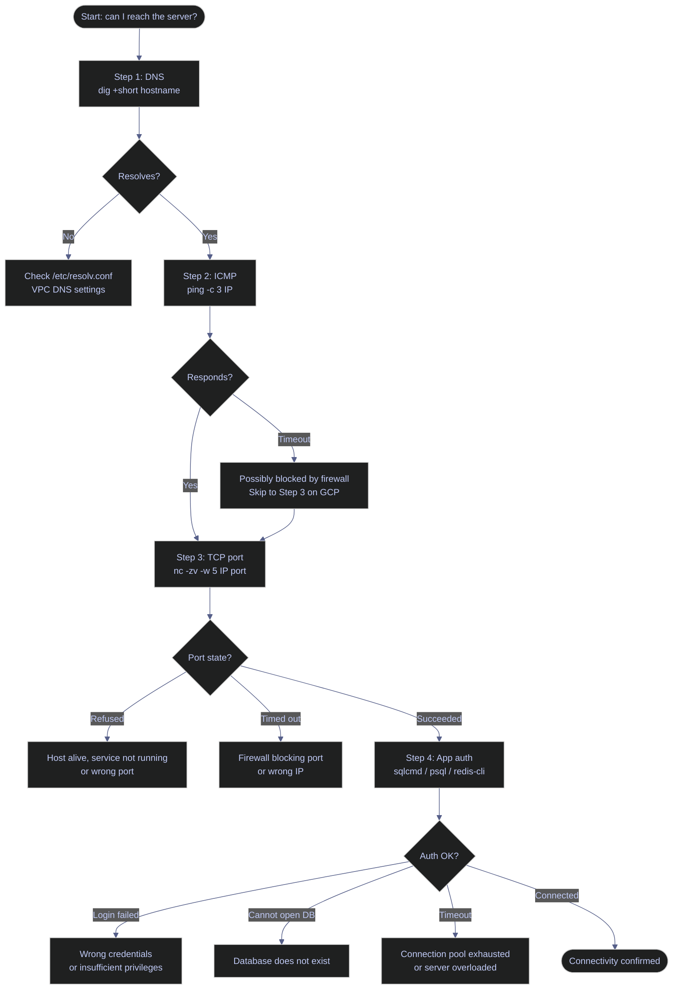

# Connectivity Testing — "Can I Reach the Server?"

The first question in any network debugging session is: "Can my client reach the server at all?" This seems simple, but there are multiple layers that can fail: DNS resolution, TCP routing, firewall rules, and the service itself. Working through the layers systematically turns a 2-hour debugging session into a 5-minute one.

> [!quote]
> "Everything fails, all the time."
>
> — **Werner Vogels**, AWS re:Invent keynote (2012)




## Key terms used in this note

| Term | Plain-English definition | Why it matters here | Common mistake / confusion |
|---|---|---|---|
| `ping` | Sends ICMP echo requests to a host and measures round-trip time. The most basic connectivity test. | Confirms whether a host is reachable at the network layer. The first command in any connectivity investigation. | ping may be blocked by firewalls (ICMP disabled). A host that does not respond to ping may still be reachable on specific TCP ports. |
| `traceroute` / `tracert` | Maps the network path between your machine and a destination by sending packets with incrementing TTL values. Each hop responds when TTL expires. | Identifies where in the network path a connection fails or slows down. Essential for diagnosing latency and routing issues. | traceroute shows network hops, not application-layer issues. A successful traceroute does not mean the application port is open. |
| `nslookup` / `dig` | DNS lookup tools. `nslookup` is simple and cross-platform. `dig` (Linux) provides detailed query/response information including TTL, authority, and additional records. | DNS resolution failures are a common cause of "connection refused" errors. Always verify DNS before blaming the application. | Using `nslookup` in scripts -- its output format varies between implementations. Use `dig +short` for scriptable DNS lookups. |
| `curl` | A command-line tool for transferring data using URLs. Supports HTTP, HTTPS, FTP, and many other protocols. | Tests HTTP connectivity, API endpoints, and TLS certificate validity. Combines connectivity test with application-layer verification. | `curl` exits 0 even on HTTP 4xx/5xx errors. Use `curl -f` (fail) to return non-zero on HTTP errors, or check `-w '%{http_code}'`. |
| `Test-NetConnection` (PS) | The PowerShell cmdlet for connectivity testing. Combines ping, TCP port test, and traceroute in one command. | The PowerShell equivalent of `ping` + `nc` (netcat). `-Port` tests TCP connectivity to a specific service port. | Only tests TCP, not UDP. Does not support custom timeouts below 1 second. |
| ICMP | Internet Control Message Protocol. Used by `ping` and `traceroute`. Operates at the network layer (Layer 3). | ICMP packets verify basic network reachability. Many firewalls block ICMP, which does not mean the host is unreachable. | Assuming ICMP block = host down. A host can block ICMP and still serve HTTP, SSH, and database traffic on TCP ports. |
| TTL (Time To Live) | A counter in each IP packet that decrements at every router hop. When TTL reaches 0, the router drops the packet and sends an ICMP "time exceeded" message. | `traceroute` works by exploiting TTL. Each increment reveals the next router in the path. Also used in DNS records to control cache duration. | DNS TTL and IP packet TTL are unrelated concepts that share the same abbreviation. |

## What this note covers

- Basic connectivity testing with `ping` (Linux and PowerShell)
- Network path tracing with `traceroute` / `tracert`
- DNS resolution with `nslookup` and `dig`
- TCP port testing with `nc` (netcat), `curl`, and `Test-NetConnection`
- Interpreting results: what "host unreachable," "connection refused," and "timeout" mean

## Linux connectivity testing tools

This section covers the core Linux tools for diagnosing network connectivity at each layer: `nc` and `/dev/tcp` for TCP port reachability, `dig` for DNS resolution, `traceroute` and `mtr` for path tracing, and `ss` for inspecting local listening ports.

### Linux | nc | port reachability and sweeping

`nc` (netcat) is the primary tool for testing whether a TCP port is open on a remote host. It can also sweep multiple ports in a loop, making it useful as a first diagnostic step after firewall changes or when connecting to a new VM.

#### Test whether a single port is open

`-z` runs nc in scan mode — it opens and immediately closes the connection without sending any data, which is the correct way to probe port availability. `-v` enables verbose output so the result is printed to stderr. `-w 5` sets a 5-second timeout to avoid hanging on unreachable hosts.

```bash
nc -zv -w 5 hostname 1433
```

```text
Connection to hostname (10.132.0.2) 1433 port [tcp/ms-sql-s] succeeded!
```

> [!tip] Refused vs timed out diagnosis
>
> - **Refused** = the host is reachable but nothing is listening on that port (service down, wrong port number).
> - **Timed out** = packets are being dropped (firewall rule, host unreachable, wrong IP).
>
> "Refused" is good news — the host is alive. "Timed out" means a network-layer problem.

#### Test a port without netcat installed

Bash exposes a built-in TCP pseudo-device at `/dev/tcp/<host>/<port>`. Opening this path attempts a TCP connection — no external tools required. This works on minimal containers and Docker images where netcat is not installed. `timeout 5` prevents the shell from hanging if the host is unreachable.

```bash
timeout 5 bash -c "echo > /dev/tcp/hostname/1433" && echo "OPEN" || echo "CLOSED"
```

```text
OPEN
```

#### Sweep multiple ports in a single pass

When connecting to a new environment or diagnosing after firewall changes, sweeping all relevant data engineering ports at once is faster than testing them individually. The loop below checks the most common ports and filters the verbose output to only show the result line.

```bash
for port in 1433 5432 6379 8080; do
    nc -zv -w 3 hostname $port 2>&1 | grep -E "succeeded|refused|timed out"
done
```

```text
Connection to hostname 1433 port [tcp/ms-sql-s] succeeded!
Connection to hostname 5432 port [tcp/postgresql] succeeded!
nc: connect to hostname port 6379 (tcp) timed out: Operation now in progress
Connection to hostname 8080 port [tcp/http-alt] refused
```

| Flag | Syntax | Description |
|---|---|---|
| `-z` | `nc -z host port` | Scan mode — connect and close immediately without sending data |
| `-v` | `nc -v host port` | Verbose — print result to stderr |
| `-w <n>` | `nc -w 5 host port` | Timeout after `n` seconds; prevents hanging on unreachable hosts |
| `-u` | `nc -u host port` | Use UDP instead of TCP |
| `-l` | `nc -l -p port` | Listen mode — start a server on the given port |
| `-p` | `nc -p 4444 host port` | Specify the local source port |
| `-n` | `nc -n host port` | Numeric only — skip DNS resolution |
| `-k` | `nc -k -l -p port` | Keep listening after the first connection closes (multi-client) |

### Linux | dig | DNS resolution

`dig` (Domain Information Groper) is the standard tool for querying DNS records. It supports all record types (A, AAAA, CNAME, MX, TXT, NS, SOA) and lets you target specific resolvers.

#### Look up the IP address of a hostname

`+short` strips all metadata from the output and returns only the answer section — the resolved IP address or CNAME target.

```bash
dig +short hostname
```

```text
10.132.0.2
```

#### Query a specific record type

Appending a record type (`A`, `AAAA`, `MX`, `TXT`, `NS`, `CNAME`) constrains the query to that type. This avoids ambiguity when `+short` returns a CNAME instead of an IP.

```bash
dig hostname A
```

```text

; <<>> DiG 9.18.12 <<>> hostname A
;; ANSWER SECTION:
hostname.       300  IN  A  10.132.0.2
```

#### Query a specific DNS server

`@8.8.8.8` overrides the system resolver and queries Google's public DNS directly. Use this when you suspect the local resolver has stale cache entries or is misconfigured.

```bash
dig @8.8.8.8 hostname
```

```text

; <<>> DiG 9.18.12 <<>> @8.8.8.8 hostname
; (1 server found)
;; ANSWER SECTION:
hostname.       299  IN  A  203.0.113.10
```

> [!warning] dig +short may return a CNAME, not an IP
>
> If the hostname is an alias, `dig +short hostname` returns the CNAME target rather than the final IP address. The returned CNAME must itself be resolved in a second query.

> [!success] Force A-record resolution directly
>
> Use `dig +short hostname A` to force resolution to the A record, skipping intermediate CNAME output. This returns the IP even if the hostname is a CNAME alias.

| Flag | Syntax | Description |
|---|---|---|
| `+short` | `dig +short hostname` | Return only the answer — no metadata |
| `+noall +answer` | `dig +noall +answer hostname` | Show only the answer section with full TTL and record data |
| `@<server>` | `dig @8.8.8.8 hostname` | Query a specific DNS server instead of the system resolver |
| `-x` | `dig -x 10.132.0.2` | Reverse DNS lookup (IP to hostname) |
| `+trace` | `dig +trace hostname` | Trace the full delegation path from root servers |
| `+dnssec` | `dig +dnssec hostname` | Request DNSSEC signatures in the response |
| `+tcp` | `dig +tcp hostname` | Force query over TCP instead of UDP |

### Linux | traceroute | network path tracing

`traceroute` shows each hop between the local machine and the destination, reporting the round-trip time for each router. If the trace stops at a specific hop, that is where a firewall or routing failure is occurring. Hops displaying `***` are blocking ICMP or dropping probe packets.

#### Trace the path to a host using TCP

`-T` switches traceroute from its default UDP probes to TCP SYN packets. TCP probes are more likely to pass through firewalls than UDP or ICMP, especially on GCP where ICMP is blocked between VPCs by default.

```bash
traceroute -T hostname
```

```text
traceroute to hostname (10.132.0.2), 30 hops max, 60 byte packets
 1  10.142.0.1  0.421 ms  0.398 ms  0.387 ms
 2  172.16.0.1  1.234 ms  1.218 ms  1.201 ms
 3  10.132.0.2  2.105 ms  2.089 ms  2.074 ms
```

> [!warning] traceroute uses UDP probes by default
>
> The default UDP mode is frequently blocked by corporate firewalls and GCP VPC rules. Hops that show `***` may actually be reachable — they are just silently dropping UDP probes.

> [!success] Use TCP mode for reliable results on GCP
>
> Run `traceroute -T hostname` to send TCP SYN packets. These follow the same path as real application traffic and are not filtered by GCP's default ICMP rules.

| Flag | Syntax | Description |
|---|---|---|
| `-T` | `traceroute -T host` | Use TCP SYN packets instead of UDP datagrams |
| `-I` | `traceroute -I host` | Use ICMP ECHO probes instead of UDP |
| `-p <port>` | `traceroute -T -p 1433 host` | Specify destination port (TCP/UDP mode) |
| `-m <n>` | `traceroute -m 20 host` | Set the maximum TTL / number of hops (default 30) |
| `-n` | `traceroute -n host` | Do not resolve hostnames — show IP addresses only |
| `-w <n>` | `traceroute -w 2 host` | Wait `n` seconds for a response per probe |
| `-q <n>` | `traceroute -q 1 host` | Send `n` probes per hop (default 3); use 1 for faster output |

### Linux | mtr | real-time path analysis

`mtr` combines ping and traceroute into a continuously updating display. It probes each hop repeatedly and accumulates statistics on loss percentage, average latency, and jitter. A sudden latency spike at a specific hop indicates a bottleneck at that router. Packet loss at a hop indicates congestion or active packet drops. Install with `apt install mtr`.

#### Run a fixed-count path analysis

`-c 10` sends 10 probes per hop and then exits. Without `-c`, `mtr` runs interactively until interrupted. Use `-c` in scripts or when you need a one-shot report.

```bash
mtr -c 10 hostname
```

```text
Start: 2026-04-03T10:00:00+0000
HOST: client                    Loss%   Snt   Last   Avg  Best  Wrst StDev
  1.|-- 10.142.0.1               0.0%    10    0.4   0.4   0.3   0.5   0.1
  2.|-- 172.16.0.1               0.0%    10    1.2   1.3   1.1   1.5   0.1
  3.|-- 10.132.0.2               0.0%    10    2.1   2.1   2.0   2.3   0.1
```

#### Generate a report without interactive mode

`-r` (report mode) combined with `-c` runs mtr non-interactively and prints the summary table to stdout. Use this in shell scripts or when piping output elsewhere.

```bash
mtr -r -c 10 hostname
```

```text
Start: 2026-04-03T10:00:00+0000
HOST: client                    Loss%   Snt   Last   Avg  Best  Wrst StDev
  1.|-- 10.142.0.1               0.0%    10    0.4   0.4   0.3   0.5   0.1
  2.|-- 172.16.0.1               0.0%    10    1.2   1.3   1.1   1.5   0.1
  3.|-- 10.132.0.2               0.0%    10    2.1   2.1   2.0   2.3   0.1
```

| Flag | Syntax | Description |
|---|---|---|
| `-c <n>` | `mtr -c 10 host` | Send `n` probes per hop, then exit |
| `-r` | `mtr -r -c 10 host` | Report mode — non-interactive, prints summary to stdout |
| `-n` | `mtr -n host` | Do not resolve hostnames — show IPs only |
| `-T` | `mtr -T host` | Use TCP SYN probes instead of ICMP |
| `-P <port>` | `mtr -T -P 1433 host` | Destination port for TCP/UDP probes |
| `-b` | `mtr -b host` | Show both hostnames and IP addresses |
| `-i <n>` | `mtr -i 0.5 host` | Probe interval in seconds (default 1) |
| `-u` | `mtr -u host` | Use UDP datagrams instead of ICMP |

### Linux | ss | local listening ports

`ss` is the modern replacement for `netstat`. It reads socket state directly from the kernel and is significantly faster than `netstat` on hosts with many connections. Use it to verify that a service is actually bound to the expected port before attempting remote connectivity tests.

#### List all listening TCP sockets with process names

`-t` filters to TCP sockets, `-l` to listening state only, `-n` disables hostname/port resolution (shows raw IPs and port numbers), and `-p` shows the owning process name and PID. For deeper connection state analysis, see [socket-inspection](https://alp78.github.io/elysium/01-Shell/Networking/socket-inspection).

```bash
ss -tlnp
```

```text
State   Recv-Q  Send-Q  Local Address:Port  Peer Address:Port  Process
LISTEN  0       128     0.0.0.0:1433        0.0.0.0:*          users:(("sqlservr",pid=1234,fd=3))
LISTEN  0       128     0.0.0.0:5432        0.0.0.0:*          users:(("postgres",pid=5678,fd=5))
LISTEN  0       4096    127.0.0.1:6379      0.0.0.0:*          users:(("redis-server",pid=9012,fd=6))
```

#### Filter to a specific port

Appending `sport = :<port>` limits output to sockets bound to that port. This is faster than piping through `grep` on hosts with hundreds of connections.

```bash
ss -tlnp sport = :1433
```

```text
State   Recv-Q  Send-Q  Local Address:Port  Peer Address:Port  Process
LISTEN  0       128     0.0.0.0:1433        0.0.0.0:*          users:(("sqlservr",pid=1234,fd=3))
```

| Flag | Syntax | Description |
|---|---|---|
| `-t` | `ss -t` | Show TCP sockets only |
| `-u` | `ss -u` | Show UDP sockets only |
| `-l` | `ss -l` | Show only listening sockets |
| `-n` | `ss -n` | Do not resolve hostnames or port names |
| `-p` | `ss -p` | Show process name and PID for each socket |
| `-a` | `ss -a` | Show all sockets (listening and established) |
| `-s` | `ss -s` | Print a summary of socket counts by state |
| `sport = :<n>` | `ss -tlnp sport = :1433` | Filter by local port number |
| `dport = :<n>` | `ss -tnp dport = :443` | Filter by remote (destination) port number |

### Linux | systematic debugging walkthrough

Connectivity failures rarely announce their cause. The most efficient approach is to work up the network stack layer by layer, confirming each one before moving to the next. Each step below narrows the problem space.

#### Step 1 — resolve the hostname

DNS failure produces an empty result. An empty response means `/etc/resolv.conf` is misconfigured, the VPC DNS settings are wrong, or the hostname has no record in the relevant zone.

```bash
dig +short data-pipeline-sql
```

```text
10.132.0.2
```

#### Step 2 — confirm ICMP reachability

`ping` verifies basic IP routing. On GCP, ICMP is blocked by default — a timeout here does not confirm the host is down. Always proceed to Step 3 regardless.

```bash
ping -c 3 10.132.0.2
```

```text
PING 10.132.0.2 (10.132.0.2) 56(84) bytes of data.
64 bytes from 10.132.0.2: icmp_seq=1 ttl=64 time=0.421 ms
64 bytes from 10.132.0.2: icmp_seq=2 ttl=64 time=0.398 ms
64 bytes from 10.132.0.2: icmp_seq=3 ttl=64 time=0.387 ms
--- 10.132.0.2 ping statistics ---
3 packets transmitted, 3 received, 0% packet loss
```

> [!warning] ping uses ICMP, which GCP blocks by default
>
> A `ping` timeout does not mean the host is unreachable. GCP's default firewall rules block ICMP between VPCs. A timeout at this step is inconclusive.

> [!success] Skip to TCP port test on GCP
>
> Go directly to Step 3 (`nc -zv`) when working in GCP environments. TCP port tests use the same path as real application traffic and are not blocked by the default ICMP deny rule.

#### Step 3 — test the TCP port

A refused response means the host is alive but the service is not listening on that port. A timeout means a firewall rule is dropping packets between client and server.

```bash
nc -zv -w 5 10.132.0.2 1433
```

```text
Connection to 10.132.0.2 1433 port [tcp/ms-sql-s] succeeded!
```

#### Step 4 — authenticate at the application layer

If the TCP connection succeeds but the application rejects the connection, the problem is in credentials, database existence, or server capacity. `-l 10` sets a 10-second login timeout. See [sql-server-authentication](https://alp78.github.io/elysium/04-SQL-Server/01-Server-Operations/sql-server-authentication) for login types and troubleshooting.

```bash
sqlcmd -S 10.132.0.2 -U sa -P "$SA_PASSWORD" -d data-pipeline -Q "SELECT 1" -l 10
```

```text
-----------
          1

(1 rows affected)
```

#### Step 5 — check GCP firewall rules

If Step 3 times out, there is no application-level fix — the firewall must allow the port first. The command below lists all ingress rules and their allowed ports.

```bash
gcloud compute firewall-rules list --filter="direction=INGRESS" --format="table(name,network,direction,allowed,sourceRanges)"
```

```text
NAME                    NETWORK  DIRECTION  ALLOW         RANGES
allow-sql-internal      default  INGRESS    tcp:1433      10.0.0.0/8
allow-ssh               default  INGRESS    tcp:22        0.0.0.0/0
default-allow-internal  default  INGRESS    tcp,udp,icmp  10.128.0.0/9
```

### Linux | the "works from my machine" problem

If a pipeline fails to connect but a manual test from the same VM succeeds, the failure is not network-level — it is environmental. Four causes account for the vast majority of these cases.

> [!warning] "Works from my machine" — four hidden differences
>
> 1. **User context:** The manual test runs as your user; the pipeline runs as a service account or container user. Different users may have different network namespaces (Docker), proxy settings (`http_proxy` env var), or firewall policies.
> 2. **DNS:** Your `/etc/hosts` may resolve the hostname to a local entry that the pipeline container does not have.
> 3. **Connection pool exhaustion:** The pipeline may have consumed all available connections. Check with `SELECT COUNT(*) FROM sys.dm_exec_sessions WHERE is_user_process = 1`.
> 4. **TCP keepalive:** Idle connections through a load balancer or NAT gateway are silently dropped after a timeout (often 5 minutes on GCP). The pipeline holds a stale connection handle that the network has already closed. Fix: set the connection pool's idle timeout lower than the NAT timeout.

> [!success] Isolate the environmental difference
>
> Run the connection test as the same user and inside the same network namespace as the pipeline. For Docker-based pipelines: `docker exec -it <container> nc -zv <host> <port>`. Compare the results to your manual test.

## PowerShell connectivity testing tools

This section covers the PowerShell-native equivalents: `Test-NetConnection` for TCP port testing and route tracing, `Resolve-DnsName` for DNS queries, and `Get-NetTCPConnection` for inspecting local listening sockets. These cmdlets are available on all supported Windows versions and in PowerShell 7+ on Linux.

### PowerShell | Test-NetConnection | port reachability

`Test-NetConnection` is the primary PowerShell cmdlet for testing TCP connectivity. It returns a structured object with `TcpTestSucceeded`, `SourceAddress`, `RemoteAddress`, and `PingSucceeded` properties, making it suitable for both interactive debugging and scripted checks.

#### Test whether a port is open

The cmdlet prints a formatted summary to the console and returns the result object to the pipeline. `TcpTestSucceeded: True` confirms that the three-way TCP handshake completed.

```powershell
Test-NetConnection -ComputerName hostname -Port 1433
```

```text
ComputerName     : hostname
RemoteAddress    : 10.132.0.2
RemotePort       : 1433
InterfaceAlias   : Ethernet
SourceAddress    : 10.142.0.5
TcpTestSucceeded : True
```

#### Extract the boolean result for use in scripts

Suppressing warnings with `-WarningAction SilentlyContinue` prevents the cmdlet from printing "WARNING: TCP connect to (hostname : 1433) failed" on a refused connection, which would pollute script output. The parentheses force evaluation before accessing the property.

```powershell
(Test-NetConnection -ComputerName 10.132.0.2 -Port 1433 `
    -WarningAction SilentlyContinue).TcpTestSucceeded
```

```text
True
```

> [!warning] Test-NetConnection is slow for bulk port sweeps
>
> Each call has a built-in connection timeout. Sweeping ten ports with `Test-NetConnection` can take 30+ seconds if any are unreachable.

> [!success] Use TcpClient for faster programmatic checks
>
> The `[System.Net.Sockets.TcpClient]` class connects immediately and throws on failure with a configurable timeout, making it the correct choice for scripted sweeps:
> ```powershell
> $client = New-Object System.Net.Sockets.TcpClient
> $result = $client.BeginConnect('hostname', 1433, $null, $null)
> $success = $result.AsyncWaitHandle.WaitOne(3000, $false)
> $client.Close()
> $success
> ```

| Flag / Parameter | Syntax | Description |
|---|---|---|
| `-ComputerName` | `-ComputerName hostname` | Target hostname or IP address |
| `-Port` | `-Port 1433` | TCP port to test; enables TCP test mode |
| `-TraceRoute` | `-TraceRoute` | Perform a traceroute instead of a port test |
| `-Hops` | `-Hops 20` | Maximum hops for traceroute (default 128) |
| `-InformationLevel` | `-InformationLevel Quiet` | Suppress console output; return only the object |
| `-WarningAction` | `-WarningAction SilentlyContinue` | Suppress warning messages on failed connections |

### PowerShell | Resolve-DnsName | DNS resolution

`Resolve-DnsName` is the PowerShell equivalent of `dig`. It returns structured objects with `Name`, `Type`, `IPAddress`, and `TTL` properties, which can be filtered and piped without parsing text output.

#### Look up the IP address of a hostname

Without specifying a record type, the cmdlet returns all records found, including CNAME chains resolved to their final A or AAAA records.

```powershell
Resolve-DnsName hostname
```

```text
Name                           Type   TTL   Section    IPAddress
----                           ----   ---   -------    ---------
hostname                       A      300   Answer     10.132.0.2
```

#### Query a specific record type

Passing `-Type` constrains the query to a single record type, matching `dig hostname A` behavior.

```powershell
Resolve-DnsName hostname -Type A
```

```text
Name                           Type   TTL   Section    IPAddress
----                           ----   ---   -------    ---------
hostname                       A      300   Answer     10.132.0.2
```

#### Query a specific DNS server

`-Server` overrides the system resolver and directs the query to a specific nameserver — the equivalent of `dig @8.8.8.8 hostname`.

```powershell
Resolve-DnsName hostname -Server 8.8.8.8
```

```text
Name                           Type   TTL   Section    IPAddress
----                           ----   ---   -------    ---------
hostname                       A      299   Answer     203.0.113.10
```

| Parameter | Syntax | Description |
|---|---|---|
| `-Name` | `-Name hostname` | Hostname or IP to resolve |
| `-Type` | `-Type A` | DNS record type: A, AAAA, CNAME, MX, TXT, NS, SOA |
| `-Server` | `-Server 8.8.8.8` | Use a specific DNS server instead of the system resolver |
| `-DnsOnly` | `-DnsOnly` | Use DNS only; skip LLMNR and NetBIOS fallback |
| `-NoHostsFile` | `-NoHostsFile` | Skip the local hosts file during resolution |

### PowerShell | Test-NetConnection -TraceRoute | path tracing

`Test-NetConnection` with `-TraceRoute` performs a hop-by-hop trace to the destination. The result object contains a `TraceRoute` property with the IP address of each hop.

#### Trace the route to a host

```powershell
Test-NetConnection -ComputerName hostname -TraceRoute
```

```text
ComputerName   : hostname
RemoteAddress  : 10.132.0.2
TraceRoute     : {10.142.0.1, 172.16.0.1, 10.132.0.2}
```

#### Extract only the hop list

```powershell
(Test-NetConnection -ComputerName hostname -TraceRoute).TraceRoute
```

```text
10.142.0.1
172.16.0.1
10.132.0.2
```

### PowerShell | Get-NetTCPConnection | local listening ports

`Get-NetTCPConnection` is the PowerShell equivalent of `ss -tlnp`. It reads TCP socket state from the system and can be joined with `Get-Process` to map each socket to a process name.

#### List all listening sockets with process names

The `@{N='Process';E=...}` calculated property looks up the process name by PID, producing a combined view equivalent to `ss -tlnp`.

```powershell
Get-NetTCPConnection -State Listen | Sort-Object LocalPort |
    Select-Object LocalPort, OwningProcess,
    @{N='Process';E={(Get-Process -Id $_.OwningProcess).ProcessName}}
```

```text
LocalPort OwningProcess Process
--------- ------------- -------
     1433          1234 sqlservr
     5432          5678 postgres
     6379          9012 redis-server
```

#### Filter to a specific local port

```powershell
Get-NetTCPConnection -State Listen -LocalPort 1433 |
    Select-Object LocalAddress, LocalPort, OwningProcess,
    @{N='Process';E={(Get-Process -Id $_.OwningProcess).ProcessName}}
```

```text
LocalAddress LocalPort OwningProcess Process
------------ --------- ------------- -------
0.0.0.0           1433          1234 sqlservr
```

| Parameter | Syntax | Description |
|---|---|---|
| `-State` | `-State Listen` | Filter by socket state: Listen, Established, TimeWait, CloseWait |
| `-LocalPort` | `-LocalPort 1433` | Filter to sockets bound to the specified local port |
| `-RemotePort` | `-RemotePort 443` | Filter to connections targeting the specified remote port |
| `-LocalAddress` | `-LocalAddress 127.0.0.1` | Filter by local IP address |
| `-OwningProcess` | `-OwningProcess 1234` | Filter by PID |

### PowerShell | systematic debugging walkthrough

The PowerShell debugging sequence mirrors the Linux walkthrough, working up from DNS to application authentication.

#### Step 1 — resolve the hostname

```powershell
Resolve-DnsName data-pipeline-sql -Type A
```

```text
Name                           Type   TTL   Section    IPAddress
----                           ----   ---   -------    ---------
data-pipeline-sql              A      300   Answer     10.132.0.2
```

#### Step 2 — test the TCP port

```powershell
Test-NetConnection -ComputerName 10.132.0.2 -Port 1433
```

```text
ComputerName     : 10.132.0.2
RemoteAddress    : 10.132.0.2
RemotePort       : 1433
TcpTestSucceeded : True
```

#### Step 3 — verify local socket is listening (on the server)

```powershell
Get-NetTCPConnection -State Listen -LocalPort 1433 |
    Select-Object LocalAddress, LocalPort,
    @{N='Process';E={(Get-Process -Id $_.OwningProcess).ProcessName}}
```

```text
LocalAddress LocalPort Process
------------ --------- -------
0.0.0.0           1433 sqlservr
```

#### Step 4 — check Windows Firewall rules

If `Test-NetConnection` times out from a remote client, verify that Windows Firewall is not blocking the port on the server side.

```powershell
Get-NetFirewallRule -Direction Inbound -Enabled True |
    Where-Object { $_.DisplayName -match "SQL" } |
    Get-NetFirewallPortFilter |
    Select-Object LocalPort, Protocol
```

```text
LocalPort Protocol
--------- --------
1433      TCP
```

For a broader systematic diagnosis approach that goes beyond network connectivity into application and query-level troubleshooting, see [troubleshooting-flowcharts](https://alp78.github.io/elysium/04-SQL-Server/01-Server-Operations/troubleshooting-flowcharts).


## When to use connectivity testing tools

- **First step in any outage investigation** -- `ping <host>` confirms basic network reachability before investigating application-level issues.
- **DNS verification** -- `dig <hostname>` or `nslookup <hostname>` confirms the name resolves to the expected IP address.
- **Port-level connectivity** -- `nc -zv <host> <port>` or `Test-NetConnection -Port <port>` verifies a specific service is reachable.
- **Latency diagnosis** -- `traceroute` identifies which network hop introduces latency or packet loss.
- **Firewall rule verification** -- TCP port tests confirm that firewall rules are correctly configured for the required traffic.

## When not to use connectivity testing tools

- **Application-layer debugging** -- connectivity tests confirm the network path works but not whether the application is healthy. Use application health checks, logs, and metrics.
- **Sustained monitoring** -- one-shot ping/traceroute does not replace continuous monitoring. Use synthetic monitoring (Datadog Synthetics, Cloud Monitoring uptime checks).
- **Performance benchmarking** -- ping measures ICMP round-trip time, not application throughput. Use `iperf3` for network bandwidth testing.

## Warnings

> [!warning] `ping` may be blocked by firewalls
>
> Many cloud VMs and corporate firewalls block ICMP. A host that does not respond to ping may still be fully reachable on TCP ports (HTTP, SSH, database). Always test the specific port: `nc -zv host port` or `Test-NetConnection -Port`.

> [!warning] `curl` returns exit code 0 on HTTP errors
>
> `curl https://api.example.com/data` returns 0 even if the server responds with 404 or 500. Use `curl -f` to fail on HTTP errors, or capture the status code with `-w '%{http_code}'`.

> [!warning] DNS caching can hide resolution changes
>
> After a DNS change, cached records persist until TTL expires. `dig` shows the current authoritative answer, but your application may still use the cached (old) IP. Flush DNS cache with `systemd-resolve --flush-caches` (Linux) or `Clear-DnsClientCache` (PowerShell).

## Recommendations

| Scenario | Recommendation |
|---|---|
| Basic reachability | `ping -c 4 <host>` (Linux) or `Test-NetConnection <host>` (PowerShell). |
| TCP port test | `nc -zv <host> <port>` (Linux) or `Test-NetConnection <host> -Port <port>` (PowerShell). |
| DNS lookup | `dig +short <hostname>` for scriptable output. `nslookup <hostname>` for quick interactive checks. |
| Network path diagnosis | `traceroute <host>` (Linux) or `Test-NetConnection <host> -TraceRoute` (PowerShell). |
| HTTP endpoint test | `curl -sf -o /dev/null -w '%{http_code}' https://endpoint/health` for status code only. |
| Firewall rule verification | Test the specific port from the source machine. `nc -zv` for TCP; `nmap -sU -p <port>` for UDP. |

## Troubleshooting

| Symptom | Likely cause | Fix |
|---|---|---|
| ping succeeds but TCP connection fails | Firewall blocks the specific port. Host is reachable at network layer but the service port is not open. | Check firewall rules: `ufw status`, `iptables -L`, or GCP VPC firewall rules. |
| "Connection refused" | The host is reachable but no process is listening on the target port. | Verify the service is running: `ss -tlnp \| grep <port>` or `Get-NetTCPConnection -LocalPort <port>`. |
| "Connection timed out" | Firewall is silently dropping packets (no ICMP unreachable response). | Check intermediate firewalls, security groups, and VPC rules. Use traceroute to identify where packets are dropped. |
| DNS resolves to wrong IP | Stale DNS cache, or DNS record not yet propagated. | Flush cache: `systemd-resolve --flush-caches`. Check authoritative DNS: `dig @8.8.8.8 <hostname>`. |
| traceroute shows `* * *` at every hop | ICMP is blocked along the entire path. | Use TCP traceroute: `traceroute -T -p 443 <host>` to trace using TCP SYN packets instead of ICMP. |

## Cross-references
- [firewalls](https://alp78.github.io/elysium/01-Shell/Networking/firewalls) — when `nc` shows timeout (packet blocked, not refused)
- [socket-inspection](https://alp78.github.io/elysium/01-Shell/Networking/socket-inspection) — deeper analysis of connection states
- [iap-tunneling](https://alp78.github.io/elysium/01-Shell/Networking/iap-tunneling) — connecting to VMs with no public IP
- [http-requests-and-apis](https://alp78.github.io/elysium/01-Shell/Networking/http-requests-and-apis) — testing REST API connectivity with curl

