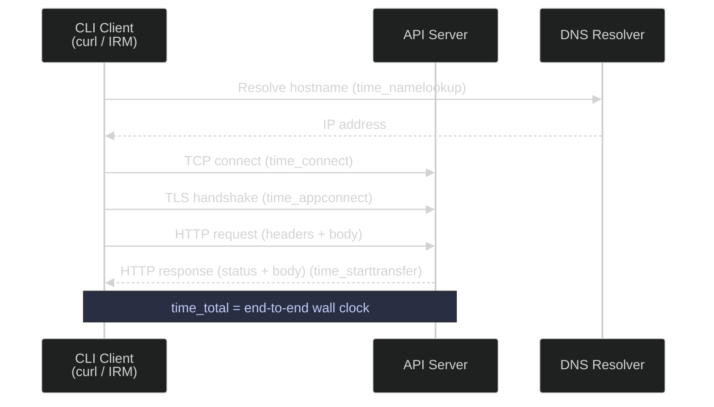

# HTTP Requests and APIs

> [!quote]+
>
> "I just wanted it to do Internet transfers good, fast and reliably and that's what I worked on making reality."
>
> — **Daniel Stenberg** (creator of curl)

> [!abstract]- Summary
>
> `curl` and PowerShell's `Invoke-RestMethod` / `Invoke-WebRequest` are the standard CLI tools for making HTTP requests, testing REST APIs, downloading files with retry logic, and diagnosing latency — covering the full spectrum from one-off GET calls to authenticated POST requests and production-grade downloads.
>
> - **Linux curl tools** — GET/POST/PUT/PATCH/DELETE with `-H` headers and `-d` bodies; bearer token and Basic Auth; production downloads with `--retry`, `--connect-timeout`, `--max-time`, `-f`; `-w` timing breakdown across DNS, TCP, TLS, and TTFB phases; wget for recursive and resumable downloads; tool selection guidance (curl vs wget vs Python requests).
> - **PowerShell HTTP request tools** — `Invoke-RestMethod` for auto-deserialized JSON/XML objects; `Invoke-WebRequest` for file downloads with `-OutFile`; `-MaximumRetryCount` / `-RetryIntervalSec` (PS 7+); Base64-encoded Basic Auth; `ConvertTo-Json` / `ConvertFrom-Json` for body serialization.
> - **Operations and diagnostics** — quick GETs, JSON POSTs, health checks, verbose debugging, runtime bearer-token resolution, JSON inspection, and platform-specific handling for HTTP errors, authentication failures, connection refusals, and non-JSON responses.

> [!note]- Glossary
>
> **`curl`**
> - Command-line tool for transferring data over network protocols such as HTTP, HTTPS, FTP, and SFTP, with behavior controlled by command-line options.
> - Used for scripted API calls, authenticated requests, uploads, downloads, custom headers, and low-level timing and response inspection.
>
> - By default, `curl` exits `0` on HTTP `4xx` and `5xx` responses unless you add `-f` or inspect `-w '%{http_code}'`.
>
> ---
>
> **HTTP method**
> - Request verb that tells the server what operation the client is asking to perform, such as `GET`, `POST`, `PUT`, `PATCH`, or `DELETE`.
> - Used to express API intent correctly; using the wrong method commonly results in `405 Method Not Allowed` or behavior different from what the caller expected.
>
> - Most REST APIs use `PATCH` for partial updates. Sending `PUT` with only part of a resource may overwrite unspecified fields, depending on the server implementation.
>
> ---
>
> **HTTP status code**
> - Three-digit response code indicating the outcome of the request: `2xx` success, `3xx` redirection, `4xx` client error, `5xx` server error.
> - Used to drive control flow in scripts, especially for retry logic, alerting, and distinguishing permanent request errors from transient service failures.
>
> - Treat the full `2xx` range as success unless the API contract says otherwise; use `-L` with `curl` when redirects are part of the normal path.
>
> ---
>
> **Bearer token**
> - Credential sent in the HTTP `Authorization` header as `Bearer <token>`, commonly used by OAuth 2.0 APIs and other token-based authentication schemes.
> - Used to authenticate API requests without embedding a username and password in every call; tokens are usually short-lived and should be resolved at runtime.
>
> - Resolve bearer tokens at runtime rather than hardcoding them into scripts, shell history, or version control.
>
> ---
>
> **JSON (JavaScript Object Notation)**
> - Text-based structured data format built from objects and arrays, widely used for REST API request and response bodies.
> - Used to send and receive structured payloads in a format that both machines and humans can inspect easily.
>
> - Set `Content-Type: application/json` when sending JSON bodies or the server may reject or misparse the request.
>
> ---
>
> **`jq`**
> - Command-line JSON processor for selecting, transforming, validating, and reformatting JSON using its own query language.
> - Used in shell scripts to extract fields from API responses, reshape payloads, and validate that a response is valid JSON before further processing.
>
> - If `jq` reports a parse error, inspect the raw response with `curl -v` because the server may have returned HTML or plain text instead of JSON.
>
> ---
>
> **`wget`**
> - Command-line downloader oriented toward retrieving files and directory trees, with built-in support for resuming and recursive download workflows.
> - Used primarily for file retrieval rather than API interaction, especially when resumable downloads or recursive mirroring are required.
>
> - Prefer `curl` for APIs and `wget` for file-centric workflows such as resumable downloads or recursive mirroring.
>
> ---
>
> **`Invoke-RestMethod` (`irm`)**
> - PowerShell cmdlet for sending HTTP requests and automatically deserializing JSON or XML responses into .NET objects when possible.
> - Used for API interactions in PowerShell when the caller wants structured response objects rather than raw response text.
>
> - `Invoke-RestMethod` treats many HTTP error responses as exceptions, so use `try/catch` with `$ErrorActionPreference = 'Stop'` in automation.
>
> ---
>
> **`Invoke-WebRequest` (`iwr`)**
> - PowerShell cmdlet that returns an HTTP response object containing status, headers, and body content, with support for saving the response directly to disk.
> - Used when the raw response metadata matters or when downloading files with `-OutFile` is more appropriate than automatic deserialization.
>
> - `-MaximumRetryCount` and `-RetryIntervalSec` require PowerShell 7+. Use an explicit retry loop on Windows PowerShell 5.1.
>
> ---
>
> **TLS (Transport Layer Security)**
> - Cryptographic protocol used by HTTPS to provide server authentication, confidentiality, and integrity for data in transit.
> - Used to secure HTTP communication; handshake timing can also help diagnose certificate-chain or connection-establishment problems.
>
> - `curl -v https://endpoint` exposes TLS negotiation details that help diagnose certificate, expiry, and SNI problems.

Data pipelines frequently interact with REST APIs (financial data providers, cloud services, webhooks). `curl` is the standard command-line tool for making HTTP requests, and knowing its advanced flags can be the difference between a working integration and hours of debugging. For REST API design patterns including pagination, error handling, and idempotency, see the [Data Architecture section](https://alp78.github.io/elysium/14-Data-Architecture/APIs-and-Protocols/rest-api-design-and-consumption).

*Request lifecycle phases that `curl` timing variables expose during a single HTTPS request.*


## Linux curl tools

`curl` transfers data over many protocols (HTTP, HTTPS, FTP, SFTP) from the command line. It is the standard tool for REST API calls, health checks, file downloads, and latency diagnostics in bash scripts and pipelines.

### Linux | curl | basic requests

The simplest invocation sends a GET request and prints the response body to stdout. Adding `-v` enables verbose mode, which prints the full request and response headers including TLS handshake details — invaluable for debugging redirects, authentication failures, and certificate issues.

#### Send a GET request

*Fetch a JSON document and print the response body to stdout.*
```bash
curl https://api.example.com/data
```

```text
{"status":"ok","records":1024}
```

#### Send a GET request in verbose mode

*Inspect request headers, response headers, and TLS handshake details for one request.*
```bash
curl -v https://api.example.com/data
```

```text
* Trying 93.184.216.34:443...
* Connected to api.example.com (93.184.216.34) port 443
* TLS handshake...
> GET /data HTTP/2
> Host: api.example.com
< HTTP/2 200
< content-type: application/json
{"status":"ok","records":1024}
```

#### Check HTTP status code only

`-s` silences the progress meter, `-o /dev/null` discards the response body, and `-w` prints a format string at completion. This pattern is used in monitoring scripts and health checks where only the status code matters.

*Return only the final HTTP status code for a health check.*
```bash
curl -s -o /dev/null -w "%{http_code}" https://api.example.com/health
```

```text
200
```

> [!warning] `curl` does not follow redirects by default
>
> A `301` or `302` response causes `curl` to return the redirect target instead of the final resource. Without `-L`, a health check against a load balancer that redirects HTTP to HTTPS reports the redirect, not the actual service status.

Use `-L` when the endpoint redirects before returning a final health status.

*Follow redirects before checking the final status code.*
```bash
curl -s -o /dev/null -w "%{http_code}" -L https://api.example.com/health
```

```text
200
```

| Flag | Syntax | Description |
|---|---|---|
| `-s` | `curl -s <url>` | Silent mode — suppress progress meter and error messages |
| `-o` | `curl -o <file> <url>` | Write output to a file instead of stdout |
| `-O` | `curl -O <url>` | Write output to a file named by the remote URL |
| `-v` | `curl -v <url>` | Verbose — print request/response headers and TLS handshake |
| `-L` | `curl -L <url>` | Follow HTTP redirects (3xx) automatically |
| `-w` | `curl -w "<format>" <url>` | Print formatted timing or metadata after transfer completes |
| `-I` | `curl -I <url>` | Fetch headers only (HEAD request) |

### Linux | curl | request headers and body

HTTP requests frequently require custom headers (authentication tokens, content-type declarations) and a request body for POST, PUT, or PATCH operations. `curl` uses `-H` for headers and `-d` for the request body.

#### Send a POST request with a JSON body

`-X POST` sets the HTTP method. `-H "Content-Type: application/json"` tells the server the body is JSON. `-H "Authorization: Bearer $API_TOKEN"` injects the token from an environment variable. `-d` provides the raw body string.

*Send a JSON webhook payload with an explicit content type and bearer token.*
```bash
curl -X POST https://api.example.com/webhook \
  -H "Content-Type: application/json" \
  -H "Authorization: Bearer $API_TOKEN" \
  -d '{"event": "pipeline_complete", "status": "success"}'
```

```text
{"id":"evt_123","accepted":true}
```

#### Send a POST request with a JSON body from a file

When the body is complex or templated, store it in a file and reference it with `@`. This keeps the curl command readable and allows the file to be version-controlled.

*Read a JSON request body from `payload.json` instead of embedding it inline.*
```bash
curl -X POST https://api.example.com/webhook \
  -H "Content-Type: application/json" \
  -H "Authorization: Bearer $API_TOKEN" \
  -d @payload.json
```


#### Upload a file with PUT

`-T` uploads a local file as the request body without base64 encoding, suitable for binary uploads (backups, archives).

*Upload a local file as the full `PUT` request body.*
```bash
curl -X PUT -T backup.sql.gz https://storage.example.com/backups/
```


#### Send a PATCH request

*Patch a subset of fields on an existing resource.*
```bash
curl -X PATCH https://api.example.com/records/42 \
  -H "Content-Type: application/json" \
  -H "Authorization: Bearer $API_TOKEN" \
  -d '{"status": "archived"}'
```


#### Use basic authentication

`-u user:password` sends HTTP Basic Auth credentials, encoded as a Base64 header automatically by curl.

> [!warning] Basic auth is not encryption
>
> In HTTP Basic authentication, curl base64-encodes the username and password and sends them in the `Authorization` header. That is not transport protection, so this pattern should be used only against `https://` endpoints.

*Send HTTP Basic Auth credentials without constructing the header manually.*
```bash
curl -u "$API_USER:$API_PASS" https://api.example.com/protected
```


| Flag | Syntax | Description |
|---|---|---|
| `-X` | `curl -X POST <url>` | Set the HTTP method (GET, POST, PUT, PATCH, DELETE) |
| `-H` | `curl -H "Header: value" <url>` | Add a request header (repeat for multiple headers) |
| `-d` | `curl -d '<body>' <url>` | Set the request body (string or `@file`) |
| `-T` | `curl -T <file> <url>` | Upload a file as the request body (binary PUT) |
| `-u` | `curl -u user:pass <url>` | HTTP Basic Authentication |
| `--data-urlencode` | `curl --data-urlencode "key=value" <url>` | URL-encode a form field before sending |
| `-F` | `curl -F "file=@report.csv" <url>` | Multipart form upload |
| `-G` | `curl -G -d "q=test" <url>` | Send `-d` data as query string on a GET request |

### Linux | curl | downloads with retry and timeout

Production scripts must defend against transient network failures, slow servers, and stalled transfers. Without timeout flags, a hanging curl can block a pipeline indefinitely. The flags below form the standard production download pattern.

#### Download a file with retry and timeout

`-f` causes curl to fail with a non-zero exit code on HTTP errors (4xx, 5xx) instead of saving the error HTML. `-S` ensures errors are shown even when `-s` (silent) is active. `--retry` retries on transient failures (connection refused, 5xx). `--retry-delay` waits between attempts. `--connect-timeout` limits the TCP connection phase. `--max-time` limits the entire transfer.

*Download a file with retry, connection timeout, and total timeout limits.*
```bash
curl -fSL \
  --retry 3 \
  --retry-delay 5 \
  --connect-timeout 10 \
  --max-time 300 \
  -o data.csv \
  https://data-provider.com/export/latest.csv
```


> [!warning] Missing `-f` causes silent failures
>
> Without `-f`, curl exits with code 0 even when the server returns a 404 or 500. The downloaded file contains the HTML error page. The pipeline continues unaware.

Use this pattern in scripts that must abort immediately on HTTP failures.

*Fail the shell early when the server responds with an HTTP error.*
```bash
set -e
curl -fSL --retry 3 --connect-timeout 10 --max-time 300 \
  -o data.csv https://data-provider.com/export/latest.csv
echo "download complete"
```

```text
download complete
```

#### Resume an interrupted download

`-C -` instructs curl to detect the already-downloaded byte offset and resume from that position. The server must support the `Range` header for this to work.

*Resume a partial download from the server-reported byte offset.*
```bash
curl -C - -o data.csv https://data-provider.com/export/latest.csv
```


| Flag | Syntax | Description |
|---|---|---|
| `-f` | `curl -f <url>` | Fail silently on HTTP errors (non-zero exit code on 4xx/5xx) |
| `-S` | `curl -fS <url>` | Show error messages even in silent mode |
| `-L` | `curl -L <url>` | Follow HTTP redirects |
| `--retry` | `curl --retry 3 <url>` | Retry up to N times on transient failures |
| `--retry-delay` | `curl --retry-delay 5 <url>` | Wait N seconds between retry attempts |
| `--retry-max-time` | `curl --retry-max-time 120 <url>` | Give up retrying after N seconds total |
| `--connect-timeout` | `curl --connect-timeout 10 <url>` | Abort if TCP connection is not established within N seconds |
| `--max-time` | `curl --max-time 300 <url>` | Abort the entire transfer after N seconds |
| `-C` | `curl -C - -o <file> <url>` | Resume an interrupted download |

### Linux | curl | timing breakdown

The `-w` format string can print per-phase timing metrics after a transfer completes. This is the fastest way to isolate whether latency originates in DNS, network, TLS, or the server itself — without installing additional tools.

#### Print timing metrics for a request

*Print `curl` timing phases for DNS, TCP, TLS, first byte, and total duration.*
```bash
curl -s -o /dev/null \
  -w "DNS: %{time_namelookup}s\nConnect: %{time_connect}s\nTLS: %{time_appconnect}s\nFirst byte: %{time_starttransfer}s\nTotal: %{time_total}s\n" \
  https://api.example.com/health
```

```text
DNS:        0.012s
Connect:    0.038s
TLS:        0.091s
First byte: 0.143s
Total:      0.144s
```

Each metric covers a cumulative phase from request start. The derived server processing time is `time_starttransfer − time_appconnect`. Interpreting the phases:

- `time_namelookup` high (> 0.1 s): DNS is slow — check `/etc/resolv.conf`, consider a local DNS cache (systemd-resolved or dnsmasq).
- `time_connect` high relative to DNS: Network latency to the server — check routing, consider a closer region.
- `time_appconnect` high relative to connect: TLS negotiation is slow — the certificate chain may be large, or OCSP stapling is missing.
- `time_starttransfer − time_appconnect` high: Server processing is the bottleneck — the request is reaching the server but it is slow to respond.

| Variable | Description |
|---|---|
| `%{time_namelookup}` | Time from start to DNS resolution complete |
| `%{time_connect}` | Time from start to TCP connection established |
| `%{time_appconnect}` | Time from start to TLS handshake complete |
| `%{time_pretransfer}` | Time from start to first transfer-ready state |
| `%{time_starttransfer}` | Time from start to first byte received (TTFB) |
| `%{time_total}` | Total wall-clock time for the transfer |
| `%{http_code}` | Final HTTP status code |
| `%{size_download}` | Number of bytes downloaded |
| `%{speed_download}` | Average download speed in bytes per second |

### Linux | wget | file downloads

`wget` is optimized for file downloads, particularly when resuming interrupted transfers or mirroring directory trees. Unlike curl, wget writes to a local file by default and handles recursive downloads natively.

#### Download a file

*Download a file into the current directory using the remote filename.*
```bash
wget https://data-provider.com/export/latest.csv
```


#### Resume an interrupted download

`-c` (continue) sends a `Range` header so the server resumes from the last byte offset. Useful for large files on unreliable connections.

*Resume a previously interrupted file download.*
```bash
wget -c https://data-provider.com/export/large-dataset.csv
```


#### Download with retry and timeout

*Retry a download and cap the per-request timeout.*
```bash
wget --tries=3 --timeout=30 --wait=5 \
  -O data.csv \
  https://data-provider.com/export/latest.csv
```


#### Mirror a directory tree

`-r` enables recursive download, `-np` prevents ascending to parent directories, `-nH` strips the hostname from the local path.

*Mirror a directory tree without recreating the host directory locally.*
```bash
wget -r -np -nH https://data-provider.com/reports/2025/
```


| Flag | Syntax | Description |
|---|---|---|
| `-O` | `wget -O <file> <url>` | Write output to a specific filename |
| `-c` | `wget -c <url>` | Resume an interrupted download |
| `--tries` | `wget --tries=3 <url>` | Number of retry attempts (0 = infinite) |
| `--timeout` | `wget --timeout=30 <url>` | Network read timeout in seconds |
| `--wait` | `wget --wait=5 <url>` | Wait N seconds between requests |
| `-q` | `wget -q <url>` | Quiet — suppress output |
| `-r` | `wget -r <url>` | Recursive download |
| `-np` | `wget -np <url>` | No parent — do not ascend to parent directories |
| `-nH` | `wget -nH <url>` | No host directory — strip hostname from local path |
| `--spider` | `wget --spider <url>` | Check if a URL is reachable without downloading |

### Linux | curl vs wget | tool selection

Choose the tool based on the dominant operation rather than habit.

- `curl`: best for one-off requests, debugging, health checks, API calls, and scripts with custom headers or bodies.
- `wget`: best for file retrieval, especially when resumable downloads or recursive mirroring are required.
- `Python requests` / `httpx`: best for complex API interactions such as pagination, OAuth flows, session management, and explicit retry policies. See [15_py_webapis](https://alp78.github.io/elysium/02-Programming-Languages/Python/15_py_webapis) for code-level HTTP clients.

## PowerShell HTTP request tools

PowerShell ships two cmdlets for HTTP: `Invoke-RestMethod` and `Invoke-WebRequest`. They cover the same ground as curl but integrate with PowerShell's object pipeline — responses are deserialized into .NET objects rather than raw strings.

### PowerShell | Invoke-RestMethod | basic requests

`Invoke-RestMethod` (alias: `irm`) automatically deserializes JSON and XML responses into PowerShell objects. Use it when you need to work with the response data directly.

#### Send a GET request

*Issue a GET request and let PowerShell deserialize the response body.*
```powershell
Invoke-RestMethod -Uri "https://api.example.com/data"
```

```text
status  records
------  -------
ok         1024
```

#### Send a GET request with an authorization header

*Pass an Authorization header and read a property from the returned object.*
```powershell
$response = Invoke-RestMethod -Uri "https://api.example.com/data" `
    -Headers @{ Authorization = "Bearer $token" }
$response.records
```

```text
1024
```

#### Check HTTP status code only

`Invoke-WebRequest` exposes the `StatusCode` property. Use it when you need the status without processing the body.

*Read only the status code from an HTTP response.*
```powershell
$r = Invoke-WebRequest -Uri "https://api.example.com/health" -Method Head
$r.StatusCode
```

```text
200
```

| Parameter | Syntax | Description |
|---|---|---|
| `-Uri` | `-Uri "https://..."` | Target URL |
| `-Method` | `-Method Get` | HTTP method (Get, Post, Put, Patch, Delete, Head) |
| `-Headers` | `-Headers @{Key="Value"}` | Hashtable of request headers |
| `-ContentType` | `-ContentType "application/json"` | Set the Content-Type header |
| `-Body` | `-Body $json` | Request body string or hashtable |
| `-OutFile` | `-OutFile "data.csv"` | Save response body to a file |
| `-UseBasicParsing` | `-UseBasicParsing` | Bypass IE engine (required on Server Core) |

### PowerShell | Invoke-RestMethod | POST and authentication

#### Send a POST request with a JSON body

Convert a hashtable to JSON with `ConvertTo-Json` before passing it as the body. PowerShell's pipeline makes nested object serialization straightforward.

*Serialize a hashtable to JSON and send it as a POST body.*
```powershell
$body = @{
    event  = "pipeline_complete"
    status = "success"
} | ConvertTo-Json

Invoke-RestMethod -Uri "https://api.example.com/webhook" `
    -Method Post `
    -ContentType "application/json" `
    -Headers @{ Authorization = "Bearer $token" } `
    -Body $body
```

```text
id      accepted
--      --------
evt_123     True
```

#### Send a PATCH request

*Serialize a small JSON body and patch a resource in place.*
```powershell
$body = @{ status = "archived" } | ConvertTo-Json

Invoke-RestMethod -Uri "https://api.example.com/records/42" `
    -Method Patch `
    -ContentType "application/json" `
    -Headers @{ Authorization = "Bearer $token" } `
    -Body $body
```


#### Use basic authentication

Encode credentials as a Base64 Basic Auth header manually, since `Invoke-RestMethod` does not have a dedicated `-Credential` flag for HTTP Basic Auth against arbitrary APIs.

*Construct a Basic Auth header manually before sending the request.*
```powershell
$encoded = [Convert]::ToBase64String(
    [Text.Encoding]::ASCII.GetBytes("$env:API_USER`:$env:API_PASS")
)

Invoke-RestMethod -Uri "https://api.example.com/protected" `
    -Headers @{ Authorization = "Basic $encoded" }
```


| Parameter | Syntax | Description |
|---|---|---|
| `-Method Post` | `-Method Post` | HTTP POST |
| `-Method Patch` | `-Method Patch` | HTTP PATCH |
| `-Method Put` | `-Method Put` | HTTP PUT |
| `-Method Delete` | `-Method Delete` | HTTP DELETE |
| `-Body` | `-Body ($hash \| ConvertTo-Json)` | Serialized JSON body |
| `-ContentType` | `-ContentType "application/json"` | Content-Type header |
| `-Headers` | `-Headers @{Authorization="Bearer $t"}` | Authorization and custom headers |

### PowerShell | Invoke-WebRequest | downloads with retry

`Invoke-WebRequest` is preferred over `Invoke-RestMethod` for file downloads because `-OutFile` streams the response body directly to disk without loading it into memory.

#### Download a file with retry (PowerShell 7+)

`-MaximumRetryCount` and `-RetryIntervalSec` were introduced in PowerShell 7. They automatically retry on transient HTTP errors (429, 5xx) and network timeouts.

*Retry a file download automatically in PowerShell 7 or later.*
```powershell
Invoke-WebRequest -Uri "https://data-provider.com/latest.csv" `
    -OutFile "data.csv" `
    -MaximumRetryCount 3 `
    -RetryIntervalSec 5
```


> [!warning] Retry parameters require PowerShell 7+
>
> `-MaximumRetryCount` and `-RetryIntervalSec` are not available in Windows PowerShell 5.1. Use an explicit retry loop when you need cross-version compatibility.

Use this loop on Windows PowerShell 5.1 or when you need explicit retry control.

*Retry a download manually for cross-version compatibility.*
```powershell
$maxAttempts = 3
for ($i = 1; $i -le $maxAttempts; $i++) {
    try {
        Invoke-WebRequest -Uri "https://data-provider.com/latest.csv" -OutFile "data.csv"
        break
    } catch {
        if ($i -eq $maxAttempts) { throw }
        Start-Sleep -Seconds 5
    }
}
"download complete"
```

```text
download complete
```

#### Set a timeout on a download

PowerShell 7 uses `System.Net.Http.HttpClient` internally. The `-TimeoutSec` parameter sets the request timeout in seconds.

*Set an overall timeout for a file download request.*
```powershell
Invoke-WebRequest -Uri "https://data-provider.com/latest.csv" `
    -OutFile "data.csv" `
    -TimeoutSec 300
```


| Parameter | Syntax | Description |
|---|---|---|
| `-OutFile` | `-OutFile "data.csv"` | Save response body to a file |
| `-MaximumRetryCount` | `-MaximumRetryCount 3` | Retry up to N times on transient failures (PS 7+) |
| `-RetryIntervalSec` | `-RetryIntervalSec 5` | Wait N seconds between retries (PS 7+) |
| `-TimeoutSec` | `-TimeoutSec 300` | Abort if no response within N seconds |
| `-PassThru` | `-PassThru` | Return the response object when using `-OutFile` |

## Operational patterns

Use these platform-specific patterns for the common workflows that show up repeatedly in shell automation and incident response.

### Linux | curl | common operations

#### Quick GET and JSON inspection

Pipe the response to `jq` when you want structured inspection instead of raw output.

*Fetch a JSON document quietly and pretty-print it with `jq`.*
```bash
curl -s https://api.example.com/endpoint | jq '.'
```

```text
{
  "status": "ok",
  "records": 1024
}
```

#### POST JSON with an explicit content type

Set `Content-Type: application/json` even when the body is obvious to a human reader. The server uses the header, not the payload shape, to choose its parser.

*Send a compact JSON body to an API endpoint.*
```bash
curl -sS -X POST https://api.example.com/endpoint \
  -H 'Content-Type: application/json' \
  -d '{"key":"value"}'
```

```text
{"accepted":true}
```

#### Health checks in scripts

Use `-s` to suppress progress output, `-f` to make HTTP errors fail the command, and `-w` to emit only the status code. Add `-L` if redirects are part of the expected path.

*Return only the HTTP status code and fail the script on HTTP errors.*
```bash
curl -sf -o /dev/null -w '%{http_code}\n' https://service.example.com/health
```

```text
200
```

#### Verbose request debugging

Verbose mode is the fastest way to inspect redirects, TLS negotiation, response headers, and protocol-level failures from a single command.

*Inspect request and response metadata for a single failing call.*
```bash
curl -v https://api.example.com/endpoint
```

```text
> GET /endpoint HTTP/2
< HTTP/2 200
< content-type: application/json
```

#### Runtime bearer-token authentication

Resolve the token when you make the call rather than storing it in the script body.

*Fetch a runtime access token and use it immediately in the `Authorization` header.*
```bash
curl -H "Authorization: Bearer $(gcloud auth print-access-token)" \
  https://api.example.com/endpoint
```

```text
{"user":"svc-pipeline","scopes":["read:data"]}
```

### PowerShell | Invoke-RestMethod | common operations

#### Authenticated API call

`Invoke-RestMethod` returns objects, so the normal pattern is to send the request and then select the property you need.

*Call an API with a bearer token and read a property from the deserialized response.*
```powershell
$response = Invoke-RestMethod -Uri "https://api.example.com/endpoint" `
    -Headers @{ Authorization = "Bearer $env:API_TOKEN" }
$response.records
```

```text
1024
```

#### Select JSON fields directly from the response object

For PowerShell workflows, prefer property access or `Select-Object` over text parsing because the cmdlet already converted the JSON to objects.

*Project selected fields from a JSON response without piping through a text parser.*
```powershell
Invoke-RestMethod -Uri "https://api.example.com/data" |
    Select-Object status, records
```

```text
status records
------ -------
ok        1024
```

## Diagnostics

Use these checks when a request fails and you need to decide whether the problem is the client, authentication, transport, or the service itself.

### Linux | curl | HTTP and response diagnostics

#### Make HTTP errors fail the command

`curl` succeeds at the process level unless you ask it to fail on HTTP errors. That behavior is useful for manual inspection but dangerous in automation.

*Force `curl` to return a non-zero exit code on an HTTP error response.*
```bash
curl -fsS -o /dev/null https://api.example.com/missing
echo $?
```

```text
curl: (22) The requested URL returned error: 404
22
```

#### Diagnose `401 Unauthorized` and `403 Forbidden`

Capture the response headers first. A `401` usually means the token is missing, expired, or wrong for the audience. A `403` usually means the token is valid but lacks the required permission.

*Print the response headers so you can distinguish authentication from authorization failures.*
```bash
curl -sS -D - -o /dev/null \
  -H "Authorization: Bearer $API_TOKEN" \
  https://api.example.com/protected
```

```text
HTTP/2 401
www-authenticate: Bearer error="invalid_token"
```

#### Check the local listener for `connection refused`

If localhost refuses the connection, confirm that the service is actually listening on the expected port before debugging the HTTP client.

*Inspect listening TCP sockets on the expected local port.*
```bash
ss -tlnp | grep ':8080 '
```

```text
LISTEN 0 4096 127.0.0.1:8080 0.0.0.0:* users:(("myservice",pid=1234,fd=7))
```

#### Inspect non-JSON responses before piping to `jq`

`jq` parse failures often mean the server returned HTML, plain text, or an empty body instead of JSON. Check headers and file type before assuming the payload is structured data.

*Capture headers and inspect the body format before parsing the response as JSON.*
```bash
curl -sS -D headers.txt https://api.example.com/data -o response.bin
head -n 5 headers.txt
file response.bin
```

```text
HTTP/2 200
content-type: text/html; charset=utf-8
response.bin: HTML document, ASCII text
```

### PowerShell | Invoke-* | HTTP and local diagnostics

#### Capture the HTTP status in `try/catch`

PowerShell throws on many HTTP failures, so the diagnostic pattern is to catch the exception and inspect the status code directly. The same pattern distinguishes `401` from `403`.

*Catch a failed web request and print the HTTP status code.*
```powershell
try {
    Invoke-RestMethod -Uri "https://api.example.com/protected" `
        -Headers @{ Authorization = "Bearer $env:API_TOKEN" } `
        -ErrorAction Stop
} catch {
    [int]$_.Exception.Response.StatusCode
}
```

```text
401
```

#### Check the local listener on Windows

When a localhost request fails with connection refusal, verify the listening port and owning process before changing the client command.

*Inspect Windows listening sockets on the expected local port.*
```powershell
Get-NetTCPConnection -State Listen -LocalPort 8080 |
    Select-Object LocalAddress, LocalPort, OwningProcess
```

```text
LocalAddress LocalPort OwningProcess
------------ --------- -------------
127.0.0.1         8080          1234
```

## Cross-references
- [connectivity-testing](https://alp78.github.io/elysium/01-Shell/Networking/connectivity-testing) — test TCP reachability before HTTP calls
- [firewalls](https://alp78.github.io/elysium/01-Shell/Networking/firewalls) — when curl returns "connection timed out" or "connection refused"
- [environment-variables](https://alp78.github.io/elysium/01-Shell/Scripting/environment-variables) — store `$API_TOKEN` securely in environment variables
- [iap-tunneling](https://alp78.github.io/elysium/01-Shell/Networking/iap-tunneling) — calling services behind IAP with identity tokens

For invoking HTTP endpoints deployed as managed services, see [cloud-run-jobs-vs-services](https://alp78.github.io/elysium/06-GCP/Serverless/cloud-run-jobs-vs-services) which covers Cloud Run HTTP triggers and authentication.
