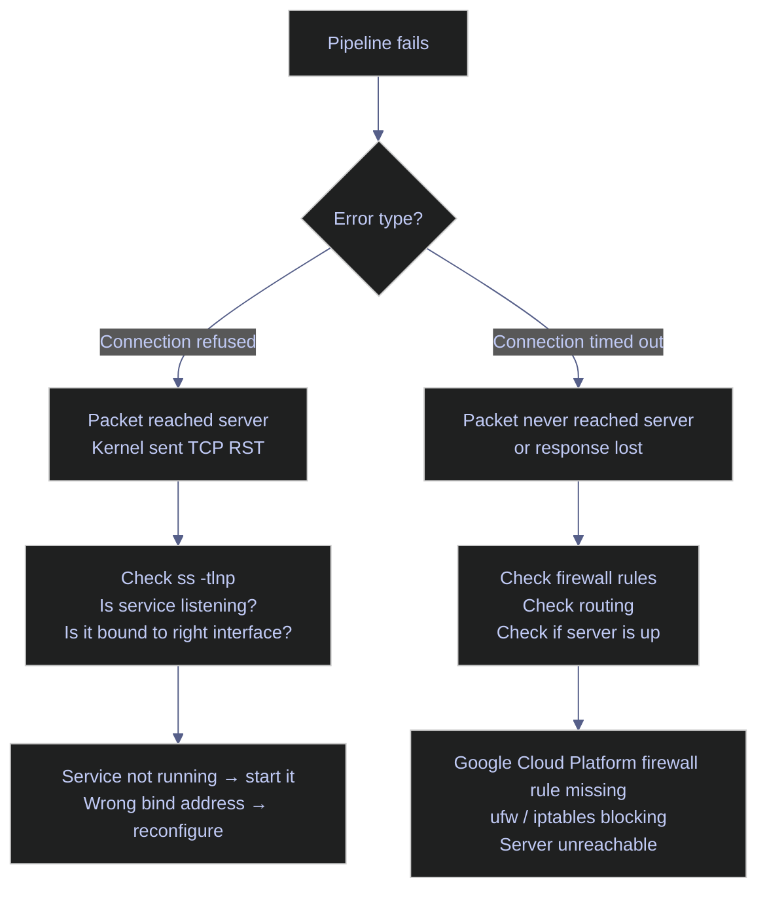

# Socket Inspection

> [!quote] Socket Programming Discipline
>
> "The devil is in the details, and everything in socket programming is a detail."
>
> — **W. Richard Stevens**, *UNIX Network Programming*

> [!abstract]- Summary
>
> Socket tables answer three questions quickly: is anything listening, who is connected, and does the failure point to the service or the network path.
>
> - `ss` and `Get-NetTCPConnection` show listeners, established sessions, queue depth, and Transmission Control Protocol (TCP) state.
> - Bind address tells you whether a service is localhost-only, interface-specific, or reachable remotely.
> - `Connection refused` points to no matching listener or the wrong bind address; `connection timed out` points to routing or firewall loss.
> - `TIME_WAIT` and `CLOSE_WAIT` distinguish normal connection churn from application cleanup problems.

> [!note]- Glossary
>
> **Socket**
>
> - A network communication endpoint. For TCP or User Datagram Protocol (UDP), the kernel tracks the protocol, local IP address, and local port; active sessions also include the remote address and remote port.
> - Distinguishes the abstract statement "port `1433` is open" from the actual endpoint that an application owns and the OS manages.
> - A port is only the numeric component. `TCP 10.132.0.2:1433` is the socket that uses that port.
>
> ---
>
> **`ss`**
>
> - Modern Linux utility for inspecting socket state. It reads from kernel networking interfaces and is the standard replacement for the older `netstat` tool.
> - Used to confirm listeners, inspect active sessions, review queue depth, and identify which process owns a socket.
> - `netstat` belongs to the older `net-tools` package and is often absent on current Linux distributions. `ss` ships with `iproute2`, which is the default networking toolset on modern systems.
>
> ---
>
> **LISTEN state**
>
> - TCP state that indicates a server socket has bound to a local address and port and is waiting for incoming connections.
> - Confirms that a service is ready to accept new sessions, while also showing whether it is bound only to loopback or to broader network interfaces.
> - In `ss -tlnp`, the local address appears as `<IP>:<port>`. `127.0.0.1` means local-only access. `0.0.0.0` means all IPv4 interfaces. `[::]` means all IPv6 interfaces and can also cover IPv4 on dual-stack systems, depending on OS configuration.
>
> ---
>
> **ESTABLISHED state**
>
> - TCP state that indicates the three-way handshake has completed and the connection is fully open for data transfer.
> - Used to confirm that real client-server sessions exist and to count concurrent connections instead of only checking whether a service is listening.
> - The client side usually uses a temporary high-numbered ephemeral port chosen by the OS. Multiple `ESTAB` rows from the same remote IP with different remote ports usually mean multiple simultaneous sessions.
>
> ---
>
> **TIME_WAIT state**
>
> - TCP state retained briefly after a connection closes so delayed packets from the old session cannot be mistaken for a new one.
> - Helps diagnose workloads that create and tear down large numbers of short-lived sessions, which can consume ephemeral ports and signal missing connection pooling.
> - The delay is tied to the maximum segment lifetime (MSL). A small number of `TIME_WAIT` sockets is normal; a large number matters when it grows relative to the host's ephemeral port range.
>
> ---
>
> **CLOSE_WAIT state**
>
> - TCP state that indicates the remote peer has closed its side of the connection, but the local application has not yet closed its own socket.
> - Strong sign of an application-side cleanup problem, because these sockets remain until the local process explicitly closes them.
> - `TIME_WAIT` is a normal post-close kernel state. `CLOSE_WAIT` usually means the application received the close notification and did not release the socket promptly.
>
> ---
>
> **Recv-Q**
>
> - Receive-queue value shown by `ss`. For listening sockets, it is the number of completed connections waiting to be accepted by the application. For established sockets, it is the number of bytes received by the kernel but not yet read by the process.
> - Helps distinguish network reachability from application slowness. A growing `Recv-Q` often means the application is not accepting or reading data fast enough.
> - For a listening socket, `Send-Q` represents the configured backlog limit: the maximum number of pending connections the kernel can queue before new attempts are refused or dropped.
>
> ---
>
> **`Get-NetTCPConnection`**
>
> - PowerShell cmdlet on Windows that returns TCP connection objects with properties such as `LocalAddress`, `LocalPort`, `RemoteAddress`, `RemotePort`, `State`, and `OwningProcess`.
> - Windows-native way to inspect TCP listener and connection state in object form, similar in purpose to `ss -t` on Linux.
> - `OwningProcess` is a PID, not a process name. Use `Get-Process -Id <PID>` when you need the executable name and the process is still visible in the current session.

Reading socket state is one of the fastest ways to separate a service problem from a network-path problem. `ss` is the modern Linux replacement for `netstat`, and `Get-NetTCPConnection` provides the same visibility on Windows in object form.

## Linux socket inspection tools

`ss` reads directly from kernel networking interfaces instead of parsing the older `net-tools` output. The Linux sections below focus on TCP listeners, active sessions, and failure signals you can confirm from the terminal.



### Linux | `ss` | inspect listeners

Listener output answers the first question in most incidents: is anything bound to the port, and if so, on which address?

#### List listening TCP sockets

Start here when a client cannot connect or when a service may be bound to the wrong address. On a Linux host, `ss -tlnp` gives a read-only listener inventory with bind addresses and any visible owning processes, which makes it the fastest way to separate listener absence from a bad bind.

*List Linux TCP listeners with bind addresses and visible owning processes.*

```bash
ss -tlnp | sed -n '1,6p'
```

```text
State  Recv-Q Send-Q Local Address:Port Peer Address:Port Process
LISTEN 0      1000   10.255.255.254:53  0.0.0.0:*
LISTEN 0      4096   127.0.0.53%lo:53   0.0.0.0:*
LISTEN 0      4096   127.0.0.54:53      0.0.0.0:*
LISTEN 0      5      0.0.0.0:18080      0.0.0.0:*         users:(("python3",pid=32037,fd=3))
LISTEN 0      4096   *:1434             *:*
```

#### Interpret the output columns

The columns below are short enough to keep as a lookup table because they define fixed fields rather than scenario-specific guidance.

| Column | Meaning |
|--------|---------|
| **State** | `LISTEN` = waiting for connections. `ESTAB` = active connection. `TIME-WAIT` = closing, waiting for delayed packets. `CLOSE-WAIT` = remote side closed, local app has not closed yet. |
| **Recv-Q** | For `LISTEN`, completed connections waiting for the application to call `accept()`. If it stays above `0`, the application is not accepting fast enough. |
| **Send-Q** | For `LISTEN`, the configured backlog size: the maximum number of pending connections the kernel will queue before it starts refusing or dropping new attempts. |
| **Local Address:Port** | The IP address and port the socket is bound to. This determines who can reach the service. |
| **Peer Address:Port** | For `LISTEN`, usually `0.0.0.0:*` or `*:*`. For `ESTAB`, the remote client's address and ephemeral port. |
| **Process** | The program that owns the socket. `sudo` is required to see processes owned by other users. |

#### Read bind addresses correctly

The local address prefix is often the single most diagnostic field in `ss` output.

- `0.0.0.0:1433` listens on all IPv4 interfaces. Any host that can route to the machine can attempt a connection.
- `127.0.0.1:5000` is loopback only. Processes on the same machine can connect, but remote hosts cannot.
- `[::]:22` listens on all IPv6 interfaces and can also accept IPv4 connections on dual-stack systems, depending on `sysctl` settings.
- `[::1]:1434` is IPv6 loopback only.
- `127.0.0.53%lo:53` is loopback-bound to the `lo` interface, which is common for `systemd-resolved`.
- `10.0.0.3:1433` listens only on one interface. Traffic arriving on other interfaces is not accepted.

#### Common services and their default ports

Knowing the usual bind address for common services makes misconfiguration obvious when the listener table disagrees with your expectation.

| Port | Service | Typical Bind Address | Notes |
|------|---------|---------------------|-------|
| 22 | SSH (sshd) | `0.0.0.0` | All interfaces; required for Identity-Aware Proxy (IAP) and direct SSH |
| 53 | DNS (systemd-resolved) | `127.0.0.53` | Loopback only; handles local resolution |
| 1433 | SQL Server engine | `0.0.0.0` | All interfaces; accepts DB connections |
| 1434 | SQL Server Browser | `127.0.0.1` | Loopback; named instance discovery; can be disabled on default instances |
| 1431 | SQL Server Dedicated Administrator Connection (DAC) | `127.0.0.1` | Loopback only; emergency admin access bypassing normal resource limits |
| 5432 | PostgreSQL | `0.0.0.0` or `127.0.0.1` | Controlled by `pg_hba.conf` and `listen_addresses` |
| 5000 | Datadog Agent intake | `127.0.0.1` | Loopback; collects metrics from local processes |
| 5001 | Datadog Agent IPC | `127.0.0.1` | Loopback; internal agent communication |
| 6379 | Redis | `127.0.0.1` | Should never be `0.0.0.0`; exposes all data without auth |
| 8080 | Airflow webserver | `0.0.0.0` | All interfaces; typically behind a reverse proxy |
| 8126 | Datadog APM | `127.0.0.1` | Loopback; receives distributed traces from local apps |

The SQL Server Dedicated Administrator Connection (DAC) on port `1431` deserves special attention. It is always loopback-only by design, and it exists so you can still connect when normal sessions are exhausted or heavily throttled.

#### Review frequently used `ss` flags

| Flag | Syntax | Description |
|------|--------|-------------|
| `-t` | `ss -t` | Show TCP sockets only |
| `-u` | `ss -u` | Show UDP sockets only |
| `-x` | `ss -x` | Show Unix domain sockets |
| `-l` | `ss -l` | Show listening sockets only |
| `-n` | `ss -n` | Numeric output; skip service-name and reverse-DNS lookup |
| `-p` | `ss -p` | Show owning process (requires root for other users) |
| `-a` | `ss -a` | Show all sockets (listening and established) |
| `-e` | `ss -e` | Show extended socket information (timer, inode, uid) |
| `-o` | `ss -o` | Show timer information |
| `-4` | `ss -4` | IPv4 only |
| `-6` | `ss -6` | IPv6 only |

### Linux | `ss` | inspect active sessions

Established-session output answers a different question: who is connected right now, and what state is the connection churn in?

#### Show established TCP sessions

Use this after the listener check has confirmed the service exists and the next question is whether real clients are attached. Filtering to one known local port keeps the result on the server side of the conversation and shows the peer ephemeral ports that identify individual sessions.

*Show established server-side TCP sessions for one listener port.*

```bash
ss -tnp state established '( sport = :45432 )'
```

```text
Recv-Q Send-Q Local Address:Port Peer Address:Port Process
0      0      127.0.0.1:45432   127.0.0.1:38258 users:(("nc",pid=33228,fd=4))
```

The peer port `38258` is the client's ephemeral port. On a real service, repeated rows with the same remote IP and different remote ports usually mean multiple concurrent sessions from that host.

#### Count active sessions on a local port

When the listener port is already known and you only need concurrency, reduce the established-session view to a count. This read-only Linux check answers how many live sessions are attached right now without forcing you to scan every row.

*Count established sessions attached to one local listener port.*

```bash
ss -H -tn state established '( sport = :45432 )' | wc -l
```

```text
1
```

#### Count sessions by remote IP address

Use this when a raw session list is too noisy and you need to know which client or proxy dominates the workload. The pipeline collapses established sessions by peer address so the busiest source stands out immediately.

*Group established Linux sessions by remote IP address and rank them by count.*

```bash
ss -H -tn state established '( sport = :45432 )' | sed -E 's/.* +([^ ]+)$/\1/' | cut -d: -f1 | sort | uniq -c | sort -rn
```

```text
      1 127.0.0.1
```

#### Check `TIME_WAIT` accumulation

Run this when reconnect churn, ephemeral-port pressure, or unusually frequent short-lived sessions are more likely than a missing listener. The state filter isolates post-close sockets so you can judge whether connection turnover, not reachability, is the dominant symptom.

*List Linux `TIME_WAIT` sockets tied to one destination port.*

```bash
ss -tn state time-wait '( dport = :45434 )'
```

```text
Recv-Q Send-Q Local Address:Port Peer Address:Port Process
0      0      127.0.0.1:36756   127.0.0.1:45434
0      0      127.0.0.1:36750   127.0.0.1:45434
0      0      127.0.0.1:36752   127.0.0.1:45434
```

Connection pooling is the primary fix. If pooling is already in place and the system is still healthy otherwise, `net.ipv4.tcp_tw_reuse=1` can help outgoing client sockets, but it does not change the server side of `TIME_WAIT`.

#### Summarize TCP state on the host

Use a host-wide state summary when it is still unclear whether the problem is isolated to one service or reflects broader TCP churn on the machine. `ss -s` is a read-only baseline that collapses active, closed, and post-close states into a single snapshot.

*Print a host-wide summary of current Linux TCP state counts.*

```bash
ss -s
```

```text
Total: 329
TCP:   71 (estab 0, closed 66, orphaned 0, timewait 9)

Transport Total     IP        IPv6
RAW       0         0         0
UDP       5         4         1
TCP       5         4         1
INET      10        8         2
FRAG      0         0         0
```

#### Poll a connection count once per second

During a short verification window, sample the same established-session expression repeatedly so you can see whether concurrency is stable, rising, or dropping. The bounded loop is easier to capture in documentation than `watch`, but it serves the same operational purpose.

*Sample the Linux established-session count for one listener once per second.*

```bash
for i in 1 2 3; do
  ss -H -tn state established '( sport = :45432 )' | wc -l
  sleep 1
done
```

```text
1
1
1
```

#### Review frequently used filters

| Flag | Syntax | Description |
|------|--------|-------------|
| `-t` | `ss -t` | TCP sockets only |
| `-n` | `ss -n` | Numeric output |
| `-p` | `ss -p` | Show process info |
| `state <name>` | `ss state time-wait` | Filter by TCP state (`established`, `time-wait`, `close-wait`, and so on) |
| `src <addr>` | `ss src 10.0.0.3` | Filter by local address |
| `dst <addr>` | `ss dst 10.0.0.24` | Filter by peer address |
| `sport = :1433` | `ss sport = :1433` | Filter by local port |
| `dport = :1433` | `ss dport = :1433` | Filter by destination port |

### Linux | `nc` and `ss` | separate refused from timed out

The error string tells you where to investigate next, but only if you distinguish it correctly. `Connection refused` means the target host responded with a TCP reset (RST). `Connection timed out` means the initial synchronize (SYN) never produced a synchronize-acknowledgment (SYN-ACK) before the timeout expired.

#### Confirm a refused connection

Use this when the client fails immediately and you need to prove the target answered with a reset rather than going silent on the network. The command is safe against an unused local port and demonstrates the failure mode that points back to listener state or bind address.

*Attempt a TCP connection to an unused local port and confirm the refusal path.*

```bash
nc -zv -w 2 127.0.0.1 45435
```

```text
nc: connect to 127.0.0.1 port 45435 (tcp) failed: Connection refused
```

If you get an immediate refusal in production, check the listener table on the server before you touch firewall rules.

#### Confirm a timed-out connection

Use this when the client hangs before failing and the real question is whether packets are being dropped or never reaching the target. The short timeout keeps the test bounded while demonstrating the slower failure mode associated with routing, filtering, or host reachability loss.

*Attempt a TCP connection to an unroutable target and confirm the timeout path.*

```bash
nc -zv -w 2 10.255.255.1 45435
```

```text
nc: connect to 10.255.255.1 port 45435 (tcp) timed out: Operation now in progress
```

When the timeout case appears, investigate routing, security groups, `ufw`, `iptables`, or whether the remote host is reachable at all.

#### Review frequently used `nc` flags

| Flag | Syntax | Description |
|------|--------|-------------|
| `-z` | `nc -z host port` | Scan mode; connect and disconnect without sending data |
| `-v` | `nc -v host port` | Verbose; print the connection result |
| `-w` | `nc -w 3 host port` | Timeout in seconds before giving up |
| `-u` | `nc -u host port` | UDP mode instead of TCP |

## PowerShell socket inspection tools

`Get-NetTCPConnection` returns objects instead of plain text, so you can filter by `LocalPort`, `RemotePort`, `State`, or `OwningProcess` without reparsing terminal output.

The Windows examples below use current host state so the result shapes reflect real listener and session objects rather than fabricated rows.

### PowerShell | `Get-NetTCPConnection` | inspect listeners

Listener objects answer the same first question as `ss -tlnp`: is anything listening, and on which address?

#### List listening TCP sockets

Start with listener inventory when a Windows client cannot connect or when the service may be bound only to loopback. `Get-NetTCPConnection` exposes the local address, port, and owning PID in object form, which makes it easy to distinguish a missing listener from a valid listener on the wrong interface.

*List Windows TCP listeners with local addresses, ports, and owning processes.*

```powershell
Get-NetTCPConnection -State Listen | Sort-Object LocalPort |
    Select-Object -First 8 LocalAddress, LocalPort, OwningProcess,
    @{N='Process';E={(Get-Process -Id $_.OwningProcess -ErrorAction SilentlyContinue).ProcessName}} |
    Format-Table -AutoSize
```

```text
LocalAddress  LocalPort  OwningProcess  Process
------------  ---------  -------------  -------
0.0.0.0             135          2032   svchost
::                  135          2032   svchost
172.25.64.1         139             4   System
192.168.0.118       139             4   System
::                  445             4   System
127.0.0.1          1042         22768   asus_framework
127.0.0.1          1043         22768   asus_framework
0.0.0.0            1236          5172   AsusUpdateCheck
```

#### Read bind addresses on Windows

The address meanings match Linux: `0.0.0.0` is all IPv4 interfaces, `::` is all IPv6 interfaces, and `127.0.0.1` is loopback only. `OwningProcess` is only a PID, so a second lookup through `Get-Process` is still required when you need a name.

### PowerShell | `Get-NetTCPConnection` | inspect active sessions

On Windows, the same object model works for outbound and inbound sessions. The examples below use currently active HTTPS sessions because they were already present on the host and did not require fabricating a mock server.

#### Show established HTTPS sessions

Use this when you need a live example of established Windows sessions or when the host already carries stable HTTPS traffic that can stand in for a real service. The command stays read-only and shows the local ephemeral ports that identify concurrent outbound sessions.

*Show established Windows TCP sessions filtered to remote port `443`.*

```powershell
Get-NetTCPConnection -RemotePort 443 -State Established |
    Select-Object -First 8 LocalAddress, LocalPort, RemoteAddress, RemotePort |
    Format-Table -AutoSize
```

```text
LocalAddress                           LocalPort  RemoteAddress                       RemotePort
------------                           ---------  -------------                       ----------
2a02:8308:112:7c00:bdf6:e398:4195:8d76     63942  2a03:2880:f03d:b:face:b00c:0:8e          443
2a02:8308:112:7c00:bdf6:e398:4195:8d76     61990  2603:1020:705:8::402                     443
2a02:8308:112:7c00:bdf6:e398:4195:8d76     61806  2a03:2880:f23d:c1:face:b00c:0:32c2       443
2a02:8308:112:7c00:f428:d61f:c63:d9e7      60412  2a06:98c1:310b::ac40:9bd1                443
2a02:8308:112:7c00:f428:d61f:c63:d9e7      60406  2a06:98c1:3100::6812:202f                443
2a02:8308:112:7c00:f428:d61f:c63:d9e7      58695  2a06:98c1:3100::6812:202f                443
2a02:8308:112:7c00:f428:d61f:c63:d9e7      58189  2620:1ec:48:1::44                        443
2a02:8308:112:7c00:f428:d61f:c63:d9e7      57082  2a06:98c1:3100::6812:202f                443
```

Repeated remote addresses with different local ephemeral ports indicate multiple concurrent client sessions to the same service endpoint.

#### Count sessions by remote address

When the connection table is too noisy, aggregate by remote address so the busiest peer becomes obvious. This preserves PowerShell objects until the final display step, which makes the grouping safer than reparsing formatted text.

*Group established Windows sessions by remote address and rank them by count.*

```powershell
Get-NetTCPConnection -RemotePort 443 -State Established |
    Group-Object RemoteAddress | Sort-Object Count -Descending |
    Select-Object -First 8 Count, Name | Format-Table -AutoSize
```

```text
Count  Name
-----  ----
    4  2a06:98c1:3100::6812:202f
    4  2a06:98c1:310b::ac40:9bd1
    3  2a03:2880:f03d:b:face:b00c:0:8e
    2  2a03:2880:f03d:12:face:b00c:0:2
    2  34.128.128.0
    1  13.107.5.93
    1  2600:9000:207f:5200:1c:aabc:1300:93a1
    1  2603:1020:705:8::402
```

#### Summarize TCP states for a workload

Use a state distribution when you need to decide whether the workload is mostly healthy established traffic, post-close churn, or sockets that the application has not released. Grouping by `State` gives the fastest Windows-side baseline before you dive into individual rows.

*Summarize Windows TCP connections by state for one workload.*

```powershell
Get-NetTCPConnection -RemotePort 443 | Group-Object State |
    Select-Object Count, Name | Sort-Object Count -Descending |
    Format-Table -AutoSize
```

```text
Count  Name
-----  ----
   20  Established
   17  CloseWait
    7  TimeWait
```

`CloseWait` in this view means the application process, not the network, still owns the socket. `TimeWait` is normal after closure; only the scale and rate of growth make it operationally important.

#### Poll a connection count once per second

During a short monitoring window, repeat the same established-session count so a trend is visible without opening an external tool. The bounded loop keeps the note reproducible while still showing how to watch the metric live.

*Sample the Windows established-session count once per second.*

```powershell
1..3 | ForEach-Object {
    (Get-NetTCPConnection -RemotePort 443 -State Established -ErrorAction SilentlyContinue).Count
    Start-Sleep -Seconds 1
}
```

```text
24
24
24
```

#### Review frequently used parameters

| Parameter | Syntax | Description |
|-----------|--------|-------------|
| `-State` | `-State Listen` | Filter by TCP state (`Listen`, `Established`, `TimeWait`, `CloseWait`, and so on) |
| `-LocalPort` | `-LocalPort 1433` | Filter by local port number |
| `-LocalAddress` | `-LocalAddress 127.0.0.1` | Filter by local IP address |
| `-RemoteAddress` | `-RemoteAddress 10.0.0.24` | Filter by remote IP address |
| `-RemotePort` | `-RemotePort 56434` | Filter by remote port number |
| `-OwningProcess` | `-OwningProcess 5678` | Filter by owning process ID |

## Recommendations

Use this section when the diagnostic question is already clear and you need the shortest command that answers it with minimal surrounding noise.

### Linux | `ss` | quick service checks

These Linux shortcuts answer common first-pass questions with the shortest reliable `ss` expression.

#### Find what listens on a port

When one port is already suspected, narrow the listener table to that port instead of scanning the full inventory. This Linux check resolves the bind address and owning process quickly, which is the fastest confirmation after a service-specific failure report.

*Filter Linux listeners to one local port and show the owning process.*

```bash
ss -tlnp | grep :18080
```

```text
LISTEN 0      5      0.0.0.0:18080      0.0.0.0:*    users:(("python3",pid=32037,fd=3))
```

#### List all listening services

Start broad when the failing port is unknown or when you need the current listener inventory before narrowing the search. A short slice of the full listener table makes wildcard, loopback, and interface-specific binds visible in one pass.

*Show the first rows of the Linux listener table.*

```bash
ss -tlnp | sed -n '1,6p'
```

```text
State  Recv-Q Send-Q Local Address:Port Peer Address:Port Process
LISTEN 0      1000   10.255.255.254:53  0.0.0.0:*
LISTEN 0      4096   127.0.0.53%lo:53   0.0.0.0:*
LISTEN 0      4096   127.0.0.54:53      0.0.0.0:*
LISTEN 0      5      0.0.0.0:18080      0.0.0.0:*         users:(("python3",pid=32037,fd=3))
LISTEN 0      4096   *:1434             *:*
```

#### Count connections to a service

Use this when the service port is known and the immediate question is concurrency, not session details. Filtering to the server-side port keeps the result tied to the listener and returns a single number that is easy to sample over time.

*Count established sessions attached to one Linux service port.*

```bash
ss -H -tn state established '( sport = :45432 )' | wc -l
```

```text
1
```

#### Diagnose `Address already in use`

Run this immediately after a bind or startup failure that says the port is already occupied. The filtered listener view shows who already owns the port so you can investigate the conflicting process before restarting or killing anything.

*Identify the Linux listener that already owns a specific port.*

```bash
ss -tlnp | grep :18080
```

```text
LISTEN 0      5      0.0.0.0:18080      0.0.0.0:*    users:(("python3",pid=32037,fd=3))
```

#### Diagnose `TIME_WAIT` buildup

Use this when rapid connect-close cycles are a better fit for the symptom than listener absence. The state filter isolates post-close sockets so you can confirm connection churn before changing kernel or application settings.

*List Linux `TIME_WAIT` sockets for one destination port.*

```bash
ss -tn state time-wait '( dport = :45434 )'
```

```text
Recv-Q Send-Q Local Address:Port Peer Address:Port Process
0      0      127.0.0.1:36756   127.0.0.1:45434
0      0      127.0.0.1:36750   127.0.0.1:45434
0      0      127.0.0.1:36752   127.0.0.1:45434
```

### PowerShell | `Get-NetTCPConnection` | quick service checks

These Windows shortcuts answer the same first-pass questions while keeping the data in PowerShell objects until the final display step.

#### Find what listens on a port

When one Windows port is already under suspicion, query that port directly instead of scanning the full listener set. This keeps the result narrow and immediately returns the PID you need for the next process lookup.

*Filter Windows listeners to one local port and show the owning process.*

```powershell
Get-NetTCPConnection -LocalPort 135 -State Listen |
    Select-Object LocalAddress, LocalPort, OwningProcess,
    @{N='Process';E={(Get-Process -Id $_.OwningProcess -ErrorAction SilentlyContinue).ProcessName}} |
    Format-Table -AutoSize
```

```text
LocalAddress  LocalPort  OwningProcess  Process
------------  ---------  -------------  -------
::                  135          2032   svchost
0.0.0.0             135          2032   svchost
```

#### List listening services

Start broad when the suspect port is still unknown and you need a top-down listener inventory. Sorting and trimming the listener set keeps the Windows output readable while still exposing the current address and PID mix.

*Show the first rows of the Windows listener inventory.*

```powershell
Get-NetTCPConnection -State Listen | Sort-Object LocalPort |
    Select-Object -First 8 LocalAddress, LocalPort, OwningProcess,
    @{N='Process';E={(Get-Process -Id $_.OwningProcess -ErrorAction SilentlyContinue).ProcessName}} |
    Format-Table -AutoSize
```

```text
LocalAddress  LocalPort  OwningProcess  Process
------------  ---------  -------------  -------
0.0.0.0             135          2032   svchost
::                  135          2032   svchost
172.25.64.1         139             4   System
192.168.0.118       139             4   System
::                  445             4   System
127.0.0.1          1042         22768   asus_framework
127.0.0.1          1043         22768   asus_framework
0.0.0.0            1236          5172   AsusUpdateCheck
```

#### Count active HTTPS sessions

Use this when you need a quick concurrency number from a stable Windows workload rather than a full established-session table. The single count is easy to compare across captures or feed into a short polling loop.

*Count established Windows sessions filtered to remote port `443`.*

```powershell
(Get-NetTCPConnection -RemotePort 443 -State Established -ErrorAction SilentlyContinue).Count
```

```text
26
```

#### Diagnose `Address already in use`

When a Windows service cannot bind because the address is already in use, resolve the existing listener first instead of stopping services blindly. The result gives you the bound address, port, and PID that own the conflict.

*Identify the Windows listener that already owns a specific port.*

```powershell
Get-NetTCPConnection -LocalPort 135 -State Listen |
    Select-Object LocalAddress, LocalPort, OwningProcess,
    @{N='Process';E={(Get-Process -Id $_.OwningProcess -ErrorAction SilentlyContinue).ProcessName}} |
    Format-Table -AutoSize
```

```text
LocalAddress  LocalPort  OwningProcess  Process
------------  ---------  -------------  -------
::                  135          2032   svchost
0.0.0.0             135          2032   svchost
```

#### Diagnose `TIME_WAIT` buildup

Use this when rapid reconnects or possible ephemeral-port pressure make post-close churn the likely explanation. Inspecting `TimeWait` directly confirms whether the workload is cycling connections aggressively instead of holding steady sessions.

*List Windows `TimeWait` sockets to inspect connection churn.*

```powershell
Get-NetTCPConnection -State TimeWait |
    Select-Object -First 8 LocalAddress, LocalPort, RemoteAddress, RemotePort |
    Format-Table -AutoSize
```

```text
LocalAddress                         LocalPort  RemoteAddress             RemotePort
------------                         ---------  -------------             ----------
2a02:8308:112:7c00:f428:d61f:c63:d9e7     58189  2620:1ec:48:1::44               443
2a02:8308:112:7c00:f428:d61f:c63:d9e7     55284  2a06:98c1:310b::ac40:9bd1       443
2a02:8308:112:7c00:f428:d61f:c63:d9e7     51925  2a06:98c1:3100::6812:202f       443
2a02:8308:112:7c00:f428:d61f:c63:d9e7     50499  2a06:98c1:310b::ac40:9bd1       443
2a02:8308:112:7c00:f428:d61f:c63:d9e7     49845  2a06:98c1:3100::6812:202f       443
192.168.0.118                             58195  172.64.155.209                  443
192.168.0.118                             58190  172.64.155.209                  443
192.168.0.118                             50475  34.128.128.0                    443
```

## Troubleshooting

Use this section when the symptom is already known and the goal is to confirm or disprove the most likely socket-level explanation.

### Linux | `ss` and `nc` | confirm common failure patterns

Each Linux check below starts from a concrete symptom and narrows the command surface to the fastest confirming test.

#### `Address already in use`

When a Linux service fails to start because the address is already in use, confirm the current owner before intervening. This check resolves the conflicting listener directly and prevents blind process restarts or kills.

*Resolve the Linux process that already owns the target listener port.*

```bash
ss -tlnp | grep :18080
```

```text
LISTEN 0      5      0.0.0.0:18080      0.0.0.0:*    users:(("python3",pid=32037,fd=3))
```

#### Service is listening only on loopback

Use this when local tests succeed but remote clients still fail. The bind address in the listener table tells you whether the service is restricted to loopback, which is a service-configuration problem rather than a generic firewall verdict.

*Show whether the Linux listener is bound only to loopback.*

```bash
ss -tlnp | grep :45432
```

```text
LISTEN 0      1      127.0.0.1:45432    0.0.0.0:*    users:(("nc",pid=33319,fd=3))
```

If you expected remote access, change the service bind address to `0.0.0.0` or the specific external interface instead of only adjusting firewall rules.

#### `TIME_WAIT` grows faster than work completes

When the service is reachable but short-lived sessions keep accumulating, verify the post-close state before blaming listener state or routing. This isolates churn on the service path and tells you whether connection reuse is the real issue.

*Inspect Linux `TIME_WAIT` sockets to confirm connection churn.*

```bash
ss -tn state time-wait '( dport = :45434 )'
```

```text
Recv-Q Send-Q Local Address:Port Peer Address:Port Process
0      0      127.0.0.1:36756   127.0.0.1:45434
0      0      127.0.0.1:36750   127.0.0.1:45434
0      0      127.0.0.1:36752   127.0.0.1:45434
```

#### Client reports `Connection refused`

When the client fails immediately with `Connection refused`, confirm the refusal path before changing routing or firewall rules. A reset means the packet reached the host and no matching listener accepted it.

*Attempt a TCP connection that should fail immediately with `Connection refused`.*

```bash
nc -zv -w 2 127.0.0.1 45435
```

```text
nc: connect to 127.0.0.1 port 45435 (tcp) failed: Connection refused
```

#### Client reports `Connection timed out`

When the client waits before failing, confirm the timeout path separately from listener checks. A timeout points to packet loss, filtering, or host reachability rather than an immediate listener mismatch.

*Attempt a TCP connection that should fail by timing out rather than refusing immediately.*

```bash
nc -zv -w 2 10.255.255.1 45435
```

```text
nc: connect to 10.255.255.1 port 45435 (tcp) timed out: Operation now in progress
```

### PowerShell | `Get-NetTCPConnection` | confirm common failure patterns

The Windows checks below follow the same symptom-first approach, using object filters to confirm or rule out the likely socket-level cause.

#### `Address already in use`

When a Windows service cannot reopen its port, resolve the existing listener to a PID before stopping services blindly. This confirms the conflict at the socket layer and gives you the process identity to inspect next.

*Resolve the Windows listener that already owns the target port.*

```powershell
Get-NetTCPConnection -LocalPort 135 -State Listen |
    Select-Object LocalAddress, LocalPort, OwningProcess,
    @{N='Process';E={(Get-Process -Id $_.OwningProcess -ErrorAction SilentlyContinue).ProcessName}} |
    Format-Table -AutoSize
```

```text
LocalAddress  LocalPort  OwningProcess  Process
------------  ---------  -------------  -------
::                  135          2032   svchost
0.0.0.0             135          2032   svchost
```

#### Service is listening only on loopback

Use this when the application works locally on the host but remains unreachable from other machines. The `LocalAddress` column shows loopback-bound listeners directly, which lets you separate bind configuration from firewall policy.

*List Windows loopback-only listeners and their owning processes.*

```powershell
Get-NetTCPConnection -State Listen | Where-Object LocalAddress -eq '127.0.0.1' |
    Select-Object -First 6 LocalAddress, LocalPort, OwningProcess,
    @{N='Process';E={(Get-Process -Id $_.OwningProcess -ErrorAction SilentlyContinue).ProcessName}} |
    Format-Table -AutoSize
```

```text
LocalAddress  LocalPort  OwningProcess  Process
------------  ---------  -------------  -------
127.0.0.1        63730          7080   Code
127.0.0.1        53005         34156   ADU
127.0.0.1        53000         34156   ADU
127.0.0.1        51100         42192   ArmouryCrate.UserSessionHelper
127.0.0.1        50100         30896   ArmouryCrate.Service
127.0.0.1        48239         22728   Code
```

#### `TIME_WAIT` keeps growing

Use this when repeated reconnects or possible ephemeral-port pressure make post-close churn the likely explanation. The `TimeWait` view confirms whether the workload is cycling connections aggressively instead of holding steady sessions.

*List Windows `TimeWait` sockets to inspect connection churn.*

```powershell
Get-NetTCPConnection -State TimeWait |
    Select-Object -First 8 LocalAddress, LocalPort, RemoteAddress, RemotePort |
    Format-Table -AutoSize
```

```text
LocalAddress                         LocalPort  RemoteAddress             RemotePort
------------                         ---------  -------------             ----------
2a02:8308:112:7c00:f428:d61f:c63:d9e7     58189  2620:1ec:48:1::44               443
2a02:8308:112:7c00:f428:d61f:c63:d9e7     55284  2a06:98c1:310b::ac40:9bd1       443
2a02:8308:112:7c00:f428:d61f:c63:d9e7     51925  2a06:98c1:3100::6812:202f       443
2a02:8308:112:7c00:f428:d61f:c63:d9e7     50499  2a06:98c1:310b::ac40:9bd1       443
2a02:8308:112:7c00:f428:d61f:c63:d9e7     49845  2a06:98c1:3100::6812:202f       443
192.168.0.118                             58195  172.64.155.209                  443
192.168.0.118                             58190  172.64.155.209                  443
192.168.0.118                             50475  34.128.128.0                    443
```

#### `CLOSE_WAIT` keeps growing

Use this when sessions linger after the remote side has already closed and the question is whether local cleanup is broken. `CloseWait` points to an application-owned socket that has not been released yet, which is why it is more often a process-lifecycle problem than a network-path problem.

*List Windows `CloseWait` sockets and the processes that still own them.*

```powershell
Get-NetTCPConnection -State CloseWait |
    Select-Object -First 5 LocalAddress, LocalPort, RemoteAddress, RemotePort, OwningProcess |
    Format-Table -AutoSize
```

```text
LocalAddress                           LocalPort  RemoteAddress                  RemotePort  OwningProcess
------------                           ---------  -------------                  ----------  -------------
2a02:8308:112:7c00:f428:d61f:c63:d9e7      65518  2a06:98c1:310b::ac40:9bd1            443          22476
2a02:8308:112:7c00:bdf6:e398:4195:8d76     65492  2a06:98c1:3100::6812:202f            443           3588
2a02:8308:112:7c00:f428:d61f:c63:d9e7      63507  2a03:2880:f03d:12:face:b00c:0:2      443           8972
2a02:8308:112:7c00:f428:d61f:c63:d9e7      61072  2a06:98c1:3100::6812:202f            443           4700
2a02:8308:112:7c00:bdf6:e398:4195:8d76     61055  2a06:98c1:3100::6812:202f            443           3588
```

For .NET workloads, the usual fix is making sure `SqlConnection`, `HttpClient` handlers, or raw `Socket` objects are disposed along the intended lifecycle instead of being left for delayed cleanup.

## Cross-references

- [connectivity-testing](https://alp78.github.io/elysium/01-Shell/Networking/connectivity-testing) — test reachability before reading socket state
- [firewalls](https://alp78.github.io/elysium/01-Shell/Networking/firewalls) — when sockets show nothing listening but you expected something
- [iap-tunneling](https://alp78.github.io/elysium/01-Shell/Networking/iap-tunneling) — understanding Identity-Aware Proxy (IAP) addresses in established connections
- [viewing-processes](https://alp78.github.io/elysium/01-Shell/Process-Management/viewing-processes) — find which process owns a socket (combine with `ss -p`)
