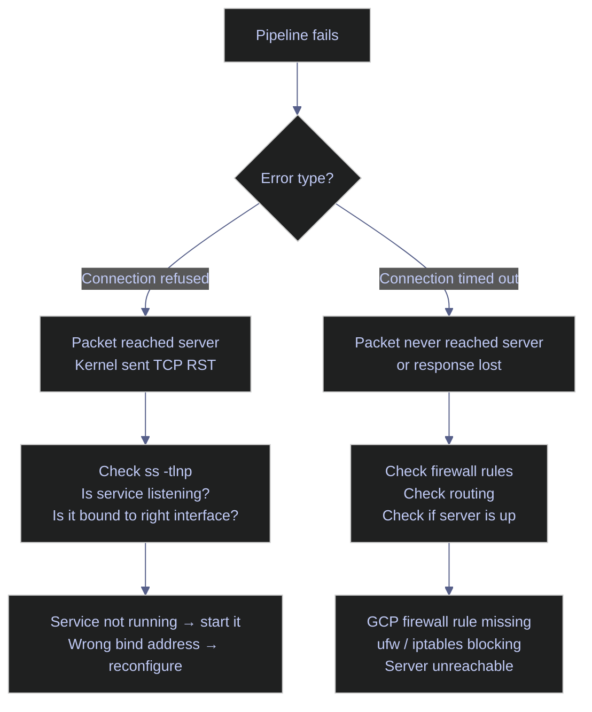

# Socket Inspection

> [!quote]
> "The devil is in the details, and everything in socket programming is a detail."
>
> — **W. Richard Stevens**, *UNIX Network Programming*

> [!abstract]- Summary
> Reading the socket table is the fastest way to determine whether a connectivity failure is a service problem, a bind-address misconfiguration, or a firewall issue — before touching logs.
>
> - **Linux socket inspection tools** — `ss -tlnp` for listeners, `ss -tnp` for established connections; flag reference and bind-address semantics
> - **PowerShell socket inspection tools** — `Get-NetTCPConnection` equivalents for Listen, Established, TimeWait, and CloseWait states
> - **When to use socket inspection tools** — port conflict diagnosis, service verification, connection monitoring, firewall debugging
> - **When not to use socket inspection tools** — application-level pool metrics and network path tracing are out of scope
> - **Warnings** — `netstat` deprecation, loopback-only bind addresses, TIME_WAIT port exhaustion
> - **Recommendations** — scenario-to-command quick reference for common diagnostic tasks
> - **Troubleshooting** — symptom/cause/fix table for the four most common socket-related failures

> [!note]- Glossary
>
> **Socket**
> - A network communication endpoint defined by protocol plus addressing information. In practice, a TCP or UDP socket is identified by protocol, local IP address, and local port; for an active connection, the remote IP address and remote port are also part of the full socket tuple.
> - Distinguishes the abstract idea of "a port is open" from the actual endpoint the OS tracks and applications use for communication.
>
> > [!info] Socket vs port
> >
> > A port is just a number such as `1433`. A socket is the bound or connected endpoint that uses that port, such as `TCP 10.132.0.2:1433`. Tools like `ss` inspect sockets, not bare port numbers.
>
> ---
>
> **`ss`**
> - Modern Linux utility for inspecting socket state. It reads socket information from kernel networking interfaces and is the standard replacement for the older `netstat` tool.
> - Used to verify which services are listening, which connections are active, which TCP states are accumulating, and which processes own those sockets.
>
> > [!info] Why `netstat` is deprecated
> >
> > `netstat` belongs to the older `net-tools` package and is often absent on modern Linux systems. `ss` is part of `iproute2`, which is the standard networking toolset on current distributions.
>
> ---
>
> **LISTEN state**
> - TCP state indicating a server socket has been bound to a local address and port and is waiting for incoming connection attempts.
> - Confirms that a service is ready to accept new TCP sessions, while also showing whether it is bound only to localhost or to broader network interfaces.
>
> > [!info] Bind address semantics
> >
> > In `ss -tlnp`, the local address appears as `<IP>:<port>`. `127.0.0.1` means local-only access. `0.0.0.0` means all IPv4 interfaces. `[::]` means all IPv6 interfaces and may also cover IPv4 on dual-stack systems, depending on OS configuration.
>
> ---
>
> **ESTABLISHED state**
> - TCP state indicating that the three-way handshake has completed and the connection is fully open for data transfer between two endpoints.
> - Used to confirm real client-server sessions are active and to count concurrent connections rather than just checking whether a service is listening.
>
> > [!info] Ephemeral ports
> >
> > The client side usually uses a temporary high-numbered source port chosen by the OS. In `ss`, multiple `ESTAB` rows from the same remote IP but different remote ports usually indicate multiple simultaneous client sessions.
>
> ---
>
> **TIME_WAIT state**
> - TCP state retained for a short period after connection closure so delayed packets from the old session cannot be mistaken for a new one. On many Linux systems this lasts roughly 60 seconds, though the exact behavior is OS-dependent.
> - Helps diagnose workloads that create and tear down large numbers of short-lived connections, which can consume ephemeral ports and indicate missing connection pooling.
>
> > [!info] TIME_WAIT is usually not a bug by itself
> >
> > A small or moderate number of `TIME_WAIT` sockets is normal. It becomes operationally important when the count grows very large relative to the available ephemeral port range or the expected connection pattern.
>
> ---
>
> **CLOSE_WAIT state**
> - TCP state indicating the remote peer has closed its side of the connection, but the local application has not yet closed its own socket.
> - Strong signal of an application-side cleanup problem, because these sockets persist until the local process explicitly closes them.
>
> > [!info] CLOSE_WAIT vs TIME_WAIT
> >
> > `TIME_WAIT` is a normal post-close kernel state. `CLOSE_WAIT` usually means the application received the close notification but failed to release the socket promptly.
>
> ---
>
> **Recv-Q**
> - Receive-queue value shown by `ss`. For listening sockets, it represents completed connections waiting to be accepted by the application. For established sockets, it represents bytes received by the kernel but not yet read by the process.
> - Helps distinguish network reachability from application slowness: a growing `Recv-Q` often means the application is not accepting or reading data fast enough.
>
> > [!info] Send-Q for LISTEN sockets
> >
> > For a listening socket, `Send-Q` represents the configured backlog limit: the maximum number of pending connections the kernel can queue before new attempts are refused or dropped. It is influenced by the application's `listen()` call and kernel limits such as `net.core.somaxconn`.
>
> ---
>
> **`Get-NetTCPConnection`**
> - PowerShell cmdlet on Windows that returns TCP connection objects with properties such as `LocalAddress`, `LocalPort`, `RemoteAddress`, `RemotePort`, `State`, and `OwningProcess`.
> - Windows-native way to inspect TCP listener and connection state in an object-oriented form, similar in purpose to `ss -t` on Linux.
>
> > [!info] Resolving OwningProcess to a name
> >
> > `OwningProcess` is a PID, not a process name. Use `Get-Process -Id <PID>` to map it to a running process when permissions and process visibility allow it.


The most underused debugging skill in data engineering is reading socket state. When a pipeline fails with "connection refused" or "connection timed out," the answer is almost always visible in the socket table — if you know how to read it. `ss` (socket statistics) is the modern replacement for `netstat` on Linux. On Windows, `Get-NetTCPConnection` provides equivalent visibility into TCP socket state.

## Linux socket inspection tools

`ss` reads directly from kernel data structures (netlink) instead of parsing `/proc/net` files, making it faster on systems with thousands of connections. The tool surfaces three essential views: what the system is listening on, what is actively connected, and how connections are distributed across clients.



### Linux | ss | listing listening TCP sockets

`ss -tlnp` is the first command to run when a service is suspected to be down or misconfigured. It shows exactly which process is listening on which port and interface — without needing to parse log files.

The `-t` flag restricts output to TCP sockets. `-l` limits to listening (server-side) sockets. `-n` forces numeric output, avoiding slow reverse DNS lookups on service names. `-p` adds the owning process name, which requires root to see processes owned by other users.

```bash
ss -tlnp
```

```text
State   Recv-Q  Send-Q   Local Address:Port     Peer Address:Port  Process
LISTEN  0       128      0.0.0.0:22              0.0.0.0:*         users:(("sshd",pid=1234,fd=3))
LISTEN  0       128      0.0.0.0:1433            0.0.0.0:*         users:(("sqlservr",pid=5678,fd=5))
LISTEN  0       128      127.0.0.1:1434          0.0.0.0:*
LISTEN  0       128      127.0.0.1:1431          0.0.0.0:*
LISTEN  0       4096     127.0.0.1:5000          0.0.0.0:*
```

#### Interpret the output columns

The output columns provide a complete picture of socket state. Understanding each field is essential for diagnosing connectivity issues accurately.

| Column | Meaning |
|--------|---------|
| **State** | `LISTEN` = waiting for connections. `ESTAB` = active connection. `TIME-WAIT` = closing, waiting for delayed packets. `CLOSE-WAIT` = remote side closed, local app hasn't closed yet. |
| **Recv-Q** | For LISTEN: number of completed connections waiting to be accepted by the application. If consistently above 0, the application is not calling `accept()` fast enough. |
| **Send-Q** | For LISTEN: the configured backlog size — the maximum number of pending connections the kernel will queue before dropping new SYN packets. |
| **Local Address:Port** | The IP and port the socket is bound to. This determines who can reach the service. |
| **Peer Address:Port** | For LISTEN sockets, always `0.0.0.0:*` (accepting from anyone). For ESTAB, the remote client's IP and ephemeral port. |
| **Process** | The program that owns this socket. Requires `sudo` to see processes owned by other users. |

#### Understand bind address semantics

The local address prefix — `0.0.0.0`, `127.0.0.1`, a specific IP, or `[::]` — is the single most diagnostic field in `ss` output. It determines which network interfaces accept connections.

- `0.0.0.0:1433` — listening on all IPv4 interfaces. Any machine on the network can connect. This is the expected bind address for SQL Server, SSH, and web servers in production.
- `127.0.0.1:5000` — loopback only. Only processes on the same machine can connect. External machines receive "connection refused" regardless of firewall rules.
- `[::]:22` — all IPv6 interfaces. On Linux with IPv4-mapped IPv6 enabled, this handles both IPv4 and IPv6 connections.
- `[::1]:1434` — IPv6 loopback only, equivalent to `127.0.0.1` for IPv6 clients.
- `127.0.0.53%lo:53` — loopback bound to the `lo` interface. Used by `systemd-resolved` for local DNS resolution.
- `10.0.0.3:1433` — bound to a specific interface IP. Only connections arriving on that interface are accepted.

#### Common services and their default ports

Knowing the expected bind address for common services makes it immediately obvious when a service is misconfigured.

| Port | Service | Typical Bind Address | Notes |
|------|---------|---------------------|-------|
| 22 | SSH (sshd) | `0.0.0.0` | All interfaces; required for IAP and direct SSH |
| 53 | DNS (systemd-resolved) | `127.0.0.53` | Loopback only; handles local resolution |
| 1433 | SQL Server engine | `0.0.0.0` | All interfaces; accepts DB connections |
| 1434 | SQL Server Browser | `127.0.0.1` | Loopback; named instance discovery; can be disabled on default instances |
| 1431 | SQL Server DAC | `127.0.0.1` | Loopback only; emergency admin access bypassing normal resource limits |
| 5432 | PostgreSQL | `0.0.0.0` or `127.0.0.1` | Controlled by `pg_hba.conf` and `listen_addresses` |
| 5000 | Datadog Agent intake | `127.0.0.1` | Loopback; collects metrics from local processes |
| 5001 | Datadog Agent IPC | `127.0.0.1` | Loopback; internal agent communication |
| 6379 | Redis | `127.0.0.1` | Should never be `0.0.0.0`; exposes all data without auth |
| 8080 | Airflow webserver | `0.0.0.0` | All interfaces; typically behind a reverse proxy |
| 8126 | Datadog APM | `127.0.0.1` | Loopback; receives distributed traces from local apps |

The SQL Server DAC (port 1431) deserves special attention: it provides an emergency connection that bypasses normal connection limits and resource governor settings. It is always localhost-only by design. Connect to it with `sqlcmd -S admin:localhost -U sa` when the server is so overloaded that normal connections are rejected.

| Flag | Syntax | Description |
|------|--------|-------------|
| `-t` | `ss -t` | Show TCP sockets only |
| `-u` | `ss -u` | Show UDP sockets only |
| `-x` | `ss -x` | Show Unix domain sockets |
| `-l` | `ss -l` | Show listening sockets only |
| `-n` | `ss -n` | Numeric output — skip service name resolution |
| `-p` | `ss -p` | Show owning process (requires root for other users) |
| `-a` | `ss -a` | Show all sockets (listening and established) |
| `-e` | `ss -e` | Show extended socket information (timer, inode, uid) |
| `-o` | `ss -o` | Show timer information |
| `-4` | `ss -4` | IPv4 only |
| `-6` | `ss -6` | IPv6 only |

### Linux | ss | viewing established connections

Without the `-l` flag, `ss` shows established (active) connections instead of listening sockets. This view answers "who is currently connected to my services" and is the first step when diagnosing connection pool behavior or identifying unexpected clients.

```bash
ss -tnp
```

```text
State   Recv-Q  Send-Q   Local Address:Port     Peer Address:Port  Process
ESTAB   0       0        10.0.0.3:1433          10.0.0.24:56434
ESTAB   0       0        10.0.0.3:1433          10.0.0.24:26733
ESTAB   0       0        10.0.0.3:22            35.235.240.5:44122
```

#### Interpret peer addresses and ephemeral ports

Reading the peer address column reveals which clients hold active connections and how many sessions each holds.

- `10.0.0.24:56434 → 10.0.0.3:1433` — an IAP proxy internal IP connected to SQL Server. The high ephemeral port (56434) identifies the client side of the connection.
- Two connections from `10.0.0.24` with different ephemeral ports (56434, 26733) — two SQL Server sessions from the same IAP proxy. This is typical for SSMS with two query windows open, or one application with two concurrent sessions.
- `35.235.240.5:44122 → 10.0.0.3:22` — SSH connection from a Google IAP IP (the `35.235.240.0/20` range). This is the interactive SSH session established via `gcloud compute ssh`.

When a client connects, the OS selects a random high port in the ephemeral range (typically 32768–60999 on Linux) as the client-side port. The server sees this as the peer port. Each connection gets a unique ephemeral port, which is why multiple connections from the same client to the same server port show different peer port numbers.

### Linux | ss | filtering and counting connections

These commands isolate connection counts and distributions for a specific port — essential during incident response and load testing.

#### Count active connections to a port

Piping `ss` output through `wc -l` gives an instant count of active connections to a specific port, without needing a database query or application-level metrics.

```bash
ss -tn | grep :1433 | wc -l
```

```text
12
```

#### Count connections per remote IP

This pipeline identifies which clients hold the most connections. A single IP holding an outsized share of connections typically indicates a connection pool leak or a runaway batch process.

```bash
ss -tn | grep :1433 | awk '{print $5}' | cut -d: -f1 | sort | uniq -c | sort -rn
```

```text
      8 10.0.0.24
      3 10.0.0.51
      1 10.0.0.99
```

#### Detect TIME-WAIT accumulation

TIME-WAIT is a normal TCP state: after a connection closes, the OS holds the socket in TIME-WAIT for 2× MSL (typically 60 seconds on Linux) to absorb delayed packets. A small number is expected. A large accumulation — hundreds or thousands — indicates that connections are being opened and closed rapidly without pooling.

```bash
ss -tn state time-wait | grep :1433
```

```text
TIME-WAIT  0  0  10.0.0.3:1433  10.0.0.24:41233
TIME-WAIT  0  0  10.0.0.3:1433  10.0.0.24:41890
TIME-WAIT  0  0  10.0.0.3:1433  10.0.0.51:38712
```

> [!warning] Excessive TIME-WAIT connections
>
> When ephemeral ports (32768–60999) fill up with TIME-WAIT sockets, new connections fail with "Cannot assign requested address." This happens when a pipeline opens and closes database connections without pooling — each short query consumes an ephemeral port that stays reserved for up to 60 seconds.

> [!success] Fix TIME-WAIT accumulation
>
> The primary fix is connection pooling in the application — reuse connections rather than creating a new one per query. If pooling is already in place, enable TCP TIME-WAIT reuse at the kernel level: `sudo sysctl -w net.ipv4.tcp_tw_reuse=1`. Persist across reboots by adding `net.ipv4.tcp_tw_reuse=1` to `/etc/sysctl.conf`. Note: `tcp_tw_reuse` applies to outgoing connections only (client side); it does not affect the server's TIME-WAIT sockets.

#### View a connection state summary

`ss -s` prints aggregate counts by socket type and TCP state. It does not filter by port, making it a quick system-wide health snapshot.

```bash
ss -s
```

```text
Total: 247
TCP:   38 (estab 12, closed 4, orphaned 0, timewait 6)

Transport Total     IP        IPv6
RAW       0         0         0
UDP       8         4         4
TCP       34        20        14
INET      42        24        18
FRAG      0         0         0
```

#### Monitor connection count in real time

`watch` re-runs a command on a fixed interval and refreshes the terminal in place. Combined with `ss`, it provides a live counter useful during load tests, deployments, and incident investigation.

```bash
watch -n 1 'ss -tn | grep :1433 | wc -l'
```

```text
Every 1.0s: ss -tn | grep :1433 | wc -l

14
```

| Flag | Syntax | Description |
|------|--------|-------------|
| `-t` | `ss -t` | TCP sockets only |
| `-n` | `ss -n` | Numeric output |
| `-p` | `ss -p` | Show process info |
| `state <name>` | `ss state time-wait` | Filter by TCP state (established, time-wait, close-wait, etc.) |
| `src <addr>` | `ss src 10.0.0.3` | Filter by local address |
| `dst <addr>` | `ss dst 10.0.0.24` | Filter by peer address |
| `sport = :1433` | `ss sport = :1433` | Filter by local port |
| `dport = :1433` | `ss dport = :1433` | Filter by destination port |

### Linux | ss | diagnosing connection refused vs connection timed out

These two errors look similar in application logs but have completely different causes at the network layer. Distinguishing them immediately narrows the investigation scope.

**Connection refused** means the packet reached the server, the kernel processed it, and sent back a TCP RST (reset) because nothing is listening on that port — or the process is listening on a different interface. The failure is instant.

**Connection timed out** means the packet never reached its destination, or the response never arrived. The kernel sent a SYN, received no SYN-ACK, and eventually gave up after retransmitting. This takes seconds (matching your configured socket timeout). Causes: firewall rules dropping packets, incorrect routing, or the server being unreachable.

#### Distinguish the error type quickly

`nc -zv` attempts a TCP connection and reports the result. The `-w 3` timeout flag ensures the command exits in 3 seconds rather than waiting for the default kernel retransmit timeout (up to 2 minutes).

```bash
nc -zv -w 3 10.0.0.3 1433
```

```text
# Connection refused (instant — kernel RST):
nc: connect to 10.0.0.3 port 1433 (tcp) failed: Connection refused

# Connection timed out (takes 3 seconds — no response):
nc: connect to 10.0.0.3 port 1433 (tcp) failed: Connection timed out
```

> [!warning] Misreading the error type delays diagnosis
>
> Treating "connection timed out" as a service issue (and restarting the service) when the actual cause is a firewall rule wastes time and may cause unnecessary downtime.

> [!success] Correct diagnostic path
>
> - **Refused**: Run `ss -tlnp` on the server. If nothing is listening on that port, the service is down or bound to the wrong interface. If it is listening on `127.0.0.1` instead of `0.0.0.0`, reconfigure the service's bind address.
> - **Timed out**: Check GCP firewall rules (`gcloud compute firewall-rules list`), `ufw status`, or `iptables -L`. The problem is at the network/firewall layer, not the application layer.

| Flag | Syntax | Description |
|------|--------|-------------|
| `-z` | `nc -z host port` | Scan mode — connect and disconnect without sending data |
| `-v` | `nc -v host port` | Verbose — print connection result |
| `-w` | `nc -w 3 host port` | Timeout in seconds before giving up |
| `-u` | `nc -u host port` | UDP mode instead of TCP |

## PowerShell socket inspection tools

`Get-NetTCPConnection` is the native PowerShell cmdlet for reading TCP socket state on Windows. It covers the same diagnostic ground as `ss` on Linux: listing listening ports, reading established connections, counting per-client connections, and inspecting TCP state distribution. The output is a collection of objects, making it composable with `Where-Object`, `Group-Object`, and `Sort-Object` in ways that `ss` text output requires `awk`/`grep` to achieve.

### PowerShell | Get-NetTCPConnection | listing listening TCP sockets

`Get-NetTCPConnection -State Listen` returns all TCP sockets in the LISTEN state. The `-State` parameter accepts any standard TCP state name. Adding a computed property resolves the owning process ID to a human-readable name.

```powershell
Get-NetTCPConnection -State Listen | Sort-Object LocalPort |
    Select-Object LocalAddress, LocalPort, OwningProcess,
    @{N='Process';E={(Get-Process -Id $_.OwningProcess -ErrorAction SilentlyContinue).ProcessName}} |
    Format-Table -AutoSize
```

```text
LocalAddress  LocalPort  OwningProcess  Process
------------  ---------  -------------  -------
0.0.0.0       22         1234           sshd
0.0.0.0       1433       5678           sqlservr
127.0.0.1     1431       5678           sqlservr
127.0.0.1     1434       5678           sqlservr
127.0.0.1     5000       9012           datadog-agent
```

#### Interpret bind addresses on Windows

The local address semantics are identical to Linux. `0.0.0.0` binds to all IPv4 interfaces; `127.0.0.1` restricts to loopback. The same service configuration table from the Linux section applies to Windows deployments.

> [!info] Windows does not have a direct equivalent to `ss -p` without administrator rights
>
> On Linux, `ss -p` as root always shows process names. On Windows, resolving `OwningProcess` to a process name via `Get-Process` may return `$null` for system-level processes (e.g., `System`, `svchost`) and will throw errors for PIDs that exit between the two calls. The `-ErrorAction SilentlyContinue` suppresses those errors silently. For system-level sockets, use `netstat -ano` and cross-reference with Task Manager or `Get-Service`.

### PowerShell | Get-NetTCPConnection | viewing established connections

Without a `-State` filter — or with `-State Established` — `Get-NetTCPConnection` shows active connections. Filtering by `-LocalPort` isolates connections to a specific service.

```powershell
Get-NetTCPConnection -LocalPort 1433 -State Established |
    Select-Object LocalAddress, LocalPort, RemoteAddress, RemotePort |
    Format-Table -AutoSize
```

```text
LocalAddress  LocalPort  RemoteAddress  RemotePort
------------  ---------  -------------  ----------
10.0.0.3      1433       10.0.0.24      56434
10.0.0.3      1433       10.0.0.24      26733
10.0.0.3      1433       10.0.0.51      38900
```

#### Interpret remote addresses and ephemeral ports

The `RemotePort` column shows the client's ephemeral port, identical to the peer port in `ss` output. Multiple rows with the same `RemoteAddress` and different `RemotePort` values indicate multiple concurrent sessions from the same client — typical for connection pools or multi-window SSMS usage.

### PowerShell | Get-NetTCPConnection | counting connections per remote address

`Group-Object` replaces the `awk | sort | uniq -c | sort -rn` pipeline from Linux. The result is a sorted object collection rather than text, making further filtering straightforward.

```powershell
Get-NetTCPConnection -LocalPort 1433 -State Established |
    Group-Object RemoteAddress | Sort-Object Count -Descending |
    Select-Object Count, Name
```

```text
Count  Name
-----  ----
8      10.0.0.24
3      10.0.0.51
1      10.0.0.99
```

### PowerShell | Get-NetTCPConnection | connection state breakdown

`Group-Object State` provides the TCP state distribution for connections on a port — the PowerShell equivalent of `ss -s` restricted to a single port.

```powershell
Get-NetTCPConnection -LocalPort 1433 | Group-Object State |
    Select-Object Count, Name | Sort-Object Count -Descending
```

```text
Count  Name
-----  ----
12     Established
6      TimeWait
2      Listen
1      CloseWait
```

> [!warning] CloseWait accumulation on Windows
>
> `CloseWait` means the remote side has closed the connection but the local application has not yet closed its socket. On Windows, a growing `CloseWait` count on port 1433 indicates the application is not properly disposing of `SqlConnection` objects. The connection pool holds them open waiting for explicit `Close()` or `Dispose()` calls.

> [!success] Fix CloseWait accumulation
>
> Always wrap `SqlConnection` in a `using` block in C#. This guarantees `Dispose()` is called even when exceptions occur, returning the connection to the pool cleanly and preventing socket accumulation.

### PowerShell | Get-NetTCPConnection | real-time monitoring

PowerShell does not have a native equivalent to `watch`. A `while` loop with `Start-Sleep` and `Clear-Host` replicates the behavior.

```powershell
while ($true) {
    Clear-Host
    $count = (Get-NetTCPConnection -LocalPort 1433 -State Established -ErrorAction SilentlyContinue).Count
    Write-Host "$(Get-Date -Format 'HH:mm:ss')  Established connections on :1433  →  $count"
    Start-Sleep -Seconds 1
}
```

```text
14:32:01  Established connections on :1433  →  12
```

> [!info] No native equivalent to `watch` on Windows
>
> Linux `watch` is a dedicated utility that handles terminal refresh, elapsed time display, and diff highlighting. PowerShell's `while` loop with `Clear-Host` is the closest pattern but lacks diff highlighting. The `PSWatch` community module provides closer parity for complex monitoring scenarios.

| Parameter | Syntax | Description |
|-----------|--------|-------------|
| `-State` | `-State Listen` | Filter by TCP state (Listen, Established, TimeWait, CloseWait, etc.) |
| `-LocalPort` | `-LocalPort 1433` | Filter by local port number |
| `-LocalAddress` | `-LocalAddress 127.0.0.1` | Filter by local IP address |
| `-RemoteAddress` | `-RemoteAddress 10.0.0.24` | Filter by remote IP address |
| `-RemotePort` | `-RemotePort 56434` | Filter by remote port number |
| `-OwningProcess` | `-OwningProcess 5678` | Filter by owning process ID |


## Warnings

> [!warning] `netstat` is deprecated on modern Linux
>
> `netstat` is part of the `net-tools` package which is not installed by default on modern distributions. Use `ss` instead -- it is faster, always available, and provides more information.

> [!warning] A service listening on `127.0.0.1` is only accessible locally
>
> If `ss -tlnp` shows a service bound to `127.0.0.1:<port>`, it rejects connections from other machines. The service must listen on `0.0.0.0` (all interfaces) or the specific external IP to accept remote connections.

> [!warning] TIME_WAIT accumulation can exhaust ephemeral ports
>
> Rapid connection cycling (opening and closing connections in a tight loop) creates thousands of TIME_WAIT sockets that hold ephemeral ports for 60 seconds. This can prevent new outbound connections.

## Recommendations

| Scenario | Recommendation |
|---|---|
| Find what listens on a port | `ss -tlnp \| grep :<port>` (Linux) or `Get-NetTCPConnection -LocalPort <port> -State Listen` (PowerShell). |
| List all listening services | `ss -tlnp` shows all TCP listeners with PID and process name. |
| Count connections to a service | `ss -tn state established \| grep :<port> \| wc -l`. |
| Diagnose "Address already in use" | `ss -tlnp \| grep :<port>` to find the owning process. Kill it or use a different port. |
| Diagnose TIME_WAIT buildup | `ss -tn state time-wait \| wc -l`. Fix the connection pattern (use connection pooling). |

## Troubleshooting

| Symptom | Likely cause | Fix |
|---|---|---|
| "Address already in use" | Another process is listening on the port, or a TIME_WAIT socket holds it. | `ss -tlnp \| grep :<port>` to find the process. Kill it or use `SO_REUSEADDR`. |
| Service is running but not accessible remotely | Listening on `127.0.0.1` instead of `0.0.0.0`, or firewall blocks the port. | Check listen address with `ss -tlnp`. Update service config to bind to `0.0.0.0`. Check firewall rules. |
| Thousands of TIME_WAIT sockets | Application opens and closes connections rapidly without connection pooling. | Implement connection pooling. Reduce `net.ipv4.tcp_fin_timeout` only as a last resort. |
| CLOSE_WAIT sockets accumulating | Application received FIN from remote but has not closed its end of the connection. This is an application bug. | Fix the application to properly close connections. CLOSE_WAIT never times out -- the application must close. |

## Cross-references
- [connectivity-testing](https://alp78.github.io/elysium/01-Shell/Networking/connectivity-testing) — test reachability before reading socket state
- [firewalls](https://alp78.github.io/elysium/01-Shell/Networking/firewalls) — when sockets show nothing listening but you expected something
- [iap-tunneling](https://alp78.github.io/elysium/01-Shell/Networking/iap-tunneling) — understanding IAP proxy addresses in established connections
- [viewing-processes](https://alp78.github.io/elysium/01-Shell/Process-Management/viewing-processes) — find which process owns a socket (combine with `ss -p`)
