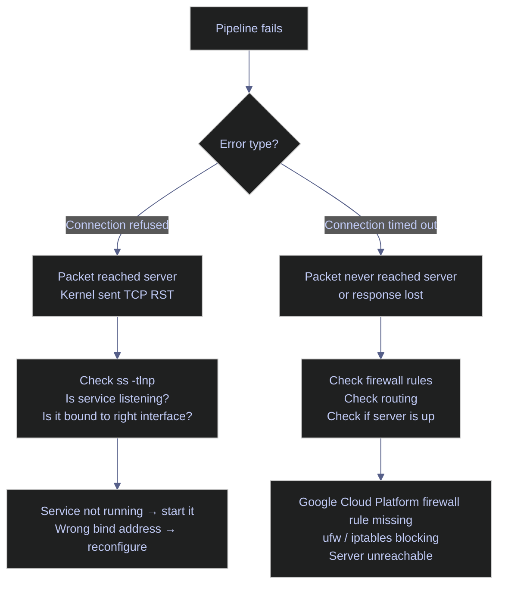

# Socket Inspection

> [!quote]+
>
> "The devil is in the details, and everything in socket programming is a detail."
>
> — **W. Richard Stevens**, *UNIX Network Programming*

> [!abstract]- Summary
>
> Socket tables answer three questions quickly: is anything listening, who is connected, and does the failure point to the service or the network path.
>
> - `ss` and `Get-NetTCPConnection` show listeners, established sessions, queue depth, and Transmission Control Protocol (TCP) state.
> - Bind address tells you whether a service is localhost-only, interface-specific, or reachable remotely.
> - `Connection refused` points to no matching listener or the wrong bind address; `connection timed out` points to routing or firewall loss.
> - `TIME_WAIT` and `CLOSE_WAIT` distinguish normal connection churn from application cleanup problems.

> [!note]- Glossary
>
> **Socket**
>
> - A network communication endpoint. For TCP or User Datagram Protocol (UDP), the kernel tracks the protocol, local IP address, and local port; active sessions also include the remote address and remote port.
> - Distinguishes the abstract statement "port `1433` is open" from the actual endpoint that an application owns and the OS manages.
> - A port is only the numeric component. `TCP 10.132.0.2:1433` is the socket that uses that port.
>
> ---
>
> **`ss`**
>
> - Modern Linux utility for inspecting socket state. It reads from kernel networking interfaces and is the standard replacement for the older `netstat` tool.
> - Used to confirm listeners, inspect active sessions, review queue depth, and identify which process owns a socket.
> - `netstat` belongs to the older `net-tools` package and is often absent on current Linux distributions. `ss` ships with `iproute2`, which is the default networking toolset on modern systems.
>
> ---
>
> **LISTEN state**
>
> - TCP state that indicates a server socket has bound to a local address and port and is waiting for incoming connections.
> - Confirms that a service is ready to accept new sessions, while also showing whether it is bound only to loopback or to broader network interfaces.
> - In `ss -tlnp`, the local address appears as `<IP>:<port>`. `127.0.0.1` means local-only access. `0.0.0.0` means all IPv4 interfaces. `[::]` means all IPv6 interfaces and can also cover IPv4 on dual-stack systems, depending on OS configuration.
>
> ---
>
> **ESTABLISHED state**
>
> - TCP state that indicates the three-way handshake has completed and the connection is fully open for data transfer.
> - Used to confirm that real client-server sessions exist and to count concurrent connections instead of only checking whether a service is listening.
> - The client side usually uses a temporary high-numbered ephemeral port chosen by the OS. Multiple `ESTAB` rows from the same remote IP with different remote ports usually mean multiple simultaneous sessions.
>
> ---
>
> **TIME_WAIT state**
>
> - TCP state retained briefly after a connection closes so delayed packets from the old session cannot be mistaken for a new one.
> - Helps diagnose workloads that create and tear down large numbers of short-lived sessions, which can consume ephemeral ports and signal missing connection pooling.
> - The delay is tied to the maximum segment lifetime (MSL). A small number of `TIME_WAIT` sockets is normal; a large number matters when it grows relative to the host's ephemeral port range.
>
> ---
>
> **CLOSE_WAIT state**
>
> - TCP state that indicates the remote peer has closed its side of the connection, but the local application has not yet closed its own socket.
> - Strong sign of an application-side cleanup problem, because these sockets remain until the local process explicitly closes them.
> - `TIME_WAIT` is a normal post-close kernel state. `CLOSE_WAIT` usually means the application received the close notification and did not release the socket promptly.
>
> ---
>
> **Recv-Q**
>
> - Receive-queue value shown by `ss`. For listening sockets, it is the number of completed connections waiting to be accepted by the application. For established sockets, it is the number of bytes received by the kernel but not yet read by the process.
> - Helps distinguish network reachability from application slowness. A growing `Recv-Q` often means the application is not accepting or reading data fast enough.
> - For a listening socket, `Send-Q` represents the configured backlog limit: the maximum number of pending connections the kernel can queue before new attempts are refused or dropped.
>
> ---
>
> **`Get-NetTCPConnection`**
>
> - PowerShell cmdlet on Windows that returns TCP connection objects with properties such as `LocalAddress`, `LocalPort`, `RemoteAddress`, `RemotePort`, `State`, and `OwningProcess`.
> - Windows-native way to inspect TCP listener and connection state in object form, similar in purpose to `ss -t` on Linux.
> - `OwningProcess` is a PID, not a process name. Use `Get-Process -Id <PID>` when you need the executable name and the process is still visible in the current session.

Reading socket state is one of the fastest ways to separate a service problem from a network-path problem. `ss` is the modern Linux replacement for `netstat`, and `Get-NetTCPConnection` provides the same visibility on Windows in object form.

## Linux socket inspection tools

`ss` reads directly from kernel networking interfaces instead of parsing the older `net-tools` output. The Linux sections below focus on TCP listeners, active sessions, and failure signals you can confirm from the terminal.



### Linux | `ss` | inspect listeners

Listener output answers the first question in most incidents: is anything bound to the port, and if so, on which address?

#### List listening TCP sockets

At first verification when a service may be down or misbound. It is typically triggered by A client cannot connect, or you need to confirm the listener address. Linux host with `ss`; add privilege if you need complete process ownership. Show TCP listeners, bind addresses, and visible owning processes in one capture.

This capture came from the live Ubuntu WSL environment during the refactor pass. It shows loopback-only listeners, wildcard listeners, and interface-specific listeners in one view, which makes the bind-address differences easy to read.

*Run the commands in this section to list listening TCP sockets.*
```bash
ss -tlnp | sed -n '1,6p'
```

```text
State  Recv-Q Send-Q Local Address:Port Peer Address:Port Process
LISTEN 0      1000   10.255.255.254:53  0.0.0.0:*
LISTEN 0      4096   127.0.0.53%lo:53   0.0.0.0:*
LISTEN 0      4096   127.0.0.54:53      0.0.0.0:*
LISTEN 0      5      0.0.0.0:18080      0.0.0.0:*         users:(("python3",pid=32037,fd=3))
LISTEN 0      4096   *:1434             *:*
```

#### Interpret the output columns

The columns below are short enough to keep as a lookup table because they define fixed fields rather than scenario-specific guidance.

| Column | Meaning |
|--------|---------|
| **State** | `LISTEN` = waiting for connections. `ESTAB` = active connection. `TIME-WAIT` = closing, waiting for delayed packets. `CLOSE-WAIT` = remote side closed, local app has not closed yet. |
| **Recv-Q** | For `LISTEN`, completed connections waiting for the application to call `accept()`. If it stays above `0`, the application is not accepting fast enough. |
| **Send-Q** | For `LISTEN`, the configured backlog size: the maximum number of pending connections the kernel will queue before it starts refusing or dropping new attempts. |
| **Local Address:Port** | The IP address and port the socket is bound to. This determines who can reach the service. |
| **Peer Address:Port** | For `LISTEN`, usually `0.0.0.0:*` or `*:*`. For `ESTAB`, the remote client's address and ephemeral port. |
| **Process** | The program that owns the socket. `sudo` is required to see processes owned by other users. |

#### Read bind addresses correctly

The local address prefix is often the single most diagnostic field in `ss` output.

- `0.0.0.0:1433` listens on all IPv4 interfaces. Any host that can route to the machine can attempt a connection.
- `127.0.0.1:5000` is loopback only. Processes on the same machine can connect, but remote hosts cannot.
- `[::]:22` listens on all IPv6 interfaces and can also accept IPv4 connections on dual-stack systems, depending on `sysctl` settings.
- `[::1]:1434` is IPv6 loopback only.
- `127.0.0.53%lo:53` is loopback-bound to the `lo` interface, which is common for `systemd-resolved`.
- `10.0.0.3:1433` listens only on one interface. Traffic arriving on other interfaces is not accepted.

#### Common services and their default ports

Knowing the usual bind address for common services makes misconfiguration obvious when the listener table disagrees with your expectation.

| Port | Service | Typical Bind Address | Notes |
|------|---------|---------------------|-------|
| 22 | SSH (sshd) | `0.0.0.0` | All interfaces; required for Identity-Aware Proxy (IAP) and direct SSH |
| 53 | DNS (systemd-resolved) | `127.0.0.53` | Loopback only; handles local resolution |
| 1433 | SQL Server engine | `0.0.0.0` | All interfaces; accepts DB connections |
| 1434 | SQL Server Browser | `127.0.0.1` | Loopback; named instance discovery; can be disabled on default instances |
| 1431 | SQL Server Dedicated Administrator Connection (DAC) | `127.0.0.1` | Loopback only; emergency admin access bypassing normal resource limits |
| 5432 | PostgreSQL | `0.0.0.0` or `127.0.0.1` | Controlled by `pg_hba.conf` and `listen_addresses` |
| 5000 | Datadog Agent intake | `127.0.0.1` | Loopback; collects metrics from local processes |
| 5001 | Datadog Agent IPC | `127.0.0.1` | Loopback; internal agent communication |
| 6379 | Redis | `127.0.0.1` | Should never be `0.0.0.0`; exposes all data without auth |
| 8080 | Airflow webserver | `0.0.0.0` | All interfaces; typically behind a reverse proxy |
| 8126 | Datadog APM | `127.0.0.1` | Loopback; receives distributed traces from local apps |

The SQL Server Dedicated Administrator Connection (DAC) on port `1431` deserves special attention. It is always loopback-only by design, and it exists so you can still connect when normal sessions are exhausted or heavily throttled.

#### Review frequently used `ss` flags

| Flag | Syntax | Description |
|------|--------|-------------|
| `-t` | `ss -t` | Show TCP sockets only |
| `-u` | `ss -u` | Show UDP sockets only |
| `-x` | `ss -x` | Show Unix domain sockets |
| `-l` | `ss -l` | Show listening sockets only |
| `-n` | `ss -n` | Numeric output; skip service-name and reverse-DNS lookup |
| `-p` | `ss -p` | Show owning process (requires root for other users) |
| `-a` | `ss -a` | Show all sockets (listening and established) |
| `-e` | `ss -e` | Show extended socket information (timer, inode, uid) |
| `-o` | `ss -o` | Show timer information |
| `-4` | `ss -4` | IPv4 only |
| `-6` | `ss -6` | IPv6 only |

### Linux | `ss` | inspect active sessions

Established-session output answers a different question: who is connected right now, and what state is the connection churn in?

#### Show established TCP sessions

After you know a listener exists and need to prove active client traffic. It is typically triggered by you need to confirm who is connected right now. Linux host with a known local service port. Show server-side `ESTAB` rows and the client ephemeral ports attached to them.

The capture below was taken against a temporary loopback listener on `127.0.0.1:45432` so the output stays real without pretending a specific database or web service existed locally. Filtering with `sport = :45432` keeps the server-side row and avoids counting both halves of the same loopback connection.

*Run the commands in this section to show established TCP sessions.*
```bash
ss -tnp state established '( sport = :45432 )'
```

```text
Recv-Q Send-Q Local Address:Port Peer Address:Port Process
0      0      127.0.0.1:45432   127.0.0.1:38258 users:(("nc",pid=33228,fd=4))
```

The peer port `38258` is the client's ephemeral port. On a real service, repeated rows with the same remote IP and different remote ports usually mean multiple concurrent sessions from that host.

#### Count active sessions on a local port

When you need a quick concurrency count instead of a full session list. It is typically triggered by you already know the local listener port and only need the number. Linux host with a stable filter on the server-side port. Count live established sessions attached to one listener.

When you only need a count, hide the header with `-H` and let `wc -l` count the remaining rows. This is the quickest way to answer "how many live sessions are attached to this listener right now?"

*Run the commands in this section to count active sessions on a local port.*
```bash
ss -H -tn state established '( sport = :45432 )' | wc -l
```

```text
1
```

#### Count sessions by remote IP address

When one client or proxy may be consuming a disproportionate share of sessions. It is typically triggered by you need a per-client distribution instead of a raw connection list. Linux host with established sessions already filtered to one listener. Rank remote IP addresses by concurrent connection count.

This pipeline extracts the peer address, strips the ephemeral port, and then counts identical client IPs. In a real incident, the IP with the largest count often deserves inspection first.

*Run the commands in this section to count sessions by remote IP address.*
```bash
ss -H -tn state established '( sport = :45432 )' | sed -E 's/.* +([^ ]+)$/\1/' | cut -d: -f1 | sort | uniq -c | sort -rn
```

```text
      1 127.0.0.1
```

#### Check `TIME_WAIT` accumulation

When you suspect short-lived connection churn or ephemeral-port pressure. It is typically triggered by you see many reconnects, port exhaustion symptoms, or noisy close activity. Linux host handling repeated client connections. Measure post-close socket accumulation before changing client code or kernel settings.

`TIME_WAIT` is normal after connection teardown, but a large pile of sockets means the host is creating and destroying sessions faster than the application reuses them. The capture below came from repeated short loopback connects to a temporary listener on `127.0.0.1:45434`.

*Run the commands in this section to check `TIME_WAIT` accumulation.*
```bash
ss -tn state time-wait '( dport = :45434 )'
```

```text
Recv-Q Send-Q Local Address:Port Peer Address:Port Process
0      0      127.0.0.1:36756   127.0.0.1:45434
0      0      127.0.0.1:36750   127.0.0.1:45434
0      0      127.0.0.1:36752   127.0.0.1:45434
```

Connection pooling is the primary fix. If pooling is already in place and the system is still healthy otherwise, `net.ipv4.tcp_tw_reuse=1` can help outgoing client sockets, but it does not change the server side of `TIME_WAIT`.

#### Summarize TCP state on the host

When you need a fast host-wide baseline before drilling into one service. It is typically triggered by it is unclear whether the issue is isolated or system-wide. Any Linux host with `ss` available. Snapshot aggregate TCP state counts such as `estab` and `timewait`.

`ss -s` is the quickest system-wide snapshot. It does not explain a single service, but it tells you whether the machine is broadly accumulating `timewait`, sitting idle, or carrying many established sessions.

*Run the commands in this section to summarize TCP state on the host.*
```bash
ss -s
```

```text
Total: 329
TCP:   71 (estab 0, closed 66, orphaned 0, timewait 9)

Transport Total     IP        IPv6
RAW       0         0         0
UDP       5         4         1
TCP       5         4         1
INET      10        8         2
FRAG      0         0         0
```

#### Poll a connection count once per second

During a short load test, deploy, or live verification window. It is typically triggered by you need to watch the connection count change over time. Linux shell where a bounded loop is easier to document than `watch`. Sample the same session-count expression repeatedly without leaving a static snapshot.

For documentation, a bounded loop is easier to capture cleanly than `watch`. In live work, the same expression can be wrapped with `watch -n 1` once you know the filter is correct.

*Run the commands in this section to poll a connection count once per second.*
```bash
for i in 1 2 3; do
  ss -H -tn state established '( sport = :45432 )' | wc -l
  sleep 1
done
```

```text
1
1
1
```

#### Review frequently used filters

| Flag | Syntax | Description |
|------|--------|-------------|
| `-t` | `ss -t` | TCP sockets only |
| `-n` | `ss -n` | Numeric output |
| `-p` | `ss -p` | Show process info |
| `state <name>` | `ss state time-wait` | Filter by TCP state (`established`, `time-wait`, `close-wait`, and so on) |
| `src <addr>` | `ss src 10.0.0.3` | Filter by local address |
| `dst <addr>` | `ss dst 10.0.0.24` | Filter by peer address |
| `sport = :1433` | `ss sport = :1433` | Filter by local port |
| `dport = :1433` | `ss dport = :1433` | Filter by destination port |

### Linux | `nc` and `ss` | separate refused from timed out

The error string tells you where to investigate next, but only if you distinguish it correctly. `Connection refused` means the target host responded with a TCP reset (RST). `Connection timed out` means the initial synchronize (SYN) never produced a synchronize-acknowledgment (SYN-ACK) before the timeout expired.

#### Confirm a refused connection

When an application fails immediately with `Connection refused`. It is typically triggered by you need to prove the target answered with a reset rather than timing out. Safe against an unused local port where no listener exists. Demonstrate the fast failure mode that points back to listener state or bind address.

This command targets an unused local port. The failure is immediate because the packet reaches the host and the kernel responds right away.

*Run the commands in this section to confirm a refused connection.*
```bash
nc -zv -w 2 127.0.0.1 45435
```

```text
nc: connect to 127.0.0.1 port 45435 (tcp) failed: Connection refused
```

If you get an immediate refusal in production, check the listener table on the server before you touch firewall rules.

#### Confirm a timed-out connection

When a client hangs and then reports a timeout. It is typically triggered by you need to separate network-path loss from a missing listener. Safe against an unroutable target with a short explicit timeout. Demonstrate the slow failure mode associated with routing, filtering, or host reachability loss.

This command uses a short timeout against an unroutable target so the failure mode is safe to reproduce. The exact wording varies by `nc` build, but the important signal is that the command waits and then times out instead of failing immediately.

*Run the commands in this section to confirm a timed-out connection.*
```bash
nc -zv -w 2 10.255.255.1 45435
```

```text
nc: connect to 10.255.255.1 port 45435 (tcp) timed out: Operation now in progress
```

When the timeout case appears, investigate routing, security groups, `ufw`, `iptables`, or whether the remote host is reachable at all.

#### Review frequently used `nc` flags

| Flag | Syntax | Description |
|------|--------|-------------|
| `-z` | `nc -z host port` | Scan mode; connect and disconnect without sending data |
| `-v` | `nc -v host port` | Verbose; print the connection result |
| `-w` | `nc -w 3 host port` | Timeout in seconds before giving up |
| `-u` | `nc -u host port` | UDP mode instead of TCP |

## PowerShell socket inspection tools

`Get-NetTCPConnection` returns objects instead of plain text, so you can filter by `LocalPort`, `RemotePort`, `State`, or `OwningProcess` without shell pipelines. The examples below use live host state that already existed during the refactor pass instead of synthetic SQL Server output.

### PowerShell | `Get-NetTCPConnection` | inspect listeners

Listener objects answer the same first question as `ss -tlnp`: is anything listening, and on which address?

#### List listening TCP sockets

At first verification when a Windows service may be down or misbound. It is typically triggered by A client cannot connect, or you need the current listener inventory. Windows host with `Get-NetTCPConnection`; process names are resolved opportunistically. Show listening TCP endpoints with their local address, port, and owning PID.

The command below sorts listeners by port, resolves the owning PID to a process name when possible, and limits the capture to the first eight rows so the output remains readable.

*Run the commands in this section to list listening TCP sockets.*
```powershell
Get-NetTCPConnection -State Listen | Sort-Object LocalPort |
    Select-Object -First 8 LocalAddress, LocalPort, OwningProcess,
    @{N='Process';E={(Get-Process -Id $_.OwningProcess -ErrorAction SilentlyContinue).ProcessName}} |
    Format-Table -AutoSize
```

```text
LocalAddress  LocalPort  OwningProcess  Process
------------  ---------  -------------  -------
0.0.0.0             135          2032   svchost
::                  135          2032   svchost
172.25.64.1         139             4   System
192.168.0.118       139             4   System
::                  445             4   System
127.0.0.1          1042         22768   asus_framework
127.0.0.1          1043         22768   asus_framework
0.0.0.0            1236          5172   AsusUpdateCheck
```

#### Read bind addresses on Windows

The address meanings match Linux: `0.0.0.0` is all IPv4 interfaces, `::` is all IPv6 interfaces, and `127.0.0.1` is loopback only. `OwningProcess` is only a PID, so a second lookup through `Get-Process` is still required when you need a name.

### PowerShell | `Get-NetTCPConnection` | inspect active sessions

On Windows, the same object model works for outbound and inbound sessions. The examples below use currently active HTTPS sessions because they were already present on the host and did not require fabricating a mock server.

#### Show established HTTPS sessions

When you need a live example of established Windows TCP sessions. It is typically triggered by you want to confirm active client traffic on a stable service port. Windows host already carrying outbound HTTPS sessions. Show established connections and the local ephemeral ports attached to them.

Filtering on `RemotePort 443` is useful on workstations and jump hosts because HTTPS is often the busiest stable workload. Replace `443` with your application's port when you are inspecting a service listener instead of outbound client traffic.

*Run the commands in this section to show established HTTPS sessions.*
```powershell
Get-NetTCPConnection -RemotePort 443 -State Established |
    Select-Object -First 8 LocalAddress, LocalPort, RemoteAddress, RemotePort |
    Format-Table -AutoSize
```

```text
LocalAddress                           LocalPort  RemoteAddress                       RemotePort
------------                           ---------  -------------                       ----------
2a02:8308:112:7c00:bdf6:e398:4195:8d76     63942  2a03:2880:f03d:b:face:b00c:0:8e          443
2a02:8308:112:7c00:bdf6:e398:4195:8d76     61990  2603:1020:705:8::402                     443
2a02:8308:112:7c00:bdf6:e398:4195:8d76     61806  2a03:2880:f23d:c1:face:b00c:0:32c2       443
2a02:8308:112:7c00:f428:d61f:c63:d9e7      60412  2a06:98c1:310b::ac40:9bd1                443
2a02:8308:112:7c00:f428:d61f:c63:d9e7      60406  2a06:98c1:3100::6812:202f                443
2a02:8308:112:7c00:f428:d61f:c63:d9e7      58695  2a06:98c1:3100::6812:202f                443
2a02:8308:112:7c00:f428:d61f:c63:d9e7      58189  2620:1ec:48:1::44                        443
2a02:8308:112:7c00:f428:d61f:c63:d9e7      57082  2a06:98c1:3100::6812:202f                443
```

Repeated remote addresses with different local ephemeral ports indicate multiple concurrent client sessions to the same service endpoint.

#### Count sessions by remote address

When you need to know which peers dominate a workload. It is typically triggered by A raw session list is too noisy to identify the busiest remote endpoints. Windows host with established sessions already filtered to one service port. Aggregate concurrent connections by remote address without reparsing text manually.

`Group-Object` is the PowerShell equivalent of the `sort | uniq -c` pattern on Linux. The result stays structured, so you can sort or filter again without reparsing text.

*Run the commands in this section to count sessions by remote address.*
```powershell
Get-NetTCPConnection -RemotePort 443 -State Established |
    Group-Object RemoteAddress | Sort-Object Count -Descending |
    Select-Object -First 8 Count, Name | Format-Table -AutoSize
```

```text
Count  Name
-----  ----
    4  2a06:98c1:3100::6812:202f
    4  2a06:98c1:310b::ac40:9bd1
    3  2a03:2880:f03d:b:face:b00c:0:8e
    2  2a03:2880:f03d:12:face:b00c:0:2
    2  34.128.128.0
    1  13.107.5.93
    1  2600:9000:207f:5200:1c:aabc:1300:93a1
    1  2603:1020:705:8::402
```

#### Summarize TCP states for a workload

When you suspect churn, cleanup delay, or mixed connection states. It is typically triggered by you need to compare `Established`, `CloseWait`, and `TimeWait` counts quickly. Windows host with a workload filtered to a known service port. Collapse connection objects into a state distribution that is easy to judge operationally.

Grouping by state is the quickest way to decide whether you are looking at healthy established traffic, a large amount of post-close churn, or sockets that the application has not released cleanly.

*Run the commands in this section to summarize TCP states for a workload.*
```powershell
Get-NetTCPConnection -RemotePort 443 | Group-Object State |
    Select-Object Count, Name | Sort-Object Count -Descending |
    Format-Table -AutoSize
```

```text
Count  Name
-----  ----
   20  Established
   17  CloseWait
    7  TimeWait
```

`CloseWait` in this view means the application process, not the network, still owns the socket. `TimeWait` is normal after closure; only the scale and rate of growth make it operationally important.

#### Poll a connection count once per second

During a short monitoring window when session counts may move quickly. It is typically triggered by you need a live count without opening an external monitoring tool. Windows PowerShell using a bounded loop instead of an infinite watcher. Sample established-session counts repeatedly so a trend is visible in the terminal.

PowerShell does not have a built-in `watch` command, but a short loop gives you the same live count. The bounded version below is easier to document cleanly than an infinite `while ($true)` loop.

*Run the commands in this section to poll a connection count once per second.*
```powershell
1..3 | ForEach-Object {
    (Get-NetTCPConnection -RemotePort 443 -State Established -ErrorAction SilentlyContinue).Count
    Start-Sleep -Seconds 1
}
```

```text
24
24
24
```

#### Review frequently used parameters

| Parameter | Syntax | Description |
|-----------|--------|-------------|
| `-State` | `-State Listen` | Filter by TCP state (`Listen`, `Established`, `TimeWait`, `CloseWait`, and so on) |
| `-LocalPort` | `-LocalPort 1433` | Filter by local port number |
| `-LocalAddress` | `-LocalAddress 127.0.0.1` | Filter by local IP address |
| `-RemoteAddress` | `-RemoteAddress 10.0.0.24` | Filter by remote IP address |
| `-RemotePort` | `-RemotePort 56434` | Filter by remote port number |
| `-OwningProcess` | `-OwningProcess 5678` | Filter by owning process ID |

## Recommendations

These leaves replace the old recommendation matrix with runnable platform-specific shortcuts.

### Linux

Use these commands when you already know the question you need answered and want the shortest path to it.

#### Find what listens on a port

When you already know the suspect port and want the fastest confirmation. It is typically triggered by one service or one port is under investigation. Linux host where the listener should already exist if the service is healthy. Resolve a single port to its bind address and owning process quickly.

Replace `18080` with the port you care about. The filtered view is faster to read than a full listener table when you are checking one service.

*Run the commands in this section to find what listens on a port.*
```bash
ss -tlnp | grep :18080
```

```text
LISTEN 0      5      0.0.0.0:18080      0.0.0.0:*    users:(("python3",pid=32037,fd=3))
```

#### List all listening services

When the failing port is unknown or you need broad listener context. It is typically triggered by you need a first-pass inventory before narrowing to one service. Linux host with multiple listeners and mixed bind addresses. Show the top of the listener table so obvious binds and omissions stand out quickly.

When you do not yet know which port matters, start broad. The full listener table shows wildcard, loopback, and interface-specific sockets in one pass.

*Run the commands in this section to list all listening services.*
```bash
ss -tlnp | sed -n '1,6p'
```

```text
State  Recv-Q Send-Q Local Address:Port Peer Address:Port Process
LISTEN 0      1000   10.255.255.254:53  0.0.0.0:*
LISTEN 0      4096   127.0.0.53%lo:53   0.0.0.0:*
LISTEN 0      4096   127.0.0.54:53      0.0.0.0:*
LISTEN 0      5      0.0.0.0:18080      0.0.0.0:*         users:(("python3",pid=32037,fd=3))
LISTEN 0      4096   *:1434             *:*
```

#### Count connections to a service

When you need a concurrency count tied to one known listener. It is typically triggered by the question is "how many live sessions are attached right now?". Linux host with the service port already identified. Count established server-side sessions without reviewing every row.

Filtering on `sport = :45432` keeps the server-side rows only. Replace the example port after you confirm the real listener value for your service.

*Run the commands in this section to count connections to a service.*
```bash
ss -H -tn state established '( sport = :45432 )' | wc -l
```

```text
1
```

#### Diagnose `Address already in use`

When a bind or startup action fails because a port is busy. It is typically triggered by the service reports `Address already in use` or equivalent. Linux host where another listener may already own the port. Identify the conflicting listener before you restart or kill anything.

If a bind or startup step fails because the port is already occupied, identify the current owner before you restart anything. The last column tells you which process owns the listener.

*Run the commands in this section to diagnose `Address already in use`.*
```bash
ss -tlnp | grep :18080
```

```text
LISTEN 0      5      0.0.0.0:18080      0.0.0.0:*    users:(("python3",pid=32037,fd=3))
```

#### Diagnose `TIME_WAIT` buildup

When short-lived connections may be exhausting ports or masking the real bottleneck. It is typically triggered by you see reconnect churn, port pressure, or a growing `TIME_WAIT` count. Linux host handling repeated client connects and closes. Verify whether post-close socket churn is the problem before tuning the kernel.

A short list is normal. A long list that keeps growing usually means the workload is churning through connections faster than it reuses them.

*Run the commands in this section to diagnose `TIME_WAIT` buildup.*
```bash
ss -tn state time-wait '( dport = :45434 )'
```

```text
Recv-Q Send-Q Local Address:Port Peer Address:Port Process
0      0      127.0.0.1:36756   127.0.0.1:45434
0      0      127.0.0.1:36750   127.0.0.1:45434
0      0      127.0.0.1:36752   127.0.0.1:45434
```

### PowerShell

PowerShell works best when you filter aggressively and keep the output object-oriented until the final `Format-Table`.

#### Find what listens on a port

When you know the suspect Windows port and need a direct lookup. It is typically triggered by one listener is failing, missing, or colliding with another process. Windows host with `Get-NetTCPConnection` available. Resolve one local port to its bound addresses and owning PID.

Replace `135` with the port you are diagnosing. This pattern is the direct PowerShell equivalent of `ss -tlnp | grep :<port>`.

*Run the commands in this section to find what listens on a port.*
```powershell
Get-NetTCPConnection -LocalPort 135 -State Listen |
    Select-Object LocalAddress, LocalPort, OwningProcess,
    @{N='Process';E={(Get-Process -Id $_.OwningProcess -ErrorAction SilentlyContinue).ProcessName}} |
    Format-Table -AutoSize
```

```text
LocalAddress  LocalPort  OwningProcess  Process
------------  ---------  -------------  -------
::                  135          2032   svchost
0.0.0.0             135          2032   svchost
```

#### List listening services

When you do not yet know which Windows port matters. It is typically triggered by you need a top-down listener inventory before narrowing the search. Windows host with multiple TCP listeners. Show a readable slice of the listener table sorted by port.

When the failing port is unknown, sort the full listener set by port and inspect it top-down.

*Run the commands in this section to list listening services.*
```powershell
Get-NetTCPConnection -State Listen | Sort-Object LocalPort |
    Select-Object -First 8 LocalAddress, LocalPort, OwningProcess,
    @{N='Process';E={(Get-Process -Id $_.OwningProcess -ErrorAction SilentlyContinue).ProcessName}} |
    Format-Table -AutoSize
```

```text
LocalAddress  LocalPort  OwningProcess  Process
------------  ---------  -------------  -------
0.0.0.0             135          2032   svchost
::                  135          2032   svchost
172.25.64.1         139             4   System
192.168.0.118       139             4   System
::                  445             4   System
127.0.0.1          1042         22768   asus_framework
127.0.0.1          1043         22768   asus_framework
0.0.0.0            1236          5172   AsusUpdateCheck
```

#### Count active HTTPS sessions

When you need a quick live count from a stable Windows workload. It is typically triggered by you want a simple established-session count without inspecting every row. Windows host already carrying active HTTPS traffic. Return a single count that can be sampled or compared over time.

For the live capture below, `443` was the stable remote service port already active on the workstation. In application troubleshooting, replace it with the service port your process is actually using.

*Run the commands in this section to count active HTTPS sessions.*
```powershell
(Get-NetTCPConnection -RemotePort 443 -State Established -ErrorAction SilentlyContinue).Count
```

```text
26
```

#### Diagnose `Address already in use`

When a Windows service cannot bind because the port is already occupied. It is typically triggered by startup or binding fails with an address-in-use error. Windows host where another process may already own the target port. Identify the conflicting listener and the PID that owns it.

Windows surfaces the same underlying problem as Linux: another process already owns the port. Start by resolving that listener and its PID.

*Run the commands in this section to diagnose `Address already in use`.*
```powershell
Get-NetTCPConnection -LocalPort 135 -State Listen |
    Select-Object LocalAddress, LocalPort, OwningProcess,
    @{N='Process';E={(Get-Process -Id $_.OwningProcess -ErrorAction SilentlyContinue).ProcessName}} |
    Format-Table -AutoSize
```

```text
LocalAddress  LocalPort  OwningProcess  Process
------------  ---------  -------------  -------
::                  135          2032   svchost
0.0.0.0             135          2032   svchost
```

#### Diagnose `TIME_WAIT` buildup

When rapid connection churn may be exhausting resources on Windows. It is typically triggered by you need to verify whether `TimeWait` growth matches the symptom pattern. Windows host with repeated outbound or loopback connections. Inspect recent post-close sockets before changing global networking defaults.

`TimeWait` on Windows is still a connection-churn signal. Inspect it before you consider global networking changes.

*Run the commands in this section to diagnose `TIME_WAIT` buildup.*
```powershell
Get-NetTCPConnection -State TimeWait |
    Select-Object -First 8 LocalAddress, LocalPort, RemoteAddress, RemotePort |
    Format-Table -AutoSize
```

```text
LocalAddress                         LocalPort  RemoteAddress             RemotePort
------------                         ---------  -------------             ----------
2a02:8308:112:7c00:f428:d61f:c63:d9e7     58189  2620:1ec:48:1::44               443
2a02:8308:112:7c00:f428:d61f:c63:d9e7     55284  2a06:98c1:310b::ac40:9bd1       443
2a02:8308:112:7c00:f428:d61f:c63:d9e7     51925  2a06:98c1:3100::6812:202f       443
2a02:8308:112:7c00:f428:d61f:c63:d9e7     50499  2a06:98c1:310b::ac40:9bd1       443
2a02:8308:112:7c00:f428:d61f:c63:d9e7     49845  2a06:98c1:3100::6812:202f       443
192.168.0.118                             58195  172.64.155.209                  443
192.168.0.118                             58190  172.64.155.209                  443
192.168.0.118                             50475  34.128.128.0                    443
```

## Troubleshooting

These leaves replace the old symptom/cause/fix table with runnable checks that preserve the same scenarios.

### Linux

Each item below is framed as the shortest command sequence that proves or disproves the likely cause.

#### `Address already in use`

Immediately after a Linux service fails to bind or start on its target port. It is typically triggered by the startup error explicitly says the address or port is already in use. Linux host where another listener may already own the port. Prove which process holds the conflicting listener before you intervene.

If a service refuses to start because the port is busy, find the current owner first. Do not kill a process until you confirm it is the conflicting listener.

*Run the commands in this section to `Address already in use`.*
```bash
ss -tlnp | grep :18080
```

```text
LISTEN 0      5      0.0.0.0:18080      0.0.0.0:*    users:(("python3",pid=32037,fd=3))
```

#### Service is listening only on loopback

When local tests pass but remote clients still cannot connect. It is typically triggered by the service appears healthy on the host yet remains unreachable off-host. Linux listener check where bind address determines reachability. Confirm whether the service is restricted to `127.0.0.1`.

A loopback bind accepts local connections and rejects remote ones. That is a service-configuration problem, not a firewall pass/fail by itself.

*Run the commands in this section to service is listening only on loopback.*
```bash
ss -tlnp | grep :45432
```

```text
LISTEN 0      1      127.0.0.1:45432    0.0.0.0:*    users:(("nc",pid=33319,fd=3))
```

If you expected remote access, change the service bind address to `0.0.0.0` or the specific external interface instead of only adjusting firewall rules.

#### `TIME_WAIT` grows faster than work completes

When the service is reachable but connection churn remains abnormally high. It is typically triggered by short-lived sessions are accumulating faster than the workload justifies. Linux host showing repeated closes on one service path. Confirm the symptom before you blame listener state or firewall rules.

This pattern points to short-lived connections rather than a missing listener. Fix the client or application connection pattern before you change kernel settings.

*Run the commands in this section to `TIME_WAIT` grows faster than work completes.*
```bash
ss -tn state time-wait '( dport = :45434 )'
```

```text
Recv-Q Send-Q Local Address:Port Peer Address:Port Process
0      0      127.0.0.1:36756   127.0.0.1:45434
0      0      127.0.0.1:36750   127.0.0.1:45434
0      0      127.0.0.1:36752   127.0.0.1:45434
```

#### Client reports `Connection refused`

When the client fails immediately with a refusal error. It is typically triggered by the reported symptom is `Connection refused`, not a timeout. Linux host or test target where you need to validate the refusal path. Demonstrate that the packet reached the host and no matching listener accepted it.

An immediate refusal means the packet reached the target and the kernel sent back a reset (RST). Check the listener table on the target host before you investigate routing.

*Run the commands in this section to client reports `Connection refused`.*
```bash
nc -zv -w 2 127.0.0.1 45435
```

```text
nc: connect to 127.0.0.1 port 45435 (tcp) failed: Connection refused
```

#### Client reports `Connection timed out`

When the client waits and then fails without an immediate refusal. It is typically triggered by the reported symptom is `Connection timed out`. Linux host or test target where path loss is more likely than listener failure. Demonstrate the network-path failure mode before you restart the service.

A timeout means the synchronize (SYN) did not produce a synchronize-acknowledgment (SYN-ACK) before the timeout expired. That usually points to routing, firewall, or host availability.

*Run the commands in this section to client reports `Connection timed out`.*
```bash
nc -zv -w 2 10.255.255.1 45435
```

```text
nc: connect to 10.255.255.1 port 45435 (tcp) timed out: Operation now in progress
```

### PowerShell

The Windows checks below use the same symptom set but rely on object filters instead of text parsing.

#### `Address already in use`

Immediately after a Windows service fails to bind or reopen its port. It is typically triggered by startup or configuration changes return an address-in-use error. Windows host where another process may already own the local port. Resolve the existing listener to a PID before you stop services blindly.

On Windows, the first step is still to identify the listener that already owns the port. `OwningProcess` gives you the PID to inspect next.

*Run the commands in this section to `Address already in use`.*
```powershell
Get-NetTCPConnection -LocalPort 135 -State Listen |
    Select-Object LocalAddress, LocalPort, OwningProcess,
    @{N='Process';E={(Get-Process -Id $_.OwningProcess -ErrorAction SilentlyContinue).ProcessName}} |
    Format-Table -AutoSize
```

```text
LocalAddress  LocalPort  OwningProcess  Process
------------  ---------  -------------  -------
::                  135          2032   svchost
0.0.0.0             135          2032   svchost
```

#### Service is listening only on loopback

When Windows clients on the host can connect but remote clients cannot. It is typically triggered by the service appears healthy locally yet remains unreachable from other machines. Windows listener inventory where `LocalAddress` exposes loopback binds directly. Confirm whether the service is restricted to `127.0.0.1`.

Loopback-only listeners are visible directly in the `LocalAddress` column. If the service should accept remote traffic, `127.0.0.1` is the wrong bind address.

*Run the commands in this section to service is listening only on loopback.*
```powershell
Get-NetTCPConnection -State Listen | Where-Object LocalAddress -eq '127.0.0.1' |
    Select-Object -First 6 LocalAddress, LocalPort, OwningProcess,
    @{N='Process';E={(Get-Process -Id $_.OwningProcess -ErrorAction SilentlyContinue).ProcessName}} |
    Format-Table -AutoSize
```

```text
LocalAddress  LocalPort  OwningProcess  Process
------------  ---------  -------------  -------
127.0.0.1        63730          7080   Code
127.0.0.1        53005         34156   ADU
127.0.0.1        53000         34156   ADU
127.0.0.1        51100         42192   ArmouryCrate.UserSessionHelper
127.0.0.1        50100         30896   ArmouryCrate.Service
127.0.0.1        48239         22728   Code
```

#### `TIME_WAIT` keeps growing

When Windows shows heavy reconnect churn or possible ephemeral-port pressure. It is typically triggered by `TimeWait` counts keep climbing during otherwise simple traffic. Windows host with repeated connect-close behavior. Verify that the workload pattern, not listener absence, explains the symptom.

`TimeWait` is not a bug by itself, but a large growing set usually means the workload is cycling connections aggressively. Inspect the application behavior before you change global networking defaults.

*Run the commands in this section to `TIME_WAIT` keeps growing.*
```powershell
Get-NetTCPConnection -State TimeWait |
    Select-Object -First 8 LocalAddress, LocalPort, RemoteAddress, RemotePort |
    Format-Table -AutoSize
```

```text
LocalAddress                         LocalPort  RemoteAddress             RemotePort
------------                         ---------  -------------             ----------
2a02:8308:112:7c00:f428:d61f:c63:d9e7     58189  2620:1ec:48:1::44               443
2a02:8308:112:7c00:f428:d61f:c63:d9e7     55284  2a06:98c1:310b::ac40:9bd1       443
2a02:8308:112:7c00:f428:d61f:c63:d9e7     51925  2a06:98c1:3100::6812:202f       443
2a02:8308:112:7c00:f428:d61f:c63:d9e7     50499  2a06:98c1:310b::ac40:9bd1       443
2a02:8308:112:7c00:f428:d61f:c63:d9e7     49845  2a06:98c1:3100::6812:202f       443
192.168.0.118                             58195  172.64.155.209                  443
192.168.0.118                             58190  172.64.155.209                  443
192.168.0.118                             50475  34.128.128.0                    443
```

#### `CLOSE_WAIT` keeps growing

When sessions appear stuck after the remote side has already closed. It is typically triggered by you need to decide whether the fault is in application cleanup. Windows host where long-lived services or agents may not release sockets promptly. Confirm that the local process still owns sockets the peer has already closed.

`CloseWait` means the remote side already closed and the local process has not. On Windows services and long-running agents, this is usually an application cleanup bug rather than a firewall or kernel-state problem.

*Run the commands in this section to `CLOSE_WAIT` keeps growing.*
```powershell
Get-NetTCPConnection -State CloseWait |
    Select-Object -First 5 LocalAddress, LocalPort, RemoteAddress, RemotePort, OwningProcess |
    Format-Table -AutoSize
```

```text
LocalAddress                           LocalPort  RemoteAddress                  RemotePort  OwningProcess
------------                           ---------  -------------                  ----------  -------------
2a02:8308:112:7c00:f428:d61f:c63:d9e7      65518  2a06:98c1:310b::ac40:9bd1            443          22476
2a02:8308:112:7c00:bdf6:e398:4195:8d76     65492  2a06:98c1:3100::6812:202f            443           3588
2a02:8308:112:7c00:f428:d61f:c63:d9e7      63507  2a03:2880:f03d:12:face:b00c:0:2      443           8972
2a02:8308:112:7c00:f428:d61f:c63:d9e7      61072  2a06:98c1:3100::6812:202f            443           4700
2a02:8308:112:7c00:bdf6:e398:4195:8d76     61055  2a06:98c1:3100::6812:202f            443           3588
```

For .NET workloads, the usual fix is making sure `SqlConnection`, `HttpClient` handlers, or raw `Socket` objects are disposed along the intended lifecycle instead of being left for delayed cleanup.

## Cross-references

- [connectivity-testing](https://alp78.github.io/elysium/01-Shell/Networking/connectivity-testing) — test reachability before reading socket state
- [firewalls](https://alp78.github.io/elysium/01-Shell/Networking/firewalls) — when sockets show nothing listening but you expected something
- [iap-tunneling](https://alp78.github.io/elysium/01-Shell/Networking/iap-tunneling) — understanding Identity-Aware Proxy (IAP) addresses in established connections
- [viewing-processes](https://alp78.github.io/elysium/01-Shell/Process-Management/viewing-processes) — find which process owns a socket (combine with `ss -p`)
