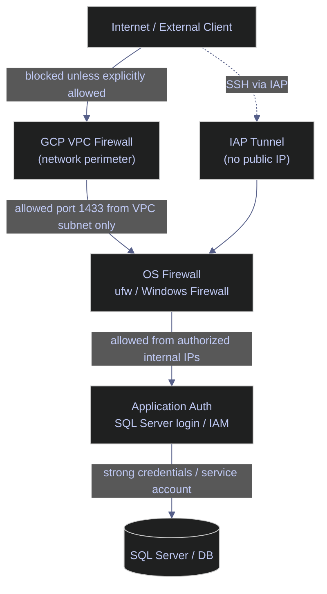

# Firewalls — Controlling Access to Your Data

> [!quote]
> "Complexity is the worst enemy of security, and our systems are getting more complex all the time."
>
> — **Bruce Schneier**, *Schneier on Security* blog (2007)
>
> "You can't trust code that you did not totally create yourself."
>
> — **Ken Thompson**, *Reflections on Trusting Trust*, Turing Award lecture (1984)

> [!abstract]- Summary
>
> This note covers firewall configuration across Linux, Windows, and GCP for securing database and infrastructure access in production environments.
>
> - **Linux ufw tools** — allow/deny rules scoped by source IP and port, default policies, numbered rule management, logging levels
> - **PowerShell Windows Firewall tools** — `Get-NetFirewallRule`, `New-NetFirewallRule`, `Set-NetFirewallProfile` across Domain/Private/Public profiles, rule removal
> - **PowerShell / Linux | gcloud | firewall rules** — VPC firewall rule lifecycle: list, create, update, delete; interaction with OS-level firewalls
> - **Defense in depth** — five-layer model: VPC firewall + OS firewall + SQL Server auth + no public IP + VPC Service Controls
> - **Operations and safety** — when to use and avoid firewall tools; lockout scenarios; troubleshooting connectivity failures; alignment between GCP VPC and OS firewall layers

> [!note]- Glossary
>
> **Firewall**
>
> - Software or hardware that filters network traffic based on rules (allow/deny by IP, port, protocol, direction). The first match in a rule chain wins; unmatched traffic follows the default policy.
> - Controls which traffic can reach your services. Misconfigured firewalls are the primary cause of "connection timed out" errors after deployment.
>
> > [!info] Cloud and OS firewalls are independent layers
> >
> > Cloud VPCs (GCP, AWS, Azure) evaluate their own firewall rules before traffic reaches any VM. Configuring only the OS firewall while leaving the VPC layer open — or vice versa — still exposes or silently blocks traffic.
>
> ---
>
> **`ufw`** (Uncomplicated Firewall)
>
> - A user-friendly frontend for `iptables` on Ubuntu/Debian. Manages ordered rule chains where the first match determines the action; handles rule persistence automatically.
> - The recommended firewall tool for single-VM Linux configurations. Use `ufw status verbose` to inspect rules before making changes.
>
> > [!warning] Do not mix `ufw` and raw `iptables` rules
> >
> > `ufw` manages `iptables` chains internally. Adding raw `iptables` rules on the same system can produce unpredictable ordering and conflict with `ufw`'s state tracking.
>
> ---
>
> **`iptables` / `nftables`**
>
> - The low-level Linux packet filtering frameworks. `iptables` (legacy) and `nftables` (modern replacement) define rules in chains: INPUT (inbound), OUTPUT (outbound), FORWARD (routed). `nftables` supersedes `iptables` on modern kernels.
> - Required for complex configurations that `ufw` cannot express, such as multi-chain NAT rules or traffic shaping. On most production VMs `ufw` is sufficient.
>
> > [!warning] Raw `iptables` rules do not survive reboot
> >
> > Rules written directly via `iptables` exist only in memory. Use `iptables-save > /etc/iptables/rules.v4` with `iptables-persistent`, or use `ufw` which persists rules automatically.
>
> ---
>
> **VPC firewall** (GCP)
>
> - Google Cloud network-level firewall rules that filter traffic before it reaches VM instances. Managed via `gcloud compute firewall-rules` or Terraform. Rules are applied per-network and can target specific VM tags or service accounts.
> - Evaluated independently from the OS firewall. Both the VPC rule and the OS rule must allow traffic for a connection to succeed. A common failure: `ufw` allows port 1433 but the VPC firewall blocks it, causing `nc -zv` to time out from inside the VPC.
>
> > [!info] VPC firewall rule priorities
> >
> > Rules are evaluated in ascending priority order (lower number = higher priority, range 0–65535). The default implicit rule is deny-all at priority 65535. An explicit allow rule at a lower priority number overrides it.
>
> ---
>
> **Windows Firewall** (Windows Defender Firewall)
>
> - The built-in Windows packet filter managed via the `NetSecurity` PowerShell module (`New-NetFirewallRule`, `Get-NetFirewallRule`, `Set-NetFirewallProfile`) or legacy `netsh advfirewall`. Operates on three profiles applied based on detected network type: Domain, Private, and Public.
> - Controls inbound and outbound traffic on Windows VMs. Rules applied to the wrong profile (e.g., Domain only) have no effect when the VM is on a Public network.
>
> > [!warning] Profile mismatch silently disables rules
> >
> > A rule created without `-Profile` defaults to all profiles, but explicitly scoping to `-Profile Domain` means the rule is inactive on Private and Public networks. Always verify with `Get-NetFirewallRule -DisplayName "name" | Format-List`.
>
> ---
>
> **Default policy** (allow vs. deny)
>
> - The firewall action applied to traffic that matches no explicit rule. **Default deny** blocks all unmatched traffic; **default allow** permits it. Production firewalls must default to deny on inbound traffic.
> - In `ufw`: set with `ufw default deny incoming`. In Windows Firewall: set with `Set-NetFirewallProfile -DefaultInboundAction Block`. In GCP VPC: the implicit rule at priority 65535 is deny-all ingress.
>
> > [!danger] Enabling `ufw` without an SSH allow rule locks you out immediately
> >
> > `ufw enable` with default-deny active blocks all inbound traffic including port 22. Always run `sudo ufw allow from 35.235.240.0/20 to any port 22 proto tcp` before `ufw enable`. Recovery requires GCP serial console or IAP tunnel.
>
> ---
>
> **IAP tunnel** (Identity-Aware Proxy)
>
> - A Google Cloud proxy that brokers SSH sessions to VMs without requiring a public IP or an open port 22 on the internet. Traffic arrives at the VM from the fixed CIDR `35.235.240.0/20`; the VPC firewall must allow TCP 22 from that range.
> - Used as the fourth defense-in-depth layer: removing the VM's external IP entirely eliminates the public attack surface while preserving SSH access via `gcloud compute ssh`.
>
> > [!info] IAP requires a matching VPC firewall rule
> >
> > Even with IAP enabled, `gcloud compute ssh` times out if no VPC firewall rule permits TCP 22 from `35.235.240.0/20`. The OS-level SSH allow rule alone is insufficient.

Every production database should be accessible ONLY from authorized sources. A SQL Server port open to the internet is a security incident waiting to happen. Firewalls are your perimeter defense — and relying on only one layer is not enough.

The defense-in-depth model layers GCP VPC firewall rules (network level), OS-level firewall (ufw/Windows Firewall), application authentication, and IAP tunneling so that no single misconfiguration exposes a service.



## Linux ufw tools

ufw (Uncomplicated Firewall) is a frontend to iptables designed to simplify firewall management on Linux. It maintains ordered rule chains: rules are evaluated top-to-bottom and the first match wins. On production VMs the correct baseline is default-deny inbound, default-allow outbound, with explicit allow rules for each required service and source range.

### Linux | ufw | check firewall state

Use `ufw status verbose` to inspect current rules, default policies, and enabled state before making changes.

#### Check firewall status and active rules

```bash
sudo ufw status verbose
```

```text
Status: active
Logging: on (low)
Default: deny (incoming), allow (outgoing), deny (routed)
New profiles: skip

To                         Action      From
--                         ------      ----
1433/tcp                   ALLOW IN    10.132.0.0/24
22/tcp                     ALLOW IN    35.235.240.0/20
```

### Linux | ufw | allow and deny rules

Inbound allow rules in ufw always filter by source IP, destination port, and protocol. Omitting the `from` clause opens the port to the entire internet — always specify a source range.

#### Allow SQL Server from a VPC subnet

```bash
sudo ufw allow from 10.132.0.0/24 to any port 1433 proto tcp
```

#### Allow SSH from the IAP IP range

```bash
sudo ufw allow from 35.235.240.0/20 to any port 22 proto tcp
```

#### Deny a specific source range

```bash
sudo ufw deny from 192.168.50.0/24 to any port 1433 proto tcp
```

#### Reject with an ICMP response (instead of silent drop)

`reject` sends a TCP RST or ICMP port-unreachable back to the sender, signaling a refused connection rather than a timeout. Use `deny` (silent drop) for internet-facing rules to avoid revealing open ports.

```bash
sudo ufw reject from 192.168.50.0/24 to any port 1433 proto tcp
```

> [!warning] Never allow a port without scoping the source
>
> `sudo ufw allow 1433` opens TCP port 1433 to **every IP address on the internet**. This is a critical misconfiguration for database ports.

> [!success] Always scope allow rules to a source range
>
> ```bash
> sudo ufw allow from 10.132.0.0/24 to any port 1433 proto tcp
> ```
>
> Limit the source to the VPC subnet CIDR or the specific IAP range.

| Flag | Syntax | Description |
|---|---|---|
| `from <ip/cidr>` | `ufw allow from 10.0.0.0/8 to any port 22` | Restrict rule to a source IP or CIDR range |
| `to any port <n>` | `ufw allow from 10.0.0.0/8 to any port 1433` | Target a specific destination port |
| `proto tcp\|udp` | `ufw allow from 10.0.0.0/8 to any port 53 proto udp` | Restrict rule to a protocol |
| `allow` | `ufw allow from ... to any port 22` | Permit matching traffic |
| `deny` | `ufw deny from 1.2.3.4 to any` | Silently drop matching traffic |
| `reject` | `ufw reject from 1.2.3.4 to any` | Drop and reply with ICMP unreachable |

### Linux | ufw | default policies

Default policies define what happens to traffic that matches no explicit rule. Always set `deny incoming` before enabling ufw on a production server, then add explicit allow rules for each required service.

#### Set default deny incoming and allow outgoing

```bash
sudo ufw default deny incoming
```

```bash
sudo ufw default allow outgoing
```

#### Enable the firewall

Run this only after adding all required allow rules, especially SSH. Enabling ufw with no SSH allow rule in place will immediately terminate your remote session.

```bash
sudo ufw enable
```

> [!warning] `ufw enable` can lock you out of SSH
>
> If no SSH allow rule exists before running `ufw enable`, remote access is lost immediately. The VM must be recovered via console or IAP.

> [!success] Add the SSH allow rule before enabling
>
> ```bash
> sudo ufw allow from 35.235.240.0/20 to any port 22 proto tcp
> sudo ufw enable
> ```
>
> Verify rule is present with `sudo ufw status numbered` first.

| Flag | Syntax | Description |
|---|---|---|
| `default deny incoming` | `ufw default deny incoming` | Block all inbound traffic not matched by a rule |
| `default allow outgoing` | `ufw default allow outgoing` | Allow all outbound traffic not matched by a rule |
| `default deny outgoing` | `ufw default deny outgoing` | Block all outbound (strict egress control) |
| `default allow incoming` | `ufw default allow incoming` | Allow all inbound (insecure — avoid in production) |

### Linux | ufw | delete and reset rules

Rules are managed by number in `ufw`. Always list numbered rules before deleting to avoid removing the wrong entry.

#### List rules with numbers

```bash
sudo ufw status numbered
```

```text
Status: active

     To                         Action      From
     --                         ------      ----
[ 1] 1433/tcp                   ALLOW IN    10.132.0.0/24
[ 2] 22/tcp                     ALLOW IN    35.235.240.0/20
```

#### Delete a rule by number

```bash
sudo ufw delete 3
```

#### Reset all rules to factory defaults

```bash
sudo ufw reset
```

> [!warning] `ufw reset` removes all rules including SSH
>
> Running `ufw reset` on a remote VM without console access will lock you out.

> [!success] Disable ufw temporarily instead of resetting
>
> ```bash
> sudo ufw disable
> ```
>
> This stops enforcement without deleting rules, preserving the configuration for re-enable.

| Flag | Syntax | Description |
|---|---|---|
| `status numbered` | `ufw status numbered` | List all rules with index numbers for deletion |
| `delete <n>` | `ufw delete 3` | Remove rule at position n |
| `delete allow <port>` | `ufw delete allow 22` | Remove allow rule matching port (if unique) |
| `reset` | `ufw reset` | Remove all rules and disable ufw |
| `disable` | `ufw disable` | Stop ufw enforcement without removing rules |

### Linux | ufw | logging

ufw writes to `/var/log/ufw.log`. Logging levels control verbosity: `low` logs blocked packets, `medium` adds allowed packets, `high` adds rate-limited packets.

#### Set logging level

```bash
sudo ufw logging medium
```

#### Tail firewall log for live traffic inspection

```bash
sudo tail -f /var/log/ufw.log
```

```text
Apr  3 14:22:01 vm-prod kernel: [UFW BLOCK] IN=eth0 OUT= MAC=... SRC=185.220.101.45 DST=10.132.0.5 LEN=44 TOS=0x00 PREC=0x00 TTL=53 ID=0 DF PROTO=TCP DPT=1433 WINDOW=65535 RES=0x00 SYN URGP=0
```

| Flag | Syntax | Description |
|---|---|---|
| `logging off` | `ufw logging off` | Disable firewall logging |
| `logging low` | `ufw logging low` | Log only blocked packets (default) |
| `logging medium` | `ufw logging medium` | Log blocked and allowed packets |
| `logging high` | `ufw logging high` | Log all packets including rate-limited |
| `logging full` | `ufw logging full` | Maximum verbosity — use for short debugging sessions only |

## PowerShell Windows Firewall tools

Windows Firewall (Windows Defender Firewall) is managed through the `NetSecurity` PowerShell module via cmdlets like `New-NetFirewallRule`, `Get-NetFirewallRule`, and `Set-NetFirewallProfile`. It operates on three profiles — Domain, Private, and Public — applied based on the detected network type.

### PowerShell | Windows Firewall | inspect rules

`Get-NetFirewallRule` retrieves all firewall rules from the Windows Firewall policy store. Pipe with `Where-Object` to filter by state, direction, or action.

#### List all enabled inbound rules

```powershell
Get-NetFirewallRule | Where-Object Enabled -eq True |
    Select-Object DisplayName, Direction, Action | Sort-Object DisplayName
```

```text
DisplayName                         Direction Action
-----------                         --------- ------
SQL Server - Pipeline               Inbound   Allow
Remote Desktop - User Mode (TCP-In) Inbound   Allow
```

#### Show port filters for a specific rule

```powershell
Get-NetFirewallRule -DisplayName "SQL Server - Pipeline" |
    Get-NetFirewallPortFilter
```

```text
Protocol      : TCP
LocalPort     : 1433
RemotePort    : Any
IcmpType      : Any
DynamicTarget : Any
```

#### Show address filters for a specific rule

```powershell
Get-NetFirewallRule -DisplayName "SQL Server - Pipeline" |
    Get-NetFirewallAddressFilter
```

```text
LocalAddress  : Any
RemoteAddress : 10.132.0.0/24
```

| Flag | Syntax | Description |
|---|---|---|
| `-DisplayName` | `Get-NetFirewallRule -DisplayName "name"` | Filter by display name |
| `-Name` | `Get-NetFirewallRule -Name "name"` | Filter by internal rule name |
| `-Direction` | `Get-NetFirewallRule -Direction Inbound` | Filter by traffic direction |
| `-Action` | `Get-NetFirewallRule -Action Allow` | Filter by action (Allow / Block) |
| `-Enabled` | `Get-NetFirewallRule -Enabled True` | Filter by enabled state |
| `-Profile` | `Get-NetFirewallRule -Profile Domain` | Filter by profile (Domain/Private/Public) |

### PowerShell | Windows Firewall | create rules

`New-NetFirewallRule` adds inbound or outbound rules to the Windows Firewall policy. Always specify `-RemoteAddress` to scope the rule to a source subnet; omitting it allows any IP.

#### Allow SQL Server inbound from a VPC subnet

```powershell
New-NetFirewallRule -DisplayName "SQL Server - Pipeline" `
    -Direction Inbound -LocalPort 1433 -Protocol TCP -Action Allow `
    -RemoteAddress "10.132.0.0/24"
```

#### Allow RDP from a management subnet only

```powershell
New-NetFirewallRule -DisplayName "RDP - Management Only" `
    -Direction Inbound -LocalPort 3389 -Protocol TCP -Action Allow `
    -RemoteAddress "10.200.0.0/24"
```

#### Block outbound to a known malicious range

```powershell
New-NetFirewallRule -DisplayName "Block Malicious Range" `
    -Direction Outbound -RemoteAddress "185.220.101.0/24" `
    -Action Block
```

> [!warning] Omitting `-RemoteAddress` opens the port to all IPs
>
> `New-NetFirewallRule -Direction Inbound -LocalPort 1433 -Action Allow` allows TCP 1433 from any source address on the internet. Do not omit `-RemoteAddress` for database or admin ports.

> [!success] Always scope with `-RemoteAddress`
>
> ```powershell
> New-NetFirewallRule -DisplayName "SQL Server - Pipeline" `
>     -Direction Inbound -LocalPort 1433 -Protocol TCP -Action Allow `
>     -RemoteAddress "10.132.0.0/24"
> ```

| Flag | Syntax | Description |
|---|---|---|
| `-DisplayName` | `-DisplayName "name"` | Human-readable name shown in Windows Firewall UI |
| `-Direction` | `-Direction Inbound\|Outbound` | Traffic direction the rule applies to |
| `-LocalPort` | `-LocalPort 1433` | Destination port on the local machine |
| `-RemotePort` | `-RemotePort 443` | Source port on the remote machine |
| `-Protocol` | `-Protocol TCP\|UDP` | Protocol filter |
| `-Action` | `-Action Allow\|Block` | Permit or drop matching traffic |
| `-RemoteAddress` | `-RemoteAddress "10.0.0.0/8"` | Restrict rule to a source IP or CIDR |
| `-Profile` | `-Profile Domain,Private` | Apply rule only when connected to matching network profiles |
| `-Enabled` | `-Enabled True\|False` | Create rule in enabled or disabled state |

### PowerShell | Windows Firewall | default policies

`Set-NetFirewallProfile` configures the default action for each of the three Windows Firewall profiles. In production, block all inbound by default and add explicit allow rules for each service.

#### Block all inbound by default across all profiles

```powershell
Set-NetFirewallProfile -Profile Domain,Public,Private `
    -DefaultInboundAction Block
```

#### Allow all outbound (default, but explicit is better)

```powershell
Set-NetFirewallProfile -Profile Domain,Public,Private `
    -DefaultOutboundAction Allow
```

#### Disable a specific profile (not recommended in production)

```powershell
Set-NetFirewallProfile -Profile Public -Enabled False
```

> [!warning] Disabling a Windows Firewall profile removes all protection on that network type
>
> Setting `-Enabled False` for the Public profile removes all inbound blocking when the machine connects to any public network.

> [!success] Keep all profiles enabled and block inbound by default
>
> ```powershell
> Set-NetFirewallProfile -Profile Domain,Public,Private `
>     -DefaultInboundAction Block -DefaultOutboundAction Allow
> ```

| Flag | Syntax | Description |
|---|---|---|
| `-Profile` | `-Profile Domain,Public,Private` | Target one or more profiles |
| `-DefaultInboundAction` | `-DefaultInboundAction Block\|Allow` | Default action for inbound traffic with no matching rule |
| `-DefaultOutboundAction` | `-DefaultOutboundAction Block\|Allow` | Default action for outbound traffic with no matching rule |
| `-Enabled` | `-Enabled True\|False` | Enable or disable the firewall profile entirely |
| `-NotifyOnListen` | `-NotifyOnListen True\|False` | Show a notification when a new app registers a listener |

### PowerShell | Windows Firewall | remove rules

#### Remove a rule by display name

```powershell
Remove-NetFirewallRule -DisplayName "SQL Server - Pipeline"
```

#### Remove all disabled rules

```powershell
Get-NetFirewallRule -Enabled False | Remove-NetFirewallRule
```

> [!warning] `Remove-NetFirewallRule` is permanent and does not prompt by default
>
> There is no undo. If you remove the wrong rule, you must recreate it manually.

> [!success] Disable a rule first instead of removing it
>
> ```powershell
> Set-NetFirewallRule -DisplayName "SQL Server - Pipeline" -Enabled False
> ```
>
> Disabling preserves the rule definition and allows re-enabling without reconfiguration.

| Flag | Syntax | Description |
|---|---|---|
| `-DisplayName` | `Remove-NetFirewallRule -DisplayName "name"` | Remove by display name |
| `-Name` | `Remove-NetFirewallRule -Name "name"` | Remove by internal name |
| `-Direction` | `Remove-NetFirewallRule -Direction Inbound` | Remove all rules matching a direction |

## PowerShell / Linux | gcloud | firewall rules

GCP VPC firewall rules operate at the network level, before traffic reaches any VM's OS firewall. They are evaluated independently from ufw or Windows Firewall — both layers must allow traffic for a connection to succeed. `gcloud compute firewall-rules` manages these rules from either Linux or PowerShell.

> [!info] GCP VPC firewall and OS firewall are independent layers
>
> A GCP firewall rule allowing port 1433 does not override an OS-level `ufw deny` rule, and vice versa. Both must permit the traffic. A common debugging pattern: `ufw` allows port 1433 but the GCP firewall blocks it at the network level, so `nc -zv` times out even from inside the VPC.

### PowerShell / Linux | gcloud | list firewall rules

#### List all VPC firewall rules in the project

```bash
gcloud compute firewall-rules list \
    --format="table(name,direction,allowed,sourceRanges)"
```

```text
NAME                    DIRECTION  ALLOW                 SRC_RANGES
allow-iap-ssh           INGRESS    tcp:22                35.235.240.0/20
allow-sql-pipeline      INGRESS    tcp:1433              10.132.0.0/24
default-allow-internal  INGRESS    tcp,udp,icmp          10.128.0.0/9
```

#### Show details of a specific rule

```bash
gcloud compute firewall-rules describe allow-iap-ssh
```

```text
allowed:
- IPProtocol: tcp
  ports:
  - '22'
direction: INGRESS
name: allow-iap-ssh
network: https://www.googleapis.com/compute/v1/projects/my-project/global/networks/default
sourceRanges:
- 35.235.240.0/20
```

| Flag | Syntax | Description |
|---|---|---|
| `--format` | `--format="table(name,direction,allowed,sourceRanges)"` | Control output columns and format |
| `--filter` | `--filter="direction=INGRESS"` | Filter results server-side |
| `--project` | `--project=my-project-id` | Target a specific GCP project |
| `--network` | `--network=my-vpc` | List rules for a specific VPC network |

### PowerShell / Linux | gcloud | create firewall rules

#### Allow SSH from the IAP IP range

For [iap-tunneling](https://alp78.github.io/elysium/01-Shell/Networking/iap-tunneling) to work, a GCP firewall rule must allow TCP 22 from `35.235.240.0/20`. Without this rule, `gcloud compute ssh` times out even if the VM is running and ufw allows SSH.

```bash
gcloud compute firewall-rules create allow-iap-ssh \
    --allow tcp:22 \
    --source-ranges 35.235.240.0/20 \
    --description "Allow SSH via IAP tunnel"
```

#### Allow SQL Server from a VPC subnet

```bash
gcloud compute firewall-rules create allow-sql-pipeline \
    --allow tcp:1433 \
    --source-ranges 10.132.0.0/24 \
    --target-tags sql-server \
    --description "Allow SQL Server from pipeline VPC subnet"
```

#### Allow ICMP (ping) from internal range for diagnostics

```bash
gcloud compute firewall-rules create allow-internal-icmp \
    --allow icmp \
    --source-ranges 10.128.0.0/9 \
    --description "Allow ICMP from internal VPC range for diagnostics"
```

| Flag | Syntax | Description |
|---|---|---|
| `--allow` | `--allow tcp:1433` | Protocol and port(s) to permit |
| `--source-ranges` | `--source-ranges 10.0.0.0/8` | CIDR source ranges for ingress rules |
| `--destination-ranges` | `--destination-ranges 10.0.0.0/8` | CIDR destination ranges for egress rules |
| `--direction` | `--direction INGRESS\|EGRESS` | Traffic direction (default: INGRESS) |
| `--target-tags` | `--target-tags sql-server` | Apply rule only to VMs with this network tag |
| `--target-service-accounts` | `--target-service-accounts sa@project.iam.gserviceaccount.com` | Apply rule only to VMs running this service account |
| `--priority` | `--priority 1000` | Rule priority (0–65535, lower = higher priority) |
| `--network` | `--network my-vpc` | VPC network the rule applies to |
| `--description` | `--description "text"` | Human-readable description stored with the rule |

### PowerShell / Linux | gcloud | update and delete rules

#### Update the source range of an existing rule

```bash
gcloud compute firewall-rules update allow-sql-pipeline \
    --source-ranges 10.132.0.0/24,10.140.0.0/24
```

#### Delete a firewall rule

```bash
gcloud compute firewall-rules delete allow-sql-pipeline
```

> [!warning] Deleting a GCP firewall rule takes effect immediately
>
> Unlike OS-level firewall changes that require a service restart, GCP firewall rule deletions propagate within seconds and immediately block matching traffic.

> [!success] Disable a rule instead of deleting during troubleshooting
>
> ```bash
> gcloud compute firewall-rules update allow-sql-pipeline --disabled
> ```
>
> This preserves the rule definition and allows re-enabling with `--no-disabled`.

| Flag | Syntax | Description |
|---|---|---|
| `--source-ranges` | `update --source-ranges 10.0.0.0/8` | Replace source CIDR ranges |
| `--allow` | `update --allow tcp:1433,tcp:1434` | Replace allowed protocol/port list |
| `--disabled` | `update --disabled` | Disable the rule without deleting it |
| `--no-disabled` | `update --no-disabled` | Re-enable a disabled rule |
| `--priority` | `update --priority 500` | Change rule priority |

## Defense in depth

The most effective firewall strategy for production databases is layered: no single control point is trusted to be the sole barrier. Each layer operates independently, so a misconfiguration in one does not expose the database.

> [!warning] Never rely on a single firewall layer
>
> If only the GCP VPC firewall blocks port 1433 and that rule is accidentally deleted or modified, the port becomes immediately accessible from the internal network. Each layer must function as if the others do not exist.

> [!success] Apply all five layers simultaneously
>
> 1. **GCP VPC firewall** — block port 1433 from external IPs at the network level (manage declaratively with [networking](https://alp78.github.io/elysium/07-Terraform/GCP-Resources/networking))
> 2. **OS firewall (ufw / Windows Firewall)** — block port 1433 from unauthorized internal IPs at the OS level
> 3. **SQL Server login** — require strong passwords and specific login names (see [service-accounts-and-iam](https://alp78.github.io/elysium/06-GCP/Security/service-accounts-and-iam) for IAM-based access)
> 4. **No public IP** — remove the VM's external IP entirely; use IAP tunneling for SSH (see [iap-tunneling](https://alp78.github.io/elysium/01-Shell/Networking/iap-tunneling))
> 5. **VPC Service Controls** — prevent data exfiltration from the project (see [vpc-service-controls](https://alp78.github.io/elysium/06-GCP/Security/vpc-service-controls); GCP Enterprise tier required)


> [!example] Firewall Boundary Fit
>
> > [!success] Appropriate
> >
> > - **Securing new VM deployments** -- lock down a fresh VM to allow only SSH (22), HTTP/HTTPS (80/443), and application-specific ports.
> > - **Troubleshooting connectivity** -- "connection timeout" after deploying a service usually means a firewall rule is missing or misconfigured.
> > - **Restricting access by source IP** -- allow database access only from your application servers, not from the public internet.
> > - **Auditing security posture** -- `ufw status verbose` or `Get-NetFirewallRule` lists all active rules for security review.
>
> > [!failure] Inappropriate
> >
> > - **Application-level access control** -- firewalls filter by IP/port/protocol. For user-level authentication and authorization, use application-layer security (OAuth, IAM, API keys).
> > - **Cloud-native architectures** -- for GKE, Cloud Run, and serverless platforms, use VPC Service Controls and IAM instead of VM-level firewalls.

## Warnings

> [!danger] Enabling `ufw` without allowing SSH locks you out
>
> `ufw enable` with a default-deny policy blocks ALL inbound traffic including SSH. Always run `ufw allow ssh` BEFORE `ufw enable`. If locked out, access via serial console or GCP IAP tunnel.

> [!warning] VPC firewall and OS firewall are independent layers
>
> Both must allow traffic for a connection to succeed. Allowing port 1433 in `ufw` but not in the GCP VPC firewall (or vice versa) still blocks traffic.

> [!warning] `iptables` rules are lost on reboot
>
> Raw `iptables` rules exist only in memory. Use `iptables-save > /etc/iptables/rules.v4` and install `iptables-persistent` for persistence, or use `ufw` which handles persistence automatically.

## Recommendations

| Scenario | Recommendation |
|---|---|
| Secure a new VM | `ufw default deny incoming && ufw default allow outgoing && ufw allow ssh && ufw enable`. Then add application ports. |
| Allow a specific port | `ufw allow 1433/tcp` (Linux) or `New-NetFirewallRule -DisplayName "SQL" -Direction Inbound -LocalPort 1433 -Protocol TCP -Action Allow` (PowerShell). |
| Restrict by source IP | `ufw allow from 10.132.0.0/24 to any port 1433` -- allows only the application subnet. |
| Audit rules | `ufw status numbered` (Linux) or `Get-NetFirewallRule \| Where Enabled -eq True \| Format-Table` (PowerShell). |
| GCP VPC + OS alignment | Configure VPC firewall rules in Terraform/gcloud first, then mirror with `ufw` on the VM. Document both layers. |

## Troubleshooting

| Symptom | Likely cause | Fix |
|---|---|---|
| "Connection timed out" after deploying a service | Firewall blocking the port (OS-level, VPC-level, or both). | Check `ufw status`, VPC firewall rules, and `ss -tlnp` to verify the service is listening. |
| `ufw allow` has no effect | `ufw` is not enabled (`ufw status` shows "inactive"). | Run `ufw enable` after adding rules. |
| Locked out of VM after enabling firewall | SSH was not allowed before enabling the firewall. | Access via GCP serial console or IAP tunnel. Run `ufw allow ssh` then `ufw enable`. |
| Rule added but traffic still blocked | VPC firewall does not have a matching allow rule. | Add the corresponding rule in GCP VPC: `gcloud compute firewall-rules create ...`. |
| Windows Firewall rule not working | Rule is in the wrong profile (Domain/Private/Public) or wrong direction (Inbound/Outbound). | Verify profile and direction: `Get-NetFirewallRule -DisplayName "name" \| Format-List`. |

## Cross-references
- [connectivity-testing](https://alp78.github.io/elysium/01-Shell/Networking/connectivity-testing) — diagnose "connection timed out" (firewall) vs "connection refused" (no service)
- [iap-tunneling](https://alp78.github.io/elysium/01-Shell/Networking/iap-tunneling) — access VMs without opening public ports at all
- [socket-inspection](https://alp78.github.io/elysium/01-Shell/Networking/socket-inspection) — verify which ports are actually listening before writing firewall rules
- [environment-variables](https://alp78.github.io/elysium/01-Shell/Scripting/environment-variables) — never hardcode credentials in firewall rule scripts
