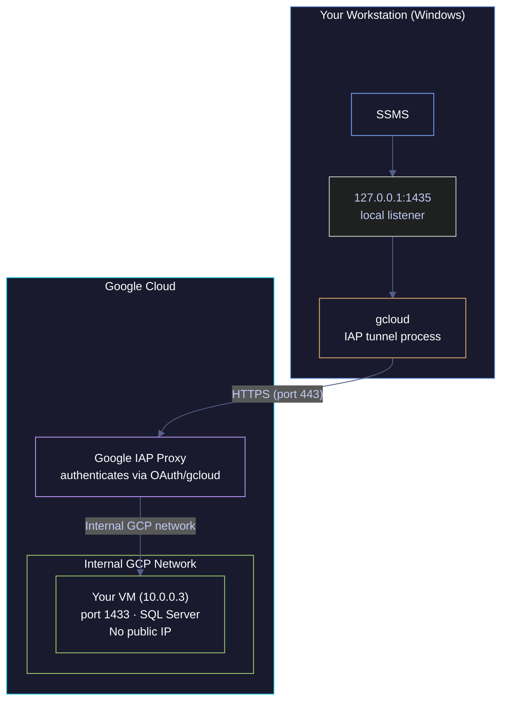

# IAP Tunneling

> [!quote]+
>
> "Trust is a vulnerability. Zero Trust eliminates trust from digital systems because it provides no value to an organisation."
>
> — **John Kindervag** (creator of Zero Trust at Forrester)

> [!abstract]- Summary
>
> IAP TCP forwarding lets `gcloud` proxy SSH and arbitrary TCP traffic to private Compute Engine instances over HTTPS, without assigning a public IP to the VM.
>
> - Use `gcloud compute ssh --tunnel-through-iap` for SSH and `gcloud compute start-iap-tunnel` for database or web-service port forwarding.
> - Enable the Cloud IAP API, allow ingress from `35.235.240.0/20`, and grant `roles/iap.tunnelResourceAccessor`; SSH users still need the VM's normal SSH access path.
> - Prefer `127.0.0.1` or `localhost` for local binds and run one tunnel per VM and per remote port.
> - IAP disconnects idle sessions after one hour; `--iap-tunnel-disable-connection-check` only skips the initial client-side connection check.

> [!note]- Glossary
>
> **IAP (Identity-Aware Proxy)**
> - Google Cloud service that authenticates and authorizes TCP access before traffic reaches a private resource.
> - For TCP forwarding, `gcloud` wraps SSH or arbitrary TCP traffic in HTTPS on port `443`.
> - Comparable managed access patterns are AWS Systems Manager Session Manager (`aws ssm start-session`) and Azure Bastion (`az network bastion tunnel`).
>
> ---
>
> **IAP tunnel**
> - Ephemeral TCP channel from your local machine to one remote VM port, relayed by Google's IAP proxy.
> - Tunnels do not create general network reachability. One tunnel targets one VM and one remote port.
> - Idle tunnels disconnect after one hour. Clients that hold long-lived sessions must tolerate reconnects or send their own keepalives.
>
> ---
>
> **`gcloud compute start-iap-tunnel`**
> - Opens a local listener and forwards that local port to a remote VM port through IAP.
> - Use `--local-host-port=127.0.0.1:<port>` when a client must reconnect to a predictable local port.
> - `--network` and `--region` apply only when the destination is specified by IP address or FQDN instead of a Compute Engine instance name.
>
> ---
>
> **`gcloud compute ssh --tunnel-through-iap`**
> - Builds an IAP tunnel and launches SSH through it in one step.
> - Tunnel authorization and SSH authorization are separate. The user needs IAP tunnel permission plus the VM's normal SSH access method, such as OS Login or metadata-managed SSH keys.
>
> ---
>
> **`35.235.240.0/20`**
> - IPv4 range from which IAP forwards traffic into your VPC.
> - Firewall rules must allow this source range to the target port, such as `22` for SSH or `1433` for SQL Server.
> - On dual-stack targets, Google Cloud also documents `2600:2d00:1:7::/64` for IPv6 IAP forwarding.
>
> ---
>
> **`roles/iap.tunnelResourceAccessor`**
> - IAM role that grants `iap.tunnelInstances.accessViaIAP`.
> - Required for IAP TCP forwarding, but not sufficient by itself for Linux SSH access.
>
> ---
>
> **`--iap-tunnel-disable-connection-check`**
> - Disables `gcloud`'s immediate connection test after the tunnel starts.
> - Does not change IAP's one-hour inactivity timeout.

Identity-Aware Proxy (IAP) TCP forwarding is the Google Cloud access pattern for private Compute Engine instances when you want audited, per-user access without a public IP, a bastion host, or a full network-level VPN. The control plane is identity-aware; the data plane is still ordinary TCP once the proxy authorizes the connection.

## How IAP tunneling works

IAP sits between `gcloud` on your workstation and the target VM. `gcloud` authenticates with your Google identity, asks IAP to open a tunnel, and then relays the application protocol through that HTTPS session.

### Network path from workstation to VM

*This diagram shows a local SQL Server client reaching a private VM through an IAP tunnel.*


1. `gcloud` opens a local listener such as `127.0.0.1:1435`.
2. Your client connects to that local port.
3. `gcloud` sends the TCP stream to IAP over HTTPS on port `443`.
4. IAP checks your Google identity and IAM bindings.
5. If the request is authorized, IAP forwards the traffic across Google's network to the VM's internal address and target port.
6. The VM sees the connection as arriving from a Google-managed address, not from your workstation's public IP.

## Required configuration

Every successful IAP tunnel depends on three separate controls: the API must be enabled, IAM must authorize tunnel creation, and the VPC firewall must allow IAP's source range to reach the target port.

### Enable the Cloud IAP API

If `iap.googleapis.com` is disabled, tunnel setup fails before the data plane is established.

*This command lists enabled services and filters for the Cloud IAP API.*
```bash
gcloud services list --enabled | grep iap
```
```text
iap.googleapis.com                    Cloud Identity-Aware Proxy API
```

*This command enables the Cloud IAP API for the active project.*
```bash
gcloud services enable iap.googleapis.com
```
```text
The command returns an operation summary and exits after the API is enabled.
```

### Grant tunnel access separately from SSH access

Grant `roles/iap.tunnelResourceAccessor` to the user or service account that must create the tunnel. For Linux SSH, also grant whatever the VM uses for SSH authorization. On OS Login-enabled VMs that usually means OS Login roles; on metadata-key setups it means the user must be allowed to use the configured SSH keys.

*This command grants IAP tunnel access at the project level.*
```bash
gcloud projects add-iam-policy-binding PROJECT_ID \
    --member=user:USER_EMAIL \
    --role=roles/iap.tunnelResourceAccessor
```
```text
The binding is added to the project IAM policy. Scope the binding more narrowly when project-wide tunnel access is too broad.
```

### Allow IAP traffic through the firewall

IAP authentication succeeds before the VM sees any packets. If the firewall blocks IAP's source range, the tunnel can open but the application connection still fails.

*This command allows IAP to reach SSH on tagged instances.*
```bash
gcloud compute firewall-rules create allow-iap-ssh \
    --direction=INGRESS \
    --action=ALLOW \
    --rules=tcp:22 \
    --source-ranges=35.235.240.0/20 \
    --target-tags=allow-iap-ssh
```
```text
Adjust the TCP port and target tag for the service you are exposing through IAP.
```

### Understand connection boundaries

- IAP tunnels are per VM and per remote port. SSH on port `22` and SQL Server on port `1433` require separate tunnels.
- `gcloud compute start-iap-tunnel` stays in the foreground. Closing that process closes the tunnel.
- The documented inactivity timeout is one hour. Plan for reconnects if an application stays idle longer than that.
- Prefer a loopback bind such as `127.0.0.1:1435`. Use `0.0.0.0` only when another machine must reach your local listener through your workstation.
- Avoid reusing `1433` locally if your workstation already runs SQL Server. Pick a free local port such as `1435`.

## SSH and file transfer through IAP

Use `gcloud compute ssh` when the end goal is an SSH session and `gcloud compute scp` when the end goal is file transfer. Both commands use the same IAP tunnel authorization path.

### PowerShell

#### Open an interactive SSH session

You need an interactive shell on a private VM. It is typically triggered by the instance has no external IP or access must stay on the IAP control path. Requires the IAP tunnel role, firewall access to port `22`, and the VM's normal SSH authorization method. Open SSH through IAP without managing a separate local tunnel.

*This PowerShell command opens an interactive SSH session through IAP.*
```powershell
gcloud compute ssh data-pipeline-sql `
    --zone=europe-west1-b `
    --tunnel-through-iap
```
```text
Interactive shell opens and stays attached to the remote session until you exit.
```

#### Run one remote command through IAP

You need a quick state check instead of a full shell. It is typically triggered by the task is a single command such as checking a service or reading a file. Uses the same IAP and SSH authorization requirements as an interactive session. Execute one command remotely and return the output locally.

*This PowerShell command runs a remote service-status check through IAP.*
```powershell
gcloud compute ssh data-pipeline-sql `
    --zone=europe-west1-b `
    --tunnel-through-iap `
    --command="systemctl status mssql-server"
```
```text
The command prints the remote `systemctl` output locally and then closes the SSH session.
```

#### Copy a file through IAP

You need to transfer a file to or from a private VM. It is typically triggered by the instance is reachable only through IAP and the transfer fits the SSH/SCP path. File transfer uses the same tunnel permission and SSH access path as `gcloud compute ssh`. Copy files without opening a public SSH endpoint.

*This PowerShell command copies a local file to the VM through IAP-backed SCP.*
```powershell
gcloud compute scp `
    --tunnel-through-iap `
    --zone=europe-west1-b `
    .\local_file `
    data-pipeline-sql:~/
```
```text
The copy runs over the temporary IAP-backed SSH tunnel and exits when the transfer completes.
```

### Linux

#### Open an interactive SSH session

You need an interactive shell on a private VM. It is typically triggered by the instance has no external IP or access must stay on the IAP control path. Requires the IAP tunnel role, firewall access to port `22`, and the VM's normal SSH authorization method. Open SSH through IAP without managing a separate local tunnel.

*This bash command opens an interactive SSH session through IAP.*
```bash
gcloud compute ssh data-pipeline-sql \
    --zone=europe-west1-b \
    --tunnel-through-iap
```
```text
Interactive shell opens and stays attached to the remote session until you exit.
```

#### Run one remote command through IAP

You need a quick state check instead of a full shell. It is typically triggered by the task is a single command such as checking a service or reading a file. Uses the same IAP and SSH authorization requirements as an interactive session. Execute one command remotely and return the output locally.

*This bash command runs a remote service-status check through IAP.*
```bash
gcloud compute ssh data-pipeline-sql \
    --zone=europe-west1-b \
    --tunnel-through-iap \
    --command="systemctl status mssql-server"
```
```text
The command prints the remote `systemctl` output locally and then closes the SSH session.
```

#### Copy a file through IAP

You need to transfer a file to or from a private VM. It is typically triggered by the instance is reachable only through IAP and the transfer fits the SSH/SCP path. File transfer uses the same tunnel permission and SSH access path as `gcloud compute ssh`. Copy files without opening a public SSH endpoint.

*This bash command copies a local file to the VM through IAP-backed SCP.*
```bash
gcloud compute scp \
    --tunnel-through-iap \
    --zone=europe-west1-b \
    ./local_file \
    data-pipeline-sql:~/
```
```text
The copy runs over the temporary IAP-backed SSH tunnel and exits when the transfer completes.
```

## Forward arbitrary TCP ports through IAP

Use `gcloud compute start-iap-tunnel` when the client is not SSH-aware, such as SSMS, pgAdmin, Airflow in a browser, or a local health-check tool.

### PowerShell

#### Forward a loopback port to SQL Server

A local application must reach a service listening on a private VM. It is typically triggered by the service is not SSH itself, but it is reachable over TCP once the tunnel exists. The local port can differ from the remote port. Keep the local bind on loopback unless you intentionally need LAN exposure. Expose a private VM port as a local listener on your workstation.

*This PowerShell command forwards local port `1435` to SQL Server on port `1433` through IAP.*
```powershell
gcloud compute start-iap-tunnel data-pipeline-sql 1433 `
    --local-host-port=127.0.0.1:1435 `
    --zone=europe-west1-b
```
```text
The process stays in the foreground while the tunnel is active. Connect SSMS to `127.0.0.1,1435`.
```

#### Skip the immediate connection check

You want `gcloud` to skip its initial connection probe after creating the tunnel. It is typically triggered by the service is slow to accept the first connection or you want to remove the client-side startup check. This flag affects only `gcloud`'s startup behavior. It does not change the one-hour inactivity timeout enforced by IAP. Start the tunnel without the immediate post-bind connection test.

*This PowerShell command starts the tunnel and disables the initial client-side connection check.*
```powershell
gcloud compute start-iap-tunnel data-pipeline-sql 1433 `
    --local-host-port=127.0.0.1:1435 `
    --zone=europe-west1-b `
    --iap-tunnel-disable-connection-check
```
```text
Tunnel startup skips the immediate connection probe, but idle sessions still time out after one hour of inactivity.
```

#### Run multiple tunnels in parallel

You need more than one private service at the same time. It is typically triggered by A workflow uses multiple remote ports, such as SQL Server and an Airflow UI. Each tunnel is a separate foreground process and owns its own local port. Keep multiple service-specific tunnels open at once.

*These PowerShell commands are meant to run in separate terminals, one tunnel per window.*
```powershell
# Terminal 1
gcloud compute start-iap-tunnel data-pipeline-sql 1433 `
    --local-host-port=127.0.0.1:1435 `
    --zone=europe-west1-b

# Terminal 2
gcloud compute start-iap-tunnel data-pipeline-airflow 8080 `
    --local-host-port=127.0.0.1:8080 `
    --zone=europe-west1-b
```
```text
Each terminal keeps one tunnel process attached. Closing that terminal closes only its matching tunnel.
```

### Linux

#### Forward a loopback port to SQL Server

A local application must reach a service listening on a private VM. It is typically triggered by the service is not SSH itself, but it is reachable over TCP once the tunnel exists. The local port can differ from the remote port. Keep the local bind on loopback unless you intentionally need LAN exposure. Expose a private VM port as a local listener on your workstation.

*This bash command forwards local port `1435` to SQL Server on port `1433` through IAP.*
```bash
gcloud compute start-iap-tunnel data-pipeline-sql 1433 \
    --local-host-port=127.0.0.1:1435 \
    --zone=europe-west1-b
```
```text
The process stays in the foreground while the tunnel is active. Connect SSMS or `sqlcmd` to `127.0.0.1:1435`.
```

#### Skip the immediate connection check

You want `gcloud` to skip its initial connection probe after creating the tunnel. It is typically triggered by the service is slow to accept the first connection or you want to remove the client-side startup check. This flag affects only `gcloud`'s startup behavior. It does not change the one-hour inactivity timeout enforced by IAP. Start the tunnel without the immediate post-bind connection test.

*This bash command starts the tunnel and disables the initial client-side connection check.*
```bash
gcloud compute start-iap-tunnel data-pipeline-sql 1433 \
    --local-host-port=127.0.0.1:1435 \
    --zone=europe-west1-b \
    --iap-tunnel-disable-connection-check
```
```text
Tunnel startup skips the immediate connection probe, but idle sessions still time out after one hour of inactivity.
```

#### Run multiple tunnels in parallel

You need more than one private service at the same time. It is typically triggered by A workflow uses multiple remote ports, such as SQL Server and an Airflow UI. Each tunnel is a separate foreground process and owns its own local port. Keep multiple service-specific tunnels open at once.

*These bash commands are meant to run in separate terminals, one tunnel per window.*
```bash
# Terminal 1
gcloud compute start-iap-tunnel data-pipeline-sql 1433 \
    --local-host-port=127.0.0.1:1435 \
    --zone=europe-west1-b

# Terminal 2
gcloud compute start-iap-tunnel data-pipeline-airflow 8080 \
    --local-host-port=127.0.0.1:8080 \
    --zone=europe-west1-b
```
```text
Each terminal keeps one tunnel process attached. Closing that terminal closes only its matching tunnel.
```

## Troubleshoot common failures

Work through control-plane checks first. Most failures happen before the target service sees any traffic.

### PowerShell control-plane checks

#### Check whether the Cloud IAP API is enabled

`start-iap-tunnel` or `gcloud compute ssh --tunnel-through-iap` fails before the service is reachable. It is typically triggered by the tunnel never stabilizes or the project was created recently. API enablement is project-scoped. Confirm that the project allows IAP TCP forwarding requests.

*This PowerShell command lists enabled services and filters for the IAP API.*
```powershell
gcloud services list --enabled | Select-String 'iap'
```
```text
iap.googleapis.com                    Cloud Identity-Aware Proxy API
```

#### Check whether the tunnel role is granted

`gcloud` returns a permission error before the tunnel opens. It is typically triggered by the caller recently changed identities, projects, or IAM bindings. Tunnel creation requires `roles/iap.tunnelResourceAccessor`; SSH itself may require additional roles or key access. Verify that the effective IAM policy contains the IAP tunnel role.

*This PowerShell command inspects the project IAM policy for the IAP tunnel role.*
```powershell
gcloud projects get-iam-policy YOUR_PROJECT --format=json `
| ConvertFrom-Json `
| Select-Object -ExpandProperty bindings `
| Where-Object { $_.role -eq 'roles/iap.tunnelResourceAccessor' }
```
```text
An empty result means no binding matched the IAP tunnel role in the returned policy.
```

#### Check whether the firewall rule allows IAP traffic

The tunnel opens, but the application cannot connect. It is typically triggered by IAM is correct and the VM exists, but the remote service still looks unreachable. IAP forwards traffic from `35.235.240.0/20`. Verify that the VPC ingress rule allows the IAP proxy to reach the target port.

*This PowerShell command lists firewall rules and filters for the IAP IPv4 range.*
```powershell
gcloud compute firewall-rules list --format="table(name,sourceRanges,allowed)" `
| Select-String '35.235.240.0/20'
```
```text
allow-iap-ingress  35.235.240.0/20  tcp:22,tcp:1433
```

#### Check whether the VM is running

The target looks unreachable even though project-level configuration appears correct. It is typically triggered by the instance may have been stopped manually or by automation. Tunnel creation does not start a stopped VM. Confirm the instance power state before debugging anything deeper.

*This PowerShell command returns the Compute Engine instance status.*
```powershell
gcloud compute instances describe data-pipeline-sql `
    --zone=europe-west1-b `
    --format="value(status)"
```
```text
RUNNING
```

### Linux control-plane checks

#### Check whether the Cloud IAP API is enabled

`start-iap-tunnel` or `gcloud compute ssh --tunnel-through-iap` fails before the service is reachable. It is typically triggered by the tunnel never stabilizes or the project was created recently. API enablement is project-scoped. Confirm that the project allows IAP TCP forwarding requests.

*This bash command lists enabled services and filters for the IAP API.*
```bash
gcloud services list --enabled | grep iap
```
```text
iap.googleapis.com                    Cloud Identity-Aware Proxy API
```

#### Check whether the tunnel role is granted

`gcloud` returns a permission error before the tunnel opens. It is typically triggered by the caller recently changed identities, projects, or IAM bindings. Tunnel creation requires `roles/iap.tunnelResourceAccessor`; SSH itself may require additional roles or key access. Verify that the effective IAM policy contains the IAP tunnel role.

*This bash command inspects the project IAM policy for the IAP tunnel role.*
```bash
gcloud projects get-iam-policy YOUR_PROJECT --format=json | \
    grep -A 2 "roles/iap.tunnelResourceAccessor"
```
```text
      "role": "roles/iap.tunnelResourceAccessor"
```

#### Check whether the firewall rule allows IAP traffic

The tunnel opens, but the application cannot connect. It is typically triggered by IAM is correct and the VM exists, but the remote service still looks unreachable. IAP forwards traffic from `35.235.240.0/20`. Verify that the VPC ingress rule allows the IAP proxy to reach the target port.

*This bash command lists firewall rules and filters for the IAP IPv4 range.*
```bash
gcloud compute firewall-rules list \
    --format="table(name,sourceRanges,allowed)" | grep 35.235.240
```
```text
allow-iap-ingress  35.235.240.0/20  tcp:22,tcp:1433
```

#### Check whether the VM is running

The target looks unreachable even though project-level configuration appears correct. It is typically triggered by the instance may have been stopped manually or by automation. Tunnel creation does not start a stopped VM. Confirm the instance power state before debugging anything deeper.

*This bash command returns the Compute Engine instance status.*
```bash
gcloud compute instances describe data-pipeline-sql \
    --zone=europe-west1-b \
    --format="value(status)"
```
```text
RUNNING
```

### Linux VM-side data-plane check

#### Check whether the target service is listening on the expected port

The tunnel is up, but the client still cannot complete the application connection. It is typically triggered by firewall, IAM, and instance-state checks already passed. This command runs on the VM through IAP-backed SSH. Confirm that the service is actually listening on the remote port you are tunneling.

*This bash command opens an IAP-backed SSH session long enough to inspect listening sockets on the VM.*
```bash
gcloud compute ssh data-pipeline-sql \
    --zone=europe-west1-b \
    --tunnel-through-iap \
    --command="ss -tlnp | grep 1433"
```
```text
LISTEN 0 128 0.0.0.0:1433 0.0.0.0:* users:(("sqlservr",pid=1234,fd=67))
```

### Inactivity disconnects after an hour

If a tunnel drops after a long idle period, treat that as normal IAP behavior before investigating anything more exotic.

- IAP disconnects idle sessions after one hour.
- `--iap-tunnel-disable-connection-check` does not change that timeout.
- For database clients and browser sessions, plan for reconnects and use application-level keepalives when the client supports them.
- For long-running work, run the process on the VM and use the tunnel only for control or inspection.

## Verify a live tunnel

Once the tunnel starts, verify the local listener first and the remote connection path second.

### PowerShell local checks

#### Check the local listener

Immediately after `start-iap-tunnel` binds the local port. It is typically triggered by you want to confirm that the local listener exists before testing the remote service. The owning process is usually `gcloud.exe` or its Python wrapper from the Cloud SDK. Verify that the expected local port is listening.

*This PowerShell command shows the listening socket on the chosen local port.*
```powershell
Get-NetTCPConnection -LocalPort 1435 -State Listen |
    Select-Object LocalAddress, LocalPort, State, OwningProcess
```
```text
Look for a listening socket on the chosen port owned by `gcloud.exe` or the Cloud SDK Python wrapper. With a loopback bind, `LocalAddress` should usually be `127.0.0.1` or `::1`.
```

#### Test local reachability

After the listener appears bound locally. It is typically triggered by you want to distinguish a dead local tunnel from a remote service problem. This verifies only the local listener, not the application protocol behind it. Confirm that the workstation can reach the local tunnel port.

*This PowerShell command tests whether the local tunnel listener is reachable.*
```powershell
Test-NetConnection -ComputerName 127.0.0.1 -Port 1435 -InformationLevel Quiet
```
```text
True
```

### Linux local checks

#### Check the local listener

Immediately after `start-iap-tunnel` binds the local port. It is typically triggered by you want to confirm that the local listener exists before testing the remote service. The owning process is usually `gcloud` or the Cloud SDK Python wrapper. Verify that the expected local port is listening.

*This bash command shows the listening socket on the chosen local port.*
```bash
ss -tlnp | grep 1435
```
```text
Look for a listening socket on the chosen port owned by `gcloud`. With a loopback bind, the address should normally be `127.0.0.1:1435` or `[::1]:1435`.
```

#### Test local reachability

After the listener appears bound locally. It is typically triggered by you want to distinguish a dead local tunnel from a remote service problem. This verifies only the local listener, not the application protocol behind it. Confirm that the workstation can reach the local tunnel port.

*This bash command tests whether the local tunnel listener is reachable.*
```bash
nc -zv 127.0.0.1 1435
```
```text
Connection to 127.0.0.1 1435 port [tcp/*] succeeded!
```

### Linux VM-side checks

#### Check active connections on the target port

The local tunnel exists and the application has already tried to connect. It is typically triggered by you need to confirm whether traffic is reaching the VM. Run this on the VM through `gcloud compute ssh --tunnel-through-iap`. Confirm that the target port shows established connections from Google's internal forwarding path.

*This bash command inspects established connections on the VM's target port.*
```bash
ss -tnp | grep :1433
```
```text
ESTAB  0  0  10.0.0.3:1433  10.0.0.24:56434
ESTAB  0  0  10.0.0.3:1433  10.0.0.24:26733
```

The remote peer is a Google-managed address inside the VPC, not your workstation's public IP. That is the expected result for IAP TCP forwarding.

## Choose between IAP, Cloud VPN, and a bastion host

Use IAP when you need per-user access to a small number of private services and do not want to expose or manage additional network entry points. Use Cloud VPN when the requirement is network-level connectivity between sites or environments. Use a bastion host only when a workload cannot use IAP or a legacy process still depends on a jump box.

| Approach | Access scope | Infrastructure to manage | Best fit |
|---|---|---|---|
| **IAP tunnel** | Per user, per resource, per connection | None beyond IAM, firewall, and API enablement | Operator access to private VMs and individual service ports |
| **Cloud VPN** | Network-level connectivity | VPN gateway, routing, and shared network policy | Site-to-site or many-service connectivity |
| **Bastion host** | SSH or port forwarding through an extra VM | Bastion VM, patching, keys, and hardening | Legacy access paths that cannot use IAP |

## Cross-references

- [gcp-identity-and-connection-patterns](https://alp78.github.io/elysium/06-GCP/Security/gcp-identity-and-connection-patterns) - Where IAP tunnels fit in the overall connection pattern framework
- [firewalls](https://alp78.github.io/elysium/01-Shell/Networking/firewalls) - Firewall design patterns for ingress rules such as `35.235.240.0/20`
- [connectivity-testing](https://alp78.github.io/elysium/01-Shell/Networking/connectivity-testing) - Stepwise diagnosis for failed TCP paths
- [socket-inspection](https://alp78.github.io/elysium/01-Shell/Networking/socket-inspection) - Inspect listening sockets and active connections on Linux
- [connecting-to-gcp-resources](https://alp78.github.io/elysium/01-Shell/Networking/connecting-to-gcp-resources) - Broader access patterns for GCP-managed services and private hosts
