# Bash Automation for Data Engineering

> [!quote] Debugging Discipline
>
> "The most effective debugging tool is still careful thought, coupled with judiciously placed print statements."
>
> — **Brian Kernighan**, *Unix for Beginners* (1979)

> [!abstract]- Summary
>
> Bash automation is the Linux-first layer between orchestration and raw command execution in data platforms.
>
> - Use these scripts to validate inbound data, reshape extracts, call APIs, and guard scheduled jobs against common failure modes.
> - Expect explicit checks for schema drift, nulls, duplicate keys, checksum mismatches, lagging consumers, and low-disk conditions.
> - Treat this page as Bash-first reference material; use the PowerShell companion page when the runtime is Windows-native.

> [!note]- Glossary
>
> **Bash script (`.sh`)**
> - A plain-text file containing commands executed by the Bash interpreter, usually launched through `bash script.sh` or directly when the file is executable.
> - The standard unit of Linux and WSL automation for file handling, job wrappers, API calls, and operational glue.
>
> ---
>
> **Shebang (`#!/usr/bin/env bash`)**
> - The first line that selects the interpreter which should execute the script.
> - `env` resolves `bash` from `PATH`, which is more portable than hard-coding `/bin/bash`.
>
> ---
>
> **`set -euo pipefail`**
> - A strict-mode header that stops on unhandled command failures, treats unset variables as errors, and propagates failure from any stage in a pipeline.
> - It is the baseline safety rail for production shell automation because it prevents silent continuation on bad state.
>
> ---
>
> **`$?`**
> - The exit code from the most recently completed command.
> - Use it or immediate `if command; then ... fi` checks when the next step must react to native process success or failure.
>
> ---
>
> **`trap`**
> - A shell mechanism for running cleanup logic when the script exits or receives a signal.
> - It is the Bash equivalent of guaranteed cleanup blocks and is the right place to remove temp files, unlock state, or stop helper processes.
>
> ---
>
> **`curl`**
> - A command-line HTTP client used for REST calls, downloads, bearer-token requests, and webhook posts.
> - In Bash automation it usually provides transport, while Python or other tools handle JSON parsing when the payload is non-trivial.
>
> ---
>
> **NDJSON**
> - Newline-delimited JSON, where each line is an independent JSON document.
> - It is useful for streaming, append-only logs, and ingestion formats that do not require the entire dataset to be materialized as one array.
>
> ---
>
> **Exponential backoff**
> - A retry strategy that increases the wait time after each failed attempt.
> - It reduces pressure on unstable upstream systems and is the standard defensive pattern for transient API and network failures.
>
> ---
>
> **`flock`**
> - A kernel-backed file lock utility from `util-linux`.
> - It prevents overlapping runs of the same scheduled job without the stale-lock problems of ad hoc PID files.
>
> ---
>
> **`sqlcmd` / `SQLCMD.EXE`**
> - Microsoft's command-line SQL Server client.
> - In this WSL environment the live examples call the Windows `SQLCMD.EXE` binary because native Linux `sqlcmd` is not installed.
>
> ---
>
> **`cron`**
> - The standard Unix scheduler for time-based unattended execution.
> - It runs with a minimal environment, so scripts that work interactively can still fail under `cron` if they assume profile state, `PATH`, or working-directory defaults.

Bash is one of the four core languages of the data engineer alongside SQL, Python, and a JVM language. These scripts automate the repetitive, error-prone tasks that sit between pipeline orchestration and raw shell commands: validating incoming files, transforming formats, querying APIs, checking database health, managing cloud resources, parsing logs, and wiring up scheduling.

Every script in this page follows the defensive scripting patterns documented in [defensive-scripting](https://alp78.github.io/elysium/01-Shell/Scripting/defensive-scripting) and uses the command chaining operators explained in [command-chaining](https://alp78.github.io/elysium/01-Shell/Scripting/command-chaining). The PowerShell equivalent of every script exists at [powershell-automation](https://alp78.github.io/elysium/01-Shell/Automation/powershell-automation).

These Bash examples were executed from WSL against live local and cloud resources. GCP sections export `CLOUDSDK_CONFIG='/mnt/c/Users/aperi/AppData/Roaming/gcloud'` so WSL reuses the Windows Cloud SDK profile, and SQL Server sections call `/mnt/c/Program Files/Microsoft SQL Server/Client SDK/ODBC/180/Tools/Binn/SQLCMD.EXE` because that is the installed client available to WSL on this host.

The catalog below follows the same path most data jobs do: validate the input, reshape it, call external systems, verify the load, and then harden the runtime around retries and scheduling.

```mermaid
%%{init: {'theme': 'dark', 'themeVariables': {'primaryColor': '#292e42','primaryTextColor': '#c0caf5','primaryBorderColor': '#565f89','lineColor': '#565f89','secondaryColor': '#1a1b26','tertiaryColor': '#24283b','noteTextColor': '#c0caf5','noteBkgColor': '#292e42','textColor': '#c0caf5','fontSize': '14px'}}}%%
flowchart LR
    A[File Intake<br>& Validation] --> B[Data<br>Transformation]
    B --> C[API<br>Interaction]
    C --> D[Database<br>Operations]
    D --> E[GCP Cloud<br>Operations]
    E --> F[Log Parsing<br>& Monitoring]
    F --> G[Environment<br>& Pre-flight]
    G --> H[Scheduling<br>& Orchestration]
    style A fill:#292e42,stroke:#7aa2f7
    style B fill:#292e42,stroke:#7aa2f7
    style C fill:#292e42,stroke:#7aa2f7
    style D fill:#292e42,stroke:#7aa2f7
    style E fill:#292e42,stroke:#9ece6a
    style F fill:#292e42,stroke:#9ece6a
    style G fill:#292e42,stroke:#9ece6a
    style H fill:#292e42,stroke:#9ece6a
```



## File intake and validation

Incoming data is the single largest source of pipeline failures. A file that arrives with missing columns, null values in mandatory fields, or duplicate keys will propagate errors silently through every downstream transformation. These scripts catch problems at the gate, before any processing begins.

### Validation scripts

These examples validate the real fixture files under `C:\Users\aperi\My Drive\VAULT\data\powershell-automation\incoming` and `...\landing`. The commands run in WSL, but they operate on the same shared vault data the PowerShell note uses.

#### CSV header validator

Use this before any transform or load accepts a new file. It is typically triggered when an incoming CSV must prove that its column contract still matches the expected schema before downstream processing continues. This script compares the header row of the sampled `signals_daily` file against the golden schema file and stops immediately on any mismatch.

> [!warning]- Header parsing must be schema-aware
>
> This check is trustworthy only when the parser understands CSV quoting and encoding. A byte-level split can misclassify a valid file as drifted, or miss a malformed first column.
>
> > [!failure] Naive comma split
> >
> > This ignores BOM handling and quoted delimiters in the header row.
> >
> > ```bash
> > header=$(head -n 1 "$CSV_FILE")
> > IFS=',' read -r -a columns <<< "$header"
> > ```
>
> > [!success] CSV-aware header read
> >
> > Read the header with `csv.reader` and `newline=''` so the validator compares parsed column names rather than raw bytes.
> >
> > ```bash
> > python3 - "$CSV_FILE" <<'PY'
> > import csv, sys
> > with open(sys.argv[1], newline='', encoding='utf-8') as handle:
> >     print(next(csv.reader(handle)))
> > PY
> > ```

*Compare the sampled `signals_daily` CSV header in `incoming` against the golden schema file in `schemas`.*

```bash
#!/usr/bin/env bash
set -euo pipefail

DATA_ROOT="/mnt/c/Users/aperi/My Drive/VAULT/data/powershell-automation"
SCHEMA_FILE="$DATA_ROOT/schemas/signals_daily_header.csv"
CSV_FILE="$DATA_ROOT/incoming/signals_daily_sample.csv"

expected=$(python3 - "$SCHEMA_FILE" <<'PY'
import csv, sys
with open(sys.argv[1], newline='', encoding='utf-8') as handle:
    print(",".join(next(csv.reader(handle))))
PY
)

actual=$(python3 - "$CSV_FILE" <<'PY'
import csv, sys
with open(sys.argv[1], newline='', encoding='utf-8') as handle:
    print(",".join(next(csv.reader(handle))))
PY
)

if [[ "$expected" != "$actual" ]]; then
    echo "HEADER MISMATCH in $(basename "$CSV_FILE")"
    exit 1
fi

echo "OK - headers match schema for $(basename "$CSV_FILE")"
```

```text
OK - headers match schema for signals_daily_sample.csv
```

#### Null and empty field scanner

Use this before any transform or load accepts a new file. It is typically triggered when an incoming file must prove row-level completeness before downstream processing continues. The script scans the intentionally broken `signals_daily_missing.csv` fixture and reports every row where `symbol` or `recommendation_mean` is blank.

*Scan the broken `signals_daily_missing.csv` fixture for empty `symbol` and `recommendation_mean` fields.*

```bash
#!/usr/bin/env bash
set -euo pipefail

DATA_ROOT="/mnt/c/Users/aperi/My Drive/VAULT/data/powershell-automation"
CSV_FILE="$DATA_ROOT/incoming/signals_daily_missing.csv"

python3 - "$CSV_FILE" <<'PY'
import csv, sys

csv_file = sys.argv[1]
mandatory = ("symbol", "recommendation_mean")
violations = 0

with open(csv_file, newline='', encoding='utf-8') as handle:
    for row_num, row in enumerate(csv.DictReader(handle), start=2):
        for column in mandatory:
            if not (row.get(column) or "").strip():
                print(f"Row {row_num}: column '{column}' is empty")
                violations += 1

if violations:
    raise SystemExit(1)

print("OK - no null values in mandatory columns")
PY
```

```text
Row 5: column 'recommendation_mean' is empty
Row 9: column 'symbol' is empty
```

#### Duplicate key detector

Use this before any transform or load accepts a new file. It is typically triggered when the target table expects a unique business key and duplicates must be rejected early. This script reads the duplicate-symbol fixture and reports any repeated `symbol` values before a database or warehouse load is attempted.

*Group the duplicate-symbol fixture and fail when a `signals_daily` symbol appears more than once.*

```bash
#!/usr/bin/env bash
set -euo pipefail

DATA_ROOT="/mnt/c/Users/aperi/My Drive/VAULT/data/powershell-automation"
CSV_FILE="$DATA_ROOT/incoming/signals_daily_duplicate.csv"

python3 - "$CSV_FILE" <<'PY'
import csv, sys
from collections import Counter

with open(sys.argv[1], newline='', encoding='utf-8') as handle:
    counts = Counter(row["symbol"] for row in csv.DictReader(handle))

dupes = sorted((symbol, count) for symbol, count in counts.items() if count > 1)

if dupes:
    print("DUPLICATE KEYS in column 'symbol':")
    for symbol, count in dupes:
        print(f"  {symbol} ({count} occurrences)")
    print(f"Total duplicated values: {len(dupes)}")
    raise SystemExit(1)

print("OK - no duplicate keys in column 'symbol'")
PY
```

```text
DUPLICATE KEYS in column 'symbol':
  ASML.AS (2 occurrences)
  MC.PA (2 occurrences)
Total duplicated values: 2
```

#### File arrival SLA checker

Use this before any transform or load depends on a landing-zone drop. It is typically triggered when a scheduled ingest needs to prove that the expected file has arrived recently enough to satisfy the upstream SLA. This script refreshes the sample landing file timestamp, searches for `signals_daily_*.csv`, and reports the newest matching file.

*Check that the landing folder contains a fresh `signals_daily_*.csv` drop within the last 60 minutes.*

```bash
#!/usr/bin/env bash
set -euo pipefail

DATA_ROOT="/mnt/c/Users/aperi/My Drive/VAULT/data/powershell-automation"
LANDING_DIR="$DATA_ROOT/landing"
FILE_PATTERN='signals_daily_*.csv'
MAX_AGE_MINUTES=60

touch "$LANDING_DIR/signals_daily_20260414.csv"

mapfile -t matches < <(
    find "$LANDING_DIR" -maxdepth 1 -type f -name "$FILE_PATTERN" -mmin "-$MAX_AGE_MINUTES" -printf '%T@ %f\n' |
    sort -nr
)

if (( ${#matches[@]} == 0 )); then
    echo "SLA BREACH: no file matching '$FILE_PATTERN' in $LANDING_DIR within $MAX_AGE_MINUTES minutes"
    exit 1
fi

newest="${matches[0]#* }"
echo "OK - ${#matches[@]} file(s) found, newest: $newest"
```

```text
OK - 1 file(s) found, newest: signals_daily_20260414.csv
```

## Data transformation

Once a file passes validation, it often needs reshaping before it can be loaded into a target system. These scripts handle the most common format conversions and structural changes that data engineers perform daily: selecting columns, splitting oversized files, and converting between CSV and JSON-oriented formats.

### Transformation scripts

These examples operate on the live CSV and JSON fixtures in the vault data directory. Python handles the structured parsing because the runtime here does not have `jq`, and the goal is a reliable WSL workflow rather than a contrived pure-`awk` parser for quoted CSV.

#### CSV column extractor and reorderer

Use this after validation and before the target load step. It is typically triggered when a validated dataset must be reshaped into the subset and order that the next system expects. This script projects four warehouse-facing columns from the sampled `signals_daily` extract into a new CSV under `transformed`.

*Project four destination columns from the sampled `signals_daily` extract into `signals_daily_projection.csv`.*

```bash
#!/usr/bin/env bash
set -euo pipefail

DATA_ROOT="/mnt/c/Users/aperi/My Drive/VAULT/data/powershell-automation"
SOURCE_FILE="$DATA_ROOT/incoming/signals_daily_sample.csv"
OUTPUT_FILE="$DATA_ROOT/transformed/signals_daily_projection.csv"

python3 - "$SOURCE_FILE" "$OUTPUT_FILE" <<'PY'
import csv, sys

source_file, output_file = sys.argv[1:3]
columns = ["symbol", "signal_date", "current_price", "upside_potential"]

with open(source_file, newline='', encoding='utf-8') as source_handle:
    rows = list(csv.DictReader(source_handle))

with open(output_file, "w", newline='', encoding='utf-8') as output_handle:
    writer = csv.DictWriter(output_handle, fieldnames=columns)
    writer.writeheader()
    writer.writerows({column: row[column] for column in columns} for row in rows)

print(f"OK - wrote {len(rows)} rows with {len(columns)} columns to {output_file.rsplit('/', 1)[-1]}")
PY
```

```text
OK - wrote 12 rows with 4 columns to signals_daily_projection.csv
```

#### Large CSV splitter

Use this after validation and before the target load step. It is typically triggered when a validated dataset is too large to load comfortably as one file or when retryable chunking is required. This script splits the full `data/signals_daily.csv` extract into 200-row chunks and preserves the header row in every chunk under `split`.

*Split the full `data/signals_daily.csv` extract into 200-row chunks under `data/powershell-automation/split`.*

```bash
#!/usr/bin/env bash
set -euo pipefail

VAULT_DATA="/mnt/c/Users/aperi/My Drive/VAULT/data"
DATA_ROOT="$VAULT_DATA/powershell-automation"
SOURCE_FILE="$VAULT_DATA/signals_daily.csv"
SPLIT_DIR="$DATA_ROOT/split"
CHUNK_SIZE=200

rm -f "$SPLIT_DIR"/signals_daily_*.csv
header=$(head -n 1 "$SOURCE_FILE")
tail -n +2 "$SOURCE_FILE" | split -l "$CHUNK_SIZE" -d --additional-suffix=.csv - "$SPLIT_DIR/signals_daily_"

for chunk in "$SPLIT_DIR"/signals_daily_*.csv; do
    tmp_file=$(mktemp)
    printf '%s\n' "$header" > "$tmp_file"
    cat "$chunk" >> "$tmp_file"
    mv "$tmp_file" "$chunk"
done

chunk_count=$(find "$SPLIT_DIR" -maxdepth 1 -type f -name 'signals_daily_*.csv' | wc -l | tr -d ' ')
echo "OK - split into $chunk_count chunks of up to $CHUNK_SIZE rows each"
```

```text
OK - split into 3 chunks of up to 200 rows each
```

#### JSON to CSV flattener

Use this after validation and before the target load step. It is typically triggered when the source is a local JSON array but the next load step expects CSV. This script converts the `dim_country_sample.json` fixture into a flat CSV with the same two fields used later in the Firestore example.

*Flatten the local country JSON array into `transformed/dim_country_sample.csv`.*

```bash
#!/usr/bin/env bash
set -euo pipefail

DATA_ROOT="/mnt/c/Users/aperi/My Drive/VAULT/data/powershell-automation"
JSON_FILE="$DATA_ROOT/json/dim_country_sample.json"
OUTPUT_FILE="$DATA_ROOT/transformed/dim_country_sample.csv"

python3 - "$JSON_FILE" "$OUTPUT_FILE" <<'PY'
import csv, json, sys

json_file, output_file = sys.argv[1:3]

with open(json_file, encoding='utf-8') as handle:
    rows = json.load(handle)

columns = list(rows[0].keys())

with open(output_file, "w", newline='', encoding='utf-8') as output_handle:
    writer = csv.DictWriter(output_handle, fieldnames=columns)
    writer.writeheader()
    writer.writerows(rows)

print(f"OK - wrote {len(rows)} rows with {len(columns)} columns to {output_file.rsplit('/', 1)[-1]}")
PY
```

```text
OK - wrote 8 rows with 2 columns to dim_country_sample.csv
```

#### CSV to NDJSON converter

Use this after validation and before a consumer expects line-delimited JSON. It is typically triggered when a CSV extract must be turned into a streaming-friendly interchange format for downstream tooling. This script converts the sampled `signals_daily` CSV into one JSON document per line under `transformed`.

*Convert the sampled CSV into `signals_daily_sample.ndjson` with one object per line.*

```bash
#!/usr/bin/env bash
set -euo pipefail

DATA_ROOT="/mnt/c/Users/aperi/My Drive/VAULT/data/powershell-automation"
CSV_FILE="$DATA_ROOT/incoming/signals_daily_sample.csv"
OUTPUT_FILE="$DATA_ROOT/transformed/signals_daily_sample.ndjson"

python3 - "$CSV_FILE" "$OUTPUT_FILE" <<'PY'
import csv, json, sys

csv_file, output_file = sys.argv[1:3]

with open(csv_file, newline='', encoding='utf-8') as input_handle, open(output_file, "w", encoding='utf-8') as output_handle:
    rows = list(csv.DictReader(input_handle))
    for row in rows:
        output_handle.write(json.dumps(row, separators=(",", ":")) + "\n")

print(f"OK - wrote {len(rows)} NDJSON records to {output_file.rsplit('/', 1)[-1]}")
PY
```

```text
OK - wrote 12 NDJSON records to signals_daily_sample.ndjson
```

## API interaction

Data pipelines frequently pull data from REST APIs: warehouse metadata endpoints, cloud-control APIs, SaaS services, and internal application surfaces. These scripts handle the recurring mechanics around those calls: retries, pagination, bearer-token lifecycle, and checksum validation.

### API scripts

The live API examples here use Google Cloud endpoints because they are already available in the target environment. WSL reuses the Windows Cloud SDK credentials, and Python handles the JSON decoding that would normally be delegated to `jq` on a Linux host where `jq` is installed.

#### REST GET with retry and backoff

Use this when a script needs one read-only API response but cannot afford to fail on the first transient HTTP issue. It is typically triggered when metadata or control-plane state must be fetched before the next step can continue. This example calls the BigQuery table metadata endpoint for `stoxx_silver.signals_daily`, retries on non-2xx responses, and saves the response body locally.

> [!warning]- Retry scope must stay idempotent
>
> This wrapper is appropriate for read-only metadata calls. Once the same pattern is copied to state-changing endpoints, retries can duplicate writes, webhook effects, or load submissions.
>
> > [!danger] Blind POST retries
> >
> > A timeout after the server commits the write still looks like a local failure and can trigger a duplicate submission.
> >
> > ```bash
> > for attempt in 1 2 3; do
> >     curl -sS -X POST "$URL" -d "$payload" && break
> > done
> > ```
>
> > [!success] Bounded GET retries
> >
> > Keep automatic retries on idempotent `GET` calls and stop after a defined retry budget.
> >
> > ```bash
> > delay=1
> > for attempt in 1 2 3; do
> >     http_code=$(curl -sS -o response.json -w '%{http_code}' "$URL") || http_code=000
> >     [[ "$http_code" == 2* ]] && break
> >     sleep "$delay"
> >     delay=$((delay * 2))
> > done
> > ```

*Fetch live BigQuery table metadata with retry logic and save the response to `signals_daily_table.json`.*

```bash
#!/usr/bin/env bash
set -euo pipefail

export CLOUDSDK_CONFIG='/mnt/c/Users/aperi/AppData/Roaming/gcloud'
DATA_ROOT="/mnt/c/Users/aperi/My Drive/VAULT/data/powershell-automation"
OUTPUT_FILE="$DATA_ROOT/api/signals_daily_table.json"
TOKEN="$(gcloud auth print-access-token)"
URL='https://bigquery.googleapis.com/bigquery/v2/projects/bq-wh-nb/datasets/stoxx_silver/tables/signals_daily'
MAX_RETRIES=3
attempt=0
delay=1

while (( attempt < MAX_RETRIES )); do
    http_code=$(curl -sS -o "$OUTPUT_FILE" -w '%{http_code}' -H "Authorization: Bearer $TOKEN" "$URL") || http_code=000
    if [[ "$http_code" == 2* ]]; then
        echo "OK - HTTP $http_code after $((attempt + 1)) attempt(s)"
        echo "Saved response to $(basename "$OUTPUT_FILE")"
        exit 0
    fi
    attempt=$((attempt + 1))
    echo "Attempt $attempt/$MAX_RETRIES failed (HTTP $http_code), retrying in ${delay}s..."
    sleep "$delay"
    delay=$((delay * 2))
done

echo "FAILED - all $MAX_RETRIES attempts exhausted, last HTTP $http_code"
exit 1
```

```text
OK - HTTP 200 after 1 attempt(s)
Saved response to signals_daily_table.json
```

#### Paginated API fetcher

Use this when the API returns only part of the result set in each response. It is typically triggered when table lists, audit logs, or catalog endpoints page through a large collection that must be collected before downstream logic can reason about the whole dataset. This example walks the BigQuery tables list endpoint for `stoxx_silver` with `maxResults=2`, follows `nextPageToken`, and merges all pages into one local JSON file.

*Fetch the `stoxx_silver` BigQuery table list across multiple pages and write the merged result to `stoxx_silver_tables.json`.*

```bash
#!/usr/bin/env bash
set -euo pipefail

export CLOUDSDK_CONFIG='/mnt/c/Users/aperi/AppData/Roaming/gcloud'
DATA_ROOT="/mnt/c/Users/aperi/My Drive/VAULT/data/powershell-automation"
OUTPUT_FILE="$DATA_ROOT/api/stoxx_silver_tables.json"
TOKEN="$(gcloud auth print-access-token)"
BASE_URL='https://bigquery.googleapis.com/bigquery/v2/projects/bq-wh-nb/datasets/stoxx_silver/tables?maxResults=2'
page_token=''
page=0
tmp_dir=$(mktemp -d)
trap 'rm -rf "$tmp_dir"' EXIT

while true; do
    page=$((page + 1))
    url="$BASE_URL"
    if [[ -n "$page_token" ]]; then
        url="${url}&pageToken=${page_token}"
    fi

    response_file="$tmp_dir/page_${page}.json"
    curl -sS -H "Authorization: Bearer $TOKEN" "$url" -o "$response_file"

    readarray -t parsed < <(python3 - "$response_file" <<'PY'
import json, sys
with open(sys.argv[1], encoding='utf-8') as handle:
    payload = json.load(handle)
tables = payload.get("tables", [])
print(len(tables))
print(payload.get("nextPageToken", ""))
PY
    )

    table_count="${parsed[0]}"
    page_token="${parsed[1]}"

    if [[ -n "$page_token" ]]; then
        echo "Page $page fetched, $table_count table(s), nextPageToken returned"
    else
        echo "Page $page fetched, $table_count table(s)"
    fi

    [[ -z "$page_token" ]] && break
done

python3 - "$tmp_dir" "$OUTPUT_FILE" <<'PY'
import glob, json, os, sys
tmp_dir, output_file = sys.argv[1:3]
rows = []
for path in sorted(glob.glob(os.path.join(tmp_dir, "page_*.json"))):
    with open(path, encoding='utf-8') as handle:
        payload = json.load(handle)
    rows.extend(payload.get("tables", []))
with open(output_file, "w", encoding='utf-8') as handle:
    json.dump(rows, handle, indent=2)
PY

total=$(python3 - "$OUTPUT_FILE" <<'PY'
import json, sys
with open(sys.argv[1], encoding='utf-8') as handle:
    print(len(json.load(handle)))
PY
)

echo "OK - fetched $page page(s), $total total records to $(basename "$OUTPUT_FILE")"
```

```text
Page 1 fetched, 2 table(s), nextPageToken returned
Page 2 fetched, 2 table(s), nextPageToken returned
Page 3 fetched, 2 table(s)
OK - fetched 3 page(s), 6 total records to stoxx_silver_tables.json
```

#### Bearer token refresh wrapper

Use this when an API client must survive token expiry across scheduled runs. It is typically triggered when a wrapper script needs cached credentials for repeat calls but still has to refresh before the token becomes invalid. This example keeps a token cache file under `api`, refreshes it from `gcloud auth print-access-token` when missing or near expiry, and then calls the BigQuery dataset list endpoint.

*Refresh the local bearer-token cache if needed and list the available BigQuery datasets in `bq-wh-nb`.*

```bash
#!/usr/bin/env bash
set -euo pipefail

export CLOUDSDK_CONFIG='/mnt/c/Users/aperi/AppData/Roaming/gcloud'
DATA_ROOT="/mnt/c/Users/aperi/My Drive/VAULT/data/powershell-automation"
CACHE_FILE="$DATA_ROOT/api/access_token_cache.json"
rm -f "$CACHE_FILE"

if [[ ! -f "$CACHE_FILE" ]] || ! python3 - "$CACHE_FILE" <<'PY'
import json, sys, time
try:
    with open(sys.argv[1], encoding='utf-8') as handle:
        payload = json.load(handle)
    raise SystemExit(0 if payload["expires_at"] - time.time() > 300 else 1)
except Exception:
    raise SystemExit(1)
PY
then
    echo "Token cache missing or expiring soon, refreshing..."
    token="$(gcloud auth print-access-token)"
    python3 - "$CACHE_FILE" "$token" <<'PY'
import json, sys, time
cache_file, token = sys.argv[1:3]
with open(cache_file, "w", encoding='utf-8') as handle:
    json.dump({"access_token": token, "expires_at": time.time() + 3300}, handle)
PY
fi

token=$(python3 - "$CACHE_FILE" <<'PY'
import json, sys
with open(sys.argv[1], encoding='utf-8') as handle:
    print(json.load(handle)["access_token"])
PY
)

DATASETS_JSON=$(mktemp)
trap 'rm -f "$DATASETS_JSON"' EXIT
http_code=$(curl -sS -o "$DATASETS_JSON" -w '%{http_code}' -H "Authorization: Bearer $token" 'https://bigquery.googleapis.com/bigquery/v2/projects/bq-wh-nb/datasets')

echo "OK - HTTP $http_code"
echo -n "Datasets: "
python3 - "$DATASETS_JSON" <<'PY'
import json, sys
with open(sys.argv[1], encoding='utf-8') as handle:
    payload = json.load(handle)
names = sorted(item["datasetReference"]["datasetId"] for item in payload.get("datasets", []))
print(", ".join(names))
PY
```

```text
Token cache missing or expiring soon, refreshing...
OK - HTTP 200
Datasets: stoxx_bronze, stoxx_gold, stoxx_marts, stoxx_silver
```

#### Download with checksum verification

Use this when a remote artifact is required locally and corruption must be detected before any consumer touches the file. It is typically triggered when a dataset, model artifact, or export must be downloaded and verified as a byte-for-byte match against an expected digest. This example downloads the live GCS export through the storage media API, decompresses it into a CSV, and verifies the resulting SHA-256 checksum against the saved digest file under `api`.

*Download the exported `eurostoxx50_ohlcv` object, decompress it locally, and verify the CSV checksum.*

```bash
#!/usr/bin/env bash
set -euo pipefail

export CLOUDSDK_CONFIG='/mnt/c/Users/aperi/AppData/Roaming/gcloud'
DATA_ROOT="/mnt/c/Users/aperi/My Drive/VAULT/data/powershell-automation"
TOKEN="$(gcloud auth print-access-token)"
TMP_GZ="$(mktemp)"
OUTPUT_FILE="$DATA_ROOT/downloads/eurostoxx50_ohlcv.csv"
CHECKSUM_FILE="$DATA_ROOT/api/eurostoxx50_ohlcv.sha256"
SOURCE_URL='https://storage.googleapis.com/download/storage/v1/b/stoxx-bq-bucket/o/export%2Feurostoxx50_ohlcv-000000000000.csv.gz?alt=media'
trap 'rm -f "$TMP_GZ"' EXIT

curl -sS -L -H "Authorization: Bearer $TOKEN" "$SOURCE_URL" -o "$TMP_GZ"
gzip -dc "$TMP_GZ" > "$OUTPUT_FILE"

expected_hash="$(tr -d '\r\n' < "$CHECKSUM_FILE")"
actual_hash="$(sha256sum "$OUTPUT_FILE" | awk '{print $1}')"

if [[ "$expected_hash" != "$actual_hash" ]]; then
    echo "CHECKSUM MISMATCH"
    echo "Expected: $expected_hash"
    echo "Actual:   $actual_hash"
    exit 1
fi

size_bytes=$(stat -c '%s' "$OUTPUT_FILE")
echo "OK - downloaded $(basename "$OUTPUT_FILE") ($size_bytes bytes), checksum verified"
```

```text
OK - downloaded eurostoxx50_ohlcv.csv (4682 bytes), checksum verified
```

## Database operations

Every data pipeline eventually touches a database: running health checks, exporting a result set, or confirming that a load landed exactly as expected. In this environment the live database is the `stoxx` SQL Server instance running in the `stoxx-db` container, and the Bash examples call Windows `SQLCMD.EXE` from WSL.

### Database scripts

These scripts use the real SQL files under `data/powershell-automation/sql` and the live SQL Server listener on `localhost,1434`. They are read-only except where the later data-movement section intentionally creates or truncates demo load tables.

#### Database connectivity health check

Use this before a job depends on SQL Server for export or validation. It is typically triggered when the runtime must prove that the target database is reachable before spending time on upstream work. This example times a trivial query against `stoxx` and reports the round-trip latency.

*Execute a one-row health query against the live `stoxx` SQL Server instance and time the response.*

```bash
#!/usr/bin/env bash
set -euo pipefail

SQLCMD="/mnt/c/Program Files/Microsoft SQL Server/Client SDK/ODBC/180/Tools/Binn/SQLCMD.EXE"
START_MS=$(date +%s%3N)
"$SQLCMD" -S localhost,1434 -d stoxx -U sa -P 'EsgDev2026Pass1' -C -Q "SET NOCOUNT ON; SELECT 1 AS HealthCheck;" -h -1 -W > /dev/null
END_MS=$(date +%s%3N)
LATENCY_MS=$((END_MS - START_MS))

echo "OK - connected to localhost,1434/stoxx in ${LATENCY_MS}ms"
```

```text
OK - connected to localhost,1434/stoxx in 137ms
```

#### Query to CSV exporter

Use this when SQL Server is the source system and the next step expects a portable file rather than an interactive result set. It is typically triggered by an extract, handoff, or validation workflow that needs the query results as CSV on disk. This example runs the saved `stoxx_eurostoxx_latest.sql` query, cleans the `sqlcmd` text output, and writes a real CSV under `exports`.

> [!warning]- Export switches can alter the data contract
>
> `sqlcmd` formatting flags are useful only when the exported values allow them. `-W` changes trailing-space semantics, so the safest export shape depends on the downstream contract.
>
> > [!danger] Trim by default
> >
> > This is unsafe for fixed-width extracts or `CHAR` columns where right-padding still carries meaning.
> >
> > ```bash
> > "$SQLCMD" -W -s"," -i "$SQL_FILE_WIN" > export.csv
> > ```
>
> > [!success] Preserve fixed-width values
> >
> > Drop `-W` when padding matters and validate field widths explicitly after the export.
> >
> > ```bash
> > "$SQLCMD" -s"," -i "$SQL_FILE_WIN" > "$OUTPUT_FILE"
> > python3 - "$OUTPUT_FILE" <<'PY'
> > import csv, sys
> > with open(sys.argv[1], newline='', encoding='utf-8') as handle:
> >     print(max(len(row[0]) for row in csv.reader(handle)))
> > PY
> > ```

*Run the saved `stoxx_eurostoxx_latest.sql` query against `stoxx` and export the result set to CSV.*

```bash
#!/usr/bin/env bash
set -euo pipefail

DATA_ROOT="/mnt/c/Users/aperi/My Drive/VAULT/data/powershell-automation"
SQLCMD="/mnt/c/Program Files/Microsoft SQL Server/Client SDK/ODBC/180/Tools/Binn/SQLCMD.EXE"
SQL_FILE_WIN='C:\Users\aperi\My Drive\VAULT\data\powershell-automation\sql\stoxx_eurostoxx_latest.sql'
OUTPUT_FILE="$DATA_ROOT/exports/stoxx_eurostoxx_latest.csv"

"$SQLCMD" -S localhost,1434 -d stoxx -U sa -P 'EsgDev2026Pass1' -C -W -s"," -i "$SQL_FILE_WIN" | \
python3 - "$OUTPUT_FILE" <<'PY'
import csv, sys

output_file = sys.argv[1]
lines = [line.rstrip("\r\n") for line in sys.stdin if line.strip()]
rows = []

for line in lines:
    parts = line.split(",")
    if all(part and set(part) <= {"-"} for part in parts):
        continue
    rows.append(parts)

with open(output_file, "w", newline="", encoding="utf-8") as handle:
    writer = csv.writer(handle)
    writer.writerows(rows)

data_rows = max(len(rows) - 1, 0)
column_count = len(rows[0]) if rows else 0
print(f"OK - exported {data_rows} rows with {column_count} columns to {output_file.rsplit('/', 1)[-1]}")
PY
```

```text
OK - exported 12 rows with 4 columns to stoxx_eurostoxx_latest.csv
```

#### Row count reconciliation

Use this immediately after an export or load when row preservation matters more than raw task completion. It is typically triggered when the workflow must prove that the file on disk and the SQL query used to validate it still agree on row count. This example compares the CSV exported above with the saved count query under `sql`.

> [!warning]- Matching counts can still hide drift
>
> Count parity proves only that both sides have the same number of rows. It does not prove that keys, dates, or measures still match.
>
> > [!failure] Count-only approval
> >
> > This passes even when duplicated keys or shifted measures keep the row count unchanged.
> >
> > ```bash
> > [[ "$file_rows" == "$db_rows" ]]
> > ```
>
> > [!success] Count plus control totals
> >
> > Pair the count check with a control total or key-level reconciliation over business columns.
> >
> > ```bash
> > file_total=$(python3 - "$CSV_FILE" <<'PY'
> > import csv, sys
> > with open(sys.argv[1], newline='', encoding='utf-8') as handle:
> >     print(sum(float(row["current_price"]) for row in csv.DictReader(handle)))
> > PY
> > )
> > db_total=$("$SQLCMD" -S localhost,1434 -d stoxx -U sa -P 'EsgDev2026Pass1' -C -h -1 -W -Q "SET NOCOUNT ON; SELECT SUM(current_price) FROM silver.eurostoxx50_ohlcv WHERE signal_date = '2026-03-04';" | tr -d '\r' | awk 'NF {print $1; exit}')
> > [[ "$file_rows" == "$db_rows" && "$file_total" == "$db_total" ]]
> > ```

*Compare the exported CSV row count to the saved SQL count query for the same `silver.eurostoxx50_ohlcv` slice.*

```bash
#!/usr/bin/env bash
set -euo pipefail

DATA_ROOT="/mnt/c/Users/aperi/My Drive/VAULT/data/powershell-automation"
SQLCMD="/mnt/c/Program Files/Microsoft SQL Server/Client SDK/ODBC/180/Tools/Binn/SQLCMD.EXE"
CSV_FILE="$DATA_ROOT/exports/stoxx_eurostoxx_latest.csv"
COUNT_SQL_WIN='C:\Users\aperi\My Drive\VAULT\data\powershell-automation\sql\stoxx_eurostoxx_latest_count.sql'

file_rows=$(python3 - "$CSV_FILE" <<'PY'
import csv, sys
with open(sys.argv[1], newline='', encoding='utf-8') as handle:
    print(sum(1 for _ in csv.DictReader(handle)))
PY
)

db_rows=$("$SQLCMD" -S localhost,1434 -d stoxx -U sa -P 'EsgDev2026Pass1' -C -h -1 -W -i "$COUNT_SQL_WIN" | tr -d '\r' | awk 'NF {print $1; exit}')

if [[ "$file_rows" != "$db_rows" ]]; then
    echo "ROW COUNT MISMATCH"
    echo "Source file: $file_rows rows"
    echo "Target query: $db_rows rows"
    exit 1
fi

echo "OK - $file_rows rows in stoxx_eurostoxx_latest.csv match $db_rows rows returned by stoxx_eurostoxx_latest_count.sql"
```

```text
OK - 12 rows in stoxx_eurostoxx_latest.csv match 12 rows returned by stoxx_eurostoxx_latest_count.sql
```

## GCP cloud operations

These scripts automate the most common Google Cloud Platform tasks that data engineers perform outside of orchestration tools. In this WSL environment the Google CLI tools come from the Windows Cloud SDK installation, so every example exports the Windows SDK config path before making live calls into `bq-wh-nb`.

### Cloud automation scripts

These examples use the actual project resources available to the vault: `stoxx-stage-bucket`, `stoxx-bq-bucket`, the `stoxx_*` BigQuery datasets, and the Eventarc-created Pub/Sub subscription. The outputs below are not placeholders; they were captured from live commands running against those resources.

#### GCS stale object reporter

Use this when a bucket needs a retention or hygiene check before more data is staged into it. It is typically triggered when a project bucket accumulates exports or intermediate objects and operators need a fast view of which ones are older than policy allows. This script lists objects in `gs://stoxx-bq-bucket/export` that are more than one day old.

*List GCS export objects older than one day in `gs://stoxx-bq-bucket/export`.*

```bash
#!/usr/bin/env bash
set -euo pipefail

export CLOUDSDK_CONFIG='/mnt/c/Users/aperi/AppData/Roaming/gcloud'
BUCKET='gs://stoxx-bq-bucket/export'
MAX_AGE_DAYS=1
cutoff_epoch=$(date -u -d "$MAX_AGE_DAYS day ago" +%s)

gsutil ls -l "$BUCKET" | awk 'NF >= 3 && $1 ~ /^[0-9]+$/ { print $1, $2, $3 }' | \
while read -r size_bytes timestamp object_path; do
    object_epoch=$(date -u -d "$timestamp" +%s)
    if (( object_epoch < cutoff_epoch )); then
        age_days=$(( ( $(date -u +%s) - object_epoch ) / 86400 ))
        printf "%-60s %10s bytes  %d days old\n" "$object_path" "$size_bytes" "$age_days"
    fi
done

echo "--- Objects older than $MAX_AGE_DAYS day(s) listed above ---"
```

```text
gs://stoxx-bq-bucket/export/eurostoxx50_ohlcv-000000000000.csv.gz       1548 bytes  2 days old
gs://stoxx-bq-bucket/export/eurostoxx50_ohlcv-000000000000.parquet       7155 bytes  2 days old
--- Objects older than 1 day(s) listed above ---
```

#### GCS stage and promote with checksum verification

Use this before a file leaves the landing zone and becomes visible to downstream BigQuery loads or other consumers. It is typically triggered when a local extract or transformed file is ready to publish into the project buckets but must be verified before promotion. This script uploads the sample CSV to `stoxx-stage-bucket`, compares the local and remote MD5 digests, then copies the verified object into `stoxx-bq-bucket`.

*Upload the sample CSV to the stage bucket, verify the checksum, and promote the verified object into the production bucket.*

```bash
#!/usr/bin/env bash
set -euo pipefail

export CLOUDSDK_CONFIG='/mnt/c/Users/aperi/AppData/Roaming/gcloud'
DATA_ROOT="/mnt/c/Users/aperi/My Drive/VAULT/data/powershell-automation"
SOURCE_FILE="$DATA_ROOT/incoming/signals_daily_sample.csv"
STAGE_URI='gs://stoxx-stage-bucket/powershell-automation/signals_daily_sample.csv'
PROMOTE_URI='gs://stoxx-bq-bucket/powershell-automation/signals_daily_sample.csv'
LOCAL_MD5=$(md5sum "$SOURCE_FILE" | awk '{print $1}')

gcloud storage cp "$SOURCE_FILE" "$STAGE_URI" >/dev/null
stage_json=$(gcloud storage objects describe "$STAGE_URI" --format=json)
stage_info=$(python3 - <<'PY' "$stage_json"
import base64, json, sys
payload = json.loads(sys.argv[1])
print(payload["name"])
print(payload["generation"])
print(base64.b64decode(payload["md5_hash"]).hex())
PY
)
mapfile -t stage_lines <<< "$stage_info"
stage_name="${stage_lines[0]}"
stage_generation="${stage_lines[1]}"
stage_md5="${stage_lines[2]}"

if [[ "$stage_md5" != "$LOCAL_MD5" ]]; then
    echo "Stage checksum mismatch"
    exit 1
fi

gcloud storage cp "$STAGE_URI" "$PROMOTE_URI" >/dev/null
promote_json=$(gcloud storage objects describe "$PROMOTE_URI" --format=json)
promote_info=$(python3 - <<'PY' "$promote_json"
import base64, json, sys
payload = json.loads(sys.argv[1])
print(payload["name"])
print(payload["generation"])
print(base64.b64decode(payload["md5_hash"]).hex())
PY
)
mapfile -t promote_lines <<< "$promote_info"
promote_name="${promote_lines[0]}"
promote_generation="${promote_lines[1]}"
promote_md5="${promote_lines[2]}"

if [[ "$promote_md5" != "$LOCAL_MD5" ]]; then
    echo "Promote checksum mismatch"
    exit 1
fi

echo "Local MD5: $LOCAL_MD5"
echo "Stage object: $stage_name generation $stage_generation md5 $stage_md5"
echo "Promote object: $promote_name generation $promote_generation md5 $promote_md5"
echo 'Checksum verified across stage and promoted copies.'
```

```text
Local MD5: ed8c817608799befe9121aae5a40e7b1
Stage object: powershell-automation/signals_daily_sample.csv generation 1776201035250237 md5 ed8c817608799befe9121aae5a40e7b1
Promote object: powershell-automation/signals_daily_sample.csv generation 1776201081528618 md5 ed8c817608799befe9121aae5a40e7b1
Checksum verified across stage and promoted copies.
```

#### BigQuery dry-run cost estimator

Use this before any non-trivial BigQuery statement runs in a scheduled or operator-driven workflow. It is typically triggered when a query touches a production dataset and cost or partition discipline must be validated before execution. This example dry-runs the saved `bq_signals_latest.sql` statement and calculates the on-demand scan estimate.

*Dry-run the saved BigQuery statement in `sql/bq_signals_latest.sql` and estimate the bytes scanned before execution.*

```bash
#!/usr/bin/env bash
set -euo pipefail

export CLOUDSDK_CONFIG='/mnt/c/Users/aperi/AppData/Roaming/gcloud'
SQL_FILE='/mnt/c/Users/aperi/My Drive/VAULT/data/powershell-automation/sql/bq_signals_latest.sql'
dry_run_json=$(bq query --project_id=bq-wh-nb --location=europe-west1 --use_legacy_sql=false --dry_run --format=json < "$SQL_FILE")

readarray -t metrics < <(python3 - <<'PY' "$dry_run_json"
import json, sys
payload = json.loads(sys.argv[1])
bytes_processed = int(payload["statistics"]["totalBytesProcessed"])
gb = bytes_processed / (1024 ** 3)
cost = bytes_processed / (1024 ** 4) * 6.25
print(bytes_processed)
print(gb)
print(cost)
PY
)

bytes_processed="${metrics[0]}"
scan_gb=$(python3 - <<'PY' "$bytes_processed"
import sys
value = int(sys.argv[1]) / (1024 ** 3)
print(f"{value:.1e}" if value < 0.0001 else f"{value:.6f}".rstrip('0').rstrip('.'))
PY
)
cost=$(python3 - <<'PY' "$bytes_processed"
import sys
value = int(sys.argv[1]) / (1024 ** 4) * 6.25
print(f"{value:.8f}")
PY
)

echo "Query: $(basename "$SQL_FILE")"
echo "Bytes to scan: $bytes_processed (${scan_gb} GB)"
echo "Estimated cost: \$$cost (on-demand pricing)"
```

```text
Query: bq_signals_latest.sql
Bytes to scan: 24613 (2.3e-05 GB)
Estimated cost: $0.00000014 (on-demand pricing)
```

#### BigQuery load job with polling and row-count verification

Use this after a staged object has passed checksum verification and is ready to enter a BigQuery dataset. It is typically triggered when a batch file is present in GCS and the next workflow step is to load it into BigQuery without guessing whether the job finished cleanly. This example starts an asynchronous load into `stoxx_bronze.powershell_automation_signals_load`, polls the job state, and then verifies row count and date range with the saved SQL file.

> [!warning]- Production loads need a pinned schema
>
> `--autodetect` is useful for ad hoc or lab loads. Production feeds should fail on contract change, not reinterpret the file shape during ingestion.
>
> > [!failure] Autodetect the contract
> >
> > A producer-side type change or extra column can silently alter the loaded schema.
> >
> > ```bash
> > bq load --autodetect --source_format=CSV "$TABLE_ID" "$SOURCE_URI"
> > ```
>
> > [!success] Pin the schema explicitly
> >
> > Keep the load contract in versioned schema text and require deliberate schema changes.
> >
> > ```bash
> > bq load \
> >   --schema='symbol:STRING,signal_date:DATE,current_price:FLOAT,upside_potential:FLOAT' \
> >   --source_format=CSV \
> >   "$TABLE_ID" "$SOURCE_URI"
> > ```

*Launch a live BigQuery load job, poll until it reaches `DONE`, and verify the loaded table with the saved SQL file.*

```bash
#!/usr/bin/env bash
set -euo pipefail

export CLOUDSDK_CONFIG='/mnt/c/Users/aperi/AppData/Roaming/gcloud'
TABLE_ID='bq-wh-nb:stoxx_bronze.powershell_automation_signals_load'
SOURCE_URI='gs://stoxx-stage-bucket/powershell-automation/signals_daily_sample.csv'
VERIFY_SQL='/mnt/c/Users/aperi/My Drive/VAULT/data/powershell-automation/sql/bq_signals_load_verify.sql'

job_json=$(bq load --project_id=bq-wh-nb --location=europe-west1 --replace --autodetect --source_format=CSV --skip_leading_rows=1 --max_bad_records=0 --nosync --format=json "$TABLE_ID" "$SOURCE_URI")
job_id=$(python3 - <<'PY' "$job_json"
import json, sys
print(json.loads(sys.argv[1])["jobReference"]["jobId"])
PY
)

poll_count=0
while true; do
    poll_count=$((poll_count + 1))
    sleep 1
    status_json=$(bq show --project_id=bq-wh-nb --location=europe-west1 -j --format=json "$job_id")
    state=$(python3 - <<'PY' "$status_json"
import json, sys
payload = json.loads(sys.argv[1])
print(payload["status"]["state"])
PY
)
    echo "Poll $poll_count - state $state"
    [[ "$state" == "DONE" ]] && break
done

verify_json=$(bq query --project_id=bq-wh-nb --location=europe-west1 --use_legacy_sql=false --format=json < "$VERIFY_SQL")
readarray -t verify_lines < <(python3 - <<'PY' "$verify_json"
import json, sys
row = json.loads(sys.argv[1])[0]
print(row["loaded_rows"])
print(row["min_signal_date"])
print(row["max_signal_date"])
print(row["distinct_symbols"])
PY
)

echo "JobId: $job_id"
echo "Loaded rows: ${verify_lines[0]}"
echo "Signal date range: ${verify_lines[1]} to ${verify_lines[2]}"
echo "Distinct symbols: ${verify_lines[3]}"
```

```text
Poll 1 - state DONE
JobId: bqjob_r2d0b164c0bc35f72_0000019d8dd39bbf_1
Loaded rows: 12
Signal date range: 2026-03-04 to 2026-03-04
Distinct symbols: 12
```

#### BigQuery schema drift checker

Use this immediately before a load job or schema-sensitive transform that expects a stable file contract. It is typically triggered when a producer changes a header row or a target table evolves in BigQuery. This example compares the drifted local header file against the live schema for `bq-wh-nb:stoxx_silver.signals_daily` and reports missing or extra columns explicitly.

*Compare a drifted local header file to the live `stoxx_silver.signals_daily` schema and emit a drift result.*

```bash
#!/usr/bin/env bash
set -euo pipefail

export CLOUDSDK_CONFIG='/mnt/c/Users/aperi/AppData/Roaming/gcloud'
HEADER_FILE='/mnt/c/Users/aperi/My Drive/VAULT/data/powershell-automation/schemas/signals_daily_drift_header.csv'
TABLE_ID='bq-wh-nb:stoxx_silver.signals_daily'

python3 - "$HEADER_FILE" "$(bq show --project_id=bq-wh-nb --format=json "$TABLE_ID")" <<'PY'
import csv, io, json, sys

with open(sys.argv[1], newline='', encoding='utf-8') as handle:
    file_columns = next(csv.reader(handle))
table_columns = [field["name"] for field in json.loads(sys.argv[2])["schema"]["fields"]]

missing_in_file = [column for column in table_columns if column not in file_columns]
extra_in_file = [column for column in file_columns if column not in table_columns]

if not missing_in_file and not extra_in_file:
    print("OK - schema matches bq-wh-nb:stoxx_silver.signals_daily")
    raise SystemExit(0)

print("DRIFT - schema mismatch against bq-wh-nb:stoxx_silver.signals_daily")
print("Missing in file: " + (", ".join(missing_in_file) if missing_in_file else "<none>"))
print("Extra in file: " + (", ".join(extra_in_file) if extra_in_file else "<none>"))
raise SystemExit(1)
PY
```

```text
DRIFT - schema mismatch against bq-wh-nb:stoxx_silver.signals_daily
Missing in file: <none>
Extra in file: ingested_at
```

#### BigQuery table freshness checker

Use this on a schedule after ingestion windows close or before dependent marts assume the latest business date is available. It is typically triggered when data readiness is defined by date lag rather than by raw job completion. This example runs the saved freshness query against `stoxx_silver.signals_daily`, compares the lag to a seven-day threshold, and emits a pass/fail status.

*Evaluate the saved freshness query and fail only when the live lag exceeds the configured SLA threshold.*

```bash
#!/usr/bin/env bash
set -euo pipefail

export CLOUDSDK_CONFIG='/mnt/c/Users/aperi/AppData/Roaming/gcloud'
SQL_FILE='/mnt/c/Users/aperi/My Drive/VAULT/data/powershell-automation/sql/bq_signals_freshness.sql'
MAX_LAG_DAYS=7
result_json=$(bq query --project_id=bq-wh-nb --location=europe-west1 --use_legacy_sql=false --format=json < "$SQL_FILE")

readarray -t freshness < <(python3 - <<'PY' "$result_json"
import json, sys
row = json.loads(sys.argv[1])[0]
print(row["latest_signal_date"])
print(row["lag_days"])
print(row["total_rows"])
PY
)

latest_signal_date="${freshness[0]}"
lag_days="${freshness[1]}"
total_rows="${freshness[2]}"

if (( lag_days > MAX_LAG_DAYS )); then
    echo "STALE - stoxx_silver.signals_daily latest signal_date $latest_signal_date is $lag_days day(s) old (threshold: $MAX_LAG_DAYS)"
    echo "Rows monitored: $total_rows"
    exit 1
fi

echo "OK - stoxx_silver.signals_daily latest signal_date $latest_signal_date is $lag_days day(s) old (threshold: $MAX_LAG_DAYS)"
echo "Rows monitored: $total_rows"
```

```text
OK - stoxx_silver.signals_daily latest signal_date 2026-04-08 is 6 day(s) old (threshold: 7)
Rows monitored: 635
```

#### Pub/Sub backlog monitor

Use this when a single current backlog value is enough to decide whether a subscriber is healthy. It is typically triggered by an operational check that needs to know whether a consumer is currently behind before the pipeline continues. This example reads the live `num_undelivered_messages` metric for the Eventarc subscription through the Cloud Monitoring API.

*Read the live Pub/Sub backlog metric for the Eventarc subscription from Cloud Monitoring.*

```bash
#!/usr/bin/env bash
set -euo pipefail

export CLOUDSDK_CONFIG='/mnt/c/Users/aperi/AppData/Roaming/gcloud'
PROJECT_ID='bq-wh-nb'
SUBSCRIPTION_ID='eventarc-europe-west1-stoxx-firestore-control-written-sub-850'
THRESHOLD=10
TOKEN="$(gcloud auth print-access-token)"
start_time=$(date -u -d '1 hour ago' +%Y-%m-%dT%H:%M:%SZ)
end_time=$(date -u +%Y-%m-%dT%H:%M:%SZ)
filter="metric.type=\"pubsub.googleapis.com/subscription/num_undelivered_messages\" AND resource.labels.subscription_id=\"${SUBSCRIPTION_ID}\""
uri="https://monitoring.googleapis.com/v3/projects/${PROJECT_ID}/timeSeries?filter=$(python3 - <<'PY' "$filter"
import sys, urllib.parse
print(urllib.parse.quote(sys.argv[1], safe=''))
PY
)&interval.startTime=${start_time}&interval.endTime=${end_time}&view=FULL&pageSize=1"

response_json=$(curl -sS -H "Authorization: Bearer $TOKEN" "$uri")
backlog=$(python3 - <<'PY' "$response_json"
import json, sys
payload = json.loads(sys.argv[1])
points = payload.get("timeSeries", [{}])[0].get("points", [])
print(points[0]["value"]["int64Value"] if points else 0)
PY
)

if (( backlog > THRESHOLD )); then
    echo "ALERT - ${SUBSCRIPTION_ID}: $backlog undelivered messages (threshold: $THRESHOLD)"
    exit 1
fi

echo "OK - ${SUBSCRIPTION_ID}: $backlog undelivered messages"
```

```text
OK - eventarc-europe-west1-stoxx-firestore-control-written-sub-850: 0 undelivered messages
```

#### Pub/Sub backlog trend monitor

Use this when one backlog point is not enough and the operator needs to know whether the subscription is building debt over time. It is typically triggered when transient spikes are common and the check should alert only on sustained lag. This example reads a six-hour aligned history from Cloud Monitoring, summarizes the sample count, max backlog, average backlog, and non-zero samples, and only alerts on a persistent pattern.

*Read the aligned backlog history for the Eventarc subscription and summarize whether the backlog is sustained or transient.*

```bash
#!/usr/bin/env bash
set -euo pipefail

export CLOUDSDK_CONFIG='/mnt/c/Users/aperi/AppData/Roaming/gcloud'
PROJECT_ID='bq-wh-nb'
SUBSCRIPTION_ID='eventarc-europe-west1-stoxx-firestore-control-written-sub-850'
WINDOW_HOURS=6
THRESHOLD=10
SUSTAINED_SAMPLES=3
TOKEN="$(gcloud auth print-access-token)"
start_time=$(date -u -d "${WINDOW_HOURS} hours ago" +%Y-%m-%dT%H:%M:%SZ)
end_time=$(date -u +%Y-%m-%dT%H:%M:%SZ)
filter="metric.type=\"pubsub.googleapis.com/subscription/num_undelivered_messages\" AND resource.labels.subscription_id=\"${SUBSCRIPTION_ID}\""
escaped_filter=$(python3 - <<'PY' "$filter"
import sys, urllib.parse
print(urllib.parse.quote(sys.argv[1], safe=''))
PY
)
uri="https://monitoring.googleapis.com/v3/projects/${PROJECT_ID}/timeSeries?filter=${escaped_filter}&interval.startTime=${start_time}&interval.endTime=${end_time}&view=FULL&pageSize=1&aggregation.alignmentPeriod=300s&aggregation.perSeriesAligner=ALIGN_MAX"

response_json=$(curl -sS -H "Authorization: Bearer $TOKEN" "$uri")
readarray -t metrics < <(python3 - <<'PY' "$response_json"
import json, sys
payload = json.loads(sys.argv[1])
points = payload.get("timeSeries", [{}])[0].get("points", [])
points = sorted(points, key=lambda point: point["interval"]["endTime"])
values = [int(point["value"]["int64Value"]) for point in points] or [0]
sample_count = len(points) if points else 1
latest_point = points[-1]["interval"]["endTime"] if points else "1970-01-01T00:00:00Z"
latest_value = values[-1]
max_value = max(values)
avg_value = sum(values) / len(values)
non_zero = sum(1 for value in values if value > 0)
print(sample_count)
print(latest_point)
print(latest_value)
print(max_value)
print(int(avg_value) if avg_value.is_integer() else round(avg_value, 2))
print(non_zero)
PY
)

sample_count="${metrics[0]}"
latest_point="${metrics[1]}"
latest_value="${metrics[2]}"
max_backlog="${metrics[3]}"
avg_backlog="${metrics[4]}"
non_zero_samples="${metrics[5]}"

echo "Window: $WINDOW_HOURS hour(s), samples: $sample_count"
echo "Latest point: $latest_point backlog $latest_value"
echo "Max backlog: $max_backlog, average backlog: $avg_backlog, non-zero samples: $non_zero_samples"

if (( max_backlog > THRESHOLD && non_zero_samples >= SUSTAINED_SAMPLES )); then
    echo "ALERT - sustained backlog detected for $SUBSCRIPTION_ID"
    exit 1
fi

echo "OK - no sustained backlog detected for $SUBSCRIPTION_ID"
```

```text
Window: 6 hour(s), samples: 1
Latest point: 2026-04-14T21:13:16Z backlog 0
Max backlog: 0, average backlog: 0, non-zero samples: 0
OK - no sustained backlog detected for eventarc-europe-west1-stoxx-firestore-control-written-sub-850
```

#### Service account key age checker

Use this when the project needs a quick credential-rotation audit. It is typically triggered by a periodic security check or by troubleshooting a service account with long-lived user-managed keys. This example lists the keys on `bq-wh-sa@bq-wh-nb.iam.gserviceaccount.com`, compares their creation times to a 20-day threshold, and prints whether each key should be rotated.

> [!warning]- Keys should be the exception
>
> User-managed keys technically work, but they create a credential that can be copied outside IAM controls and linger in scripts, workstations, or CI caches.
>
> > [!danger] Create and export a key file
> >
> > This moves the credential boundary from IAM into filesystem hygiene and secret-distribution discipline.
> >
> > ```bash
> > gcloud iam service-accounts keys create sa-key.json --iam-account="$SERVICE_ACCOUNT"
> > export GOOGLE_APPLICATION_CREDENTIALS=sa-key.json
> > ```
>
> > [!success] Impersonate at runtime
> >
> > Prefer ephemeral credentials that are minted when needed and never written as reusable key files.
> >
> > ```bash
> > gcloud --impersonate-service-account="$SERVICE_ACCOUNT" auth print-access-token
> > ```

*Inspect the user-managed keys on the project service account and flag keys older than 20 days.*

```bash
#!/usr/bin/env bash
set -euo pipefail

export CLOUDSDK_CONFIG='/mnt/c/Users/aperi/AppData/Roaming/gcloud'
SERVICE_ACCOUNT='bq-wh-sa@bq-wh-nb.iam.gserviceaccount.com'
MAX_AGE_DAYS=20
keys_json=$(gcloud iam service-accounts keys list --iam-account="$SERVICE_ACCOUNT" --project=bq-wh-nb --format=json)

python3 - <<'PY' "$keys_json" "$MAX_AGE_DAYS"
import datetime as dt
import json
import sys

keys = json.loads(sys.argv[1])
max_age_days = int(sys.argv[2])
cutoff = dt.datetime.now(dt.timezone.utc) - dt.timedelta(days=max_age_days)

for key in sorted((item for item in keys if item["keyType"] == "USER_MANAGED"), key=lambda item: item["validAfterTime"]):
    created = dt.datetime.fromisoformat(key["validAfterTime"].replace("Z", "+00:00"))
    key_id = key["name"].split("/")[-1][:12]
    status = "ROTATE" if created < cutoff else "OK"
    print(f"{status} - key {key_id}... created {key['validAfterTime']}")
PY
```

```text
ROTATE - key 3166c79513e7... created 2026-03-22T16:27:38Z
OK - key b228f14a7cc8... created 2026-04-05T07:34:04Z
```

## Data movement pipelines

Most production automation moves files between systems more often than it performs complicated in-memory transformations. These patterns show the handoff points explicitly: a local file published to GCS, a local file loaded straight into BigQuery, a host file streamed into SQL Server, a JSON file upserted into Firestore, and a chained pipeline that crosses all four targets in sequence.

### Destination loads

These examples start from local files under `C:\Users\aperi\My Drive\VAULT\data\powershell-automation`. Each script finishes with a live destination-side check so the movement step proves that the target now contains the expected data instead of only assuming the upload succeeded.

#### Local file to GCS object

Use this when a local export, transformed file, or partner drop must be made available to cloud consumers through a bucket path. It is typically triggered when a Bash run has produced a file on the host and the next stage expects a GCS object instead of a local path. This example uploads the projection CSV into `stoxx-stage-bucket` and then reads the object metadata back from GCS.

*Upload the local projection CSV into `stoxx-stage-bucket` and confirm the created object metadata.*

```bash
#!/usr/bin/env bash
set -euo pipefail

export CLOUDSDK_CONFIG='/mnt/c/Users/aperi/AppData/Roaming/gcloud'
SOURCE_FILE='/mnt/c/Users/aperi/My Drive/VAULT/data/powershell-automation/transformed/signals_daily_projection.csv'
DESTINATION_URI='gs://stoxx-stage-bucket/powershell-automation/local-file-upload/signals_daily_projection.csv'

gcloud storage cp "$SOURCE_FILE" "$DESTINATION_URI" >/dev/null
meta_json=$(gcloud storage objects describe "$DESTINATION_URI" --format=json)

readarray -t meta < <(python3 - <<'PY' "$meta_json"
import json, sys
payload = json.loads(sys.argv[1])
print(payload["name"])
print(payload["generation"])
print(payload["size"])
PY
)

echo "Uploaded file: $(basename "$SOURCE_FILE")"
echo "Object: ${meta[0]}"
echo "Generation: ${meta[1]}"
echo "Bytes: ${meta[2]}"
```

```text
Uploaded file: signals_daily_projection.csv
Object: powershell-automation/local-file-upload/signals_daily_projection.csv
Generation: 1776201292531552
Bytes: 588
```

#### Local file to BigQuery table

Use this when a small or medium file already exists on the host and you want an immediate table load without first staging it in GCS. It is typically triggered when a Bash job has produced a CSV locally and the next step is an agent-local BigQuery load. This example loads `signals_daily_projection.csv` straight into `stoxx_bronze.powershell_automation_local_file_load` and verifies the destination table with the saved SQL file.

*Load the local projection CSV directly into BigQuery and verify the resulting table.*

```bash
#!/usr/bin/env bash
set -euo pipefail

export CLOUDSDK_CONFIG='/mnt/c/Users/aperi/AppData/Roaming/gcloud'
SOURCE_FILE='/mnt/c/Users/aperi/My Drive/VAULT/data/powershell-automation/transformed/signals_daily_projection.csv'
VERIFY_SQL='/mnt/c/Users/aperi/My Drive/VAULT/data/powershell-automation/sql/bq_local_file_verify.sql'
TABLE_ID='bq-wh-nb:stoxx_bronze.powershell_automation_local_file_load'

bq load --project_id=bq-wh-nb --location=europe-west1 --replace --autodetect --source_format=CSV --skip_leading_rows=1 "$TABLE_ID" "$SOURCE_FILE" >/dev/null
result_json=$(bq query --project_id=bq-wh-nb --location=europe-west1 --use_legacy_sql=false --format=json < "$VERIFY_SQL")

readarray -t result < <(python3 - <<'PY' "$result_json"
import json, sys
row = json.loads(sys.argv[1])[0]
print(row["loaded_rows"])
print(row["latest_signal_date"])
print(row["max_upside"])
PY
)

echo "Loaded rows: ${result[0]}"
echo "Latest signal_date: ${result[1]}"
echo "Max upside: ${result[2]}"
```

```text
Loaded rows: 12
Latest signal_date: 2026-03-04
Max upside: 0.523479507707014
```

#### Local file to SQL Server table

Use this when SQL Server is the immediate next system but the source file exists only on the host running WSL. It is typically triggered when a CSV extract has landed on the runner and the target SQL Server instance cannot read that host path directly. This example prepares `dbo.powershell_automation_local_file_load`, generates `INSERT` statements from the projection CSV, executes them through `SQLCMD.EXE`, and then validates the result with the saved verification query.

*Stream the local projection CSV into `stoxx.dbo.powershell_automation_local_file_load` and verify the loaded rows.*

```bash
#!/usr/bin/env bash
set -euo pipefail

DATA_ROOT='/mnt/c/Users/aperi/My Drive/VAULT/data/powershell-automation'
SQLCMD="/mnt/c/Program Files/Microsoft SQL Server/Client SDK/ODBC/180/Tools/Binn/SQLCMD.EXE"
SOURCE_FILE="$DATA_ROOT/transformed/signals_daily_projection.csv"
SETUP_SQL_WIN='C:\Users\aperi\My Drive\VAULT\data\powershell-automation\sql\stoxx_local_file_load_setup.sql'
VERIFY_SQL_WIN='C:\Users\aperi\My Drive\VAULT\data\powershell-automation\sql\stoxx_local_file_load_verify.sql'
LOAD_SQL_WSL='/mnt/c/Users/aperi/My Drive/VAULT/.codex-temp/stoxx_local_file_load.sql'
LOAD_SQL_WIN='C:\Users\aperi\My Drive\VAULT\.codex-temp\stoxx_local_file_load.sql'

python3 - "$SOURCE_FILE" "$LOAD_SQL_WSL" <<'PY'
import csv, sys

source_file, output_file = sys.argv[1:3]

with open(source_file, newline='', encoding='utf-8') as input_handle, open(output_file, 'w', encoding='utf-8', newline='\n') as output_handle:
    output_handle.write("SET NOCOUNT ON;\n")
    for row in csv.DictReader(input_handle):
        output_handle.write(
            "INSERT INTO dbo.powershell_automation_local_file_load "
            "(symbol, signal_date, current_price, upside_potential) "
            f"VALUES (N'{row['symbol']}', '{row['signal_date']}', {row['current_price']}, {row['upside_potential']});\n"
        )
PY

"$SQLCMD" -S localhost,1434 -d stoxx -U sa -P 'EsgDev2026Pass1' -C -i "$SETUP_SQL_WIN" >/dev/null
"$SQLCMD" -S localhost,1434 -d stoxx -U sa -P 'EsgDev2026Pass1' -C -i "$LOAD_SQL_WIN" >/dev/null
verify_line=$("$SQLCMD" -S localhost,1434 -d stoxx -U sa -P 'EsgDev2026Pass1' -C -h -1 -W -s"," -i "$VERIFY_SQL_WIN" | tr -d '\r' | awk 'NF && $1 !~ /^-/{print; exit}')
IFS=',' read -r loaded_rows latest_signal_date max_upside <<< "$verify_line"
rm -f "$LOAD_SQL_WSL"

echo "Loaded rows: $loaded_rows"
echo "Latest signal_date: $latest_signal_date"
echo "Max upside: $max_upside"
```

```text
Loaded rows: 12
Latest signal_date: 2026-03-04
Max upside: 0.5234795077
```

#### Local file to Firestore collection

Use this when the destination is a document store and the source file already exists as local JSON on the runner. It is typically triggered when a process has produced a small dimension, control, or status file that should become Firestore documents. This example reads `dim_country_sample.json`, upserts one document per `iso_alpha2` value into Firestore Native, and then checks the live collection count through the REST API.

*Upsert the local country JSON file into the `powershell_automation_country_load` collection and confirm the live document count.*

```bash
#!/usr/bin/env bash
set -euo pipefail

export CLOUDSDK_CONFIG='/mnt/c/Users/aperi/AppData/Roaming/gcloud'
SOURCE_FILE='/mnt/c/Users/aperi/My Drive/VAULT/data/powershell-automation/json/dim_country_sample.json'
TOKEN="$(gcloud auth print-access-token)"

python3 - "$SOURCE_FILE" "$TOKEN" <<'PY'
import json
import sys
import urllib.request

source_file, token = sys.argv[1:3]
project_id = "bq-wh-nb"
database_id = "main"
collection_id = "powershell_automation_country_load"

with open(source_file, encoding='utf-8') as handle:
    rows = json.load(handle)

headers = {
    "Authorization": f"Bearer {token}",
    "Content-Type": "application/json",
}

for row in rows:
    doc_id = row["iso_alpha2"].lower()
    uri = f"https://firestore.googleapis.com/v1/projects/{project_id}/databases/{database_id}/documents/{collection_id}/{doc_id}"
    body = json.dumps({
        "fields": {
            "country_name": {"stringValue": row["country_name"]},
            "iso_alpha2": {"stringValue": row["iso_alpha2"]},
            "source_file": {"stringValue": source_file.rsplit('/', 1)[-1]},
        }
    }).encode("utf-8")
    request = urllib.request.Request(uri, data=body, method="PATCH", headers=headers)
    urllib.request.urlopen(request).read()

list_uri = f"https://firestore.googleapis.com/v1/projects/{project_id}/databases/{database_id}/documents/{collection_id}?pageSize=20"
request = urllib.request.Request(list_uri, headers={"Authorization": f"Bearer {token}"})
response = json.loads(urllib.request.urlopen(request).read().decode("utf-8"))
count = len(response.get("documents", []))

print(f"Source rows: {len(rows)}")
print(f"Documents in collection: {count}")
print(f"Collection: {collection_id}")
PY
```

```text
Source rows: 8
Documents in collection: 8
Collection: powershell_automation_country_load
```

### Chained pipelines

Real orchestration usually crosses multiple systems in one run. The key is to make each handoff explicit, persist intermediate artifacts where they matter, and validate every destination before advancing to the next hop.

#### GCS to SQL Server to BigQuery to Firestore

Use this when one automation run must ingest a staged cloud file, land it in SQL Server, publish a relational summary into BigQuery, and expose the run result as a Firestore document. It is typically triggered when a bucket object has arrived and the operational requirement is a multi-system handoff rather than a single-target load. This example downloads the staged CSV, loads it into `stoxx`, exports a one-row summary to CSV, loads that summary into BigQuery, and then patches the Firestore run-status document.

> [!warning]- Multi-hop loads need a shared run ID
>
> Once a chain touches four systems, a partial success is an operational state, not an edge case. Without a shared identifier, replay, cleanup, and audit become guesswork.
>
> > [!failure] Hop-local writes
> >
> > Each destination is updated independently, so later operators cannot prove which BigQuery table and Firestore document belong to the same run.
> >
> > ```bash
> > gcloud storage cp "$SOURCE_URI" "$LANDING_FILE"
> > "$SQLCMD" -i "$LOAD_SQL_WIN"
> > bq load "$TABLE_ID" "$SUMMARY_FILE"
> > ```
>
> > [!success] Propagate one `RUN_ID`
> >
> > Generate the identifier once and stamp it into filenames, SQL payloads, table rows, and Firestore document paths.
> >
> > ```bash
> > RUN_ID="$(date -u +'%Y%m%dT%H%M%SZ')"
> > SUMMARY_FILE="$DATA_ROOT/exports/chain_signal_summary_${RUN_ID}.csv"
> > FIRESTORE_DOC="https://firestore.googleapis.com/v1/projects/bq-wh-nb/databases/main/documents/powershell_automation_pipeline_runs/${RUN_ID}"
> > ```

*Run the full chained handoff from a GCS object through SQL Server and BigQuery into a Firestore status document.*

```bash
#!/usr/bin/env bash
set -euo pipefail

export CLOUDSDK_CONFIG='/mnt/c/Users/aperi/AppData/Roaming/gcloud'
DATA_ROOT='/mnt/c/Users/aperi/My Drive/VAULT/data/powershell-automation'
SQLCMD="/mnt/c/Program Files/Microsoft SQL Server/Client SDK/ODBC/180/Tools/Binn/SQLCMD.EXE"
SOURCE_URI='gs://stoxx-stage-bucket/powershell-automation/signals_daily_sample.csv'
LANDING_FILE="$DATA_ROOT/landing/chain_signals_daily_sample.csv"
SUMMARY_FILE="$DATA_ROOT/exports/chain_signal_summary.csv"
SETUP_SQL_WIN='C:\Users\aperi\My Drive\VAULT\data\powershell-automation\sql\stoxx_chain_stage_setup.sql'
SUMMARY_SQL_WIN='C:\Users\aperi\My Drive\VAULT\data\powershell-automation\sql\stoxx_chain_summary.sql'
VERIFY_SQL='/mnt/c/Users/aperi/My Drive/VAULT/data/powershell-automation/sql/bq_chain_summary_verify.sql'
LOAD_SQL_WSL='/mnt/c/Users/aperi/My Drive/VAULT/.codex-temp/stoxx_chain_stage_load.sql'
LOAD_SQL_WIN='C:\Users\aperi\My Drive\VAULT\.codex-temp\stoxx_chain_stage_load.sql'
FIRESTORE_DOC='https://firestore.googleapis.com/v1/projects/bq-wh-nb/databases/main/documents/powershell_automation_pipeline_runs/chain-latest'

gcloud storage cp "$SOURCE_URI" "$LANDING_FILE" >/dev/null
download_rows=$(python3 - "$LANDING_FILE" <<'PY'
import csv, sys
with open(sys.argv[1], newline='', encoding='utf-8') as handle:
    print(sum(1 for _ in csv.DictReader(handle)))
PY
)

python3 - "$LANDING_FILE" "$LOAD_SQL_WSL" <<'PY'
import csv, sys

source_file, output_file = sys.argv[1:3]
text_fields = {"symbol", "signal_date"}
skip_fields = {"id", "_index"}

with open(source_file, newline='', encoding='utf-8') as input_handle, open(output_file, 'w', encoding='utf-8', newline='\n') as output_handle:
    reader = csv.DictReader(input_handle)
    columns = [field for field in reader.fieldnames if field not in skip_fields]
    output_handle.write("SET NOCOUNT ON;\n")
    for row in reader:
        values = []
        for column in columns:
            value = row[column]
            if value == "":
                values.append("NULL")
            elif column in text_fields:
                values.append("N'" + value.replace("'", "''") + "'")
            else:
                values.append(value)
        output_handle.write(
            "INSERT INTO dbo.powershell_automation_chain_stage (" + ", ".join(columns) + ") VALUES (" + ", ".join(values) + ");\n"
        )
PY

"$SQLCMD" -S localhost,1434 -d stoxx -U sa -P 'EsgDev2026Pass1' -C -i "$SETUP_SQL_WIN" >/dev/null
"$SQLCMD" -S localhost,1434 -d stoxx -U sa -P 'EsgDev2026Pass1' -C -i "$LOAD_SQL_WIN" >/dev/null

"$SQLCMD" -S localhost,1434 -d stoxx -U sa -P 'EsgDev2026Pass1' -C -W -s"," -i "$SUMMARY_SQL_WIN" | \
python3 - "$SUMMARY_FILE" <<'PY'
import csv, sys

output_file = sys.argv[1]
lines = [line.rstrip("\r\n") for line in sys.stdin if line.strip()]
rows = []
for line in lines:
    parts = line.split(",")
    if all(part and set(part) <= {"-"} for part in parts):
        continue
    rows.append(parts)
with open(output_file, "w", newline="", encoding="utf-8") as handle:
    csv.writer(handle).writerows(rows)
PY

sql_summary_line=$("$SQLCMD" -S localhost,1434 -d stoxx -U sa -P 'EsgDev2026Pass1' -C -h -1 -W -s"," -i "$SUMMARY_SQL_WIN" | tr -d '\r' | awk 'NF && $1 !~ /^-/{print; exit}')
IFS=',' read -r sql_rows_loaded latest_signal_date max_upside source_object <<< "$sql_summary_line"

bq load --project_id=bq-wh-nb --location=europe-west1 --replace --autodetect --source_format=CSV --skip_leading_rows=1 'bq-wh-nb:stoxx_bronze.powershell_automation_chain_summary' "$SUMMARY_FILE" >/dev/null
verify_json=$(bq query --project_id=bq-wh-nb --location=europe-west1 --use_legacy_sql=false --format=json < "$VERIFY_SQL")
readarray -t verify < <(python3 - <<'PY' "$verify_json"
import json, sys
row = json.loads(sys.argv[1])[0]
print(row["sql_rows_loaded"])
print(row["latest_signal_date"])
print(row["max_upside"])
print(row["source_object"])
PY
)

TOKEN="$(gcloud auth print-access-token)"
firestore_name=$(python3 - "$TOKEN" "${verify[3]}" "${verify[0]}" "${verify[1]}" "${verify[2]}" "$FIRESTORE_DOC" <<'PY'
import json
import sys
import urllib.request

token, source_object, rows_loaded, latest_signal_date, max_upside, uri = sys.argv[1:7]
body = json.dumps({
    "fields": {
        "source_object": {"stringValue": source_object},
        "sql_rows_loaded": {"integerValue": rows_loaded},
        "latest_signal_date": {"stringValue": latest_signal_date},
        "max_upside": {"doubleValue": float(max_upside)},
    }
}).encode("utf-8")
request = urllib.request.Request(
    uri,
    data=body,
    method="PATCH",
    headers={"Authorization": f"Bearer {token}", "Content-Type": "application/json"},
)
response = json.loads(urllib.request.urlopen(request).read().decode("utf-8"))
print(response["name"])
PY
)

rm -f "$LOAD_SQL_WSL"

echo "GCS download rows: $download_rows"
echo "SQL Server rows loaded: $sql_rows_loaded"
echo "BigQuery rows loaded: ${verify[0]}"
echo "Latest signal_date: ${verify[1]}"
echo "Firestore doc: $firestore_name"
```

```text
GCS download rows: 12
SQL Server rows loaded: 12
BigQuery rows loaded: 12
Latest signal_date: 2026-03-04
Firestore doc: projects/bq-wh-nb/databases/main/documents/powershell_automation_pipeline_runs/chain-latest
```

## Log parsing and monitoring

Pipeline logs contain the earliest signal of problems: error spikes, latency changes, and unexpected operational patterns. These scripts extract actionable information from the flat log and NDJSON fixtures under `data/powershell-automation/logs` without requiring a separate observability stack.

### Log analysis scripts

The outputs below come from the real fixture files used by the PowerShell note. Bash uses `grep`, `find`, `gzip`, and Python JSON parsing here because those are the tools actually present in the WSL environment.

#### Error rate calculator

Use this when a run has produced a flat log file and the next decision is whether the error rate is high enough to page or investigate. It is typically triggered during quick triage after a pipeline or automation wrapper finishes. This example counts `ERROR`, `WARN`, and `INFO` lines in `pipeline.log` and raises an alert when the error rate exceeds five percent.

*Calculate the severity distribution in `pipeline.log` and alert on an elevated error rate.*

```bash
#!/usr/bin/env bash
set -euo pipefail

LOG_FILE='/mnt/c/Users/aperi/My Drive/VAULT/data/powershell-automation/logs/pipeline.log'
total_lines=$(wc -l < "$LOG_FILE" | tr -d ' ')
error_lines=$(grep -c ' ERROR ' "$LOG_FILE" || true)
warn_lines=$(grep -c ' WARN ' "$LOG_FILE" || true)
info_lines=$(grep -c ' INFO ' "$LOG_FILE" || true)

error_pct=$(python3 - <<'PY' "$error_lines" "$total_lines"
import sys
print(f"{int(sys.argv[1]) * 100 / int(sys.argv[2]):.1f}")
PY
)
warn_pct=$(python3 - <<'PY' "$warn_lines" "$total_lines"
import sys
print(f"{int(sys.argv[1]) * 100 / int(sys.argv[2]):.1f}")
PY
)
info_pct=$(python3 - <<'PY' "$info_lines" "$total_lines"
import sys
print(f"{int(sys.argv[1]) * 100 / int(sys.argv[2]):.1f}")
PY
)

echo "Log: $(basename "$LOG_FILE") ($total_lines lines)"
echo '---'
printf 'ERROR: %s (%s%%)\n' "$error_lines" "$error_pct"
printf 'WARN:  %s (%s%%)\n' "$warn_lines" "$warn_pct"
printf 'INFO:  %s (%s%%)\n' "$info_lines" "$info_pct"

if python3 - <<'PY' "$error_pct"
import sys
raise SystemExit(0 if float(sys.argv[1]) > 5 else 1)
PY
then
    echo "--- ALERT: error rate ${error_pct}% exceeds 5% threshold ---"
    exit 1
fi
```

```text
Log: pipeline.log (12 lines)
---
ERROR: 2 (16.7%)
WARN:  3 (25.0%)
INFO:  7 (58.3%)
--- ALERT: error rate 16.7% exceeds 5% threshold ---
```

#### Structured JSON log filter

Use this when a run has produced NDJSON logs and operator decisions need to be driven from structured fields rather than text matching. It is typically triggered during triage after a failure, timeout, or unexpected side effect. This example filters the NDJSON log fixture for `ERROR` entries in a narrow UTC time window and pretty-prints the matching objects.

*Filter the NDJSON log fixture for `ERROR` entries inside the selected UTC time window.*

```bash
#!/usr/bin/env bash
set -euo pipefail

LOG_FILE='/mnt/c/Users/aperi/My Drive/VAULT/data/powershell-automation/logs/pipeline.ndjson'
LEVEL='ERROR'
START_TIME='2026-04-14T08:00:10Z'
END_TIME='2026-04-14T08:00:21Z'

python3 - "$LOG_FILE" "$LEVEL" "$START_TIME" "$END_TIME" <<'PY'
import json, sys

log_file, level, start_time, end_time = sys.argv[1:5]
matches = []

with open(log_file, encoding='utf-8') as handle:
    for line in handle:
        entry = json.loads(line)
        if entry["level"] == level and start_time <= entry["timestamp"] <= end_time:
            matches.append(entry)
            print(json.dumps(entry, indent=2))

print(f"--- {len(matches)} {level} entries between {start_time} and {end_time} ---")
PY
```

```text
{
  "timestamp": "2026-04-14T08:00:11Z",
  "level": "ERROR",
  "message": "First webhook notification attempt timed out",
  "service": "scheduler-wrapper"
}
{
  "timestamp": "2026-04-14T08:00:20Z",
  "level": "ERROR",
  "message": "Checksum validation failed on stale local copy",
  "service": "artifact-verifier"
}
--- 2 ERROR entries between 2026-04-14T08:00:10Z and 2026-04-14T08:00:21Z ---
```

#### Log rotation and compression

Use this when a run has produced logs and the host needs a lightweight retention pattern without depending on system-level `logrotate`. It is typically triggered by scheduled cleanup on agents that keep flat files under a shared working directory. This example recreates aged log fixtures under `logs/archive`, compresses the old `.log` files with `gzip`, and deletes archives older than the retention threshold.

> [!warning]- Rotate only closed files
>
> Compression is safe only after the writer has switched off the file. Gzipping the active log can split one logical stream across file handles and lose predictable retention behavior.
>
> > [!danger] Compress the current logfile
> >
> > This assumes the producer has already released the file, which is often false for long-running agents.
> >
> > ```bash
> > gzip app.log
> > ```
>
> > [!success] Move, then compress
> >
> > Rotate the filename first, then compress the closed archive name after the writer has moved away from it.
> >
> > ```bash
> > stamp=$(date -u +'%Y%m%dT%H%M%SZ')
> > mv app.log "app.${stamp}.log"
> > gzip "app.${stamp}.log"
> > ```

*Compress and delete aged log fixtures under `data/powershell-automation/logs/archive`.*

```bash
#!/usr/bin/env bash
set -euo pipefail

ARCHIVE_DIR='/mnt/c/Users/aperi/My Drive/VAULT/data/powershell-automation/logs/archive'
COMPRESS_AFTER_DAYS=2
DELETE_AFTER_DAYS=7

rm -f "$ARCHIVE_DIR"/*
printf 'historical log line\n' > "$ARCHIVE_DIR/etl-20260410.log"
printf 'historical log line\n' > "$ARCHIVE_DIR/ingest-20260411.log"
printf 'archived log\n' | gzip > "$ARCHIVE_DIR/etl-20260401.log.gz"
touch -d '5 days ago' "$ARCHIVE_DIR/etl-20260410.log"
touch -d '4 days ago' "$ARCHIVE_DIR/ingest-20260411.log"
touch -d '10 days ago' "$ARCHIVE_DIR/etl-20260401.log.gz"

compressed=0
deleted=0

while IFS= read -r -d '' file; do
    gzip "$file"
    compressed=$((compressed + 1))
done < <(find "$ARCHIVE_DIR" -maxdepth 1 -type f -name '*.log' -mtime +"$COMPRESS_AFTER_DAYS" -print0)

while IFS= read -r -d '' file; do
    rm -f "$file"
    deleted=$((deleted + 1))
done < <(find "$ARCHIVE_DIR" -maxdepth 1 -type f -name '*.log.gz' -mtime +"$DELETE_AFTER_DAYS" -print0)

echo "OK - compressed $compressed log(s), deleted $deleted archive(s)"
```

```text
OK - compressed 2 log(s), deleted 1 archive(s)
```

## Environment and pre-flight checks

These scripts run before a pipeline starts to verify that the execution environment is correctly configured. A missing CLI, an unset credential, or an exhausted disk is cheaper to reject up front than to recover after partial work.

### Pre-flight scripts

The checks here reflect the actual WSL runtime used for the Bash note: Windows Cloud SDK on the WSL `PATH`, Windows `SQLCMD.EXE`, and the mounted vault data directory under `/mnt/c`.

#### Dependency checker

Use this immediately before the job commits to work on the current host. It is typically triggered when the runtime environment must be validated before the main workload starts. This example checks the real tools required by the Bash note, including the Windows `SQLCMD.EXE` binary exposed into WSL.

*Verify that the local Bash, checksum, locking, Google Cloud, and SQL Server tooling is available before the main workflow starts.*

```bash
#!/usr/bin/env bash
set -euo pipefail

SQLCMD='/mnt/c/Program Files/Microsoft SQL Server/Client SDK/ODBC/180/Tools/Binn/SQLCMD.EXE'
required_tools=(python3 curl split flock sha256sum md5sum gcloud gsutil bq)
missing_tools=()

for tool in "${required_tools[@]}"; do
    command -v "$tool" >/dev/null 2>&1 || missing_tools+=("$tool")
done

[[ -x "$SQLCMD" ]] || missing_tools+=('SQLCMD.EXE')

if (( ${#missing_tools[@]} > 0 )); then
    echo 'MISSING DEPENDENCIES:'
    printf '  - %s\n' "${missing_tools[@]}"
    exit 1
fi

echo 'OK - all 10 required tools are available'
```

```text
OK - all 10 required tools are available
```

#### Dotenv file loader

Use this immediately before the job commits to work on the current host. It is typically triggered when the runtime environment must be validated before the main workload starts and shared settings are kept in a simple env file. This example reads `powershell-automation.env`, exports the variables into the current shell, and reports how many keys were loaded.

*Load the example `.env` file under `data/powershell-automation/env` into the current shell process.*

```bash
#!/usr/bin/env bash
set -euo pipefail

ENV_FILE='/mnt/c/Users/aperi/My Drive/VAULT/data/powershell-automation/env/powershell-automation.env'
loaded_count=0

while IFS= read -r line; do
    [[ -z "$line" || "$line" == \#* ]] && continue
    key="${line%%=*}"
    value="${line#*=}"
    export "$key=$value"
    loaded_count=$((loaded_count + 1))
done < "$ENV_FILE"

echo "OK - loaded $loaded_count variable(s) from $(basename "$ENV_FILE")"
```

```text
OK - loaded 5 variable(s) from powershell-automation.env
```

#### Disk space pre-flight

Use this immediately before the job commits to work on the current host. It is typically triggered when the runtime environment must be validated before the main workload starts and temporary files, downloads, or exports may consume additional space. This example checks the root filesystem and the mounted Windows volume used by the vault and fails only if either exceeds the 90 percent threshold.

*Check the key WSL mount points used by the workflow and fail if any exceeds the configured usage threshold.*

```bash
#!/usr/bin/env bash
set -euo pipefail

THRESHOLD=90
breached=0

while read -r mount usage; do
    pct="${usage%\%}"
    echo "$mount - $pct% used"
    if (( pct > THRESHOLD )); then
        echo "ALERT - $mount is ${pct}% full (threshold: ${THRESHOLD}%)"
        breached=1
    fi
done < <(df -P / /mnt/c | awk 'NR > 1 { print $6, $5 }')

if (( breached )); then
    exit 1
fi

echo 'OK - all 2 mount(s) below 90% usage'
```

```text
/ - 1% used
/mnt/c - 88% used
OK - all 2 mount(s) below 90% usage
```

## Scheduling and orchestration helpers

These scripts solve the glue problems around job scheduling: preventing overlapping runs, retrying flaky commands, and alerting on outcomes. They complement orchestrators like [airflow-dag-patterns](https://alp78.github.io/elysium/12-Orchestration/Airflow/airflow-dag-patterns) by handling concerns that `cron` and lightweight wrappers do not address natively.

### Orchestration scripts

These examples use the helper scripts and state files under `data/powershell-automation/state`. The outputs below were taken from live WSL runs, including the deliberately failing webhook notification path.

#### Mutex lock wrapper

Use this when a job moves from one-off execution into unattended scheduling. It is typically triggered when the scheduler needs overlap control so a second run does not start while the first one still holds shared state. This example acquires a `flock` lock file before running the helper script under `state`.

*Acquire a file lock before running the helper script under `data/powershell-automation/state`.*

```bash
#!/usr/bin/env bash
set -euo pipefail

LOCK_FILE='/mnt/c/Users/aperi/My Drive/VAULT/data/powershell-automation/state/stoxx-bq-wh-nb-demo.lock'
TARGET_SCRIPT='/mnt/c/Users/aperi/My Drive/VAULT/data/powershell-automation/state/mutex_target.sh'
COMMAND="bash \"$TARGET_SCRIPT\""

exec 200>"$LOCK_FILE"
if ! flock -n 200; then
    echo "SKIPPED - another instance is already running (lock: $LOCK_FILE)"
    exit 0
fi

echo "Lock acquired, running: $COMMAND"
bash "$TARGET_SCRIPT"
status=$?
echo "OK - command completed with exit code $status"
exit "$status"
```

```text
Lock acquired, running: bash "/mnt/c/Users/aperi/My Drive/VAULT/data/powershell-automation/state/mutex_target.sh"
OK - command completed with exit code 0
```

#### Generic retry wrapper

Use this when a job moves from one-off execution into unattended scheduling and transient failures are expected. It is typically triggered when the scheduler needs explicit retry and backoff semantics around a flaky dependency. This example increments a counter file, fails the first two attempts on purpose, and succeeds on the third attempt after running a live SQL Server health query through `SQLCMD.EXE`.

> [!warning]- Retry logic needs replay safety
>
> This wrapper is sound for transient read failures. It becomes unsafe when copied onto writes that can be applied more than once.
>
> > [!danger] Retry a non-idempotent write
> >
> > A timeout or broken connection after the remote side commits can still trigger a duplicate write on the next attempt.
> >
> > ```bash
> > until curl -sS -X POST "$URL" -d "$payload"; do
> >     sleep 1
> > done
> > ```
>
> > [!success] Retry an idempotent check
> >
> > Keep generic retries around health checks, metadata reads, or writes protected by an idempotency key.
> >
> > ```bash
> > until "$SQLCMD" -S localhost,1434 -Q "SET NOCOUNT ON; SELECT 1;"; do
> >     sleep 1
> > done
> > ```

*Retry a transiently failing operation until the third attempt, then complete with a live `stoxx` health query.*

```bash
#!/usr/bin/env bash
set -euo pipefail

STATE_FILE='/mnt/c/Users/aperi/My Drive/VAULT/data/powershell-automation/state/retry-count.txt'
SQLCMD="/mnt/c/Program Files/Microsoft SQL Server/Client SDK/ODBC/180/Tools/Binn/SQLCMD.EXE"
MAX_RETRIES=3
attempt=0
delay=1
printf '0' > "$STATE_FILE"

run_command() {
    local current next
    current=$(cat "$STATE_FILE")
    next=$((current + 1))
    printf '%s' "$next" > "$STATE_FILE"

    if (( next < 3 )); then
        return 1
    fi

    "$SQLCMD" -S localhost,1434 -d stoxx -U sa -P 'EsgDev2026Pass1' -C -Q "SET NOCOUNT ON; SELECT 1 AS HealthCheck;" -h -1 -W > /dev/null
}

while (( attempt < MAX_RETRIES )); do
    if run_command; then
        echo "OK - succeeded on attempt $((attempt + 1))"
        exit 0
    fi

    attempt=$((attempt + 1))
    if (( attempt >= MAX_RETRIES )); then
        break
    fi

    echo "Attempt $attempt/$MAX_RETRIES failed, retrying in ${delay}s..."
    sleep "$delay"
    delay=$((delay * 2))
done

echo "FAILED - all $MAX_RETRIES attempts exhausted"
exit 1
```

```text
Attempt 1/3 failed, retrying in 1s...
Attempt 2/3 failed, retrying in 2s...
OK - succeeded on attempt 3
```

#### Run and alert pattern

Use this when a scheduled job needs an explicit success or failure notification path in addition to its exit code. It is typically triggered when the wrapper must send a webhook after the target command completes, but the command result still has to remain visible to the scheduler. This example runs the live `stoxx` health helper, attempts to post a webhook payload to a local endpoint, and preserves the command exit code even when the notification fails.

*Run the `stoxx` health helper, attempt a webhook notification, and emit a scheduler-friendly status line.*

```bash
#!/usr/bin/env bash
set -euo pipefail

WEBHOOK_URL='http://127.0.0.1:8791/notify/'
JOB_NAME='stoxx_health_check'
TARGET_SCRIPT='/mnt/c/Users/aperi/My Drive/VAULT/data/powershell-automation/state/run_alert_target.sh'
LOG_FILE=$(mktemp)
trap 'rm -f "$LOG_FILE"' EXIT

if bash "$TARGET_SCRIPT" >"$LOG_FILE" 2>&1; then
    exit_code=0
    status='SUCCESS'
    color='#36a64f'
else
    exit_code=$?
    status='FAILURE'
    color='#ff0000'
fi

payload=$(python3 - "$status" "$JOB_NAME" "$color" "$LOG_FILE" <<'PY'
import json, sys
status, job_name, color, log_file = sys.argv[1:5]
with open(log_file, encoding='utf-8') as handle:
    tail_output = "".join(handle.readlines()[-5:]).strip()
print(json.dumps({
    "attachments": [{
        "color": color,
        "title": f"{job_name} - {status}",
        "text": tail_output,
    }]
}))
PY
)

curl -sf -X POST -H 'Content-Type: application/json' -d "$payload" "$WEBHOOK_URL" >/dev/null || echo 'WARN - webhook notification failed'
echo "$status - $JOB_NAME exited with code $exit_code"
exit "$exit_code"
```

```text
WARN - webhook notification failed
SUCCESS - stoxx_health_check exited with code 0
```

## Operational guardrails

Most Bash automation failures come from shell semantics and runtime context rather than from CSV or JSON handling itself. These patterns keep the scripts above predictable when they move from an interactive terminal into unattended WSL or Linux jobs.

### Script defaults

#### Fail fast on shell errors

Start production scripts with `set -euo pipefail` so missing variables, failed commands, and broken pipelines terminate the run immediately instead of leaking bad state into later steps.

Use explicit conditionals around commands that are expected to fail as part of normal control flow. Strict mode is valuable only when the script distinguishes intentional non-zero paths from unexpected ones.

*Run a short script that aborts on an unset variable and surfaces the resulting non-zero exit code.*

```bash
#!/usr/bin/env bash
set -euo pipefail

SCRIPT_FILE='/mnt/c/Users/aperi/My Drive/VAULT/data/powershell-automation/state/fail-fast-demo.sh'
ERR_FILE='/mnt/c/Users/aperi/My Drive/VAULT/data/powershell-automation/state/fail-fast-demo.err'

cat > "$SCRIPT_FILE" <<'EOF'
#!/usr/bin/env bash
set -euo pipefail
echo 'before'
echo "$UNSET_DEMO"
echo 'after'
EOF

chmod +x "$SCRIPT_FILE"
rm -f "$ERR_FILE"

if bash "$SCRIPT_FILE" 2>"$ERR_FILE"; then
    echo 'Unexpected success'
else
    status=$?
    cat "$ERR_FILE"
    echo "Exit code: $status"
fi
```

```text
before
/mnt/c/Users/aperi/My Drive/VAULT/data/powershell-automation/state/fail-fast-demo.sh: line 4: UNSET_DEMO: unbound variable
Exit code: 1
```

#### Treat pipelines as a separate failure surface

Remember that a pipeline has more than one process in it. `pipefail` is what turns a hidden failure in the left side of `curl | python3` or `sqlcmd | python3` into a visible script failure instead of a false success.

Test the pipeline as one unit whenever upstream commands can fail independently of the parser. Production shell failures often come from assuming that the last command in the pipe tells the whole story.

*Compare the same failing pipeline with and without `pipefail` enabled.*

```bash
#!/usr/bin/env bash
set -euo pipefail

if bash -lc 'set -eu; false | cat >/dev/null'; then
    without_pipefail=0
else
    without_pipefail=$?
fi

if bash -lc 'set -euo pipefail; false | cat >/dev/null'; then
    with_pipefail=0
else
    with_pipefail=$?
fi

echo "Without pipefail: exit $without_pipefail"
echo "With pipefail: exit $with_pipefail"
```

```text
Without pipefail: exit 0
With pipefail: exit 1
```

### Cleanup and scheduled execution

#### Keep cleanup in `trap`

Use `trap 'rm -f "$tmp_file"' EXIT` whenever the script creates temp files, generated SQL, or transient downloads. Cleanup that exists only at the happy-path bottom of the script is not real cleanup.

For scheduled jobs, prefer `EXIT` plus explicit signal traps when the workload holds locks or external leases. Cleanup policy should survive both ordinary completion and operator interruption.

*Create a temp file under `state`, fail intentionally, and confirm that the `trap` removed the file on exit.*

```bash
#!/usr/bin/env bash
set -euo pipefail

TMP_FILE='/mnt/c/Users/aperi/My Drive/VAULT/data/powershell-automation/state/trap-cleanup-demo.tmp'
rm -f "$TMP_FILE"

if bash -lc "set -euo pipefail; tmp_file='$TMP_FILE'; trap 'rm -f \"\$tmp_file\"' EXIT; touch \"\$tmp_file\"; echo 'Temp file created'; false"; then
    status=0
else
    status=$?
fi

if [[ -e "$TMP_FILE" ]]; then
    echo 'Cleanup failed - temp file still exists'
else
    echo 'Cleanup succeeded - temp file removed by trap'
fi

echo "Exit code: $status"
```

```text
Temp file created
Cleanup succeeded - temp file removed by trap
Exit code: 1
```

#### Make `cron` context explicit

Assume `cron` is a different runtime than your interactive shell. Set `PATH`, `CLOUDSDK_CONFIG`, working directory, and any required environment variables inside the script rather than relying on profile state.

Set timezone, shell, and notification behavior deliberately as well. Minimal scheduler environments are predictable only when the script declares all of the context it depends on.

*Simulate a `cron`-like minimal environment, then rerun the same check with explicit `PATH` and `CLOUDSDK_CONFIG` set.*

```bash
#!/usr/bin/env bash
set -euo pipefail

ERR_FILE='/mnt/c/Users/aperi/My Drive/VAULT/data/powershell-automation/state/cron-minimal.err'
rm -f "$ERR_FILE"

if env -i PATH='' /usr/bin/bash --noprofile --norc -lc 'python3 --version' 2>"$ERR_FILE"; then
    minimal_status=0
else
    minimal_status=$?
    cat "$ERR_FILE"
fi

env -i PATH='/usr/bin:/bin' CLOUDSDK_CONFIG='/mnt/c/Users/aperi/AppData/Roaming/gcloud' /usr/bin/bash --noprofile --norc -lc 'python3 --version; printf "CLOUDSDK_CONFIG=%s\n" "$CLOUDSDK_CONFIG"'
echo "Minimal env exit code: $minimal_status"
```

```text
/usr/bin/bash: line 1: python3: No such file or directory
Python 3.12.3
CLOUDSDK_CONFIG=/mnt/c/Users/aperi/AppData/Roaming/gcloud
Minimal env exit code: 127
```

### Logging and SQL Server patterns

#### Stamp logs with timestamps

A simple helper such as `log() { printf "[%s] %s\n" "$(date '+%Y-%m-%d %H:%M:%S')" "$*" >&2; }` is enough when you need searchable timestamps in flat-file automation and do not yet have centralized logging.

Prefer UTC timestamps for multi-system data operations. Local wall-clock logging becomes difficult to reconcile once GCP, SQL Server, and scheduled jobs cross time zones.

*Emit two UTC log lines with a lightweight `log()` helper so the timestamp shape is explicit and machine-searchable.*

```bash
#!/usr/bin/env bash
set -euo pipefail

log() {
    printf '[%s] %s\n' "$(date -u '+%Y-%m-%dT%H:%M:%SZ')" "$*"
}

log 'Started checksum verification'
log 'Completed row-count reconciliation'
```

```text
[2026-04-14T22:13:54Z] Started checksum verification
[2026-04-14T22:13:54Z] Completed row-count reconciliation
```

#### Prefer `sqlcmd` with machine-friendly switches

For downstream parsing, favor `-C -W -s"," -h -1` and explicit saved `.sql` files. Those switches remove a large amount of display formatting noise and make `SQLCMD.EXE` output usable from Bash without a brittle text scraper.

Do not treat those switches as universally safe defaults. `-W` changes whitespace semantics, and parser-friendly output still needs validation whenever the result set shape changes.

*Query the live `stoxx` SQL Server instance with parser-friendly switches and split the returned row into Bash variables.*

```bash
#!/usr/bin/env bash
set -euo pipefail

SQLCMD='/mnt/c/Program Files/Microsoft SQL Server/Client SDK/ODBC/180/Tools/Binn/SQLCMD.EXE'
row=$("$SQLCMD" -S localhost,1434 -d stoxx -U sa -P 'EsgDev2026Pass1' -C -W -s"," -h -1 -Q "SET NOCOUNT ON; SELECT TOP (1) symbol, CONVERT(date, signal_date) AS signal_date FROM silver.signals_daily ORDER BY signal_date DESC, symbol;" | tr -d '\r' | awk 'NF && $1 !~ /^-/{print; exit}')
IFS=',' read -r symbol signal_date <<< "$row"

echo "Raw row: $row"
echo "Parsed symbol: $symbol"
echo "Parsed signal_date: $signal_date"
```

```text
Raw row: 0388.HK,2026-04-08
Parsed symbol: 0388.HK
Parsed signal_date: 2026-04-08
```

## Troubleshooting

Use these symptoms to decide whether the failure is scheduler context, shell error handling, pipeline behavior, or input parsing.

### Scheduling context

#### Script works interactively but fails in `cron`

Check the scheduled job's `PATH`, working directory, WSL mount availability, `CLOUDSDK_CONFIG`, and service identity first. Interactive success often comes from profile state that `cron` never loads.

Verify the effective shell and the exact user context that the scheduler used. Many reproducibility failures are environment mismatches, not business-logic regressions.

*Show how the same relative path fails from `/tmp` but succeeds when the working directory is the vault root.*

```bash
#!/usr/bin/env bash
set -euo pipefail

if (cd /tmp && [[ -f ./data/powershell-automation/env/powershell-automation.env ]]); then
    echo 'From /tmp: file found'
else
    echo 'From /tmp: relative file not found'
fi

if (cd '/mnt/c/Users/aperi/My Drive/VAULT' && [[ -f ./data/powershell-automation/env/powershell-automation.env ]]); then
    echo 'From vault root: relative file found'
else
    echo 'From vault root: relative file not found'
fi
```

```text
From /tmp: relative file not found
From vault root: relative file found
```

#### `command not found` under `cron`

The command exists in your shell session but not in the minimal environment that `cron` starts with. Export the needed `PATH` explicitly or call the full executable path inside the script.

This is especially relevant for hybrid WSL paths such as `SQLCMD.EXE` and Windows-installed Google Cloud SDK tools. Mixed Windows and Linux runtimes should rely on explicit executable paths in scheduled jobs.

*Run `SQLCMD.EXE` once through a minimal `PATH`, then call the full executable path explicitly from the same stripped-down environment.*

```bash
#!/usr/bin/env bash
set -euo pipefail

ERR_FILE='/mnt/c/Users/aperi/My Drive/VAULT/data/powershell-automation/state/sqlcmd-minimal.err'
rm -f "$ERR_FILE"

if env -i PATH='/usr/bin:/bin' /usr/bin/bash --noprofile --norc -lc 'SQLCMD.EXE -? >/dev/null' 2>"$ERR_FILE"; then
    status=0
else
    status=$?
    cat "$ERR_FILE"
fi

env -i PATH='/usr/bin:/bin' /usr/bin/bash --noprofile --norc -lc '"/mnt/c/Program Files/Microsoft SQL Server/Client SDK/ODBC/180/Tools/Binn/SQLCMD.EXE" -? 2>&1 | tr -d "\r" | head -n 1'
echo "Minimal PATH exit code: $status"
```

```text
/usr/bin/bash: line 1: SQLCMD.EXE: command not found
Microsoft (R) SQL Server Command Line Tool
Minimal PATH exit code: 127
```

### Error handling

#### Script keeps running after failure

The script is missing `set -e`, the failing command is inside a construct that suppresses the error, or the failure is coming from a pipeline without `pipefail`. Fix the shell semantics first before debugging the business logic.

Also inspect command substitutions, subshells, and `while read` loops fed by pipes. Bash error behavior differs across those constructs, and the bug is often in control flow rather than in the data operation.

*Compare the same failing command sequence once without `set -e` and once with `set -e` enabled.*

```bash
#!/usr/bin/env bash
set -euo pipefail

if bash -lc 'echo "without set -e: start"; false; echo "without set -e: continued"'; then
    without_status=0
else
    without_status=$?
fi

if bash -lc 'set -e; echo "with set -e: start"; false; echo "with set -e: continued"'; then
    with_status=0
else
    with_status=$?
fi

echo "Without set -e exit code: $without_status"
echo "With set -e exit code: $with_status"
```

```text
without set -e: start
without set -e: continued
with set -e: start
Without set -e exit code: 0
With set -e exit code: 1
```

#### Pipeline failure is not caught

One stage in a pipeline failed, but the last stage still exited successfully. Enable `set -o pipefail` and test the pipeline as one unit whenever the left side is allowed to fail independently.

If the pipeline spans network I/O and parsing, capture both the producer exit code and the parser outcome during debugging. Silent truncation frequently starts with a failed upstream command whose output parser still exits cleanly.

*Read a missing file through `wc -l` once without `pipefail` and once with `pipefail` so the hidden failure is visible.*

```bash
#!/usr/bin/env bash
set -euo pipefail

MISSING_FILE='/mnt/c/Users/aperi/My Drive/VAULT/data/powershell-automation/state/missing-pipeline-input.csv'
WITHOUT_ERR='/mnt/c/Users/aperi/My Drive/VAULT/data/powershell-automation/state/pipeline-without.err'
WITH_ERR='/mnt/c/Users/aperi/My Drive/VAULT/data/powershell-automation/state/pipeline-with.err'

rm -f "$WITHOUT_ERR" "$WITH_ERR"

echo 'Without pipefail:'
if output=$(bash -lc "set -eu; cat '$MISSING_FILE' | wc -l" 2>"$WITHOUT_ERR"); then
    without_status=0
else
    without_status=$?
fi
echo "stdout => $output"
cat "$WITHOUT_ERR"

echo 'With pipefail:'
if output=$(bash -lc "set -euo pipefail; cat '$MISSING_FILE' | wc -l" 2>"$WITH_ERR"); then
    with_status=0
else
    with_status=$?
fi
echo "stdout => $output"
cat "$WITH_ERR"

echo "Without pipefail exit code: $without_status"
echo "With pipefail exit code: $with_status"
```

```text
Without pipefail:
stdout => 0
cat: '/mnt/c/Users/aperi/My Drive/VAULT/data/powershell-automation/state/missing-pipeline-input.csv': No such file or directory
With pipefail:
stdout => 0
cat: '/mnt/c/Users/aperi/My Drive/VAULT/data/powershell-automation/state/missing-pipeline-input.csv': No such file or directory
Without pipefail exit code: 0
With pipefail exit code: 1
```

### Data parsing

#### `cut` or `awk` returns the wrong columns

The file is quoted CSV or contains embedded delimiters, so positional text slicing is no longer reliable. Switch to a CSV-aware parser such as Python's `csv` module before trying to patch the shell expression further.

The same guidance applies when the producer changes column order without changing names. Data engineering automation should parse structured files with structured parsers, not with optimistic delimiter assumptions.

*Write a quoted CSV row under `state`, then compare `cut` output to a CSV-aware Python parse of the same field.*

```bash
#!/usr/bin/env bash
set -euo pipefail

CSV_FILE='/mnt/c/Users/aperi/My Drive/VAULT/data/powershell-automation/state/quoted-fields-demo.csv'

cat > "$CSV_FILE" <<'EOF'
id,name,comment
1,Alpha,"Paris, France"
EOF

echo 'cut field 3:'
cut -d, -f3 "$CSV_FILE" | tail -n 1

echo 'python csv field comment:'
python3 - "$CSV_FILE" <<'PY'
import csv, sys
with open(sys.argv[1], newline='', encoding='utf-8') as handle:
    row = next(csv.DictReader(handle))
print(row['comment'])
PY
```

```text
cut field 3:
"Paris
python csv field comment:
Paris, France
```
