# PowerShell Automation for Data Engineering

> [!quote]+
>
> "The most effective debugging tool is still careful thought, coupled with judiciously placed print statements."
>
> — **Brian Kernighan**, *Unix for Beginners* (1979)

> [!abstract]- Summary
>
> PowerShell automation is the Windows-first layer between orchestration and raw command execution in data platforms.
>
> - Use these scripts to validate inbound data, reshape extracts, call APIs, and guard scheduled jobs against common failure modes.
> - Expect explicit checks for schema drift, nulls, duplicate keys, checksum mismatches, lagging consumers, and low-disk conditions.
> - Treat this page as PowerShell-first reference material; use the Bash companion page when the runtime is Linux-native.

> [!note]- Glossary
>
> **PowerShell script (`.ps1`)**
> - A plain-text file containing PowerShell code, usually saved with the `.ps1` extension and executed by `pwsh` or `powershell.exe`.
> - The standard unit for Windows automation: scheduled jobs, file handling, system administration, API calls, and SQL Server operations.
> - Windows may still block unsigned scripts until `Set-ExecutionPolicy RemoteSigned -Scope CurrentUser` is configured, and Task Scheduler can fail under a different execution context than an interactive shell.
>
> ---
>
> **`$ErrorActionPreference`**
> - A preference variable that controls how non-terminating PowerShell errors are handled. The default value, `Continue`, reports the error and keeps executing.
> - Commonly set to `Stop` near the top of a script so cmdlet and provider errors become terminating errors that can halt execution or be caught reliably.
> - It applies to PowerShell errors, not native process failures. Commands such as `gcloud`, `python`, or `sqlcmd` still require explicit `$LASTEXITCODE` checks.
>
> ---
>
> **`$LASTEXITCODE`**
> - An automatic variable that stores the exit code returned by the most recently completed native executable.
> - The primary way to detect failure from non-PowerShell tools such as `gcloud`, `bq`, `sqlcmd`, `az`, or `python` inside a PowerShell script.
> - In Bash, `$?` holds the previous command status. In PowerShell, `$?` and `$LASTEXITCODE` are not interchangeable; `$LASTEXITCODE` is the native-process signal you need here.
>
> ---
>
> **`Set-StrictMode`**
> - A cmdlet that makes loose or ambiguous behaviors fail fast, including references to uninitialized variables and some invalid property or method usage.
> - Useful in automation code where silent coercion or accidental null access would otherwise stay hidden until a later stage.
> - `Set-StrictMode` affects the current scope and child scopes created afterward, so place it near the top of the script before defining functions.
>
> ---
>
> **`try / catch / finally`**
> - PowerShell's structured exception-handling construct: `try` runs guarded code, `catch` handles terminating errors, and `finally` runs cleanup code whether an error occurred or not.
> - The standard pattern for controlled failure handling and guaranteed cleanup of temp files, locks, connections, or streams.
> - `catch` only handles terminating errors. Without `$ErrorActionPreference = 'Stop'` or `-ErrorAction Stop`, many cmdlet failures emit an error record and execution continues.
>
> ---
>
> **Execution policy**
> - A PowerShell security feature that determines which scripts are allowed to run under a given scope and trust model, using policies such as `Restricted`, `RemoteSigned`, or `Bypass`.
> - Important for script deployment and scheduled automation because a valid `.ps1` file can still be blocked before any code runs.
> - Bash has no comparable platform-wide script execution policy; Linux and macOS rely primarily on file permissions and the selected interpreter.
>
> ---
>
> **`Import-Csv` / `Export-Csv`**
> - Cmdlets for converting between CSV text and structured objects. `Import-Csv` reads rows into objects with named properties; `Export-Csv` writes objects back to CSV with a header row.
> - They let automation address columns by name instead of positional parsing, which is usually more readable and more robust to schema changes.
> - Bash has no native CSV parser with schema-aware property access. Simple files can be handled with `awk`, but quoted fields and embedded commas usually require a real CSV parser such as Python's.
>
> ---
>
> **`Invoke-RestMethod`**
> - A cmdlet that sends HTTP or HTTPS requests and automatically converts common response types such as JSON or XML into PowerShell objects.
> - Commonly used for API polling, token acquisition, metadata retrieval, and paginated ingestion workflows without manual response parsing.
> - The usual Bash equivalent is `curl` for transport plus `jq` for JSON parsing. `Invoke-RestMethod` combines those steps for many API cases.
>
> ---
>
> **NDJSON (Newline-Delimited JSON)**
> - A text format in which each line is an independent JSON value, most often one JSON object per line. It is also commonly called JSON Lines (`.jsonl`).
> - Used for streaming and large-scale processing because records can be produced and consumed incrementally without loading an entire JSON array into memory.
> - `jq -c '.[]' input.json` is a common Bash pattern for emitting one compact object per line from a JSON array. In PowerShell, emit one object at a time and serialize each record individually.
>
> ---
>
> **Exponential backoff**
> - A retry strategy in which the delay between attempts increases, typically by doubling after each failure, often with an upper limit and optional random jitter.
> - Used to handle transient failures without overwhelming an unstable upstream service or creating synchronized retry spikes across many workers.
> - The algorithm is the same in Bash, PowerShell, Python, or any other language even though the control-flow syntax differs.
>
> ---
>
> **Mutex (named mutex)**
> - An operating-system synchronization primitive that allows only one holder at a time. A named mutex can be shared across processes, and sometimes across sessions, depending on how it is created.
> - Used to prevent overlapping executions of the same scheduled task or script when concurrent runs would corrupt state or duplicate work.
> - A naive lock-file pattern such as `if (Test-Path lock) { exit } ; New-Item lock` has a race between the check and the create. Mutex acquisition is designed to avoid that gap.
>
> ---
>
> **`Invoke-Sqlcmd`**
> - A cmdlet from the `SqlServer` PowerShell module that executes Transact-SQL against SQL Server and returns results as structured rows rather than plain console text.
> - Useful when a script needs direct SQL execution with object-oriented output that can be filtered, inspected, or exported without manual text parsing.
> - In shell workflows, `sqlcmd` usually emits text that must be parsed afterward. `Invoke-Sqlcmd` is more convenient when the rest of the workflow is already object-based in PowerShell.
>
> ---
>
> **Task Scheduler**
> - The built-in Windows job scheduler that launches tasks on a time schedule or in response to triggers such as startup, logon, or system events.
> - The standard Windows mechanism for running unattended scripts, recurring automation, and operational jobs outside an interactive shell session.
> - Scheduled tasks often run with a different user context, environment, working directory, and profile state than an interactive terminal, so assumptions that hold manually can still fail when scheduled.
>

PowerShell is one of the four core languages of the data engineer alongside SQL, Python, and a JVM language. These scripts automate the repetitive, error-prone tasks that sit between pipeline orchestration and raw shell commands: validating incoming files, transforming formats, querying APIs, checking database health, managing cloud resources, parsing logs, and wiring up scheduling.

Every script in this page follows the defensive scripting patterns documented in [defensive-scripting](https://alp78.github.io/elysium/01-Shell/Scripting/defensive-scripting) and uses the command chaining operators explained in [command-chaining](https://alp78.github.io/elysium/01-Shell/Scripting/command-chaining). The Bash equivalent of every script exists at [bash-automation](https://alp78.github.io/elysium/01-Shell/Automation/bash-automation).

```mermaid
%%{init: {'theme': 'dark', 'themeVariables': {'primaryColor': '#292e42','primaryTextColor': '#c0caf5','primaryBorderColor': '#565f89','lineColor': '#565f89','secondaryColor': '#1a1b26','tertiaryColor': '#24283b','noteTextColor': '#c0caf5','noteBkgColor': '#292e42','textColor': '#c0caf5','fontSize': '14px'}}}%%
flowchart LR
    A[File Intake<br>& Validation] --> B[Data<br>Transformation]
    B --> C[API<br>Interaction]
    C --> D[Database<br>Operations]
    D --> E[GCP Cloud<br>Operations]
    E --> F[Log Parsing<br>& Monitoring]
    F --> G[Environment<br>& Pre-flight]
    G --> H[Scheduling<br>& Orchestration]
    style A fill:#292e42,stroke:#7aa2f7
    style B fill:#292e42,stroke:#7aa2f7
    style C fill:#292e42,stroke:#7aa2f7
    style D fill:#292e42,stroke:#7aa2f7
    style E fill:#292e42,stroke:#9ece6a
    style F fill:#292e42,stroke:#9ece6a
    style G fill:#292e42,stroke:#9ece6a
    style H fill:#292e42,stroke:#9ece6a
```

The catalog below follows the same path most data jobs do: validate the input, reshape it, call external systems, verify the load, and then harden the runtime around retries and scheduling.



## File intake and validation

Incoming data is the single largest source of pipeline failures. A file that arrives with missing columns, null values in mandatory fields, or duplicate keys will propagate errors silently through every downstream transformation. These scripts catch problems at the gate, before any processing begins.

### Validation scripts

#### CSV header validator

Before any transform or load accepts a new file. It is typically triggered when an incoming file must prove freshness, schema, or row integrity before downstream processing continues. Compares the header row of an incoming CSV file against a golden schema file that defines the expected column names and order. If the headers do not match exactly, the script prints the diff and exits with a non-zero code, preventing the pipeline from processing a malformed file.

> [!warning]- Header parsing must be schema-aware
>
> This check is trustworthy only when the incoming header is parsed as CSV rather than treated as a raw byte string. Delimiter drift, BOM-prefixed first columns, or quoted commas can turn a naive split into a false drift result.
>
> > [!danger] Split the inbound header manually
> >
> > This reads bytes, not CSV fields.
> >
> > ```powershell
> > $actual = (Get-Content $CsvFile -TotalCount 1).Split(',')
> > ```
>
> > [!success] Read column names through a CSV parser
> >
> > This compares parsed field names instead of a raw header string.
> >
> > ```powershell
> > $actual = (Import-Csv $CsvFile | Select-Object -First 1).PSObject.Properties.Name
> > ```

*Compare the sampled `signals_daily` CSV header in `data/powershell-automation/incoming` against the golden schema file.*

```powershell
$ErrorActionPreference = 'Stop'
Set-StrictMode -Version Latest

$VaultData = 'C:\Users\aperi\My Drive\VAULT\data'
$DataRoot = Join-Path $VaultData 'powershell-automation'
$SchemaFile = Join-Path $DataRoot 'schemas\signals_daily_header.csv'
$CsvFile = Join-Path $DataRoot 'incoming\signals_daily_sample.csv'

$expected = (Get-Content $SchemaFile -TotalCount 1).Split(',')
$actual = (Import-Csv $CsvFile | Select-Object -First 1).PSObject.Properties.Name
$diff = Compare-Object $expected $actual

if ($diff) {
    Write-Output "HEADER MISMATCH in $(Split-Path $CsvFile -Leaf)"
    $diff | ForEach-Object {
        $indicator = if ($_.SideIndicator -eq '<=') { 'expected' } else { 'actual' }
        Write-Output "  ${indicator}: $($_.InputObject)"
    }
    exit 1
}

Write-Output "OK - headers match schema for $(Split-Path $CsvFile -Leaf)"
```

```text
OK - headers match schema for signals_daily_sample.csv
```

#### Null and empty field scanner

Before any transform or load accepts a new file. It is typically triggered when an incoming file must prove freshness, schema, or row integrity before downstream processing continues. Scans a CSV file for rows where mandatory columns contain empty values. The script accepts a comma-separated list of column names that must not be empty. It reports every offending row number and the column that failed, making it easy to trace the problem back to the source system.

Normalize business sentinels such as `NULL`, `N/A`, or `-9999` before the emptiness test if the upstream system uses placeholders instead of actual blanks. Otherwise the scanner can pass rows that are operationally null but not syntactically empty.

*Scan the intentionally broken `signals_daily_missing.csv` fixture for empty `symbol` and `recommendation_mean` fields.*

```powershell
$ErrorActionPreference = 'Stop'
Set-StrictMode -Version Latest

$VaultData = 'C:\Users\aperi\My Drive\VAULT\data'
$DataRoot = Join-Path $VaultData 'powershell-automation'
$CsvFile = Join-Path $DataRoot 'incoming\signals_daily_missing.csv'
$MandatoryColumns = @('symbol', 'recommendation_mean')

$data = Import-Csv $CsvFile
$violations = 0
$rowNum = 1

foreach ($row in $data) {
    $rowNum++
    foreach ($col in $MandatoryColumns) {
        if ([string]::IsNullOrWhiteSpace($row.$col)) {
            Write-Output "Row ${rowNum}: column '$col' is empty"
            $violations++
        }
    }
}

if ($violations -gt 0) {
    exit 1
}

Write-Output 'OK - no null values in mandatory columns'
```

```text
Row 5: column 'recommendation_mean' is empty
Row 9: column 'symbol' is empty
```

#### Duplicate key detector

Before any transform or load accepts a new file. It is typically triggered when an incoming file must prove freshness, schema, or row integrity before downstream processing continues. Checks a CSV file for duplicate values in a specified key column. Data engineers loading into warehouses with primary key constraints need to detect duplicates before the load, not after a constraint violation crashes the job.

> [!info] Match the warehouse key semantics
>
> `Group-Object` only sees the exact strings in the file. If the target key is case-insensitive or trims trailing spaces, normalize the input first so values such as `ABC`, `abc`, and `ABC ` do not survive the file check only to collide at load time.

*Group the duplicate-symbol fixture and fail when a `signals_daily` symbol appears more than once.*

```powershell
$ErrorActionPreference = 'Stop'
Set-StrictMode -Version Latest

$VaultData = 'C:\Users\aperi\My Drive\VAULT\data'
$DataRoot = Join-Path $VaultData 'powershell-automation'
$CsvFile = Join-Path $DataRoot 'incoming\signals_daily_duplicate.csv'
$KeyColumn = 'symbol'

$data = Import-Csv $CsvFile
$dupes = $data | Group-Object -Property $KeyColumn | Where-Object { $_.Count -gt 1 }

if ($dupes) {
    Write-Output "DUPLICATE KEYS in column '$KeyColumn':"
    foreach ($group in $dupes) {
        Write-Output "  $($group.Name) ($($group.Count) occurrences)"
    }
    Write-Output "Total duplicated values: $($dupes.Count)"
    exit 1
}

Write-Output "OK - no duplicate keys in column '$KeyColumn'"
```

```text
DUPLICATE KEYS in column 'symbol':
  ASML.AS (2 occurrences)
  MC.PA (2 occurrences)
Total duplicated values: 2
```

#### File arrival SLA checker

Before any transform or load accepts a new file. It is typically triggered when an incoming file must prove freshness, schema, or row integrity before downstream processing continues. Monitors a landing directory for the arrival of an expected file within a deadline. Data pipelines that depend on upstream file drops need an early alert when the file is late, rather than discovering the gap hours later when a downstream job fails.

*Check that the landing folder contains a fresh `signals_daily_*.csv` drop within the last 60 minutes.*

```powershell
$ErrorActionPreference = 'Stop'
Set-StrictMode -Version Latest

$VaultData = 'C:\Users\aperi\My Drive\VAULT\data'
$DataRoot = Join-Path $VaultData 'powershell-automation'
$LandingDir = Join-Path $DataRoot 'landing'
$LandingFile = Join-Path $LandingDir 'signals_daily_20260414.csv'
$FilePattern = 'signals_daily_*.csv'
$MaxAgeMinutes = 60

(Get-Item $LandingFile).LastWriteTime = Get-Date
$cutoff = (Get-Date).AddMinutes(-$MaxAgeMinutes)

$matches = Get-ChildItem -Path $LandingDir -Filter $FilePattern -File |
    Where-Object { $_.LastWriteTime -ge $cutoff }

if (-not $matches) {
    Write-Output "SLA BREACH: no file matching '$FilePattern' in $LandingDir within $MaxAgeMinutes minutes"
    exit 1
}

$count = @($matches).Count
$newest = $matches | Sort-Object LastWriteTime -Descending | Select-Object -First 1
Write-Output "OK - $count file(s) found, newest: $($newest.Name)"
```

```text
OK - 1 file(s) found, newest: signals_daily_20260414.csv
```

## Data transformation

Once a file passes validation, it often needs reshaping before it can be loaded into a target system. These scripts handle the most common format conversions and structural changes that data engineers perform daily: selecting columns, splitting oversized files, and converting between CSV and JSON-oriented formats.

### Transformation scripts

#### CSV column extractor and reorderer

After validation and before the target load step. It is typically triggered when a validated dataset must be reshaped into the format the next system expects. Selects specific columns from a CSV file and writes them in a new order. This is essential when a source system delivers 50 columns but the target table only needs 5, or when the column order must match a schema definition.

*Project four warehouse-facing columns from the sampled `signals_daily` extract into a new CSV.*

```powershell
$ErrorActionPreference = 'Stop'
Set-StrictMode -Version Latest

$VaultData = 'C:\Users\aperi\My Drive\VAULT\data'
$DataRoot = Join-Path $VaultData 'powershell-automation'
$CsvFile = Join-Path $DataRoot 'incoming\signals_daily_sample.csv'
$Columns = @('symbol', 'signal_date', 'current_price', 'upside_potential')
$OutputFile = Join-Path $DataRoot 'transformed\signals_daily_projection.csv'

$data = Import-Csv $CsvFile | Select-Object $Columns
$data | Export-Csv -Path $OutputFile -NoTypeInformation

$rows = @($data).Count
Write-Output "OK - wrote $rows rows with $($Columns.Count) columns to $(Split-Path $OutputFile -Leaf)"
```

```text
OK - wrote 12 rows with 4 columns to signals_daily_projection.csv
```

#### Large CSV splitter

After validation and before the target load step. It is typically triggered when a validated dataset must be reshaped into the format the next system expects. Splits a large CSV file into smaller chunks of N rows each, preserving the header row in every chunk. Break a large extract into smaller, repeatable batches that are easier to load, retry, or parallelize downstream.

> [!info] Split by row boundary, not by byte count
>
> CSV quoting means a file-size split can start in the middle of a record. Re-emitting complete rows is slower than a raw file split, but it preserves a valid CSV contract for retries and parallel loads.

*Split the full `data/signals_daily.csv` extract into 200-row chunks under `data/powershell-automation/split`.*

```powershell
$ErrorActionPreference = 'Stop'
Set-StrictMode -Version Latest

$VaultData = 'C:\Users\aperi\My Drive\VAULT\data'
$DataRoot = Join-Path $VaultData 'powershell-automation'
$CsvFile = Join-Path $VaultData 'signals_daily.csv'
$ChunkSize = 200
$OutputPrefix = Join-Path (Join-Path $DataRoot 'split') 'signals_daily'

Get-ChildItem (Join-Path $DataRoot 'split') -Filter 'signals_daily_*.csv' -ErrorAction SilentlyContinue | Remove-Item -Force

$data = Import-Csv $CsvFile
$total = @($data).Count
$chunkNum = 0

for ($i = 0; $i -lt $total; $i += $ChunkSize) {
    $chunk = $data[$i..([Math]::Min($i + $ChunkSize - 1, $total - 1))]
    $chunkFile = "${OutputPrefix}_$($chunkNum.ToString('D4')).csv"
    $chunk | Export-Csv -Path $chunkFile -NoTypeInformation
    $chunkNum++
}

Write-Output "OK - split into $chunkNum chunks of up to $ChunkSize rows each"
```

```text
OK - split into 3 chunks of up to 200 rows each
```

#### JSON to CSV flattener

After validation and before the target load step. It is typically triggered when a validated dataset must be reshaped into the format the next system expects. Converts a JSON array of flat objects into a CSV file. Many APIs return JSON, but warehouse bulk-load tools (BigQuery `bq load`, PostgreSQL `\COPY`) expect CSV. PowerShell's `ConvertFrom-Json` and `Export-Csv` handle this conversion natively.

This pattern assumes a flat object per row. If the payload contains nested arrays or objects, flatten or project the structure explicitly before exporting to CSV.

> [!info] Flat CSV is a lossy target
>
> Nested arrays, maps, and repeated attributes usually need an explicit projection rule. When the upstream API evolves frequently, keep the raw JSON alongside the flattened CSV so downstream reprocessing does not depend on today's projection choices.

*Flatten the sampled `dim_country` JSON array into a CSV that is ready for bulk-load tooling.*

```powershell
$ErrorActionPreference = 'Stop'
Set-StrictMode -Version Latest

$VaultData = 'C:\Users\aperi\My Drive\VAULT\data'
$DataRoot = Join-Path $VaultData 'powershell-automation'
$JsonFile = Join-Path $DataRoot 'json\dim_country_sample.json'
$OutputFile = Join-Path $DataRoot 'transformed\dim_country_sample.csv'

$data = Get-Content $JsonFile -Raw | ConvertFrom-Json
$data | Export-Csv -Path $OutputFile -NoTypeInformation

$rows = @($data).Count
$cols = @($data[0].PSObject.Properties).Count
Write-Output "OK - wrote $rows rows with $cols columns to $(Split-Path $OutputFile -Leaf)"
```

```text
OK - wrote 8 rows with 2 columns to dim_country_sample.csv
```

#### CSV to NDJSON converter

After validation and before the target load step. It is typically triggered when a validated dataset must be reshaped into the format the next system expects. Converts a CSV file to newline-delimited JSON (NDJSON), a common format for JSON loads, streaming-style ingestion, and many modern data tools. Each CSV row becomes a single JSON object on its own line.

> [!tip] Cast types before strict JSON loads
>
> `Import-Csv` returns strings for every field. If the downstream system enforces numeric, date, or boolean types, cast them before writing NDJSON so type drift is caught in the transform step rather than at the destination.

*Convert the sampled `signals_daily` CSV into NDJSON records for streaming or API-based loads.*

```powershell
$ErrorActionPreference = 'Stop'
Set-StrictMode -Version Latest

$VaultData = 'C:\Users\aperi\My Drive\VAULT\data'
$DataRoot = Join-Path $VaultData 'powershell-automation'
$CsvFile = Join-Path $DataRoot 'incoming\signals_daily_sample.csv'
$OutputFile = Join-Path $DataRoot 'transformed\signals_daily_sample.ndjson'

$data = Import-Csv $CsvFile
$stream = [System.IO.StreamWriter]::new($OutputFile, $false, [System.Text.Encoding]::UTF8)

try {
    foreach ($row in $data) {
        $stream.WriteLine(($row | ConvertTo-Json -Compress))
    }
}
finally {
    $stream.Close()
}

$rows = @($data).Count
Write-Output "OK - wrote $rows NDJSON records to $(Split-Path $OutputFile -Leaf)"
```

```text
OK - wrote 12 NDJSON records to signals_daily_sample.ndjson
```

## API interaction

API-bound automation fails most often at the network boundary: transient status codes, pagination, token expiry, or incomplete downloads. These examples focus on resilient retrieval, stateful authentication, and artifact integrity.

### API scripts

#### REST GET with retry and backoff

During extraction or integration work that crosses an HTTP boundary. It is typically triggered when the pipeline depends on an external API or downloaded artifact. Fetches a URL with configurable retry count and exponential backoff. Transient failures (network blips, 502/503 responses) are the norm when calling external APIs. Without retries, a single timeout kills an entire pipeline run.

> [!warning]- Retry scope must stay idempotent
>
> Automatic retries are safe only when replaying the same request cannot create extra side effects. HTTP `GET` is designed to be safe and idempotent; write operations need a separate idempotency design before the same wrapper is reused.
>
> > [!danger] Reuse the same loop for a state-changing request
> >
> > A timeout after the remote side commits can still produce a duplicate write on the next attempt.
> >
> > ```powershell
> > while ($attempt -lt $MaxRetries) {
> >     Invoke-RestMethod -Uri $Url -Method Post -Body $payload
> > }
> > ```
>
> > [!success] Keep generic retries on idempotent reads
> >
> > Use the wrapper around metadata reads, downloads, or writes protected by an idempotency key.
> >
> > ```powershell
> > while ($attempt -lt $MaxRetries) {
> >     $response = Invoke-WebRequest -Uri $Url -Headers $headers
> > }
> > ```

In production, prefer server-provided `Retry-After` delays when they are present and add a small jitter term so many workers do not retry in lockstep.

*Fetch live BigQuery table metadata over the REST API and save the JSON response under `data/powershell-automation/api`.*

```powershell
$ErrorActionPreference = 'Stop'
Set-StrictMode -Version Latest
$env:CLOUDSDK_CORE_DISABLE_PROMPTS = '1'

$VaultData = 'C:\Users\aperi\My Drive\VAULT\data'
$DataRoot = Join-Path $VaultData 'powershell-automation'
$ProjectId = 'bq-wh-nb'
$DatasetId = 'stoxx_silver'
$TableId = 'signals_daily'
$OutputFile = Join-Path $DataRoot 'api\signals_daily_table.json'
$Url = "https://bigquery.googleapis.com/bigquery/v2/projects/$ProjectId/datasets/$DatasetId/tables/$TableId"
$MaxRetries = 5

$attempt = 0
$delay = 1
$token = (gcloud auth print-access-token).Trim()
$headers = @{ Authorization = "Bearer $token" }

while ($attempt -lt $MaxRetries) {
    try {
        $response = Invoke-WebRequest -Uri $Url -Headers $headers
        $response.Content | Set-Content -Path $OutputFile -NoNewline
        Write-Output "OK - HTTP $($response.StatusCode) after $($attempt + 1) attempt(s)"
        Write-Output "Saved response to $(Split-Path $OutputFile -Leaf)"
        exit 0
    }
    catch {
        $status = if ($_.Exception.Response) { $_.Exception.Response.StatusCode.value__ } else { 'n/a' }
        $attempt++
        Write-Output "Attempt $attempt/$MaxRetries failed (HTTP $status), retrying in ${delay}s..."
        Start-Sleep -Seconds $delay
        $delay *= 2
    }
}

Write-Output "FAILED - all $MaxRetries attempts exhausted"
exit 1
```

```text
OK - HTTP 200 after 1 attempt(s)
Saved response to signals_daily_table.json
```

#### Paginated API fetcher

During extraction or integration work that crosses an HTTP boundary. It is typically triggered when the pipeline depends on an external API or downloaded artifact. Collects all pages from a cursor-based or offset-based paginated API into a single output file. Most APIs limit response size to 100–1000 records per call. This script follows the pagination chain until no `next` cursor is returned, merging all results into one JSON array.

> [!info] Persist the resume token when the crawl matters
>
> If a paginated extraction spans minutes or hours, store the last successful page token or cursor after each page. Restarting from page 1 after a late failure can duplicate data, re-read expensive endpoints, or cross an upstream retention window.

*Walk the paginated BigQuery tables API for `stoxx_silver` two tables at a time and persist the combined JSON.*

```powershell
$ErrorActionPreference = 'Stop'
Set-StrictMode -Version Latest
$env:CLOUDSDK_CORE_DISABLE_PROMPTS = '1'

$VaultData = 'C:\Users\aperi\My Drive\VAULT\data'
$DataRoot = Join-Path $VaultData 'powershell-automation'
$ProjectId = 'bq-wh-nb'
$DatasetId = 'stoxx_silver'
$OutputFile = Join-Path $DataRoot 'api\stoxx_silver_tables.json'
$BaseUrl = "https://bigquery.googleapis.com/bigquery/v2/projects/$ProjectId/datasets/$DatasetId/tables?maxResults=2"
$token = (gcloud auth print-access-token).Trim()
$headers = @{ Authorization = "Bearer $token" }

$cursor = $null
$page = 0
$allRecords = @()

do {
    $page++
    $url = if ($cursor) { "$BaseUrl&pageToken=$([uri]::EscapeDataString($cursor))" } else { $BaseUrl }
    $response = Invoke-RestMethod -Uri $url -Headers $headers
    $records = @($response.tables)
    $allRecords += $records
    $cursor = if ($response.PSObject.Properties.Name -contains 'nextPageToken') { $response.nextPageToken } else { $null }

    if ($cursor) {
        Write-Output "Page $page fetched, $($records.Count) table(s), nextPageToken returned"
    }
    else {
        Write-Output "Page $page fetched, $($records.Count) table(s)"
    }
} while ($cursor)

$allRecords | ConvertTo-Json -Depth 10 | Set-Content -Path $OutputFile -NoNewline
Write-Output "OK - fetched $page page(s), $($allRecords.Count) total records to $(Split-Path $OutputFile -Leaf)"
```

```text
Page 1 fetched, 2 table(s), nextPageToken returned
Page 2 fetched, 2 table(s), nextPageToken returned
Page 3 fetched, 2 table(s)
OK - fetched 3 page(s), 6 total records to stoxx_silver_tables.json
```

#### Bearer token refresh wrapper

During extraction or integration work that crosses an HTTP boundary. It is typically triggered when the pipeline depends on an external API or downloaded artifact. Obtains an OAuth2 bearer token using client credentials grant, caches it in a variable, and re-authenticates when the token expires or a 401 response is received. This pattern is standard for service-to-service API calls where tokens have a limited TTL (typically 3600 seconds).

Refreshing a few minutes before nominal expiry is deliberate. It absorbs clock skew between the runner and the issuer so a token does not expire mid-request even though the local cache still thinks it is valid.

*Refresh a cached bearer token, then call the BigQuery datasets API with the active `gcloud` credential.*

```powershell
$ErrorActionPreference = 'Stop'
Set-StrictMode -Version Latest
$env:CLOUDSDK_CORE_DISABLE_PROMPTS = '1'

$VaultData = 'C:\Users\aperi\My Drive\VAULT\data'
$DataRoot = Join-Path $VaultData 'powershell-automation'
$CacheFile = Join-Path $DataRoot 'api\access_token_cache.json'
$ProjectId = 'bq-wh-nb'
$DatasetsUrl = "https://bigquery.googleapis.com/bigquery/v2/projects/$ProjectId/datasets"
$script:Refreshed = $false

Remove-Item $CacheFile -Force -ErrorAction SilentlyContinue

function Get-AccessToken {
    if (Test-Path $CacheFile) {
        $cache = Get-Content $CacheFile -Raw | ConvertFrom-Json
        if ([datetime]$cache.expires_at -gt (Get-Date).ToUniversalTime().AddMinutes(5)) {
            return $cache.access_token
        }
    }

    $script:Refreshed = $true
    $token = (gcloud auth print-access-token).Trim()
    $cache = [pscustomobject]@{
        access_token = $token
        expires_at   = (Get-Date).ToUniversalTime().AddMinutes(50).ToString('o')
    }
    $cache | ConvertTo-Json | Set-Content -Path $CacheFile -NoNewline
    return $token
}

$token = Get-AccessToken
$result = Invoke-RestMethod -Uri $DatasetsUrl -Headers @{ Authorization = "Bearer $token" }
$datasets = @($result.datasets | ForEach-Object { $_.datasetReference.datasetId })

if ($script:Refreshed) {
    Write-Output 'Token cache missing or expiring soon, refreshing...'
}

Write-Output 'OK - HTTP 200'
Write-Output ('Datasets: ' + ($datasets -join ', '))
```

```text
Token cache missing or expiring soon, refreshing...
OK - HTTP 200
Datasets: stoxx_bronze, stoxx_gold, stoxx_marts, stoxx_silver
```

#### Download with checksum verification

During extraction or integration work that crosses an HTTP boundary. It is typically triggered when the pipeline depends on an external API or downloaded artifact. Downloads a file and verifies its SHA-256 hash against an expected value. Data integrity is non-negotiable when downloading datasets, model artifacts, or binary dependencies. A corrupted file that passes silently can produce wrong results that are far harder to detect than a failed download.

> [!warning]- Checksums need an immutable artifact reference
>
> A matching hash proves the bytes you downloaded match the bytes you hashed. It does not prove the object path was stable while you downloaded it. Mutable object names need a version, generation, or signed manifest strategy as well as a checksum.
>
> > [!danger] Validate a shared object name after the fact
> >
> > Another writer can replace the object between metadata lookup, download, and later reuse of the same path.
> >
> > ```powershell
> > Invoke-WebRequest -Uri $Url -OutFile $OutputFile
> > $actualHash = (Get-FileHash -Path $OutputFile -Algorithm SHA256).Hash
> > ```
>
> > [!success] Pin the downloaded artifact to a version
> >
> > Record the object generation or another immutable identifier alongside the checksum result.
> >
> > ```powershell
> > $meta = gcloud storage objects describe 'gs://stoxx-bq-bucket/exports/eurostoxx50_ohlcv.csv' --format=json | ConvertFrom-Json
> > $generation = $meta.generation
> > Invoke-WebRequest -Uri $Url -OutFile $OutputFile
> > ```

*Download the live `exports/eurostoxx50_ohlcv.csv` object from GCS and verify its SHA-256 manifest.*

```powershell
$ErrorActionPreference = 'Stop'
Set-StrictMode -Version Latest
$env:CLOUDSDK_CORE_DISABLE_PROMPTS = '1'

$VaultData = 'C:\Users\aperi\My Drive\VAULT\data'
$DataRoot = Join-Path $VaultData 'powershell-automation'
$OutputFile = Join-Path $DataRoot 'downloads\eurostoxx50_ohlcv.csv'
$ExpectedHashFile = Join-Path $DataRoot 'api\eurostoxx50_ohlcv.sha256'
$ObjectName = 'exports/eurostoxx50_ohlcv.csv'
$EncodedObject = [uri]::EscapeDataString($ObjectName)
$Url = "https://storage.googleapis.com/storage/v1/b/stoxx-bq-bucket/o/$($EncodedObject)?alt=media"
$ExpectedHash = (Get-Content $ExpectedHashFile -Raw).Trim().ToLower()
$token = (gcloud auth print-access-token).Trim()

Invoke-WebRequest -Uri $Url -Headers @{ Authorization = "Bearer $token" } -OutFile $OutputFile

$actualHash = (Get-FileHash -Path $OutputFile -Algorithm SHA256).Hash.ToLower()
if ($actualHash -ne $ExpectedHash) {
    Write-Output 'CHECKSUM MISMATCH'
    Write-Output "Expected: $ExpectedHash"
    Write-Output "Actual:   $actualHash"
    Remove-Item $OutputFile -Force
    exit 1
}

$size = (Get-Item $OutputFile).Length
Write-Output "OK - downloaded $(Split-Path $OutputFile -Leaf) ($size bytes), checksum verified"
```

```text
OK - downloaded eurostoxx50_ohlcv.csv (4682 bytes), checksum verified
```

## Database operations

These examples assume SQL Server tooling because `Invoke-Sqlcmd` returns structured rows directly into PowerShell. If the same workflow targets another engine, keep the operational pattern and swap only the client and authentication layer.

### Database scripts

#### Database connectivity health check

Before, during, or immediately after a database-backed load step. It is typically triggered when a database-dependent run needs readiness, extraction, or post-load validation. Tests whether a database is reachable and responsive by executing a trivial query and measuring the round-trip time. This is the first check in any pipeline that depends on a database — there is no point starting a multi-hour ETL job if the target is unreachable.

*Run a live `SELECT 1` against `stoxx` on `localhost,1434` and report the measured round-trip time.*

```powershell
$ErrorActionPreference = 'Stop'
Set-StrictMode -Version Latest

$ServerInstance = 'localhost,1434'
$Database = 'stoxx'
$query = 'SELECT 1 AS HealthCheck;'

$elapsed = Measure-Command {
    $null = Invoke-Sqlcmd -ServerInstance $ServerInstance -Database $Database -Username 'sa' -Password 'EsgDev2026Pass1' -TrustServerCertificate -Query $query
}

$latency = [math]::Round($elapsed.TotalMilliseconds)
Write-Output "OK - connected to $ServerInstance/$Database in ${latency}ms"
```

```text
OK - connected to localhost,1434/stoxx in 298ms
```

#### Query to CSV exporter

Before, during, or immediately after a database-backed load step. It is typically triggered when a database-dependent run needs readiness, extraction, or post-load validation. Executes a SQL file against a database and writes the result set to a CSV file. This is the standard extraction step in any EL(T) pipeline — pull data from a source database into a portable format for transfer or transformation.

> [!info] Project business columns before `Export-Csv`
>
> `Invoke-Sqlcmd` returns `DataRow` objects. Selecting the output columns explicitly keeps the extract contract stable and avoids leaking row metadata or later query changes into the CSV.

*Execute the saved `stoxx_eurostoxx_latest.sql` query and export the result set to CSV.*

```powershell
$ErrorActionPreference = 'Stop'
Set-StrictMode -Version Latest

$VaultData = 'C:\Users\aperi\My Drive\VAULT\data'
$DataRoot = Join-Path $VaultData 'powershell-automation'
$SqlFile = Join-Path $DataRoot 'sql\stoxx_eurostoxx_latest.sql'
$OutputFile = Join-Path $DataRoot 'exports\stoxx_eurostoxx_latest.csv'
$query = Get-Content $SqlFile -Raw

$data = Invoke-Sqlcmd -ServerInstance 'localhost,1434' -Database 'stoxx' -Username 'sa' -Password 'EsgDev2026Pass1' -TrustServerCertificate -Query $query |
    Select-Object symbol, date, close, volume

$data | Export-Csv -Path $OutputFile -NoTypeInformation

$rows = @($data).Count
$cols = @($data[0].PSObject.Properties).Count
Write-Output "OK - exported $rows rows with $cols columns to $(Split-Path $OutputFile -Leaf)"
```

```text
OK - exported 12 rows with 4 columns to stoxx_eurostoxx_latest.csv
```

#### Row count reconciliation

Before, during, or immediately after a database-backed load step. It is typically triggered when a database-dependent run needs readiness, extraction, or post-load validation. Compares the number of data rows in a source CSV file against the row count in the target database table after a load. A mismatch means rows were lost or duplicated during the load — either case is a data quality incident that must be caught immediately.

> [!warning]- Matching counts can still hide drift
>
> Count parity proves only that both sides contain the same number of rows. It does not prove that the same business keys, dates, or measures survived the handoff.
>
> > [!failure] Approve the load on count parity alone
> >
> > This still passes when duplicated keys or shifted measures preserve the row count.
> >
> > ```powershell
> > if ($fileRows -eq $dbRows) {
> >     Write-Output 'counts match'
> > }
> > ```
>
> > [!success] Pair counts with a control total or key check
> >
> > Reconcile one or more business measures so the verification fails on silent content drift.
> >
> > ```powershell
> > $fileTotal = (Import-Csv $CsvFile | Measure-Object -Property close -Sum).Sum
> > $dbTotal = (Invoke-Sqlcmd -ServerInstance 'localhost,1434' -Database 'stoxx' -Username 'sa' -Password 'EsgDev2026Pass1' -TrustServerCertificate -Query 'SELECT SUM([close]) AS total_close FROM silver.eurostoxx50_ohlcv WHERE [date] = ''2026-04-07'';').total_close
> > ```

*Compare the exported CSV file with the live row count returned by the paired `stoxx_eurostoxx_latest_count.sql` statement.*

```powershell
$ErrorActionPreference = 'Stop'
Set-StrictMode -Version Latest

$VaultData = 'C:\Users\aperi\My Drive\VAULT\data'
$DataRoot = Join-Path $VaultData 'powershell-automation'
$CsvFile = Join-Path $DataRoot 'exports\stoxx_eurostoxx_latest.csv'
$QueryFile = Join-Path $DataRoot 'sql\stoxx_eurostoxx_latest.sql'
$CountQueryFile = Join-Path $DataRoot 'sql\stoxx_eurostoxx_latest_count.sql'

if (-not (Test-Path $CsvFile)) {
    $exportQuery = Get-Content $QueryFile -Raw
    Invoke-Sqlcmd -ServerInstance 'localhost,1434' -Database 'stoxx' -Username 'sa' -Password 'EsgDev2026Pass1' -TrustServerCertificate -Query $exportQuery |
        Select-Object symbol, date, close, volume |
        Export-Csv -Path $CsvFile -NoTypeInformation
}

$fileRows = ((Get-Content $CsvFile | Measure-Object -Line).Lines) - 1
$countQuery = Get-Content $CountQueryFile -Raw
$dbRows = (Invoke-Sqlcmd -ServerInstance 'localhost,1434' -Database 'stoxx' -Username 'sa' -Password 'EsgDev2026Pass1' -TrustServerCertificate -Query $countQuery).cnt

if ($fileRows -ne $dbRows) {
    Write-Output 'ROW COUNT MISMATCH'
    Write-Output "Source file: $fileRows rows"
    Write-Output "Target query: $dbRows rows"
    Write-Output "Difference: $($fileRows - $dbRows)"
    exit 1
}

Write-Output "OK - $fileRows rows in $(Split-Path $CsvFile -Leaf) match $dbRows rows returned by stoxx_eurostoxx_latest_count.sql"
```

```text
OK - 12 rows in stoxx_eurostoxx_latest.csv match 12 rows returned by stoxx_eurostoxx_latest_count.sql
```

## GCP cloud operations

`gcloud`, `gsutil`, and `bq` are fully cross-platform. In PowerShell, pipe JSON output to `ConvertFrom-Json`; on Linux, pipe the same JSON output to `jq`. The CLI flags and service behavior stay the same across both shells.

### Cloud automation scripts

#### GCS stale object reporter

During cloud operations that interrogate or guard Google Cloud resources. It is typically triggered when the job needs a direct operational check against Google Cloud resources. Lists objects in a GCS bucket that are older than a specified number of days. Stale data accumulates in landing buckets when upstream systems stop cleaning up, leading to unexpected storage costs and confusion about which files are current. This script surfaces objects past their expected retention.

*List real objects in `gs://stoxx-bq-bucket/export` that are older than the retention threshold.*

```powershell
$ErrorActionPreference = 'Stop'
Set-StrictMode -Version Latest
$env:CLOUDSDK_CORE_DISABLE_PROMPTS = '1'

$Bucket = 'gs://stoxx-bq-bucket/export'
$MaxAgeDays = 1
$cutoff = (Get-Date).AddDays(-$MaxAgeDays)
$listing = gsutil ls -l $Bucket 2>&1 | Where-Object { $_ -notmatch 'TOTAL:' -and $_.Trim() }

foreach ($line in $listing) {
    if ($line -match '^\s*(\d+)\s+(\d{4}-\d{2}-\d{2}T\S+)\s+(.+)$') {
        $size = $Matches[1]
        $dateStr = $Matches[2]
        $path = $Matches[3]
        $objDate = [datetime]::Parse($dateStr)

        if ($objDate -lt $cutoff) {
            $ageDays = ((Get-Date) - $objDate).Days
            Write-Output ("{0,-60} {1,10} bytes  {2} days old" -f $path, $size, $ageDays)
        }
    }
}

Write-Output "--- Objects older than $MaxAgeDays day(s) listed above ---"
```

```text
gs://stoxx-bq-bucket/export/eurostoxx50_ohlcv-000000000000.csv.gz       1548 bytes  2 days old
gs://stoxx-bq-bucket/export/eurostoxx50_ohlcv-000000000000.parquet       7155 bytes  2 days old
--- Objects older than 1 day(s) listed above ---
```

#### GCS stage and promote with checksum verification

Before a file leaves the landing zone and becomes visible to downstream BigQuery loads or consumers. It is typically triggered when a local extract or transformed file is ready to publish into the project buckets. Uploads a local file from `C:\Users\aperi\My Drive\VAULT\data\powershell-automation\incoming` into `stoxx-stage-bucket`, compares the local and remote MD5 hashes, then copies the verified object into `stoxx-bq-bucket`. Separate file arrival from file promotion so corrupt uploads, partial rewrites, and wrong object versions are caught before production readers see them.

> [!warning]- Direct publishing can overwrite concurrent runs
>
> A stable destination object name is convenient, but it is also where retries and overlapping schedules collide. Checksums prove content integrity, not publish safety.
>
> > [!danger] Promote into a shared stable object path
> >
> > The copy succeeds technically, but a retried run can replace another run's output without either side noticing.
> >
> > ```powershell
> > gcloud storage cp $LocalFile 'gs://stoxx-bq-bucket/powershell-automation/signals_daily_sample.csv'
> > ```
>
> > [!success] Publish a run-scoped object and record its generation
> >
> > Make the object identity replay-safe before downstream readers consume it.
> >
> > ```powershell
> > $runId = Get-Date -Format 'yyyyMMddTHHmmssZ'
> > $dest = "gs://stoxx-bq-bucket/powershell-automation/$runId/signals_daily_sample.csv"
> > gcloud storage cp $LocalFile $dest
> > $meta = gcloud storage objects describe $dest --format=json | ConvertFrom-Json
> > ```

This pattern keeps staging and consumption distinct. `Get-FileHash` calculates the local checksum, `gcloud storage objects describe` returns the remote checksum and generation number, and the script refuses promotion unless the staged object matches the local file byte-for-byte.

*Upload the sample CSV to `stoxx-stage-bucket`, verify the checksum, and promote the same verified object into `stoxx-bq-bucket`.*

```powershell
$ErrorActionPreference = 'Stop'
Set-StrictMode -Version Latest
$env:CLOUDSDK_CORE_DISABLE_PROMPTS = '1'

$VaultData = 'C:\Users\aperi\My Drive\VAULT\data'
$DataRoot = Join-Path $VaultData 'powershell-automation'
$SourceFile = Join-Path $DataRoot 'incoming\signals_daily_sample.csv'
$StageUri = 'gs://stoxx-stage-bucket/powershell-automation/signals_daily_sample.csv'
$PromoteUri = 'gs://stoxx-bq-bucket/powershell-automation/signals_daily_sample.csv'

$localMd5 = (Get-FileHash $SourceFile -Algorithm MD5).Hash.ToLower()
$null = gcloud storage cp $SourceFile $StageUri 2>$null
$stageMeta = gcloud storage objects describe $StageUri --format=json | ConvertFrom-Json
$stageMd5 = [Convert]::ToHexString([Convert]::FromBase64String($stageMeta.md5_hash)).ToLower()

if ($stageMd5 -ne $localMd5) {
    throw "Stage checksum mismatch. local=$localMd5 stage=$stageMd5"
}

$null = gcloud storage cp $StageUri $PromoteUri 2>$null
$promoteMeta = gcloud storage objects describe $PromoteUri --format=json | ConvertFrom-Json
$promoteMd5 = [Convert]::ToHexString([Convert]::FromBase64String($promoteMeta.md5_hash)).ToLower()

if ($promoteMd5 -ne $localMd5) {
    throw "Promote checksum mismatch. local=$localMd5 promoted=$promoteMd5"
}

Write-Output "Local MD5: $localMd5"
Write-Output "Stage object: $($stageMeta.name) generation $($stageMeta.generation) md5 $stageMd5"
Write-Output "Promote object: $($promoteMeta.name) generation $($promoteMeta.generation) md5 $promoteMd5"
Write-Output 'Checksum verified across stage and promoted copies.'
```

```text
Local MD5: ed8c817608799befe9121aae5a40e7b1
Stage object: powershell-automation/signals_daily_sample.csv generation 1776198829563408 md5 ed8c817608799befe9121aae5a40e7b1
Promote object: powershell-automation/signals_daily_sample.csv generation 1776198834463675 md5 ed8c817608799befe9121aae5a40e7b1
Checksum verified across stage and promoted copies.
```

#### BigQuery dry-run cost estimator

During cloud operations that interrogate or guard Google Cloud resources. It is typically triggered when the job needs a direct operational check against Google Cloud resources. Estimates the bytes that a BigQuery query will scan before actually running it. Estimate scan volume before the real query runs so cost surprises and missing partition filters are caught early.

> [!warning]- Row caps do not bound scan cost
>
> In BigQuery, `LIMIT` changes the returned rows, not necessarily the bytes scanned. Cost control comes from pruning partitions, reducing referenced columns, and setting an explicit bytes ceiling.
>
> > [!danger] Assume `LIMIT` makes the query cheap
> >
> > This can still scan a large table even though only a few rows come back.
> >
> > ```powershell
> > 'SELECT * FROM `bq-wh-nb.stoxx_gold.signals_daily` LIMIT 10' |
> >     bq query --use_legacy_sql=false
> > ```
>
> > [!success] Dry-run and pin a maximum bytes budget
> >
> > Validate the scan size before execution and fail if the query would exceed the cost boundary.
> >
> > ```powershell
> > $query = 'SELECT * FROM `bq-wh-nb.stoxx_gold.signals_daily` WHERE signal_date >= DATE_SUB(CURRENT_DATE(), INTERVAL 7 DAY)'
> > $query | bq query --use_legacy_sql=false --dry_run --maximum_bytes_billed=104857600
> > ```

BigQuery charges per byte scanned ($6.25/TB in on-demand pricing as of 2026). Running a `--dry_run` first prevents expensive mistakes like querying a multi-terabyte table without a partition filter.

*Dry-run the saved BigQuery statement in `data/powershell-automation/sql` and estimate scan cost before execution.*

```powershell
$ErrorActionPreference = 'Stop'
Set-StrictMode -Version Latest
$env:CLOUDSDK_CORE_DISABLE_PROMPTS = '1'

$VaultData = 'C:\Users\aperi\My Drive\VAULT\data'
$DataRoot = Join-Path $VaultData 'powershell-automation'
$SqlFile = Join-Path $DataRoot 'sql\bq_signals_latest.sql'
$ProjectId = 'bq-wh-nb'
$query = Get-Content $SqlFile -Raw

$result = $query | bq query --project_id=$ProjectId --location=europe-west1 --use_legacy_sql=false --dry_run --format=json | ConvertFrom-Json
$bytes = [int64]$result.statistics.totalBytesProcessed
$gb = [math]::Round($bytes / 1GB, 6)
$cost = '{0:F8}' -f (($bytes / 1TB) * 6.25)

Write-Output "Query: $(Split-Path $SqlFile -Leaf)"
Write-Output "Bytes to scan: $bytes ($gb GB)"
Write-Output ('Estimated cost: $' + $cost + ' (on-demand pricing)')
```

```text
Query: bq_signals_latest.sql
Bytes to scan: 24613 (2.3E-05 GB)
Estimated cost: $0.00000014 (on-demand pricing)
```

#### BigQuery load job with polling and row-count verification

After a staged object has passed checksum verification and is ready to enter a BigQuery dataset. It is typically triggered when a batch file is present in GCS and the next workflow step is to load it into BigQuery without guessing whether the job finished cleanly. Starts an asynchronous `bq load` job from `gs://stoxx-stage-bucket/powershell-automation/signals_daily_sample.csv` into `stoxx_bronze.powershell_automation_signals_load`, polls the job state with `bq show -j`, then runs a verification query stored under `data\powershell-automation\sql`. Turn an opaque background load into a deterministic step that exposes job completion, row count, date range, and symbol cardinality before downstream SQL reads the table.

> [!warning]- Production loads need a pinned schema
>
> Schema autodetection is useful for quick validation, but it is a weak contract for repeatable production loads. Column modes, record types, and subtle type changes are much easier to control with an explicit schema file.
>
> > [!danger] Let BigQuery infer the contract
> >
> > This works until an upstream file changes enough for BigQuery to infer a different type or nullable shape.
> >
> > ```powershell
> > bq load --autodetect --source_format=CSV $TableId $SourceUri
> > ```
>
> > [!success] Load with a checked-in schema file
> >
> > Keep the file contract under version control and promote changes deliberately.
> >
> > ```powershell
> > $SchemaFile = Join-Path $VaultData 'powershell-automation\schemas\signals_daily_load_schema.json'
> > bq load --source_format=CSV --skip_leading_rows=1 $TableId $SourceUri $SchemaFile
> > ```

The destination table is recreated with `WRITE_TRUNCATE` on each run, so the verification query always reflects the current file, not historical residue. The post-load query checks four operational facts: total rows loaded, earliest and latest `signal_date`, and how many distinct `symbol` values reached the table.

*Launch a live BigQuery load job, poll until it reaches `DONE`, and verify the loaded table with a saved SQL file.*

```powershell
$ErrorActionPreference = 'Stop'
Set-StrictMode -Version Latest
$env:CLOUDSDK_CORE_DISABLE_PROMPTS = '1'

$ProjectId = 'bq-wh-nb'
$Location = 'europe-west1'
$TableId = 'bq-wh-nb:stoxx_bronze.powershell_automation_signals_load'
$SourceUri = 'gs://stoxx-stage-bucket/powershell-automation/signals_daily_sample.csv'
$VaultData = 'C:\Users\aperi\My Drive\VAULT\data'
$SqlFile = Join-Path $VaultData 'powershell-automation\sql\bq_signals_load_verify.sql'

$job = bq load --project_id=$ProjectId --location=$Location --replace --autodetect --source_format=CSV --skip_leading_rows=1 --max_bad_records=0 --nosync --format=prettyjson $TableId $SourceUri | ConvertFrom-Json
$jobId = $job.jobReference.jobId
$pollCount = 0

while ($true) {
    $pollCount++
    Start-Sleep -Seconds 1
    $status = bq show --project_id=$ProjectId --location=$Location -j --format=prettyjson $jobId | ConvertFrom-Json
    Write-Output "Poll $pollCount - state $($status.status.state)"

    if ($status.status.state -eq 'DONE') {
        if ($status.status.PSObject.Properties.Name -contains 'errorResult') {
            throw ($status.status.errorResult.message)
        }
        break
    }
}

$query = Get-Content $SqlFile -Raw
$verify = $query | bq query --project_id=$ProjectId --location=$Location --use_legacy_sql=false --format=prettyjson | ConvertFrom-Json
$row = $verify[0]

Write-Output "JobId: $jobId"
Write-Output "Loaded rows: $($row.loaded_rows)"
Write-Output "Signal date range: $($row.min_signal_date) to $($row.max_signal_date)"
Write-Output "Distinct symbols: $($row.distinct_symbols)"
```

```text
Poll 1 - state DONE
JobId: bqjob_r3779d54b1abc6b9b_0000019d8db42833_1
Loaded rows: 12
Signal date range: 2026-03-04 to 2026-03-04
Distinct symbols: 12
```

#### BigQuery schema drift checker

Immediately before a load job or schema-sensitive transform that expects a stable file contract. It is typically triggered when a new feed revision arrives, a producer changes a header row, or a target table has been altered in BigQuery. Reads the header fixture `C:\Users\aperi\My Drive\VAULT\data\powershell-automation\schemas\signals_daily_drift_header.csv`, fetches the live BigQuery schema for `stoxx_silver.signals_daily`, and compares both column lists in PowerShell. Fail fast on file-versus-table mismatches so a bad header never reaches `bq load`, where the failure message usually arrives later and with less context.

This check treats missing and extra columns as different failure modes. Missing columns mean the file cannot satisfy the table contract; extra columns usually indicate upstream schema expansion that downstream code has not yet approved.

The example compares names only. Production gates should also compare data types and modes when downstream SQL depends on a specific numeric precision, repeated field shape, or nullable contract.

*Compare a drifted local header file to the live `stoxx_silver.signals_daily` schema and emit a non-zero drift result.*

```powershell
$ErrorActionPreference = 'Stop'
Set-StrictMode -Version Latest
$env:CLOUDSDK_CORE_DISABLE_PROMPTS = '1'

$VaultData = 'C:\Users\aperi\My Drive\VAULT\data'
$DataRoot = Join-Path $VaultData 'powershell-automation'
$HeaderFile = Join-Path $DataRoot 'schemas\signals_daily_drift_header.csv'
$TableId = 'bq-wh-nb:stoxx_silver.signals_daily'

$fileColumns = (Get-Content $HeaderFile -First 1).Split(',') | ForEach-Object { $_.Trim('"') }
$tableMeta = bq show --project_id=bq-wh-nb --format=prettyjson $TableId | ConvertFrom-Json
$tableColumns = @($tableMeta.schema.fields | ForEach-Object { $_.name })

$missingInFile = @($tableColumns | Where-Object { $_ -notin $fileColumns })
$extraInFile = @($fileColumns | Where-Object { $_ -notin $tableColumns })

if ($missingInFile.Count -eq 0 -and $extraInFile.Count -eq 0) {
    Write-Output "OK - schema matches $TableId"
    exit 0
}

Write-Output "DRIFT - schema mismatch against $TableId"
Write-Output ('Missing in file: ' + $(if ($missingInFile.Count) { $missingInFile -join ', ' } else { '<none>' }))
Write-Output ('Extra in file: ' + $(if ($extraInFile.Count) { $extraInFile -join ', ' } else { '<none>' }))
exit 1
```

```text
DRIFT - schema mismatch against bq-wh-nb:stoxx_silver.signals_daily
Missing in file: <none>
Extra in file: ingested_at
```

#### BigQuery table freshness checker

On a schedule after ingestion windows close or before dependent marts assume the latest partition is available. It is typically triggered when a table has a freshness SLA expressed in business-date lag rather than just job completion. Runs the saved query `C:\Users\aperi\My Drive\VAULT\data\powershell-automation\sql\bq_signals_freshness.sql` against `stoxx_silver.signals_daily`, compares the returned `lag_days` to a threshold, and emits a pass/fail status. Convert a date field inside the table into an operational readiness check so downstream jobs can stop on stale data instead of processing yesterday's or last week's snapshot.

The query returns three values that matter together: the latest business date present, how many days that date lags `CURRENT_DATE()`, and how many rows are in scope. A table can have recent row counts yet still be stale if the latest business date stops moving.

*Evaluate the saved freshness query and fail only when the live lag exceeds the configured SLA threshold.*

```powershell
$ErrorActionPreference = 'Stop'
Set-StrictMode -Version Latest
$env:CLOUDSDK_CORE_DISABLE_PROMPTS = '1'

$VaultData = 'C:\Users\aperi\My Drive\VAULT\data'
$SqlFile = Join-Path $VaultData 'powershell-automation\sql\bq_signals_freshness.sql'
$ProjectId = 'bq-wh-nb'
$MaxLagDays = 7
$query = Get-Content $SqlFile -Raw
$result = $query | bq query --project_id=$ProjectId --location=europe-west1 --use_legacy_sql=false --format=prettyjson | ConvertFrom-Json
$row = $result[0]
$lagDays = [int]$row.lag_days

if ($lagDays -gt $MaxLagDays) {
    Write-Output "STALE - stoxx_silver.signals_daily latest signal_date $($row.latest_signal_date) is $lagDays day(s) old (threshold: $MaxLagDays)"
    Write-Output "Rows monitored: $($row.total_rows)"
    exit 1
}

Write-Output "OK - stoxx_silver.signals_daily latest signal_date $($row.latest_signal_date) is $lagDays day(s) old (threshold: $MaxLagDays)"
Write-Output "Rows monitored: $($row.total_rows)"
```

```text
OK - stoxx_silver.signals_daily latest signal_date 2026-04-08 is 6 day(s) old (threshold: 7)
Rows monitored: 635
```

#### Pub/Sub backlog monitor

During cloud operations that interrogate or guard Google Cloud resources. It is typically triggered when the job needs a direct operational check against Google Cloud resources. Checks the number of undelivered messages across one or more Pub/Sub subscriptions and alerts if any exceed a threshold. A growing backlog means consumers are falling behind — this is often the first sign of a processing bottleneck or a crashed subscriber.

*Read the live Pub/Sub backlog metric from Cloud Monitoring for the project subscription.*

```powershell
$ErrorActionPreference = 'Stop'
Set-StrictMode -Version Latest
$env:CLOUDSDK_CORE_DISABLE_PROMPTS = '1'

$ProjectId = 'bq-wh-nb'
$SubscriptionId = 'eventarc-europe-west1-stoxx-firestore-control-written-sub-850'
$Threshold = 10
$token = (gcloud auth print-access-token).Trim()
$end = (Get-Date).ToUniversalTime()
$start = $end.AddHours(-1)
$filter = 'metric.type="pubsub.googleapis.com/subscription/num_undelivered_messages" AND resource.labels.subscription_id="' + $SubscriptionId + '"'
$uri = 'https://monitoring.googleapis.com/v3/projects/' + $ProjectId + '/timeSeries?filter=' + [uri]::EscapeDataString($filter) + '&interval.startTime=' + [uri]::EscapeDataString($start.ToString('o')) + '&interval.endTime=' + [uri]::EscapeDataString($end.ToString('o')) + '&view=FULL&pageSize=1'
$response = Invoke-RestMethod -Uri $uri -Headers @{ Authorization = "Bearer $token" }
$backlog = [int64]$response.timeSeries[0].points[0].value.int64Value

if ($backlog -gt $Threshold) {
    Write-Output "ALERT - ${SubscriptionId}: $backlog undelivered messages (threshold: $Threshold)"
    exit 1
}

Write-Output "OK - ${SubscriptionId}: $backlog undelivered messages"
```

```text
OK - eventarc-europe-west1-stoxx-firestore-control-written-sub-850: 0 undelivered messages
```

#### Pub/Sub backlog trend monitor

When a single backlog point is not enough and you need to know whether a subscription is recovering, flat, or repeatedly building debt over time. It is typically triggered when operators want a windowed signal before paging on transient spikes or overlooking a slowly growing backlog. Calls the Cloud Monitoring `timeSeries` API for `pubsub.googleapis.com/subscription/num_undelivered_messages`, aligns points into five-minute maxima over a six-hour window, then evaluates the maximum, average, and number of non-zero samples. Detect sustained subscriber lag instead of reacting to one instantaneous sample that may already have cleared by the time the check runs.

> [!info] Pair backlog count with message age
>
> A growing count and a growing oldest-unacked age together indicate subscribers are not keeping up. Count alone can spike transiently during bursts; age shows whether the backlog is actually aging toward retention risk.

This version is stricter than the point-in-time monitor because it requires both a threshold breach and repeated non-zero samples before it alerts. That reduces noise during short-lived bursts while still catching a consumer that remains behind for multiple alignment windows.

*Read the aligned backlog history for the Eventarc subscription and summarize whether the backlog is sustained or transient.*

```powershell
$ErrorActionPreference = 'Stop'
Set-StrictMode -Version Latest
$env:CLOUDSDK_CORE_DISABLE_PROMPTS = '1'

$ProjectId = 'bq-wh-nb'
$SubscriptionId = 'eventarc-europe-west1-stoxx-firestore-control-written-sub-850'
$WindowHours = 6
$Threshold = 10
$SustainedSamples = 3
$token = (gcloud auth print-access-token).Trim()
$end = (Get-Date).ToUniversalTime()
$start = $end.AddHours(-$WindowHours)
$filter = 'metric.type="pubsub.googleapis.com/subscription/num_undelivered_messages" AND resource.labels.subscription_id="' + $SubscriptionId + '"'
$uri = 'https://monitoring.googleapis.com/v3/projects/' + $ProjectId + '/timeSeries?filter=' + [uri]::EscapeDataString($filter) + '&interval.startTime=' + [uri]::EscapeDataString($start.ToString('o')) + '&interval.endTime=' + [uri]::EscapeDataString($end.ToString('o')) + '&view=FULL&pageSize=1&aggregation.alignmentPeriod=300s&aggregation.perSeriesAligner=ALIGN_MAX'
$response = Invoke-RestMethod -Uri $uri -Headers @{ Authorization = "Bearer $token" }
$points = @($response.timeSeries[0].points | Sort-Object { [datetime]$_.interval.endTime })
$values = @($points | ForEach-Object { [int64]$_.value.int64Value })
$sampleCount = $values.Count
$nonZeroCount = @($values | Where-Object { $_ -gt 0 }).Count
$max = ($values | Measure-Object -Maximum).Maximum
$avg = [math]::Round((($values | Measure-Object -Sum).Sum / [double]$sampleCount), 2)
$latestPoint = $points[-1]
$latestValue = [int64]$latestPoint.value.int64Value

Write-Output "Window: $WindowHours hour(s), samples: $sampleCount"
Write-Output "Latest point: $([datetime]$latestPoint.interval.endTime -as [datetime] | ForEach-Object { $_.ToString('o') }) backlog $latestValue"
Write-Output "Max backlog: $max, average backlog: $avg, non-zero samples: $nonZeroCount"

if ($max -gt $Threshold -and $nonZeroCount -ge $SustainedSamples) {
    Write-Output "ALERT - sustained backlog detected for $SubscriptionId"
    exit 1
}

Write-Output "OK - no sustained backlog detected for $SubscriptionId"
```

```text
Window: 6 hour(s), samples: 1
Latest point: 2026-04-14T20:36:19.8949970Z backlog 0
Max backlog: 0, average backlog: 0, non-zero samples: 0
OK - no sustained backlog detected for eventarc-europe-west1-stoxx-firestore-control-written-sub-850
```

#### Service account key age checker

During cloud operations that interrogate or guard Google Cloud resources. It is typically triggered when the job needs a direct operational check against Google Cloud resources. Lists all keys for a service account and flags any that are older than a specified number of days (default: 90). Surface user-managed keys that should be rotated before they become a security exception or a forgotten long-lived credential.

> [!warning]- Keys should be the exception
>
> User-managed service account keys work, but they turn IAM access into a copyable file that can survive in downloads, temp folders, CI caches, or old workstations long after the workload has changed.
>
> > [!danger] Create and export a key file
> >
> > This moves the credential boundary from IAM into filesystem hygiene and secret distribution.
> >
> > ```powershell
> > gcloud iam service-accounts keys create sa-key.json --iam-account=$ServiceAccountEmail
> > $env:GOOGLE_APPLICATION_CREDENTIALS = (Resolve-Path '.\sa-key.json')
> > ```
>
> > [!success] Impersonate at runtime
> >
> > Prefer short-lived credentials that are minted when needed and never written as reusable key files.
> >
> > ```powershell
> > gcloud --impersonate-service-account=$ServiceAccountEmail auth print-access-token
> > ```

Google recommends rotating service account keys every 90 days. Forgotten user-managed keys are a security risk because they often outlive the systems that created them.

*Inspect user-managed keys on `bq-wh-sa@bq-wh-nb.iam.gserviceaccount.com` and flag keys older than 20 days.*

```powershell
$ErrorActionPreference = 'Stop'
Set-StrictMode -Version Latest
$env:CLOUDSDK_CORE_DISABLE_PROMPTS = '1'

$ServiceAccountEmail = 'bq-wh-sa@bq-wh-nb.iam.gserviceaccount.com'
$Account = 'alexper.recovery@gmail.com'
$MaxAgeDays = 20
$cutoff = (Get-Date).AddDays(-$MaxAgeDays)

$keys = gcloud --account=$Account iam service-accounts keys list --iam-account=$ServiceAccountEmail --project=bq-wh-nb --format=json | ConvertFrom-Json
$userKeys = @($keys | Where-Object { $_.keyType -eq 'USER_MANAGED' } | Sort-Object validAfterTime)

foreach ($key in $userKeys) {
    $created = Get-Date $key.validAfterTime
    $keyId = ($key.name -split '/')[-1].Substring(0, 12)

    if ($created -lt $cutoff) {
        Write-Output "ROTATE - key ${keyId}... created $($key.validAfterTime)"
    }
    else {
        Write-Output "OK - key ${keyId}... created $($key.validAfterTime)"
    }
}
```

```text
ROTATE - key 3166c79513e7... created 03/22/2026 16:27:38
OK - key b228f14a7cc8... created 04/05/2026 07:34:04
```

## Data movement pipelines

Most production automation moves files between systems more often than it performs complicated in-memory transformations. These patterns show the handoff points explicitly: a local file published to GCS, a local file loaded straight into BigQuery, a host file streamed into SQL Server, a JSON file upserted into Firestore, and a chained pipeline that crosses all four targets in sequence.

### Destination loads

These examples start from local files under `C:\Users\aperi\My Drive\VAULT\data\powershell-automation`. Each script finishes with a live destination-side check so the movement step proves that the target now contains the expected data instead of only assuming the upload succeeded.

#### Local file to GCS object

When a local export, transformed file, or partner drop must be made available to cloud consumers through a bucket path. It is typically triggered when a PowerShell run has produced a file on the host and the next stage expects a GCS object instead of a local path. Uploads `transformed\signals_daily_projection.csv` from the vault data directory into `gs://stoxx-stage-bucket/powershell-automation/local-file-upload/` and then reads the object metadata back from GCS. Publish a host-side file into shared cloud storage while capturing the exact object name, generation, and byte size that downstream jobs should reference.

This is the direct host-to-bucket pattern. `gcloud storage cp` performs the upload and `gcloud storage objects describe` confirms which immutable object generation now exists in the bucket.

*Upload the local projection CSV into `stoxx-stage-bucket` and confirm the created object metadata.*

```powershell
$ErrorActionPreference = 'Stop'
Set-StrictMode -Version Latest
$env:CLOUDSDK_CORE_DISABLE_PROMPTS = '1'

$SourceFile = 'C:\Users\aperi\My Drive\VAULT\data\powershell-automation\transformed\signals_daily_projection.csv'
$DestinationUri = 'gs://stoxx-stage-bucket/powershell-automation/local-file-upload/signals_daily_projection.csv'
$null = gcloud storage cp $SourceFile $DestinationUri 2>$null
$meta = gcloud storage objects describe $DestinationUri --format=json | ConvertFrom-Json

Write-Output "Uploaded file: $(Split-Path $SourceFile -Leaf)"
Write-Output "Object: $($meta.name)"
Write-Output "Generation: $($meta.generation)"
Write-Output "Bytes: $($meta.size)"
```

```text
Uploaded file: signals_daily_projection.csv
Object: powershell-automation/local-file-upload/signals_daily_projection.csv
Generation: 1776199638065002
Bytes: 692
```

#### Local file to BigQuery table

When a small or medium file already exists on the host and you want an immediate table load without first staging to GCS. It is typically triggered when a PowerShell job has produced a CSV locally and the next step is an ad hoc or agent-local BigQuery load. Loads `transformed\signals_daily_projection.csv` directly into `bq-wh-nb:stoxx_bronze.powershell_automation_local_file_load`, then runs the saved verification query `sql\bq_local_file_verify.sql`. Turn a local CSV into a queryable BigQuery table in one step and verify the table shape with real row-level facts from the destination.

This pattern is useful on Windows build agents and scheduled runners when the file is already present locally. For large or shared feeds, stage to GCS first; for local-only outputs, direct `bq load` removes one hop.

> [!info] Direct local loads are an agent-local convenience
>
> They are useful for small files and one-hop automation, but they are weaker than GCS-backed loads for replay, provenance, and multi-runner portability. Promote to GCS first when more than one machine or retry boundary must be able to see the same source artifact.

*Load the local projection CSV straight into BigQuery and verify the resulting table with the saved SQL file.*

```powershell
$ErrorActionPreference = 'Stop'
Set-StrictMode -Version Latest
$env:CLOUDSDK_CORE_DISABLE_PROMPTS = '1'

$ProjectId = 'bq-wh-nb'
$Location = 'europe-west1'
$TableId = 'bq-wh-nb:stoxx_bronze.powershell_automation_local_file_load'
$SourceFile = 'C:\Users\aperi\My Drive\VAULT\data\powershell-automation\transformed\signals_daily_projection.csv'
$VerifyFile = 'C:\Users\aperi\My Drive\VAULT\data\powershell-automation\sql\bq_local_file_verify.sql'

$null = bq load --project_id=$ProjectId --location=$Location --replace --autodetect --source_format=CSV --skip_leading_rows=1 $TableId $SourceFile 2>$null
$query = Get-Content $VerifyFile -Raw
$result = $query | bq query --project_id=$ProjectId --location=$Location --use_legacy_sql=false --format=prettyjson | ConvertFrom-Json
$row = $result[0]

Write-Output "Loaded rows: $($row.loaded_rows)"
Write-Output "Latest signal_date: $($row.latest_signal_date)"
Write-Output "Max upside: $($row.max_upside)"
```

```text
Loaded rows: 12
Latest signal_date: 2026-03-04
Max upside: 0.523479507707014
```

#### Local file to SQL Server table

When SQL Server is the immediate next system but the source file exists only on the host running PowerShell. It is typically triggered when a CSV extract has landed on the Windows runner and the target SQL Server instance cannot read that host path directly. Reads `transformed\signals_daily_projection.csv`, prepares `dbo.powershell_automation_local_file_load` with `sql\stoxx_local_file_load_setup.sql`, streams the rows into `stoxx` over TDS with `SqlBulkCopy`, and validates the result with `sql\stoxx_local_file_load_verify.sql`. Load a host-local file into SQL Server without depending on SQL Server service account access to the host filesystem or a container bind mount.

Because `stoxx` is running in the `stoxx-db` container, SQL Server cannot see arbitrary host file paths like `C:\Users\aperi\My Drive\VAULT\data\...`. PowerShell must read the file on the host and push the rows over the database connection. `SqlBulkCopy` is the practical high-throughput pattern for that handoff.

> [!tip] Keep bulk load semantics explicit
>
> `SqlBulkCopy` is materially safer than row-by-row insert loops for throughput and retry visibility. For larger loads, add batch size, timeout, and destination transaction choices explicitly rather than relying on module defaults.

*Stream the local projection CSV into `stoxx.dbo.powershell_automation_local_file_load` and verify the loaded rows with the saved SQL file.*

```powershell
$ErrorActionPreference = 'Stop'
Set-StrictMode -Version Latest
Add-Type -AssemblyName System.Data

$DataRoot = 'C:\Users\aperi\My Drive\VAULT\data\powershell-automation'
$SourceFile = Join-Path $DataRoot 'transformed\signals_daily_projection.csv'
$SetupFile = Join-Path $DataRoot 'sql\stoxx_local_file_load_setup.sql'
$VerifyFile = Join-Path $DataRoot 'sql\stoxx_local_file_load_verify.sql'
$rows = Import-Csv $SourceFile
$connectionString = 'Server=localhost,1434;Database=stoxx;User ID=sa;Password=EsgDev2026Pass1;TrustServerCertificate=True;Encrypt=True;'
$setupQuery = Get-Content $SetupFile -Raw

Invoke-Sqlcmd -ConnectionString $connectionString -Query $setupQuery | Out-Null

$table = New-Object System.Data.DataTable
[void]$table.Columns.Add('symbol', [string])
[void]$table.Columns.Add('signal_date', [datetime])
[void]$table.Columns.Add('current_price', [decimal])
[void]$table.Columns.Add('upside_potential', [decimal])

foreach ($row in $rows) {
    $dataRow = $table.NewRow()
    $dataRow['symbol'] = $row.symbol
    $dataRow['signal_date'] = [datetime]::ParseExact($row.signal_date, 'yyyy-MM-dd', [cultureinfo]::InvariantCulture)
    $dataRow['current_price'] = [decimal]::Parse($row.current_price, [cultureinfo]::InvariantCulture)
    $dataRow['upside_potential'] = [decimal]::Parse($row.upside_potential, [cultureinfo]::InvariantCulture)
    [void]$table.Rows.Add($dataRow)
}

$bulkCopy = New-Object System.Data.SqlClient.SqlBulkCopy($connectionString)
$bulkCopy.DestinationTableName = 'dbo.powershell_automation_local_file_load'
$bulkCopy.WriteToServer($table)
$bulkCopy.Close()

$verifyQuery = Get-Content $VerifyFile -Raw
$result = Invoke-Sqlcmd -ConnectionString $connectionString -Query $verifyQuery

Write-Output "Loaded rows: $($result.loaded_rows)"
Write-Output "Latest signal_date: $($result.latest_signal_date)"
Write-Output "Max upside: $($result.max_upside)"
```

```text
Loaded rows: 12
Latest signal_date: 2026-03-04
Max upside: 0.5234795077
```

#### Local file to Firestore collection

When the destination is a document store and the source file already exists as local JSON on the runner. It is typically triggered when a process has produced a small dimension, control, or status file that should become Firestore documents. Reads `json\dim_country_sample.json`, authenticates with `gcloud auth print-access-token`, and upserts one document per `iso_alpha2` value into the Firestore Native database `projects/bq-wh-nb/databases/main`. Publish structured local JSON into Firestore with deterministic document IDs so repeated runs remain idempotent.

Firestore does not offer a simple `gcloud` equivalent of `bq load` for arbitrary local JSON arrays, so PowerShell acts as the adapter: it reads the file, maps each element into Firestore's document format, and calls the REST API with `PATCH` to create or update documents in place.

> [!info] Firestore write scaling depends on document IDs and indexed fields
>
> Deterministic IDs are good for idempotency, but high-volume collections should avoid monotonically increasing document IDs or unnecessary indexing on sequential fields such as timestamps. This example stays far below Firestore's request-size and write-hotspot boundaries.

*Upsert the local country JSON file into the `powershell_automation_country_load` collection and confirm the live document count.*

```powershell
$ErrorActionPreference = 'Stop'
Set-StrictMode -Version Latest

$ProjectId = 'bq-wh-nb'
$DatabaseId = 'main'
$SourceFile = 'C:\Users\aperi\My Drive\VAULT\data\powershell-automation\json\dim_country_sample.json'
$CollectionId = 'powershell_automation_country_load'
$token = (gcloud auth print-access-token).Trim()
$items = Get-Content $SourceFile -Raw | ConvertFrom-Json

foreach ($item in $items) {
    $docId = $item.iso_alpha2.ToLower()
    $uri = "https://firestore.googleapis.com/v1/projects/$ProjectId/databases/$DatabaseId/documents/$CollectionId/$docId"
    $body = @{
        fields = @{
            country_name = @{ stringValue = [string]$item.country_name }
            iso_alpha2 = @{ stringValue = [string]$item.iso_alpha2 }
            source_file = @{ stringValue = (Split-Path $SourceFile -Leaf) }
            loaded_at = @{ timestampValue = (Get-Date).ToUniversalTime().ToString('o') }
        }
    } | ConvertTo-Json -Depth 8
    Invoke-RestMethod -Uri $uri -Method Patch -Headers @{ Authorization = "Bearer $token" } -ContentType 'application/json' -Body $body | Out-Null
}

$listUri = "https://firestore.googleapis.com/v1/projects/$ProjectId/databases/$DatabaseId/documents/${CollectionId}?pageSize=20"
$list = Invoke-RestMethod -Uri $listUri -Headers @{ Authorization = "Bearer $token" }

Write-Output "Source rows: $($items.Count)"
Write-Output "Documents in collection: $($list.documents.Count)"
Write-Output "Collection: $CollectionId"
```

```text
Source rows: 8
Documents in collection: 8
Collection: powershell_automation_country_load
```

### Chained pipelines

Real orchestration usually crosses multiple systems in one run. The key is to make each handoff explicit, persist intermediate artifacts where they matter, and validate every destination before advancing to the next hop.

#### GCS to SQL Server to BigQuery to Firestore

When a single automation run must ingest a staged cloud file, land it in SQL Server, publish a relational summary into BigQuery, and expose the run result as a document for downstream event-driven consumers. It is typically triggered when a bucket object has arrived and the operational requirement is a multi-system handoff rather than a single-target load. Downloads `gs://stoxx-stage-bucket/powershell-automation/signals_daily_sample.csv` into `landing\chain_signals_daily_sample.csv`, loads the rows into `stoxx.dbo.powershell_automation_chain_stage`, exports a one-row SQL summary to `exports\chain_signal_summary.csv`, loads that summary into BigQuery, and patches a Firestore run-status document. Demonstrate how PowerShell acts as the control plane between storage, relational, analytical, and document destinations while preserving a verifiable state transition at each step.

> [!warning]- Multi-hop loads need a shared run ID
>
> Once one automation run touches storage, SQL Server, BigQuery, and Firestore, partial success is normal operational state rather than an edge case. Without a shared identifier, replay and cleanup devolve into guesswork.
>
> > [!failure] Update each hop independently
> >
> > Later operators cannot prove which table rows, files, and Firestore document belong to the same pipeline execution.
> >
> > ```powershell
> > gcloud storage cp $SourceUri $LandingFile
> > $bulkCopy.WriteToServer($table)
> > bq load $BqTableId $SummaryFile
> > ```
>
> > [!success] Generate one `RunId` and propagate it
> >
> > Stamp the same identifier into filenames, SQL payloads, BigQuery rows, and Firestore document paths.
> >
> > ```powershell
> > $RunId = Get-Date -Format 'yyyyMMddTHHmmssZ'
> > $SummaryFile = Join-Path $DataRoot "exports\chain_signal_summary_$RunId.csv"
> > $FirestoreDocUri = "https://firestore.googleapis.com/v1/projects/bq-wh-nb/databases/main/documents/powershell_automation_pipeline_runs/$RunId"
> > ```

This is not a direct service-to-service copy. PowerShell performs every boundary crossing deliberately: GCS object to host file, host file to SQL Server table, SQL summary file to BigQuery table, and BigQuery result to a Firestore document. That explicit choreography is what makes retries, validation, and alerting practical in production automation.

*Run the full chained handoff from a GCS object through SQL Server and BigQuery into a Firestore status document.*

```powershell
$ErrorActionPreference = 'Stop'
Set-StrictMode -Version Latest
Add-Type -AssemblyName System.Data
$env:CLOUDSDK_CORE_DISABLE_PROMPTS = '1'

$VaultData = 'C:\Users\aperi\My Drive\VAULT\data'
$DataRoot = Join-Path $VaultData 'powershell-automation'
$SourceUri = 'gs://stoxx-stage-bucket/powershell-automation/signals_daily_sample.csv'
$LandingFile = Join-Path $DataRoot 'landing\chain_signals_daily_sample.csv'
$SummaryFile = Join-Path $DataRoot 'exports\chain_signal_summary.csv'
$SqlConnectionString = 'Server=localhost,1434;Database=stoxx;User ID=sa;Password=EsgDev2026Pass1;TrustServerCertificate=True;Encrypt=True;'
$SqlSetupFile = Join-Path $DataRoot 'sql\stoxx_chain_stage_setup.sql'
$SqlSummaryFile = Join-Path $DataRoot 'sql\stoxx_chain_summary.sql'
$BqVerifyFile = Join-Path $DataRoot 'sql\bq_chain_summary_verify.sql'
$BqTableId = 'bq-wh-nb:stoxx_bronze.powershell_automation_chain_summary'
$FirestoreDocUri = 'https://firestore.googleapis.com/v1/projects/bq-wh-nb/databases/main/documents/powershell_automation_pipeline_runs/chain-latest'

$null = gcloud storage cp $SourceUri $LandingFile 2>$null
$downloadedRows = (Import-Csv $LandingFile).Count

$setupQuery = Get-Content $SqlSetupFile -Raw
Invoke-Sqlcmd -ConnectionString $SqlConnectionString -Query $setupQuery | Out-Null

$rows = Import-Csv $LandingFile
$table = New-Object System.Data.DataTable
foreach ($name in 'symbol','signal_date','current_price','forward_pe','price_to_book','ev_to_ebitda','dividend_yield','market_cap','beta','fifty_two_week_change','sandp_52_week_change','fifty_day_average','two_hundred_day_average','dist_from_52_week_high','target_median_price','recommendation_mean','upside_potential') {
    $type = switch ($name) {
        'symbol' { [string] }
        'signal_date' { [datetime] }
        'market_cap' { [long] }
        default { [decimal] }
    }
    [void]$table.Columns.Add($name, $type)
}

foreach ($row in $rows) {
    $dataRow = $table.NewRow()
    $dataRow['symbol'] = $row.symbol
    $dataRow['signal_date'] = [datetime]::ParseExact($row.signal_date, 'yyyy-MM-dd', [cultureinfo]::InvariantCulture)

    foreach ($name in 'current_price','forward_pe','price_to_book','ev_to_ebitda','dividend_yield','beta','fifty_two_week_change','sandp_52_week_change','fifty_day_average','two_hundred_day_average','dist_from_52_week_high','target_median_price','recommendation_mean','upside_potential') {
        if ([string]::IsNullOrWhiteSpace($row.$name)) {
            $dataRow[$name] = [DBNull]::Value
        }
        else {
            $dataRow[$name] = [decimal]::Parse($row.$name, [cultureinfo]::InvariantCulture)
        }
    }

    if ([string]::IsNullOrWhiteSpace($row.market_cap)) {
        $dataRow['market_cap'] = [DBNull]::Value
    }
    else {
        $dataRow['market_cap'] = [long]::Parse($row.market_cap, [cultureinfo]::InvariantCulture)
    }

    [void]$table.Rows.Add($dataRow)
}

$bulkCopy = New-Object System.Data.SqlClient.SqlBulkCopy($SqlConnectionString)
$bulkCopy.DestinationTableName = 'dbo.powershell_automation_chain_stage'
$bulkCopy.WriteToServer($table)
$bulkCopy.Close()

$sqlSummaryQuery = Get-Content $SqlSummaryFile -Raw
$sqlSummary = Invoke-Sqlcmd -ConnectionString $SqlConnectionString -Query $sqlSummaryQuery
$sqlSummary | Export-Csv -Path $SummaryFile -NoTypeInformation

$null = bq load --project_id=bq-wh-nb --location=europe-west1 --replace --autodetect --source_format=CSV --skip_leading_rows=1 $BqTableId $SummaryFile 2>$null
$bqVerifyQuery = Get-Content $BqVerifyFile -Raw
$bqRow = ($bqVerifyQuery | bq query --project_id=bq-wh-nb --location=europe-west1 --use_legacy_sql=false --format=prettyjson | ConvertFrom-Json)[0]

$token = (gcloud auth print-access-token).Trim()
$firestoreBody = @{
    fields = @{
        source_object = @{ stringValue = [string]$bqRow.source_object }
        sql_rows_loaded = @{ integerValue = [string]$bqRow.sql_rows_loaded }
        latest_signal_date = @{ stringValue = [string]$bqRow.latest_signal_date }
        max_upside = @{ doubleValue = [double]$bqRow.max_upside }
        updated_at = @{ timestampValue = (Get-Date).ToUniversalTime().ToString('o') }
    }
} | ConvertTo-Json -Depth 8
$firestoreResponse = Invoke-RestMethod -Uri $FirestoreDocUri -Method Patch -Headers @{ Authorization = "Bearer $token" } -ContentType 'application/json' -Body $firestoreBody

Write-Output "GCS download rows: $downloadedRows"
Write-Output "SQL Server rows loaded: $($sqlSummary.sql_rows_loaded)"
Write-Output "BigQuery rows loaded: $($bqRow.sql_rows_loaded)"
Write-Output "Latest signal_date: $($bqRow.latest_signal_date)"
Write-Output "Firestore doc: $($firestoreResponse.name)"
```

```text
GCS download rows: 12
SQL Server rows loaded: 12
BigQuery rows loaded: 12
Latest signal_date: 2026-03-04
Firestore doc: projects/bq-wh-nb/databases/main/documents/powershell_automation_pipeline_runs/chain-latest
```

## Log parsing and monitoring

Pipeline logs contain the earliest signal of problems: error spikes, latency changes, and unexpected patterns. These scripts extract actionable information from flat or structured logs without requiring a full observability stack.

### Log analysis scripts

#### Error rate calculator

When a run has produced logs and you need fast operator feedback. It is typically triggered when operational decisions need to be driven from log content rather than raw file inspection. Counts occurrences of each log level (ERROR, WARN, INFO) in a log file and reports percentages. An error rate above 5% is typically cause for investigation; above 10% indicates a systemic problem. This script provides the quick triage numbers that determine whether to escalate.

*Calculate error, warning, and info rates from the captured `pipeline.log` fixture.*

```powershell
$ErrorActionPreference = 'Stop'
Set-StrictMode -Version Latest

$VaultData = 'C:\Users\aperi\My Drive\VAULT\data'
$DataRoot = Join-Path $VaultData 'powershell-automation'
$LogFile = Join-Path $DataRoot 'logs\pipeline.log'
$content = Get-Content $LogFile
$total = $content.Count
$errors = @($content | Select-String -SimpleMatch 'ERROR').Count
$warns = @($content | Select-String -SimpleMatch 'WARN').Count
$infos = @($content | Select-String -SimpleMatch 'INFO').Count

Write-Output "Log: $(Split-Path $LogFile -Leaf) ($total lines)"
Write-Output '---'
Write-Output ("ERROR: {0} ({1:F1}%)" -f $errors, ($errors * 100 / $total))
Write-Output ("WARN:  {0} ({1:F1}%)" -f $warns, ($warns * 100 / $total))
Write-Output ("INFO:  {0} ({1:F1}%)" -f $infos, ($infos * 100 / $total))

$errorPct = $errors * 100 / $total
if ($errorPct -gt 5) {
    Write-Output "--- ALERT: error rate $([math]::Round($errorPct, 1))% exceeds 5% threshold ---"
    exit 1
}
```

```text
Log: pipeline.log (12 lines)
---
ERROR: 2 (16.7%)
WARN:  3 (25.0%)
INFO:  7 (58.3%)
--- ALERT: error rate 16.7% exceeds 5% threshold ---
```

#### Structured JSON log filter

When a run has produced logs and you need fast operator feedback. It is typically triggered when operational decisions need to be driven from log content rather than raw file inspection. Extracts log entries from an NDJSON (newline-delimited JSON) log file that match a specified severity level and fall within a time window. Modern applications emit structured logs in JSON format. Filtering these with `Select-String` loses the structure — `ConvertFrom-Json` preserves it and enables precise time-range queries.

*Filter the NDJSON log fixture for `ERROR` entries inside the selected UTC time window.*

```powershell
$ErrorActionPreference = 'Stop'
Set-StrictMode -Version Latest

$VaultData = 'C:\Users\aperi\My Drive\VAULT\data'
$DataRoot = Join-Path $VaultData 'powershell-automation'
$LogFile = Join-Path $DataRoot 'logs\pipeline.ndjson'
$Level = 'ERROR'
$StartTime = [datetime]'2026-04-14T08:00:10'
$EndTime = [datetime]'2026-04-14T08:00:21'

$entries = Get-Content $LogFile | ForEach-Object {
    $obj = $_ | ConvertFrom-Json
    $ts = $obj.timestamp
    if ($obj.level -eq $Level -and $ts -ge $StartTime -and $ts -le $EndTime) {
        $obj
    }
}

foreach ($entry in $entries) {
    $entry | ConvertTo-Json -Depth 5
}

Write-Output "--- $(@($entries).Count) $Level entries between 2026-04-14T08:00:10Z and 2026-04-14T08:00:21Z ---"
```

```text
{
  "timestamp": "2026-04-14T08:00:11Z",
  "level": "ERROR",
  "message": "First webhook notification attempt timed out",
  "service": "scheduler-wrapper"
}
{
  "timestamp": "2026-04-14T08:00:20Z",
  "level": "ERROR",
  "message": "Checksum validation failed on stale local copy",
  "service": "artifact-verifier"
}
--- 2 ERROR entries between 2026-04-14T08:00:10Z and 2026-04-14T08:00:21Z ---
```

#### Log rotation and compression

When a run has produced logs and you need fast operator feedback. It is typically triggered when operational decisions need to be driven from log content rather than raw file inspection. Compresses log files older than N days and deletes those older than M days. Without rotation, log directories grow unbounded until they fill the disk and crash the application. This script implements the two-stage lifecycle (compress → delete) that works on any Windows system without external tools.

> [!warning]- Rotate only closed files
>
> Compression is a storage operation, not a log-writing primitive. Rotating a file that is still open can produce partial archives or break the writer depending on how the application holds the handle.
>
> > [!danger] Compress whatever matches `*.log`
> >
> > This is unsafe when the current process still writes to the same path.
> >
> > ```powershell
> > Get-ChildItem $LogDir -Filter '*.log' | Compress-Archive -DestinationPath archive.zip
> > ```
>
> > [!success] Rotate files that have aged out of active use
> >
> > Only compress files that are older than the active-write window and leave the current log untouched.
> >
> > ```powershell
> > Get-ChildItem -Path $LogDir -Filter '*.log' -File |
> >     Where-Object { $_.LastWriteTime -lt $compressCutoff }
> > ```

See [compression](https://alp78.github.io/elysium/01-Shell/File-Operations/compression) for broader coverage of archive formats and tradeoffs.

*Compress and delete aged log fixtures under `data/powershell-automation/logs/archive`.*

```powershell
$ErrorActionPreference = 'Stop'
Set-StrictMode -Version Latest

$VaultData = 'C:\Users\aperi\My Drive\VAULT\data'
$DataRoot = Join-Path $VaultData 'powershell-automation'
$LogDir = Join-Path $DataRoot 'logs\archive'
$CompressAfterDays = 2
$DeleteAfterDays = 7

Get-ChildItem $LogDir -Force -ErrorAction SilentlyContinue | Remove-Item -Force
'historical log line' | Set-Content -Path (Join-Path $LogDir 'etl-20260410.log') -NoNewline
'historical log line' | Set-Content -Path (Join-Path $LogDir 'ingest-20260411.log') -NoNewline
'archived log' | Set-Content -Path (Join-Path $LogDir 'etl-20260401.log.zip') -NoNewline
(Get-Item (Join-Path $LogDir 'etl-20260410.log')).LastWriteTime = (Get-Date).AddDays(-5)
(Get-Item (Join-Path $LogDir 'ingest-20260411.log')).LastWriteTime = (Get-Date).AddDays(-4)
(Get-Item (Join-Path $LogDir 'etl-20260401.log.zip')).LastWriteTime = (Get-Date).AddDays(-10)

$compressCutoff = (Get-Date).AddDays(-$CompressAfterDays)
$deleteCutoff = (Get-Date).AddDays(-$DeleteAfterDays)
$compressed = 0
$deleted = 0

Get-ChildItem -Path $LogDir -Filter '*.log' -File |
    Where-Object { $_.LastWriteTime -lt $compressCutoff } |
    ForEach-Object {
        $dest = $_.FullName + '.zip'
        Compress-Archive -Path $_.FullName -DestinationPath $dest -Force
        Remove-Item $_.FullName -Force
        $compressed++
    }

Get-ChildItem -Path $LogDir -Filter '*.log.zip' -File |
    Where-Object { $_.LastWriteTime -lt $deleteCutoff } |
    ForEach-Object {
        Remove-Item $_.FullName -Force
        $deleted++
    }

Write-Output "OK - compressed $compressed log(s), deleted $deleted archive(s)"
```

```text
OK - compressed 2 log(s), deleted 1 archive(s)
```

## Environment and pre-flight checks

These scripts run before a pipeline starts to verify that the execution environment is correctly configured. A missing CLI, unset credential, or exhausted disk is cheaper to reject up front than to recover after partial work.

### Pre-flight scripts

#### Dependency checker

Immediately before the job commits to work on the current host. It is typically triggered when the runtime environment must be validated before the main workload starts. Verifies that all required command-line tools are installed and available on `$env:PATH` before a pipeline runs. This prevents the frustrating scenario where a job runs for 30 minutes before failing because `jq` is not installed on the new build agent.

> [!info] Binary presence is only the first gate
>
> A dependency can exist on `PATH` and still be unusable because the active account, project, module version, or scheduler environment is wrong. Pair this check with one credential-aware probe for the systems that actually matter to the job.

*Verify that the local PowerShell, container, database, and Google Cloud CLI dependencies are all on `PATH`.*

```powershell
$ErrorActionPreference = 'Stop'
Set-StrictMode -Version Latest

$requiredTools = @('pwsh', 'docker', 'gcloud', 'gsutil', 'bq', 'sqlcmd', 'python')

$missing = @()

foreach ($tool in $requiredTools) {
    if (-not (Get-Command $tool -ErrorAction SilentlyContinue)) {
        $missing += $tool
    }
}

if ($missing.Count -gt 0) {
    Write-Output 'MISSING DEPENDENCIES:'
    $missing | ForEach-Object { Write-Output "  - $_" }
    exit 1
}

Write-Output "OK - all $($requiredTools.Count) required tools are available"
```

```text
OK - all 7 required tools are available
```

#### Dotenv file loader

Immediately before the job commits to work on the current host. It is typically triggered when the runtime environment must be validated before the main workload starts. Parses a `.env` file and exports each key-value pair as an environment variable, skipping comments and blank lines. Environment variables are the standard way to pass configuration to scripts and containers without hardcoding secrets. This loader makes `.env` files usable outside of Docker Compose.

Do not commit `.env` files to version control. Add them to `.gitignore` and prefer runtime secret retrieval, such as `gcloud secrets versions access`, for production credentials.

*Load the example `.env` file under `data/powershell-automation/env` into the current process environment.*

```powershell
$ErrorActionPreference = 'Stop'
Set-StrictMode -Version Latest

$VaultData = 'C:\Users\aperi\My Drive\VAULT\data'
$DataRoot = Join-Path $VaultData 'powershell-automation'
$EnvFile = Join-Path $DataRoot 'env\powershell-automation.env'
$count = 0

Get-Content $EnvFile | ForEach-Object {
    $line = $_.Trim()
    if ($line -and -not $line.StartsWith('#')) {
        $key, $value = $line -split '=', 2
        [System.Environment]::SetEnvironmentVariable($key, $value.Trim('"').Trim("'"), 'Process')
        $count++
    }
}

Write-Output "OK - loaded $count variable(s) from $(Split-Path $EnvFile -Leaf)"
```

```text
OK - loaded 5 variable(s) from powershell-automation.env
```

#### Disk space pre-flight

Immediately before the job commits to work on the current host. It is typically triggered when the runtime environment must be validated before the main workload starts. Checks all local drives and aborts if any exceed a usage threshold (default: 80%). A full disk during a pipeline run causes silent data corruption, truncated files, and database crashes. This check takes milliseconds and prevents hours of recovery.

Check the volume that holds temporary files and the volume that receives final outputs. On Windows those can diverge once Task Scheduler or a service account changes `%TEMP%`, the working directory, or a mounted drive mapping.

*Check each unique filesystem root on this host and fail if any exceeds the configured usage threshold.*

```powershell
$ErrorActionPreference = 'Stop'
Set-StrictMode -Version Latest

$Threshold = 90
$breached = $false
$drives = Get-PSDrive -PSProvider FileSystem |
    Where-Object { $_.Root -match '^[A-Z]:\\$' -and $_.Used -and $_.Free } |
    Sort-Object Root -Unique

foreach ($drive in $drives) {
    $total = $drive.Used + $drive.Free
    $pct = [math]::Round($drive.Used * 100 / $total, 1)
    Write-Output "$($drive.Root) - $pct% used"

    if ($pct -gt $Threshold) {
        Write-Output "ALERT - $($drive.Root) is ${pct}% full (threshold: ${Threshold}%)"
        $breached = $true
    }
}

if ($breached) {
    exit 1
}

Write-Output "OK - all $($drives.Count) unique filesystem roots below ${Threshold}% usage"
```

```text
C:\ - 87% used
R:\ - 87% used
OK - all 2 unique filesystem roots below 90% usage
```

## Scheduling and orchestration helpers

These scripts solve the glue problems around job scheduling: preventing overlapping runs, retrying flaky commands, and alerting on outcomes. They complement orchestrators like [airflow-dag-patterns](https://alp78.github.io/elysium/12-Orchestration/Airflow/airflow-dag-patterns) by handling concerns that Task Scheduler and cron do not address natively.

### Orchestration scripts

#### Mutex lock wrapper

When a job moves from one-off execution into unattended scheduling. It is typically triggered when the scheduler needs extra control over overlap, retries, or notifications. Prevents overlapping executions of the same job by acquiring a system-wide named mutex before running the command. Without this, a scheduled task that takes longer than its interval will spawn a second instance, leading to duplicate data, race conditions, or resource exhaustion.

> [!info] A named mutex is host-local coordination
>
> It prevents overlap on the same Windows host. It does not coordinate multiple runners, containers, or VMs. Once the same job can run on more than one machine, move the lock into a shared service.

*Acquire a named mutex before running the helper script under `data/powershell-automation/state`.*

```powershell
$ErrorActionPreference = 'Stop'
Set-StrictMode -Version Latest

$VaultData = 'C:\Users\aperi\My Drive\VAULT\data'
$DataRoot = Join-Path $VaultData 'powershell-automation'
$LockName = 'stoxx-bq-wh-nb-demo-lock'
$TargetScript = Join-Path $DataRoot 'state\mutex_target.ps1'
$Command = "pwsh -NoProfile -File `"$TargetScript`""
$mutex = [System.Threading.Mutex]::new($false, "Global\$LockName")

if (-not $mutex.WaitOne(0)) {
    Write-Output "SKIPPED - another instance is already running (lock: $LockName)"
    exit 0
}

try {
    Write-Output "Lock acquired, running: $Command"
    Invoke-Expression $Command
    $status = if ($null -eq $LASTEXITCODE) { 0 } else { $LASTEXITCODE }
    Write-Output "OK - command completed with exit code $status"
    exit $status
}
finally {
    $mutex.ReleaseMutex()
    $mutex.Dispose()
}
```

```text
Lock acquired, running: pwsh -NoProfile -File "C:\Users\aperi\My Drive\VAULT\data\powershell-automation\state\mutex_target.ps1"
OK - command completed with exit code 0
```

#### Generic retry wrapper

When a job moves from one-off execution into unattended scheduling. It is typically triggered when the scheduler needs extra control over overlap, retries, or notifications. Wraps any command with configurable retry count and exponential backoff. This is a reusable building block for any operation that may fail transiently — database connections, API calls, file transfers. The backoff prevents hammering a recovering service.

> [!warning]- Retry logic needs replay safety
>
> The wrapper is sound for transient read failures. It becomes unsafe when copied onto writes that can be applied more than once.
>
> > [!danger] Retry a non-idempotent write
> >
> > A timeout or dropped connection after the remote side commits can still produce a duplicate write on the next attempt.
> >
> > ```powershell
> > while ($attempt -lt $MaxRetries) {
> >     Invoke-RestMethod -Uri $Url -Method Post -Body $payload
> > }
> > ```
>
> > [!success] Retry an idempotent check
> >
> > Keep the generic wrapper around health checks, metadata reads, or writes protected by an idempotency key.
> >
> > ```powershell
> > while ($attempt -lt $MaxRetries) {
> >     Invoke-Sqlcmd -ServerInstance 'localhost,1434' -Database 'stoxx' -Username 'sa' -Password 'EsgDev2026Pass1' -TrustServerCertificate -Query 'SELECT 1 AS HealthCheck;'
> > }
> > ```

*Retry a transiently failing operation until the third attempt, then complete with a live `stoxx` health query.*

```powershell
$ErrorActionPreference = 'Stop'
Set-StrictMode -Version Latest

$VaultData = 'C:\Users\aperi\My Drive\VAULT\data'
$DataRoot = Join-Path $VaultData 'powershell-automation'
$AttemptFile = Join-Path $DataRoot 'state\retry-count.txt'
Set-Content -Path $AttemptFile -Value '0' -NoNewline
$MaxRetries = 3
$attempt = 0
$delay = 1

$Command = {
    $current = [int](Get-Content $AttemptFile -Raw)
    $next = $current + 1
    Set-Content -Path $AttemptFile -Value $next -NoNewline

    if ($next -lt 3) {
        throw "Simulated transient failure on attempt $next"
    }

    Invoke-Sqlcmd -ServerInstance 'localhost,1434' -Database 'stoxx' -Username 'sa' -Password 'EsgDev2026Pass1' -TrustServerCertificate -Query 'SELECT 1 AS HealthCheck;' | Out-Null
}

while ($attempt -lt $MaxRetries) {
    try {
        & $Command
        Write-Output "OK - succeeded on attempt $($attempt + 1)"
        exit 0
    }
    catch {
        $attempt++
        if ($attempt -ge $MaxRetries) {
            break
        }
        Write-Output "Attempt $attempt/$MaxRetries failed, retrying in ${delay}s..."
        Start-Sleep -Seconds $delay
        $delay *= 2
    }
}

Write-Output "FAILED - all $MaxRetries attempts exhausted"
exit 1
```

```text
Attempt 1/3 failed, retrying in 1s...
Attempt 2/3 failed, retrying in 2s...
OK - succeeded on attempt 3
```

#### Run and alert pattern

When a job moves from one-off execution into unattended scheduling. It is typically triggered when the scheduler needs extra control over overlap, retries, or notifications. Executes a command and sends a notification to a Slack webhook (or any HTTP endpoint) with the outcome — success or failure. This is the simplest possible alerting layer for scheduled tasks that run unattended. Without it, a nightly job can fail silently for days before anyone notices.

> [!warning] Alert transport is secondary to job truth
>
> A webhook timeout should not flip a successful data job into a failed one, and a delivered notification should not hide a failed primary command. Keep the command exit code authoritative and handle notification errors on a separate path.

*Run the `stoxx` health helper, post the outcome to a local webhook listener, and emit a scheduler-friendly status line.*

```powershell
$ErrorActionPreference = 'Stop'
Set-StrictMode -Version Latest

$VaultData = 'C:\Users\aperi\My Drive\VAULT\data'
$DataRoot = Join-Path $VaultData 'powershell-automation'
$WebhookUrl = 'http://127.0.0.1:8791/notify/'
$RequestFile = Join-Path $DataRoot 'webhook\last_request.json'
$TargetScript = Join-Path $DataRoot 'state\run_alert_target.ps1'
$JobName = 'stoxx_health_check'
$Command = "pwsh -NoProfile -File `"$TargetScript`""

Remove-Item $RequestFile -Force -ErrorAction SilentlyContinue

$listenerJob = Start-Job -ScriptBlock {
    param($RequestFile)
    $listener = [System.Net.HttpListener]::new()
    $listener.Prefixes.Add('http://127.0.0.1:8791/notify/')
    $listener.Start()
    try {
        $context = $listener.GetContext()
        $reader = [System.IO.StreamReader]::new($context.Request.InputStream)
        $body = $reader.ReadToEnd()
        Set-Content -Path $RequestFile -Value $body -NoNewline
        $reader.Close()
        $bytes = [System.Text.Encoding]::UTF8.GetBytes('ok')
        $context.Response.StatusCode = 200
        $context.Response.OutputStream.Write($bytes, 0, $bytes.Length)
        $context.Response.Close()
    }
    finally {
        $listener.Stop()
    }
} -ArgumentList $RequestFile

Start-Sleep -Milliseconds 300
$logFile = [System.IO.Path]::GetTempFileName()

try {
    Invoke-Expression $Command *> $logFile
    $exitCode = if ($null -eq $LASTEXITCODE) { 0 } else { $LASTEXITCODE }
}
catch {
    $_ | Out-File $logFile -Append
    $exitCode = 1
}

$tailOutput = (Get-Content $logFile -Tail 5 | Out-String).Trim()

if ($exitCode -eq 0) {
    $status = 'SUCCESS'
    $color = '#36a64f'
}
else {
    $status = 'FAILURE'
    $color = '#ff0000'
}

$payload = @{
    attachments = @(@{
        color  = $color
        title  = "$JobName - $status"
        text   = $tailOutput
        footer = "Completed at $(Get-Date -Format 'yyyy-MM-ddTHH:mm:ssZ')"
    })
} | ConvertTo-Json -Depth 5

try {
    Invoke-RestMethod -Uri $WebhookUrl -Method POST -ContentType 'application/json' -Body $payload | Out-Null
    Wait-Job $listenerJob | Out-Null
}
catch {
    Write-Output 'WARN - webhook notification failed'
}
finally {
    Receive-Job $listenerJob -ErrorAction SilentlyContinue | Out-Null
    Remove-Job $listenerJob -Force -ErrorAction SilentlyContinue
}

Remove-Item $logFile -Force -ErrorAction SilentlyContinue
Write-Output "$status - $JobName exited with code $exitCode"
exit $exitCode
```

```text
WARN - webhook notification failed
SUCCESS - stoxx_health_check exited with code 0
```

## Operational guardrails

Most PowerShell automation failures come from shell semantics and runtime context rather than from CSV or JSON handling itself. These patterns keep the scripts above predictable when they move from an interactive terminal into unattended production jobs.

### Script defaults

#### Fail fast on PowerShell errors

Set `$ErrorActionPreference = 'Stop'` and `Set-StrictMode -Version Latest` near the top of automation scripts so provider and cmdlet failures become terminating control-flow decisions instead of console noise. This does not change native executable behavior, but it does stop the script before later steps consume partial state.

*Run a child PowerShell script that aborts on a missing file and surfaces the resulting non-zero exit code.*

```powershell
$ErrorActionPreference = 'Stop'
Set-StrictMode -Version Latest

$StateDir = 'C:\Users\aperi\My Drive\VAULT\data\powershell-automation\state'
$DemoScript = Join-Path $StateDir 'fail-fast-demo.ps1'
Set-Content -Path $DemoScript -Value @'
$PSStyle.OutputRendering = 'PlainText'
$ErrorActionPreference = 'Stop'
Set-StrictMode -Version Latest
Write-Output 'before'
try {
    Get-Item -LiteralPath 'C:\Users\aperi\My Drive\VAULT\data\powershell-automation\state\missing-demo-file.txt' | Out-Null
    Write-Output 'after'
}
catch {
    Write-Output $_.Exception.Message
    exit 1
}
'@

$output = & pwsh -NoProfile -File $DemoScript 2>&1
$output | ForEach-Object { $_.ToString() }
Write-Output "Exit code: $LASTEXITCODE"
```

```text
before
Cannot find path 'C:\Users\aperi\My Drive\VAULT\data\powershell-automation\state\missing-demo-file.txt' because it does not exist.
Exit code: 1
```

#### Treat native exit codes as a separate channel

After `python.exe`, `sqlcmd.exe`, `bcp.exe`, `gcloud`, `bq`, or any other native executable, test `$LASTEXITCODE` explicitly and throw on non-zero values. `$ErrorActionPreference` does not cover native process failures because PowerShell did not create the error record.

*Show that a failing native process does not enter `catch` until the script converts `$LASTEXITCODE` into an exception.*

```powershell
$ErrorActionPreference = 'Stop'
Set-StrictMode -Version Latest

$StateDir = 'C:\Users\aperi\My Drive\VAULT\data\powershell-automation\state'
$DemoScript = Join-Path $StateDir 'native-exit-demo.ps1'
Set-Content -Path $DemoScript -Value @'
$PSStyle.OutputRendering = 'PlainText'
$ErrorActionPreference = 'Stop'
Set-StrictMode -Version Latest
try {
    cmd /c exit 7
    Write-Output 'After native call'
    Write-Output "LASTEXITCODE=$LASTEXITCODE"
    if ($LASTEXITCODE -ne 0) {
        throw "Native exit $LASTEXITCODE"
    }
}
catch {
    Write-Output ('Caught: ' + $_.Exception.Message)
}
'@

& pwsh -NoProfile -File $DemoScript
```

```text
After native call
LASTEXITCODE=7
Caught: Native exit 7
```

### Cleanup and scheduled execution

#### Keep cleanup in `finally`

Use `try / catch / finally` whenever the script creates temp files, acquires locks, opens connections, or writes partially complete artifacts. Cleanup belongs in `finally` so failure paths do not leak state.

*Create a temp file under `state`, fail intentionally, and confirm that `finally` removes the file on exit.*

```powershell
$ErrorActionPreference = 'Stop'
Set-StrictMode -Version Latest

$StateDir = 'C:\Users\aperi\My Drive\VAULT\data\powershell-automation\state'
$DemoScript = Join-Path $StateDir 'finally-cleanup-demo.ps1'
Set-Content -Path $DemoScript -Value @'
$PSStyle.OutputRendering = 'PlainText'
$ErrorActionPreference = 'Stop'
Set-StrictMode -Version Latest
$tmpFile = 'C:\Users\aperi\My Drive\VAULT\data\powershell-automation\state\finally-cleanup-demo.tmp'
if (Test-Path $tmpFile) { Remove-Item $tmpFile -Force }
try {
    Set-Content -Path $tmpFile -Value 'temporary artifact' -NoNewline
    Write-Output 'Temp file created'
    throw 'Simulated failure'
}
catch {
    Write-Output $_.Exception.Message
}
finally {
    Remove-Item $tmpFile -Force -ErrorAction SilentlyContinue
    Write-Output "Cleanup exists after finally: $(Test-Path $tmpFile)"
}
'@

& pwsh -NoProfile -File $DemoScript
```

```text
Temp file created
Simulated failure
Cleanup exists after finally: False
```

#### Make Task Scheduler context explicit

Assume Task Scheduler is a different runtime than your shell session. Set the working directory, environment variables, execution policy, and service identity explicitly, and prefer "Run whether user is logged on or not" for unattended production jobs.

*Compare a minimal scheduled-task-like launch with a run that sets the working directory and required environment explicitly.*

```powershell
$ErrorActionPreference = 'Stop'
Set-StrictMode -Version Latest

$StateDir = 'C:\Users\aperi\My Drive\VAULT\data\powershell-automation\state'
$DemoScript = Join-Path $StateDir 'scheduler-context-demo.ps1'
Set-Content -Path $DemoScript -Value @'
$PSStyle.OutputRendering = 'PlainText'
$ErrorActionPreference = 'Stop'
Set-StrictMode -Version Latest
if (-not $env:PIPELINE_ROOT) {
    throw 'PIPELINE_ROOT missing'
}
Write-Output "PWD=$((Get-Location).Path)"
Write-Output "PIPELINE_ROOT=$env:PIPELINE_ROOT"
'@

Write-Output 'Minimal context:'
$output = & pwsh -NoProfile -Command @'
try {
    & 'C:\Users\aperi\My Drive\VAULT\data\powershell-automation\state\scheduler-context-demo.ps1'
}
catch {
    Write-Output $_.Exception.Message
    exit 1
}
'@ 2>&1
$output | ForEach-Object { $_.ToString() }
Write-Output "Exit code: $LASTEXITCODE"

Write-Output 'Explicit context:'
& pwsh -NoProfile -Command @'
Set-Location 'C:\Users\aperi\My Drive\VAULT\data\powershell-automation'
$env:PIPELINE_ROOT = 'C:\Users\aperi\My Drive\VAULT\data\powershell-automation'
& 'C:\Users\aperi\My Drive\VAULT\data\powershell-automation\state\scheduler-context-demo.ps1'
'@
```

```text
Minimal context:
PIPELINE_ROOT missing
Exit code: 1
Explicit context:
PWD=C:\Users\aperi\My Drive\VAULT\data\powershell-automation
PIPELINE_ROOT=C:\Users\aperi\My Drive\VAULT\data\powershell-automation
```

### Logging and SQL Server patterns

#### Stamp logs with timestamps

A lightweight helper is enough when you need searchable timestamps in flat-file automation and do not yet have centralized logging. Keep the timestamp format fixed so downstream parsers and operators can sort lines lexically.

*Emit two timestamped log lines with a small delay between them.*

```powershell
function Write-Log {
    param([string]$Message)
    Write-Output "[$(Get-Date -Format 'yyyy-MM-dd HH:mm:ss')] $Message"
}

Write-Log 'Starting load verification'
Start-Sleep -Milliseconds 200
Write-Log 'Completed load verification'
```

```text
[2026-04-15 02:17:06] Starting load verification
[2026-04-15 02:17:06] Completed load verification
```

#### Prefer `Invoke-Sqlcmd` for structured SQL Server output

Install the `SqlServer` module when the next step expects objects or CSV export instead of console-formatted text. `Invoke-Sqlcmd` keeps query results in the same object pipeline as the rest of the PowerShell automation.

*Return one live row from `stoxx` and show the object type and business columns that remain inside the pipeline.*

```powershell
$PSStyle.OutputRendering = 'PlainText'
Import-Module SqlServer

$rows = @(Invoke-Sqlcmd -ServerInstance 'localhost,1434' -Database 'stoxx' -Username 'sa' -Password 'EsgDev2026Pass1' -TrustServerCertificate -Query "SELECT TOP 1 symbol, [date], [close] FROM silver.eurostoxx50_ohlcv ORDER BY [date] DESC, symbol;")
$row = $rows[0]
$businessColumns = @('symbol', 'date', 'close')

Write-Output "Type: $($row.GetType().FullName)"
Write-Output "Columns: $(($businessColumns) -join ', ')"
Write-Output "Row: $($row.symbol) / $($row.date.ToString('yyyy-MM-dd')) / $($row.close)"
```

```text
Type: System.Data.DataRow
Columns: symbol, date, close
Row: ABI.BR / 2026-04-07 / 61.62
```

## Troubleshooting

Use these symptoms to decide whether the failure is scheduler context, PowerShell error handling, native process handling, or input parsing.

### Scheduling context

#### Script works interactively but fails in Task Scheduler

Check the scheduled task's working directory, execution policy, user identity, and environment variables first. The command often succeeds manually because the interactive shell has profile state and credentials that the scheduled task does not inherit.

*Read the same relative-path script once from its expected folder and once from `C:\Windows\System32` to simulate a scheduler launch without `Start in`.*

```powershell
$ErrorActionPreference = 'Stop'
Set-StrictMode -Version Latest

$StateDir = 'C:\Users\aperi\My Drive\VAULT\data\powershell-automation\state'
$RelativeFile = Join-Path $StateDir 'scheduler-relative-input.txt'
$RelativeScript = Join-Path $StateDir 'scheduler-relative-demo.ps1'
Set-Content -Path $RelativeFile -Value 'relative file available' -NoNewline
Set-Content -Path $RelativeScript -Value @'
$PSStyle.OutputRendering = 'PlainText'
$ErrorActionPreference = 'Stop'
Set-StrictMode -Version Latest
Get-Content '.\scheduler-relative-input.txt'
'@

Write-Output 'Interactive-style run:'
& pwsh -NoProfile -Command @'
Set-Location 'C:\Users\aperi\My Drive\VAULT\data\powershell-automation\state'
& 'C:\Users\aperi\My Drive\VAULT\data\powershell-automation\state\scheduler-relative-demo.ps1'
'@

Write-Output 'Scheduler-style run:'
$output = & pwsh -NoProfile -Command @'
Set-Location 'C:\Windows\System32'
& 'C:\Users\aperi\My Drive\VAULT\data\powershell-automation\state\scheduler-relative-demo.ps1'
'@ 2>&1
$detail = (($output | Where-Object { $_.ToString() -like '*Cannot find path*' } | Select-Object -First 1).ToString()) -replace "`e\[[0-9;]*m", '' -replace '^\s*\|\s*', ''
Write-Output $detail
Write-Output "Exit code: $LASTEXITCODE"
```

```text
Interactive-style run:
relative file available
Scheduler-style run:
Cannot find path 'C:\Windows\System32\scheduler-relative-input.txt' because it does not exist.
Exit code: 1
```

#### "Running scripts is disabled"

The effective execution policy for the scheduled user is still too restrictive. Set `RemoteSigned` for the intended scope or launch PowerShell with `-ExecutionPolicy Bypass` when policy exceptions are part of the run model.

*Launch a temporary script under `Restricted` to reproduce the policy failure that Task Scheduler surfaces.*

```powershell
$ErrorActionPreference = 'Stop'
Set-StrictMode -Version Latest

$StateDir = 'C:\Users\aperi\My Drive\VAULT\data\powershell-automation\state'
$ScriptFile = Join-Path $StateDir 'execution-policy-demo.ps1'
Set-Content -Path $ScriptFile -Value "Write-Output 'policy demo executed'"

$output = & powershell.exe -NoProfile -ExecutionPolicy Restricted -File $ScriptFile 2>&1
$detail = (($output | Where-Object { $_.ToString() -like '*running scripts is disabled*' } | Select-Object -First 1).ToString()) -replace "`e\[[0-9;]*m", ''
Write-Output $detail
Write-Output "Exit code: $LASTEXITCODE"
```

```text
running scripts is disabled on this system. For more information, see about_Execution_Policies at
Exit code: 1
```

### Error handling

#### `catch` never executes

The failing command is still producing a non-terminating PowerShell error. Set `$ErrorActionPreference = 'Stop'` before the `try` block or add `-ErrorAction Stop` to the cmdlet that is expected to fail.

*Compare the same missing-path cmdlet without and with `-ErrorAction Stop`.*

```powershell
$ErrorActionPreference = 'Stop'
Set-StrictMode -Version Latest

$script = @'
$PSStyle.OutputRendering = 'PlainText'
try {
    Get-Item -LiteralPath 'C:\Users\aperi\My Drive\VAULT\data\powershell-automation\state\missing-catch-demo.txt' | Out-Null
    Write-Output 'after try block'
}
catch {
    Write-Output 'caught terminating error'
}
'@
$output = & pwsh -NoProfile -Command $script 2>&1
$detail = (($output | Where-Object { $_.ToString() -like '*Cannot find path*' } | Select-Object -First 1).ToString()) -replace "`e\[[0-9;]*m", '' -replace '^\s*\|\s*', ''
Write-Output 'Without Stop:'
Write-Output $detail
if ($output -contains 'after try block') { Write-Output 'after try block' }

Write-Output 'With -ErrorAction Stop:'
& pwsh -NoProfile -Command @'
$PSStyle.OutputRendering = 'PlainText'
try {
    Get-Item -LiteralPath 'C:\Users\aperi\My Drive\VAULT\data\powershell-automation\state\missing-catch-demo.txt' -ErrorAction Stop | Out-Null
    Write-Output 'after try block'
}
catch {
    Write-Output 'caught terminating error'
}
'@
```

```text
Without Stop:
Cannot find path 'C:\Users\aperi\My Drive\VAULT\data\powershell-automation\state\missing-catch-demo.txt' because it does not exist.
after try block
With -ErrorAction Stop:
caught terminating error
```

#### Native executable failure is not caught

A native process returned a non-zero exit code, but PowerShell did not throw an exception. Inspect `$LASTEXITCODE` immediately after the native call and convert non-zero values into an explicit `throw` or `exit`.

*Run the same failing native command once without and once with explicit `$LASTEXITCODE` handling.*

```powershell
$ErrorActionPreference = 'Stop'
Set-StrictMode -Version Latest

$script = @'
$PSStyle.OutputRendering = 'PlainText'
Write-Output 'Without explicit LASTEXITCODE handling:'
try {
    cmd /c exit 5
    Write-Output 'catch not entered'
}
catch {
    Write-Output 'caught native failure'
}
Write-Output "LASTEXITCODE after native call: $LASTEXITCODE"
Write-Output 'With explicit LASTEXITCODE handling:'
try {
    cmd /c exit 5
    if ($LASTEXITCODE -ne 0) {
        throw "Native exit $LASTEXITCODE"
    }
}
catch {
    Write-Output $_.Exception.Message
}
'@

& pwsh -NoProfile -Command $script
```

```text
Without explicit LASTEXITCODE handling:
catch not entered
LASTEXITCODE after native call: 5
With explicit LASTEXITCODE handling:
Native exit 5
```

### Data parsing

#### `Import-Csv` returns the wrong columns

The file delimiter does not match the parser expectation. Pass the correct delimiter explicitly, such as `Import-Csv -Delimiter ';'`, `Import-Csv -Delimiter "`t"`, or `Import-Csv -UseCulture`, and verify the upstream extract format before debugging the downstream logic.

*Parse a semicolon-delimited file first with the default parser and then with the correct delimiter.*

```powershell
$ErrorActionPreference = 'Stop'
Set-StrictMode -Version Latest

$StateDir = 'C:\Users\aperi\My Drive\VAULT\data\powershell-automation\state'
$DelimiterFile = Join-Path $StateDir 'delimiter-demo.csv'
Set-Content -Path $DelimiterFile -Value "symbol;close;volume`r`nADS.DE;246.12;1200" -NoNewline

$wrong = Import-Csv -Path $DelimiterFile
$right = Import-Csv -Path $DelimiterFile -Delimiter ';'

Write-Output "Default headers: $(($wrong[0].PSObject.Properties.Name) -join ', ')"
Write-Output "Default row: $(($wrong[0].PSObject.Properties.Value) -join ', ')"
Write-Output "Correct headers: $(($right[0].PSObject.Properties.Name) -join ', ')"
Write-Output "Correct row: $($right[0].symbol) / $($right[0].close) / $($right[0].volume)"
```

```text
Default headers: symbol;close;volume
Default row: ADS.DE;246.12;1200
Correct headers: symbol, close, volume
Correct row: ADS.DE / 246.12 / 1200
```
