# PowerShell Automation for Data Engineering

> [!quote]
> "The most effective debugging tool is still careful thought, coupled with judiciously placed print statements."
>
> — **Brian Kernighan**, *Unix for Beginners* (1979)

> [!abstract]- Summary
> 28 production-ready PowerShell scripts for data engineering automation, organized by pipeline phase — from file intake to scheduling.
>
> - **File intake and validation** — CSV header validation, null/empty field scanning, duplicate key detection, file arrival SLA monitoring.
> - **Data transformation** — Column extraction and reordering, large CSV splitting for parallel loads, JSON-to-CSV flattening, CSV-to-NDJSON conversion.
> - **API interaction** — REST GET with retry and exponential backoff, paginated API fetching, OAuth2 bearer token refresh, download with SHA-256 checksum verification.
> - **Database operations** — Connectivity health check, query-to-CSV export via `Invoke-Sqlcmd`, source-to-target row count reconciliation.
> - **GCP cloud operations** — GCS stale object reporting, BigQuery dry-run cost estimation, Pub/Sub backlog monitoring, service account key age checking.
> - **Log parsing and monitoring** — Error rate calculation, structured NDJSON log filtering by level and time window, log rotation with compression and deletion.
> - **Environment and pre-flight checks** — CLI dependency verification, `.env` file loading, disk space threshold checking.
> - **Scheduling and orchestration** — Mutex lock wrapper to prevent overlapping runs, generic retry wrapper with backoff, run-and-alert pattern with Slack webhook.
> - **Operations and safety** — Warnings on execution policy, `$ErrorActionPreference` defaults, and `$LASTEXITCODE` handling; recommendation table for script headers, cleanup, logging, and SQL Server operations.

> [!note]- Glossary
>
> **PowerShell script (`.ps1`)**
> - A plain-text file containing PowerShell code, usually saved with the `.ps1` extension and executed by `pwsh` (PowerShell 7+) or `powershell.exe` (Windows PowerShell 5.1).
> - The standard script unit for Windows automation: scheduled jobs, file handling, system administration, API calls, and SQL Server operations.
> > [!warning] Execution policy blocks scripts by default
> >
> > Windows may block unsigned `.ps1` files until `Set-ExecutionPolicy RemoteSigned -Scope CurrentUser` is configured; a script that works in one context can still fail under Task Scheduler if the execution context differs.
>
> ---
>
> **`$ErrorActionPreference`**
> - A PowerShell preference variable that controls how non-terminating PowerShell errors are handled. The default value, `Continue`, reports the error and keeps executing.
> - Commonly set to `Stop` near the top of a script so cmdlet and provider errors become terminating errors that can halt execution or be caught reliably.
> > [!warning] Does not cover native executables
> >
> > `$ErrorActionPreference = 'Stop'` applies to PowerShell errors, not native process failures. Commands like `gcloud`, `python`, or `sqlcmd` can still fail without throwing; check `$LASTEXITCODE` after each native call.
>
> ---
>
> **`$LASTEXITCODE`**
> - An automatic variable that stores the exit code returned by the most recently completed native executable. `0` usually means success; any non-zero value indicates failure according to that program's contract.
> - The primary way to detect failure from non-PowerShell tools such as `gcloud`, `bq`, `sqlcmd`, `az`, or `python` inside a PowerShell script.
> > [!info] Bash parity: `$?`
> >
> > In Bash, `$?` holds the exit status of the previous command. In PowerShell, `$?` and `$LASTEXITCODE` are not the same thing; `$LASTEXITCODE` is the variable you use for native executables.
>
> ---
>
> **`Set-StrictMode`**
> - A PowerShell cmdlet that makes certain loose or ambiguous behaviors fail fast, including references to uninitialized variables and some invalid property or method usage.
> - Used to surface logic defects early, especially in automation code where silent coercion or accidental null usage would otherwise go unnoticed.
> > [!info] Scope is local only
> >
> > `Set-StrictMode` affects the current scope and child scopes created afterward. Place it near the top of the script before defining functions so more of the script runs under the intended rules.
>
> ---
>
> **`try / catch / finally`**
> - PowerShell's structured exception-handling construct: `try` runs guarded code, `catch` handles terminating errors, and `finally` runs cleanup code whether an error occurred or not.
> - The standard pattern for controlled failure handling and guaranteed cleanup of temp files, locks, connections, or streams.
> > [!warning] `catch` is bypassed by non-terminating errors
> >
> > `catch` only handles terminating errors. Without `$ErrorActionPreference = 'Stop'` or an explicit `-ErrorAction Stop`, many cmdlet failures only emit an error record and execution continues.
>
> ---
>
> **Execution policy**
> - A PowerShell security feature that determines which scripts are allowed to run under a given scope and trust model, using policies such as `Restricted`, `RemoteSigned`, or `Bypass`.
> - Important for script deployment and scheduled automation because a valid `.ps1` file can still be blocked before any code runs.
> > [!info] No Bash equivalent
> >
> > Bash has no comparable platform-wide script execution policy. On Linux and macOS, execution is primarily controlled by file permissions and the selected interpreter.
>
> ---
>
> **`Import-Csv` / `Export-Csv`**
> - PowerShell cmdlets for converting between CSV text and structured objects. `Import-Csv` reads rows into objects with named properties; `Export-Csv` writes objects back to CSV with a header row.
> - Used to work with tabular data by column name instead of positional parsing, which makes scripts easier to read and usually more robust to column reordering.
> > [!info] No native Bash CSV parser
> >
> > Bash has no built-in CSV parser with schema-aware property access. Simple files can be handled with `awk`, but quoted fields, embedded commas, and escaping often require Python or another proper CSV parser.
>
> ---
>
> **`Invoke-RestMethod`**
> - A PowerShell cmdlet that sends HTTP or HTTPS requests and, for common response types such as JSON or XML, automatically converts the response into PowerShell objects.
> - Commonly used for API polling, token acquisition, metadata retrieval, and paginated ingestion workflows without manual response parsing.
> > [!info] Bash parity: `curl | jq`
> >
> > The common Bash pattern is `curl` for transport plus `jq` for JSON parsing. `Invoke-RestMethod` combines those steps into one object-oriented command for many API scenarios.
>
> ---
>
> **NDJSON (Newline-Delimited JSON)**
> - A text format in which each line is an independent JSON value, most often one JSON object per line. It is also commonly called JSON Lines (`.jsonl`).
> - Used for streaming and large-scale processing because records can be produced and consumed incrementally without loading an entire JSON array into memory.
> > [!info] Bash parity: `jq -c`
> >
> > `jq -c '.[]' input.json` is a common way to emit compact one-object-per-line output from a JSON array. In PowerShell, emit one object at a time and serialize per record to preserve streaming behavior.
>
> ---
>
> **Exponential backoff**
> - A retry strategy in which the delay between attempts increases, typically by doubling after each failure, often with an upper limit and optional random jitter.
> - Used to handle transient failures without overwhelming an unstable upstream service or creating synchronized retry spikes across many workers.
> > [!info] Bash parity: identical logic
> >
> > The control flow differs by syntax, but the algorithm is the same in Bash, PowerShell, Python, or any other language: retry, sleep, increase delay, stop after a defined limit.
>
> ---
>
> **Mutex (named mutex)**
> - An operating-system synchronization primitive that allows only one holder at a time. A named mutex can be shared across processes, and sometimes across sessions, depending on how it is created.
> - Used to prevent overlapping executions of the same scheduled task or script when concurrent runs would corrupt state or duplicate work.
> > [!danger] File-based locks are not atomic
> >
> > A naive lock-file pattern such as `if (Test-Path lock) { exit } ; New-Item lock` has a race between the check and the create. A mutex acquisition is an OS-level synchronization operation designed to avoid that gap.
>
> ---
>
> **`Invoke-Sqlcmd`**
> - A cmdlet from the `SqlServer` PowerShell module that executes Transact-SQL against SQL Server and returns results as structured rows rather than plain console text.
> - Useful when a script needs direct SQL execution with object-oriented output that can be filtered, inspected, or exported without manual text parsing.
> > [!info] Bash parity: `sqlcmd` returns text
> >
> > In shell workflows, `sqlcmd` commonly emits delimited or formatted text that must be parsed afterward. `Invoke-Sqlcmd` is often more convenient when the rest of the workflow is already object-based in PowerShell.
>
> ---
>
> **Task Scheduler**
> - The built-in Windows job scheduler that launches tasks on a time schedule or in response to specific triggers such as startup, logon, or system events.
> - The standard Windows mechanism for running unattended scripts, recurring automation, and operational jobs outside an interactive shell session.
> > [!warning] Non-interactive environment differs from shell
> >
> > Scheduled tasks often run with a different user context, environment, working directory, and profile state than an interactive terminal. A script that works manually can still fail when scheduled unless those assumptions are made explicit.


PowerShell is one of the four core languages of the data engineer alongside SQL, Python, and a JVM language. These scripts automate the repetitive, error-prone tasks that sit between pipeline orchestration and raw shell commands: validating incoming files, transforming formats, querying APIs, checking database health, managing cloud resources, parsing logs, and wiring up scheduling.

Every script in this page follows the defensive scripting patterns documented in [defensive-scripting](https://alp78.github.io/elysium/01-Shell/Scripting/defensive-scripting) and uses the command chaining operators explained in [command-chaining](https://alp78.github.io/elysium/01-Shell/Scripting/command-chaining). The Bash equivalent of every script exists at [bash-automation](https://alp78.github.io/elysium/01-Shell/Automation/bash-automation).

```mermaid
%%{init: {'theme': 'dark', 'themeVariables': {'primaryColor': '#292e42','primaryTextColor': '#c0caf5','primaryBorderColor': '#565f89','lineColor': '#565f89','secondaryColor': '#1a1b26','tertiaryColor': '#24283b','noteTextColor': '#c0caf5','noteBkgColor': '#292e42','textColor': '#c0caf5','fontSize': '14px'}}}%%
flowchart LR
    A[File Intake<br>& Validation] --> B[Data<br>Transformation]
    B --> C[API<br>Interaction]
    C --> D[Database<br>Operations]
    D --> E[GCP Cloud<br>Operations]
    E --> F[Log Parsing<br>& Monitoring]
    F --> G[Environment<br>& Pre-flight]
    G --> H[Scheduling<br>& Orchestration]
    style A fill:#292e42,stroke:#7aa2f7
    style B fill:#292e42,stroke:#7aa2f7
    style C fill:#292e42,stroke:#7aa2f7
    style D fill:#292e42,stroke:#7aa2f7
    style E fill:#292e42,stroke:#9ece6a
    style F fill:#292e42,stroke:#9ece6a
    style G fill:#292e42,stroke:#9ece6a
    style H fill:#292e42,stroke:#9ece6a
```



## File intake and validation

Incoming data is the single largest source of pipeline failures. A file that arrives with missing columns, null values in mandatory fields, or duplicate keys will propagate errors silently through every downstream transformation. These scripts catch problems at the gate, before any processing begins.

### PowerShell | CSV header validator

Compares the header row of an incoming CSV file against a golden schema file that defines the expected column names and order. If the headers do not match exactly, the script prints the diff and exits with a non-zero code, preventing the pipeline from processing a malformed file.

The golden schema file is a single line of comma-separated column names — the same format as the first row of the CSV.

```powershell
[CmdletBinding()]
param(
    [Parameter(Mandatory)][string]$SchemaFile,
    [Parameter(Mandatory)][string]$CsvFile
)
$ErrorActionPreference = "Stop"

$expected = (Get-Content $SchemaFile -TotalCount 1).Split(',')
$actual = (Import-Csv $CsvFile | Select-Object -First 1).PSObject.Properties.Name

$diff = Compare-Object $expected $actual

if ($diff) {
    Write-Host "HEADER MISMATCH in $CsvFile"
    $diff | ForEach-Object {
        $indicator = if ($_.SideIndicator -eq "<=") { "expected" } else { "actual" }
        Write-Host "  $($indicator): $($_.InputObject)"
    }
    exit 1
}

Write-Host "OK — headers match schema"
```

```text
OK — headers match schema
```

### PowerShell | Null and empty field scanner

Scans a CSV file for rows where mandatory columns contain empty values. The script accepts a comma-separated list of column names that must not be empty. It reports every offending row number and the column that failed, making it easy to trace the problem back to the source system.

PowerShell's `Import-Csv` natively parses CSV into objects, making column access by name straightforward without positional indexing.

```powershell
[CmdletBinding()]
param(
    [Parameter(Mandatory)][string]$CsvFile,
    [Parameter(Mandatory)][string[]]$MandatoryColumns
)
$ErrorActionPreference = "Stop"

$data = Import-Csv $CsvFile
$violations = 0
$rowNum = 1

foreach ($row in $data) {
    $rowNum++
    foreach ($col in $MandatoryColumns) {
        if ([string]::IsNullOrWhiteSpace($row.$col)) {
            Write-Host "Row ${rowNum}: column '$col' is empty"
            $violations++
        }
    }
}

if ($violations -gt 0) {
    exit 1
}

Write-Host "OK — no null values in mandatory columns"
```

```text
Row 14: column 'email' is empty
Row 27: column 'email' is empty
Row 41: column 'id' is empty
```

### PowerShell | Duplicate key detector

Checks a CSV file for duplicate values in a specified key column. Data engineers loading into warehouses with primary key constraints need to detect duplicates before the load, not after a constraint violation crashes the job.

The script uses `Group-Object` to count occurrences and filters for groups with more than one member.

```powershell
[CmdletBinding()]
param(
    [Parameter(Mandatory)][string]$CsvFile,
    [Parameter(Mandatory)][string]$KeyColumn
)
$ErrorActionPreference = "Stop"

$data = Import-Csv $CsvFile
$dupes = $data | Group-Object -Property $KeyColumn | Where-Object { $_.Count -gt 1 }

if ($dupes) {
    Write-Host "DUPLICATE KEYS in column '$KeyColumn':"
    foreach ($group in $dupes) {
        Write-Host "  $($group.Name) ($($group.Count) occurrences)"
    }
    Write-Host "Total duplicated values: $($dupes.Count)"
    exit 1
}

Write-Host "OK — no duplicate keys in column '$KeyColumn'"
```

```text
DUPLICATE KEYS in column 'id':
  1001 (2 occurrences)
  1042 (3 occurrences)
Total duplicated values: 2
```

### PowerShell | File arrival SLA checker

Monitors a landing directory for the arrival of an expected file within a deadline. Data pipelines that depend on upstream file drops need an early alert when the file is late, rather than discovering the gap hours later when a downstream job fails.

The script checks whether any file matching a glob pattern has been modified within the last N minutes. If no matching file is found, it exits with a non-zero code and a message suitable for alerting.

```powershell
[CmdletBinding()]
param(
    [Parameter(Mandatory)][string]$LandingDir,
    [Parameter(Mandatory)][string]$FilePattern,
    [Parameter(Mandatory)][int]$MaxAgeMinutes
)
$ErrorActionPreference = "Stop"

$cutoff = (Get-Date).AddMinutes(-$MaxAgeMinutes)

$matches = Get-ChildItem -Path $LandingDir -Filter $FilePattern -File |
    Where-Object { $_.LastWriteTime -ge $cutoff }

if (-not $matches) {
    Write-Host "SLA BREACH: no file matching '$FilePattern' in $LandingDir within $MaxAgeMinutes minutes"
    exit 1
}

$count = @($matches).Count
$newest = $matches | Sort-Object LastWriteTime -Descending | Select-Object -First 1
Write-Host "OK — $count file(s) found, newest: $($newest.Name)"
```

```text
OK — 1 file(s) found, newest: sales_20260405.csv
```

## Data transformation

Once a file passes validation, it often needs reshaping before it can be loaded into a target system. These scripts handle the most common format conversions and structural changes that data engineers perform daily — column selection, file splitting for parallel loads, and format conversion between CSV and JSON.

### PowerShell | CSV column extractor and reorderer

Selects specific columns from a CSV file and writes them in a new order. This is essential when a source system delivers 50 columns but the target table only needs 5, or when the column order must match a schema definition.

PowerShell's `Select-Object` handles column selection and reordering natively — no positional indexing required.

```powershell
[CmdletBinding()]
param(
    [Parameter(Mandatory)][string]$CsvFile,
    [Parameter(Mandatory)][string[]]$Columns,
    [Parameter(Mandatory)][string]$OutputFile
)
$ErrorActionPreference = "Stop"

$data = Import-Csv $CsvFile | Select-Object $Columns
$data | Export-Csv -Path $OutputFile -NoTypeInformation

$rows = @($data).Count
Write-Host "OK — wrote $rows rows with $($Columns.Count) columns to $OutputFile"
```

```text
OK — wrote 10000 rows with 5 columns to output.csv
```

### PowerShell | Large CSV splitter

Splits a large CSV file into smaller chunks of N rows each, preserving the header row in every chunk. This is critical for parallel loading into databases or cloud storage systems that have per-file size limits (e.g., BigQuery recommends files under 5 GB for optimal load performance).

PowerShell reads the entire CSV into memory via `Import-Csv`, then slices it into chunks using array indexing.

```powershell
[CmdletBinding()]
param(
    [Parameter(Mandatory)][string]$CsvFile,
    [Parameter(Mandatory)][int]$ChunkSize,
    [Parameter(Mandatory)][string]$OutputPrefix
)
$ErrorActionPreference = "Stop"

$data = Import-Csv $CsvFile
$total = @($data).Count
$chunkNum = 0

for ($i = 0; $i -lt $total; $i += $ChunkSize) {
    $chunk = $data[$i..([Math]::Min($i + $ChunkSize - 1, $total - 1))]
    $chunkFile = "${OutputPrefix}_$($chunkNum.ToString('D4')).csv"
    $chunk | Export-Csv -Path $chunkFile -NoTypeInformation
    $chunkNum++
}

Write-Host "OK — split into $chunkNum chunks of $ChunkSize rows each"
```

```text
OK — split into 10 chunks of 100000 rows each
```

### PowerShell | JSON to CSV flattener

Converts a JSON array of flat objects into a CSV file. Many APIs return JSON, but warehouse bulk-load tools (BigQuery `bq load`, PostgreSQL `\COPY`) expect CSV. PowerShell's `ConvertFrom-Json` and `Export-Csv` handle this conversion natively.

> [!warning] Nested objects
> This script handles flat JSON objects only. Nested objects or arrays in values will be serialized as their `.ToString()` representation in the CSV cell, which may break downstream parsers.

> [!success] For nested JSON
> Pre-flatten nested properties by iterating over the objects and adding computed properties with `Select-Object @{N='parent_child'; E={$_.parent.child}}`, or use Python's `pandas.json_normalize()` for complex hierarchies.

```powershell
[CmdletBinding()]
param(
    [Parameter(Mandatory)][string]$JsonFile,
    [Parameter(Mandatory)][string]$OutputFile
)
$ErrorActionPreference = "Stop"

$data = Get-Content $JsonFile -Raw | ConvertFrom-Json
$data | Export-Csv -Path $OutputFile -NoTypeInformation

$rows = @($data).Count
$cols = ($data[0].PSObject.Properties).Count
Write-Host "OK — wrote $rows rows with $cols columns to $OutputFile"
```

```text
OK — wrote 250 rows with 8 columns to output.csv
```

### PowerShell | CSV to NDJSON converter

Converts a CSV file to newline-delimited JSON (NDJSON), the format required by BigQuery streaming inserts and many modern data tools. Each CSV row becomes a single JSON object on its own line.

PowerShell's `ConvertTo-Json -Compress` produces single-line JSON objects.

```powershell
[CmdletBinding()]
param(
    [Parameter(Mandatory)][string]$CsvFile,
    [Parameter(Mandatory)][string]$OutputFile
)
$ErrorActionPreference = "Stop"

$data = Import-Csv $CsvFile
$stream = [System.IO.StreamWriter]::new($OutputFile)

foreach ($row in $data) {
    $json = $row | ConvertTo-Json -Compress
    $stream.WriteLine($json)
}

$stream.Close()
$rows = @($data).Count
Write-Host "OK — wrote $rows NDJSON records to $OutputFile"
```

```text
OK — wrote 10000 NDJSON records to output.ndjson
```

## API interaction

Data pipelines frequently pull data from REST APIs — financial data providers, internal microservices, SaaS platforms. These scripts handle the mechanical concerns that every API integration must address: retries with backoff, pagination, token management, and integrity verification. See [http-requests-and-apis](https://alp78.github.io/elysium/01-Shell/Networking/http-requests-and-apis) for foundational HTTP request usage.

### PowerShell | REST GET with retry and backoff

Fetches a URL with configurable retry count and exponential backoff. Transient failures (network blips, 502/503 responses) are the norm when calling external APIs. Without retries, a single timeout kills an entire pipeline run.

The script doubles the wait time after each failure (1s → 2s → 4s → 8s) up to a configurable maximum. It exits with the HTTP status code on permanent failure.

```powershell
[CmdletBinding()]
param(
    [Parameter(Mandatory)][string]$Url,
    [int]$MaxRetries = 5,
    [string]$OutputFile = $null
)
$ErrorActionPreference = "Stop"

$attempt = 0
$delay = 1

while ($attempt -lt $MaxRetries) {
    try {
        $response = Invoke-WebRequest -Uri $Url -UseBasicParsing
        if ($OutputFile) {
            $response.Content | Set-Content -Path $OutputFile
        }
        Write-Host "OK — HTTP $($response.StatusCode) after $($attempt + 1) attempt(s)"
        exit 0
    }
    catch {
        $status = $_.Exception.Response.StatusCode.value__
        $attempt++
        Write-Host "Attempt $attempt/$MaxRetries failed (HTTP $status), retrying in ${delay}s..."
        Start-Sleep -Seconds $delay
        $delay *= 2
    }
}

Write-Host "FAILED — all $MaxRetries attempts exhausted"
exit 1
```

```text
Attempt 1/5 failed (HTTP 503), retrying in 1s...
Attempt 2/5 failed (HTTP 503), retrying in 2s...
OK — HTTP 200 after 3 attempt(s)
```

### PowerShell | Paginated API fetcher

Collects all pages from a cursor-based or offset-based paginated API into a single output file. Most APIs limit response size to 100–1000 records per call. This script follows the pagination chain until no `next` cursor is returned, merging all results into one JSON array.

```powershell
[CmdletBinding()]
param(
    [Parameter(Mandatory)][string]$BaseUrl,
    [Parameter(Mandatory)][string]$OutputFile,
    [string]$CursorField = "next_cursor",
    [string]$DataField = "data"
)
$ErrorActionPreference = "Stop"

$cursor = ""
$page = 0
$allRecords = @()

do {
    $page++
    $url = if ($cursor) { "${BaseUrl}?cursor=${cursor}" } else { $BaseUrl }

    $response = Invoke-RestMethod -Uri $url
    $records = $response.$DataField
    $allRecords += $records

    $cursor = $response.$CursorField
    if ($cursor) {
        Write-Host "Page $page fetched, next cursor: $($cursor.Substring(0, [Math]::Min(20, $cursor.Length)))..."
    }
} while ($cursor)

$allRecords | ConvertTo-Json -Depth 10 | Set-Content -Path $OutputFile
Write-Host "OK — fetched $page page(s), $($allRecords.Count) total records to $OutputFile"
```

```text
Page 1 fetched, next cursor: eyJsYXN0X2lkIjox...
Page 2 fetched, next cursor: eyJsYXN0X2lkIjoy...
OK — fetched 3 page(s), 287 total records to output.json
```

### PowerShell | Bearer token refresh wrapper

Obtains an OAuth2 bearer token using client credentials grant, caches it in a variable, and re-authenticates when the token expires or a 401 response is received. This pattern is standard for service-to-service API calls where tokens have a limited TTL (typically 3600 seconds).

```powershell
[CmdletBinding()]
param(
    [Parameter(Mandatory)][string]$TokenUrl,
    [Parameter(Mandatory)][string]$ClientId,
    [Parameter(Mandatory)][string]$ClientSecret,
    [Parameter(Mandatory)][string]$ApiUrl
)
$ErrorActionPreference = "Stop"

function Get-AccessToken {
    $body = @{
        grant_type    = "client_credentials"
        client_id     = $ClientId
        client_secret = $ClientSecret
    }
    $response = Invoke-RestMethod -Uri $TokenUrl -Method POST -Body $body
    return $response.access_token
}

$token = Get-AccessToken
$headers = @{ Authorization = "Bearer $token" }

try {
    $result = Invoke-RestMethod -Uri $ApiUrl -Headers $headers
}
catch {
    if ($_.Exception.Response.StatusCode.value__ -eq 401) {
        Write-Host "Token expired, refreshing..."
        $token = Get-AccessToken
        $headers = @{ Authorization = "Bearer $token" }
        $result = Invoke-RestMethod -Uri $ApiUrl -Headers $headers
    }
    else { throw }
}

Write-Host "OK — HTTP 200"
$result | ConvertTo-Json -Depth 5
```

```text
Token expired, refreshing...
OK — HTTP 200
```

### PowerShell | Download with checksum verification

Downloads a file and verifies its SHA-256 hash against an expected value. Data integrity is non-negotiable when downloading datasets, model artifacts, or binary dependencies. A corrupted file that passes silently can produce wrong results that are far harder to detect than a failed download.

```powershell
[CmdletBinding()]
param(
    [Parameter(Mandatory)][string]$Url,
    [Parameter(Mandatory)][string]$OutputFile,
    [Parameter(Mandatory)][string]$ExpectedHash
)
$ErrorActionPreference = "Stop"

Invoke-WebRequest -Uri $Url -OutFile $OutputFile -UseBasicParsing

$actualHash = (Get-FileHash -Path $OutputFile -Algorithm SHA256).Hash.ToLower()
$ExpectedHash = $ExpectedHash.ToLower()

if ($actualHash -ne $ExpectedHash) {
    Write-Host "CHECKSUM MISMATCH"
    Write-Host "Expected: $ExpectedHash"
    Write-Host "Actual:   $actualHash"
    Remove-Item $OutputFile -Force
    exit 1
}

$size = (Get-Item $OutputFile).Length
Write-Host "OK — downloaded $(Split-Path $OutputFile -Leaf) ($size bytes), checksum verified"
```

```text
OK — downloaded dataset_v3.parquet (42917632 bytes), checksum verified
```

## Database operations

Every data pipeline eventually touches a database — loading data, exporting query results, or checking that a load completed correctly. These scripts handle the three most common database automation tasks: connectivity verification, query execution with export, and post-load reconciliation.

> [!info] Database clients
> These scripts use `Invoke-Sqlcmd` (SQL Server) as the example client. Replace with the appropriate module for other databases — `Invoke-DbaQuery` (dbatools for SQL Server), `psql` via `Invoke-Expression` for PostgreSQL, or `bq` for BigQuery. The wrapper pattern is identical.

### PowerShell | Database connectivity health check

Tests whether a database is reachable and responsive by executing a trivial query and measuring the round-trip time. This is the first check in any pipeline that depends on a database — there is no point starting a multi-hour ETL job if the target is unreachable.

```powershell
[CmdletBinding()]
param(
    [Parameter(Mandatory)][string]$ServerInstance,
    [string]$Database = "master",
    [string]$Username,
    [string]$Password
)
$ErrorActionPreference = "Stop"

$params = @{
    ServerInstance = $ServerInstance
    Database       = $Database
    Query          = "SELECT 1 AS HealthCheck"
}

if ($Username) {
    $params.Username = $Username
    $params.Password = $Password
}

try {
    $elapsed = Measure-Command {
        $result = Invoke-Sqlcmd @params
    }
    $latency = [math]::Round($elapsed.TotalMilliseconds)
    Write-Host "OK — connected to $ServerInstance/$Database in ${latency}ms"
}
catch {
    Write-Host "FAILED — cannot connect to $ServerInstance/$Database"
    Write-Host "Error: $($_.Exception.Message)"
    exit 1
}
```

```text
OK — connected to db.example.com/warehouse in 23ms
```

### PowerShell | Query to CSV exporter

Executes a SQL file against a database and writes the result set to a CSV file. This is the standard extraction step in any EL(T) pipeline — pull data from a source database into a portable format for transfer or transformation.

```powershell
[CmdletBinding()]
param(
    [Parameter(Mandatory)][string]$SqlFile,
    [Parameter(Mandatory)][string]$OutputFile,
    [Parameter(Mandatory)][string]$ServerInstance,
    [Parameter(Mandatory)][string]$Database,
    [string]$Username,
    [string]$Password
)
$ErrorActionPreference = "Stop"

$query = Get-Content $SqlFile -Raw

$params = @{
    ServerInstance = $ServerInstance
    Database       = $Database
    Query          = $query
}

if ($Username) {
    $params.Username = $Username
    $params.Password = $Password
}

$data = Invoke-Sqlcmd @params
$data | Export-Csv -Path $OutputFile -NoTypeInformation

$rows = @($data).Count
$cols = ($data[0].PSObject.Properties).Count
Write-Host "OK — exported $rows rows with $cols columns to $OutputFile"
```

```text
OK — exported 48231 rows with 12 columns to extract_20260405.csv
```

### PowerShell | Row count reconciliation

Compares the number of data rows in a source CSV file against the row count in the target database table after a load. A mismatch means rows were lost or duplicated during the load — either case is a data quality incident that must be caught immediately.

```powershell
[CmdletBinding()]
param(
    [Parameter(Mandatory)][string]$CsvFile,
    [Parameter(Mandatory)][string]$TableName,
    [Parameter(Mandatory)][string]$ServerInstance,
    [Parameter(Mandatory)][string]$Database,
    [string]$Username,
    [string]$Password
)
$ErrorActionPreference = "Stop"

$fileRows = @(Import-Csv $CsvFile).Count

$params = @{
    ServerInstance = $ServerInstance
    Database       = $Database
    Query          = "SELECT COUNT(*) AS cnt FROM $TableName"
}

if ($Username) {
    $params.Username = $Username
    $params.Password = $Password
}

$dbRows = (Invoke-Sqlcmd @params).cnt

if ($fileRows -ne $dbRows) {
    Write-Host "ROW COUNT MISMATCH"
    Write-Host "Source file: $fileRows rows"
    Write-Host "Target table: $dbRows rows"
    Write-Host "Difference: $($fileRows - $dbRows)"
    exit 1
}

Write-Host "OK — $fileRows rows in file match $dbRows rows in $TableName"
```

```text
OK — 48231 rows in file match 48231 rows in warehouse.sales_daily
```

## GCP cloud operations

These scripts automate the most common Google Cloud Platform tasks that data engineers perform outside of orchestration tools. They use the `gcloud`, `gsutil`, and `bq` command-line tools, which work identically on Windows and Linux. The difference between PowerShell and Bash scripts for GCP is entirely in how output is parsed — the CLI commands are the same.

> [!tip] Cross-platform GCP CLI
> `gcloud`, `gsutil`, and `bq` are fully cross-platform. On PowerShell, pipe JSON output to `ConvertFrom-Json`. On Linux, pipe to `jq`. The CLI flags and behavior are identical. See [connecting-to-gcp-resources](https://alp78.github.io/elysium/01-Shell/Networking/connecting-to-gcp-resources) for authentication setup.

### PowerShell | GCS stale object reporter

Lists objects in a GCS bucket that are older than a specified number of days. Stale data accumulates in landing buckets when upstream systems stop cleaning up, leading to unexpected storage costs and confusion about which files are current. This script surfaces objects past their expected retention.

```powershell
[CmdletBinding()]
param(
    [Parameter(Mandatory)][string]$Bucket,
    [Parameter(Mandatory)][int]$MaxAgeDays
)
$ErrorActionPreference = "Stop"

$cutoff = (Get-Date).AddDays(-$MaxAgeDays)

$listing = gsutil ls -l $Bucket 2>&1 | Where-Object { $_ -notmatch "TOTAL:" -and $_.Trim() }

foreach ($line in $listing) {
    if ($line -match '^\s*(\d+)\s+(\d{4}-\d{2}-\d{2}T\S+)\s+(.+)$') {
        $size = $Matches[1]
        $dateStr = $Matches[2]
        $path = $Matches[3]
        $objDate = [datetime]::Parse($dateStr)

        if ($objDate -lt $cutoff) {
            $ageDays = ((Get-Date) - $objDate).Days
            "{0,-60} {1,10} bytes  {2} days old" -f $path, $size, $ageDays
        }
    }
}

Write-Host "--- Objects older than $MaxAgeDays days listed above ---"
```

```text
gs://landing-bucket/sales_20260101.csv          1048576 bytes  94 days old
gs://landing-bucket/sales_20260115.csv          2097152 bytes  80 days old
--- Objects older than 60 days listed above ---
```

### PowerShell | BigQuery dry-run cost estimator

Estimates the bytes that a BigQuery query will scan before actually running it. BigQuery charges per byte scanned ($6.25/TB in on-demand pricing as of 2026). Running a `--dry_run` first prevents expensive mistakes like querying a multi-terabyte table without a partition filter.

```powershell
[CmdletBinding()]
param(
    [Parameter(Mandatory)][string]$SqlFile,
    [string]$ProjectId = (gcloud config get-value project 2>$null)
)
$ErrorActionPreference = "Stop"

$query = Get-Content $SqlFile -Raw

$result = bq query --project_id="$ProjectId" `
    --use_legacy_sql=false `
    --dry_run `
    --format=json `
    $query 2>&1 | ConvertFrom-Json

$bytes = [long]$result.statistics.totalBytesProcessed
$gb = [math]::Round($bytes / 1073741824, 2)
$cost = [math]::Round($gb * 6.25 / 1024, 4)

Write-Host "Query: $(Split-Path $SqlFile -Leaf)"
Write-Host "Bytes to scan: $bytes ($gb GB)"
Write-Host "Estimated cost: `$$cost (on-demand pricing)"
```

```text
Query: monthly_aggregation.sql
Bytes to scan: 5368709120 (5.00 GB)
Estimated cost: $0.0305 (on-demand pricing)
```

### PowerShell | Pub/Sub backlog monitor

Checks the number of undelivered messages across one or more Pub/Sub subscriptions and alerts if any exceed a threshold. A growing backlog means consumers are falling behind — this is often the first sign of a processing bottleneck or a crashed subscriber.

```powershell
[CmdletBinding()]
param(
    [Parameter(Mandatory)][int]$Threshold,
    [Parameter(Mandatory)][string[]]$Subscriptions
)
$ErrorActionPreference = "Stop"

$exitCode = 0

foreach ($sub in $Subscriptions) {
    try {
        $info = gcloud pubsub subscriptions describe $sub --format=json 2>&1 | ConvertFrom-Json
        $backlog = [int]($info.numUndeliveredMessages ?? 0)

        if ($backlog -gt $Threshold) {
            Write-Host "ALERT — ${sub}: $backlog undelivered messages (threshold: $Threshold)"
            $exitCode = 1
        }
        else {
            Write-Host "OK — ${sub}: $backlog undelivered messages"
        }
    }
    catch {
        Write-Host "WARN — subscription $sub not found"
    }
}

exit $exitCode
```

```text
OK — orders-sub: 12 undelivered messages
ALERT — events-sub: 8542 undelivered messages (threshold: 1000)
OK — logs-sub: 0 undelivered messages
```

### PowerShell | Service account key age checker

Lists all keys for a service account and flags any that are older than a specified number of days (default: 90). Google recommends rotating service account keys every 90 days. Forgotten keys are a security risk — this script provides the visibility that manual key management lacks.

```powershell
[CmdletBinding()]
param(
    [Parameter(Mandatory)][string]$ServiceAccountEmail,
    [int]$MaxAgeDays = 90
)
$ErrorActionPreference = "Stop"

$cutoff = (Get-Date).AddDays(-$MaxAgeDays)

$keys = gcloud iam service-accounts keys list `
    --iam-account="$ServiceAccountEmail" `
    --format=json 2>&1 | ConvertFrom-Json

$userKeys = $keys | Where-Object { $_.keyType -eq "USER_MANAGED" }

foreach ($key in $userKeys) {
    $created = [datetime]::Parse($key.validAfterTime)
    $keyId = $key.keyId.Substring(0, 12)

    if ($created -lt $cutoff) {
        Write-Host "ROTATE — key ${keyId}... created $($key.validAfterTime)"
    }
    else {
        Write-Host "OK — key ${keyId}... created $($key.validAfterTime)"
    }
}
```

```text
ROTATE — key a1b2c3d4e5f6... created 2025-12-01T10:30:00Z
OK — key f6e5d4c3b2a1... created 2026-03-15T14:22:00Z
```

## Log parsing and monitoring

Pipeline logs contain the earliest signal of problems — error spikes, latency changes, and unexpected patterns. These scripts extract actionable information from log files without requiring a full observability stack, making them suitable for lightweight monitoring, ad-hoc investigation, and environments where Grafana or Datadog are not yet deployed.

### PowerShell | Error rate calculator

Counts occurrences of each log level (ERROR, WARN, INFO) in a log file and reports percentages. An error rate above 5% is typically cause for investigation; above 10% indicates a systemic problem. This script provides the quick triage numbers that determine whether to escalate.

```powershell
[CmdletBinding()]
param(
    [Parameter(Mandatory)][string]$LogFile
)
$ErrorActionPreference = "Stop"

$content = Get-Content $LogFile
$total = $content.Count
$errors = @($content | Select-String -Pattern "ERROR").Count
$warns = @($content | Select-String -Pattern "WARN").Count
$infos = @($content | Select-String -Pattern "INFO").Count

Write-Host "Log: $(Split-Path $LogFile -Leaf) ($total lines)"
Write-Host "---"
Write-Host ("ERROR: {0} ({1:F1}%)" -f $errors, ($errors * 100 / $total))
Write-Host ("WARN:  {0} ({1:F1}%)" -f $warns, ($warns * 100 / $total))
Write-Host ("INFO:  {0} ({1:F1}%)" -f $infos, ($infos * 100 / $total))

$errorPct = $errors * 100 / $total
if ($errorPct -gt 5) {
    Write-Host "--- ALERT: error rate $([math]::Round($errorPct, 1))% exceeds 5% threshold ---"
    exit 1
}
```

```text
Log: pipeline.log (14832 lines)
---
ERROR: 247 (1.6%)
WARN:  1891 (12.7%)
INFO:  12694 (85.5%)
```

### PowerShell | Structured JSON log filter

Extracts log entries from an NDJSON (newline-delimited JSON) log file that match a specified severity level and fall within a time window. Modern applications emit structured logs in JSON format. Filtering these with `Select-String` loses the structure — `ConvertFrom-Json` preserves it and enables precise time-range queries.

```powershell
[CmdletBinding()]
param(
    [Parameter(Mandatory)][string]$LogFile,
    [Parameter(Mandatory)][string]$Level,
    [Parameter(Mandatory)][datetime]$StartTime,
    [Parameter(Mandatory)][datetime]$EndTime
)
$ErrorActionPreference = "Stop"

$entries = Get-Content $LogFile | ForEach-Object {
    $obj = $_ | ConvertFrom-Json
    $ts = [datetime]::Parse($obj.timestamp)
    if ($obj.level -eq $Level -and $ts -ge $StartTime -and $ts -le $EndTime) {
        $obj
    }
}

foreach ($entry in $entries) {
    $entry | ConvertTo-Json -Depth 5
}

$count = @($entries).Count
Write-Host "--- $count $Level entries between $StartTime and $EndTime ---"
```

```text
{
  "timestamp": "2026-04-05T03:12:44Z",
  "level": "ERROR",
  "message": "Connection pool exhausted",
  "service": "ingest-worker"
}
--- 3 ERROR entries between 2026-04-05T03:00:00Z and 2026-04-05T04:00:00Z ---
```

### PowerShell | Log rotation and compression

Compresses log files older than N days and deletes those older than M days. Without rotation, log directories grow unbounded until they fill the disk and crash the application. This script implements the two-stage lifecycle (compress → delete) that works on any Windows system without external tools.

See [compression](https://alp78.github.io/elysium/01-Shell/File-Operations/compression) for detailed coverage of compression options.

```powershell
[CmdletBinding()]
param(
    [Parameter(Mandatory)][string]$LogDir,
    [Parameter(Mandatory)][int]$CompressAfterDays,
    [Parameter(Mandatory)][int]$DeleteAfterDays
)
$ErrorActionPreference = "Stop"

if ($DeleteAfterDays -le $CompressAfterDays) {
    Write-Host "ERROR: DeleteAfterDays ($DeleteAfterDays) must be greater than CompressAfterDays ($CompressAfterDays)"
    exit 1
}

$compressCutoff = (Get-Date).AddDays(-$CompressAfterDays)
$deleteCutoff = (Get-Date).AddDays(-$DeleteAfterDays)
$compressed = 0
$deleted = 0

Get-ChildItem -Path $LogDir -Filter "*.log" -File |
    Where-Object { $_.LastWriteTime -lt $compressCutoff } |
    ForEach-Object {
        $dest = $_.FullName + ".zip"
        Compress-Archive -Path $_.FullName -DestinationPath $dest -Force
        Remove-Item $_.FullName -Force
        $compressed++
    }

Get-ChildItem -Path $LogDir -Filter "*.log.zip" -File |
    Where-Object { $_.LastWriteTime -lt $deleteCutoff } |
    ForEach-Object {
        Remove-Item $_.FullName -Force
        $deleted++
    }

Write-Host "OK — compressed $compressed log(s), deleted $deleted archive(s)"
```

```text
OK — compressed 14 log(s), deleted 7 archive(s)
```

## Environment and pre-flight checks

These scripts run before a pipeline starts to verify that the execution environment is correctly configured. A missing CLI tool, an unset credential, or a full disk will cause a pipeline to fail partway through, leaving partial state that is harder to clean up than a clean abort at the start.

### PowerShell | Dependency checker

Verifies that all required command-line tools are installed and available on `$env:PATH` before a pipeline runs. This prevents the frustrating scenario where a job runs for 30 minutes before failing because `jq` is not installed on the new build agent.

```powershell
[CmdletBinding()]
param()
$ErrorActionPreference = "Stop"

$requiredTools = @("gcloud", "gsutil", "bq", "jq", "curl", "sqlcmd", "python")

$missing = @()

foreach ($tool in $requiredTools) {
    if (-not (Get-Command $tool -ErrorAction SilentlyContinue)) {
        $missing += $tool
    }
}

if ($missing.Count -gt 0) {
    Write-Host "MISSING DEPENDENCIES:"
    $missing | ForEach-Object { Write-Host "  - $_" }
    exit 1
}

Write-Host "OK — all $($requiredTools.Count) required tools are available"
```

```text
OK — all 7 required tools are available
```

### PowerShell | Dotenv file loader

Parses a `.env` file and exports each key-value pair as an environment variable, skipping comments and blank lines. Environment variables are the standard way to pass configuration to scripts and containers without hardcoding secrets. This loader makes `.env` files usable outside of Docker Compose.

> [!danger] Secrets in `.env` files
> Never commit `.env` files to version control. Add `.env` to `.gitignore` and use a secrets manager (GCP Secret Manager, HashiCorp Vault) for production credentials.

> [!success] Safe secret injection
> Use `gcloud secrets versions access latest --secret=MY_SECRET` to inject secrets at runtime instead of storing them in files.

```powershell
[CmdletBinding()]
param(
    [string]$EnvFile = ".env"
)
$ErrorActionPreference = "Stop"

if (-not (Test-Path $EnvFile)) {
    Write-Host "ERROR: $EnvFile not found"
    exit 1
}

$count = 0

Get-Content $EnvFile | ForEach-Object {
    $line = $_.Trim()
    if ($line -and -not $line.StartsWith("#")) {
        $key, $value = $line -split "=", 2
        $value = $value.Trim('"').Trim("'")
        [System.Environment]::SetEnvironmentVariable($key, $value, "Process")
        $count++
    }
}

Write-Host "OK — loaded $count variable(s) from $EnvFile"
```

```text
OK — loaded 7 variable(s) from .env
```

### PowerShell | Disk space pre-flight

Checks all local drives and aborts if any exceed a usage threshold (default: 80%). A full disk during a pipeline run causes silent data corruption, truncated files, and database crashes. This check takes milliseconds and prevents hours of recovery.

```powershell
[CmdletBinding()]
param(
    [int]$Threshold = 80
)
$ErrorActionPreference = "Stop"

$breached = $false

Get-PSDrive -PSProvider FileSystem | Where-Object { $_.Used -and $_.Free } | ForEach-Object {
    $total = $_.Used + $_.Free
    $pct = [math]::Round($_.Used * 100 / $total)

    if ($pct -gt $Threshold) {
        Write-Host "ALERT — $($_.Root) is ${pct}% full (threshold: ${Threshold}%)"
        $script:breached = $true
    }
}

if ($breached) {
    exit 1
}

Write-Host "OK — all drives below ${Threshold}% usage"
```

```text
OK — all drives below 80% usage
```

## Scheduling and orchestration helpers

These scripts solve the glue problems around job scheduling: preventing overlapping runs, retrying flaky commands, and alerting on outcomes. They complement orchestrators like Airflow (see [airflow-dag-patterns](https://alp78.github.io/elysium/12-Orchestration/Airflow/airflow-dag-patterns)) by handling concerns that cron and Task Scheduler do not address natively.

### PowerShell | Mutex lock wrapper

Prevents overlapping executions of the same job by acquiring a system-wide named mutex before running the command. Without this, a scheduled task that takes longer than its interval will spawn a second instance, leading to duplicate data, race conditions, or resource exhaustion.

The script uses `System.Threading.Mutex` which is process-safe and works across all Windows sessions.

```powershell
[CmdletBinding()]
param(
    [Parameter(Mandatory)][string]$LockName,
    [Parameter(Mandatory)][string]$Command
)
$ErrorActionPreference = "Stop"

$mutex = [System.Threading.Mutex]::new($false, "Global\$LockName")

if (-not $mutex.WaitOne(0)) {
    Write-Host "SKIPPED — another instance is already running (lock: $LockName)"
    exit 0
}

try {
    Write-Host "Lock acquired, running: $Command"
    Invoke-Expression $Command
    $status = $LASTEXITCODE ?? 0
    Write-Host "OK — command completed with exit code $status"
    exit $status
}
finally {
    $mutex.ReleaseMutex()
    $mutex.Dispose()
}
```

```text
Lock acquired, running: C:\pipeline\daily_load.ps1
OK — command completed with exit code 0
```

### PowerShell | Generic retry wrapper

Wraps any command with configurable retry count and exponential backoff. This is a reusable building block for any operation that may fail transiently — database connections, API calls, file transfers. The backoff prevents hammering a recovering service.

```powershell
[CmdletBinding()]
param(
    [Parameter(Mandatory)][int]$MaxRetries,
    [Parameter(Mandatory)][scriptblock]$Command
)
$ErrorActionPreference = "Stop"

$attempt = 0
$delay = 1

while ($attempt -lt $MaxRetries) {
    try {
        & $Command
        Write-Host "OK — succeeded on attempt $($attempt + 1)"
        exit 0
    }
    catch {
        $attempt++
        Write-Host "Attempt $attempt/$MaxRetries failed, retrying in ${delay}s..."
        Start-Sleep -Seconds $delay
        $delay *= 2
    }
}

Write-Host "FAILED — all $MaxRetries attempts exhausted"
exit 1
```

```text
Attempt 1/3 failed, retrying in 1s...
Attempt 2/3 failed, retrying in 2s...
OK — succeeded on attempt 3
```

### PowerShell | Run and alert pattern

Executes a command and sends a notification to a Slack webhook (or any HTTP endpoint) with the outcome — success or failure. This is the simplest possible alerting layer for scheduled tasks that run unattended. Without it, a nightly job can fail silently for days before anyone notices.

The script captures both the exit code and the last N lines of output for the notification payload.

```powershell
[CmdletBinding()]
param(
    [Parameter(Mandatory)][string]$WebhookUrl,
    [Parameter(Mandatory)][string]$JobName,
    [Parameter(Mandatory)][string]$Command
)

$logFile = [System.IO.Path]::GetTempFileName()

try {
    Invoke-Expression $Command *> $logFile
    $exitCode = $LASTEXITCODE ?? 0
}
catch {
    $_ | Out-File $logFile -Append
    $exitCode = 1
}

$tailOutput = Get-Content $logFile -Tail 5 | Out-String

if ($exitCode -eq 0) {
    $status = "SUCCESS"
    $color = "#36a64f"
}
else {
    $status = "FAILURE"
    $color = "#ff0000"
}

$payload = @{
    attachments = @(@{
        color  = $color
        title  = "$JobName — $status"
        text   = $tailOutput
        footer = "Completed at $(Get-Date -Format 'yyyy-MM-ddTHH:mm:ssZ')"
    })
} | ConvertTo-Json -Depth 5

try {
    Invoke-RestMethod -Uri $WebhookUrl -Method POST -ContentType "application/json" -Body $payload
}
catch {
    Write-Host "WARN — webhook notification failed"
}

Remove-Item $logFile -Force -ErrorAction SilentlyContinue

Write-Host "$status — $JobName exited with code $exitCode"
exit $exitCode
```

```text
SUCCESS — daily_etl exited with code 0
```


## Warnings

> [!danger] `$ErrorActionPreference = "Continue"` (default) silently ignores errors
>
> Without `$ErrorActionPreference = "Stop"`, cmdlet errors are printed but execution continues. This is the PowerShell equivalent of bash without `set -e`.

> [!warning] `$LASTEXITCODE` is not checked automatically
>
> After native executables (`python.exe`, `sqlcmd.exe`, `bcp.exe`), PowerShell does not throw on non-zero exit codes. Check manually.

> [!warning] Execution policy may block script execution
>
> Default Windows policy blocks `.ps1` files. `Set-ExecutionPolicy RemoteSigned -Scope CurrentUser` must be set first.

## Recommendations

| Scenario | Recommendation |
|---|---|
| Script header | `$ErrorActionPreference = "Stop"` and `Set-StrictMode -Version Latest`. |
| Cleanup | `try/catch/finally` with cleanup in `finally`. |
| External executable check | `if ($LASTEXITCODE -ne 0) { throw "Failed with code $LASTEXITCODE" }` |
| Logging | `function Write-Log { param($Msg) Write-Host "[$(Get-Date -Format 'yyyy-MM-dd HH:mm:ss')] $Msg" }` |
| Scheduled execution | Task Scheduler with "Run whether user is logged on or not". |
| SQL Server operations | `Install-Module SqlServer`. Use `Invoke-Sqlcmd` for object output. |

## Troubleshooting

| Symptom | Likely cause | Fix |
|---|---|---|
| Script works interactively but fails in Task Scheduler | Missing env vars or wrong execution policy in scheduled context. | Set variables in task environment. Use `-ExecutionPolicy Bypass` in task action. |
| Catch block never executes | `$ErrorActionPreference` is `Continue`. | Set to `Stop` before the try block. |
| Native executable error not caught | `$ErrorActionPreference` does not affect native exit codes. | Check `$LASTEXITCODE` after every native call. |
| "Running scripts is disabled" | Execution policy set to Restricted. | `Set-ExecutionPolicy RemoteSigned -Scope CurrentUser`. |
| Import-Csv returns wrong columns | CSV delimiter mismatch. | `Import-Csv -Delimiter ";"` or `-Delimiter "\t"`. |
