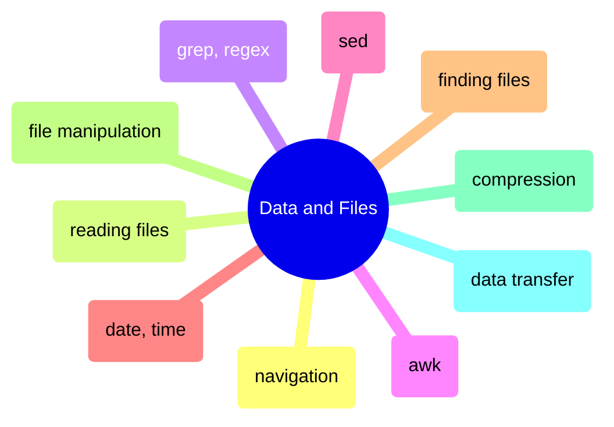

# Data and Files

Shell commands for navigating directories, reading and transforming file content, pattern matching, and transferring data across systems.

> [!abstract]- [[navigation-and-listing]]
>
> - [[navigation-and-listing#Linux — ls, du, df, tree|Directory listing and disk usage]]
> - [[navigation-and-listing#du vs df discrepancy — why disk usage numbers don't match|du vs df discrepancy]]
> - [[navigation-and-listing#PowerShell — Get-ChildItem, Get-PSDrive|PowerShell equivalents]]

> [!abstract]- [[reading-file-contents]]
>
> - [[reading-file-contents#Linux — cat, head, tail, grep, awk|Reading and inspecting files]]
> - [[reading-file-contents#tail -f — follow a log file in real-time|Following logs in real-time]]
> - [[reading-file-contents#Analyzing a large log file during an incident — grep, awk, sort workflow|Large log file analysis]]
> - [[reading-file-contents#PowerShell — Get-Content -Wait, Select-String for log analysis|PowerShell equivalents]]

> [!abstract]- [[grep-and-pattern-matching]]
>
> - [[grep-and-pattern-matching#Basic Pattern Matching]]
> - [[grep-and-pattern-matching#Recursive search]]
> - [[grep-and-pattern-matching#Regular Expression Patterns]]
> - [[grep-and-pattern-matching#Common data engineering regex patterns|Data engineering regex patterns]]

> [!abstract]- [[awk-data-processing]]
>
> - [[awk-data-processing#Record and Field Model]]
> - [[awk-data-processing#Field Extraction and Formatting]]
> - [[awk-data-processing#Filtering and Conditions]]
> - [[awk-data-processing#Data Transformation]]
> - [[awk-data-processing#Data Engineering Scenarios]]

> [!abstract]- [[sed-stream-editing]]
>
> - [[sed-stream-editing#Basic Substitution]]
> - [[sed-stream-editing#In-Place Editing]]
> - [[sed-stream-editing#Line Selection and Addressing]]
> - [[sed-stream-editing#Advanced Substitution with Regex]]

> [!abstract]- [[date-and-time-handling]]
>
> - [[date-and-time-handling#ISO 8601 — the only date format you should use in pipelines|ISO 8601 formats]]
> - [[date-and-time-handling#Date format selection — which format for which context|Format selection by context]]
> - [[date-and-time-handling#Terminal — Linux (Bash)|Bash]]
> - [[date-and-time-handling#Terminal — PowerShell|PowerShell]]
> - [[date-and-time-handling#SQL Server (T-SQL)|SQL Server]]
> - [[date-and-time-handling#Python]]

> [!abstract]- [[finding-files]]
>
> - [[finding-files#find -mtime -mmin — find by modification time|Find by modification time]]
> - [[finding-files#find -size — find by file size|Find by file size]]
> - [[finding-files#find -exec, find -delete — find and execute on results|Find and execute on results]]
> - [[finding-files#find vs fd vs locate — tool comparison|find vs fd vs locate comparison]]
> - [[finding-files#PowerShell — Get-ChildItem, Where-Object, Select-String|PowerShell equivalents]]

> [!abstract]- [[file-manipulation]]
>
> - [[file-manipulation#Linux — cp, mv, rm, rsync|Copying, moving, deleting]]
> - [[file-manipulation#rm — safe delete pattern with trash directory|Safe delete pattern]]
> - [[file-manipulation#chmod — set file permissions with octal or symbolic notation|File permissions]]
> - [[file-manipulation#chown — change file ownership for Docker and multi-user environments|File ownership]]
> - [[file-manipulation#PowerShell — Copy-Item, Move-Item, Remove-Item, New-Item|PowerShell equivalents]]

> [!abstract]- [[compression]]
>
> - [[compression#gzip — compress and decompress files|gzip]]
> - [[compression#zstd — modern replacement with better ratio and faster speed|zstd]]
> - [[compression#tar — archiving and compression for directories|tar archives]]
> - [[compression#Compression strategy matrix — choosing the right algorithm for data pipelines|Strategy matrix]]
> - [[compression#PowerShell — Compress-Archive, 7-Zip, GZipStream|PowerShell equivalents]]

> [!abstract]- [[data-transfer]]
>
> - [[data-transfer#rsync — The Gold Standard for File Transfer|rsync]]
> - [[data-transfer#rsync trailing slash — source path determines copy behavior|Trailing slash gotcha]]
> - [[data-transfer#scp — Simple Remote Copy|scp]]
> - [[data-transfer#gcloud compute scp — GCE-Native File Transfer|GCE file transfer]]
> - [[data-transfer#gsutil and gcloud storage — Cloud Storage Transfers|Cloud Storage transfers]]
