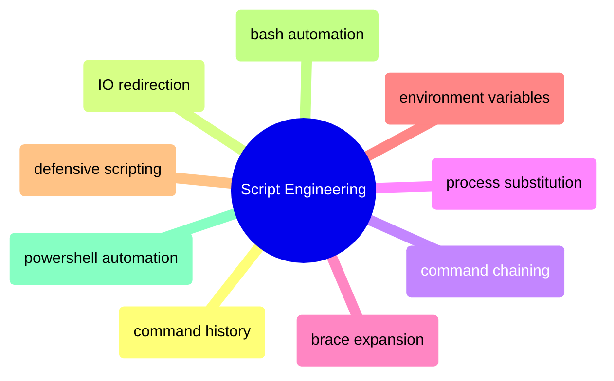

# Script Engineering

Building reliable shell scripts with proper history management, IO control, chaining, expansion, environment variables, and defensive error handling.

> [!abstract]- [[02-command-history]]
>
> - [[02-command-history#Bash History|Search, recall, re-run]]
> - [[02-command-history#Building Complex Commands Incrementally|Building commands incrementally]]
> - [[02-command-history#HISTSIZE, HISTCONTROL — history configuration for .bashrc|History configuration]]
> - [[02-command-history#PowerShell — Get-History, PSReadLine predictive IntelliSense|PowerShell equivalents]]

> [!abstract]- [[03-io-redirection]]
>
> - [[03-io-redirection#Bash Redirection|Stdout, stderr, stdin redirection]]
> - [[03-io-redirection#Production Logging Patterns]]
> - [[03-io-redirection#Redirect-before-write gotcha]]
> - [[03-io-redirection#PowerShell — Out-File|PowerShell equivalents]]

> [!abstract]- [[04-command-chaining]]
>
> - [[04-command-chaining#AND Operator|AND operator]]
> - [[04-command-chaining#Semicolon|Semicolon]]
> - [[04-command-chaining#OR Operator|OR operator]]
> - [[04-command-chaining#AND + OR Combined|Combined try/catch pattern]]
> - [[04-command-chaining#Pipe|Pipe]]

> [!abstract]- [[06-process-substitution]]
>
> - [[06-process-substitution#Process Substitution]]
> - [[06-process-substitution#Here Documents]]
> - [[06-process-substitution#Here Strings]]

> [!abstract]- [[05-brace-expansion-and-globbing]]
>
> - [[05-brace-expansion-and-globbing#Brace Expansion]]
> - [[05-brace-expansion-and-globbing#Globbing — Extended Patterns|Globbing and extended patterns]]
> - [[05-brace-expansion-and-globbing#shopt settings for .bashrc — extglob, globstar, failglob|Shell options for .bashrc]]
> - [[05-brace-expansion-and-globbing#PowerShell — ForEach-Object loops and Get-ChildItem -Recurse for globbing|PowerShell equivalents]]

> [!abstract]- [[01-environment-variables]]
>
> - [[01-environment-variables#The Propagation Model|Propagation model]]
> - [[01-environment-variables#Bash Environment Variables|Setting and exporting]]
> - [[01-environment-variables#Secure Credential Handling]]
> - [[01-environment-variables#PowerShell — $env: drive, SetEnvironmentVariable for persistent env vars|PowerShell equivalents]]

> [!abstract]- [[07-defensive-scripting]]
>
> - [[07-defensive-scripting#set -e — exit immediately on error|Exit on error]]
> - [[07-defensive-scripting#set -u — treat unset variables as errors|Unset variable protection]]
> - [[07-defensive-scripting#set -o pipefail — propagate pipeline failures|Pipeline failure propagation]]
> - [[07-defensive-scripting#Production script template — set -euo pipefail with trap cleanup|Production script template]]
> - [[07-defensive-scripting#trap EXIT — guaranteed cleanup on script exit, error, or signal|Trap cleanup on exit]]

> [!abstract]- [[01-bash-automation]]
>
> - [[01-bash-automation#File Intake and Validation|File intake and validation]]
> - [[01-bash-automation#Data Transformation|Data transformation]]
> - [[01-bash-automation#API Interaction|API interaction]]
> - [[01-bash-automation#Database Operations|Database operations]]

> [!abstract]- [[02-powershell-automation]]
>
> - [[02-powershell-automation#File Intake and Validation|File intake and validation]]
> - [[02-powershell-automation#Data Transformation|Data transformation]]
> - [[02-powershell-automation#API Interaction|API interaction]]
> - [[02-powershell-automation#Database Operations|Database operations]]
