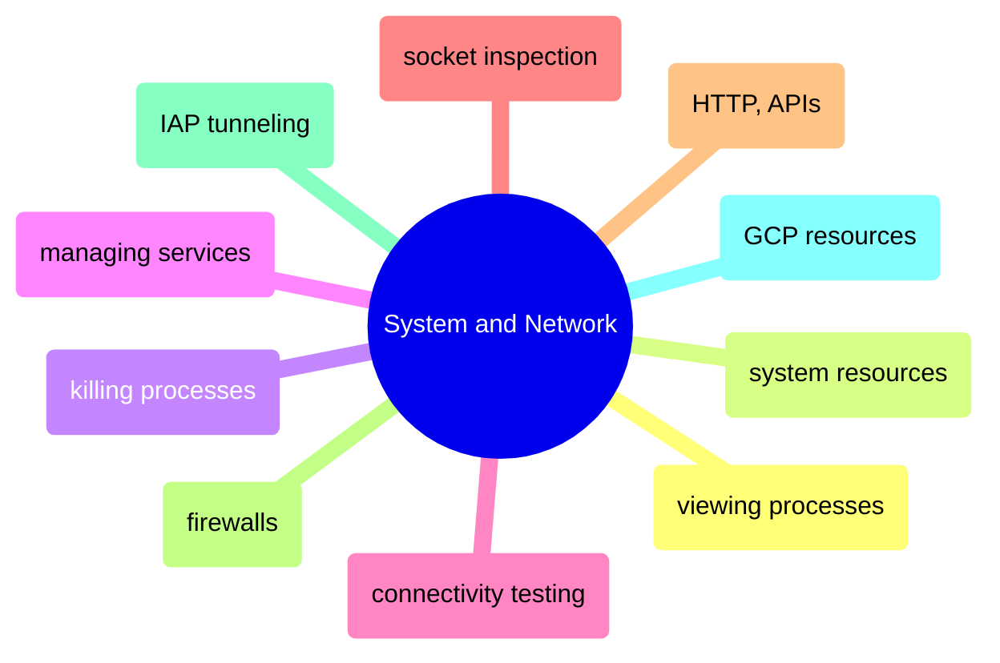

# System and Network

Monitoring processes and resources, managing services, testing connectivity, inspecting sockets, making HTTP requests, configuring firewalls, and connecting to GCP infrastructure.

> [!abstract]- [[01-viewing-processes]]
>
> - [[01-viewing-processes#Linux — ps, top, htop, pstree|Listing and monitoring processes]]
> - [[01-viewing-processes#Diagnosing a slow Airflow VM — ps, docker stats, iostat workflow|Diagnosing a slow VM]]
> - [[01-viewing-processes#The D state — uninterruptible sleep processes that cannot be killed|The D state (unkillable processes)]]
> - [[01-viewing-processes#PowerShell — Get-Process, Get-CimInstance for process and system monitoring|PowerShell equivalents]]

> [!abstract]- [[04-system-resources]]
>
> - [[04-system-resources#free -h — memory usage and available RAM|Memory usage]]
> - [[04-system-resources#lscpu, uptime — CPU info and load average|CPU and load average]]
> - [[04-system-resources#vmstat — combined CPU, memory, IO snapshot|Combined system snapshot]]
> - [[04-system-resources#SQL Server memory interpretation — why free -h looks alarming but is normal|SQL Server memory interpretation]]
> - [[04-system-resources#PowerShell — Get-CimInstance, Get-Counter for memory, CPU, and disk IO|PowerShell equivalents]]

> [!abstract]- [[02-killing-processes]]
>
> - [[02-killing-processes#pkill -f — kill by command line pattern|Kill by pattern]]
> - [[02-killing-processes#kill -- -PGID — kill a process group (parent and all children)|Kill a process group]]
> - [[02-killing-processes#SIGTERM → strace → SIGKILL — the correct kill escalation sequence|Correct kill escalation]]
> - [[02-killing-processes#PowerShell — Stop-Process for graceful and forced termination|PowerShell equivalents]]

> [!abstract]- [[03-managing-services]]
>
> - [[03-managing-services#systemctl, journalctl — managing systemd services and reading logs|Service lifecycle and logs]]
> - [[03-managing-services#systemctl enable — start service automatically on boot|Enable on boot]]
> - [[03-managing-services#Diagnosing OOM kills — when services crash with no error in their own logs|Diagnosing OOM kills]]
> - [[03-managing-services#PowerShell — Start-Service, Stop-Service, Set-Service for Windows services|PowerShell equivalents]]

> [!abstract]- [[01-connectivity-testing]]
>
> - [[01-connectivity-testing#nc (netcat) — testing port reachability|Port reachability testing]]
> - [[01-connectivity-testing#dig — DNS lookup and record queries|DNS lookup]]
> - [[01-connectivity-testing#mtr — combines ping + traceroute in real time|Path tracing]]
> - [[01-connectivity-testing#Debugging a failed database connection — systematic network stack walkthrough|Debugging failed connections]]
> - [[01-connectivity-testing#PowerShell — Test-NetConnection, Resolve-DnsName|PowerShell equivalents]]

> [!abstract]- [[03-socket-inspection]]
>
> - [[03-socket-inspection#ss local address — 0.0.0.0 vs 127.0.0.1 determines who can connect|Listening address scope]]
> - [[03-socket-inspection#Common services and default ports — SSH, SQL Server, Datadog, PostgreSQL, Airflow|Common ports reference]]
> - [[03-socket-inspection#ss filtering — counting connections, TIME-WAIT, and per-client breakdown|Connection counting and filtering]]
> - [[03-socket-inspection#Connection refused vs connection timed out — diagnosing the root cause|Refused vs timed out]]
> - [[03-socket-inspection#PowerShell — Get-NetTCPConnection for socket inspection and connection counts|PowerShell equivalents]]

> [!abstract]- [[02-http-requests-and-apis]]
>
> - [[02-http-requests-and-apis#curl -X POST — send JSON body|Sending requests]]
> - [[02-http-requests-and-apis#curl --retry --connect-timeout — download with retry and timeout|Retry and timeout]]
> - [[02-http-requests-and-apis#curl -w — timing breakdown to diagnose latency|Latency diagnosis]]
> - [[02-http-requests-and-apis#curl vs wget vs Python requests — tool selection|Tool selection]]
> - [[02-http-requests-and-apis#PowerShell — Invoke-RestMethod, Invoke-WebRequest for HTTP requests|PowerShell equivalents]]

> [!abstract]- [[04-firewalls]]
>
> - [[04-firewalls#ufw — Linux Uncomplicated Firewall for port access control|Linux firewall rules]]
> - [[04-firewalls#ufw default deny — the correct baseline for production servers|Default deny baseline]]
> - [[04-firewalls#Defense in depth — layered firewall strategy for production databases|Defense in depth strategy]]
> - [[04-firewalls#PowerShell — Windows Firewall with New-NetFirewallRule|PowerShell equivalents]]

> [!abstract]- [[05-iap-tunneling]]
>
> - [[05-iap-tunneling#How IAP tunneling works — the full network path from workstation to VM|How IAP works]]
> - [[05-iap-tunneling#IAP Tunnel Commands — All Variants|Tunnel commands]]
> - [[05-iap-tunneling#Debugging IAP tunnels — API, IAM, firewall, and VM state checks|Debugging tunnels]]
> - [[05-iap-tunneling#IAP vs Cloud VPN vs bastion host — choosing the right access method|IAP vs VPN vs bastion]]

> [!abstract]- [[06-connecting-to-gcp-resources]]
>
> - [[06-connecting-to-gcp-resources#Compute Engine VMs (SSH)|Compute Engine SSH]]
> - [[06-connecting-to-gcp-resources#SQL Server on Compute Engine (via IAP Tunnel)|SQL Server via IAP]]
> - [[06-connecting-to-gcp-resources#BigQuery (Direct API — No Tunnel Needed)|BigQuery direct API]]
> - [[06-connecting-to-gcp-resources#Cloud Run services — HTTPS endpoints with identity token auth|Cloud Run]]
> - [[06-connecting-to-gcp-resources#Connection quick reference matrix — protocol and tunnel requirements by service|Connection matrix]]
