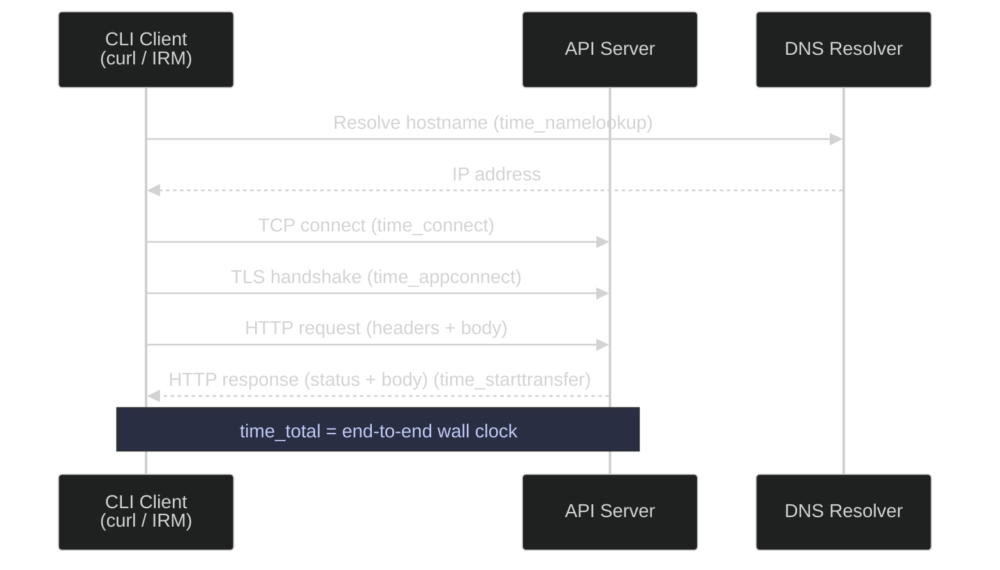

# HTTP Requests — Interacting with APIs and Services

Data pipelines frequently interact with REST APIs (financial data providers, cloud services, webhooks). `curl` is the standard command-line tool for making HTTP requests, and knowing its advanced flags can be the difference between a working integration and hours of debugging. For REST API design patterns including pagination, error handling, and idempotency, see the [Data Architecture section](https://alp78.github.io/elysium/14-Data-Architecture/APIs-and-Protocols/rest-api-design-and-consumption).

> [!quote]
> "I just wanted it to do Internet transfers good, fast and reliably and that's what I worked on making reality."
>
> — **Daniel Stenberg** (creator of curl)



## Linux curl tools

`curl` transfers data over many protocols (HTTP, HTTPS, FTP, SFTP) from the command line. It is the standard tool for REST API calls, health checks, file downloads, and latency diagnostics in bash scripts and pipelines.

### Linux | curl | basic requests

The simplest invocation sends a GET request and prints the response body to stdout. Adding `-v` enables verbose mode, which prints the full request and response headers including TLS handshake details — invaluable for debugging redirects, authentication failures, and certificate issues.

#### Send a GET request

```bash
curl https://api.example.com/data
```

```text
{"status":"ok","records":1024}
```

#### Send a GET request in verbose mode

```bash
curl -v https://api.example.com/data
```

```text
* Trying 93.184.216.34:443...
* Connected to api.example.com (93.184.216.34) port 443
* TLS handshake...
> GET /data HTTP/2
> Host: api.example.com
< HTTP/2 200
< content-type: application/json
{"status":"ok","records":1024}
```

#### Check HTTP status code only

`-s` silences the progress meter, `-o /dev/null` discards the response body, and `-w` prints a format string at completion. This pattern is used in monitoring scripts and health checks where only the status code matters.

```bash
curl -s -o /dev/null -w "%{http_code}" https://api.example.com/health
```

```text
200
```

> [!warning] curl does not follow redirects by default
>
> A `301` or `302` response causes curl to return the redirect HTML, not the final resource. Without `-L`, a health check against a load balancer that redirects HTTP → HTTPS returns `301`, not the actual service health status.

> [!success] Add `-L` to follow redirects automatically
>
> ```bash
> curl -s -o /dev/null -w "%{http_code}" -L https://api.example.com/health
> ```

| Flag | Syntax | Description |
|---|---|---|
| `-s` | `curl -s <url>` | Silent mode — suppress progress meter and error messages |
| `-o` | `curl -o <file> <url>` | Write output to a file instead of stdout |
| `-O` | `curl -O <url>` | Write output to a file named by the remote URL |
| `-v` | `curl -v <url>` | Verbose — print request/response headers and TLS handshake |
| `-L` | `curl -L <url>` | Follow HTTP redirects (3xx) automatically |
| `-w` | `curl -w "<format>" <url>` | Print formatted timing or metadata after transfer completes |
| `-I` | `curl -I <url>` | Fetch headers only (HEAD request) |

### Linux | curl | request headers and body

HTTP requests frequently require custom headers (authentication tokens, content-type declarations) and a request body for POST, PUT, or PATCH operations. `curl` uses `-H` for headers and `-d` for the request body.

#### Send a POST request with a JSON body

`-X POST` sets the HTTP method. `-H "Content-Type: application/json"` tells the server the body is JSON. `-H "Authorization: Bearer $API_TOKEN"` injects the token from an environment variable. `-d` provides the raw body string.

```bash
curl -X POST https://api.example.com/webhook \
  -H "Content-Type: application/json" \
  -H "Authorization: Bearer $API_TOKEN" \
  -d '{"event": "pipeline_complete", "status": "success"}'
```

```text
{"id":"evt_123","accepted":true}
```

#### Send a POST request with a JSON body from a file

When the body is complex or templated, store it in a file and reference it with `@`. This keeps the curl command readable and allows the file to be version-controlled.

```bash
curl -X POST https://api.example.com/webhook \
  -H "Content-Type: application/json" \
  -H "Authorization: Bearer $API_TOKEN" \
  -d @payload.json
```

#### Upload a file with PUT

`-T` uploads a local file as the request body without base64 encoding, suitable for binary uploads (backups, archives).

```bash
curl -X PUT -T backup.sql.gz https://storage.example.com/backups/
```

#### Send a PATCH request

```bash
curl -X PATCH https://api.example.com/records/42 \
  -H "Content-Type: application/json" \
  -H "Authorization: Bearer $API_TOKEN" \
  -d '{"status": "archived"}'
```

#### Use basic authentication

`-u user:password` sends HTTP Basic Auth credentials, encoded as a Base64 header automatically by curl.

```bash
curl -u "$API_USER:$API_PASS" https://api.example.com/protected
```

| Flag | Syntax | Description |
|---|---|---|
| `-X` | `curl -X POST <url>` | Set the HTTP method (GET, POST, PUT, PATCH, DELETE) |
| `-H` | `curl -H "Header: value" <url>` | Add a request header (repeat for multiple headers) |
| `-d` | `curl -d '<body>' <url>` | Set the request body (string or `@file`) |
| `-T` | `curl -T <file> <url>` | Upload a file as the request body (binary PUT) |
| `-u` | `curl -u user:pass <url>` | HTTP Basic Authentication |
| `--data-urlencode` | `curl --data-urlencode "key=value" <url>` | URL-encode a form field before sending |
| `-F` | `curl -F "file=@report.csv" <url>` | Multipart form upload |
| `-G` | `curl -G -d "q=test" <url>` | Send `-d` data as query string on a GET request |

### Linux | curl | downloads with retry and timeout

Production scripts must defend against transient network failures, slow servers, and stalled transfers. Without timeout flags, a hanging curl can block a pipeline indefinitely. The flags below form the standard production download pattern.

#### Download a file with retry and timeout

`-f` causes curl to fail with a non-zero exit code on HTTP errors (4xx, 5xx) instead of saving the error HTML. `-S` ensures errors are shown even when `-s` (silent) is active. `--retry` retries on transient failures (connection refused, 5xx). `--retry-delay` waits between attempts. `--connect-timeout` limits the TCP connection phase. `--max-time` limits the entire transfer.

```bash
curl -fSL \
  --retry 3 \
  --retry-delay 5 \
  --connect-timeout 10 \
  --max-time 300 \
  -o data.csv \
  https://data-provider.com/export/latest.csv
```

> [!warning] Missing `-f` causes silent failures
>
> Without `-f`, curl exits with code 0 even when the server returns a 404 or 500. The downloaded file contains the HTML error page. The pipeline continues unaware.

> [!success] Always use `-f` in production download scripts
>
> With `-f`, curl exits non-zero on HTTP errors. Combine with `set -e` in bash to abort the pipeline immediately on failure.
>
> ```bash
> set -e
> curl -fSL --retry 3 --connect-timeout 10 --max-time 300 \
>   -o data.csv https://data-provider.com/export/latest.csv
> ```

#### Resume an interrupted download

`-C -` instructs curl to detect the already-downloaded byte offset and resume from that position. The server must support the `Range` header for this to work.

```bash
curl -C - -o data.csv https://data-provider.com/export/latest.csv
```

| Flag | Syntax | Description |
|---|---|---|
| `-f` | `curl -f <url>` | Fail silently on HTTP errors (non-zero exit code on 4xx/5xx) |
| `-S` | `curl -fS <url>` | Show error messages even in silent mode |
| `-L` | `curl -L <url>` | Follow HTTP redirects |
| `--retry` | `curl --retry 3 <url>` | Retry up to N times on transient failures |
| `--retry-delay` | `curl --retry-delay 5 <url>` | Wait N seconds between retry attempts |
| `--retry-max-time` | `curl --retry-max-time 120 <url>` | Give up retrying after N seconds total |
| `--connect-timeout` | `curl --connect-timeout 10 <url>` | Abort if TCP connection is not established within N seconds |
| `--max-time` | `curl --max-time 300 <url>` | Abort the entire transfer after N seconds |
| `-C` | `curl -C - -o <file> <url>` | Resume an interrupted download |

### Linux | curl | timing breakdown

The `-w` format string can print per-phase timing metrics after a transfer completes. This is the fastest way to isolate whether latency originates in DNS, network, TLS, or the server itself — without installing additional tools.

#### Print timing metrics for a request

```bash
curl -s -o /dev/null \
  -w "DNS: %{time_namelookup}s\nConnect: %{time_connect}s\nTLS: %{time_appconnect}s\nFirst byte: %{time_starttransfer}s\nTotal: %{time_total}s\n" \
  https://api.example.com/health
```

```text
DNS:        0.012s
Connect:    0.038s
TLS:        0.091s
First byte: 0.143s
Total:      0.144s
```

Each metric covers a cumulative phase from request start. The derived server processing time is `time_starttransfer − time_appconnect`. Interpreting the phases:

- `time_namelookup` high (> 0.1 s): DNS is slow — check `/etc/resolv.conf`, consider a local DNS cache (systemd-resolved or dnsmasq).
- `time_connect` high relative to DNS: Network latency to the server — check routing, consider a closer region.
- `time_appconnect` high relative to connect: TLS negotiation is slow — the certificate chain may be large, or OCSP stapling is missing.
- `time_starttransfer − time_appconnect` high: Server processing is the bottleneck — the request is reaching the server but it is slow to respond.

| Variable | Description |
|---|---|
| `%{time_namelookup}` | Time from start to DNS resolution complete |
| `%{time_connect}` | Time from start to TCP connection established |
| `%{time_appconnect}` | Time from start to TLS handshake complete |
| `%{time_pretransfer}` | Time from start to first transfer-ready state |
| `%{time_starttransfer}` | Time from start to first byte received (TTFB) |
| `%{time_total}` | Total wall-clock time for the transfer |
| `%{http_code}` | Final HTTP status code |
| `%{size_download}` | Number of bytes downloaded |
| `%{speed_download}` | Average download speed in bytes per second |

### Linux | wget | file downloads

`wget` is optimized for file downloads, particularly when resuming interrupted transfers or mirroring directory trees. Unlike curl, wget writes to a local file by default and handles recursive downloads natively.

#### Download a file

```bash
wget https://data-provider.com/export/latest.csv
```

#### Resume an interrupted download

`-c` (continue) sends a `Range` header so the server resumes from the last byte offset. Useful for large files on unreliable connections.

```bash
wget -c https://data-provider.com/export/large-dataset.csv
```

#### Download with retry and timeout

```bash
wget --tries=3 --timeout=30 --wait=5 \
  -O data.csv \
  https://data-provider.com/export/latest.csv
```

#### Mirror a directory tree

`-r` enables recursive download, `-np` prevents ascending to parent directories, `-nH` strips the hostname from the local path.

```bash
wget -r -np -nH https://data-provider.com/reports/2025/
```

| Flag | Syntax | Description |
|---|---|---|
| `-O` | `wget -O <file> <url>` | Write output to a specific filename |
| `-c` | `wget -c <url>` | Resume an interrupted download |
| `--tries` | `wget --tries=3 <url>` | Number of retry attempts (0 = infinite) |
| `--timeout` | `wget --timeout=30 <url>` | Network read timeout in seconds |
| `--wait` | `wget --wait=5 <url>` | Wait N seconds between requests |
| `-q` | `wget -q <url>` | Quiet — suppress output |
| `-r` | `wget -r <url>` | Recursive download |
| `-np` | `wget -np <url>` | No parent — do not ascend to parent directories |
| `-nH` | `wget -nH <url>` | No host directory — strip hostname from local path |
| `--spider` | `wget --spider <url>` | Check if a URL is reachable without downloading |

### Linux | curl vs wget | tool selection

> [!tip] Choosing between curl, wget, and Python requests
>
> - **curl**: Best for one-off requests, debugging, health checks, API calls, and scripts. Supports every protocol and custom headers. Use in bash pipeline scripts.
> - **wget**: Best for downloading files, particularly when resuming is needed (`-c`) or recursive mirroring is required. Simpler syntax for file downloads.
> - **Python requests / httpx**: Best for complex API interactions (pagination, OAuth flows, session management, retries with backoff). Use in pipeline code — see [15_py_webapis](https://alp78.github.io/elysium/02-Programming-Languages/Python/15_py_webapis) for httpx, requests, and async HTTP patterns.

## PowerShell HTTP request tools

PowerShell ships two cmdlets for HTTP: `Invoke-RestMethod` and `Invoke-WebRequest`. They cover the same ground as curl but integrate with PowerShell's object pipeline — responses are deserialized into .NET objects rather than raw strings.

### PowerShell | Invoke-RestMethod | basic requests

`Invoke-RestMethod` (alias: `irm`) automatically deserializes JSON and XML responses into PowerShell objects. Use it when you need to work with the response data directly.

#### Send a GET request

```powershell
Invoke-RestMethod -Uri "https://api.example.com/data"
```

```text
status  records
------  -------
ok         1024
```

#### Send a GET request with an authorization header

```powershell
$response = Invoke-RestMethod -Uri "https://api.example.com/data" `
    -Headers @{ Authorization = "Bearer $token" }
$response.records
```

```text
1024
```

#### Check HTTP status code only

`Invoke-WebRequest` exposes the `StatusCode` property. Use it when you need the status without processing the body.

```powershell
$r = Invoke-WebRequest -Uri "https://api.example.com/health" -Method Head
$r.StatusCode
```

```text
200
```

| Parameter | Syntax | Description |
|---|---|---|
| `-Uri` | `-Uri "https://..."` | Target URL |
| `-Method` | `-Method Get` | HTTP method (Get, Post, Put, Patch, Delete, Head) |
| `-Headers` | `-Headers @{Key="Value"}` | Hashtable of request headers |
| `-ContentType` | `-ContentType "application/json"` | Set the Content-Type header |
| `-Body` | `-Body $json` | Request body string or hashtable |
| `-OutFile` | `-OutFile "data.csv"` | Save response body to a file |
| `-UseBasicParsing` | `-UseBasicParsing` | Bypass IE engine (required on Server Core) |

### PowerShell | Invoke-RestMethod | POST and authentication

#### Send a POST request with a JSON body

Convert a hashtable to JSON with `ConvertTo-Json` before passing it as the body. PowerShell's pipeline makes nested object serialization straightforward.

```powershell
$body = @{
    event  = "pipeline_complete"
    status = "success"
} | ConvertTo-Json

Invoke-RestMethod -Uri "https://api.example.com/webhook" `
    -Method Post `
    -ContentType "application/json" `
    -Headers @{ Authorization = "Bearer $token" } `
    -Body $body
```

```text
id      accepted
--      --------
evt_123     True
```

#### Send a PATCH request

```powershell
$body = @{ status = "archived" } | ConvertTo-Json

Invoke-RestMethod -Uri "https://api.example.com/records/42" `
    -Method Patch `
    -ContentType "application/json" `
    -Headers @{ Authorization = "Bearer $token" } `
    -Body $body
```

#### Use basic authentication

Encode credentials as a Base64 Basic Auth header manually, since `Invoke-RestMethod` does not have a dedicated `-Credential` flag for HTTP Basic Auth against arbitrary APIs.

```powershell
$encoded = [Convert]::ToBase64String(
    [Text.Encoding]::ASCII.GetBytes("$env:API_USER`:$env:API_PASS")
)

Invoke-RestMethod -Uri "https://api.example.com/protected" `
    -Headers @{ Authorization = "Basic $encoded" }
```

| Parameter | Syntax | Description |
|---|---|---|
| `-Method Post` | `-Method Post` | HTTP POST |
| `-Method Patch` | `-Method Patch` | HTTP PATCH |
| `-Method Put` | `-Method Put` | HTTP PUT |
| `-Method Delete` | `-Method Delete` | HTTP DELETE |
| `-Body` | `-Body ($hash \| ConvertTo-Json)` | Serialized JSON body |
| `-ContentType` | `-ContentType "application/json"` | Content-Type header |
| `-Headers` | `-Headers @{Authorization="Bearer $t"}` | Authorization and custom headers |

### PowerShell | Invoke-WebRequest | downloads with retry

`Invoke-WebRequest` is preferred over `Invoke-RestMethod` for file downloads because `-OutFile` streams the response body directly to disk without loading it into memory.

#### Download a file with retry (PowerShell 7+)

`-MaximumRetryCount` and `-RetryIntervalSec` were introduced in PowerShell 7. They automatically retry on transient HTTP errors (429, 5xx) and network timeouts.

```powershell
Invoke-WebRequest -Uri "https://data-provider.com/latest.csv" `
    -OutFile "data.csv" `
    -MaximumRetryCount 3 `
    -RetryIntervalSec 5
```

> [!warning] Retry parameters require PowerShell 7+
>
> `-MaximumRetryCount` and `-RetryIntervalSec` do not exist in Windows PowerShell 5.1. The command fails silently — the parameters are ignored with no error in some builds, or throw a parameter binding error in others.

> [!success] Wrap downloads in a retry loop for PowerShell 5.1 compatibility
>
> ```powershell
> $maxAttempts = 3
> for ($i = 1; $i -le $maxAttempts; $i++) {
>     try {
>         Invoke-WebRequest -Uri "https://data-provider.com/latest.csv" -OutFile "data.csv"
>         break
>     } catch {
>         if ($i -eq $maxAttempts) { throw }
>         Start-Sleep -Seconds 5
>     }
> }
> ```

#### Set a timeout on a download

PowerShell 7 uses `System.Net.Http.HttpClient` internally. The `-TimeoutSec` parameter sets the request timeout in seconds.

```powershell
Invoke-WebRequest -Uri "https://data-provider.com/latest.csv" `
    -OutFile "data.csv" `
    -TimeoutSec 300
```

| Parameter | Syntax | Description |
|---|---|---|
| `-OutFile` | `-OutFile "data.csv"` | Save response body to a file |
| `-MaximumRetryCount` | `-MaximumRetryCount 3` | Retry up to N times on transient failures (PS 7+) |
| `-RetryIntervalSec` | `-RetryIntervalSec 5` | Wait N seconds between retries (PS 7+) |
| `-TimeoutSec` | `-TimeoutSec 300` | Abort if no response within N seconds |
| `-PassThru` | `-PassThru` | Return the response object when using `-OutFile` |

## Related
- [connectivity-testing](https://alp78.github.io/elysium/01-Shell/Networking/connectivity-testing) — test TCP reachability before HTTP calls
- [firewalls](https://alp78.github.io/elysium/01-Shell/Networking/firewalls) — when curl returns "connection timed out" or "connection refused"
- [environment-variables](https://alp78.github.io/elysium/01-Shell/Scripting/environment-variables) — store `$API_TOKEN` securely in environment variables
- [iap-tunneling](https://alp78.github.io/elysium/01-Shell/Networking/iap-tunneling) — calling services behind IAP with identity tokens

For invoking HTTP endpoints deployed as managed services, see [cloud-run-jobs-vs-services](https://alp78.github.io/elysium/06-GCP/Serverless/cloud-run-jobs-vs-services) which covers Cloud Run HTTP triggers and authentication.
