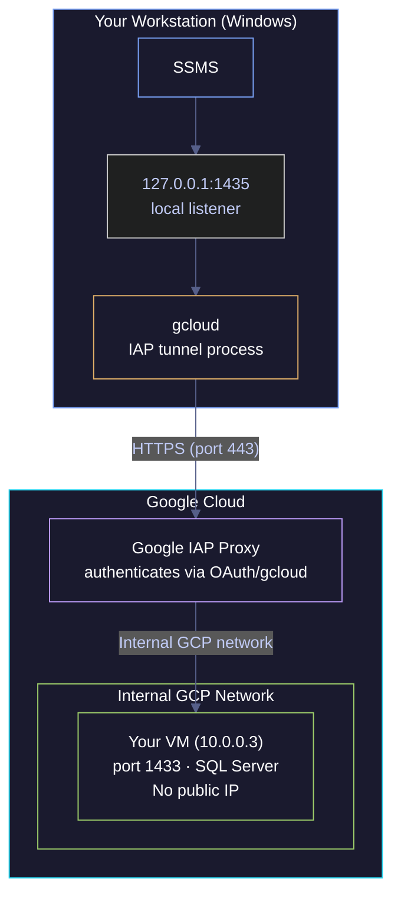

# IAP Tunneling — Secure Connectivity Without Public IPs

Identity-Aware Proxy (IAP) is Google Cloud's way to let you access VMs that have no public IP. It's the backbone of secure GCE connectivity: your SSH sessions, database connections, and even SSMS all travel through IAP when configured correctly. Understanding how IAP tunneling works at the network level — not just "run this gcloud command" — is what separates debugging in minutes from debugging in hours.

> [!quote]
> "Trust is a vulnerability. Zero Trust eliminates trust from digital systems because it provides no value to an organisation."
>
> — **John Kindervag** (creator of Zero Trust at Forrester)

## How IAP tunneling works

IAP acts as an identity-aware reverse proxy sitting between your workstation and any GCP VM. All traffic flows over HTTPS on port 443 — no VPN, no public IP on the VM. The tunnel is authenticated with your Google identity and authorized by IAM before any byte of application data is forwarded.

### How IAP tunneling works | network path | workstation to VM

The diagram below shows the full path a SQL Server connection takes through an IAP tunnel, from SSMS on your workstation to the VM's port 1433.



**Step by step:**
1. gcloud opens a local listener on 127.0.0.1:1435 (your machine)
2. SSMS connects to 127.0.0.1:1435 (thinks it's a local SQL Server)
3. gcloud wraps the TCP traffic in HTTPS and sends it to Google's IAP proxy
4. IAP proxy verifies your Google identity (OAuth token from gcloud auth)
5. IAP proxy checks IAM: does this user have `iap.tunnelInstances.accessTunnelResourceAccessor`?
6. If authorized, IAP forwards the traffic over GCP's internal network to the VM
7. Traffic arrives at the VM's port 1433 as a normal TCP connection from within the VPC
8. SQL Server processes the query and sends the response back through the same tunnel

> [!info] The VM never sees your real IP
>
> The VM never sees your workstation's IP address. It sees a connection from an IP in the GCP internal network (typically in the `10.x.x.x` or `35.235.240.0/20` range). That's why `ss -tnp` on the VM shows a VPC-internal peer address, not your home IP.

> [!tip] Related pattern
>
> IAP requires the `iap.tunnelResourceAccessor` IAM role — see [service-accounts-and-iam](https://alp78.github.io/elysium/06-GCP/Security/service-accounts-and-iam) for role binding patterns. The firewall rule allowing `35.235.240.0/20` can be managed declaratively with [terraform-networking](https://alp78.github.io/elysium/07-Terraform/GCP-Resources/terraform-networking).

## PowerShell / Linux | gcloud | IAP tunnel commands

`gcloud` is a cross-platform CLI that runs identically on Windows (PowerShell) and Linux (bash). All `gcloud compute ssh` and `gcloud compute start-iap-tunnel` commands in this section work on both platforms without modification. Behavioral differences between platforms are noted inline where they apply.

### PowerShell / Linux | gcloud compute ssh | SSH through IAP

`gcloud compute ssh` with `--tunnel-through-iap` is the standard way to reach a Compute Engine VM that has no public IP. Under the hood, it opens an IAP tunnel on an ephemeral port, then runs SSH through it — combining tunnel creation and interactive SSH session into a single command.

For additional SSH patterns including OS Login and metadata-managed keys, see [vm-ssh-and-file-transfer](https://alp78.github.io/elysium/06-GCP/Compute/vm-ssh-and-file-transfer).

#### Open an interactive SSH session through IAP

The command below opens a terminal session on `data-pipeline-sql` without requiring a public IP or a bastion host.

```bash
gcloud compute ssh data-pipeline-sql \
    --zone=europe-west1-b \
    --tunnel-through-iap
```

#### Run a single command on the VM through IAP

Use `--command` to execute a non-interactive command and return the output locally. The SSH session closes as soon as the command exits.

```bash
gcloud compute ssh data-pipeline-sql \
    --zone=europe-west1-b \
    --tunnel-through-iap \
    --command="systemctl status mssql-server"
```

| Flag | Syntax | Description |
|---|---|---|
| `--tunnel-through-iap` | `gcloud compute ssh VM --tunnel-through-iap` | Route the SSH connection through IAP instead of a public IP |
| `--zone` | `--zone=europe-west1-b` | Zone where the VM resides |
| `--command` | `--command="<cmd>"` | Run a single non-interactive command and return its output |
| `--ssh-flag` | `--ssh-flag="-L 5432:localhost:5432"` | Pass additional raw flags to the underlying `ssh` binary |
| `--project` | `--project=my-gcp-project` | Override the active gcloud project for this command |

### PowerShell / Linux | gcloud compute start-iap-tunnel | port forwarding

`start-iap-tunnel` creates a persistent TCP tunnel that maps a local port on your machine to a remote port on a VM. Unlike `gcloud compute ssh`, this does not open a shell — it holds the tunnel open so other applications (SSMS, pgAdmin, a browser) can connect through it. The tunnel process stays in the foreground and must remain running: closing the terminal closes the tunnel.

#### Forward a specific port through IAP

The command below maps local port 1435 to port 1433 on `data-pipeline-sql`, so SSMS can connect to `127.0.0.1,1435` as if the SQL Server were local.

```bash
gcloud compute start-iap-tunnel data-pipeline-sql 1433 \
    --local-host-port=127.0.0.1:1435 \
    --zone=europe-west1-b
```

> [!tip] Port mapping explained
>
> | Parameter | Meaning |
> |---|---|
> | `data-pipeline-sql` | VM instance name |
> | `1433` | Remote port on the VM (SQL Server listens here) |
> | `0.0.0.0` | Listen on all interfaces (needed if other machines connect to you) |
> | `127.0.0.1` | Listen on loopback only (more secure, default if omitted) |
> | `1435` | Local port on your machine (any free port — does not need to match remote) |
>
> After running: connect via SSMS → `127.0.0.1,1435`. For sqlcmd through the tunnel, see [sqlcmd-connection-and-usage](https://alp78.github.io/elysium/04-SQL-Server/01-Server-Operations/sqlcmd-connection-and-usage).

> [!danger] IAP 10-minute idle timeout
>
> IAP closes tunnels after 10 minutes of inactivity. If you open SSMS, run a query, then go to lunch, your connection is dead when you return — and any in-progress transaction is rolled back.

> [!success] Mitigating the idle timeout
>
> - Add `--iap-tunnel-disable-connection-check` to the tunnel command (see the dedicated step below).
> - Configure your SQL client to send TCP keepalives (SSMS: Connection Properties → Connection Timeout = 0).
> - For long-running queries: use `nohup` or `screen` on the VM instead of running them through the tunnel.

> [!warning] `0.0.0.0` exposes the tunnel to your local network
>
> Using `0.0.0.0` means any device on your local network can connect to your tunnel. On a corporate network or shared WiFi, this exposes your database tunnel to other machines.

> [!success] Use `127.0.0.1` unless sharing is intentional
>
> Use `--local-host-port=127.0.0.1:1435` unless you specifically need another machine to route through your tunnel.

#### Disable idle connection check to prevent timeout drops

The `--iap-tunnel-disable-connection-check` flag suppresses the idle-timeout mechanism at the gcloud layer, keeping the tunnel open even during periods of inactivity.

```bash
gcloud compute start-iap-tunnel data-pipeline-sql 1433 \
    --local-host-port=127.0.0.1:1435 \
    --zone=europe-west1-b \
    --iap-tunnel-disable-connection-check
```

#### Run multiple tunnels simultaneously

Each `start-iap-tunnel` command is an independent process. Run as many as needed in separate terminals — they do not interfere with each other. A typical development session tunnels to two or three services at once.

```bash
# Terminal 1: SQL Server
gcloud compute start-iap-tunnel data-pipeline-sql 1433 \
    --local-host-port=127.0.0.1:1435 --zone=europe-west1-b
```

```bash
# Terminal 2: Airflow webserver
gcloud compute start-iap-tunnel data-pipeline-airflow 8080 \
    --local-host-port=127.0.0.1:8080 --zone=europe-west1-b
```

```bash
# Terminal 3: PostgreSQL (Airflow metadata)
gcloud compute start-iap-tunnel data-pipeline-airflow 5432 \
    --local-host-port=127.0.0.1:5432 --zone=europe-west1-b
```

> [!tip] Port collision anti-pattern
>
> If you use the same local port as the remote port (e.g., `1433:1433`) and you have a local SQL Server Express installed, the tunnel fails with "address already in use." Always pick a non-standard local port like `1435` for tunneled services.

| Flag | Syntax | Description |
|---|---|---|
| `--local-host-port` | `--local-host-port=127.0.0.1:1435` | Local interface and port to bind the tunnel listener |
| `--zone` | `--zone=europe-west1-b` | Zone where the target VM resides |
| `--iap-tunnel-disable-connection-check` | (flag only) | Disable idle-timeout connection checks to keep long-running tunnels alive |
| `--project` | `--project=my-gcp-project` | Override the active gcloud project for this command |
| `--network` | `--network=my-vpc` | Specify the VPC network when the project has multiple networks |

## Debugging IAP tunnels

When an IAP tunnel fails, the failure mode is usually one of four root causes: the IAP API is not enabled, the user lacks the required IAM permission, the firewall rule is missing or misconfigured, or the VM is stopped. Work through them in order — firewall is the most common.

### Debugging IAP tunnels | symptom | `start-iap-tunnel` hangs without output

When `start-iap-tunnel` hangs without printing anything, it is waiting for IAP to accept the connection. The four most common causes are listed below.

#### Check whether the IAP API is enabled

If the Cloud IAP API is disabled in the project, the tunnel command hangs indefinitely. The command below lists all enabled APIs and filters for `iap`.

```bash
gcloud services list --enabled | grep iap
```

```text
iap.googleapis.com                    Cloud Identity-Aware Proxy API
```

An empty result means the API is disabled. Enable it with `gcloud services enable iap.googleapis.com`.

#### Check IAM permission for IAP tunnel access

The user or service account must have the `roles/iap.tunnelResourceAccessor` role (which grants `iap.tunnelInstances.accessTunnelResourceAccessor`) on the project or the specific tunnel resource.

```bash
gcloud projects get-iam-policy YOUR_PROJECT --format=json | \
    grep -A 2 "tunnelResourceAccessor"
```

```text
      "role": "roles/iap.tunnelResourceAccessor"
```

An empty result means the binding is missing. Add it in the IAM console or via `gcloud projects add-iam-policy-binding`.

#### Check the firewall rule for IAP's source IP range

IAP forwards traffic from the `35.235.240.0/20` CIDR block. If no firewall rule allows traffic from this range on the target port, the tunnel appears to open but the connection never reaches the VM.

```bash
gcloud compute firewall-rules list \
    --format="table(name,sourceRanges,allowed)" | grep 35.235.240
```

```text
allow-iap-ingress  35.235.240.0/20  tcp:22,tcp:1433
```

An empty result means the firewall rule is missing. The rule must allow inbound TCP on the port you are tunneling (e.g., 22 for SSH, 1433 for SQL Server) from `35.235.240.0/20`.

#### Check whether the VM is running

The tunnel cannot reach a stopped VM. The command below returns the current power state of the instance.

```bash
gcloud compute instances describe data-pipeline-sql \
    --zone=europe-west1-b --format="value(status)"
```

```text
RUNNING
```

If the output is `TERMINATED` or `STOPPED`, start the VM with `gcloud compute instances start data-pipeline-sql --zone=europe-west1-b`.

### Debugging IAP tunnels | symptom | tunnel opens but connections fail

When the tunnel process starts successfully (no hang, no immediate error) but the application cannot connect, the tunnel is up but the service is not listening on the expected port inside the VM. SSH into the VM and verify directly.

#### Verify the target service is listening on the expected port

The command below SSHes through IAP and checks which processes are listening on port 1433 inside the VM.

```bash
gcloud compute ssh data-pipeline-sql \
    --zone=europe-west1-b \
    --tunnel-through-iap \
    --command="ss -tlnp | grep 1433"
```

```text
LISTEN 0 128 0.0.0.0:1433 0.0.0.0:* users:(("sqlservr",pid=1234,fd=67))
```

An empty result means SQL Server is not listening on 1433 — check `systemctl status mssql-server` inside the VM.

### Debugging IAP tunnels | symptom | tunnel drops after inactivity

IAP enforces a 10-minute idle timeout at the proxy layer. The `--iap-tunnel-disable-connection-check` flag disables gcloud's own connection-check polling, which can interfere with the keepalive behavior. See the dedicated step in the commands section above.

## Verifying the IAP tunnel from both ends

Verification should happen at both the local listener (your machine) and the VM's connection table, giving you a full picture of the tunnel's health from end to end.

### Verifying IAP tunnels | PowerShell | local listener check

On Windows, PowerShell can inspect the local TCP listener and test connectivity to the tunnel port without any additional tools.

#### Check the local tunnel listener port in PowerShell

This confirms gcloud has bound the local listener successfully. The owning process will be `gcloud.exe` or `python.exe` depending on your gcloud installation.

```powershell
Get-NetTCPConnection -LocalPort 1435 -State Listen
```

```text
LocalAddress  LocalPort RemoteAddress RemotePort State  OwningProcess
0.0.0.0       1435      0.0.0.0       0          Listen 18432
```

#### Test connectivity to the local tunnel port in PowerShell

`True` means the tunnel listener is reachable. `False` means the tunnel process died or the port is wrong.

```powershell
Test-NetConnection -ComputerName 127.0.0.1 -Port 1435 -InformationLevel Quiet
```

```text
True
```

### Verifying IAP tunnels | Linux | local listener check

On Linux, `ss` and `nc` serve the same verification purposes as the PowerShell cmdlets above.

#### Check the local tunnel listener port in bash

```bash
ss -tlnp | grep 1435
```

```text
LISTEN 0 128 0.0.0.0:1435 0.0.0.0:* users:(("gcloud",pid=5621,fd=3))
```

#### Test connectivity to the local tunnel port in bash

```bash
nc -zv 127.0.0.1 1435
```

```text
Connection to 127.0.0.1 1435 port [tcp/*] succeeded!
```

### Verifying IAP tunnels | Linux | VM-side connection check

Run on the VM (via `gcloud compute ssh --tunnel-through-iap`) to inspect what is connected to the target port from IAP's internal IP range.

#### Check active connections on the VM's target port

```bash
ss -tnp | grep :1433
```

```text
ESTAB  0  0  10.0.0.3:1433  10.0.0.24:56434
ESTAB  0  0  10.0.0.3:1433  10.0.0.24:26733
```

`10.0.0.3` is the VM's internal IP. `10.0.0.24` is the IAP proxy's internal IP within GCP's VPC — not your workstation's public IP. Each `ESTAB` line represents one active connection (for example, two SSMS query windows). You will never see your workstation's public IP here: IAP terminates the tunnel at its proxy and the VM only sees internal GCP traffic.

## IAP vs Cloud VPN vs bastion host

Three patterns exist for reaching private VMs in GCP. The right choice depends on the number of users, the number of services, and whether infrastructure cost is a concern.

> [!tip] Choosing the right access pattern
>
> | Approach | Setup Complexity | Cost | Security | Use Case |
> |----------|-----------------|------|----------|----------|
> | **IAP Tunnel** | Low (just gcloud) | Free | High (Google-managed auth, per-user IAM) | Individual developer access, on-demand |
> | **Cloud VPN** | Medium (Terraform) | ~$35/month per tunnel | Medium (network-level, all-or-nothing) | Site-to-site, when many services need access |
> | **Bastion Host** | Medium (extra VM) | VM cost (~$25/month) | Medium (single point of entry) | Legacy setups, when IAP isn't available |
>
> For a small team accessing a few VMs, IAP is always the right choice. Zero infrastructure to maintain, zero cost, and per-user audit logging via Cloud Audit Logs.

## Related
- [gcp-identity-and-connection-patterns](https://alp78.github.io/elysium/06-GCP/Security/gcp-identity-and-connection-patterns) — Where IAP tunnels fit in the overall connection pattern framework
- [firewalls](https://alp78.github.io/elysium/01-Shell/Networking/firewalls) — IAP firewall rule for `35.235.240.0/20` on port 22
- [connectivity-testing](https://alp78.github.io/elysium/01-Shell/Networking/connectivity-testing) — diagnose IAP tunnel failures step by step
- [socket-inspection](https://alp78.github.io/elysium/01-Shell/Networking/socket-inspection) — verify IAP connections visible on the VM side
- [connecting-to-gcp-resources](https://alp78.github.io/elysium/01-Shell/Networking/connecting-to-gcp-resources) — full guide: IAP + SQL Server, Airflow, BigQuery

