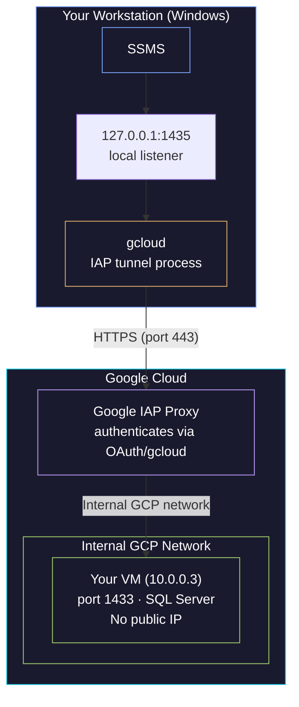

# IAP Tunneling — Secure Connectivity Without Public IPs

Identity-Aware Proxy (IAP) is Google Cloud's way to let you access VMs that have no public IP. It's the backbone of secure GCE connectivity: your SSH sessions, database connections, and even SSMS all travel through IAP when configured correctly. Understanding how IAP tunneling works at the network level — not just "run this gcloud command" — is what separates debugging in minutes from debugging in hours.

> [!quote]
> "Trust is a vulnerability. Zero Trust eliminates trust from digital systems because it provides no value to an organisation."
> — **John Kindervag** (creator of Zero Trust at Forrester)

### How IAP tunneling works — the full network path from workstation to VM



**Step by step:**
1. gcloud opens a LOCAL listener on 127.0.0.1:1435 (your machine)
2. SSMS connects to 127.0.0.1:1435 (thinks it's a local SQL Server)
3. gcloud wraps the TCP traffic in HTTPS and sends it to Google's IAP proxy
4. IAP proxy verifies your Google identity (OAuth token from gcloud auth)
5. IAP proxy checks IAM: does this user have iap.tunnelInstances.accessTunnelResourceAccessor?
6. If authorized, IAP forwards the traffic over GCP's internal network to the VM
7. Traffic arrives at the VM's port 1433 as a normal TCP connection from within the VPC
8. SQL Server processes the query and sends the response back through the same tunnel

> [!info] VM never sees your real IP
>
> The VM never sees your workstation's IP address. It sees a connection from an IP in the **GCP internal network** (typically in the `10.x.x.x` or `35.235.240.0/20` range). That's why `ss -tnp` on the VM shows a VPC-internal peer address, not your home IP.

> [!tip] Related pattern
>
> IAP requires the `iap.tunnelResourceAccessor` IAM role -- see [service-accounts-and-iam](https://alp78.github.io/elysium/06-GCP/Security/service-accounts-and-iam) for role binding patterns. The firewall rule allowing `35.235.240.0/20` can be managed declaratively with [terraform-networking](https://alp78.github.io/elysium/07-Terraform/GCP-Resources/terraform-networking).

## IAP Tunnel Commands — All Variants

#### gcloud compute start-iap-tunnel — port forwarding through IAP

#### gcloud compute ssh — interactive SSH through IAP tunnel

> [!info] SSH through IAP
>
> `gcloud compute ssh` with `--tunnel-through-iap` is the standard way to reach
> a Compute Engine VM that has no public IP. Under the hood, it opens an IAP tunnel on
> an ephemeral port, then runs SSH through it. This is a shortcut that combines tunnel
> creation + SSH session into one command.
>
> For additional SSH patterns including OS Login and metadata-managed keys, see
> [vm-ssh-and-file-transfer](https://alp78.github.io/elysium/06-GCP/Compute/vm-ssh-and-file-transfer).

```bash
gcloud compute ssh data-pipeline-sql \
    --zone=europe-west1-b \
    --tunnel-through-iap
```

---

#### gcloud compute start-iap-tunnel — forward a specific port through IAP

> [!info] Persistent TCP tunnel
>
> `start-iap-tunnel` creates a persistent TCP tunnel that maps a local port on
> your machine to a remote port on a VM. Unlike `gcloud compute ssh`, this does NOT open
> a shell — it holds the tunnel open so other applications (SSMS, pgAdmin, a browser) can
> connect through it.
>
> The tunnel process stays in the foreground and must remain running. Close the terminal =
> close the tunnel.

```bash
gcloud compute start-iap-tunnel data-pipeline-sql 1433 \
    --local-host-port=0.0.0.0:1435 \
    --zone=europe-west1-b
```

> [!tip] Port mapping explained
>
> | Parameter | Meaning |
> |---|---|
> | `data-pipeline-sql` | VM instance name |
> | `1433` | **Remote** port on the VM (SQL Server listens here) |
> | `0.0.0.0` | Listen on **all interfaces** (needed if other machines connect to you) |
> | `127.0.0.1` | Listen on **loopback only** (more secure, default if omitted) |
> | `1435` | **Local** port on your machine (any free port — does not need to match remote) |
>
> After running: connect via SSMS → `127.0.0.1,1435`
> For sqlcmd through the tunnel, see [sqlcmd-connection-and-usage](https://alp78.github.io/elysium/04-SQL-Server/Administration/sqlcmd-connection-and-usage).

> [!danger] IAP 10-minute idle timeout
>
> IAP closes tunnels after **10 minutes of inactivity**. If you open SSMS, run a query,
> then go to lunch, your connection is dead when you return — and any in-progress
> transaction is rolled back.
>
> **Mitigations:**
> - Add `--iap-tunnel-disable-connection-check` to the tunnel command
> - Configure your SQL client to send TCP keepalives (SSMS: Connection Properties →
>   Connection Timeout = 0)
> - For long-running queries: use `nohup` or `screen` on the VM instead of running them
>   through the tunnel

> [!warning] 0.0.0.0 vs 127.0.0.1 security
>
> Using `0.0.0.0` means **any device on your local network** can connect to your tunnel.
> On a corporate network or shared WiFi, this exposes your database tunnel to other
> machines. Use `127.0.0.1` unless you specifically need another machine to route through
> your tunnel.

---

#### IAP tunnels — running multiple tunnels simultaneously

> [!info] Multiple simultaneous tunnels
>
> Each `start-iap-tunnel` command is an independent process. Run as many as you
> need in separate terminals — they don't interfere with each other. A typical development
> session tunnels to 2-3 services at once.

```bash
# Terminal 1: SQL Server
gcloud compute start-iap-tunnel data-pipeline-sql 1433 \
    --local-host-port=127.0.0.1:1435 --zone=europe-west1-b

# Terminal 2: Airflow webserver
gcloud compute start-iap-tunnel data-pipeline-airflow 8080 \
    --local-host-port=127.0.0.1:8080 --zone=europe-west1-b

# Terminal 3: PostgreSQL (Airflow metadata)
gcloud compute start-iap-tunnel data-pipeline-airflow 5432 \
    --local-host-port=127.0.0.1:5432 --zone=europe-west1-b
```

> [!tip] Port collision anti-pattern
>
> If you use the same local port as the remote port (e.g., `1433:1433`) and you have a
> local SQL Server Express installed, the tunnel fails with "address already in use."
> Always pick a non-standard local port like `1435` for tunneled services.

### Debugging IAP tunnels — API, IAM, firewall, and VM state checks

#### Symptom: `start-iap-tunnel` hangs without output

> [!info] Debugging IAP tunnel hangs
>
> Work through these causes in order — the most common is a missing firewall rule.

```bash
# Cause 1: IAP API not enabled
gcloud services list --enabled | grep iap
```

```bash
# Cause 2: Missing IAM permission
gcloud projects get-iam-policy YOUR_PROJECT --format=json |
    grep -A 2 "tunnelResourceAccessor"
```

```bash
# Cause 3: Firewall blocking IAP's source IP range (35.235.240.0/20)
gcloud compute firewall-rules list \
    --format="table(name,sourceRanges,allowed)" | grep 35.235.240
```

```bash
# Cause 4: VM is stopped
gcloud compute instances describe data-pipeline-sql \
    --zone=europe-west1-b --format="value(status)"
```

#### Symptom: tunnel opens but connections fail

> [!info] Tunnel open but connections fail
>
> The tunnel is up but the application can't connect. SSH into the VM and verify
> the service is actually listening on the expected port.

```bash
gcloud compute ssh data-pipeline-sql --zone=europe-west1-b --tunnel-through-iap \
    --command="ss -tlnp | grep 1433"
```

#### Symptom: tunnel drops after a few minutes of inactivity

> [!info] Tunnel drops after idle period
>
> IAP has a 10-minute idle timeout. Use `--iap-tunnel-disable-connection-check`
> or configure TCP keepalives in your SQL client.

```bash
gcloud compute start-iap-tunnel data-pipeline-sql 1433 \
    --local-host-port=127.0.0.1:1435 --zone=europe-west1-b \
    --iap-tunnel-disable-connection-check
```

### Verifying the IAP tunnel from both ends — local listener and VM connections

```bash
# On your Windows workstation — check the local listener
# PowerShell:
Get-NetTCPConnection -LocalPort 1435 -State Listen
# Should show: gcloud.exe or python.exe (depending on your gcloud installation)

# Or test connectivity:
Test-NetConnection -ComputerName 127.0.0.1 -Port 1435 -InformationLevel Quiet
# True = tunnel is up. False = tunnel process died or port is wrong.

# Linux equivalent:
ss -tlnp | grep 1435
nc -zv 127.0.0.1 1435
```

```bash
# On the VM — check who is connected through the tunnel
ss -tnp | grep :1433
# Example output:
# ESTAB  0  0  10.0.0.3:1433  10.0.0.24:56434
# ESTAB  0  0  10.0.0.3:1433  10.0.0.24:26733
#
# 10.0.0.3 = your VM's internal IP
# 10.0.0.24 = the IAP proxy's internal IP (within GCP's VPC)
# 56434, 26733 = ephemeral ports (one per tunnel/session)
# Two ESTAB lines = two active connections (e.g., two SSMS query windows)
#
# NOTE: You will NOT see your workstation's public IP here.
# IAP terminates the tunnel at its proxy — the VM only sees internal GCP traffic.
```

### IAP vs Cloud VPN vs bastion host — choosing the right access method

> [!tip] IAP vs VPN vs bastion host
>
> Three ways to access private VMs. Here's when to use each:
>
> | Approach | Setup Complexity | Cost | Security | Use Case |
> |----------|-----------------|------|----------|----------|
> | **IAP Tunnel** | Low (just gcloud) | Free | High (Google-managed auth, per-user IAM) | Individual developer access, on-demand |
> | **Cloud VPN** | Medium (Terraform) | ~$35/month per tunnel | Medium (network-level, all-or-nothing) | Site-to-site, when many services need access |
> | **Bastion Host** | Medium (extra VM) | VM cost (~$25/month) | Medium (single point of entry) | Legacy setups, when IAP isn't available |
>
> For a small team accessing a few VMs, **IAP is always the right choice**. Zero infrastructure to maintain, zero cost, and per-user audit logging via Cloud Audit Logs.

## Related
- [gcp-identity-and-connection-patterns](https://alp78.github.io/elysium/06-GCP/Security/gcp-identity-and-connection-patterns) — Where IAP tunnels fit in the overall connection pattern framework
- [firewalls](https://alp78.github.io/elysium/01-Shell/Networking/firewalls) — IAP firewall rule for `35.235.240.0/20` on port 22
- [connectivity-testing](https://alp78.github.io/elysium/01-Shell/Networking/connectivity-testing) — diagnose IAP tunnel failures step by step
- [socket-inspection](https://alp78.github.io/elysium/01-Shell/Networking/socket-inspection) — verify IAP connections visible on the VM side
- [connecting-to-gcp-resources](https://alp78.github.io/elysium/01-Shell/Networking/connecting-to-gcp-resources) — full guide: IAP + SQL Server, Airflow, BigQuery
