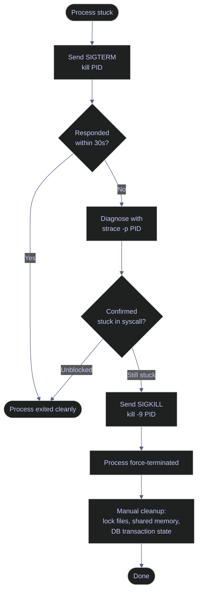

# Killing Processes — Graceful, Then Forceful

When a pipeline process is stuck — an infinite loop, a hanging database connection, a deadlocked worker — you need to terminate it. The order of escalation matters: graceful first (let the process clean up), forceful only as a last resort. `kill -9` without trying SIGTERM first causes data corruption, orphaned lock files, and unrolled transactions.

> [!quote]
> "If SIGTERM is asking a process to leave the building, SIGKILL is the operating system dropping a concrete block on it."
>
> — Unix sysadmin proverb

## Linux kill, pkill, killall tools

Linux provides three main tools for process termination: `kill` sends signals by PID, `pkill` matches by name or full command-line pattern, and `killall` targets all processes sharing a given name. The section below covers each tool, the correct escalation sequence, and post-kill cleanup.



### Linux | kill | send signals by PID

`kill` sends a signal to a process identified by its PID. Without a signal number, it defaults to SIGTERM (signal 15), asking the process to shut down gracefully. The process can catch this signal and run cleanup logic before exiting. SIGKILL (signal 9) cannot be caught or ignored — the kernel terminates the process immediately.

SIGTERM gives the process time to flush buffers, close file handles, commit or rollback database transactions, release locks, and write a clean shutdown message to logs. Docker uses the same SIGTERM→SIGKILL escalation — see [container-lifecycle](https://alp78.github.io/elysium/09-Docker/container-lifecycle). Always try SIGTERM first and wait 10–30 seconds for the process to respond.

#### Send SIGTERM — request graceful shutdown

```bash
kill <PID>
```

#### Send explicit SIGTERM — retry with signal number

Sometimes re-sending with the explicit signal number `-15` unblocks a process that missed the first signal.

```bash
kill -15 <PID>
```

#### Send SIGKILL — force terminate immediately

The kernel terminates the process with no opportunity to clean up. Only use this after SIGTERM has failed.

> [!danger] SIGKILL leaves resources in an inconsistent state
>
> The kernel terminates the process immediately — no chance to clean up:
> - Open files may be corrupted (half-written)
> - Database transactions are NOT rolled back (the DB server handles recovery later)
> - Lock files are NOT removed (manual cleanup needed)
> - Shared memory segments are NOT freed
>
> Only use `-9` when SIGTERM does not work after waiting 10–30 seconds.

> [!success] Always exhaust SIGTERM and strace before forcing
>
> Run `kill <PID>` first. If no response, use `strace -p <PID>` to inspect what syscall the process is waiting on — if it is blocked on a network read, the issue may be a remote server, not the local process. Only then escalate to `kill -9 <PID>`.

```bash
kill -9 <PID>
```

| Flag | Syntax | Description |
|---|---|---|
| (none) | `kill <PID>` | Send SIGTERM (signal 15) — graceful shutdown request |
| `-15` | `kill -15 <PID>` | Explicit SIGTERM — same as default |
| `-9` | `kill -9 <PID>` | Send SIGKILL — force terminate immediately |
| `-1` | `kill -1 <PID>` | Send SIGHUP — reload config (daemons) without stopping |
| `-2` | `kill -2 <PID>` | Send SIGINT — equivalent to pressing Ctrl+C |
| `-19` | `kill -19 <PID>` | Send SIGSTOP — pause process execution |
| `-18` | `kill -18 <PID>` | Send SIGCONT — resume a stopped process |
| `-l` | `kill -l` | List all available signal names and numbers |

### Linux | pkill | kill by name or pattern

`pkill` finds processes by name or command-line pattern and sends them a signal without requiring you to look up a PID first.

#### Kill by full command-line pattern

Using `-f` matches against the full command line string, not just the process name. This is the safest way to target a specific script or invocation.

> [!danger] pkill without -f is dangerously broad
>
> `pkill` without `-f` matches only the first 15 characters of the process name. `pkill python` kills every Python process on the system.

> [!success] Use -f to match the full command line
>
> `pkill -f "python run_pipeline"` matches only the exact script invocation, leaving other Python processes untouched.

```bash
pkill -f "python run_pipeline"
```

#### Send SIGKILL with pkill

Pass `-9` to send SIGKILL instead of the default SIGTERM.

```bash
pkill -9 -f "python run_pipeline"
```

#### Kill by process name (simple match)

Matches the process name (first 15 characters). Use only when you are certain no other processes share the same name.

```bash
pkill python3
```

| Flag | Syntax | Description |
|---|---|---|
| `-f` | `pkill -f "<pattern>"` | Match against full command line, not just process name |
| `-9` | `pkill -9 -f "<pattern>"` | Send SIGKILL instead of SIGTERM |
| `-15` | `pkill -15 -f "<pattern>"` | Explicit SIGTERM |
| `-u` | `pkill -u <user> <name>` | Kill processes owned by a specific user |
| `-g` | `pkill -g <PGID> <name>` | Kill processes in a specific process group |
| `-n` | `pkill -n <name>` | Kill only the newest (most recently started) matching process |
| `-o` | `pkill -o <name>` | Kill only the oldest matching process |
| `-x` | `pkill -x <name>` | Exact match: process name must match pattern exactly |
| `-l` | `pkill -l -f "<pattern>"` | List matching processes without killing (dry run) |
| `-e` | `pkill -e -f "<pattern>"` | Print the name and PID of the killed process |

### Linux | killall | kill all processes by name

`killall` sends a signal to all processes sharing a given name. Use it when you deliberately want to stop every instance of a program.

#### Kill all processes with a given name

```bash
killall python3
```

> [!warning] killall differs on macOS / BSD
>
> On Linux, `killall python3` kills all processes named `python3`. On macOS/BSD, `killall` with no arguments kills **every process you own**. Prefer `pkill -f` for portability across platforms.

> [!success] Use pkill -f for portable cross-platform scripting
>
> Replace `killall <name>` with `pkill -f "<name>"` in scripts that may run on both Linux and macOS. The behavior is consistent and the pattern match is more precise.

#### Kill all instances with SIGKILL

```bash
killall -9 python3
```

| Flag | Syntax | Description |
|---|---|---|
| (none) | `killall <name>` | Send SIGTERM to all processes named `<name>` |
| `-9` | `killall -9 <name>` | Send SIGKILL to all matching processes |
| `-15` | `killall -15 <name>` | Explicit SIGTERM |
| `-u` | `killall -u <user> <name>` | Limit to processes owned by a specific user |
| `-i` | `killall -i <name>` | Interactive mode — prompt before each kill |
| `-e` | `killall -e <name>` | Exact match on process name |
| `-r` | `killall -r <pattern>` | Match process names by regex |
| `-w` | `killall -w <name>` | Wait for all killed processes to die before returning |

### Linux | kill — -PGID | kill a process group

A negative PID in `kill` signals the entire process group — the parent process and all its children. Use this to stop a bash script that spawned multiple subprocesses in one command. Find the PGID with `ps -o pid,pgid,cmd -p <PID>`.

#### Find the PGID of a process

```bash
ps -o pid,pgid,cmd -p <PID>
```

```text
  PID  PGID CMD
 4812  4812 bash run_etl.sh
 4813  4812 python ingest.py
 4814  4812 python transform.py
```

#### Kill the entire process group

```bash
kill -- -<PGID>
```

| Flag | Syntax | Description |
|---|---|---|
| (none) | `kill -- -<PGID>` | Send SIGTERM to every process in the group |
| `-9` | `kill -9 -- -<PGID>` | Send SIGKILL to every process in the group |

### Linux | SIGTERM → strace → SIGKILL | kill escalation sequence

The correct procedure for killing a stuck process follows three stages: ask gracefully, diagnose if unresponsive, then force. Skipping the diagnosis step means using `kill -9` blindly — which can mask the root cause (network timeout, deadlock, disk full) and leave corrupted state behind.

#### Step 1 — Send SIGTERM and wait

```bash
kill <PID>
```

#### Step 2 — Diagnose with strace if no response

`strace -p <PID>` attaches to the running process and streams every system call it makes. If it is blocked in `read()` on a socket, the cause is network or a remote server. If it is looping in `futex()`, a mutex is contended.

```bash
strace -p <PID>
```

```text
strace: Process 4812 attached
read(5, 0x7f3b2c001230, 4096)           = ? ERESTARTSYS (To be restarted if SA_RESTART is set)
```

#### Step 3 — Send SIGKILL after confirming stuck

```bash
kill -9 <PID>
```

#### Step 4 — Clean up after force kill

> [!warning] Manual cleanup required after kill -9
>
> After `kill -9`, the following artifacts may remain:
> - Lock files left in `/var/run/`, `/tmp/`, or the application's data directory
> - Shared memory segments: list with `ipcs -m`, remove with `ipcrm -m <shmid>`
> - Incomplete file writes: check file sizes and checksums
> - Database transaction state: look for open transactions in `sys.dm_exec_sessions` — see [deadlock-detection-and-prevention](https://alp78.github.io/elysium/04-SQL-Server/03-Query-Writing-and-Optimization/deadlock-detection-and-prevention) for SQL Server KILL session handling

> [!success] Post-kill cleanup checklist
>
> 1. `ls /var/run/<appname>/` — remove any `.pid` or `.lock` files
> 2. `ipcs -m` — identify shared memory segments by the dead process's UID
> 3. `ipcrm -m <shmid>` — remove each orphaned segment
> 4. Verify the resource is released: `lsof | grep <filename>` should return empty

## PowerShell Stop-Process tools

PowerShell provides `Stop-Process` as the primary mechanism for terminating processes. Without `-Force` it sends a close request (equivalent to SIGTERM), giving the process a chance to handle shutdown. With `-Force` it terminates immediately (equivalent to SIGKILL). Use `Get-Process` with `Where-Object` to filter by command line when targeting a specific script instance.

### PowerShell | Stop-Process | graceful and forced termination

`Stop-Process` targets processes by PID (`-Id`) or name (`-Name`). The `-Force` flag bypasses the graceful close request and terminates immediately.

#### Terminate by PID — graceful

```powershell
Stop-Process -Id <PID>
```

#### Terminate by PID — forced

```powershell
Stop-Process -Id <PID> -Force
```

#### Terminate with confirmation prompt

`-Confirm` pauses before each kill and prompts the operator to confirm.

```powershell
Get-Process -Name "python" | Stop-Process -Confirm
```

| Flag | Syntax | Description |
|---|---|---|
| `-Id` | `Stop-Process -Id <PID>` | Target a specific process by PID |
| `-Name` | `Stop-Process -Name "<name>"` | Target all processes matching the given name |
| `-Force` | `Stop-Process -Id <PID> -Force` | Terminate immediately without a graceful close request |
| `-Confirm` | `Stop-Process -Name "<name>" -Confirm` | Prompt for confirmation before each termination |
| `-WhatIf` | `Stop-Process -Name "<name>" -WhatIf` | Dry run — show what would be stopped without acting |
| `-PassThru` | `Stop-Process -Id <PID> -PassThru` | Return the process object after stopping it |
| `-ErrorAction` | `Stop-Process -Id <PID> -ErrorAction SilentlyContinue` | Suppress errors when the process does not exist |

### PowerShell | Get-Process | filter and kill by command line

`Stop-Process -Name` kills every process matching the name, which is equivalent to `killall` — it does not distinguish between multiple instances of the same program. Use `Get-Process` with `Where-Object` to filter by `CommandLine` before piping to `Stop-Process`.

#### Kill a specific script by command-line pattern

> [!warning] Stop-Process -Name kills all matching processes
>
> `Stop-Process -Name "python"` terminates every Python process on the system, regardless of which script it is running.

> [!success] Filter by CommandLine to target a specific instance
>
> Pipe `Get-Process` through `Where-Object { $_.CommandLine -like "*run_pipeline*" }` to restrict the kill to the exact script invocation.

```powershell
Get-Process | Where-Object { $_.CommandLine -like "*run_pipeline*" } |
    Stop-Process -Force
```

#### List processes matching a pattern before killing (dry run)

```powershell
Get-Process | Where-Object { $_.CommandLine -like "*run_pipeline*" } |
    Select-Object Id, ProcessName, CommandLine
```

```text
  Id ProcessName CommandLine
---- ----------- -----------
4812 python      python run_pipeline.py --env prod
```

> [!info] CommandLine property requires elevated privileges on Windows
>
> `$_.CommandLine` is populated only when the PowerShell session is running as Administrator. In non-elevated sessions the property is `$null` and the `Where-Object` filter will match nothing.

| Flag / Property | Syntax | Description |
|---|---|---|
| `CommandLine` | `$_.CommandLine -like "*pattern*"` | Filter by full command-line string (requires elevation) |
| `Id` | `$_.Id` | Process PID — pipe to `Stop-Process -Id` |
| `CPU` | `$_.CPU` | CPU seconds consumed — useful for identifying runaway processes |
| `WorkingSet` | `$_.WorkingSet` | Physical memory in bytes |

## Related
- [viewing-processes](https://alp78.github.io/elysium/01-Shell/Process-Management/viewing-processes) — find the PID before killing
- [managing-services](https://alp78.github.io/elysium/01-Shell/Process-Management/managing-services) — use `systemctl stop` for services (cleaner than `kill`)
- [system-resources](https://alp78.github.io/elysium/01-Shell/Process-Management/system-resources) — confirm resource is released after killing

