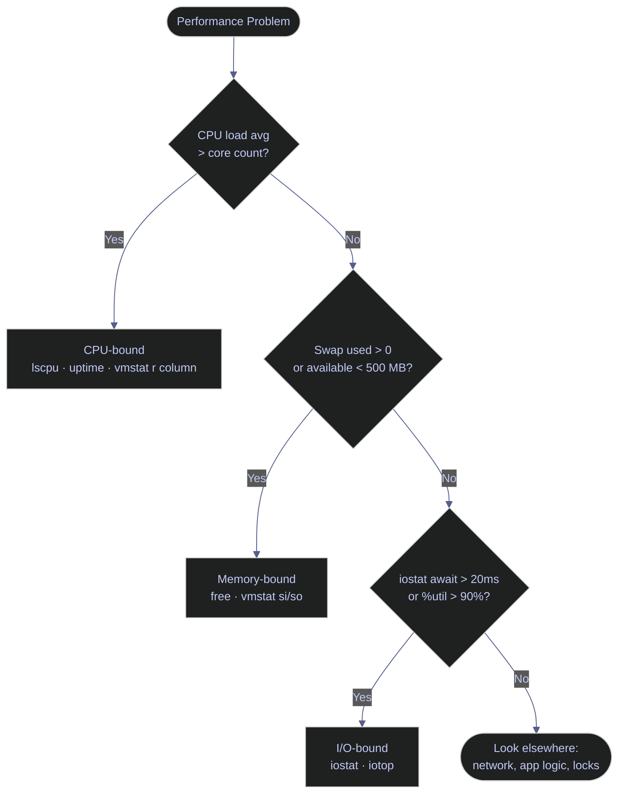

# System Resources — Memory, CPU, and Disk I/O

Resource monitoring tells you whether performance problems are CPU-bound, memory-constrained, or I/O-limited — three different root causes requiring completely different fixes. Reading the numbers correctly is as important as knowing which commands to run.

> [!quote]
> "Memory is like an orgasm. It's a lot better if you don't have to fake it."
>
> — **Seymour Cray** (on virtual memory)
>
> "Anyone can build a fast CPU. The trick is to build a fast system."
>
> — **Seymour Cray**, attributed remark (c. 1980s)

The diagram below shows how CPU, memory, and disk I/O relate as diagnostic layers. Each bottleneck type requires a different set of commands to isolate.



## Linux memory tools

Linux provides several commands for inspecting memory consumption, swap usage, and buffer cache behavior. The most important concept is the distinction between "free" and "available" memory: Linux aggressively uses free RAM as a disk cache (`buff/cache`), which accelerates reads but makes raw `free` figures misleading.

### Linux | free | memory usage and available RAM

`free` reports total, used, free, shared, buffer/cache, and available memory. The `available` column is the authoritative figure: it represents free memory plus reclaimable buffer/cache — the amount new processes can actually allocate without triggering swap.

#### Display memory in human-readable units

The `-h` flag converts bytes to GB/MB automatically. Without it, output is in kibibytes (1 kibibyte = 1024 bytes).

```bash
free -h
```

```text
               total        used        free      shared  buff/cache   available
Mem:            31Gi        18Gi       1.2Gi       512Mi        12Gi        12Gi
Swap:          2.0Gi          0B       2.0Gi
```

The `available` column (12 GB here) is the correct measure of usable memory. The `free` column (1.2 GB) appears low but is not alarming because the 12 GB in `buff/cache` is reclaimable on demand.

> [!warning] OOM risk threshold
>
> If `available` drops below 500 MB on a database server, the Linux OOM (Out-Of-Memory) killer may begin terminating processes to reclaim memory. The OOM killer does not discriminate — it targets whichever process has the highest OOM score, which may be your database daemon.

> [!success] Verify OOM activity
>
> Check whether the OOM killer has already fired: `sudo dmesg | grep -i "oom\|killed process"`. If entries appear, cross-reference the PID in `/var/log/syslog` or `journalctl -k` to identify which process was terminated and at what time.

> [!warning] Swap pressure indicator
>
> If `Swap used` is greater than 0, the kernel is already paging memory to disk. Swap I/O is orders of magnitude slower than RAM access (microseconds vs milliseconds), causing noticeable latency spikes in any workload that touches swapped pages.

> [!success] Reduce swap pressure
>
> Reduce `vm.swappiness` (default: 60) to make the kernel prefer reclaiming cache before swapping: `sudo sysctl vm.swappiness=10`. For database servers, a value of 1–10 is common. Persist by adding `vm.swappiness=10` to `/etc/sysctl.conf`.

#### Display memory in megabytes

The `-m` flag outputs values in mebibytes (MiB, 1 MiB = 1,048,576 bytes), useful when scripting thresholds against integer values.

```bash
free -m
```

```text
               total        used        free      shared  buff/cache   available
Mem:           31874       18432        1228         512       12214       12934
Swap:           2047           0        2047
```

#### Show running total updated every N seconds

The `-s` flag repeats the output at a fixed interval, similar to `watch`. Useful for observing memory consumption during a specific operation.

```bash
free -h -s 2
```

```text
               total        used        free      shared  buff/cache   available
Mem:            31Gi        18Gi       1.2Gi       512Mi        12Gi        12Gi
Swap:          2.0Gi          0B       2.0Gi

               total        used        free      shared  buff/cache   available
Mem:            31Gi        19Gi       0.9Gi       512Mi        12Gi        11Gi
Swap:          2.0Gi          0B       2.0Gi
```

| Flag | Syntax | Description |
|---|---|---|
| `-h` | `free -h` | Human-readable output (KB/MB/GB) |
| `-m` | `free -m` | Output in mebibytes |
| `-g` | `free -g` | Output in gibibytes |
| `-s N` | `free -h -s 2` | Repeat output every N seconds |
| `-c N` | `free -h -c 5` | Repeat N times then exit |
| `-t` | `free -h -t` | Add a totals row (Mem + Swap combined) |
| `-w` | `free -h -w` | Wide output: split buffers and cache into separate columns |

### Linux | free | SQL Server memory interpretation

SQL Server on Linux intentionally acquires and holds as much RAM as its configured `max server memory` ceiling allows. It uses this memory as a buffer pool cache for data pages — keeping frequently accessed data in memory to avoid disk reads. This behavior causes `free -h` to show nearly all memory as "used," which looks alarming but is correct and expected.

The right question is not "why is memory used?" but "does SQL Server have enough memory?" The diagnostic for that is Page Life Expectancy (PLE), not `free`.

PLE measures how long a data page stays in the buffer pool before being evicted. A healthy PLE is above 300 seconds. A PLE below 60 seconds indicates SQL Server is constantly evicting and reloading pages from disk — a sign the buffer pool is undersized for the working set.

```sql
SELECT cntr_value AS PLE_seconds
FROM sys.dm_os_performance_counters
WHERE counter_name = 'Page life expectancy'
  AND object_name LIKE '%Buffer Manager%';
```

> [!warning] Low PLE threshold
>
> PLE below 60 seconds means SQL Server is reading data from disk on nearly every cache miss. At high query rates this causes severe I/O saturation and query timeouts, even on servers where `free -h` shows plenty of "available" memory.

> [!success] Increase SQL Server memory ceiling
>
> Raise `max server memory` in SQL Server to give the buffer pool more room. Leave at least 4 GB free for the OS on servers with 16–64 GB RAM, and at least 10% of total RAM on servers above 64 GB. See [max server memory configuration](https://alp78.github.io/elysium/04-SQL-Server/Administration/server-configuration) for the exact procedure. For buffer pool internals and cache hit ratios, see [memory-and-buffer-pool](https://alp78.github.io/elysium/04-SQL-Server/Performance/memory-and-buffer-pool).

## Linux CPU tools

CPU monitoring on Linux requires understanding two separate concepts: core capacity (how many parallel threads the system can run) and load average (how many processes are competing for those threads). These two figures together tell you whether the CPU is the bottleneck.

### Linux | lscpu | CPU topology and core count

`lscpu` reads `/proc/cpuinfo` and `/sys/devices/system/cpu/` to report the CPU architecture, socket count, core count, and thread count. The total parallel capacity of the system is: CPU(s) reported by `lscpu`, which equals sockets × cores per socket × threads per core.

#### Display full CPU topology

```bash
lscpu
```

```text
Architecture:            x86_64
  CPU op-mode(s):        32-bit, 64-bit
  Byte Order:            Little Endian
CPU(s):                  8
  On-line CPU(s) list:   0-7
Vendor ID:               GenuineIntel
  Model name:            Intel(R) Core(TM) i7-10700 CPU @ 2.90GHz
  Thread(s) per core:    2
  Core(s) per socket:    4
  Socket(s):             1
  NUMA node(s):          1
Caches (sum of all):
  L1d:                   128 KiB (4 instances)
  L1i:                   128 KiB (4 instances)
  L2:                    1 MiB (4 instances)
  L3:                    16 MiB (1 instance)
```

The key number is `CPU(s): 8`. This system can execute 8 threads simultaneously. Any load average exceeding 8.0 means processes are queuing for CPU time.

### Linux | uptime | load average over time

`uptime` reports system uptime and the 1-minute, 5-minute, and 15-minute load averages. Load average counts the number of processes in runnable or uninterruptible-wait state averaged over each time window. It is not a percentage — it is a raw process count.

#### Check current load average

```bash
uptime
```

```text
 14:23:11 up 12 days,  3:47,  2 users,  load average: 1.42, 2.15, 3.08
```

On an 8-core system, the figures above mean: over the last minute 1.42 processes were running or waiting (18% utilized), over the last 5 minutes 2.15 (27%), and over the last 15 minutes 3.08 (39%). The trend is decreasing — load is falling, not building. If the 1-minute value were higher than the 15-minute value, load would be increasing.

> [!warning] Load average exceeds core count
>
> When load average exceeds the CPU count (e.g., load 10.5 on an 8-core machine), processes are actively queueing for CPU time. Response times degrade non-linearly: at 125% utilization (load 10 on 8 cores), queue length grows faster than throughput, causing compounding delays.

> [!success] Identify the CPU consumers
>
> Run `top` or `ps aux --sort=-%cpu | head -20` to identify which processes are driving the load. If the runnable queue (`r` column in `vmstat`) is consistently above the core count, either scale horizontally or reduce the concurrency of the offending workload.

| Flag | Syntax | Description |
|---|---|---|
| (none) | `uptime` | Print uptime and 1/5/15-minute load averages |
| `-p` | `uptime -p` | Pretty-print uptime only (e.g., "up 12 days, 3 hours") |
| `-s` | `uptime -s` | Print system boot time in `YYYY-MM-DD HH:MM:SS` format |

## Linux combined resource tools

Some tools report CPU, memory, and I/O together in a single view. These are most useful for quick triage when you do not yet know which resource is the bottleneck.

### Linux | vmstat | CPU, memory, and I/O snapshot

`vmstat` (virtual memory statistics) reports a combined snapshot of process scheduling, memory pages, swap activity, block I/O, and CPU time. Each row represents the average state of the system over the sampling interval. The first row is always a summary since boot — ignore it and focus on subsequent rows.

#### Sample system state at a fixed interval

The two positional arguments are the interval in seconds and the number of samples. Omitting the sample count runs indefinitely until interrupted.

```bash
vmstat 2 5
```

```text
procs -----------memory---------- ---swap-- -----io---- -system-- ------cpu-----
 r  b   swpd   free   buff  cache   si   so    bi    bo   in   cs us sy id wa st
 1  0      0 1254812 102400 12582912  0    0    18   124  420  890  8  2 88  2  0
 2  0      0 1198032 102400 12582912  0    0     0   256  512 1024 12  3 83  2  0
 0  0      0 1201344 102400 12582912  0    0     0    64  380  780  5  1 93  1  0
 1  0      0 1199080 102400 12582912  0    0     0   128  490  960  9  2 87  2  0
 0  0      0 1200000 102400 12582912  0    0     0    96  400  820  6  1 92  1  0
```

Column meanings:
- `r` — processes currently runnable (in the CPU run queue). Sustained values above the core count indicate CPU saturation.
- `b` — processes blocked waiting for I/O. Values above 2–3 indicate I/O saturation.
- `si` / `so` — kilobytes per second swapped in from disk / swapped out to disk. Any non-zero value indicates memory pressure; consistent values above 100 KB/s indicate severe pressure.
- `us` / `sy` — percentage of CPU time in user space / kernel space. High `sy` (above 30%) with low `us` suggests excessive system calls or kernel overhead.
- `wa` — percentage of CPU time spent waiting for I/O to complete. Values above 20% indicate a disk bottleneck.
- `st` — percentage of CPU time "stolen" by the hypervisor on a virtual machine. Any non-zero value means the VM is competing for physical CPU with other guests on the same host.

> [!warning] Swap I/O present
>
> Non-zero `si` or `so` values mean the kernel is actively reading from or writing to swap space on disk. Each swap operation involves a disk I/O that takes milliseconds — orders of magnitude slower than RAM access — causing latency spikes in any process that touches swapped pages.

> [!success] Eliminate swap I/O
>
> Add RAM, reduce `vm.swappiness`, or identify and terminate or limit the process consuming the most memory. Use `free -h` to confirm available memory after the fix.

| Flag | Syntax | Description |
|---|---|---|
| `-a` | `vmstat -a` | Show active/inactive memory instead of buff/cache |
| `-d` | `vmstat -d` | Report disk statistics only |
| `-s` | `vmstat -s` | Print memory event counters as a summary table |
| `-t` | `vmstat 2 5 -t` | Add a timestamp column to each row |
| `-S m` | `vmstat -S m` | Output memory columns in mebibytes |
| `interval` | `vmstat 2` | Sample every 2 seconds (runs until interrupted) |
| `interval count` | `vmstat 2 5` | Sample every 2 seconds, stop after 5 samples |

## Linux disk I/O tools

Disk I/O monitoring requires two separate views: the device-level throughput and latency view (from `iostat`) and the process-level view of which application is generating the I/O (from `iotop`).

### Linux | iostat | disk I/O performance and utilization

`iostat` is part of the `sysstat` package and reads I/O statistics from `/proc/diskstats`. The `-x` flag expands the output to include latency and utilization metrics. The `-z` flag suppresses devices with zero activity, keeping the output focused on active disks.

#### Extended disk statistics at a fixed interval

```bash
iostat -xz 2
```

```text
Device            r/s     w/s     rkB/s     wkB/s   rrqm/s   wrqm/s  %rrqm  %wrqm r_await w_await aqu-sz rareq-sz wareq-sz  svctm  %util
sda              0.50   45.20      6.40   2304.00     0.00    12.40   0.00  21.50    0.80    8.20   0.37    12.80    50.97   0.42   1.93
nvme0n1          2.10  120.50    128.00   8960.00     0.00     8.20   0.00   6.37    0.30    1.20   0.15    60.95    74.36   0.18   2.21
```

Column meanings:
- `r/s` / `w/s` — read and write operations per second. High values indicate a busy device but do not alone indicate saturation.
- `rkB/s` / `wkB/s` — read and write throughput in kilobytes per second. Compare against the device's rated sequential bandwidth to assess saturation.
- `r_await` / `w_await` — average time in milliseconds from I/O request submission to completion, including queue time. For SSDs: below 1 ms is excellent, 1–5 ms is normal, above 20 ms indicates saturation. For HDDs: 5–15 ms is normal, above 50 ms indicates saturation.
- `aqu-sz` — average I/O queue depth. A sustained queue depth above 1.0 on a single device indicates more requests are arriving than the device can service immediately.
- `%util` — percentage of time the device had at least one I/O request in progress. Values above 90% indicate the device is at or near saturation; no amount of CPU or memory tuning will resolve latency caused by a saturated disk.

> [!warning] Disk saturation threshold
>
> `%util` above 90% means the device is busy nearly 100% of the time. Additional I/O requests queue behind existing ones, compounding latency. For SSDs with a native command queue depth above 1, `%util` can reach 100% while the device is still performing — in that case, monitor `aqu-sz` and `await` instead.

> [!success] Identify the I/O source
>
> Run `iotop -o` to identify which process is generating the I/O. If a database is the culprit, check whether it is doing full table scans (missing indexes), sorting on disk (insufficient `sort_buffer_size` / `tempdb` space), or performing large bulk loads.

| Flag | Syntax | Description |
|---|---|---|
| `-x` | `iostat -x` | Extended statistics (await, %util, queue depth) |
| `-z` | `iostat -z` | Suppress devices with zero activity |
| `-d` | `iostat -d` | Show disk stats only (suppress CPU summary) |
| `-m` | `iostat -m` | Output in megabytes per second instead of kilobytes |
| `-k` | `iostat -k` | Output in kilobytes per second (default) |
| `-t` | `iostat -xt 2` | Add timestamp to each report |
| `interval` | `iostat -xz 2` | Sample every 2 seconds |
| `interval count` | `iostat -xz 2 5` | Sample every 2 seconds, 5 samples then exit |

### Linux | iotop | per-process disk I/O

`iotop` shows which processes are generating disk I/O at the moment of inspection. It requires root privileges because it reads per-process I/O accounting from the kernel. The `-o` flag restricts output to processes with active I/O, keeping the display uncluttered.

#### Show only processes with active I/O

```bash
sudo iotop -o
```

```text
Total DISK READ:       128.00 K/s | Total DISK WRITE:      8.96 M/s
Current DISK READ:     128.00 K/s | Current DISK WRITE:    8.96 M/s
  TID  PRIO  USER     DISK READ  DISK WRITE  SWAPIN     IO>    COMMAND
 4821 be/4 mssql      0.00 B/s    8.64 M/s  0.00 %  2.14 %  sqlservr
 1234 be/4 root       128.00 K/s   0.00 B/s  0.00 %  0.14 %  jbd2/sda1-8
```

The `IO>` column shows the percentage of time the process spent waiting for I/O to complete. High values (above 5%) indicate the process is I/O-bound. The SWAPIN column shows the percentage of time spent waiting for swapped-out pages to be read back into RAM — any non-zero value indicates memory pressure.

| Flag | Syntax | Description |
|---|---|---|
| `-o` | `sudo iotop -o` | Show only processes with active I/O |
| `-b` | `sudo iotop -b` | Batch mode (non-interactive, useful for logging) |
| `-n N` | `sudo iotop -b -n 5` | Exit after N iterations (batch mode only) |
| `-d N` | `sudo iotop -d 2` | Set sampling interval to N seconds |
| `-p PID` | `sudo iotop -p 4821` | Monitor a specific process by PID |
| `-u USER` | `sudo iotop -u mssql` | Filter by username |

## PowerShell memory tools

PowerShell on Windows accesses memory statistics through WMI/CIM classes and Performance Monitor counters. The equivalent of Linux `free` is `Get-CimInstance Win32_OperatingSystem`, which exposes total and free physical memory.

### PowerShell | Get-CimInstance | memory usage and available RAM

`Get-CimInstance` queries the Common Information Model (CIM) repository, which on Windows is backed by WMI (Windows Management Instrumentation). The `Win32_OperatingSystem` class reports OS-level memory metrics: total physical RAM, free physical RAM, total virtual memory (RAM + page file), and free virtual memory.

#### Report total, free, and used memory

Memory values in `Win32_OperatingSystem` are returned in kibibytes. Dividing by 1MB (1048576) converts to gibibytes.

```powershell
$os = Get-CimInstance Win32_OperatingSystem
[PSCustomObject]@{
    'Total (GB)' = [math]::Round($os.TotalVisibleMemorySize / 1MB, 1)
    'Free (GB)'  = [math]::Round($os.FreePhysicalMemory / 1MB, 1)
    'Used %'     = [math]::Round((1 - $os.FreePhysicalMemory / $os.TotalVisibleMemorySize) * 100)
}
```

```text
Total (GB) Free (GB) Used %
---------- --------- ------
      31.9       8.4     74
```

`Used %` of 74% indicates 74% of physical RAM is allocated. On a dedicated server this is healthy; the OS and applications are using RAM productively. Values above 95% with active paging (non-zero page faults/sec in Performance Monitor) indicate memory pressure.

> [!warning] Windows page file activity
>
> Unlike Linux, Windows uses a page file (`pagefile.sys`) on the system drive. Sustained page file reads indicate the working set exceeds physical RAM. Monitor `\Memory\Pages/sec` via `Get-Counter` — values consistently above 1000 pages/sec indicate heavy paging.

> [!success] Diagnose paging
>
> Run `Get-Counter '\Memory\Pages/sec' -SampleInterval 2 -MaxSamples 10` to capture a 20-second sample. If the average exceeds 1000, identify the top memory consumers with `Get-Process | Sort-Object WorkingSet64 -Descending | Select-Object -First 10`.

| Flag/Parameter | Syntax | Description |
|---|---|---|
| `-ClassName` | `Get-CimInstance Win32_OperatingSystem` | Query a specific CIM class |
| `-ComputerName` | `Get-CimInstance Win32_OperatingSystem -ComputerName srv01` | Query a remote computer |
| `-Filter` | `Get-CimInstance Win32_Process -Filter "Name='sqlservr.exe'"` | Filter results using WQL syntax |
| `-Property` | `Get-CimInstance Win32_OperatingSystem -Property FreePhysicalMemory` | Return only specified properties |

## PowerShell CPU tools

Windows Performance Monitor counters provide CPU utilization data equivalent to Linux `uptime` and `vmstat`. `Get-Counter` reads these counters at a specified interval and returns strongly typed objects, making them suitable for scripting and alerting.

### PowerShell | Get-Counter | CPU utilization over time

`Get-Counter` reads Windows Performance Monitor counter paths. The `\Processor(_Total)\% Processor Time` counter measures the percentage of time all logical processors spent executing non-idle threads, averaged over the sampling interval.

#### Sample total CPU utilization

The `-SampleInterval` and `-MaxSamples` parameters mirror `vmstat`'s interval and count arguments.

```powershell
Get-Counter '\Processor(_Total)\% Processor Time' -SampleInterval 2 -MaxSamples 5
```

```text
Timestamp                 CounterSamples
---------                 --------------
4/3/2026 2:23:11 PM       \\server01\processor(_total)\% processor time :
                          18.432167

4/3/2026 2:23:13 PM       \\server01\processor(_total)\% processor time :
                          24.817340

4/3/2026 2:23:15 PM       \\server01\processor(_total)\% processor time :
                          12.003201
```

Values represent the percentage of CPU time spent executing non-idle code across all logical processors. Below 70% is generally healthy for a server under typical load. Sustained values above 85% indicate the CPU is a bottleneck. Values that remain at or near 100% indicate the server is CPU-saturated and new requests are queuing.

> [!warning] Sustained CPU above 85%
>
> Sustained CPU utilization above 85% means the scheduler has little headroom for bursts. Any spike in query load, background job, or OS activity will cause response time degradation. On a SQL Server host, high CPU combined with low PLE is a sign of missing query plan caching or missing indexes causing repeated recompilation.

> [!success] Identify the CPU consumer
>
> Run `Get-Process | Sort-Object CPU -Descending | Select-Object -First 10 Name, CPU, WorkingSet64` to identify the top processes by cumulative CPU time. For SQL Server workloads, check `sys.dm_exec_query_stats` for queries with the highest `total_worker_time`.

#### Sample per-core CPU utilization

Monitoring individual cores (rather than the total) reveals whether load is evenly distributed or concentrated on a single core — the latter indicates a single-threaded workload.

```powershell
Get-Counter '\Processor(*)\% Processor Time' -SampleInterval 2 -MaxSamples 3
```

```text
Timestamp                 CounterSamples
---------                 --------------
4/3/2026 2:23:11 PM       \\server01\processor(0)\% processor time : 42.1
                          \\server01\processor(1)\% processor time : 18.3
                          \\server01\processor(2)\% processor time : 67.8
                          \\server01\processor(3)\% processor time : 12.0
                          \\server01\processor(_total)\% processor time : 35.1
```

Core 2 at 67.8% while others are under 20% indicates a single-threaded workload pinned to that core. This is typical of an application that does not use parallel threads.

| Parameter | Syntax | Description |
|---|---|---|
| `-SampleInterval` | `-SampleInterval 2` | Seconds between samples (default: 1) |
| `-MaxSamples` | `-MaxSamples 5` | Stop after N samples |
| `-Continuous` | `-Continuous` | Sample indefinitely until interrupted |
| `-ComputerName` | `-ComputerName srv01` | Query a remote computer |

## PowerShell disk I/O tools

Windows disk I/O monitoring uses Performance Monitor counters for device-level throughput and latency, equivalent to Linux `iostat`. For per-process I/O, `Get-Process` provides cumulative read/write byte counts, though it lacks `iotop`'s real-time delta view.

### PowerShell | Get-Counter | disk I/O performance

The `\PhysicalDisk` counter set provides read/write operations per second, throughput in bytes per second, and average I/O latency — the same metrics as `iostat -x`. The `(*)` wildcard captures all physical disks simultaneously.

#### Sample disk throughput and latency

```powershell
Get-Counter '\PhysicalDisk(*)\Disk Reads/sec',
            '\PhysicalDisk(*)\Disk Writes/sec',
            '\PhysicalDisk(*)\Avg. Disk sec/Read',
            '\PhysicalDisk(*)\Avg. Disk sec/Write' `
    -SampleInterval 2 -MaxSamples 5
```

```text
Timestamp                 CounterSamples
---------                 --------------
4/3/2026 2:23:11 PM       \\server01\physicaldisk(0 c:)\disk reads/sec : 2.47
                          \\server01\physicaldisk(0 c:)\disk writes/sec : 48.32
                          \\server01\physicaldisk(0 c:)\avg. disk sec/read : 0.000312
                          \\server01\physicaldisk(0 c:)\avg. disk sec/write : 0.001024
                          \\server01\physicaldisk(_total)\disk reads/sec : 2.47
                          \\server01\physicaldisk(_total)\disk writes/sec : 48.32
```

`Avg. Disk sec/Read` and `Avg. Disk sec/Write` are in seconds. The read latency of 0.000312 seconds is 0.31 ms — excellent for an SSD. The write latency of 0.001024 seconds is 1.02 ms — also healthy. Values above 0.020 seconds (20 ms) for reads or writes indicate disk saturation.

> [!warning] High disk latency on Windows
>
> `Avg. Disk sec/Read` or `Avg. Disk sec/Write` above 0.020 seconds (20 ms) indicates the disk queue is growing. The `\PhysicalDisk(*)\Avg. Disk Queue Length` counter confirms this: a sustained queue length above 2 per spindle (or above 32 on NVMe) indicates saturation.

> [!success] Narrow down the I/O source
>
> Add `'\PhysicalDisk(*)\Avg. Disk Queue Length'` to the counter list. Then cross-reference with `Get-Process | Sort-Object -Property @{Expression={$_.WorkingSet64}} -Descending` to find memory-heavy processes that may be triggering page file I/O. For SQL Server, check the `\SQLServer:Buffer Manager\Page reads/sec` counter.

#### Sample disk queue depth

```powershell
Get-Counter '\PhysicalDisk(*)\Avg. Disk Queue Length' -SampleInterval 2 -MaxSamples 5
```

```text
Timestamp                 CounterSamples
---------                 --------------
4/3/2026 2:23:11 PM       \\server01\physicaldisk(0 c:)\avg. disk queue length : 0.82
                          \\server01\physicaldisk(_total)\avg. disk queue length : 0.82
```

A queue length of 0.82 means the device is handling requests as fast as they arrive, with no meaningful backlog. Values above 2.0 on a single spinning disk or above 32 on an NVMe device indicate I/O saturation.

| Counter | Description |
|---|---|
| `\PhysicalDisk(*)\Disk Reads/sec` | Read operations per second per disk |
| `\PhysicalDisk(*)\Disk Writes/sec` | Write operations per second per disk |
| `\PhysicalDisk(*)\Avg. Disk sec/Read` | Average read latency in seconds |
| `\PhysicalDisk(*)\Avg. Disk sec/Write` | Average write latency in seconds |
| `\PhysicalDisk(*)\Avg. Disk Queue Length` | Average number of queued I/O requests |
| `\PhysicalDisk(*)\Disk Read Bytes/sec` | Read throughput in bytes per second |
| `\PhysicalDisk(*)\Disk Write Bytes/sec` | Write throughput in bytes per second |

## Related
- [viewing-processes](https://alp78.github.io/elysium/01-Shell/Process-Management/viewing-processes) — identify which processes are consuming the resources
- [killing-processes](https://alp78.github.io/elysium/01-Shell/Process-Management/killing-processes) — terminate runaway processes consuming excess resources
- [managing-services](https://alp78.github.io/elysium/01-Shell/Process-Management/managing-services) — check if OOM kills are crashing services
- [datadog-sql-server-integration](https://alp78.github.io/elysium/13-Observability/Datadog/datadog-sql-server-integration) — automated monitoring of CPU, memory, and disk I/O with alerting and dashboards
