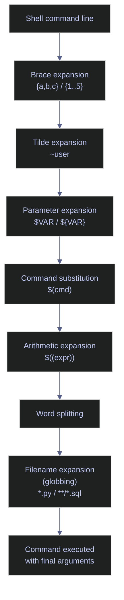

# Brace Expansion and Globbing — Generating Arguments Efficiently

Brace expansion and shell globbing let you generate multiple arguments from compact patterns, match files by name across directory trees, and write commands that would otherwise require loops — all in a single expression. Enabling the right `shopt` options unlocks recursive globbing and prevents dangerous silent failures.

> [!quote]
> "The order of expansions is: brace expansion, tilde expansion, parameter and variable expansion, command substitution, arithmetic expansion, word splitting, and filename expansion."
>
> — **Bash Reference Manual**, GNU



## Linux brace expansion tools

Brace expansion is a purely textual operation performed before any other shell expansion. The shell replaces a brace expression with a comma-separated or range-based list of words, then passes that list as individual arguments to the command. No files need to exist — brace expansion works on any string.

### Linux | brace expansion | commands

Brace expansion accepts two forms: comma-separated lists `{a,b,c}` and sequence ranges `{start..end}` (with an optional step `{start..end..step}`). Expressions can be nested and combined with prefix and suffix strings.

#### Create a nested directory tree in one command

The `mkdir -p` flag creates intermediate directories that do not yet exist. Combining it with nested brace expansion generates the full Cartesian product of the two sets.

```bash
mkdir -p data/{bronze,silver,gold}/{raw,staging,final}
```

```text
(no output — directories created silently)
```

This creates nine directories: `data/bronze/raw`, `data/bronze/staging`, `data/bronze/final`, `data/silver/raw`, `data/silver/staging`, `data/silver/final`, `data/gold/raw`, `data/gold/staging`, `data/gold/final`.

#### Generate a numeric sequence of filenames

The `{001..100}` range pads numbers with leading zeros when the first value is zero-padded. The shell expands this before `echo` or any command receives the argument list.

```bash
echo file{001..100}.parquet
```

```text
file001.parquet file002.parquet file003.parquet ... file100.parquet
```

#### Back up a file before editing

A comma with an empty right or left side exploits the fact that an empty string is a valid expansion member. The original filename becomes a prefix shared by both expansions.

```bash
cp config.yaml{,.bak}
```

```text
(no output — config.yaml.bak created silently)
```

This expands to `cp config.yaml config.yaml.bak`, producing a backup copy in one expression without retyping the filename.

#### Generate a stepped numeric range

The optional third component `{start..end..step}` controls the increment between values. This is useful for generating batch identifiers or partition keys.

```bash
echo partition_{0..100..10}
```

```text
partition_0 partition_10 partition_20 partition_30 partition_40 partition_50 partition_60 partition_70 partition_80 partition_90 partition_100
```

#### Create versioned copies of a file

Brace expansion can reference the same prefix with different suffixes in a single `cp` call, useful for creating versioned snapshots.

```bash
cp model.pkl{,.v1,.v2,.backup}
```

```text
(no output — model.pkl.v1, model.pkl.v2, model.pkl.backup created silently)
```

| Flag / Syntax | Example | Description |
|---|---|---|
| `{a,b,c}` | `echo {foo,bar,baz}` | Comma-separated list — expands to three separate words |
| `{n..m}` | `echo {1..5}` | Integer sequence from n to m inclusive |
| `{n..m..s}` | `echo {0..20..5}` | Stepped sequence — increments by s |
| `{00n..00m}` | `echo {001..010}` | Zero-padded sequence — preserves leading zeros |
| `{a..z}` | `echo {a..z}` | Alphabetic range — lowercase or uppercase |
| `prefix{a,b}suffix` | `echo file{A,B}.csv` | Shared prefix and suffix applied to each member |
| `{a,{b,c}}` | `echo {x,{y,z}}` | Nested expansion — produces `x y z` |

## Linux globbing tools

Standard globbing performs filename expansion: the shell replaces a pattern containing wildcard characters with the sorted list of matching filenames in the filesystem. Extended globbing (`extglob`) adds negation and quantifier patterns. `globstar` enables recursive traversal with `**`. `failglob` converts a no-match result from a silent pass-through into a fatal error.

### Linux | shopt | globbing options

The `shopt` built-in enables or disables optional shell behaviors. The globbing-related options must be set in `.bashrc` (for interactive sessions) or at the top of each script that relies on them.

#### Enable extended globbing patterns

`extglob` activates five pattern operators that are unavailable in standard globbing. These allow matching files that satisfy a pattern zero or more times, exactly once, or never.

```bash
shopt -s extglob
```

```text
(no output — option enabled silently)
```

Once enabled, the operators are:

| Operator | Meaning |
|---|---|
| `?(pattern)` | Match zero or one occurrence of pattern |
| `*(pattern)` | Match zero or more occurrences of pattern |
| `+(pattern)` | Match one or more occurrences of pattern |
| `@(pattern)` | Match exactly one occurrence of pattern |
| `!(pattern)` | Match anything that does NOT match pattern |

#### List all files excluding specific extensions

The `!(glob|glob)` operator is the practical workaround for the absence of a native `--exclude` flag in `ls`.

```bash
shopt -s extglob
ls !(*.log|*.tmp)
```

```text
config.yaml  main.py  requirements.txt  schema.sql
```

#### Delete all files except one

The `!(pattern)` form also works with `rm`. Enabling `extglob` first is mandatory — without it, the `!` is interpreted as a history expansion character.

```bash
shopt -s extglob
rm !(important.txt)
```

```text
(no output — all files except important.txt removed silently)
```

> [!warning] Forgetting extglob before using `!(pattern)`
>
> Running `rm !(important.txt)` without first enabling `extglob` causes the shell to interpret `!` as a history expansion operator. The command either errors out or expands unexpectedly.

> [!success] Always enable extglob explicitly before negation patterns
>
> ```bash
> shopt -s extglob
> rm !(important.txt)
> ```
>
> Add `shopt -s extglob` to `.bashrc` to make it permanent for interactive shells.

#### Enable recursive double-star glob

`globstar` makes `**` match zero or more directory levels, enabling recursive file searches without `find`.

```bash
shopt -s globstar
```

```text
(no output — option enabled silently)
```

#### Recursively match files by extension

With `globstar` enabled, `**/*.py` expands to every `.py` file in the current tree at any depth. Without it, `**` is treated as a literal two-character pattern.

```bash
shopt -s globstar
ls **/*.py
```

```text
etl/pipeline.py  etl/utils/helpers.py  models/train.py  tests/test_pipeline.py
```

#### Count lines across all SQL files recursively

`wc -l` accepts multiple filenames and reports a total. Feeding it a `**/*.sql` glob is more efficient than a `find | xargs` pipeline for simple counts.

```bash
shopt -s globstar
wc -l **/*.sql
```

```text
  142 queries/daily_agg.sql
   89 queries/index_weights.sql
   34 schema/init.sql
  265 total
```

#### Enable failglob to prevent dangerous no-match pass-through

By default, a glob pattern that matches nothing is passed through to the command unchanged as a literal string. `failglob` converts this silent pass-through into a shell error.

```bash
shopt -s failglob
```

```text
(no output — option enabled silently)
```

> [!danger] rm with an unmatched glob — silent data loss risk
>
> Without `failglob`, running `rm *.csv` in a directory that contains no CSV files passes the literal string `*.csv` to `rm`. If a file named `*.csv` happens to exist, it is deleted without warning. If none exists, `rm` prints "No such file or directory" — but in scripts using `set -e`, this terminates the entire script at an unexpected point.

> [!success] Enable failglob in all production scripts
>
> ```bash
> shopt -s failglob
> rm *.csv   # raises a shell error immediately if no .csv files exist
> ```
>
> Pair with `set -euo pipefail` at the top of every script for full error coverage.

#### Persistent shopt settings for .bashrc

These four options are safe to enable permanently in an interactive shell. Add them to `~/.bashrc` to avoid setting them in every script.

```bash
shopt -s extglob
shopt -s globstar
shopt -s failglob
shopt -s nocaseglob
shopt -s cdspell
```

`nocaseglob` makes glob patterns case-insensitive, which is useful on filesystems with mixed-case filenames. `cdspell` auto-corrects minor typos in `cd` arguments and is unrelated to globbing but commonly grouped here.

| Flag | Syntax | Description |
|---|---|---|
| `-s` | `shopt -s <option>` | Enable (set) the named shell option |
| `-u` | `shopt -u <option>` | Disable (unset) the named shell option |
| `-p` | `shopt -p` | Print all options with their current on/off state |
| `-q` | `shopt -q <option>` | Exit silently with 0 (enabled) or 1 (disabled) — for use in conditionals |

### Linux | globbing | standard wildcard patterns

Standard glob wildcards are available without any `shopt` setting. They expand against the current filesystem during filename expansion (the last phase of shell expansion).

| Pattern | Matches | Example |
|---|---|---|
| `*` | Any string of zero or more characters (within one path component) | `*.csv` matches `data.csv`, `sales_2025.csv` |
| `?` | Exactly one character | `file?.txt` matches `file1.txt`, `fileA.txt` |
| `[abc]` | One character from the set | `[abc].sh` matches `a.sh`, `b.sh`, `c.sh` |
| `[a-z]` | One character in the range | `log[0-9].txt` matches `log1.txt` through `log9.txt` |
| `[!abc]` | One character NOT in the set | `[!0-9]*.csv` — first char is not a digit |
| `**` | Any path including directory separators (requires `globstar`) | `**/*.py` matches all `.py` at any depth |

## PowerShell brace expansion tools

PowerShell has no native brace expansion syntax. The equivalent patterns use arrays, the `ForEach-Object` cmdlet, or string formatting. The behavior is functionally identical — multiple arguments are generated and passed to a command — but the syntax is verbose compared to Bash.

### PowerShell | arrays and ForEach-Object | directory generation

PowerShell's approach to generating sets of arguments is to define arrays and iterate over their Cartesian product explicitly. `New-Item` with `-Force` is the counterpart to `mkdir -p`.

#### Create a nested directory tree using nested loops

Two arrays define the tier names and subfolder names. The outer `ForEach-Object` iterates over tiers; the inner loop references the outer variable via `$tier`.

```powershell
$tiers = "bronze","silver","gold"
$zones = "raw","staging","final"
foreach ($tier in $tiers) {
    foreach ($zone in $zones) {
        New-Item -ItemType Directory -Path "data/$tier/$zone" -Force | Out-Null
    }
}
```

```text
(no output — Out-Null suppresses New-Item's verbose directory object output)
```

#### Generate a numeric sequence of filenames

PowerShell's range operator `..` generates integer sequences. String formatting with `-f` applies zero-padding.

```powershell
1..100 | ForEach-Object { "file{0:D3}.parquet" -f $_ }
```

```text
file001.parquet
file002.parquet
file003.parquet
...
file100.parquet
```

#### Back up a file before editing

PowerShell uses `Copy-Item` with an explicit destination string. There is no single-expression equivalent to Bash's `cp file{,.bak}` — the destination must be written in full.

```powershell
Copy-Item config.yaml config.yaml.bak
```

```text
(no output — file copied silently)
```

> [!info] No brace expansion in PowerShell
>
> PowerShell does not perform brace expansion at the shell level. Any Bash one-liner using `{a,b,c}` must be rewritten as an explicit array iteration or a set of discrete commands.

| Syntax | PowerShell equivalent | Description |
|---|---|---|
| `{a,b,c}` list | `"a","b","c" \| ForEach-Object { ... }` | Iterate over a literal array |
| `{n..m}` range | `n..m \| ForEach-Object { ... }` | Integer range using the `..` range operator |
| `{n..m..s}` step | `for ($i=n; $i -le m; $i+=s) { ... }` | Stepped range using a `for` loop |
| zero-padded range | `1..100 \| ForEach-Object { "{0:D3}" -f $_ }` | Format with `-f` operator and `D3` (3-digit zero-pad) |
| prefix+suffix | `"a","b","c" \| ForEach-Object { "file_$_.csv" }` | String interpolation inside the loop body |

## PowerShell globbing tools

PowerShell's `Get-ChildItem` provides recursive and filtered file listing as a built-in cmdlet. Unlike Bash globbing (which is a shell-level expansion), PowerShell filtering happens inside the cmdlet. The `-Filter` parameter uses the filesystem's native filter (fast, but limited to a single pattern). `-Include` and `-Exclude` use PowerShell's own wildcard engine and support multiple patterns.

### PowerShell | Get-ChildItem | recursive file matching

`Get-ChildItem` with `-Recurse` traverses the full directory tree and returns `FileInfo` and `DirectoryInfo` objects. Results can be piped to `Remove-Item`, `Copy-Item`, `ForEach-Object`, or any other cmdlet.

#### Recursively list all files of a given type

`-Filter` is the fastest option for a single extension because it delegates pattern matching to the OS. `-Recurse` descends into all subdirectories.

```powershell
Get-ChildItem -Path . -Filter *.py -Recurse
```

```text
    Directory: C:\project\etl

Mode                 LastWriteTime         Length Name
----                 -------------         ------  ----
-a---          2026-03-20    14:32           4821 pipeline.py
-a---          2026-03-20    14:33           1204 utils.py

    Directory: C:\project\models

-a---          2026-03-21    09:11           8903 train.py
```

#### Recursively list files matching multiple extensions

`-Include` accepts a comma-separated array of patterns and applies all of them. `-Path` must end with `\*` or use `-Recurse` to ensure `Include` patterns are evaluated against file names rather than directory names.

```powershell
Get-ChildItem -Path . -Include *.py,*.sql -Recurse
```

```text
    Directory: C:\project\etl

Mode                 LastWriteTime         Length Name
----                 -------------         ------  ----
-a---          2026-03-20    14:32           4821 pipeline.py
-a---          2026-03-19    11:05           2340 schema.sql
```

#### Exclude specific extensions from a directory listing

`-Exclude` removes matching filenames from the result set. Like `-Include`, it accepts multiple comma-separated patterns.

```powershell
Get-ChildItem -Path . -Exclude *.log,*.tmp
```

```text
    Directory: C:\project

Mode                 LastWriteTime         Length Name
----                 -------------         ------  ----
-a---          2026-03-22    10:00           1024 config.yaml
-a---          2026-03-22    10:01           4821 pipeline.py
-a---          2026-03-22    10:02            512 requirements.txt
```

#### Delete all files except one

PowerShell has no `!(pattern)` negation operator. The equivalent pattern pipes `Get-ChildItem` into `Where-Object` to filter out the protected file, then pipes to `Remove-Item`.

```powershell
Get-ChildItem -Path . -File | Where-Object { $_.Name -ne "important.txt" } | Remove-Item
```

```text
(no output — files removed silently)
```

> [!warning] Get-ChildItem -Recurse piped to Remove-Item
>
> Piping a recursive `Get-ChildItem` directly to `Remove-Item` without `-WhatIf` first will delete files across the entire tree without confirmation.

> [!success] Use -WhatIf to preview before deleting recursively
>
> ```powershell
> Get-ChildItem -Path . -Filter *.tmp -Recurse | Remove-Item -WhatIf
> ```
>
> Remove `-WhatIf` only after verifying the output matches the intended target set.

#### Count lines across all SQL files recursively

PowerShell has no `wc -l` equivalent, but `Get-Content` reads file lines and `.Count` returns the line count per file.

```powershell
Get-ChildItem -Path . -Filter *.sql -Recurse | ForEach-Object {
    $lines = (Get-Content $_.FullName).Count
    "$lines`t$($_.FullName)"
}
```

```text
142     C:\project\queries\daily_agg.sql
89      C:\project\queries\index_weights.sql
34      C:\project\schema\init.sql
```

| Flag | Syntax | Description |
|---|---|---|
| `-Path` | `-Path <dir>` | Root directory to search (default: current directory) |
| `-Filter` | `-Filter *.py` | Single-pattern OS-level filter — fastest option |
| `-Include` | `-Include *.py,*.sql` | One or more patterns to include — evaluated by PowerShell, not the OS |
| `-Exclude` | `-Exclude *.log,*.tmp` | One or more patterns to exclude from results |
| `-Recurse` | `-Recurse` | Descend into all subdirectories |
| `-File` | `-File` | Return only files (no directories) |
| `-Directory` | `-Directory` | Return only directories (no files) |
| `-Depth` | `-Depth 2` | Limit recursion to N levels deep (PowerShell 5.0+) |
| `-Name` | `-Name` | Return names as strings instead of FileInfo objects |

## Related
- [defensive-scripting](https://alp78.github.io/elysium/01-Shell/Scripting/defensive-scripting) — `set -euo pipefail` pairs with `failglob` for safe scripts
- [file-manipulation](https://alp78.github.io/elysium/01-Shell/File-Operations/file-manipulation) — `mkdir -p` with brace expansion for directory trees
- [finding-files](https://alp78.github.io/elysium/01-Shell/File-Operations/finding-files) — `find` and `fd` for more complex file searches
- [io-redirection](https://alp78.github.io/elysium/01-Shell/Scripting/io-redirection) — combining globs with redirection patterns
