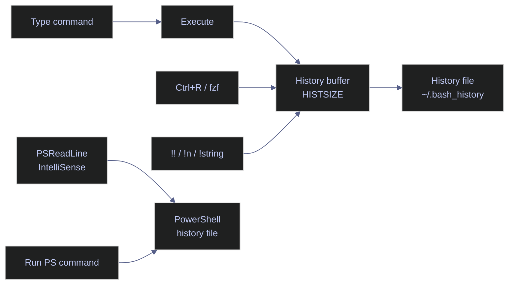

# Command History and Recall

> [!quote]
> "Those who cannot remember the past are condemned to repeat it."
>
> — **George Santayana**, *The Life of Reason* (1905)

Your shell history is a searchable log of every command you have run. In an incident at 2 AM, you do not have time to retype a complex pipeline command from memory — the speed at which you can recall and modify previous commands directly affects your response time.



## Linux history tools

Bash maintains a numbered in-memory list of commands (bounded by `HISTSIZE`) and periodically flushes it to `~/.bash_history` (bounded by `HISTFILESIZE`). Every interactive session reads this file on startup. Understanding how to search, replay, and configure the history list is one of the highest-leverage skills for operational work.

### Linux | history | search and display commands

The `history` built-in prints the numbered command list. Each entry can be replayed by its number, making it a fast log of all past operations.

#### Display the full history list

Running `history` with no arguments prints all entries currently in memory.

```bash
history
```

```text
  497  sqlcmd -S 10.132.0.2 -U sa -P "$SA_PASSWORD" -d analytics_db -Q "SELECT COUNT(*) FROM dbo.market_data"
  498  docker ps -a
  499  history
```

#### Search history by keyword

Pipe `history` into `grep` to filter entries by a substring. Useful when you remember part of a command but not its number.

```bash
history | grep "sqlcmd"
```

```text
  497  sqlcmd -S 10.132.0.2 -U sa -P "$SA_PASSWORD" -d analytics_db -Q "SELECT COUNT(*) FROM dbo.market_data"
```

#### Re-execute a command by number

Prefix the history number with `!` to replay it exactly as recorded.

```bash
!497
```

#### Reverse incremental search with Ctrl+R

`Ctrl+R` opens an interactive reverse search through the history buffer. It is the fastest way to recall a complex command you ran recently.

1. Press `Ctrl+R`, then type a fragment (e.g., `sqlcmd`)
2. Bash shows the most recent match: `(reverse-i-search)'sqlcmd': sqlcmd -S 10.132.0.2 -U sa -P "$SA_PASSWORD" -d analytics_db`
3. Press `Ctrl+R` again to cycle through older matches
4. Press `Enter` to execute, or `→` (right arrow) to edit before executing
5. Press `Ctrl+G` or `Ctrl+C` to cancel

#### Clear the history list for the current session

```bash
history -c
```

| Flag | Syntax | Description |
|---|---|---|
| (none) | `history` | Print all entries in the history list with their numbers |
| `-c` | `history -c` | Clear the in-memory history list for the current session |
| `-d` | `history -d <n>` | Delete the entry at position `n` |
| `-a` | `history -a` | Append the current session's new entries to `~/.bash_history` |
| `-r` | `history -r` | Read `~/.bash_history` and append its contents to the in-memory list |
| `-w` | `history -w` | Write the current in-memory list to `~/.bash_history`, overwriting it |
| `-p` | `history -p <string>` | Perform history expansion on `<string>` and print the result without executing |

### Linux | history expansion | recall and modify past commands

History expansion uses `!` prefixes and modifiers to recall and transform recorded commands. These operators are evaluated by the shell before execution.

#### Re-run the last command

`!!` expands to the entire previous command line. Its most common use is prepending `sudo` after a permission denied error.

```bash
!!
```

```bash
sudo !!
```

> [!tip] sudo !!
>
> After "permission denied", type `sudo !!` to re-run the last command with elevated privileges without retyping the full command.

#### Re-run the most recent command starting with a string

`!string` replays the most recent history entry whose text begins with `string`.

```bash
!git
```

```bash
!docker
```

> [!warning] !string executes without confirmation
>
> `!rm` re-runs your most recent `rm` command immediately with no review step. On a production server this can be destructive.

> [!success] Print before executing with :p modifier
>
> Use `!rm:p` to **print** the expanded command without executing it. Review it, then run `!!` to execute if correct.

#### Re-run the most recent command containing a string

`!?string?` matches any command that contains `string` anywhere in the line, not just at the start.

```bash
!?analytics_db?
```

#### Recall the last argument of the previous command

`$_` holds the last word of the previous command. `Alt+.` is the interactive equivalent — it inserts the last argument of the previous line at the cursor.

```bash
mkdir /data/pipeline/new_output
cd $_
```

#### Quick substitution in the last command

`^old^new` replaces the first occurrence of `old` in the previous command with `new` and re-executes it. This is the fastest way to fix a typo in a long command.

```bash
^typo^fix
```

#### Prevent a command from being saved to history

A command prefixed with a leading space is excluded from the history list. This requires `HISTCONTROL=ignorespace` (or `ignoreboth`) to be set in `.bashrc`.

```bash
 export DB_PASSWORD="secret123"
```

> [!tip] Use leading space for sensitive commands
>
> Credentials passed as environment exports or command arguments should always be prefixed with a space. Combined with `HISTCONTROL=ignoreboth`, neither the command nor any duplicate will appear in `~/.bash_history`.

| Operator | Syntax | Description |
|---|---|---|
| `!!` | `!!` | Expand to the entire previous command |
| `!n` | `!42` | Expand to history entry number `n` |
| `!-n` | `!-2` | Expand to the command `n` entries back from the current position |
| `!string` | `!git` | Expand to the most recent command starting with `string` |
| `!?string?` | `!?analytics?` | Expand to the most recent command containing `string` |
| `:p` | `!rm:p` | Print the expansion without executing |
| `$_` | `cd $_` | Expand to the last argument of the previous command |
| `Alt+.` | (interactive) | Insert the last argument of the previous command at the cursor |
| `^old^new` | `^typo^fix` | Substitute first occurrence of `old` with `new` in the previous command and re-execute |

### Linux | HISTSIZE, HISTCONTROL | history configuration

These environment variables control how much history Bash retains and which commands are eligible for recording. They are typically set in `~/.bashrc` and apply to every new interactive session.

#### Configure history size, deduplication, and timestamps

Add the following block to `~/.bashrc` to maximize the operational value of your history. The settings below are tuned for data engineering work where incident reconstruction is common.

```bash
export HISTSIZE=50000
export HISTFILESIZE=100000
export HISTCONTROL=ignoreboth
export HISTTIMEFORMAT="%Y-%m-%d %H:%M:%S  "
shopt -s histappend
PROMPT_COMMAND="history -a"
```

`HISTSIZE=50000` keeps 50,000 commands in memory per session. `HISTFILESIZE=100000` keeps 100,000 lines in the persistent file. `HISTCONTROL=ignoreboth` combines `ignoredups` (skip consecutive duplicates) and `ignorespace` (skip space-prefixed commands). `HISTTIMEFORMAT` timestamps each entry, which is invaluable during post-incident reviews: "What commands were run on the database server between 14:00 and 14:30 yesterday?" `shopt -s histappend` appends new entries rather than overwriting the file when the session exits, so concurrent sessions do not clobber each other. `PROMPT_COMMAND="history -a"` flushes to file after every command, so the history survives a crash.

#### Apply changes to the current session

After editing `.bashrc`, reload it without opening a new terminal.

```bash
source ~/.bashrc
```

#### Inspect the current value of a HIST variable

```bash
echo $HISTSIZE
echo $HISTCONTROL
```

```text
50000
ignoreboth
```

| Variable | Default | Description |
|---|---|---|
| `HISTSIZE` | 500 (distro-dependent) | Number of commands kept in the in-memory list |
| `HISTFILESIZE` | 500 (distro-dependent) | Maximum lines retained in `~/.bash_history` on disk |
| `HISTCONTROL` | (unset) | Comma-separated list of `ignorespace`, `ignoredups`, `ignoreboth`, `erasedups` |
| `HISTTIMEFORMAT` | (unset) | `strftime` format string prepended to each history entry as a timestamp |
| `HISTFILE` | `~/.bash_history` | Path to the persistent history file |
| `HISTIGNORE` | (unset) | Colon-separated list of patterns (glob syntax) for commands to never save |

### Linux | history workflow | building commands incrementally

Rather than retyping long commands, use history recall to iterate: run a base version, search it back with `Ctrl+R`, modify a single parameter, and re-execute. This pattern is central to productive terminal work.

#### Iterate on a database query without retyping connection parameters

Each step modifies only the query while reusing the full connection string from history.

```bash
sqlcmd -S 10.132.0.2 -U sa -P "$SA_PASSWORD" -d analytics_db -Q "SELECT COUNT(*) FROM dbo.market_data"
```

```bash
sqlcmd -S 10.132.0.2 -U sa -P "$SA_PASSWORD" -d analytics_db -Q "SELECT TOP 10 * FROM dbo.market_data ORDER BY date DESC"
```

After running the first command, press `Ctrl+R` and type `sqlcmd` to bring it back. Use `→` to edit only the `-Q` argument, then press `Enter` to run the refined version.

## PowerShell history tools

PowerShell maintains a separate history list per session via `Get-History` and persists all history across sessions through the PSReadLine module. PSReadLine writes to `(Get-PSReadLineOption).HistorySavePath` (typically `~\AppData\Roaming\Microsoft\Windows\PowerShell\PSReadLine\ConsoleHost_history.txt`) after every command, giving you a unified cross-session log without additional configuration.

### PowerShell | Get-History | search and display commands

`Get-History` returns the in-session command list as objects. Each object has an `Id`, `CommandLine`, and timing properties. Because it returns objects, you can filter, sort, and select with the standard pipeline cmdlets.

#### Display the full in-session history

```powershell
Get-History
```

```text
  Id     Duration CommandLine
  --     -------- -----------
   1        0.162 Get-ChildItem C:\data
   2        1.204 sqlcmd -S .\SQLEXPRESS -Q "SELECT @@VERSION"
   3        0.001 Get-History
```

#### Search history by keyword

Filter the `CommandLine` property with `-like` to find all matching entries across the current session.

```powershell
Get-History | Where-Object CommandLine -like "*sqlcmd*"
```

```text
  Id     Duration CommandLine
  --     -------- -----------
   2        1.204 sqlcmd -S .\SQLEXPRESS -Q "SELECT @@VERSION"
```

#### Search across all sessions (PSReadLine persistent log)

`Get-History` only covers the current session. To search the full cross-session log, read PSReadLine's history file directly.

```powershell
Get-Content (Get-PSReadLineOption).HistorySavePath | Select-String "sqlcmd"
```

```text
sqlcmd -S .\SQLEXPRESS -Q "SELECT @@VERSION"
sqlcmd -S 10.132.0.2 -U sa -P $env:SA_PASSWORD -d analytics_db -Q "SELECT COUNT(*) FROM dbo.market_data"
```

| Parameter | Syntax | Description |
|---|---|---|
| `-Count` | `Get-History -Count 20` | Return only the last `n` entries |
| `-Id` | `Get-History -Id 5` | Return the single entry with the specified ID |

### PowerShell | Invoke-History | replay past commands

`Invoke-History` re-executes a command from the in-session history list by its ID. Without an ID it replays the most recent entry.

#### Re-run the last command

```powershell
Invoke-History
```

#### Re-run a specific command by ID

```powershell
Invoke-History -Id 42
```

> [!tip] Use the r alias
>
> `r` is the built-in alias for `Invoke-History`. `r 42` is equivalent to `Invoke-History -Id 42`.

| Parameter | Syntax | Description |
|---|---|---|
| `-Id` | `Invoke-History -Id <n>` | Re-execute the command at position `n` in the session history |
| (none) | `Invoke-History` | Re-execute the most recent command in the session |

### PowerShell | PSReadLine | predictive IntelliSense and history options

PSReadLine is the readline library for PowerShell. It provides interactive history search (`Ctrl+R`, mirroring bash), predictive IntelliSense (inline or list-view completion from history), and fine-grained control over which commands are saved. Available in PowerShell 5.1+ and enabled by default in PowerShell 7+.

#### Enable predictive IntelliSense from history

`PredictionSource History` makes PSReadLine show a greyed-out inline suggestion as you type, drawn from the most recent matching history entry. Press `→` to accept the full suggestion or `Alt+→` to accept one word at a time.

```powershell
Set-PSReadLineOption -PredictionSource History
```

#### Switch to list view for predictions

`ListView` displays multiple history candidates as a dropdown list below the cursor rather than a single inline suggestion. Navigate with `↑`/`↓` and press `Enter` to select.

```powershell
Set-PSReadLineOption -PredictionViewStyle ListView
```

#### Persist these options across sessions

Add both lines to your PowerShell profile so the settings apply to every session.

```powershell
$PROFILE
```

```text
C:\Users\aperi\Documents\PowerShell\Microsoft.PowerShell_profile.ps1
```

Open the profile file and append:

```powershell
Set-PSReadLineOption -PredictionSource History
Set-PSReadLineOption -PredictionViewStyle ListView
```

#### Exclude sensitive commands from history

PSReadLine's `AddToHistoryHandler` accepts a scriptblock that returns `$true` to save or `$false` to drop a command. Use it to block commands containing credential-like patterns.

```powershell
Set-PSReadLineOption -AddToHistoryHandler {
    param([string]$line)
    $line -notmatch 'password|secret|token|key' 
}
```

> [!warning] -AddToHistoryHandler is case-insensitive by default only if you use -imatch
>
> The `-notmatch` operator is case-insensitive by default in PowerShell, but the pattern `password` will not catch `PASSWORD` if you use `-cmatch`. Stick with `-notmatch` or `-inotmatch` for broad credential filtering.

> [!success] Use -notmatch for case-insensitive credential filtering
>
> `-notmatch` performs case-insensitive regex matching by default. The pattern above will suppress `Export-Password`, `Set-Token`, `Invoke-WithSecretKey`, and similar variants regardless of casing.

#### Check the current PSReadLine history save path

```powershell
(Get-PSReadLineOption).HistorySavePath
```

```text
C:\Users\aperi\AppData\Roaming\Microsoft\Windows\PowerShell\PSReadLine\ConsoleHost_history.txt
```

| Option | Syntax | Description |
|---|---|---|
| `-PredictionSource` | `History` \| `Plugin` \| `HistoryAndPlugin` \| `None` | Source for predictive suggestions |
| `-PredictionViewStyle` | `InlineView` \| `ListView` | How predictions are displayed: inline or dropdown list |
| `-MaximumHistoryCount` | `-MaximumHistoryCount 10000` | Maximum commands saved to the PSReadLine history file |
| `-HistorySaveStyle` | `SaveIncrementally` \| `SaveAtExit` \| `SaveNothing` | When to write commands to the history file |
| `-AddToHistoryHandler` | `{ param($l) $l -notmatch 'secret' }` | Scriptblock returning `$true` to save or `$false` to drop a command |
| `-HistorySearchCaseSensitive` | `$true` \| `$false` | Whether `Ctrl+R` search is case-sensitive (default `$false`) |

### PowerShell | history workflow | building commands incrementally

The same iterative pattern used in bash applies in PowerShell. Use `Ctrl+R` (PSReadLine's reverse-i-search) or the IntelliSense list to surface a prior command, then edit it before re-running.

#### Iterate on a database query without retyping connection parameters

```powershell
sqlcmd -S 10.132.0.2 -U sa -P $env:SA_PASSWORD -d analytics_db -Q "SELECT COUNT(*) FROM dbo.market_data"
```

```powershell
sqlcmd -S 10.132.0.2 -U sa -P $env:SA_PASSWORD -d analytics_db -Q "SELECT TOP 10 * FROM dbo.market_data ORDER BY date DESC"
```

After running the first command, press `Ctrl+R` and type `sqlcmd`. PSReadLine brings up the most recent match. Press `→` to move the cursor into the line and edit the `-Q` argument, then press `Enter`.

## Related

- [environment-variables](https://alp78.github.io/elysium/01-Shell/Scripting/environment-variables) — Preventing secrets from being stored in history
- [defensive-scripting](https://alp78.github.io/elysium/01-Shell/Scripting/defensive-scripting) — Writing scripts that don't need manual recall
- [command-chaining](https://alp78.github.io/elysium/01-Shell/Scripting/command-chaining) — Building complex command pipelines

## References

- [GNU Bash Reference — History](https://www.gnu.org/software/bash/manual/html_node/Bash-History-Facilities.html)
- [PSReadLine Module](https://learn.microsoft.com/en-us/powershell/module/psreadline/)
