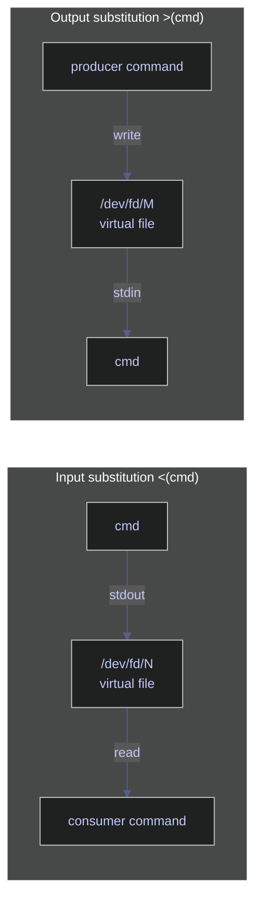

# Process Substitution and Here Documents — Advanced Input/Output

These features let you treat command output as files and embed multi-line strings directly in your scripts. They eliminate temporary files and make complex data pipeline scripts significantly cleaner.

> [!quote]
> "Expect the output of every program to become the input to another, as yet unknown, program. Don't clutter output with extraneous information. Don't insist on interactive input."
>
> — **Doug McIlroy**, *Bell System Technical Journal* (1978)

## Linux process substitution tools

Process substitution creates a virtual file descriptor that wraps a command's output so other commands can read from it as if it were a file. No temporary files are created or cleaned up. The kernel provides the file descriptor transparently via `/dev/fd/N` (or a named pipe on systems that lack `/dev/fd`).

Two forms exist: `<(cmd)` produces a readable file descriptor (input substitution), and `>(cmd)` produces a writable file descriptor (output substitution). Both can appear on the same command line.



### Linux | process substitution | input `<()`

Input substitution replaces a filename argument with a live file descriptor backed by the output of the given command. The outer command reads from that descriptor exactly as it would read from a real file.

#### Linux | `<()` | compare two command outputs with diff

`diff` requires two file paths. Using `<()` lets you feed it two in-memory streams without creating any disk files. Each `<(sort ...)` expression becomes a separate `/dev/fd/N` descriptor that `diff` reads sequentially.

```bash
diff <(sort file1.txt) <(sort file2.txt)
```

```text
2c2
< banana
---
> cherry
```

#### Linux | `<()` | compare SQL row counts across environments

Running `diff` on two `sqlcmd` calls confirms whether staging and production carry the same data volume. The `-h -1` flag suppresses the column header row; `-W` trims trailing whitespace so the comparison is clean.

```bash
diff <(sqlcmd -S prod-server -U sa -P "$PASS" -d analytics_db \
        -Q "SELECT COUNT(*) FROM dbo.market_data" -h -1 -W) \
     <(sqlcmd -S staging-server -U sa -P "$PASS" -d analytics_db \
        -Q "SELECT COUNT(*) FROM dbo.market_data" -h -1 -W)
```

```text
(no output = counts match; any line printed = mismatch)
```

#### Linux | `<()` | merge selected columns with paste

`paste` joins lines from multiple files side by side. Wrapping each `cut` call in `<()` extracts two non-adjacent columns from the same CSV and merges them into a new stream without writing an intermediate file.

```bash
paste <(cut -d, -f1 stocks.csv) <(cut -d, -f3 stocks.csv)
```

```text
AAPL    145.32
MSFT    310.05
ASML    720.00
```

### Linux | process substitution | output `>()`

Output substitution creates a writable file descriptor backed by the given command's stdin. The producer writes to the substitution as if writing to a file, and the backing command receives that data on its own stdin.

#### Linux | `>()` | tee output to multiple simultaneous consumers

`tee` copies its stdin to each destination listed. Using `>()` lets each destination be a live process rather than a file, so compression and line-counting happen concurrently from the same read of `data.csv`.

```bash
tee >(gzip > data.gz) >(wc -l > count.txt) < data.csv > /dev/null
```

The redirect `> /dev/null` suppresses the copy that `tee` would normally write to stdout, since both useful outputs are handled by the two substitutions.

#### Linux | `>()` | log and process in parallel

Writing to two independent `>(...)` sinks lets you archive raw data to a log file while simultaneously processing it through a filter, all in one pipeline pass.

```bash
command | tee >(cat >> audit.log) >(grep ERROR > errors.txt)
```

### Linux | process substitution | flag reference

| Syntax | Description |
|---|---|
| `<(cmd)` | Run `cmd` and expose its stdout as a readable file descriptor |
| `>(cmd)` | Expose a writable file descriptor; data written to it reaches `cmd`'s stdin |
| `/dev/fd/N` | The actual path the shell provides for the substitution |

---

## Linux here document tools

A here document embeds multi-line text directly in a script, feeding it as stdin to a command. The shell reads lines until it encounters the closing delimiter on its own line. Here documents are useful for inline SQL, config generation, and any command that reads a block of input.

### Linux | here document | literal `<< 'EOF'`

Enclosing the opening delimiter in single quotes (`<< 'EOF'`) disables all expansion inside the block: variables, command substitutions, and backslash escapes are passed through literally. Use this form when you want the exact text without any interpretation.

#### Linux | `<< 'EOF'` | send literal SQL to sqlcmd

The entire SQL block is passed verbatim to `sqlcmd` as stdin. Because the delimiter is quoted, `$variables` inside the SQL are not expanded by the shell — important when the SQL contains dollar signs for parameters or internal logic.

```bash
sqlcmd -S 10.132.0.2 -U sa -P "$SA_PASSWORD" -d analytics_db << 'EOF'
SELECT symbol, date, close
FROM dbo.market_data
WHERE _index = 'market_index'
  AND date >= DATEADD(DAY, -30, GETDATE())
ORDER BY date DESC;
EOF
```

### Linux | here document | expanding `<< EOF`

When the opening delimiter is unquoted (`<< EOF`), the shell expands `$variables`, `$(command)` substitutions, and backslash sequences inside the block before passing it to the command. Use this form for dynamic content generation.

#### Linux | `<< EOF` | generate a config file with variable expansion

Variables and command substitutions in the block are resolved at the time the script runs. The final output is redirected into `config.env`, creating or overwriting the file. `$(date ...)` inside the unquoted block is evaluated by the shell before writing.

```bash
cat << EOF > config.env
DB_HOST=${DB_HOST}
DB_PORT=${DB_PORT}
PIPELINE_NAME=pipeline_daily
GENERATED_AT=$(date -u +%Y-%m-%dT%H:%M:%SZ)
EOF
```

#### Linux | `<< EOF` | multiline ssh commands

Feeding a here document to `ssh` runs multiple commands on the remote host in a single connection without needing a separate script file on the remote side.

```bash
ssh user@host << EOF
cd /opt/pipeline
./run_etl.sh --env prod
echo "ETL exit code: $?"
EOF
```

### Linux | here document | flag reference

| Syntax | Description |
|---|---|
| `<< 'EOF'` | Literal here document — no variable or command expansion |
| `<< EOF` | Expanding here document — `$var` and `$(cmd)` are substituted |
| `<<- EOF` | Expanding here document; leading tabs (not spaces) are stripped from each line |
| `<< 'EOF' > file` | Redirect here document output to a file |

---

## Linux here string tools

A here string feeds a single-line string as stdin to a command, equivalent to `echo "..." | cmd` but without spawning a subshell for `echo`. It is the cleanest way to pass a literal value on stdin.

### Linux | here string | `<<<`

#### Linux | `<<<` | grep a literal string

The string `"ASML SAP SIE"` is fed directly to `grep`'s stdin. This avoids a pipe and an `echo` subprocess, and the intent is immediately clear from the `<<<` syntax.

```bash
grep "ASML" <<< "ASML SAP SIE"
```

```text
ASML SAP SIE
```

#### Linux | `<<<` | parse a variable with read

`read` normally reads from the terminal. Redirecting a here string into it assigns substrings to named variables without a pipe or subshell.

```bash
read first rest <<< "AAPL 145.32 2026-01-15"
echo "$first"
echo "$rest"
```

```text
AAPL
145.32 2026-01-15
```

#### Linux | `<<<` | feed a JSON string to jq

Here strings work with any command that reads from stdin. Passing a JSON literal directly via `<<<` is cleaner than wrapping it in `echo` or writing a file.

```bash
jq '.price' <<< '{"symbol":"AAPL","price":145.32}'
```

```text
145.32
```

### Linux | here string | flag reference

| Syntax | Description |
|---|---|
| `<<< "string"` | Feed a literal string as stdin; variables are expanded |
| `<<< '$literal'` | Single-quoted string; no expansion |
| `<<< "$(cmd)"` | Feed command output as a single-line stdin |

---

## PowerShell process substitution tools

> [!info]
> PowerShell has no direct equivalent to Bash process substitution (`<()`, `>()`). The Bash feature relies on Linux kernel file descriptors (`/dev/fd/N`) that do not exist on Windows. PowerShell provides three practical alternatives depending on the use case: **temporary files**, **pipeline variables** (`Tee-Object -Variable`), and **`ForEach-Object` inline branching**.

### PowerShell | process substitution workaround | temporary files

The most direct translation of `<(cmd)` is to write command output to a temporary file, use the file, then delete it. This is verbose but always works and is easy to audit.

#### PowerShell | temp file | compare two command outputs with diff

Write each command's output to a temporary file, run `Compare-Object` (PowerShell's diff equivalent), then clean up. `[System.IO.Path]::GetTempFileName()` returns a unique path in the system temp directory.

```powershell
$f1 = [System.IO.Path]::GetTempFileName()
$f2 = [System.IO.Path]::GetTempFileName()
(Get-Content file1.txt | Sort-Object) | Set-Content $f1
(Get-Content file2.txt | Sort-Object) | Set-Content $f2
Compare-Object (Get-Content $f1) (Get-Content $f2)
Remove-Item $f1, $f2
```

```text
InputObject SideIndicator
----------- -------------
cherry      =>
banana      <=
```

### PowerShell | process substitution workaround | pipeline variables

`Tee-Object -Variable` captures pipeline output into a named variable while still passing it downstream. This is the closest equivalent to `tee >(cmd)` for in-memory branching.

#### PowerShell | `Tee-Object` | capture and pass through simultaneously

The pipeline output is both stored in `$lines` and forwarded to `Measure-Object`. No file is written; both operations happen in a single pipeline.

```powershell
Get-Content data.csv |
    Tee-Object -Variable lines |
    Measure-Object -Line
```

```text
Lines Words Characters Property
----- ----- ---------- --------
  500
```

### PowerShell | process substitution workaround | ForEach-Object branching

For multiple simultaneous consumers, `ForEach-Object` with a `Begin`/`Process`/`End` script block or parallel calls can approximate `tee >() >()` by dispatching each item to multiple operations inline.

#### PowerShell | `ForEach-Object` | send output to two destinations

Each line from the pipeline is appended to `audit.log` and simultaneously tested for the string `ERROR`. Matches are collected in `$errors`.

```powershell
$errors = [System.Collections.Generic.List[string]]::new()
Get-Content pipeline.log | ForEach-Object {
    Add-Content -Path audit.log -Value $_
    if ($_ -match 'ERROR') { $errors.Add($_) }
}
$errors | Set-Content errors.txt
```

---

## PowerShell here document tools

PowerShell's equivalent of a here document is the **here-string**, written with `@'...'@` (literal) or `@"..."@` (expanding). Unlike Bash, the opening `@'` or `@"` must sit at the end of the line, and the closing `'@` or `"@` must appear at the start of a line with no leading whitespace.

### PowerShell | here-string | literal `@'...'@`

#### PowerShell | `@'...'@` | embed a literal SQL block

Everything between `@'` and `'@` is treated as a literal string. No variable or expression expansion occurs. The result is assigned to `$query` and passed to `Invoke-Sqlcmd`.

```powershell
$query = @'
SELECT symbol, date, close
FROM dbo.market_data
WHERE _index = 'market_index'
  AND date >= DATEADD(DAY, -30, GETDATE())
ORDER BY date DESC;
'@
Invoke-Sqlcmd -ServerInstance "10.132.0.2" -Database "analytics_db" -Query $query
```

### PowerShell | here-string | expanding `@"..."@`

#### PowerShell | `@"..."@` | generate a config block with variable expansion

Variables and subexpressions inside `@"..."@` are expanded before the string is used. The result is written to `config.env`.

```powershell
$content = @"
DB_HOST=$env:DB_HOST
DB_PORT=$env:DB_PORT
PIPELINE_NAME=pipeline_daily
GENERATED_AT=$(Get-Date -Format 'yyyy-MM-ddTHH:mm:ssZ')
"@
Set-Content -Path config.env -Value $content
```

### PowerShell | here-string | flag reference

| Syntax | Description |
|---|---|
| `@'...'@` | Literal here-string — no variable or expression expansion |
| `@"..."@` | Expanding here-string — `$var` and `$(expr)` are substituted |
| `@'...'@ \| cmd` | Pipe a literal here-string to any command reading from stdin |

---

## Related

- [io-redirection](https://alp78.github.io/elysium/01-Shell/Scripting/io-redirection) — Basic redirection operators
- [command-chaining](https://alp78.github.io/elysium/01-Shell/Scripting/command-chaining) — Connecting commands with pipes
- [brace-expansion-and-globbing](https://alp78.github.io/elysium/01-Shell/Scripting/brace-expansion-and-globbing) — Another argument generation technique
- [defensive-scripting](https://alp78.github.io/elysium/01-Shell/Scripting/defensive-scripting) — Using these patterns in production scripts

## References

- [GNU Bash Reference — Process Substitution](https://www.gnu.org/software/bash/manual/html_node/Process-Substitution.html)
- [GNU Bash Reference — Here Documents](https://www.gnu.org/software/bash/manual/html_node/Redirections.html#Here-Documents)
- [PowerShell About Here-Strings](https://learn.microsoft.com/en-us/powershell/module/microsoft.powershell.core/about/about_quoting_rules#here-strings)
- [PowerShell Tee-Object](https://learn.microsoft.com/en-us/powershell/module/microsoft.powershell.utility/tee-object)
