# awk Data Processing Reference

> [!quote]
> "The goal was to see how much of programming we could stuff into one line."
>
> — **Brian Kernighan** (co-creator of awk)

awk (also gawk — GNU awk, mawk — faster awk) is a domain-specific language built for column-oriented text processing. It reads input record by record (lines by default), splits each record into fields, and applies pattern-action rules. For data engineers it is the fastest path from raw text files, logs, and CSVs to structured output without writing a full Python script.

On macOS the default `awk` is BSD awk. On Linux it is usually gawk. On Windows you use PowerShell natively or install gawk via Chocolatey (`choco install gawk`) or Git Bash. All examples below work in gawk; BSD awk differences are noted inline.

---

## Linux awk | how it works

This section covers the fundamental model that underlies every awk program: how input is divided into records and fields, how the field separator is set, how pattern-action rules are evaluated, and how `BEGIN`/`END` blocks provide setup and teardown logic.

### Linux | awk | record and field model

awk reads input one **record** at a time. By default a record is a line. It then splits each record into **fields** using the field separator. Fields are accessed by position: `$1` is the first field, `$2` the second, and so on. `$0` is the entire record unchanged.

| Variable   | Meaning                                      |
|------------|----------------------------------------------|
| `$0`       | The entire current record (the whole line)   |
| `$1`       | First field                                  |
| `$2`       | Second field                                 |
| `$NF`      | Last field (NF = number of fields)           |
| `$(NF-1)`  | Second-to-last field                         |
| `NR`       | Current record number (global, across files) |
| `NF`       | Number of fields in the current record       |
| `FNR`      | Record number within the current file        |
| `FS`       | Input field separator (default: whitespace)  |
| `OFS`      | Output field separator (default: space)      |
| `RS`       | Input record separator (default: newline)    |
| `ORS`      | Output record separator (default: newline)   |
| `FILENAME` | Name of the current input file               |
| `SUBSEP`   | Separator for simulated multi-dim arrays (`\034`) |
| `OFMT`     | Format for printing numbers (default `%.6g`) |
| `CONVFMT`  | Format for internal number-to-string conversions |

#### Print the whole line and specific fields

`$0` holds the full raw line. `$1` and `$2` hold the first and second whitespace-delimited tokens respectively. Printing multiple fields separated by a comma inserts the output field separator (OFS, space by default).

```bash
echo "alice 42 engineer" | awk '{print $0}'
```

```text
alice 42 engineer
```

```bash
echo "alice 42 engineer" | awk '{print $1}'
```

```text
alice
```

```bash
echo "alice 42 engineer" | awk '{print $1,$2}'
```

```text
alice 42
```

#### Access the last field regardless of column count

`$NF` always resolves to the last field because `NF` holds the count of fields in the current record. `$(NF-1)` is the second-to-last field. This is useful when column count varies between records.

```bash
echo "a b c d e" | awk '{print $NF}'
```

```text
e
```

```bash
echo "a b c d e" | awk '{print $(NF-1)}'
```

```text
d
```

### Linux | awk | default field separator (whitespace)

Without `-F`, awk treats any run of whitespace (spaces and tabs) as a single separator and trims leading and trailing whitespace automatically. This makes awk ideal for parsing `ps`, `df`, `ls -l`, and other command output where fields are aligned with varying numbers of spaces.

```bash
echo "  a   b   c  " | awk '{print NF}'
```

```text
3
```

Three fields are found, not eight, because consecutive spaces count as one separator and leading/trailing whitespace is ignored.

### Linux | awk | setting the field separator with -F

`-F` sets the input field separator to a literal character or a regular expression. It is equivalent to setting the built-in variable `FS` in a `BEGIN` block.

#### Set a single-character field separator

```bash
awk -F',' '{print $2}' data.csv
```

```bash
awk -F'\t' '{print $3}' data.tsv
```

```bash
awk -F'|' '{print $1}' data.psv
```

```bash
awk -F':' '{print $1}' /etc/passwd
```

#### Set a regex field separator

`FS` can be any extended regular expression. This allows splitting on any of several characters at once.

```bash
awk -F'[,;|]' '{print $2}' mixed.txt
```

The input is split on whichever of comma, semicolon, or pipe appears in each record.

### Linux | awk | pattern-action structure

The fundamental awk program is a series of `pattern { action }` rules. awk evaluates every pattern against every record and executes the associated action when the pattern matches. If the pattern is omitted, the action runs on every record. If the action is omitted, the default action is `{print $0}`. Multiple rules can match the same record; all matching actions execute in order.

```text
awk 'pattern1 { action1 }
     pattern2 { action2 }
     pattern3 { action3 }' file
```

#### Match lines by regex pattern

```bash
awk '/ERROR/' app.log
```

#### Print a field for every line (no pattern filter)

```bash
awk '{print $1}' data.txt
```

#### Combine pattern and action

```bash
awk '/ERROR/ {print NR, $0}' app.log
```

The line number (`NR`) is prepended to every matching line, making it easy to locate errors in large files.

#### Apply multiple rules in one program

```bash
awk '/ERROR/ {errors++} /WARN/ {warns++} END {print errors, warns}' app.log
```

Both counters are incremented independently. The `END` block prints the totals after all input is consumed.

### Linux | awk | BEGIN and END blocks

`BEGIN` runs once before any input is read — use it to initialize variables, print headers, or set `OFS`/`RS`. `END` runs once after all input is consumed — use it to print summaries, flush aggregates, or close files.

#### Print a header and a summary with BEGIN and END

```bash
awk -F',' '
  BEGIN {
    print "Name,Total"
    OFS=","
  }
  NR > 1 {
    total += $3
  }
  END {
    print "Grand total:", total
  }
' sales.csv
```

> [!tip] Store long awk programs in a file
>
> For programs longer than a few lines, put the program in a file and invoke `awk -f program.awk data.txt`. This avoids shell quoting issues and is much easier to version-control and debug.

---

## Linux awk | field extraction and formatting

This section covers selecting, reordering, and formatting fields for output. These are the most frequently used awk operations in data engineering pipelines.

### Linux | awk | print specific columns

#### Print selected columns from a whitespace-delimited file

Columns are printed space-separated by default when separated by a comma in the `print` statement.

```bash
awk '{print $1, $3}' data.txt
```

#### Print selected columns with a custom literal separator

Using string concatenation (no comma) inserts the literal separator directly with no OFS.

```bash
awk '{print $1 "|" $3}' data.txt
```

#### Print a column from a CSV

```bash
awk -F',' '{print $2}' data.csv
```

#### Skip the header row and print a column

```bash
awk -F',' 'NR>1 {print $2}' data.csv
```

### Linux | awk | custom output field separator (OFS)

#### Change OFS so output columns are tab-separated

```bash
awk -F',' -v OFS='\t' '{print $1,$3}' data.csv
```

#### Rebuild $0 with a new separator

Printing `$0` directly always yields the original line, even after setting OFS. Assigning any field (e.g., `$1=$1`) forces awk to rebuild `$0` using OFS, replacing every original separator.

```bash
awk -F',' -v OFS='|' '{$1=$1; print}' data.csv
```

#### Convert CSV to TSV (all columns)

```bash
awk -F',' -v OFS='\t' '{$1=$1; print}' data.csv > data.tsv
```

> [!warning] OFS and $0
>
> Printing `$0` always gives the original line even if you set OFS. Trigger a field rebuild by assigning any `$N = $N` or `$1=$1` before printing if you want OFS applied to the whole record.

> [!success] Force $0 rebuild with OFS
>
> Always assign `$1=$1` before printing `$0` when delimiter conversion is the goal: `awk -F',' -v OFS='\t' '{$1=$1; print}' data.csv`.

### Linux | awk | printf for formatted output

`printf` works identically to C's printf. Use it when you need aligned columns, a specific number of decimal places, or custom line endings without an automatic newline.

#### Left-align a string and right-align a float

```bash
awk '{printf "%-20s %10.2f\n", $1, $3}' data.txt
```

The name field is left-aligned in a 20-character column; the numeric field is right-aligned in a 10-character column with 2 decimal places.

#### Right-align integers

```bash
awk '{printf "%8d\n", $2}' counts.txt
```

#### Print with no trailing newline

Useful when the output of multiple awk invocations is concatenated or piped.

```bash
awk '{printf "%s\t%s", $1, $2}' data.txt
```

#### Print a CSV row with quoted string fields

```bash
awk -F',' '{printf "\"%s\",%s,\"%s\"\n", $1, $2, $3}' data.csv
```

#### printf format specifiers

| Specifier | Meaning                        |
|-----------|--------------------------------|
| `%s`      | String                         |
| `%d`      | Integer (decimal)              |
| `%f`      | Float (decimal notation)       |
| `%e`      | Scientific notation            |
| `%g`      | Shorter of `%f` or `%e`        |
| `%-20s`   | Left-aligned, 20 chars wide    |
| `%10.2f`  | 10 wide, 2 decimal places      |
| `%08d`    | Zero-padded to 8 digits        |
| `%%`      | Literal percent sign           |

### Linux | awk | reorder columns

#### Reorder columns in a CSV

```bash
awk -F',' -v OFS=',' '{print $2,$3,$1}' data.csv
```

Input order is `name,date,amount`; output order is `date,amount,name`.

#### Reorder and add a literal new column

```bash
awk -F',' -v OFS=',' '{print $1,$3,"NEW_COL",$2}' data.csv
```

#### Swap columns in a TSV

```bash
awk -F'\t' -v OFS='\t' '{print $2,$1,$3,$4}' data.tsv
```

### Linux | awk | extract a range of fields

awk has no built-in range operator for fields, so a loop is required.

#### Print fields 2 through 5

```bash
awk '{for(i=2;i<=5;i++) printf "%s%s",$i,(i<5?OFS:ORS)}' data.txt
```

The ternary expression prints OFS between fields and ORS (newline) after the last field.

#### Print all fields from field 3 onward

```bash
awk '{for(i=3;i<=NF;i++) printf "%s%s",$i,(i<NF?OFS:ORS)}' data.txt
```

#### Remove the first field

```bash
awk '{$1=""; sub(/^ /,""); print}' data.txt
```

Setting `$1` to empty leaves a leading space in `$0`; the `sub` call strips it.

### Linux | awk | flag reference

| Flag / Variable | Syntax | Description |
|---|---|---|
| `-F sep` | `awk -F',' ...` | Set input field separator (FS) |
| `-v var=val` | `awk -v OFS='\t' ...` | Assign a variable before execution |
| `-f file` | `awk -f prog.awk data` | Read awk program from a file |
| `--` | `awk -- '{print}' file` | End option processing (use before program starting with `-`) |
| `NR` | `NR>1` | Global record counter |
| `NF` | `NF>=3` | Field count in current record |
| `FNR` | `FNR==1` | Per-file record counter |
| `FS` | `BEGIN{FS=","}` | Input field separator |
| `OFS` | `BEGIN{OFS="\t"}` | Output field separator |
| `RS` | `BEGIN{RS=""}` | Input record separator |
| `ORS` | `BEGIN{ORS="\n\n"}` | Output record separator |
| `FILENAME` | `{print FILENAME}` | Current input filename |
| `OFMT` | `BEGIN{OFMT="%.4f"}` | Numeric output format for `print` |

---

## Linux awk | filtering and conditions

This section covers all the ways to select which records awk processes: regular expression patterns, field-level comparisons, range patterns, and NR/NF-based guards.

### Linux | awk | pattern matching (regex)

#### Print lines containing a pattern

```bash
awk '/ERROR/' app.log
```

#### Case-insensitive match (gawk)

```bash
awk 'tolower($0) ~ /error/' app.log
```

#### Negate a pattern — lines NOT matching

```bash
awk '!/ERROR/' app.log
```

#### Match multiple patterns with OR

```bash
awk '/ERROR|FATAL/' app.log
```

#### Match an exact word boundary

```bash
awk '/\bERROR\b/' app.log
```

### Linux | awk | field conditions

#### Numeric comparison on a field

```bash
awk -F',' '$3 > 100 {print}' data.csv
```

#### String equality on a field

```bash
awk -F',' '$4 == "ACTIVE" {print}' data.csv
```

#### Field is not empty

```bash
awk -F',' '$2 != "" {print}' data.csv
```

#### Multiple conditions combined with AND

```bash
awk -F',' '$3 > 100 && $4 == "ACTIVE" {print}' data.csv
```

#### Multiple conditions combined with OR

```bash
awk -F',' '$3 < 0 || $3 > 1000 {print}' data.csv
```

#### Field matches a regex

```bash
awk -F',' '$1 ~ /^the data pipeline project/ {print}' data.csv
```

#### Field does NOT match a regex

```bash
awk -F',' '$1 !~ /^the data pipeline project/ {print}' data.csv
```

> [!tip] Numeric vs string comparison
>
> In awk, `$3 > 100` does numeric comparison when `$3` looks like a number. `$3 > "100"` forces string comparison. This is usually intuitive but can produce unexpected results with zero-padded strings like "007" vs "07".

### Linux | awk | range patterns

A range pattern `pattern1,pattern2` matches from the first record where `pattern1` matches to the first record where `pattern2` matches, inclusive. Matching resumes from the beginning if `pattern1` appears again after `pattern2`.

#### Print lines between START and END markers

```bash
awk '/START/,/END/' data.txt
```

#### Print everything between two timestamps in a log

```bash
awk '/2026-03-22 08:00/,/2026-03-22 09:00/' app.log
```

#### Range pattern with an action

```bash
awk '/BEGIN_BLOCK/,/END_BLOCK/ {print NR, $0}' data.txt
```

### Linux | awk | NR and NF based filtering

#### Skip the header line

```bash
awk 'NR > 1 {print}' data.csv
```

#### Print only the first 10 lines

```bash
awk 'NR <= 10' data.txt
```

#### Print lines 5 through 15

```bash
awk 'NR>=5 && NR<=15' data.txt
```

#### Print every other line (odd lines only)

```bash
awk 'NR % 2 == 1' data.txt
```

#### Skip malformed rows with fewer than 3 fields

```bash
awk 'NF >= 3 {print}' data.csv
```

#### Print lines with exactly 5 fields

```bash
awk 'NF == 5' data.csv
```

### Linux | awk | combined pattern examples

#### Filter a CSV by numeric threshold, skipping the header

```bash
awk -F',' 'NR>1 && $3+0 > 500 {print $1, $3}' data.csv
```

`$3+0` coerces the field to a number, guarding against accidental string comparison.

#### Log lines matching a keyword where a duration field exceeds a threshold

```bash
awk '/PIPELINE/ && $5 > 60 {print NR, $0}' pipeline.log
```

#### First 20 CSV rows where a status column equals FAILED

```bash
awk -F',' 'NR>1 && $2=="FAILED" && NR<=21' jobs.csv
```

---

## Linux awk | data transformation

This section covers arithmetic, string manipulation, and aggregate operations — the core of awk's value for ETL and data engineering pipelines.

### Linux | awk | arithmetic operations

#### Multiply a field by a constant

```bash
awk '{print $1, $2 * 100}' data.txt
```

Useful for converting fractions to percentages.

#### Add two fields

```bash
awk -F',' '{print $1, $2 + $3}' data.csv
```

#### Compute a derived field (margin percentage)

```bash
awk -F',' 'NR>1 {margin=($3-$4)/$3*100; printf "%s %.2f%%\n", $1, margin}' data.csv
```

#### Integer division and modulo (convert seconds to minutes and seconds)

```bash
awk '{print int($1/60), $1%60}' seconds.txt
```

### Linux | awk | string functions

#### length() — character count of a string

```bash
awk '{print length($1), $1}' data.txt
```

#### substr() — extract a substring (1-indexed)

```bash
awk '{print substr($1, 1, 3)}' data.txt
```

```bash
awk '{print substr($1, 4)}' data.txt
```

```bash
awk -F',' '{print substr($2, 1, 10)}' data.csv
```

The third example truncates a date field to its first 10 characters (YYYY-MM-DD).

#### index() — find the position of a substring

```bash
awk '{pos=index($1,"@"); if(pos>0) print substr($1,1,pos-1)}' emails.txt
```

`index` returns 0 when the target is not found. This extracts the local part of an email address.

#### split() — split a field into an array

```bash
awk '{n=split($1,a,"-"); print a[1], a[2], a[3]}' dates.txt
```

Splits a date string like `2026-03-22` into year, month, and day components.

#### sub() — replace the first occurrence of a pattern

```bash
awk '{sub(/ERROR/, "CRITICAL", $0); print}' app.log
```

#### gsub() — replace all occurrences of a pattern

```bash
awk '{gsub(/,/, "\t"); print}' data.csv
```

```bash
awk '{gsub(/ /, "_", $1); print}' data.txt
```

```bash
awk 'gsub(/\r/, "")' dos.txt
```

The last command removes Windows carriage returns from a file. `gsub` returns the number of substitutions, which acts as a truthy pattern.

#### tolower() and toupper()

```bash
awk '{print tolower($0)}' data.txt
```

```bash
awk '{print toupper($1)}' data.txt
```

```bash
awk -F',' '{print $1, toupper($2)}' data.csv
```

> [!warning] sub() and gsub() target parameter
>
> If you omit the third argument, `sub()` and `gsub()` operate on `$0`. Modifying `$0` or any field triggers a full record rebuild using OFS.

> [!success] Modify a specific field with gsub
>
> Pass the field as the third argument to target it: `gsub(/x/, "y", $3)`. This modifies only field 3 and rebuilds `$0` with OFS.

### Linux | awk | computing aggregates

#### Sum a column

```bash
awk -F',' '{sum+=$3} END {print "Total:", sum}' data.csv
```

#### Count records matching a condition

```bash
awk -F',' '$4=="ACTIVE" {count++} END {print count}' data.csv
```

#### Average of a column

```bash
awk '{sum+=$2; count++} END {print "Average:", sum/count}' data.txt
```

#### Min and max of a column

```bash
awk -F',' 'NR==2{min=max=$3} NR>1{if($3<min) min=$3; if($3>max) max=$3} END{print "Min:", min, "Max:", max}' data.csv
```

#### Count, sum, average, min, and max in a single pass

```bash
awk -F',' 'NR>1 {
  sum += $3
  count++
  if (count==1 || $3<min) min=$3
  if (count==1 || $3>max) max=$3
}
END {
  print "Count:", count
  print "Sum:",   sum
  print "Avg:",   sum/count
  print "Min:",   min
  print "Max:",   max
}' data.csv
```

### Linux | awk | running totals and cumulative sums

#### Print cumulative sum alongside each row

```bash
awk -F',' '{cumsum+=$3; print $0, cumsum}' OFS=',' data.csv
```

#### Running average (rolling mean)

```bash
awk '{sum+=$1; printf "%.4f\n", sum/NR}' values.txt
```

#### Percent of total (two-pass approach)

The first pass computes the grand total. The second pass uses it via `-v` to print each row's percentage share.

```bash
awk -F',' '{sum+=$3} END{print sum}' data.csv
```

```bash
awk -F',' -v total=12345 '{printf "%s %.2f%%\n", $1, $3/total*100}' data.csv
```

### Linux | awk | group-by operations

#### Sum per group (SQL equivalent: SELECT field1, SUM(field3) GROUP BY field1)

```bash
awk -F',' 'NR>1 {sum[$1]+=$3} END {for(k in sum) print k, sum[k]}' data.csv
```

#### Count per group

```bash
awk -F',' 'NR>1 {count[$2]++} END {for(k in count) print k, count[k]}' data.csv
```

#### Average per group

```bash
awk -F',' 'NR>1 {
  sum[$1]+=$3
  cnt[$1]++
}
END {
  for(k in sum) printf "%s %.4f\n", k, sum[k]/cnt[k]
}' data.csv
```

#### Min and max per group

```bash
awk -F',' 'NR>1 {
  if(!($1 in mn) || $3<mn[$1]) mn[$1]=$3
  if(!($1 in mx) || $3>mx[$1]) mx[$1]=$3
}
END {
  for(k in mn) print k, mn[k], mx[k]
}' data.csv
```

#### Multiple aggregations per group (count, sum, avg)

```bash
awk -F',' 'NR>1 {
  grp=$1
  sum[grp]+=$3
  cnt[grp]++
}
END {
  print "group,count,sum,avg"
  for(k in sum) printf "%s,%d,%.2f,%.4f\n", k, cnt[k], sum[k], sum[k]/cnt[k]
}' data.csv
```

#### Sort group-by output

```bash
awk -F',' 'NR>1 {sum[$1]+=$3} END {for(k in sum) print k, sum[k]}' data.csv | sort -k2 -rn
```

> [!tip] Associative array iteration order
>
> `for(k in array)` in awk does not guarantee any specific order. Pipe to `sort` when order matters. In gawk 4+ you can use `PROCINFO["sorted_in"] = "@ind_str_asc"` for sorted iteration without a shell sort.

### Linux | awk | pivot-like operations (crosstab)

A pivot groups rows into columns. awk supports this with multi-dimensional arrays (gawk) or simulated ones (POSIX awk via SUBSEP).

#### Pivot: rows by field 1, columns by field 2, values are sums of field 3

```bash
awk -F',' 'NR>1 {
  pivot[$1][$2]+=$3
  cols[$2]=1
  rows[$1]=1
}
END {
  printf "Product"
  for(c in cols) printf ",%s", c
  print ""
  for(r in rows) {
    printf "%s", r
    for(c in cols) printf ",%s", pivot[r][c]+0
    print ""
  }
}' sales.csv
```

> [!tip] Multi-dimensional arrays: gawk vs POSIX awk
>
> gawk supports true multi-dimensional arrays with `array[i][j]`. POSIX awk simulates them with `array[i,j]`, using `SUBSEP` (ASCII `\034`) as the key separator. For portability use `array[i,j]` and recover dimensions with `split(key, parts, SUBSEP)`.

---

## Linux awk | data engineering scenarios

This section contains complete, ready-to-use awk programs for the most common data engineering tasks: parsing CSVs, processing command output, transforming log data, and generating SQL.

### Linux | awk | parse CSV files

#### Extract columns from a simple CSV

```bash
awk -F',' 'NR>1 {print $1, $3}' data.csv
```

#### Trim whitespace from every field

```bash
awk -F',' '{
  for(i=1;i<=NF;i++) gsub(/^[[:space:]]+|[[:space:]]+$/,"",$i)
  print
}' data.csv
```

The regex matches leading (`^[[:space:]]+`) and trailing (`[[:space:]]+$`) whitespace in each field using alternation. The `|` inside the regex is OR, not a field delimiter.

#### Replace empty fields with NULL placeholder

```bash
awk -F',' '{
  for(i=1;i<=NF;i++) if($i=="") $i="NULL"
  print
}' OFS=',' data.csv
```

> [!warning] Quoted fields containing commas
>
> `awk -F','` splits on every literal comma, including ones inside quoted fields like `"Smith, John"`. This produces wrong field counts for RFC 4180 CSV with embedded commas.

> [!success] Use a proper CSV parser for complex files
>
> For CSV with quoted fields, use Python's `csv` module, `csvkit`, or `miller` (`mlr`). For simple CSVs with no embedded commas, awk is safe and fast.

### Linux | awk | extract columns from docker ps output

`docker ps` produces fixed-width output with space-separated columns. awk's default whitespace split handles it without `-F`.

#### Print container ID and name

```bash
docker ps | awk 'NR>1 {print $1, $NF}'
```

`$1` is the container ID; `$NF` is the last field, which is always the container name.

#### Filter containers by memory usage

```bash
docker stats --no-stream | awk 'NR>1 && $4~/[0-9]/ {
  mem=$4
  gsub(/MiB/,"",mem)
  if(mem+0 > 200) print $2, $4
}'
```

This removes the `MiB` suffix before the numeric comparison and prints the container name and memory usage for containers exceeding 200 MiB.

#### Extract image names using docker format

```bash
docker ps --format '{{.Image}}\t{{.Names}}' | awk -F'\t' '{print $1}'
```

### Linux | awk | parse ps aux to find memory-heavy processes

`ps aux` columns: `USER PID %CPU %MEM VSZ RSS TTY STAT START TIME COMMAND`.

#### Find processes using more than 5% memory, sorted descending

```bash
ps aux | awk 'NR>1 && $4>5 {print $4, $1, $11}' | sort -rn
```

#### Sum memory usage by user

```bash
ps aux | awk 'NR>1 {mem[$1]+=$4} END {for(u in mem) printf "%.1f %s\n", mem[u], u}' | sort -rn
```

#### List the top 10 processes by CPU

```bash
ps aux | awk 'NR>1 {print $3, $1, $11}' | sort -rn | head -10
```

### Linux | awk | transform log timestamps

#### Reformat ISO 8601 timestamp to human-readable form

Log format: `2026-03-22T08:15:32Z INFO pipeline started`. The `T` separator and `Z` suffix are removed to produce `2026-03-22 08:15:32`.

```bash
awk '{
  ts=$1
  gsub(/T/," ",ts)
  gsub(/Z/,"",ts)
  print ts, $2, $3, $4
}' app.log
```

#### Extract hour for hourly bucketing

```bash
awk '{
  split($1, t, /[T:]/)
  hour=t[2]
  counts[hour]++
}
END {
  for(h in counts) print h, counts[h]
}' app.log | sort -n
```

`split` on the regex `[T:]` breaks `2026-03-22T08:15:32Z` into parts: `t[1]` = date, `t[2]` = hour, `t[3]` = minute, `t[4]` = second with suffix.

### Linux | awk | calculate pipeline execution duration from logs

#### Match START and END events by pipeline name

```bash
awk '{
  name=$2; ts=$1; status=$3
  if(status=="START") start[name]=ts
  if(status=="END" && name in start) {
    duration=ts - start[name]
    print name, duration "s"
    delete start[name]
  }
}' pipeline.log
```

This assumes timestamps are Unix epoch seconds. `delete start[name]` prevents stale entries if a pipeline restarts.

#### Calculate duration between two ISO timestamps using shell date

```bash
awk '{
  cmd="date -d \"" $1 "\" +%s"
  cmd | getline epoch_start; close(cmd)
  cmd="date -d \"" $2 "\" +%s"
  cmd | getline epoch_end; close(cmd)
  print $3, epoch_end - epoch_start, "seconds"
}' durations.txt
```

`close(cmd)` is required here because the command string changes each iteration; without it, awk keeps the first pipe open and returns stale data.

### Linux | awk | generate SQL INSERT statements from CSV

#### Generate INSERT statements for known column names

```bash
awk -F',' 'NR>1 {
  printf "INSERT INTO sales VALUES (%d, '"'"'%s'"'"', %.2f);\n", $1, $2, $3
}' data.csv
```

#### Generate INSERT statements using the CSV header as column list

```bash
awk -F',' '
NR==1 {
  cols=$0
  next
}
{
  printf "INSERT INTO sales (%s) VALUES (%s,'"'"'%s'"'"',%.2f);\n", cols, $1, $2, $3
}' data.csv
```

### Linux | awk | aggregate daily row counts from pipeline logs

Log format: `2026-03-22T08:15:32Z LOAD table_name 5000 rows`.

```bash
awk '{
  split($1, dt, "T")
  day=dt[1]
  table=$3
  rows=$4
  daily[day][table]+=rows
}
END {
  for(d in daily)
    for(t in daily[d])
      print d, t, daily[d][t]
}' pipeline.log | sort
```

### Linux | awk | parse key=value structured logs

#### Extract the value for a specific key

```bash
awk '{
  for(i=1;i<=NF;i++) {
    split($i, kv, "=")
    if(kv[1]=="status") print kv[2]
  }
}' structured.log
```

#### Build a key-value map per record

```bash
awk '{
  for(i=1;i<=NF;i++) {
    n=split($i, kv, "=")
    if(n==2) kv_map[kv[1]]=kv[2]
  }
  print kv_map["user"], kv_map["action"], kv_map["duration"]
  delete kv_map
}' structured.log
```

`delete kv_map` resets the map for each line, preventing values from previous records from leaking into the next.

### Linux | awk | detect duplicate rows

#### Print only duplicate lines (second and later occurrences)

```bash
awk 'seen[$0]++ == 1 {print "DUPLICATE:", $0}' data.txt
```

#### Count occurrences of each line

```bash
awk '{count[$0]++} END {for(line in count) if(count[line]>1) print count[line], line}' data.txt
```

#### Find duplicate values in a key column

```bash
awk -F',' 'NR>1 {count[$1]++} END {for(k in count) if(count[k]>1) print k, count[k]}' data.csv
```

#### Remove duplicate lines, keeping the first occurrence

```bash
awk '!seen[$0]++' data.txt
```

#### Deduplicate by key column, keeping first occurrence

```bash
awk -F',' '!seen[$1]++' data.csv
```

### Linux | awk | summarize disk usage by directory

#### Sum sizes by top-level directory

```bash
du -sk /data/* | awk '{
  split($2, parts, "/")
  dir=parts[3]
  total[dir]+=$1
}
END {
  for(d in total) printf "%10d KB  %s\n", total[d], d
}' | sort -rn
```

`du -sk` outputs size in kilobytes followed by the path. `parts[3]` extracts the third path segment (top-level directory name under `/data`).

#### Find directories over 1 GB

```bash
du -sk /* 2>/dev/null | awk '$1 > 1048576 {print $2, int($1/1048576) "GB"}'
```

1 GB = 1048576 KB. This filters and formats the result inline without a separate `END` block.

### Linux | awk | convert between delimiters

#### CSV to TSV

```bash
awk -F',' -v OFS='\t' '{$1=$1; print}' data.csv > data.tsv
```

#### TSV to pipe-delimited

```bash
awk -F'\t' -v OFS='|' '{$1=$1; print}' data.tsv > data.psv
```

#### Pipe-delimited to CSV

```bash
awk -F'|' -v OFS=',' '{$1=$1; print}' data.psv > data.csv
```

#### Remove all double quotes

```bash
awk -F',' '{gsub(/"/, ""); print}' quoted.csv
```

#### Handle Windows CRLF line endings

```bash
awk '{gsub(/\r/, ""); print}' windows.csv
```

---

## Linux awk | advanced patterns

This section covers awk's more powerful constructs: associative arrays for in-memory lookups, multi-file processing with FNR/NR, `getline` for reading files and commands within an awk program, custom record separators, and executing shell commands from within awk.

### Linux | awk | associative arrays

Associative arrays (dictionaries) are awk's most powerful feature for data engineering. Keys are always strings; awk creates array entries automatically on first access.

#### Count occurrences of each value in a column

```bash
awk '{count[$1]++} END {for(k in count) print k, count[k]}' data.txt
```

#### Check if a key exists before accessing it

```bash
awk '{if($1 in myarray) print "exists"; else myarray[$1]=1}' data.txt
```

The `in` operator tests membership without auto-creating the entry.

#### Delete a key

```bash
awk '{delete myarray[$1]}' data.txt
```

#### Delete an entire array

```bash
awk 'END {delete myarray}' data.txt
```

#### Build a lookup table from one file and apply it to another

```bash
awk -F',' '
  FNR==NR {lookup[$1]=$2; next}
  {print $0, lookup[$1]}
' lookup.csv data.csv
```

`FNR==NR` is true only while the first file is being processed. `next` skips the second block for the first file. For all subsequent files, the second block appends the lookup value.

#### Simulate a set — track unique values

```bash
awk -F',' '{seen[$1]=1} END {print length(seen), "unique values"}' data.csv
```

### Linux | awk | multi-file processing: FNR vs NR

`NR` is the global record counter and keeps incrementing across all input files. `FNR` is the per-file record counter and resets to 1 at the start of each new file.

#### Process two files differently using the FNR==NR trick

```bash
awk '
  FNR==NR {
    lookup[$1]=$2
    next
  }
  {
    print $0, lookup[$1]
  }
' file1.csv file2.csv
```

#### Print the filename with each record

```bash
awk '{print FILENAME, FNR, $0}' file1.txt file2.txt
```

#### Process each file's header independently

```bash
awk 'FNR==1 {print "=== " FILENAME " ==="}; FNR>1 {print}' *.csv
```

### Linux | awk | getline

`getline` reads the next record explicitly from the current input, from a file, or from a shell command. It returns 1 on success, 0 on end-of-file, and -1 on error.

#### Read the next line from the current input stream

```bash
awk '/START/ {getline nextline; print "After START:", nextline}' data.txt
```

#### Read a configuration file at startup using BEGIN

```bash
awk 'BEGIN {
  while((getline line < "config.txt") > 0) {
    split(line, kv, "=")
    config[kv[1]]=kv[2]
  }
  close("config.txt")
}
{print $0, config["timezone"]}' data.txt
```

#### Execute a shell command and capture its output

```bash
awk '{
  cmd="date -d \"" $1 "\" +%Y-%m-%d"
  cmd | getline formatted_date
  close(cmd)
  print formatted_date, $2
}' timestamps.txt
```

> [!warning] getline and shell injection
>
> When building shell commands dynamically inside awk using `getline`, any field value controlled by external input is passed to the shell without escaping. An attacker who controls field values can execute arbitrary commands.

> [!success] Sanitize inputs or avoid dynamic commands
>
> Pre-process with shell pipelines where possible. When dynamic commands are unavoidable, validate field values against a strict allowlist (e.g., `$1 ~ /^[0-9]{4}-[0-9]{2}-[0-9]{2}$/`) before inserting them into a command string.

### Linux | awk | custom record separator (RS)

#### Process paragraph-delimited records (blank line = record boundary)

```bash
awk 'BEGIN{RS=""} {print NR, NF, $0}' paragraphs.txt
```

Setting `RS=""` activates paragraph mode: one or more blank lines form the record boundary, and `FS` still splits each paragraph's fields.

#### Process records separated by a literal string

```bash
awk 'BEGIN{RS="---"} {print NR, $0}' data.txt
```

#### Use a regex record separator (gawk only)

POSIX awk only supports a single character for `RS`. gawk extends this to full regex.

```bash
awk 'BEGIN{RS="\n\n+"} {print "Block", NR}' data.txt
```

#### Process records delimited by a marker line

```bash
awk 'BEGIN{RS="RECORD_DELIMITER\n"} NR>1{print "Record:", NR-1, $0}' data.txt
```

### Linux | awk | OFMT for numeric formatting

#### Control the output format for numbers printed with print

```bash
awk 'BEGIN{OFMT="%.4f"} {x=$1+0; print x}' data.txt
```

`OFMT` applies when awk converts a number to a string for output via `print`. The `+0` coerces the field to a numeric type.

#### Prefer printf over OFMT for predictable formatting

```bash
awk '{printf "%.6f\n", $1}' data.txt
```

`printf` is explicit and portable. `OFMT` and `CONVFMT` affect implicit conversions and can produce surprising results in complex programs.

### Linux | awk | executing shell commands with system()

#### Create directories for each value in a column

```bash
awk '{system("mkdir -p /data/" $1)}' dirs.txt
```

#### Check whether each file in a list exists

```bash
awk '{
  ret=system("test -f " $1)
  if(ret==0) print $1, "exists"
  else print $1, "MISSING"
}' filelist.txt
```

`system()` returns the exit code of the shell command. `test -f` returns 0 if the file exists.

#### Pipe per-line output into a shell command

```bash
awk '{print $1, $2 | "sort -k2 -rn > output.txt"}' data.txt
```

The pipe stays open until awk exits or `close()` is called. Close explicitly when the command string changes between iterations.

#### Close a pipe explicitly to flush output per chunk

```bash
awk '{
  print | "gzip > chunk_" NR ".gz"
  if(NR%1000==0) close("gzip > chunk_" NR ".gz")
}' bigfile.txt
```

### Linux | awk | store the program in a file

For complex aggregation scripts, storing the awk program in a `.awk` file improves readability and version control. Invoke it with `-f`.

#### program.awk — group-by aggregation script

```bash
awk -F',' -f program.awk data.csv | sort -t',' -k3 -rn
```

The corresponding `program.awk` file:

```text
BEGIN {
    OFS=","
    print "category,count,total,avg"
}
NR > 1 {
    cat=$1
    val=$3+0
    sum[cat]+=val
    cnt[cat]++
}
END {
    for(c in sum)
        printf "%s,%d,%.2f,%.4f\n", c, cnt[c], sum[c], sum[c]/cnt[c]
}
```

---

## Linux awk | processing model diagram

The diagram below shows how awk processes a file from invocation to final output, including the role of `BEGIN`, per-record pattern-action evaluation, and `END`.

```mermaid
%%{init: {'theme': 'dark', 'themeVariables': {'primaryColor': '#292e42','primaryTextColor': '#c0caf5','primaryBorderColor': '#565f89','lineColor': '#565f89','secondaryColor': '#1a1b26','tertiaryColor': '#24283b','noteTextColor': '#c0caf5','noteBkgColor': '#292e42','textColor': '#c0caf5','fontSize': '14px'}}}%%
flowchart TD
    A([awk invoked]) --> B[Execute BEGIN block]
    B --> C{More input records?}
    C -- yes --> D[Read next record into $0]
    D --> E[Split $0 into fields\n$1 $2 ... $NF]
    E --> F{Evaluate each\npattern-action rule}
    F -- pattern matches --> G[Execute action]
    F -- no match / default --> H[Next rule]
    G --> H
    H --> F
    F -- all rules evaluated --> C
    C -- no --> I[Execute END block]
    I --> J([Output complete])

    style A fill:#292e42,stroke:#565f89
    style J fill:#292e42,stroke:#565f89
    style B fill:#1a1b26,stroke:#565f89
    style I fill:#1a1b26,stroke:#565f89
    style D fill:#24283b,stroke:#565f89
    style E fill:#24283b,stroke:#565f89
    style G fill:#24283b,stroke:#565f89
```



---

## PowerShell awk equivalents

PowerShell's pipeline model is object-based rather than text-based. This makes many awk patterns more verbose but also type-safe, composable with .NET, and aware of column names (via `Import-Csv`) instead of positional indices.

### PowerShell | Import-Csv + Select-Object | field extraction

**awk equivalent:** `awk -F',' '{print $1,$3}' data.csv`

`Import-Csv` parses the header row automatically and creates objects with named properties. Fields are accessed by name, not by position.

```powershell
Import-Csv data.csv | Select-Object Column1, Column3
```

When the CSV has no header row, supply column names explicitly.

```powershell
Get-Content data.csv | ConvertFrom-Csv -Header id,name,amount | Select-Object id, amount
```

When positional splitting is needed (equivalent to `awk -F','` without headers):

```powershell
Get-Content data.csv | ForEach-Object {
    $fields = $_ -split ','
    "$($fields[0]),$($fields[2])"
}
```

Fields are 0-indexed in PowerShell, compared to 1-indexed in awk.

### PowerShell | Where-Object | filtering rows

**awk equivalent:** `awk -F',' '$3 > 100 {print}' data.csv`

```powershell
Import-Csv data.csv | Where-Object { [int]$_.amount -gt 100 }
```

String-based approach when no headers are available:

```powershell
Get-Content data.csv | Where-Object {
    $f = $_ -split ','
    [double]$f[2] -gt 100
}
```

### PowerShell | Measure-Object | counting and aggregation

**awk equivalent:** `awk -F',' '$4=="ACTIVE" {count++} END {print count}' data.csv`

```powershell
(Import-Csv data.csv | Where-Object { $_.status -eq 'ACTIVE' }).Count
```

`Measure-Object` computes multiple statistics in one pass:

```powershell
Import-Csv data.csv | Measure-Object -Property amount -Sum -Average -Minimum -Maximum
```

### PowerShell | Group-Object | group-by aggregation

**awk equivalent:** `awk -F',' 'NR>1 {sum[$1]+=$3} END {for(k in sum) print k, sum[k]}' data.csv`

```powershell
Import-Csv data.csv |
    Group-Object -Property category |
    ForEach-Object {
        [PSCustomObject]@{
            Category = $_.Name
            Total    = ($_.Group | Measure-Object -Property amount -Sum).Sum
            Count    = $_.Count
        }
    }
```

### PowerShell | Select-Object @{Expression} | string transformation

**awk equivalent:** `awk -F',' '{print $1, toupper($2)}' data.csv`

```powershell
Import-Csv data.csv | Select-Object id, @{Name='name'; Expression={ $_.name.ToUpper() }}
```

### PowerShell | calculated properties | adding computed columns

**awk equivalent:** `awk -F',' 'NR>1 {margin=($3-$4)/$3*100; printf "%s,%.2f\n", $1, margin}' data.csv`

```powershell
Import-Csv data.csv | Select-Object name, @{
    Name       = 'margin_pct'
    Expression = { [math]::Round(([double]$_.revenue - [double]$_.cost) / [double]$_.revenue * 100, 2) }
}
```

### PowerShell | Select-Object -Unique | removing duplicates

**awk equivalent:** `awk '!seen[$0]++' data.txt`

```powershell
Get-Content data.txt | Select-Object -Unique
```

Deduplicate a CSV by a key column:

```powershell
Import-Csv data.csv | Sort-Object id -Unique
```

### PowerShell | ForEach-Object | generating SQL INSERT statements

**awk equivalent:** `awk -F',' 'NR>1 {printf "INSERT INTO t VALUES (%d,'%s',%.2f);\n", $1,$2,$3}' data.csv`

```powershell
Import-Csv data.csv | ForEach-Object {
    "INSERT INTO t VALUES ($($_.id), '$($_.name)', $([math]::Round([double]$_.amount, 2)));"
}
```

### PowerShell | Export-Csv -Delimiter | delimiter conversion

**awk equivalent:** `awk -F',' -v OFS='\t' '{$1=$1; print}' data.csv`

```powershell
Import-Csv data.csv | Export-Csv -NoTypeInformation -Delimiter "`t" output.tsv
```

String-replace approach (does not require headers):

```powershell
Get-Content data.csv | ForEach-Object { $_ -replace ',', "`t" } | Set-Content output.tsv
```

### PowerShell | quick pattern comparisons

Common awk one-liners alongside their PowerShell equivalents:

```bash
awk 'NR>1' data.csv
awk 'NR%5==0' data.txt
awk '{print $NF}' data.txt
awk -F',' '!seen[$1]++ {count++} END {print count}' data.csv
awk -F',' '$4=="X" {sum+=$3} END {print sum}' data.csv
```

```powershell
Import-Csv data.csv

$i=0; Get-Content data.txt | ForEach-Object { $i++; if($i % 5 -eq 0) { $_ } }

Get-Content data.txt | ForEach-Object { ($_ -split '\s+')[-1] }

(Import-Csv data.csv | Select-Object -ExpandProperty Column1 -Unique).Count

(Import-Csv data.csv | Where-Object { $_.status -eq 'X' } | Measure-Object -Property amount -Sum).Sum
```

### PowerShell | comparison table: awk vs PowerShell

| Task | awk | PowerShell |
|------|-----|------------|
| Parse CSV | `awk -F','` | `Import-Csv` |
| Filter rows | `$3 > 100 {print}` | `Where-Object { [int]$_.col -gt 100 }` |
| Select columns | `{print $1,$3}` | `Select-Object col1, col3` |
| Count rows | `END {print NR}` | `Measure-Object` / `.Count` |
| Sum a column | `{sum+=$3} END{print sum}` | `Measure-Object -Sum` |
| Group-by | Associative array | `Group-Object` |
| Add calc column | `{print $1, $2*$3}` | `Select-Object @{Name=...; Expression={...}}` |
| Dedup rows | `!seen[$0]++` | `Select-Object -Unique` |
| String replace | `gsub(/x/,"y")` | `-replace 'x','y'` |
| Uppercase | `toupper($1)` | `$_.col.ToUpper()` |
| Convert delimiters | `awk -F',' OFS='\t' '{$1=$1;print}'` | `Import-Csv \| Export-Csv -Delimiter` |
| Every Nth row | `NR%100==0 {print}` | `$i=0; ForEach-Object { $i++; if($i%100 -eq 0){$_} }` |
| Join two files | `FNR==NR` lookup trick | Hash table lookup or `Join-Object` module |
| Write to file | `print > "out.txt"` | `\| Out-File` / `\| Set-Content` |

---

## Linux awk | quick reference card

This section collects the most useful awk one-liners for data engineering. Each line is self-contained.

### Linux | awk | one-liners for data engineering

```bash
awk '{print $N}' file
```

Print the Nth column of a file (replace N with the column number).

```bash
awk '/PATTERN/ {c++} END {print c}' file
```

Count lines matching a pattern.

```bash
awk 'length > 100' file
```

Print lines longer than 100 characters.

```bash
awk 'seen[$0]++ > 0' file
```

Print duplicate lines only (second and subsequent occurrences).

```bash
awk 'NF > 0' file
```

Remove blank lines.

```bash
awk '{print NR": "$0}' file
```

Print line numbers with content.

```bash
awk '{s+=$1} END{print s}' file
```

Sum the numbers in a single-column file.

```bash
awk '{print $1/1024, "KB"}' file
```

Divide each value by 1024 (bytes to KB).

```bash
awk -F',' '{print $1, $NF}' file
```

Print the first and last field of a CSV.

```bash
awk 'NR>=100 && NR<=200' file
```

Extract lines 100 through 200 from a large file.

```bash
awk 'NR==1{max=$2} $2>max{max=$2} END{print max}' file
```

Find the maximum value in column 2.

```bash
awk '{for(i=NF;i>=1;i--) printf "%s%s",$i,(i>1?OFS:ORS)}' file
```

Print fields in reverse order.

```bash
awk '{for(i=1;i<=NF;i++) row[i]=row[i] (NR==1?"":OFS) $i} END{for(i=1;i<=NF;i++) print row[i]}' file
```

Transpose a file: rows become columns. This accumulates all rows in memory, so it is only suitable for small files.

```bash
awk '{for(i=1;i<=NF;i++) freq[$i]++} END{for(w in freq) print freq[w], w}' file | sort -rn | head -20
```

Word frequency count, sorted by frequency descending, showing the top 20.

```bash
awk -F',' 'NF != 5 {print "BAD ROW:", NR, NF, $0}' file
```

Validate that every row has exactly 5 fields.

```bash
awk -F',' '!seen[$2]++ {print $2}' file
```

Print every unique value of column 2 in order of first appearance.

> [!tip] Debugging awk programs
>
> Add `{print NR, NF, $0}` as the first rule to see the record number, field count, and raw content of every line. This quickly reveals parsing issues caused by unexpected field separators, extra whitespace, or CRLF endings from Windows files.

> [!tip] Performance: mawk vs gawk
>
> For pure text processing on very large files (multi-GB logs), `mawk` is typically 2–5x faster than `gawk` because it has a leaner runtime. Use `mawk` for speed-critical pipelines when extended gawk features (multi-dimensional arrays, `PROCINFO`, `gensub`) are not needed.

---

The filtering and aggregation patterns here (pattern-action rules, group-by with associative arrays) have direct DataFrame equivalents — see [02_py_explore_select_filter](https://alp78.github.io/elysium/03-Dataframes/Dataframes-Python/02_py_explore_select_filter) for the Pandas approach to the same column filtering and selection workflows.

## Related Notes

- [reading-file-contents](https://alp78.github.io/elysium/01-Shell/Text-Processing/reading-file-contents) — Reading files in shell (cat, head, tail, less)
- [moc-shell](https://alp78.github.io/elysium/01-Shell/moc-shell) — Shell scripting section index
