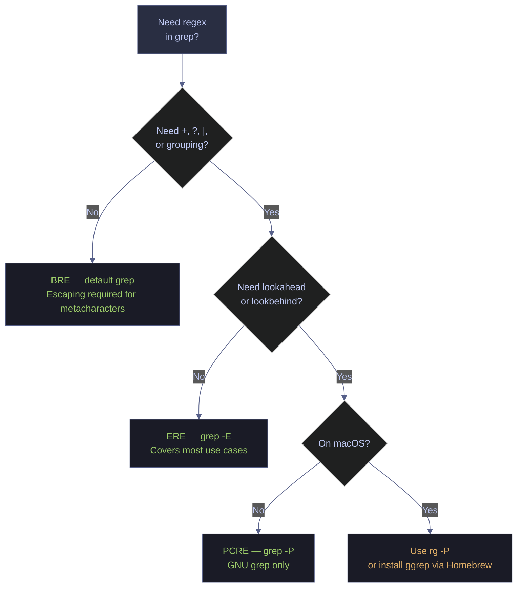
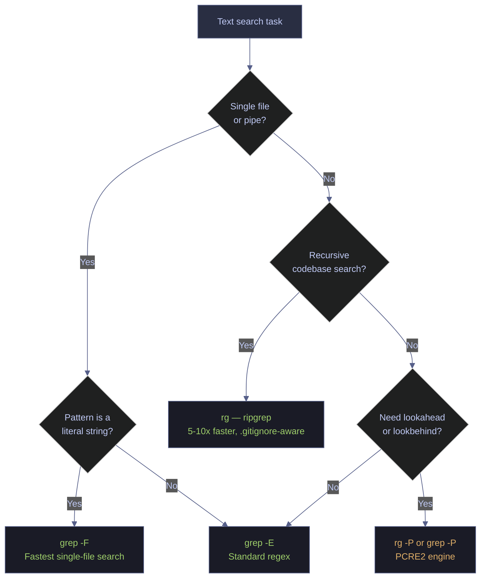

# grep and Pattern Matching

> [!quote]
> "Some people, when confronted with a problem, think 'I know, I'll use regular expressions.' Now they have two problems."
>
> — **Jamie Zawinski**, alt.religion.emacs post (1997)

`grep` (Global Regular Expression Print) is the foundational text search tool in Unix/Linux environments and the daily workhorse of log analysis, pipeline debugging, and code archaeology for data engineers. The regex syntax used here is the same pattern language available in [Python's re module](https://alp78.github.io/elysium/02-Programming-Languages/Python/02_py_strings) and [C#'s Regex class](https://alp78.github.io/elysium/02-Programming-Languages/CSharp/02_cs_strings), so patterns you learn here transfer directly to application code. While grep finds matches, [sed-stream-editing](https://alp78.github.io/elysium/01-Shell/Text-Processing/sed-stream-editing) complements it by editing the matched lines in place.

This note covers `grep` exhaustively alongside PowerShell's `Select-String` equivalent, so every technique is immediately usable regardless of which environment you are working in.

---

## Basic Pattern Matching

The core grep flags cover the most frequent search operations: case-insensitive matching, whole-word search, line counting, filename-only output, recursive directory traversal, and result inversion. Each flag maps directly to a PowerShell `Select-String` parameter or pipeline pattern.

### grep | syntax fundamentals

The basic invocation takes a pattern and one or more file paths. grep reads each file line by line and prints every line containing a match for the pattern. When no file is specified, grep reads from standard input.

#### Search a single file

```bash
grep 'pattern' file.txt
```

#### Search multiple files

```bash
grep 'pattern' file1.txt file2.txt
```

When searching multiple files, grep prefixes each matching line with the filename.

#### Search with a glob pattern

```bash
grep 'ERROR' *.log
```

The shell expands `*.log` to all `.log` files in the current directory before passing them to grep.

#### Read from standard input via pipe

```bash
cat file.txt | grep 'pattern'
```

Piping input to grep is the standard pattern for filtering output from other commands.

#### Select-String | syntax fundamentals

`Select-String` (alias: `sls`) is the PowerShell equivalent of grep. It accepts `-Pattern` for the regex and `-Path` for the target file. `Get-Content` replaces `cat` for pipeline input.

```powershell
Select-String -Pattern 'pattern' -Path file.txt
```

```powershell
Select-String -Pattern 'ERROR' -Path *.log
```

```powershell
Get-Content file.txt | Select-String 'pattern'
```

---

### grep -i | case-insensitive search

The `-i` flag makes grep ignore case distinctions in both the pattern and the input, matching uppercase, lowercase, and mixed-case variations such as `ERROR`, `error`, `Error`, and `eRRoR`.

```bash
grep -i 'error' application.log
```

Combine `-i` with `-r` to search an entire directory tree case-insensitively.

```bash
grep -ri 'password' /etc/
```

#### Select-String | case-insensitive search

`Select-String` is case-insensitive by default — no flag is needed. To force case-sensitive matching, add the `-CaseSensitive` switch.

```powershell
Select-String -Pattern 'error' -Path application.log
```

```powershell
Select-String -Pattern 'error' -Path application.log -CaseSensitive
```

> [!tip] Case sensitivity defaults differ
>
> `grep` requires `-i` to be case-insensitive. `Select-String` is case-insensitive by default and requires `-CaseSensitive` to enforce case. Keep this inverted default in mind when porting scripts.

---

### grep -w | whole-word matching

The `-w` flag restricts matches to whole words only — the pattern must be bounded by non-word characters (or the start/end of a line). This prevents `log` from matching `logfile`, `catalog`, or `blog`.

```bash
grep -w 'log' deployment.log
```

Combine `-w` with `-i` for case-insensitive whole-word matching.

```bash
grep -wi 'error' app.log
```

Useful for SQL safety — avoids matching `DROPDOWN` or `TEARDROP` when searching for `DROP`.

```bash
grep -w 'DROP' schema_migration.sql
```

#### Select-String | whole-word matching

PowerShell has no `-w` equivalent flag. Use `\b` word boundary anchors in the regex pattern instead.

```powershell
Select-String -Pattern '\blog\b' deployment.log
```

```powershell
Select-String -Pattern '\bDROP\b' schema_migration.sql -CaseSensitive
```

---

### grep -n | line numbers

The `-n` flag prefixes each matching line with its line number, essential for navigating large files and pinpointing matches.

```bash
grep -n 'FAILED' etl_pipeline.log
```

Combine with `-i` for case-insensitive search with line numbers.

```bash
grep -ni 'timeout' job.log
```

#### Select-String | line numbers in output

`Select-String` always populates the `.LineNumber` property on its output objects — it appears in default output. To see only the line number and matched text, project with `Select-Object`.

```powershell
Select-String -Pattern 'FAILED' etl_pipeline.log
```

```powershell
Select-String -Pattern 'FAILED' etl_pipeline.log |
    Select-Object LineNumber, Line
```

---

### grep -c | count matches

The `-c` flag prints the count of matching lines instead of the lines themselves. Each line counts once regardless of how many times the pattern appears within it.

```bash
grep -c 'ERROR' application.log
```

When searching multiple files, grep prints `filename:count` for each file.

```bash
grep -c 'ERROR' *.log
```

Combine with `-v` to count non-matching lines (lines without `ERROR`).

```bash
grep -cv 'ERROR' application.log
```

#### Select-String | count matches

Access the `.Count` property on the result array, or use `Measure-Object` for more detail. For per-file counts across multiple files, iterate with `ForEach-Object`.

```powershell
(Select-String -Pattern 'ERROR' application.log).Count
```

```powershell
Get-ChildItem *.log | ForEach-Object {
    $count = (Select-String -Pattern 'ERROR' $_.FullName).Count
    [PSCustomObject]@{ File = $_.Name; Count = $count }
}
```

---

### grep -l, -L | files with and without matches

The `-l` flag prints only the filenames that contain at least one match — not the matching lines themselves. The `-L` flag is its inverse: it prints filenames that do not contain the pattern.

#### List files containing the pattern

```bash
grep -l 'api_key' *.py *.cfg *.env
```

#### List files NOT containing the pattern

```bash
grep -L 'logging.basicConfig' *.py
```

#### Find which log files have errors

```bash
grep -l 'ERROR' /var/log/myapp/*.log
```

#### Select-String | files with and without matches

For files with matches, project the `.Filename` property with `-Unique`. For files without matches, compute the set difference manually.

```powershell
Select-String -Pattern 'api_key' -Path *.py, *.cfg |
    Select-Object -ExpandProperty Filename -Unique
```

```powershell
$allFiles = Get-ChildItem *.py | Select-Object -ExpandProperty FullName
$withMatches = Select-String -Pattern 'logging.basicConfig' -Path *.py |
    Select-Object -ExpandProperty Filename -Unique
$allFiles | Where-Object { $_ -notin $withMatches }
```

---

### grep -r | recursive search

The `-r` flag searches all files under a directory recursively. `-R` is identical but also follows symbolic links. Combine with `--include` and `--exclude-dir` to narrow scope.

#### Recursively search all files under a directory

```bash
grep -r 'TODO' ./src/
```

#### Follow symlinks during recursive search

`-R` follows symbolic links; `-r` does not. Use `-R` when your project includes symlinked directories.

```bash
grep -R 'TODO' ./src/
```

#### Combine recursive with case-insensitive and line numbers

A common combo for code archaeology across a project.

```bash
grep -rin 'deprecated' ./dags/
```

#### Filter by file type with --include

```bash
grep -r --include='*.py' 'def transform' ./pipelines/
```

#### Exclude directories from recursive search

```bash
grep -r --exclude-dir='.git' --exclude-dir='__pycache__' 'secret' .
```

#### Use multiple --include patterns

```bash
grep -r --include='*.sql' --include='*.py' 'staging_table' ./
```

#### Get-ChildItem -Recurse | Select-String | recursive search

PowerShell achieves recursive search by piping `Get-ChildItem -Recurse` into `Select-String`. Use `-Filter` for file type filtering and `Where-Object` for directory exclusion.

```powershell
Get-ChildItem -Recurse -Filter *.py | Select-String -Pattern 'def transform'
```

```powershell
Get-ChildItem -Recurse | Select-String -Pattern 'TODO'
```

```powershell
Get-ChildItem -Recurse |
    Where-Object { $_.FullName -notmatch '\\\.git\|__pycache__' } |
    Select-String -Pattern 'secret'
```

---

### grep -v | invert match (exclude lines)

The `-v` flag inverts the match — grep prints every line that does NOT contain the pattern. This is used for filtering out noise (debug lines, comments, blanks) from output.

#### Exclude all lines containing a pattern

```bash
grep -v 'DEBUG' application.log
```

#### Exclude comment lines and blank lines from a config file

Chain two `-v` calls: one for comment lines, one for empty lines.

```bash
grep -v '^#' my_config.ini | grep -v '^$'
```

#### The self-exclusion trick in process lists

When grepping `ps` output, the grep process itself matches. The bracket trick avoids this by making the regex differ from the literal process name.

```bash
ps aux | grep '[p]ython'
```

#### Exclude multiple patterns with grep -Ev

Chaining multiple `grep -v` calls reads the data multiple times through the pipe. Using `grep -Ev` with alternation applies all exclusions in a single pass.

```bash
grep -Ev 'INFO|DEBUG|^$' app.log
```

#### Select-String -NotMatch | invert match (exclude lines)

The `-NotMatch` switch inverts the match. Use alternation in the pattern to exclude multiple patterns in one call.

```powershell
Select-String -Pattern 'DEBUG' application.log -NotMatch
```

```powershell
Get-Content my_config.ini |
    Select-String -Pattern '^#' -NotMatch |
    Select-String -Pattern '^\s*$' -NotMatch
```

```powershell
Select-String -Pattern 'INFO|DEBUG|^\s*$' application.log -NotMatch
```

In PowerShell, the self-exclusion trick is unnecessary — `Get-Process` returns typed objects, so there is no grep process to match.

```powershell
Get-Process | Where-Object { $_.ProcessName -like '*python*' }
```

> [!tip] Use -Ev over chained grep -v
>
> Two chained `grep -v` calls read the file twice through the pipe. Using `grep -Ev 'pattern1|pattern2'` applies both exclusions in a single pass, which matters on large log files.

---

## Regular Expression Patterns

grep supports three regex dialects with increasing expressive power: Basic Regular Expressions (BRE) are the default, Extended Regular Expressions (ERE) via `-E` add quantifiers and alternation without escaping, and Perl-Compatible Regular Expressions (PCRE) via `-P` unlock lookahead, lookbehind, and shorthand character classes. PowerShell's `Select-String` uses .NET regex, which provides PCRE-equivalent features by default.



### grep | basic regular expressions (BRE)

`grep` without `-E` uses Basic Regular Expressions (BRE). In BRE, metacharacters `(`, `)`, `{`, `}`, `+`, `?`, and `|` require backslash escaping to function as regex operators. The characters `.`, `*`, `^`, `$`, `[`, and `]` are active by default.

#### . — match any single character

The dot matches any single character except newline.

```bash
grep 'err.r' app.log
```

Matches `error`, `err0r`, `err r`, and any other five-character string starting with `err` and ending with `r`.

#### * — zero or more of the preceding character

The asterisk matches zero or more occurrences of the preceding character. Unlike shell globbing where `*` means "anything," in regex `*` specifically repeats the previous element.

```bash
grep 'err*or' app.log
```

Matches `eror` (zero `r`s), `error` (one `r`), `errror` (two `r`s), and so on.

#### ^ and $ — line anchors

`^` anchors to the start of a line, `$` anchors to the end. Together, `^$` matches completely blank lines.

```bash
grep '^2026-03' app.log
```

```bash
grep 'success$' app.log
```

```bash
grep '^$' file.txt
```

#### [] and [^] — character classes

Square brackets define a character class — matching any one character in the set. Prefix with `^` inside the brackets to negate the class and match any character NOT in the set.

```bash
grep '[Ee]rror' app.log
```

```bash
grep '[0-9]' data.csv
```

```bash
grep '[^0-9]' data.csv
```

#### Escaping metacharacters in BRE

In BRE, parentheses and dots have special meaning. Backslash-escape them to match literal characters.

```bash
grep 'function\(\)' code.py
```

```bash
grep 'table_name\.' query.sql
```

#### Combining anchors and character classes

Combine `^` with a character class to match lines starting with specific character types.

```bash
grep '^[A-Z]' names.txt
```

#### Select-String | basic regex

PowerShell's `Select-String` uses .NET regex, where the same metacharacters (`.`, `*`, `^`, `$`, `[]`) apply without dialect differences. Use `-SimpleMatch` for literal string matching (equivalent to `grep -F`).

```powershell
Select-String -Pattern 'err.r' app.log
```

```powershell
Select-String -Pattern '^2026-03' app.log
```

```powershell
Select-String -Pattern '[Ee]rror' app.log
```

```powershell
Select-String -Pattern 'function()' code.py -SimpleMatch
```

---

### grep -E | extended regular expressions (ERE)

Extended Regular Expressions (ERE) enable `+`, `?`, `|`, `()`, and `{}` without backslash escaping. Always prefer `grep -E` over BRE for readability.

#### + — one or more of the preceding element

```bash
grep -E 'err+or' app.log
```

Matches `error` (one `r`), `errror` (two `r`s), but NOT `eror` (zero `r`s — `+` requires at least one).

#### ? — zero or one (optional match)

```bash
grep -E 'colou?r' docs.txt
```

Matches both `color` and `colour` — the `u` is optional.

#### | — alternation (OR)

```bash
grep -E 'ERROR|FATAL|CRITICAL' app.log
```

#### () — grouping

Parentheses group sub-expressions. The group can be quantified or followed by a required suffix.

```bash
grep -E '(ERROR|WARN): ' app.log
```

The colon and space must immediately follow the matched level word.

#### {} — repetition quantifiers

Curly braces specify exact or range repetitions: `{4}` means exactly four, `{1,3}` means one to three.

```bash
grep -E '[0-9]{4}-[0-9]{2}-[0-9]{2}' logs.txt
```

```bash
grep -E '[0-9]{1,3}' data.csv
```

#### Combine grouping and quantifiers

Repeat a grouped sub-expression to match structured patterns like IP addresses.

```bash
grep -E '([0-9]{1,3}\.){3}[0-9]{1,3}' access.log
```

> [!info] egrep is deprecated
>
> `egrep` is identical to `grep -E` but deprecated on many systems. Always use `grep -E` in new scripts for portability.

#### Select-String | extended regex

All ERE features — `+`, `?`, `|`, `()`, `{}` — work natively in .NET regex without any flags.

```powershell
Select-String -Pattern 'err+or' app.log
```

```powershell
Select-String -Pattern 'colou?r' docs.txt
```

```powershell
Select-String -Pattern 'ERROR|FATAL|CRITICAL' app.log
```

```powershell
Select-String -Pattern '[0-9]{4}-[0-9]{2}-[0-9]{2}' logs.txt
```

```powershell
Select-String -Pattern '([0-9]{1,3}\.){3}[0-9]{1,3}' access.log
```

---

### grep | POSIX character classes

POSIX character classes work inside `[:]` brackets and are more portable than hardcoded ASCII ranges. They are locale-aware, so `[:alpha:]` matches accented characters in locales that include them.

| Class | Matches | Equivalent range |
|---|---|---|
| `[:alpha:]` | Any letter (a–z, A–Z), locale-aware | `[a-zA-Z]` |
| `[:digit:]` | Any digit (0–9) | `[0-9]` |
| `[:alnum:]` | Letters and digits | `[a-zA-Z0-9]` |
| `[:space:]` | Space, tab, newline, CR, form feed, vertical tab | `[ \t\n\r\f\v]` |
| `[:blank:]` | Space and tab only (subset of `[:space:]`) | `[ \t]` |
| `[:upper:]` | Uppercase letters | `[A-Z]` |
| `[:lower:]` | Lowercase letters | `[a-z]` |
| `[:punct:]` | Punctuation characters | — |

#### Find lines starting with an uppercase letter

```bash
grep '^[[:upper:]]' file.txt
```

#### Find CSV lines where the first field is non-numeric

```bash
grep '^[[:alpha:]]' data.csv
```

#### Find lines with leading whitespace (indented lines)

```bash
grep '^[[:space:]]' script.py
```

> [!info] POSIX classes vs shorthand
>
> POSIX character classes (`[:digit:]`, `[:alpha:]`) work in BRE and ERE. Perl-style shortcuts (`\d`, `\w`, `\s`) require `grep -P`. In PowerShell's .NET regex, `\d`, `\w`, `\s` are always available.

---

### grep | common data engineering regex patterns

Recurring patterns that data engineers encounter daily: IP addresses, dates, emails, SQL references, JSON structures, log levels, and numeric values. Each pattern is shown in its simplest usable form and then refined for precision where needed.

#### Match IPv4 addresses

The simplified pattern matches any four groups of 1–3 digits separated by dots. It is fast but accepts invalid addresses like `999.999.999.999`. The precise version validates each octet to 0–255.

```bash
grep -E '([0-9]{1,3}\.){3}[0-9]{1,3}' access.log
```

```bash
grep -E '\b((25[0-5]|2[0-4][0-9]|[01]?[0-9][0-9]?)\.){3}(25[0-5]|2[0-4][0-9]|[01]?[0-9][0-9]?)\b' access.log
```

```powershell
Select-String -Pattern '\b((25[0-5]|2[0-4][0-9]|[01]?[0-9][0-9]?)\.){3}(25[0-5]|2[0-4][0-9]|[01]?[0-9][0-9]?)\b' access.log
```

#### Match ISO 8601 dates (YYYY-MM-DD)

ISO dates are the most common timestamp prefix in structured logs and data files. Anchor with `^` when the date is always the first field on the line. Extend with `T` and time components for full ISO datetime matching.

```bash
grep -E '[0-9]{4}-[0-9]{2}-[0-9]{2}' events.log
```

```bash
grep -E '^[0-9]{4}-[0-9]{2}-[0-9]{2}' events.log
```

```bash
grep -E '[0-9]{4}-[0-9]{2}-[0-9]{2}T[0-9]{2}:[0-9]{2}:[0-9]{2}' events.log
```

```powershell
Select-String -Pattern '^[0-9]{4}-[0-9]{2}-[0-9]{2}' events.log
```

#### Match various date formats

Different systems use different date formats. `MM/DD/YYYY` is common in US-locale applications, `DD-Mon-YYYY` appears in Oracle and SQL Server logs, and 10-digit Unix epoch timestamps appear in event systems.

```bash
grep -E '[0-9]{2}/[0-9]{2}/[0-9]{4}' report.log
```

```bash
grep -E '[0-9]{2}-[A-Za-z]{3}-[0-9]{4}' oracle.log
```

```bash
grep -E '\b[0-9]{10}\b' events.log
```

#### Match email addresses

This pattern is not RFC-5321 compliant but covers 99% of real-world email addresses. Use it for quick scans of data files and source code — not for email validation.

```bash
grep -E '[a-zA-Z0-9._%+-]+@[a-zA-Z0-9.-]+\.[a-zA-Z]{2,}' contacts.csv
```

Recursive variant to find email addresses embedded in Python source.

```bash
grep -rE '[a-zA-Z0-9._%+-]+@[a-zA-Z0-9.-]+\.[a-zA-Z]{2,}' --include='*.py' .
```

```powershell
Select-String -Pattern '[a-zA-Z0-9._%+-]+@[a-zA-Z0-9.-]+\.[a-zA-Z]{2,}' contacts.csv
```

#### Match SQL table names (schema.table)

Match schema-qualified table references like `dbo.fact_sales` or `raw.events`, CREATE TABLE statements, and INSERT INTO targets across SQL files.

```bash
grep -E '\b[a-zA-Z_][a-zA-Z0-9_]*\.[a-zA-Z_][a-zA-Z0-9_]*\b' query.sql
```

```bash
grep -iE '^[[:space:]]*CREATE[[:space:]]+TABLE' schema.sql
```

```bash
grep -iE 'INSERT[[:space:]]+INTO[[:space:]]+[`"]?[a-zA-Z_][a-zA-Z0-9_.]*[`"]?' *.sql
```

```powershell
Select-String -Pattern '(?i)^\s*CREATE\s+TABLE' schema.sql
```

```powershell
Select-String -Pattern '(?i)INSERT\s+INTO\s+[`"]?[a-zA-Z_][a-zA-Z0-9_.]*' *.sql
```

#### Match JSON keys

The `"key_name":` pattern matches JSON object keys. Use `-o` to extract key-value pairs. For structured JSON querying beyond simple key scans, use `jq` (bash) or `ConvertFrom-Json` (PowerShell).

```bash
grep -E '"[a-zA-Z_][a-zA-Z0-9_]*"\s*:' response.json
```

```bash
grep -E '"(error|status|message)"\s*:' api_log.json
```

```bash
grep -oE '"[a-zA-Z_][a-zA-Z0-9_]*"\s*:\s*"[^"]*"' data.json
```

```powershell
Select-String -Pattern '"[a-zA-Z_][a-zA-Z0-9_]*"\s*:' response.json
```

> [!warning] Use jq for real JSON parsing
>
> `grep` can find JSON keys but cannot handle multiline JSON, nested structures, or arrays correctly. For structured JSON querying, use `jq` in bash or `ConvertFrom-Json` in PowerShell. Grep is appropriate for quick scans of NDJSON (newline-delimited JSON) log files.

> [!success] Use jq for structured JSON queries
> `jq '.level' app.log` extracts the `level` field from every NDJSON record. `Get-Content app.log | ConvertFrom-Json | Where-Object level -eq 'ERROR'` achieves the same in PowerShell. Both handle nested structures, arrays, and multiline JSON that grep cannot.

#### Match log levels (ERROR, WARN, INFO, DEBUG)

Standard log levels appear in application logs in various formats. Word-boundary anchors prevent matching substrings like `INFORMATION` when searching for `INFO`. The loop pattern counts occurrences per severity level for quick triage.

```bash
grep -iE '\b(ERROR|FATAL|CRITICAL|WARN|WARNING|INFO|DEBUG|TRACE)\b' app.log
```

Filter to high-severity lines only.

```bash
grep -E '\b(ERROR|FATAL|CRITICAL)\b' app.log
```

Match lines where the log level appears at the start (structured log format).

```bash
grep -E '^(ERROR|WARN|INFO|DEBUG)[[:space:]]' structured.log
```

Count errors per log level in a single loop.

```bash
for level in ERROR WARN INFO DEBUG; do
    count=$(grep -c "\\b${level}\\b" app.log 2>/dev/null || echo 0)
    echo "${level}: ${count}"
done
```

```powershell
Select-String -Pattern '\b(ERROR|FATAL|CRITICAL)\b' app.log
```

```powershell
foreach ($level in @('ERROR','WARN','INFO','DEBUG')) {
    $count = (Select-String -Pattern "\b$level\b" app.log).Count
    [PSCustomObject]@{ Level = $level; Count = $count }
}
```

#### Match numeric ranges

Grep cannot perform numeric comparisons, but digit-count patterns and leading-digit patterns cover most practical filtering needs.

Lines containing a 3-to-5-digit number (HTTP status codes, port numbers).

```bash
grep -E '\b[0-9]{3,5}\b' access.log
```

HTTP 5xx server errors specifically.

```bash
grep -E '\b5[0-9]{2}\b' access.log
```

Negative numbers — useful for detecting data quality issues in financial data.

```bash
grep -E '-[0-9]+' financial_data.csv
```

Numbers with an optional decimal component (float values).

```bash
grep -E '\b[0-9]+(\.[0-9]+)?\b' metrics.log
```

---

## Advanced grep Usage

Beyond basic searching, grep offers context extraction, match-part isolation, pattern files, and fine-grained file filtering that transform it from a simple search tool into a log analysis and code archaeology instrument.

### grep -A, -B, -C | context lines

Context lines are critical for log analysis — the error message alone rarely tells the full story. `-A N` prints N lines after each match, `-B N` prints N lines before, and `-C N` prints N lines on both sides.

#### Show lines after a match (grep -A)

```bash
grep -A 3 'EXCEPTION' app.log
```

Shows the 3 lines of stack trace after each exception header.

#### Show lines before a match (grep -B)

```bash
grep -B 2 'Connection refused' app.log
```

Shows what triggered the connection attempt.

#### Show symmetric context (grep -C)

```bash
grep -C 5 'OOM' worker.log
```

Shows 5 lines before and after each out-of-memory event. When multiple matches appear, grep separates blocks with `--`.

#### Combine context with recursive search

```bash
grep -r -C 3 'raise ValueError' ./src/
```

#### Select-String -Context | lines before and after match

`-Context` takes two values: lines before, lines after. `-Context 0,3` is equivalent to `grep -A 3`, `-Context 2,0` to `grep -B 2`, and `-Context 5,5` to `grep -C 5`.

```powershell
Select-String -Pattern 'EXCEPTION' app.log -Context 0,3
```

```powershell
Select-String -Pattern 'OOM' worker.log -Context 5,5
```

Format context output for readability by iterating over `PreContext` and `PostContext` arrays.

```powershell
Select-String -Pattern 'FATAL' app.log -Context 2,2 |
    ForEach-Object {
        $_.Context.PreContext  | ForEach-Object { "  $_" }
        $_.Line
        $_.Context.PostContext | ForEach-Object { "  $_" }
        '---'
    }
```

---

### grep -o | print only the matching part

The `-o` flag prints only the matched substring — one match per line — instead of the full line. This turns grep into an extraction tool: pull dates, emails, IPs, or any structured value out of unstructured text.

#### Extract all dates from a log file

```bash
grep -oE '[0-9]{4}-[0-9]{2}-[0-9]{2}' app.log
```

#### Extract all email addresses

```bash
grep -oE '[a-zA-Z0-9._%+-]+@[a-zA-Z0-9.-]+\.[a-zA-Z]{2,}' contacts.txt
```

#### Extract all IP addresses

```bash
grep -oE '\b[0-9]{1,3}\.[0-9]{1,3}\.[0-9]{1,3}\.[0-9]{1,3}\b' access.log
```

#### Count unique extracted values

Pipe `-o` output through `sort | uniq -c | sort -rn` for a frequency-sorted histogram.

```bash
grep -oE '\b5[0-9]{2}\b' access.log | sort | uniq -c | sort -rn
```

#### Deduplicate extracted table names

The `-h` flag suppresses filenames when searching multiple files, producing clean output for `sort -u`.

```bash
grep -ohE '\b[a-zA-Z_][a-zA-Z0-9_]*\.[a-zA-Z_][a-zA-Z0-9_]*\b' *.sql | sort -u
```

#### Select-String .Matches | print only the matching part

Access the `.Matches.Value` property on `Select-String` output objects to get captured text. Pipe through `ForEach-Object` and `Sort-Object -Unique` for deduplication.

```powershell
(Select-String -Pattern '[0-9]{4}-[0-9]{2}-[0-9]{2}' app.log).Matches.Value
```

```powershell
Select-String -Pattern '[a-zA-Z0-9._%+-]+@[a-zA-Z0-9.-]+\.[a-zA-Z]{2,}' contacts.txt |
    ForEach-Object { $_.Matches } |
    Select-Object -ExpandProperty Value |
    Sort-Object -Unique
```

```powershell
Select-String -Pattern '\b[0-9]{3}\b' access.log |
    ForEach-Object { $_.Matches.Value } |
    Group-Object |
    Sort-Object Count -Descending
```

---

### grep -P | Perl-compatible regular expressions (PCRE)

`grep -P` enables PCRE (Perl-Compatible Regular Expressions), which adds lookahead, lookbehind, non-greedy quantifiers, named capture groups, and the `\d`, `\w`, `\s` shorthand classes. Not available on all systems — macOS's BSD grep does not support `-P`.

#### \d, \w, \s — PCRE shorthand character classes

`\d` matches a digit, `\w` matches a word character (letter, digit, or underscore), and `\s` matches whitespace.

```bash
grep -P '\d{4}-\d{2}-\d{2}' events.log
```

```bash
grep -P '\s+ERROR\s+' app.log
```

#### Lookahead — match only when followed by a pattern

Match `user` only when immediately followed by `=`.

```bash
grep -P 'user(?==)' config.ini
```

#### Negative lookahead — match only when NOT followed by a pattern

Match `password` unless followed by `_hash` — catches potential plaintext credential references.

```bash
grep -P 'password(?!_hash)' config.py
```

#### Lookbehind — extract the value after a known prefix

Match a number only when preceded by `port=`. Combined with `-o`, this extracts just the port number.

```bash
grep -oP '(?<=port=)\d+' config.ini
```

#### Non-greedy quantifier *? — match the shortest possible string

Greedy `.*` would match `<tag>content</tag>` as a single match. Non-greedy `.*?` produces two separate matches: `<tag>` and `</tag>`.

```bash
echo '<tag>content</tag>' | grep -oP '<.*?>'
```

#### Named capture groups

```bash
grep -oP '(?P<year>\d{4})-(?P<month>\d{2})-(?P<day>\d{2})' events.log
```

#### Select-String | lookahead and lookbehind

PowerShell's .NET regex supports `\d`, `\w`, `\s`, lookahead, lookbehind, and non-greedy quantifiers natively — no special flag is needed.

```powershell
Select-String -Pattern '\d{4}-\d{2}-\d{2}' events.log
```

```powershell
Select-String -Pattern 'user(?==)' config.ini
```

```powershell
Select-String -Pattern 'password(?!_hash)' config.py
```

Extract the port number using lookbehind.

```powershell
(Select-String -Pattern '(?<=port=)\d+' config.ini).Matches.Value
```

Non-greedy matching with `-AllMatches` to capture each tag separately.

```powershell
'<tag>content</tag>' | Select-String -Pattern '<.*?>' -AllMatches |
    ForEach-Object { $_.Matches.Value }
```

> [!warning] grep -P is not portable
>
> `grep -P` is GNU grep only. macOS's BSD grep does not support it. On macOS, install `grep` via Homebrew (`brew install grep`) and use `ggrep -P`, or use `perl -ne 'print if /pattern/'` as a portable alternative. In CI/CD pipelines targeting Linux, `-P` is safe.

> [!success] Use grep -E for portable extended regex, or ripgrep for PCRE everywhere
> `grep -E` (ERE) covers the vast majority of regex needs and works on both GNU and BSD grep. If you need lookaheads or lookbehinds, `rg -P` (ripgrep) supports PCRE2 on all platforms — Linux, macOS, and Windows — without any additional setup.

---

### grep -f | patterns from a file

The `-f` flag reads search patterns from a file — one pattern per line. This is useful for maintaining a curated watchlist of error signatures in version control alongside your runbooks.

Given a pattern file `error_patterns.txt` containing one pattern per line (`EXCEPTION`, `Connection refused`, `OOM`, `Segmentation fault`):

```bash
grep -f error_patterns.txt application.log
```

Combine `-f` with other flags for case-insensitive or recursive searches.

```bash
grep -if error_patterns.txt application.log
```

```bash
grep -rf error_patterns.txt /var/log/
```

#### Select-String | patterns from a file

PowerShell has no direct `-f` equivalent. Read the patterns, join them with `|` into an alternation string, and pass the result to `-Pattern`.

```powershell
$patterns = Get-Content error_patterns.txt
$combined = $patterns -join '|'
Select-String -Pattern $combined application.log
```

---

### grep --include, --exclude | file filtering in recursive search

When searching recursively, `--include` restricts the search to matching filenames, `--exclude` skips matching filenames, and `--exclude-dir` skips entire directories. These filters prevent grep from wasting time on irrelevant or binary files.

#### Search only Python files

```bash
grep -r --include='*.py' 'import pandas' ./
```

#### Search multiple file types

```bash
grep -r --include='*.sql' --include='*.py' 'staging_' ./pipelines/
```

#### Exclude test files from search

```bash
grep -r --include='*.py' --exclude='test_*.py' 'def load' ./
```

#### Exclude directories

```bash
grep -r --exclude-dir='.git' --exclude-dir='__pycache__' --exclude-dir='node_modules' 'TODO' .
```

#### Exclude compiled and binary files

```bash
grep -r --exclude='*.pyc' --exclude='*.pyo' --exclude-dir='.git' 'connection_string' .
```

#### Get-ChildItem -Include -Exclude | file filtering in recursive search

PowerShell achieves file filtering through `Get-ChildItem` parameters (`-Filter`, `-Include`) and pipeline filtering (`Where-Object`) before piping to `Select-String`.

```powershell
Get-ChildItem -Recurse -Filter *.py | Select-String -Pattern 'import pandas'
```

```powershell
Get-ChildItem -Recurse -Include *.sql, *.py | Select-String -Pattern 'staging_'
```

```powershell
Get-ChildItem -Recurse -Filter *.py |
    Where-Object { $_.FullName -notmatch '\\\.git\|__pycache__' } |
    Select-String -Pattern 'TODO'
```

```powershell
Get-ChildItem -Recurse -Filter *.py |
    Where-Object { $_.Name -notlike 'test_*' } |
    Select-String -Pattern 'def load'
```

---

### grep -z, -Z | null-delimited output

The `-Z` flag prints a NUL byte (`\0`) after each filename instead of a newline, making the output safe for `xargs -0` when paths contain spaces or special characters. The `-z` flag treats input as NUL-delimited.

#### Pipe filenames safely to xargs

```bash
grep -rlZ 'TODO' . | xargs -0 sed -i 's/TODO/FIXME/g'
```

#### Process find output with spaces in paths

```bash
find . -name '*.log' -print0 | xargs -0 grep -l 'ERROR'
```

---

### grep | combining with pipes

Grep's power multiplies when piped with other Unix tools. Chain grep calls for progressive narrowing, pipe to `cut` or `awk` for field extraction, and pipe to `wc -l` for counting.

#### The self-exclusion bracket trick

When grepping `ps` output, the grep process itself appears in the results. The bracket trick `[p]ython` creates a regex that matches `python` but does not match the literal string `[p]ython` in the process list.

```bash
ps aux | grep '[p]ython'
```

#### Chain grep for progressive narrowing

```bash
cat access.log | grep 'POST' | grep '/api/' | grep '500'
```

#### Count after filtering

```bash
grep 'ERROR' app.log | grep '2026-03-22' | wc -l
```

#### Extract fields after pattern match (grep + cut)

```bash
grep 'user_id' events.log | cut -d'=' -f2 | sort -u
```

#### Extract the last field with awk

```bash
grep 'FAILED' pipeline.log | awk '{print $NF}'
```

#### Stop after the first N matches with head

```bash
grep -r 'deprecated_function' ./src/ | head -20
```

#### Select-String | combining with pipes for progressive filtering

PowerShell pipelines pass objects rather than text, so progressive narrowing uses chained `Select-String` calls. Field extraction uses `-split` or `.Line` property access.

```powershell
Get-Content access.log |
    Select-String 'POST' |
    Select-String '/api/' |
    Select-String '500'
```

```powershell
(Get-Content app.log | Select-String 'ERROR' | Select-String '2026-03-22').Count
```

```powershell
Select-String 'user_id' events.log |
    ForEach-Object { ($_.Line -split '=')[1].Trim() } |
    Sort-Object -Unique
```

`Select-Object -First N` replaces `head -N` in PowerShell.

```powershell
Select-String -Pattern 'deprecated_function' (Get-ChildItem -Recurse -Filter *.py) |
    Select-Object -First 20
```

---

### grep -q | quiet mode (exit code only)

The `-q` flag suppresses all output and makes grep return only an exit code: `0` if at least one match was found, `1` if no match, `2` on error. This is the idiomatic way to use grep in shell conditionals.

```bash
if grep -q 'ERROR' app.log; then
    echo "Errors found — sending alert"
fi
```

```bash
grep -q 'pattern' file.txt && echo "found" || echo "not found"
```

#### Select-String -Quiet | exit code only

`Select-String -Quiet` returns `$true` or `$false` instead of match objects, making it suitable for conditionals.

```powershell
if (Select-String -Pattern 'ERROR' app.log -Quiet) {
    Write-Output "Errors found — sending alert"
}
```

---

### grep -e | multiple explicit patterns

The `-e` flag specifies an explicit pattern. Multiple `-e` flags act as an OR — any pattern match produces output. This is an alternative to `grep -E 'pat1|pat2'` that does not require regex alternation syntax and works with fixed strings.

```bash
grep -e 'ERROR' -e 'FATAL' -e 'CRITICAL' app.log
```

```bash
grep -e 'TODO' -e 'FIXME' -e 'HACK' ./src/*.py
```

---

### grep -m | stop after N matches

The `-m N` flag tells grep to stop reading the file after N matching lines. On large files this saves significant time when you only need to confirm the presence of a pattern or see the first few occurrences.

```bash
grep -m 5 'ERROR' large_app.log
```

The recursive variant with `-m 1` stops at the first match per file — equivalent to checking each file for the existence of a pattern.

```bash
grep -rm 1 'deprecated_function' ./src/
```

#### Select-Object -First | stop after N matches

```powershell
Select-String -Pattern 'ERROR' large_app.log | Select-Object -First 5
```

---

### grep -x | match entire lines

The `-x` flag matches only entire lines — the pattern must match the full line, not just a substring. Useful for exact-match lookups against a list of known values.

```bash
grep -x 'COMPLETED' status_codes.txt
```

Combine with `-F` for fixed-string whole-line matching without regex.

```bash
grep -xF 'admin@example.com' allowed_users.txt
```

---

### grep --color | highlight matches

The `--color` flag highlights the matching text in terminal output using ANSI escape codes. Values are `auto` (color when output is a terminal), `always` (force color even through pipes), and `never` (disable).

```bash
grep --color=auto 'ERROR' app.log
```

Use `always` when piping to `less` or `tee`, since `auto` disables color for non-terminal output. Pass `-R` to `less` so it renders ANSI codes.

```bash
grep --color=always 'pattern' file.txt | less -R
```

> [!tip] Add grep color alias to .bashrc
>
> Add `alias grep='grep --color=auto'` to your `~/.bashrc` or `~/.zshrc` to enable color highlighting by default in all interactive grep calls. Most modern Linux distributions already set this alias.

---

## Data Engineering Scenarios

The patterns in this section combine grep flags and regex techniques from the previous sections into complete, copy-paste-ready solutions for the tasks data engineers face daily: log analysis, deadlock hunting, table reference tracking, credential scanning, CSV validation, and error frequency analysis.

### Search log files for errors

Searching application logs for errors is the most common data engineering use of grep. Combine severity-level patterns, date filters, and real-time tailing to isolate issues quickly.

#### Find high-severity lines across all logs in a directory

```bash
grep -rE '\b(ERROR|FATAL|CRITICAL|EXCEPTION)\b' /var/log/myapp/
```

#### Find errors in today's log file

```bash
grep -E '\b(ERROR|FATAL)\b' /var/log/myapp/app-$(date +%Y-%m-%d).log
```

#### Filter errors by timestamp range

Chain a timestamp pattern with a severity filter to narrow to a specific time window. Adjust the hour pattern to match your log format.

```bash
grep -E '^2026-03-22 1[4-5]:' app.log | grep -E 'ERROR|FATAL'
```

#### Tail-and-grep in real time

The `--line-buffered` flag forces grep to flush each match immediately, preventing output delays during live monitoring.

```bash
tail -f /var/log/myapp/app.log | grep --line-buffered -E 'ERROR|FATAL'
```

#### Count errors per hour for spike detection

```bash
grep 'ERROR' app.log | grep -oE '^[0-9]{4}-[0-9]{2}-[0-9]{2} [0-9]{2}' | sort | uniq -c
```

#### Get-Content -Wait | Select-String | search log files for errors

`Get-Content -Wait -Tail 0` is the PowerShell equivalent of `tail -f`, monitoring the file for new lines and piping them to `Select-String`.

```powershell
Get-Content -Path app.log -Wait -Tail 0 | Select-String -Pattern 'ERROR|FATAL'
```

```powershell
$today = (Get-Date).ToString('yyyy-MM-dd')
Select-String -Pattern 'ERROR|FATAL' -Path "app-$today.log"
```

---

### Find SQL deadlocks in logs

Deadlock evidence appears differently across database platforms. SQL Server raises error 1205 and optionally captures XML deadlock graphs via Extended Events. PostgreSQL logs `deadlock detected` with the process wait chain. Always include context lines (`-B`) to see the transactions involved.

```bash
grep -iE 'deadlock|lock timeout|transaction.*rolled back|1205' sqlserver.log
```

```bash
grep -n 'deadlock-list' *.xel.txt
```

```bash
grep -iE 'deadlock detected|process.*waits for' /var/log/postgresql/postgresql-*.log
```

Show 5 lines before each deadlock mention to see the conflicting lock waits.

```bash
grep -B5 'deadlock' sqlserver.log
```

#### Select-String | find SQL deadlocks in logs

```powershell
Select-String -Pattern '(?i)deadlock|lock timeout|transaction.*rolled back' sqlserver.log -Context 5,0
```

---

### Search pipeline code for table references

Track which tables are referenced across Python DAGs, SQL scripts, and config files. This is essential for impact analysis before schema changes, migration planning, and detecting hardcoded environment names.

#### Find all references to a specific table

```bash
grep -rE '\bfact_sales\b' --include='*.py' --include='*.sql' --include='*.yaml' ./
```

#### Deduplicate all tables in a schema

```bash
grep -rE '\braw\.[a-zA-Z_]+\b' --include='*.sql' . | grep -oE '\braw\.[a-zA-Z_]+\b' | sort -u
```

#### Find hardcoded environment names in table references

Hardcoded `dev.`, `staging.`, or `prod.` prefixes break multi-environment pipelines.

```bash
grep -rE '"(dev|staging|prod)\.' --include='*.py' ./dags/
```

#### Find DML statements touching a specific table

```bash
grep -iE '(INSERT INTO|UPDATE|DELETE FROM)[[:space:]]+[`"]?orders[`"]?' *.sql
```

#### Select-String | search pipeline code for table references

```powershell
Get-ChildItem -Recurse -Include *.py, *.sql, *.yaml |
    Select-String -Pattern '\bfact_sales\b'
```

```powershell
Get-ChildItem -Recurse -Filter *.sql |
    Select-String -Pattern '\braw\.[a-zA-Z_]+\b' |
    ForEach-Object { $_.Matches.Value } |
    Sort-Object -Unique
```

---

### Find environment variable usage across configs

Audit how your codebase reads configuration to ensure secrets are not hardcoded and all environment dependencies are documented.

#### Find all environment variable reads in Python code

```bash
grep -rE 'os\.environ|os\.getenv' --include='*.py' ./
```

#### Find references to a specific env var

```bash
grep -rE '\bDB_PASSWORD\b|\bDATABASE_URL\b' --include='*.py' --include='*.env.example' .
```

#### Find .env files with potential credential exposure

```bash
find . -name '*.env' | xargs grep -l 'password|secret|key' 2>/dev/null
```

#### Find hardcoded credential patterns in source code

```bash
grep -rE '(password|secret|api_key|token)\s*=\s*["\x27][^"\x27]+["\x27]' \
    --include='*.py' --include='*.js' --include='*.yaml' .
```

#### Select-String | find environment variable usage across configs

```powershell
Get-ChildItem -Recurse -Filter *.py |
    Select-String -Pattern 'os\.environ|os\.getenv'
```

```powershell
Get-ChildItem -Recurse -Include *.py, *.yaml, *.json |
    Select-String -Pattern '(password|secret|api_key|token)\s*=\s*["\x27][^"\x27]+'
```

> [!warning] Never commit real credentials
>
> When searching for credential patterns to audit, run the search BEFORE a `git add` and add detected files to `.gitignore`. If credentials already appear in git history, use `git filter-repo` (not `git filter-branch`) to purge them.

> [!success] Scan before staging and add patterns to .gitignore
> Run `grep -rE 'AKIA[0-9A-Z]{16}|password\s*=' .` before `git add`. Add matching file paths to `.gitignore` immediately. For ongoing protection, use a pre-commit hook (`pre-commit` framework with `detect-secrets` or `gitleaks`) that blocks commits containing credential patterns.

---

### Extract specific fields from CSV using grep + cut

Grep can filter CSV rows by content, then `cut` extracts specific columns by delimiter. For numeric comparisons, grep pre-filters and `awk` handles the arithmetic. For structured CSV work in PowerShell, `Import-Csv` is always preferable to text-based parsing.

#### Extract a column from matching rows

Extract email (column 3) from lines where status is `active`.

```bash
grep 'active' users.csv | cut -d',' -f3
```

#### Pre-filter for awk numeric comparisons

Grep pre-filters by date prefix, then awk checks whether the revenue column (field 5) exceeds a threshold.

```bash
grep '2026-03' sales.csv | awk -F',' '$5 > 10000 {print $0}'
```

#### Extract specific columns from date-filtered rows

```bash
grep '^2026-03-22' timeseries.csv | cut -d',' -f1,4,5
```

#### Find CSV rows with empty mandatory fields

Consecutive commas indicate an empty field.

```bash
grep ',,' required_fields.csv
```

#### Find rows with the wrong number of columns

For a file that should have 7 fields (6 commas per line), invert-match the expected pattern.

```bash
grep -v '^[^,]*,[^,]*,[^,]*,[^,]*,[^,]*,[^,]*,[^,]*$' data.csv
```

#### Import-Csv | Select-Object | extract CSV fields (PowerShell)

`Import-Csv` turns every row into a typed object with named properties. Use `Where-Object` for filtering and `Select-Object` for projection — no delimiter counting needed.

```powershell
$active = Import-Csv users.csv | Where-Object { $_.status -eq 'active' } | Select-Object email
```

```powershell
Get-Content required_fields.csv | Select-String -Pattern ',,'
```

```powershell
Get-Content data.csv | Where-Object { ($_ -split ',').Count -ne 7 }
```

> [!tip] Use Import-Csv for CSV in PowerShell
>
> PowerShell's `Import-Csv` turns every row into a typed object with named properties. This is almost always better than `grep | cut` for CSV manipulation. Use `Select-String` on CSVs only for quick keyword scans where you don't need field-level access.

---

### zgrep | search compressed log files

`zgrep` transparently decompresses gzip files and searches them without extracting to disk. Variants exist for other compression formats: `bzgrep` for bzip2 and `xzgrep` for xz.

```bash
zgrep 'ERROR' application.log.gz
```

Search multiple compressed files with extended regex.

```bash
zgrep -E 'ERROR|FATAL' /var/log/myapp/app.log.*.gz
```

```bash
zgrep -n 'EXCEPTION' archive.log.gz
```

Combine compressed and uncompressed log searches in a single stream.

```bash
{ zgrep 'ERROR' old.log.gz; grep 'ERROR' current.log; } | sort
```

`bzgrep` and `xzgrep` follow the same syntax for bzip2 and xz archives.

```bash
bzgrep 'ERROR' archive.log.bz2
```

```bash
xzgrep 'ERROR' archive.log.xz
```

#### PowerShell | search compressed files

PowerShell has no built-in zgrep equivalent. Use 7-Zip to decompress to stdout and pipe the result, or use .NET `GZipStream` for a native approach.

```powershell
& 7z e -so application.log.gz | Select-String 'ERROR'
```

```powershell
$fs = [System.IO.File]::OpenRead('application.log.gz')
$gz = New-Object System.IO.Compression.GZipStream($fs, [System.IO.Compression.CompressionMode]::Decompress)
$reader = New-Object System.IO.StreamReader($gz)
while ($null -ne ($line = $reader.ReadLine())) {
    if ($line -match 'ERROR') { Write-Output $line }
}
$reader.Close()
```

---

### Count error frequency

Counting errors by type, time window, or source file is the first step in triage. The patterns below combine `grep -c`, `grep -o`, and `sort | uniq -c` for frequency analysis.

#### Count total errors

```bash
grep -c 'ERROR' app.log
```

#### Count errors by type

Extract the error class after `ERROR:` and produce a frequency-sorted histogram.

```bash
grep 'ERROR' app.log | grep -oE 'ERROR: \w+' | sort | uniq -c | sort -rn
```

#### Count errors per minute for spike detection

```bash
grep 'ERROR' app.log | grep -oE '[0-9]{2}:[0-9]{2}' | sort | uniq -c
```

#### Count errors per source file

Filter out files with zero matches by excluding lines ending in `:0`.

```bash
grep -rc 'ERROR' /var/log/myapp/ | grep -v ':0$' | sort -t: -k2 -rn
```

#### Select-String | Group-Object | count error frequency

```powershell
Select-String -Pattern 'ERROR' app.log |
    ForEach-Object { [regex]::Match($_.Line, 'ERROR: \w+').Value } |
    Where-Object { $_ } |
    Group-Object |
    Sort-Object Count -Descending
```

```powershell
Select-String -Pattern 'ERROR' app.log |
    ForEach-Object { [regex]::Match($_.Line, '\d{2}:\d{2}').Value } |
    Group-Object |
    Sort-Object Name
```

---

### Find files containing credential patterns

Scan your codebase for hardcoded secrets before committing. Always use `-l` (filenames only) when reporting results to avoid printing actual secrets into logs or terminals.

#### Search for potential secret keywords

```bash
grep -r 'password|secret|api_key|token|private_key' \
    --include='*.py' --include='*.yaml' --include='*.json' \
    --include='*.env' --include='*.config' . | grep -v '#'
```

#### Find patterns that look like assigned secrets

Match credential keywords followed by an assignment operator and a quoted value at least 8 characters long.

```bash
grep -rE '(password|passwd|secret|api_key|apikey|token|auth)\s*[=:]\s*["\x27][^"\x27]{8,}' \
    --include='*.py' --include='*.js' .
```

#### Find AWS access key patterns

AWS access key IDs always start with `AKIA` followed by 16 uppercase alphanumeric characters.

```bash
grep -rE 'AKIA[0-9A-Z]{16}' .
```

#### Find private key headers

```bash
grep -rE '-----BEGIN (RSA |EC |OPENSSH )?PRIVATE KEY-----' .
```

#### Print only filenames to avoid log exposure

```bash
grep -rl 'password.*=.*["\x27]' --include='*.py' .
```

#### Select-String | find credential patterns in files

```powershell
Get-ChildItem -Recurse -Include *.py, *.yaml, *.json, *.config |
    Select-String -Pattern '(password|secret|api_key)\s*[=:]\s*["\x27][^"\x27]{8,}' |
    Select-Object -ExpandProperty Filename -Unique
```

```powershell
Get-ChildItem -Recurse | Select-String -Pattern 'AKIA[0-9A-Z]{16}' |
    Select-Object Filename, LineNumber
```

---

## Performance and Alternatives

When grep is too slow for large codebases or its regex engine is too limited, faster alternatives exist. `grep -F` avoids regex overhead for literal strings, and `ripgrep` (`rg`) offers 5–10x faster recursive search with automatic `.gitignore` awareness.



### grep -F | fixed-string search

The `-F` flag treats the pattern as a fixed (literal) string with no regex interpretation. This is significantly faster than regex matching because grep skips the regex engine entirely — use it whenever you know the exact string.

```bash
grep -F 'SELECT * FROM orders WHERE' query_log.txt
```

Fixed-string mode is also the safest way to search for strings containing regex metacharacters (`*`, `.`, `(`, `)`) without escaping each character.

```bash
grep -F 'price * quantity' formulas.txt
```

```bash
grep -F 'error.log' file_list.txt
```

```bash
grep -F '(production)' environment.txt
```

Combine with `-i` for case-insensitive literal matching.

```bash
grep -Fi 'select * from' query_log.txt
```

> [!info] fgrep is deprecated
>
> `fgrep` is identical to `grep -F` but deprecated on many systems. Always use `grep -F` in new scripts.

#### Select-String -SimpleMatch | fixed-string search

The `-SimpleMatch` flag disables regex and treats the pattern as a literal string.

```powershell
Select-String -Pattern 'SELECT * FROM orders' query_log.txt -SimpleMatch
```

```powershell
Select-String -Pattern 'price * quantity' formulas.txt -SimpleMatch -CaseSensitive
```

---

### grep -a, -I | binary file handling

By default, grep prints a `Binary file ... matches` message when it encounters a binary file. The `-I` flag skips binary files entirely — equivalent to `--binary-files=without-match`. The `-a` flag forces grep to treat binary files as text.

```bash
grep -I 'ERROR' *
```

```bash
grep -a 'ERROR' mixed_content.bin
```

> [!warning] grep -a on binary files
>
> Using `-a` on binary files can produce unprintable characters that corrupt terminal state. Use with caution.

> [!success] Use -I or ripgrep for safe binary handling
> `grep -rI 'pattern' .` skips all binary files. `rg` skips binary files by default without any flag.

---

### LC_ALL=C | locale trick for performance

Setting the locale to `C` (ASCII) before grep disables multibyte character handling, which can yield 3–10x speedup on large files. This is safe when the input is pure ASCII (which covers most English-language logs and code).

```bash
LC_ALL=C grep 'ERROR' huge_app.log
```

```bash
LC_ALL=C grep -rF 'connection_string' /var/log/
```

> [!warning] LC_ALL=C breaks Unicode matching
>
> Character classes like `[:alpha:]` and `\b` may produce incorrect results on files containing multibyte UTF-8 characters when `LC_ALL=C` is set. Only use on known-ASCII inputs.

> [!success] Combine LC_ALL=C with grep -F for maximum speed
> Application logs, CSV files, and source code in English are safe targets: `LC_ALL=C grep -F 'literal' huge.log`.

---

### rg | ripgrep — the modern alternative

`ripgrep` (`rg`) is a Rust-based tool that is 5–10x faster than GNU grep for recursive searches. It respects `.gitignore` by default, skips binary files, uses parallel directory traversal, and has full Unicode support. Install with `apt install ripgrep` (Debian/Ubuntu), `brew install ripgrep` (macOS), or `winget install BurntSushi.ripgrep.MSVC` (Windows).

#### Basic search

Syntax is the same as grep. Recursive search is the default — no `-r` flag needed. Line numbers are shown by default.

```bash
rg 'ERROR' app.log
```

```bash
rg 'def transform' ./pipelines/
```

#### Case-insensitive and fixed-string search

```bash
rg -i 'error' app.log
```

```bash
rg -F 'literal string' file.txt
```

#### Show only filenames or count matches

```bash
rg -l 'TODO' ./
```

```bash
rg -c 'ERROR' *.log
```

#### Context lines

```bash
rg -C 3 'EXCEPTION' app.log
```

#### Only matching part (like grep -o)

```bash
rg -o '[0-9]{4}-[0-9]{2}-[0-9]{2}' events.log
```

#### File type filter

`rg` has built-in type definitions (use `rg --type-list` to see all available types).

```bash
rg --type py 'import pandas' ./
```

```bash
rg --type sql 'CREATE TABLE' ./
```

#### Ignore specific files or directories

In addition to `.gitignore`, use `--glob` with `!` prefix to exclude patterns.

```bash
rg 'secret' --glob '!*.test.py' --glob '!node_modules'
```

#### Search hidden and .gitignore'd files

By default, rg skips hidden files and respects `.gitignore`. Override with `--hidden` and `--no-ignore`.

```bash
rg --hidden 'password' .
```

```bash
rg --no-ignore 'TODO' .
```

#### Multiline matching

```bash
rg --multiline 'BEGIN.*\nCOMMIT' transactions.sql
```

#### PCRE2 for advanced regex

`rg -P` enables PCRE2 for lookahead and lookbehind — works on Linux, macOS, and Windows.

```bash
rg -P '(?<=user=)\w+' config.ini
```

#### JSON output for scripting

```bash
rg --json 'ERROR' app.log | jq '.data.lines.text // empty'
```

#### rg | ripgrep in PowerShell

`rg` works identically on Windows. Combine with `ConvertFrom-Json` to process JSON output in PowerShell pipelines.

```powershell
rg 'ERROR' app.log
```

```powershell
rg -l 'TODO' ./src
```

```powershell
rg --type py 'def transform' ./
```

```powershell
rg --json 'ERROR' app.log | ConvertFrom-Json | Where-Object { $_.type -eq 'match' }
```

| Flag | Syntax | Description |
|---|---|---|
| `-i` | `rg -i 'pat'` | Case-insensitive search |
| `-F` | `rg -F 'str'` | Fixed/literal string (no regex) |
| `-w` | `rg -w 'pat'` | Whole-word matching |
| `-l` | `rg -l 'pat'` | Show only filenames with matches |
| `-c` | `rg -c 'pat'` | Count matches per file |
| `-o` | `rg -o 'pat'` | Print only matching part |
| `-n` | `rg -n 'pat'` | Show line numbers (default: on) |
| `-A N` | `rg -A 3 'pat'` | N lines after each match |
| `-B N` | `rg -B 3 'pat'` | N lines before each match |
| `-C N` | `rg -C 3 'pat'` | N lines context (before + after) |
| `-m N` | `rg -m 5 'pat'` | Stop after N matches per file |
| `-v` | `rg -v 'pat'` | Invert match (exclude lines) |
| `-x` | `rg -x 'pat'` | Match entire lines only |
| `-P` | `rg -P 'pat'` | Enable PCRE2 regex engine |
| `-U` | `rg -U 'pat'` | Enable multiline matching |
| `-r` | `rg -r 'rep' 'pat'` | Replace matches with a string |
| `--type` | `rg --type py 'pat'` | Search only files of a given type |
| `--type-list` | `rg --type-list` | List all built-in file types |
| `--glob` | `rg --glob '!*.test.py'` | Include/exclude files by glob |
| `--hidden` | `rg --hidden 'pat'` | Include hidden files in search |
| `--no-ignore` | `rg --no-ignore 'pat'` | Bypass .gitignore rules |
| `--json` | `rg --json 'pat'` | Output results as JSON |
| `--stats` | `rg --stats 'pat'` | Print search statistics after results |
| `--sort` | `rg --sort path 'pat'` | Sort results by path, modified, created |
| `--count-matches` | `rg --count-matches 'pat'` | Count individual matches (not lines) |

---

### grep vs rg vs ag | comparison

| Feature | `grep` | `rg` (ripgrep) | `ag` (silver searcher) |
|---|---|---|---|
| Speed (recursive) | Baseline | 5–10x faster | 3–5x faster |
| Respects `.gitignore` | No | Yes (default) | Yes (default) |
| Regex engine | BRE/ERE/PCRE | Rust regex (PCRE2 optional) | PCRE |
| Unicode support | Limited | Full | Good |
| Binary file handling | Searches (slow) | Skips (fast) | Skips |
| Install | Pre-installed everywhere | Must install | Must install |
| Parallel search | No | Yes (automatic) | Yes |
| Config file | No | `~/.ripgreprc` | `~/.agignore` |
| File type filtering | `--include` glob | `--type` named types | `--python`, etc. |
| Multiline matching | No (single-line only) | `--multiline` flag | Limited |
| PCRE2 lookahead | `grep -P` (GNU only) | `rg -P` | Yes |
| Windows support | Via Git Bash/WSL | Native | Via WSL/Cygwin |
| Output colorization | Yes | Yes (better) | Yes |

> [!tip] When to use grep vs rg
>
> - Use `grep` when it is already available and the task is simple (single file, small file, already in a pipe).
> - Use `rg` for any recursive codebase search — its speed and `.gitignore` awareness make it the clear choice.
> - Use `grep -F` / `rg -F` for literal string searches where regex overhead is unnecessary.
> - Use `grep -P` or `rg -P` when you need lookahead/lookbehind — but prefer `rg -P` as it works on macOS too.

---

## PowerShell Equivalents

This section consolidates PowerShell-specific tooling that does not fit under a Linux grep subsection: the complete flag mapping table, the legacy `findstr` command, the `MatchInfo` output object anatomy, and the `-AllMatches` parameter for multi-match extraction.

### Complete flag comparison table

Every grep flag mapped to its PowerShell `Select-String` equivalent or pipeline pattern.

| bash `grep` flag | Description | PowerShell `Select-String` equivalent |
|---|---|---|
| (none) | Case-sensitive search | `-CaseSensitive` (default is insensitive) |
| `-i` | Case-insensitive | (default behavior — no flag needed) |
| `-v` | Invert match | `-NotMatch` |
| `-n` | Line numbers | Always shown via `.LineNumber` property |
| `-c` | Count matches | `(...).Count` |
| `-l` | Files with matches | `... | Select-Object -ExpandProperty Filename -Unique` |
| `-L` | Files without matches | Requires set subtraction (see above) |
| `-r` / `-R` | Recursive | `Get-ChildItem -Recurse | Select-String` |
| `-E` | Extended regex | (default — .NET regex always supports ERE features) |
| `-P` | Perl regex (PCRE) | (default — .NET regex supports lookahead/lookbehind) |
| `-F` | Fixed/literal string | `-SimpleMatch` |
| `-w` | Whole word | Use `\b` word boundary in pattern |
| `-o` | Only matching part | `.Matches.Value` on result objects |
| `-A N` | N lines after | `-Context 0,N` |
| `-B N` | N lines before | `-Context N,0` |
| `-C N` | N lines context | `-Context N,N` |
| `-f file` | Patterns from file | Build combined pattern: `(Get-Content f) -join '|'` |
| `--include='*.py'` | Include file glob | `Get-ChildItem -Filter *.py` |
| `--exclude-dir=d` | Exclude directory | `Where-Object { $_.FullName -notmatch 'd' }` |
| `-h` | Suppress filenames | `.Line` property only |
| `-H` | Force filenames | `.Filename` property |
| `-m N` | Stop after N matches | `Select-Object -First N` |
| `-q` | Quiet (exit code only) | `[bool](Select-String ...)` |
| `-s` | Suppress error messages | `2>$null` or `-ErrorAction SilentlyContinue` |
| `-z` / `-Z` | Null-delimited | Not needed in PowerShell (objects, not text) |
| `-q` | Quiet (exit code only) | `-Quiet` (returns `$true`/`$false`) |
| `-e pat` | Explicit pattern (multiple) | Use alternation: `'pat1\|pat2'` |
| `-x` | Match entire line | Anchor pattern: `'^pattern$'` |
| `--color` | Highlight matches | N/A (Select-String highlights by default in console) |
| `-a` | Force text on binary files | N/A |
| `-I` | Skip binary files | N/A (Select-String only reads text files) |

---

### findstr | the legacy Windows alternative

`findstr` is the built-in Windows command-line string search tool (predates PowerShell). It is less capable than `grep` but available on every Windows system without installation, including contexts where PowerShell is restricted (e.g., Group Policy–constrained servers, `.bat` scripts).

#### Basic literal string search

```powershell
findstr "ERROR" application.log
```

#### Case-insensitive search (/I)

```powershell
findstr /I "error" application.log
```

#### Regular expression search (/R)

```powershell
findstr /R "ERR[0-9][0-9]" application.log
```

#### Recursive search (/S)

```powershell
findstr /S "password" C:\Projects\*.py
```

#### Print line numbers (/N)

```powershell
findstr /N "EXCEPTION" application.log
```

#### Whole-word match (/W)

```powershell
findstr /W "log" application.log
```

#### Invert match (/V)

```powershell
findstr /V "DEBUG" application.log
```

#### Patterns from a file (/G)

```powershell
findstr /G:patterns.txt application.log
```

#### Literal search with spaces (/C)

The `/C:` prefix treats the entire string (including spaces) as a single literal pattern.

```powershell
findstr /C:"literal string with spaces" application.log
```

#### Show only filenames (/M)

```powershell
findstr /S /M "api_key" C:\Projects\*.py
```

#### Multiple search strings

Space-separated strings match any of the terms.

```powershell
findstr "ERROR FATAL CRITICAL" application.log
```

#### Combine flags

```powershell
findstr /S /I /N "password" C:\Projects\*.cfg
```

| Flag | Syntax | Description |
|---|---|---|
| `/I` | `findstr /I "pat" file` | Case-insensitive search |
| `/R` | `findstr /R "pat" file` | Regular expression mode |
| `/S` | `findstr /S "pat" *.ext` | Recursive search through subdirectories |
| `/N` | `findstr /N "pat" file` | Prefix each match with its line number |
| `/W` | `findstr /W "pat" file` | Match whole words only |
| `/V` | `findstr /V "pat" file` | Invert match — print non-matching lines |
| `/G:file` | `findstr /G:pats.txt file` | Read patterns from a file |
| `/C:"str"` | `findstr /C:"str" file` | Literal string search (spaces included) |
| `/M` | `findstr /M "pat" *.ext` | Print matching filenames only |
| `/B` | `findstr /B "pat" file` | Match at the beginning of a line |
| `/E` | `findstr /E "pat" file` | Match at the end of a line |
| `/X` | `findstr /X "pat" file` | Match entire lines exactly |
| `/A:attr` | `findstr /A:1F "pat" file` | Set color attribute for matching text |

> [!tip] Prefer Select-String over findstr
>
> `findstr` has quirks: its regex flavor is non-standard (limited character classes, no `+` or `?` quantifiers in basic mode), and piping its output into further processing is error-prone due to encoding issues. Use `Select-String` for all PowerShell scripting. Reserve `findstr` only for `.bat` files or contexts where PowerShell is unavailable.

---

### Select-String output object structure

Understanding the `MatchInfo` object that `Select-String` returns enables powerful downstream processing.

```powershell
# Capture a result and inspect its properties
$result = Select-String -Pattern 'ERROR' app.log | Select-Object -First 1

$result.Filename        # Name of the file (without path)
$result.Path            # Full path to the file
$result.LineNumber      # Line number of the match
$result.Line            # Full text of the matching line
$result.Matches         # Collection of System.Text.RegularExpressions.Match objects
$result.Matches[0].Value       # The matched text
$result.Matches[0].Index       # Character position within the line
$result.Matches[0].Groups      # Named/numbered capture groups
$result.Context                # PreContext and PostContext lines (if -Context was used)
$result.Context.PreContext     # Array of lines before the match
$result.Context.PostContext    # Array of lines after the match

# Build a structured report from Select-String output
Select-String -Pattern '(ERROR|FATAL)' app.log |
    Select-Object Filename, LineNumber,
        @{Name='Level'; Expression={ $_.Matches[0].Value }},
        @{Name='Message'; Expression={ $_.Line.Trim() }} |
    Format-Table -AutoSize

# Export to CSV for analysis
Select-String -Pattern 'ERROR' *.log |
    Select-Object Filename, LineNumber, Line |
    Export-Csv -Path errors_report.csv -NoTypeInformation
```

---

### Select-String -AllMatches | find multiple matches per line

By default, `Select-String` returns one `MatchInfo` object per line, capturing only the first match. The `-AllMatches` switch captures every match within each line — essential when multiple values of interest appear on a single line.

#### Without -AllMatches — first match only

```powershell
$line = '192.168.1.1 GET /api/v1 200 192.168.1.2 GET /api/v2 404'
$line | Select-String -Pattern '\b\d{1,3}\.\d{1,3}\.\d{1,3}\.\d{1,3}\b' |
    ForEach-Object { $_.Matches.Value }
```

Returns only `192.168.1.1`.

#### With -AllMatches — all matches on the line

```powershell
$line | Select-String -Pattern '\b\d{1,3}\.\d{1,3}\.\d{1,3}\.\d{1,3}\b' -AllMatches |
    ForEach-Object { $_.Matches } |
    Select-Object -ExpandProperty Value
```

Returns both `192.168.1.1` and `192.168.1.2`.

#### Extract all table names from a SQL file

Multiple schema-qualified references can appear on a single line (e.g., in JOIN clauses).

```powershell
Select-String -Pattern '\b[a-zA-Z_]\w*\.[a-zA-Z_]\w*\b' query.sql -AllMatches |
    ForEach-Object { $_.Matches.Value } |
    Sort-Object -Unique
```

---

## Quick Reference Card

A condensed set of copy-paste one-liners for the most common grep and `Select-String` tasks, organized by use case. See the sections above for full explanations and context.

### Most-used grep one-liners for data engineers

```bash
# ── Log analysis ──────────────────────────────────────────────────────────────

# Show all errors with 5 lines of context for stack traces
grep -C 5 'ERROR|EXCEPTION' app.log

# Count errors by type, sorted by frequency
grep 'ERROR' app.log | grep -oE 'ERROR [A-Za-z]+' | sort | uniq -c | sort -rn

# Watch logs for errors in real time
tail -f app.log | grep --line-buffered -E 'ERROR|FATAL|CRITICAL'

# Find the first and last occurrence of a pattern
grep -n 'STARTED' pipeline.log | head -1   # first
grep -n 'STARTED' pipeline.log | tail -1   # last

# ── Code archaeology ──────────────────────────────────────────────────────────

# Find all TODO/FIXME/HACK comments across a project
grep -rn 'TODO|FIXME|HACK|XXX|BUG' --include='*.py' ./

# Find all functions in Python that start with 'load_'
grep -rn 'def load_' --include='*.py' ./

# Find all SQL files that reference a specific table
grep -rl 'orders' --include='*.sql' ./

# ── Data quality checks ───────────────────────────────────────────────────────

# Find CSV rows with empty fields (consecutive commas)
grep ',,' data.csv | head -20

# Find CSV rows with non-standard characters
grep -P '[^\x00-\x7F]' data.csv   # non-ASCII characters

# Find potential duplicates by looking for repeated IDs
grep -oE '^[0-9]+' records.csv | sort | uniq -d   # duplicated IDs

# ── Security audits ───────────────────────────────────────────────────────────

# Find hardcoded secrets (filenames only — don't log the secrets)
grep -rl 'password.*=.*["\x27]' --include='*.py' .

# Find AWS access keys
grep -rE 'AKIA[0-9A-Z]{16}' .

# Find open TODO security notes
grep -rn 'TODO.*security|FIXME.*auth|HACK.*password' .
```

```powershell
# ── PowerShell quick reference ────────────────────────────────────────────────

# Real-time error monitoring
Get-Content app.log -Wait -Tail 0 | Select-String 'ERROR|FATAL'

# Recursive code search with clean output
Get-ChildItem -Recurse -Filter *.py |
    Select-String 'def load_' |
    Select-Object Filename, LineNumber, Line

# Export error report to CSV
Select-String 'ERROR' *.log |
    Select-Object Filename, LineNumber, Line |
    Export-Csv errors.csv -NoTypeInformation

# Find files by content pattern
Get-ChildItem -Recurse -Filter *.sql |
    Select-String 'fact_sales' |
    Select-Object -ExpandProperty Filename -Unique
```

---

## Related Notes

- [reading-file-contents](https://alp78.github.io/elysium/01-Shell/Text-Processing/reading-file-contents) — `cat`, `head`, `tail`, `less` for viewing files before grepping
- [io-redirection](https://alp78.github.io/elysium/01-Shell/Scripting/io-redirection) — Redirect grep output to files, suppress stderr with `2>/dev/null`
- [finding-files](https://alp78.github.io/elysium/01-Shell/File-Operations/finding-files) — `find` and `Get-ChildItem` to locate files before grepping
- [command-chaining](https://alp78.github.io/elysium/01-Shell/Scripting/command-chaining) — Pipe grep output into `sort`, `uniq`, `wc`, `awk`, `cut`
- [process-substitution](https://alp78.github.io/elysium/01-Shell/Scripting/process-substitution) — Use `<(grep ...)` to feed grep output as a file argument
- [brace-expansion-and-globbing](https://alp78.github.io/elysium/01-Shell/Scripting/brace-expansion-and-globbing) — Glob patterns for targeting multiple files in grep
- [viewing-processes](https://alp78.github.io/elysium/01-Shell/Process-Management/viewing-processes) — `ps aux | grep` patterns for finding processes
- [defensive-scripting](https://alp78.github.io/elysium/01-Shell/Scripting/defensive-scripting) — Handle grep exit codes (0 = match found, 1 = no match, 2 = error)

> [!info] grep exit codes in scripts
>
> `grep` returns exit code `0` if at least one match is found, `1` if no matches, and `2` on error (e.g., file not found). In bash scripts, use `if grep -q 'pattern' file; then` to branch on whether a match exists without printing output (`-q` suppresses all output). In PowerShell, `Select-String` returns `$null` when there are no matches, which is falsy — use `if (Select-String ...)` directly.
