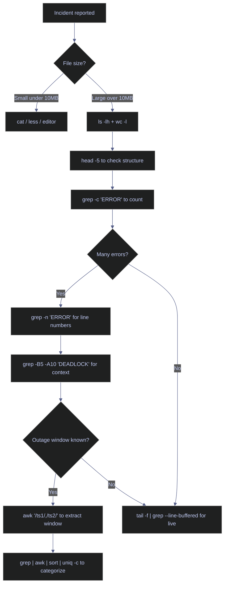

# Reading File Contents — From Quick Glance to Deep Analysis

> [!quote]
> "The most effective debugging tool is still careful thought, coupled with judiciously placed print statements."
>
> — **Brian Kernighan**, *Unix for Beginners* (1979)
>
> "Debugging is twice as hard as writing the code in the first place. Therefore, if you write the code as cleverly as possible, you are, by definition, not smart enough to debug it."
>
> — **Brian Kernighan**, *The Elements of Programming Style* (1974)

A senior data engineer reads files differently depending on context. Checking a config file means reading the whole thing. Investigating a 50GB log file means surgical extraction. Understanding a Parquet file means reading metadata, not data. Choosing the wrong tool turns a 30-second task into a server-killing operation.

## Linux file reading tools

The choice of tool depends entirely on file size. `cat` is fine for small config files. For anything over a few MB, stream with `head`, `tail`, or `grep` — never load the whole file into memory. `less` provides an interactive pager for exploration. During incidents, `tail -f | grep` and `awk` range patterns are the fastest path to answers.

### Linux | cat / head / tail | reading file contents

`cat` prints the entire file. `head` and `tail` limit to the first or last N lines. Both are essential for checking file structure without loading large files. `less` provides interactive paging with search (`/pattern`, `n` for next, `G` for end, `q` to quit, `F` to follow like `tail -f`).

#### Read an entire file

`cat` concatenates and prints to stdout. Use it for small config files and scripts — never on log files above a few hundred lines.

```bash
cat filename
```

#### Inspect file boundaries

`head` shows the first N lines (default 10), `tail` shows the last N lines. `head -n 1` extracts the CSV header row — always check this before loading into a dataframe.

```bash
head -n 20 data.csv
tail -n 20 data.csv
```

#### Extract a CSV header row

```bash
head -n 1 data.csv
```

| Flag | Syntax | Description |
|---|---|---|
| `-n N` | `head -n 20 file` | Show first N lines (head) or last N lines (tail) |
| `-c N` | `head -c 100 file` | Show first N bytes |
| `-q` | `head -q file1 file2` | Suppress filename headers when reading multiple files |
| `less +F` | `less +F file` | Open in follow mode (like `tail -f` but interactive) |
| `less +/pattern` | `less +/ERROR file` | Open at first occurrence of pattern |

### Linux | tail | live log following

`tail -f` keeps the file handle open and prints new lines as they are appended, making it the most-used command during production incidents. Without `--line-buffered`, piping `tail -f` through `grep` causes silent buffering — grep accumulates lines internally and flushes in large batches, so output appears to freeze.

#### Follow a log file in real-time

```bash
tail -f /var/log/pipeline/run.log
tail -f /var/log/pipeline/*.log
```

#### Filter a live log stream

> [!warning] --line-buffered required when piping tail -f through grep
>
> Without `--line-buffered`, grep buffers its output internally. You see nothing for minutes, then a large batch of lines. This makes it useless for live incident monitoring.

> [!success] Always add --line-buffered when filtering a live stream
> `tail -f ... | grep --line-buffered -E "ERROR|WARN"` flushes grep's output buffer on every matching line, giving real-time results.

```bash
tail -f /var/log/pipeline/run.log | grep --line-buffered -E "ERROR|WARN|DEADLOCK"
```

| Flag | Syntax | Description |
|---|---|---|
| `-f` | `tail -f file` | Follow: print new lines as they are appended |
| `-F` | `tail -F file` | Follow by name: re-open file if rotated |
| `-n N` | `tail -n 50 file` | Show last N lines before following |
| `--line-buffered` | `grep --line-buffered` | Flush output buffer on each matching line (required in pipes) |
| `-E` | `grep -E 'A\|B'` | Extended regex — pipe-OR pattern for multiple keywords |

### Linux | grep / awk | incident log analysis

When a 15GB log file needs triage during an outage, loading it into any editor is a mistake. The correct workflow streams through the file in stages: size check → structure check → error count → context extraction → time-window isolation → error categorization.

#### Check file size and line count

`wc -l` counts newlines only — it reads the file sequentially without loading it, making it fast even on very large files.

```bash
ls -lh pipeline.log
wc -l pipeline.log
```

#### Inspect log file structure

```bash
head -5 pipeline.log
```

```text
2025-03-09 14:23:01 INFO  [loader.ohlcv] Loaded 50 rows for ASML
2025-03-09 14:23:02 INFO  [loader.ohlcv] Loaded 50 rows for AAPL
2025-03-09 14:23:03 ERROR [loader.ohlcv] Connection timeout after 30s
```

#### Count and locate errors

`grep -c` gives a count without showing the lines — useful for assessing severity before committing to a full extraction. `grep -n` adds line numbers, which you can use with `sed` or `awk` for precise extraction.

```bash
grep -c "ERROR" pipeline.log
grep -n "ERROR" pipeline.log
```

#### Get context around a specific error

`-B N` shows N lines before the match (what happened leading up to the error), `-A N` shows N lines after (the immediate aftermath and recovery).

```bash
grep -n -B 5 -A 10 "DEADLOCK" pipeline.log
```

#### Extract a time window with awk

`awk` range patterns (`/start/,/stop/`) print every line from the first match to the second match inclusive. This is the fastest way to isolate a time window without loading the whole file. The output is piped to a temp file for further analysis in subsequent steps.

```bash
awk '/^2025-03-09 14:0/,/^2025-03-09 14:3/' pipeline.log > /tmp/outage_window.log
```

#### Categorize errors in the extracted window

`$NF` in awk refers to the last field on each line — in structured log formats this is often the error type or component name. `sort | uniq -c | sort -rn` counts occurrences and ranks them highest first.

```bash
grep "ERROR" /tmp/outage_window.log | awk '{print $NF}' | sort | uniq -c | sort -rn | head -10
```

| Flag | Syntax | Description |
|---|---|---|
| `-c` | `grep -c "pattern" file` | Print count of matching lines only |
| `-n` | `grep -n "pattern" file` | Prefix each matching line with its line number |
| `-B N` | `grep -B 5 "pattern" file` | Show N lines before each match |
| `-A N` | `grep -A 10 "pattern" file` | Show N lines after each match |
| `-C N` | `grep -C 3 "pattern" file` | Show N lines before AND after each match |
| `-E` | `grep -E 'A\|B'` | Extended regex |
| `$NF` | `awk '{print $NF}'` | Last field on the line |
| `/start/,/stop/` | `awk '/ts1/,/ts2/' file` | Print lines between two matching patterns (inclusive) |

### Linux | grep | performance flags for large files

For files over 1GB, standard `grep` performance degrades with complex regex patterns or recursive searches. Four techniques provide significant speedups.

#### Use fixed-string matching for literal patterns

`-F` uses a Boyer-Moore-Horspool algorithm instead of the regex engine, making it 3–5x faster for literal string searches where no metacharacters are needed.

```bash
grep -F "Connection timeout" pipeline.log
```

#### Limit match count with -m

`-m N` stops after N matches — if you only need the first few occurrences in a 50GB file, this exits the scan early and saves minutes.

```bash
grep -m 10 "ERROR" pipeline.log
```

#### Use ripgrep for recursive searches

`rg` respects `.gitignore`, uses multiple CPU threads, and is 5–10x faster than `grep -r` on typical codebases and log directories.

```bash
rg "ERROR" /var/log/pipeline/
```

#### Force C locale for ASCII data

`LC_ALL=C` disables Unicode character-class handling. For ASCII-only log data, this removes the UTF-8 processing overhead and can be 4x faster.

```bash
LC_ALL=C grep "ERROR" pipeline.log
```

| Flag | Syntax | Description |
|---|---|---|
| `-F` | `grep -F "literal"` | Fixed-string match (no regex) — 3–5x faster for literals |
| `-m N` | `grep -m 10 "pattern"` | Stop after N matches |
| `-r` | `grep -r "pattern" /dir` | Recursive search across a directory |
| `LC_ALL=C` | `LC_ALL=C grep ...` | Force C locale — skips Unicode, 4x faster for ASCII data |
| `rg` | `rg "pattern" /dir` | ripgrep — multi-threaded, `.gitignore`-aware, PCRE2 |

## PowerShell file reading tools

PowerShell file reading uses `Get-Content` (aliased `cat`, `type`, `gc`) for streaming lines as strings, and `Select-String` for pattern matching. Both operate on objects rather than raw text, which means you can pipe results directly to `Where-Object`, `Sort-Object`, and `Group-Object` for in-memory analysis.

### PowerShell | Get-Content | reading file contents

`Get-Content` reads a file and returns each line as a string object in an array. `-Head` and `-Tail` mirror `head -n` and `tail -n`. `-Raw` returns the entire file as a single string — use this when you need to parse multi-line content (e.g. JSON files).

#### Read an entire file or inspect boundaries

```powershell
Get-Content filename
Get-Content filename -Head 20
Get-Content filename -Tail 20
Get-Content filename -Raw
```

#### Extract a CSV header row

```powershell
Get-Content data.csv -Head 1
```

### PowerShell | Get-Content | live log following

#### Follow a log file in real-time

`-Wait` polls for new lines and streams them to the pipeline. `-Tail 10` starts from the last 10 lines rather than from the beginning of the file.

```powershell
Get-Content filename -Wait -Tail 10
```

#### Filter a live log stream

`Where-Object` filters the object stream in real-time, equivalent to `grep --line-buffered` in the bash pipeline.

```powershell
Get-Content filename -Wait -Tail 0 | Where-Object { $_ -match "ERROR|WARN|DEADLOCK" }
```

| Parameter | Syntax | Description |
|---|---|---|
| `-Head N` | `Get-Content file -Head 20` | Return first N lines |
| `-Tail N` | `Get-Content file -Tail 20` | Return last N lines |
| `-Wait` | `Get-Content file -Wait` | Poll for new lines (like `tail -f`) |
| `-Raw` | `Get-Content file -Raw` | Return entire file as a single string |
| `-Encoding` | `Get-Content file -Encoding UTF8` | Specify file encoding |

### PowerShell | Select-String | searching file contents

`Select-String` searches files or pipeline input for regex patterns and returns `MatchInfo` objects containing `LineNumber`, `Line`, `Filename`, and `Matches` properties. For the full `Select-String` reference, see [grep-and-pattern-matching](https://alp78.github.io/elysium/01-Shell/Text-Processing/grep-and-pattern-matching).

#### Search files for a pattern with context

```powershell
Select-String -Path "C:\logs\*.log" -Pattern "ERROR" -Context 3
```

#### Count matching lines

```powershell
(Select-String -Path pipeline.log -Pattern "ERROR").Count
```

#### Filter live stream with Select-String

```powershell
Get-Content pipeline.log -Wait -Tail 0 | Select-String -Pattern "DEADLOCK" -Context 5
```

| Parameter | Syntax | Description |
|---|---|---|
| `-Path` | `-Path "C:\logs\*.log"` | Files to search (supports wildcards) |
| `-Pattern` | `-Pattern "ERROR\|WARN"` | Regex pattern to match |
| `-Context N` | `-Context 3` | Show N lines before and after each match |
| `-CaseSensitive` | `-CaseSensitive` | Case-sensitive matching (default is case-insensitive) |
| `-NotMatch` | `-NotMatch` | Return lines that do NOT match the pattern |
| `-List` | `-List` | Return only the first match per file (like `grep -l`) |
| `-SimpleMatch` | `-SimpleMatch` | Literal string match (no regex, like `grep -F`) |

## Incident log triage — decision flowchart



## Related
- [navigation-and-listing](https://alp78.github.io/elysium/01-Shell/File-Operations/navigation-and-listing) — find the right file before reading it
- [finding-files](https://alp78.github.io/elysium/01-Shell/File-Operations/finding-files) — search for files by name, size, or modification time
- [viewing-processes](https://alp78.github.io/elysium/01-Shell/Process-Management/viewing-processes) — pair log reading with process inspection during incidents
- [connectivity-testing](https://alp78.github.io/elysium/01-Shell/Networking/connectivity-testing) — network layer to check when logs show connection errors
