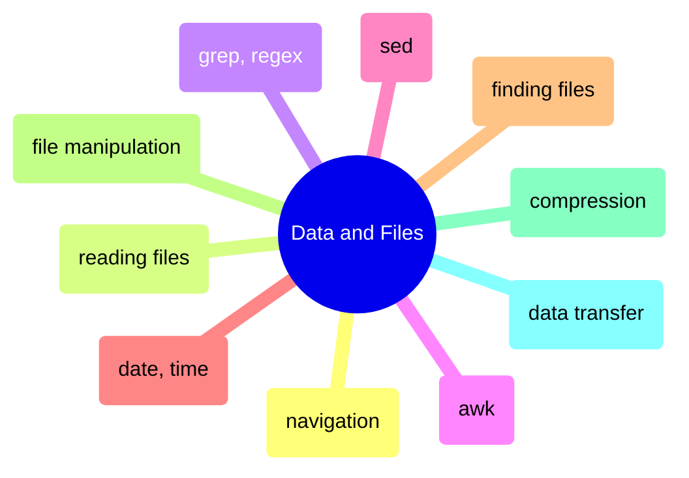
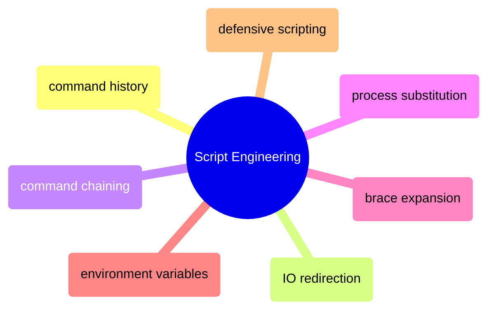
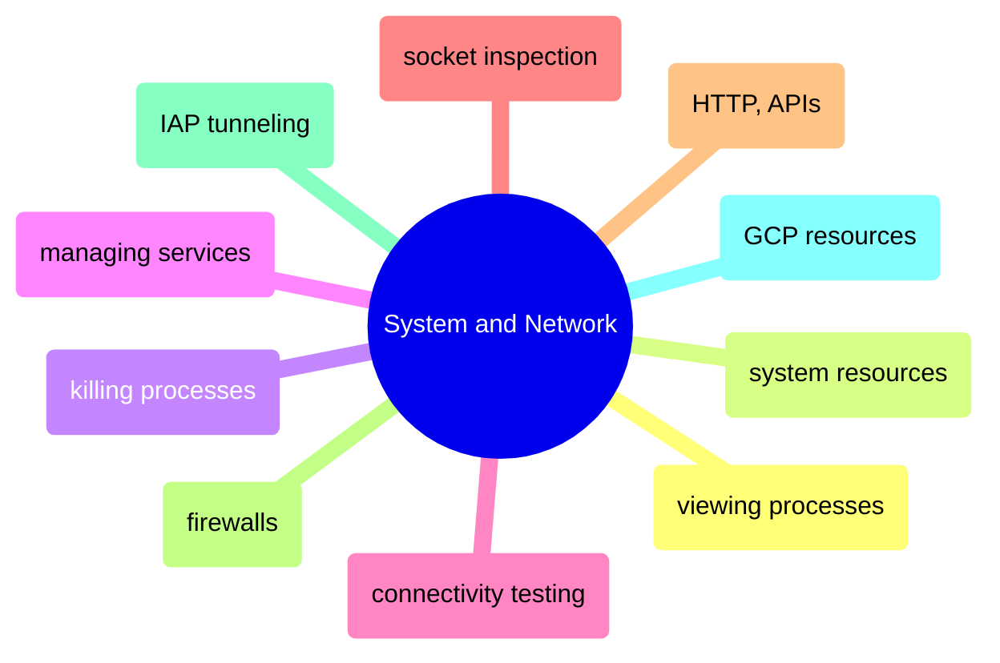

# MOC: Shell

The command line organized by what you DO with it — process data, write scripts,
or operate systems. Expand any page below to see its sections, or click through
to the full content. Every page covers both bash (Linux/macOS) and PowerShell (Windows).

> [!guide]+ Data & Files
>
> [[domain-data-and-files]]
>
> Shell commands for navigating directories, reading and transforming file content, pattern matching, and transferring data across systems.

> [!guide]+ Script Engineering
>
> [[domain-script-engineering]]
>
> Building reliable shell scripts with proper history management, IO control, chaining, expansion, environment variables, and defensive error handling.

> [!guide]+ System & Network Operations
>
> [[domain-system-and-network]]
>
> Monitoring processes and resources, managing services, testing connectivity, inspecting sockets, making HTTP requests, configuring firewalls, and connecting to GCP infrastructure.

## Shell Cross-References

- [sqlcmd-connection-and-usage](https://alp78.github.io/elysium/04-Databases/01-SQL-Server/01-Server-Operations/sqlcmd-connection-and-usage) — SQL Server command-line operations from the shell
- [gcloud-authentication](https://alp78.github.io/elysium/06-GCP/Core/gcloud-authentication) — GCP authentication underpinning all gcloud CLI work
- [container-lifecycle](https://alp78.github.io/elysium/09-Docker/container-lifecycle) — Docker container commands are shell operations
- [cron and crontab](https://alp78.github.io/elysium/12-Orchestration/Scheduling/linux-scheduling) — Scheduling shell commands for pipeline automation

