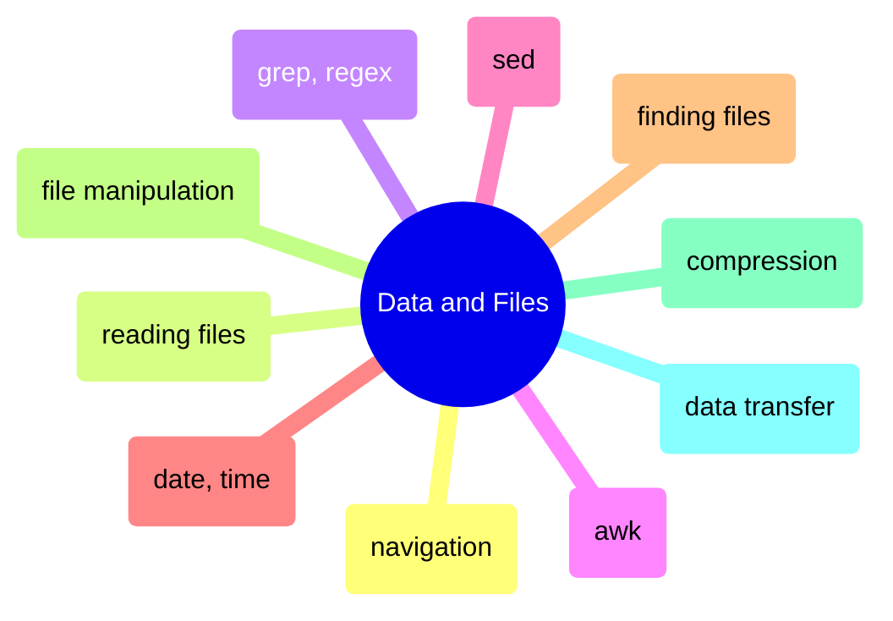
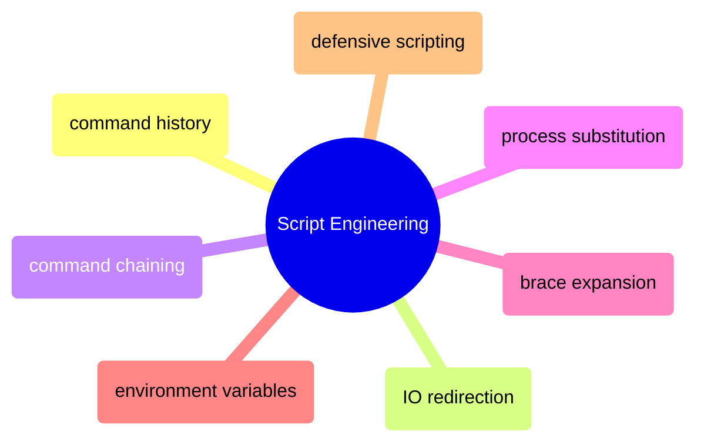
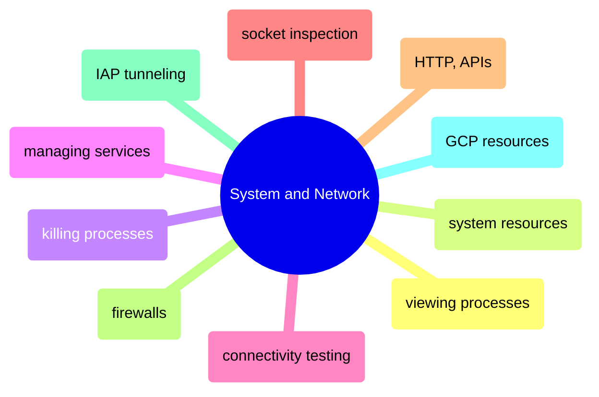

# MOC: Shell

The command line organized by what you DO with it — process data, write scripts,
or operate systems. Expand any page below to see its sections, or click through
to the full content. Every page covers both bash (Linux/macOS) and PowerShell (Windows).

> [!example]- Data & Files
>
> > [!abstract]- [[navigation-and-listing]]
> >
> > - [[navigation-and-listing#Linux — ls, du, df, tree|Directory listing and disk usage]]
> > - [[navigation-and-listing#du vs df discrepancy — why disk usage numbers don't match|du vs df discrepancy]]
> > - [[navigation-and-listing#PowerShell — Get-ChildItem, Get-PSDrive|PowerShell equivalents]]
>
> > [!abstract]- [[reading-file-contents]]
> >
> > - [[reading-file-contents#Linux — cat, head, tail, grep, awk|Reading and inspecting files]]
> > - [[reading-file-contents#tail -f — follow a log file in real-time|Following logs in real-time]]
> > - [[reading-file-contents#Analyzing a large log file during an incident — grep, awk, sort workflow|Large log file analysis]]
> > - [[reading-file-contents#PowerShell — Get-Content -Wait, Select-String for log analysis|PowerShell equivalents]]
>
> > [!abstract]- [[grep-and-pattern-matching]]
> >
> > - [[grep-and-pattern-matching#Basic Pattern Matching]]
> > - [[grep-and-pattern-matching#Recursive search]]
> > - [[grep-and-pattern-matching#Regular Expression Patterns]]
> > - [[grep-and-pattern-matching#Common data engineering regex patterns|Data engineering regex patterns]]
>
> > [!abstract]- [[awk-data-processing]]
> >
> > - [[awk-data-processing#Record and Field Model]]
> > - [[awk-data-processing#Field Extraction and Formatting]]
> > - [[awk-data-processing#Filtering and Conditions]]
> > - [[awk-data-processing#Data Transformation]]
> > - [[awk-data-processing#Data Engineering Scenarios]]
>
> > [!abstract]- [[sed-stream-editing]]
> >
> > - [[sed-stream-editing#Basic Substitution]]
> > - [[sed-stream-editing#In-Place Editing]]
> > - [[sed-stream-editing#Line Selection and Addressing]]
> > - [[sed-stream-editing#Advanced Substitution with Regex]]
>
> > [!abstract]- [[date-and-time-handling]]
> >
> > - [[date-and-time-handling#ISO 8601 — the only date format you should use in pipelines|ISO 8601 formats]]
> > - [[date-and-time-handling#Date format selection — which format for which context|Format selection by context]]
> > - [[date-and-time-handling#Terminal — Linux (Bash)|Bash]]
> > - [[date-and-time-handling#Terminal — PowerShell|PowerShell]]
> > - [[date-and-time-handling#SQL Server (T-SQL)|SQL Server]]
> > - [[date-and-time-handling#Python]]
>
> > [!abstract]- [[finding-files]]
> >
> > - [[finding-files#find -mtime -mmin — find by modification time|Find by modification time]]
> > - [[finding-files#find -size — find by file size|Find by file size]]
> > - [[finding-files#find -exec, find -delete — find and execute on results|Find and execute on results]]
> > - [[finding-files#find vs fd vs locate — tool comparison|find vs fd vs locate comparison]]
> > - [[finding-files#PowerShell — Get-ChildItem, Where-Object, Select-String|PowerShell equivalents]]
>
> > [!abstract]- [[file-manipulation]]
> >
> > - [[file-manipulation#Linux — cp, mv, rm, rsync|Copying, moving, deleting]]
> > - [[file-manipulation#rm — safe delete pattern with trash directory|Safe delete pattern]]
> > - [[file-manipulation#chmod — set file permissions with octal or symbolic notation|File permissions]]
> > - [[file-manipulation#chown — change file ownership for Docker and multi-user environments|File ownership]]
> > - [[file-manipulation#PowerShell — Copy-Item, Move-Item, Remove-Item, New-Item|PowerShell equivalents]]
>
> > [!abstract]- [[compression]]
> >
> > - [[compression#gzip — compress and decompress files|gzip]]
> > - [[compression#zstd — modern replacement with better ratio and faster speed|zstd]]
> > - [[compression#tar — archiving and compression for directories|tar archives]]
> > - [[compression#Compression strategy matrix — choosing the right algorithm for data pipelines|Strategy matrix]]
> > - [[compression#PowerShell — Compress-Archive, 7-Zip, GZipStream|PowerShell equivalents]]
>
> > [!abstract]- [[data-transfer]]
> >
> > - [[data-transfer#rsync — The Gold Standard for File Transfer|rsync]]
> > - [[data-transfer#rsync trailing slash — source path determines copy behavior|Trailing slash gotcha]]
> > - [[data-transfer#scp — Simple Remote Copy|scp]]
> > - [[data-transfer#gcloud compute scp — GCE-Native File Transfer|GCE file transfer]]
> > - [[data-transfer#gsutil and gcloud storage — Cloud Storage Transfers|Cloud Storage transfers]]

> [!example]- Script Engineering
>
> > [!abstract]- [[command-history]]
> >
> > - [[command-history#Bash History|Search, recall, re-run]]
> > - [[command-history#Building Complex Commands Incrementally|Building commands incrementally]]
> > - [[command-history#HISTSIZE, HISTCONTROL — history configuration for .bashrc|History configuration]]
> > - [[command-history#PowerShell — Get-History, PSReadLine predictive IntelliSense|PowerShell equivalents]]
>
> > [!abstract]- [[io-redirection]]
> >
> > - [[io-redirection#Bash Redirection|Stdout, stderr, stdin redirection]]
> > - [[io-redirection#Production Logging Patterns]]
> > - [[io-redirection#Redirect-before-write gotcha]]
> > - [[io-redirection#PowerShell — Out-File|PowerShell equivalents]]
>
> > [!abstract]- [[command-chaining]]
> >
> > - [[command-chaining#AND Operator|AND operator]]
> > - [[command-chaining#Semicolon|Semicolon]]
> > - [[command-chaining#OR Operator|OR operator]]
> > - [[command-chaining#AND + OR Combined|Combined try/catch pattern]]
> > - [[command-chaining#Pipe|Pipe]]
>
> > [!abstract]- [[process-substitution]]
> >
> > - [[process-substitution#Process Substitution]]
> > - [[process-substitution#Here Documents]]
> > - [[process-substitution#Here Strings]]
>
> > [!abstract]- [[brace-expansion-and-globbing]]
> >
> > - [[brace-expansion-and-globbing#Brace Expansion]]
> > - [[brace-expansion-and-globbing#Globbing — Extended Patterns|Globbing and extended patterns]]
> > - [[brace-expansion-and-globbing#shopt settings for .bashrc — extglob, globstar, failglob|Shell options for .bashrc]]
> > - [[brace-expansion-and-globbing#PowerShell — ForEach-Object loops and Get-ChildItem -Recurse for globbing|PowerShell equivalents]]
>
> > [!abstract]- [[environment-variables]]
> >
> > - [[environment-variables#The Propagation Model|Propagation model]]
> > - [[environment-variables#Bash Environment Variables|Setting and exporting]]
> > - [[environment-variables#Secure Credential Handling]]
> > - [[environment-variables#PowerShell — $env: drive, SetEnvironmentVariable for persistent env vars|PowerShell equivalents]]
>
> > [!abstract]- [[defensive-scripting]]
> >
> > - [[defensive-scripting#set -e — exit immediately on error|Exit on error]]
> > - [[defensive-scripting#set -u — treat unset variables as errors|Unset variable protection]]
> > - [[defensive-scripting#set -o pipefail — propagate pipeline failures|Pipeline failure propagation]]
> > - [[defensive-scripting#Production script template — set -euo pipefail with trap cleanup|Production script template]]
> > - [[defensive-scripting#trap EXIT — guaranteed cleanup on script exit, error, or signal|Trap cleanup on exit]]

> [!example]- System & Network Operations
>
> > [!abstract]- [[viewing-processes]]
> >
> > - [[viewing-processes#Linux — ps, top, htop, pstree|Listing and monitoring processes]]
> > - [[viewing-processes#Diagnosing a slow Airflow VM — ps, docker stats, iostat workflow|Diagnosing a slow VM]]
> > - [[viewing-processes#The D state — uninterruptible sleep processes that cannot be killed|The D state (unkillable processes)]]
> > - [[viewing-processes#PowerShell — Get-Process, Get-CimInstance for process and system monitoring|PowerShell equivalents]]
>
> > [!abstract]- [[system-resources]]
> >
> > - [[system-resources#free -h — memory usage and available RAM|Memory usage]]
> > - [[system-resources#lscpu, uptime — CPU info and load average|CPU and load average]]
> > - [[system-resources#vmstat — combined CPU, memory, IO snapshot|Combined system snapshot]]
> > - [[system-resources#SQL Server memory interpretation — why free -h looks alarming but is normal|SQL Server memory interpretation]]
> > - [[system-resources#PowerShell — Get-CimInstance, Get-Counter for memory, CPU, and disk IO|PowerShell equivalents]]
>
> > [!abstract]- [[killing-processes]]
> >
> > - [[killing-processes#pkill -f — kill by command line pattern|Kill by pattern]]
> > - [[killing-processes#kill -- -PGID — kill a process group (parent and all children)|Kill a process group]]
> > - [[killing-processes#SIGTERM → strace → SIGKILL — the correct kill escalation sequence|Correct kill escalation]]
> > - [[killing-processes#PowerShell — Stop-Process for graceful and forced termination|PowerShell equivalents]]
>
> > [!abstract]- [[managing-services]]
> >
> > - [[managing-services#systemctl, journalctl — managing systemd services and reading logs|Service lifecycle and logs]]
> > - [[managing-services#systemctl enable — start service automatically on boot|Enable on boot]]
> > - [[managing-services#Diagnosing OOM kills — when services crash with no error in their own logs|Diagnosing OOM kills]]
> > - [[managing-services#PowerShell — Start-Service, Stop-Service, Set-Service for Windows services|PowerShell equivalents]]
>
> > [!abstract]- [[connectivity-testing]]
> >
> > - [[connectivity-testing#nc (netcat) — testing port reachability|Port reachability testing]]
> > - [[connectivity-testing#dig — DNS lookup and record queries|DNS lookup]]
> > - [[connectivity-testing#mtr — combines ping + traceroute in real time|Path tracing]]
> > - [[connectivity-testing#Debugging a failed database connection — systematic network stack walkthrough|Debugging failed connections]]
> > - [[connectivity-testing#PowerShell — Test-NetConnection, Resolve-DnsName|PowerShell equivalents]]
>
> > [!abstract]- [[socket-inspection]]
> >
> > - [[socket-inspection#ss local address — 0.0.0.0 vs 127.0.0.1 determines who can connect|Listening address scope]]
> > - [[socket-inspection#Common services and default ports — SSH, SQL Server, Datadog, PostgreSQL, Airflow|Common ports reference]]
> > - [[socket-inspection#ss filtering — counting connections, TIME-WAIT, and per-client breakdown|Connection counting and filtering]]
> > - [[socket-inspection#Connection refused vs connection timed out — diagnosing the root cause|Refused vs timed out]]
> > - [[socket-inspection#PowerShell — Get-NetTCPConnection for socket inspection and connection counts|PowerShell equivalents]]
>
> > [!abstract]- [[http-requests-and-apis]]
> >
> > - [[http-requests-and-apis#curl -X POST — send JSON body|Sending requests]]
> > - [[http-requests-and-apis#curl --retry --connect-timeout — download with retry and timeout|Retry and timeout]]
> > - [[http-requests-and-apis#curl -w — timing breakdown to diagnose latency|Latency diagnosis]]
> > - [[http-requests-and-apis#curl vs wget vs Python requests — tool selection|Tool selection]]
> > - [[http-requests-and-apis#PowerShell — Invoke-RestMethod, Invoke-WebRequest for HTTP requests|PowerShell equivalents]]
>
> > [!abstract]- [[firewalls]]
> >
> > - [[firewalls#ufw — Linux Uncomplicated Firewall for port access control|Linux firewall rules]]
> > - [[firewalls#ufw default deny — the correct baseline for production servers|Default deny baseline]]
> > - [[firewalls#Defense in depth — layered firewall strategy for production databases|Defense in depth strategy]]
> > - [[firewalls#PowerShell — Windows Firewall with New-NetFirewallRule|PowerShell equivalents]]
>
> > [!abstract]- [[iap-tunneling]]
> >
> > - [[iap-tunneling#How IAP tunneling works — the full network path from workstation to VM|How IAP works]]
> > - [[iap-tunneling#IAP Tunnel Commands — All Variants|Tunnel commands]]
> > - [[iap-tunneling#Debugging IAP tunnels — API, IAM, firewall, and VM state checks|Debugging tunnels]]
> > - [[iap-tunneling#IAP vs Cloud VPN vs bastion host — choosing the right access method|IAP vs VPN vs bastion]]
>
> > [!abstract]- [[connecting-to-gcp-resources]]
> >
> > - [[connecting-to-gcp-resources#Compute Engine VMs (SSH)|Compute Engine SSH]]
> > - [[connecting-to-gcp-resources#SQL Server on Compute Engine (via IAP Tunnel)|SQL Server via IAP]]
> > - [[connecting-to-gcp-resources#BigQuery (Direct API — No Tunnel Needed)|BigQuery direct API]]
> > - [[connecting-to-gcp-resources#Cloud Run services — HTTPS endpoints with identity token auth|Cloud Run]]
> > - [[connecting-to-gcp-resources#Connection quick reference matrix — protocol and tunnel requirements by service|Connection matrix]]

## Cross-References

- [[sqlcmd-connection-and-usage]] — SQL Server command-line operations from the shell
- [[gcloud-authentication]] — GCP authentication underpinning all gcloud CLI work
- [[container-lifecycle]] — Docker container commands are shell operations
- [[linux-scheduling|cron and crontab]] — Scheduling shell commands for pipeline automation
